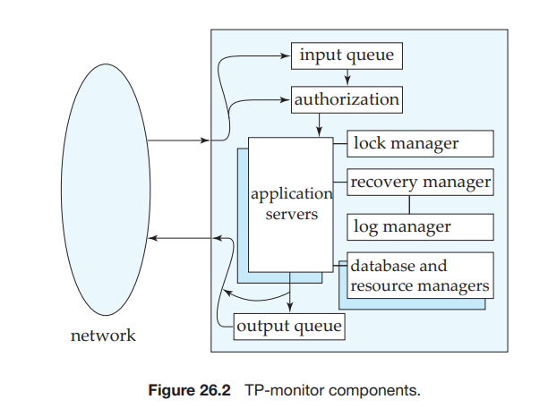

Transaction-Processing Monitors## Transaction-Processing Monitors

**Transaction-processing monitors** (**TP monitors**) are systems that were developed in the 1970s and 1980s, initially in response to a need to support a large number of remote terminals (such as airline-reservation terminals) from a single computer. The term _TP monitor_ initially stood for _teleprocessing monitor_.

TP monitors have since evolved to provide the core support for distributed transaction processing, and the term TP monitor has acquired its current meaning. The CICS TP monitor from IBM was one of the earliest TP monitors, and has been very widely used. Other TP monitors include Oracle Tuxedo and Microsoft Transaction Server.

Web application server architectures, including servlets, which we studied earlier in Section 9.3, support many of the features of TP monitors and are some- times referred to as “TP lite.” Web application servers are in widespread use, and have supplanted traditional TP monitors for many applications. However, the concepts underlying them, which we study in this section, are essentially the same.

### TP-Monitor Architectures

Large-scale transaction-processing systems are built around a client–server archi- tecture. One way of building such systems is to have a server process for each client; the server performs authentication, and then executes actions requested by the client. This **process-per-client model** is illustrated in Figure 26.1a. This model presents several problems with respect to memory utilization and processing speed:

- Per-process memory requirements are high. Even if memory for program code is shared by all processes, each process consumes memory for local data and open file descriptors, as well as for operating-system overhead, such as page tables to support virtual memory.

- The operating system divides up available CPU time among processes by switching among them; this technique is called **multitasking**. Each **context switch** between one process and the next has considerable CPU overhead; even on today’s fast systems, a context switch can take hundreds of mi- croseconds.

The above problems can be avoided by having a single-server process to which all remote clients connect; this model is called the **single-server model**,

illustrated in Figure 26.1b. Remote clients send requests to the server process, which then executes those requests. This model is also used in client–server en- vironments, where clients send requests to a single-server process. The server process handles tasks, such as user authentication, that would normally be han- dled by the operating system. To avoid blocking other clients when processing a long request for one client, the server process is **multithreaded**: The server process has a thread of control for each client, and, in effect, implements its own low-overhead multitasking. It executes code on behalf of one client for a while, then saves the internal context and switches to the code for another client. Unlike the overhead of full multitasking, the cost of switching between threads is low (typically only a few microseconds).

Systems based on the single-server model, such as the original version of the IBM CICS TP monitor and file servers such as Novel’s NetWare, successfully pro- vided high transaction rates with limited resources. However, they had problems, especially when multiple applications accessed the same database:

- Since all the applications run as a single process, there is no protection among them. A bug in one application can affect all the other applications as well. It would be best to run each application as a separate process.

- Such systems are not suited for parallel or distributed databases, since a server process cannot execute on multiple computers at once. (However, concurrent threads within a process can be supported in a shared-memory multiproces- sor system.) This is a serious drawback in large organizations, where parallel processing is critical for handling large workloads, and distributed data are becoming increasingly common.

One way to solve these problems is to run multiple application-server pro- cesses that access a common database, and to let the clients communicate with the application through a single communication process that routes requests. This model is called the **many-server, single-router model**, illustrated in Figure 26.1c. This model supports independent server processes for multiple applications; fur- ther, each application can have a pool of server processes, any one of which can handle a client session. The request can, for example, be routed to the most lightly loaded server in a pool. As before, each server process can itself be multithreaded, so that it can handle multiple clients concurrently. As a further generalization, the application servers can run on different sites of a parallel or distributed database, and the communication process can handle the coordination among the processes.

The above architecture is also widely used in Web servers. A Web server has a main process that receives HTTP requests, and then assigns the task of handling each request to a separate process (chosen from among a pool of processes). Each of the processes is itself multithreaded, so that it can handle multiple requests. The use of safe programming languages, such as Java, C#, or Visual Basic, allows Web application servers to protect threads from errors in other threads. In contrast, with a language like C or C++, errors such as memory allocation errors in one thread can cause other threads to fail.

A more general architecture has multiple processes, rather than just one, to communicate with clients. The client communication processes interact with one or more router processes, which route their requests to the appropriate server. Later-generation TP monitors therefore have a different architecture, called the **many-server, many-router model**, illustrated in Figure 26.1d. A controller process starts up the other processes and supervises their functioning. Very high perfor- mance Web-server systems also adopt such an architecture. The router processes are often network routers that direct traffic addressed to the same Internet ad- dress to different server computers, depending on where the traffic comes from. What looks like a single server with a single address to the outside world may be a collection of servers.

The detailed structure of a TP monitor appears in Figure 26.2. A TP monitor does more than simply pass messages to application servers. When messages arrive, they may have to be queued; thus, there is a **queue manager** for incoming messages. The queue may be a **durable queue**, whose entries survive system failures. Using a durable queue helps ensure that once received and stored in the queue, the messages will be processed eventually, regardless of system failures. Authorization and application-server management (for example, server start-up and routing of messages to servers) are further functions of a TP monitor. TP monitors often provide logging, recovery, and concurrency-control facilities, al- lowing application servers to implement the ACID transaction properties directly if required.

Finally, TP monitors also provide support for persistent messaging. Recall that persistent messaging (Section 19.4.3) provides a guarantee that the message will be delivered if (and only if) the transaction commits.

In addition to these facilities, many TP monitors also provided _presentation facilities_ to create menus/forms interfaces for dumb clients such as terminals;  
these facilities are no longer important since dumb clients are no longer widely used.

### Application Coordination Using TP monitors

Applications today often have to interact with multiple databases. They may also have to interact with legacy systems, such as special-purpose data-storage systems built directly on file systems. Finally, they may have to communicate with users or other applications at remote sites. Hence, they also have to interact with communication subsystems. It is important to be able to coordinate data accesses, and to implement ACID properties for transactions across such systems.

Modern TP monitors provide support for the construction and administration of such large applications, built up from multiple subsystems such as databases, legacy systems, and communication systems. A TP monitor treats each subsys- tem as a **resource manager** that provides transactional access to some set of re- sources. The interface between the TP monitor and the resource manager is defined by a set of transaction primitives, such as _begin transaction_, _commit transaction_, _abort transaction_, and _prepare to commit transaction_ (for two-phase commit). Of course, the resource manager must also provide other services, such as supplying data, to the application.

The resource-manager interface is defined by the X/Open Distributed Trans- action Processing standard. Many database systems support the X/Open stan- dards, and can act as resource managers. TP monitors—as well as other products, such as SQL systems, that support the X/Open standards—can connect to the resource managers.

In addition, services provided by a TP monitor, such as persistent messaging and durable queues, act as resource managers supporting transactions. The TP monitor can act as coordinator of two-phase commit for transactions that access these services as well as database systems. For example, when a queued update transaction is executed, an output message is delivered, and the request transac- tion is removed from the request queue. Two-phase commit between the database and the resource managers for the durable queue and persistent messaging helps ensure that, regardless of failures, either all these actions occur or none occurs.

We can also use TP monitors to administer complex client–server systems consisting of multiple servers and a large number of clients. The TP monitor coordinates activities such as system checkpoints and shutdowns. It provides se- curity and authentication of clients. It administers server pools by adding servers or removing servers without interruption of the the database system. Finally, it controls the scope of failures. If a server fails, the TP monitor can detect this failure, abort the transactions in progress, and restart the transactions. If a node fails, the TP monitor can migrate transactions to servers at other nodes, again backing out incomplete transactions. When failed nodes restart, the TP monitor can govern the recovery of the node’s resource managers.

TP monitors can be used to hide database failures in replicated systems; remote backup systems (Section 16.9) are an example of replicated systems. Transaction requests are sent to the TP monitor, which relays the messages to one of the database replicas (the primary site, in case of remote backup systems). If one site fails, the TP monitor can transparently route messages to a backup site, masking the failure of the first site.

In client–server systems, clients often interact with servers via a **remote- procedure-call** (**RPC**) mechanism, where a client invokes a procedure call, which is actually executed at the server, with the results sent back to the client. As far as the client code that invokes the RPC is concerned, the call looks like a local procedure-call invocation. TP monitor systems provide a **transactional RPC** interface to their services. In such an interface, the RPC mechanism provides calls that can be used to enclose a series of RPC calls within a transaction. Thus, updates performed by an RPC are carried out within the scope of the transaction, and can be rolled back if there is any failure.

