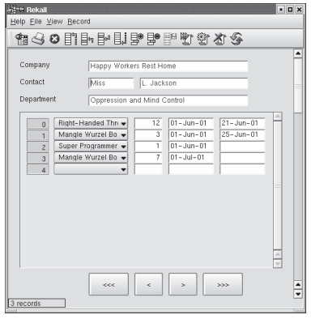
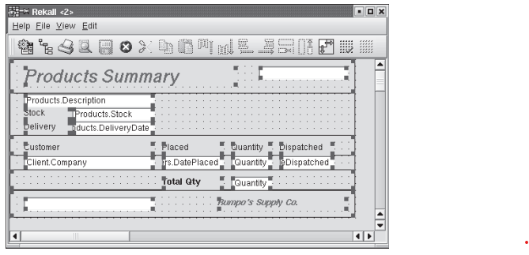

SQL Variations and Extensions## SQL Variations and Extensions

The current version of PostgreSQL supports almost all entry-level SQL-92 features, as well as many of the intermediate- and full-level features. It also supports many SQL:1999 and SQL:2003 features, including most object-relational features described in Chapter 22 and the SQL/XML features for parsed XML data described in Chapter 23. In fact, some features of the current SQL standard (such as arrays, functions, and inheritance) were pioneered by PostgreSQL or its ancestors. It lacks OLAP features (most notably, **cube** and **rollup**), but data from PostgreSQL can be easily loaded into open-source external OLAP servers (such as Mondrian) as well as commercial products.

### PostgreSQL Types

PostgreSQL has support for several nonstandard types, useful for specific appli- cation domains. Furthermore, users can define new types with the **create type**  



**Figure 27.3 Rekall: Form-design GUI.**

command. This includes new low-level base types, typically written in C (see Section 27.3.3.1).

**27.3.1.1 The PostgreSQL Type System**

PostgreSQL types fall into the following categories:

- **Base types.** Base types are also known as **abstract data types**; that is, modules that encapsulate both state and a set of operations. These are implemented below the SQL level, typically in a language such as C (see Section 27.3.3.1). Examples are **int4** (already included in PostgreSQL) or **complex** (included as an optional extension type). A base type may represent either an individual scalar value or a variable-length array of values. For each scalar type that exists in a database, PostgreSQL automatically creates an array type that holds values of the same scalar type.

- **Composite types.** These correspond to table rows; that is, they are a list of field names and their respective types. A composite type is created implicitly whenever a table is created, but users may also construct them explicitly.  



**Figure 27.4** Rekall: Report-design GUI.

- **Domains.** A domain type is defined by coupling a base type with a constraint that values of the type must satisfy. Values of the domain type and the asso- ciated base type may be used interchangeably, provided that the constraint is satisfied. A domain may also have an optional default value, whose meaning is similar to the default value of a table column.

- **Enumerated types.** These are similar to enum types used in programming languages such as C and Java. An enumerated type is essentially a fixed list of named values. In PostgreSQL, enumerated types may be converted to the textual representation of their name, but this conversion must be specified explicitly in some cases to ensure type safety. For instance, values of differ- ent enumerated types may not be compared without explicit conversion to compatible types.

- **Pseudotypes.** Currently, PostgreSQL supports the following pseudotypes: _any_, _anyarray_, _anyelement_, _anyenum_, _anynonarray cstring_, _internal_, _opaque_, _lan- guage handler_, _record_, _trigger_, and _void_. These cannot be used in composite types (and thus cannot be used for table columns), but can be used as argu- ment and return types of user-defined functions.

- **Polymorphic types.** Four of the pseudotypes _anyelement_, _anyarray_, _anynonar- ray_, and _anyenum_ are collectively known as **polymorphic**. Functions with ar- guments of these types (correspondingly called **polymorphic functions**) may operate on any actual type. PostgreSQL has a simple type-resolution scheme  

that requires that: (1) in any particular invocation of a polymorphic function, all occurrences of a polymorphic type must be bound to the same actual type (that is, a function defined as _f_ (_anyelement_, _anyelement_) may operate only on pairs of the same actual type), and (2) if the return type is polymorphic, then at least one of the arguments must be of the same polymorphic type.

### 27.3.1.2 Nonstandard Types**

The types described in this section are included in the standard distribution. Fur- thermore, thanks to the open nature of PostgreSQL, there are several contributed extension types, such as complex numbers, and ISBN/ISSNs (see Section 27.3.3).

Geometric data types (_point_, _line_, _lseg_, _box_, _polygon_, _path_, _circle_) are used in ge- ographic information systems to represent two-dimensional spatial objects such as points, line segments, polygons, paths, and circles. Numerous functions and operators are available in PostgreSQL to perform various geometric operations such as scaling, translation, rotation, and determining intersections. Further- more, PostgreSQL supports indexing of these types using R-trees (Sections 25.3.5.3 and 27.5.2.1).

Full-text searching is performed in PostgreSQL using the _tsvector_ type that represents a document and the _tsquery_ type that represents a full-text query. A _tsvector_ stores the distinct words in a document, after converting variants of each word to a common normal form (for example, removing word stems). PostgreSQL provides functions to convert raw text to a _tsvector_ and concatenate documents. A _tsquery_ specifies words to search for in candidate documents, with multiple words connected by Boolean operators. For example, the query ’index & !(tree | hash)’ finds documents that contain “index” without using the words “tree” or “hash.” PostgreSQL natively supports operations on full-text types, including language features and indexed search.

PostgreSQL offers data types to store network addresses. These data types allow network-management applications to use a PostgreSQL database as their data store. For those familiar with computer networking, we provide a brief summary of this feature here. Separate types exist for IPv4, IPv6, and Media Access Control (MAC) addresses (_cidr_, _inet_ and _macaddr_, respectively). Both _inet_ and _cidr_ types can store IPv4 and IPv6 addresses, with optional subnet masks. Their main difference is in input/output formatting, as well as the restriction that classless Internet domain routing (CIDR) addresses do not accept values with nonzero bits to the right of the netmask. The _macaddr_ type is used to store MAC addresses (typically, Ethernet card hardware addresses). PostgreSQL supports indexing and sorting on these types, as well as a set of operations (including subnet testing, and mapping MAC addresses to hardware manufacturer names). Furthermore, these types offer input-error checking. Thus, they are preferable over plain text fields.

The PostgreSQL _bit_ type can store both fixed- and variable-length strings of 1s and 0s. PostgreSQL supports bit-logical operators and string-manipulation functions for these values.  

### Rules and Other Active-Database Features

PostgreSQL supports SQL constraints and triggers (and stored procedures; see Section 27.3.3). Furthermore, it features query-rewriting rules that can be declared on the server.

PostgreSQL allows **check** constraints, **not null** constraints, and primary-key and foreign-key constraints (with restricting and cascading deletes).

Like many other relational database systems, PostgreSQL supports triggers, which are useful for nontrivial constraints and consistency checking or enforce- ment. Trigger functions can be written in a procedural language such as PL/pgSQL (see Section 27.3.3.4) or in C, but not in plain SQL. Triggers can execute before or after **insert**, **update**, or **delete** operations and either once per modified row, or once per SQL statement.

The PostgreSQL rules system allows users to define query-rewrite rules on the database server. Unlike stored procedures and triggers, the rule system intervenes between the query parser and the planner and modifies queries on the basis of the set of rules. After the original query tree has been transformed into one or more trees, they are passed to the query planner. Thus, the planner has all the necessary information (tables to be scanned, relationships between them, qualifications, join information, and so forth) and can come up with an efficient execution plan, even when complex rules are involved.

The general syntax for declaring rules is:
```
**create rule** _rule name_ **as 
on** { **select** | **insert** | **update** | **delete** }
 **to** table [ **where** _rule qualification_ ] **do** [ **instead** ] { **nothing** | command_ | (_command ; command ... ) }
```
The rest of this section provides examples that illustrate the rule system’s capa- bilities. More details on how rules are matched to query trees and how the latter are subsequently transformed can be found in the PostgreSQL documentation (see the bibliographical notes). The rule system is implemented in the rewrite phase of query processing and explained in Section 27.6.1.

First, PostgreSQL uses rules to implement views. A view definition such as:

**create view** _myview_ **as select** \* **from** _mytab_;

is converted into the following rule definition:

**create table** _myview_ (_same column list as mytab_); **create rule** _return_ **as on select to** _myview_ **do instead**

**select** * **from** _mytab_;

Queries on _myview_ are transformed before execution to queries on the underlying table _mytab_. The **create view** syntax is considered better programming form in this case, since it is more concise and it also prevents creation of views that  

**27.3 SQL Variations and Extensions 1131**

reference each other (which is possible if rules are carelessly declared, resulting in potentially confusing runtime errors). However, rules can be used to define update actions on views explicitly (**create view** statements do not allow this).

As another example, consider the case where the user wants to log all increases of instructor salaries. This could be achieved by a rule such as:

**create rule** _salary audit_ **as on update to** _instructor_ **where new**._salary <>_ **old**._salary_ **do insert into** _salary audit_ **values** (current timestamp, current user,

**new**._name_, **old**._salary_, **new**._salary)_;

Finally, we give a slightly more complicated insert/update rule. Assume that pending salary increases are stored in a table _salary increases_(_name, increase_). We can declare a “dummy” table _approved increases_ with the same fields and then define the following rule:

**create rule** _approved increases insert_ **as on insert to** _approved increases_ **do instead update** _instructor_

**set** _salary_ \= _salary_ \+ **new**._increase_ **where** _name_ \= **new**._name_;

Then the following query:

**insert into** _approved increases_ **select** * **from** _salary increases_;

will update all salaries in the _instructor_ table at once. Since the **instead** keyword was specified in the rule, the _approved increases_ table is unchanged.

There is some overlap between the functionality provided by rules and per- row triggers. The PostgreSQL rule system can be used to implement most triggers, but some kinds of constraints (in particular, foreign keys) cannot be implemented by rules. Also, triggers have the added ability to generate error messages to signal constraint violations, whereas a rule may only enforce data integrity by silently suppressing invalid values. On the other hand, triggers cannot be used for the **update** or **delete** actions that rules enable on views. Since there is no real data in a view relation, the trigger would never be called.

An important difference between triggers and views is that a trigger is exe- cuted iteratively for every affected row. A rule, on the other hand, manipulates the query tree before query planning. So if a statement affects many rows, a rule is far more efficient than a trigger.

The implementation of triggers and constraints in PostgreSQL is outlined briefly in Section 27.6.4.  

### Extensibility

Like most relational database systems, PostgreSQL stores information about data- bases, tables, columns, and so forth, in what are commonly known as **system catalogs**, which appear to the user as normal tables. Other relational database systems are typically extended by changing hard-coded procedures in the source code or by loading special extension modules written by the vendor.

Unlike most relational database systems, PostgreSQL goes one step further and stores much more information in its catalogs: not only information about tables and columns, but also information about data types, functions, access methods, and so on. Therefore, PostgreSQL is easy for users to extend and facilitates rapid prototyping of new applications and storage structures. PostgreSQL can also in- corporate user-written code into the server, through dynamic loading of shared objects. This provides an alternative approach to writing extensions that can be used when catalog-based extensions are not sufficient.

Furthermore, the contribmodule of the PostgreSQL distribution includes nu- merous user functions (for example, array iterators, fuzzy string matching, cryp- tographic functions), base types (for example, encrypted passwords, ISBN/ISSNs, _n_\-dimensional cubes) and index extensions (for example, RD-trees, indexing for hierarchical labels). Thanks to the open nature of PostgreSQL, there is a large community of PostgreSQL professionals and enthusiasts who also actively extend PostgreSQL on an almost daily basis. Extension types are identical in functionality to the built-in types (see also Section 27.3.1.2); the latter are simply already linked into the server and preregistered in the system catalog. Similarly, this is the only difference between built-in and extension functions.

### 27.3.3.1 Types

PostgreSQL allows users to define composite types, enumeration types, and even new base types.

A composite-type definition is similar to a table definition (in fact, the latter implicitly does the former). Stand-alone composite types are typically useful for function arguments. For example, the definition:

**create type** city_t **as** (name **varchar**(80), state **char**(2));

allows functions to accept and return _city t_ tuples, even if there is no table that explicitly contains rows of this type.

Enumeration types are easy to define, by simply listing the names of the values. The following example creates an enumerated type to represent the status of a software product.

**create type** status_t **as enum** (’alpha’, ’beta’, ’release’);

The order of listed names is significant in comparing values of an enumerated type. This can be useful for a statement such as:  

**27.3 SQL Variations and Extensions 1133**

**select** name **from** products **where** status > ’alpha’;

which retrieves the names of products that have moved past the alpha stage. Adding base types to PostgreSQL is straightforward; an example can be found

in complex.sql and complex.c in the tutorials of the PostgreSQL distribution. The base type can be declared in C, for example:
```
typedef struct Complex {
     double x; double y;
    } Complex;
```
The next step is to define functions to read and write values of the new type in text format (see Section 27.3.3.2). Subsequently, the new type can be registered using the statement:
```
**create type** complex { 
    internallength = 16,
     input = complexin,
      output = complex out, alignment = **double**
      };
```
assuming the text I/O functions have been registered as _complex in_ and _complex out_.

The user has the option of defining binary I/O functions as well (for more efficient data dumping). Extension types can be used like the existing base types of PostgreSQL. In fact, their only difference is that the extension types are dynam- ically loaded and linked into the server. Furthermore, indices may be extended easily to handle new base types; see Section 27.3.3.3.

### 27.3.3.2 Functions

PostgreSQL allows users to define functions that are stored and executed on the server. PostgreSQL also supports function overloading (that is, functions may be declared by using the same name but with arguments of different types). Func- tions can be written as plain SQL statements, or in several procedural languages (covered in Section 27.3.3.4). Finally, PostgreSQL has an application programmer interface for adding functions written in C (explained in this section).

User-defined functions can be written in C (or a language with compatible calling conventions, such as C++). The actual coding conventions are essentially the same for dynamically loaded, user-defined functions, as well as for internal functions (which are statically linked into the server). Hence, the standard internal function library is a rich source of coding examples for user-defined C functions.  


Once the shared library containing the function has been created, a declaration such as the following registers it on the server:

**create function** complex out(complex) **returns cstring** 
**as** ’shared object_filename’ **language C immutable strict**;

The entry point to the shared object file is assumed to be the same as the SQL function name (here, _complex out_), unless otherwise specified.

The example here continues the one from Section 27.3.3.1. The application program interface hides most of PostgreSQL’s internal details. Hence, the actual C code for the above text output function of _complex_ values is quite simple:

PG_FUNCTION_INFO_V1(complex out);
 Datum complex_out(pg_function_args) {
     Complex *complex = (Complex *) pg getarg pointer(0); 
     char *result;
     result = (char *) palloc(100);
      snprintf(result, 100,"(%g,%g)",     complex−>x, complex−>y);
       pg return_cstring(result);
       }

The first line declares the function complex out, and the following lines imple- ment the output function. The code uses several PostgreSQL-specific constructs, such as the palloc function, which dynamically allocates memory controlled by PostgreSQL’s memory manager. More details may be found in the PostgreSQL documentation (see the bibliographical notes).

Aggregate functions in PostgreSQL operate by updating a **state value** via a **state transition** function that is called for each tuple value in the aggregation group. For example, the state for the **avg** operator consists of the running sum and the count of values. As each tuple arrives, the transition function should simply add its value to the running sum and increment the count by one. Optionally, a _final_ function may be called to compute the return value based on the state information. For example, the final function for **avg** would simply divide the running sum by the count and return it.

Thus, defining a new aggregate is as simple as defining these two functions. For the _complex_ type example, if _complex add_ is a user-defined function that takes two complex arguments and returns their sum, then the **sum** aggregate operator can be extended to complex numbers using the simple declaration:  

**27.3 SQL Variations and Extensions 1135**

**create aggregate** sum (
     sfunc = complex_add,
      basetype = complex,
       stype = complex,
        initcond= ’(0,0)’
        );

Note the use of function overloading: PostgreSQL will call the appropriate _sum_ aggregate function, on the basis of the actual type of its argument during invo- cation. The _basetype_ is the argument type and _stype_ is the state value type. In this case, a final function is unnecessary, since the return value is the state value itself (that is, the running sum in both cases).

User-defined functions can also be invoked by using operator syntax. Beyond simple “syntactic sugar” for function invocation, operator declarations can also provide hints to the query optimizer in order to improve performance. These hints may include information about commutativity, restriction and join selectivity estimation, and various other properties related to join algorithms.

### 27.3.3.3 Index Extensions

PostgreSQL currently supports the usual B-tree and hash indices, as well as two index methods that are unique to PostgreSQL: the Generalized Search Tree (GiST) and the Generalized Inverted Index (GIN), which is useful for full-text indexing (these index structures are explained in Section 27.5.2.1). Finally, PostgreSQL pro- vides indexing of two-dimensional spatial objects with an R-tree index, which is implemented using a GiST index behind the scenes. All of these can be easily extended to accommodate new base types.

Adding index extensions for a type requires definition of an **operator class**, which encapsulates the following:

- **Index-method strategies.** These are a set of operators that can be used as qualifiers in **where** clauses. The particular set depends on the index type. For example, B-tree indices can retrieve ranges of objects, so the set consists of five operators (<, <\=, =, \>\=, and \>), all of which can appear in a **where** clause involving a B-tree index. A hash index allows only equality testing and an R-tree index allows a number of spatial relationships (for example contained, to-the-left, and so forth).

- **Index-method support routines.** The above set of operators is typically not sufficient for the operation of the index. For example, a hash index requires a function to compute the hash value for each object. An R-tree index needs to be able to compute intersections and unions and to estimate the size of indexed objects.  


For example, if the following functions and operators are defined to compare the magnitude of _complex_ numbers (see Section 27.3.3.1), then we can make such objects indexable by the following declaration:

**create operator class** complex_abs_ops **default for type** complex **using btree as**

**operator** 1 < (complex, complex), **operator** 2 <= (_complex, complex), **operator** 3 = (complex, complex), **operator** 4 >= (complex, complex), **operator** 5 > (complex, complex), **function** 1 complex_abs_cmp(complex, complex);

The **operator** statements define the strategy methods and the **function** statements define the support methods.

### 27.3.3.4 Procedural Languages

Stored functions and procedures can be written in a number of procedural lan- guages. Furthermore, PostgreSQL defines an application programmer interface for hooking up any programming language for this purpose. Programming lan- guages can be registered on demand and are either **trusted** or **untrusted**. The latter allow unlimited access to the DBMS and the file system, and writing stored functions in them requires superuser privileges.

- **PL/pgSQL**. This is a trusted language that adds procedural programming capabilities (for example, variables and control flow) to SQL. It is very similar to Oracle’s PL/SQL. Although code cannot be transferred verbatim from one to the other, porting is usually simple.

- **PL/Tcl**, **PL/Perl**, and **PL/Python**. These leverage the power of Tcl, Perl, and Python to write stored functions and procedures on the server. The first two come in both trusted and untrusted versions (PL/Tcl, PL/Perl and PL/TclU, PL/PerlU, respectively), while PL/Python is untrusted at the time of this writing. Each of these has bindings that allow access to the database system via a language-specific interface.

### 27.3.3.5 Server Programming Interface

The server programming interface (SPI) is an application programmer interface that allows user-defined C functions (see Section 27.3.3.2) to run arbitrary SQL commands inside their functions. This gives writers of user-defined functions the ability to implement only essential parts in C and easily leverage the full power of the relational database system engine to do most of the work.  

**27.4 Transaction Management in PostgreSQL 1137**

## SQL Variations and Extensions

DB2 provides support for a rich set of SQL features for various aspects of database processing. Many of the DB2 features and syntax have provided the basis for standards in SQL-92, or SQL:1999. In this section, we highlight the XML object- relational and application-integration features in DB2 UDB version 8, along with some new features from version 9.

### XML Features

A rich set of XML functions have been included in DB2. The following is a list of several important XML functions that can be used in SQL, as part of the SQL/XML extension to SQL (described earlier in Section 23.6.3):

- **xmlelement.** Constructs an element tag with given name. For example the function call, **xmlelement**(_book_) creates the book element.

- **xmlattributes.** Constructs the set of attributes for an element.

- **xmlforest.** Constructs a sequence of XML elements from arguments.

- **xmlconcat.** Returns the concatenation of a variable number of XML arguments.

- **xmlserialize.** Provides a character-oriented serialized version of the argument.  

**select xmlemement**(**name** ’PO’, **xmlattributes**(_poid_, _orderdate_), (**select xmlagg**(**xmlelement**(**name** ’item’,

**xmlattributes**(_itemid_, _qty_, _shipdate_), (**select xmlelement**(**name** ’itemdesc’,

**xmlattributes**(_name_, _price_)) **from** _product_ **where** _product.itemid_ \= _lineitem.itemid_)))

**from** _lineitem_ **where** _lineitem.poid_ \= _orders.poid_))

**from** _orders_ **where** _orders.poid_\= 349;

**Figure 29.2** DB2 SQL XML query.

- **xmlagg.** Returns a concatenation of a set of XML values.

- **xml2clob.** Constructs a character large object (**clob**) representation of the XML. This **clob** can then be retrieved by SQL applications.

The XML functions can be incorporated into SQL effectively to provide ex- tensive XML manipulation capabilities. For instance, suppose that one needs to construct a purchase-order XML document from relational tables _orders_, _lineitem_, and _product_ for order number 349. In Figure 29.2, we show an SQL query with XML extensions that can be used to create such a purchase order. The resultant output is as shown in Figure 29.3.

Version 9 of DB2 supports native storage of XML data as an **xml** type. and native support for the XQuery language. Specialized storage, indexing, query processing and optimization techniques have been introduced for efficient processing of XML data and queries in the XQuery language, and APIs have been extended to deal with XML data and XQuery.

### Support for Data Types

DB2 provides support for user-defined data types (UDTs). Users can define _distinct_ or _structured_ data types. Distinct data types are based on DB2 built-in data types.
```
<PO poid = "349" orderdate = "2004-10-01"_\> <item itemid="1", qty="10", shipdate="2004-10-03"_\> <itemdesc name = "IBM ThinkPad T41", Price = "1000.00 USD"/_\> <item\>

<PO\>
```
**Figure 29.3** Purchase order in XML for id=349.  

However, the user can define additional or alternative semantics for these new types. For example, the user can define a distinct data type called _us dollar_, using:

**create distinct type** _us dollar_ **as decimal**(9,2);

Subsequently, the user can create a field (e.g., _price_) in a table with type _us dollar_. Queries may now use the typed field in predicates such as the following:

**select** _product_ **from** _us sales_ **where** _price > us dollar_(1000);

Structured data types are complex objects that usually consist of two or more attributes. For example, one can use the following DDL to create a structured type called _department t_:

**create type** _department t_ **as** (_deptname_ **varchar**(32),

_depthead_ **varchar**(32), _faculty count_ **integer**)

**mode db2/sql**;

**create type** _point t_ **as** (_x coord_ **float,**

_y coord_ **float) mode db2/sql**;

Structured types can be used to define _typed tables_:

**create table** _dept_ **of** _department t_;

One can create a type hierarchy and tables in the hierarchy that can inherit specific methods and privileges. Structured types can also be used to define nested attributes inside a column of a table. Although such a definition would violate normalization rules, it may be suitable for object-oriented applications that rely on encapsulation and well-defined methods on objects.

**29.3.3 User-Defined Functions and Methods**

Another important feature is the ability for users to define their own functions and methods. These functions can subsequently be included in SQL statements and queries. Functions can generate scalars (single attribute) or tables (multiat- tribute row) as their result. Users can register functions (scalar or table) using the **create function** statement. The functions can be written in common program- ming languages such as C or Java or scripts such as REXX or PERL. User-defined functions (UDFs) can operate in fenced or unfenced modes. In fenced mode, the functions are executed by a separate thread in its own address space. In unfenced  


**create function** db2gse.GsegeFilterDist ( _operation_ **integer**, _g1XMin_ **double**, _g1XMax_ **double**, _g1YMin_ **double**, _g1YMax_ **double**, _dist_ **double**, _g2XMin_ **double**, _g2XMax_ **double**, _g2YMin_ **double**, _g2YMax_ **double** )

**returns integer specific** db2gse.GsegeFilterDist **external name** ’db2gsefn!gsegeFilterDist’ **language C parameter style db2 sql deterministic not fenced threadsafe called on null input no sql no external action no scratchpad no final call allow parallel no dbinfo**;

**Figure 29.4** Definition of a UDF.

mode, the database-processing agent is allowed to execute the function in the server’s address space. UDFs can define a scratch pad (work) area where they can maintain local and static variables across different invocations. Thus, UDFs can perform powerful manipulations of intermediate rows that are its inputs. In Figure 29.4, we show a definition of a UDF, _db2gse.GsegeFilterDist_, in DB2 pointing to a particular external method that performs the actual function.

Methods are another feature that define the behavior of objects. Unlike UDFs, they are tightly encapsulated with a particular structured data type. Methods are registered by using the **create method** statement.

DB2 also supports procedural extensions to SQL, using the DB2’s SQL PL exten- sion, including procedures, functions, and control flow. Procedural features of the SQL standard are described in Section 5.2). In addition, as of version 9.7, DB2 also supports much of Oracle’s PL/SQL language, for compatibility with applications developed on Oracle.

**29.3.4 Large Objects**

New database applications require the ability to manipulate text, images, video, and other types of data that are typically quite large in size. DB2 supports these requirements by providing three different large object (LOB) types. Each LOB can be as large as two gigabytes in size. The large objects in DB2 are (1) binary large objects (**blob**s), (2) single byte character large objects (**clob**s), and (3) double byte character large objects (**dbclob**s). DB2 organizes these LOBs as separate objects with  

**29.3 SQL Variations and Extensions 1199**

**create index extension** _db2gse.spatial index_( _gS1_ **double**, _gS2_ **double**, _gS3_ **double**)

**from source key**(_geometry db2gse.ST Geometry_) **generate key using**

_db2gse.GseGridIdxKeyGen_(_geometry..srid_, _geometry..xMin_, _geometry..xMax_, _geometry..yMin_, _geometry..yMax_, _gS1_, _gS2_, _gS3_)

**with target key**(_srsId_ **integer**, _lvl_ **integer**, _gX_ **integer**, _gY_ **integer**, _xMin_ **double**, _xMax_ **double**, _yMin_ **double**, _yMax_ **double**)

**search methods** <conditions_\> <actions\>

**Figure 29.5** Spatial index extension in DB2.

each row in the table maintaining pointers to its corresponding LOBs. Users can register UDFs that manipulate these LOBs according to application requirements.

**29.3.5 Indexing Extensions and Constraints**

A recent feature of DB2 enables users to create index extensions to generate keys from structured data types by using the **create index extension** statement. For ex- ample, one can create an index on an attribute based on the _department t_ data type defined earlier by generating keys, using the department name. DB2’s spatial ex- tender uses the index extension method to create indices as shown in Figure 29.5.

Finally, users can take advantage of the rich set of constraint checking features available in DB2 for enforcing object semantics such as uniqueness, validity, and inheritance.

**29.3.6 Web Services**

DB2 can integrate Web services as producer or consumer. A Web service can be defined to invoke DB2, using SQL statements. The resultant Web-service call is processed by an embedded Web-service engine in DB2 and the appropriate SOAP response generated. For example, if there is a Web service called _GetRecentActiv- ity_(_cust id_) that invokes the following SQL, the result should be the last transaction for this customer.

**select** _trn id_, _amount_, _date_ **from** _transactions_ **where** _cust id_ \= <input\> **order by** _date_ **fetch first** 1 **row only**;  


The following SQL shows DB2 acting as a consumer of a Web service. In this example, the _GetQuote()_ user-defined function is a Web service. DB2 makes the Web-service call using an embedded Web-service engine. In this case, _GetQuote_ returns a numeric quote value for each _ticker id_ in the portfolio table.

**select** _ticker id_, _GetQuote_(_ticker id_) **from** _portfolio_;

**29.3.7 Other Features**

DB2 also supports IBM’s Websphere MQ product by defining appropriate UDFs. UDFs are defined for both read and write interfaces. These UDFs can be incorpo- rated in SQL for reading from or writing to message queues.

From version 9, DB2 supports fine-grained authorization through the label- based access control feature, which plays a role similar to Oracle’s Virtual Private Database (described earlier in Section 9.7.5).

**29.4 Storage and Indexing**

The storage and indexing architecture in DB2 consists of the file-system or disk- management layer, the services to manage the buffer pools, data objects such as tables, LOBs, index objects, and concurrency and recovery managers. We overview the general storage architecture in this section. In addition, we describe a new feature in DB2 version 8 called multidimensional clustering in the following sec- tion.

**29.4.1 Storage Architecture**

DB2 provides storage abstractions for managing logical database tables usefully in a multinode and multidisk environment. _Nodegroups_ can be defined to support table partitioning across a specific set of nodes in a multinode system. This allows complete flexibility in allocating table partitions to different nodes in a system. For example, large tables may be partitioned across all nodes in a system while small tables may reside on a single node.

Within a node, DB2 uses _tablespaces_ to organize tables. A tablespace consists of one or more _containers_, which are references to directories, devices, or files. A tablespace may contain zero or more database objects such as tables, indices, or LOBs. Figure 29.6 illustrates these concepts. In this figure, two tablespaces have been defined for a nodegroup. The _humanres_ tablespace is assigned four containers, while the _sched_ tablespace has only one container. The _employee_ and _department_ tables are assigned to the _humanres_ tablespace, while the _project_ table is in the _sched_ tablespace. Striping is used to allocate fragments (extents) of the _employee_ and _department_ table to the containers of the _humanres_ tablespace. DB2 permits the administrator to create either _system_\-managed or _DBMS_\-managed tablespaces. System-managed spaces (SMS) are directories or file systems that are maintained by the underlying operating system. In SMS, DB2 creates file objects  

**29.4 Storage and Indexing 1201**

Nodegroup MyDepts

Tablespace _humanres_ Tablespace _sched_

Containers

_department employee project_

**Figure 29.6** Tablespaces and containers in DB2.

in the directories and allocates data to each of the files. Data-managed spaces (DMS) are raw devices or preallocated files that are then controlled by DB2. The size of these containers can never grow or shrink. DB2 creates allocation maps and manages the DMS tablespace itself. In both cases, an extent of pages is the unit of space management. The administrator can choose the extent size for a tablespace.

DB2 supports striping across the different containers as a default behavior. For example, when data are inserted into a newly created table, the first extent is assigned to a container. Once the extent is full, the next data items are allocated to the next container in round-robin fashion. Striping provides two significant benefits: parallel I/O and load balancing.

**29.4.2 Buffer Pools**

One or more buffer pools may be associated with each tablespace for managing different objects such as data and indices. The buffer pool is a common shared data area that maintains memory copies of objects. These objects are typically organized as pages for management in the buffer pool. DB2 allows buffer pools to be defined by SQL statements. DB2 version 8 has the ability to grow or shrink buffer pools online and also automatically by choosing the **automatic** setting for the buffer pool configuration parameter. An administrator can add more pages to a buffer pool or decrease its size without quiescing the database activity.

**create bufferpool** <buffer-pool\> .... **alter bufferpool** <buffer-pool\> **size** <n\>  


0

2

500

page 0 contains a set of internal records (e.g., FSCR)

user Records

every 500th page contains another FSCR

1

3

more user records RID (Record ID) = Page 3, Slot 2

K

C 3, 2

K

A K RIDRID S RID Leaf Pages

Logical Table View Logical Index View

RID

RID

C RID

**Figure 29.7** Logical view of tables and indices in DB2.

DB2 also supports prefetching and asynchronous writes using separate threads. The data manager component triggers prefetch of data and index pages based on the query access patterns. For instance, a table scan always triggers prefetch of data pages. Index scans can trigger prefetch of index pages as well as data pages if they are being accessed in a clustered fashion. The number of prefetchers and the prefetch size are configurable parameters that need to be initialized according to the number of disks or containers in the tablespace.

**29.4.3 Tables, Records, and Indices**

DB2 organizes the relational data as records in pages. Figure 29.7 shows the logical view of a table and an associated index. The table consists of a set of pages. Each page consists of a set of records that are either user data records or special system records. Page zero of the table contains special system records about the table and its status. DB2 uses a space-map record called free space control record (FSCR) to find free space in the table. The FSCR record usually contains a space map for 500 pages. The FSCR entry is a bit mask that provides a rough indication of the possibility of free space in a page. The insert or update algorithm must validate the FSCR entries by performing a physical check of the available space in a page.

Indices are also organized as pages containing index records and pointers to child and sibling pages. DB2 provides support for the B+-tree index mechanisms internally. The B+-tree index contains internal pages and leaf pages. The indices have bidirectional pointers at the leaf level to support forward and reverse scans. Leaf pages contain index entries that point to records in the table. Each record in the table can be uniquely identified by using its page and slot information, which are called the _record ID_ or RID.  

**29.5 Multidimensional Clustering 1203**

Embedded free space (usable aer on-line page reorganization\*)

\*Exception: Any space reserved by an uncommited delete is not usable

Free space (usable without page reorganization\*)

\-1

Record 0 Record 0

Record 2

Page Header Page Header

**3800 3400 3800 3700**

Page 473 Page 1056

473,2

set on tablespace creation

1056 1

3 bytes 1 byte

**page# slot#**

**Figure 29.8** Data page and record layout in DB2.

DB2 supports “include columns” in the index definition, as:

**create unique index** I1 **on** T1 (C1) **include** (C2);

The included index columns enable DB2 to extend the use of “index-only” query-processing techniques whenever possible. Additional directives such as **minpctused** and **pctfree** can be used to control the merge and initial space allo- cation of index pages.

Figure 29.8 shows the typical data page format in DB2. Each data page contains a header and a slot directory. The slot directory is an array of 255 entries that points to record offsets in the page. The figure shows that page number 473 contains record zero at offset 3800 and record 2 at offset 3400. Page 1056 contains record 1 at offset 3700, which is a forward pointer to the record <473,2\>. Hence, record <473,2\> is an overflow record that was created as a result of an update operation of the original record <1056,1\>. DB2 supports different page sizes such as 4, 8, 16, and 32 kilobytes. However, each page may contain only 255 user records in it. Larger page sizes are useful in applications such as data warehousing, where the table contains many columns. Smaller page sizes are useful for operational data with frequent updates.

**29.5 Multidimensional Clustering**

This section provides a brief overview of the main features of MDC. With this feature, a DB2 table may be created by specifying one or more keys as dimensions  


along which to cluster the table’s data. DB2 includes a clause called **organize by dimensions** for this purpose. For example, the following DDL describes a sales table organized by _storeId_, _year_(_orderDate_), and _itemId_ attributes as dimensions.

**create table** _sales_(_storeId_ **int**, _orderDate_ **date**, _shipDate_ **date**, _receiptDate_ **date**, _region_ **int**, _itemId_ **int**, _price_ **float** _yearOd_ **int generated always as** _year_(_orderDate_))

**organized by dimensions** (_region_, _yearOd_, _itemId_);

Each of these dimensions may consist of one or more columns, similar to index keys. In fact, a “dimension block index” (described below) is automatically created for each of the dimensions specified and is used to access data quickly and efficiently. A composite block index, containing all dimension key columns, is created automatically if necessary, and is used to maintain the clustering of data over insert and update activity.

Every unique combination of dimension values forms a logical “cell,” that is physically organized as blocks of pages, where a block is a set of consecutive pages on disk. The set of blocks that contain pages with data having a certain key value of one of the dimension block indices is called a “slice.” Every page of the table is part of exactly one block, and all blocks of the table consist of the same number of pages, namely, the block size. DB2 has associated the block size with the extent size of the tablespace so that block boundaries line up with extent boundaries.

Figure 29.9 illustrates these concepts. This MDC table is clustered along the dimensions _year_(_orderDate_),1 _region_, and _itemId_. The figure shows a simple logical cube with only two values for each dimension attribute. In reality, dimension attributes can easily extend to large numbers of values without requiring any ad- ministration. Logical cells are represented by the subcubes in the figure. Records in the table are stored in blocks, which contain an extent’s worth of consecutive pages on disk. In the diagram, a block is represented by a shaded oval, and is numbered according to the logical order of allocated extents in the table. We show only a few blocks of data for the cell identified by the dimension values <1997,Canada,2\>. A column or row in the grid represents a slice for a particular dimension. For example, all records containing the value “Canada” in the _region_ dimension are found in the blocks contained in the slice defined by the “Canada” column in the cube. In fact, each block in this slice only contains records having “Canada” in the _region_ field.

1Dimensions can be created by using a generated function.  

**29.5 Multidimensional Clustering 1205**

1997, Mexico,

1

1997, Canada,

2

1997, Canada,

1

1997, Mexico,

2

1998, Canada,

2

1998, Mexico,

21997, Mexico,

2

_year(orderD ate)itemId_

_re gi_

_on_

31 45

127

1997

19981

2

Mexico

Canada

**Figure 29.9** Logical view of physical layout of an MDC table.

**29.5.1 Block Indices**

In our example, a dimension block index is created on each of the _year_(_orderDate_), _region_, and _itemId_ attributes. Each dimension block index is structured in the same manner as a traditional B-tree index except that, at the leaf level, the keys point to a _block identifier_ (BID) instead of a record identifier (RID). Since each block contains potentially many pages of records, these block indices are much smaller than RID indices and need be updated only when a new block is added to a cell or existing blocks are emptied and removed from a cell. A slice, or the set of blocks containing pages with all records having a particular key value in a dimension, are represented in the associated dimension block index by a BID list for that key value. Figure 29.10 illustrates slices of blocks for specific values of _region_ and _itemId_ dimensions, respectively.

In the example above, to find the slice containing all records with “Canada” for the _region_ dimension, we would look up this key value in the _region_ dimension block index and find a key as shown in Figure 29.10a. This key points to the exact set of BIDs for the particular value.

**29.5.2 Block Map**

A block map is also associated with the table. This map records the state of each block belonging to the table. A block may be in a number of states such as **in use**, **free**, **loaded**, **requiring constraint enforcement**. The states of the block are used  


Canada 21 31 45 77 127 376 501 719

Key

Key

BID List

BID List

(a) Dimension block index entry for _region_ 'Canada'

(b) Dimension block index entry for _itemId_ = 1

1 2 7 20 65 101 273 274 476

**Figure 29.10** Block index key entries.

by the data-management layer in order to determine various processing options. Figure 29.11 shows an example block map for a table.

Element 0 in the block map represents block 0 in the MDC table diagram. Its availability status is “U,” indicating that it is in use. However, it is a special block and does not contain any user records. Blocks 2, 3, 9, 10, 13, 14, and 17 are not being used in the table and are considered “F,” or free, in the block map. Blocks 7 and 18 have recently been loaded into the table. Block 12 was previously loaded and requires that a constraint check be performed on it.

**29.5.3 Design Considerations**

A crucial aspect of MDC is to choose the right set of dimensions for clustering a table and the right block size parameter to minimize the space utilization. If the dimensions and block sizes are chosen appropriately, then the clustering benefits translate into significant performance and maintenance advantages. On the other hand, if chosen incorrectly, the performance may degrade and the space utilization could be significantly worse. There are a number of tuning knobs that can be exploited to organize the table. These include varying the number of dimensions, and varying the granularity of one or more dimensions, varying the

0 1 2 3 4 5 6 7 8 9 19 11 12 13 14 15 16 17 18 19

U U F F U U U L U F F U C F F U U F L ...

**Figure 29.11** Block map entries.  

**29.6 Query Processing and Optimization 1207**

block size (extent size) and page size of the tablespace containing the table. One or more of these techniques can be used jointly to identify the best organization of the table.

**29.5.4 Impact on Existing Techniques**

It is natural to ask whether the new MDC feature has an adverse impact or disables some existing features of DB2 for normal tables. All existing features such as secondary RID indices, constraints, triggers, defining materialized views, and query processing options, are available for MDC tables. Hence, MDC tables behave just like normal tables except for their enhanced clustering and processing aspects.

**29.6 Query Processing and Optimization**

DB2 queries are transformed into a tree of operations by the query compiler. The query operator tree is used at execution time for processing. DB2 supports a rich set of query operators that enables it to consider the best processing strategies and provides the flexibility to execute complex query tasks.

Figures 29.12 and 29.13 show a query and its associated query plan in DB2. The query is a representative complex query (query 5) from the TPC-H benchmark and contains several joins and aggregations. The query plan chosen for this particular example is rather simple since many indices and other auxiliary structures such as materialized views were not defined for these tables. DB2 provides various “explain” facilities including a powerful visual explain feature in the Control Center that can help users understand the details of a query-execution plan. The query plan shown in the figure is based on the visual explain for the query. Visual

– – ’TPCD Local Supplier Volume Query (Q5)’; **select** _n name_, **sum**(_l extendedprice_\*(1-_l discount_)) **as** _revenue_ **from** _tpcd.customer_, _tpcd.orders_, _tpcd.lineitem_,

_tpcd.supplier_, _tpcd.nation_, _tpcd.region_ **where** _c custkey_ \= _o custkey_ **and**

_o orderkey_ \= _l orderkey_ **and** _l suppkey_ \= _s suppkey_ **and** _c nationkey_ \= _s nationkey_ **and** _s nationkey_ \= _n nationkey_ **and** _n regionkey_ \= _r regionkey_ **and** _r name_ \= ’MIDDLE EAST’ **and** _o orderdate >_\= **date**(’1995-01-01’) **and** _o orderdate < **date**(’1995-01-01’) + 1 **year**

**group by** _n name_ **order by** _revenue_ **desc**;

**Figure 29.12** SQL query.  


Scan

Scan Scan

NLJOIN Scan

NLJOIN

SortSort

Merge join

Sort

Index Scan

Sort

Merge join Scan

Hash Join

Sort

Scan

Group By

Sort

Scan

Results

_customer_

_supplier nation region_

_orders_

_lineitem_

**Figure 29.13** DB2 query plan (graphical explain).

explain allows the user to understand cost and other relevant properties of the different operations of the query plan.

All SQL queries and statements, however complex they may be, are trans- formed into a query tree. The base or leaf operators of the query tree manipulate records in database tables. These operations are also called as _access methods_. In- termediate operations of the tree include relational-algebra operations such as join, set operations, and aggregation. The root of the tree produces the results of the query or SQL statement.

**29.6.1 Access Methods**

DB2 supports a comprehensive set of access methods on relational tables. The list of access methods includes:  

**29.6 Query Processing and Optimization 1209**

- **Table scan**. This is the most basic method and performs a page-by-page access of all records in the table.

- **Index scan**. An index is used to select the specific records that satisfy the query. The qualifying records are accessed using the RIDs in the index. DB2 detects opportunities to prefetch data pages when it observes a sequential- access pattern.

- **Block index scan**. This is a new access method for MDC tables. One of the block indices is used to scan a specific set of MDC data blocks. The qualifying blocks are accessed and processed in block table scan operations.

- **Index only**. In this case, the index contains all the attributes that are required by the query. Hence, a scan of the index entries is sufficient. The index-only technique is usually a good performance solution.

- **List prefetch**. This access method is chosen for an unclustered index scan with a significant number of RIDs. DB2 has a sort operation on the RIDs and performs a fetch of the records in sorted order from the data pages. Sorted access changes the I/O pattern from random to sequential and also enables prefetching opportunities. List prefetch has been extended to deal with block indices as well.

- **Block and record index ANDing**. This method is used when DB2 determines that more than one index can be used to constrain the number of satisfying records in a base table. The most selective index is processed to generate a list of BIDs or RIDs. The next selective index is then processed to return the BIDs or RIDs that it qualifies. A BID or RID qualifies for further processing only if it is present in the intersection (AND operation) of the index scan results. The result of an index AND operation is a small list of qualifying BIDs or RIDs which are used to fetch the corresponding records from the base table.

- **Block and record index ordering**. This strategy is used if two or more block or record indices can be used to satisfy query predicates that are combined by using the OR operator. DB2 eliminates duplicate BIDs or RIDs by performing a sort and then fetching the resulting set of records. Index ORing has been extended to consider block and RID index combinations.

All the selection and projection predicates of a query are usually pushed down to the access methods. In addition, DB2 performs certain operations such as sorting and aggregation in “pushed down” mode in order to reduce instruction paths.

This MDC feature takes advantage of the new set of access-method improve- ments for block index scans, block index prefetch, block index ANDing, and block index ORing to process blocks of data.

**29.6.2 Join, Aggregation, and Set Operations**

DB2 supports a number of techniques for these operations. For join, DB2 can choose between nested-loop, sort-merge, and hash-join techniques. In describing  


the join and set binary operations, we use the notation of “outer” and “inner” tables to distinguish the two input streams. The nested-loop technique is useful if the inner table is very small or can be accessed by using an index on a join predicate. Sort-merge-join and hash-join techniques are used for joins involving large outer and inner tables. Set operations are implemented by using sorting and merging techniques. The merging technique eliminates duplicates in the case of union while duplicates are forwarded in the case of intersection. DB2 also supports outer-join operations of all kinds.

DB2 processes aggregation operations in early or “push-down” mode when- ever possible. For instance, a group by aggregation can be performed by incorpo- rating the aggregation into the sort phase. The join and aggregation algorithms can take advantage of superscalar processing in modern CPUs using block-oriented and cache-conscious techniques.

**29.6.3 Support for Complex SQL Processing**

One of the most important aspects of DB2 is that it uses the query-processing infrastructure in an extensible fashion to support complex SQL operations. The complex SQL operations include support for deeply nested and correlated queries as well as constraints, referential integrity, and triggers. Because most of these actions are built into the query plan, DB2 is able to scale and provide support for a larger number of these constraints and actions. Constraints and integrity checks are built as query tree operations on insert, delete, or update SQL statements. DB2 also supports maintenance of materialized view by using built-in triggers.

**29.6.4 Multiprocessor Query-Processing Features**

DB2 extends the base set of query operations with control and data exchange primitives to support SMP (that is, shared memory), MPP (that is, shared nothing), and SMP cluster (that is, shared disk) modes of query processing. DB2 uses a “tablequeue” abstraction for data exchange between threads on different nodes or on the same node. The tablequeue is used as a buffer that redirects data to appropriate receivers using broadcast, one-to-one, or directed multicast methods. Control operations are used to create threads and coordinate the operation of different processes and threads.

In all these modes, DB2 employs a coordinator process to control the query operations and final result gathering. Coordinator processes can also perform some global database-processing actions if required. An example is the global aggregation operation to combine the local aggregation results. Subagents or slave threads perform the base database operations in one or more nodes. In SMP mode, the subagents use shared memory to synchronize between themselves when sharing data. In an MPP, the tablequeue mechanisms provide buffering and flow control to synchronize across different nodes during execution. DB2 employs extensive techniques to optimize and process queries efficiently in an MPP or SMP environment. Figure 29.14 shows a simple query executing in a four- node MPP system. In this example, the _sales_ table is partitioned across the four nodes _P_1_, . . . , P_4\. The query is executed by spawning agents that execute at each  

**29.6 Query Processing and Optimization 1211**

- Distribute subsection - Tablequeue (TQ) receive - Bind out

Subsection - Table access (_sales_) - Predicate (_quantity_ > 10) - TQ send to coordinator

…

P1 P2 P3 P4Nodes

SQL query: **select** \* **from** _sales_ **where** _quantity_ > 10

Coordinator Receive Bind out

Scan _sales_ Filter _quantity_ > 10 Send to coordinator

Scan _sales_ Filter _quantity_ > 10 Send to coordinator

**Figure 29.14** DB2 MPP query processing using function shipping.

of these nodes to scan and filter the rows of the sales table at that node (called function shipping), and the resulting rows are sent to the coordinator node.

**29.6.5 Query Optimization**

DB2’s query compiler uses an internal representation of the query, called the query-graph model (QGM), in order to perform transformations and optimiza- tions. After parsing the SQL statement, DB2 performs semantic transformations on the QGM to enforce constraints, referential integrity, and triggers. The result of these transformations is an enhanced QGM. Next, DB2 attempts to perform _query rewrite_ transformations that are considered mostly beneficial. Rewrite rules are fired if applicable to perform the required transformations. Examples of rewrite transformations include (1) decorrelation of correlated subqueries, (2) transform- ing certain subqueries into joins using early-out processing, (3) pushing the **group by** operation below joins if applicable, and (4) using materialized views for por- tions of the original query.

The query optimizer component uses this enhanced and transformed QGM as its input for optimization. The optimizer is cost based and uses an extensible, rule-driven framework. The optimizer can be configured to operate at different levels of complexity. At the highest level, it uses a dynamic-programming al- gorithm to consider all query-plan options and chooses the optimal cost plan. At an intermediate level, the optimizer does not consider certain plans, access methods (e.g., index ORing), or rewrite rules. At the lowest level of complexity, the optimizer uses a simple greedy heuristic to choose a good but not necessarily optimal query plan. The optimizer uses detailed models of the query-processing operations, including memory sizes and prefetching, to obtain accurate estimates of the I/O and CPU costs. It relies on the statistics of the data to estimate the car- dinality and selectivities of the operations. DB2 allows the user to obtain detailed histograms of column-level distributions and combinations of columns using the **runstats** utility. The detailed histograms contain information about the most fre- quent value occurrences as well as quantile-based frequency distributions of the attributes. The optimizer generates an internal query plan that is considered the  


**create table** _emp dept_(_dept id_ **integer**, _emp id_ **integer**, _emp name_ **varchar**(100), _mgr id_ **integer**) **as**

**select** _dept id_, _emp id_, _emp name_, _mgr id_ **from** _employee_, _department_

**data initially deferred refresh immediate** – – (or **deferred**) **maintained by user** – – (or **system**)

**Figure 29.15** DB2 materialized query tables.

best query plan for the particular optimization level. This query plan is converted into threads of query operators and associated data structures for execution by the query-processing engine.

**29.7 Materialized Query Tables**

Materialized views are supported in DB2 in Linux, Unix, and Windows as well as on the z/OS platforms. A materialized view can be any general view definition on one or more tables or views. A materialized view is useful since it maintains a persistent copy of the view data to enable faster query processing. In DB2 a materialized view is called a **materialized query table** (**MQT**). MQTs are specified by using the **create table** statement as shown by the example in Figure 29.15.

In DB2, MQTs can reference other MQTs to create a tree or forest of dependent views. These MQTs are highly scalable as they can be partitioned in an MPP environment and can have MDC clustering keys. MQTs are most valuable if the database engine can route queries to them seamlessly and also if the database engine can maintain them efficiently whenever possible. DB2 provides both of these features.

**29.7.1 Query Routing to MQTs**

The query-compiler infrastructure in DB2 is ideally suited to leverage the full power of MQTs. The internal QGM model allows the compiler to match the input query against the available MQT definitions and choose appropriate MQTs for consideration. After matching, the compiler considers several options for opti- mization. They include the base query as well as suitable MQT reroute versions. The optimizer loops through these options before choosing the optimal version for execution. The entire flow of the reroute and optimization is shown in Fig- ure 29.16.

**29.7.2 Maintenance of MQTs**

MQTs are useful only if the database engine provides efficient techniques for maintenance. There are two dimensions to maintenance: time and cost. In the time dimension, the two choices are _immediate_ or _deferred_. DB2 supports both these choices. If one selects immediate, then internal triggers are created and compiled  

**29.7 Materialized Query Tables 1213**

SQL query

Query semantics (validate reroute possibility)

MQT candidate match phase MQT definitions

Query candidates

Optimization phase

Select best plan

**Figure 29.16** MQT matching and optimization in DB2.

into the **insert**, **update**, or **delete** statements of the source objects to process the updates to the dependent MQTs. In the case of deferred maintenance, the updated tables are moved into an integrity mode and an explicit **refresh** statement must be issued to perform the maintenance. In the size dimension, the choices are _incremental_ or _full_. Incremental maintenance implies that only the recently updated rows should be used for maintenance. Full maintenance implies that the entire MQT be refreshed from its sources. The matrix in Figure 29.17 shows the two dimensions and the options that are most useful along these dimensions. For instance, immediate and full maintenance are not compatible unless the sources are extremely small. DB2 also allows for the MQTs to be maintained by **user**. In this case, the refresh of the MQTs is determined by users performing explicit processing using SQL or utilities.

The following commands provide one simple example of performing deferred maintenance for the _emp dept_ materialized view after a load operation to one of its sources.

Yes

Usually noYes, Aer insert/update/delete

Yes, Aer load

Immediate

Deferred

_FullIncrementalChoices_

**Figure 29.17** Options for MQT maintenance in DB2.  


**load from** newdata.txt **of type del insert into** _employee_;

**refresh table** _emp dept_

**29.8 Autonomic Features in DB2**

DB2 UDB provides features for simplifying the design and manageability of databases. Autonomic computing encompasses a set of techniques that allow the computing environment to manage itself and reduce the external dependen- cies in the face of external and internal changes in security, system load, or other factors. Configuration, optimization, protection, and monitoring are examples of subject areas that benefit from autonomic-computing enhancements. The follow- ing sections briefly describe the configuration and optimization areas.

**29.8.1 Configuration**

DB2 is providing support for automatic tuning of various memory and system configuration parameters. For instance, parameters such as buffer pool sizes and sort heap sizes can be specified as automatic. In this case, DB2 monitors the system and slowly grows or shrinks these heap memory sizes, depending on the workload characteristics.

**29.8.2 Optimization**

Auxiliary data structures (indices, MQTs) and data organization features (par- titioning, clustering) are important aspects of improving the performance of database processing in DB2. In the past, the database administrator (DBA) had to use experience and known guidelines to choose meaningful indices, MQTs, partition keys, and clustering keys. Given the potential number of choices, even the best experts are not capable of finding the right mix of these features for a given workload in a short time. DB2 includes a _Design Advisor_ that provides workload-based advice for all of these features. The Design Advisor tool auto- matically analyzes a workload, using optimization techniques to present a set of recommendations. The Design Advisor command syntax is:

db2advis -d <DB name\> \-i <workloadfile>_ \-m MICP

The “-m ” parameter allows the user to specify the following options:

- **M**—Materialized query tables.

- **I**—Indices.

- **C**—Clustering, namely, MDC.

- **P**—Partitioning key selection.  

**29.9 Tools and Utilities 1215**

The advisor uses the full power of the DB2 query-optimization framework in these recommendations. It uses an input workload and constraints on size and time of advise as its parameters. Given that it leverages the DB2 optimization framework, it has full knowledge of the schema and statistics of the underlying data. The advisor uses several combinatorial techniques to identify indices, MQTs, MDCs, and partitioning keys to improve the performance of the given workload.

Another aspect of optimization is balancing the processing load on the system. In particular, utilities tend to increase the load on a system and cause significant reduction in user workload performance. Given the trend toward online utilities, there is a need to balance the load consumption of utilities. DB2 includes a utility load-throttling mechanism. The throttling technique is based on feedback control theory. It continually adjusts and throttles the performance of the backup utility, using specific control parameters.

**29.9 Tools and Utilities**

DB2 provides a number of tools for ease of use and administration. This core set of tools is augmented and enhanced by a large number of tools from vendors.

The DB2 Control Center is the primary tool for use and administration of DB2 databases. The Control Center runs on many workstation platforms. It is orga- nized from data objects such as servers, databases, tables, and indices. It contains task-oriented interfaces to perform commands and allows users to generate SQL scripts. Figure 29.18 shows a screen shot of the main panel of the Control Center. This screen shot shows a list of tables in the _Sample_ database in the _DB2_ instance on node _Crankarm_. The administrator can use the menu to invoke a suite of compo- nent tools. The main components of the Control Center include command center, script center, journal, license management, alert center, performance monitor, vi- sual explain, remote database management, storage management, and support for replication. The command center allows users and administrators to issue database commands and SQL. The script center allows users to run SQL scripts constructed interactively or from a file. The performance monitor allows users to monitor various events in the database system and obtain snapshots of perfor- mance. “SmartGuides” provide help on configuring parameters and setting up the DB2 system. A stored-procedure builder helps the user to develop and install stored procedures. Visual explain allows the user to obtain graphical views of the query-execution plan. An index wizard helps the administrator by suggesting indices for performance.

While the Control Center is an integrated interface for many of the tasks, DB2 also provides direct access to most tools. For users, tools such as the explain facility, explain tables, and graphical explain provide a detailed breakdown of the query plans. Users are also allowed to modify statistics (if permitted) in order to generate the best query plans.

Administrators are supported by a number of tools. DB2 provides comprehen- sive support for load, import, export, reorg, redistribute, and other data-related utilities. Most of these support incremental and online processing capability. For  


**Figure 29.18** DB2 Control Center.

instance, one can issue a load command in online mode to allow applications to access the original contents of a table concurrently. DB2’s utilities are all fully enabled to run in parallel mode.

Additionally, DB2 supports a number of tools such as:

- Audit facility for maintaining the audit trace of database actions.

- Governor facility for controlling the priority and execution times of different applications.

- Query patroller facility for managing the query jobs in the system.

- Trace and diagnostic facilities for debugging.

- Event monitoring facilities for tracking the resources and events during sys- tem execution.

DB2 for OS/390 has a very rich set of tools. QMF is a widely used tool for generating ad hoc queries and integrating it into applications.  

**29.10 Concurrency Control and Recovery 1217**

**29.10 Concurrency Control and Recovery**

DB2 supports a comprehensive set of concurrency-control, isolation, and recovery techniques.

**29.10.1 Concurrency and Isolation**

For isolation, DB2 supports the _repeatable read_ (RR), _read stability_ (RS), _cursor stability_ (CS), and _uncommitted read_ (UR) modes. RR, CS, and UR modes need no further ex- planation. The RS isolation mode locks only the rows that an application retrieves in a unit of work. On a subsequent scan, the application is guaranteed to see all these rows (like RR) but might also see new rows that qualify. However, this might be an acceptable trade-off for some applications with respect to strict RR isolation. Typically, the default isolation level is CS. Applications can choose their level of isolation at the binding stage. Most commercially available applications are bound using most isolation levels, enabling users to choose the right version of the application for their requirement.

The various isolation modes are implemented by using locks. DB2 supports record-level and table-level locks. A separate lock-table data structure is main- tained with the lock information. DB2 escalates from record-level to table-level locks if the space in the lock table becomes tight. DB2 implements strict two-phase locking for all update transactions. Write locks or update locks are held until commit or rollback time. Figure 29.19 shows the different lock modes and their descriptions. The set of lock modes supported includes intent locks at the table

_Lock Mode_ IN (intent none) IS (intent share) NS (next key share)

S (share) IX (intent exclusive) SIX (share with intent exclusive) U (update)

NX (next-key exclusive)

X (exclusive)

Z (superexclusive)

_Objects Interpretation_ Tablespaces, tables Tablespaces, tables Rows

Rows, tables Tablespaces, tables Tables

Rows, tables

Rows

Rows, tables

Tablespaces, tables

Read with no row locks Read with row locks Read locks for RS or CS isolation levels Read lock Intend to update rows No read locks on rows but X locks on updated rows Update lock but allows others to read Next key lock for inserts/deletes to prevent phantom reads during RR index scans Only uncommied readers allowed Complete exclusive access

**Figure 29.19** DB2 lock modes.  


level in order to maximize concurrency. Also, DB2 implements next-key locking and variant schemes for updates affecting index scans to eliminate the Halloween and phantom-read problems.

The transaction can set the lock granularity to table level by using the **lock table** statement. This is useful for applications that know their desired level of isolation is at the table level. Also, DB2 chooses the appropriate locking granu- larities for utilities such as reorg and load. The offline versions of these utilities usually lock the table in exclusive mode. The online versions of the utilities allow other transactions to proceed concurrently by acquiring row locks.

A deadlock detection agent is activated for each database and periodically checks for deadlocks between transactions. The interval for deadlock detection is a configurable parameter. In case of a deadlock, the agent chooses a victim and aborts it with a deadlock SQL error code.

**29.10.2 Commit and Rollback**

Applications can commit or roll back by using explicit **commit** or **rollback** state- ments. Applications can also issue **begin transaction** and **end transaction** state- ments to control the scope of transactions. Nested transactions are not supported. Normally, DB2 releases all locks that it holds on behalf of a transaction at **commit** or **rollback**. However, if a cursor statement has been declared by using the **with hold** clause, then some locks are maintained across commits.

**29.10.3 Logging and Recovery**

DB2 implements strict ARIES logging and recovery schemes. Write-ahead logging is employed to flush log records to the persistent log file before data pages are written or at **commit** time. DB2 supports two types of log modes: circular log- ging and archive logging. In circular logging, a predefined set of primary and secondary log files is used. Circular logging is useful for crash recovery or appli- cation failure recovery. In archival logging, DB2 creates new log files and the old log files must be archived in order to free up space in the file system. Archival logging is required to perform roll-forward recovery. In both cases, DB2 allows the user to configure the number of log files and the sizes of the log files.

In update-intensive environments, DB2 can be configured to look for group commits in order to bunch log writes.

DB2 supports transaction rollback and crash recovery as well as point-in-time or roll-forward recovery. In the case of crash recovery, DB2 performs the standard phases of _undo_ processing and _redo_ processing up to and from the last checkpoint in order to recover the proper committed state of the database. For point-in-time recovery, the database can be restored from a backup and can be rolled forward to a specific point in time, using the archived logs. The roll-forward recovery command supports both database and tablespace levels. It can also be issued on specific nodes on a multinode system. A parallel recovery scheme improves the performance in SMP systems by utilizing many CPUs. DB2 performs coordinated recovery across MPP nodes by implementing a global checkpointing scheme.  

**29.11 System Architecture 1219**

**29.11 System Architecture**

Figure 29.20 shows some of the different processes or threads in a DB2 server. Re- mote client applications connect to the database server by using communication agents such as _db2tcpcm_. Each application is assigned an agent (coordinator agent in MPP or SMP environments) called the _db2agent_ thread. This agent and its sub- ordinate agents perform the application-related tasks. Each database has a set of processes or threads that performs tasks such as prefetching, page cleaning from buffer pool, logging, and deadlock detection. Finally, there is a set of agents at the level of the server to perform tasks such as crash detection, license server, process creation, and control of system resources. DB2 provides configuration parameters to control the number of threads and processes in a server. Almost all the different types of agents can be controlled by using the configuration parameters.

Figure 29.21 shows the different types of memory segments in DB2. Private memory in agents or threads is mainly used for local variables and data structures that are relevant only for the current activity. For example, a private sort could allocate memory from the agent’s private heap. Shared memory is partitioned into _server shared memory_, _database shared memory_, and _application shared memory_.

Processing Model: Single Partition

Remote Client Machine

Server Machine

db2agntpdb2agent

db2agntp db2pclnr db2wdog db2gds

db2resyn db2dart

db2sysc db2cart db2pfchr

db2loggi db2dlock

db2daridb2udfp

db2agntpdb2agent

db2agntp

db2agntp

db2agent

db2agent

db2agntp

**App B** "SQL Connect to Test"

**App C** "SQL Connect to Prod"

_UserDB2 Processes_

_Per-instance EDUs_

_Fenced UDFs Processes_

_Fenced Stored Procedure Processes_

_Active subagent_

_Coordinator agent_

_TCPIP Idle subagentsg_

_Unassociated Idle agents_

_Per-request EDUs_

_Per-connection EDUs_

_Per-active database_

**_App A_**

**_App B Database "TEST"_**

db2pclnr

db2pfchr

db2loggi db2bm, db2med, ...db2dlock

**_Database "PROD"App C_**

db2ipccm

db2tcpcm

**App A** "SQL Connect to Test"

_Shared memory and sema- phores_

_Processes (threads)_

**Figure 29.20** Process model in DB2.  


**Database Shared Memory Database Shared Memory**

**Instance Shared Memory**

**Application Shared Memory**

**Agent Private Memory** internal structures (appl\_ctl\_heap\_sz)

private sorts (sortheap, sheapthresh) application heap (applheapsz) agent stack (agent\_stack\_sz) query heap (query\_heap\_sz) statement heap (stmtheap) statistics heap(stat\_heap\_sz)

buffer pools (buffpage or ALTERBUF..) lock list (locklist) package cache(pckcachesz) shared sorts(sortheap, sheapthresh) database heap(dbheap) log buffer(logbufsz) catalog cache(catalogcache\_sz) utility heap(util\_heap\_sz)

includes FCM (fast

_1...maxappls_

_1...maxagents_

_1...numdb_

communication manager)

**Figure 29.21** DB2 memory model.

The database-level shared memory contains useful data structures such as the buffer pool, lock lists, application package caches, and shared sort areas. The server and application shared memory areas are primarily used for common data structures and communication buffers.

DB2 supports multiple buffer pools for a database. Buffer pools can be created by using the **create bufferpool** statement and can be associated with tablespaces. Multiple buffer pools are useful for a variety of reasons but they should be de- fined after a careful analysis of the workload requirements. DB2 supports a com- prehensive list of memory configuration and tuning parameters. This includes parameters for all the large data structure heap areas such as the default buffer pool, the sort heap, package cache, application-control heaps, and the lock-list area.

**29.12 Replication, Distribution, and External Data**

_DB2 Replication_ is a product in the DB2 family that provides replication capabilities among other DB2 relational data sources such as Oracle, Microsoft SQL Server, Sybase Adaptive Server Enterprise, and Informix, as well as nonrelational data sources such as IBM’s IMS. It consists of _capture_ and _apply_ components, which are controlled by administration interfaces. The change-capture mechanisms are either “log-based” for DB2 tables or “trigger-based” in the case of other data sources. The captured changes are stored in temporary staging table areas under the control of DB2 Replication. These staged intermediate tables with changes are  

**29.13 Business Intelligence Features 1221**

then applied to destination tables using regular SQL statements: inserts, updates, and deletes. SQL-based transformations can be performed on the intermediate staging tables by using filtering conditions as well as aggregations. The resulting rows can be applied to one or more target tables. All of these actions are controlled by the administration facility.

DB2 supports a feature called _queue replication_. Queue (Q) replication creates a queue transport mechanism using IBM’s message-queue product to ship captured log records as messages. These messages are extracted from the queues at the receiving end and applied against targets. The apply process can be parallelized and allows for user-specified conflict resolution rules.

Another member of the DB2 family is the DB2 information-integrator product, which provides federation, replication (using the replication engine described above), and search capabilities. The federated edition integrates tables in remote DB2 or other relational databases into a single distributed database. Users and developers can access various nonrelational data sources in tabular format, using wrapper technology. The federation engine provides a cost-based method for query optimization across the different data sites.

DB2 supports user-defined table functions that enable access to nonrelational and external data sources. User-defined table functions are created by using the **create function** statement with the clause **returns table**. Using these features, DB2 is able to participate in the OLE DB protocols.

Finally, DB2 provides full support for distributed transaction processing us- ing the two-phase commit protocol. DB2 can act as the coordinator or agent for distributed XA support. As a coordinator, DB2 can perform all stages of the two- phase commit protocol. As a participant, DB2 can interact with any commercial distributed transaction manager.

**29.13 Business Intelligence Features**

DB2 Data Warehouse Edition is an offering in the DB2 family that incorporates busi- ness intelligence features. Data Warehouse Edition has at its foundation the DB2 engine, and enhances it with features for ETL, OLAP, mining, and online reporting. The DB2 engine provides scalability using its MPP features. In the MPP mode, DB2 can support configurations that can scale to several hundreds of nodes for large database sizes (terabytes). Additionally, features such as MDC and MQT provide support for the complex query-processing requirements of business intelligence.

Another aspect of business intelligence is online analytical processing or OLAP. The DB2 family includes a feature called _cube views_ that provides a mech- anism to construct appropriate data structures and MQTs inside DB2 that can be used for relational OLAP processing. Cube views provide modeling support for multidimensional cubes and provides a mapping mechanism to a relational star schema. This model is then used to recommend appropriate MQTs, indices, and MDC definitions to improve the performance of OLAP queries against the database. In addition, cube views can take advantage of DB2’s native support for the **cube by** and **rollup** operations for generating aggregated cubes. Cube views is a tool  


that can be used to integrate DB2 tightly with OLAP vendors such as Business Objects, Microstrategy, and Cognos.

In addition, DB2 also provides multidimensional OLAP support using the DB2 OLAP server. The DB2 OLAP server can create a multidimensional data mart from an underlying DB2 database for analysis by OLAP techniques. The OLAP engine from the Essbase product is used in the DB2 OLAP server.

DB2 Alphablox is a new feature that provides online, interactive, reporting, and analysis capabilities. A very attractive feature of the Alphablox feature is the ability to construct new Web-based analysis forms rapidly, using a building block approach called _blox_.

For deep analytics, DB2 Intelligent Miner provides various components for modeling, scoring, and visualizing data. Mining enables users to perform classi- fication, prediction, clustering, segmentation, and association against large data sets.

**Bibliographical Notes**

The origin of DB2 can be traced back to the System R project (Chamberlin et al. [1981]). IBM Research contributions include areas such as transaction processing (write-ahead logging and ARIES recovery algorithms) (Mohan et al. [1992]), query processing and optimization (Starburst) (Haas et al. [1990]), parallel processing (DB2 Parallel Edition) (Baru et al. [1995]), active database support (constraints, triggers) (Cochrane et al. [1996]), advanced query and warehousing techniques such as materialized views (Zaharioudakis et al. [2000], Lehner et al. [2000]), mul- tidimensional clustering (Padmanabhan et al. [2003], Bhattacharjee et al. [2003]), autonomic features (Zilio et al. [2004]), and object-relational support (ADTs, UDFs) (Carey et al. [1999]). Multiprocessor query-processing details can be found in Baru et al. [1995]. Don Chamberlin’s books provide a good review of the SQL and pro- gramming features of earlier versions of DB2 (Chamberlin [1996], Chamberlin [1998]). Earlier books by C. J. Date and others provide a good review of the features of DB2 Universal Database for OS/390 (Date [1989], Martin et al. [1989]).

The DB2 manuals provide the definitive view of each version of DB2. Most of these manuals are available online (http://www.software.ibm.com/db2). Books on DB2 for developers and administrators include Gunning [2008], Zikopoulos et al. [2004], Zikopoulos et al. [2007] and Zikopoulos et al. [2009].  

**_C H A P T E R_30 Microsoft SQL Server**

Sameet Agarwal, José A. Blakeley, Thierry D’Hers, Ketan Duvedi, César A. Galindo-Legaria, Gerald Hinson, Dirk Myers, Vaqar Pirzada, Bill Ramos, Balaji Rathakrishnan, Jack Richins, Michael Rys, Florian Waas, Michael Zwilling

Microsoft SQL Server is a relational database-management system that scales from laptops and desktops to enterprise servers, with a compatible version, based on the Windows Mobile operating system, available for handheld devices such as Pocket PCs, SmartPhones, and Portable Media Centers. SQL Server was originally developed in the 1980s at Sybase for UNIX systems and later ported to Windows NT systems by Microsoft. Since 1994, Microsoft has shipped SQL Server releases developed independently of Sybase, which stopped using the SQL Server name in the late 1990s. The latest release, SQL Server 2008, is available in express, standard, and enterprise editions and localized for many languages around the world. In this chapter, the term SQL Server refers to all of these editions of SQL Server 2008.

SQL Server provides replication services among multiple copies of SQL Server and with other database systems. Its Analysis Services, an integral part of the system, includes online analytical processing (OLAP) and data-mining facilities. SQL Server provides a large collection of graphical tools and “wizards” that guide database administrators through tasks such as setting up regular backups, repli- cating data among servers, and tuning a database for performance. Many devel- opment environments support SQL Server, including Microsoft’s Visual Studio and related products, in particular the .NET products and services.

**30.1 Management, Design, and Querying Tools**

SQL Server provides a suite of tools for managing all aspects of SQL Server de- velopment, querying, tuning, testing, and administration. Most of these tools center around the SQL Server Management Studio. SQL ServerManagement Stu-

  


dio provides a common shell for administering all services associated with SQL Server, which includes Database Engine, Analysis Services, Reporting Services, SQL ServerMobile, and Integration Services.

**30.1.1 Database Development and Visual Database Tools**

While designing a database, the database administrator creates database objects such as tables, columns, keys, indices, relationships, constraints, and views. To help create these objects, the SQL Server Management Studio provides access to visual database tools. These tools provide three mechanisms to aid in database design: the Database Designer, the Table Designer, and the View Designer.

The Database Designer is a visual tool that allows the database owner or the owner’s delegates to create tables, columns, keys, indices, relationships, and constraints. Within this tool, a user can interact with database objects through database diagrams, which graphically show the structure of the database. The View Designer provides a visual query tool that allows the user to create or modify SQL views through the use of Windows drag-and-drop capabilities. Figure 30.1 shows a view opened from the Management Studio.

**30.1.2 Database Query and Tuning Tools**

SQL Server Management Studio provides several tools to aid the application de- velopment process. Queries and stored procedures can be developed and tested using the integrated Query Editor. The Query Editor supports creating and editing scripts for a variety of environments, including Transact-SQL, the SQL Server scripting language SQLCMD, the multidimensional expression language MDX which is used for data analysis, the SQL Server data-mining language DMX, the XML-analysis language XMLA, and SQL Server Mobile. Further analysis can be done using the SQL ServerProfiler. Database tuning recommendations are pro- vided by the Database Tuning Advisor.

**30.1.2.1 Query Editor**

The integrated Query Editor provides a simple graphical user interface for run- ning SQL queries and viewing the results. The Query Editor also provides a graphical representation of **showplan**, the steps chosen by the optimizer for query execution. The Query Editor is integrated with Management Studio’s Ob- ject Explorer, which lets a user drag and drop object or table names into a query window and helps build **select, insert, update,** or **delete** statements for any table.

A database administrator or developer can use Query Editor to:

- **Analyze queries:** Query Editor can show a graphical or textual execution plan for any query, as well as displaying statistics regarding the time and resources required to execute any query.

- **Format SQL queries:** Including indenting and color syntax coding.  

**30.1 Management, Design, and Querying Tools 1225**

**Figure 30.1** The View Designer opened for the HumanResources.vEmployee view.

- **Use templates for stored procedures, functions, and basic SQL statements:** The Management Studio comes with dozens of predefined templates for building DDL commands, or users can define their own.

Figure 30.2 shows the Management Studio with the Query Editor display- ing the graphical execution plan for a query involving a four-table join and an aggregation.

**30.1.2.2 SQL Profiler**

SQL Profiler is a graphical utility that allows database administrators to monitor and record database activity of the SQL Server Database Engine and Analysis Ser- vices. SQL Profiler can display all server activity in real time, or it can create filters  


**Figure 30.2** A showplan for a four-table join with **group by** aggregation.

that focus on the actions of particular users, applications, or types of commands. SQL Profiler can display any SQL statement or stored procedure sent to any in- stance of SQL Server (if the security privileges allow it) in addition to performance data indicating how long the query took to run, how much CPU and I/O was needed, and the execution plan that the query used.

SQL Profiler allows drilling down even deeper into SQL Server to monitor every statement executed as part of a stored procedure, every data modification operation, every lock acquired or released, or every occurrence of a database file growing automatically. Dozens of different events can be captured, and dozens of data items can be captured for each event. SQL Server actually divides the tracing functionality into two separate but connected components. The SQL Profiler is the client-side trace facility. Using SQL Profiler, a user can choose to save the captured data to a file or a table, in addition to displaying it in the Profiler User Interface (UI). The Profiler tool displays every event that meets the filter criteria as it occurs. Once trace data are saved, SQL Profiler can read the saved data for display or analysis purposes.  

**30.1 Management, Design, and Querying Tools 1227**

On the server side is the SQL trace facility, which manages queues of events generated by event producers. A consumer thread reads events from the queues and filters them before sending them to the process that requested them. Events are the main unit of activity as far as tracing is concerned, and an event can be anything that happens inside SQL Server, or between SQL Server and a client. For example, creating or dropping an object is an event, executing a stored procedure is an event, acquiring or releasing a lock is an event, and sending a Transact-SQL batch from a client to the SQL Server is an event. There is a set of stored system procedures to define which events should be traced, what data for each event are interesting, and where to save the information collected from the events. Filters applied to the events can reduce the amount of information collected and stored.

SQL Server guarantees that certain critical information will always be gath- ered, and it can be used as a useful auditing mechanism. SQL Server is certified for U.S. government C2-level security, and many of the traceable events are available solely to support C2-certification requirements.

**30.1.2.3 The Database Tuning Advisor**

Queries and updates can often execute much faster if an appropriate set of indices is available. Designing the best possible indices for the tables in a large database is a complex task; it not only requires a thorough knowledge of how SQL Server uses indices and how the query optimizer makes its decisions, but how the data will actually be used by applications and interactive queries. The SQL Server Database Tuning Advisor (DTA) is a powerful tool for designing the best possible indices and indexed (materialized) views based on observed query and update workloads.

DTA can tune across multiple databases and it bases its recommendations on a workload that can be a file of captured trace events, a file of SQL statements, or an XML input file. SQL Profiler can be used to capture all SQL statements submitted by all users over a period of time. DTA can then look at the data access patterns for all users, for all applications, for all tables, and make balanced recommendations.

**30.1.3 SQL Server Management Studio**

In addition to providing access to the database design and visual database tools, the easy-to-use SQL Server Management Studio supports centralized manage- ment of all aspects of multiple installations of the SQL Server Database Engine, Analysis Services, Reporting Services, Integration Services, and SQL Server Mo- bile, including security, events, alerts, scheduling, backup, server configuration, tuning, full-text search, and replication. SQL Server Management Studio allows a database administrator to create, modify, and copy SQL Server database schemas and objects such as tables, views, and triggers. Because multiple installations of SQL Server can be organized into groups and treated as a unit, SQL Server Management Studio can manage hundreds of servers simultaneously.

Although it can run on the same computer as the SQL Server engine, SQL Server Management Studio offers the same management capabilities while running on  


**Figure 30.3** The SQL Server Management Studio interface.

any Windows 2000 (or later) machine. In addition, the efficient client–server architecture of SQL Server makes it practical to use the remote-access (dial-up networking) capabilities of Windows for administration and management.

SQL Server Management Studio relieves the database administrator from hav- ing to know the specific steps and syntax to complete a job. It provides wizards to guide the database administrator through the process of setting up and main- taining an installation of SQL Server. Management Studio’s interface is shown in Figure 30.3 and illustrates how a script for database backup can be created directly from its dialogs.

**30.2 SQL Variations and Extensions**

SQL Server allows application developers to write server-side business logic using Transact-SQL or a .NET programming language such as C#, Visual Basic, COBOL, or J++. Transact-SQL is a complete database programming language that includes data-definition and data-manipulation statements, iterative and conditional state- ments, variables, procedures, and functions. Transact-SQL supports most of the **mandatory** DDL query and data modification statements and constructs in the  

**30.2 SQL Variations and Extensions 1229**

SQL:2003 standard. See Section 30.2.1 for the list of SQL:2003 data types supported. In addition to the mandatory features, Transact-SQL also supports many **optional** features in the SQL:2003 standard such as recursive queries, common table ex- pressions, user-defined functions, and relational operators such as **intersect** and **except** among others.

**30.2.1 Data Types**

SQL Server 2008 supports all the mandatory scalar data types in the SQL:2003 standard. SQL Server also supports the ability to alias system types using user- supplied names; the aliasing is similar in functionality to the SQL:2003 distinct types, but not fully compliant with them.

Some primitive types unique to SQL Server include:

- Large character and binary string types of variable size up to 231 − 1 bytes, using the **varchar/nvarchar/varbinary(max)** data type, which has a program- ming model that is similar to the small-character and byte-string types. Ad- ditionally, they support a storage attribute called FILESTREAM to specify that data for each individual column value is stored as a separate file in the filesystem. FILESTREAM storage allows higher performance streaming access to applications using the native filesystem API.

- An XML type, described in Section 30.11, which is used to store XML data inside a table column. The XML type can optionally have an associated XML _schema collection_ specifying a constraint that the instances of the type should adhere to one of the XML types defined in the schema collection.

- **sql variant** is a scalar data type that can contain values of any SQL scalar type (except large character and binary types and **sql variant**). This type is used by applications that need to store data whose type cannot be anticipated at data-definition time. **sql variant** is also the type of a column formed from the execution of an **unpivot** relational operator (see Section 30.2.2). Internally, the system keeps track of the original type of the data. It is possible to filter, join, and sort on **sql variant** columns. The system function **sql variant property** returns details on the actual data stored in a column of type **sql variant**, including the base type and size information.

- The **hierarchyId** data type makes it easier to store and query hierarchical data. Hierarchical data are defined as a set of data items related to one another by hierarchical relationships where one item of data is the parent of another item. Common examples include: an organizational structure, a hierarchical file system, a set of tasks in a project, a taxonomy of language terms, a single- inheritance type hierarchy, part-subpart relationships, and a graph of links among Web pages.

- SQL Server supports storing and querying of geospatial data, that is, location data referenced to the earth. Common models of these data are the planar and geodetic coordinate systems. The main distinction between these two systems is that the latter takes into account the curvature of the earth. SQL  


Server supports geometry and geography, which correspond to the planar and geodetic models.

In addition, SQL Server supports a table type and a cursor type that cannot be used as columns in a table, but can be used in the Transact-SQL language as variables:

- A **table** type enables a variable to hold a set of rows. An instance of this type is used primarily to hold temporary results in a stored procedure or as the return value of a table-valued function. A table variable behaves like a local variable. It has a well-defined scope, which is the function, stored procedure, or batch in which it is declared. Within its scope, a table variable may be used like a regular table. It may be applied anywhere a table or table expression is used in **select, insert, update,** and **delete** statements.

- A **cursor** type that enables references to a cursor object. The cursor type can be used to declare variables, or routine input/output arguments to reference cursors across routine calls.

**30.2.2 Query Language Enhancements**

In addition to the SQL relational operators such as **inner join** and **outer join**, SQL Server supports the relational operators **pivot**, **unpivot**, and **apply**.

- **pivot** is an operator that transforms the shape of its input result set from two columns that represent name-value pairs into multiple columns, one for each name from the input. The name column from the input is called the pivot col- umn. The user needs to indicate which names to transpose from the input into individual columns in the output. Consider the table _MonthlySales_(_ProductID_, _Month_, _SalesQty_). The following query, using the **pivot** operator, returns the _SalesQty_ for each of the months Jan, Feb, and Mar as separate columns. Note that the **pivot** operator also performs an implicit aggregation on all the other columns in the table and an explicit aggregation on the pivot column.

**select** \* **from** _MonthlySales_ **pivot**(**sum**(_SalesQty_) **for** _Month_ **in** (’Jan’, ’Feb’, ’Mar’)) _T_;

The inverse operation of **pivot** is **unpivot**.

- The **apply** operator is similar to join, except its right input is an expression that may contain references to columns in the left input, for example a table- valued function invocation that takes as arguments one or more columns from the left input. The set of columns produced by the operator is the union of the columns from its two inputs. The **apply** operator can be used to evaluate its right input for each row of its left input and perform a **union all** of the rows across all these evaluations. There are two flavors of the **apply** operator similar to **join**, namely, **cross** and **outer**. The two flavors differ in terms of  

**30.2 SQL Variations and Extensions 1231**

how they handle the case of the right input producing an empty result-set. In the case of **cross apply**, this causes the corresponding row from the left input to not appear in the result. In the case of **outer apply**, the row appears from the left input with NULL values for the columns in the right input. Consider a table-valued function called _FindReports_ that takes as input the ID of a given employee and returns the set of employees reporting directly or indirectly to that employee in an organization. The following query calls this function for the manager of each department from the _Departments_ table:

**select** \* **from** _Departments D_ **cross apply** _FindReports_(_D.ManagerID_)

**30.2.3 Routines**

Users can write routines that run inside the server process as scalar or table functions, stored procedures, and triggers using Transact-SQL or a .NET language. All these routines are defined to the database by using the corresponding **create [function, procedure, trigger]** DDL statement. Scalar functions can be used in any scalar expression inside an SQL DML or DDL statement. Table-valued functions can be used anywhere a table is allowed in a **select** statement. Transact-SQL table- valued functions whose body contains a single SQL **select** statement are treated as a view (expanded inline) in the query that references the function. Since table- valued functions allow input arguments, inline table-valued functions can be considered parameterized views.

**30.2.3.1 Indexed Views**

In addition to traditional views as defined in ANSI SQL, SQL Server supports indexed (materialized) views. Indexed views can substantially enhance the per- formance of complex decision support queries that retrieve large numbers of base table rows and aggregate large amounts of information into concise sums, counts, and averages. SQL Server supports creating a clustered index on a view and subsequently any number of nonclustered indices. Once a view is indexed, the optimizer can use its indices in queries that reference the view or its base tables. There is no need for queries to refer to the view explicitly for the indexed view to be used in the query plan, as the matching is done automatically from the view definition. This way, existing queries can benefit from the improved efficiency of retrieving data directly from the indexed view without having to be rewritten. The indexed view is maintained consistent with the base tables by automatically propagating all updates.

**30.2.4 Filtered Indexes**

A filtered index is an optimized nonclustered index, especially suited to cover queries that select from a well-defined subset of data. It uses a filter predicate to index a portion of rows in the table. A well-designed filtered index can improve  


query performance, reduce index-maintenance costs, and reduce index-storage costs compared with full-table indices. Filtered indices can provide the following advantages over full-table indices:

- **Improved query performance and plan quality**. A well-designed filtered index improves query performance and execution plan quality because it is smaller than a full-table nonclustered index and has filtered statistics. The filtered statistics are more accurate than full-table statistics because they cover only the rows in the filtered index.

- **Reduced index maintenance costs**. An index is maintained only when data manipulation language (DML) statements affect the data in the index. A fil- tered index reduces index maintenance costs compared to a full-table non- clustered index because it is smaller and is only maintained when the data in the index are affected. It is possible to have a large number of filtered indices, especially when they contain data that are affected infrequently. Similarly, if a filtered index contains only the frequently affected data, the smaller size of the index reduces the cost of updating the statistics.

- **Reduced index storage costs**. Creating a filtered index can reduce disk storage for nonclustered indices when a full-table index is not necessary. You can replace a full-table nonclustered index with multiple filtered indices without significantly increasing the storage requirements.

Filtered statistics can also be created explicitly, independently from filtered indices.

**30.2.4.1 Updatable Views and Triggers**

Generally, views can be the target of **update, delete**, or **insert** statements if the data modification applies to only one of the view’s base tables. Updates to partitioned views can be propagated to multiple base tables. For example, the following **update** will increase the prices for publisher “0736” by 10 percent:

**update** _titleview_ **set** _price_ \= _price_ \* 1.10 **where** _pub id_ \= ’0736’;

For data modifications that affect more than one base table, the view can be updated if there is an **instead** trigger defined for the operation; **instead** triggers for **insert**, **update**, or **delete** operations can be defined on a view, to specify the updates that must be performed on the base tables to reflect the corresponding modifications on the view.

Triggers are Transact-SQL or .NET procedures that are automatically executed when either a DML (**update**, **insert**, or **delete**) or DDL statement is issued against a base table or view. Triggers are mechanisms that enable enforcement of business logic automatically when data are modified or when DDL statements are exe- cuted. Triggers can extend the integrity checking logic of declarative constraints,  

**30.3 Storage and Indexing 1233**

defaults, and rules, although declarative constraints should be used preferably whenever they suffice, as they can be used by the query optimizer to reason about the data contents.

Triggers can be classified into DML and DDL triggers depending on the kind of event that fires the trigger. DML triggers are defined against a table or view that is being modified. DDL triggers are defined against an entire database for one or more DDL statements such as **create table**, **drop procedure**, etc.

Triggers can be classified into **after** and **instead** triggers according to when the trigger gets invoked relative to the action that fires the trigger. **After** triggers execute after the triggering statement and subsequent declarative constraints are enforced. **Instead** triggers execute instead of the triggering action. **Instead** triggers can be thought of as similar to **before** triggers, but they actually replace the triggering action. In SQL Server, DML **after** triggers can be defined only on base tables, while DML **instead** triggers can be defined on base tables or views. **Instead** triggers allow practically any view to be made updatable via user-provided logic. DDL **instead** triggers can be defined on any DDL statement.

**30.3 Storage and Indexing**

In SQL Server, a database refers to a collection of files that contain data and are supported by a single transaction log. The database is the primary unit of administration in SQL Server and also provides a container for physical structures such as tables and indices and for logical structures such as constraints and views.

**30.3.1 Filegroups**

In order to manage space effectively in a database, the set of data files in a database is divided into groups called filegroups. Each filegroup contains one or more operating-system files.

Every database has at least one filegroup known as the primary filegroup. This filegroup contains all the metadata for the database in system tables. The primary filegroup may also store user data.

If additional, user-defined filegroups have been created, a user can explicitly control the placement of individual tables, indices, or the large-object columns of a table by placing them in a particular filegroup. For example, the user may choose to store performance critical indices on a filegroup located on solid state disks. Likewise they may choose to place varbinary(max) columns containing video data on an I/O subsystem optimized for streaming.

**30.3.2 Space Management within Filegroups**

One of the main purposes for filegroups is to allow for effective space manage- ment. All data files are divided into fixed-size 8-kilobyte units called **pages**. The allocation system is responsible for allocating these pages to tables and indices.  

The goal of the allocation system is to minimize the amount of space wasted while, at the same time, keeping the amount of fragmentation in the database to a minimum to ensure good scan performance. In order to achieve this goal, the allocation manager usually allocates and deallocates all the pages in units of eight contiguous pages called **extents**.

The allocation system manages these extents through various bitmaps. These bitmaps allow the allocation system to find a page or an extent for allocation quickly. These bitmaps are also used when a full table or index scan is executed. The advantage of using allocation-based bitmaps for scanning is that it allows disk-order traversals of all the extents belonging to a table or index-leaf level, which significantly improves the scan performance.

If there is more than one file in a filegroup, the allocation system allocates extents for any object on that filegroup by using a “proportional fill” algorithm. Each file is filled up in the proportion of the amount of free space in that file compared to other files. This fills all the files in a filegroup at roughly the same rate and allows the system to utilize all the files in the filegroup evenly. Files can also be configured to grow automatically if the filegroup is running out of space. SQL Server allows files to shrink. In order to shrink a data file, SQL Server moves all the data from the physical end of the file to a point closer to the beginning of the file and then actually shrinks the file, releasing space back to the operating system.

### Tables

SQL Server supports heap and clustered organizations for tables. In a heap- organized table, the location of every row of the table is determined entirely by the system and is not specified in any way by the user. The rows of a heap have a fixed identifier known as the row (RID), and this value never changes un- less the file is shrunk and the row is moved. If the row becomes large enough that it cannot fit in the page in which it was originally inserted, the record is moved to a different place but a forwarding stub is left in the original place so that the record can still be found by using its original RID.

In a clustered-index organization for a table, the rows of the table are stored in a B+-tree sorted by the clustering key of the index. The clustered-index key also serves as the unique identifier for each row. The key for a clustered index can be defined to be nonunique, in which case SQL Server adds an additional hidden column to make the key unique. The clustered index also serves as a search structure to identify a row of the table with a particular key or scan a set of rows of the table with keys within a certain range. A clustered index is the most common type of table organization.

### Indices

SQL Server also supports secondary (nonclustered) B+-tree indices. Queries that refer only to columns that are available through secondary indices are processed by retrieving pages from the leaf level of the indices without having to retrieve data from the clustered index or heap. Nonclustered indices over a table with a clustered index contain the key columns of the clustered index. Thus, the clustered index rows can move to a different page (via splits, defragmentation, or even index rebuilds) without requiring changes to the nonclustered indices.

SQL Server supports the addition of computed columns to a table. A computed column is a column whose value is an expression, usually based on the value of other columns in that row. SQL Server allows the user to build secondary indices on computed columns.

### Partitions

SQL Server supports range partitioning on tables and nonclustered indices. A partitioned index is made up of multiple B+-trees, one per partition. A partitioned table without an index (a heap) is made up of multiple heaps, one per partition. For brevity, we refer only to partitioned indices (clustered or nonclustered) and ignore heaps for the rest of this discussion.

Partitioning a large index allows an administrator more flexibility in manag- ing the storage for the index and can improve some query performance because the partitions act as a coarse-grained index.

The partitioning for an index is specified by providing both a partitioning function and a partitioning scheme. A partitioning function maps the domain of a partitioning column (any column in the index) to partitions numbered 1 to _N_. A partitioning scheme maps partition numbers produced by a partitioning function to specific filegroups where the partitions are stored.

**30.3.6 Online Index Build**

Building new indices and rebuilding existing indices on a table can be performed online, i.e., while **select**, **insert**, **delete**, and **update** operations are being per- formed on the table. The creation of a new index happens in three phases. The first phase is simply creating an empty B+-tree for the new index with the catalog showing the new index is available for maintenance operations. That is, the new index must be maintained by all subsequent **insert**, **delete**, and **update** opera- tions, but it is not available for queries. The second phase consists of scanning the table to retrieve the index columns for each row, sorting the rows and inserting them into the new B+-tree. These inserts must be careful to interact with the other rows in the new B+-tree placed there by index maintenance operations from up- dates on the base table. The scan is a snapshot scan that, without locking, ensures the scan sees the entire table with only the results of committed transactions as of the start of the scan. This is achieved by using the snapshot isolation technique described in Section 30.5.1. The final phase of the index build involves updating the catalog to indicate the index build is complete and the index is available for queries.

### Scans and Read-ahead

Execution of queries in SQL Server can involve a variety of different scan modes on the underlying tables and indices. These include ordered versus unordered scans,serial versus parallel scans, unidirectional versus bidirectional scans, forward versus backward scans, and entire table or index scans versus range or filtered scans.

Each of the scan modes has a read-ahead mechanism that tries to keep the scan ahead of the needs of the query execution, in order to reduce seek and latency overheads and utilize disk idle time. The SQL Server read-ahead algorithm uses the knowledge from the query-execution plan in order to drive the read-ahead and make sure that only data that are actually needed by the query are read. Also, the amount of read-ahead is automatically scaled according to the size of the buffer pool, the amount of I/O the disk subsystem can sustain, and the rate at which the data are being consumed by query execution.

### Compression

SQL Server supports both _row_ and _page_ compression for tables and indices. Row compression uses a variable-length format for data types such as integers that are traditionally considered fixed-length. Page compression removes common prefixes on columns and builds a per-page dictionary for common values.

