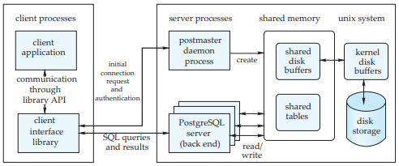

System Architecture## System Architecture

The PostgreSQL system architecture follows the process-per-transaction model. A running PostgreSQL site is managed by a central coordinating process, called the **postmaster.** The postmaster process is responsible for initializing and shutting down the server and also for handling connection requests from new clients. The postmaster assigns each new connecting client to a back-end server process that is responsible for executing the queries on behalf of the client and for returning the results to the client. This architecture is depicted in Figure 27.10.

Client applications can connect to the PostgreSQL server and submit queries through one of the many database application programmer interfaces supported by PostgreSQL (libpq, JDBC, ODBC, Perl DBD) that are provided as client-side libraries. An example client application is the command-line psql program, in- cluded in the standard PostgreSQL distribution. The postmaster is responsible for handling the initial client connections. For this, it constantly listens for new connections on a known port. After performing initialization steps such as user authentication, the postmaster will spawn a new back-end server process to han- dle the new client. After this initial connection, the client interacts only with the back-end server process, submitting queries and receiving query results. This is the essence of the process-per-connection model adopted by PostgreSQL.

The back-end server process is responsible for executing the queries submit- ted by the client by performing the necessary query-execution steps, including parsing, optimization, and execution. Each back-end server process can handle

**Figure 27.10** The PostgreSQL system architecture.  

**Bibliographical Notes 1155**

only a single query at a time. In order to execute more than one query in parallel, an application must maintain multiple connections to the server.

At any given time, there may be multiple clients connected to the system and thus multiple back-end server processes may be executing concurrently. The back-end server processes access database data through the main-memory buffer pool, which is placed in shared memory, so that all the processes have the same view of the data. Shared memory is also used to implement other forms of synchronization between the server processes, for example, the locking of data items.

The use of shared memory as a communication medium suggests that a PostgreSQL server should run on a single machine; a single-server site cannot be spread across multiple machines without the assistance of third-party packages, such as the Slony replication tool. However, it is possible to build a shared-nothing parallel database system with an instance of PostgreSQL running on each node; in fact, several commercial parallel database systems have been built with exactly this architecture, as described in Section 18.8.

**Bibliographical Notes**

There is extensive online documentation of PostgreSQL at www.postgresql.org. This Web site is the authoritative source for information on new releases of PostgreSQL, which occur on a frequent basis. Until PostgreSQL version 8, the only way to run PostgreSQL under Microsoft Windows was by using Cygwin. Cygwin is a Linux- like environment that allows rebuilding of Linux applications from source to run under Windows. Details are at www.cygwin.com. Books on PostgreSQL include Douglas and Douglas [2003] and Stinson [2002]. Rules as used in PostgreSQL are presented in Stonebraker et al. [1990]. The GiST structure is described in Hellerstein et al. [1995].

Many tools and extensions for PostgreSQL are documented by the pgFoundry at www.pgfoundry.org. These include the pgtcl library and the pgAccess adminis- tration tool mentioned in this chapter. The pgAdmin tool is described on the Web at www.pgadmin.org. The database-design tools, TORA and Data Architect, are de- scribed at tora.sourceforge.net and www.thekompany.com/products/dataarchitect, respec- tively. The report-generation tools, GNU Report Generator and GNU Enterprise, are described at www.gnu.org/software/grg and www.gnuenterprise.org, respectively. The open-source Mondrian OLAP server is described at mondrian.pentaho.org.

An open-source alternative to PostgreSQL is MySQL, which is available for noncommercial use under the GNU General Public License. MySQL may be em- bedded in commercial software that does not have freely distributed source code, but this requires a special license to be purchased. Comparisons between the most recent versions of the two systems are readily available on the Web.  

This page intentionally left blank  

**_C H A P T E R_28 Oracle**

Hakan Jakobsson

When Oracle was founded in 1977 as Software Development Laboratories by Larry Ellison, Bob Miner, and Ed Oates, there were no commercial relational database products. The company, which was later renamed Oracle, set out to build a relational database management system as a commercial product, and became a pioneer of the RDBMS market and has held a leading position in this market ever since. Over the years, its product and service offerings have grown beyond the relational database server to include middleware and applications.

In addition to products developed inside the company, Oracle’s offerings in- clude software that was originally developed in companies that Oracle acquired. Oracle’s acquisitions have ranged from small companies to large, publicly traded ones, including Peoplesoft, Siebel, Hyperion, and BEA. As a result of these acqui- sitions, Oracle has a very broad portfolio of enterprise software products.

This chapter is focused on Oracle’s main relational database server and closely related products. New versions of the products are being developed continually, so all product descriptions are subject to change. The feature set described here is based on the first release of Oracle11_g_, which is Oracle’s flagship database product.

**28.1 Database Design and Querying Tools**

Oracle provides a variety of tools for database design, querying, report gener- ation and data analysis, including OLAP. These tools, along with various other application development tools, are part of a portfolio of software products called Oracle Fusion Middleware. Products include both traditional tools using Oracle’s PL/SQL programming language and newer ones based on Java/J2EE technologies. The software supports open standards such as SOAP, XML, BPEL, and UML.

**28.1.1 Database and Application Design Tools**

The Oracle Application Development Framework (ADF) is an end-to-end J2EE- based development framework for a Model-View-Control design pattern. In this

  

framework, an application consists of multiple layers. The Model and Business Services layers handle the interaction with the data sources and contains the business logic. The View layer handles the user interface, and the Controller layer handles the flow of the application and the interaction between the other layers.

The primary development tool for Oracle ADF is Oracle JDeveloper, which provides an integrated development environment with support for Java, XML, PHP, HTML, Javascript, BPEL, SQL, and PL/SQL development. It has built-in support for UML modeling.

Oracle Designer is a database design tool, which translates business logic and data flows into schema definitions and procedural scripts for application logic. It supports such modeling techniques as E-R diagrams, information engineering, and object analysis and design.

Oracle also has an application development tool for data warehousing, Ora- cle Warehouse Builder. Warehouse Builder is a tool for design and deployment of all aspects of a data warehouse, including schema design, data mapping and transformations, data load processing, and metadata management. Oracle Ware- house Builder supports both 3NF and star schemas and can also import designs from Oracle Designer. This tool, in conjunction with database features, such as external tables and table functions, typically eliminates the need for third-party extraction, transformation, and loading (ETL) tools.

**28.1.2 Querying Tools**

Oracle provides tools for ad hoc querying, report generation, and data analysis, including OLAP.

Oracle Business Intelligence Suite (OBI) is a comprehensive suite of tools sharing a common service-oriented architecture. Components include a Busi- ness Intelligence server and tools for ad hoc querying, dashboard generation, reporting, and alerting. The components share infrastructure and services for data access and metadata management and have a common security model and administration tool.

The component for ad hoc querying, Oracle BI Answers, is an interactive tool that presents the user with a logical view of the data hiding the details of the physical implementation. Objects available to the user are displayed graphically and the user can build a query with a point-and-click interface. This logical query is sent to the Oracle BI Server component, which then generates the physical query or queries. Multiple physical data sources are supported, and a query could com- bine data stored in relational databases, OLAP sources, and Excel spreadsheets. Results can be presented as charts, reports, pivot tables, or dashboards that are drillable and can be saved and later modified.

**28.2 SQL Variations and Extensions**

Oracle supports all core SQL:2003 features fully or partially, with the exception of features-and-conformance views. In addition, Oracle supports a large number of  

**28.2 SQL Variations and Extensions 1159**

other language constructs, some of which conform with Optional Features of SQL Foundation:2003, while others are Oracle-specific in syntax or functionality.

**28.2.1 Object-Relational Features**

Oracle has extensive support for object-relational constructs, including:

- **Object types**. A single-inheritance model is supported for type hierarchies.

- **Collection types**. Oracle supports **varrays**, which are variable length arrays, and nested tables.

- **Object tables**. These are used to store objects while providing a relational view of the attributes of the objects.

- **Table functions**. These are functions that produce sets of rows as output, and can be used in the **from** clause of a query. Table functions in Oracle can be nested. If a table function is used to express some form of data transformation, nesting multiple functions allows multiple transformations to be expressed in a single statement.

- **Object views**. These provide a virtual object table view of data stored in a regular relational table. They allow data to be accessed or viewed in an object- oriented style even if the data are really stored in a traditional relational format.

- **Methods**. These can be written in PL/SQL, Java, or C.

- **User-defined aggregate functions**. These can be used in SQL statements in the same way as built-in functions such as **sum** and **count**.

**28.2.2 Oracle XML DB**

Oracle XML DB provides in-database storage for XML data and support for a broad set of XML functionality including XML Schema and XQuery. It is built on the **XMLType** abstract data type, which is treated as a native Oracle data type. XML DB provides several options for how data of this data type are stored in the database, including:

- Structured in object-relational format. This format is usually space efficient and allows the use of a variety of standard relational features, such as B-tree indices, but incurs some overhead when mapping XML documents to the storage format and back. It is mainly suitable for XML data that are highly structured and the mapping includes a manageable number of relational tables and joins.

- Unstructured as a text string. This representation does not require any map- ping and provides high throughput when inserting or retrieving an entire XML document. However, it is usually not very space efficient and provides for less intelligent processing when operating on parts of an XML document.  

- Binary XML storage. This representation is a post-parse, XML Schema-aware, binary format. It is more space efficient than unstructured storage and can handle operations against parts of an XML document. It is also better than the structured format at handling data that are highly unstructured, but may not always be as space efficient. This format may make the processing of XQuery statements less efficient than when the structured format is used.

Both the binary and unstructured representation can be indexed with a special type of index called **XMLIndex**. This type of index allows document fragments to be indexed based on their corresponding XPath expression.

Storing XML data inside the database means that they get the benefit of Or- acle’s functionality in areas such as backup, recovery, security, and query pro- cessing. It allows for accessing relational data as part of doing XML processing as well as accessing XML data as part of doing SQL processing. Some very high-level features of XML DB include:

- Support for the XQuery language (W3C XQuery 1.0 Recommendation).

- An XSLT process that lets XSL transformations be performed inside the data- base.

- An XPath rewrite optimization that can speed up queries against data stored in object-relational representation. By translating an expression used in an XQuery into conditions directly on the object-relational columns, regular in- dices on these columns can be used to speed up query processing.

**28.2.3 Procedural Languages**

Oracle has two main procedural languages, PL/SQL and Java. PL/SQL was Ora- cle’s original language for stored procedures and it has syntax similar to that used in the Ada language. Java is supported through a Java virtual machine inside the database engine. Oracle provides a package to encapsulate related procedures, functions, and variables into single units. Oracle supports SQLJ (SQL embedded in Java) and JDBC, and provides a tool to generate Java class definitions correspond- ing to user-defined database types.

**28.2.4 Dimensions**

Dimensional modeling is a commonly used design technique for relational star schemas as well as multidimensional databases. Oracle supports the creation of **dimensions** as metadata objects in order to support query processing against databases designed based on this technique. The metadata objects can be used to store information about various kinds of attributes of a dimension, but per- haps more importantly, about hierarchical relationships. See Section 28.3.10 for examples.  

**28.2 SQL Variations and Extensions 1161**

**28.2.5 OLAP**

Oracle provides support for analytical database processing in several different ways. In addition to support for a rich set of analytical SQL constructs (cube, rollup, grouping sets, window functions, etc.), Oracle provides native multidi- mensional storage inside the relational database server. The multidimensional data structures allow for array-based access to the data, and, in the right circum- stances, this type of access can be vastly more efficient than traditional relational access methods. Using these data structures as an integrated part of a relational database provides a choice of storing data in a relational or multidimensional format while still taking advantage of Oracle features in areas such as backup and recovery, security, and administration tools.

Oracle provides storage containers for multidimensional data known as **ana- lytic workspaces**. An analytic workspace contains both the dimensional data and measures (or facts) of an OLAP cube and is stored inside an Oracle table. From a traditional relational perspective, a cube stored inside a table would be an opaque object where the data could not normally be interpreted directly in terms of the table’s rows and columns. However, Oracle’s OLAP server inside the database has the knowledge to interpret and access the data and makes it possible to give SQL access to it as if it had been stored in a regular table format. Hence, it is possible to store data in either a multidimensional format or a traditional relational for- mat, depending on what is optimal, and still be able to join data stored in both types of representations in a single SQLquery. A materialized view can use either representation.

In addition to Oracle’s OLAP support inside its relational database, Ora- cle’s product suite includes Essbase. Essbase is a widely used multidimensional database that came to be part of Oracle with the acquisition of Hyperion.

**28.2.6 Triggers**

Oracle provides several types of triggers and several options for when and how they are invoked. (See Section 5.3 for an introduction to triggers in SQL.) Triggers can be written in PL/SQL or Java or as C callouts.

For triggers that execute on DML statements such as insert, update, and delete, Oracle supports **row triggers** and **statement triggers**. Row triggers execute once for every row that is affected (updated or deleted, for example) by the DML operation. A statement trigger is executed just once per statement. In each case, the trigger can be defined as either a _before_ or _after_ trigger, depending on whether it is to be invoked before or after the DML operation is carried out.

Oracle allows the creation of **instead of** triggers for views that cannot be subject to DML operations. Depending on the view definition, it may not be possible for Oracle to translate a DML statement on a view to modifications of the underlying base tables unambiguously. Hence, DML operations on views are subject to numerous restrictions. A user can create an **instead of** trigger on a view to specify manually what operations on the base tables are to be carried out in response to a DML operation on the view. Oracle executes the trigger instead of the  

DML operation and therefore provides a mechanism to circumvent the restrictions on DML operations against views.

Oracle also has triggers that execute on a variety of other events, such as database start-up or shutdown, server error messages, user logon or logoff, and DDL statements such as **create**, **alter** and **drop** statements.

**28.3 Storage and Indexing**

In Oracle parlance, a **database** consists of information stored in files and is ac- cessed through an **instance**, which is a shared memory area and a set of processes that interact with the data in the files. The **control file** is a small file that con- tains some very high-level metadata required to start or operate an instance. The storage structure of the regular data and metadata is described in the next section.

**28.3.1 Table Spaces**

A database consists of one or more logical storage units called **table spaces**. Each table space, in turn, consists of one or more physical structures called _data files._ These may be either part of a file system or raw devices.

Usually, an Oracle database has the following table spaces:

- The **system** and the auxiliary **sysaux** table spaces, which are always created. They contain the data dictionary tables and storage for triggers and stored procedures.

- Table spaces created to store user data. While user data can be stored in the **system** table space, it is often desirable to separate the user data from the system data. Usually, the decision about what other table spaces should be created is based on performance, availability, maintainability, and ease of administration. For example, having multiple table spaces can be useful for partial backup and recovery operations.

- The **undo** table space, which is used solely for storing undo information for transaction management and recovery.

- **Temporary** table spaces. Many database operations require sorting the data, and the sort routine may have to store data temporarily on disk if the sort cannot be done in memory. Temporary table spaces are allocated for sorting and hashing to make the space management operations involved in spilling to disk more efficient.

Table spaces can also be used as a means of moving data between databases. For example, it is common to move data from a transactional system to a data warehouse at regular intervals. Oracle allows moving all the data in a table space from one system to the other by simply copying the data files and exporting and importing a small amount of data-dictionary metadata. These operations can be much faster than unloading the data from one database and then using a loader  

**28.3 Storage and Indexing 1163**

to insert it into the other. This Oracle feature is known as **transportable table spaces**.

**28.3.2 Segments**

The space in a table space is divided into units, called **segments**, each of which contains data for a specific data structure. There are four types of segments:

- **Data segments**. Each table in a table space has its own data segment where the table data are stored unless the table is partitioned; if so, there is one data segment per partition. (Partitioning in Oracle is described in Section 28.3.9.)

- **Index segments**. Each index in a table space has its own index segment, except for partitioned indices, which have one index segment per partition.

- **Temporary segments**. These are segments used when a sort operation needs to write data to disk or when data are inserted into a temporary table.

- **Undo segments**. These segments contain undo information so that an un- committed transaction can be rolled back. These segments are automatically allocated in a special undo table space. They also play an important role in Oracle’s concurrency control model and for database recovery, described in Sections 28.5.1 and 28.5.2. In older implementations of Oracle’s undo man- agement, the term “rollback segment” was used.

Below the level of segment, space is allocated at a level of granularity called an **extent**. Each extent consists of a set of contiguous database _blocks_. A database block is the lowest level of granularity at which Oracle performs disk I/O. A database block does not have to be the same as an operating system block in size, but should be a multiple thereof.

Oracle provides storage parameters that allow for detailed control of how space is allocated and managed, parameters such as:

- The size of a new extent that is to be allocated to provide room for rows that are inserted into a table.

- The percentage of space utilization at which a database block is considered full and at which no more rows will be inserted into that block. (Leaving some free space in a block can allow the existing rows to grow in size through updates, without running out of space in the block.)

**28.3.3 Tables**

A standard table in Oracle is heap organized; that is, the storage location of a row in a table is not based on the values contained in the row, and is fixed when the row is inserted. However, if the table is partitioned, the content of the row affects the partition in which it is stored. There are several features and variations. Heap tables can optionally be compressed, as described in Section 28.3.3.2.  

Oracle supports nested tables; that is, a table can have a column whose data type is another table. The nested table is not stored in line in the parent table, but is stored in a separate table.

Oracle supports temporary tables where the duration of the data is either the transaction in which the data are inserted, or the user session. The data are private to the session and are automatically removed at the end of its duration.

A **cluster** is another form of file organization for table data, described earlier in Section 10.6.2 where it is called _multitable clustering_. The use of the term “cluster” in this context, should not be confused with other meanings of the word cluster, such as those relating to hardware architecture. In a cluster file organization, rows from different tables are stored together in the same block on the basis of some common columns. For example, a department table and an employee table could be clustered so that each row in the department table is stored together with all the employee rows for those employees who work in that department. The primary key/foreign key values are used to determine the storage location.

The cluster organization implies that a row belongs in a specific place; for example, a new employee row must be inserted with the other rows for the same department. Therefore, an index on the clustering column is mandatory. An alternative organization is a **hash cluster**. Here, Oracle computes the location of a row by applying a hash function to the value for the cluster column. The hash function maps the row to a specific block in the hash cluster. Since no index traversal is needed to access a row according to its cluster column value, this organization can save significant amounts of disk I/O.

**28.3.3.1 Index-Organized Tables**

In an **index-organized table** (IOT), records are stored in an Oracle B-tree index instead of in a heap; this file organization is described earlier in Section 11.4.1, where it is called _B_+_\-tree file organization_. An IOT requires that a unique key be identified for use as the index key. While an entry in a regular index contains the key value and row-id of the indexed row, an IOT replaces the row-id with the column values for the remaining columns of the row. Compared to storing the data in a regular heap table and creating an index on the key columns, using an IOT can improve both performance and space utilization. Consider looking up all the column values of a row, given its primary key value. For a heap table, that would require an index probe followed by a table access by row-id. For an IOT, only the index probe is necessary.

Secondary indices on nonkey columns of an index-organized table are differ- ent from indices on a regular heap table. In a heap table, each row has a fixed row-id that does not change. However, a B-tree is reorganized as it grows or shrinks when entries are inserted or deleted, and there is no guarantee that a row will stay in a fixed place inside an IOT. Hence, a secondary index on an IOT con- tains not normal row-ids, but **logical row-ids** instead. A logical row-id consists of two parts: a physical row-id corresponding to where the row was when the index was created or last rebuilt and a value for the unique key. The physical row-id is referred to as a “guess” since it could be incorrect if the row has been  

**28.3 Storage and Indexing 1165**

moved. If so, the other part of a logical row-id, the key value for the row, is used to access the row; however, this access is slower than if the guess had been correct, since it involves a traversal of the B-tree for the IOT from the root all the way to the leaf nodes, potentially incurring several disk I/Os. However, if a table is highly volatile and a large percentage of the guesses are likely to be wrong, it can be better to create the secondary index with only key values (as described in Section 11.4.1), since using an incorrect guess may result in a wasted disk I/O.

**28.3.3.2 Compression**

Oracle’s compression feature allows data to be stored in a compressed format, something that can drastically reduce the amount of space needed to store the data and the number of I/O operations needed to retrieve it. Oracle’s compression method is a lossless dictionary-based algorithm that compresses each block indi- vidually. All the information needed to uncompress a block is contained in that block itself. The algorithm works by replacing repeated occurrences of a value in that block with pointers to an entry for that value in a symbol table (or dictionary) in the block. Entries can be based on repeated values for individual columns or a combination of columns.

Oracle’s original table compression generated the compressed block format as the data were bulk-loaded into a table and was mainly intended for data warehousing environments. A newer OLTP compression feature supports com- pression in conjunction with regular DML operations as well. In the latter case, Oracle compresses blocks only after certain thresholds have been reached for how much data have been written into the block. As a result, only transactions that cause a threshold to be passed will occur any overhead for compressing a block.

**28.3.3.3 Data Security**

In addition to regular access control features such as passwords, user privileges, and user roles, Oracle supports several features to protect the data from unau- thorized access, including:

- **Encryption.** Oracle can automatically store table data in an encrypted format and transparently encrypt and decrypt data using the AES or 3DES algorithms. Encryption can be enabled for an entire database or just for individual table columns. The main motivation for this feature is to protect sensitive data outside the normally protected environment, such as when backup media is sent to a remote location.

- **Database Vault.** This feature is aimed at providing a separation of duties for users with access to the database. A database administrator is a highly privi- leged user that typically can do almost anything with the database. However, it may be inappropriate or illegal to let that person access sensitive corpo- rate financial data or personal information about other employees. Database vault includes a variety of mechanisms that can be used to restrict or monitor access to sensitive data by highly privileged database users.  

- **Virtual Private Database.** This feature, described earlier in Section 9.7.5, allows additional predicates to be automatically added to the **where** clause of a query that accesses a given table or view. Typically, the feature would be used so that the additional predicate filters out all the rows that the user does not have the right to see. For example, two users could submit identical queries to find all the employee information in the entire employee table. However, if a policy exists that limits each user to seeing only the information for the employee number that matches the user ID, the automatically added predicates will ensure that each query only returns the employee information for the user who submitted the query. Hence, each user will be left with the impression of accessing a virtual database that contains only a subset of the data of the physical database.

**28.3.4 Indices**

Oracle supports several different types of indices. The most commonly used type is a B-tree index, created on one or multiple columns. Note that in the terminology of Oracle (as also in several other database systems) a B-tree index is what is referred to as a B+-tree index in Chapter 11. Index entries have the following format: for an index on columns _col_1, _col_2, and _col_3, each row in the table where at least one of the columns has a nonnull value would result in the index entry:

<col_1_\><col_2_\><col_3_\><row-id>_

where <coli>_ denotes the value for column _i_ and <row-id>_ is the row-id for the row. Oracle can optionally compress the prefix of the entry to save space. For example, if there are many repeated combinations of <col_1_\><col_2\> values, the representation of each distinct <col_1_\><col_2\> prefix can be shared between the entries that have that combination of values, rather than stored explicitly for each such entry. Prefix compression can lead to substantial space savings.

**28.3.5 Bitmap Indices**

Bitmap indices (described in Section 11.9) use a bitmap representation for in- dex entries, which can lead to substantial space saving (and therefore disk I/O savings), when the indexed column has a moderate number of distinct values. Bitmap indices in Oracle use the same kind of B-tree structure to store the entries as a regular index. However, where a regular index on a column would have entries of the form <col_1_\><row-id>_, a bitmap index entry has the form:

<col_1_\><start row-id><end row-id><compressed bitmap>_

The bitmap conceptually represents the space of all possible rows in the table between the start and end row-id. The number of such possible rows in a block depends on how many rows can fit into a block, which is a function of the number  

**28.3 Storage and Indexing 1167**

of columns in the table and their data types. Each bit in the bitmap represents one such possible row in a block. If the column value of that row is that of the index entry, the bit is set to 1. If the row has some other value, or the row does not actually exist in the table, the bit is set to 0. (It is possible that the row does not actually exist because a table block may well have a smaller number of rows than the number that was calculated as the maximum possible.) If the difference is large, the result may be long strings of consecutive zeros in the bitmap, but the compression algorithm deals with such strings of zeros, so the negative effect is limited.

The compression algorithm is a variation of a compression technique called Byte-Aligned Bitmap Compression (BBC). Essentially, a section of the bitmap where the distance between two consecutive 1s is small enough is stored as verbatim bitmaps. If the distance between two 1s is sufficiently large—that is, there is a sufficient number of adjacent 0s between them—a runlength of 0s, that is, the number of 0s, is stored.

Bitmap indices allow multiple indices on the same table to be combined in the same access path if there are multiple conditions on indexed columns in the **where** clause of a query. Bitmaps from the different indices are retrieved and combined using Boolean operations corresponding to the conditions in the **where** clause. All Boolean operations are performed directly on the compressed representation of the bitmaps—no decompression is necessary—and the resulting (compressed) bitmap represents those rows that match all the logical conditions.

The ability to use the Boolean operations to combine multiple indices is not limited to bitmap indices. Oracle can convert row-ids to the compressed bitmap representation, so it can use a regular B-tree index anywhere in a Boolean tree of bitmap operation simply by putting a row-id-to-bitmap operator on top of the index access in the execution plan.

As a rule of thumb, bitmap indices tend to be more space efficient than regular B-tree indices if the number of distinct key values is less than half the number of rows in the table. For example, in a table with 1 million rows, an index on a column with less than 500,000 distinct values would probably be smaller if it were created as a bitmap index. For columns with a very small number of distinct values—for example, columns referring to properties such as country, state, gender, marital status, and various status flags—a bitmap index might require only a small fraction of the space of a regular B-tree index. Any such space advantage can also give rise to corresponding performance advantages in the form of fewer disk I/Os when the index is scanned.

**28.3.6 Function-Based Indices**

In addition to creating indices on one or multiple columns of a table, Oracle allows indices to be created on expressions that involve one or more columns, such as _col_1 + _col_2 ∗ 5. For example, by creating an index on the expression _upper_(_name_), where _upper_ is a function that returns the uppercase version of a string, and _name_ is a column, it is possible to do case-insensitive searches on the _name_ column. In order to find all rows with name “van Gogh” efficiently, the condition:  

_upper_(_name_) = ’VAN GOGH’

would be used in the **where** clause of the query. Oracle then matches the condition with the index definition and concludes that the index can be used to retrieve all the rows matching “van Gogh” regardless of how the name was capitalized when it was stored in the database. A function-based index can be created as either a bitmap or a B-tree index.

**28.3.7 Join Indices**

A join index is an index where the key columns are not in the table that is refer- enced by the row-ids in the index. Oracle supports bitmap join indices primarily for use with star schemas (see Section 20.2.2). For example, if there is a column for product names in a product dimension table, a bitmap join index on the fact table with this key column could be used to retrieve the fact table rows that correspond to a product with a specific name, although the name is not stored in the fact table. How the rows in the fact and dimension tables correspond is based on a join condition that is specified when the index is created, and becomes part of the index metadata. When a query is processed, the optimizer will look for the same join condition in the **where** clause of the query in order to determine if the join index is applicable.

Oracle can combine a bitmap join index on a fact table with other indices on the same table—whether join indices or not—by using the operators for Boolean bitmap operations.

**28.3.8 Domain Indices**

Oracle allows tables to be indexed by index structures that are not native to Or- acle. This extensibility feature of the Oracle server allows software vendors to develop so-called **cartridges** with functionality for specific application domains, such as text, spatial data, and images, with indexing functionality beyond that provided by the standard Oracle index types. In implementing the logic for cre- ating, maintaining, and searching the index, the index designer must ensure that it adheres to a specific protocol in its interaction with the Oracle server.

A domain index must be registered in the data dictionary, together with the operators it supports. Oracle’s optimizer considers domain indices as one of the possible access paths for a table. Oracle allows cost functions to be registered with the operators so that the optimizer can compare the cost of using the domain index to those of other access paths.

For example, a domain index for advanced text searches may support an operator _contains_. Once this operator has been registered, the domain index will be considered as an access path for a query like:

**select** \* **from** _employees_ **where** _contains_(_resume_, ’LINUX’);  

**28.3 Storage and Indexing 1169**

where _resume_ is a text column in the _employee_ table. The domain index can be stored in either an external data file or inside an Oracle index-organized table.

A domain index can be combined with other (bitmap or B-tree) indices in the same access path by converting between the row-id and bitmap representation and using Boolean bitmap operations.

**28.3.9 Partitioning**

Oracle supports various kinds of horizontal partitioning of tables and indices, and this feature plays a major role in Oracle’s ability to support very large databases. The ability to partition a table or index has advantages in many areas.

- Backup and recovery are easier and faster, since they can be done on individ- ual partitions rather than on the table as a whole.

- Loading operations in a data warehousing environment are less intrusive: data can be added to a newly created partition, and then the partition added to a table, which is an instantaneous operation. Likewise, dropping a partition with obsolete data from a table is very easy in a data warehouse that maintains a rolling window of historical data.

- Query performance benefits substantially, since the optimizer can recognize that only a subset of the partitions of a table need to be accessed in order to resolve a query (partition pruning). Also, the optimizer can recognize that in a join, it is not necessary to try to match all rows in one table with all rows in the other, but that the joins need to be done only between matching pairs of partitions (partitionwise join).

An index on a partitioned table can be either a **global index** or a **local index**. Entries in a global index can refer to rows in any partition. A locally indexed table has one physical index for each partition that only contains entries for that partition. Unless partition pruning restricts a query to a single partition, a table accessed through a local index will require multiple individual physical index probes. However, a local index has advantages in data warehousing environments where new data can be loaded into a new partition and indexed without the need to maintain any existing index. (Loading followed by index creation is much more efficient than maintaining an existing index while the data are being loaded.) Similarly, dropping an old partition and the physical part of its local index can be done without causing any index maintenance.

Each row in a partitioned table is associated with a specific partition. This association is based on the partitioning column or columns that are part of the definition of a partitioned table. There are several ways to map column values to partitions, giving rise to several types of partitioning, each with different characteristics: range, hash, list, and composite partitioning.  

**28.3.9.1 Range Partitioning**

In range partitioning, the partitioning criteria are ranges of values. This type of partitioning is especially well suited to date columns, in which case all rows in the same date range, say a day or a month, belong in the same partition. In a data warehouse where data are loaded from the transactional systems at regular intervals, range partitioning can be used to implement a rolling window of historical data efficiently. Each data load gets its own new partition, making the loading process faster and more efficient. The system actually loads the data into a separate table with the same column definition as the partitioned table. It can then check the data for consistency, cleanse them, and index them. After that, the system can make the separate table a new partition of the partitioned table, by a simple change to the metadata in the data dictionary—a nearly instantaneous operation.

Up until the metadata change, the loading process does not affect the existing data in the partitioned table in any way. There is no need to do any maintenance of existing indices as part of the loading. Old data can be removed from a table by simply dropping its partition; this operation does not affect the other partitions.

In addition, queries in a data warehousing environment often contain con- ditions that restrict them to a certain time period, such as a quarter or month. If date-range partitioning is used, the query optimizer can restrict the data access to those partitions that are relevant to the query, and avoid a scan of the entire table.

Partitions can either be created with explicitly set end points or be defined based on a fixed range, such as a day or a month. In the latter case, called **interval partitioning**, the creation of the partition happens automatically under the covers when trying to insert a row with a value in a previously nonexistent interval.

**28.3.9.2 Hash Partitioning**

In hash partitioning, a hash function maps rows to partitions according to the values in the partitioning columns. This type of partitioning is primarily useful when it is important to distribute the rows evenly among partitions or when partitionwise joins are important for query performance.

**28.3.9.3 List Partitioning**

In list partitioning, the values associated with a particular partition are stated in a list. This type of partitioning is useful if the data in the partitioning column have a relatively small set of discrete values. For instance, a table with a state column can be implicitly partitioned by geographical region if each partition list has the states that belong in the same region.

**28.3.9.4 Composite Partitioning**

In composite partitioning, tables that are range, interval, or list partitioned can be subpartitioned by range, list, or hash. For example, a table may be range parti- tioned on a date column and hash subpartitioned on a column that is frequently  

**28.3 Storage and Indexing 1171**

used as a join column. The subpartitioning allows partition-wise joins to be used when the table is joined.

**28.3.9.5 Reference Partitioning**

In reference partitioning, the partitioning key is resolved based on a foreign- key constraint with another table. The dependency between the tables allows maintenance operations to be automatically cascaded.

**28.3.10 Materialized Views**

The materialized-view feature (see Section 4.2.3) allows the result of an SQL query to be stored in a table and used for later query processing. In addition, Oracle maintains the materialized result, updating it when the tables that were referenced in the query are updated. Materialized views are used in data warehousing to speed up query processing, but the technology is also used for replication in distributed and mobile environments.

In data warehousing, a common usage for materialized views is to summarize data. For example, a common type of query asks for “the sum of sales for each quarter during the last 2 years.” Precomputing the result, or some partial result, of such a query can speed up query processing dramatically compared to computing it from scratch by aggregating all detail-level sales records.

Oracle supports automatic query rewrites that take advantage of any useful materialized view when resolving a query. The rewrite consists of changing the query to use the materialized view instead of the original tables in the query. In addition, the rewrite may add additional joins or aggregate processing as may be required to get the correct result. For example, if a query needs sales by quarter, the rewrite can take advantage of a view that materializes sales by month, by adding additional aggregation to roll up the months to quarters. Oracle has a type of metadata object called dimension that allows hierarchical relationships in tables to be defined. For example, for a time-dimension table in a star schema, Oracle can define a dimension metadata object to specify how days roll up to months, months to quarters, quarters to years, and so forth. Likewise, hierarchical properties relating to geography can be specified—for example, how sales districts roll up to regions. The query rewrite logic looks at these relationships since they allow a materialized view to be used for wider classes of queries.

The container object for a materialized view is a table, which means that a materialized view can be indexed, partitioned, or subjected to other controls, to improve query performance.

When there are changes to the data in the tables referenced in the query that defines a materialized view, the materialized view must be refreshed to reflect those changes. Oracle supports both complete refresh of a materialized view and fast, incremental refresh. In a complete refresh, Oracle recomputes the materialized view from scratch, which may be the best option if the underlying tables have had significant changes, for example, changes due to a bulk load. In a fast refresh, Oracle updates the view using the records that were changed in the underlying tables. The refresh to the view can be executed _on commit_ as part of  

the transaction that changed the underlying tables or at some later point in time _on demand_. Fast refresh may be better if the number of rows that were changed is low. There are some restrictions on the classes of queries for which a materialized view can be incrementally refreshed (and others for when a materialized view can be created at all).

A materialized view is similar to an index in the sense that, while it can improve query performance, it uses up space, and creating and maintaining it consumes resources. To help resolve this trade-off, Oracle provides an advisor that can help a user create the most cost-effective materialized views, given a particular query workload as input.

**28.4 Query Processing and Optimization**

Oracle supports a large variety of processing techniques in its query processing engine. Some of the more important ones are described here briefly.

**28.4.1 Execution Methods**

Data can be accessed through a variety of access methods:

- **Full table scan**. The query processor scans the entire table by getting infor- mation about the blocks that make up the table from the extent map, and scanning those blocks.

- **Index scan**. The processor creates a start and/or stop key from conditions in the query and uses it to scan to a relevant part of the index. If there are columns that need to be retrieved, that are not part of the index, the index scan would be followed by a table access by index row-id. If no start or stop key is available, the scan would be a full index scan.

- **Index fast full scan**. The processor scans the extents the same way as the table extent in a full table scan. If the index contains all the table columns that are needed for that table, and there are no good start/stop keys that would significantly reduce that portion of the index that would be scanned in a regular index scan, this method may be the fastest way to access the data. This is because the fast full scan can take full advantage of multiblock disk I/O. However, unlike a regular full scan, which traverses the index leaf blocks in order, a fast full scan does not guarantee that the output preserves the sort order of the index.

- **Index join**. If a query needs only a small subset of the columns of a wide table, but no single index contains all those columns, the processor can use an index join to generate the relevant information without accessing the table, by joining several indices that together contain the needed columns. It performs the joins as hash joins on the row-ids from the different indices.  

**28.4 Query Processing and Optimization 1173**

- **Cluster** and **hash cluster access**. The processor accesses the data by using the cluster key.

Oracle has several ways to combine information from multiple indices in a single access path. This ability allows multiple **where**\-clause conditions to be used together to compute the result set as efficiently as possible. The functionality includes the ability to perform Boolean operations **and**, **or**, and **minus** on bitmaps representing row-ids. There are also operators that map a list of row-ids into bitmaps and vice versa, which allows regular B-tree indices and bitmap indices to be used together in the same access path. In addition, for many queries involving **count**(\*) on selections on a table, the result can be computed by just counting the bits that are set in the bitmap generated by applying the **where** clause conditions, without accessing the table.

Oracle supports several types of joins in the execution engine: inner joins, outer joins, semijoins, and antijoins. (An antijoin in Oracle returns rows from the left-hand side input that do not match any row in the right-hand side input; this operation is called anti-semijoin in other literature.) It evaluates each type of join by one of three methods: hash join, sort–merge join, or nested-loop join.

**28.4.2 Optimization**

Chapter 13 discusses the general topic of query optimization. Here, we discuss optimization in the context of Oracle.

**28.4.2.1 Query Transformations**

Oracle does query optimization in several steps. One such step is to perform var- ious query transformations and rewrites that fundamentally change the structure of the query. Another step is to perform access path selection to determine access paths, join methods, and join order. Since some transformations are not always beneficial, Oracle uses cost-based query transformations where the transforma- tions and access path selection are interleaved. For each transformation that is tried, access path selection is performed in order to generate a cost estimate, and the transformation is accepted or rejected based on the cost for the resulting execution plan.

Some of the major types of transformations and rewrites supported by Oracle are as follows:

- **View merging**. A view reference in a query is replaced by the view definition. This transformation is not applicable to all views.

- **Complex view merging**. Oracle offers this feature for certain classes of views that are not subject to regular view merging because they have a **group by** or **select distinct** in the view definition. If such a view is joined to other tables, Oracle can commute the joins and the sort or hash operation used for the **group by** or **distinct**.  

- **Subquery flattening.** Oracle has a variety of transformations that convert var- ious classes of subqueries into joins, semijoins, or antijoins. Such conversion is also called _decorrelation_, and is described briefly in Section 13.4.4.

- **Materialized view rewrite**. Oracle has the ability to rewrite a query automati- cally to take advantage of materialized views. If some part of the query can be matched up with an existing materialized view, Oracle can replace that part of the query with a reference to the table in which the view is materialized. If need be, Oracle adds join conditions or **group by** operations to preserve the semantics of the query. If multiple materialized views are applicable, Oracle picks the one that gives the greatest advantage in reducing the amount of data that have to be processed. In addition, Oracle subjects both the rewritten query and the original version to the full optimization process producing an execution plan and an associated cost estimate for each. Oracle then decides whether to execute the rewritten or the original version of the query on the basis of the cost estimates.

- **Star transformation**. Oracle supports a technique for evaluating queries against star schemas, known as the star transformation. When a query con- tains a join of a fact table with dimension tables, and selections on attributes from the dimension tables, the query is transformed by deleting the join con- dition between the fact table and the dimension tables, and replacing the selection condition on each dimension table by a subquery of the form:

_fact table.fki_ **in** (**select** _pk_ **from** _dimension tablei_ **where** <conditions on _dimension tablei >_)

One such subquery is generated for each dimension that has some constrain- ing predicate. If the dimension has a snowflake schema (see Section 20.2), the subquery will contain a join of the applicable tables that make up the dimension.

Oracle uses the values that are returned from each subquery to probe an index on the corresponding fact table column, getting a bitmap as a result. The bitmaps generated from different subqueries are combined by a bitmap **and** operation. The resultant bitmap can be used to access matching fact table rows. Hence, only those rows in the fact table that simultaneously match the conditions on the constrained dimensions will be accessed. Both the decision on whether the use of a subquery for a particular dimension is cost-effective, and the decision on whether the rewritten query is better than the original, are based on the optimizer’s cost estimates.

**28.4.2.2 Access Path Selection**

Oracle has a cost-based optimizer that determines join order, join methods, and access paths. Each operation that the optimizer considers has an associated cost  

**28.4 Query Processing and Optimization 1175**

function, and the optimizer tries to generate the combination of operations that has the lowest overall cost.

In estimating the cost of an operation, the optimizer relies on statistics that have been computed for schema objects such as tables and indices. The statis- tics contain information about the size of the object, the cardinality, the data distribution of table columns, and so forth. Oracle supports height-balanced and frequency histograms for data distributions. Height-balanced histograms are also referred to as _equi-depth histograms_, and are described in Section 13.3.1.

To facilitate the collection of optimizer statistics, Oracle can monitor modifi- cation activity on tables and keep track of those tables that have been subject to enough changes that recalculating the statistics may be appropriate. Oracle also tracks what columns are used in **where** clauses of queries, which makes them potential candidates for histogram creation. With a single command, a user can tell Oracle to refresh the statistics for those tables that were marked as sufficiently changed. Oracle uses sampling to speed up the process of gathering the new statistics and automatically chooses the smallest adequate sample percentage. It also determines whether the distribution of the marked columns merits the cre- ation of histograms; if the distribution is close to uniform, Oracle uses a simpler representation of the column statistics.

In some cases, it may be impossible for the optimizer to accurately estimate the selectivity of a condition in the **where** clause of a query just based on simple column statistics. For example, the condition may be an expression involving a column, such as _f_ (_col_ \+ 3) \> 5\. Another class of problematic queries is those that have multiple predicates on columns that have some form of correlation. Assess- ing the combined selectivity of those predicates may be hard. Oracle therefore allows statistics to be created for expressions as well as for groups of columns. In addition, Oracle can address these issues through _dynamic sampling_. The opti- mizer can randomly sample a small portion of a table and apply all the relevant predicates to the sample to see the percentage of the rows that match. This feature can also handle temporary tables where the lifespan and visibility of the data may prevent regular statistics collection.

Oracle uses both CPU cost and disk I/Os in the optimizer cost model. To balance the two components, it stores measures about CPU speed and disk I/O performance as part of the optimizer statistics. Oracle’s package for gathering optimizer statistics computes these measures.

For queries involving a nontrivial number of joins, the search space is an issue for a query optimizer. Oracle addresses this issue in several ways. The optimizer generates an initial join order and then decides on the best join methods and access paths for that join order. It then changes the order of the tables and determines the best join methods and access paths for the new join order and so forth, while keeping the best plan that has been found so far. Oracle cuts the optimization short if the number of different join orders that have been considered becomes so large that the time spent in the optimizer may be noticeable compared to the time it would take to execute the best plan found so far. Since this cutoff depends on the cost estimate for the best plan found so far, finding a good plan early is important so that the optimization can be stopped after a smaller number of  

join orders, resulting in better response time. Oracle uses several initial ordering heuristics to increase the likelihood that the first join order considered is a good one.

For each join order that is considered, the optimizer may make additional passes over the tables to decide join methods and access paths. Such additional passes would target specific global side effects of the access path selection. For instance, a specific combination of join methods and access paths may eliminate the need to perform an **order by** sort. Since such a global side effect may not be obvious when the costs of the different join methods and access paths are considered locally, a separate pass targeting a specific side effect is used to find a possible execution plan with a better overall cost.

**28.4.2.3 Partition Pruning**

For partitioned tables, the optimizer tries to match conditions in the **where** clause of a query with the partitioning criteria for the table, in order to avoid accessing partitions that are not needed for the result. For example, if a table is partitioned by date range and the query is constrained to data between two specific dates, the optimizer determines which partitions contain data between the specified dates and ensures that only those partitions are accessed. This scenario is very common, and the speedup can be dramatic if only a small subset of the partitions are needed.

**28.4.2.4 SQL Tuning Advisor**

In addition to the regular optimization process, Oracle’s optimizer can be used in tuning mode as part of the SQL Tuning Advisor in order to generate more efficient execution plans than it normally would. This feature is especially useful for packaged applications that generate the same set of SQL statements repeatedly so that effort to tune these statements for performance can have future benefits.

Oracle monitors the database activity and automatically stores information about high-load SQL statements in a workload repository; see Section 28.8.2. High- load SQL statements are those that use up the most resources because they are executed a very large number of times or because each execution is very expen- sive. Such statements are logical candidates for tuning since their impact on the system is the greatest. The SQL Tuning Advisor can be used to improve the perfor- mance of these statements by making making various kinds of recommendations that fall into the following different categories:

- **Statistics Analysis**. Oracle checks whether statistics needed by the optimizer are missing or stale and makes recommendations for collecting them.

- **SQL Profiling.** A profile for an SQL statement is a set of information that is intended to help the optimizer make better decisions the next time the state- ment is optimized. An optimizer can sometimes generate inefficient execution plans if it is unable to accurately estimate cardinalities and selectivities, some- thing that can happen because of data correlation or the use of certain types  

**28.4 Query Processing and Optimization 1177**

of constructs. When running the optimizer in tuning mode to create a profile, the optimizer tries to verify that its assumptions are correct using dynamic sampling and partial evaluation of the SQL statement. If it finds that there are steps in the optimization process where the optimizer’s assumptions are wrong, it will generate a correction factor for that step that will become part of the profile. Optimizing in tuning mode can be very time-consuming, but it can be worthwhile if the use of the profile significantly improves the perfor- mance of the statement. If a profile is created, it will be stored persistently and used whenever the statement is optimized in the future. Profiles can be used to tune SQL statements without changing the text of the statement, something that is important since it is often impossible for the database administrator to modify statements generated by an application.

- **Access Path Analysis.** Based on analysis by the optimizer, Oracle suggests the creation of additional indices that could speed up the statement.

- **SQL Structure Analysis.** Oracle suggests changes in the structure of the SQLstatement that would allow for more efficient execution.

**28.4.2.5 SQL Plan Management**

Packaged applications often generate a large number of SQL statements that are executed repeatedly. If the application is performing adequately, it is common that database administrators are averse to changes in database behavior. If the change results in better performance, there is limited perceived upside since the performance was already good enough. On the other hand, if the change leads to a performance degradation, it may break an application if a critical query deteriorates to a response time that is unacceptable.

An example of a change of behavior is a change of an execution plan for a query. Such a change may be a perfectly legitimate reflection of changes to properties of the data, such as a table having grown much larger. But the change could also be an unintended consequence of a number of other actions, such as a change in the routines for collecting optimizer statistics or an upgrade to a new version of the RDBMS with new optimizer behavior.

Oracle’s SQL Plan Management feature addresses the risk associated with execution plan changes by maintaining a set of trusted execution plans for a workload and phasing in plans changed by the query optimizer only after they have been verified not to cause any performance degradations. The feature has three major components:

**1\. SQL plan baseline capture.** Oracle can capture execution plans for a work- load and store a plan history for each SQL statement. The plan baseline is a set of plans for a workload with trusted performance characteristics and against which future plan changes can be compared. A statement could have more than one baseline plan.

**2\. SQL plan baseline selection.** After the optimizer generates a plan for an SQL statement, it checks whether there exists a baseline plan for the statement.  

If the statement exists in the baseline but the new plan is different from any existing one, the baseline plan that the optimizer considers to be the best will be used. The newly generated plan will be added to the plan history for the statement and could become part of a future baseline.

**3\. SQL plan baseline evolution.** Periodically, it may make sense to try to make newly generated execution plans part of the trusted plans in the baseline. Oracle supports adding new plans to the baseline with or without _verification._ If verification is the chosen option, Oracle will execute a newly generated plan and compare its performance to the baseline in order to make sure it does not cause performance regressions.

**28.4.3 Parallel Execution**

Oracle allows the execution of a single SQL statement to be parallelized by dividing the work between multiple processes on a multiprocessor computer. This feature is especially useful for computationally intensive operations that would otherwise take an unacceptably long time to perform. Representative examples are decision support queries that need to process large amounts of data, data loads in a data warehouse, and index creation or rebuild.

In order to achieve good speedup through parallelism, it is important that the work involved in executing the statement be divided into granules that can be processed independently by the different parallel processors. Depending on the type of operation, Oracle has several ways to split up the work.

For operations that access base objects (tables and indices), Oracle can divide the work by horizontal slices of the data. For some operations, such as a full table scan, each such slice can be a range of blocks—each parallel query process scans the table from the block at the start of the range to the block at the end. For some operations on a partitioned table, such as an index range scan, the slice would be a partition. Parallelism based on block ranges is more flexible since these can be determined dynamically based on a variety of criteria and are not tied to the table definition.

Joins can be parallelized in several different ways. One way is to divide one of the inputs to the join between parallel processes and let each process join its slice with the other input to the join; this is the asymmetric fragment-and-replicate method of Section 18.5.2.2. For example, if a large table is joined to a small one by a hash join, Oracle divides the large table among the processes and broadcasts a copy of the small table to each process, which then joins its slice with the smaller table. If both tables are large, it would be prohibitively expensive to broadcast one of them to all processes. In that case, Oracle achieves parallelism by partitioning the data among processes by hashing on the values of the join columns (the partitioned hash-join method of Section 18.5.2.1). Each table is scanned in parallel by a set of processes and each row in the output is passed on to one of a set of processes that are to perform the join. Which one of these processes gets the row is determined by a hash function on the values of the join column. Hence, each join process gets only rows that could potentially match, and no rows that could match could end up in different processes.  

**28.4 Query Processing and Optimization 1179**

Oracle parallelizes sort operations by value ranges of the column on which the sort is performed (that is, using the range-partitioning sort of Section 18.5.1). Each process participating in the sort is sent rows with values in its range, and it sorts the rows in its range. To maximize the benefits of parallelism, the rows need to be divided as evenly as possible among the parallel processes, and the problem of determining range boundaries that generates a good distribution then arises. Oracle solves the problem by dynamically sampling a subset of the rows in the input to the sort before deciding on the range boundaries.

**28.4.3.1 Process Structure**

The processes involved in the parallel execution of an SQL statement consist of a coordinator process and a number of parallel server processes. The coordinator is responsible for assigning work to the parallel servers and for collecting and returning data to the user process that issued the statement. The degree of par- allelism is the number of parallel server processes that are assigned to execute a primitive operation as part of the statement. The degree of parallelism is deter- mined by the optimizer, but can be throttled back dynamically if the load on the system increases.

The parallel servers operate on a producer/consumer model. When a se- quence of operations is needed to process a statement, the producer set of servers performs the first operation and passes the resulting data to the consumer set. For example, if a full table scan is followed by a sort and the degree of paral- lelism is 32, there would be 32 producer servers performing the table scan and passing the result to 32 consumer servers that perform the sort. If a subsequent operation is needed, such as another sort, the roles of the two sets of servers switch. The servers that originally performed the table scan take on the role of consumers of the output produced by the first sort and use it to perform the second sort. Hence, a sequence of operations proceeds by passing data back and forth between two sets of servers that alternate in their roles as producers and consumers. The servers communicate with each other through memory buffers on shared-memory hardware and through high-speed network connections on MPP (shared nothing) configurations and clustered (shared disk) systems.

For shared-nothing systems, the cost of accessing data on disk is not uniform among processes. A process running on a node that has direct access to a device is able to process data on that device faster than a process that has to retrieve the data over a network. Oracle uses knowledge about device-to-node and device-to- process affinity—that is, the ability to access devices directly—when distributing work among parallel execution servers.

**28.4.4 Result Caching**

Oracle’s result caching feature allows the result of a query or query block (e.g., a view referenced in a query) to be cached in memory and reused if the same query is executed again. Updates of the data in the underlying tables invalidate the cached results, so this feature works best for queries against tables that are relatively static and where the result sets are relatively small. Consider, as a  

usage example, some part of a Web page that is stored in the database and does not change very frequently compared to how often it accessed. For such an application, result caching would be a much more lightweight alternative to using materialized views, which would require explicitly creating and administering new persistent database objects.

**28.5 Concurrency Control and Recovery**

Oracle supports concurrency control and recovery techniques that provide a number of useful features.

**28.5.1 Concurrency Control**

Oracle’s multiversion concurrency control mechanism is based on the snapshot isolation protocol described in Section 15.7. Read-only queries are given a read- consistent snapshot, which is a view of the database as it existed at a specific point in time, containing all updates that were committed by that point in time, and not containing any updates that were not committed at that point in time. Thus, read locks are not used and read-only queries do not interfere with other database activity in terms of locking.

Oracle supports both statement- and transaction-level read consistency: at the beginning of the execution of either a statement or a transaction (depend- ing on what level of consistency is used), Oracle determines the current system change number (SCN). The SCN essentially acts as a timestamp, where the time is measured in terms of transaction commits instead of wall-clock time.

If in the course of a query a data block is found that has a higher SCN than the one being associated with the query, it is evident that the data block has been modified after the time of the original query’s SCN by some other transaction that may or may not have committed. Hence, the data in the block cannot be included in a consistent view of the database as it existed at the time of the query’s SCN. Instead, an older version of the data in the block must be used; specifically, the one that has the highest SCN that does not exceed the SCN of the query. Oracle retrieves that version of the data from the undo segment (undo segments are described in Section 28.5.2). Hence, provided that the undo space is sufficiently large, Oracle can return a consistent result of the query even if the data items have been modified several times since the query started execution. Should the block with the desired SCN no longer exist in the undo, the query will return an error. It would be an indication that the undo table space has not been properly sized, given the activity on the system.

In the Oracle concurrency model, read operations do not block write opera- tions and write operations do not block read operations, a property that allows a high degree of concurrency. In particular, the scheme allows for long-running queries (for example, reporting queries) to run on a system with a large amount of transactional activity. This kind of scenario is often problematic for database systems where queries use read locks, since the query may either fail to acquire  

**28.5 Concurrency Control and Recovery 1181**

them or lock large amounts of data for a long time, thereby preventing transac- tional activity against that data and reducing concurrency. (An alternative that is used in some systems is to use a lower degree of consistency, such as degree-two consistency, but that could result in inconsistent query results.)

Oracle’s concurrency model is used as a basis for the **flashback** feature. This feature allows a user to set a certain SCN number or wall-clock time in his session and perform operations on the data that existed at that point in time (provided that the data still exist in the undo). Normally in a database system, once a change has been committed, there is no way to get back to the previous state of the data other than performing point-in-time recovery from backups. However, recovery of a very large database can be very costly, especially if the goal is just to retrieve some data item that had been inadvertently deleted by a user. The flashback feature provides a much simpler mechanism to deal with user errors. The flashback feature includes the ability to restore a table or an entire database to an earlier point in time without recovering from backups, the ability to perform queries on the data as they existed at an earlier point in time, the ability to track how one or more rows have changed over time, and the ability to examine changes to the database at the transaction level.

It may be desirable to be able to track changes to a table beyond what would be possible through normal undo retention. (For instance, corporate governance regulations may require that such changes be trackable for a certain number of years.) For this purpose, a table can be tracked by the **flashback archive** feature, which creates an internal, history version of the table. A background process converts the undo information into entries in the history table, which can be used to provide flashback functionality for arbitrarily long periods of time.

Oracle supports two ANSI/ISO isolation levels, **read committed** and **serializ- able**. There is no support for dirty reads since it is not needed. Statement-level read consistency corresponds to the read committed isolation level, while transaction- level read consistency corresponds to the serializable isolation level. The isolation level can be set for a session or an individual transaction. Statement-level read consistency (that is, read committed) is the default.

Oracle uses row-level locking. Updates to different rows do not conflict. If two writers attempt to modify the same row, one waits until the other either commits or is rolled back, and then it can either return a write-conflict error or go ahead and modify the row; write-conflict errors are detected based on the first-updater- wins version of snapshot isolation, described in Section 15.7. (Section 15.7 also describes certain cases of non-serializable execution that can occur with snapshot isolation, and outlines techniques for preventing such problems.) Locks are held for the duration of a transaction.

In addition to row-level locks that prevent inconsistencies due to DML ac- tivity, Oracle uses table locks that prevent inconsistencies due to DDL activity. These locks prevent one user from, say, dropping a table while another user has an uncommitted transaction that is accessing that table. Oracle does not use lock escalation to convert row locks to table locks for the purpose of its regular concurrency control.  

Oracle detects deadlocks automatically and resolves them by rolling back one of the transactions involved in the deadlock.

Oracle supports autonomous transactions, which are independent transac- tions generated within other transactions. When Oracle invokes an autonomous transaction, it generates a new transaction in a separate context. The new trans- action can be either committed or rolled back before control returns to the calling transaction. Oracle supports multiple levels of nesting of autonomous transac- tions.

**28.5.2 Basic Structures for Recovery**

Oracle’s Flashback technology, described in Section 28.5.1, can be used as a recov- ery mechanism, but Oracle also supports media recovery where files are backed up physically. We describe this more traditional form of backup and recovery here.

In order to understand how Oracle recovers from a failure, such as a disk crash, it is important to understand the basic structures that are involved. In addition to the data files that contain tables and indices, there are control files, redo logs, archived redo logs, and undo segments.

The control file contains various metadata that are needed to operate the database, including information about backups.

Oracle records any transactional modification of a database buffer in the redo log, which consists of two or more files. It logs the modification as part of the operation that causes it and regardless of whether the transaction eventually commits. It logs changes to indices and undo segments as well as changes to table data. As the redo logs fill up, they are archived by one or several background processes (if the database is running in **archivelog** mode).

The undo segment contains information about older versions of the data (that is, undo information). In addition to its role in Oracle’s consistency model, the information is used to restore the old version of data items when a transaction that has modified the data items is rolled back.

To be able to recover from a storage failure, the data files and control files should be backed up regularly. The frequency of the backup determines the worst-case recovery time, since it takes longer to recover if the backup is old. Oracle supports hot backups—backups performed on an online database that is subject to transactional activity.

During recovery from a backup, Oracle performs two steps to reach a consis- tent state of the database as it existed just prior to the failure. First, Oracle rolls forward by applying the (archived) redo logs to the backup. This action takes the database to a state that existed at the time of the failure, but not necessarily a con- sistent state since the redo logs include uncommitted data. Second, Oracle rolls back uncommitted transactions by using the undo segment data. The database is now in a consistent state.

Recovery on a database that has been subject to heavy transactional activity since the last backup can be time-consuming. Oracle supports parallel recovery in which several processes are used to apply redo information simultaneously.  

**28.6 System Architecture 1183**

Oracle provides a GUI tool, Recovery Manager, which automates most tasks as- sociated with backup and recovery.

**28.5.3 Oracle Data Guard**

To ensure high availability, Oracle provides a standby database feature, **data guard**. (This feature is the same as remote backups, described in Section 16.9.) A standby database is a copy of the regular database that is installed on a separate system. If a catastrophic failure occurs on the primary system, the standby sys- tem is activated and takes over, thereby minimizing the effect of the failure on availability. Oracle keeps the standby database up-to-date by constantly apply- ing archived redo logs that are shipped from the primary database. The backup database can be brought online in read-only mode and used for reporting and decision support queries.

**28.6 System Architecture**

Whenever a database application executes an SQL statement, there is an operating system process that executes code in the database server. Oracle can be configured so that the operating system process is _dedicated_ exclusively to the statement it is processing or so that the process can be _shared_ among multiple statements. The latter configuration, known as the **shared server**, has somewhat different properties with regard to the process and memory architecture. We shall discuss the **dedicated server** architecture first and the multithreaded server architecture later.

**28.6.1 Dedicated Server: Memory Structures**

The memory used by Oracle falls mainly into three categories: software code areas, which are the parts of the memory where the Oracle server code resides, the system global area (SGA), and the program global area (PGA).

A PGA is allocated for each process to hold its local data and control infor- mation. This area contains stack space for various session data and the private memory for the SQL statement that it is executing. It also contains memory for sorting and hashing operations that may occur during the evaluation of the state- ment. The performance of such operations is sensitive to the amount of memory that is available. For example, a hash join that can be performed in memory will be faster than if it is necessary to spill to disk. Since there can be a large num- ber of sorting and hashing operations active simultaneously (because of multiple queries as well as multiple operations within each query), deciding how much memory should be allocated to each operation is nontrivial, especially as the load on the system may fluctuate. Underallocation of memory can lead to extra disk I/Os if an operation needlessly spills to disk and overallocation of memory can lead to thrashing. Oracle lets the database administrator specify a _target_ parame- ter for the total amount of memory that should be considered available for these operations. The size of this target would typically be based on the total amount of  

memory available on the system and some calculation as to how it should be di- vided between various Oracle and non-Oracle activities. Oracle will dynamically decide the best way to divide the memory available within the target between the active operations in order to maximize throughput. The memory allocation algo- rithm knows the relationship between memory and performance for the different operations and seeks to ensure that the available memory is used as efficiently as possible.

The SGA is a memory area for structures that are shared among users. It is made up of several major structures, including the following.

- **Buffer cache**. This cache keeps frequently accessed data blocks (from tables as well as indices) in memory to reduce the need to perform physical disk I/O. A least recently used replacement policy is used except for blocks accessed during a full table scan. However, Oracle allows multiple buffer pools to be created that have different criteria for aging out data. Some Oracle operations bypass the buffer cache and read data directly from disk.

- **Redo log buffer**. This buffer contains the part of the redo log that has not yet been written to disk.

- **Shared pool**. Oracle seeks to maximize the number of users that can use the database concurrently by minimizing the amount of memory that is needed for each user. One important concept in this context is the ability to share the internal representation of SQL statements and procedural code written in PL/SQL. When multiple users execute the same SQL statement, they can share most data structures that represent the execution plan for the statement. Only data that are local to each specific invocation of the statement need to be kept in private memory.

The sharable parts of the data structures representing the SQL statement are stored in the shared pool, including the text of the statement. The caching of SQL statements in the shared pool also saves compilation time, since a new invocation of a statement that is already cached does not have to go through the complete compilation process. The determination of whether an SQL statement is the same as one existing in the shared pool is based on exact text matching and the setting of certain session parameters. Oracle can automatically replace constants in an SQL statement with bind variables; future queries that are the same except for the values of constants will then match the earlier query in the shared pool.

The shared pool also contains caches for dictionary information and various control structures. Caching dictionary metadata is important for speeding up the compilation time for SQL statements. In addition, the shared pool is used for Oracle’s result cache feature.

**28.6.2 Dedicated Server: Process Structures**

There are two types of processes that execute Oracle server code: server pro- cesses that process SQL statements and background processes that perform var-  

**28.6 System Architecture 1185**

ious administrative and performance-related tasks. Some of these processes are optional, and in some cases, multiple processes of the same type can be used for performance reasons. Oracle can generate about two dozen different types of background processes. Some of the most important ones are:

- **Database writer**. When a buffer is removed from the buffer cache, it must be written back to disk if it has been modified since it entered the cache. This task is performed by the database writer processes, which help the performance of the system by freeing up space in the buffer cache.

- **Log writer**. The log-writer process writes entries in the redo log buffer to the redo log file on disk. It also writes a commit record to disk whenever a transaction commits.

- **Checkpoint**. The checkpoint process updates the headers of the data file when a checkpoint occurs.

- **System monitor**. This process performs crash recovery if needed. It also performs some space management to reclaim unused space in temporary segments.

- **Process monitor**. This process performs process recovery for server processes that fail, releasing resources and performing various cleanup operations.

- **Recoverer**. The recoverer process resolves failures and conducts cleanup for distributed transactions.

- **Archiver**. The archiver copies the online redo log file to an archived redo log every time the online log file fills up.

**28.6.3 Shared Server**

The shared-server configuration increases the number of users that a given num- ber of server processes can support by sharing server processes among statements. It differs from the dedicated server architecture in these major aspects:

- A background dispatch process routes user requests to the next available server process. In doing so, it uses a request queue and a response queue in the SGA. The dispatcher puts a new request in the request queue where it will be picked up by a server process. As a server process completes a request, it puts the result in the response queue to be picked up by the dispatcher and returned to the user.

- Since a server process is shared among multiple SQL statements, Oracle does not keep private data in the PGA. Instead, it stores the session-specific data in the SGA.  

**28.6.4 Oracle Real Application Clusters**

Oracle Real Application Clusters (RAC) is a feature that allows multiple instances of Oracle to run against the same database. (Recall that, in Oracle terminology, an instance is the combination of background processes and memory areas.) This feature enables Oracle to run on clustered and MPP (shared disk and shared noth- ing) hardware architectures. The ability to cluster multiple nodes has important benefits for scalability and availability that are useful in both OLTP and data warehousing environments.

The scalability benefits of the feature are obvious, since more nodes mean more processing power. On shared-nothing architectures, adding nodes to a clus- ter typically requires redistributing the data between the nodes. Oracle uses a shared-disk architecture where all the nodes have access to all the data and as a result, more nodes can be added to a RAC cluster without worrying how the data should be divided between the nodes. Oracle further optimizes the use of the hardware through features such as affinity and partitionwise joins.

RAC can also be used to achieve high availability. If one node fails, the re- maining ones are still available to the application accessing the database. The remaining instances will automatically roll back uncommitted transactions that were being processed on the failed node in order to prevent them from blocking activity on the remaining nodes. RAC also allows rolling patching so that software patches can be applied to one node at a time without database downtime.

Oracle’s shared-disk architecture avoids many of the issues that shared- nothing architectures have with data on disk either being local to a node or not. Still, having multiple instances run against the same database gives rise to some technical issues that do not exist on a single instance. While it is sometimes possible to partition an application among nodes so that nodes rarely access the same data, there is always the possibility of overlaps, which affects cache man- agement. In order to achieve efficient cache management over multiple nodes, Oracle’s **cache fusion** feature allows data blocks to flow directly among caches on different instances using the interconnect, without being written to disk.

**28.6.5 Automatic Storage Manager**

The Automatic Storage Manager (ASM) is a volume manager and file system developed by Oracle. While Oracle can be used with other volume managers and file systems as well as raw devices, ASM is specifically designed to simplify storage management for the Oracle database while optimizing performance.

ASM manages collections of disks, known as **disk groups**, and exposes a file system interface to the database. (Recall that an Oracle table space is defined in terms of data files.) Examples of what could constitute ASM disks include disks or partitions of disk arrays, logical volumes, and network attached files. ASM automatically stripes the data over the disks in a disk group and provides several options for different levels of mirroring.

If the disk configuration changes, e.g., when more disks are added to in- crease storage capacity, a disk group may need to be rebalanced so that the data are spread evenly over all the disks. The rebalancing operation can be done in  

**28.6 System Architecture 1187**

the background while the database remains fully operational and with minimal impact on database performance.

**28.6.6 Oracle Exadata**

Exadata is a set of Oracle libraries that can run on the storage array CPUs on certain types of storage hardware. While Oracle is fundamentally based on a shared-disk architecture, Exadata contains a shared-nothing flavor in that some operations that would normally be executed on the database server are moved to storage cells that can only access data that are local to each cell. (Each storage cell consists of a number of disks and several multicore CPUs.)

The are major advantages to offloading certain types of processing to storage CPUs:

- It allows a large, but relatively inexpensive, expansion of the amount of processing power that is available.

- The amount of data that needs to be transferred from a storage cell to the database server can be dramatically reduced, which can be very important since the bandwidth between the storage cell and database server is usually expensive and often a bottleneck.

When executing a query against Exadata storage, the reduction of the amount of data that needs to be retrieved comes from several techniques that can be pushed to the storage cells and executed there locally:

- **Projection.** A table may have hundreds of columns, but a given query may only need to access a very small subset of them. The storage cells can project out the unneeded columns and only send the relevant ones back to the database server.

- **Table filtering.** The database server can send a list of predicates that are local to a table to the storage cells and only rows matching these predicates get sent back to the server.

- **Join filtering.** The filtering mechanism allows for predicates that are _Bloom filters_ allowing rows to be filtered out based on join conditions as well.

In combination, offloading these techniques to the storage cells can speed up query processing by orders of magnitude. It requires that the storage cells, in addition to sending back regular, unaltered database blocks to the server, can send back a compacted version where certain columns and rows have been removed. This ability in turn requires the storage software to understand Oracle’s block format and data types, and to include Oracle’s expression and predicate evaluation routines.

In addition to providing benefits for query processing, Exadata can also speed up incremental backups by performing block-level change tracking and only  

returning blocks that have changed. Also, the work of formatting extents when creating a new table space is offloaded to Exadata storage.

Exadata storage supports all regular Oracle features, and it is possible to have a database that includes both Exadata and non-Exadata storage.

**28.7 Replication, Distribution, and External Data**

Oracle provides support for replication and distributed transactions with two- phase commit.

**28.7.1 Replication**

Oracle supports several types of replication. (See Section 19.2.1 for an introduction to replication.) In one form, data in a master site are replicated to other sites in the form of _materialized views_. A materialized view does not have to contain all the master data—it can, for example, exclude certain columns from a table for security reasons. Oracle supports two types of materialized views for replication: _read-only_ and _updatable_. An updatable materialized view can be modified and the modifications propagated to the master table. However, read-only materialized views allow for a wider range of view definitions. For instance, a read-only materialized view can be defined in terms of set operations on tables at the master site. Changes to the master data are propagated to the replicas through the materialized view refresh mechanism.

Oracle also supports multiple master sites for the same data, where all master sites act as peers. A replicated table can be updated at any of the master sites and the update is propagated to the other sites. The updates can be propagated either asynchronously or synchronously.

For asynchronous replication, the update information is sent in batches to the other master sites and applied. Since the same data could be subject to conflicting modifications at different sites, conflict resolution based on some business rules might be needed. Oracle provides a number of built-in conflict resolution methods and allows users to write their own if need be.

With synchronous replication, an update to one master site is propagated immediately to all other sites.

**28.7.2 Distributed Databases**

Oracle supports queries and transactions spanning multiple databases on differ- ent systems. With the use of gateways, the remote systems can include non-Oracle databases. Oracle has built-in capability to optimize a query that includes tables at different sites, retrieve the relevant data, and return the result as if it had been a normal, local query. Oracle also transparently supports transactions spanning multiple sites by a built-in two-phase-commit protocol.  

**28.8 Database Administration Tools 1189**

**28.7.3 External Data Sources**

Oracle has several mechanisms for supporting external data sources. The most common usage is in data warehousing when large amounts of data are regularly loaded from a transactional system.

**28.7.3.1 SQL\*Loader**

Oracle has a direct-load utility, SQL\*Loader, that supports fast parallel loads of large amounts of data from external files. It supports a variety of data formats and it can perform various filtering operations on the data being loaded.

**28.7.3.2 External Tables**

Oracle allows external data sources, such as flat files, to be referenced in the **from** clause of a query as if they were regular tables. An external table is defined by metadata that describe the Oracle column types and the mapping of the external data into those columns. An access driver is also needed to access the external data. Oracle provides a default driver for flat files.

The external table feature is primarily intended for extraction, transformation, and loading (ETL) operations in a data warehousing environment. Data can be loaded into the data warehouse from a flat file using

**create table** _table_ **as select** ... **from** < external table \>

**where** ...

By adding operations on the data in either the **select** list or **where** clause, trans- formations and filtering can be done as part of the same SQL statement. Since these operations can be expressed either in native SQL or in functions written in PL/SQL or Java, the external table feature provides a very powerful mechanism for ex- pressing all kinds of data transformation and filtering operations. For scalability, the access to the external table can be parallelized by Oracle’s parallel execution feature.

**28.7.3.3 Data Pump Export and Import**

Oracle provides an export utility for unloading data and metadata into dump files. These files are regular files using a proprietary format that can be moved to another system and loaded into another Oracle database using the corresponding import utility.

**28.8 Database Administration Tools**

Oracle provides users a number of tools and features for system management and application development. In recent releases of Oracle, a lot of emphasis was put on the concept of _manageability_, that is, reducing the complexity of all  

aspects of creating and administering an Oracle database. This effort covered a wide variety of areas, including database creation, tuning, space management, storage management, backup and recovery, memory management, performance diagnostics, and workload management.

**28.8.1 Oracle Enterprise Manager**

Oracle Enterprise Manager (OEM) is Oracle’s main tool for database systems management. It provides an easy-to-use graphical user interface for most tasks associated with administering an Oracle database including configuration, per- formance monitoring, resource management, security management, and access to the various advisors. In addition to database management, OEM provides in- tegrated management of Oracle’s applications and middleware software stack.

**28.8.2 Automatic Workload Repository**

The Automatic Workload Repository (AWR) is one of the central pieces of infras- tructure for Oracle’s manageability effort. Oracle monitors the activity on the database system and records a variety of information relating to workloads and resource consumption and records them in AWR at regular intervals. By tracking the characteristics of a workload over time, Oracle can detect and help diagnose deviations from normal behavior such as a significant performance degradation of a query, lock contention, and CPU bottlenecks.

The information recorded in AWR provides a basis for a variety of **advisors** that provide analysis of various aspects of the performance of the system and advice for how it can be improved. Oracle has advisors for SQL tuning, creating access structures, such as indices and materialized views, and memory sizing. Oracle also provides advisors for segment defragmentation and undo sizing.

**28.8.3 Database Resource Management**

A database administrator needs to be able to control how the processing power of the hardware is divided among users or groups of users. Some groups may execute interactive queries where response time is critical; others may execute long-running reports that can be run as batch jobs in the background when the system load is low. It is also important to be able to prevent a user from inadvertently submitting an extremely expensive ad hoc query that will unduly delay other users.

Oracle’s Database Resource Management feature allows the database admin- istrator to divide users into resource consumer groups with different priorities and properties. For example, a group of high-priority, interactive users may be guaranteed at least 60 percent of the CPU. The remainder, plus any part of the 60 percent not used up by the high-priority group, would be allocated among resource consumer groups with lower priority. A really low-priority group could get assigned 0 percent, which would mean that queries issued by this group would run only when there are spare CPU cycles available. Limits for the degree of parallelism for parallel execution can be set for each group. The database ad-  

**Bibliographical Notes 1191**

ministrator can also set time limits for how long an SQL statement is allowed to run for each group. When a user submits a statement, the resource manager estimates how long it would take to execute it and returns an error if the state- ment violates the limit. The resource manager can also limit the number of user sessions that can be active concurrently for each resource consumer group. Other resources that can be controlled by the resource manager include undo space.

**28.9 Data Mining**

Oracle Data Mining provides a variety of algorithms that embed the data mining process inside the database both for building a model on a training set of data and for applying the model for scoring the actual production data. The fact the data never needs to leave the database is a significant advantage compared to using other data mining engines. Having to extract and insert potentially very large data sets into a separate engine is cumbersome, costly, and may prevent new data from being scored instantaneously as they are entered into the database. Oracle provides algorithms for both supervised and unsupervised learning including:

- Classification—Naive Bayes, generalized linear models, Support Vector Ma- chines, and Decision Trees.

- Regression—Support vector machines and generalized linear models.

- Attribute importance—Minimum description length.

- Anomaly detection—One class support vector machines.

- Clustering—Enhanced k-means clustering and orthogonal Partitioning Clus- tering.

- Association rules—Apriori.

- Feature extraction—Nonnegative matrix factorization.

In addition, Oracle provides a wide range of statistical functions inside the database covering areas including linear regression, correlation, cross tabs, hy- pothesis testing, distribution fitting, and Pareto analysis.

Oracle provides two interfaces to the data mining functionality, one based on Java and one that is based on Oracle’s procedural language PL/SQL. Once a model has been built on an Oracle database, it can be shipped to be deployed on other Oracle databases.

**Bibliographical Notes**

Up-to-date product information, including documentation, on Oracle products can be found at the Web sites http://www.oracle.com and http://technet.oracle.com.  

Oracle’s intelligent algorithms for allocating available memory for opera- tions such as hashing and sorting are discussed in Dageville and Zaı̈t [2002]. Murthy and Banerjee [2003] discussed XML schemas. Table compression in Ora- cle is described in Pöss and Potapov [2003]. Automatic SQL tuning is described in Dageville et al. [2004]. The optimizer’s cost-based query transformation frame- work is described in Ahmed et al. [2006]. The SQL Plan-Management feature is discussed in Ziauddin et al. [2008]. Antoshenkov [1995] describes the byte-aligned bitmap compression technique used in Oracle; see also Johnson [1999].  

**_C H A P T E R_29 IBM DB2 Universal Database**

Sriram Padmanabhan

IBM’s DB2 Universal Database family of products consists of flagship database servers and suites of related products for business intelligence, information inte- gration, and content management. The DB2 Universal Database Server is avail- able on a variety of hardware and operating-system platforms. The list of server platforms supported includes high-end systems such as mainframes, massively parallel processors (MPP), and large symmetric multiprocessors (SMP) servers; medium-scale systems such as four-way and eight-way SMPs; workstations; and even small handheld devices. Operating systems that are supported include Unix variants such as Linux, IBM AIX, Solaris, and HP-UX, as well as Microsoft Windows, IBM MVS, IBM VM, IBM OS/400, and a number of others. The DB2 Everyplace edition supports operating systems such as PalmOS and Windows CE. There is even a no-charge (free) version of DB2 called DB2 Express-C. Applications can migrate seamlessly from the low-end platforms to high-end servers because of the porta- bility of the DB2 interfaces and services. Besides the core database engine, the DB2 family consists of several other products that provide tooling, administration, replication, distributed data access, pervasive data access, OLAP, and many other features. Figure 29.1 describes the different products in the family.

**29.1 Overview**

The origin of DB2 can be traced back to the System R project at IBM’s Almaden Research Center (then called the IBM San Jose Research Laboratory). The first DB2 product was released in 1984 on the IBM mainframe platform, and this was fol- lowed over time with versions for the other platforms. IBM research contributions have continually enhanced the DB2 product in areas such as transaction processing (write-ahead logging and ARIES recovery algorithms), query processing and op- timization (Starburst), parallel processing (DB2 Parallel Edition), active-database support (constraints, triggers), advanced query and warehousing techniques such as materialized views, multidimensional clustering, “autonomic” features, and object-relational support (ADTs, UDFs).

  

-Database Servers –DB2 UDB for Linux, Unix, Windows –DB2 UDB for z/OS –DB2 UDB for OS/400 –DB2 UDB for VM/VSE

-Business Intelligence –DB2 Data Warehouse Edition –DB2 OLAP Server –DB2 Alphablox –DB2 CubeViews –DB2 Intelligent Miner –DB2 Query Patroller

-Data Integration –DB2 Information Integrator –DB2 Replication –DB2 Connect –Omnifind (For Enterprise Search)

-Content Management –DB2 Content –IBM Enterprise Content Manager

-Application Development –IBM Rational Application

Developer Studio –DB2 Forms for z/OS –QMF

-Database-Management Tools –DB2 Control Center –DB2 Admin Tool for z/OS –DB2 Performance Expert –DB2 Query Patroller –DB2 Visual Explain Embedded and Mobile Databases –DB2e (Everyplace) Manager

**Figure 29.1** The DB2 family of products.

Since IBM supports a number of server and operating-system platforms, the DB2 database engine consists of four code base types: (1) Linux, Unix, and Win- dows, (2) z/OS (3) VM, and (4) OS/400. All of these support a common subset of data-definition language, SQL, and administration interfaces. However, the engines have somewhat different features due to their platform origins. In this chapter, the focus is on the DB2 Universal Database (UDB) engine that supports Linux, Unix, and Windows. Specific features of interest in other DB2 systems are highlighted in appropriate sections.

The latest version of DB2 UDB for Linux, Unix, and Windows as of 2009 is version 9.7. DB2 version 9.7 includes several new feature such as extension of native support for XML to shared-nothing environments, native compression for tables and indexes, automatic storage management, and improved support for procedural languages such as SQL PL and Oracle’s PL/SQL.

**29.2 Database-Design Tools**

Most industry database-design and CASE tools can be used to design a DB2 database. In particular, data modeling tools such as ERWin and Rational Rose allow the designer to generate DB2-specific DDL syntax. For instance, Rational Rose’s UML Data Modeler tool can generate DB2-specific **create distinct type** DDL statements for user-defined types and use them subsequently in column definitions. Most design tools also support a reverse-engineering feature that reads the DB2 catalog tables and builds a logical design for additional manipulation. The tools support the generation of constraints and indices.

DB2 provides support for many logical and physical database features using SQL. The features include constraints, triggers, and recursion using SQL constructs. Likewise, certain physical database features such as tablespaces, bufferpools, and partitioning are also supported by using SQL statements. The Control Center GUI tool for DB2 allows a designer or an administrator to issue the appropriate DDL for these features. Another tool, _db2look_, allows the administrator to obtain a full set of DDL statements for a database including tablespaces, tables, indices, constraints, triggers, and functions that can be used to create an exact replica of the database schema for testing or replication.

The DB2 Control Center includes a variety of design- and administration- related tools. For design, the Control Center provides a tree view of a server, its databases, tables, views, and all other objects. It also allows users to define new objects, create ad hoc SQL queries, and view query results. Design tools for ETL, OLAP, replication, and federation also integrate into the Control Center. The entire DB2 family supports the Control Center for database definition as well as related tools. DB2 also provides plug-in modules for application development in the IBM Rational Application Developer product as well as in the Microsoft Visual Studio product.

