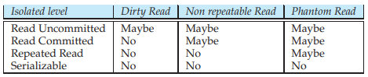

Transaction Management in PostgreSQL## Transaction Management in PostgreSQL

Transaction management in PostgreSQL uses both both snapshot isolation and two-phase locking. Which one of the two protocols is used depends on the type of statement being executed. For DML statements1 the snapshot isolation technique presented in Section 15.7 is used; the snapshot isolation scheme is referred to as the multiversion concurrency control (MVCC) scheme in PostgreSQL. Concurrency control for DDL statements, on the other hand, is based on standard two-phase locking.

### PostgreSQL Concurrency Control

Since the concurrency control protocol used by PostgreSQL depends on the _isola- tion level_ requested by the application, we begin with an overview of the isolation levels offered by PostgreSQL. We then describe the key ideas behind the MVCC scheme, followed by a discussion of their implementation in PostgreSQL and some of the implications of MVCC. We conclude this section with an overview of locking for DDL statements and a discussion of concurrency control for indices.

### 27.4.1.1 PostgreSQL Isolation Levels

The SQL standard defines three weak levels of consistency, in addition to the serializable level of consistency, on which most of the discussion in this book is based. The purpose of providing the weak consistency levels is to allow a higher degree of concurrency for applications that don’t require the strong guarantees that serializability provides. Examples of such applications include long-running transactions that collect statistics over the database and whose results do not need to be precise.

The SQL standard defines the different isolation levels in terms of three phe- nomena that violate serializability. The three phenomena are called _dirty read_, _nonrepeatable read_, and _phantom read_, and are defined as follows:

- **Dirty read.** The transaction reads values written by another transaction that hasn’t committed yet.

- **Nonrepeatable read.** A transaction reads the same object twice during exe- cution and finds a different value the second time, although the transaction has not changed the value in the meantime.

- **Phantom read.** A transaction re-executes a query returning a set of rows that satisfy a search condition and finds that the set of rows satisfying the condition has changed as a result of another recently committed transaction. (A more detailed explanation of the phantom phenomenon, including the

^1^A DML statement is any statement that updates or reads data within a table, that is, **select**, **insert**, **update**, **fetch**, and **copy**. DDL statements affect entire tables; they can remove a table or change the schema of a table, for example. DDL statements and some other PostgreSQL-specific statements will be discussed later in this section.  

**Figure 27.5** Definition of the four standard SQL isolation levels.

concept of a phantom conflict, can be found in Section 15.8.3; eliminating phantom reads does not eliminate all phantom conflicts.)

It should be obvious that each of the above phenomena violates transaction isolation, and hence violates serializability. Figure 27.5 shows the definition of the four SQL isolation levels specified in the SQL standard—read uncommitted, read committed, repeatable read, and serializable—in terms of these phenomena. PostgreSQL supports two of the four different isolation levels, read committed (which is the default isolation level in PostgreSQL) and serializable. However, the PostgreSQL implementation of the serializable isolation level uses snapshot isolation, which does not truly ensure serializability as we have seen earlier in Section 15.7.

### 27.4.1.2 Concurrency Control for DML Commands

The MVCC scheme used in PostgreSQL is an implementation of the snapshot isolation protocol which we saw in Section 15.7. The key idea behind MVCC is to maintain different versions of each row that correspond to instances of the row at different points in time. This allows a transaction to see a consistent **snapshot** of the data, by selecting the most recent version of each row that was committed before taking the snapshot. The MVCC protocol uses snapshots to ensure that every transaction sees a consistent view of the database: before executing a command, the transaction chooses a snapshot of the data and processes the row versions that are either in the snapshot or created by earlier commands of the same transaction. This view of the data is “consistent” since it only takes full transactions into account, but the snapshot is not necessarily equal to the current state of the data.

The motivation for using MVCC is that readers never block writers and vice versa. Readers access the most recent version of a row that is part of the transac- tion’s snapshot. Writers create their own separate copy of the row to be updated. Section 27.4.1.3 shows that the only conflict that causes a transaction to be blocked arises if two writers try to update the same row. In contrast, under the standard two-phase locking approach, both readers and writers might be blocked, since there is only one version of each data object and both read and write operations are required to obtain a lock before accessing any data.

The MVCC scheme in PostgreSQL implements the first-updater-wins version of the snapshot isolation protocol, by acquiring exclusive locks on rows that are written, but using a snapshot (without any locking) when reading rows;  

**27.4 Transaction Management in PostgreSQL 1139**

additional validation is done when exclusive locks are obtained, as outlined earlier in Section 15.7.

### 27.4.1.3 PostgreSQL Implementation of MVCC

At the core of PostgreSQL MVCC is the notion of _tuple visibility_. A PostgreSQL tuple refers to a version of a row. Tuple visibility defines which of the potentially many versions of a row in a table is valid within the context of a given statement or transaction. A transaction determines tuple visibility based on a database snapshot that is chosen before executing a command.

A tuple is visible for a transaction _T_ if the following two conditions hold:

**1.** The tuple was created by a transaction that committed before transaction _T_ took its snapshot.

**2.** Updates to the tuple (if any) were executed by a transaction that is either

- aborted, or

- started running after T took its snapshot, or

- was active when T took its snapshot.

To be precise, a tuple is also visible to T if it was created by T and not subsequently updated by T . We omit the details of this special case for simplicity.

The goal of the above conditions is to ensure that each transaction sees a consistent view of the data. PostgreSQL maintains the following state information to check these conditions efficiently:

- A transaction ID, which at the same time serves as a timestamp, is assigned to every transaction at transaction start time. PostgreSQL uses a logical counter (as described in Section 15.4.1) for assigning transaction IDs.

- A log file called _pg clog_ contains the current status of each transaction. The status can be either in progress, committed, or aborted.

- Each tuple in a table has a header with three fields: xmin, which contains the transaction ID of the transaction that created the tuple and which is therefore also called the creation-transaction ID; xmax, which contains the transaction ID of the replacing/deleting transaction (or null if not deleted/replaced) and which is also referred to as the expire-transaction ID; and a forward link to new versions of the same logical row, if there are any.

- A SnapshotData data structure is created either at transaction start time or at query start time, depending on the isolation level (described in more detail below). Its main purpose is to decide whether a tuple is visible to the current command. The SnapshotData stores information about the state of transactions at the time it is created, which includes a list of active transactions and xmax, a value equal to 1 + the highest ID of any transaction that has started so far.  

**Figure 27.6** The PostgreSQL data structures used for MVCC.

The value _xmax_ serves as a “cutoff” for transactions that may be considered visible.

Figure 27.6 illustrates some of this state information through a simple example involving a database with only one table, the department table from Figure 27.7. The department table has three columns, the name of the department, the building where the department is located, and the budget of the department. Figure 27.6 shows a fragment of the department table containing only the (versions of) the row corresponding to the Physics department. The tuple headers indicate that the row was originally created by transaction 100, and later updated by transaction 102 and transaction 106. Figure 27.6 also shows a fragment of the corresponding _pg clog file. On the basis of the pg clog file, transactions 100 and 102 are committed,

while transactions 104 and 106 are in progress. Given the above state information, the two conditions that need to be satisfied

for a tuple to be visible can be rewritten as follows:

**Figure 27.7** The department relation.  

**27.4 Transaction Management in PostgreSQL 1141**

**1.** The creation-transaction ID in the tuple header

a. is a committed transaction according to the pg clog file, and

b. is less than the cutoff transaction ID xmax recorded by SnapshotData,and

c. is not one of the active transactions stored in SnapshotData.

**2.** The expire-transaction ID, if it exists,

a. is an aborted transaction according to the pg clog file, or

b. is greater than or equal to the cutoff transaction ID xmax recorded by SnapshotData, or

c. is one of the active transactions stored in SnapshotData.

Consider the example database in Figure 27.6 and assume that the Snapshot- Data used by transaction 104 simply uses 103 as the cutoff transaction ID xmax and does not show any earlier transactions to be active. In this case, the only version of the row corresponding to the Physics department that is visible to transaction 104 is the second version in the table, created by transaction 102. The first version, created by transaction 100, is not visible, since it violates condition 2: The expire- transaction ID of this tuple is 102, which corresponds to a transaction that is not aborted and that has a transaction ID less than or equal to 103. The third version of the Physics tuple is not visible, since it was created by transaction 106, which has a transaction ID larger than transaction 103, implying that this version had not been committed at the time SnapshotData was created. Moreover, transaction 106 is still in progress, which violates another one of the conditions. The second version of the row meets all the conditions for tuple visibility.

The details of how PostgreSQL MVCC interacts with the execution of SQL statements depends on whether the statement is an **insert**, **select**, **update**, or **delete** statement. The simplest case is an **insert** statement, which may simply create a new tuple based on the data in the statement, initialize the tuple header (the creation ID), and insert the new tuple into the table. Unlike two-phase locking, this does not require any interaction with the concurrency-control protocol unless the insertion needs to be checked for integrity conditions, such as uniqueness or foreign key constraints.

When the system executes a **select**, **update**, or **delete** statement the interaction with the MVCC protocol depends on the isolation level specified by the application. If the isolation level is read committed, the processing of a new statement begins with creating a new _SnapshotData_ data structure (independent of whether the statement starts a new transaction or is part of an existing transaction). Next, the system identifies target tuples, that is, the tuples that are visible with respect to the SnapshotData and that match the search criteria of the statement. In the case of a **select** statement, the set of target tuples make up the result of the query.

In the case of an **update** or **delete** statement in read committed mode, an extra step is necessary after identifying the target tuples, before the actual update or  

delete operation can take place. The reason is that visibility of a tuple ensures only that the tuple has been created by a transaction that committed before the **update**/**delete** statement in question started. However, it is possible that, since query start, this tuple has been updated or deleted by another concurrently executing transaction. This can be detected by looking at the expire-transaction ID of the tuple. If the expire-transaction ID corresponds to a transaction that is still in progress, it is necessary to wait for the completion of this transaction first. If the transaction aborts, the **update** or **delete** statement can proceed and perform the actual modification. If the transaction commits, the search criteria of the statement need to be evaluated again, and only if the tuple still meets these criteria can the row be modified. If the row is to be deleted, the main step is to update the expire-transaction ID of the old tuple. A row update also performs this step, and additionally creates a new version of the row, sets its creation-transaction ID, and sets the forward link of the old tuple to reference the new tuple.

Going back to the example from Figure 27.6, transaction 104, which consists of a **select** statement only, identifies the second version of the Physics row as a target tuple and returns it immediately. If transaction 104 were an update statement instead, for example, trying to increment the budget of the Physics department by some amount, it would have to wait for transaction 106 to complete. It would then re-evaluate the search condition and, only if it is still met, proceed with its update.

Using the protocol described above for **update** and **delete** statements pro- vides only the read-committed isolation level. Serializability can be violated in several ways. First, nonrepeatable reads are possible. Since each query within a transaction may see a different snapshot of the database, a query in a transaction might see the effects of an **update** command completed in the meantime that weren’t visible to earlier queries within the same transaction. Following the same line of thought, phantom reads are possible when a relation is modified between queries.

In order to provide the PostgreSQL serializable isolation level, PostgreSQL MVCC eliminates violations of serializability in two ways: First, when it is deter- mining tuple visibility, all queries within a transaction use a snapshot as of the start of the transaction, rather than the start of the individual query. This way successive queries within a transaction always see the same data.

Second, the way updates and deletes are processed is different in serializable mode compared to read-committed mode. As in read-committed mode, transac- tions wait after identifying a visible target row that meets the search condition and is currently updated or deleted by another concurrent transaction. If the concur- rent transaction that executes the update or delete aborts, the waiting transaction can proceed with its own update. However, if the concurrent transaction commits, there is no way for PostgreSQL to ensure serializability for the waiting transac- tion. Therefore, the waiting transaction is rolled back and returns with the error message “could not serialize access due to concurrent update.”

It is up to the application to handle an error message like the above appro- priately, by aborting the current transaction and restarting the entire transaction from the beginning. Observe that rollbacks due to serializability issues are possi-  

**27.4 Transaction Management in PostgreSQL 1143**

ble only for **update** and **delete** statements. It is still the case that **select** statements never conflict with any other transactions.

### 27.4.1.4 Implications of Using MVCC

Using the PostgreSQL MVCC scheme has implications in three different areas: (1) extra burden is placed on the storage system, since it needs to maintain different versions of tuples; (2) developing concurrent applications takes some extra care, since PostgreSQL MVCC can lead to subtle, but important, differences in how concurrent transactions behave, compared to systems where standard two-phase locking is used; (3) PostgreSQL performance depends on the characteristics of the workload running on it. The implications of PostgreSQL MVCC are described in more detail below.

Creating and storing multiple versions of every row can lead to excessive storage consumption. To alleviate this problem, PostgreSQL frees up space when possible by identifying and deleting versions of tuples that cannot be visible to any active or future transactions, and are therefore no longer needed. The task of freeing space is nontrivial, because indices may refer to the location of an unneeded tuple, so these references need to be deleted before reusing the space. To lessen this issue, PostgreSQL avoids indexing multiple versions of a tuple that have identical index attributes. This allows the space taken by nonindexed tuples to be freed efficiently by any transaction that finds such a tuple.

For more aggressive space reuse, PostgreSQL provides the **vacuum** command, which correctly updates indices for each freed tuple. PostgreSQL employs a back- ground process to **vacuum** tables automatically, but the command can also be executed by the user directly. The **vacuum** command offers two modes of op- eration: Plain **vacuum** simply identifies tuples that are not needed, and makes their space available for reuse. This form of the command can operate in parallel with normal reading and writing of the table. **Vacuum full** does more extensive processing, including moving of tuples across blocks to try to compact the table to the minimum number of disk blocks. This form is much slower and requires an exclusive lock on each table while it is being processed.

Because of the use of multiversion concurrency control in PostgreSQL, porting applications from other environments to PostgreSQL might require some extra care to ensure data consistency. As an example, consider a transaction _TA_ executing a **select** statement. Since readers in PostgreSQL don’t lock data, data read and selected by _TA_ can be overwritten by another concurrent transaction _TB_ , while _TA_ is still running. As a result some of the data that _TA_ returns might not be current anymore at the time of completion of _TA_. _TA_ might return rows that in the meantime have been changed or deleted by other transactions. To ensure the current validity of a row and protect it against concurrent updates, an application must either use **select for share** or explicitly acquire a lock with the appropriate **lock table** command.

PostgreSQL’s approach to concurrency control performs best for workloads containing many more reads than updates, since in this case there is a very low chance that two updates will conflict and force a transaction to roll back. Two-  

phase locking may be more efficient for some update-intensive workloads, but this depends on many factors, such as the length of transactions and the frequency of deadlocks.

### 27.4.1.5 DDL Concurrency Control

The MVCC mechanisms described in the previous section do not protect trans- actions against operations that affect entire tables, for example, transactions that drop a table or change the schema of a table. Toward this end, PostgreSQL pro- vides explicit locks that DDL commands are forced to acquire before starting their execution. These locks are always table based (rather than row based) and are acquired and released in accordance with the strict two-phase locking protocol.

Figure 27.8 lists all types of locks offered by PostgreSQL, which locks they conflict with, and some commands that use them (the **create index concurrently**

**Figure 27.8** Table-level lock modes.  

**27.4 Transaction Management in PostgreSQL 1145**

command is covered in Section 27.5.2.3). The names of the lock types are often historical and don’t necessarily reflect the use of the lock. For example, all the locks are table-level locks, although some contain the word “row” in the name. DML commands acquire only locks of the first three types. These three lock types are compatible with each other, since MVCC takes care of protecting these operations against each other. DML commands acquire these locks only for protection against DDL commands.

While their main purpose is providing PostgreSQL internal concurrency con- trol for DDL commands, all locks in Figure 27.8 can also be acquired explicitly by PostgreSQL applications through the **lock table** command.

Locks are recorded in a lock table that is implemented as a shared-memory hash table keyed by a signature that identifies the object being locked. If a trans- action wants to acquire a lock on an object that is held by another transaction in a conflicting mode, it needs to wait until the lock is released. Lock waits are im- plemented through semaphores, each of which is associated with a unique trans- action. When waiting for a lock, a transaction actually waits on the semaphore associated with the transaction holding the lock. Once the lock holder releases the lock, it will signal the waiting transaction(s) through the semaphore. By imple- menting lock waits on a per-lock-holder basis, rather than on a per-object basis, PostgreSQL requires at most one semaphore per concurrent transaction, rather than one semaphore per lockable object.

Deadlock detection in PostgreSQL is based on time-outs. By default, deadlock detection is triggered if a transaction has been waiting for a lock for more than 1 second. The deadlock-detection algorithm constructs a wait-for graph based on the information in the lock table and searches this graph for circular dependencies. If it finds any, meaning a deadlock was detected, the transaction that triggered the deadlock detection aborts and returns an error to the user. If no cycle is detected, the transaction continues waiting on the lock. Unlike some commercial systems, PostgreSQL does not tune the lock time-out parameter dynamically, but it allows the administrator to tune it manually. Ideally, this parameter should be chosen on the order of a transaction lifetime, in order to optimize the trade-off between the time it takes to detect a deadlock and the work wasted for running the deadlock detection algorithm when there is no deadlock.

### 27.4.1.6 Locking and Indices

All current types of indices in PostgreSQL allow for concurrent access by multi- ple transactions. This is typically enabled by page-level locks, so that different transactions may access the index in parallel if they do not request conflicting locks on a page. These locks are usually held for a short time to avoid deadlock, with the exception of hash indices, which lock pages for longer periods and may participate in deadlock.

### Recovery

Historically, PostgreSQL did not use write-ahead logging (WAL) for recovery, and therefore was not able to guarantee consistency in the case of crash. A crash could  

potentially result in inconsistent index structures or, worse, totally corrupted table contents, because of partially written data pages. As a result, starting with version 7.1, PostgreSQL employs WAL-based recovery. The approach is similar to standard recovery techniques such as ARIES (Section 16.8), but recovery in PostgreSQL is simplified in some ways because of the MVCC protocol.

First, under PostgreSQL, recovery doesn’t have to undo the effects of aborted transactions: an aborting transaction makes an entry in the pg clog file, recording the fact that it is aborting. Consequently, all versions of rows it leaves behind will never be visible to any other transactions. The only case where this approach could potentially lead to problems is when a transaction aborts because of a crash of the corresponding PostgreSQL process and the PostgreSQL process doesn’t have a chance to create the pg clog entry before the crash. PostgreSQL handles this as follows: Before checking the status of another transaction in the pg clog file, it checks whether the transaction is running on any of the PostgreSQL processes. If no PostgreSQL process is currently running the transaction and the pg clog file shows the transaction as still running, it is safe to assume that the transaction crashed and the transaction’s pg clog entry is updated to “aborted”.

Second, recovery is simplified by the fact that PostgreSQL MVCC already keeps track of some of the information required by WAL logging. More precisely, there is no need for logging the start, commit, and abort of transactions, since MVCC logs the status of every transaction in the pg clog.

