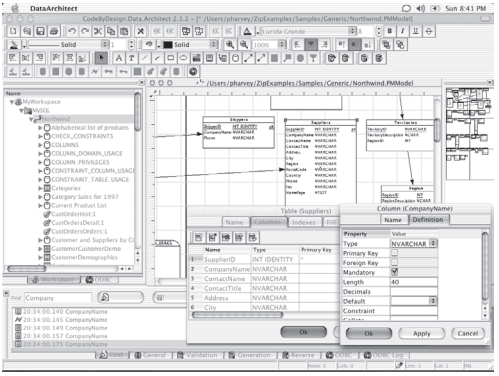

User Interfaces## User Interfaces

The standard distribution of PostgreSQL comes with command-line tools for administering the database. However, there is a wide range of commercial and open-source graphical administration and design tools that support PostgreSQL. Software developers may also access PostgreSQL through a comprehensive set of programming interfaces.

### Interactive Terminal Interfaces

Like most database systems, PostgreSQL offers command-line tools for database administration. The main interactive terminal client is psql, which is modeled after the Unix shell and allows execution of SQL commands on the server, as well as several other operations (such as client-side copying). Some of its features are:

- **Variables.** psql provides variable substitution features, similar to common Unix command shells.

- **SQL interpolation.** The user can substitute (“interpolate”) psql variables into regular SQL statements by placing a colon in front of the variable name.

- **Command-line editing.** psql uses the GNU readline library for convenient line editing, with tab-completion support.

PostgreSQL may also be accessed from a Tcl/Tk shell, which provides a flexible scripting language commonly used for rapid prototyping. This functionality is enabled in Tcl/Tk by loading the pgtcl library, which is distributed as an optional extension to PostgreSQL.

### Graphical Interfaces

The standard distribution of PostgreSQL does not contain any graphical tools. However, several graphical user interface tools exist, and users can choose among  

**Figure 27.1**    pgAdmin III: An open-source database administration GUI.

commercial and open-source alternatives. Many of these go through rapid release cycles; the following list reflects the state of affairs at the time of this writing.

There are graphical tools for administration, including pgAccess and pgAd- min, the latter of which is shown in Figure 27.1. Tools for database design include TORA and Data Architect, the latter of which is shown in Figure 27.2. PostgreSQL works with several commercial forms-design and report-generation tools. Open- source alternatives include Rekall (shown in Figures 27.3 and 27.4), GNU Report Generator, and a more comprehensive tool suite, GNU Enterprise.

### Programming Language Interfaces

PostgreSQL provides native interfaces for ODBC and JDBC, as well as bindings for most programming languages, including C, C++, PHP, Perl, Tcl/Tk, ECPG, Python, and Ruby.

The libpq library provides the C API for PostgreSQL; libpq is also the un- derlying engine for most programming-language bindings. The libpq library supports both synchronous and asynchronous execution of SQL commands and prepared statements, through a reentrant and thread-safe interface. The connec- tion parameters of libpq may be configured in several flexible ways, such as  

**Figure 27.2** Data Architect: A multiplatform database design GUI.

setting environment variables, placing settings in a local file, or creating entries on an LDAP server.

