  

## PART 8

# ADVANCED TOPICS
 Chapter 24 covers a number of advanced topics in application development, starting with performance tuning to improve application speed. It then discusses standard benchmarks that are used as measures of commercial database-system performance. Issues in application development, such as application testing and application migration are discussed next. The chapter concludes with an overview of the standardization process and existing database-language standards.

Chapter 25 describes spatial and temporal data types, and multimedia data, and the issues in storing such data in databases. Database issues related to mobile computing systems are also described in this chapter.

Finally, Chapter 26 describes several advanced transaction-processing tech- niques, including transaction-processing monitors, transactional workflows, and transaction processing issues in electronic commerce. The chapter then discusses main-memory database systems and real-time transaction systems, and concludes with a discussion of long-duration transactions.

# C H A P T E R  24 
# Advanced Application Development

There are a number of tasks in application development. We saw earlier in Chap- ters 7 to 9 how to design and build an application. One of the aspects of application design is the performance one expects out of the application. In fact, it is common to find that once an application has been built, it runs slower than the designers wanted, or handles fewer transactions per second than they required. An appli- cation that takes an excessive amount of time to perform requested actions can cause user dissatisfaction at best and be completely unusable at worst.

Applications can be made to run significantly faster by performance tuning, which consists of finding and eliminating bottlenecks and adding appropriate hardware such as memory or disks. There are many things an application devel- oper can do to tune the application, and there are things that a database-system administrator can do to speed up processing for an application.

Benchmarks are standardized sets of tasks that help to characterize the per- formance of database systems. They are useful to get a rough idea of the hardware and software requirements of an application, even before the application is built.

Applications must be tested as they are being developed. Testing requires generation of database states and test inputs, and verifying that the outputs match the expected outputs. We discuss issues in application testing. Legacy systems are application systems that are outdated and usually based on older-generation technology. However, they are often at the core of organizations, and run mission- critical applications. We outline issues in interfacing with and issues in migrating away from legacy systems, replacing them with more modern systems.

Standards are very important for application development, especially in the age of the Internet, since applications need to communicate with each other to perform useful tasks. A variety of standards have been proposed that affect database-application development.

## 24.1 Performance Tuning

Tuning the performance of a system involves adjusting various parameters and design choices to improve its performance for a specific application. Various aspects of a database-system design—ranging from high-level aspects such as the schema and transaction design to database parameters such as buffer sizes, down to hardware issues such as number of disks—affect the performance of an application. Each of these aspects can be adjusted so that performance is improved.

### 24.1.1 Improving Set Orientation

When SQL queries are executed from an application program, it is often the case that a query is executed frequently, but with different values for a parameter. Each call has an overhead of communication with the server, in addition to processing overheads at the server.

For example, consider a program that steps through each department, in- voking an embedded SQL query to find the total salary of all instructors in the department:


>**select sum**(_salary_) 
**from** _instructor_ 
**where** _dept name_\= ?


If the _instructor_ relation does not have a clustered index on _dept name_, each such query will result in a scan of the relation. Even if there is such an index, a random I/O operation will be required for each _dept name_ value.

Instead, we can use a single SQL query to find total salary expenses of each department:


>**select** _dept name_, 
**sum**(_salary_) **from** 
_instructor_ **group by** _dept name_;


This query can be evaluated with a single scan of the _instructor_ relation, avoiding random I/O for each department. The results can be fetched to the client side using a single round of communication, and the client program can then step through the results to find the aggregate for each department. Combining multiple SQL queries into a single SQL query as above can reduce execution costs greatly in many cases–for example, if the _instructor_ relation is very large and has a large number of departments.

The JDBC API also provides a feature called **batch update** that allows a number of inserts to be performed using a single communication with the database. Figure 24.1 illustrates the use of this feature. The code shown in the figure requires only one round of communication with the database, when the executeBatch() method is executed, in contrast to similar code without the batch update feature that we saw earlier in Figure 5.2. In the absence of batch update, as many rounds of communication with the database are required as there are instructors to be inserted. The batch update feature also enables the database to process a batch of PreparedStatement 

```js
pStmt = conn.prepareStatement( "insert into instructor values(?,?,?,?)");
pStmt.setString(1, "88877"); 
pStmt.setString(2, "Perry"); 
pStmt.setInt(3, "Finance"); 
pStmt.setInt(4, 125000); 
pStmt.addBatch( ); 
pStmt.setString(1, "88878"); 
pStmt.setString(2, "Thierry"); 
pStmt.setInt(3, "Physics"); 
pStmt.setInt(4, 100000); 
pStmt.addBatch( ); 
pStmt.executeBatch( );
```
**Figure 24.1** Batch update in JDBC.

inserts at once, which can potentially be done much more efficiently than a series of single record inserts.

Another technique used widely in client–server systems to reduce the cost of communication and SQL compilation is to use stored procedures, where queries are stored at the server in the form of procedures, which may be precompiled. Clients can invoke these stored procedures, rather than communicate a series of queries.

Another aspect of improving set orientation lies in rewriting queries with **nested subqueries**. In the past, optimizers on many database systems were not particularly good, so how a query was written would have a big influence on how it was executed, and therefore on the performance. Today’s advanced optimizers can transform even badly written queries and execute them efficiently, so the need for tuning individual queries is less important than it used to be. However, complex queries containing nested subqueries are not optimized very well by many optimizers.

We saw techniques for nested subquery decorrelation in Section 13.4.4. If a subquery is not decorrelated, it gets executed repeatedly, potentially resulting in a great deal of random I/O. In contrast, decorrelation allows efficient set-oriented operations such as joins to be used, minimizing random I/O. Most database query optimizers incorporate some forms of decorrelation, but some can handle only very simple nested subqueries. The execution plan chosen by the optimizer can be found as described earlier in Chapter 13. If the optimizer has not succeeded in decorrelating a nested subquery, the query can be decorrelated by rewriting it manually.

### 24.1.2 Tuning of Bulk Loads and Updates

When loading a large volume of data into a database (called a **bulk load** oper- ation), performance is usually very poor if the inserts are carried out a separate SQL insert statements. One reason is the overhead of parsing each SQL query; a more important reason is that performing integrity constraint checks and index updates separately for each inserted tuple results in a large number of random I/O operations. If the inserts were done as a large batch, integrity-constraint check- ing and index update can be done in a much more set-oriented fashion, reducing overheads greatly; performance improvements of an order-of-magnitude or more are not uncommon.
To support bulk load operations, most database systems provide a **bulk im- port** utility, and a corresponding **bulk export** utility. The bulk-import utility reads data from a file, and performs integrity constraint checking as well as index maintenance in a very efficient manner. Common input and output file format supported by such bulk import/export utilities include text files with characters such as commas or tabs separating attribute values, with each record in a line of its own (such file formats are referred to as _comma-separated values_ or _tab-separated values_ formats). Database specific binary formats, as well as XML formats are also supported by bulk import/export utilities. The names of the bulk import/export utilities differ by database. In PostgreSQL, the utilities are called pg dump and pg restore (PostgreSQL also provides an SQL command **copy** which provides similar functionality). The bulk import/export utility in Oracle is called **SQL\*Loader**, the utility in DB2 is called load, and the utility in SQL Server is called bcp (SQL Server also provides an SQL command called **bulk insert**).

We now consider the case of tuning of bulk updates. Suppose we have a rela- tion _funds received_(_dept name_, _amount_) that stores funds received (say, by electronic funds transfer) for each of a set of departments. Suppose now that we want to add the amounts to the balances of the corresponding department budgets. In order to use the SQL update statement to carry out this task, we have to perform a look up on the _funds received_ relation for each tuple in the _department_ relation. We can use subqueries in the update clause to carry out this task, as follows: We assume for simplicity that the relation _funds received_ contains at most one tuple for each department.

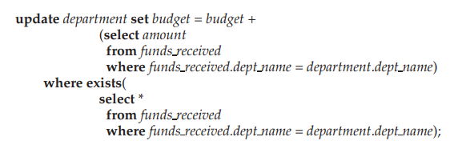

Note that the condition in the **where** clause of the update ensures that only accounts with corresponding tuples in _funds received_ are updated, while the sub- query within the **set** clause computes the amount to be added to each such department.

There are many applications that require updates such as that illustrated above. Typically, there is a table, which we shall call the **master table**, and updates to the master table are received as a batch. Now the master table has to be correspondingly updated. SQL:2003 provides a special construct, called the **merge** construct, to simplify the task of performing such merging of information. For example, the above update can be expressed using **merge** as follows:

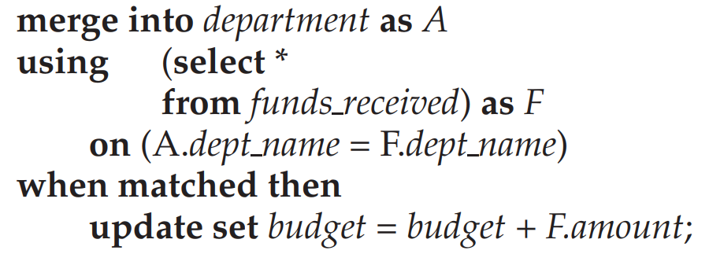


When a record from the subquery in the **using** clause matches a record in the _department_ relation, the **when matched** clause is executed, which can execute an update on the relation; in this case, the matching record in the _department_ relation is updated as shown.

The **merge** statement can also have a **when not matched then** clause, which permits insertion of new records into the relation. In the above example, when there is no matching department for a _funds received_ tuple, the insertion action could create a new department record (with a null _building_) using the following clause:

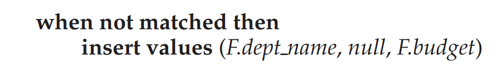

Although not very meaningful in this example,1 the **when not matched then** clause can be quite useful in other cases. For example, suppose the local rela- tion is a copy of a master relation, and we receive updated as well as newly in- serted records from the master relation. The **merge** statement can update matched records (these would be updated old records) and insert records that are not matched (these would be new records).

Not all SQL implementations support the **merge** statement currently; see the respective system manuals for further details.

### 24.1.3 Location of Bottlenecks

The performance of most systems (at least before they are tuned) is usually limited primarily by the performance of one or a few components, called **bottlenecks**. For instance, a program may spend 80 percent of its time in a small loop deep in the code, and the remaining 20 percent of the time on the rest of the code; the small loop then is a bottleneck. Improving the performance of a component that is not a bottleneck does little to improve the overall speed of the system; in the example, improving the speed of the rest of the code cannot lead to more than a

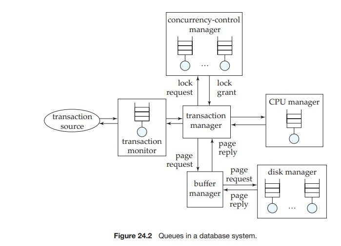

20 percent improvement overall, whereas improving the speed of the bottleneck loop could result in an improvement of nearly 80 percent overall, in the best case.

Hence, when tuning a system, we must first try to discover what the bot- tlenecks are and then eliminate them by improving the performance of system components causing the bottlenecks. When one bottleneck is removed, it may turn out that another component becomes the bottleneck. In a well-balanced system, no single component is the bottleneck. If the system contains bottlenecks, com- ponents that are not part of the bottleneck are underutilized, and could perhaps have been replaced by cheaper components with lower performance.

For simple programs, the time spent in each region of the code determines the overall execution time. However, database systems are much more complex, and can be modeled as **queueing systems**. A transaction requests various ser- vices from the database system, starting from entry into a server process, disk reads during execution, CPU cycles, and locks for concurrency control. Each of these services has a queue associated with it, and small transactions may spend most of their time waiting in queues—especially in disk I/O queues—instead of executing code. Figure 24.2 illustrates some of the queues in a database system.

As a result of the numerous queues in the database, bottlenecks in a database system typically show up in the form of long queues for a particular service, or, equivalently, in high utilizations for a particular service. If requests are spaced exactly uniformly, and the time to service a request is less than or equal to the time before the next request arrives, then each request will find the resource idle and can therefore start execution immediately without waiting. Unfortunately, the arrival of requests in a database system is never so uniform and is instead random.

If a resource, such as a disk, has a low utilization, then, when a request is made, the resource is likely to be idle, in which case the waiting time for the request will be 0. Assuming uniformly randomly distributed arrivals, the length of the queue (and correspondingly the waiting time) go up exponentially with utilization; as utilization approaches 100 percent, the queue length increases sharply, resulting in excessively long waiting times. The utilization of a resource should be kept low enough that queue length is short. As a rule of the thumb, utilizations of around 70 percent are considered to be good, and utilizations above 90 percent are considered excessive, since they will result in significant delays. To learn more about the theory of queueing systems, generally referred to as **queueing theory**, you can consult the references cited in the bibliographical notes.

### 24.1.4 Tunable Parameters

Database administrators can tune a database system at three levels. The lowest level is at the hardware level. Options for tuning systems at this level include adding disks or using a RAID system if disk I/O is a bottleneck, adding more memory if the disk buffer size is a bottleneck, or moving to a faster processor if CPU use is a bottleneck.

The second level consists of the database-system parameters, such as buffer size and checkpointing intervals. The exact set of database-system parameters that can be tuned depends on the specific database system. Most database-system manuals provide information on what database-system parameters can be ad- justed, and how you should choose values for the parameters. Well-designed database systems perform as much tuning as possible automatically, freeing the user or database administrator from the burden. For instance, in many database systems the buffer size is fixed but tunable. If the system automatically adjusts the buffer size by observing indicators such as page-fault rates, then the database administrator will not have to worry about tuning the buffer size.

The third level is the highest level. It includes the schema and transactions. The administrator can tune the design of the schema, the indices that are created, and the transactions that are executed, to improve performance. Tuning at this level is comparatively system independent.

The three levels of tuning interact with one another; we must consider them together when tuning a system. For example, tuning at a higher level may result in the hardware bottleneck changing from the disk system to the CPU, or vice versa.

### 24.1.5 Tuning of Hardware

Even in a well-designed transaction processing system, each transaction usually has to do at least a few I/O operations, if the data required by the transaction are on disk. An important factor in tuning a transaction processing system is to make sure that the disk subsystem can handle the rate at which I/O operations are required. For instance, consider a disk that supports an access time of about 10 milliseconds, and average transfer rate of 25 to 100 megabytes per second (a fairly typical disk today). Such a disk would support a little under 100 random-access I/O operations of 4 kilobytes each per second. If each transaction requires just 2 I/O operations, a single disk would support at most 50 transactions per second. The only way to support more transactions per second is to increase the number of disks. If the system needs to support _n_ transactions per second, each performing 2 I/O operations, data must be striped (or otherwise partitioned) across at least _n/_50 disks (ignoring skew).

Notice here that the limiting factor is not the capacity of the disk, but the speed at which random data can be accessed (limited in turn by the speed at which the disk arm can move). The number of I/O operations per transaction can be reduced by storing more data in memory. If all data are in memory, there will be no disk I/O except for writes. Keeping frequently used data in memory reduces the number of disk I/Os, and is worth the extra cost of memory. Keeping very infrequently used data in memory would be a waste, since memory is much more expensive than disk.

The question is, for a given amount of money available for spending on disks or memory, what is the best way to spend the money to achieve the maximum number of transactions per second. A reduction of 1 I/O per second saves:

```c
(price per disk drive)/(access per second per disk)
```
Thus, if a particular page is accessed _n_ times per second, the saving due to keeping it in memory is _n_ times the above value. Storing a page in memory costs:

```c
(price per megabyte of memory)/(pages per megabyte of memory)
```

Thus, the break-even point is:

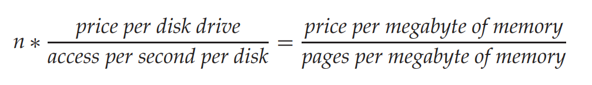

We can rearrange the equation and substitute current values for each of the above parameters to get a value for _n_; if a page is accessed more frequently than this, it is worth buying enough memory to store it. Current disk technology and memory and disk prices (which we assume to be about $50 per disk, and $0.020 per megabyte) give a value of _n_ around 1_/_6400 times per second (or equivalently, once in nearly 2 hours) for pages that are randomly accessed; with disk and memory cost and speeds as of some years ago, the corresponding value was in 5 minutes.

This reasoning is captured by the rule of thumb that was originally called the **5-minute rule**: if a page is used more frequently than once in 5 minutes, it should be cached in memory. In other words, some years ago, the rule suggested buying enough memory to cache all pages that are accessed at least once in 5 minutes on average. Today, it is worth buying enough memory to cache all pages that are accessed at least once in 2 hours on average. For data that are accessed less frequently, buy enough disks to support the rate of I/O required for the data.

For data that are sequentially accessed, significantly more pages can be read per second. Assuming 1 megabyte of data is read at a time, some years ago we had the **1-minute rule**, which said that sequentially accessed data should be cached in memory if they are used at least once in 1 minute. The corresponding number, with current memory and disk costs from our earlier example, is around 30 seconds. Surprisingly, this figure has not changed all that much over the years, since disk transfer rates have increased greatly, even though the price of a megabyte of memory has reduced greatly compared to the price of a disk.

Clearly the amount of data read per I/O operation greatly affects the time above; in fact the 5-minute rule still holds if about 100 kilobytes of data are read or written per I/O operation.

The 5-minute rule of thumb and its variants take only the number of I/O operations into account, and do not consider factors such as response time. Some applications need to keep even infrequently used data in memory, to support response times that are less than or comparable to disk-access time.

With the wide availability of flash memory, and “solid-state disks” based on flash memory, system designers can now choose to store frequently used data in flash storage, instead of storing it on disk. Alternatively, in the **flash-as-buffer** approach, flash storage is used as a persistent buffer, with each block having a permanent location on disk, but stored in flash instead of being written to disk as long as it is frequently used. When flash storage is full, a block that is not frequently used is evicted, and flushed back to disk if it was updated after being read from disk.

The flash-as-buffer approach requires changes in the database system itself. Even if a database system does not support flash as a buffer, a database admin- istrator can control the mapping of relations or indices to disks, and allocate frequently used relations/indices to flash storage. The tablespace feature, sup- ported by most database systems, can be used to control the mapping, by creating a tablespace on flash storage and assigning desired relations and indices to that tablespace. Controlling the mapping at a finer level of granularity than a relation, however, requires changes to the database-system code.

The “5-minute” rule has been extended to the case where data can be stored on flash, in addition to main memory and disk. See the bibliographical notes for references to more information.

Another aspect of tuning is whether to use RAID 1 or RAID 5. The answer depends on how frequently the data are updated, since RAID 5 is much slower than RAID 1 on random writes: RAID 5 requires 2 reads and 2 writes to execute a single random write request. If an application performs _r_ random reads and _w_ random writes per second to support a particular throughput rate, a RAID 5 implementation would require _r_ \+ 4_w_ I/O operations per second whereas a RAID 1 implementation would require _r_ \+ 2_w_ I/O operations per second. We can then calculate the number of disks required to support the required I/O operations per  
second by dividing the result of the calculation by 100 I/O operations per second (for current-generation disks). For many applications, _r_ and _w_ are large enough that the (_r_ \+ _w_)_/_100 disks can easily hold two copies of all the data. For such applications, if RAID 1 is used, the required number of disks is actually less than the required number of disks if RAID 5 is used! Thus RAID 5 is useful only when the data storage requirements are very large, but the update rates, and particularly random update rates, are small, that is, for very large and very “cold” data.

### 24.1.6 Tuning of the Schema

Within the constraints of the chosen normal form, it is possible to partition rela- tions vertically. For example, consider the _course_ relation, with the schema:

```c
course(course id,title,dept name,credits_)
```

for which _course id_ is a key. Within the constraints of the normal forms (BCNF and third normal forms), we can partition the _course_ relation into two relations:

```c
course_credit(course_id,credits)
course_title_dept(course id, title,dept_name)
```

The two representations are logically equivalent, since _course id_ is a key, but they have different performance characteristics.

If most accesses to course information look at only the _course id_ and _credits_, then they can be run against the _course credit_ relation, and access is likely to be somewhat faster, since the _title_ and _dept name_ attributes are not fetched. For the same reason, more tuples of _course credit_ will fit in the buffer than corresponding tuples of _course_, again leading to faster performance. This effect would be par- ticularly marked if the _title_ and _dept name_ attributes were large. Hence, a schema consisting of _course credit_ and _course title dept_ would be preferable to a schema consisting of the _course_ relation in this case.

On the other hand, if most accesses to course information require both _dept name_ and _credits_, using the _course_ relation would be preferable, since the cost of

the join of _course credit_ and _course title dept_ would be avoided. Also, the storage overhead would be lower, since there would be only one relation, and the attribute _course id_ would not be replicated.

The **column store** approach to storing data is based on vertical partitioning, but takes it to the limit by storing each attribute (column) of the relation in a separate file. Column stores have been shown to perform well for several data- warehouse applications.

Another trick to improve performance is to store a _denormalized relation_, such as a join of _instructor_ and _department_, where the information about _dept name_, _building_, and _budget_ is repeated for every instructor. More effort has to be expended to make sure the relation is consistent whenever an update is carried out. However, a query that fetches the names of the instructors and the associated buildings will be speeded up, since the join of _instructor_ and _department_ will have been precomputed. If such a query is executed frequently, and has to be performed as efficiently as possible, the denormalized relation could be beneficial.

Materialized views can provide the benefits that denormalized relations pro- vide, at the cost of some extra storage; we describe performance tuning of ma- terialized views in Section 24.1.8. A major advantage to materialized views over denormalized relations is that maintaining consistency of redundant data be- comes the job of the database system, not the programmer. Thus, materialized views are preferable, whenever they are supported by the database system.

Another approach to speed up the computation of the join without material- izing it, is to cluster records that would match in the join on the same disk page. We saw such clustered file organizations in Section 10.6.2.

### 24.1.7 Tuning of Indices

We can tune the indices in a database system to improve performance. If queries are the bottleneck, we can often speed them up by creating appropriate indices on relations. If updates are the bottleneck, there may be too many indices, which have to be updated when the relations are updated. Removing indices may speed up certain updates.

The choice of the type of index also is important. Some database systems support different kinds of indices, such as hash indices and B-tree indices. If range queries are common, B-tree indices are preferable to hash indices. Whether to make an index a clustered index is another tunable parameter. Only one index on a relation can be made clustered, by storing the relation sorted on the index attributes. Generally, the index that benefits the greatest number of queries and updates should be made clustered.

To help identify what indices to create, and which index (if any) on each relation should be clustered, most commercial database systems provide _tuning wizards_; these are described in more detail in Section 24.1.9. These tools use the past history of queries and updates (called the _workload_) to estimate the effects of various indices on the execution time of the queries and updates in the workload. Recommendations on what indices to create are based on these estimates.

### 24.1.8 Using Materialized Views

Maintaining materialized views can greatly speed up certain types of queries, in particular aggregate queries. Recall the example from Section 13.5 where the total salary for each department (obtained by summing the salary of each instructor in the department) is required frequently. As we saw in that section, creating a materialized view storing the total salary for each department can greatly speed up such queries.

Materialized views should be used with care, however, since there is not only space overhead for storing them but, more important, there is also time overhead for maintaining materialized views. In the case of **immediate view maintenance**, if the updates of a transaction affect the materialized view, the materialized view must be updated as part of the same transaction. The transaction may therefore run slower. In the case of **deferred view maintenance**, the materialized view is updated later; until it is updated, the materialized view may be inconsistent with the database relations. For instance, the materialized view may be brought up- to-date when a query uses the view, or periodically. Using deferred maintenance reduces the burden on update transactions.

The database administrator is responsible for the selection of materialized views and for view-maintenance policies. The database administrator can make the selection manually by examining the types of queries in the workload, and finding out which queries need to run faster and which updates/queries may be executed more slowly. From the examination, the database administrator may choose an appropriate set of materialized views. For instance, the administrator may find that a certain aggregate is used frequently, and choose to materialize it, or may find that a particular join is computed frequently, and choose to materialize it.

However, manual choice is tedious for even moderately large sets of query types, and making a good choice may be difficult, since it requires understanding the costs of different alternatives; only the query optimizer can estimate the costs with reasonable accuracy, without actually executing the query. Thus a good set of views may be found only by trial and error—that is, by materializing one or more views, running the workload, and measuring the time taken to run the queries in the workload. The administrator repeats the process until a set of views is found that gives acceptable performance.

A better alternative is to provide support for selecting materialized views within the database system itself, integrated with the query optimizer. This ap- proach is described in more detail in Section 24.1.9.

### 24.1.9 Automated Tuning of Physical Design

Most commercial database systems today provide tools to help the database administrator with index and materialized view selection, and other tasks related to physical database design such as how to partition data in a parallel database system.

These tools examine the **workload** (the history of queries and updates) and suggest indices and views to be materialized. The database administrator may specify the importance of speeding up different queries, which the tool takes into account when selecting views to materialize. Often tuning must be done before the application is fully developed, and the actual database contents may be small on the development database, but expected to be much larger on a production database. Thus, some tuning tools also allow the database administrator to specify information about the expected size of the database and related statistics.

Microsoft’s Database Tuning Assistant, for example, allows the user to ask “what if” questions, whereby the user can pick a view, and the optimizer then estimates the effect of materializing the view on the total cost of the workload and on the individual costs of different types of queries and updates in the workload.

The automatic selection of indices and materialized views is usually imple- mented by enumerating different alternatives and using the query optimizer to estimate the costs and benefits of selecting each alternative by using the workload. Since the number of design alternatives may be extremely large, as also the workload, the selection techniques must be designed carefully.

The first step is to generate a workload. This is usually done by recording all the queries and updates that are executed during some time period. Next, the selection tools perform **workload compression**, that is, create a representation of the workload using a small number of updates and queries. For example, updates of the same form can be represented by a single update with a weight corresponding to how many times the update occurred. Queries of the same form can be similarly replaced by a representative with appropriate weight. After this, queries that are very infrequent and do not have a high cost may be discarded from consideration. The most expensive queries may be chosen to be addressed first. Such workload compression is essential for large workloads.

With the help of the optimizer, the tool would come up with a set of indices and materialized views that could help the queries and updates in the compressed workload. Different combinations of these indices and materialized views can be tried out to find the best combination. However, an exhaustive approach would be totally impractical, since the number of potential indices and materialized views is already large, and each subset of these is a potential design alternative, leading to an exponential number of alternatives. Heuristics are used to reduce the space of alternatives, that is, to reduce the number of combinations considered.

Greedy heuristics for index and materialized view selection operate as fol- lows: They estimate the benefits of materializing different indices or views (using the optimizer’s cost estimation functionality as a subroutine). They then choose the index or view that gives either the maximum benefit or the maximum benefit per unit space (that is, benefit divided by the space required to store the index or view). The cost of maintaining the index or view must be taken into account when computing the benefit. Once the heuristic has selected an index or view, the benefits of other indices or views may have changed, so the heuristic recomputes these, and chooses the next best index or view for materialization. The process continues until either the available disk space for storing indices or materialized views is exhausted, or the cost of maintaining the remaining candidates is more than the benefit to queries that could use the indices or views.

Real-world index and materialized-view selection tools usually incorporate some elements of greedy selection, but use other techniques to get better results. They also support other aspects of physical database design, such as deciding how to partition a relation in a parallel database, or what physical storage mechanism to use for a relation.

### 24.1.10 Tuning of Concurrent Transactions

Concurrent execution of different types of transactions can sometimes lead to poor performance because of contention on locks. We first consider the case of read-write contention, which is more common, and then consider the case of write-write contention.

As an example of **read-write contention**, consider the following situation on a banking database. During the day, numerous small update transactions are executed almost continuously. Suppose that a large query that computes statistics on branches is run at the same time. If the query performs a scan on a relation, it may block out all updates on the relation while it runs, and that can have a disastrous effect on the performance of the system.

Several database systems—Oracle, PostgreSQL, and Microsoft SQL Server, for example— support snapshot isolation, whereby queries are executed on a snap- shot of the data, and updates can go on concurrently. (Snapshot isolation is de- scribed in detail in Section 15.7.) Snapshot isolation should be used, if available, for large queries, to avoid lock contention in the above situation. In SQL Server, executing the statement
~~~js
set transaction isolation level snapshot
~~~
at the beginning of a transaction results in snapshot isolation being used for that transaction. In Oracle and PostgreSQL, using the keyword **serializable** in place of the keyword **snapshot** in the above command has the same effect, since both these systems actually use snapshot isolation when the isolation level is set to serializable.

If snapshot isolation is not available, an alternative option is to execute large queries at times when updates are few or nonexistent. However, for databases supporting Web sites, there may be no such quiet period for updates.

Another alternative is to use weaker levels of consistency, such as the **read committed** isolation level, whereby evaluation of the query has a minimal impact on concurrent updates, but the query results are not guaranteed to be consis- tent. The application semantics determine whether approximate (inconsistent) answers are acceptable.

We now consider the case of **write-write contention**. Data items that are updated very frequently can result in poor performance with locking, with many transactions waiting for locks on those data items. Such data items are called **update hot spots**. Update hot spots can cause problems even with snapshot isolation, causing frequent transaction aborts due to write validation failures. A commonly occurring situation that results in an update hot spot is as follows: transactions need to assign unique identifiers to data items being inserted into the database, and to do so they read and increment a sequence counter stored in a tuple in the database. If inserts are frequent, and the sequence counter is locked in a two-phase manner, the tuple containing the sequence counter becomes a hot spot.

One way to improve concurrency is to release the lock on the sequence counter immediately after it is read and incremented; however, after doing so, even if the transaction aborts, the update to the sequence counter should not be rolled back. To understand why, suppose T~1~ increments the sequence counter, and then T~2~ increments the sequence counter before ~T~1 commits; if T~1~ then aborts, rolling back its update, either by restoring the counter to the original value, or by decrementing the counter, will result in the sequence value used by T~2~ getting reused by a subsequent transaction.

Most databases provide a special construct for creating **sequence counters** that implement early, non-two-phase, lock release, coupled with special case treatment of undo logging so that updates to the counter are not rolled back if the transaction aborts. The SQL standard allows a sequence counter to be created using the command:

```c
create sequence _counter1_;
```

In the above command, _counter1_ is the name of the sequence; multiple sequences can be created with different names. The syntax to get a value from the sequence is not standardized; in Oracle, _counter1.nextval_ would return the next value of the sequence, after incrementing it, while the function call _nextval(’counter1’)_ would have the same effect in PostgreSQL, and DB2 uses the syntax **nextval for** _counter1_.

The SQL standard provides an alternative to using an explicit sequence counter, which is useful when the goal is to give unique identifiers to tuples inserted into a relation. To do so, the keyword **identity** can be added to the declaration of an integer attribute of a relation (usually this attribute would also be declared as the primary key). If the value for that attribute is left unspecified in an insert statement for that relation, a unique new value is created automatically for each newly inserted tuple. A non-two-phase locked sequence counter is used inter- nally to implement the **identity** declaration, with the counter incremented each time a tuple is inserted. Several databases including DB2 and SQL Server support the **identity** declaration, although the syntax varies. PostgreSQL supports a data type called **serial**, which provides the same effect; the PostgreSQL type **serial** is implemented by transparently creating a non-two-phase locked sequence.

It is worth noting that since the acquisition of a sequence number by a transac- tion cannot be rolled back if the transaction aborts (for reasons discussed earlier), transaction aborts may result in _gaps in the sequence numbers_ in tuple inserted in the database. For example, there may be tuples with identifier value 1001 and 1003, but no tuple with value 1002, if the transaction that acquired the sequence number 1002 did not commit. Such gaps are not acceptable in some applications; for example, some financial applications require that there be no gaps in bill or receipt numbers. Database provided sequences and automatically incremented attributes should not be used for such applications, since they can result in gaps. A sequence counter stored in normal tuple, which is locked in a two-phase manner, would not be susceptible to such gaps since a transaction abort would restore the sequence counter value, and the next transaction would get the same sequence number, avoiding a gap.

Long update transactions can cause performance problems with system logs, and can increase the time taken to recover from system crashes. If a transaction performs many updates, the system log may become full even before the trans- action completes, in which case the transaction will have to be rolled back. If an update transaction runs for a long time (even with few updates), it may block deletion of old parts of the log, if the logging system is not well designed. Again, this blocking could lead to the log getting filled up.  

To avoid such problems, many database systems impose strict limits on the number of updates that a single transaction can carry out. Even if the system does not impose such limits, it is often helpful to break up a large update transaction into a set of smaller update transactions where possible. For example, a transaction that gives a raise to every employee in a large corporation could be split up into a series of small transactions, each of which updates a small range of employee- ids. Such transactions are called **minibatch transactions**. However, minibatch transactions must be used with care. First, if there are concurrent updates on the set of employees, the result of the set of smaller transactions may not be equivalent to that of the single large transaction. Second, if there is a failure, the salaries of some of the employees would have been increased by committed transactions, but salaries of other employees would not. To avoid this problem, as soon as the system recovers from failure, we must execute the transactions remaining in the batch.

Long transactions, whether read-only or update, can also result in the lock table becoming full. If a single query scans a large relation, the query optimizer would ensure that a relation lock is obtained instead of acquiring a large number of tuple locks. However, if a transaction executes a large number of small queries or updates, it may acquire a large number of locks, resulting in the lock table becoming full.

To avoid this problem, some databases provide for automatic **lock escalation**; with this technique, if a transaction has acquired a large number of tuple locks, tuple locks are upgraded to page locks, or even full relation locks. Recall that with multiple-granularity locking (Section 15.3), once a coarser level lock is obtained, there is no need to record finer-level locks, so tuple lock entries can be removed from the lock table, freeing up space. On databases that do not support lock escalation, it is possible for the transaction to explicitly acquire a relation lock, thereby avoiding the acquisition of tuple locks.

### 24.1.11 Performance Simulation

To test the performance of a database system even before it is installed, we can create a performance-simulation model of the database system. Each service shown in Figure 24.2, such as the CPU, each disk, the buffer, and the concurrency control, is modeled in the simulation. Instead of modeling details of a service, the simulation model may capture only some aspects of each service, such as the **service time**—that is, the time taken to finish processing a request once processing has begun. Thus, the simulation can model a disk access from just the average disk-access time.

Since requests for a service generally have to wait their turn, each service has an associated queue in the simulation model. A transaction consists of a series of requests. The requests are queued up as they arrive, and are serviced according to the policy for that service, such as first come, first served. The models for services such as CPU and the disks conceptually operate in parallel, to account for the fact that these subsystems operate in parallel in a real system.

Once the simulation model for transaction processing is built, the system administrator can run a number of experiments on it. The administrator can use experiments with simulated transactions arriving at different rates to find how the system would behave under various load conditions. The administrator could run other experiments that vary the service times for each service to find out how sensitive the performance is to each of them. System parameters, too, can be varied, so that performance tuning can be done on the simulation model.

## 24.2 Performance Benchmarks

As database servers become more standardized, the differentiating factor among the products of different vendors is those products’ performance. **Performance benchmarks** are suites of tasks that are used to quantify the performance of software systems.

### 24.2.1 Suites of Tasks

Since most software systems, such as databases, are complex, there is a good deal of variation in their implementation by different vendors. As a result, there is a significant amount of variation in their performance on different tasks. One system may be the most efficient on a particular task; another may be the most efficient on a different task. Hence, a single task is usually insufficient to quantify the performance of the system. Instead, the performance of a system is measured by suites of standardized tasks, called _performance benchmarks_.

Combining the performance numbers from multiple tasks must be done with care. Suppose that we have two tasks, T~1~ and T~2~, and that we measure the through- put of a system as the number of transactions of each type that run in a given amount of time—say, 1 second. Suppose that system A runs T~1~ at 99 transactions per second and T~2~ at 1 transaction per second. Similarly, let system B run both T~1~ and T~2~ at 50 transactions per second. Suppose also that a workload has an equal mixture of the two types of transactions.

If we took the average of the two pairs of numbers (that is, 99 and 1, versus 50 and 50), it might appear that the two systems have equal performance. However, it is _wrong_ to take the averages in this fashion—if we ran 50 transactions of each type, system _A_ would take about 50.5 seconds to finish, whereas system _B_ would finish in just 2 seconds!

The example shows that a simple measure of performance is misleading if there is more than one type of transaction. The right way to average out the numbers is to take the **time to completion** for the workload, rather than the average _throughput_ for each transaction type. We can then compute system per- formance accurately in transactions per second for a specified workload. Thus, system A takes 50.5/100, which is 0.505 seconds per transaction, whereas system B takes 0.02 seconds per transaction, on average. In terms of throughput, system A runs at an average of 1.98 transactions per second, whereas system B runs at 50 transactions per second. Assuming that transactions of all the types are equally likely, the correct way to average out the throughputs on different transaction types is to take the **harmonic mean** of the throughputs. The harmonic mean of _n_ throughputs t~1~, . . . , t~n~ is defined as:

For our example, the harmonic mean for the throughputs in system A is 1_._98\. For system B, it is 50. Thus, system B is approximately 25 times faster than system A on a workload consisting of an equal mixture of the two example types of transactions.


### 24.2.2 Database-Application Classes

**Online transaction processing** (**OLTP**) and **decision support**, including **online analytical processing** (**OLAP**), are two broad classes of applications handled by database systems. These two classes of tasks have different requirements. High concurrency and clever techniques to speed up commit processing are required for supporting a high rate of update transactions. On the other hand, good query- evaluation algorithms and query optimization are required for decision support. The architecture of some database systems has been tuned to transaction process- ing; that of others, such as the Teradata series of parallel database systems, has been tuned to decision support. Other vendors try to strike a balance between the two tasks.

Applications usually have a mixture of transaction-processing and decision- support requirements. Hence, which database system is best for an application depends on what mix of the two requirements the application has.

Suppose that we have throughput numbers for the two classes of applications separately, and the application at hand has a mix of transactions in the two classes. We must be careful even about taking the harmonic mean of the throughput numbers, because of **interference** between the transactions. For example, a long- running decision-support transaction may acquire a number of locks, which may prevent all progress of update transactions. The harmonic mean of throughputs should be used only if the transactions do not interfere with one another.

### 24.2.3 The TPC Benchmarks-

The **Transaction Processing Performance Council** (**TPC**) has defined a series of benchmark standards for database systems.

The TPC benchmarks are defined in great detail. They define the set of rela- tions and the sizes of the tuples. They define the number of tuples in the relations not as a fixed number, but rather as a multiple of the number of claimed trans- actions per second, to reflect that a larger rate of transaction execution is likely to be correlated with a larger number of accounts. The performance metric is throughput, expressed as **transactions per second** (**TPS)**. When its performance is measured, the system must provide a response time within certain bounds, so that a high throughput cannot be obtained at the cost of very long response times.

Further, for business applications, cost is of great importance. Hence, the TPC benchmark also measures performance in terms of **price per TPS**. A large system may have a high number of transactions per second, but may be expensive (that is, have a high price per TPS). Moreover, a company cannot claim TPC benchmark numbers for its systems _without_ an external audit that ensures that the system faithfully follows the definition of the benchmark, including full support for the ACID properties of transactions.

The first in the series was the **TPC-A benchmark**, which was defined in 1989. This benchmark simulates a typical bank application by a single type of trans- action that models cash withdrawal and deposit at a bank teller. The transaction updates several relations—such as the bank balance, the teller’s balance, and the customer’s balance—and adds a record to an audit trail relation. The benchmark also incorporates communication with terminals, to model the end-to-end per- formance of the system realistically. The **TPC-B benchmark** was designed to test the core performance of the database system, along with the operating system on which the system runs. It removes the parts of the TPC-A benchmark that deal with users, communication, and terminals, to focus on the back-end database server. Neither TPC-A nor TPC-B is in use today.

The **TPC-C benchmark** was designed to model a more complex system than the TPC-A benchmark. The TPC-C benchmark concentrates on the main activities in an order-entry environment, such as entering and delivering orders, recording payments, checking status of orders, and monitoring levels of stock. The TPC-C benchmark is still widely used for benchmarking online transaction processing (OLTP) systems. The more recent TPC-E benchmark is also aimed at OLTP systems, but is based on a model of a brokerage firm, with customers who interact with the firm and generate transactions. The firm in turn interacts with financial markets to execute transactions.

The **TPC-D benchmark** was designed to test the performance of database systems on decision-support queries. Decision-support systems are becoming in- creasingly important today. The TPC-A, TPC-B, and TPC-C benchmarks measure performance on transaction-processing workloads, and should not be used as a measure of performance on decision-support queries. The D in TPC-D stands for **decision support**. The TPC-D benchmark schema models a sales/distribution ap- plication, with parts, suppliers, customers, and orders, along with some auxiliary information. The sizes of the relations are defined as a ratio, and database size is the total size of all the relations, expressed in gigabytes. TPC-D at scale factor 1 represents the TPC-D benchmark on a 1-gigabyte database, while scale factor 10 represents a 10-gigabyte database. The benchmark workload consists of a set of 17 SQL queries modeling common tasks executed on decision-support systems. Some of the queries make use of complex SQL features, such as aggregation and nested queries.

The benchmark’s users soon realized that the various TPC-D queries could be significantly speeded up by using materialized views and other redundant information. There are applications, such as periodic reporting tasks, where the queries are known in advance and materialized view can be carefully selected to speed up the queries. It is necessary, however, to account for the overhead of maintaining materialized views.

The **TPC-H benchmark** (where H represents **ad hoc**) is a refinement of the TPC-D benchmark. The schema is the same, but there are 22 queries, of which 16 are from TPC-D. In addition, there are two updates, a set of inserts, and a set of deletes. TPC-H prohibits materialized views and other redundant information, and permits indices only on primary and foreign keys. This benchmark models ad hoc querying where the queries are not known beforehand, so it is not possible to create appropriate materialized views ahead of time. A variant, TPC-R (where R stands for “reporting”), which is no longer in use, allowed the use of materialized views and other redundant information.

TPC-H measures performance in this way: The **power test** runs the queries and updates one at a time sequentially, and 3600 seconds divided by the geometric mean of the execution times of the queries (in seconds) gives a measure of queries per hour. The **throughput test** runs multiple streams in parallel, with each stream executing all 22 queries. There is also a parallel update stream. Here the total time for the entire run is used to compute the number of queries per hour.

The **composite query per hour metric**, which is the overall metric, is then obtained as the square root of the product of the power and throughput metrics. A **composite price/performance metric** is defined by dividing the system price by the composite metric.

The **TPC-W Web commerce benchmark** is an end-to-end benchmark that models Web sites having static content (primarily images) and dynamic content generated from a database. Caching of dynamic content is specifically permitted, since it is very useful for speeding up Web sites. The benchmark models an electronic bookstore, and like other TPC benchmarks, provides for different scale factors. The primary performance metrics are **Web interactions per second (WIPS)** and price per WIPS. However, the TPC-W benchmark is no longer in use.

## 24.3 Other Issues in Application Development

In this section, we discuss two issues in application development: testing of applications, and migration of applications.

### 24.3.1 Testing Applications

Testing of programs involves designing a **test suite**, that is, a collection of test cases. Testing is not a one-time process, since programs evolve continuously, and bugs may appear as an unintended consequence of a change in the program; such a bug is referred to as program **regression**. Thus, after every change to a program, the program must be tested again. It is usually infeasible to have a human perform tests after every change to a program. Instead, expected test outputs are stored with each test case in a test suite. **Regression testing** involves running the program on each test case in a test suite, and checking that the program generates the expected test output. 

In the context of database applications, a test case consists of two parts: a database state, and an input to a specific interface of the application.

SQL queries can have subtle bugs that can be difficult to catch. For example, a query may execute _r  s_, when it should have actually performed _r  s_. The difference between these two queries would be found only if the test database had an _r_ tuple with no matching _s_ tuple. Thus, it is important to create test databases that can catch commonly occurring errors. Such errors are referred to as **mutations**, since they are usually small changes to a query (or program). A test case that produces different outputs on an intended query and a mutant of the query is said to **kill the mutant**. A test suite should have test cases that kill (most) commonly occurring mutants.

If a test case performs an update on the database, to check that it executed properly one must verify that the contents of the database match the expected contents. Thus, the expected output consists not only of data displayed on the user’s screen, but also (updates to) the database state.

Since the database state can be rather large, multiple test cases would share a common database state. Testing is complicated by the fact that if a test case performs an update on the database, the results of other test cases run subse- quently on the same database may not match the expected results. The other test cases would then be erroneously reported as having failed. To avoid this problem, whenever a test case performs an update, the database state must be restored to its original state after running the test.

Testing can also be used to ensure that an application meets performance requirements. To carry out such **performance testing**, the test database must be of the same size as the real database would be. In some cases, there is already existing data on which performance testing can be carried out. In other cases, a test database of the required size must be generated; there are several tools available for generating such test databases. These tools ensure that the generated data satisfies constraints such as primary and foreign key constraints. They may additionally generate data that looks meaningful, for example, by populating a name attribute using meaningful names instead of random strings. Some tools also allow data distributions to be specified; for example, a university database may require a distribution with most students in the range of 18 to 25 years, and most faculty in the range of 25 to 65 years.

Even if there is an existing database, organizations usually do not want to reveal sensitive data to an external organization that may be carrying out the performance tests. In such a situation, a copy of the real database may be made, and the values in the copy may be modified in such a way that any sensitive data, such as credit-card numbers, social-security numbers, or dates of birth, are **obfuscated**. Obfuscation is done in most cases by replacing a real value with a randomly generated value (taking care to also update all references to that value, in case the value is a primary key). On the other hand, if the application execution depends on the value, such as the date of birth in an application that performs different actions based on the date of birth, obfuscation may make small random changes in the value instead of replacing it completely.

### 24.3.2 Application Migration

**Legacy systems** are older-generation application systems that are in use by an organization, but that the organization wishes to replace with a different applica- tion. For example, many organizations developed applications in house, but may decide to replace them with a commercial product. In some cases, a legacy system may use old technology that is incompatible with current-generation standards and systems. Some legacy systems in operation today are several decades old and are based on technologies such as databases that use the network or hierarchical data models, or use Cobol and file systems without a database. Such systems may still contain valuable data, and may support critical applications.

Replacing legacy applications with new applications is often costly in terms of both time and money, since they are often very large, consisting of millions of lines of code developed by teams of programmers, often over several decades. They contain large amounts of data that must be ported to the new application, which may use a completely different schema. Switchover from an old to a new application involves retraining large numbers of staff. Switchover must usually be done without any disruption, with data entered in the old system available through the new system as well.

Many organizations attempt to avoid replacing legacy systems, and instead try to interoperate them with newer systems. One approach used to interoperate between relational databases and legacy databases is to build a layer, called a **wrapper**, on top of the legacy systems that can make the legacy system appear to be a relational database. The wrapper may provide support for ODBC or other interconnection standards such as OLE-DB, which can be used to query and update the legacy system. The wrapper is responsible for converting relational queries and updates into queries and updates on the legacy system.

When an organization decides to replace a legacy system with a new system, it may follow a process called **reverse engineering**, which consists of going over the code of the legacy system to come up with schema designs in the required data model (such as an E-R model or an object-oriented data model). Reverse engineering also examines the code to find out what procedures and processes were implemented, in order to get a high-level model of the system. Reverse engineering is needed because legacy systems usually do not have high-level documentation of their schema and overall system design. When coming up with the design of a new system, developers review the design, so that it can be improved rather than just reimplemented as is. Extensive coding is required to support all the functionality (such as user interface and reporting systems) that was provided by the legacy system. The overall process is called **re-engineering**.

When a new system has been built and tested, the system must be populated with data from the legacy system, and all further activities must be carried out on the new system. However, abruptly transitioning to a new system, which is called the **big-bang approach**, carries several risks. First, users may not be familiar with the interfaces of the new system. Second, there may be bugs or performance problems in the new system that were not discovered when it was tested. Such problems may lead to great losses for companies, since their ability to carry out critical transactions such as sales and purchases may be severely affected. In some extreme cases the new system has even been abandoned, and the legacy system reused, after an attempted switchover failed.

An alternative approach, called the **chicken-little approach**, incrementally replaces the functionality of the legacy system. For example, the new user inter- faces may be used with the old system in the back end, or vice versa. Another option is to use the new system only for some functionality that can be decou- pled from the legacy system. In either case, the legacy and new systems coexist for some time. There is therefore a need for developing and using wrappers on the legacy system to provide required functionality to interoperate with the new system. This approach therefore has a higher development cost associated with it.

## 24.4 Standardization

**Standards** define the interface of a software system; for example, standards define the syntax and semantics of a programming language, or the functions in an application-program interface, or even a data model (such as the object-oriented database standards). Today, database systems are complex, and are often made up of multiple independently created parts that need to interact. For example, client programs may be created independently of back-end systems, but the two must be able to interact with each other. A company that has multiple heterogeneous database systems may need to exchange data between the databases. Given such a scenario, standards play an important role.

**Formal standards** are those developed by a standards organization or by in- dustry groups, through a public process. Dominant products sometimes become **de facto standards**, in that they become generally accepted as standards with- out any formal process of recognition. Some formal standards, like many aspects of the SQL-92 and SQL:1999 standards, are **anticipatory standards** that lead the marketplace; they define features that vendors then implement in products. In other cases, the standards, or parts of the standards, are **reactionary standards**, in that they attempt to standardize features that some vendors have already imple- mented, and that may even have become de facto standards. SQL-89 was in many ways reactionary, since it standardized features, such as integrity checking, that were already present in the IBM SAA SQL standard and in other databases.

Formal standards committees are typically composed of representatives of the vendors and of members from user groups and standards organizations such as the International Organization for Standardization (ISO) or the American National Standards Institute (ANSI), or professional bodies, such as the Institute of Electrical and Electronics Engineers (IEEE). Formal standards committees meet periodically, and members present proposals for features to be added to or modified in the standard. After a (usually extended) period of discussion, modifications to the proposal, and public review, members vote on whether to accept or reject a feature. Some time after a standard has been defined and implemented, its shortcomings become clear and new requirements become apparent. The process of updating the standard then begins, and a new version of the standard is usually released after a few years. This cycle usually repeats every few years, until eventually (perhaps many years later) the standard becomes technologically irrelevant, or loses its user base.

The DBTG CODASYL standard for network databases, formulated by the Data- base Task Group, was one of the early formal standards for databases. IBM database products formerly established de facto standards, since IBM commanded much of the database market. With the growth of relational databases came a num- ber of new entrants in the database business; hence, the need for formal standards arose. In recent years, Microsoft has created a number of specifications that also have become de facto standards. A notable example is ODBC, which is now used in non-Microsoft environments. JDBC, whose specification was created by Sun Microsystems, is another widely used de facto standard.

This section gives a very high-level overview of different standards, concen- trating on the goals of the standard. The bibliographical notes at the end of the chapter provide references to detailed descriptions of the standards mentioned in this section.

### 24.4.1 SQL Standards

Since SQL is the most widely used query language, much work has been done on standardizing it. ANSI and ISO, with the various database vendors, have played a leading role in this work. The SQL-86 standard was the initial version. The IBM Systems Application Architecture (SAA) standard for SQL was released in 1987. As people identified the need for more features, updated versions of the formal SQL standard were developed, called SQL-89 and SQL-92.

The SQL:1999 version of the SQL standard added a variety of features to SQL. We have seen many of these features in earlier chapters. The SQL:2003 version of the SQL standard is a minor extension of the SQL:1999 standard. Some features such as the SQL:1999 OLAP features (Section 5.6.3) were specified as an amendment to the earlier version of the SQL:1999 standard, instead of waiting for the release of SQL:2003.

The SQL:2003 standard was broken into several parts:

- Part 1: SQL/Framework provides an overview of the standard.

- Part 2: SQL/Foundation defines the basics of the standard: types, schemas, tables, views, query and update statements, expressions, security model, predicates, assignment rules, transaction management, and so on.

- Part 3: SQL/CLI (Call Level Interface) defines application program interfaces to SQL.

- Part 4: SQL/PSM (Persistent Stored Modules) defines extensions to SQL to make it procedural.

- Part 9: SQL/MED (Management of External Data) defines standards or in- terfacing an SQL system to external sources. By writing wrappers, system designers can treat external data sources, such as files or data in nonrela- tional databases, as if they were “foreign” tables.

- Part 10: SQL/OLB (Object Language Bindings) defines standards for embed- ding SQL in Java.

- Part 11: SQL/Schemata (Information and Definition Schema) defines a stan- dard catalog interface.

- Part 13: SQL/JRT (Java Routines and Types) defines standards for accessing routines and types in Java.

- Part 14: SQL/XML defines XML-Related Specifications.

The missing numbers cover features such as temporal data, distributed trans- action processing, and multimedia data, for which there is as yet no agreement on the standards.

The latest versions of the SQL standard are SQL:2006, which added several features related to XML, and SQL:2008, which introduces a number of extensions to the SQL language.

### 24.4.2 Database Connectivity Standards

The **ODBC** standard is a widely used standard for communication between client applications and database systems. ODBC is based on the SQL **Call Level Interface (CLI)** standards developed by the **X/Open** industry consortium and the SQL Access Group, but it has several extensions. The ODBC API defines a CLI, an SQL syntax definition, and rules about permissible sequences of CLI calls. The standard also defines conformance levels for the CLI and the SQL syntax. For example, the core level of the CLI has commands to connect to a database, to prepare and execute SQL statements, to get back results or status values, and to manage transactions. The next level of conformance (level 1) requires support for catalog information retrieval and some other features over and above the core-level CLI; level 2 requires further features, such as ability to send and retrieve arrays of parameter values and to retrieve more detailed catalog information.

ODBC allows a client to connect simultaneously to multiple data sources and to switch among them, but transactions on each are independent; ODBC does not support two-phase commit.

A distributed system provides a more general environment than a client– server system. The X/Open consortium has also developed the **X/Open XA standards** for interoperation of databases. These standards define transaction- management primitives (such as transaction begin, commit, abort, and prepare- to-commit) that compliant databases should provide; a transaction manager can invoke these primitives to implement distributed transactions by two-phase com- mit. The XA standards are independent of the data model and of the specific in- terfaces between clients and databases to exchange data. Thus, we can use the XA protocols to implement a distributed transaction system in which a single transaction can access relational as well as object-oriented databases, yet the transaction manager ensures global consistency via two-phase commit.

There are many data sources that are not relational databases, and in fact may not be databases at all. Examples are flat files and email stores. Microsoft’s **OLE-DB** is a C++ API with goals similar to ODBC, but for nondatabase data sources that may provide only limited querying and update facilities. Just like ODBC, OLE-DB provides constructs for connecting to a data source, starting a session, executing commands, and getting back results in the form of a rowset, which is a set of result rows.

However, OLE-DB differs from ODBC in several ways. To support data sources with limited feature support, features in OLE-DB are divided into a number of interfaces, and a data source may implement only a subset of the interfaces. An OLE-DB program can negotiate with a data source to find what interfaces are supported. In ODBC commands are always in SQL. In OLE-DB, commands may be in any language supported by the data source; while some sources may support SQL, or a limited subset of SQL, other sources may provide only simple capabilities such as accessing data in a flat file, without any query capability. Another major difference of OLE-DB from ODBC is that a rowset is an object that can be shared by multiple applications through shared memory. A rowset object can be updated by one application, and other applications sharing that object will get notified about the change.

The **Active Data Objects (ADO)** API, also created by Microsoft, provides an easy-to-use interface to the OLE-DB functionality, which can be called from scripting languages, such as VBScript and JScript. The newer **ADO.NET** API is designed for applications written in the .NET languages such as C# and Visual Basic.NET. In addition to providing simplified interfaces, it provides an abstraction called the _DataSet_ that permits disconnected data access.

### 24.4.3 Object Database Standards

Standards in the area of object-oriented databases have so far been driven pri- marily by OODB vendors. The **Object Database Management Group** (ODMG) was a group formed by OODB vendors to standardize the data model and language interfaces to OODBs. The C++ language interface specified by ODMG was briefly outlined in Chapter 22. ODMG is no longer active. JDO is a standard for adding persistence to Java.

The **Object Management Group** (OMG) is a consortium of companies, formed with the objective of developing a standard architecture for distributed software applications based on the object-oriented model. OMG brought out the _Object Man- agement Architecture_ (OMA) reference model. The _Object Request Broker_ (ORB) is a component of the OMA architecture that provides message dispatch to distributed objects transparently, so the physical location of the object is not important. The **Common Object Request Broker Architecture** (**CORBA**) provides a detailed spec- ification of the ORB, and includes an **Interface Description Language** (**IDL**), which is used to define the data types used for data interchange. The IDL helps to support data conversion when data are shipped between systems with different data representations.

Microsoft introduced the **Entity data model**, which incorporates ideas from the entity-relationship and object-oriented data models, and an approach to inte- grating querying with the programming language, called **Language Integrated Querying** or **LINQ**. These are likely to become de facto standards.

### 24.4.4 XML-Based Standards

A wide variety of standards based on XML (see Chapter 23) have been de- fined for a wide variety of applications. Many of these standards are related to e-commerce. They include standards promulgated by nonprofit consortia and corporate-backed efforts to create de facto standards.

RosettaNet, which falls into the former category, is an industry consortium that uses XML-based standards to facilitate supply-chain management in the com- puter and information technology industries. Supply-chain management refers to the purchases of material and services that an organization needs to function. In contrast, customer-relationship management refers to the front end of a com- pany’s interaction, dealing with customers. Supply-chain management requires standardization of a variety of things such as:

- **Global company identifier:** RosettaNet specifies a system for uniquely iden- tifying companies, using a 9-digit identifier called _Data Universal Numbering System_ (DUNS).

- **Global product identifier:** RosettaNet specifies a 14-digit _Global Trade Item Number_ (GTIN) for identifying products and services.

- **Global class identifier:** This is a 10-digit hierarchical code for classifying products and services called the _United Nations/Standard Product and Services Code_ (UN/SPSC).

- **Interfaces between trading partners:** RosettaNet _Partner Interface Processes_ (PIPs) define business processes between partners. PIPs are system-to-system XML-based dialogs: They define the formats and semantics of business doc- uments involved in a process and the steps involved in completing a trans- action. Examples of steps could include getting product and service infor- mation, purchase orders, order invoicing, payment, order status requests, inventory management, post-sales support including service warranty, and so on. Exchange of design, configuration, process, and quality information is also possible to coordinate manufacturing activities across organizations.

Participants in electronic marketplaces may store data in a variety of database systems. These systems may use different data models, data formats, and data types. Furthermore, there may be semantic differences (metric versus English measure, distinct monetary currencies, and so forth) in the data. Standards for electronic marketplaces include methods for _wrapping_ each of these heterogeneous systems with an XML schema. These XML _wrappers_ form the basis of a unified view of data across all of the participants in the marketplace.

**Simple Object Access Protocol** (SOAP) is a remote procedure call standard that uses XML to encode data (both parameters and results), and uses HTTP as the transport protocol; that is, a procedure call becomes an HTTP request. SOAP is backed by the World Wide Web Consortium (W3C) and has gained wide ac- ceptance in industry. SOAP can be used in a variety of applications. For instance, in business-to-business e-commerce, applications running at one site can access data from and execute actions at other sites through SOAP.

SOAP and Web services were described in more detail in Section 23.7.3.

### 24.5 Summary

- Tuning of the database-system parameters, as well as the higher-level database design—such as the schema, indices, and transactions—is important for good performance. Queries can be tuned to improve set-orientation, while bulk-loading utilities can greatly speed up data import into a database.
Tuning is best done by identifying bottlenecks and eliminating them. Database systems usually have a variety of tunable parameters, such as buffer sizes, memory size, and number of disks. The set of indices and materialized views can be appropriately chosen to minimize overall cost. Transactions can be tuned to minimize lock contention; snapshot isolation, and sequence numbering facilities supporting early lock release are useful tools for reducing read-write and write-write contention.

- Performance benchmarks play an important role in comparisons of database systems, especially as systems become more standards compliant. The TPC benchmark suites are widely used, and the different TPC benchmarks are use- ful for comparing the performance of databases under different workloads.

- Applications need to be tested extensively as they are developed, and before they are deployed. Testing is used to catch errors, as well as to ensure that performance goals are met.

- Legacy systems are systems based on older-generation technologies such as nonrelational databases or even directly on file systems. Interfacing legacy systems with new-generation systems is often important when they run mission-critical systems. Migrating from legacy systems to new-generation systems must be done carefully to avoid disruptions, which can be very expensive.

- Standards are important because of the complexity of database systems and their need for interoperation. Formal standards exist for SQL. De facto stan- dards, such as ODBC and JDBC, and standards adopted by industry groups, such as CORBA, have played an important role in the growth of client–server database systems.

**Review Terms**

- Performance tuning 
- Set-orientation 
-  Batch update (JDBC) 
-  Bulk load 
- Bulk update 
- Merge statement 
- Bottlenecks 
- Queueing systems 
- Tunable parameters 
- Tuning of hardware 
- Five-minute rule 
- One-minute rule 
- Tuning of the schema 
- Tuning of indices 
- Materialized views 
- Immediate view maintenance 
- Deferred view maintenance 
- Tuning of transactions 
- Lock contention 
- Sequences 
- Minibatch transactions 
- Performance simulation 
- Performance benchmarks 
- Service time 
- Time to completion 
- Database-application classes 
- The TPC benchmarks

    ◦ TPC-A

    ◦ TPC-B
    
    ◦ TPC-C
    
    ◦ TPC-D
    
    ◦ TPC-E
    
    ◦ TPC-H

- Web interactions per second 
- Regression testing 
- Killing mutants 
- Legacy systems 
- Reverse engineering 
- Re-engineering 
- Standardization
    ◦ Formal standards

    ◦ De facto standards

    ◦ Anticipatory standards

    ◦ Reactionary standards

- Database connectivity standards

    ◦ ODBC

    ◦ OLE-DB

    ◦ X/Open XA standards

- Object database standards

    ◦ ODMG

    ◦ CORBA

- XML-based standards

## Practice Exercises

**24.1** Many applications need to generate sequence numbers for each transac- tion.

a. If a sequence counter is locked in two-phase manner, it can become a concurrency bottleneck. Explain why this may be the case.
b. Many database systems support built-in sequence counters that are not locked in two-phase manner; when a transaction requests a se- quence number, the counter is locked, incremented and unlocked. 

i. Explain how such counters can improve concurrency.

ii. Explain why there may be gaps in the sequence numbers belong- ing to the final set of committed transactions.

**24.2** Suppose you are given a relation _r_ (_a , b, c_).

a. Give an example of a situation under which the performance of equality selection queries on attribute _a_ can be greatly affected by how _r_ is clustered.

b. Suppose you also had range selection queries on attribute _b_. Can you cluster _r_ in such a way that the equality selection queries on _r.a_ and the range selection queries on _r.b_ can both be answered efficiently? Explain your answer.

c. If clustering as above is not possible, suggest how both types of queries can be executed efficiently by choosing appropriate indices, assuming your database supports index-only plans (that is, if all in- formation required for a query is available in an index, the database can generate a plan that uses the index but does not access the rela- tion).

**24.3** Suppose that a database application does not appear to have a single bottleneck; that is, CPU and disk utilization are both high, and all database queues are roughly balanced. Does that mean the application cannot be tuned further? Explain your answer.

**24.4** Suppose a system runs three types of transactions. Transactions of type A run at the rate of 50 per second, transactions of type B run at 100 per second, and transactions of type C run at 200 per second. Suppose the mix of transactions has 25 percent of type A, 25 percent of type B, and 50 percent of type C.

a. What is the average transaction throughput of the system, assuming there is no interference between the transactions?

b. What factors may result in interference between the transactions of different types, leading to the calculated throughput being incorrect?

**24.5** List some benefits and drawbacks of an anticipatory standard compared to a reactionary standard.

**24.6** Find out all performance information your favorite database system pro- vides. Look for at least the following: what queries are currently executing or executed recently, what resources each of them consumed (CPU and I/O), what fraction of page requests resulted in buffer misses (for each query, if available), and what locks have a high degree of contention. You may also be able to get information about CPU and I/O utilization from the operating system.

**24.7** a. What are the three broad levels at which a database system can be tuned to improve performance?

b. Give two examples of how tuning can be done for each of the levels.

**24.8** When carrying out performance tuning, should you try to tune your hardware (by adding disks or memory) first, or should you try to tune your transactions (by adding indices or materialized views) first? Explain your answer.

**24.9** Suppose that your application has transactions that each access and up- date a single tuple in a very large relation stored in a B+-tree file organiza- tion. Assume that all internal nodes of the B+-tree are in memory, but only a very small fraction of the leaf pages can fit in memory. Explain how to calculate the minimum number of disks required to support a workload of 1000 transactions per second. Also calculate the required number of disks, using values for disk parameters given in Section 10.2.

**24.10** What is the motivation for splitting a long transaction into a series of small ones? What problems could arise as a result, and how can these problems be averted?

**24.11** Suppose the price of memory falls by half, and the speed of disk access (number of accesses per second) doubles, while all other factors remain the same. What would be the effect of this change on the 5-minute and 1-minute rules?

**24.12** List at least four features of the TPC benchmarks that help make them realistic and dependable measures.

**24.13** Why was the TPC-D benchmark replaced by the TPC-H and TPC-R bench- marks?

**24.14** Explain what application characteristics would help you decide which of TPC-C, TPC-H, or TPC-R best models the application.

## Bibliographical Notes

The classic text on queueing theory is Kleinrock [1975].

  An early proposal for a database-system benchmark (the Wisconsin benchmark) was made by Bitton et al. [1983]. The TPC-A, -B, and -C benchmarks are described in Gray [1991]. An online version of all the TPC benchmark descriptions, as well as benchmark results, is available on the World Wide Web at the URLwww.tpc.org; the site also contains up-to-date information about new benchmark proposals. The OO1 benchmark for OODBs is described in Cattell and Skeen [1992];
the OO7 benchmark is described in Carey et al. [1993].

Shasha and Bonnet [2002] provides detailed coverage of database tuning.
O’Neil and O’Neil [2000] provides a very good textbook coverage of performance measurement and tuning. The 5-minute and 1-minute rules are described in Gray and Graefe [1997], and more recently extended to consider combinations of main
memory, flash, and disk, in Graefe [2008].

Index selection and materialized view selection are addressed by Ross et al.[1996], Chaudhuri and Narasayya [1997], Agrawal et al. [2000], and Mistry et al.[2001]. Zilio et al. [2004], Dageville et al. [2004], and Agrawal et al. [2004] describe tuning support in IBM DB2, Oracle and Microsoft SQL Server.

Information about ODBC, OLE-DB, ADO, and ADO.NET can be found on the Web site www.microsoft.com/data and in a number of books on the subject that can be found through www.amazon.com. ACM Sigmod Record, which is published quarterly, has a regular section on standards in databases.

A wealth of information on XML-based standards and tools is available online on the Web site www.w3c.org. Information about RosettaNet can be found on the Web at www.rosettanet.org.Business process re-engineering is covered by Cook [1996]. Umar [1997] covers re-engineering and issues in dealing with legacy systems.


# Chapter 25 
# Spatial and Temporal Data and Mobility

For most of the history of databases, the types of data stored in databases were relatively simple, and this was reflected in the rather limited support for data types in earlier versions of SQL. Over time, however, there developed increasing need for handling more complex data types in databases, such as temporal data, spatial data, and multimedia data.

Another major trend has created its own set of issues: the growth of mobile computers, starting with laptop computers and pocket organizers and extending in more recent years to mobile phones with built-in computers and a variety of wearable computers that are increasingly used in commercial applications.

In this chapter, we study several data types and other database issues dealing with these applications.

## 25.1 Motivation

Before we address each of the topics in detail, we summarize the motivation for, and some important issues in dealing with, each of these types of data.

- **Temporal data**. Most database systems model the current state of the world, for instance, current customers, current students, and courses currently be- ing offered. In many applications, it is very important to store and retrieve information about past states. Historical information can be incorporated manually into a schema design. However, the task is greatly simplified by database support for temporal data, which we study in Section 25.2.

- **Spatial data**. Spatial data include **geographic data**, such as maps and asso- ciated information, and **computer-aided-design data**, such as integrated- circuit designs or building designs. Applications of spatial data initially stored data as files in a file system, as did early-generation business ap- plications. But as the complexity and volume of the data, and the number of users, have grown, ad hoc approaches to storing and retrieving data in a file system have proved insufficient for the needs of many applications that use spatial data.

Spatial-data applications require facilities offered by a database system— in particular, the ability to store and query large amounts of data efficiently. Some applications may also require other database features, such as atomic updates to parts of the stored data, durability, and concurrency control. In Section 25.3, we study the extensions needed in traditional database systems to support spatial data.

- **Multimedia data**. In Section 25.4, we study the features required in database systems that store multimedia data such as image, video, and audio data. The main distinguishing feature of video and audio data is that the display of the data requires retrieval at a steady, predetermined rate; hence, such data are called **continuous-media data**.

- **Mobile databases**. In Section 25.5, we study the database requirements of mo- bile computing systems, such as laptop and netbook computers and high-end cell phones that are connected to base stations via wireless digital commu- nication networks. Such computers may need to be able to operate while disconnected from the network, unlike the distributed database systems dis- cussed in Chapter 19. They also have limited storage capacity, and thus require special techniques for memory management.

## 25.2 Time in Databases

A database models the state of some aspect of the real world outside itself. Typi- cally, databases model only one state—the current state—of the real world, and do not store information about past states, except perhaps as audit trails. When the state of the real world changes, the database gets updated, and information about the old state gets lost. However, in many applications, it is important to store and retrieve information about past states. For example, a patient database must store information about the medical history of a patient. A factory monitor- ing system may store information about current and past readings of sensors in the factory, for analysis. Databases that store information about states of the real world across time are called **temporal databases**.

When considering the issue of time in database systems, we must distinguish between time as measured by the system and time as observed in the real world. The **valid time** for a fact is the set of time intervals during which the fact is true in the real world. The **transaction time** for a fact is the time interval during which the fact is current within the database system. This latter time is based on the transaction serialization order and is generated automatically by the system. Note that valid-time intervals, being a real-world concept, cannot be generated automatically and must be provided to the system.

A **temporal relation** is one where each tuple has an associated time when it is true; the time may be either valid time or transaction time. Of course, both valid time and transaction time can be stored, in which case the relation is said  
| ID | name | dept name | salary | from | to | 
| ---- |---- | ---- |---- | ---- |---- |
| 10101 | Srinivasan | Comp. Sci. | 61000 | 2007/1/1 |2007/12/31 |
 | 10101 | Srinivasan | Comp. Sci. | 65000 |2008/1/1 | 2008/12/31 |
 | 12121 | Wu | Finance | 82000 | 2005/1/1 |  2006/12/31 |
 | 12121 | Wu | Finance | 87000 | 2007/1/1 | 2007/12/31 |
 | 12121 | Wu | Finance | 90000 | 2008/1/1 | 2008/12/31 |
 | 98345 | Kim  | Elec. Eng. | 80000 | 2005/1/1 | 2008/12/31 |

**Figure 25.1** A temporal _instructor_ relation.

to be a **bitemporal relation**. Figure 25.1 shows an example of a temporal relation. To simplify the representation, each tuple has only one time interval associated with it; thus, a tuple is represented once for every disjoint time interval in which it is true. Intervals are shown here as a pair of attributes _from_ and _to_; an actual implementation would have a structured type, perhaps called _Interval_, that con- tains both fields. Note that some of the tuples have a “\*” in the _to_ time column; these asterisks indicate that the tuple is true until the value in the _to_ time column is changed; thus, the tuple is true at the current time. Although times are shown in textual form, they are stored internally in a more compact form, such as the number of seconds since some fixed time on a fixed date (such as 12:00 A.M., January 1, 1900) that can be translated back to the normal textual form.

### 25.2.1 Time Specification in SQL

The SQL standard defines the types **date**, **time**, and **timestamp** as we saw in Chapter 4. The type **date** contains four digits for the year (1–9999), two digits for the month (1–12), and two digits for the date (1–31). The type **time** contains two digits for the hour, two digits for the minute, and two digits for the second, plus optional fractional digits. The seconds field can go beyond 60, to allow for leap seconds that are added during some years to correct for small variations in the speed of rotation of Earth. The type **timestamp** contains the fields of **date** and **time**, with six fractional digits for the seconds field.

Since different places in the world have different local times, there is often a need for specifying the time zone along with the time. The **Universal Coordinated Time** (**UTC**) is a standard reference point for specifying time, with local times defined as offsets from UTC. (The standard abbreviation is UTC, rather than UCT, since it is an abbreviation of “Universal Coordinated Time” written in French as _universel temps coordonné.)_ SQL also supports two types, **time with time zone**, and **timestamp with time zone**, which specify the time as a local time plus the offset of the local time from UTC. For instance, the time could be expressed in terms of U.S. Eastern Standard Time, with an offset of −6:00, since U.S. Eastern Standard time is 6 hours behind UTC.

SQL supports a type called **interval**, which allows us to refer to a period of time such as “1 day” or “2 days and 5 hours,” without specifying a particular time when this period starts. This notion differs from the notion of interval we used previously, which refers to an interval of time with specific starting and ending times.^1^

### 25.2.2 Temporal Query Languages

A database relation without temporal information is sometimes called a **snapshot relation**, since it reflects the state in a snapshot of the real world. Thus, a snapshot of a temporal relation at a point in time _t_ is the set of tuples in the relation that are true at time _t_, with the time-interval attributes projected out. The snapshot operation on a temporal relation gives the snapshot of the relation at a specified time (or the current time, if the time is not specified).

A **temporal selection** is a selection that involves the time attributes; a **tempo- ral projection** is a projection where the tuples in the projection inherit their times from the tuples in the original relation. A **temporal join** is a join, with the time of a tuple in the result being the intersection of the times of the tuples from which it is derived. If the times do not intersect, the tuple is removed from the result.

The predicates _precedes_, _overlaps_, and _contains_ can be applied on intervals; their meanings should be clear. The _intersect_ operation can be applied on two intervals, to give a single (possibly empty) interval. However, the union of two intervals may or may not be a single interval.

Functional dependencies must be used with care in a temporal relation, as we saw in Section 8.9. Although the instructor _ID_ may functionally determine the salary at any given point in time, obviously the salary can change over time. A **temporal functional dependency** _X_ → _Y_ holds on a relation schema _R_ if, for all legal instances _r_ of _R_, all snapshots of _r_ satisfy the functional dependency _X_ → _Y_.

Several proposals have been made for extending SQL to improve its support of temporal data, but at least until SQL:2008, SQL has not provided any special support for temporal data beyond the time-related data types and operations.

## 25.3 Spatial and Geographic Data

Spatial data support in databases is important for efficiently storing, indexing, and querying of data on the basis of spatial locations. For example, suppose that we want to store a set of polygons in a database and to query the database to find all polygons that intersect a given polygon. We cannot use standard index structures, such as B-trees or hash indices, to answer such a query efficiently. Efficient processing of the above query would require special-purpose index structures, such as R-trees (which we study later) for the task.

Two types of spatial data are particularly important:

- **Computer-aided-design (CAD) data**, which includes spatial information about how objects—such as buildings, cars, or aircraft—are constructed. Other important examples of computer-aided-design databases are integrated-circuit and electronic-device layouts.

- **Geographic data** such as road maps, land-usage maps, topographic elevation maps, political maps showing boundaries, land-ownership maps, and so on. **Geographic information systems** are special-purpose databases tailored for storing geographic data.

Support for geographic data has been added to many database systems, such as the IBM DB2 Spatial Extender, e Informix Spatial Datablade, and Oracle Spati.

### 25.3.1 Representation of Geometric Information

Figure 25.2 illustrates how various geometric constructs can be represented in a database, in a normalized fashion. We stress here that geometric information can be represented in several different ways, only some of which we describe.

A _line segment_ can be represented by the coordinates of its endpoints. For ex- ample, in a map database, the two coordinates of a point would be its latitude and longitude. A **polyline** (also called a **linestring**) consists of a connected sequence of line segments and can be represented by a list containing the coordinates of the endpoints of the segments, in sequence. We can approximately represent an arbi- trary curve by polylines, by partitioning the curve into a sequence of segments. This representation is useful for two-dimensional features such as roads; here, the width of the road is small enough relative to the size of the full map that it can be considered to be a line. Some systems also support _circular arcs_ as primitives, allowing curves to be represented as sequences of arcs.

We can represent a _polygon_ by listing its vertices in order, as in Figure 25.2.2 The list of vertices specifies the boundary of a polygonal region. In an alterna- tive representation, a polygon can be divided into a set of triangles, as shown in Figure 25.2. This process is called **triangulation**, and any polygon can be triangu- lated. The complex polygon can be given an identifier, and each of the triangles into which it is divided carries the identifier of the polygon. Circles and ellipses can be represented by corresponding types, or can be approximated by polygons.

List-based representations of polylines or polygons are often convenient for query processing. Such non-first-normal-form representations are used when supported by the underlying database. So that we can use fixed-size tuples (in first normal form) for representing polylines, we can give the polyline or curve an identifier, and can represent each segment as a separate tuple that also carries with it the identifier of the polyline or curve. Similarly, the triangulated representation of polygons allows a first normal form relational representation of polygons.

The representation of points and line segments in three-dimensional space is similar to their representation in two-dimensional space, the only difference being that points have an extra _z_ component. Similarly, the representation of pla- nar figures—such as triangles, rectangles, and other polygons—does not change

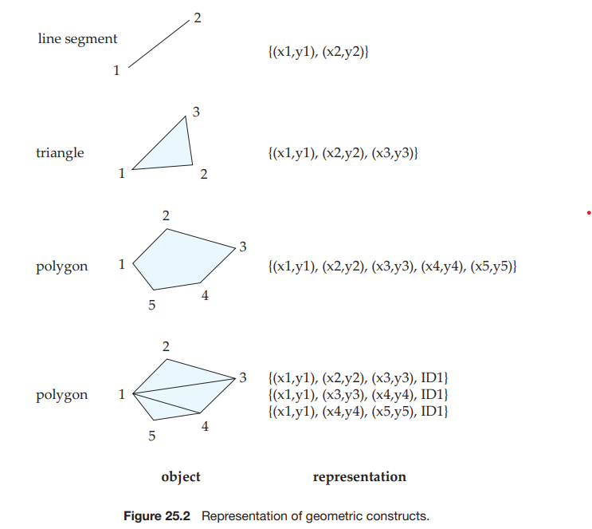

much when we move to three dimensions. Tetrahedrons and cuboids can be rep- resented in the same way as triangles and rectangles. We can represent arbitrary polyhedra by dividing them into tetrahedrons, just as we triangulate polygons. We can also represent them by listing their faces, each of which is itself a polygon, along with an indication of which side of the face is inside the polyhedron.

### 25.3.2 Design Databases

**Computer-aided-design** (**CAD**) systems traditionally stored data in memory dur- ing editing or other processing, and wrote the data back to a file at the end of a session of editing. The drawbacks of such a scheme include the cost (program- ming complexity, as well as time cost) of transforming data from one form to another, and the need to read in an entire file even if only parts of it are required. For large designs, such as the design of a large-scale integrated circuit or the design of an entire airplane, it may be impossible to hold the complete design in memory. Designers of object-oriented databases were motivated in large part by the database requirements of CAD systems. Object-oriented databases represent components of the design as objects, and the connections between the objects indicate how the design is structured.

The objects stored in a design database are generally geometric objects. Sim- ple two-dimensional geometric objects include points, lines, triangles, rectangles, and, in general, polygons. Complex two-dimensional objects can be formed from simple objects by means of union, intersection, and difference operations. Simi- larly, complex three-dimensional objects may be formed from simpler objects such as spheres, cylinders, and cuboids, by union, intersection, and difference opera- tions, as in Figure 25.3. Three-dimensional surfaces may also be represented by **wireframe models**, which essentially model the surface as a set of simpler objects, such as line segments, triangles, and rectangles.

Design databases also store nonspatial information about objects, such as the material from which the objects are constructed. We can usually model such information by standard data-modeling techniques. We concern ourselves here with only the spatial aspects.

Various spatial operations must be performed on a design. For instance, the designer may want to retrieve that part of the design that corresponds to a par- ticular region of interest. Spatial-index structures, discussed in Section 25.3.5, are useful for such tasks. Spatial-index structures are multidimensional, dealing with two- and three-dimensional data, rather than dealing with just the simple one-dimensional ordering provided by the B+-trees.

Spatial-integrity constraints, such as “two pipes should not be in the same location,” are important in design databases to prevent interference errors. Such errors often occur if the design is performed manually, and are detected only when a prototype is being constructed. As a result, these errors can be expensive to fix. Database support for spatial-integrity constraints helps people to avoid design

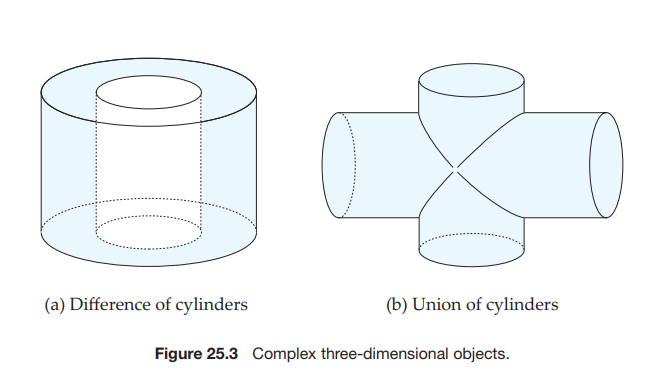

errors, thereby keeping the design consistent. Implementing such integrity checks again depends on the availability of efficient multidimensional index structures.

### 25.3.3 Geographic Data

Geographic data are spatial in nature, but differ from design data in certain ways. Maps and satellite images are typical examples of geographic data. Maps may provide not only location information—about boundaries, rivers, and roads, for example—but also much more detailed information associated with locations, such as elevation, soil type, land usage, and annual rainfall.

#### 25.3.3.1 Applications of Geographic Data

Geographic databases have a variety of uses, including online map services; vehicle-navigation systems; distribution-network information for public-service utilities such as telephone, electric-power, and water-supply systems; and land- usage information for ecologists and planners.

Web-based road map services form a very widely used application of map data. At the simplest level, these systems can be used to generate online road maps of a desired region. An important benefit of online maps is that it is easy to scale the maps to the desired size—that is, to zoom in and out to locate relevant features. Road map services also store information about roads and services, such as the layout of roads, speed limits on roads, road conditions, connections between roads, and one-way restrictions. With this additional information about roads, the maps can be used for getting directions to go from one place to another and for automatic trip planning. Users can query online information about services to locate, for example, hotels, gas stations, or restaurants with desired offerings and price ranges. In recent years, several Web-based map services have defined APIs that allow programmers to create customized maps that include data from the map service along with data from other sources. Such customized maps can be used to display, for example, houses available for sale or rent, or shops and restaurants, in a particular area.

Vehicle-navigation systems are systems that are mounted in automobiles and provide road maps and trip-planning services. They include a **Global Positioning System** (**GPS**) unit, which uses information broadcast from GPS satellites to find the current location with an accuracy of tens of meters. With such a system, a driver can never3 get lost—the GPS unit finds the location in terms of latitude, longitude, and elevation and the navigation system can query the geographic database to find where and on which road the vehicle is currently located.

Geographic databases for public-utility information have become very im- portant as the network of buried cables and pipes has grown. Without detailed maps, work carried out by one utility may damage the cables of another utility, resulting in large-scale disruption of service. Geographic databases, coupled with accurate location-finding systems, help avoid such problems.


#### 25.3.3.2 Representation of Geographic Data

**Geographic data** can be categorized into two types:

- **Raster data**. Such data consist of bit maps or pixel maps, in two or more dimensions. A typical example of a two-dimensional raster image is a satellite image of an area. In addition to the actual image, the data includes the location of the image, specified for example by the latitude and longitude of its corners, and the resolution, specified either by the total number of pixels, or, more commonly in the context of geographic data, by the area covered by each pixel.

Raster data is often represented as **tiles**, each covering a fixed sized area. A larger area can be displayed by displaying all the tiles that overlap with the area. To allow the display of data at different zoom levels, a separate set of tiles is created for each zoom level. Once the zoom level is set by the user interface (for example a Web browser), tiles at that zoom level, which overlap the area being displayed, are retrieved and displayed.

Raster data can be three-dimensional—for example, the temperature at different altitudes at different regions, again measured with the help of a satellite. Time could form another dimension—for example, the surface temperature measurements at different points in time.

- **Vector data**. Vector data are constructed from basic geometric objects, such as points, line segments, polylines, triangles, and other polygons in two dimensions, and cylinders, spheres, cuboids, and other polyhedrons in three dimensions. In the context of geographic data, points are usually represented by latitude and longitude, and where the height is relevant, additionally by elevation.

Map data are often represented in vector format. Roads are often repre- sented as polylines. Geographic features, such as large lakes, or even political features such as states and countries, are represented as complex polygons. Some features, such as rivers, may be represented either as complex curves or as complex polygons, depending on whether their width is relevant.

Geographic information related to regions, such as annual rainfall, can be represented as an array—that is, in raster form. For space efficiency, the array can be stored in a compressed form. In Section 25.3.5.2, we study an alternative representation of such arrays by a data structure called a _quadtree_.

As another alternative, we can represent region information in vector form, using polygons, where each polygon is a region within which the array value is the same. The vector representation is more compact than the raster representation in some applications. It is also more accurate for some tasks, such as depicting roads, where dividing the region into pixels (which may be fairly large) leads to a loss of precision in location information. However, the vector representation is unsuitable for applications where the data are intrinsically raster based, such as satellite images.  

**Topographical** information, that is information about the elevation (height) of each point on a surface, can be represented in raster form. Alternatively it can be represented in vector form by dividing the surface into polygons covering re- gions of (approximately) equal elevation, with a single elevation value associated with each polygon. As another alternative, the surface can be **triangulated** (that is, divided into triangles), with each triangle represented by the latitude, longi- tude, and elevation of each of its corners. The latter representation, called the **triangulated irregular network** (**TIN**) representation, is a compact representation which is particularly useful for generating three-dimensional views of an area.

Geographic information systems usually contain both raster and vector data, and can merge the two kinds of data when displaying results to users. For ex- ample, maps applications usually contain both satellite images and vector data about roads, building and other landmarks. A map display usually **overlays** dif- ferent kinds of information; for example, road information can be overlaid on a background satellite image, to create a hybrid display. In fact, a map typically consists of multiple layers, which are displayed in bottom-to-top order; data from higher layers appears on top of data from lower layers.

It is also interesting to note that even information that is actually stored in vector form may be converted to raster form before it is sent to a user interface such as a Web browser. One reason is that even Web browsers that do not sup- port scripting languages (required to interpret and display vector data) can then display map data; a second reason may be to prevent end users from extracting and using the vector data.

Map services such as Google Maps and Yahoo! Maps provide APIs that allow users to create specialized map displays, containing application specific data overlaid on top of standard map data. For example, a Web site may show a map of an area with information about restaurants overlaid on the map. The overlays can be constructed dynamically, displaying only restaurants with a specific cuisine, for example, or allowing users to change the zoom level, or pan the display. The maps APIs for a specific language (typically JavaScript or Flash) are built on top of a Web service that provides the underlying map data.

### 25.3.4 Spatial Queries

There are a number of types of queries that involve spatial locations.

- **Nearness queries** request objects that lie near a specified location. A query to find all restaurants that lie within a given distance of a given point is an example of a nearness query. The **nearest-neighbor query** requests the object that is nearest to a specified point. For example, we may want to find the nearest gasoline station. Note that this query does not have to specify a limit on the distance, and hence we can ask it even if we have no idea how far the nearest gasoline station lies.

- **Region queries** deal with spatial regions. Such a query can ask for objects that lie partially or fully inside a specified region. A query to find all retail shops within the geographic boundaries of a given town is an example. 

- Queries may also request **intersections** and **unions** of regions. For example, given region information, such as annual rainfall and population density, a query may request all regions with a low annual rainfall as well as a high population density.

Queries that compute intersections of regions can be thought of as computing the **spatial join** of two spatial relations—for example, one representing rainfall and the other representing population density—with the location playing the role of join attribute. In general, given two relations, each containing spatial objects, the spatial join of the two relations generates either pairs of objects that intersect, or the intersection regions of such pairs.

Several join algorithms efficiently compute spatial joins on vector data. Al- though nested-loop join and indexed nested-loop join (with spatial indices) can be used, hash joins and sort–merge joins cannot be used on spatial data. Re- searchers have proposed join techniques based on coordinated traversal of spa- tial index structures on the two relations. See the bibliographical notes for more information.

In general, queries on spatial data may have a combination of spatial and nonspatial requirements. For instance, we may want to find the nearest restaurant that has vegetarian selections and that charges less than $10 for a meal.

Since spatial data are inherently graphical, we usually query them by using a graphical query language. Results of such queries are also displayed graphically, rather than in tables. The user can invoke various operations on the interface, such as choosing an area to be viewed (for example, by pointing and clicking on suburbs west of Manhattan), zooming in and out, choosing what to display on the basis of selection conditions (for example, houses with more than three bedrooms), overlay of multiple maps (for example, houses with more than three bedrooms overlaid on a map showing areas with low crime rates), and so on. The graphical interface constitutes the front end. Extensions of SQL have been proposed to permit relational databases to store and retrieve spatial information efficiently, and also to allow queries to mix spatial and nonspatial conditions. Extensions include allowing abstract data types, such as lines, polygons, and bit maps, and allowing spatial conditions, such as _contains_ or _overlaps_.

### 25.3.5 Indexing of Spatial Data

Indices are required for efficient access to spatial data. Traditional index struc- tures, such as hash indices and B-trees, are not suitable, since they deal only with one-dimensional data, whereas spatial data are typically of two or more dimensions.

#### 25.3.5.1 k-d Trees

To understand how to index spatial data consisting of two or more dimensions, we consider first the indexing of points in one-dimensional data. Tree structures, such as binary trees and B-trees, operate by successively dividing space into smaller parts. For instance, each internal node of a binary tree partitions a one-


dimensional interval in two. Points that lie in the left partition go into the left subtree; points that lie in the right partition go into the right subtree. In a balanced binary tree, the partition is chosen so that approximately one-half of the points stored in the subtree fall in each partition. Similarly, each level of a B-tree splits a one-dimensional interval into multiple parts.

We can use that intuition to create tree structures for two-dimensional space, as well as in higher-dimensional spaces. A tree structure called a **k-d tree** was one of the early structures used for indexing in multiple dimensions. Each level of a k-d tree partitions the space into two. The partitioning is done along one dimension at the node at the top level of the tree, along another dimension in nodes at the next level, and so on, cycling through the dimensions. The partitioning proceeds in such a way that, at each node, approximately one-half of the points stored in the subtree fall on one side and one-half fall on the other. Partitioning stops when a node has less than a given maximum number of points. Figure 25.4 shows a set of points in two-dimensional space, and a k-d tree representation of the set of points. Each line corresponds to a node in the tree, and the maximum number of points in a leaf node has been set at 1. Each line in the figure (other than the outside box) corresponds to a node in the k-d tree. The numbering of the lines in the figure indicates the level of the tree at which the corresponding node appears.

The **k-d-B tree** extends the k-d tree to allow multiple child nodes for each internal node, just as a B-tree extends a binary tree, to reduce the height of the tree. k-d-B trees are better suited for secondary storage than k-d trees.

#### 25.3.5.2 Quadtrees

An alternative representation for two-dimensional data is a **quadtree**. An example of the division of space by a quadtree appears in Figure 25.5. The set of points

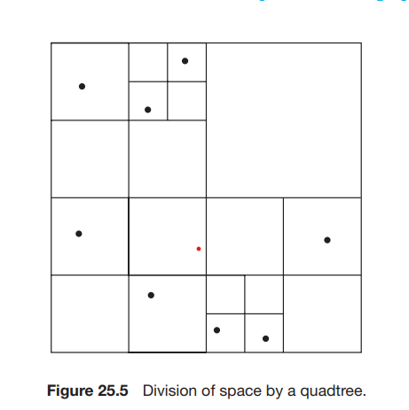

is the same as that in Figure 25.4. Each node of a quadtree is associated with a rectangular region of space. The top node is associated with the entire target space. Each nonleaf node in a quadtree divides its region into four equal-sized quadrants, and correspondingly each such node has four child nodes corresponding to the four quadrants. Leaf nodes have between zero and some fixed maximum number of points. Correspondingly, if the region corresponding to a node has more than the maximum number of points, child nodes are created for that node. In the example in Figure 25.5, the maximum number of points in a leaf node is set to 1.

This type of quadtree is called a **PR quadtree**, to indicate it stores points, and that the division of space is divided based on regions, rather than on the actual set of points stored. We can use **region quadtrees** to store array (raster) information. A node in a region quadtree is a leaf node if all the array values in the region that it covers are the same. Otherwise, it is subdivided further into four children of equal area, and is therefore an internal node. Each node in the region quadtree corresponds to a subarray of values. The subarrays corresponding to leaves either contain just a single array element or have multiple array elements, all of which have the same value.

Indexing of line segments and polygons presents new problems. There are extensions of k-d trees and quadtrees for this task. However, a line segment or polygon may cross a partitioning line. If it does, it has to be split and represented in each of the subtrees in which its pieces occur. Multiple occurrences of a line segment or polygon can result in inefficiencies in storage, as well as inefficiencies in querying.

#### 25.3.5.3 R-Trees

A storage structure called an **R-tree** is useful for indexing of objects such as points, line segments, rectangles, and other polygons. An R-tree is a balanced tree structure with the indexed objects stored in leaf nodes, much like a B+-tree. However, instead of a range of values, a rectangular **bounding box** is associated with each tree node. The bounding box of a leaf node is the smallest rectangle parallel to the axes that contains all objects stored in the leaf node. The bounding box of internal nodes is, similarly, the smallest rectangle parallel to the axes that contains the bounding boxes of its child nodes. The bounding box of an object (such as a polygon) is defined, similarly, as the smallest rectangle parallel to the axes that contains the object.

Each internal node stores the bounding boxes of the child nodes along with the pointers to the child nodes. Each leaf node stores the indexed objects, and may optionally store the bounding boxes of the objects; the bounding boxes help speed up checks for overlaps of the rectangle with the indexed objects—if a query rectangle does not overlap with the bounding box of an object, it cannot overlap with the object, either. (If the indexed objects are rectangles, there is of course no need to store bounding boxes, since they are identical to the rectangles.)

Figure 25.6 shows an example of a set of rectangles (drawn with a solid line) and the bounding boxes (drawn with a dashed line) of the nodes of an R-tree for the set of rectangles. Note that the bounding boxes are shown with extra space inside them, to make them stand out pictorially. In reality, the boxes would be smaller and fit tightly on the objects that they contain; that is, each side of a bounding box _B_ would touch at least one of the objects or bounding boxes that are contained in _B_.

The R-tree itself is at the right side of Figure 25.6. The figure refers to the coordinates of bounding box _i_ as _B Bi_ in the figure.

We shall now see how to implement search, insert, and delete operations on an R-tree.

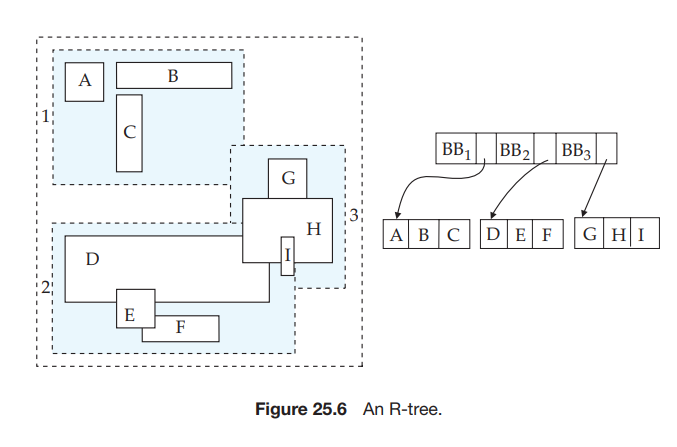

- **Search**. As the figure shows, the bounding boxes associated with sibling nodes may overlap; in B+-trees, k-d trees, and quadtrees, in contrast, the ranges do not overlap. A search for objects containing a point therefore has to follow _all_ child nodes whose associated bounding boxes contain the point; as a result, multiple paths may have to be searched. Similarly, a query to find all objects that intersect a given object has to go down every node where the associated rectangle intersects the given object.

- **Insert**. When we insert an object into an R-tree, we select a leaf node to hold the object. Ideally we should pick a leaf node that has space to hold a new entry, and whose bounding box contains the bounding box of the object. However, such a node may not exist; even if it did, finding the node may be very expensive, since it is not possible to find it by a single traversal down from the root. At each internal node we may find multiple children whose bounding boxes contain the bounding box of the object, and each of these children needs to be explored. Therefore, as a heuristic, in a traversal from the root, if any of the child nodes has a bounding box containing the bounding box of the object, the R-tree algorithm chooses one of them arbitrarily. If none of the children satisfy this condition, the algorithm chooses a child node whose bounding box has the maximum overlap with the bounding box of the object for continuing the traversal.

Once the leaf node has been reached, if the node is already full, the algorithm performs node splitting (and propagates splitting upward if required) in a manner very similar to B+-tree insertion. Just as with B+-tree insertion, the R- tree insertion algorithm ensures that the tree remains balanced. Additionally, it ensures that the bounding boxes of leaf nodes, as well as internal nodes, remain consistent; that is, bounding boxes of leaves contain all the bounding boxes of the objects stored at the leaf, while the bounding boxes for internal nodes contain all the bounding boxes of the children nodes.

The main difference of the insertion procedure from the B+-tree insertion procedure lies in how the node is split. In a B+-tree, it is possible to find a value such that half the entries are less than the midpoint and half are greater than the value. This property does not generalize beyond one dimension; that is, for more than one dimension, it is not always possible to split the entries into two sets so that their bounding boxes do not overlap. Instead, as a heuristic, the set of entries _S_ can be split into two disjoint sets _S_1 and _S_2 so that the bounding boxes of _S_1 and _S_2 have the minimum total area; another heuristic would be to split the entries into two sets _S_1 and _S_2 in such a way that _S_1 and _S_2 have minimum overlap. The two nodes resulting from the split would contain the entries in _S_1 and _S_2, respectively. The cost of finding splits with minimum total area or overlap can itself be large, so cheaper heuristics, such as the _quadratic split_ heuristic, are used. (The heuristic gets is name from the fact that it takes time quadratic in the number of entries.)

The **quadratic split** heuristic works this way: First, it picks a pair of entries _a_ and _b_ from _S_ such that putting them in the same node would result in a bounding box with the maximum wasted space; that is, the area of the minimum bounding box of _a_ and _b_ minus the sum of the areas of _a_ and _b_ is the largest. The heuristic places the entries _a_ and _b_ in sets _S_1 and _S_2, respectively.

It then iteratively adds the remaining entries, one entry per iteration, to one of the two sets _S_1 or _S_2\. At each iteration, for each remaining entry _e_, let _ie,_1 denote the increase in the size of the bounding box of _S_1 if _e_ is added to _S_1 and let _ie,_2 denote the corresponding increase for _S_2\. In each iteration, the heuristic chooses one of the entries with the maximum difference of _ie,_1 and _ie,_2 and adds it to _S_1 if _ie,_1 is less than _ie,_2, and to _S_2 otherwise. That is, an entry with “maximum preference” for one of _S_1 or _S_2 is chosen at each iteration. The iteration stops when all entries have been assigned, or when one of the sets _S_1 or _S_2 has enough entries that all remaining entries have to be added to the other set so the nodes constructed from _S_1 and _S_2 both have the required minimum occupancy. The heuristic then adds all unassigned entries to the set with fewer entries.

- **Deletion**. Deletion can be performed like a B+-tree deletion, borrowing en- tries from sibling nodes, or merging sibling nodes if a node becomes under- full. An alternative approach redistributes all the entries of underfull nodes to sibling nodes, with the aim of improving the clustering of entries in the R-tree.

See the bibliographical references for more details on insertion and deletion op- erations on R-trees, as well as on variants of R-trees, called R∗-trees or R+-trees.

The storage efficiency of R-trees is better than that of k-d trees or quadtrees, since an object is stored only once, and we can ensure easily that each node is at least half full. However, querying may be slower, since multiple paths have to be searched. Spatial joins are simpler with quadtrees than with R-trees, since all quadtrees on a region are partitioned in the same manner. However, because of their better storage efficiency, and their similarity to B-trees, R-trees and their variants have proved popular in database systems that support spatial data.

## 25.4 Multimedia Databases

Multimedia data, such as images, audio, and video—an increasingly popular form of data—are today almost always stored outside the database, in file sys- tems. This kind of storage is not a problem when the number of multimedia objects is relatively small, since features provided by databases are usually not important.

However, database features become important when the number of multime- dia objects stored is large. Issues such as transactional updates, querying facilities, and indexing then become important. Multimedia objects often have descriptive attributes, such as those indicating when they were created, who created them, and to what category they belong. One approach to building a database for such multimedia objects is to use databases for storing the descriptive attributes and for keeping track of the files in which the multimedia objects are stored.

However, storing multimedia outside the database makes it harder to provide database functionality, such as indexing on the basis of actual multimedia data content. It can also lead to inconsistencies, such as a file that is noted in the database, but whose contents are missing, or vice versa. It is therefore desirable to store the data themselves in the database.

Several issues must be addressed if multimedia data are to be stored in a database.

- The database must support large objects, since multimedia data such as videos can occupy up to a few gigabytes of storage. Many database sys- tems do not support objects larger than a few gigabytes. Larger objects could be split into smaller pieces and stored in the database. Alternatively, the multimedia object may be stored in a file system, but the database may con- tain a pointer to the object; the pointer would typically be a file name. The SQL/MED standard (MED stands for Management of External Data) allows external data, such as files, to be treated as if they are part of the database. With SQL/MED, the object would appear to be part of the database, but can be stored externally. We discuss multimedia data formats in Section 25.4.1.

- The retrieval of some types of data, such as audio and video, has the require- ment that data delivery must proceed at a guaranteed steady rate. Such data are sometimes called **isochronous data**, or **continuous-media data**. For ex- ample, if audio data are not supplied in time, there will be gaps in the sound. If the data are supplied too fast, system buffers may overflow, resulting in loss of data. We discuss continuous-media data in Section 25.4.2.

- Similarity-based retrieval is needed in many multimedia database applica- tions. For example, in a database that stores fingerprint images, a query fingerprint image is provided, and fingerprints in the database that are sim- ilar to the query fingerprint must be retrieved. Index structures such as B+- trees and R-trees cannot be used for this purpose; special index structures need to be created. We discuss similarity-based retrieval in Section 25.4.3.

### 25.4.1 Multimedia Data Formats

Because of the large number of bytes required to represent multimedia data, it is essential that multimedia data be stored and transmitted in compressed form. For image data, the most widely used format is _JPEG_, named after the standards body that created it, the _Joint Picture Experts Group_. We can store video data by encoding each frame of video in JPEG format, but such an encoding is wasteful, since successive frames of a video are often nearly the same. The _Moving Picture Experts Group_ has developed the _MPEG_ series of standards for encoding video and audio data; these encodings exploit commonalities among a sequence of frames to achieve a greater degree of compression. The _MPEG-1_ standard stores a minute of 30-frame-per-second video and audio in approximately 12.5 megabytes (com- pared to approximately 75 megabytes for video in only JPEG). However, MPEG-1 encoding introduces some loss of video quality, to a level roughly comparable
to that of VHS videotape. The _MPEG-2_ standard is designed for digital broadcast systems and digital video disks (DVDs); it introduces only a negligible loss of video quality. MPEG-2 compresses 1 minute of video and audio to approximately 17 megabytes. MPEG-4 provides techniques for further compression of video, with variable bandwidth to support delivery of video data over networks with a wide range of bandwidths. Several competing standards are used for audio encoding, including _MP3_, which stands for MPEG-1 Layer 3, RealAudio, Windows Media Audio, and other formats. High-definition video with audio is encoded in several variants of MPEG-4 that include MPEG-4 AVC and AVCHD.

### 25.4.2 Continuous-Media Data

The most important types of continuous-media data are video and audio data (for example, a database of movies). Continuous-media systems are characterized by their real-time information-delivery requirements:

- Data must be delivered sufficiently fast that no gaps in the audio or video result.

- Data must be delivered at a rate that does not cause overflow of system buffers.

- Synchronization among distinct data streams must be maintained. This need arises, for example, when the video of a person speaking must show lips moving synchronously with the audio of the person speaking.

To supply data predictably at the right time to a large number of consumers of the data, the fetching of data from disk must be coordinated carefully. Usually, data are fetched in periodic cycles. In each cycle, say of _n_ seconds, _n_ seconds’ worth of data is fetched for each consumer and stored in memory buffers, while the data fetched in the previous cycle is being sent to the consumers from the memory buffers. The cycle period is a compromise: A short period uses less memory but requires more disk-arm movement, which is a waste of resources, while a long period reduces disk-arm movement but increases memory requirements and may delay initial delivery of data. When a new request arrives, **admission control** comes into play: That is, the system checks if the request can be satisfied with available resources (in each period); if so, it is admitted; otherwise it is rejected.

Extensive research on delivery of continuous-media data has dealt with such issues as handling arrays of disks and dealing with disk failure. See the biblio- graphical references for details.

Several vendors offer video-on-demand servers. Current systems are based on file systems, because existing database systems do not provide the real-time re- sponse that these applications need. The basic architecture of a video-on-demand system comprises:

- **Video server**. Multimedia data are stored on several disks (usually in a RAID configuration). Systems containing a large volume of data may use tertiary storage for less frequently accessed data.
- **Terminals.** People view multimedia data through various devices, collec- tively referred to as _terminals_. Examples are personal computers and televi- sions attached to a small, inexpensive computer called a **set-top box**.

- **Network.** Transmission of multimedia data from a server to multiple termi- nals requires a high-capacity network.

Video-on-demand service over cable networks is widely available.

### 25.4.3 Similarity-Based Retrieval

In many multimedia applications, data are described only approximately in the database. An example is the fingerprint data in Section 25.4. Other examples are:

- **Pictorial data.** Two pictures or images that are slightly different as represented in the database may be considered the same by a user. For instance, a database may store trademark designs. When a new trademark is to be registered, the system may need first to identify all similar trademarks that were registered previously.

- **Audio data.** Speech-based user interfaces are being developed that allow the user to give a command or identify a data item by speaking. The input from the user must then be tested for similarity to those commands or data items stored in the system.

- **Handwritten data.** Handwritten input can be used to identify a handwritten data item or command stored in the database. Here again, similarity testing is required.

The notion of similarity is often subjective and user specific. However, sim- ilarity testing is often more successful than speech or handwriting recognition, because the input can be compared to data already in the system and, thus, the set of choices available to the system is limited.

Several algorithms exist for finding the best matches to a given input by sim- ilarity testing. Many voice-activated systems have been deployed commercially, particularly for phone applications and in-vehicle controls. See the bibliographi- cal notes for references.

## 25.5 Mobility and Personal Databases

Large-scale, commercial databases have traditionally been stored in central com- puting facilities. In distributed database applications, there has usually been strong central database and network administration. Several technology trends have combined to create applications in which this assumption of central control and administration is not entirely correct:

- The widespread use of laptop, notebook, or netbook computers.

- The widespread use of cell phones with the capabilities of a computer.

- The development of a relatively low-cost wireless digital communication infrastructure, based on wireless local-area networks, cellular digital packet networks, and other technologies.

**Mobile computing** has proved useful in many applications. Many business travelers use laptop computers so that they can work and access data en route. Delivery services use mobile computers to assist in package tracking. Emergency- response services use mobile computers at the scene of disasters, medical emer- gencies, and the like to access information and to enter data pertaining to the situation. Cell phones are increasingly becoming devices that provide not only phone services, but are also mobile computers allowing email and Web access. New applications of mobile computers continue to emerge.

Wireless computing creates a situation where machines no longer have fixed locations and network addresses. **Location-dependent queries** are an interesting class of queries that are motivated by mobile computers; in such queries, the location of the user (computer) is a parameter of the query. The value of the location parameter is provided by a global positioning system (GPS). An example is a traveler’s information system that provides data on hotels, roadside services, and the like to motorists. Processing of queries about services that are ahead on the current route must be based on knowledge of the user’s location, direction of motion, and speed. Increasingly, navigational aids are being offered as a built-in feature in automobiles.

Energy (battery power) is a scarce resource for most mobile computers. This limitation influences many aspects of system design. Among the more interesting consequences of the need for energy efficiency is that small mobile devices spend most of their time sleeping, waking up for a fraction of a second every second or so to check for incoming data and to send outgoing data. This behavior has a significant impact on protocols used to communicate with mobile devices. The use of scheduled data broadcasts to reduce the need for mobile systems to transmit queries is another way to reduce energy requirements.

Increasing amounts of data may reside on machines administered by users, rather than by database administrators. Furthermore, these machines may, at times, be disconnected from the network. In many cases, there is a conflict between the user’s need to continue to work while disconnected and the need for global data consistency.

A user is likely to use more than one mobile device. Such users need to be able to view their data in its most up-to-date version regardless of which device is being used at a given time. Often, this capability is supported by some variant of cloud computing, which we discussed in Section 19.9.

In Sections 25.5.1 through 25.5.4, we discuss techniques in use and under development to deal with the problems of mobility and personal computing.

### 25.5.1 A Model of Mobile Computing

The mobile-computing environment consists of mobile computers, referred to as **mobile hosts**, and a wired network of computers. Mobile hosts communicate with the wired network via computers referred to as **mobile support stations**. Each mobile support station manages those mobile hosts within its **cell**—that is, the geographical area that it covers. Mobile hosts may move between cells, thus necessitating a **handoff** of control from one mobile support station to another. Since mobile hosts may, at times, be powered down, a host may leave one cell and rematerialize later at some distant cell. Therefore, moves between cells are not necessarily between adjacent cells. Within a small area, such as a building, mobile hosts may be connected by a wireless local-area network (LAN) that provides lower-cost connectivity than would a wide-area cellular network, and that reduces the overhead of handoffs.

It is possible for mobile hosts to communicate directly without the interven- tion of a mobile support station. However, such communication can occur only between nearby hosts. Such direct forms of communication often use **Bluetooth**, a short-range digital radio standard that allows wireless connectivity within a 10- meter range at high speed (up to 721 kilobits per second). Initially conceived as a replacement for cables, Bluetooth’s greatest benefit is in easy ad hoc connection of mobile computers, PDAs, mobile phones, and so-called intelligent appliances.

Wireless local-area network systems based on the 801.11 (a/b/g/n) standards are very widely used today, and systems based on the 802.16 (Wi-Max) standard are being deployed.

The network infrastructure for mobile computing consists in large part of two technologies: wireless local-area networks and packet-based cellular telephony networks. Early cellular systems used analog technology and were designed for voice communication. Second-generation digital systems retained the focus on voice applications. Third-generation (3G) and so-called 2.5G systems use packet- based networking and are more suited to data applications. In these networks, voice is just one of many applications (albeit an economically important one). Fourth-generation (4G) technologies include Wi-Max as well as several competi- tors.

Bluetooth, wireless LANs, and 2.5G and 3G cellular networks make it possible for a wide variety of devices to communicate at low cost. While such communica- tion itself does not fit the domain of a usual database application, the accounting, monitoring, and management data pertaining to this communication generate huge databases. The immediacy of wireless communication generates a need for real-time access to many of these databases. This need for timeliness adds another dimension to the constraints on the system—a matter we shall discuss further in Section 26.4.

The size and power limitations of many mobile computers have led to al- ternative memory hierarchies. Instead of, or in addition to, disk storage, flash memory, which we discussed in Section 10.1, may be included. If the mobile host includes a hard disk, the disk may be allowed to spin down when it is not in use, to save energy. The same considerations of size and energy limit the type and size of the display used in a mobile device. Designers of mobile devices often create special-purpose user interfaces to work within these constraints. However, the need to present Web-based data has necessitated the creation of presentation stan- dards. **Wireless application protocol** (WAP) is a standard for wireless Internet access. WAP-based browsers access special Web pages that use **wireless markup language** (WML), an XML-based language designed for the constraints of mobile and wireless Web browsing.

### 25.5.2 Routing and Query Processing

The route between a pair of hosts may change over time if one of the two hosts is mobile. This simple fact has a dramatic effect at the network level, since location- based network addresses are no longer constants within the system.

Mobility also directly affects database query processing. As we saw in Chap- ter 19, we must consider the communication costs when we choose a distributed query-processing strategy. Mobility results in dynamically changing communi- cation costs, thus complicating the optimization process. Furthermore, there are competing notions of cost to consider:

- **User time** is a highly valuable commodity in many business applications.

- **Connection time** is the unit by which monetary charges are assigned in some cellular systems.

- **Number of bytes, or packets, transferred** is the unit by which charges are computed in some digital cellular systems.

- **Time-of-day-based charges** vary, depending on whether communication oc- curs during peak or off-peak periods.

- **Energy** is limited. Often, battery power is a scarce resource whose use must be optimized. A basic principle of radio communication is that it requires less energy to receive than to transmit radio signals. Thus, transmission and reception of data impose different power demands on the mobile host.

### 25.5.3 Broadcast Data

It is often desirable for frequently requested data to be broadcast in a contin- uous cycle by mobile support stations, rather than transmitted to mobile hosts on demand. A typical application of such **broadcast data** is stock-market price information. There are two reasons for using broadcast data. First, the mobile host avoids the energy cost for transmitting data requests. Second, the broadcast data can be received by a large number of mobile hosts at once, at no extra cost. Thus, the available transmission bandwidth is utilized more effectively.

A mobile host can then receive data as they are transmitted, rather than consuming energy by transmitting a request. The mobile host may have local nonvolatile storage available to cache the broadcast data for possible later use. Given a query, the mobile host may optimize energy costs by determining whether it can process that query with only cached data. If the cached data are insufficient, there are two options: wait for the data to be broadcast, or transmit a request for data. To make this decision, the mobile host must know when the relevant data will be broadcast.

Broadcast data may be transmitted according to a fixed schedule or a change- able schedule. In the former case, the mobile host uses the known fixed schedule to determine when the relevant data will be transmitted. In the latter case, the broadcast schedule must itself be broadcast at a well-known radio frequency and at well-known time intervals.

In effect, the broadcast medium can be modeled as a disk with a high latency. Requests for data can be thought of as being serviced when the requested data are broadcast. The transmission schedules behave like indices on the disk. The bibliographical notes list recent research papers in the area of broadcast data management.

### 25.5.4 Disconnectivity and Consistency

Since wireless communication may be paid for on the basis of connection time, there is an incentive for certain mobile hosts to be disconnected for substantial periods. Mobile computers without wireless connectivity are disconnected most of the time when they are being used, except periodically when they are connected to their host computers, either physically or through a computer network.

During these periods of disconnection, the mobile host may remain in oper- ation. The user of the mobile host may issue queries and updates on data that reside or are cached locally. This situation creates several problems, in particular:

- **Recoverability**: Updates entered on a disconnected machine may be lost if the mobile host experiences a catastrophic failure. Since the mobile host represents a single point of failure, stable storage cannot be simulated well.

- **Consistency**: Locally cached data may become out-of-date, but the mobile host cannot discover this situation until it is reconnected. Likewise, updates occurring in the mobile host cannot be propagated until reconnection occurs.

We explored the consistency problem in Chapter 19, where we discussed network partitioning, and we elaborate on it here. In wired distributed systems, partitioning is considered to be a failure mode; in mobile computing, partitioning via disconnection is part of the normal mode of operation. It is therefore necessary to allow data access to proceed despite partitioning, even at the risk of some loss of consistency.

For data updated by only the mobile host, it is a simple matter to propagate the updates when the mobile host reconnects. However, if the mobile host caches read-only copies of data that may be updated by other computers, the cached data may become inconsistent. When the mobile host is connected, it can be sent **invalidation reports** that inform it of out-of-date cache entries. However, when the mobile host is disconnected, it may miss an invalidation report. A simple solution to this problem is to invalidate the entire cache on reconnection, but such an extreme solution is highly costly. Several caching schemes are cited in the bibliographical notes.

If updates can occur at both the mobile host and elsewhere, detecting conflict- ing updates is more difficult. **Version-numbering**\-based schemes allow updates of shared files from disconnected hosts. These schemes do not guarantee that the updates will be consistent. Rather, they guarantee that, if two hosts inde- pendently update the same version of a document, the clash will be detected eventually, when the hosts exchange information either directly or through a common host.

The **version-vector scheme** detects inconsistencies when copies of a document are independently updated. This scheme allows copies of a _document_ to be stored at multiple hosts. Although we use the term _document_, the scheme can be applied to any other data items, such as tuples of a relation.

The basic idea is for each host _i_ to store, with its copy of each document _d_, a **version vector**—that is, a set of version numbers { V~d~,~i~ [ j ] }, with one entry for each other host _j_ on which the document could potentially be updated. When a host _i_ updates a document _d_, it increments the version number V~d~,~i~ [ i ]  by one.

Whenever two hosts _i_ and _j_ connect with each other, they exchange updated documents, so that both obtain new versions of the documents. However, be- fore exchanging documents, the hosts have to discover whether the copies are consistent:

1. If the version vectors are the same on both hosts—that is, for each _k_, V~d~,~i~ [ K ] =V~d~,~i~ [ k ] —then the copies of document _d_ are identical.

2. If, for each _k_, V~d~,~i~ [ k ] ≤ V~d~,~j~ [ k ] and the version vectors are not identical, then the copy of document _d_ at host _i_ is older than the one at host _j_ . That is, the copy of document _d_ at host _j_ was obtained by one or more modifications of the copy of the document at host _i_ . Host _i_ replaces its copy of _d_, as well as its copy of the version vector for _d_, with the copies from host _j_ .

3. If there are a pair of hosts _k_ and _m_ such that  V~d~,~i~ [ k ] < V~d~,~j~ [ k ] and 
V~d~,~i~ [ m ] > V~d~,~j~ [ m ], then the copies are _inconsistent_; that is, the copy of _d_ at _i_ contains updates performed by host _k_ that have not been propagated to host _j_ , and, similarly, the copy of _d_ at _j_ contains updates performed by host _m_ that have not been propagated to host _i_ . Then, the copies of _d_ are inconsistent, since two or more updates have been performed on _d_ independently. Manual intervention may be required to merge the updates.

The version-vector scheme was initially designed to deal with failures in distributed file systems. The scheme gained importance because mobile comput- ers often store copies of files that are also present on server systems, in effect con- stituting a distributed file system that is often disconnected. Another application of the scheme is in groupware systems, where hosts are connected periodically, rather than continuously, and must exchange updated documents.

The version-vector scheme also has applications in replicated databases, where it can be applied to individual tuples. For example, if a calendar or address book is maintained on a mobile device as well as on a host, inserts, deletes and updates can happen either on the mobile device or on the host. By applying the version-vector scheme to individual calendar entries or contacts, it is easy to han- dle situations where a particular entry has been updated on the mobile device while a different one has been updated on the host; such a situation would not be considered a conflict. However, if the same entry is updated independently at both places, a conflict would be detected by the version-vector scheme.

The version-vector scheme, however, fails to address the most difficult and most important issue arising from updates to shared data—the reconciliation of inconsistent copies of data. Many applications can perform reconciliation auto- matically by executing in each computer those operations that had performed updates on remote computers during the period of disconnection. This solution works if update operations commute—that is, they generate the same result, regardless of the order in which they are executed. Alternative techniques may be available in certain applications; in the worst case, however, it must be left to the users to resolve the inconsistencies. Dealing with such inconsistency auto- matically, and assisting users in resolving inconsistencies that cannot be handled automatically, remains an area of research.

Another weakness is that the version-vector scheme requires substantial com- munication between a reconnecting mobile host and that host’s mobile support station. Consistency checks can be delayed until the data are needed, although this delay may increase the overall inconsistency of the database.

The potential for disconnection and the cost of wireless communication limit the practicality of transaction-processing techniques discussed in Chapter 19 for distributed systems. Often, it is preferable to let users prepare transactions on mobile hosts, but to require that, instead of executing the transactions locally, they submit transactions to a server for execution. Transactions that span more than one computer and that include a mobile host face long-term blocking during transaction commit, unless disconnectivity is rare or predictable.

## 25.6 Summary

- Time plays an important role in database systems. Databases are models of the real world. Whereas most databases model the state of the real world at a point in time (at the current time), temporal databases model the states of the real world across time.

- Facts in temporal relations have associated times when they are valid, which can be represented as a union of intervals. Temporal query languages simplify modeling of time, as well as time-related queries.

- Spatial databases are finding increasing use today to store computer-aided- design data as well as geographic data.

- Design data are stored primarily as vector data; geographic data consist of a combination of vector and raster data. Spatial-integrity constraints are important for design data.

- Vector data can be encoded as first-normal-form data, or they can be stored using non-first-normal-form structures, such as lists. Special-purpose index structures are particularly important for accessing spatial data, and for pro- cessing spatial queries.  

- R-trees are a multidimensional extension of B-trees; with variants such as R+-trees and R∗-trees, they have proved popular in spatial databases. Index structures that partition space in a regular fashion, such as quadtrees, help in processing spatial join queries.

- Multimedia databases are growing in importance. Issues such as similarity- based retrieval and delivery of data at guaranteed rates are topics of current research.

- Mobile computing systems have become common, leading to interest in data- base systems that can run on such systems. Query processing in such systems may involve lookups on server databases. The query cost model must include the cost of communication, including monetary cost and battery-power cost, which is relatively high for mobile systems.

- Broadcast is much cheaper per recipient than is point-to-point communica- tion, and broadcast of data such as stock-market data helps mobile systems to pick up data inexpensively.

- Disconnected operation, use of broadcast data, and caching of data are three important issues being addressed in mobile computing.

### Review Terms

- Temporal data 
- Valid time 
- Transaction time 
- Temporal relation 
- Bitemporal relation 
- Universal coordinated time (UTC) 
- Snapshot relation 
- Temporal query languages 
- Temporal selection 
- Temporal projection 
- Temporal join 
- Spatial and geographic data 
- Computer-aided-design (CAD)data 
- Geographic data 
- Geographic information systems 
- Triangulation 
- Design databases
- Geographic data 
- Raster data 
- Vector data 
- Global positioning system (GPS) 
- Spatial queries 
- Nearness queries 
- Nearest-neighbor queries 
- Region queries 
- Spatial join 
- Indexing of spatial data 
- k-d trees 
- k-d-B trees 
- Quadtrees

  ◦ PR quadtree
  
  ◦ Region quadtree

- R-trees

  ◦ Bounding box  

  ◦ Quadratic split

- Multimedia databases 
- Isochronous data 
- Continuous-media data 
- Similarity-based retrieval 
- Multimedia data formats 
- Video servers 
- Mobile computing

  ◦ Mobile hosts
  
  ◦ Mobile support stations
  
  ◦ Cell
  
  ◦ Handoff

- Location-dependent queries 
- Broadcast data 
- Consistency

  ◦ Invalidation reports
  
  ◦ Version-vector scheme

**25.1** What are the two types of time, and how are they different? Why does it make sense to have both types of time associated with a tuple?

**25.2** Suppose you have a relation containing the _x, y_ coordinates and names of restaurants. Suppose also that the only queries that will be asked are of the following form: The query specifies a point, and asks if there is a restaurant exactly at that point. Which type of index would be preferable, R-tree or B-tree? Why?

**25.3** Suppose you have a spatial database that supports region queries (with circular regions) but not nearest-neighbor queries. Describe an algorithm to find the nearest neighbor by making use of multiple region queries.

**25.4** Suppose you want to store line segments in an R-tree. If a line segment is not parallel to the axes, the bounding box for it can be large, containing a large empty area.

- Describe the effect on performance of having large bounding boxes on queries that ask for line segments intersecting a given region.

- Briefly describe a technique to improve performance for such queries and give an example of its benefit. Hint: You can divide segments into smaller pieces.

**25.5** Give a recursive procedure to efficiently compute the spatial join of two relations with R-tree indices. (Hint: Use bounding boxes to check if leaf entries under a pair of internal nodes may intersect.)

**25.6** Describe how the ideas behind the RAID organization (Section 10.3) can be used in a broadcast-data environment, where there may occasionally be noise that prevents reception of part of the data being transmitted.

**25.7** Define a model of repeatedly broadcast data in which the broadcast medium is modeled as a virtual disk. Describe how access time and data transfer rate for this virtual disk differ from the corresponding values for a typical hard disk.

**25.8** Consider a database of documents in which all documents are kept in a central database. Copies of some documents are kept on mobile comput- ers. Suppose that mobile computer A updates a copy of document 1 while it is disconnected, and, at the same time, mobile computer B updates a copy of document 2 while it is disconnected. Show how the version-vector scheme can ensure proper updating of the central database and mobile computers when a mobile computer reconnects.

## Exercises

**25.9** Will functional dependencies be preserved if a relation is converted to a temporal relation by adding a time attribute? How is the problem handled in a temporal database?

**25.10** Consider two-dimensional vector data where the data items do not over- lap. Is it possible to convert such vector data to raster data? If so, what are the drawbacks of storing raster data obtained by such conversion, instead of the original vector data?

**25.11** Study the support for spatial data offered by the database system that you use, and implement the following:

a. A schema to represent the geographic location of restaurants along with features such as the cuisine served at the restaurant and the level of expensiveness.

b. A query to find moderately priced restaurants that serve Indian food and are within 5 miles of your house (assume any location for your house).

c. A query to find for each restaurant the distance from the nearest restaurant serving the same cuisine and with the same level of ex- pensiveness.

**25.12** What problems can occur in a continuous-media system if data are deliv- ered either too slowly or too fast?

**25.13** List three main features of mobile computing over wireless networks that are distinct from traditional distributed systems.

**25.14** List three factors that need to be considered in query optimization for mobile computing that are not considered in traditional query optimizers.

**25.15** Give an example to show that the version-vector scheme does not ensure serializability. (Hint: Use the example from Practice Exercise 25.8, with the assumption that documents 1 and 2 are available on both mobile computers A and B, and take into account the possibility that a document may be read without being updated.)

## Bibliographical Notes
Stam and Snodgrass [1988] and Soo [1991] provide surveys on temporal data management. Jensen et al. [1994] presents a glossary of temporal-database concepts,aimed at unifying the terminology. Tansel et al. [1993] is a collection of articles on different aspects of temporal databases. Chomicki [1995] presents techniques for managing temporal integrity constraints.

Heywood et al. [2002] provides textbook coverage of geographical information systems. Samet [1995b] provides an overview of the large amount of work on
spatial index structures. Samet [1990] and Samet [2006] provides a textbook coverage of spatial data Structures. An early description of the quad tree is providedby Finkel and Bentley [1974]. Samet [1990] and Samet [1995b] describe numerous variants of quad trees. Bentley [1975] describes the k-d tree, and Robinson [1981] describes the k-d-B tree. The R-tree was originally presented in Guttman [1984].Extensions of the R-tree are presented by Sellis et al. [1987], which describes the R+ tree, and Beckmann et al. [1990], which describes the R∗ tree.

Brinkhoff et al. [1993] discusses an implementation of spatial joins using Rtrees. Lo and Ravishankar [1996] and Patel and DeWitt [1996] present partitioningbased methods for computation of spatial joins. Samet and Aref [1995] provides an overview of spatial data models, spatial operations, and the integration of
spatial and nonspatial data. 

Revesz [2002] provides textbook coverage of the area of constraint databases; temporal intervals and spatial regions can be thought of as special cases of constraints.

Samet [1995a] describes research issues in multimedia databases. Indexing of multimedia data is discussed in Faloutsos and Lin [1995].

Dashti et al. [2003] provides a textbook description of streaming media server design, including extensive coverage of data organization on disk subsystems.Video servers are discussed in Anderson et al. [1992], Rangan et al. [1992], Ozden et al. [1994], Freedman and DeWitt [1995], and Ozden et al. [1996b]. Fault tolerance is discussed in Berson et al. [1995] and Ozden et al. [1996a].

Information management in systems that include mobile computers is studied in Alonso and Korth [1993] and Imielinski and Badrinath [1994]. Imielinski and Korth [1996] presents an introduction to mobile computing and a collection of research papers on the subject.

The version-vector scheme for detecting inconsistency in distributed file systems is described by Popek et al. [1981] and Parker et al. [1983]. 

# C H A P T E R 26 
# Advanced Transaction Processing

In Chapters 14, 15, and 16, we introduced the concept of a transaction, a program unit that accesses—and possibly updates—various data items, and whose ex- ecution ensures the preservation of the ACID properties. We discussed in those chapters a variety of techniques for ensuring the ACID properties in an environ- ment where failure can occur, and where the transactions may run concurrently.

In this chapter, we go beyond the basic schemes discussed previously, and cover advanced transaction-processing concepts, including transaction-processing monitors, transactional workflows, and transaction processing in the context of electronic commerce. We also cover main-memory databases, real-time databases, long-duration transactions, and nested transactions.

## 26.1 Transaction-Processing Monitors

**Transaction-processing monitors** (**TP monitors**) are systems that were developed in the 1970s and 1980s, initially in response to a need to support a large number of remote terminals (such as airline-reservation terminals) from a single computer. The term _TP monitor_ initially stood for _teleprocessing monitor_.

TP monitors have since evolved to provide the core support for distributed transaction processing, and the term TP monitor has acquired its current meaning. The CICS TP monitor from IBM was one of the earliest TP monitors, and has been very widely used. Other TP monitors include Oracle Tuxedo and Microsoft Transaction Server.

Web application server architectures, including servlets, which we studied earlier in Section 9.3, support many of the features of TP monitors and are some- times referred to as “TP lite.” Web application servers are in widespread use, and have supplanted traditional TP monitors for many applications. However, the concepts underlying them, which we study in this section, are essentially the same.

### 26.1.1 TP-Monitor Architectures

Large-scale transaction-processing systems are built around a client–server archi- tecture. One way of building such systems is to have a server process for each client; the server performs authentication, and then executes actions requested by the client. This **process-per-client model** is illustrated in Figure 26.1a. This model presents several problems with respect to memory utilization and processing speed:

- Per-process memory requirements are high. Even if memory for program code is shared by all processes, each process consumes memory for local data and open file descriptors, as well as for operating-system overhead, such as page tables to support virtual memory.

- The operating system divides up available CPU time among processes by switching among them; this technique is called **multitasking**. Each **context switch** between one process and the next has considerable CPU overhead; even on today’s fast systems, a context switch can take hundreds of mi- croseconds.

The above problems can be avoided by having a single-server process to which all remote clients connect; this model is called the **single-server model**,

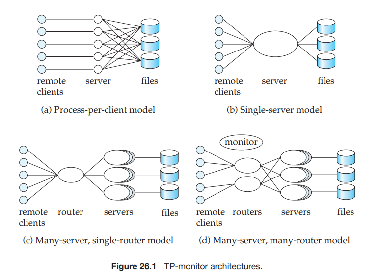

illustrated in Figure 26.1b. Remote clients send requests to the server process, which then executes those requests. This model is also used in client–server en- vironments, where clients send requests to a single-server process. The server process handles tasks, such as user authentication, that would normally be han- dled by the operating system. To avoid blocking other clients when processing a long request for one client, the server process is **multithreaded**: The server process has a thread of control for each client, and, in effect, implements its own low-overhead multitasking. It executes code on behalf of one client for a while, then saves the internal context and switches to the code for another client. Unlike the overhead of full multitasking, the cost of switching between threads is low (typically only a few microseconds).

Systems based on the single-server model, such as the original version of the IBM CICS TP monitor and file servers such as Novel’s NetWare, successfully pro- vided high transaction rates with limited resources. However, they had problems, especially when multiple applications accessed the same database:

- Since all the applications run as a single process, there is no protection among them. A bug in one application can affect all the other applications as well. It would be best to run each application as a separate process.

- Such systems are not suited for parallel or distributed databases, since a server process cannot execute on multiple computers at once. (However, concurrent threads within a process can be supported in a shared-memory multiproces- sor system.) This is a serious drawback in large organizations, where parallel processing is critical for handling large workloads, and distributed data are becoming increasingly common.

One way to solve these problems is to run multiple application-server pro- cesses that access a common database, and to let the clients communicate with the application through a single communication process that routes requests. This model is called the **many-server, single-router model**, illustrated in Figure 26.1c. This model supports independent server processes for multiple applications; fur- ther, each application can have a pool of server processes, any one of which can handle a client session. The request can, for example, be routed to the most lightly loaded server in a pool. As before, each server process can itself be multithreaded, so that it can handle multiple clients concurrently. As a further generalization, the application servers can run on different sites of a parallel or distributed database, and the communication process can handle the coordination among the processes.

The above architecture is also widely used in Web servers. A Web server has a main process that receives HTTP requests, and then assigns the task of handling each request to a separate process (chosen from among a pool of processes). Each of the processes is itself multithreaded, so that it can handle multiple requests. The use of safe programming languages, such as Java, C#, or Visual Basic, allows Web application servers to protect threads from errors in other threads. In contrast, with a language like C or C++, errors such as memory allocation errors in one thread can cause other threads to fail.


A more general architecture has multiple processes, rather than just one, to communicate with clients. The client communication processes interact with one or more router processes, which route their requests to the appropriate server. Later-generation TP monitors therefore have a different architecture, called the **many-server, many-router model**, illustrated in Figure 26.1d. A controller process starts up the other processes and supervises their functioning. Very high perfor- mance Web-server systems also adopt such an architecture. The router processes are often network routers that direct traffic addressed to the same Internet ad- dress to different server computers, depending on where the traffic comes from. What looks like a single server with a single address to the outside world may be a collection of servers.

The detailed structure of a TP monitor appears in Figure 26.2. A TP monitor does more than simply pass messages to application servers. When messages arrive, they may have to be queued; thus, there is a **queue manager** for incoming messages. The queue may be a **durable queue**, whose entries survive system failures. Using a durable queue helps ensure that once received and stored in the queue, the messages will be processed eventually, regardless of system failures. Authorization and application-server management (for example, server start-up and routing of messages to servers) are further functions of a TP monitor. TP monitors often provide logging, recovery, and concurrency-control facilities, al- lowing application servers to implement the ACID transaction properties directly if required.

Finally, TP monitors also provide support for persistent messaging. Recall that persistent messaging (Section 19.4.3) provides a guarantee that the message will be delivered if (and only if) the transaction commits.

In addition to these facilities, many TP monitors also provided _presentation facilities_ to create menus/forms interfaces for dumb clients such as terminals;  
these facilities are no longer important since dumb clients are no longer widely used.

### 26.1.2 Application Coordination Using TP monitors

Applications today often have to interact with multiple databases. They may also have to interact with legacy systems, such as special-purpose data-storage systems built directly on file systems. Finally, they may have to communicate with users or other applications at remote sites. Hence, they also have to interact with communication subsystems. It is important to be able to coordinate data accesses, and to implement ACID properties for transactions across such systems.

Modern TP monitors provide support for the construction and administration of such large applications, built up from multiple subsystems such as databases, legacy systems, and communication systems. A TP monitor treats each subsys- tem as a **resource manager** that provides transactional access to some set of re- sources. The interface between the TP monitor and the resource manager is defined by a set of transaction primitives, such as _begin transaction_, _commit transaction_, _abort transaction_, and _prepare to commit transaction_ (for two-phase commit). Of course, the resource manager must also provide other services, such as supplying data, to the application.

The resource-manager interface is defined by the X/Open Distributed Trans- action Processing standard. Many database systems support the X/Open stan- dards, and can act as resource managers. TP monitors—as well as other products, such as SQL systems, that support the X/Open standards—can connect to the resource managers.

In addition, services provided by a TP monitor, such as persistent messaging and durable queues, act as resource managers supporting transactions. The TP monitor can act as coordinator of two-phase commit for transactions that access these services as well as database systems. For example, when a queued update transaction is executed, an output message is delivered, and the request transac- tion is removed from the request queue. Two-phase commit between the database and the resource managers for the durable queue and persistent messaging helps ensure that, regardless of failures, either all these actions occur or none occurs.

We can also use TP monitors to administer complex client–server systems consisting of multiple servers and a large number of clients. The TP monitor coordinates activities such as system checkpoints and shutdowns. It provides se- curity and authentication of clients. It administers server pools by adding servers or removing servers without interruption of the the database system. Finally, it controls the scope of failures. If a server fails, the TP monitor can detect this failure, abort the transactions in progress, and restart the transactions. If a node fails, the TP monitor can migrate transactions to servers at other nodes, again backing out incomplete transactions. When failed nodes restart, the TP monitor can govern the recovery of the node’s resource managers.

TP monitors can be used to hide database failures in replicated systems; remote backup systems (Section 16.9) are an example of replicated systems. Transaction requests are sent to the TP monitor, which relays the messages to one of the database replicas (the primary site, in case of remote backup systems). If one site fails, the TP monitor can transparently route messages to a backup site, masking the failure of the first site.

In client–server systems, clients often interact with servers via a **remote- procedure-call** (**RPC**) mechanism, where a client invokes a procedure call, which is actually executed at the server, with the results sent back to the client. As far as the client code that invokes the RPC is concerned, the call looks like a local procedure-call invocation. TP monitor systems provide a **transactional RPC** interface to their services. In such an interface, the RPC mechanism provides calls that can be used to enclose a series of RPC calls within a transaction. Thus, updates performed by an RPC are carried out within the scope of the transaction, and can be rolled back if there is any failure.

## 26.2 Transactional Workflows

A **workflow** is an activity in which multiple tasks are executed in a coordinated way by different processing entities. A **task** defines some work to be done and can be specified in a number of ways, including a textual description in a file or electronic-mail message, a form, a message, or a computer program. The **pro- cessing entity** that performs the tasks may be a person or a software system (for example, a mailer, an application program, or a database-management system).

Figure 26.3 shows a few examples of workflows. A simple example is that of an electronic-mail system. The delivery of a single mail message may involve several mail systems that receive and forward the mail message, until the message reaches its destination, where it is stored. Other terms used in the database and related literature to refer to workflows include **task flow** and **multisystem applications**. Workflow tasks are also sometimes called **steps**.

In general, workflows may involve one or more humans. For instance, con- sider the processing of a loan. The relevant workflow appears in Figure 26.4. The person who wants a loan fills out a form, which is then checked by a loan officer. An employee who processes loan applications verifies the data in the form, using sources such as credit-reference bureaus. When all the required information has been collected, the loan officer may decide to approve the loan; that decision may

| Workflow application | Typical task |Typical processing entry |
| ----------- | ----------- |---------- |
| Typical processing | electronic-mail message |mailers |
| loan processing | form processing |humans,application soware |
| purchase-order processing | form processing |humans,application soware, DBMSs |

**Figure 26.3** Examples of workflows.  

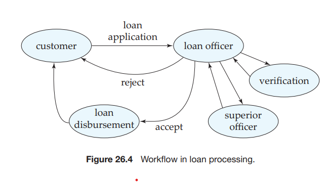

then have to be approved by one or more superior officers, after which the loan can be made. Each human here performs a task; in a bank that has not automated the task of loan processing, the coordination of the tasks is typically carried out by passing of the loan application, with attached notes and other information, from one employee to the next. Other examples of workflows include processing of expense vouchers, of purchase orders, and of credit-card transactions.

Today, all the information related to a workflow is more than likely to be stored in a digital form on one or more computers, and, with the growth of networking, information can be easily transferred from one computer to another. Hence, it is feasible for organizations to automate their workflows. For example, to automate the tasks involved in loan processing, we can store the loan application and associated information in a database. The workflow itself then involves handing of responsibility from one human to the next, and possibly even to programs that can automatically fetch the required information. Humans can coordinate their activities by means such as electronic mail.

Workflows are becoming increasingly important for multiple reasons within as well as between organizations. Many organizations today have multiple soft- ware systems that need to work together. For example, when an employee joins an organization, information about the employee may have to be provided to the payroll system, to the library system, to authentication systems that allow the user to log on to computers, to a system that manages cafeteria accounts, an so on. Updates, such as when the employee changes status or leaves the organization, also have to be propagated to all the systems.

Organizations are increasingly automating their services; for example, a sup- plier may provide an automated system for customers to place orders. Several tasks may need to be carried out when an order is placed, including reserving production time to create the ordered product and delivery services to deliver the product.

We have to address two activities, in general, to automate a workflow. The first is **workflow specification:** detailing the tasks that must be carried out and defining the execution requirements. The second problem is **workflow execu- tion**, which we must do while providing the safeguards of traditional database systems related to computation correctness and data integrity and durability. For example, it is not acceptable for a loan application or a voucher to be lost, or to be processed more than once, because of a system crash. The idea behind transac- tional workflows is to use and extend the concepts of transactions to the context of workflows.

Both activities are complicated by the fact that many organizations use several independently managed information-processing systems that, in most cases, were developed separately to automate different functions. Workflow activities may require interactions among several such systems, each performing a task, as well as interactions with humans.

A number of workflow systems have been developed in recent years. Here, we study properties of workflow systems at a relatively abstract level, without going into the details of any particular system.

### 26.2.1 Workflow Specification

Internal aspects of a task do not need to be modeled for the purpose of specification and management of a workflow. In an abstract view of a task, a task may use parameters stored in its input variables, may retrieve and update data in the local system, may store its results in its output variables, and may be queried about its execution state. At any time during the execution, the **workflow state** consists of the collection of states of the workflow’s constituent tasks, and the states (values) of all variables in the workflow specification.

The coordination of tasks can be specified either statically or dynamically. A static specification defines the tasks—and dependencies among them—before the execution of the workflow begins. For instance, the tasks in an expense- voucher workflow may consist of the approvals of the voucher by a secretary, a manager, and an accountant, in that order, and finally the delivery of a check. The dependencies among the tasks may be simple—each task has to be completed before the next begins.

A generalization of this strategy is to have a precondition for execution of each task in the workflow, so that all possible tasks in a workflow and their dependencies are known in advance, but only those tasks whose preconditions are satisfied are executed. The preconditions can be defined through dependencies such as the following:

- **Execution states** of other tasks—for example, “task _ti_ cannot start until task _tj_ has ended,” or “task _ti_ must abort if task _tj_ has committed.”

- **Output values** of other tasks—for example, “task _ti_ can start if task _tj_ re- turns a value greater than 25,” or “the manager-approval task can start if the secretary-approval task returns a value of OK.”

- **External variables** modified by external events—for example, “task _ti_ cannot be started before 9 A.M.,” or “task _ti_ must be started within 24 hours of the completion of task _tj_ .”  

We can combine the dependencies by the regular logical connectors (**or**, **and**, **not**) to form complex scheduling preconditions.

An example of dynamic scheduling of tasks is an electronic-mail routing system. The next task to be scheduled for a given mail message depends on what the destination address of the message is, and on which intermediate routers are functioning.

### 26.2.2 Failure-Atomicity Requirements of a Workflow

The workflow designer may specify the **failure-atomicity** requirements of a work- flow according to the semantics of the workflow. The traditional notion of failure atomicity would require that a failure of any task result in the failure of the work- flow. However, a workflow can, in many cases, survive the failure of one of its tasks—for example, by executing a functionally equivalent task at another site. Therefore, we should allow the designer to define failure-atomicity requirements of a workflow. The system must guarantee that every execution of a workflow will terminate in a state that satisfies the failure-atomicity requirements defined by the designer. We call those states **acceptable termination states** of a work- flow. All other execution states of a workflow constitute a set of **nonacceptable termination states**, in which the failure-atomicity requirements may be violated.

An acceptable termination state can be designated as committed or aborted. A **committed acceptable termination state** is an execution state in which the objectives of a workflow have been achieved. In contrast, an **aborted acceptable termination state** is a valid termination state in which a workflow has failed to achieve its objectives. If an aborted acceptable termination state has been reached, all undesirable effects of the partial execution of the workflow must be undone in accordance with that workflow’s failure-atomicity requirements.

A workflow must reach an acceptable termination state _even in the presence of system failures_. Thus, if a workflow is in a nonacceptable termination state at the time of failure, during system recovery it must be brought to an acceptable termination state (whether aborted or committed).

For example, in the loan-processing workflow, in the final state, either the loan applicant is told that a loan cannot be made or the loan is disbursed. In case of failures such as a long failure of the verification system, the loan application could be returned to the loan applicant with a suitable explanation; this outcome would constitute an aborted acceptable termination. A committed acceptable termination would be either the acceptance or the rejection of the loan.

In general, a task can commit and release its resources before the workflow reaches a termination state. However, if the multitask transaction later aborts, its failure atomicity may require that we undo the effects of already completed tasks (for example, committed subtransactions) by executing compensating tasks (as subtransactions). The semantics of compensation requires that a compensat- ing transaction eventually complete its execution successfully, possibly after a number of resubmissions.

In an expense-voucher-processing workflow, for example, a department- budget balance may be reduced on the basis of an initial approval of a voucher by the manager. If the voucher is later rejected, whether because of failure or for other reasons, the budget may have to be restored by a compensating transaction.

### 26.2.3 Execution of Workflows

The execution of the tasks may be controlled by a human coordinator or by a soft- ware system called a **workflow-management system**. A workflow-management system consists of a scheduler, task agents, and a mechanism to query the state of the workflow system. A task agent controls the execution of a task by a processing entity. A scheduler is a program that processes workflows by submitting various tasks for execution, monitoring various events, and evaluating conditions related to intertask dependencies. A scheduler may submit a task for execution (to a task agent), or may request that a previously submitted task be aborted. In the case of multidatabase transactions, the tasks are subtransactions, and the processing entities are local database-management systems. In accordance with the work- flow specifications, the scheduler enforces the scheduling dependencies and is responsible for ensuring that tasks reach acceptable termination states.

There are three architectural approaches to the development of a workflow- management system. A **centralized architecture** has a single scheduler that sched- ules the tasks for all concurrently executing workflows. The **partially distributed architecture** has one scheduler instantiated for each workflow. When the issues of concurrent execution can be separated from the scheduling function, the latter option is a natural choice. A **fully distributed architecture** has no scheduler, but the task agents coordinate their execution by communicating with one another to satisfy task dependencies and other workflow execution requirements.

The simplest workflow-execution systems follow the fully distributed ap- proach just described and are based on messaging. Messaging may be imple- mented by persistent messaging mechanisms, to provide guaranteed delivery. Some implementations use email for messaging; such implementations provide many of the features of persistent messaging, but generally do not guarantee atomicity of message delivery and transaction commit. Each site has a task agent that executes tasks received through messages. Execution may also involve pre- senting messages to humans, who have then to carry out some action. When a task is completed at a site, and needs to be processed at another site, the task agent dispatches a message to the next site. The message contains all relevant information about the task to be performed. Such message-based workflow sys- tems are particularly useful in networks that may be disconnected for part of the time.

The centralized approach is used in workflow systems where the data are stored in a central database. The scheduler notifies various agents, such as humans or computer programs, that a task has to be carried out, and keeps track of task completion. It is easier to keep track of the state of a workflow with a centralized approach than it is with a fully distributed approach.

The scheduler must guarantee that a workflow will terminate in one of the specified acceptable termination states. Ideally, before attempting to execute a workflow, the scheduler should examine that workflow to check whether the workflow may terminate in a nonacceptable state. If the scheduler cannot guar- antee that a workflow will terminate in an acceptable state, it should reject such specifications without attempting to execute the workflow. As an example, let us consider a workflow consisting of two tasks represented by subtransactions _S_1 and _S_2, with the failure-atomicity requirements indicating that either both or neither of the subtransactions should be committed. If _S_1 and _S_2 do not provide prepared-to-commit states (for a two-phase commit), and further do not have compensating transactions, then it is possible to reach a state where one subtrans- action is committed and the other aborted, and there is no way to bring both to the same state. Therefore, such a workflow specification is **unsafe**, and should be rejected.

Safety checks such as the one just described may be impossible or impractical to implement in the scheduler; it then becomes the responsibility of the person designing the workflow specification to ensure that the workflows are safe.

### 26.2.4 Recovery of a Workflow

The objective of **workflow recovery** is to enforce the failure atomicity of the work- flows. The recovery procedures must make sure that, if a failure occurs in any of the workflow-processing components (including the scheduler), the workflow will eventually reach an acceptable termination state (whether aborted or com- mitted). For example, the scheduler could continue processing after failure and recovery, as though nothing happened, thus providing forward recoverability. Otherwise, the scheduler could abort the whole workflow (that is, reach one of the global abort states). In either case, some subtransactions may need to be committed or even submitted for execution (for example, compensating subtrans- actions).

We assume that the processing entities involved in the workflow have their own recovery systems and handle their local failures. To recover the execution- environment context, the failure-recovery routines need to restore the state infor- mation of the scheduler at the time of failure, including the information about the execution states of each task. Therefore, the appropriate status information must be logged on stable storage.

We also need to consider the contents of the message queues. When one agent hands off a task to another, the handoff should be carried out exactly once: If the handoff happens twice a task may get executed twice; if the handoff does not occur, the task may get lost. Persistent messaging (Section 19.4.3) provides exactly the features to ensure positive, single handoff.

### 26.2.5 Workflow-Management Systems

Workflows are often hand coded as part of application systems. For instance, en- terprise resource planning (ERP) systems, which help coordinate activities across an entire enterprise, have numerous workflows built into them.

The goal of workflow-management systems is to simplify the construction of workflows and make them more reliable, by permitting them to be specified in a high-level manner and executed in accordance with the specification. There are a large number of commercial workflow-management systems; some are general- purpose workflow-management systems, while others are specific to particular workflows, such as order processing or bug/failure reporting systems.

In today’s world of interconnected organizations, it is not sufficient to man- age workflows only within an organization. Workflows that cross organizational boundaries are becoming increasingly common. For instance, consider an order placed by an organization and communicated to another organization that ful- fills the order. In each organization there may be a workflow associated with the order, and it is important that the workflows be able to interoperate, in order to minimize human intervention.

The term **business process management** is used to refer to the management of workflows related to business processes. Today, applications are increasingly making their functionality available as services that can be invoked by other applications, often using a Web service architecture. A system architecture based on invoking services provided by multiple applications is referred to as a **service oriented architecture SOA**. Such services are the base layer on top of which workflow management is implemented today. The process logic that controls the workflow by invoking the services is referred to as **orchestration**.

Business process management systems based on the SOA architecture include Microsoft’s BizTalk Server, IBMs WebSphere Business Integration Server Founda- tion, and BEAs WebLogic Process Edition, among others.

The **Web Services Business Process Execution Language** (**WS-BPEL**) is an XML based standard for specifying Web services and business processes (workflows) based on the Web services, which can be executed by a business process manage- ment system. The **Business Process Modeling Notation** (**BPMN**), is a standard for graphical modeling of business processes in a workflow, and **XML Process Definition Language** (**XPDL**) is an XML based representation of business process definitions, based on BPMN diagrams.

## 26.3 E-Commerce

E-commerce refers to the process of carrying out various activities related to commerce, through electronic means, primarily through the Internet. The types of activities include:

- Presale activities, needed to inform the potential buyer about the product or service being sold.

- The sale process, which includes negotiations on price and quality of service, and other contractual matters.

- The marketplace: When there are multiple sellers and buyers for a product, a marketplace, such as a stock exchange, helps in negotiating the price to be paid for the product. Auctions are used when there is a single seller and multiple buyers, and reverse auctions are used when there is a single buyer and multiple sellers. 
- Payment for the sale.

- Activities related to delivery of the product or service. Some products and services can be delivered over the Internet; for others the Internet is used only for providing shipping information and for tracking shipments of products.

- Customer support and postsale service.

Databases are used extensively to support these activities. For some of the activities, the use of databases is straightforward, but there are interesting appli- cation development issues for the other activities.

### 26.3.1 E-Catalogs

Any e-commerce site provides users with a catalog of the products and services that the site supplies. The services provided by an e-catalog may vary consider- ably.

At the minimum, an e-catalog must provide browsing and search facilities to help customers find the product for which they are looking. To help with brows- ing, products should be organized into an intuitive hierarchy, so a few clicks on hyperlinks can lead customers to the products in which they are interested. Key- words provided by the customer (for example, “digital camera” or “computer”) should speed up the process of finding required products. E-catalogs should also provide a means for customers to easily compare alternatives from which to choose among competing products.

E-catalogs can be customized for the customer. For instance, a retailer may have an agreement with a large company to supply some products at a discount. An employee of the company, viewing the catalog to purchase products for the company, should see prices with the negotiated discount, instead of the regular prices. Because of legal restrictions on sales of some types of items, customers who are underage, or from certain states or countries, should not be shown items that cannot legally be sold to them. Catalogs can also be personalized to individual users, on the basis of past buying history. For instance, frequent customers may be offered special discounts on some items.

Supporting such customization requires customer information as well as spe- cial pricing/discount information and sales restriction information to be stored in a database. There are also challenges in supporting very high transaction rates, which are often tackled by caching of query results or generated Web pages.

### 26.3.2 Marketplaces

When there are multiple sellers or multiple buyers (or both) for a product, a marketplace helps in negotiating the price to be paid for the product. There are several different types of marketplaces:

- In a **reverse auction** system a buyer states requirements, and sellers bid for supplying the item. The supplier quoting the lowest price wins. In a closed bidding system, the bids are not made public, whereas in an open bidding system the bids are made public. 

- In an **auction** there are multiple buyers and a single seller. For simplicity, assume that there is only one instance of each item being sold. Buyers bid for the items being sold, and the highest bidder for an item gets to buy the item at the bid price. When there are multiple copies of an item, things become more complicated: Suppose there are four items, and one bidder may want three copies for $10 each, while another wants two copies for $13 each. It is not possible to satisfy both bids. If the items will be of no value if they are not sold (for instance, airline seats, which must be sold before the plane leaves), the seller simply picks a set of bids that maximizes the income. Otherwise the decision is more complicated.

- In an **exchange**, such as a stock exchange, there are multiple sellers and multiple buyers. Buyers can specify the maximum price they are willing to pay, while sellers specify the minimum price they want. There is usually a _market maker_ who matches buy and sell bids, deciding on the price for each trade (for instance, at the price of the sell bid).

There are other more complex types of marketplaces. Among the database issues in handling marketplaces are these:

- Bidders need to be authenticated before they are allowed to bid.

- Bids (buy or sell) need to be recorded securely in a database. Bids need to be communicated quickly to other people involved in the marketplace (such as all the buyers or all the sellers), who may be numerous.

- Delays in broadcasting bids can lead to financial losses to some participants.

- The volumes of trades may be extremely large at times of stock market volatil- ity, or toward the end of auctions. Thus, very high performance databases with large degrees of parallelism are used for such systems.

### 26.3.3 Order Settlement

After items have been selected (perhaps through an electronic catalog) and the price determined (perhaps by an electronic marketplace), the order has to be settled. Settlement involves payment for goods and the delivery of the goods.

A simple but unsecure way of paying electronically is to send a credit-card number. There are two major problems. First, credit-card fraud is possible. When a buyer pays for physical goods, companies can ensure that the address for delivery matches the cardholder’s address, so no one else can receive the goods, but for goods delivered electronically no such check is possible. Second, the seller has to be trusted to bill only for the agreed-on item and to not pass on the card number to unauthorized people who may misuse it.

Several protocols are available for secure payments that avoid both the prob- lems listed above. In addition, they provide for better privacy, whereby the seller may not be given any unnecessary details about the buyer, and the credit-card company is not provided any unnecessary information about the items pur- chased. All information transmitted must be encrypted so that anyone intercept- ing the data on the network cannot find out the contents. Public-/private-key encryption is widely used for this task.

The protocols must also prevent **person-in-the-middle attacks**, where some- one can impersonate the bank or credit-card company, or even the seller, or buyer, and steal secret information. Impersonation can be perpetrated by passing off a fake key as someone else’s public key (the bank’s or credit-card company’s, or the merchant’s or the buyer’s). Impersonation is prevented by a system of **digital cer- tificates,** whereby public keys are signed by a certification agency, whose public key is well known (or which in turn has its public key certified by another certi- fication agency and so on up to a key that is well known). From the well-known public key, the system can authenticate the other keys by checking the certificates in reverse sequence. Digital certificates were described earlier, in Section 9.8.3.2.

Several novel payment systems were developed in the early days of the Web. One of these was a secure payment protocol called the _Secure Electronic Transaction_ (_SET_) protocol. The protocol requires several rounds of communication between the buyer, seller, and the bank, in order to guarantee safety of the transaction. There were also systems that provide for greater anonymity, similar to that pro- vided by physical cash. The _DigiCash_ payment system was one such system. When a payment is made in such a system, it is not possible to identify the purchaser. In contrast, identifying purchasers is very easy with credit cards, and even in the case of SET, it is possible to identify the purchaser with the cooperation of the credit-card company or bank. However, none of these systems was successful commercially, for both technical and non-technical reasons.

Today, many banks provide **secure payment gateways** which allow a pur- chaser to pay online at the banks Web site, without exposing credit card or bank account information to the online merchant. When making a purchase at an online merchant, the purchaser’s Web browser is redirected to the gateway to complete the payment by providing credit card or bank account information, after which the purchaser is again redirected back to the merchant’s site to complete the pur- chase. Unlike the SET or DigiCash protocols, there is no software running on the purchasers machine, except a Web browser; as a result this approach has found wide success where the earlier approaches failed.

An alternative approach which is used by the PayPal system is for both the purchaser and the merchant to have an account on a common platform, and the money transfer happens entirely within the common platform. The purchaser first loads her account with money using a credit card, and can then transfer money to the merchants account. This approach has been very successful with small merchants, since it does not require either the purchaser or the merchant to run any software.

## 26.4 Main-Memory Databases

To allow a high rate of transaction processing (hundreds or thousands of trans- actions per second), we must use high-performance hardware, and must exploit parallelism. These techniques alone, however, are insufficient to obtain very low response times, since disk I/O remains a bottleneck—about 10 milliseconds are required for each I/O, and this number has not decreased at a rate comparable to the increase in processor speeds. Disk I/O is often the bottleneck for reads, as well as for transaction commits. The long disk latency increases not only the time to access a data item, but also limits the number of accesses per second.1

We can make a database system less disk bound by increasing the size of the database buffer. Advances in main-memory technology let us construct large main memories at relatively low cost. Today, commercial 64-bit systems can support main memories of tens of gigabytes. Oracle TimesTen is a currently available main-memory database. Additional information on main-memory databases is given in the references in the bibliographical notes.

For some applications, such as real-time control, it is necessary to store data in main memory to meet performance requirements. The memory size required for most such systems is not exceptionally large, although there are at least a few applications that require multiple gigabytes of data to be memory resident. Since memory sizes have been growing at a very fast rate, an increasing number of applications can be expected to have data that fit into main memory.

Large main memories allow faster processing of transactions, since data are memory resident. However, there are still disk-related limitations:

- Log records must be written to stable storage before a transaction is commit- ted. The improved performance made possible by a large main memory may result in the logging process becoming a bottleneck. We can reduce commit time by creating a stable log buffer in main memory, using nonvolatile RAM (implemented, for example, by battery-backed-up memory). The overhead imposed by logging can also be reduced by the _group-commit_ technique dis- cussed later in this section. Throughput (number of transactions per second) is still limited by the data-transfer rate of the log disk.

- Buffer blocks marked as modified by committed transactions still have to be written so that the amount of log that has to be replayed at recovery time is reduced. If the update rate is extremely high, the disk data-transfer rate may become a bottleneck.

- If the system crashes, all of main memory is lost. On recovery, the system has an empty database buffer, and data items must be input from disk when they are accessed. Therefore, even after recovery is complete, it takes some time before the database is fully loaded in main memory and high-speed processing of transactions can resume.

- Since memory is costlier than disk space, internal data structures in main- memory databases have to be designed to reduce space requirements. How- ever, data structures can have pointers crossing multiple pages, unlike those in disk databases, where the cost of the I/Os to traverse multiple pages would be excessively high. For example, tree structures in main-memory databases can be relatively deep, unlike B+-trees, but should minimize space require- ments. However, the speed difference between cache memory and main-memory, and the fact that data is transferred between main-memory and cache in units of a _cache-line_ (typically about 64 bytes), results in a situation where the relationship between cache and main-memory is not dissimilar to the relationship between main-memory and disk (although with smaller speed differences). As a result, B+-trees with small nodes that fit in a cache line have been found quite useful even in main-memory databases.

- There is no need to pin buffer pages in memory before data are accessed, since buffer pages will never be replaced.

- Query-processing techniques should be designed to minimize space over- head, so that main-memory limits are not exceeded while a query is being evaluated; that situation would result in paging to swap area, and would slow down query processing.

- Once the disk I/O bottleneck is removed, operations such as locking and latching may become bottlenecks. Such bottlenecks must be eliminated by improvements in the implementation of these operations.

- Recovery algorithms can be optimized, since pages rarely need to be written out to make space for other pages.

The process of committing a transaction _T_ requires these records to be written to stable storage:

- All log records associated with _T_ that have not been output to stable storage.

- The _<_T **commit**_\>_ log record.

These output operations frequently require the output of blocks that are only partially filled. To ensure that nearly full blocks are output, we use the **group- commit** technique. Instead of attempting to commit _T_ when _T_ completes, the system waits until several transactions have completed, or a certain period of time has passed since a transaction completed execution. It then commits the group of transactions that are waiting, together. Blocks written to the log on stable storage would contain records of several transactions. By careful choice of group size and maximum waiting time, the system can ensure that blocks are full when they are written to stable storage without making transactions wait excessively. This technique results, on average, in fewer output operations per committed transaction. 

Although group commit reduces the overhead imposed by logging, it results in a slight delay in commit of transactions that perform updates. The delay can be made quite small (say, 10 milliseconds), which is acceptable for many applications. These delays can be eliminated if disks or disk controllers support nonvolatile RAM buffers for write operations. Transactions can commit as soon as the write is performed on the nonvolatile RAM buffer. In this case, there is no need for group commit.

Note that group commit is useful even in databases with disk-resident data, not just for main-memory databases. If flash storage is used instead of magnetic disk for storing log records, the commit delay is significantly reduced. However, group commit can still be useful since it minimizes the number of pages written; this translates to performance benefits in flash storage, since pages cannot be overwritten, and the erase operation is expensive. (Flash storage systems remap logical pages to a pre-erased physical page, avoiding delay at the time a page is written, but the erase operation must be performed eventually as part of garbage collection of old versions of pages.)

## 26.5 Real-Time Transaction Systems

The integrity constraints that we have considered thus far pertain to the values stored in the database. In certain applications, the constraints include **deadlines** by which a task must be completed. Examples of such applications include plant management, traffic control, and scheduling. When deadlines are included, cor- rectness of an execution is no longer solely an issue of database consistency. Rather, we are concerned with how many deadlines are missed, and by how much time they are missed. Deadlines are characterized as follows:

- **Hard deadline**. Serious problems, such as system crash, may occur if a task is not completed by its deadline.

- **Firm deadline**. The task has zero value if it is completed after the deadline.

- **Soft deadlines**. The task has diminishing value if it is completed after the deadline, with the value approaching zero as the degree of lateness increases.

Systems with deadlines are called **real-time systems**. Transaction management in real-time systems must take deadlines into ac-

count. If the concurrency-control protocol determines that a transaction _Ti_ must wait, it may cause _Ti_ to miss the deadline. In such cases, it may be preferable to pre-empt the transaction holding the lock, and to allow _Ti_ to proceed. Pre-emption must be used with care, however, because the time lost by the pre-empted trans- action (due to rollback and restart) may cause the pre-empted transaction to miss its deadline. Unfortunately, it is difficult to determine whether rollback or waiting is preferable in a given situation.

A major difficulty in supporting real-time constraints arises from the variance in transaction execution time. In the best case, all data accesses reference data in the database buffer. In the worst case, each access causes a buffer page to be written to disk (preceded by the requisite log records), followed by the reading from disk of the page containing the data to be accessed. Because the two or more disk accesses required in the worst case take several orders of magnitude more time than the main-memory references required in the best case, transaction execution time can be estimated only very poorly if data are resident on disk. Hence, main-memory databases are often used if real-time constraints have to be met.

However, even if data are resident in main memory, variances in execution time arise from lock waits, transaction aborts, and so on. Researchers have devoted considerable effort to concurrency control for real-time databases. They have extended locking protocols to provide higher priority for transactions with early deadlines. They have found that optimistic concurrency protocols perform well in real-time databases; that is, these protocols result in fewer missed deadlines than even the extended locking protocols. The bibliographical notes provide references to research in the area of real-time databases.

In real-time systems, deadlines, rather than absolute speed, are the most important issue. Designing a real-time system involves ensuring that there is enough processing power to meet deadlines without requiring excessive hard- ware resources. Achieving this objective, despite the variance in execution time resulting from transaction management, remains a challenging problem.

## 26.6 Long-Duration Transactions

The transaction concept developed initially in the context of data-processing applications, in which most transactions are noninteractive and of short duration. Although the techniques presented here and earlier in Chapters 14, 15, and 16 work well in those applications, serious problems arise when this concept is applied to database systems that involve human interaction. Such transactions have these key properties:

- **Long duration**. Once a human interacts with an active transaction, that trans- action becomes a **long-duration transaction** from the perspective of the com- puter, since human response time is slow relative to computer speed. Further- more, in design applications, the human activity may involve hours, days, or an even longer period. Thus, transactions may be of long duration in human terms, as well as in machine terms.

- **Exposure of uncommitted data**. Data generated and displayed to a user by a long-duration transaction are uncommitted, since the transaction may abort. Thus, users—and, as a result, other transactions—may be forced to read uncommitted data. If several users are cooperating on a project, user transactions may need to exchange data prior to transaction commit.

- **Subtasks**. An interactive transaction may consist of a set of subtasks initiated by the user. The user may wish to abort a subtask without necessarily causing the entire transaction to abort.  
- **Recoverability**. It is unacceptable to abort a long-duration interactive trans- action because of a system crash. The active transaction must be recovered to a state that existed shortly before the crash so that relatively little human work is lost.

- **Performance**. Good performance in an interactive transaction system is de- fined as fast response time. This definition is in contrast to that in a non- interactive system, in which high throughput (number of transactions per second) is the goal. Systems with high throughput make efficient use of system resources. However, in the case of interactive transactions, the most costly resource is the user. If the efficiency and satisfaction of the user is to be optimized, response time should be fast (from a human perspective). In those cases where a task takes a long time, response time should be predictable (that is, the variance in response times should be low), so that users can manage their time well.

In Sections 26.6.1 through 26.6.5, we shall see why these five properties are in- compatible with the techniques presented thus far and shall discuss how those techniques can be modified to accommodate long-duration interactive transac- tions.

### 26.6.1 Nonserializable Executions

The properties that we discussed make it impractical to enforce the requirement used in earlier chapters that only serializable schedules be permitted. Each of the concurrency-control protocols of Chapter 15 has adverse effects on long-duration transactions:

- **Two-phase locking**. When a lock cannot be granted, the transaction request- ing the lock is forced to wait for the data item in question to be unlocked. The duration of this wait is proportional to the duration of the transaction holding the lock. If the data item is locked by a short-duration transaction, we expect that the waiting time will be short (except in case of deadlock or extraordinary system load). However, if the data item is locked by a long- duration transaction, the wait will be of long duration. Long waiting times lead to both longer response time and an increased chance of deadlock.

- **Graph-based protocols**. Graph-based protocols allow for locks to be released earlier than under the two-phase locking protocols, and they prevent dead- lock. However, they impose an ordering on the data items. Transactions must lock data items in a manner consistent with this ordering. As a result, a trans- action may have to lock more data than it needs. Furthermore, a transaction must hold a lock until there is no chance that the lock will be needed again. Thus, long-duration lock waits are likely to occur.

- **Timestamp-based protocols**. Timestamp protocols never require a transac- tion to wait. However, they do require transactions to abort under certain cir- cumstances. If a long-duration transaction is aborted, a substantial amount of work is lost. For noninteractive transactions, this lost work is a performance issue. For interactive transactions, the issue is also one of user satisfaction. It is highly undesirable for a user to find that several hours’ worth of work have been undone.
- **Validation protocols**. Like timestamp-based protocols, validation protocols enforce serializability by means of transaction abort.

Thus, it appears that the enforcement of serializability results in long-duration waits, in abort of long-duration transactions, or in both. There are theoretical results, cited in the bibliographical notes, that substantiate this conclusion.

Further difficulties with the enforcement of serializability arise when we con- sider recovery issues. We previously discussed the problem of cascading rollback, in which the abort of a transaction may lead to the abort of other transactions. This phenomenon is undesirable, particularly for long-duration transactions. If locking is used, exclusive locks must be held until the end of the transaction, if cascading rollback is to be avoided. This holding of exclusive locks, however, increases the length of transaction waiting time.

Thus, it appears that the enforcement of transaction atomicity must either lead to an increased probability of long-duration waits or create a possibility of cascading rollback.

Snapshot isolation, described in Section 15.7, can provide a partial solution to these issues, as can the _optimistic concurrency control without read validation_ protocol described in Section 15.9.3. The latter protocol was in fact designed specifically to deal with long duration transactions that involve user interaction. Although it does not guarantee serializability, optimistic concurrency control without read validation is quite widely used.

However, when transactions are of long duration, conflicting updates are more likely, resulting in additional waits or aborts. These considerations are the basis for the alternative concepts of correctness of concurrent executions and transaction recovery that we consider in the remainder of this section.

### 26.6.2 Concurrency Control

The fundamental goal of database concurrency control is to ensure that concur- rent execution of transactions does not result in a loss of database consistency. The concept of serializability can be used to achieve this goal, since all serializable schedules preserve consistency of the database. However, not all schedules that preserve consistency of the database are serializable. For an example, consider again a bank database consisting of two accounts _A_ and _B_, with the consistency requirement that the sum _A_ \+ _B_ be preserved. Although the schedule of Fig- ure 26.5 is not conflict serializable, it nevertheless preserves the sum of _A + B_. It also illustrates two important points about the concept of correctness without serializability.

- Correctness depends on the specific consistency constraints for the database.

- Correctness depends on the properties of operations performed by each trans- action.  

| T~1~ | T~2~ |
| ----------- | ----------- |
| read(_A_) _A_ := _A_ − 50 write(_A_) | read(_B_) _B_ := _B_ − 10 write(_B_) |
| read(_B_) _B_ := _B_ \+ 50 write(_B_) | read(_A_) _A_ := _A_ \+ 10 write(_A_) |

**Figure 26.5** A non-conflict-serializable schedule.

In general it is not possible to perform an automatic analysis of low-level opera- tions by transactions and check their effect on database consistency constraints. However, there are simpler techniques. One is to use the database consistency constraints as the basis for a split of the database into subdatabases on which con- currency can be managed separately. Another is to treat some operations besides **read** and **write** as fundamental low-level operations and to extend concurrency control to deal with them.

The bibliographical notes reference other techniques for ensuring consistency without requiring serializability. Many of these techniques exploit variants of multiversion concurrency control (see Section 15.6). For older data-processing applications that need only one version, multiversion protocols impose a high space overhead to store the extra versions. Since many of the new database applications require the maintenance of versions of data, concurrency-control techniques that exploit multiple versions are practical.

### 26.6.3 Nested and Multilevel Transactions

A long-duration transaction can be viewed as a collection of related subtasks or subtransactions. By structuring a transaction as a set of subtransactions, we are able to enhance parallelism, since it may be possible to run several subtransactions in parallel. Furthermore, it is possible to deal with failure of a subtransaction (due to abort, system crash, and so on) without having to roll back the entire long-duration transaction.

A nested or multilevel transaction _T_ consists of a set _T_ \= {t~1~,t~2~, _. . ._ , _t~n~_} of subtransactions and a partial order _P_ on _T_. A subtransaction _ti_ in _T_ may abort without forcing _T_ to abort. Instead, _T_ may either restart _ti_ or simply choose not to run _t~i~_ . If _t~i~_ commits, this action does not make _ti_ permanent (unlike the situation in Chapter 16). Instead, _ti commits to T_, and may still abort (or require compensation —see Section 26.6.4) if _T_ aborts. An execution of _T_ must not violate the partial  order _P_. That is, if an edge _t~i~_ → _t~j~_ appears in the precedence graph, then _t~j~_ → _t~i~_ must not be in the transitive closure of _P_.

Nesting may be several levels deep, representing a subdivision of a transac- tion into subtasks, subsubtasks, and so on. At the lowest level of nesting, we have the standard database operations **read** and **write** that we have used previously.

If a subtransaction of _T_ is permitted to release locks on completion, _T_ is called a **multilevel transaction**. When a multilevel transaction represents a long- duration activity, the transaction is sometimes referred to as a **saga**. Alternatively, if locks held by a subtransaction _t~i~_ of _T_ are automatically assigned to _T_ on completion of _t~i~_ , _T_ is called a **nested transaction**.

Although the main practical value of multilevel transactions arises in com- plex, long-duration transactions, we shall use the simple example of Figure 26.5 to show how nesting can create higher-level operations that may enhance con- currency. We rewrite transaction _T~1~, using subtransactions _T_~1~,~1~ and _T_~1~_,~2~, which perform increment or decrement operations:

- T~1~ consists of:

  ◦ T~1~_,~1~_, which subtracts 50 from _A_.
  
  ◦ T~1~_,_~2~_,_ which adds 50 to _B_.

Similarly, we rewrite transaction _T_~2~_,_ using subtransactions T_~2~,~1~ and _T_~2~_,~2~,_ which also perform increment or decrement operations:

- T~2~ consists of:

  ◦ T~2~,~1~ which subtracts 10 from _B_.
  
  ◦T~2~,~2~ which adds 10 to _A_.

No ordering is specified on _T~1,1~, T_~1,2~_, T_~2,1~_,_ and _T~2,2~\. Any execution of these sub- transactions will generate a correct result. The schedule of Figure 26.5 corresponds to the schedule _<  _T~1,1~, T_~1,2~_, T_~2,1~_,_ and _T~2,2~\>_.

To reduce the frequency of long-duration waiting, we arrange for uncommit- ted updates to be exposed to other concurrently executing transactions. Indeed, multilevel transactions may allow this exposure. However, the exposure of un- committed data creates the potential for cascading rollbacks. The concept of **com- pensating transactions** helps us to deal with this problem.

Let transaction _T_ be divided into several subtransactions _t_~1~_, t_~2~_, . . . , t~n~_. After a subtransaction _t~i~_ commits, it releases its locks. Now, if the outer-level transaction _T_ has to be aborted, the effect of its subtransactions must be undone. Suppose that subtransactions _t_~1~_, . . . , t~k~_ have committed, and that _t~k+1~ was executing when the decision to abort is made. We can undo the effects of _t~k+1~ by aborting that subtransaction. However, it is not possible to abort subtransactions _t_~1~_, . . . , t~k~_ , since they have committed already.

Instead, we execute a new subtransaction _ct~i~_ , called a _compensating transaction_, to undo the effect of a subtransaction _t~i~_ . Each subtransaction _t~i~_ is required to have a compensating transaction _ct~i~_ . The compensating transactions must be executed in the inverse order _ct~k~, . . . , ct_~1~\. Here are several examples of compensation:

- Consider the schedule of Figure 26.5, which we have shown to be correct, although not conflict serializable. Each subtransaction releases its locks once it completes. Suppose that T~2~ fails just prior to termination, after T~2,2~ has re- leased its locks. We then run a compensating transaction for T~2,2~ that subtracts 10 from _A_ and a compensating transaction for T~2,1~ that adds 10 to _B_.

- Consider a database insert by transaction _T~i~_ that, as a side effect, causes a B+-tree index to be updated. The insert operation may have modified several nodes of the B+-tree index. Other transactions may have read these nodes in accessing data other than the record inserted by _T~i~_ . As mentioned in Sec- tion 16.7, we can undo the insertion by deleting the record inserted by _T~i~_ . The result is a correct, consistent B+-tree, but is not necessarily one with exactly the same structure as the one we had before _T~i~_ started. Thus, deletion is a compensating action for insertion.
- Consider a long-duration transaction T~i~ representing a travel reservation. Transaction _T_ has three subtransactions: T~i,1~, which makes airline reserva- tions; T~i,2~, which reserves rental cars; and T~i,3~, which reserves a hotel room. Suppose that the hotel cancels the reservation. Instead of undoing all of T~i~ , we compensate for the failure of T~i,3~ by deleting the old hotel reservation and making a new one.

If the system crashes in the middle of executing an outer-level transaction, its subtransactions must be rolled back when it recovers. The techniques described in Section 16.7 can be used for this purpose.

Compensation for the failure of a transaction requires that the semantics of the failed transaction be used. For certain operations, such as incrementation or insertion into a B+-tree, the corresponding compensation is easily defined. For more complex transactions, the application programmers may have to define the correct form of compensation at the time that the transaction is coded. For complex interactive transactions, it may be necessary for the system to interact with the user to determine the proper form of compensation.

### 26.6.5 Implementation Issues

The transaction concepts discussed in this section create serious difficulties for implementation. We present a few of them here, and discuss how we can address these problems.

Long-duration transactions must survive system crashes. We can ensure that they will by performing a **redo** on committed subtransactions, and by performing either an **undo** or compensation for any short-duration subtransactions that were active at the time of the crash. However, these actions solve only part of the problem. In typical database systems, such internal system data as lock ta- bles and transaction timestamps are kept in volatile storage. For a long-duration transaction to be resumed after a crash, these data must be restored. Therefore, it is necessary to log not only changes to the database, but also changes to internal system data pertaining to long-duration transactions.

Logging of updates is made more complex when certain types of data items exist in the database. A data item may be a CAD design, text of a document, or another form of composite design. Such data items are physically large. Thus, storing both the old and new values of the data item in a log record is undesirable.

There are two approaches to reducing the overhead of ensuring the recover- ability of large data items:

- **Operation logging**. Only the operation performed on the data item and the data-item name are stored in the log. Operation logging is also called **logical logging**. For each operation, an inverse operation must exist. We perform **undo** using the inverse operation and **redo** using the operation itself. Recovery through operation logging is more difficult, since **redo** and **undo** are not idempotent. Further, using logical logging for an operation that updates multiple pages is greatly complicated by the fact that some, but not all, of the updated pages may have been written to the disk, so it is hard to apply either the **redo** or the **undo** of the operation on the disk image during recovery. Using physical redo logging and logical undo logging, as described in Section 16.7, provides the concurrency benefits of logical logging while avoiding the above pitfalls.

- **Logging and shadow paging**. Logging is used for modifications to small data items, but large data items are often made recoverable via a shadowing, or copy-on-write, technique. When we use shadowing, it is possible to reduce the overhead by keeping copies of only those pages that are actually modified.

Regardless of the technique used, the complexities introduced by long-duration transactions and large data items complicate the recovery process. Thus, it is desirable to allow certain noncritical data to be exempt from logging, and to rely instead on offline backups and human intervention.

## 26.7 Summary

- Workflows are activities that involve the coordinated execution of multiple tasks performed by different processing entities. They exist not just in com- puter applications, but also in almost all organizational activities. With the growth of networks, and the existence of multiple autonomous database sys- tems, workflows provide a convenient way of carrying out tasks that involve multiple systems.

- Although the usual ACID transactional requirements are too strong or are unimplementable for such workflow applications, workflows must satisfy a limited set of transactional properties that guarantee that a process is not left in an inconsistent state.

- Transaction-processing monitors were initially developed as multithreaded servers that could service large numbers of terminals from a single process. They have since evolved, and today they provide the infrastructure for build- ing and administering complex transaction-processing systems that have a large number of clients and multiple servers. They provide services such as durable queueing of client requests and server responses, routing of client messages to servers, persistent messaging, load balancing, and coordination of two-phase commit when transactions access multiple servers.

- E-commerce systems have become a core part of commerce. There are sev- eral database issues in e-commerce systems. Catalog management, especially personalization of the catalog, is done with databases. Electronic market- places help in pricing of products through auctions, reverse auctions, or exchanges. High-performance database systems are needed to handle such trading. Orders are settled by electronic payment systems, which also need high-performance database systems to handle very high transaction rates.

- Large main memories are exploited in certain systems to achieve high sys- tem throughput. In such systems, logging is a bottleneck. Under the group- commit concept, the number of outputs to stable storage can be reduced, thus releasing this bottleneck.

- The efficient management of long-duration interactive transactions is more complex, because of the long-duration waits and because of the possibil- ity of aborts. Since the concurrency-control techniques used in Chapter 15 use waits, aborts, or both, alternative techniques must be considered. These techniques must ensure correctness without requiring serializability.

- A long-duration transaction is represented as a nested transaction with atomic database operations at the lowest level. If a transaction fails, only active short- duration transactions abort. Active long-duration transactions resume once any short-duration transactions have recovered. A compensating transaction is needed to undo updates of nested transactions that have committed, if the outer-level transaction fails.

- In systems with real-time constraints, correctness of execution involves not only database consistency but also deadline satisfaction. The wide variance of execution times for read and write operations complicates the transaction- management problem for time-constrained systems.

### Review Terms

- TP monitor 
- TP-monitor architectures

  ◦ Process per client
  
  ◦ Single server 

  ◦ Many server, single router
  
  ◦ Many server, many router

- Multitasking 
- Context switch  
- Multithreaded server 
- Queue manager 
- Application coordination

  ◦ Resource manager
  
  ◦ Remote procedure call (RPC)

- Transactional workflows
  
  ◦ Task
  
  ◦ Processing entity
  
  ◦ Workflow specification
  
  ◦ Workflow execution

- Workflow state

  ◦ Execution states
  
  ◦ Output values
  
  ◦ External variables

- Workflow failure atomicity 
- Workflow termination states
  
  ◦ Acceptable
  
  ◦ Nonacceptable
  
  ◦ Committed
  
  ◦ Aborted

- Workflow recovery 
- Workflow-management system 
- Workflow-management system architectures
  
  ◦ Centralized
  
  ◦ Partially distributed
  
  ◦ Fully distributed

- Business process management 
- Orchestration 
- E-commerce 
- E-catalogs 
- Marketplaces
  
  ◦ Auctions
  
  ◦ Reverse auctions
  
  ◦ Exchange

- Order settlement 
- Digital certificates 
- Main-memory databases 
- Group commit 
- Real-time systems 
- Deadlines

  ◦ Hard deadline
  
  ◦ Firm deadline
  
  ◦ Soft deadline

- Real-time databases 
- Long-duration transactions 
- Exposure of uncommitted data 
- Nonserializable executions 
- Nested transactions 
- Multilevel transactions 
- Saga 
- Compensating transactions 
- Logical logging

### Practice Exercises

**26.1** Like database systems, workflow systems also require concurrency and recovery management. List three reasons why we cannot simply apply a relational database system using 2PL, physical undo logging, and 2PC. 

**26.2** Consider a main-memory database system recovering from a system crash. Explain the relative merits of:

- Loading the entire database back into main memory before resuming transaction processing.

- Loading data as it is requested by transactions.

**26.3** Is a high-performance transaction system necessarily a real-time system? Why or why not?

**26.4** Explain why it may be impractical to require serializability for long- duration transactions.

**26.5** Consider a multithreaded process that delivers messages from a durable queue of persistent messages. Different threads may run concurrently, attempting to deliver different messages. In case of a delivery failure, the message must be restored in the queue. Model the actions that each thread carries out as a multilevel transaction, so that locks on the queue need not be held until a message is delivered.

**26.6** Discuss the modifications that need to be made in each of the recovery schemes covered in Chapter 16 if we allow nested transactions. Also, explain any differences that result if we allow multilevel transactions.

### Exercises

**26.7** Explain how a TP monitor manages memory and processor resources more effectively than a typical operating system.

**26.8** Compare TP-monitor features with those provided by Web servers sup- porting servlets (such servers have been nicknamed _TP-lite_).

**26.9** Consider the process of admitting new students at your university (or new employees at your organization).

a. Give a high-level picture of the workflow starting from the student application procedure.

b. Indicate acceptable termination states and which steps involve hu- man intervention.

c. Indicate possible errors (including deadline expiry) and how they are dealt with.

d. Study how much of the workflow has been automated at your uni- versity.

**26.10** Answer the following questions regarding electronic payment systems: 

a. Explain why electronic transactions carried out using credit-card numbers may be insecure.

b. An alternative is to have an electronic payment gateway maintained by the credit-card company, and the site receiving payment redirects customers to the gateway site to make the payment.
i. Explain what benefits such a system offers if the gateway does not authenticate the user. 
ii. Explain what further benefits are offered if the gateway has a

mechanism to authenticate the user.

c. Some credit-card companies offer a one-time-use credit-card number as a more secure method of electronic payment. Customers connect to the credit-card company’s Web site to get the one-time-use num- ber. Explain what benefit such a system offers, as compared to using regular credit-card numbers. Also explain its benefits and drawbacks as compared to electronic payment gateways with authentication.

d. Does either of the above systems guarantee the same privacy that is available when payments are made in cash? Explain your answer.

**26.11** If the entire database fits in main memory, do we still need a database system to manage the data? Explain your answer.

**26.12** In the group-commit technique, how many transactions should be part of a group? Explain your answer.

**26.13** In a database system using write-ahead logging, what is the worst-case number of disk accesses required to read a data item from a specified disk page. Explain why this presents a problem to designers of real-time database systems. Hint: consider the case when the disk buffer is full.

**26.14** What is the purpose of compensating transactions? Present two examples of their use.

**26.15** Explain the connections between a workflow and a long-duration trans- action.

### Bibliographical Notes

Gray and Reuter [1993] provides a detailed (and excellent) textbook description of transaction-processing systems, including chapters on TP monitors. X/Open [1991] defines the X/Open XA interface.

Fischer [2006] is a handbook on workflow systems, which is published in association with the Workflow Management Coalition. The Web site of the coalition is www.wfmc.org. Our description of workflows follows the model of Rusinkiewicz and Sheth [1995].

Loeb [1998] provides a detailed description of secure electronic transactions.

Garcia-Molina and Salem [1992] provides an overview of main-memory databases. Jagadish et al. [1993] describes a recovery algorithm designed for mainmemory databases. A storage manager for main-memory databases is described in Jagadish et al. [1994].

Real-time databases are discussed by Lam and Kuo [2001]. Concurrency control and scheduling in real-time databases are discussed by Haritsa et al. [1990],Hong et al. [1993], and Pang et al. [1995]. Ozsoyoglu and Snodgrass [1995] is a survey of research in real-time and temporal databases.

Nested and multilevel transactions are presented by Moss [1985], Lynch and Merritt [1986], Moss [1987], Haerder and Rothermel [1987], Rothermel and Mohan [1989], Weikum et al. [1990], Korth and Speegle [1990], Weikum [1991], and Korth and Speegle [1994], Theoretical aspects of multilevel transactions are presented in Lynch et al. [1988]. The concept of Saga was introduced in Garcia-Molina and Salem [1987]