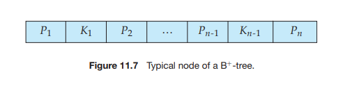
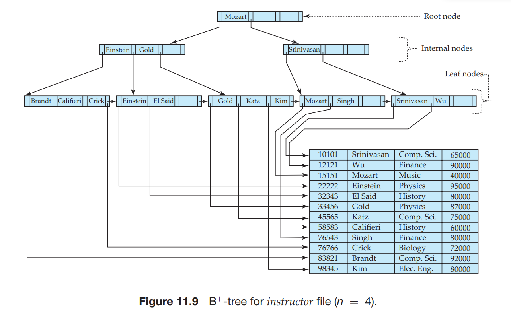

11.3 B+-Tree Index Files## 11.3 B+-Tree Index Files

The main disadvantage of the index-sequential file organization is that perfor- mance degrades as the file grows, both for index lookups and for sequential scans through the data. Although this degradation can be remedied by reorganization of the file, frequent reorganizations are undesirable.

The **B**+**\-tree** index structure is the most widely used of several index structures that maintain their efficiency despite insertion and deletion of data. A B+-tree index takes the form of a **balanced tree** in which every path from the root of the tree to a leaf of the tree is of the same length. Each nonleaf node in the tree has between ⌈_n/_2  and _n_ children, where _n_ is fixed for a particular tree.

We shall see that the B+-tree structure imposes performance overhead on in- sertion and deletion, and adds space overhead. The overhead is acceptable even for frequently modified files, since the cost of file reorganization is avoided. Fur- thermore, since nodes may be as much as half empty (if they have the minimum number of children), there is some wasted space. This space overhead, too, is acceptable given the performance benefits of the B+-tree structure.

### 11.3.1 Structure of a B+-Tree

A B+-tree index is a multilevel index, but it has a structure that differs from that of the multilevel index-sequential file. Figure 11.7 shows a typical node of a B+- tree. It contains up to _n_ − 1 search-key values _K_1_, K_2_, . . . , Kn_ − 1, and _n_ pointers _P_1_, P_2_, . . . , Pn_. The search-key values within a node are kept in sorted order; thus, if _i < j_ , then _Ki < K j_ .

We consider first the structure of the **leaf nodes**. For _i_ \= 1_,_ 2_, . . . , n_−1, pointer _Pi_ points to a file record with search-key value _Ki_ . Pointer _Pn_ has a special purpose that we shall discuss shortly.

Figure 11.8 shows one leaf node of a B+-tree for the _instructor_ file, in which we have chosen _n_ to be 4, and the search key is _name_.

Now that we have seen the structure of a leaf node, let us consider how search-key values are assigned to particular nodes. Each leaf can hold up to _n_ − 1 values. We allow leaf nodes to contain as few as ⌈(_n_ − 1)_/_2 ⌉ values. With _n_ \= 4 in our example B+-tree, each leaf must contain at least 2 values, and at most 3 values.

The ranges of values in each leaf do not overlap, except if there are duplicate search-key values, in which case a value may be present in more than one leaf. Specifically, if _Li_ and _L j_ are leaf nodes and _i < j_ , then every search-key value in _Li_ is less than or equal to every search-key value in _L j_ . If the B+-tree index is used as a dense index (as is usually the case) every search-key value must appear in some leaf node.

Now we can explain the use of the pointer _Pn_. Since there is a linear order on the leaves based on the search-key values that they contain, we use _Pn_ to chain




together the leaf nodes in search-key order. This ordering allows for efficient sequential processing of the file.

The **nonleaf nodes** of the B+-tree form a multilevel (sparse) index on the leaf nodes. The structure of nonleaf nodes is the same as that for leaf nodes, except that all pointers are pointers to tree nodes. A nonleaf node may hold up to _n_ pointers, and _must_ hold at least ⌈_n/_2⌉ pointers. The number of pointers in a node is called the _fanout_ of the node. Nonleaf nodes are also referred to as **internal nodes**.

Let us consider a node containing _m_ pointers (_m_ ≤ _n_). For _i_ \= 2_,_ 3_, . . . , m_ − 1, pointer _Pi_ points to the subtree that contains search-key values less than _Ki_ and greater than or equal to _Ki_ − 1. Pointer _Pm_ points to the part of the subtree that contains those key values greater than or equal to _Km_ − 1, and pointer _P_1 points to the part of the subtree that contains those search-key values less than _K_1.

Unlike other nonleaf nodes, the root node can hold fewer than ⌈_n/_2⌉ pointers; however, it must hold at least two pointers, unless the tree consists of only one node. It is always possible to construct a B+-tree, for any _n_, that satisfies the preceding requirements.

Figure 11.9 shows a complete B+-tree for the _instructor_ file (with _n_ \= 4). We have shown instructor names abbreviated to 3 characters in order to depict the tree clearly; in reality, the tree nodes would contain the full names. We have also omitted null pointers for simplicity; any pointer field in the figure that does not have an arrow is understood to have a null value.

Figure 11.10 shows another B+-tree for the _instructor_ file, this time with _n_ \= 6. As before, we have abbreviated instructor names only for clarity of presentation. 



Observe that the height of this tree is less than that of the previous tree, which had _n_ \= 4.

These examples of B+-trees are all balanced. That is, the length of every path from the root to a leaf node is the same. This property is a requirement for a B+- tree. Indeed, the “B” in B+-tree stands for “balanced.” It is the balance property of B+-trees that ensures good performance for lookup, insertion, and deletion.

### 11.3.2 Queries on B+-Trees

Let us consider how we process queries on a B+-tree. Suppose that we wish to find records with a search-key value of _V_. Figure 11.11 presents pseudocode for a function find() to carry out this task.

Intuitively, the function starts at the root of the tree, and traverses the tree down until it reaches a leaf node that would contain the specified value if it exists in the tree. Specifically, starting with the root as the current node, the function repeats the following steps until a leaf node is reached. First, the current node is examined, looking for the smallest _i_ such that search-key value _Ki_ is greater


```
function find(value V)
/* Returns leaf node C and index i such that C.Pi points to first record
* with search key value V */
Set C = root node
while (C is not a leaf node) begin
Let i = smallest number such that V ≤ C.Ki
if there is no such number i then begin
Let Pm = last non-null pointer in the node
Set C = C.Pm
end
else if (V = C.Ki)
then Set C = C.Pi+1
else C = C.Pi /* V < C.Ki */
end
/* C is a leaf node */
Let i be the least value such that Ki = V
if there is such a value i
then return (C,i)
else return null ; /* No record with key value V exists*/
```

```
procedure printAll(value V)
/* prints all records with search key value V */
Set done = false;
Set (L,i) = find(V);
if ((L,i) is null) return
repeat
repeat
Print record pointed to by L.Pi
Set i = i + 1
until (i > number of keys in L or L.Ki > V)
if (i > number of keys in L)
then L = L.Pn
else Set done = true;
until (done or L is null)
```
**Figure 11.11** Querying a B+-tree.

than or equal to _V_. Suppose such a value is found; then, if _Ki_ is equal to _V_, the current node is set to the node pointed to by _Pi_+1, otherwise _Ki > V_, and the current node is set to the node pointed to by _Pi_ . If no such value _Ki_ is found, then clearly _V > Km_−1, where _Pm_ is the last nonnull pointer in the node. In this case the current node is set to that pointed to by _Pm_. The above procedure is repeated, traversing down the tree until a leaf node is reached.

At the leaf node, if there is a search-key value equal to _V_, let _Ki_ be the first such value; pointer _Pi_ directs us to a record with search-key value _Ki_ . The function then returns the leaf node _L_ and the index _i_ . If no search-key with value _V_ is found in the leaf node, no record with key value _V_ exists in the relation, and function find returns null, to indicate failure.

If there is at most one record with a search key value _V_ (for example, if the index is on a primary key) the procedure that calls the find function simply uses the pointer _L .Pi_ to retrieve the record and is done. However, in case there may be more than one matching record, the remaining records also need to be fetched.

Procedure printAll shown in Figure 11.11 shows how to fetch all records with a specified search key _V_. The procedure first steps through the remaining keys in the node _L_, to find other records with search-key value _V_. If node _L_ contains at least one search-key value greater than _V_, then there are no more records matching _V_. Otherwise, the next leaf, pointed to by _Pn_ may contain further entries for _V_. The node pointed to by _Pn_ must then be searched to find further records with search-key value _V_. If the highest search-key value in the node pointed to by _Pn_ is also _V_, further leaves may have to be traversed, in order to find all matching records. The **repeat** loop in printAll carries out the task of traversing leaf nodes until all matching records have been found.

A real implementation would provide a version offind supporting an iterator interface similar to that provided by the JDBC ResultSet, which we saw in Section 5.1.1. Such an iterator interface would provide a method next(), which can be called repeatedly to fetch successive records with the specified search-key. The next() method would step through the entries at the leaf level, in a manner similar to printAll, but each call takes only one step, and records where it left off, so that successive calls next step through successive records. We omit details for simplicity, and leave the pseudocode for the iterator interface as an exercise for the interested reader.

B+-trees can also be used to find all records with search key values in a specified range (_L , U_). For example, with a B+-tree on attribute _salary_ of _instruc- tor_, we can find all _instructor_ records with salary in a specified range such as (50000_,_ 100000) (in other words, all salaries between 50000 and 100000). Such queries are called **range queries**. To execute such queries, we can create a proce- dure printRange(_L , U_), whose body is the same as printAll except for these dif- ferences: printRange calls find(_L_), instead of find(_V_), and then steps through records as in procedure printAll, but with the stopping condition being that _L .Ki > U_, instead of _L .Ki > V_.

In processing a query, we traverse a path in the tree from the root to some leaf node. If there are _N_ records in the file, the path is no longer than ⌈log⌈_n/_2⌉(_N_)⌉.

In practice, only a few nodes need to be accessed. Typically, a node is made to be the same size as a disk block, which is typically 4 kilobytes. With a search-key size of 12 bytes, and a disk-pointer size of 8 bytes, _n_ is around 200. Even with a more conservative estimate of 32 bytes for the search-key size, _n_ is around 100. With _n_ \= 100, if we have 1 million search-key values in the file, a lookup requires only ⌈log50(1_,_000_,_000)⌉ = 4 nodes to be accessed. Thus, at most four blocks need to be read from disk for the lookup. The root node of the tree is usually heavily accessed and is likely to be in the buffer, so typically only three or fewer blocks need to be read from disk.  

An important difference between B+-tree structures and in-memory tree struc- tures, such as binary trees, is the size of a node, and as a result, the height of the tree. In a binary tree, each node is small, and has at most two pointers. In a B+-tree, each node is large—typically a disk block—and a node can have a large number of pointers. Thus, B+-trees tend to be fat and short, unlike thin and tall binary trees. In a balanced binary tree, the path for a lookup can be of length ⌈log2(_N_)⌉, where _N_ is the number of records in the file being indexed. With _N_ \= 1_,_000_,_000 as in the previous example, a balanced binary tree requires around 20 node accesses. If each node were on a different disk block, 20 block reads would be required to process a lookup, in contrast to the four block reads for the B+-tree. The difference is significant, since each block read could require a disk arm seek, and a block read together with the disk arm seek takes about 10 milliseconds on a typical disk.

### 11.3.3 Updates on B+-Trees

When a record is inserted into, or deleted from a relation, indices on the relation must be updated correspondingly. Recall that updates to a record can be modeled as a deletion of the old record followed by insertion of the updated record. Hence we only consider the case of insertion and deletion.

Insertion and deletion are more complicated than lookup, since it may be necessary to **split** a node that becomes too large as the result of an insertion, or to **coalesce** nodes (that is, combine nodes) if a node becomes too small (fewer than ⌈_n/_2⌉ pointers). Furthermore, when a node is split or a pair of nodes is combined, we must ensure that balance is preserved. To introduce the idea behind insertion and deletion in a B+-tree, we shall assume temporarily that nodes never become too large or too small. Under this assumption, insertion and deletion are performed as defined next.

- **Insertion**. Using the same technique as for lookup from the find() function (Figure 11.11), we first find the leaf node in which the search-key value would appear. We then insert an entry (that is, a search-key value and record pointer pair) in the leaf node, positioning it such that the search keys are still in order.

- **Deletion**. Using the same technique as for lookup, we find the leaf node containing the entry to be deleted, by performing a lookup on the search-key value of the deleted record; if there are multiple entries with the same search- key value, we search across all entries with the same search-key value until we find the entry that points to the record being deleted. We then remove the entry from the leaf node. All entries in the leaf node that are to the right of the deleted entry are shifted left by one position, so that there are no gaps in the entries after the entry is deleted.

We now consider the general case of insertion and deletion, dealing with node splitting and node coalescing.


#### 11.3.3.1 Insertion

We now consider an example of insertion in which a node must be split. Assume that a record is inserted on the _instructor_ relation, with the _name_ value being Adams. We then need to insert an entry for “Adams” into the B+-tree of Figure 11.9. Using the algorithm for lookup, we find that “Adams” should appear in the leaf node containing “Brandt”, “Califieri”, and “Crick.” There is no room in this leaf to insert the search-key value “Adams.” Therefore, the node is _split_ into two nodes. Figure 11.12 shows the two leaf nodes that result from the split of the leaf node on inserting “Adams”. The search-key values “Adams” and “Brandt” are in one leaf, and “Califieri” and “Crick” are in the other. In general, we take the _n_ search-key values (the _n_ − 1 values in the leaf node plus the value being inserted), and put the first ⌈_n/_2⌉ in the existing node and the remaining values in a newly created node.

Having split a leaf node, we must insert the new leaf node into the B+-tree structure. In our example, the new node has “Califieri” as its smallest search-key value. We need to insert an entry with this search-key value, and a pointer to the new node, into the parent of the leaf node that was split. The B+-tree of Figure 11.13 shows the result of the insertion. It was possible to perform this insertion with no further node split, because there was room in the parent node for the new entry. If there were no room, the parent would have had to be split, requiring an entry to be added to its parent. In the worst case, all nodes along the path to the root must be split. If the root itself is split, the entire tree becomes deeper.

Splitting of a nonleaf node is a little different from splitting of a leaf node. Figure 11.14 shows the result of inserting a record with search key “Lamport” into the tree shown in Figure 11.13. The leaf node in which “Lamport” is to be inserted already has entries “Gold”, “Katz”, and “Kim”, and as a result the leaf node has to be split. The new right-hand-side node resulting from the split contains the search-key values “Kim” and “Lamport”. An entry (Kim, _n_1) must then be added


    


to the parent node, where _n_1 is a pointer to the new node, However, there is no space in the parent node to add a new entry, and the parent node has to be split. To do so, the parent node is conceptually expanded temporarily, the entry added, and the overfull node is then immediately split.

When an overfull nonleaf node is split, the child pointers are divided among the original and the newly created nodes; in our example, the original node is left with the first three pointers, and the newly created node to the right gets the remaining two pointers. The search key values are, however, handled a little differently. The search key values that lie between the pointers moved to the right node (in our example, the value “Kim”) are moved along with the pointers, while those that lie between the pointers that stay on the left (in our example, “Califieri” and “Einstein”) remain undisturbed.

However, the search key value that lies between the pointers that stay on the left, and the pointers that move to the right node is treated differently. In our example, the search key value “Gold” lies between the three pointers that went to the left node, and the two pointers that went to the right node. The value “Gold” is not added to either of the split nodes. Instead, an entry (Gold, _n_2) is added to the parent node, where _n_2 is a pointer to the newly created node that resulted from the split. In this case, the parent node is the root, and it has enough space for the new entry.

The general technique for insertion into a B+-tree is to determine the leaf node _l_ into which insertion must occur. If a split results, insert the new node into the parent of node _l_. If this insertion causes a split, proceed recursively up the tree until either an insertion does not cause a split or a new root is created.

Figure 11.15 outlines the insertion algorithm in pseudocode. The procedure insert inserts a key-value pointer pair into the index, using two subsidiary procedures insert in leaf and insert in parent. In the pseudocode, _L , N, P_ and _T_ denote pointers to nodes, with _L_ being used to denote a leaf node. _L .Ki_ and _L .Pi_ denote the _i_th value and the _i_th pointer in node _L_, respectively; _T.Ki_ and _T.Pi_ are used similarly. The pseudocode also makes use of the function parent(_N_) to find the parent of a node _N_. We can compute a list of nodes in the path from the root to the leaf while initially finding the leaf node, and can use it later to find the parent of any node in the path efficiently.

The procedure insert in parent takes as parameters _N, K_ ′_, N_′, where node _N_ was split into _N_ and _N_′, with _K_ ′ being the least value in _N_′. The procedure 

```
procedure insert(value K, pointer P)
    if (tree is empty) create an empty leaf node L, which is also the root
    else Find the leaf node L that should contain key value K
    if (L has less than n − 1 key values)
        then insert in leaf (L, K, P)
        else begin /* L has n − 1 key values already, split it */
            Create node L'
            Copy L.P1 ... L.Kn−1 to a block of memory T that can
                hold n (pointer, key-value) pairs
            insert in leaf (T, K, P)
            Set L'.Pn = L.Pn; Set L.Pn = L'
            Erase L.P1 through L.Kn−1 from L
            Copy T.P1 through T.K⌈n/2⌉ from T into L starting at L.P1
            Copy T.P⌈n/2⌉+1 through T.Kn from T into L' starting at L'.P1
            Let K' be the smallest key-value in L'
            insert in parent(L, K',L')
        end
```

```
procedure insert in leaf (node L, value K, pointer P)
    if (K < L.K1)
        then insert P, K into L just before L.P1
        else begin
            Let Ki be the highest value in L that is less than K
            Insert P, K into L just after T.Ki
        end
```
```
procedure insert in parent(node N, value K', node N')
    if (N is the root of the tree)
        then begin
            Create a new node R containing N, K', N' /* N and N' are pointers */
            Make R the root of the tree
            return
        end
Let P = parent (N)
if (P has less than n pointers)
    then insert (K', N') in P just after N
    else begin /* Split P */
        Copy P to a block of memory T that can hold P and (K', N')
        Insert (K', N') into T just after N
        Erase all entries from P; Create node P'
        Copy T.P1 ... T.P⌈n/2⌉ into P
        Let K'' = T.K⌈n/2⌉
        Copy T.P⌈n/2⌉+1 ... T.Pn+1 into P'
        insert in parent(P, K'', P')
    end
```
**Figure 11.15** Insertion of entry in a B+-tree.  


modifies the parent of _N_ to record the split. The procedures insert into index and insert in parent use a temporary area of memory _T_ to store the contents of a node being split. The procedures can be modified to copy data from the node being split directly to the newly created node, reducing the time required for copying data. However, the use of the temporary space _T_ simplifies the procedures.

#### 11.3.3.2 Deletion

We now consider deletions that cause tree nodes to contain too few pointers. First, let us delete “Srinivasan” from the B+-tree of Figure 11.13. The resulting B+-tree appears in Figure 11.16. We now consider how the deletion is performed. We first locate the entry for “Srinivasan” by using our lookup algorithm. When we delete the entry for “Srinivasan” from its leaf node, the node is left with only one entry, “Wu”. Since, in our example, _n_ \= 4 and 1 _<_ ⌈(_n_ − 1)_/_2⌉, we must either merge the node with a sibling node, or redistribute the entries between the nodes, to ensure that each node is at least half-full. In our example, the underfull node with the entry for “Wu” can be merged with its left sibling node. We merge the nodes by moving the entries from both the nodes into the left sibling, and deleting the now empty right sibling. Once the node is deleted, we must also delete the entry in the parent node that pointed to the just deleted node.

In our example, the entry to be deleted is (Srinivasan, _n_3), where _n_3 is a pointer to the leaf containing “Srinivasan”. (In this case the entry to be deleted in the nonleaf node happens to be the same value as that deleted from the leaf; that would not be the case for most deletions.) After deleting the above entry, the parent node, which had a search key value “Srinivasan” and two pointers, now has one pointer (the leftmost pointer in the node) and no search-key values. Since 1 _<_ ⌈_n/_2⌉ for _n_ \= 4, the parent node is underfull. (For larger _n_, a node that becomes underfull would still have some values as well as pointers.)

In this case, we look at a sibling node; in our example, the only sibling is the nonleaf node containing the search keys “Califieri”, “Einstein”, and “Gold”. If possible, we try to coalesce the node with its sibling. In this case, coalescing is not possible, since the node and its sibling together have five pointers, against a maximum of four. The solution in this case is to **redistribute** the pointers between  


the node and its sibling, such that each has at least ⌈_n/_2⌉ = 2 child pointers. To do so, we move the rightmost pointer from the left sibling (the one pointing to the leaf node containing “Mozart”) to the underfull right sibling. However, the underfull right sibling would now have two pointers, namely its leftmost pointer, and the newly moved pointer, with no value separating them. In fact, the value separating them is not present in either of the nodes, but is present in the parent node, between the pointers from the parent to the node and its sibling. In our example, the value “Mozart” separates the two pointers, and is present in the right sibling after the redistribution. Redistribution of the pointers also means that the value “Mozart” in the parent no longer correctly separates search-key values in the two siblings. In fact, the value that now correctly separates search-key values in the two sibling nodes is the value “Gold”, which was in the left sibling before redistribution.

As a result, as can be seen in the B+-tree in Figure 11.16, after redistribution of pointers between siblings, the value “Gold” has moved up into the parent, while the value that was there earlier, “Mozart”, has moved down into the right sibling.

We next delete the search-key values “Singh” and “Wu” from the B+-tree of Figure 11.16. The result is shown in Figure 11.17. The deletion of the first of these values does not make the leaf node underfull, but the deletion of the second value does. It is not possible to merge the underfull node with its sibling, so a redistribution of values is carried out, moving the search-key value “Kim” into the node containing “Mozart”, resulting in the tree shown in Figure 11.17. The value separating the two siblings has been updated in the parent, from “Mozart” to “Kim”.

Now we delete “Gold” from the above tree; the result is shown in Figure 11.18. This results in an underfull leaf, which can now be merged with its sibling. The resultant deletion of an entry from the parent node (the nonleaf node containing “Kim”) makes the parent underfull (it is left with just one pointer). This time around, the parent node can be merged with its sibling. This merge results in the search-key value “Gold” moving down from the parent into the merged node. As a result of this merge, an entry is deleted from its parent, which happens to be the root of the tree. And as a result of that deletion, the root is left with only one child pointer and no search-key value, violating the condition that the root  


have at least two children. As a result, the root node is deleted and its sole child becomes the root, and the depth of the B+-tree has been decreased by 1.

It is worth noting that, as a result of deletion, a key value that is present in a nonleaf node of the B+-tree may not be present at any leaf of the tree. For example, in Figure 11.18, the value “Gold” has been deleted from the leaf level, but is still present in a nonleaf node.

In general, to delete a value in a B+-tree, we perform a lookup on the value and delete it. If the node is too small, we delete it from its parent. This deletion results in recursive application of the deletion algorithm until the root is reached, a parent remains adequately full after deletion, or redistribution is applied.

Figure 11.19 outlines the pseudocode for deletion from a B+-tree. The proce- dure swap variables(_N, N_′) merely swaps the values of the (pointer) variables _N_ and _N_′; this swap has no effect on the tree itself. The pseudocode uses the condition “too few pointers/values.” For nonleaf nodes, this criterion means less than ⌈_n/_2⌉ pointers; for leaf nodes, it means less than ⌈(_n_ − 1)_/_2⌉ values. The pseudocode redistributes entries by borrowing a single entry from an adjacent node. We can also redistribute entries by repartitioning entries equally between the two nodes. The pseudocode refers to deleting an entry (_K , P_) from a node. In the case of leaf nodes, the pointer to an entry actually precedes the key value, so the pointer _P_ precedes the key value _K_ . For nonleaf nodes, _P_ follows the key value _K_ .

### 11.3.4 Nonunique Search Keys

If a relation can have more than one record containing the same search key value (that is, two or more records can have the same values for the indexed attributes), the search key is said to be a **nonunique search key**.

One problem with nonunique search keys is in the efficiency of record dele- tion. Suppose a particular search-key value occurs a large number of times, and one of the records with that search key is to be deleted. The deletion may have to search through a number of entries, potentially across multiple leaf nodes, to find the entry corresponding to the particular record being deleted.

A simple solution to this problem, used by most database systems, is to make search keys unique by creating a composite search key containing the original search key and another attribute, which together are unique across all records. The extra attribute can be a record-id, which is a pointer to the record, or any other attribute whose value is unique among all records with the same search-  

```
procedure delete(value K, pointer P)
    find the leaf node L that contains (K, P)
    delete entry(L, K, P)

procedure delete entry(node N, value K, pointer P)
    delete (K, P) from N
    if (N is the root and N has only one remaining child)
    then make the child of N the new root of the tree and delete N
    else if (N has too few values/pointers) then begin
        Let N, be the previous or next child of parent(N)
        Let K, be the value between pointers N and N, in parent(N)
        if (entries in N and N, can fit in a single node)
            then begin /* Coalesce nodes */
                if (N is a predecessor of N,) then swap variables(N, N,)
                if (N is not a leaf)
                    then append K, and all pointers and values in N to N,
                    else append all (Ki, Pi) pairs in N to N,; set N,.Pn = N.Pn
                 delete entry(parent(N), K,,N); delete node N
            end
         else begin /* Redistribution: borrow an entry from N, */
            if (N, is a predecessor of N) then begin
                if (N is a nonleaf node) then begin
                    let m be such that N,.Pm is the l ast pointer in N, 
                    remove (N,.Km−1, N,.Pm) from N, 
                    insert (N,.Pm, K,) as the first pointer and value in N,
                        by shifting other pointers and values right
                    replace K, in parent(N) by N,.Km−1
                end
                else begin 
                    let m be such that (N,.Pm, N,.Km) is the last pointer/value
                        pair in N,
                remove (N,.Pm, N,.Km) from N,
                insert (N,.Pm, N,.Km) as the first pointer and value in N,
                    by shifting other pointers and values right
                replace K, in parent(N) by N,.Km
            end
        end
        else ... symmetric to the then case ...
    end
end
```

**Figure 11.19** Deletion of entry from a B+-tree.

key value. The extra attribute is called a **uniquifier** attribute. When a record is to be deleted, the composite search-key value is computed from the record, and then used to look up the index. Since the value is unique, the corresponding leaf level entry can be found with a single traversal from root to leaf, with no further accesses at the leaf level. As a result, record deletion can be done efficiently.

A search with the original search-key attribute simply ignores the value of the uniquifier attribute when comparing search-key values.

With nonunique search keys, our B+-tree structure stores each key value as many times as there are records containing that value. An alternative is to store each key value only once in the tree, and to keep a bucket (or list) of record pointers with a search-key value, to handle nonunique search keys. This approach is more space efficient since it stores the key value only once; however, it creates several complications when B+-trees are implemented. If the buckets are kept in the leaf node, extra code is needed to deal with variable-size buckets, and to deal with buckets that grow larger than the size of the leaf node. If the buckets are stored in separate blocks, an extra I/O operation may be required to fetch records. In addition to these problems, the bucket approach also has the problem of inefficiency for record deletion if a search-key value occurs a large number of times.

### 11.3.5 Complexity of B+-Tree Updates

Although insertion and deletion operations on B+-trees are complicated, they require relatively few I/O operations, which is an important benefit since I/O operations are expensive. It can be shown that the number of I/O operations needed in the worst case for an insertion is proportional to log⌈_n/_2⌉(_N_), where _n_ is the maximum number of pointers in a node, and _N_ is the number of records in the file being indexed.

The worst-case complexity of the deletion procedure is also proportional to log⌈_n/_2⌉(_N_), provided there are no duplicate values for the search key. If there are duplicate values, deletion may have to search across multiple records with the same search-key value to find the correct entry to be deleted, which can be inefficient. However, making the search key unique by adding a uniquifier attribute, as described in Section 11.3.4, ensures the worst-case complexity of deletion is the same even if the original search key is nonunique.

In other words, the cost of insertion and deletion operations in terms of I/O operations is proportional to the height of the B+-tree, and is therefore low. It is the speed of operation on B+-trees that makes them a frequently used index structure in database implementations.

In practice, operations on B+-trees result in fewer I/O operations than the worst-case bounds. With fanout of 100, and assuming accesses to leaf nodes are uniformly distributed, the parent of a leaf node is 100 times more likely to get accessed than the leaf node. Conversely, with the same fanout, the total number of nonleaf nodes in a B+-tree would be just a little more than 1/100th of the number of leaf nodes. As a result, with memory sizes of several gigabytes being common today, for B+-trees that are used frequently, even if the relation is very large it is quite likely that most of the nonleaf nodes are already in the database buffer when they are accessed. Thus, typically only one or two I/O operations are required to perform a lookup. For updates, the probability of a node split occurring is correspondingly very small. Depending on the ordering of inserts, with a fanout of 100, only between 1 in 100 to 1 in 50 insertions will result in a node split, requiring more than one block to be written. As a result, on an average an insert will require just a little more than one I/O operation to write updated blocks.

Although B+-trees only guarantee that nodes will be at least half full, if entries are inserted in random order, nodes can be expected to be more than two-thirds full on average. If entries are inserted in sorted order, on the other hand, nodes will be only half full. (We leave it as an exercise to the reader to figure out why nodes would be only half full in the latter case.)

