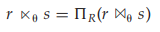

Practice Exercises## Practice Exercises

**11.1** Indices speed query processing, but it is usually a bad idea to create indices on every attribute, and every combinations of attributes, that is a potential search keys. Explain why.

**11.2** Is it possible in general to have two clustering indices on the same relation for different search keys? Explain your answer.

**11.3** Construct a B+-tree for the following set of key values:

(2, 3, 5, 7, 11, 17, 19, 23, 29, 31)

Assume that the tree is initially empty and values are added in ascending order. Construct B+-trees for the cases where the number of pointers that will fit in one node is as follows:

a. Four

b. Six

c. Eight

**11.4** For each B+-tree of Practice Exercise 11.3, show the form of the tree after each of the following series of operations:

a. Insert 9.

b. Insert 10.

c. Insert 8.

d. Delete 23.

e. Delete 19.

**11.5** Consider the modified redistribution scheme for B+-trees described on page 501. What is the expected height of the tree as a function of _n_?

**11.6** Suppose that we are using extendable hashing on a file that contains records with the following search-key values:

(2, 3, 5, 7, 11, 17, 19, 23, 29, 31)

Show the extendable hash structure for this file if the hash function is _h_ ( _x_ ) = _x_ mod 8 and buckets can hold three records.

**11.7** Show how the extendable hash structure of Practice Exercise 11.6 changes as the result of each of the following steps:

a. Delete 11.

b. Delete 31.  

c. Insert 1.

d. Insert 15.

**11.8** Give pseudocode for a B+-tree function findIterator(), which is like the function find(), except that it returns an iterator object, as described in Section 11.3.2. Also give pseudocode for the iterator class, including the variables in the iterator object, and the next() method.

**11.9** Give pseudocode for deletion of entries from an extendable hash structure, including details of when and how to coalesce buckets. Do not bother about reducing the size of the bucket address table.

**11.10** Suggest an efficient way to test if the bucket address table in extendable hashing can be reduced in size, by storing an extra count with the bucket address table. Give details of how the count should be maintained when buckets are split, coalesced, or deleted. (_Note_: Reducing the size of the bucket address table is an expensive operation, and subsequent inserts may cause the table to grow again. Therefore, it is best not to reduce the size as soon as it is possible to do so, but instead do it only if the number of index entries becomes small compared to the bucket-address-table size.)

**11.11** Consider the _instructor_ relation shown in Figure 11.1.

a. Construct a bitmap index on the attribute _salary_, dividing _salary_ values into 4 ranges: below 50000, 50000 to below 60000, 60000 to below 70000, and 70000 and above.

b. Consider a query that requests all instructors in the Finance depart- ment with salary of 80000 or more. Outline the steps in answering the query, and show the final and intermediate bitmaps constructed to answer the query.

**11.12** What would the occupancy of each leaf node of a B+-tree be, if index entries are inserted in sorted order? Explain why.

**11.13** Suppose you have a relation _r_ with _nr_ tuples on which a secondary B+-tree is to be constructed.

a. Give a formula for the cost of building the B+-tree index by inserting one record at a time. Assume each block will hold an average of _f_ entries, and that all levels of the tree above the leaf are in memory.

b. Assuming a random disk access takes 10 milliseconds, what is the cost of index construction on a relation with 10 million records?

c. Write pseudocode for bottom-up construction of a B+-tree, which was outlined in Section 11.4.4. You can assume that a function to efficiently sort a large file is available.

**11.14** Why might the leaf nodes of a B+-tree file organization lose sequentiality? 

a. Suggest how the file organization may be reorganized to restore sequentiality.

b. An alternative to reorganization is to allocate leaf pages in units of _n_ blocks, for some reasonably large _n_. When the first leaf of a B+- tree is allocated, only one block of an _n_\-block unit is used, and the remaining pages are free. If a page splits, and its _n_\-block unit has a free page, that space is used for the new page. If the _n_\-block unit is full, another _n_\-block unit is allocated, and the first _n/_2 leaf pages are placed in one _n_\-block unit, and the remaining in the second _n_\-block unit. For simplicity, assume that there are no delete operations. i. What is the worst case occupancy of allocated space, assuming no delete operations, after the first _n_\-block unit is full. ii. Is it possible that leaf nodes allocated to an _n_\-node block unit are not consecutive, that is, is it possible that two leaf nodes are allocated to one _n_\-node block, but another leaf node in between the two is allocated to a different _n_\-node block?

iii. Under the reasonable assumption that buffer space is sufficient to store a _n_\-page block, how many seeks would be required for a leaf-level scan of the B+-tree, in the worst case? Compare this number with the worst case if leaf pages are allocated a block at a time.

iv. The technique of redistributing values to siblings to improve space utilization is likely to be more efficient when used with the above allocation scheme for leaf blocks. Explain why.

## Practice Exercises

**12.1** Assume (for simplicity in this exercise) that only one tuple fits in a block and memory holds at most 3 blocks. Show the runs created on each pass of the sort-merge algorithm, when applied to sort the following tuples on the first attribute: (kangaroo, 17), (wallaby, 21), (emu, 1), (wombat, 13), (platypus, 3), (lion, 8), (warthog, 4), (zebra, 11), (meerkat, 6), (hyena, 9), (hornbill, 2), (baboon, 12).

**12.2** Consider the bank database of Figure 12.13, where the primary keys are underlined, and the following SQL query:

**select** _T_._branch name_ 
**from** _branch T_, _branch S_ **where** _T.assets > S.assets_ **and** _S.branch city_ \= “Brooklyn” 

Write an efficient relational-algebra expression that is equivalent to this query. Justify your choice.

**12.3** Let relations _r_ 1(_A, B, C_) and _r_ 2(_C, D, E_) have the following properties: _r_ 1 has 20,000 tuples, _r_ 2 has 45,000 tuples, 25 tuples of _r_ 1 fit on one block, and 30 tuples of _r_ 2 fit on one block. Estimate the number of block transfers and seeks required, using each of the following join strategies for _r_1 _ r_ 2:

a. Nested-loop join.

b. Block nested-loop join.

c. Merge join.

d. Hash join.

**12.4** The indexed nested-loop join algorithm described in Section 12.5.3 can be inefficient if the index is a secondary index, and there are multiple tuples with the same value for the join attributes. Why is it inefficient? Describe a way, using sorting, to reduce the cost of retrieving tuples of the inner relation. Under what conditions would this algorithm be more efficient than hybrid merge join?

**12.5** Let _r_ and _s_ be relations with no indices, and assume that the relations are not sorted. Assuming infinite memory, what is the lowest-cost way (in terms of I/O operations) to compute _r  s_? What is the amount of memory required for this algorithm?

**12.6** Consider the bank database of Figure 12.13, where the primary keys are underlined. Suppose that a B+-tree index on _branch city_ is available on relation _branch_, and that no other index is available. List different ways to handle the following selections that involve negation:

a. σ¬(_branch city<_“Brooklyn”)(_branch_)

b. σ¬(_branch city_\=“Brooklyn”)(_branch_)

c. σ¬(_branch city<_“Brooklyn” ∨ _assets<_ 5000)(_branch_)

**12.7** Write pseudocode for an iterator that implements indexed nested-loop join, where the outer relation is pipelined. Your pseudocode must define

_branch_(_branch name_, _branch city, assets_) 
_customer_ (_customer name_, _customer street, customer city_) 
_loan_ (_loan number_, _branch name, amount_) 
_borrower_ (_customer name_, _loan number_) 
_account_ (_account number_, _branch name, balance_) 
_depositor_ (_customer name_, _account number_)

**Figure 12.13** Banking database.  

the standard iterator functions _open_(), _next_(), and _close_(). Show what state information the iterator must maintain between calls.

**12.8** Design sort-based and hash-based algorithms for computing the relational division operation (see Practise Exercises of Chapter 6 for a definition of the division operation).

**12.9** What is the effect on the cost of merging runs if the number of buffer blocks per run is increased, while keeping overall memory available for buffering runs fixed?

## Practice Exercises

**13.1** Show that the following equivalences hold. Explain how you can apply them to improve the efficiency of certain queries:

**13.2** For each of the following pairs of expressions, give instances of relations that show the expressions are not equivalent.

a. _πA_(_R_ − _S_) and _πA_(_R_) − _πA_(_S_).

b. π_B<_4( _AGmax_ (_B_) **as** _B_(_R_)) and _AGmax_ (_B_) **as** _B_(π_B<_4(_R_)).  

c. In the preceding expressions, if both occurrences of _max_ were re- placed by _min_ would the expressions be equivalent?

d. (_R  S_) _T_ and _R_ (_S  T_) In other words, the natural left outer join is not associative. (Hint: Assume that the schemas of the three relations are _R_(_a , b_1)_, S_(_a , b_2), and _T_(_a , b_3), respectively.)

e. σθ(_E_1 _ E_2) and _E_1  σθ(_E_2), where  uses only attributes from _E_2.

**13.3** SQL allows relations with duplicates (Chapter 3).

a. Define versions of the basic relational-algebra operations , , ×, , −, ∪, and ∩ that work on relations with duplicates, in a way consistent with SQL.

b. Check which of the equivalence rules 1 through 7.b hold for the multiset version of the relational-algebra defined in part a.

**13.4** Consider the relations _r_1(_A, B, C_), _r_2(_C, D, E_), and _r_3(_E, F_ ), with primary keys _A_, _C_, and _E_, respectively. Assume that _r_1 has 1000 tuples, _r_2 has 1500 tuples, and _r_3 has 750 tuples. Estimate the size of _r_1 _ r_2 _ r_3, and give an efficient strategy for computing the join.

**13.5** Consider the relations _r_1(_A, B, C_), _r_2(_C, D, E_), and _r_3(_E, F_ ) of Practice Exercise 13.4. Assume that there are no primary keys, except the entire schema. Let _V_(_C, r_1) be 900, _V_(_C, r_2) be 1100, _V_(_E, r_2) be 50, and _V_(_E, r_3) be 100. Assume that _r_1 has 1000 tuples, _r_2 has 1500 tuples, and _r_3 has 750 tuples. Estimate the size of _r_1 _ r_2 _ r_3 and give an efficient strategy for computing the join.

**13.6** Suppose that a B+-tree index on _building_ is available on relation _department_, and that no other index is available. What would be the best way to handle the following selections that involve negation?

a. σ¬(_building <_“Watson”)(_department_)

b. σ¬(_building_ \=“Watson”)(_department_)

c. σ¬(_building <_“Watson” ∨ _budget <_50000)(_department_)

**13.7** Consider the query:

**select** \* 
**from** _r_ , _s_ 
**where** upper(_r.A_) = upper(_s.A_);

where “upper” is a function that returns its input argument with all low- ercase letters replaced by the corresponding uppercase letters.

a. Find out what plan is generated for this query on the database system you use.  

**Practice Exercises 619**

b. Some database systems would use a (block) nested-loop join for this query, which can be very inefficient. Briefly explain how hash-join or merge-join can be used for this query.

**13.8** Give conditions under which the following expressions are equivalent

where _agg_ denotes any aggregation operation. How can the above condi- tions be relaxed if _agg_ is one of **min** or **max**?

**13.9** Consider the issue of interesting orders in optimization. Suppose you are given a query that computes the natural join of a set of relations _S_. Given a subset _S_1 of _S_, what are the interesting orders of _S_1?

**13.10** Show that, with _n_ relations, there are (2(_n_ − 1))!_/_(_n_ − 1)! different join orders. _Hint:_ A **complete binary tree** is one where every internal node has exactly two children. Use the fact that the number of different complete binary trees with _n_ leaf nodes is:

If you wish, you can derive the formula for the number of complete binary trees with _n_ nodes from the formula for the number of binary trees with _n_ nodes. The number of binary trees with _n_ nodes is:

This number is known as the **Catalan number**, and its derivation can be found in any standard textbook on data structures or algorithms.

**13.11** Show that the lowest-cost join order can be computed in time _O_(3_n_). Assume that you can store and look up information about a set of relations (such as the optimal join order for the set, and the cost of that join order) in constant time. (If you find this exercise difficult, at least show the looser time bound of _O_(22_n_).)

**13.12** Show that, if only left-deep join trees are considered, as in the System R optimizer, the time taken to find the most efficient join order is around _n_2_n_. Assume that there is only one interesting sort order.

**13.13** Consider the bank database of Figure 13.9, where the primary keys are un- derlined. Construct the following SQL queries for this relational database.

a. Write a nested query on the relation _account_ to find, for each branch with name starting with B, all accounts with the maximum balance at the branch.  

_branch_(_branch name_, _branch city, assets_) 
_customer_ (_customer name_, _customer street, customer city_) 
_loan_ (_loan number_, _branch name, amount_) 
_borrower_ (_customer name_, _loan number_) 
_account_ (_account number_, 
_branch name, balance_) _depositor_ (_customer name_, _account number_)

**Figure 13.9** Banking database for Exercise 13.13.

b. Rewrite the preceding query, without using a nested subquery; in other words, decorrelate the query.

c. Give a procedure (similar to that described in Section 13.4.4) for decorrelating such queries.

**13.14** The set version of the semijoin operator  is defined as follows:

where _R_ is the set of attributes in the schema of _r_ . The multiset version of the semijoin operation returns the same set of tuples, but each tuple has exactly as many copies as it had in _r_ . Consider the nested query we saw in Section 13.4.4 which finds the names of all instructors who taught a course in 2007. Write the query in relational algebra using the multiset semjoin operation, ensuring that the number of duplicates of each name is the same as in the SQL query. (The semijoin operation is widely used for decorrelation of nested queries.)

**Exercises**

**13.15** Suppose that a B+-tree index on (_dept name_, _building_) is available on re- lation _department_. What would be the best way to handle the following selection?

σ(_building <_ “Watson”) ∧ (_budget <_ 55000) ∧ (_dept name_ \= “Music”)(_department_)

**13.16** Show how to derive the following equivalences by a sequence of trans- formations using the equivalence rules in Section 13.2.1.

**Exercises 621**

**13.17** Consider the two expressions σθ(_E_1 _ E_2) and σθ(_E_1 _ E_2).

a. Show using an example that the two expressions are not equivalent in general.

b. Give a simple condition on the predicate , which if satisfied will ensure that the two expressions are equivalent.

**13.18** A set of equivalence rules is said to be _complete_ if, whenever two expres- sions are equivalent, one can be derived from the other by a sequence of uses of the equivalence rules. Is the set of equivalence rules that we considered in Section 13.2.1 complete? Hint: Consider the equivalence σ3=5(_r_ ) = { }.

**13.19** Explain how to use a histogram to estimate the size of a selection of the form σ_A_≤_v_(_r_ ).

**13.20** Suppose two relations _r_ and _s_ have histograms on attributes _r.A_ and _s.A_, respectively, but with different ranges. Suggest how to use the histograms to estimate the size of _r  s_. Hint: Split the ranges of each histogram further.

**13.21** Consider the query

**select** _A_, _B_ 
**from** _r_ 
**where** _r.B <_ **some**
(**select** _B_
**from** _s_ 
**where** _s.A_ \= _r.A_)

Show how to decorrelate the above query using the multiset version of the semijoin operation, defined in Exercise 13.14.

**13.22** Describe how to incrementally maintain the results of the following oper- ations, on both insertions and deletions:

a. Union and set difference.

b. Left outer join.

**13.23** Give an example of an expression defining a materialized view and two situations (sets of statistics for the input relations and the differentials) such that incremental view maintenance is better than recomputation in one situation, and recomputation is better in the other situation.

**13.24** Suppose you want to get answers to _r  s_ sorted on an attribute of _r_ , and want only the top _K_ answers for some relatively small _K_ . Give a good way of evaluating the query:

a. When the join is on a foreign key of _r_ referencing _s_, where the foreign key attribute is declared to be not null.

b. When the join is not on a foreign key.  

**13.25** Consider a relation _r_ (_A, B, C_), with an index on attribute _A_. Give an example of a query that can be answered by using the index only, without looking at the tuples in the relation. (Query plans that use only the index, without accessing the actual relation, are called _index-only_ plans.)

**13.26** Suppose you have an update query _U_. Give a simple sufficient condition on _U_ that will ensure that the Halloween problem cannot occur, regardless of the execution plan chosen, or the indices that exist.

