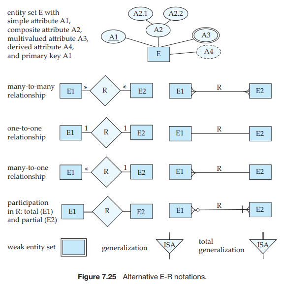

# Alternative Notations for Modeling Data

A diagrammatic representation of the data model of an application is a very important part of designing a database schema. Creation of a database schema  requires not only data modeling experts, but also domain experts who know the requirements of the application but may not be familiar with data modeling. An intuitive diagrammatic representation is particularly important since it eases communication of information between these groups of experts.

A number of alternative notations for modeling data have been proposed, of which E-R diagrams and UML class diagrams are the most widely used. There is no universal standard for E-R diagram notation, and different books and E-R diagram software use different notations. We have chosen a particular notation

in this sixth edition of this book which actually differs from the notation we used in earlier editions, for reasons that we explain later in this section.

In the rest of this section, we study some of the alternative E-R diagram notations, as well as the UML class diagram notation. To aid in comparison of our notation with these alternatives, Figure 7.24 summarizes the set of symbols we have used in our E-R diagram notation.

## Alternative E-R Notations

Figure 7.25 indicates some of the alternative E-R notations that are widely used. One alternative representation of attributes of entities is to show them in ovals connected to the box representing the entity; primary key attributes are indicated by underlining them. The above notation is shown at the top of the figure. Re- lationship attributes can be similarly represented, by connecting the ovals to the diamond representing the relationship.

Cardinality constraints on relationships can be indicated in several different ways, as shown in Figure 7.25. In one alternative, shown on the left side of the figure, labels ∗ and 1 on the edges out of the relationship are used for depicting many-to-many, one-to-one, and many-to-one relationships. The case of one-to- many is symmetric to many-to-one, and is not shown.

In another alternative notation shown on the right side of the figure, relation- ship sets are represented by lines between entity sets, without diamonds; only binary relationships can be modeled thus. Cardinality constraints in such a no- tation are shown by “crow’s-foot” notation, as in the figure. In a relationship _R_ between _E_1 and _E_2, crow’s feet on both sides indicates a many-to-many relation- ship, while crow’s feet on just the _E_1 side indicates a many-to-one relationship from _E_1 to _E_2\. Total participation is specified in this notation by a vertical bar. Note however, that in a relationship _R_ between entities _E_1 and _E_2, if the partici- pation of _E_1 in _R_ is total, the vertical bar is placed on the opposite side, adjacent to entity _E_2\. Similarly, partial participation is indicated by using a circle, again on the opposite side.

The bottom part of Figure 7.25 shows an alternative representation of gener- alization, using triangles instead of hollow arrow-heads.

In prior editions of this text up to the fifth edition, we used ovals to represent attributes, with triangles representing generalization, as shown in Figure 7.25. The notation using ovals for attributes and diamonds for relationships is close to the original form of E-R diagrams used by Chen in his paper that introduced the notion of E-R modeling. That notation is now referred to as Chen’s notation.

The U.S. National Institute for Standards and Technology defined a standard called IDEF1X in 1993. IDEF1X uses the crow’s-foot notation, with vertical bars on the relationship edge to denote total participation and hollow circles to denote partial participation, and includes other notations that we have not shown.

With the growth in the use of Unified Markup Language (UML), described later in Section 7.9.2, we have chosen to update our E-R notation to make it closer to the form of UML class diagrams; the connections will become clear in Section 7.9.2. In comparison with our previous notation, our new notation provides a more compact representation of attributes, and is also closer to the notation supported by many E-R modeling tools, in addition to being closer to the UML class diagram notation.

There are a variety of tools for constructing E-R diagrams, each of which has its own notational variants. Some of the tools even provide a choice between several E-R notation variants. See the references in the bibliographic notes for more information.

One key difference between entity sets in an E-R diagram and the relation schemas created from such entities is that attributes in the relational schema corresponding to E-R relationships, such as the _dept name_ attribute of _instructor_, are not shown in the entity set in the E-R diagram. Some data modeling tools allow users to choose between two views of the same entity, one an entity view without such attributes, and other a relational view with such attributes.  

## The Unified Modeling Language UML

Entity-relationship diagrams help model the data representation component of a software system. Data representation, however, forms only one part of an overall system design. Other components include models of user interactions with the system, specification of functional modules of the system and their interaction, etc. The **Unified Modeling Language** (UML) is a standard developed under the auspices of the Object Management Group (OMG) for creating specifications of various components of a software system. Some of the parts of UML are:

• **Class diagram**. A class diagram is similar to an E-R diagram. Later in this section we illustrate a few features of class diagrams and how they relate to E-R diagrams.

• **Use case diagram**. Use case diagrams show the interaction between users and the system, in particular the steps of tasks that users perform (such as withdrawing money or registering for a course).

• **Activity diagram**. Activity diagrams depict the flow of tasks between various components of a system.

• **Implementation diagram**. Implementation diagrams show the system com- ponents and their interconnections, both at the software component level and the hardware component level.

We do not attempt to provide detailed coverage of the different parts of UML here. See the bibliographic notes for references on UML. Instead we illustrate some features of that part of UML that relates to data modeling through examples.

Figure 7.26 shows several E-R diagram constructs and their equivalent UML class diagram constructs. We describe these constructs below. UML actually mod- els objects, whereas E-R models entities. Objects are like entities, and have at- tributes, but additionally provide a set of functions (called methods) that can be invoked to compute values on the basis of attributes of the objects, or to update the object itself. Class diagrams can depict methods in addition to attributes. We cover objects in Chapter 22. UML does not support composite or multivalued attributes, and derived attributes are equivalent to methods that take no param- eters. Since classes support encapsulation, UML allows attributes and methods to be prefixed with a “+”, “-”, or “#”, which denote respectively public, private and protected access. Private attributes can only be used in methods of the class, while protected attributes can be used only in methods of the class and its subclasses; these should be familiar to anyone who knows Java, C++ or C#.

In UML terminology, relationship sets are referred to as **associations**; we shall refer to them as relationship sets for consistency with E-R terminology. We repre- sent binary relationship sets in UML by just drawing a line connecting the entity sets. We write the relationship set name adjacent to the line. We may also specify the role played by an entity set in a relationship set by writing the role name on the line, adjacent to the entity set. Alternatively, we may write the relationship set name in a box, along with attributes of the relationship set, and connect the  

box by a dotted line to the line depicting the relationship set. This box can then be treated as an entity set, in the same way as an aggregation in E-R diagrams, and can participate in relationships with other entity sets.

Since UML version 1.3, UML supports nonbinary relationships, using the same diamond notation used in E-R diagrams. Nonbinary relationships could not be directly represented in earlier versions of UML—they had to be converted to binary relationships by the technique we have seen earlier in Section 7.7.3. UML allows the diamond notation to be used even for binary relationships, but most designers use the line notation.

Cardinality constraints are specified in UML in the same way as in E-R dia- grams, in the form _l..h_, where _l_ denotes the minimum and _h_ the maximum number of relationships an entity can participate in. However, you should be aware that the positioning of the constraints is exactly the reverse of the positioning of con- straints in E-R diagrams, as shown in Figure 7.26. The constraint 0_.._∗ on the _E_ 2  

side and 0_.._1 on the _E_1 side means that each _E_2 entity can participate in at most one relationship, whereas each _E_1 entity can participate in many relationships; in other words, the relationship is many-to-one from _E_2 to _E_1.

Single values such as 1 or ∗ may be written on edges; the single value 1 on an edge is treated as equivalent to 1_.._1, while ∗ is equivalent to 0_.._∗. UML supports generalization; the notation is basically the same as in our E-R notation, including the representation of disjoint and overlapping generalizations.

UML class diagrams include several other notations that do not correspond to the E-R notations we have seen. For example, a line between two entity sets with a small diamond at one end specifies that the entity on the diamond side contains the other entity (containment is called “aggregation” in UML terminology; do not confuse this use of aggregation with the sense in which it is used in the E-R model). For example, a vehicle entity may contain an engine entity.

UML class diagrams also provide notations to represent object-oriented lan- guage features such as interfaces. See the references in the bibliographic notes for more information on UML class diagrams.
