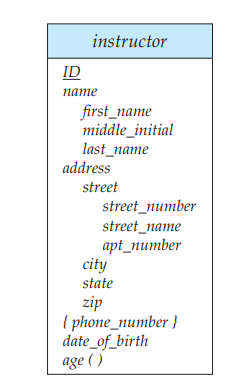
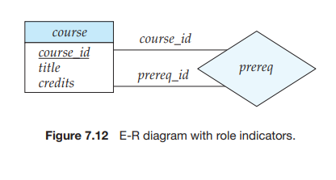

# Entity-Relationship Diagrams

As we saw briefly in Section 1.3.3, an **E-R diagram** can express the overall logical structure of a database graphically. E-R diagrams are simple and clear—qualities that may well account in large part for the widespread use of the E-R model.

## 7.5.1 Basic Structure

An E-R diagram consists of the following major components:  

• **Rectangles divided into two parts** represent entity sets. The first part, which in this textbook is shaded blue, contains the name of the entity set. The second part contains the names of all the attributes of the entity set.

• **Diamonds** represent relationship sets.

• **Undivided rectangles** represent the attributes of a relationship set. Attributes that are part of the primary key are underlined.

• **Lines** link entity sets to relationship sets.

• **Dashed lines** link attributes of a relationship set to the relationship set.

• **Double lines** indicate total participation of an entity in a relationship set.

• **Double diamonds** represent identifying relationship sets linked to weak entity sets (we discuss identifying relationship sets and weak entity sets later, in Section 7.5.6).

Consider the E-R diagram in Figure 7.7, which consists of two entity sets, _in- structor_ and _student_ related through a binary relationship set _advisor_. The attributes associated with _instructor_ are _ID_, _name_, and _salary_. The attributes associated with _student_ are _ID_, _name_, and _tot cred_. In Figure 7.7, attributes of an entity set that are members of the primary key are underlined.

If a relationship set has some attributes associated with it, then we enclose the attributes in a rectangle and link the rectangle with a dashed line to the diamond representing that relationship set. For example, in Figure 7.8, we have the _date_ descriptive attribute attached to the relationship set _advisor_ to specify the date on which an instructor became the advisor.

### Mapping Cardinality

The relationship set _advisor_, between the _instructor_ and _student_ entity sets may be one-to-one, one-to-many, many-to-one, or many-to-many. To distinguish among these types, we draw either a directed line (→) or an undirected line (—) between the relationship set and the entity set in question, as follows:

• **One-to-one:** We draw a directed line from the relationship set _advisor_ to both entity sets _instructor_ and _student_ (see Figure 7.9a). This indicates that an instructor may advise at most one student, and a student may have at most one advisor.

• **One-to-many:** We draw a directed line from the relationship set _advisor_ to the entity set _instructor_ and an undirected line to the entity set _student_ (see Figure 7.9b). This indicates that an instructor may advise many students, but a student may have at most one advisor.

• **Many-to-one:** We draw an undirected line from the relationship set _advisor_ to the entity set _instructor_ and a directed line to the entity set _student_. This indicates that an instructor may advise at most one student, but a student may have many advisors.

• **Many-to-many:** We draw an undirected line from the relationship set _advisor_ to both entity sets _instructor_ and _student_ (see Figure 7.9c). This indicates that an instructor may advise many students, and a student may have many advisors.

E-R diagrams also provide a way to indicate more complex constraints on the number of times each entity participates in relationships in a relationship set. A line may have an associated minimum and maximum cardinality, shown in the form _l..h_, where _l_ is the minimum and _h_ the maximum cardinality. A minimum value of 1 indicates total participation of the entity set in the relationship set; that is, each entity in the entity set occurs in at least one relationship in that relationship set. A maximum value of 1 indicates that the entity participates in at most one relationship, while a maximum value ∗ indicates no limit.

For example, consider Figure 7.10. The line between _advisor_ and _student_ has a cardinality constraint of 1_.._1, meaning the minimum and the maximum cardinal- ity are both 1. That is, each student must have exactly one advisor. The limit 0_.._∗ on the line between _advisor_ and _instructor_ indicates that an instructor can have zero or more students. Thus, the relationship _advisor_ is one-to-many from _instruc- tor_ to _student_, and further the participation of _student_ in _advisor_ is total, implying that a student must have an advisor.

It is easy to misinterpret the 0_.._∗ on the left edge and think that the relationship _advisor_ is many-to-one from _instructor_ to _student_—this is exactly the reverse of the correct interpretation.

If both edges have a maximum value of 1, the relationship is one-to-one. If we had specified a cardinality limit of 1_.._∗ on the left edge, we would be saying that each instructor must advise at least one student.

The E-R diagram in Figure 7.10 could alternatively have been drawn with a double line from _student_ to _advisor_, and an arrow on the line from _advisor_ to _instructor_, in place of the cardinality constraints shown. This alternative diagram would enforce exactly the same constraints as the constraints shown in the figure.

### Complex Attributes

Figure 7.11 shows how composite attributes can be represented in the E-R notation. Here, a composite attribute _name_, with component attributes _first name_, _middle initial_, and _last name_ replaces the simple attribute _name_ of _instructor_. As another

example, suppose we were to add an address to the _instructor_ entity-set. The address can be defined as the composite attribute _address_ with the attributes

_street_, _city_, _state_, and _zip code_. The attribute _street_ is itself a composite attribute whose component attributes are _street number_, _street name_, and _apartment number_.

Figure 7.11 also illustrates a multivalued attribute _phone number_, denoted by “_{phone number}_”, and a derived attribute _age_, depicted by a “_age_ ( )”.

### Roles

We indicate roles in E-R diagrams by labeling the lines that connect diamonds to rectangles. Figure 7.12 shows the role indicators _course id_ and _prereq id_ between the _course_ entity set and the _prereq_ relationship set.

### Nonbinary Relationship Sets

Nonbinary relationship sets can be specified easily in an E-R diagram. Figure 7.13 consists of the three entity sets _instructor_, _student_, and _project_, related through the relationship set _proj guide_.

We can specify some types of many-to-one relationships in the case of non- binary relationship sets. Suppose a _student_ can have at most one instructor as a guide on a project. This constraint can be specified by an arrow pointing to _instructor_ on the edge from _proj guide_.

We permit at most one arrow out of a relationship set, since an E-R diagram with two or more arrows out of a nonbinary relationship set can be interpreted in two ways. Suppose there is a relationship set _R_ between entity sets A1, A2, . . . , An, and the only arrows are on the edges to entity sets Ai+1, Ai+2, . . . , An. Then, the two possible interpretations are:

**1.** A particular combination of entities from A~1~, A~2~, . . . , A~i~ can be associated with at most one combination of entities from A~i+1~, A~i+2~, . . . , An. Thus, the primary key for the relationship R can be constructed by the union of the primary keys of A~1~, A~2~, . . . , A~i~ .

**2.** For each entity set _Ak_ , _i < k_ ≤ _n_, each combination of the entities from the other entity sets can be associated with at most one entity from _Ak_ . Each set {A~1~, A~2~, . . . , A~k−1~, A~k+1~, . . . , An}, for _i < k_ ≤ _n_, then forms a candidate key.

Each of these interpretations has been used in different books and systems. To avoid confusion, we permit only one arrow out of a relationship set, in which case the two interpretations are equivalent. In Chapter 8 (Section 8.4), we study _functional dependencies_, which allow either of these interpretations to be specified in an unambiguous manner.

### Weak Entity Sets

Consider a _section_ entity, which is uniquely identified by a course identifier, semester, year, and section identifier. Clearly, section entities are related to course entities. Suppose we create a relationship set _sec course_ between entity sets _section_ and _course_.

Now, observe that the information in _sec course_ is redundant, since _section_ already has an attribute _course id_, which identifies the course with which the section is related. One option to deal with this redundancy is to get rid of the relationship _sec course_; however, by doing so the relationship between _section_ and _course_ becomes implicit in an attribute, which is not desirable.

An alternative way to deal with this redundancy is to not store the attribute _course id_ in the _section_ entity and to only store the remaining attributes _sec id_, _year_, and _semester_.6 However, the entity set _section_ then does not have enough attributes to identify a particular _section_ entity uniquely; although each _section_ entity is distinct, sections for different courses may share the same _sec id_, _year_, and _semester_. To deal with this problem, we treat the relationship _sec course_ as a special relationship that provides extra information, in this case the _course id_, required to identify _section_ entities uniquely.

The notion of _weak entity set_ formalizes the above intuition. An entity set that does not have sufficient attributes to form a primary key is termed a **weak entity set**. An entity set that has a primary key is termed a **strong entity set**.

For a weak entity set to be meaningful, it must be associated with another entity set, called the **identifying** or **owner entity set**. Every weak entity must be associated with an identifying entity; that is, the weak entity set is said to be **existence dependent** on the identifying entity set. The identifying entity set is said to **own** the weak entity set that it identifies. The relationship associating the weak entity set with the identifying entity set is called the **identifying relationship**.

The identifying relationship is many-to-one from the weak entity set to the identifying entity set, and the participation of the weak entity set in the rela- tionship is total. The identifying relationship set should not have any descriptive attributes, since any such attributes can instead be associated with the weak entity set.

In our example, the identifying entity set for _section_ is _course_, and the relation- ship _sec course_, which associates _section_ entities with their corresponding _course_ entities, is the identifying relationship.

Although a weak entity set does not have a primary key, we nevertheless need a means of distinguishing among all those entities in the weak entity set that depend on one particular strong entity. The **discriminator** of a weak entity set is a set of attributes that allows this distinction to be made. For example, the discriminator of the weak entity set _section_ consists of the attributes _sec id_, _year_, and _semester_, since, for each course, this set of attributes uniquely identifies one single section for that course. The discriminator of a weak entity set is also called the _partial key_ of the entity set.

The primary key of a weak entity set is formed by the primary key of the identifying entity set, plus the weak entity set’s discriminator. In the case of the entity set _section_, its primary key is _{course id_, _sec id_, _year_, _semester}_, where _course id_ is the primary key of the identifying entity set, namely _course_, and _{sec id_, _year_,

_semester}_ distinguishes _section_ entities for the same course. Note that we could have chosen to make _sec id_ globally unique across all

courses offered in the university, in which case the _section_ entity set would have

had a primary key. However, conceptually, a _section_ is still dependent on a _course_ for its existence, which is made explicit by making it a weak entity set.

In E-R diagrams, a weak entity set is depicted via a rectangle, like a strong entity set, but there are two main differences:

• The discriminator of a weak entity is underlined with a dashed, rather than a solid, line.

• The relationship set connecting the weak entity set to the identifying strong entity set is depicted by a double diamond.

In Figure 7.14, the weak entity set _section_ depends on the strong entity set _course_ via the relationship set _sec course_.

The figure also illustrates the use of double lines to indicate _total participation_; the participation of the (weak) entity set _section_ in the relationship _sec course_ is total, meaning that every section must be related via _sec course_ to some course. Finally, the arrow from _sec course_ to _course_ indicates that each section is related to a single course.

A weak entity set can participate in relationships other than the identifying relationship. For instance, the _section_ entity could participate in a relationship with the _time slot_ entity set, identifying the time when a particular class section meets. A weak entity set may participate as owner in an identifying relationship with another weak entity set. It is also possible to have a weak entity set with more than one identifying entity set. A particular weak entity would then be identified by a combination of entities, one from each identifying entity set. The primary key of the weak entity set would consist of the union of the primary keys of the identifying entity sets, plus the discriminator of the weak entity set.

In some cases, the database designer may choose to express a weak entity set as a multivalued composite attribute of the owner entity set. In our example, this alternative would require that the entity set _course_ have a multivalued, composite attribute _section_. A weak entity set may be more appropriately modeled as an attribute if it participates in only the identifying relationship, and if it has few attributes. Conversely, a weak entity set representation more aptly models a situation where the set participates in relationships other than the identifying relationship, and where the weak entity set has several attributes. It is clear that _section_ violates the requirements for being modeled as a multivalued composite attribute, and is modeled more aptly as a weak entity set.  

### E-R diagram for the University Enterprise

In Figure 7.15, we show an E-R diagram that corresponds to the university enter- prise that we have been using thus far in the text. This E-R diagram is equivalent to the textual description of the university E-R model that we saw in Section 7.4, but with several additional constraints, and _section_ now being a weak entity.

In our university database, we have a constraint that each instructor must have exactly one associated department. As a result, there is a double line in Figure 7.15 between _instructor_ and _inst dept_, indicating total participation of _instructor_ in _inst dept_; that is, each instructor must be associated with a department. Further, there

is an arrow from _inst dept_ to _department_, indicating that each instructor can have at most one associated department.

Similarly, entity sets _course_ and _student_ have double lines to relationship sets _course dept_ and _stud dept_ respectively, as also entity set _section_ to relationship set _sec time slot_. The first two relationships, in turn, have an arrow pointing to the other relationship, _department_, while the third relationship has an arrow pointing to _time slot_.

Further, Figure 7.15 shows that the relationship set _takes_ has a descriptive attribute _grade_, and that each student has at most one advisor. The figure also shows that _section_ is now a weak entity set, with attributes _sec id_, _semester_, and _year_ forming the discriminator; _sec course_ is the identifying relationship set relating weak entity set _section_ to the strong entity set _course_.

In Section 7.6, we shall show how this E-R diagram can be used to derive the various relation schemas we use.

