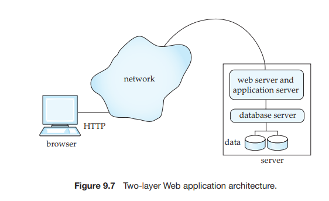

# Web Fundamentals

In this section, we review some of the fundamental technology behind the World Wide Web, for readers who are not familiar with the technology underlying the Web.

## Uniform Resource Locators

A **uniform resource locator** (**URL**) is a globally unique name for each document that can be accessed on the Web. An example of a URL is:

http://www.acm.org/sigmod

The first part of the URL indicates how the document is to be accessed: “http” indicates that the document is to be accessed by the **HyperText Transfer Protocol**  

**378 Chapter 9 Application Design and Development**
```
<html>
<body>
<table border>
<tr> <th>ID</th> <th>Name</th> <th>Department</th> </tr>
<tr> <td>00128</td> <td>Zhang</td> <td>Comp. Sci.</td> </tr>
<tr> <td>12345</td> <td>Shankar</td> <td>Comp. Sci.</td> </tr>
<tr> <td>19991</td> <td>Brandt</td> <td>History</td> </tr>
</table>
</body>
</html>
```


**Figure 9.2** Tabular data in HTML format.

(HTTP), which is a protocol for transferring HTML documents. The second part gives the name of a machine that has a Web server. The rest of the URL is the path name of the file on the machine, or other unique identifier of a document within the machine.

A URL can contain the identifier of a program located on the Web server machine, as well as arguments to be given to the program. An example of such a URL is

http://www.google.com/search?q=silberschatz

which says that the program search on the server www.google.com should be executed with the argument q=silberschatz. On receiving a request for such a URL, the Web server executes the program, using the given arguments. The program returns an HTML document to the Web server, which sends it back to the front end.

## HyperText Markup Language

Figure 9.2 is an example of a table represented in the HTMLformat, while Figure 9.3 shows the displayed image generated by a browser from the HTML representation of the table. The HTML source shows a few of the HTML tags. Every HTML page should be enclosed in an html tag, while the body of the page is enclosed in a body tag. A table is specified by a table tag, which contains rows specified by a tr tag. The header row of the table has table cells specified by a th tag, while regular


```
<html>
<body>
<form action="PersonQuery" method=get>
Search for:
<select name="persontype">
<option value="student" selected>Student </option>
<option value="instructor"> Instructor </option>
</select> <br>
Name: <input type=text size=20 name="name">
<input type=submit value="submit">
</form>
</body>
</html>
```
**Figure 9.4** An HTML form.

rows have table cells specified by a td tag. We do not go into more details about the tags here; see the bibliographic notes for references containing more detailed descriptions of HTML.

Figure 9.4 shows how to specify an HTML form that allows users to select the person type (student or instructor) from a menu and to input a number in a text box. Figure 9.5 shows how the above form is displayed in a Web browser. Two methods of accepting input are illustrated in the form, but HTML also supports several other input methods. The action attribute of the form tag specifies that when the form is submitted (by clicking on the submit button), the form data should be sent to the URL PersonQuery (the URL is relative to that of the page). The Web server is configured such that when this URL is accessed, a corresponding application program is invoked, with the user-provided values for the arguments persontype and name (specified in the select and input fields). The application program generates an HTML document, which is then sent back and displayed to the user; we shall see how to construct such programs later in this chapter.

HTTP defines two ways in which values entered by a user at the browser can be sent to the Web server. The get method encodes the values as part of the URL. For example, if the Google search page used a form with an input parameter named q with the get method, and the user typed in the string “silberschatz” and submitted the form, the browser would request the following URL from the Web server:

http://www.google.com/search?q=silberschatz


The post method would instead send a request for the URL http://www.google.com, and send the parameter values as part of the HTTP protocol exchange between the Web server and the browser. The form in Figure 9.4 specifies that the form uses the get method.

Although HTML code can be created using a plain text editor, there are a number of editors that permit direct creation of HTML text by using a graphical interface. Such editors allow constructs such as forms, menus, and tables to be inserted into the HTML document from a menu of choices, instead of manually typing in the code to generate the constructs.

HTML supports _stylesheets_, which can alter the default definitions of how an HTML formatting construct is displayed, as well as other display attributes such as background color of the page. The _cascading stylesheet_ (CSS) standard allows the same stylesheet to be used for multiple HTML documents, giving a distinctive but uniform look to all the pages on a Web site.

## Web Servers and Sessions

A **Web server** is a program running on the server machine, which accepts requests from a Web browser and sends back results in the form of HTML documents. The browser and Web server communicate via HTTP. Web servers provide powerful features, beyond the simple transfer of documents. The most important feature is the ability to execute programs, with arguments supplied by the user, and to deliver the results back as an HTML document.

As a result, a Web server can act as an intermediary to provide access to a variety of information services. A new service can be created by creating and installing an application program that provides the service. The **common gate- way interface (CGI)** standard defines how the Web server communicates with application programs. The application program typically communicates with a database server, through ODBC, JDBC, or other protocols, in order to get or store data.


**Figure 9.6** Three-layer Web application architecture



**Figure 9.7** Two-layer Web application architecture.

Figure 9.6 shows a Web application built using a three-layer architecture, with a Web server, an application server, and a database server. Using multiple levels of servers increases system overhead; the CGI interface starts a new process to service each request, which results in even greater overhead.

Most Web applications today therefore use a two-layer Web application ar- chitecture, where the application program runs within the Web server, as in Figure 9.7. We study systems based on the two-layer architecture in more detail in subsequent sections.

There is no continuous connection between the client and the Web server; when a Web server receives a request, a connection is temporarily created to send the request and receive the response from the Web server. But the connection may then be closed, and the next request could come over a new connection. In contrast, when a user logs on to a computer, or connects to a database using ODBC or JDBC, a session is created, and session information is retained at the server and the client until the session is terminated—information such as the user-identifier of the user and session options that the user has set. One important reason that HTTP is **connectionless** is that most computers have limits on the number of simultaneous connections they can accommodate, and if a large number of sites on the Web open connections to a single server, this limit would be exceeded, denying service to further users. With a connectionless protocol, the connection can be broken as soon as a request is satisfied, leaving connections available for other requests.1

Most Web applications, however, need session information to allow mean- ingful user interaction. For instance, applications typically restrict access to in- formation, and therefore need to authenticate users. Authentication should be done once per session, and further interactions in the session should not require reauthentication.

To implement sessions in spite of connections getting closed, extra informa- tion has to be stored at the client and returned with each request in a session; the server uses this information to identify that a request is part of a user session. Extra information about the session also has to be maintained at the server.

This extra information is usually maintained in the form of a **cookie** at the client; a cookie is simply a small piece of text containing identifying information and with an associated name. For example, google.com may set a cookie with the name prefs, which encodes preferences set by the user such as the preferred language and the number of answers displayed per page. On each search request, google.com can retrieve the cookie named prefs from the user’s browser, and display results according to the specified preferences. A domain (Web site) is permitted to retrieve only cookies that it has set, not cookies set by other domains, and cookie names can be reused across domains.

For the purpose of tracking a user session, an application may generate a session identifier (usually a random number not currently in use as a session identifier), and send a cookie named (for instance) sessionid containing the session identifier. The session identifier is also stored locally at the server. When a request comes in, the application server requests the cookie named sessionid from the client. If the client does not have the cookie stored, or returns a value that is not currently recorded as a valid session identifier at the server, the application concludes that the request is not part of a current session. If the cookie value matches a stored session identifier, the request is identified as part of an ongoing session.

If an application needs to identify users securely, it can set the cookie only after authenticating the user; for example a user may be authenticated only when a valid user name and password are submitted.2

For applications that do not require high security, such as publicly available news sites, cookies can be stored permanently at the browser and at the server; they identify the user on subsequent visits to the same site, without any identifica- tion information being typed in. For applications that require higher security, the server may invalidate (drop) the session after a time-out period, or when the user logs out. (Typically a user logs out by clicking on a logout button, which submits a logout form, whose action is to invalidate the current session.) Invalidating a session merely consists of dropping the session identifier from the list of active sessions at the application server.

