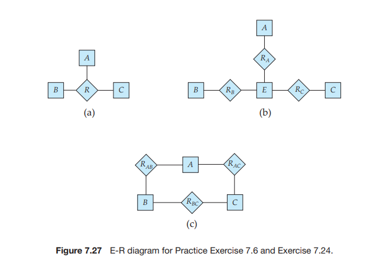

Practice Exercises## Practice Exercises

**7.1** Construct an E-R diagram for a car insurance company whose customers own one or more cars each. Each car has associated with it zero to any number of recorded accidents. Each insurance policy covers one or more cars, and has one or more premium payments associated with it. Each payment is for a particular period of time, and has an associated due date, and the date when the payment was received.

**7.2** Consider a database used to record the marks that students get in different exams of different course offerings (sections).  

a. Construct an E-R diagram that models exams as entities, and uses a ternary relationship, for the database.

b. Construct an alternative E-R diagram that uses only a binary relation- ship between _student_ and _section_. Make sure that only one relationship exists between a particular _student_ and _section_ pair, yet you can rep- resent the marks that a student gets in different exams.

**7.3** Design an E-R diagram for keeping track of the exploits of your favorite sports team. You should store the matches played, the scores in each match, the players in each match, and individual player statistics for each match. Summary statistics should be modeled as derived attributes.

**7.4** Consider an E-R diagram in which the same entity set appears several times, with its attributes repeated in more than one occurrence. Why is allowing this redundancy a bad practice that one should avoid?

**7.5** An E-R diagram can be viewed as a graph. What do the following mean in terms of the structure of an enterprise schema?

a. The graph is disconnected.

b. The graph has a cycle.

**7.6** Consider the representation of a ternary relationship using binary relation- ships as described in Section 7.7.3 and illustrated in Figure 7.27b (attributes not shown).



a. Show a simple instance of _E, A, B, C_ , _RA, RB_ , and _RC_ that cannot correspond to any instance of _A, B, C_ , and _R_.

b. Modify the E-R diagram of Figure 7.27b to introduce constraints that will guarantee that any instance of _E, A, B, C_ , _RA, RB_ , and _RC_ that satisfies the constraints will correspond to an instance of _A, B, C_ , and _R_.

c. Modify the translation above to handle total participation constraints on the ternary relationship.

d. The above representation requires that we create a primary-key at- tribute for _E_ . Show how to treat _E_ as a weak entity set so that a primary-key attribute is not required.

**7.7** A weak entity set can always be made into a strong entity set by adding to its attributes the primary-key attributes of its identifying entity set. Outline what sort of redundancy will result if we do so.

**7.8** Consider a relation such as _sec course_, generated from a many-to-one rela- tionship _sec course_. Do the primary and foreign key constraints created on the relation enforce the many-to-one cardinality constraint? Explain why.

**7.9** Suppose the _advisor_ relationship were one-to-one. What extra constraints are required on the relation _advisor_to ensure that the one-to-one cardinality constraint is enforced?

**7.10** Consider a many-to-one relationship _R_ between entity sets _A_ and _B_. Sup- pose the relation created from _R_ is combined with the relation created from _A_. In SQL, attributes participating in a foreign key constraint can be null. Explain how a constraint on total participation of _A_ in _R_ can be enforced using **not null** constraints in SQL.

**7.11** In SQL, foreign key constraints can only reference the primary key attributes of the referenced relation, or other attributes declared to be a super key us- ing the **unique** constraint. As a result, total participation constraints on a many-to-many relationship (or on the “one” side of a one-to-many rela- tionship) cannot be enforced on the relations created from the relationship, using primary key, foreign key and not null constraints on the relations.

a. Explain why.

b. Explain how to enforce total participation constraints using com- plex check constraints or assertions (see Section 4.4.7). (Unfortunately, these features are not supported on any widely used database cur- rently.)

**7.12** Figure 7.28 shows a lattice structure of generalization and specialization (attributes not shown). For entity sets _A_, _B_, and _C_ , explain how attributes  


are inherited from the higher-level entity sets _X_ and _Y_. Discuss how to handle a case where an attribute of _X_ has the same name as some attribute of _Y_.

**7.13 Temporal changes**: An E-R diagram usually models the state of an enter- prise at a point in time. Suppose we wish to track _temporal changes_, that is, changes to data over time. For example, Zhang may have been a student between 1 September 2005 31 May 2009, while Shankar may have had in- structor Einstein as advisor from 31 May 2008 to 5 December 2008, and again from 1 June 2009 to 5 January 2010. Similarly, attribute values of an entity or relationship, such as _title_ and _credits_ of _course_, _salary_, or even _name_ of _instructor_, and _tot cred_ of _student_, can change over time.

One way to model temporal changes is as follows. We define a new data type called **valid time**, which is a time-interval, or a set of time-intervals. We then associate a _valid time_ attribute with each entity and relationship, recording the time periods during which the entity or relationship is valid. The end-time of an interval can be infinity; for example, if Shankar became a student on 2 September 2008, and is still a student, we can represent the end-time of the _valid time_ interval as infinity for the Shankar entity. Similarly, we model attributes that can change over time as a set of values, each with its own _valid time_.

a. Draw an E-R diagram with the _student_ and _instructor_ entities, and the _advisor_ relationship, with the above extensions to track temporal changes.

b. Convert the above E-R diagram into a set of relations.

It should be clear that the set of relations generated above is rather complex, leading to difficulties in tasks such as writing queries in SQL. An alterna- tive approach, which is used more widely is to ignore temporal changes when designing the E-R model (in particular, temporal changes to attribute values), and to modify the relations generated from the E-R model to track temporal changes, as discussed later in Section 8.9.  

## Practice Exercises

**8.1** Suppose that we decompose the schema r (A, B, C , D, E) into

r1(A, B, C) 
r2(A, D, E)  

**Practice Exercises 369**

Show that this decomposition is a lossless decomposition if the following set _F_ of functional dependencies holds:

_A_ → _BC 
CD → _E 
B_ → _D 
E_ → _A_

**8.2** List all functional dependencies satisfied by the relation of Figure 8.17.

**8.3** Explain how functional dependencies can be used to indicate the following:

• A one-to-one relationship set exists between entity sets _student_ and _instructor_.

• A many-to-one relationship set exists between entity sets _student_ and _instructor_.

**8.4** Use Armstrong’s axioms to prove the soundness of the union rule. (_Hint_: Use the augmentation rule to show that, if α → β, then α → αβ. Apply the augmentation rule again, using α → γ , and then apply the transitivity rule.)

**8.5** Use Armstrong’s axioms to prove the soundness of the pseudotransitivity rule.

**8.6** Compute the closure of the following set _F_ of functional dependencies for relation schema _r_ (A, B, C, D, E).

A → BC 
CD → E 
B → D 
E → A

List the candidate keys for _R_.

**8.7** Using the functional dependencies of Practice Exercise 8.6, compute the canonical cover _Fc_ .


**8.8** Consider the algorithm in Figure 8.18 to compute α+. Show that this algo- rithm is more efficient than the one presented in Figure 8.8 (Section 8.4.2) and that it computes α+ correctly.

**8.9** Given the database schema _R_(_a , b, c_), and a relation _r_ on the schema _R_, write an SQL query to test whether the functional dependency _b_ → _c_ holds on relation _r_ . Also write an SQL assertion that enforces the functional de- pendency; assume that no null values are present. (Although part of the SQL standard, such assertions are not supported by any database imple- mentation currently.)

**8.10** Our discussion of lossless-join decomposition implicitly assumed that at- tributes on the left-hand side of a functional dependency cannot take on null values. What could go wrong on decomposition, if this property is violated?

**8.11** In the BCNF decomposition algorithm, suppose you use a functional de- pendency α → β to decompose a relation schema _r_ (α_,_ β_,_ γ ) into _r_1(α_,_ β) and _r_2(α_,_ γ ).

a. What primary and foreign-key constraint do you expect to hold on the decomposed relations?

b. Give an example of an inconsistency that can arise due to an erro- neous update, if the foreign-key constraint were not enforced on the decomposed relations above.

c. When a relation is decomposed into 3NF using the algorithm in Sec- tion 8.5.2, what primary and foreign key dependencies would you expect will hold on the decomposed schema?

**8.12** Let R1, R2, . . . , Rn be a decomposition of schema U. Let u(U) be a relation, and let ri \= RI (u). Show that

u ⊆ r1 α r2  · · · α rn

**8.13** Show that the decomposition in Practice Exercise 8.1 is not a dependency- preserving decomposition.

**8.14** Show that it is possible to ensure that a dependency-preserving decom- position into 3NF is a lossless decomposition by guaranteeing that at least one schema contains a candidate key for the schema being decomposed. (Hint: Show that the join of all the projections onto the schemas of the decomposition cannot have more tuples than the original relation.)

**8.15** Give an example of a relation schema R′ and set _F_ ′ of functional depen- dencies such that there are at least three distinct lossless decompositions of _R_′ into BCNF.  
```
result := ∅;
/* fdcount is an array whose ith element contains the number
of attributes on the left side of the ith FD that are
not yet known to be in α+ */
for i := 1 to |F| do
begin
let β → γ denote the ith FD;
fdcount [i] := |β|;
end
/* appears is an array with one entry for each attribute. The
entry for attribute A is a list of integers. Each integer
i on the list indicates that A appears on the left side
of the ith FD */
for each attribute A do
begin
appears [A] := NI L;
for i := 1 to |F| do
begin
let β → γ denote the ith FD;
if A ∈ β then add i to appears [A];
end
end
addin (α);
return (result);
procedure addin (α);
for each attribute A in α do
begin
if A β∈ result then
begin
result := result ∪ {A};
for each element i of appears[A] do
begin
fdcount [i] := fdcount [i] − 1;
if fdcount [i] := 0 then
begin
let β → γ denote the ith FD;
addin (γ);
end
end
end
end

```
**Figure 8.18** An algorithm to compute α+.  

**8.16** Let a **prime** attribute be one that appears in at least one candidate key. Let α and β be sets of attributes such that α → β holds, but β → α does not hold. Let _A_ be an attribute that is not in α, is not in β, and for which β → _A_ holds. We say that _A_ is **transitively dependent** on α. We can restate our definition of 3NF as follows: _A relation schema R is in 3NF with respect to a set F of functional dependencies if there are no nonprime attributes A in R for which A is transitively dependent on a key for R_. Show that this new definition is equivalent to the original one.

**8.17** A functional dependency α → β is called a **partial dependency** if there is a proper subset γ of α such that γ → β. We say that β is _partially dependent_ on α. A relation schema _R_ is in **second normal form** (2NF) if each attribute _A_ in _R_ meets one of the following criteria:

• It appears in a candidate key.

• It is not partially dependent on a candidate key.

Show that every 3NF schema is in 2NF. (_Hint_: Show that every partial dependency is a transitive dependency.)

**8.18** Give an example of a relation schema _R_ and a set of dependencies such that _R_ is in BCNF but is not in 4NF.

##Exercises

**8.19** Give a lossless-join decomposition into BCNF of schema _R_ of Practice Exer- cise 8.1.

**8.20** Give a lossless-join, dependency-preserving decomposition into 3NF of schema _R_ of Practice Exercise 8.1.

**8.21** Normalize the following schema, with given constraints, to 4NF.

_books_(_accessionno_, _isbn_, _title_, _author_, _publisher_) _users_(_userid_, _name_, _deptid_, _deptname_) _accessionno_ → _isbn isbn_ → _title isbn_ → _publisher isbn_ →→ _author userid_ → _name userid_ → _deptid deptid_ → _deptname_

**8.22** Explain what is meant by _repetition of information_ and _inability to represent information_. Explain why each of these properties may indicate a bad rela- tional database design.  

**8.23** Why are certain functional dependencies called _trivial_ functional depen- dencies?

**8.24** Use the definition of functional dependency to argue that each of Arm- strong’s axioms (reflexivity, augmentation, and transitivity) is sound.

**8.25** Consider the following proposed rule for functional dependencies: If α → β and γ → β, then α → γ . Prove that this rule is _not_ sound by showing a relation _r_ that satisfies α → β and γ → β, but does not satisfy α → γ .

**8.26** Use Armstrong’s axioms to prove the soundness of the decomposition rule.

**8.27** Using the functional dependencies of Practice Exercise 8.6, compute _B_+.

**8.28** Show that the following decomposition of the schema _R_ of Practice Exer- cise 8.1 is not a lossless decomposition:

(_A_, _B_, _C_) 
(_C_ , _D_, _E_)

_Hint_: Give an example of a relation _r_ on schema _R_ such that

π_A, B, C_ (_r_ ) π_C, D, E_ (_r_ ) β =!_r_

**8.29** Consider the following set _F_ of functional dependencies on the relation schema _r_ (_A, B, C, D, E, F_ ):

_A_ → _BCD 
BC_ → _DE 
B_ → _D 
D_ → _A_

a. Compute _B_+.

b. Prove (using Armstrong’s axioms) that _AF_ is a superkey.

c. Compute a canonical cover for the above set of functional dependen- cies _F_ ; give each step of your derivation with an explanation.

d. Give a 3NF decomposition of _r_ based on the canonical cover.

e. Give a BCNF decomposition of _r_ using the original set of functional dependencies.

f. Can you get the same BCNF decomposition of _r_ as above, using the canonical cover?

**8.30** List the three design goals for relational databases, and explain why each is desirable.  

**8.31** In designing a relational database, why might we choose a non-BCNF de- sign?

**8.32** Given the three goals of relational database design, is there any reason to design a database schema that is in 2NF, but is in no higher-order normal form? (See Practice Exercise 8.17 for the definition of 2NF.)

**8.33** Given a relational schema _r_ (_A, B, C, D_), does _A_ →→ _BC_ logically imply _A_ →→ _B_ and _A_ →→ _C_? If yes prove it, else give a counter example.

**8.34** Explain why 4NF is a normal form more desirable than BCNF.

