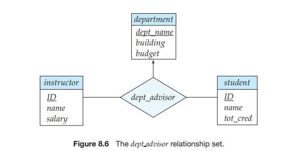

# Decomposition Using Functional Dependencies

In Section 8.1, we noted that there is a formal methodology for evaluating whether a relational schema should be decomposed. This methodology is based upon the concepts of keys and functional dependencies.

In discussing algorithms for relational database design, we shall need to talk about arbitrary relations and their schema, rather than talking only about examples. Recalling our introduction to the relational model in Chapter 2, we summarize our notation here.

• In general, we use Greek letters for sets of attributes (for example,α). We use a lowercase Roman letter followed by an uppercase Roman letter in parentheses to refer to a relation schema (for example, _r_ (_R_)). We use the notation _r_ (_R_) to show that the schema is for relation _r_ , with _R_ denoting the set of attributes, but at times simplify our notation to use just _R_ when the relation name does not matter to us.

Of course, a relation schema is a set of attributes, but not all sets of attributes are schemas. When we use a lowercase Greek letter, we are referring to a set of attributes that may or may not be a schema. A Roman letter is used when we wish to indicate that the set of attributes is definitely a schema.

• When a set of attributes is a superkey, we denote it by _K_ . A superkey pertains to a specific relation schema, so we use the terminology “_K_ is a superkey of _r_ (_R_).”

• We use a lowercase name for relations. In our examples, these names are intended to be realistic (for example, _instructor_), while in our definitions and algorithms, we use single letters, like _r_ .

• A relation, of course, has a particular value at any given time; we refer to that as an instance and use the term “instance of _r_”. When it is clear that we are talking about an instance, we may use simply the relation name (for example, _r_ ).

## Keys and Functional Dependencies

A database models a set of entities and relationships in the real world. There are usually a variety of constraints (rules) on the data in the real world. For example, some of the constraints that are expected to hold in a university database are:

**1\.** Students and instructors are uniquely identified by their ID.

**2\.** Each student and instructor has only one name.

**3\.** Each instructor and student is (primarily) associated with only one depart- ment.1

**4\.** Each department has only one value for its budget, and only one associated building.

An instance of a relation that satisfies all such real-world constraints is called a **legal instance** of the relation; a legal instance of a database is one where all the relation instances are legal instances.

Some of the most commonly used types of real-world constraints can be represented formally as keys (superkeys, candidate keys and primary keys), or as functional dependencies, which we define below.

In Section 2.3, we defined the notion of a _superkey_ as a set of one or more attributes that, taken collectively, allows us to identify uniquely a tuple in the relation. We restate that definition here as follows: Let _r_ (_R_) be a relation schema. A subset _K_ of _R_ is a **superkey** of _r_ (_R_) if, in any legal instance of _r_ (_R_), for all pairs t1 and t2 of tuples in the instance of _r_ if t1 β= t2, then t1[K ] β= t2[_K_ ]. That is, no two tuples in any legal instance of relation _r_ (_R_) may have the same value onattribute set _K_. Clearly, if no two tuples in _r_ have the same value on _K_ , then a _K_ \-value uniquely identifies a tuple in _r_ .

Whereas a superkey is a set of attributes that uniquely identifies an entire tuple, a functional dependency allows us to express constraints that uniquely identify the values of certain attributes. Consider a relation schema _r_ (_R_), and let α ⊆ _R_ and β ⊆ _R_.

• Given an instance of _r_ (_R_), we say that the instance **satisfies** the **functional dependency** α → β if for all pairs of tuples t1 and t2 in the instance such that t1[α] = t2[α], it is also the case that t1[β] = t2[β].

• We say that the functional dependency α → β **holds** on schema _r_ (_R_) if, in every legal instance of _r_ (_R_) it satisfies the functional dependency.

Using the functional-dependency notation, we say that _K is a superkey of r_ (_R_) if the functional dependency _K_ → _R_ holds on _r_ (_R_). In other words, _K_ is a superkey if, for every legal instance of _r_ (_R_), for every pair of tuples t1 and t2 from the instance, whenever t1[_K_ ] = t2[_K_ ]_,_ it is also the case that t1[_R_] = t2[_R_] (that is, t1 = t2).2

Functional dependencies allow us to express constraints that we cannot ex- press with superkeys. In Section 8.1.2, we considered the schema:

_inst dept_ (_ID_, _name_, _salary_, _dept name_, _building_, _budget_)

in which the functional dependency _dept name_ → _budget_ holds because for each department (identified by _dept name_) there is a unique budget amount.

We denote the fact that the pair of attributes (_ID_, _dept name_) forms a superkey for _inst dept_ by writing:

_ID_, _dept name_ → _name_, _salary_, _building_, _budget_

We shall use functional dependencies in two ways:

**1\.** To test instances of relations to see whether they satisfy a given set _F_ of functional dependencies.

**2\.** To specify constraints on the set of legal relations. We shall thus concern our- selves with _only_ those relation instances that satisfy a given set of functional dependencies. If we wish to constrain ourselves to relations on schema _r_ (_R_) that satisfy a set _F_ of functional dependencies, we say that _F_ **holds** on _r_ (_R_).

Let us consider the instance of relation _r_ of Figure 8.4, to see which functional dependencies are satisfied. Observe that _A_ → _C_ is satisfied. There are two tuples

2Note that we assume here that relations are sets. SQL deals with multisets, and a **primary key** declaration in SQL for a set of attributes _K_ requires not only that t1 = t2 if t1[_K_ ] = t2[_K_ ], but also that there be no duplicate tuples. SQL also requires that attributes in the set _K_ cannot be assigned a _null_ value.  

that have an _A_ value of _a_ 1\. These tuples have the same _C_ value—namely, _c_ 1\. Similarly, the two tuples with an _A_ value of _a_ 2 have the same _C_ value, _c_ 2\. There are no other pairs of distinct tuples that have the same _A_ value. The functional dependency _C_ → _A_ is not satisfied, however. To see that it is not, consider the tuples t1 = (_a2, b3, c2, d3) and t2 = (a3, b3,c2,d4). These two tuples have the same _C_ values, _c_ 2, but they have different _A_ values, _a_ 2 and _a_ 3, respectively. Thus, we have found a pair of tuples t1 and t2 such that t1[_C_] = t2[_C_], but t1[_A_] ≠ t2[_A_].

Some functional dependencies are said to be **trivial** because they are satis- fied by all relations. For example, _A_ → _A_ is satisfied by all relations involving attribute _A_. Reading the definition of functional dependency literally, we see that, for all tuples t1 and t2 such that t1[_A_] = t2[_A_], it is the case that t1[_A_] = t2[_A_]. Similarly, _AB_ → _A_ is satisfied by all relations involving attribute _A_. In general, a functional dependency of the form α → β is **trivial** if α ⊆ β.

It is important to realize that an instance of a relation may satisfy some func- tional dependencies that are not required to hold on the relation’s schema. In the instance of the _classroom_ relation of Figure 8.5, we see that _room number_ → _capacity_ is satisfied. However, we believe that, in the real world, two classrooms in differ- ent buildings can have the same room number but with different room capacity. Thus, it is possible, at some time, to have an instance of the _classroom_ relation in which _room number_ → _capacity_ is not satisfied. So, we would not include _room number_ → _capacity_ in the set of functional dependencies that hold on the schema

for the _classroom_ relation. However, we would expect the functional dependency _building_, _room number_ → _capacity_ to hold on the _classroom_ schema.

Given that a set of functional dependencies _F_ holds on a relation _r_ (_R_), it may be possible to infer that certain other functional dependencies must also hold on

_building room number capacity_

Packard 101 500 Painter 514 10 Taylor 3128 70 Watson 100 30 Watson 120 50

**Figure 8.5** An instance of the _classroom_ relation.  

the relation. For example, given a schema _r_ (_A, B, C_), if functional dependencies _A_ → _B_ and _B_ → _C_ , hold on _r_ , we can infer the functional dependency _A_ → _C_ must also hold on _r_ . This is because, given any value of _A_ there can be only one corresponding value for _B_, and for that value of _B_, there can only be one corresponding value for _C_ . We study later, in Section 8.4.1, how to make such inferences.

We will use the notation _F_ \+ to denote the **closure** of the set _F_ , that is, the set of all functional dependencies that can be inferred given the set _F_ . Clearly _F_ \+ contains all of the functional dependencies in _F_ .

## Boyce–Codd Normal Form

One of the more desirable normal forms that we can obtain is **Boyce–Codd normal form** (**BCNF**). It eliminates all redundancy that can be discovered based on functional dependencies, though, as we shall see in Section 8.6, there may be other types of redundancy remaining. A relation schema _R_ is in BCNF with respect to a set _F_ of functional dependencies if, for all functional dependencies in _F_ \+ of the form α → β, where α ⊆ _R_ and β ⊆ _R_, at least one of the following holds:

• α → β is a trivial functional dependency (that is, β ⊆ α).

• α is a superkey for schema _R_.

A database design is in BCNF if each member of the set of relation schemas that constitutes the design is in BCNF.

We have already seen in Section 8.1 an example of a relational schema that is not in BCNF:

_inst dept_ (_ID_, _name_, _salary_, _dept name_, _building_, _budget_)

The functional dependency _dept name_ → _budget_ holds on _inst dept_, but _dept name_ is not a superkey (because, a department may have a number of different instruc- tors). In Section 8.1.2, we saw that the decomposition of _inst dept_ into _instructor_ and _department_ is a better design. The _instructor_ schema is in BCNF. All of the nontrivial functional dependencies that hold, such as:

_ID_ → _name_, _dept name_, _salary_

include _ID_ on the left side of the arrow, and _ID_ is a superkey (actually, in this case, the primary key) for _instructor_. (In other words, there is no nontrivial functional dependency with any combination of _name_, _dept name_, and _salary_, without _ID_, on the side.) Thus, _instructor_ is in BCNF.

Similarly, the _department_ schema is in BCNF because all of the nontrivial func- tional dependencies that hold, such as:

_dept name_ → _building_, _budget_  

include _dept name_ on the left side of the arrow, and _dept name_ is a superkey (and the primary key) for _department_. Thus, _department_ is in BCNF.

We now state a general rule for decomposing that are not in BCNF. Let _R_ be a schema that is not in BCNF. Then there is at least one nontrivial functional dependency α → β such that α is not a superkey for _R_. We replace _R_ in our design with two schemas:

• (α ∪ β)

• (_R_ − (β − α))

In the case of _inst dept_ above, α = _dept name_, β = _{building_, _budget}_, and _inst dept_ is replaced by

• (α ∪ β) = (_dept name_, _building_,_budget_)

• (_R_ − (β − α)) = (_ID_, _name_, _dept name_, _salary_)

In this example, it turns out that β − α = β. We need to state the rule as we did so as to deal correctly with functional dependencies that have attributes that appear on both sides of the arrow. The technical reasons for this are covered later in Section 8.5.1.

When we decompose a schema that is not in BCNF, it may be that one or more of the resulting schemas are not in BCNF. In such cases, further decomposition is required, the eventual result of which is a set of BCNF schemas.

## BCNF and Dependency Preservation

We have seen several ways in which to express database consistency constraints: primary-key constraints, functional dependencies, **check** constraints, assertions, and triggers. Testing these constraints each time the database is updated can be costly and, therefore, it is useful to design the database in a way that constraints can be tested efficiently. In particular, if testing a functional dependency can be done by considering just one relation, then the cost of testing this constraint is low. We shall see that, in some cases, decomposition into BCNF can prevent efficient testing of certain functional dependencies.

To illustrate this, suppose that we make a small change to our university organization. In the design of Figure 7.15, a student may have only one advisor. This follows from the relationship set _advisor_ being many-to-one from _student_ to _advisor_. The “small” change we shall make is that an instructor can be associated with only a single department and a student may have more than one advisor, but at most one from a given department.3

One way to implement this change using the E-R design is by replacing the _advisor_ relationship set with a ternary relationship set, _dept advisor_, involving entity sets _instructor_, _student_, and _department_ that is many-to-one from the pair

_{student_, _instructor}_ to _department_ as shown in Figure 8.6. The E-R diagram specifies the constraint that “a student may have more than one advisor, but at most one corresponding to a given department”.

With this new E-R diagram, the schemas for the _instructor_, _department_, and _student_ are unchanged. However, the schema derived from _dept advisor_ is now:

_dept advisor_ (_s ID_, _i ID_, _dept name_)

Although not specified in the E-R diagram, suppose we have the additional constraint that “an instructor can act as advisor for only a single department.”

Then, the following functional dependencies hold on _dept advisor_:

_i ID_ → _dept name 
s ID_, _dept name_ → _i ID_

The first functional dependency follows from our requirement that “an instructor can act as an advisor for only one department.” The second functional dependency follows from our requirement that “a student may have at most one advisor for a given department.”

Notice that with this design, we are forced to repeat the department name once for each time an instructor participates in a _dept advisor_ relationship. We see that _dept advisor_ is not in BCNF because _i ID_ is not a superkey. Following our rule for BCNF decomposition, we get:

(_s ID_, _i ID_) 
(_i ID_, _dept name_)

Both the above schemas are BCNF. (In fact, you can verify that any schema with only two attributes is in BCNF by definition.) Note however, that in our BCNF de- sign, there is no schema that includes all the attributes appearing in the functional dependency _s ID_, _dept name_ → _i ID_.  

Because our design makes it computationally hard to enforce this functional dependency, we say our design is not **dependency preserving**.4 Because depen- dency preservation is usually considered desirable, we consider another normal form, weaker than BCNF, that will allow us to preserve dependencies. That normal form is called third normal form.5

## Third Normal Form

BCNF requires that all nontrivial dependencies be of the form α → β, where α is a superkey. Third normal form (3NF) relaxes this constraint slightly by allowing certain nontrivial functional dependencies whose left side is not a superkey. Before we define 3NF, we recall that a candidate key is a minimal superkey—that is, a superkey no proper subset of which is also a superkey.

A relation schema _R_ is in **third normal form** with respect to a set _F_ of functional dependencies if, for all functional dependencies in _F_ \+ of the form α → β, where α ⊆ _R_ and β ⊆ _R_, at least one of the following holds:

• α → β is a trivial functional dependency.

• α is a superkey for _R_.

• Each attribute _A_ in β − α is contained in a candidate key for _R_.

Note that the third condition above does not say that a single candidate key must contain all the attributes in β − α; each attribute _A_ in β − α may be contained in a _different_ candidate key.

The first two alternatives are the same as the two alternatives in the definition of BCNF. The third alternative of the 3NF definition seems rather unintuitive, and it is not obvious why it is useful. It represents, in some sense, a minimal relaxation of the BCNF conditions that helps ensure that every schema has a dependency- preserving decomposition into 3NF. Its purpose will become more clear later, when we study decomposition into 3NF.

Observe that any schema that satisfies BCNF also satisfies 3NF, since each of its functional dependencies would satisfy one of the first two alternatives. BCNF is therefore a more restrictive normal form than is 3NF.

The definition of 3NF allows certain functional dependencies that are not allowed in BCNF. A dependency α → β that satisfies only the third alternative of the 3NF definition is not allowed in BCNF, but is allowed in 3NF.6

Now, let us again consider the _dept advisor_ relationship set, which has the following functional dependencies:

_i ID_ → _dept name 
s ID_, _dept name_ → _i ID_

In Section 8.3.3 we argued that the functional dependency “_i ID_ → _dept name_” caused the _dept advisor_ schema not to be in BCNF. Note that here α = _i ID_, β = _dept name_, and β − α = _dept name_. Since the functional dependency _s ID_, _dept name_ →

_i ID_ holds on _dept advisor_, the attribute _dept name_ is contained in a candidate key and, therefore, _dept advisor_ is in 3NF.

We have seen the trade-off that must be made between BCNF and 3NF when there is no dependency-preserving BCNF design. These trade-offs are described in more detail in Section 8.5.4.

## Higher Normal Forms

Using functional dependencies to decompose schemas may not be sufficient to avoid unnecessary repetition of information in certain cases. Consider a slight variation in the _instructor_ entity-set definition in which we record with each instructor a set of children’s names and a set of phone numbers. The phone numbers may be shared by multiple people. Thus, _phone number_ and _child name_ would be multivalued attributes and, following our rules for generating schemas from an E-R design, we would have two schemas, one for each of the multivalued attributes, _phone number_ and _child name_:

(_ID_, _child name_) 
(_ID_, _phone number_)

If we were to combine these schemas to get

(_ID_, _child name_, _phone number_)

we would find the result to be in BCNF because only nontrivial functional de- pendencies hold. As a result we might think that such a combination is a good idea. However, such a combination is a bad idea, as we can see by consider- ing the example of an instructor with two children and two phone numbers. For example, let the instructor with _ID_ 99999 have two children named “David” and “William” and two phone numbers, 512-555-1234 and 512-555-4321. In the combined schema, we must repeat the phone numbers once for each dependent:

(99999, David, 512-555-1234) 
(99999, David, 512-555-4321) 
(99999, William, 512-555-1234) 
(99999, William, 512-555-4321)

If we did not repeat the phone numbers, and stored only the first and last tuple, we would have recorded the dependent names and the phone numbers, but the resultant tuples would imply that David corresponded to 512-555-1234, while William corresponded to 512-555-4321. As we know, this would be incorrect.

Because normal forms based on functional dependencies are not sufficient to deal with situations like this, other dependencies and normal forms have been defined. We cover these in Sections 8.6 and 8.7.

