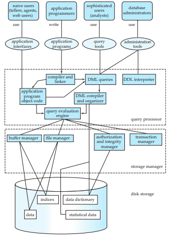

# Database Architecture

We are now in a position to provide a single picture (Figure 1.5) of the various components of a database system and the connections among them.

The architecture of a database system is greatly influenced by the underlying computer system on which the database system runs. Database systems can be centralized, or client-server, where one server machine executes work on behalf of multiple client machines. Database systems can also be designed to exploit par- allel computer architectures. Distributed databases span multiple geographically separated machines.

In Chapter 17 we cover the general structure of modern computer systems. Chapter 18 describes how various actions of a database, in particular query pro- cessing, can be implemented to exploit parallel processing. Chapter 19 presents a number of issues that arise in a distributed database, and describes how to deal with each issue. The issues include how to store data, how to ensure atomicity of transactions that execute at multiple sites, how to perform concurrency control, and how to provide high availability in the presence of failures. Distributed query processing and directory systems are also described in this chapter.

Most users of a database system today are not present at the site of the database system, but connect to it through a network. We can therefore differen- tiate between **client** machines, on which remote database users work, and **server** machines, on which the database system runs.  

Database applications are usually partitioned into two or three parts, as in Figure 1.6. In a **two-tier architecture**, the application resides at the client machine, where it invokes database system functionality at the server machine through

**Figure 1.5** System structure.  

**Figure 1.6** Two-tier and three-tier architectures.

query language statements. Application program interface standards like ODBC and JDBC are used for interaction between the client and the server.

In contrast, in a **three-tier architecture**, the client machine acts as merely a front end and does not contain any direct database calls. Instead, the client end communicates with an **application server**, usually through a forms interface. The application server in turn communicates with a database system to access data. The **business logic** of the application, which says what actions to carry out under what conditions, is embedded in the application server, instead of being distributed across multiple clients. Three-tier applications are more appropriate for large applications, and for applications that run on the World Wide Web.

