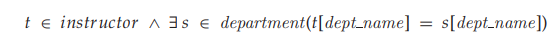

##
# The Tuple Relational Calculus

When we write a relational-algebra expression, we provide a sequence of procedures that generates the answer to our query. The tuple relational calculus, by contrast, is a **nonprocedural** query language. It describes the desired information without giving a specific procedure for obtaining that information.

A query in the tuple relational calculus is expressed as:

{_t_ | _P_(_t_)}  

That is, it is the set of all tuples _t_ such that predicate _P_ is true for _t_. Following our earlier notation, we use _t_\[_A_\] to denote the value of tuple _t_ on attribute _A_, and we use _t_ ∈ _r_ to denote that tuple _t_ is in relation _r_.

Before we give a formal definition of the tuple relational calculus, we return to some of the queries for which we wrote relational-algebra expressions in Section 6.1.1.

## Example Queries

Find the _ID_, _name_, _dept name_, _salary_ for instructors whose salary is greater than $80,000:

{_t_ | _t_ ∈ _instructor_ ∧ _t_[_salary_] _>_ 80000}

Suppose that we want only the _ID_ attribute, rather than all attributes of the _instructor_ relation. To write this query in the tuple relational calculus, we need to write an expression for a relation on the schema (_ID_). We need those tuples on (_ID_) such that there is a tuple in _instructor_ with the _salary_ attribute _\>_ 80000\. To express this request, we need the construct “there exists” from mathematical logic. The notation:

∃ _t_ ∈ _r_ (_Q_(_t_))

means “there exists a tuple _t_ in relation _r_ such that predicate _Q_(_t_) is true.” Using this notation, we can write the query “Find the instructor _ID_ for each

instructor with a salary greater than $80,000” as:

In English, we read the preceding expression as “The set of all tuples _t_ such that there exists a tuple _s_ in relation _instructor_ for which the values of _t_ and _s_ for the _ID_ attribute are equal, and the value of _s_ for the _salary_ attribute is greater than $80,000.”

Tuple variable _t_ is defined on only the _ID_ attribute, since that is the only attribute having a condition specified for _t_. Thus, the result is a relation on (_ID_).

Consider the query “Find the names of all instructors whose department is in the Watson building.” This query is slightly more complex than the previous queries, since it involves two relations: _instructor_ and _department_. As we shall see, however, all it requires is that we have two “there exists” clauses in our tuple-relational-calculus expression, connected by _and_ (∧). We write the query as follows:

**Figure 6.21** Names of all instructors whose department is in the Watson building.

Tuple variable _u_ is restricted to departments that are located in the Watson building, while tuple variable _s_ is restricted to instructors whose _dept name_ matches that of tuple variable _u_. Figure 6.21 shows the result of this query.

To find the set of all courses taught in the Fall 2009 semester, the Spring 2010 semester, or both, we used the union operation in the relational algebra. In the tuple relational calculus, we shall need two “there exists” clauses, connected by _or_ (∨):

This expression gives us the set of all _course id_ tuples for which at least one of the following holds:

• The _course id_ appears in some tuple of the _section_ relation with _semester_ \= Fall and _year_ \= 2009.

• The _course id_ appears in some tuple of the _section_ relation with _semester_ \= Spring and _year_ \= 2010.

If the same course is offered in both the Fall 2009 and Spring 2010 semesters, its _course id_ appears only once in the result, because the mathematical definition of a set does not allow duplicate members. The result of this query appeared earlier in Figure 6.5.

If we now want _only_ those _course id_ values for courses that are offered in _both_ the Fall 2009 and Spring 2010 semesters, all we need to do is to change the _or_ (∨) to _and_ (∧) in the preceding expression.

The result of this query appeared in Figure 6.13. Now consider the query “Find all the courses taught in the Fall 2009 semester

but not in Spring 2010 semester.” The tuple-relational-calculus expression for this query is similar to the expressions that we have just seen, except for the use of the _not_ (¬) symbol:

This tuple-relational-calculus expression uses the ∃_s_ ∈ _section_ (_. . ._) clause to require that a particular _course id_ is taught in the Fall 2009 semester, and it uses the ¬ ∃ _u_ ∈ _section_ (_. . ._) clause to eliminate those _course id_ values that appear in some tuple of the _section_ relation as having been taught in the Spring 2010 semester.

The query that we shall consider next uses implication, denoted by ⇒. The formula _P_ ⇒ _Q_ means “_P_ implies _Q_”; that is, “if _P_ is true, then _Q_ must be true.” Note that _P_ ⇒ _Q_ is logically equivalent to ¬_P_ ∨ _Q_. The use of implication rather than _not_ and _or_ often suggests a more intuitive interpretation of a query in English.

Consider the query that “Find all students who have taken all courses offered in the Biology department.” To write this query in the tuple relational calculus, we introduce the “for all” construct, denoted by ∀. The notation:

∀ _t_ ∈ _r_ (_Q_(_t_))

means “_Q_ is true for all tuples _t_ in relation _r_.” We write the expression for our query as follows:

In English, we interpret this expression as “The set of all students (that is, (_ID_) tuples _t_) such that, for _all_ tuples _u_ in the _course_ relation, if the value of _u_ on attribute _dept name_ is ’Biology’, then there exists a tuple in the _takes_ relation that includes the student _ID_ and the _course id_.”

Note that there is a subtlety in the above query: If there is no course offered in the Biology department, all student _ID_s satisfy the condition. The first line of the query expression is critical in this case—without the condition

if there is no course offered in the Biology department, any value of _t_ (including values that are not student _ID_s in the _student_ relation) would qualify.  

## Formal Definition

We are now ready for a formal definition. A tuple-relational-calculus expression is of the form:

{_t_|_P_ (_t_)}

where _P_ is a _formula_. Several tuple variables may appear in a formula. A tuple variable is said to be a _free variable_ unless it is quantified by a ∃ or ∀. Thus, in:

_t_ is a free variable. Tuple variable _s_ is said to be a _bound_ variable. A tuple-relational-calculus formula is built up out of _atoms_. An atom has one

of the following forms:

• _s_ ∈ _r_, where _s_ is a tuple variable and _r_ is a relation (we do not allow use of the _/_∈ operator).

• _s_[_x_] _ρ u_[_y_], where _s_ and _u_ are tuple variables, _x_ is an attribute on which _s_ is defined, _y_ is an attribute on which _u_ is defined, and  is a comparison operator (_<_, ≤, =, =, _\>_, ≥); we require that attributes _x_ and _y_ have domains whose members can be compared by .

• _s_[_x_] _ρ c_, where _s_ is a tuple variable, _x_ is an attribute on which _s_ is defined, 

is a comparison operator, and _c_ is a constant in the domain of attribute _x_.

We build up formulae from atoms by using the following rules:

• An atom is a formula.

• If _P_1 is a formula, then so are ¬_P_1 and (_P_1).

• If _P_1 and _P_2 are formulae, then so are _P_1 ∨ _P_2, _P_1 ∧ _P_2, and _P_1 ⇒ _P_2.

• If _P_1(_s_) is a formula containing a free tuple variable _s_, and _r_ is a relation, then

∃ _s_ ∈ _r_ (_P_1(_s_)) and ∀ _s_ ∈ _r_ (_P_1(_s_))

are also formulae.

As we could for the relational algebra, we can write equivalent expressions that are not identical in appearance. In the tuple relational calculus, these equivalences include the following three rules:

**1.** _P_1 ∧ _P_2 is equivalent to ¬ (¬(_P_1) ∨ ¬(_P_2)).

**2.** ∀ _t_ ∈ _r_ (_P_1(_t_)) is equivalent to ¬ ∃ _t_ ∈ _r_ (¬_P_1(_t_)).

**3.** _P_1 ⇒ _P_2 is equivalent to ¬(_P_1) ∨ _P_2.  

## Safety of Expressions

There is one final issue to be addressed. A tuple-relational-calculus expression may generate an infinite relation. Suppose that we write the expression:

{_t_ |¬ (_t_ ∈ _instructor_ )}

There are infinitely many tuples that are not in _instructor_. Most of these tuples contain values that do not even appear in the database! Clearly, we do not wish to allow such expressions.

To help us define a restriction of the tuple relational calculus, we introduce the concept of the **domain** of a tuple relational formula, _P_. Intuitively, the domain of _P_, denoted _dom_(_P_), is the set of all values referenced by _P_. They include values mentioned in _P_ itself, as well as values that appear in a tuple of a relation mentioned in _P_. Thus, the domain of _P_ is the set of all values that appear explicitly in _P_ or that appear in one or more relations whose names appear in _P_. For example, _dom_(_t_ ∈ _instructor_ ∧ _t_\[_salary_\] _\>_ 80000) is the set containing 80000 as well as the set of all values appearing in any attribute of any tuple in the _instructor_ relation. Similarly, _dom_(¬ (_t_ ∈ _instructor_ )) is also the set of all values appearing in _instructor_, since the relation _instructor_ is mentioned in the expression.

We say that an expression {_t_ | _P_(_t_)} is _safe_ if all values that appear in the result are values from _dom_(_P_). The expression {_t_ |¬ (_t_ ∈ _instructor_ )} is not safe. Note that _dom_(¬ (_t_ ∈ _instructor_ )) is the set of all values appearing in _instructor_. However, it is possible to have a tuple _t_ not in _instructor_ that contains values that do not appear in _instructor_. The other examples of tuple-relational-calculus expressions that we have written in this section are safe.

The number of tuples that satisfy an unsafe expression, such as {_t_ |¬ (_t_ ∈ _instructor_ )}, could be infinite, whereas safe expressions are guaranteed to have finite results. The class of tuple-relational-calculus expressions that are allowed is therefore restricted to those that are safe.

## Expressive Power of Languages

The tuple relational calculus restricted to safe expressions is equivalent in expres- sive power to the basic relational algebra (with the operators ∪_,_ −_,_ ×_,_ , and ρ , but without the extended relational operations such as generalized projection and ag- gregation (_G_)). Thus, for every relational-algebra expression using only the basic operations, there is an equivalent expression in the tuple relational calculus, and for every tuple-relational-calculus expression, there is an equivalent relational- algebra expression. We shall not prove this assertion here; the bibliographic notes contain references to the proof. Some parts of the proof are included in the exer- cises. We note that the tuple relational calculus does not have any equivalent of the aggregate operation, but it can be extended to support aggregation. Extending the tuple relational calculus to handle arithmetic expressions is straightforward.  
