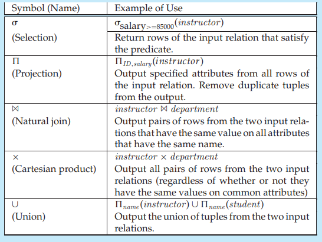

# Relational Operations

All procedural relational query languages provide a set of operations that can be applied to either a single relation or a pair of relations. These operations have the nice and desired property that their result is always a single relation. This property allows one to combine several of these operations in a modular way. Specifically, since the result of a relational query is itself a relation, relational operations can be applied to the results of queries as well as to the given set of relations.

The specific relational operations are expressed differently depending on the language, but fit the general framework we describe in this section. In Chapter 3, we show the specific way the operations are expressed in SQL.

The most frequent operation is the selection of specific tuples from a single relation (say _instructor_) that satisfies some particular predicate (say _salary >_

$85,000). The result is a new relation that is a subset of the original relation (_in-

**Figure 2.10** Result of query selecting _instructor_ tuples with salary greater than $85000.

_structor_). For example, if we select tuples from the _instructor_ relation of Figure 2.1, satisfying the predicate “_salary_ is greater than $85000”, we get the result shown in Figure 2.10.

Another frequent operation is to select certain attributes (columns) from a relation. The result is a new relation having only those selected attributes. For example, suppose we want a list of instructor _ID_s and salaries without listing the _name_ and _dept name_ values from the _instructor_ relation of Figure 2.1, then the result, shown in Figure 2.11, has the two attributes _ID_ and _salary_. Each tuple in the result is derived from a tuple of the _instructor_ relation but with only selected attributes shown.

The _join_ operation allows the combining of two relations by merging pairs of tuples, one from each relation, into a single tuple. There are a number of different ways to join relations (as we shall see in Chapter 3). Figure 2.12 shows an example of joining the tuples from the _instructor_ and _department_ tables with the new tuples showing the information about each instructor and the department in which she is working. This result was formed by combining each tuple in the _instructor_ relation with the tuple in the _department_ relation for the instructor’s department.

In the form of join shown in Figure 2.12, which is called a _natural join_, a tuple from the _instructor_ relation matches a tuple in the _department_ relation if the values

**Figure 2.11** Result of query selecting attributes _ID_ and _salary_ from the _instructor_ relation.  

**Figure 2.12** Result of natural join of the _instructor_ and _department_ relations.

of their _dept name_ attributes are the same. All such matching pairs of tuples are present in the join result. In general, the natural join operation on two relations matches tuples whose values are the same on all attribute names that are common to both relations.

The _Cartesian product_ operation combines tuples from two relations, but unlike the join operation, its result contains _all_ pairs of tuples from the two relations, regardless of whether their attribute values match.

Because relations are sets, we can perform normal set operations on relations. The _union_ operation performs a set union of two “similarly structured” tables (say a table of all graduate students and a table of all undergraduate students). For example, one can obtain the set of all students in a department. Other set operations, such as _intersection_ and _set difference_ can be performed as well.

As we noted earlier, we can perform operations on the results of queries. For example, if we want to find the _ID_ and _salary_ for those instructors who have salary greater than $85,000, we would perform the first two operations in our example above. First we select those tuples from the _instructor_ relation where the _salary_ value is greater than $85,000 and then, from that result, select the two attributes _ID_ and _salary_, resulting in the relation shown in Figure 2.13 consisting of the _ID_

**Figure 2.13** Result of selecting attributes _ID_ and _salary_ of instructors with salary greater than $85,000.  

RELATIONAL ALGEBRA## RELATIONAL ALGEBRA

The relational algebra defines a set of operations on relations, paralleling the usual algebraic operations such as addition, subtraction or multiplication, which operate on numbers. Just as algebraic operations on numbers take one or more numbers as input and return a number as output, the relational algebra operations typically take one or two relations as input and return a relation as output.

Relational algebra is covered in detail in Chapter 6, but we outline a few of the operations below.

and _salary_. In this example, we could have performed the operations in either order, but that is not the case for all situations, as we shall see.

Sometimes, the result of a query contains duplicate tuples. For example, if we select the _dept name_ attribute from the _instructor_ relation, there are several cases of duplication, including “Comp. Sci.”, which shows up three times. Certain relational languages adhere strictly to the mathematical definition of a set and remove duplicates. Others, in consideration of the relatively large amount of processing required to remove duplicates from large result relations, retain duplicates. In these latter cases, the relations are not truly relations in the pure mathematical sense of the term.

Of course, data in a database must be changed over time. A relation can be updated by inserting new tuples, deleting existing tuples, or modifying tuples by changing the values of certain attributes. Entire relations can be deleted and new ones created.

We shall discuss relational queries and updates using the SQL language in Chapters 3 through 5.

