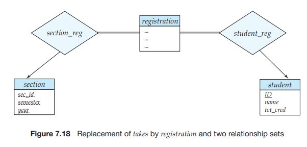
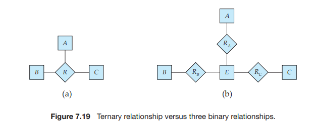

# Entity-Relationship Design Issues

The notions of an entity set and a relationship set are not precise, and it is possible to define a set of entities and the relationships among them in a number of different ways. In this section, we examine basic issues in the design of an E-R database schema. Section 7.10 covers the design process in further detail.

## Use of Entity Sets versus Attributes

Consider the entity set _instructor_ with the additional attribute _phone number_ (Fig- ure 7.17a.) It can easily be argued that a phone is an entity in its own right with attributes _phone number_ and _location_; the location may be the office or home where the phone is located, with mobile (cell) phones perhaps represented by the value “mobile.” If we take this point of view, we do not add the attribute _phone number_ to the _instructor_. Rather, we create:

• A _phone_ entity set with attributes _phone number_ and _location_.

• A relationship set _inst phone_, denoting the association between instructors and the phones that they have.

This alternative is shown in Figure 7.17b. What, then, is the main difference between these two definitions of an instruc-

tor? Treating a phone as an attribute _phone number_ implies that instructors have precisely one phone number each. Treating a phone as an entity _phone_ permits instructors to have several phone numbers (including zero) associated with them. However, we could instead easily define _phone number_ as a multivalued attribute to allow multiple phones per instructor.

The main difference then is that treating a phone as an entity better models a situation where one may want to keep extra information about a phone, such as its location, or its type (mobile, IP phone, or plain old phone), or all who share

the phone. Thus, treating phone as an entity is more general than treating it as an attribute and is appropriate when the generality may be useful.

In contrast, it would not be appropriate to treat the attribute _name_ (of an instructor) as an entity; it is difficult to argue that _name_ is an entity in its own right (in contrast to the phone). Thus, it is appropriate to have _name_ as an attribute of the _instructor_ entity set.

Two natural questions thus arise: What constitutes an attribute, and what constitutes an entity set? Unfortunately, there are no simple answers. The distinc- tions mainly depend on the structure of the real-world enterprise being modeled, and on the semantics associated with the attribute in question.

A common mistake is to use the primary key of an entity set as an attribute of another entity set, instead of using a relationship. For example, it is incorrect to model the _ID_ of a _student_ as an attribute of an _instructor_ even if each instructor advises only one student. The relationship _advisor_ is the correct way to represent the connection between students and instructors, since it makes their connection explicit, rather than implicit via an attribute.

Another related mistake that people sometimes make is to designate the primary-key attributes of the related entity sets as attributes of the relationship set. For example, _ID_ (the primary-key attributes of _student_) and _ID_ (the primary key of _instructor_) should not appear as attributes of the relationship _advisor_. This should not be done since the primary-key attributes are already implicit in the relationship set.8

## Use of Entity Sets versus Relationship Sets

It is not always clear whether an object is best expressed by an entity set or a relationship set. In Figure 7.15, we used the _takes_ relationship set to model the situation where a student takes a (section of a) course. An alternative is to imagine that there is a course-registration record for each course that each student takes. Then, we have an entity set to represent the course-registration record. Let us call that entity set _registration_. Each _registration_ entity is related to exactly one student and to exactly one section, so we have two relationship sets, one to relate course- registration records to students and one to relate course-registration records to sections. In Figure 7.18, we show the entity sets _section_ and _student_ from Figure 7.15 with the _takes_ relationship set replaced by one entity set and two relationship sets:

• _registration_, the entity set representing course-registration records.

• _section reg_, the relationship set relating _registration_ and _course_.

• _student reg_, the relationship set relating _registration_ and _student_.

Note that we use double lines to indicate total participation by _registration_ entities.

Both the approach of Figure 7.15 and that of Figure 7.18 accurately represent the university’s information, but the use of _takes_ is more compact and probably preferable. However, if the registrar’s office associates other information with a course-registration record, it might be best to make it an entity in its own right.

One possible guideline in determining whether to use an entity set or a relationship set is to designate a relationship set to describe an action that occurs between entities. This approach can also be useful in deciding whether certain attributes may be more appropriately expressed as relationships.

## Binary versus_n_\-ary Relationship Sets

Relationships in databases are often binary. Some relationships that appear to be nonbinary could actually be better represented by several binary relationships. For instance, one could create a ternary relationship _parent_, relating a child to his/her mother and father. However, such a relationship could also be represented by two binary relationships, _mother_ and _father_, relating a child to his/her mother and father separately. Using the two relationships _mother_ and _father_ provides us a record of a child’s mother, even if we are not aware of the father’s identity; a null value would be required if the ternary relationship _parent_ is used. Using binary relationship sets is preferable in this case.

In fact, it is always possible to replace a nonbinary (_n_\-ary, for _n >_ 2) relation- ship set by a number of distinct binary relationship sets. For simplicity, consider the abstract ternary (_n_ \= 3) relationship set _R_, relating entity sets _A_, _B_, and _C_ . We replace the relationship set _R_ by an entity set _E_ , and create three relationship sets as shown in Figure 7.19:

• _RA_, relating _E_ and _A_.

• _RB_ , relating _E_ and _B_.

• _RC_ , relating _E_ and _C_ .  

If the relationship set _R_ had any attributes, these are assigned to entity set _E_ ; further, a special identifying attribute is created for _E_ (since it must be possible to distinguish different entities in an entity set on the basis of their attribute values). For each relationship (_ai , bi , ci_ ) in the relationship set _R_, we create a new entity _ei_ in the entity set _E_ . Then, in each of the three new relationship sets, we insert a relationship as follows:

• (_ei , ai_ ) in _RA_.

• (_ei , bi_ ) in _RB_ .

• (_ei , ci_ ) in _RC_ .

We can generalize this process in a straightforward manner to _n_\-ary relation- ship sets. Thus, conceptually, we can restrict the E-R model to include only binary relationship sets. However, this restriction is not always desirable.

• An identifying attribute may have to be created for the entity set created to represent the relationship set. This attribute, along with the extra relationship sets required, increases the complexity of the design and (as we shall see in Section 7.6) overall storage requirements.

• An _n_\-ary relationship set shows more clearly that several entities participate in a single relationship.

• There may not be a way to translate constraints on the ternary relationship into constraints on the binary relationships. For example, consider a con- straint that says that _R_ is many-to-one from _A, B_ to _C_ ; that is, each pair of entities from _A_ and _B_ is associated with at most one _C_ entity. This constraint cannot be expressed by using cardinality constraints on the relationship sets _RA, RB_ , and _RC_ .

Consider the relationship set _proj guide_ in Section 7.2.2, relating _instructor_, _student_, and _project_. We cannot directly split _proj guide_ into binary relationships between _instructor_ and _project_ and between _instructor_ and _student_. If we did so, 

we would be able to record that instructor Katz works on projects _A_ and _B_ with students Shankar and Zhang; however, we would not be able to record that Katz works on project _A_ with student Shankar and works on project _B_ with student Zhang, but does not work on project _A_ with Zhang or on project _B_ with Shankar.

The relationship set _proj guide_ can be split into binary relationships by creating a new entity set as described above. However, doing so would not be very natural.

## Placement of Relationship Attributes

The cardinality ratio of a relationship can affect the placement of relationship attributes. Thus, attributes of one-to-one or one-to-many relationship sets can be associated with one of the participating entity sets, rather than with the relation- ship set. For instance, let us specify that _advisor_ is a one-to-many relationship set such that one instructor may advise several students, but each student can be advised by only a single instructor. In this case, the attribute _date_, which specifies when the instructor became the advisor of a student, could be associated with the _student_ entity set, as Figure 7.20 depicts. (To keep the figure simple, only some of the attributes of the two entity sets are shown.) Since each _student_ entity participates in a relationship with at most one instance of _instructor_, making this attribute designation has the same meaning as would placing _date_ with the _advisor_ relationship set. Attributes of a one-to-many relationship set can be repositioned to only the entity set on the “many” side of the relationship. For one-to-one rela- tionship sets, on the other hand, the relationship attribute can be associated with either one of the participating entities.

The design decision of where to place descriptive attributes in such cases —as a relationship or entity attribute—should reflect the characteristics of the enterprise being modeled. The designer may choose to retain _date_ as an attribute of _advisor_ to express explicitly that the date refers to the advising relationship and not some other aspect of the student’s university status (for example, date of acceptance to the university).  

The choice of attribute placement is more clear-cut for many-to-many rela- tionship sets. Returning to our example, let us specify the perhaps more realistic case that _advisor_ is a many-to-many relationship set expressing that an instructor may advise one or more students, and that a student may be advised by one or more instructors. If we are to express the date on which a specific instructor became the advisor of a specific student, _date_ must be an attribute of the _advisor_ relationship set, rather than either one of the participating entities. If _date_ were an attribute of _student_, for instance, we could not determine which instructor became the advisor on that particular date. When an attribute is determined by the com- bination of participating entity sets, rather than by either entity separately, that attribute must be associated with the many-to-many relationship set. Figure 7.3 depicts the placement of _date_ as a relationship attribute; again, to keep the figure simple, only some of the attributes of the two entity sets are shown.

