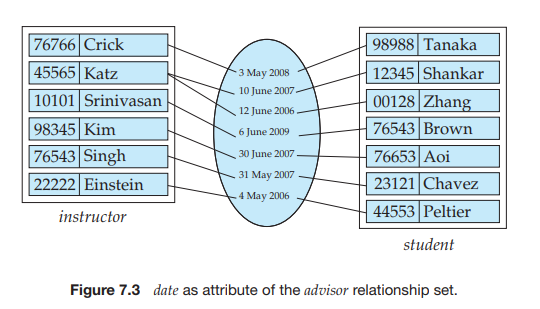

# The Entity-Relationship Model

The **entity-relationship** (**E-R**) data model was developed to facilitate database design by allowing specification of an _enterprise schema_ that represents the overall logical structure of a database.

The E-R model is very useful in mapping the meanings and interactions of real-world enterprises onto a conceptual schema. Because of this usefulness, many database-design tools draw on concepts from the E-R model. The E-R data model employs three basic concepts: entity sets, relationship sets, and attributes, which we study first. The E-R model also has an associated diagrammatic representation, the E-R diagram, which we study later in this chapter.

## Entity Sets

An **entity** is a “thing” or “object” in the real world that is distinguishable from all other objects. For example, each person in a university is an entity. An entity has a set of properties, and the values for some set of properties may uniquely identify an entity. For instance, a person may have a _person id_ property whose value uniquely identifies that person. Thus, the value 677-89-9011 for _person id_ would uniquely identify one particular person in the university. Similarly, courses can be thought of as entities, and _course id_ uniquely identifies a course entity in the university. An entity may be concrete, such as a person or a book, or it may be abstract, such as a course, a course offering, or a flight reservation.

An **entity set** is a set of entities of the same type that share the same properties, or attributes. The set of all people who are instructors at a given university, for example, can be defined as the entity set _instructor_. Similarly, the entity set _student_ might represent the set of all students in the university.

In the process of modeling, we often use the term _entity set_ in the abstract, without referring to a particular set of individual entities. We use the term **ex- tension** of the entity set to refer to the actual collection of entities belonging to the entity set. Thus, the set of actual instructors in the university forms the exten- sion of the entity set _instructor_. The above distinction is similar to the difference between a relation and a relation instance, which we saw in Chapter 2.

Entity sets do not need to be disjoint. For example, it is possible to define the entity set of all people in a university (_person_). A _person_ entity may be an _instructor_ entity, a _student_ entity, both, or neither.

An entity is represented by a set of **attributes**. Attributes are descriptive properties possessed by each member of an entity set. The designation of an attribute for an entity set expresses that the database stores similar information concerning each entity in the entity set; however, each entity may have its own value for each attribute. Possible attributes of the _instructor_ entity set are _ID_, _name_, _dept name_, and _salary_. In real life, there would be further attributes, such as street number, apartment number, state, postal code, and country, but we omit them to keep our examples simple. Possible attributes of the _course_ entity set are _course id_, _title_, _dept name_, and _credits_.

Each entity has a **value** for each of its attributes. For instance, a particular _instructor_ entity may have the value 12121 for _ID_, the value Wu for _name_, the value Finance for _dept name_, and the value 90000 for _salary_.

The _ID_ attribute is used to identify instructors uniquely, since there may be more than one instructor with the same name. In the United States, many enterprises find it convenient to use the _social-security_ number of a person2 as an attribute whose value uniquely identifies the person. In general the enterprise would have to create and assign a unique identifier for each instructor.

A database thus includes a collection of entity sets, each of which contains any number of entities of the same type. Figure 7.1 shows part of a university database that consists of two entity sets: _instructor_ and _student_. To keep the figure simple, only some of the attributes of the two entity sets are shown.

A database for a university may include a number of other entity sets. For example, in addition to keeping track of instructors and students, the university also has information about courses, which are represented by the entity set _course_

with attributes _course id_, _title_, _dept name_ and _credits_. In a real setting, a university database may keep dozens of entity sets.

## Relationship Sets

A **relationship** is an association among several entities. For example, we can define a relationship _advisor_ that associates instructor Katz with student Shankar. This relationship specifies that Katz is an advisor to student Shankar.

A **relationship set** is a set of relationships of the same type. Formally, it is a mathematical relation on _n_ ≥ 2 (possibly nondistinct) entity sets. If _E1_, E2_, . . . , En_ are entity sets, then a relationship set _R_ is a subset of

{(e1, e2, …, en) | e1 ∈ E1, e2 ∈ E2, …, en ∈ En}

where (e1, e2, . . . , en) is a relationship. 
Consider the two entity sets _instructor_ and _student_ in Figure 7.1. We define the relationship set _advisor_ to denote the association between instructors and students. Figure 7.2 depicts this association.

As another example, consider the two entity sets _student_ and _section_. We can define the relationship set _takes_ to denote the association between a student and the course sections in which that student is enrolled.

The association between entity sets is referred to as participation; that is, the entity sets _E1_, E2_, . . . , En_ **participate** in relationship set _R_. A **relationship in- stance** in an E-R schema represents an association between the named entities in the real-world enterprise that is being modeled. As an illustration, the individual _instructor_ entity Katz, who has instructor _ID_ 45565, and the _student_ entity Shankar, who has student _ID_ 12345, participate in a relationship instance of _advisor_. This re- lationship instance represents that in the university, the instructor Katz is advising student Shankar.

The function that an entity plays in a relationship is called that entity’s **role**. Since entity sets participating in a relationship set are generally distinct, roles  

are implicit and are not usually specified. However, they are useful when the meaning of a relationship needs clarification. Such is the case when the entity sets of a relationship set are not distinct; that is, the same entity set participates in a relationship set more than once, in different roles. In this type of relationship set, sometimes called a **recursive** relationship set, explicit role names are necessary to specify how an entity participates in a relationship instance. For example, consider the entity set _course_ that records information about all the courses offered in the university. To depict the situation where one course (C2) is a prerequisite for another course (C1) we have relationship set _prereq_ that is modeled by ordered pairs of _course_ entities. The first course of a pair takes the role of course C1, whereas the second takes the role of prerequisite course C2. In this way, all relationships of _prereq_ are characterized by (C1, C2) pairs; (C2, C1) pairs are excluded.

A relationship may also have attributes called **descriptive attributes**. Con- sider a relationship set _advisor_ with entity sets _instructor_ and _student_. We could associate the attribute _date_ with that relationship to specify the date when an instructor became the advisor of a student. The _advisor_ relationship among the entities corresponding to instructor Katz and student Shankar has the value “10 June 2007” for attribute _date_, which means that Katz became Shankar’s advisor on 10 June 2007.

Figure 7.3 shows the relationship set _advisor_ with a descriptive attribute _date_. Please note that Katz advises two students with two different advising dates.

As a more realistic example of descriptive attributes for relationships, consider the entity sets _student_ and _section_, which participate in a relationship set _takes_. We may wish to store a descriptive attribute _grade_ with the relationship to record the grade that a student got in the class. We may also store a descriptive attribute _for credit_ to record whether a student has taken the course for credit, or is auditing

(or sitting in on) the course. A relationship instance in a given relationship set must be uniquely identi-

fiable from its participating entities, without using the descriptive attributes. To understand this point, suppose we want to model all the dates when an instructor  

became an advisor of a particular student. The single-valued attribute _date_ can store a single _date_ only. We cannot represent multiple dates by multiple relation- ship instances between the same instructor and a student, since the relationship instances would not be uniquely identifiable using only the participating entities. The right way to handle this case is to create a multivalued attribute _date_, which can store all the dates.

It is possible to have more than one relationship set involving the same entity sets. In our example, the _instructor_ and _student_ entity sets participate in the relationship set _advisor_. Additionally, suppose each student must have another instructor who serves as a department advisor (undergraduate or graduate). Then the _instructor_ and _student_ entity sets may participate in another relationship set, _dept advisor_.

The relationship sets _advisor_ and _dept advisor_ provide examples of a **binary** relationship set—that is, one that involves two entity sets. Most of the relationship sets in a database system are binary. Occasionally, however, relationship sets involve more than two entity sets.

As an example, suppose that we have an entity set _project_ that represents all the research projects carried out in the university. Consider the entity sets _instructor_, _student_, and _project_. Each project can have multiple associated students and multiple associated instructors. Furthermore, each student working on a project must have an associated instructor who guides the student on the project. For now, we ignore the first two relationships, between project and instructor, and between project and student. Instead, we focus on the information about which instructor is guiding which student on a particular project. To represent this information, we relate the three entity sets through the relationship set _proj guide_, which indicates that a particular student is guided by a particular instructor on a particular project.

Note that a student could have different instructors as guides for different projects, which cannot be captured by a binary relationship between students and instructors.  

The number of entity sets that participate in a relationship set is the **degree** of the relationship set. A binary relationship set is of degree 2; a ternary relationship set is of degree 3.

## Attributes

For each attribute, there is a set of permitted values, called the **domain**, or **value set**, of that attribute. The domain of attribute _course id_ might be the set of all text strings of a certain length. Similarly, the domain of attribute _semester_ might be strings from the set _{_Fall, Winter, Spring, Summer_}_.

Formally, an attribute of an entity set is a function that maps from the entity set into a domain. Since an entity set may have several attributes, each entity can be described by a set of (attribute, data value) pairs, one pair for each attribute of the entity set. For example, a particular _instructor_ entity may be described by the set _{_(_ID_, 76766), (_name_, Crick), (_dept name_, Biology), (_salary_, 72000)_}_, meaning that the entity describes a person named Crick whose instructor _ID_ is 76766, who is a member of the Biology department with salary of $72,000. We can see, at this point, an integration of the abstract schema with the actual enterprise being modeled. The attribute values describing an entity constitute a significant portion of the data stored in the database.

An attribute, as used in the E-R model, can be characterized by the following attribute types.

• **Simple** and **composite** attributes. In our examples thus far, the attributes have been simple; that is, they have not been divided into subparts. **Composite** attributes, on the other hand, can be divided into subparts (that is, other attributes). For example, an attribute _name_ could be structured as a composite attribute consisting of _first name_, _middle initial_, and _last name_. Using composite attributes in a design schema is a good choice if a user will wish to refer to an entire attribute on some occasions, and to only a component of the attribute on other occasions. Suppose we were to to add an address to the _student_ entity-set. The address can be defined as the composite attribute _address_ with the attributes _street_, _city_, _state_, and _zip code_.3 Composite attributes help us to group together related attributes, making the modeling cleaner.

Note also that a composite attribute may appear as a hierarchy. In the com- posite attribute _address_, its component attribute _street_ can be further divided into _street number_, _street name_, and _apartment number_. Figure 7.4 depicts these examples of composite attributes for the _instructor_ entity set.

• **Single-valued** and **multivalued** attributes. The attributes in our examples all have a single value for a particular entity. For instance, the _student ID_ attribute for a specific student entity refers to only one student _ID_. Such attributes are said to be **single valued**. There may be instances where an attribute has a set of values for a specific entity. Suppose we add to the _instructor_ entity set

a _phone number_ attribute. An _instructor_ may have zero, one, or several phone numbers, and different instructors may have different numbers of phones. This type of attribute is said to be **multivalued**. As another example, we could add to the _instructor_ entity set an attribute _dependent name_ listing all the dependents. This attribute would be multivalued, since any particular instructor may have zero, one, or more dependents. To denote that an attribute is multivalued, we enclose it in braces, for example {_phone number_} or {_dependent name_}.

Where appropriate, upper and lower bounds may be placed on the number of values in a multivalued attribute. For example, a university may limit the number of phone numbers recorded for a single instructor to two. Placing bounds in this case expresses that the _phone number_ attribute of the _instructor_ entity set may have between zero and two values.

• **Derived** attribute. The value for this type of attribute can be derived from the values of other related attributes or entities. For instance, let us say that the _instructor_ entity set has an attribute _students advised_, which represents how many students an instructor advises. We can derive the value for this attribute by counting the number of _student_ entities associated with that instructor.

As another example, suppose that the _instructor_ entity set has an attribute _age_ that indicates the instructor’s age. If the _instructor_ entity set also has an attribute _date of birth_, we can calculate _age_ from _date of birth_ and the current date. Thus, _age_ is a derived attribute. In this case, _date of birth_ may be referred to as a _base_ attribute, or a _stored_ attribute. The value of a derived attribute is not stored but is computed when required.

An attribute takes a **null** value when an entity does not have a value for it. The _null_ value may indicate “not applicable”—that is, that the value does not exist for the entity. For example, one may have no middle name. _Null_ can also designate that an attribute value is unknown. An unknown value may be either _missing_ (the value does exist, but we do not have that information) or _not known_ (we do not know whether or not the value actually exists).

For instance, if the _name_ value for a particular instructor is _null_, we assume that the value is missing, since every instructor must have a name. A null value for the _apartment number_ attribute could mean that the address does not include an apartment number (not applicable), that an apartment number exists but we do not know what it is (missing), or that we do not know whether or not an apartment number is part of the instructor’s address (unknown).

