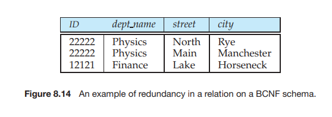

# Decomposition Using Multivalued Dependencies

Some relation schemas, even though they are in BCNF, do not seem to be suffi- ciently normalized, in the sense that they still suffer from the problem of repetition of information. Consider a variation of the university organization where an in- structor may be associated with multiple departments.

_inst_ (_ID_, _dept name_, _name_,_street_, _city_)

The astute reader will recognize this schema as a non-BCNF schema because of the functional dependency

_ID_ → _name_, _street_, _city_

and because _ID_ is not a key for _inst_. Further assume that an instructor may have several addresses (say, a winter

home and a summer home). Then, we no longer wish to enforce the functional dependency “ID→ street, city”, though, of course, we still want to enforce “ID → name” (that is, the university is not dealing with instructors who operate under multiple aliases!). Following the BCNF decomposition algorithm, we obtain two schemas:

r1 (ID, name) 
r2 (ID, dept name, street, city)

Both of these are in BCNF (recall that an instructor can be associated with multi- ple departments and a department may have several instructors, and therefore, neither “ID → dept name” nor “dept name → ID” hold).

Despite r2 being in BCNF, there is redundancy. We repeat the address informa- tion of each residence of an instructor once for each department with which the instructor is associated. We could solve this problem by decomposing r2 further into:

r21(dept name, ID) 
r22(ID, street, city)

but there is no constraint that leads us to do this. To deal with this problem, we must define a new form of constraint, called

a _multivalued dependency_. As we did for functional dependencies, we shall use multivalued dependencies to define a normal form for relation schemas. This normal form, called **fourth normal form** (4NF), is more restrictive than BCNF. We shall see that every 4NF schema is also in BCNF but there are BCNF schemas that are not in 4NF.

## 8.6.1 Multivalued Dependencies

Functional dependencies rule out certain tuples from being in a relation. If _A_ → _B_, then we cannot have two tuples with the same _A_ value but different _B_ values. Multivalued dependencies, on the other hand, do not rule out the existence of certain tuples. Instead, they _require_ that other tuples of a certain form be present in the relation. For this reason, functional dependencies sometimes are referred to as **equality-generating dependencies**, and multivalued dependencies are referred to as **tuple-generating dependencies**.

Let _r_ (_R_) be a relation schema and let α ⊆ _R_ and β ⊆ _R_. The **multivalued dependency**

α →→ β

holds on _R_ if, in any legal instance of relation _r_ (_R_), for all pairs of tuples t1 and t2 in _r_ such that t1[α] = t2[α], there exist tuples t3 and t4 in r such that

t1[α] = t2[α] = t3[α] = t4[α] 
t3[β] = t1[β] 
t3[R − β] = t2[R − β] 
t4[β] = t2[β] 
t4[R − β] = t1[R − β]  


This definition is less complicated than it appears to be. Figure 8.13 gives a tabular picture of t1, t2, t3, and t4\. Intuitively, the multivalued dependency α →→ β says that the relationship between α and β is independent of the relationship between α and R−β. If the multivalued dependency α →→ β is satisfied by all relations on schema R, then α →→ β is a trivial multivalued dependency on schema R. Thus, α →→ β is trivial if β ⊆ α or β ∪ α = R.

To illustrate the difference between functional and multivalued dependencies, we consider the schema _r_2 again, and an example relation on that schema shown in Figure 8.14. We must repeat the department name once for each address that an instructor has, and we must repeat the address for each department with which an instructor is associated. This repetition is unnecessary, since the relationship between an instructor and his address is independent of the relationship between that instructor and a department. If an instructor with _ID_ 22222 is associated with the Physics department, we want that department to be associated with all of that instructor’s addresses. Thus, the relation of Figure 8.15 is illegal. To make this relation legal, we need to add the tuples (Physics, 22222, Main, Manchester) and (Math, 22222, North, Rye) to the relation of Figure 8.15.

Comparing the preceding example with our definition of multivalued depen- dency, we see that we want the multivalued dependency:

_ID_ →→ _street_, _city_

to hold. (The multivalued dependency _ID_ →→ _dept name_ will do as well. We shall soon see that they are equivalent.)

As with functional dependencies, we shall use multivalued dependencies in two ways:

**1\.** To test relations to determine whether they are legal under a given set of functional and multivalued dependencies




**2\.** To specify constraints on the set of legal relations; we shall thus concern ourselves with _only_ those relations that satisfy a given set of functional and multivalued dependencies

Note that, if a relation _r_ fails to satisfy a given multivalued dependency, we can construct a relation _r_ ′ that _does_ satisfy the multivalued dependency by adding tuples to _r_.

Let _D_ denote a set of functional and multivalued dependencies. The **closure** _D_\+ of _D_ is the set of all functional and multivalued dependencies logically im- plied by _D_. As we did for functional dependencies, we can compute _D_\+ from _D_, using the formal definitions of functional dependencies and multivalued de- pendencies. We can manage with such reasoning for very simple multivalued dependencies. Luckily, multivalued dependencies that occur in practice appear to be quite simple. For complex dependencies, it is better to reason about sets of dependencies by using a system of inference rules.

From the definition of multivalued dependency, we can derive the following rules for α, β ⊆ R:

• If α → β, then α →→ β. In other words, every functional dependency is also a multivalued dependency.

• If α →→ β, then α →→ R − α − β

Appendix C.1.1 outlines a system of inference rules for multivalued dependen- cies.

## 8.6.2 Fourth Normal Form

Consider again our example of the BCNF schema:

r2 (ID, dept name, street, city)

in which the multivalued dependency “_ID_ →→ _street_, _city_” holds. We saw in the opening paragraphs of Section 8.6 that, although this schema is in BCNF, the design is not ideal, since we must repeat an instructor’s address information for each department. We shall see that we can use the given multivalued dependency to improve the database design, by decomposing this schema into a **fourth normal form** decomposition.

A relation schema _r_ (_R_) is in **fourth normal form** (4NF) with respect to a set _D_ of functional and multivalued dependencies if, for all multivalued dependencies in _D_\+ of the form α →→ β, where α ⊆ _R_ and β ⊆ _R_, at least one of the following holds:

• α →→ β is a trivial multivalued dependency.

• α is a superkey for _R_.

A database design is in 4NF if each member of the set of relation schemas that constitutes the design is in 4NF.

Note that the definition of 4NF differs from the definition of BCNF in only the use of multivalued dependencies. Every 4NF schema is in BCNF. To see this fact, we note that, if a schema r (R) is not in BCNF, then there is a nontrivial functional dependency α → β holding on R, where α is not a superkey. Since α → β implies α →→ β, r (R) cannot be in 4NF.

Let r (R) be a relation schema, and let r1(R1), r2(R2), . . . , rn(Rn) be a decompo- sition of r (R). To check if each relation schema ri in the decomposition is in 4NF, we need to find what multivalued dependencies hold on each ri . Recall that, for a set F of functional dependencies, the restriction Fi of F to Ri is all functional dependencies in F \+ that include only attributes of Ri . Now consider a set D of both functional and multivalued dependencies. The **restriction** of _D_ to _Ri_ is the set _Di_ consisting of:

**1\.** All functional dependencies in _D_\+ that include only attributes of _Ri_ .

**2\.** All multivalued dependencies of the form:

α →→ β ∩ _Ri_

where α ⊆ _Ri_ and α →→ β is in _D_+.

## 8.6.3 4NF Decomposition

The analogy between 4NF and BCNF applies to the algorithm for decomposing a schema into 4NF. Figure 8.16 shows the 4NF decomposition algorithm. It is identical to the BCNF decomposition algorithm of Figure 8.11, except that it uses multivalued dependencies and uses the restriction of _D_\+ to _Ri_ .

If we apply the algorithm of Figure 8.16 to (_ID_, _dept name_, _street_, _city_), we find that _ID_→→ _dept name_ is a nontrivial multivalued dependency, and _ID_ is not a superkey for the schema. Following the algorithm, we replace it by two schemas:

r21 (_ID_, _dept name_) 
r22 (_ID_, _street_, _city_)

This pair of schemas, which is in 4NF, eliminates the redundancy we encountered earlier.

As was the case when we were dealing solely with functional dependencies, we are interested in decompositions that are lossless and that preserve dependen

```
result := {R};
done := false;
compute D+; Given schema Ri , let Di denote the restriction of D+ to Ri
while (not done) do
if (there is a schema Ri in result that is not in 4NF w.r.t. Di)
then begin
let α →→  be a nontrivial multivalued dependency that holds
on Ri such that  → Ri is not in Di , and α ∩ β = ∅;
result := (result − Ri) ∪ (Ri − β) ∪ (α, β);
end
else done := true;
```
**Figure 8.16** 4NF decomposition algorithm.

cies. The following fact about multivalued dependencies and losslessness shows that the algorithm of Figure 8.16 generates only lossless decompositions:

• Let r (R) be a relation schema, and let D be a set of functional and multivalued dependencies on R. Let r1(R1) and r2(R2) form a decomposition of R. This decomposition is lossless of R if and only if at least one of the following multivalued dependencies is in D+:

R1 ∩ R2 →→ R1 
R1 ∩ R2 →→ R2

Recall that we stated in Section 8.4.4 that, if R1 ∩ R2 → R1 or R1 ∩ R2 → R2, then r1(R1) and r2(R2) are a lossless decomposition r (R) . The preceding fact about multivalued dependencies is a more general statement about losslessness. It says that, for every lossless decomposition of r (R) into two schemas r1(R1) and r2(R2), one of the two dependencies R1 ∩ R2 →→ R1 or R1 ∩ R2 →→ R2 must hold.

The issue of dependency preservation when we decompose a relation schema becomes more complicated in the presence of multivalued dependencies. Ap- pendix C.1.2 pursues this topic.

