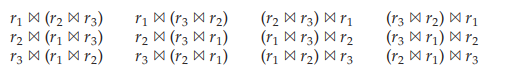

# Choice of Evaluation Plans

Generation of expressions is only part of the query-optimization process, since each operation in the expression can be implemented with different algorithms. An evaluation plan defines exactly what algorithm should be used for each op- eration, and how the execution of the operations should be coordinated.

Given an evaluation plan, we can estimate its cost using statistics estimated by the techniques in Section 13.3 coupled with cost estimates for various algorithms and evaluation methods described in Chapter 12.

A **cost-based optimizer** explores the space of all query-evaluation plans that are equivalent to the given query, and chooses the one with the least estimated cost. We have seen how equivalence rules can be used to generate equivalent plans. However, cost-based optimization with arbitrary equivalence rules is fairly complicated. We first cover a simpler version of cost-based optimization, which involves only join-order and join algorithm selection, in Section 13.4.1. Later in Section 13.4.2 we briefly sketch how a general-purpose optimizer based on equivalence rules can be built, without going into details.

Exploring the space of all possible plans may be too expensive for complex queries. Most optimizers include heuristics to reduce the cost of query optimiza- tion, at the potential risk of not finding the optimal plan. We study some such heuristics in Section 13.4.3.  

### Cost-Based Join Order Selection

The most common type of query in SQL consists of a join of a few relations, with join predicates and selections specified in the **where** clause. In this section we consider the problem of choosing the optimal join order for such a query.

For a complex join query, the number of different query plans that are equiv- alent to the query can be large. As an illustration, consider the expression:


where the joins are expressed without any ordering. With _n_ \= 3, there are 12 different join orderings:



In general, with _n_ relations, there are (2(_n_ − 1))!_/_(_n_ − 1)! different join orders. (We leave the computation of this expression for you to do in Exercise 13.10.) For joins involving small numbers of relations, this number is acceptable; for example, with _n_ \= 5, the number is 1680. However, as _n_ increases, this number rises quickly. With _n_ \= 7, the number is 665,280; with _n_ \= 10, the number is greater than 17_._6 billion!

Luckily, it is not necessary to generate all the expressions equivalent to a given expression. For example, suppose we want to find the best join order of the form:


which represents all join orders where _r_1_, r_2, and _r_3 are joined first (in some order), and the result is joined (in some order) with _r_4 and _r_5\. There are 12 different join orders for computing _r_1 _ r_2 _ r_3, and 12 orders for computing the join of this result with _r_4 and _r_5\. Thus, there appear to be 144 join orders to examine. However, once we have found the best join order for the subset of relations {_r_1_, r_2_, r_3}, we can use that order for further joins with _r_4 and _r_5, and can ignore all costlier join orders of _r_1 _ r_2 _ r_3\. Thus, instead of 144 choices to examine, we need to examine only 12 + 12 choices.

Using this idea, we can develop a _dynamic-programming_ algorithm for finding optimal join orders. Dynamic-programming algorithms store results of computa- tions and reuse them, a procedure that can reduce execution time greatly.

A recursive procedure implementing the dynamic-programming algorithm appears in Figure 13.7. The procedure applies selections on individual relations at the earliest possible point, that is, when the relations are accessed. It is easiest to understand the procedure assuming that all joins are natural joins, although the procedure works unchanged with any join condition. With arbitrary join con- ditions, the join of two subexpressions is understood to include all join conditions that relate attributes from the two subexpressions.  
```
procedure FindBestPlan(S)
if (bestplan[S].cost ≠ ∞) /* bestplan[S] already computed */
return bestplan[S]
if (S contains only 1 relation)
set bestplan[S].plan and bestplan[S].cost based on best way of accessing S
else for each non-empty subset S1 of S such that S1 ≠ S
P1 = FindBestPlan(S1)
P2 = FindBestPlan(S − S1)
A = best algorithm for joining results of P1 and P2
cost = P1.cost + P2.cost + cost of A
if cost < bestplan[S].cost
bestplan[S].cost = cost
bestplan[S].plan = “execute P1.plan; execute P2.plan;
join results of P1 and P2 using A”
```
**Figure 13.7** Dynamic-programming algorithm for join order optimization.

The procedure stores the evaluation plans it computes in an associative array _bestplan_, which is indexed by sets of relations. Each element of the associative array contains two components: the cost of the best plan of _S_, and the plan itself. The value of _bestplan_\[_S_\]_.cost_ is assumed to be initialized to ∞ if _bestplan_\[_S_\] has not yet been computed.

The procedure first checks if the best plan for computing the join of the given set of relations _S_ has been computed already (and stored in the associative array _bestplan_); if so, it returns the already computed plan.

If _S_ contains only one relation, the best way of accessing _S_ (taking selections on _S_, if any, into account) is recorded in _bestplan_. This may involve using an index to identify tuples, and then fetching the tuples (often referred to as an _index scan_), or scanning the entire relation (often referred to as a _relation scan_).1 If there is any selection condition on _S_, other than those ensured by an index scan, a selection operation is added to the plan, to ensure all selections on _S_ are satisfied.

Otherwise, if _S_ contains more than one relation, the procedure tries every way of dividing _S_ into two disjoint subsets. For each division, the procedure recursively finds the best plans for each of the two subsets, and then computes the cost of the overall plan by using that division.2 The procedure picks the cheapest plan from among all the alternatives for dividing _S_ into two sets. The cheapest plan and its cost are stored in the array _bestplan_, and returned by the procedure. The time complexity of the procedure can be shown to be _O_(3_n_) (see Practice Exercise 13.11).

Actually, the order in which tuples are generated by the join of a set of relations is also important for finding the best overall join order, since it can affect the cost of further joins (for instance, if merge join is used). A particular sort order of the tuples is said to be an **interesting sort order** if it could be useful for a later operation. For instance, generating the result of _r_1 _ r_2 _ r_3 sorted on the attributes common with _r_4 or _r_5 may be useful, but generating it sorted on the attributes common to only _r_1 and _r_2 is not useful. Using merge join for computing _r_1 _ r_2 _ r_3 may be costlier than using some other join technique, but it may provide an output sorted in an interesting sort order.

Hence, it is not sufficient to find the best join order for each subset of the set of _n_ given relations. Instead, we have to find the best join order for each subset, for each interesting sort order of the join result for that subset. The number of subsets of _n_ relations is 2 _n_. The number of interesting sort orders is generally not large. Thus, about 2 _n_ join expressions need to be stored. The dynamic-programming algorithm for finding the best join order can be easily extended to handle sort orders. The cost of the extended algorithm depends on the number of interesting orders for each subset of relations; since this number has been found to be small in practice, the cost remains at _O_ (3 _n_). With _n_ ≠ 10, this number is around 59,000, which is much better than the 17_._6 billion different join orders. More important, the storage required is much less than before, since we need to store only one join order for each interesting sort order of each of 1024 subsets of _r_1_, . . . , r_10\. Although both numbers still increase rapidly with _n_, commonly occurring joins usually have less than 10 relations, and can be handled easily.

## Cost-Based Optimization with Equivalence Rules

The join order optimization technique we just saw handles the most common class of queries, which perform an inner join of a set of relations. However, clearly many queries use other features, such as aggregation, outer join, and nested queries, which are not addressed by join order selection.

Many optimizers follow an approach based on using heuristic transforma- tions to handle constructs other than joins, and applying the cost-based join order selection algorithm to subexpressions involving only joins and selections. Details of such heuristics are for the most part specific to individual optimizers, and we do not cover them. However, heuristic transformations to handle nested queries are widely used, and are considered in more detail in Section 13.4.4.

In this section, however, we outline how to create a general-purpose cost- based optimizer based on equivalence rules, which can handle a wide variety of query constructs.

The benefit of using equivalence rules is that it is easy to extend the optimizer with new rules to handle different query constructs. For example, nested queries can be represented using extended relational-algebra constructs, and transforma- tions of nested queries can be expressed as equivalence rules. We have already seen equivalence rules with aggregation operations, and equivalence rules can also be created for outer joins.

In Section 13.2.4, we saw how an optimizer could systematically generate all expressions equivalent to the given query. The procedure for generating equiv- alent expressions can be modified to generate all possible evaluation plans as follows: A new class of equivalence rules, called **physical equivalence rules**, is added that allows a logical operation, such as a join, to be transformed to a phys- ical operation, such as a hash join, or a nested-loops join. By adding such rules to the original set of equivalence rules, the procedure can generate all possible evaluation plans. The cost estimation techniques we have seen earlier can then be used to choose the optimal (that is, the least-cost) plan.

However, the procedure shown in Section 13.2.4 is very expensive, even if we do not consider generation of evaluation plans. To make the approach work efficiently requires the following:

**1\.** A space-efficient representation of expressions that avoids making multiple copies of the same subexpressions when equivalence rules are applied.

**2\.** Efficient techniques for detecting duplicate derivations of the same expres- sion.

**3\.** A form of dynamic programming based on **memoization**, which stores the optimal query evaluation plan for a subexpression when it is optimized for the first time; subsequent requests to optimize the same subexpression are handled by returning the already memoized plan.

**4\.** Techniques that avoid generating all possible equivalent plans, by keeping track of the cheapest plan generated for any subexpression up to any point of time, and pruning away any plan that is more expensive than the cheapest plan found so far for that subexpression.

The details are more complex than we wish to deal with here. This approach was pioneered by the Volcano research project, and the query optimizer of SQL Server is based on this approach. See the bibliographical notes for references containing further information.

## Heuristics in Optimization

A drawback of cost-based optimization is the cost of optimization itself. Although the cost of query optimization can be reduced by clever algorithms, the number of different evaluation plans for a query can be very large, and finding the optimal plan from this set requires a lot of computational effort. Hence, optimizers use **heuristics** to reduce the cost of optimization.

An example of a heuristic rule is the following rule for transforming relational- algebra queries:

- Perform selection operations as early as possible.  

A heuristic optimizer would use this rule without finding out whether the cost is reduced by this transformation. In the first transformation example in Section 13.2, the selection operation was pushed into a join.

We say that the preceding rule is a heuristic because it usually, but not always, helps to reduce the cost. For an example of where it can result in an increase in cost, consider an expression σθ(_r  s_), where the condition  refers to only attributes in _s_. The selection can certainly be performed before the join. However, if _r_ is extremely small compared to _s_, and if there is an index on the join attributes of _s_, but no index on the attributes used by , then it is probably a bad idea to perform the selection early. Performing the selection early—that is, directly on _s_ —would require doing a scan of all tuples in _s_. It is probably cheaper, in this case, to compute the join by using the index, and then to reject tuples that fail the selection.

The projection operation, like the selection operation, reduces the size of relations. Thus, whenever we need to generate a temporary relation, it is advan- tageous to apply immediately any projections that are possible. This advantage suggests a companion to the “perform selections early” heuristic:

- Perform projections early.

It is usually better to perform selections earlier than projections, since selections have the potential to reduce the sizes of relations greatly, and selections enable the use of indices to access tuples. An example similar to the one used for the selection heuristic should convince you that this heuristic does not always reduce the cost.

Most practical query optimizers have further heuristics to reduce the cost of optimization. For example, many query optimizers, such as the System R opti- mizer,3 do not consider all join orders, but rather restrict the search to particular kinds of join orders. The System R optimizer considers only those join orders where the right operand of each join is one of the initial relations _r_1_, . . . , rn_. Such join orders are called **left-deep join orders**. Left-deep join orders are particularly convenient for pipelined evaluation, since the right operand is a stored relation, and thus only one input to each join is pipelined.

Figure 13.8 illustrates the difference between left-deep join trees and non-left- deep join trees. The time it takes to consider all left-deep join orders is _O_(_n_!), which is much less than the time to consider all join orders. With the use of dynamic- programming optimizations, the System R optimizer can find the best join order in time _O_(_n_ 2 _n_). Contrast this cost with the _O_(3_n_) time required to find the best overall join order. The System R optimizer uses heuristics to push selections and projections down the query tree.

A heuristic approach to reduce the cost of join-order selection, which was originally used in some versions of Oracle, works roughly this way: For an _n_\-way join, it considers _n_ evaluation plans. Each plan uses a left-deep join order, starting


**Figure 13.8** Left-deep join trees.

with a different one of the _n_ relations. The heuristic constructs the join order for each of the _n_ evaluation plans by repeatedly selecting the “best” relation to join next, on the basis of a ranking of the available access paths. Either nested-loop or sort-merge join is chosen for each of the joins, depending on the available access paths. Finally, the heuristic chooses one of the _n_ evaluation plans in a heuristic manner, on the basis of minimizing the number of nested-loop joins that do not have an index available on the inner relation and on the number of sort-merge joins.

Query-optimization approaches that apply heuristic plan choices for some parts of the query, with cost-based choice based on generation of alternative access plans on other parts of the query, have been adopted in several systems. The approach used in System R and in its successor, the Starburst project, is a hierarchical procedure based on the nested-block concept of SQL. The cost- based optimization techniques described here are used for each block of the query separately. The optimizers in several database products, such as IBM DB2 and Oracle, are based on the above approach, with extensions to handle other operations such as aggregation. For compound SQL queries (using the ∪, ∩, or − operation), the optimizer processes each component separately, and combines the evaluation plans to form the overall evaluation plan.

Most optimizers allow a cost budget to be specified for query optimization. The search for the optimal plan is terminated when the **optimization cost budget** is exceeded, and the best plan found up to that point is returned. The budget itself may be set dynamically; for example, if a cheap plan is found for a query, the budget may be reduced, on the premise that there is no point spending a lot of time optimizing the query if the best plan found so far is already quite cheap. On the other hand, if the best plan found so far is expensive, it makes sense to invest more time in optimization, which could result in a significant reduction in execution time. To best exploit this idea, optimizers usually first apply cheap heuristics to find a plan, and then start full cost-based optimization with a budget based on the heuristically chosen plan.  

Many applications execute the same query repeatedly, but with different values for the constants. For example, a university application may repeatedly execute a query to find the courses for which a student has registered, but each time for a different student with a different value for the student ID. As a heuristic, many optimizers optimize a query once, with whatever values were provided for the constants when the query was first submitted, and cache the query plan. Whenever the query is executed again, perhaps with new values for constants, the cached query plan is reused (using new values for the constants, of course). The optimal plan for the new constants may differ from the optimal plan for the initial values, but as a heuristic the cached plan is reused.4 Caching and reuse of query plans is referred to as **plan caching**.

Even with the use of heuristics, cost-based query optimization imposes a substantial overhead on query processing. However, the added cost of cost-based query optimization is usually more than offset by the saving at query-execution time, which is dominated by slow disk accesses. The difference in execution time between a good plan and a bad one may be huge, making query optimization essential. The achieved saving is magnified in those applications that run on a regular basis, where a query can be optimized once, and the selected query plan can be used each time the query is executed. Therefore, most commercial systems include relatively sophisticated optimizers. The bibliographical notes give references to descriptions of the query optimizers of actual database systems.

## Optimizing Nested Subqueries\*\*

SQL conceptually treats nested subqueries in the **where** clause as functions that take parameters and return either a single value or a set of values (possibly an empty set). The parameters are the variables from an outer level query that are used in the nested subquery (these variables are called **correlation variables**). For instance, suppose we have the following query, to find the names of all instructors who taught a course in 2007:

**select** _name_ **from** _instructor_ **where exists** (**select** \*

**from** _teaches_ **where** _instructor_._ID_ \= _teaches_._ID_

**and** _teaches_._year_ \= 2007);

Conceptually, the subquery can be viewed as a function that takes a parameter (here, _instructor_._ID_) and returns the set of all courses taught in 2007 by instructors (with the same _ID_).

SQL evaluates the overall query (conceptually) by computing the Cartesian product of the relations in the outer **from** clause and then testing the predicates in the **where** clause for each tuple in the product. In the preceding example, the predicate tests if the result of the subquery evaluation is empty.

This technique for evaluating a query with a nested subquery is called **corre- lated evaluation**. Correlated evaluation is not very efficient, since the subquery is separately evaluated for each tuple in the outer level query. A large number of random disk I/O operations may result.

SQL optimizers therefore attempt to transform nested subqueries into joins, where possible. Efficient join algorithms help avoid expensive random I/O. Where the transformation is not possible, the optimizer keeps the subqueries as separate expressions, optimizes them separately, and then evaluates them by correlated evaluation.

As an example of transforming a nested subquery into a join, the query in the preceding example can be rewritten as:

**select** _name_ 
**from** _instructor_, _teaches_ 
**where** _instructor_._ID_ \= _teaches_._ID_ **and** _teaches_._year_ \= 2007;

(To properly reflect SQL semantics, the number of duplicate derivations should not change because of the rewriting; the rewritten query can be modified to ensure this property, as we shall see shortly.)

In the example, the nested subquery was very simple. In general, it may not be possible to directly move the nested subquery relations into the **from** clause of the outer query. Instead, we create a temporary relation that contains the results of the nested query _without_ the selections using correlation variables from the outer query, and join the temporary table with the outer level query. For instance, a query of the form:

**select** _. . ._

**from** _L_ 1  
**where** _P_ 1 **and exists** (**select** \*
**from** _L_2 
**where** _P_2);

where _P_2 is a conjunction of simpler predicates, can be rewritten as:

**create table** _t_ 1 **as select distinct** _V_
**from** _L_ 2 
**where** P^1^~2~; 
**select** _. . ._
**from** _L_ 1, _t_ 1 
**where** _P_ 1 **and** P^1^~2~ ;

where P^1^~2~ contains predicates in P2 without selections involving correlation variables, and P^2^~2~ reintroduces the selections involving correlation variables (with relations referenced in the predicate appropriately renamed). Here, _V_ contains all attributes that are used in selections with correlation variables in the nested subquery.

In our example, the original query would have been transformed to:

**create table** _t_ 1 **as**
**select distinct** _ID_ 
**from** _teaches_ 
**where** _year_ \= 2007;
**select** _name_ 
**from** _instructor_, _t_ 1 
**where** _t_ 1._ID_ \= _instructor_._ID_;

The query we rewrote to illustrate creation of a temporary relation can be obtained by simplifying the above transformed query, assuming the number of duplicates of each tuple does not matter.

The process of replacing a nested query by a query with a join (possibly with a temporary relation) is called **decorrelation**.

Decorrelation is more complicated when the nested subquery uses aggrega- tion, or when the result of the nested subquery is used to test for equality, or when the condition linking the nested subquery to the outer query is **not exists**, and so on. We do not attempt to give algorithms for the general case, and instead refer you to relevant items in the bibliographical notes.

Optimization of complex nested subqueries is a difficult task, as you can infer from the above discussion, and many optimizers do only a limited amount of decorrelation. It is best to avoid using complex nested subqueries, where possible, since we cannot be sure that the query optimizer will succeed in converting them to a form that can be evaluated efficiently.

