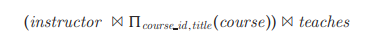

# Transformation of Relational Expressions

A query can be expressed in several different ways, with different costs of eval- uation. In this section, rather than take the relational expression as given, we consider alternative, equivalent expressions.

Two relational-algebra expressions are said to be **equivalent** if, on every legal database instance, the two expressions generate the same set of tuples. (Recall that a legal database instance is one that satisfies all the integrity constraints specified in the database schema.) Note that the order of the tuples is irrelevant; the two expressions may generate the tuples in different orders, but would be considered equivalent as long as the set of tuples is the same.

In SQL, the inputs and outputs are multisets of tuples, and the multiset version of the relational algebra (described in the box in page 238) is used for evaluating SQL queries. Two expressions in the _multiset_ version of the relational algebra are said to be equivalent if on every legal database the two expressions generate the same multiset of tuples. The discussion in this chapter is based on the relational 


algebra. We leave extensions to the multiset version of the relational algebra to you as exercises.

## Equivalence Rules

An **equivalence rule** says that expressions of two forms are equivalent. We can replace an expression of the first form by an expression of the second form, or vice versa—that is, we can replace an expression of the second form by an expression of the first form—since the two expressions generate the same result on any valid database. The optimizer uses equivalence rules to transform expressions into other logically equivalent expressions.

We now list a number of general equivalence rules on relational-algebra expressions. Some of the equivalences listed appear in Figure 13.3. We use _θ,θ1,θ2_, and so on to denote predicates, _L_ 1, _L_ 2, _L_ 3, and so on to denote lists of attributes, and _E, E_ 1,E 2, and so on to denote relational-algebra expressions. A relation name _r_ is simply a special case of a relational-algebra expression, and can be used wherever _E_ appears.

**1\.** Conjunctive selection operations can be deconstructed into a sequence of individual selections. This transformation is referred to as a cascade of σ.


**2\.** Selection operations are **commutative**.


**3\.** Only the final operations in a sequence of projection operations are needed; the others can be omitted. This transformation can also be referred to as a cascade of .


**4\.** Selections can be combined with Cartesian products and theta joins.


**5\.** Theta-join operations are commutative.


Actually, the order of attributes differs between the left-hand side and right- hand side, so the equivalence does not hold if the order of attributes is taken into account. A projection operation can be added to one of the sides of the equivalence to appropriately reorder attributes, but for simplicity we omit the projection and ignore the attribute order in most of our examples.

Recall that the natural-join operator is simply a special case of the theta-join operator; hence, natural joins are also commutative.

**6\.** a. Natural-join operations are **associative**.


b. Theta joins are associative in the following manner:


where θ2 involves attributes from only _E_2 and _E_3\. Any of these condi- tions may be empty; hence, it follows that the Cartesian product (×) operation is also associative. The commutativity and associativity of join operations are important for join reordering in query optimization.

**7\.** The selection operation distributes over the theta-join operation under the following two conditions:

a. It distributes when all the attributes in selection condition θ~0~ involve only the attributes of one of the expressions (say, _E_1) being joined.


b. It distributes when selection condition θ~1~ involves only the attributes of E 1 and θ~2~ involves only the attributes of E 2.


**8\.** The projection operation distributes over the theta-join operation under the following conditions.

a. Let L1 and L2 be attributes of E1 and E2, respectively. Suppose that the join condition  involves only attributes in L1 ∪ L2\. Then,


b. Consider a join E1  E2\. Let L1 and L2 be sets of attributes from E1 and E2, respectively. Let L3 be attributes of E1 that are involved in join condition , but are not in L1 ∪ L2, and let L4 be attributes of E2 that are involved in join condition , but are not in L1 ∪ L2\. Then,


**9\.** The set operations union and intersection are commutative.

E1 ∪ E2 = E2 ∪ E1

E1 ∩ E2 = E2 ∩ E1

Set difference is not commutative.

**10\.** Set union and intersection are associative.

(E1 ∪ E2) ∪ E3 = E1 ∪ (E2 ∪ E3)

(E1 ∩ E2) ∩ E3 = E1 ∩ (E2 ∩ E3)

**11\.** The selection operation distributes over the union, intersection, and set- difference operations.

σ~P~ (E1 − E2) = σ~P~ (E1) − σ~P~ (E2)

Similarly, the preceding equivalence, with − replaced with either ∪ or ∩, also holds. Further:

σ~P~ (E1 − E2) = σ~P~ (E1) − E2

The preceding equivalence, with − replaced by ∩, also holds, but does not hold if − is replaced by ∪.

**12\.** The projection operation distributes over the union operation.

π~L~ (E1 ∪ E2) = (π~L~(E1)) ∪ (π~L~ (E2))  


This is only a partial list of equivalences. More equivalences involving ex- tended relational operators, such as the outer join and aggregation, are discussed in the exercises.

## Examples of Transformations

We now illustrate the use of the equivalence rules. We use our university example with the relation schemas:

_instructor_(_ID_, _name_,dept name_, _salary_) 
_teaches_(_ID_, _course id_, _sec id_, _semester_, _year_) 
_course_(_course id_, _title_, _dept name_, _credits_)

In our example in Section 13.1, the expression:


was transformed into the following expression:


which is equivalent to our original algebra expression, but generates smaller intermediate relations. We can carry out this transformation by using rule 7.a. Remember that the rule merely says that the two expressions are equivalent; it does not say that one is better than the other.

Multiple equivalence rules can be used, one after the other, on a query or on parts of the query. As an illustration, suppose that we modify our original query to restrict attention to instructors who have taught a course in 2009. The new relational-algebra query is:


We cannot apply the selection predicate directly to the _instructor_ relation, since the predicate involves attributes of both the _instructor_ and _teaches_ relations. However, we can first apply rule 6.a (associativity of natural join) to transform the join

Then, using rule 7.a, we can rewrite our query as:


Let us examine the selection subexpression within this expression. Using rule 1, we can break the selection into two selections, to get the following subex- pression:


Both of the preceding expressions select tuples with _dept name_ \= “Music” and _course id_ \= 2009. However, the latter form of the expression provides a new opportunity to apply Rule 7.a (“perform selections early”), resulting in the subex- pression:


Figure 13.4 depicts the initial expression and the final expression after all these transformations. We could equally well have used rule 7.b to get the final expression directly, without using rule 1 to break the selection into two selections. In fact, rule 7.b can itself be derived from rules 1 and 7.a.

A set of equivalence rules is said to be **minimal** if no rule can be derived from any combination of the others. The preceding example illustrates that the set of equivalence rules in Section 13.2.1 is not minimal. An expression equivalent to the original expression may be generated in different ways; the number of different ways of generating an expression increases when we use a nonminimal set of equivalence rules. Query optimizers therefore use minimal sets of equivalence rules.

Now consider the following form of our example query:


When we compute the subexpression:


we obtain a relation whose schema is:

(_ID_, _name_, _dept name_, _salary_, _course id_, _sec id_, _semester_, _year_)

We can eliminate several attributes from the schema by pushing projections based on equivalence rules 8.a and 8.b. The only attributes that we must retain are those that either appear in the result of the query or are needed to process subsequent operations. By eliminating unneeded attributes, we reduce the number of columns of the intermediate result. Thus, we reduce the size of the intermediate result. In our example, the only attributes we need from the join of _instructor_ and _teaches_ are _name_ and _course id_. Therefore, we can modify the expression to:


The projection _name,course id_ reduces the size of the intermediate join results.

## Join Ordering

A good ordering of join operations is important for reducing the size of temporary results; hence, most query optimizers pay a lot of attention to the join order. As mentioned in Chapter 6 and in equivalence rule 6.a, the natural-join operation is associative. Thus, for all relations _r_1_, r_2, and _r_3:


Although these expressions are equivalent, the costs of computing them may differ. Consider again the expression:


We could choose to compute _teaches  course id ,title_ (_course_) first, and then to join the result with:


However, _teaches  course id ,title_ (_course_) is likely to be a large relation, since it contains one tuple for every course taught. In contrast:


is probably a small relation. To see that it is, we note that, since a university has a large number of departments, it is likely that only a small fraction of the university instructors are associated with the Music department. Thus, the preceding expression results in one tuple for each course taught by an instructor in the Music department. Therefore, the temporary relation that we must store is smaller than it would have been had we computed _teaches  course id ,title_ (_course_) first.

There are other options to consider for evaluating our query. We do not care about the order in which attributes appear in a join, since it is easy to change the order before displaying the result. Thus, for all relations _r_1 and _r_2:


That is, natural join is commutative (equivalence rule 5). Using the associativity and commutativity of the natural join (rules 5 and 6),

consider the following relational-algebra expression:



Note that there are no attributes in common between _course id ,title_ (_course_) and _instructor_, so the join is just a Cartesian product. If there are _a_ tuples in _instructor_ and _b_ tuples in _course id ,title_ (_course_), this Cartesian product generates _a_ ∗ _b_ tuples, one for every possible pair of instructor tuple and course (without regard for whether the instructor taught the course). This Cartesian product would produce a very large temporary relation. However, if the user had entered the preceding expression, we could use the associativity and commutativity of the natural join to transform this expression to the more efficient expression:


## Enumeration of Equivalent Expressions

Query optimizers use equivalence rules to systematically generate expressions equivalent to the given query expression. Conceptually, this can be done as out- lined in Figure 13.5. The process proceeds as follows. Given a query expression _E_ , the set of equivalent expressions _EQ_ initially contains only _E_ . Now, each expres- sion in _EQ_ is matched with each equivalence rule. If an expression, say _Ei_ , of any subexpression _ei_ of _Ei_ (which could, as a special case, be _Ei_ itself) matches one side of an equivalence rule, the optimizer generates a new expression where _ei_ is transformed to match the other side of the rule. The resultant expression is added to _EQ_. This process continues until no more new expressions can be generated.

The preceding process is extremely costly both in space and in time, but optimizers can greatly reduce both the space and time cost, using two key ideas.

**1\.** If we generate an expression _E_ ′ from an expression _E_1 by using an equiva- lence rule on subexpression _ei_ , then _E_ ′ and _E_1 have identical subexpressions  

```
procedure genAllEquivalent(E)
EQ = {E}
repeat
    Match each expression Ei in EQ with each equivalence rule Rj
    if any subexpression ei of Ei matches one side of Rj
        Create a new expression E, which is identical to Ei , except that  ei is transformed to match the other side of Rj
    Add E, to EQ if it is not already present in EQ
until no new expression can be added to EQ

```
**Figure 13.5** Procedure to generate all equivalent expressions.

except for _ei_ and its transformation. Even _ei_ and its transformed version usu- ally share many identical subexpressions. Expression-representation tech- niques that allow both expressions to point to shared subexpressions can reduce the space requirement significantly.

**2\.** It is not always necessary to generate every expression that can be generated with the equivalence rules. If an optimizer takes cost estimates of evaluation into account, it may be able to avoid examining some of the expressions, as we shall see in Section 13.4. We can reduce the time required for optimization by using techniques such as these.

We revisit these issues in Section 13.4.2.

