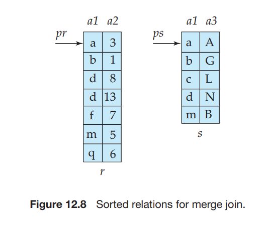

# Join Operation

In this section, we study several algorithms for computing the join of relations, and we analyze their respective costs.

We use the term **equi-join** to refer to a join of the form _r ⌈r.A_\=_s.B s_, where _A_ and _B_ are attributes or sets of attributes of relations _r_ and _s_, respectively.

We use as a running example the expression:

_student ⌈ takes_

using the same relation schemas that we used in Chapter 2. We assume the following information about the two relations:

- Number of records of _student_: _nstudent_ \= 5, 000.

- Number of blocks of _student_: _bstudent_ \= 100.

- Number of records of _takes_: _ntakes_ \= 10, 000.

- Number of blocks of _takes_: _btakes_ \= 400.

## Nested-Loop Join

Figure 12.5 shows a simple algorithm to compute the theta join, _r _⌉ _s_, of two relations _r_ and _s_. This algorithm is called the **nested-loop join** algorithm, since it basically consists of a pair of nested **for** loops. Relation _r_ is called the **outer relation** and relation _s_ the **inner relation** of the join, since the loop for _r_ encloses the loop for _s_. The algorithm uses the notation _tr_ · _ts_ , where _tr_ and _ts_ are tuples; _tr_ · _ts_ denotes the tuple constructed by concatenating the attribute values of tuples _tr_ and _ts_ .

Like the linear file-scan algorithm for selection, the nested-loop join algorithm requires no indices, and it can be used regardless of what the join condition is. Extending the algorithm to compute the natural join is straightforward, since the natural join can be expressed as a theta join followed by elimination of repeated attributes by a projection. The only change required is an extra step of deleting repeated attributes from the tuple _tr_ · _ts_ , before adding it to the result.

The nested-loop join algorithm is expensive, since it examines every pair of tuples in the two relations. Consider the cost of the nested-loop join algorithm. The number of pairs of tuples to be considered is _nr_ ∗ _ns_ , where _nr_ denotes the number of tuples in _r_ , and _ns_ denotes the number of tuples in _s_. For each record in _r_ , we have to perform a complete scan on _s_. In the worst case, the buffer can hold only one block of each relation, and a total of _nr_ ∗ _bs_ \+ _br_ block transfers would be required, where _br_ and _bs_ denote the number of blocks containing tuples of _r_ and _s_, respectively. We need only one seek for each scan on the inner relation _s_ since it is read sequentially, and a total of _br_ seeks to read _r_ , leading to a total of _nr_ \+ _br_ seeks. In the best case, there is enough space for both relations to fit simultaneously in memory, so each block would have to be read only once; hence, only _br_ \+ _bs_ block transfers would be required, along with 2 seeks.

```
for each tuple tr in r 
do begin for each tuple ts in s do begin
test pair (tr , ts) to see if they satisfy the join condition  if they do, add tr · ts to the result;
end 
end
```

**Figure 12.5** Nested-loop join.

```
for each block Br of r do begin 
for each block Bs of s do begin
for each tuple tr in Br do begin 
for each tuple ts in Bs do begin
test pair (tr , ts) to see if they satisfy the join condition if they do, add tr · ts to the result;
end
end
end 
end
```
**Figure 12.6** Block nested-loop join.

If one of the relations fits entirely in main memory, it is beneficial to use that relation as the inner relation, since the inner relation would then be read only once. Therefore, if _s_ is small enough to fit in main memory, our strategy requires only a total _br_ \+ _bs_ block transfers and 2 seeks—the same cost as that for the case where both relations fit in memory.

Now consider the natural join of _student_ and _takes_. Assume for now that we have no indices whatsoever on either relation, and that we are not willing to create any index. We can use the nested loops to compute the join; assume that _student_ is the outer relation and _takes_ is the inner relation in the join. We will have to examine 5000 ∗ 10_,_ 000 = 50 ∗ 106 pairs of tuples. In the worst case, the number of block transfers is 5000∗400+100 = 2,000,100, plus 5000+100 = 5100 seeks. In the best- case scenario, however, we can read both relations only once, and perform the computation. This computation requires at most 100 + 400 = 500 block transfers, plus 2 seeks—a significant improvement over the worst-case scenario. If we had used _takes_ as the relation for the outer loop and _student_ for the inner loop, the worst-case cost of our final strategy would have been 10,000 ∗ 100 + 400 = 1,000,400 block transfers, plus 10,400 disk seeks. The number of block transfers is significantly less, and although the number of seeks is higher, the overall cost is reduced, assuming _tS_ \= 4 milliseconds and _tT_ \= _0_._1_ milliseconds.

## Block Nested-Loop Join

If the buffer is too small to hold either relation entirely in memory, we can still obtain a major saving in block accesses if we process the relations on a per-block basis, rather than on a per-tuple basis. Figure 12.6 shows **block nested-loop join**, which is a variant of the nested-loop join where every block of the inner relation is paired with every block of the outer relation. Within each pair of blocks, every tuple in one block is paired with every tuple in the other block, to generate all pairs of tuples. As before, all pairs of tuples that satisfy the join condition are added to the result.

The primary difference in cost between the block nested-loop join and the basic nested-loop join is that, in the worst case, each block in the inner relation _s_ is read only once for each _block_ in the outer relation, instead of once for each _tuple_  in the outer relation. Thus, in the worst case, there will be a total of _br_ ∗ _bs_ \+ _br_ block transfers, where _br_ and _bs_ denote the number of blocks containing records of _r_ and _s_, respectively. Each scan of the inner relation requires one seek, and the scan of the outer relation requires one seek per block, leading to a total of 2 ∗ _br_ seeks. Clearly, it is more efficient to use the smaller relation as the outer relation, in case neither of the relations fits in memory. In the best case, where the inner relation fits in memory, there will be _br_ \+ _bs_ block transfers and just 2 seeks (we would choose the smaller relation as the inner relation in this case).

Now return to our example of computing _student  takes_ , using the block nested-loop join algorithm. In the worst case, we have to read each block of _takes_ once for each block of _student_. Thus, in the worst case, a total of 100 ∗ 400 + 100 = 40,100 block transfers plus 2∗100 = 200 seeks are required. This cost is a significant improvement over the 5000∗400+100 = 2,000,100 block transfers plus 5100 seeks needed in the worst case for the basic nested-loop join. The best-case cost remains the same—namely, 100 + 400 = 500 block transfers and 2 seeks.

The performance of the nested-loop and block nested-loop procedures can be further improved:

- If the join attributes in a natural join or an equi-join form a key on the inner relation, then for each outer relation tuple the inner loop can terminate as soon as the first match is found.

- In the block nested-loop algorithm, instead of using disk blocks as the block- ing unit for the outer relation, we can use the biggest size that can fit in memory, while leaving enough space for the buffers of the inner relation and the output. In other words, if memory has _M_ blocks, we read in _M_− 2 blocks of the outer relation at a time, and when we read each block of the inner relation we join it with all the _M_ − 2 blocks of the outer relation. This change reduces the number of scans of the inner relation from _br_ to L_br /_(_M_ − 2)⅃, where _br_ is the number of blocks of the outer relation. The total cost is then L_br/_(_M_ − 2)⅃ ∗ _bs_ \+ _br_ block transfers and 2L_br/_(_M_ − 2)⅃ seeks.

- We can scan the inner loop alternately forward and backward. This scanning method orders the requests for disk blocks so that the data remaining in the buffer from the previous scan can be reused, thus reducing the number of disk accesses needed.

- If an index is available on the inner loop’s join attribute, we can replace file scans with more efficient index lookups. Section 12.5.3 describes this optimization.

## Indexed Nested-Loop Join

In a nested-loop join (Figure 12.5), if an index is available on the inner loop’s join attribute, index lookups can replace file scans. For each tuple _tr_ in the outer relation _r_, the index is used to look up tuples in _s_ that will satisfy the join condition with tuple _tr_ .  

This join method is called an **indexed nested-loop join**; it can be used with existing indices, as well as with temporary indices created for the sole purpose of evaluating the join.

Looking up tuples in _s_ that will satisfy the join conditions with a given tuple _tr_ is essentially a selection on _s_. For example, consider _student  takes_ . Suppose that we have a _student_ tuple with _ID_ “00128”. Then, the relevant tuples in _takes_ are those that satisfy the selection “_ID_ \= 00128”.

The cost of an indexed nested-loop join can be computed as follows: For each tuple in the outer relation _r_ , a lookup is performed on the index for _s_, and the relevant tuples are retrieved. In the worst case, there is space in the buffer for only one block of _r_ and one block of the index. Then, _br_ I/O operations are needed to read relation _r_ , where _br_ denotes the number of blocks containing records of _r_ ; each I/O requires a seek and a block transfer, since the disk head may have moved in between each I/O. For each tuple in _r_ , we perform an index lookup on _s_. Then, the time cost of the join can be computed as _br_ (_tT_ \+ _tS_) + _nr_ ∗ _c_, where _nr_ is the number of records in relation _r_ , and _c_ is the cost of a single selection on _s_ using the join condition. We have seen in Section 12.3 how to estimate the cost of a single selection algorithm (possibly using indices); that estimate gives us the value of _c_.

The cost formula indicates that, if indices are available on both relations _r_ and _s_, it is generally most efficient to use the one with fewer tuples as the outer relation.

For example, consider an indexed nested-loop join of _student  takes_ , with _student_ as the outer relation. Suppose also that _takes_ has a primary B+-tree index on the join attribute _ID_, which contains 20 entries on average in each index node. Since _takes_ has 10,000 tuples, the height of the tree is 4, and one more access is needed to find the actual data. Since _nstudent_ is 5000, the total cost is 100+5000∗5 = 25,100 disk accesses, each of which requires a seek and a block transfer. In contrast, as we saw before, 40,100 block transfers plus 200 seeks were needed for a block nested- loop join. Although the number of block transfers has been reduced, the seek cost has actually increased, increasing the total cost since a seek is considerably more expensive than a block transfer. However, if we had a selection on the _student_ relation that reduces the number of rows significantly, indexed nested-loop join could be significantly faster than block nested-loop join.

## Merge Join

The **merge-join** algorithm (also called the **sort-merge-join** algorithm) can be used to compute natural joins and equi-joins. Let _r_ (_R_) and _s_(_S_) be the relations whose natural join is to be computed, and let _R_ ∩ _S_ denote their common attributes. Suppose that both relations are sorted on the attributes _R_ ∩ _S_. Then, their join can be computed by a process much like the merge stage in the merge–sort algorithm.

### Merge-Join Algorithm

Figure 12.7 shows the merge-join algorithm. In the algorithm, _JoinAttrs_ refers to the attributes in _R_ ∩ _S_, and _tr  ts_ , where _tr_ and _ts_ are tuples that have the same 
```
pr := address of first tuple of r;
ps := address of first tuple of s;
    while (ps≠null and pr≠null) do
        begin
            ts := tuple to which ps points;
            Ss := {ts};
            set ps to point to next tuple of s;
            done := false;
            while (not done and ps≠null) do
                begin
                    ts':= tuple to which ps points;
                    if (ts'[JoinAttrs] = ts[JoinAttrs])
                        then begin  
                            Ss := Ss ∪ {ts'};
                            set ps to point to next tuple of s;
                        end
                    else done := true;
                end
    tr := tuple to which pr points;
    while (pr ≠ null and tr[JoinAttrs] < ts[JoinAttrs]) do
        begin
            set pr to point to next tuple of r;
            tr := tuple to which pr points;
        end
    while (pr ≠  null and tr[JoinAttrs] = ts[JoinAttrs]) do
        begin
            for each ts in Ss do
                begin
            add  tr to result;
        end
    set pr to point to next tuple of r;
    tr := tuple to which pr points;
    end
end.

```
**Figure 12.7** Merge join.

values for _JoinAttrs_, denotes the concatenation of the attributes of the tuples, fol- lowed by projecting out repeated attributes. The merge-join algorithm associates one pointer with each relation. These pointers point initially to the first tuple of the respective relations. As the algorithm proceeds, the pointers move through the relation. A group of tuples of one relation with the same value on the join attributes is read into _Ss_ . The algorithm in Figure 12.7 _requires_ that every set of tuples _Ss_ fit in main memory; we discuss extensions of the algorithm to avoid this requirement shortly. Then, the corresponding tuples (if any) of the other relation are read in, and are processed as they are read.  



**Figure 12.8** Sorted relations for merge join.

Figure 12.8 shows two relations that are sorted on their join attribute _a_1\. It is instructive to go through the steps of the merge-join algorithm on the relations shown in the figure.

The merge-join algorithm of Figure 12.7 requires that each set _Ss_ of all tuples with the same value for the join attributes must fit in main memory. This require- ment can usually be met, even if the relation _s_ is large. If there are some join attribute values for which _Ss_ is larger than available memory, a block nested-loop join can be performed for such sets _Ss_ , matching them with corresponding blocks of tuples in _r_ with the same values for the join attributes.

If either of the input relations _r_ and _s_ is not sorted on the join attributes, they can be sorted first, and then the merge-join algorithm can be used. The merge-join algorithm can also be easily extended from natural joins to the more general case of equi-joins.

### Cost Analysis

Once the relations are in sorted order, tuples with the same value on the join attributes are in consecutive order. Thereby, each tuple in the sorted order needs to be read only once, and, as a result, each block is also read only once. Since it makes only a single pass through both files (assuming all sets _Ss_ fit in memory) the merge-join method is efficient; the number of block transfers is equal to the sum of the number of blocks in both files, _br_ \+ _bs_ .

Assuming that _bb_ buffer blocks are allocated to each relation, the number of disk seeks required would be ⌈ _br_/_bb_ ⌈ + ⌈ _bs_/_bb_ ⌈ disk seeks. Since seeks are much more expensive than data transfer, it makes sense to allocate multiple buffer blocks to each relation, provided extra memory is available. For example, with _tT_ \= 0_._1 milliseconds per 4-kilobyte block, and _tS_ \= 4 milliseconds, the buffer size is 400 blocks (or 1.6 megabytes), so the seek time would be 4 milliseconds for every 40 milliseconds of transfer time, in other words, seek time would be just 10 percent of the transfer time. 

If either of the input relations _r_ and _s_ is not sorted on the join attributes, they must be sorted first; the cost of sorting must then be added to the above costs. If some some sets _Ss_ do not fit in memory, the cost would increase slightly.

Suppose the merge-join scheme is applied to our example of _student  takes_ . The join attribute here is _ID_. Suppose that the relations are already sorted on the join attribute _ID_. In this case, the merge join takes a total of 400 + 100 = 500 block transfers. If we assume that in the worst case only one buffer block is allocated to each input relation (that is, _bb_ \= 1), a total of 400 + 100 = 500 seeks would also be required; in reality _bb_ can be set much higher since we need to buffer blocks for only two relations, and the seek cost would be significantly less.

Suppose the relations are not sorted, and the memory size is the worst case, only three blocks. The cost is as follows:

**1\.** Using the formulae that we developed in Section 12.4, we can see that sorting relation _takes_ requires ⌈log3−1(400_/_3) ⌈ = 8 merge passes. Sorting of relation _takes_ then takes 400 ∗ (2⌈log3−1(400_/_3) ⌈ + 1), or 6800, block transfers, with 400 more transfers to write out the result. The number of seeks required is 2 ∗ ⌈400_/_3⌈ + 400 ∗ (2 ∗ 8 − 1) or 6268 seeks for sorting, and 400 seeks for writing the output, for a total of 6668 seeks, since only one buffer block is available for each run.

**2\.** Similarly, sorting relation _student_ takes ⌈log3−1(100_/_3)⌈ = 6 merge passes and 100 ∗ (2Llog3−1(100_/_3)⌈ + 1), or 1300, block transfers, with 100 more transfers to write it out. The number of seeks required for sorting _student_ is 2 ∗ ⌈100_/_3⌈ + 100 ∗ (2 ∗ 6 − 1) = 1164, and 100 seeks are required for writing the output, for a total of 1264 seeks.

**3\.** Finally, merging the two relations takes 400 + 100 = 500 block transfers and 500 seeks.

Thus, the total cost is 9100 block transfers plus 8932 seeks if the relations are not sorted, and the memory size is just 3 blocks.

With a memory size of 25 blocks, and the relations not sorted, the cost of sorting followed by merge join would be as follows:

**1\.** Sorting the relation _takes_ can be done with just one merge step, and takes a total of just 400 ∗ (2Llog24(400_/_25)⅃ + 1) = 1200 block transfers. Similarly, sorting _student_ takes 300 block transfers. Writing the sorted output to disk requires 400 + 100 = 500 block transfers, and the merge step requires 500 block transfers to read the data back. Adding up these costs gives a total cost of 2500 block transfers.

**2\.** If we assume that only one buffer block is allocated for each run, the number of seeks required in this case is 2∗L400_/_25⅃+400+400 = 832 seeks for sorting _takes_ and writing the sorted output to disk, and similarly 2∗L100_/_25⅃+100+ 100 = 208 for _student_, plus 400 + 100 seeks for reading the sorted data in the merge-join step. Adding up these costs gives a total cost of 1640 seeks.  

The number of seeks can be significantly reduced by setting aside more buffer blocks for each run. For example, if 5 buffer blocks are allocated for each run and for the output from merging the 4 runs of _student_, the cost is reduced to 2 ∗ L100_/_25⅃ + L100_/_5⅃ + L100_/_5⅃ = 48 seeks, from 208 seeks. If the merge-join step sets aside 12 blocks each for buffering _takes_ and _student_, the number of seeks for the merge-join step goes down to L400_/_12⅃ + L100_/_12⅃ = 43, from 500. The total number of seeks is then 251.

Thus, the total cost is 2500 block transfers plus 251 seeks if the relations are not sorted, and the memory size is 25 blocks.

### Hybrid Merge Join

It is possible to perform a variation of the merge-join operation on unsorted tuples, if secondary indices exist on both join attributes. The algorithm scans the records through the indices, resulting in their being retrieved in sorted order. This variation presents a significant drawback, however, since records may be scattered throughout the file blocks. Hence, each tuple access could involve accessing a disk block, and that is costly.

To avoid this cost, we can use a hybrid merge-join technique that combines indices with merge join. Suppose that one of the relations is sorted; the other is unsorted, but has a secondary B+-tree index on the join attributes. The **hybrid merge-join algorithm** merges the sorted relation with the leaf entries of the secondary B+-tree index. The result file contains tuples from the sorted relation and addresses for tuples of the unsorted relation. The result file is then sorted on the addresses of tuples of the unsorted relation, allowing efficient retrieval of the corresponding tuples, in physical storage order, to complete the join. Extensions of the technique to handle two unsorted relations are left as an exercise for you.

## Hash Join

Like the merge-join algorithm, the hash-join algorithm can be used to implement natural joins and equi-joins. In the hash-join algorithm, a hash function _h_ is used to partition tuples of both relations. The basic idea is to partition the tuples of each of the relations into sets that have the same hash value on the join attributes.

We assume that:

- _h_ is a hash function mapping _JoinAttrs_ values to {0_,_ 1_, . . . , nh_}, where _JoinAttrs_ denotes the common attributes of _r_ and _s_ used in the natural join.

- _r_0, _r_1_, . . . , rnh_ denote partitions of _r_ tuples, each initially empty. Each tuple _tr_ ∈ _r_ is put in partition _ri_ , where _i_ = _h_(_tr_ [JoinAttrs]).

- _s_0, _s_1_, ..., snh_ denote partitions of _s_ tuples, each initially empty. Each tuple _ts_ ∈ _s_ is put in partition _si_ , where _i_ \= _h_(_ts_\[_JoinAttrs_]).  


The hash function _h_ should have the “goodness” properties of randomness and uniformity that we discussed in Chapter 11. Figure 12.9 depicts the partitioning of the relations.

### Basics

The idea behind the hash-join algorithm is this: Suppose that an _r_ tuple and an _s_ tuple satisfy the join condition; then, they have the same value for the join attributes. If that value is hashed to some value _i_ , the _r_ tuple has to be in _ri_ and the _s_ tuple in _si_ . Therefore, _r_ tuples in _ri_ need only to be compared with _s_ tuples in _si_ ; they do not need to be compared with _s_ tuples in any other partition.

For example, if _d_ is a tuple in _student_, _c_ a tuple in _takes_, and _h_ a hash function on the _ID_ attributes of the tuples, then _d_ and _c_ must be tested only if _h_(_c_) = _h_(_d_). If _h_(_c_) ≠ _h_(_d_), then _c_ and _d_ must have different values for _ID_. However, if _h_(_c_) = _h_(_d_), we must test _c_ and _d_ to see whether the values in their join attributes are the same, since it is possible that _c_ and _d_ have different _iid_s that have the same hash value.

Figure 12.10 shows the details of the **hash-join** algorithm to compute the natural join of relations _r_ and _s_. As in the merge-join algorithm, _tr  ts_ denotes the concatenation of the attributes of tuples _tr_ and _ts_ , followed by projecting out repeated attributes. After the partitioning of the relations, the rest of the hash-join code performs a separate indexed nested-loop join on each of the partition pairs _i_ , for _i_ \= 0_, . . . , nh_ . To do so, it first **builds** a hash index on each _si_ , and then **probes** (that is, looks up _si_ ) with tuples from _ri_ . The relation _s_ is the **build input**, and _r_ is the **probe input**.

The hash index on _si_ is built in memory, so there is no need to access the disk to retrieve the tuples. The hash function used to build this hash index must be different from the hash function _h_ used earlier, but is still applied to only the join
```
/* Partition s */
for each tuple ts in s do begin
    i := h(ts[JoinAttrs]);
    Hsi := Hsi ∪ {ts};
end
/* Partition r */
for each tuple tr in r do begin
    i := h(tr[JoinAttrs]);
    Hri := Hri ∪ {tr};
end
/* Perform join on each partition */
for i := 0 to nh do begin
    read Hsi and build an in-memory hash index on it;
    for each tuple tr in Hri do begin
        probe the hash index on Hsi to locate all tuples ts
            such that ts[JoinAttrs] = tr[JoinAttrs];
        for each matching tuple ts in Hsi do begin
            add tr ✶ ts to the result;
        end
    end
end

```
**Figure 12.10** Hash join.

attributes. In the course of the indexed nested-loop join, the system uses this hash index to retrieve records that match records in the probe input.

The build and probe phases require only a single pass through both the build and probe inputs. It is straightforward to extend the hash-join algorithm to compute general equi-joins.

The value _nh_ must be chosen to be large enough such that, for each _i_ , the tuples in the partition _si_ of the build relation, along with the hash index on the partition, fit in memory. It is not necessary for the partitions of the probe relation to fit in memory. Clearly, it is best to use the smaller input relation as the build relation. If the size of the build relation is _bs_ blocks, then, for each of the _nh_ partitions to be of size less than or equal to _M_, _nh_ must be at least L_bs/M_⅃. More precisely stated, we have to account for the extra space occupied by the hash index on the partition as well, so _nh_ should be correspondingly larger. For simplicity, we sometimes ignore the space requirement of the hash index in our analysis.

### Recursive Partitioning

If the value of _nh_ is greater than or equal to the number of blocks of memory, the relations cannot be partitioned in one pass, since there will not be enough buffer blocks. Instead, partitioning has to be done in repeated passes. In one pass, the input can be split into at most as many partitions as there are blocks available for use as output buffers. Each bucket generated by one pass is separately read in and partitioned again in the next pass, to create smaller partitions. The hash function used in a pass is, of course, different from the one used in the previous pass. The system repeats this splitting of the input until each partition of the build input fits in memory. Such partitioning is called **recursive partitioning**.

A relation does not need recursive partitioning if M > nh + 1, or equivalently M > (bs/M) + 1, which simplifies (approximately) to M > √bs. For example, consider a memory size of 12 megabytes, divided into 4-kilobyte blocks; it would contain a total of 3K (3072) blocks. We can use a memory of this size to partition relations of size up to 3K ∗ 3K blocks, which is 36 gigabytes. Similarly, a relation of size 1 gigabyte requires just over √256K blocks, or 2 megabytes, to avoid recursive partitioning.


### Handling of Overflows

**Hash-table overflow** occurs in partition _i_ of the build relation _s_ if the hash index on _si_ is larger than main memory. Hash-table overflow can occur if there are many tuples in the build relation with the same values for the join attributes, or if the hash function does not have the properties of randomness and uniformity. In either case, some of the partitions will have more tuples than the average, whereas others will have fewer; partitioning is then said to be **skewed**.

We can handle a small amount of skew by increasing the number of parti- tions so that the expected size of each partition (including the hash index on the partition) is somewhat less than the size of memory. The number of partitions is therefore increased by a small value, called the **fudge factor**, that is usually about 20 percent of the number of hash partitions computed as described in Section 12.5.5.

Even if, by using a fudge factor, we are conservative on the sizes of the par- titions, overflows can still occur. Hash-table overflows can be handled by either _overflow resolution_ or _overflow avoidance_. **Overflow resolution** is performed during the build phase, if a hash-index overflow is detected. Overflow resolution pro- ceeds in this way: If _si_ , for any _i_ , is found to be too large, it is further partitioned into smaller partitions by using a different hash function. Similarly, _ri_ is also par- titioned using the new hash function, and only tuples in the matching partitions need to be joined.

In contrast, **overflow avoidance** performs the partitioning carefully, so that overflows never occur during the build phase. In overflow avoidance, the build relation _s_ is initially partitioned into many small partitions, and then some par- titions are combined in such a way that each combined partition fits in memory. The probe relation _r_ is partitioned in the same way as the combined partitions on _s_, but the sizes of _ri_ do not matter.

If a large number of tuples in _s_ have the same value for the join attributes, the resolution and avoidance techniques may fail on some partitions. In that case, instead of creating an in-memory hash index and using a nested-loop join to join the partitions, we can use other join techniques, such as block nested-loop join, on those partitions.  

### Cost of Hash Join

We now consider the cost of a hash join. Our analysis assumes that there is no hash-table overflow. First, consider the case where recursive partitioning is not required.

- The partitioning of the two relations _r_ and _s_ calls for a complete reading of both relations, and a subsequent writing back of them. This operation requires 2(_br_ \+ _bs_) block transfers, where _br_ and _bs_ denote the number of blocks containing records of relations _r_ and _s_, respectively. The build and probe phases read each of the partitions once, calling for further _br_ \+ _bs_ block transfers. The number of blocks occupied by partitions could be slightly more than _br_ +_bs_ , as a result of partially filled blocks. Accessing such partially filled blocks can add an overhead of at most 2_nh_ for each of the relations, since each of the _nh_ partitions could have a partially filled block that has to be written and read back. Thus, a hash join is estimated to require:

3(_br_ \+ _bs_) + 4n~h~

block transfers. The overhead 4_nh_ is usually quite small compared to _br_ \+ _bs_ , and can be ignored.

- Assuming _bb_ blocks are allocated for the input buffer and each output buffer, partitioning requires a total of 
2(L_br/bb_⅃+L_bs/bb_⅃) seeks. 

The build and probe phases require only one seek for each of the _nh_ partitions of each relation, since each partition can be read sequentially. The hash join thus requires 

2(L_br/bb_⅃ + L_bs/bb_⅃) + 2_nh_ seeks.

Now consider the case where recursive partitioning is required. Each pass reduces the size of each of the partitions by an expected factor of _M_ − 1; and passes are repeated until each partition is of size at most _M_ blocks. The expected number of passes required for partitioning _s_ is therefore Llog_M_−1(_bs_) − 1⅃.

- Since, in each pass, every block of _s_ is read in and written out, the total block transfers for partitioning of _s_ is 2_bs_Llog_M_−1(_bs_) − 1⅃. The number of passes for partitioning of _r_ is the same as the number of passes for partitioning of _s_, therefore the join is estimated to require:

2(_br_ \+ _bs_)Llog_M_−1(_bs_) − 1⅃ + _br_ \+ _bs_

block transfers.

- Again assuming _bb_ blocks are allocated for buffering each partition, and ignoring the relatively small number of seeks during the build and probe phase, hash join with recursive partitioning requires:

2(L_br/bb_⅃ + L_bs/bb_⅃)Llog_M_−1(_bs_) − 1⅃ disk seeks.  


Consider, for example, the natural join _takes  student_ . With a memory size of 20 blocks, the _student_ relation can be partitioned into five partitions, each of size 20 blocks, which size will fit into memory. Only one pass is required for the partitioning. The relation _takes_ is similarly partitioned into five partitions, each of size 80. Ignoring the cost of writing partially filled blocks, the cost is 3(100 + 400) = 1500 block transfers. There is enough memory to allocate 3 buffers for the input and each of the 5 outputs during partitioning, leading to 2(L100_/_3⅃+ L400_/_3⅃) = 336 seeks.

The hash join can be improved if the main-memory size is large. When the entire build input can be kept in main memory, _nh_ can be set to 0; then, the hash- join algorithm executes quickly, without partitioning the relations into temporary files, regardless of the probe input’s size. The cost estimate goes down to _br_ \+ _bs_ block transfers and two seeks.

### Hybrid Hash Join

The **hybrid hash-join** algorithm performs another optimization; it is useful when memory sizes are relatively large, but not all of the build relation fits in memory. The partitioning phase of the hash-join algorithm needs a minimum of one block of memory as a buffer for each partition that is created, and one block of memory as an input buffer. To reduce the impact of seeks, a larger number of blocks would be used as a buffer; let _bb_ denote the number of blocks used as a buffer for the input and for each partition. Hence, a total of (_nh_ \+ 1) ∗ _bb_ blocks of memory are needed for partitioning the two relations. If memory is larger than (_nh_ \+ 1) ∗ _bb_ , we can use the rest of memory (_M_ − (_nh_ +1)∗ _bb_ blocks) to buffer the first partition of the build input (that is, _s_ 0), so that it will not need to be written out and read back in. Further, the hash function is designed in such a way that the hash index on _s_ 0 fits in _M_ − ( _nh_ \+ 1) ∗ _bb_ blocks, in order that, at the end of partitioning of _s_, _s_ 0 is completely in memory and a hash index can be built on _s_ 0.

When the system partitions _r_ it again does not write tuples in _r_ 0 to disk; instead, as it generates them, the system uses them to probe the memory-resident hash index on _s_ 0, and to generate output tuples of the join. After they are used for probing, the tuples can be discarded, so the partition _r_ 0 does not occupy any memory space. Thus, a write and a read access have been saved for each block of both _r_ 0 and _s_ 0\. The system writes out tuples in the other partitions as usual, and joins them later. The savings of hybrid hash join can be significant if the build input is only slightly bigger than memory.

If the size of the build relation is _bs_ , _nh_ is approximately equal to _bs/M_. Thus, hybrid hash join is most useful if M >> (b~s~/M) ∗ b~b~ , or M >> √b~s~ ∗ b~b~ , where the notation _\>>_ denotes _much larger than_. For example, suppose the block size is 4 kilobytes, the build relation size is 5 gigabytes, and _bb_ is 20. Then, the hybrid hash-join algorithm is useful if the size of memory is significantly more than 20 megabytes; memory sizes of gigabytes or more are common on computers today. If we devote 1 gigabyte for the join algorithm, _s_0 would be nearly 1 gigabyte, and hybrid hash join would be nearly 20 percent cheaper than hash join. 

## Complex Joins

Nested-loop and block nested-loop joins can be used regardless of the join condi- tions. The other join techniques are more efficient than the nested-loop join and its variants, but can handle only simple join conditions, such as natural joins or equi-joins. We can implement joins with complex join conditions, such as con- junctions and disjunctions, by using the efficient join techniques, if we apply the techniques developed in Section 12.3.3 for handling complex selections.

Consider the following join with a conjunctive condition:


One or more of the join techniques described earlier may be applicable for joins on the individual conditions, and so on. We can compute the overall join by first computing the result of one of these simpler joins _r __i s_; each pair of tuples in the intermediate result consists of one tuple from _r_ and one from _s_. The result of the complete join consists of those tuples in the intermediate result that satisfy the remaining conditions:


These conditions can be tested as tuples in _r __i s_ are being generated. A join whose condition is disjunctive can be computed in this way. Consider:


The join can be computed as the union of the records in individual joins :


Section 12.6 describes algorithms for computing the union of relations.

