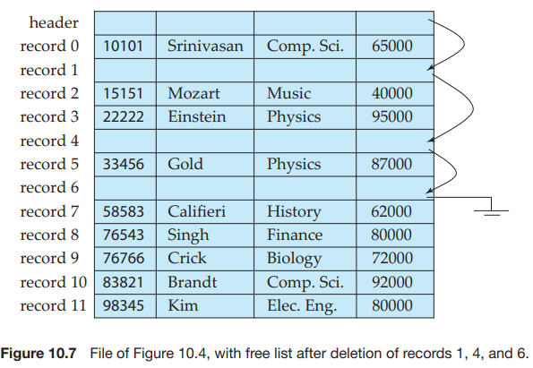
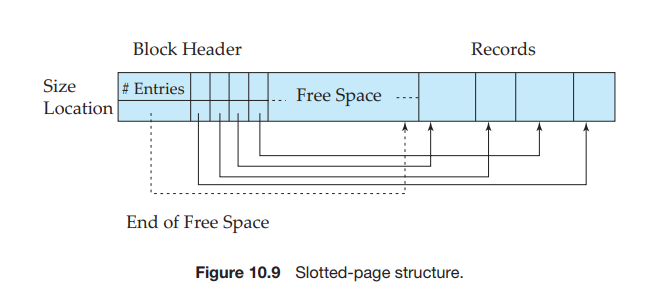

# File Organization

A database is mapped into a number of different files that are maintained by the underlying operating system. These files reside permanently on disks. A **file** is organized logically as a sequence of records. These records are mapped onto disk blocks. Files are provided as a basic construct in operating systems, so we shall assume the existence of an underlying _file system_. We need to consider ways of representing logical data models in terms of files.

Each file is also logically partitioned into fixed-length storage units called **blocks**, which are the units of both storage allocation and data transfer. Most databases use block sizes of 4 to 8 kilobytes by default, but many databases allow the block size to be specified when a database instance is created. Larger block sizes can be useful in some database applications.

A block may contain several records; the exact set of records that a block contains is determined by the form of physical data organization being used. We shall assume that _no record is larger than a block_. This assumption is realistic for most data-processing applications, such as our university example. There are certainly several kinds of large data items, such as images, that can be significantly larger than a block. We briefly discuss how to handle such large data items later, in Section 10.5.2, by storing large data items separately, and storing a pointer to the data item in the record.

In addition, we shall require that _each record is entirely contained in a single block_; that is, no record is contained partly in one block, and partly in another. This restriction simplifies and speeds up access to data items.

In a relational database, tuples of distinct relations are generally of different sizes. One approach to mapping the database to files is to use several files, and to store records of only one fixed length in any given file. An alternative is to structure our files so that we can accommodate multiple lengths for records; however, files of fixed-length records are easier to implement than are files of variable-length records. Many of the techniques used for the former can be applied to the variable-length case. Thus, we begin by considering a file of fixed-length records, and consider storage of variable-length records later.

## Fixed-Length Records

As an example, let us consider a file of _instructor_ records for our university database. Each record of this file is defined (in pseudocode) as:

**type** _instructor_ \= **record** 
_ID_ **varchar** (5); 
_name_ **varchar**(20); 
_dept name_ **varchar** (20); 
_salary_ **numeric** (8,2);
**end**

Assume that each character occupies 1 byte and that numeric (8,2) occupies 8 bytes. Suppose that instead of allocating a variable amount of bytes for the attributes _ID_, _name_, and _dept name_, we allocate the maximum number of bytes that each attribute can hold. Then, the _instructor_ record is 53 bytes long. A simple approach is to use the first 53 bytes for the first record, the next 53 bytes for the second record, and so on (Figure 10.4). However, there are two problems with this simple approach:

**1\.** Unless the block size happens to be a multiple of 53 (which is unlikely), some records will cross block boundaries. That is, part of the record will be stored in one block and part in another. It would thus require two block accesses to read or write such a record.

**2\.** It is difficult to delete a record from this structure. The space occupied by the record to be deleted must be filled with some other record of the file, or we must have a way of marking deleted records so that they can be ignored.  

To avoid the first problem, we allocate only as many records to a block as would fit entirely in the block (this number can be computed easily by dividing the block size by the record size, and discarding the fractional part). Any remaining bytes of each block are left unused.

When a record is deleted, we could move the record that came after it into the space formerly occupied by the deleted record, and so on, until every record fol- lowing the deleted record has been moved ahead (Figure 10.5). Such an approach requires moving a large number of records. It might be easier simply to move the final record of the file into the space occupied by the deleted record (Figure 10.6).

It is undesirable to move records to occupy the space freed by a deleted record, since doing so requires additional block accesses. Since insertions tend to be more frequent than deletions, it is acceptable to leave open the space occupied by the

**Figure 10.5** File of Figure 10.4, with record 3 deleted and all records moved. 

deleted record, and to wait for a subsequent insertion before reusing the space. A simple marker on a deleted record is not sufficient, since it is hard to find this available space when an insertion is being done. Thus, we need to introduce an additional structure.

At the beginning of the file, we allocate a certain number of bytes as a **file header**. The header will contain a variety of information about the file. For now, all we need to store there is the address of the first record whose contents are deleted. We use this first record to store the address of the second available record, and so on. Intuitively, we can think of these stored addresses as _pointers_, since they point to the location of a record. The deleted records thus form a linked list, which is often referred to as a **free list**. Figure 10.7 shows the file of Figure 10.4, with the free list, after records 1, 4, and 6 have been deleted.

On insertion of a new record, we use the record pointed to by the header. We change the header pointer to point to the next available record. If no space is available, we add the new record to the end of the file.

Insertion and deletion for files of fixed-length records are simple to imple- ment, because the space made available by a deleted record is exactly the space needed to insert a record. If we allow records of variable length in a file, this match no longer holds. An inserted record may not fit in the space left free by a deleted record, or it may fill only part of that space.

## Variable-Length Records*
Variable-length records arise in database systems in several ways:

- Storage of multiple record types in a file.

- Record types that allow variable lengths for one or more fields.

- Record types that allow repeating fields, such as arrays or multisets.  

Different techniques for implementing variable-length records exist. Two different problems must be solved by any such technique:

- How to represent a single record in such a way that individual attributes can be extracted easily.

- How to store variable-length records within a block, such that records in a block can be extracted easily.

The representation of a record with variable-length attributes typically has two parts: an initial part with fixed length attributes, followed by data for variable- length attributes. Fixed-length attributes, such as numeric values, dates, or fixed- length character strings are allocated as many bytes as required to store their value. Variable-length attributes, such as varchar types, are represented in the initial part of the record by a pair (_offset_, _length_), where _offset_ denotes where the data for that attribute begins within the record, and _length_ is the length in bytes of the variable-sized attribute. The values for these attributes are stored consecutively, after the initial fixed-length part of the record. Thus, the initial part of the record stores a fixed size of information about each attribute, whether it is fixed-length or variable-length.

An example of such a record representation is shown in Figure 10.8. The figure shows an _instructor_ record, whose first three attributes _ID_, _name_, and _dept name_ are variable-length strings, and whose fourth attribute _salary_ is a fixed-sized number. We assume that the offset and length values are stored in two bytes each, for a total of 4 bytes per attribute. The _salary_ attribute is assumed to be stored in 8 bytes, and each string takes as many bytes as it has characters.  

The figure also illustrates the use of a **null bitmap**, which indicates which attributes of the record have a null value. In this particular record, if the salary were null, the fourth bit of the bitmap would be set to 1, and the _salary_ value stored in bytes 12 through 19 would be ignored. Since the record has four attributes, the null bitmap for this record fits in 1 byte, although more bytes may be required with more attributes. In some representations, the null bitmap is stored at the beginning of the record, and for attributes that are null, no data (value, or offset/length) are stored at all. Such a representation would save some storage space, at the cost of extra work to extract attributes of the record. This representation is particularly useful for certain applications where records have a large number of fields, most of which are null.

We next address the problem of storing variable-length records in a block. The **slotted-page structure** is commonly used for organizing records within a block, and is shown in Figure 10.9.3 There is a header at the beginning of each block, containing the following information:

**1\.** The number of record entries in the header.

**2\.** The end of free space in the block.

**3\.** An array whose entries contain the location and size of each record.

The actual records are allocated _contiguously_ in the block, starting from the end of the block. The free space in the block is contiguous, between the final entry in the header array, and the first record. If a record is inserted, space is allocated for it at the end of free space, and an entry containing its size and location is added to the header.

If a record is deleted, the space that it occupies is freed, and its entry is set to _deleted_ (its size is set to −1, for example). Further, the records in the block before the deleted record are moved, so that the free space created by the deletion gets occupied, and all free space is again between the final entry in the header array and the first record. The end-of-free-space pointer in the header is appropriately updated as well. Records can be grown or shrunk by similar techniques, as long as there is space in the block. The cost of moving the records is not too high, since the size of a block is limited: typical values are around 4 to 8 kilobytes.

The slotted-page structure requires that there be no pointers that point directly to records. Instead, pointers must point to the entry in the header that contains the

3Here, “page” is synonymous with “block.” 

**Figure 10.9** Slotted-page structure.

actual location of the record. This level of indirection allows records to be moved to prevent fragmentation of space inside a block, while supporting indirect pointers to the record.

Databases often store data that can be much larger than a disk block. For instance, an image or an audio recording may be multiple megabytes in size, while a video object may be multiple gigabytes in size. Recall that SQL supports the types **blob** and **clob**, which store binary and character large objects.

Most relational databases restrict the size of a record to be no larger than the size of a block, to simplify buffer management and free-space management. Large objects are often stored in a special file (or collection of files) instead of being stored with the other (short) attributes of records in which they occur. A (logical) pointer to the object is then stored in the record containing the large object. Large objects are often represented using B+-tree file organizations, which we study in Section 11.4.1. B+-tree file organizations permit us to read an entire object, or specified byte ranges in the object, as well as to insert and delete parts of the object.

