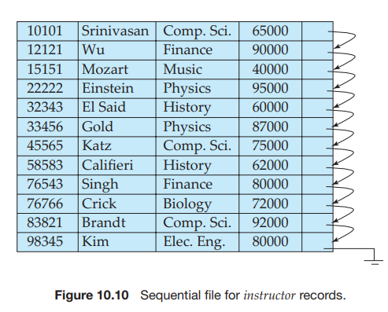

# Organization of Records in Files

So far, we have studied how records are represented in a file structure. A relation is a set of records. Given a set of records, the next question is how to organize them in a file. Several of the possible ways of organizing records in files are:

- **Heap file organization**. Any record can be placed anywhere in the file where there is space for the record. There is no ordering of records. Typically, there is a single file for each relation.

- **Sequential file organization**. Records are stored in sequential order, accord- ing to the value of a “search key” of each record. Section 10.6.1 describes this organization.

- **Hashing file organization**. A hash function is computed on some attribute of each record. The result of the hash function specifies in which block of the  

file the record should be placed. Chapter 11 describes this organization; it is closely related to the indexing structures described in that chapter.

Generally, a separate file is used to store the records of each relation. However, in a **multitable clustering file organization**, records of several different relations are stored in the same file; further, related records of the different relations are stored on the same block, so that one I/O operation fetches related records from all the relations. For example, records of the two relations can be considered to be related if they would match in a join of the two relations. Section 10.6.2 describes this organization.

## Sequential File Organization

A **sequential file** is designed for efficient processing of records in sorted order based on some search key. A **search key** is any attribute or set of attributes; it need not be the primary key, or even a superkey. To permit fast retrieval of records in search-key order, we chain together records by pointers. The pointer in each record points to the next record in search-key order. Furthermore, to minimize the number of block accesses in sequential file processing, we store records physically in search-key order, or as close to search-key order as possible.

Figure 10.10 shows a sequential file of _instructor_ records taken from our uni- versity example. In that example, the records are stored in search-key order, using _ID_ as the search key.

The sequential file organization allows records to be read in sorted order; that can be useful for display purposes, as well as for certain query-processing algorithms that we shall study in Chapter 12.

It is difficult, however, to maintain physical sequential order as records are inserted and deleted, since it is costly to move many records as a result of a single  

insertion or deletion. We can manage deletion by using pointer chains, as we saw previously. For insertion, we apply the following rules:

**1\.** Locate the record in the file that comes before the record to be inserted in search-key order.

**2\.** If there is a free record (that is, space left after a deletion) within the same block as this record, insert the new record there. Otherwise, insert the new record in an _overflow block_. In either case, adjust the pointers so as to chain together the records in search-key order.

Figure 10.11 shows the file of Figure 10.10 after the insertion of the record (32222, Verdi, Music, 48000). The structure in Figure 10.11 allows fast insertion of new records, but forces sequential file-processing applications to process records in an order that does not match the physical order of the records.

If relatively few records need to be stored in overflow blocks, this approach works well. Eventually, however, the correspondence between search-key order and physical order may be totally lost over a period of time, in which case se- quential processing will become much less efficient. At this point, the file should be **reorganized** so that it is once again physically in sequential order. Such reorga- nizations are costly, and must be done during times when the system load is low. The frequency with which reorganizations are needed depends on the frequency of insertion of new records. In the extreme case in which insertions rarely occur, it is possible always to keep the file in physically sorted order. In such a case, the pointer field in Figure 10.10 is not needed.  

## Multitable Clustering File Organization

Many relational database systems store each relation in a separate file, so that they can take full advantage of the file system that the operating system provides. Usually, tuples of a relation can be represented as fixed-length records. Thus, relations can be mapped to a simple file structure. This simple implementation of a relational database system is well suited to low-cost database implementations as in, for example, embedded systems or portable devices. In such systems, the size of the database is small, so little is gained from a sophisticated file structure. Furthermore, in such environments, it is essential that the overall size of the object code for the database system be small. A simple file structure reduces the amount of code needed to implement the system.

This simple approach to relational database implementation becomes less satisfactory as the size of the database increases. We have seen that there are per- formance advantages to be gained from careful assignment of records to blocks, and from careful organization of the blocks themselves. Clearly, a more compli- cated file structure may be beneficial, even if we retain the strategy of storing each relation in a separate file.

However, many large-scale database systems do not rely directly on the un- derlying operating system for file management. Instead, one large operating- system file is allocated to the database system. The database system stores all relations in this one file, and manages the file itself.

Even if multiple relations are stored in a single file, by default most databases store records of only one relation in a given block. This simplifies data man- agement. However, in some cases it can be useful to store records of more than one relation in a single block. To see the advantage of storing records of multi- ple relations in one block, consider the following SQL query for the university database:

**select** _dept name_,_building_, _budget_,_ID_, _name_, _salary_ 
**from** _department_ **natural join** _instructor_;

This query computes a join of the _department_ and _instructor_ relations. Thus, for each tuple of _department_, the system must locate the _instructor_ tuples with the same value for _dept name_. Ideally, these records will be located with the help of _indices_, which we shall discuss in Chapter 11. Regardless of how these records are located, however, they need to be transferred from disk into main memory. In the worst case, each record will reside on a different block, forcing us to do one block read for each record required by the query.

|dept name|building|budget|
|---------|--------|------|
|Comp. Sci.|Taylor|Taylor|
|Physics| Watson |70000|

**Figure 10.12** The _department_ relation.  

|ID |name| dept name |salary|
|--|-----|-----------|------|
|10101 |Srinivasan |Comp. Sci. |65000|
|33456 |Gold |Physics |87000|
|45565 |Katz |Comp. Sci.|75000|
|83821 |Brandt| Comp. Sci.| 92000|

**Figure 10.13** The _instructor_ relation.

As a concrete example, consider the _department_ and _instructor_ relations of Figures 10.12 and 10.13, respectively(for brevity, we include only a subset of the tuples of the relations we have used thus far). In Figure 10.14, we show a file structure designed for efficient execution of queries involving the natural join of _department_ and _instructor_. The _instructor_ tuples for each _ID_ are stored near the _department_ tuple for the corresponding _dept name_. This structure mixes together tuples of two relations, but allows for efficient processing of the join. When a tuple of the _department_ relation is read, the entire block containing that tuple is copied from disk into main memory. Since the corresponding _instructor_ tuples are stored on the disk near the _department_ tuple, the block containing the _department_ tuple contains tuples of the _instructor_ relation needed to process the query. If a department has so many instructors that the _instructor_ records do not fit in one block, the remaining records appear on nearby blocks.

A **multitable clustering file organization** is a file organization, such as that illustrated in Figure 10.14, that stores related records of two or more relations in each block. Such a file organization allows us to read records that would satisfy the join condition by using one block read. Thus, we are able to process this particular query more efficiently.

In the representation shown in Figure 10.14, the _dept name_ attribute is omitted from _instructor_ records since it can be inferred from the associated _department_ record; the attribute may be retained in some implementations, to simplify access to the attributes. We assume that each record contains the identifier of the relation to which it belongs, although this is not shown in Figure 10.14.

Our use of clustering of multiple tables into a single file has enhanced pro- cessing of a particular join (that of _department_ and _instructor_), but it results in slowing processing of other types of queries. For example,

**select** \* 
**from** _department_;

requires more block accesses than it did in the scheme under which we stored each relation in a separate file, since each block now contains significantly fewer _department_ records. To locate efficiently all tuples of the _department_ relation in the structure of Figure 10.14, we can chain together all the records of that relation using pointers, as in Figure 10.15.

When multitable clustering is to be used depends on the types of queries that the database designer believes to be most frequent. Careful use of multitable clustering can produce significant performance gains in query processing.

