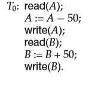
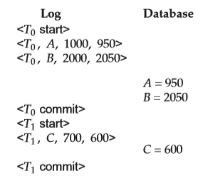
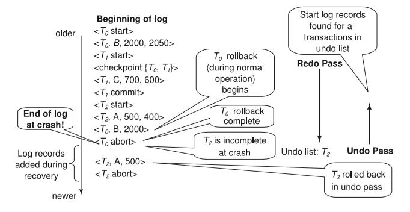

CHAPTER 16 Recovery System## CHAPTER 16 Recovery System

A computer system, like any other device, is subject to failure from a variety of causes: disk crash, power outage, software error, a fire in the machine room, even sabotage. In any failure, information may be lost. Therefore, the database system must take actions in advance to ensure that the atomicity and durability properties of transactions, introduced in Chapter 14, are preserved. An integral part of a database system is a **recovery scheme** that can restore the database to the consistent state that existed before the failure. The recovery scheme must also provide **high availability**; that is, it must minimize the time for which the database is not usable after a failure.

###  Failure Classification

There are various types of failure that may occur in a system, each of which needs to be dealt with in a different manner. In this chapter, we shall consider only the following types of failure:

• **Transaction failure**. There are two types of errors that may cause a transaction to fail:

◦ **Logical error**. The transaction can no longer continue with its normal execution because of some internal condition, such as bad input, data not found, overflow, or resource limit exceeded.

◦ **System error**. The system has entered an undesirable state (for example, deadlock), as a result of which a transaction cannot continue with its normal execution. The transaction, however, can be reexecuted at a later time.

• **System crash**. There is a hardware malfunction, or a bug in the database software or the operating system, that causes the loss of the content of volatile storage, and brings transaction processing to a halt. The content of nonvolatile storage remains intact, and is not corrupted.

The assumption that hardware errors and bugs in the software bring the system to a halt, but do not corrupt the nonvolatile storage contents, is known as the **fail-stop assumption**. Well-designed systems have numerous internal checks, at the hardware and the software level, that bring the system to a halt when there is an error. Hence, the fail-stop assumption is a reasonable one.

• **Disk failure**. A disk block loses its content as a result of either a head crash or failure during a data-transfer operation. Copies of the data on other disks, or archival backups on tertiary media, such as DVD or tapes, are used to recover from the failure.

To determine how the system should recover from failures, we need to iden- tify the failure modes of those devices used for storing data. Next, we must consider how these failure modes affect the contents of the database. We can then propose algorithms to ensure database consistency and transaction atomic- ity despite failures. These algorithms, known as recovery algorithms, have two parts:

**1\.** Actions taken during normal transaction processing to ensure that enough information exists to allow recovery from failures.

**2\.** Actions taken after a failure to recover the database contents to a state that ensures database consistency, transaction atomicity, and durability.

### Storage

As we saw in Chapter 10, the various data items in the database may be stored and accessed in a number of different storage media. In Section 14.3, we saw that storage media can be distinguished by their relative speed, capacity, and resilience to failure. We identified three categories of storage:

• **Volatile storage**

• **Nonvolatile storage**

• **Stable storage**

Stable storage or, more accurately, an approximation thereof, plays a critical role in recovery algorithms.

####  Stable-Storage Implementation

To implement stable storage, we need to replicate the needed information in several nonvolatile storage media (usually disk) with independent failure modes, and to update the information in a controlled manner to ensure that failure during data transfer does not damage the needed information.  

Recall (from Chapter 10) that RAID systems guarantee that the failure of a single disk (even during data transfer) will not result in loss of data. The simplest and fastest form of RAID is the mirrored disk, which keeps two copies of each block, on separate disks. Other forms of RAID offer lower costs, but at the expense of lower performance.

RAID systems, however, cannot guard against data loss due to disasters such as fires or flooding. Many systems store archival backups of tapes off site to guard against such disasters. However, since tapes cannot be carried off site continually, updates since the most recent time that tapes were carried off site could be lost in such a disaster. More secure systems keep a copy of each block of stable storage at a remote site, writing it out over a computer network, in addition to storing the block on a local disk system. Since the blocks are output to a remote system as and when they are output to local storage, once an output operation is complete, the output is not lost, even in the event of a disaster such as a fire or flood. We study such _remote backup_ systems in Section 16.9.

In the remainder of this section, we discuss how storage media can be pro- tected from failure during data transfer. Block transfer between memory and disk storage can result in:

• **Successful completion**. The transferred information arrived safely at its des- tination.

• **Partial failure**. A failure occurred in the midst of transfer, and the destination block has incorrect information.

• **Total failure**. The failure occurred sufficiently early during the transfer that the destination block remains intact.

We require that, if a **data-transfer failure** occurs, the system detects it and invokes a recovery procedure to restore the block to a consistent state. To do so, the system must maintain two physical blocks for each logical database block; in the case of mirrored disks, both blocks are at the same location; in the case of remote backup, one of the blocks is local, whereas the other is at a remote site. An output operation is executed as follows:

**1\.** Write the information onto the first physical block.

**2\.** When the first write completes successfully, write the same information onto the second physical block.

**3\.** The output is completed only after the second write completes successfully.

If the system fails while blocks are being written, it is possible that the two copies of a block are inconsistent with each other. During recovery, for each block, the system would need to examine two copies of the blocks. If both are the same and no detectable error exists, then no further actions are necessary. (Recall that errors in a disk block, such as a partial write to the block, are detected by storing a checksum with each block.) If the system detects an error in one block, then it  

replaces its content with the content of the other block. If both blocks contain no detectable error, but they differ in content, then the system replaces the content of the first block with the value of the second. This recovery procedure ensures that a write to stable storage either succeeds completely (that is, updates all copies) or results in no change.

The requirement of comparing every corresponding pair of blocks during recovery is expensive to meet. We can reduce the cost greatly by keeping track of block writes that are in progress, using a small amount of nonvolatile RAM. On recovery, only blocks for which writes were in progress need to be compared.

The protocols for writing out a block to a remote site are similar to the protocols for writing blocks to a mirrored disk system, which we examined in Chapter 10, and particularly in Practice Exercise 10.3.

We can extend this procedure easily to allow the use of an arbitrarily large number of copies of each block of stable storage. Although a large number of copies reduces the probability of a failure to even lower than two copies do, it is usually reasonable to simulate stable storage with only two copies.

#### Data Access

As we saw in Chapter 10, the database system resides permanently on nonvolatile storage (usually disks) and only parts of the database are in memory at any time.1 The database is partitioned into fixed-length storage units called **blocks**. Blocks are the units of data transfer to and from disk, and may contain several data items. We shall assume that no data item spans two or more blocks. This assumption is realistic for most data-processing applications, such as a bank or a university.

Transactions input information from the disk to main memory, and then output the information back onto the disk. The input and output operations are done in block units. The blocks residing on the disk are referred to as **physical blocks**; the blocks residing temporarily in main memory are referred to as **buffer blocks**. The area of memory where blocks reside temporarily is called the **disk buffer**.

Block movements between disk and main memory are initiated through the following two operations:

**1\.** input(_B_) transfers the physical block _B_ to main memory.

**2\.** output(_B_) transfers the buffer block _B_ to the disk, and replaces the appro- priate physical block there.

Figure 16.1 illustrates this scheme. Conceptually, each transaction _Ti_ has a private work area in which copies of

data items accessed and updated by _Ti_ are kept. The system creates this work area when the transaction is initiated; the system removes it when the transaction

1There is a special category of database system, called _main-memory database systems_, where the entire database can be loaded into memory at once. We consider such systems in Section 26.4.  

**Figure 16.1** Block storage operations.

either commits or aborts. Each data item _X_ kept in the work area of transaction _Ti_ is denoted by _xi_ . Transaction _Ti_ interacts with the database system by transferring data to and from its work area to the system buffer. We transfer data by these two operations:

**1\.** read(_X_) assigns the value of data item _X_ to the local variable _xi_ . It executes this operation as follows:

a. If block _BX_ on which _X_ resides is not in main memory, it issues input(_BX_).

b. It assigns to _xi_ the value of _X_ from the buffer block.

**2\.** write(_X_) assigns the value of local variable _xi_ to data item _X_ in the buffer block. It executes this operation as follows:

a. If block _BX_ on which _X_ resides is not in main memory, it issues input(_BX_).

b. It assigns the value of _xi_ to _X_ in buffer _BX_.

Note that both operations may require the transfer of a block from disk to main memory. They do not, however, specifically require the transfer of a block from main memory to disk.

A buffer block is eventually written out to the disk either because the buffer manager needs the memory space for other purposes or because the database system wishes to reflect the change to _B_ on the disk. We shall say that the database system performs a **force-output** of buffer _B_ if it issues an output(_B_).

When a transaction needs to access a data item _X_ for the first time, it must execute read(_X_). The system then performs all updates to _X_ on _xi_ . At any point during its execution a transaction may execute write(_X_) to reflect the change to _X_ in the database itself; write(_X_) must certainly be done after the final write to _X_.  

The output(_BX_) operation for the buffer block _BX_ on which _X_ resides does not need to take effect immediately after write(_X_) is executed, since the block _BX_ may contain other data items that are still being accessed. Thus, the actual output may take place later. Notice that, if the system crashes after the write(_X_) operation was executed but before output(_BX_) was executed, the new value of _X_ is never written to disk and, thus, is lost. As we shall see shortly, the database system executes extra actions to ensure that updates performed by committed transactions are not lost even if there is a system crash.

### Recovery and Atomicity

Consider again our simplified banking system and a transaction _Ti_ that transfers $50 from account _A_ to account _B_, with initial values of _A_ and _B_ being $1000 and $2000, respectively. Suppose that a system crash has occurred during the execution of _Ti_ , after output(_BA_) has taken place, but before output(_BB_) was executed, where _BA_ and _BB_ denote the buffer blocks on which _A_ and _B_ reside. Since the memory contents were lost, we do not know the fate of the transaction.

When the system restarts, the value of _A_ would be $950, while that of _B_ would be $2000, which is clearly inconsistent with the atomicity requirement for transaction _Ti_ . Unfortunately, there is no way to find out by examining the database state what blocks had been output, and what had not, before the crash. It is possible that the transaction completed, updating the database on stable storage from an initial state with the values of _A_ and _B_ being $1000 and $1950; it is also possible that the transaction did not affect the stable storage at all, and the values of _A_ and _B_ were $950 and $2000 initially; or that the updated _B_ was output but not the updated _A_; or that the updated _A_ was output but the updated _B_ was not.

Our goal is to perform either all or no database modifications made by _Ti_ . However, if _Ti_ performed multiple database modifications, several output opera- tions may be required, and a failure may occur after some of these modifications have been made, but before all of them are made.

To achieve our goal of atomicity, we must first output to stable storage infor- mation describing the modifications, without modifying the database itself. As we shall see, this information can help us ensure that all modifications performed by committed transactions are reflected in the database (perhaps during the course of recovery actions after a crash). This information can also help us ensure that no modifications made by an aborted transaction persist in the database.

#### Log Records

The most widely used structure for recording database modifications is the **log**. The log is a sequence of **log records**, recording all the update activities in the database.

There are several types of log records. An **update log record** describes a single database write. It has these fields:  

**SHADOW COPIES AND SHADOW PAGING**

In the **shadow-copy** scheme, a transaction that wants to update the database first creates a complete copy of the database. All updates are done on the new database copy, leaving the original copy, the **shadow copy**, untouched. If at any point the transaction has to be aborted, the system merely deletes the new copy. The old copy of the database has not been affected. The current copy of the database is identified by a pointer, called db-pointer, which is stored on disk.

If the transaction partially commits (that is, executes its final statement) it is committed as follows: First, the operating system is asked to make sure that all pages of the new copy of the database have been written out to disk. (Unix systems use the fsync command for this purpose.) After the operating system has written all the pages to disk, the database system updates the pointer db- pointer to point to the new copy of the database; the new copy then becomes the current copy of the database. The old copy of the database is then deleted. The transaction is said to have been _committed_ at the point where the updated db-pointer is written to disk.

The implementation actually depends on the write to db-pointer being atomic; that is, either all its bytes are written or none of its bytes are written. Disk sys- tems provide atomic updates to entire blocks, or at least to a disk sector. In other words, the disk system guarantees that it will update db-pointer atomically, as long as we make sure that db-pointer lies entirely in a single sector, which we can ensure by storing db-pointer at the beginning of a block.

Shadow copy schemes are commonly used by text editors (saving the file is equivalent to transaction commit, while quitting without saving the file is equiv- alent to transaction abort). Shadow copying can be used for small databases, but copying a large database would be extremely expensive. A variant of shadow- copying, called **shadow-paging**, reduces copying as follows: the scheme uses a page table containing pointers to all pages; the page table itself and all updated pages are copied to a new location. Any page which is not updated by a trans- action is not copied, but instead the new page table just stores a pointer to the original page. When a transaction commits, it atomically updates the pointer to the page table, which acts as db-pointer, to point to the new copy.

Shadow paging unfortunately does not work well with concurrent transac- tions and is not widely used in databases.

• **Transaction identifier,** which is the unique identifier of the transaction that performed the write operation.

• **Data-item identifier,** which is the unique identifier of the data item written. Typically, it is the location on disk of the data item, consisting of the block identifier of the block on which the data item resides, and an offset within the block.

• **Old value**, which is the value of the data item prior to the write.  

**728 Chapter 16 Recovery System**

• **New value**, which is the value that the data item will have after the write.

We represent an update log record as _<Ti, Xj , V_1_, V_2_\>_, indicating that transaction _Ti_ has performed a write on data item _Xj_ . _Xj_ had value _V_1 before the write, and has value _V_2 after the write. Other special log records exist to record significant events during transaction processing, such as the start of a transaction and the commit or abort of a transaction. Among the types of log records are:

• _<Ti_ start_\>_. Transaction _Ti_ has started.

• _<Ti_ commit_\>_. Transaction _Ti_ has committed.

• _<Ti_ abort_\>_. Transaction _Ti_ has aborted.

We shall introduce several other types of log records later. Whenever a transaction performs a write, it is essential that the log record

for that write be created and added to the log, before the database is modified. Once a log record exists, we can output the modification to the database if that is desirable. Also, we have the ability to _undo_ a modification that has already been output to the database. We undo it by using the old-value field in log records.

For log records to be useful for recovery from system and disk failures, the log must reside in stable storage. For now, we assume that every log record is written to the end of the log on stable storage as soon as it is created. In Section 16.5, we shall see when it is safe to relax this requirement so as to reduce the overhead imposed by logging. Observe that the log contains a complete record of all database activity. As a result, the volume of data stored in the log may become unreasonably large. In Section 16.3.6, we shall show when it is safe to erase log information.

#### Database Modification

As we noted earlier, a transaction creates a log record prior to modifying the database. The log records allow the system to undo changes made by a transaction in the event that the transaction must be aborted; they allow the system also to redo changes made by a transaction if the transaction has committed but the system crashed before those changes could be stored in the database on disk. In order for us to understand the role of these log records in recovery, we need to consider the steps a transaction takes in modifying a data item:

**1\.** The transaction performs some computations in its own private part of main memory.

**2\.** The transaction modifies the data block in the disk buffer in main memory holding the data item.

**3\.** The database system executes the output operation that writes the data block to disk.  

We say a transaction _modifies the database_ if it performs an update on a disk buffer, or on the disk itself; updates to the private part of main memory do not count as database modifications. If a transaction does not modify the database until it has committed, it is said to use the **deferred-modification** technique. If database modifications occur while the transaction is still active, the transaction is said to use the **immediate-modification** technique. Deferred modification has the overhead that transactions need to make local copies of all updated data items; further, if a transaction reads a data item that it has updated, it must read the value from its local copy.

The recovery algorithms we describe in this chapter support immediate mod- ification. As described, they work correctly even with deferred modification, but can be optimized to reduce overhead when used with deferred modification; we leave details as an exercise.

A recovery algorithm must take into account a variety of factors, including:

• The possibility that a transaction may have committed although some of its database modifications exist only in the disk buffer in main memory and not in the database on disk.

• The possibility that a transaction may have modified the database while in the active state and, as a result of a subsequent failure, may need to abort.

Because all database modifications must be preceded by the creation of a log record, the system has available both the old value prior to the modification of the data item and the new value that is to be written for the data item. This allows the system to perform _undo_ and _redo_ operations as appropriate.

• **Undo** using a log record sets the data item specified in the log record to the old value.

• **Redo** using a log record sets the data item specified in the log record to the new value.

#### Concurrency Control and Recovery

If the concurrency control scheme allows a data item _X_ that has been modified by a transaction _T_1 to be further modified by another transaction _T_2 before _T_1 commits, then undoing the effects of _T_1 by restoring the old value of _X_ (before _T_1 updated _X_) would also undo the effects of _T_2\. To avoid such situations, recovery algorithms usually require that if a data item has been modified by a transaction, no other transaction can modify the data item until the first transaction commits or aborts.

This requirement can be ensured by acquiring an exclusive lock on any up- dated data item and holding the lock until the transaction commits; in other words, by using strict two-phase locking. Snapshot-isolation and validation-      based concurrency-control techniques also acquire exclusive locks on data items at the time of validation, before modifying the data items, and hold the locks until the transaction is committed; as a result the above requirement is satisfied even by these concurrency control protocols.

We discuss later, in Section 16.7, how the above requirement can be relaxed in certain cases.

When either snapshot-isolation or validation is used for concurrency control, database updates of a transaction are (conceptually) deferred until the transac- tion is partially committed; the deferred-modification technique is a natural fit with these concurrency control schemes. However, it is worth noting that some implementations of snapshot isolation use immediate modification, but provide a logical snapshot on demand: when a transaction needs to read an item that a concurrent transaction has updated, a copy of the (already updated) item is made, and updates made by concurrent transactions are rolled back on the copy of the item. Similarly, immediate modification of the database is a natural fit with two-phase locking, but deferred modification can also be used with two-phase locking.

#### Transaction Commit

We say that a transaction has **committed** when its commit log record, which is the last log record of the transaction, has been output to stable storage; at that point all earlier log records have already been output to stable storage. Thus, there is enough information in the log to ensure that even if there is a system crash, the updates of the transaction can be redone. If a system crash occurs before a log record _< Ti_ commit_\>_ is output to stable storage, transaction _Ti_ will be rolled back. Thus, the output of the block containing the commit log record is the single atomic action that results in a transaction getting committed.2

With most log-based recovery techniques, including the ones we describe in this chapter, blocks containing the data items modified by a transaction do not have to be output to stable storage when the transaction commits, but can be output some time later. We discuss this issue further in Section 16.5.2.

#### Using the Log to Redo and Undo Transactions

We now provide an overview of how the log can be used to recover from a system crash, and to roll back transactions during normal operation. However, we postpone details of the procedures for failure recovery and rollback to Section 16.4.

Consider our simplified banking system. Let _T_0 be a transaction that transfers $50 from account _A_ to account _B_:

2The output of a block can be made atomic by techniques for dealing with data-transfer failure, as described earlier in Section 16.2.1.  

**Figure 16.2** Portion of the system log corresponding to _T_0 and _T_1.

Let _T_1 be a transaction that withdraws $100 from account _C_:

The portion of the log containing the relevant information concerning these two transactions appears in Figure 16.2.

Figure 16.3 shows one possible order in which the actual outputs took place in both the database system and the log as a result of the execution of _T_0 and _T_1.3

Using the log, the system can handle any failure that does not result in the loss of information in nonvolatile storage. The recovery scheme uses two recovery procedures. Both these procedures make use of the log to find the set of data items updated by each transaction _Ti_ , and their respective old and new values.

• redo(_Ti_ ) sets the value of all data items updated by transaction _Ti_ to the new values.

The order in which updates are carried out by redo is important; when recovering from a system crash, if updates to a particular data item are applied in an order different from the order in which they were applied originally, the final state of that data item will have a wrong value. Most recovery algorithms, including the one we describe in Section 16.4, do not perform redo of each transaction separately; instead they perform a single scan of the log, during which redo actions are performed for each log record as it is encountered. This approach ensures the order of updates is preserved,

3Notice that this order could not be obtained using the deferred-modification technique, because the database is modified by _T_0 before it commits, and likewise for _T_1.  

**Log Database**

**Figure 16.3** State of system log and database corresponding to _T_0 and _T_1.

and is more efficient since the log needs to be read only once overall, instead of once per transaction.

• undo(_Ti_ ) restores the value of all data items updated by transaction _Ti_ to the old values.

In the recovery scheme that we describe in Section 16.4:

◦ The undo operation not only restores the data items to their old value, but also writes log records to record the updates performed as part of the undo process. These log records are special **redo-only** log records, since they do not need to contain the old-value of the updated data item.

As with the redo procedure, the order in which undo operations are performed is important; again we postpone details to Section 16.4.

◦ When the undo operation for transaction _Ti_ completes, it writes a _<Ti_ abort_\>_ log record, indicating that the undo has completed.

As we shall see in Section 16.4, the undo(_Ti_ ) procedure is executed only once for a transaction, if the transaction is rolled back during normal processing or if on recovering from a system crash, neither a commit nor an abort record is found for transaction _Ti_ . As a result, every transaction will eventually have either a commit or an abort record in the log.

After a system crash has occurred, the system consults the log to determine which transactions need to be redone, and which need to be undone so as to ensure atomicity.

• Transaction _Ti_ needs to be undone if the log contains the record _<Ti_ start_\>_, but does not contain either the record _<Ti_ commit_\>_ or the record _<Ti_ abort_\>_.

• Transaction _Ti_ needs to be redone if the log contains the record _<Ti_ start_\>_ and either the record _<Ti_ commit_\>_ or the record _<Ti_ abort_\>_. It may seem strange to redo _Ti_ if the record _<Ti_ abort_\>_ is in the log. To see why this works, note  

**Figure 16.4** The same log, shown at three different times.

that if _<Ti_ abort_\>_ is in the log, so are the redo-only records written by the undo operation. Thus, the end result will be to undo _Ti_ ’s modifications in this case. This slight redundancy simplifies the recovery algorithm and enables faster overall recovery time.

As an illustration, return to our banking example, with transaction _T_0 and _T_1 executed one after the other in the order _T_0 followed by _T_1\. Suppose that the system crashes before the completion of the transactions. We shall consider three cases. The state of the logs for each of these cases appears in Figure 16.4.

First, let us assume that the crash occurs just after the log record for the step:

write(_B_)

of transaction _T_0 has been written to stable storage (Figure 16.4a). When the system comes back up, it finds the record _<T_0 start_\>_ in the log, but no corresponding _<T_0 commit_\>_ or _<T_0 abort_\>_ record. Thus, transaction _T_0 must be undone, so an undo(_T_0) is performed. As a result, the values in accounts _A_ and _B_ (on the disk) are restored to $1000 and $2000, respectively.

Next, let us assume that the crash comes just after the log record for the step:

write(_C_)

of transaction _T_1 has been written to stable storage (Figure 16.4b). When the system comes back up, two recovery actions need to be taken. The operation undo(_T_1) must be performed, since the record _<T_1 start_\>_ appears in the log, but there is no record _<T_1 commit_\>_ or _<T_1 abort_\>_. The operation redo(_T_0) must be performed, since the log contains both the record _<T_0 start_\>_ and the record _<T_0 commit_\>_. At the end of the entire recovery procedure, the values of accounts _A_, _B_, and _C_ are $950, $2050, and $700, respectively.

Finally, let us assume that the crash occurs just after the log record:

_<T_1 commit_\>_  

has been written to stable storage (Figure 16.4c). When the system comes back up, both _T_0 and _T_1 need to be redone, since the records _<T_0 start_\>_ and _<T_0 commit_\>_ appear in the log, as do the records _<T_1 start_\>_ and _<T_1 commit_\>_. After the system performs the recovery procedures redo(_T_0) and redo(_T_1), the values in accounts _A_, _B_, and _C_ are $950, $2050, and $600, respectively.

#### Checkpoints

When a system crash occurs, we must consult the log to determine those trans- actions that need to be redone and those that need to be undone. In principle, we need to search the entire log to determine this information. There are two major difficulties with this approach:

**1\.** The search process is time-consuming.

**2\.** Most of the transactions that, according to our algorithm, need to be redone have already written their updates into the database. Although redoing them will cause no harm, it will nevertheless cause recovery to take longer.

To reduce these types of overhead, we introduce checkpoints. We describe below a simple checkpoint scheme that (a) does not permit any

updates to be performed while the checkpoint operation is in progress, and (b) outputs all modified buffer blocks to disk when the checkpoint is performed. We discuss later how to modify the checkpointing and recovery procedures to provide more flexibility by relaxing both these requirements.

A checkpoint is performed as follows:

**1\.** Output onto stable storage all log records currently residing in main mem- ory.

**2\.** Output to the disk all modified buffer blocks.

**3\.** Output onto stable storage a log record of the form _<_checkpoint _L>_, where _L_ is a list of transactions active at the time of the checkpoint.

Transactions are not allowed to perform any update actions, such as writing to a buffer block or writing a log record, while a checkpoint is in progress. We discuss how this requirement can be enforced, later, in Section 16.5.2.

The presence of a _<_checkpoint _L>_ record in the log allows the system to streamline its recovery procedure. Consider a transaction _Ti_ that completed prior to the checkpoint. For such a transaction, the _<Ti_ commit_\>_ record (or _< Ti_ abort_\>_ record) appears in the log before the _<_checkpoint_\>_ record. Any database mod- ifications made by _Ti_ must have been written to the database either prior to the checkpoint or as part of the checkpoint itself. Thus, at recovery time, there is no need to perform a redo operation on _Ti_ .

After a system crash has occurred, the system examines the log to find the last _<_checkpoint _L>_ record (this can be done by searching the log backward, from the end of the log, until the first _<_checkpoint _L>_ record is found).  

The redo or undo operations need to be applied only to transactions in _L_, and to all transactions that started execution after the _<_checkpoint _L>_ record was written to the log. Let us denote this set of transactions as _T_ .

• For all transactions _Tk_ in _T_ that have no _<Tk_ commit_\>_ record or _<Tk_ abort_\>_ record in the log, execute undo(_Tk_).

• For all transactions _Tk_ in _T_ such that either the record _<Tk_ commit_\>_ or the record _<Tk_ abort_\>_ appears in the log, execute redo(_Tk_).

Note that we need only examine the part of the log starting with the last check- point log record to find the set of transactions _T_ , and to find out whether a commit or abort record occurs in the log for each transaction in _T_ .

As an illustration, consider the set of transactions {_T_0, _T_1_, . . . , T_100}. Suppose that the most recent checkpoint took place during the execution of transaction _T_67 and _T_69, while _T_68 and all transactions with subscripts lower than 67 completed before the checkpoint. Thus, only transactions _T_67, _T_69_, . . . , T_100 need to be con- sidered during the recovery scheme. Each of them needs to be redone if it has completed (that is, either committed or aborted); otherwise, it was incomplete, and needs to be undone.

Consider the set of transactions _L_ in a checkpoint log record. For each trans- action _Ti_ in _L_, log records of the transaction that occur prior to the checkpoint log record may be needed to undo the transaction, in case it does not commit. However, all log records prior to the earliest of the _< Ti_ start_\>_ log records, among transactions _Ti_ in _L_, are not needed once the checkpoint has completed. These log records can be erased whenever the database system needs to reclaim the space occupied by these records.

The requirement that transactions must not perform any updates to buffer blocks or to the log during checkpointing can be bothersome, since transaction processing has to halt while a checkpoint is in progress. A **fuzzy checkpoint** is a checkpoint where transactions are allowed to perform updates even while buffer blocks are being written out. Section 16.5.4 describes fuzzy-checkpointing schemes. Later in Section 16.8 we describe a checkpoint scheme that is not only fuzzy, but does not even require all modified buffer blocks to be output to disk at the time of the checkpoint.

### Recovery Algorithm

Until now, in discussing recovery, we have identified transactions that need to be redone and those that need to be undone, but we have not given a precise algorithm for performing these actions. We are now ready to present the full recovery algorithm using log records for recovery from transaction failure and a combination of the most recent checkpoint and log records to recover from a system crash.  

The recovery algorithm described in this section requires that a data item that has been updated by an uncommitted transaction cannot be modified by any other transaction, until the first transaction has either committed or aborted. Recall that this restriction was discussed earlier, in Section 16.3.3.

#### Transaction Rollback

First consider transaction rollback during normal operation (that is, not during recovery from a system crash). Rollback of a transaction _Ti_ is performed as follows:

**1\.** The log is scanned backward, and for each log record of _Ti_ of the form _<Ti , Xj , V_1_, V_2_\>_ that is found:

a. The value _V_1 is written to data item _Xj_ , and

b. A special redo-only log record _<Ti, Xj , V_1_\>_ is written to the log, where _V_1 is the value being restored to data item _Xj_ during the rollback. These log records are sometimes called **compensation log records**. Such records do not need undo information, since we never need to undo such an undo operation. We shall explain later how they are used.

**2\.** Once the log record _<Ti_ start_\>_ is found the backward scan is stopped, and a log record _<Ti_ abort_\>_ is written to the log.

Observe that every update action performed by the transaction or on behalf of the transaction, including actions taken to restore data items to their old value, have now been recorded in the log. In Section 16.4.2 we shall see why this is a good idea.

#### Recovery After a System Crash

Recovery actions, when the database system is restarted after a crash, take place in two phases:

**1\.** In the **redo phase**, the system replays updates of _all_ transactions by scanning the log forward from the last checkpoint. The log records that are replayed include log records for transactions that were rolled back before system crash, and those that had not committed when the system crash occurred. This phase also determines all transactions that were incomplete at the time of the crash, and must therefore be rolled back. Such incomplete transactions would either have been active at the time of the checkpoint, and thus would appear in the transaction list in the checkpoint record, or would have started later; further, such incomplete transactions would have neither a _<Ti_ abort_\>_ nor a _<Ti_ commit_\>_ record in the log.

The specific steps taken while scanning the log are as follows:

a. The list of transactions to be rolled back, undo-list, is initially set to the list _L_ in the _<_checkpoint _L>_ log record.  

b. Whenever a normal log record of the form _<Ti , Xj , V_1_, V_2_\>_, or a redo-only log record of the form _<Ti , Xj , V_2_\>_ is encountered, the operation is redone; that is, the value _V_2 is written to data item _Xj_ .

c. Whenever a log record of the form _<Ti_ start_\>_ is found, _Ti_ is added to undo-list.

d. Whenever a log record of the form _<Ti_ abort_\>_ or _<Ti_ commit_\>_ is found, _Ti_ is removed from undo-list.

At the end of the redo phase, undo-list contains the list of all transactions that are incomplete, that is, they neither committed nor completed rollback before the crash.

**2\.** In the **undo phase**, the system rolls back all transactions in the undo-list. It performs rollback by scanning the log backward from the end.

a. Whenever it finds a log record belonging to a transaction in the undo- list, it performs undo actions just as if the log record had been found during the rollback of a failed transaction.

b. When the system finds a _<Ti_ start_\>_ log record for a transaction _Ti_ in undo-list, it writes a _<Ti_ abort_\>_ log record to the log, and removes _Ti_ from undo-list.

c. The undo phase terminates once undo-list becomes empty, that is, the system has found _<Ti_ start_\>_ log records for all transactions that were initially in undo-list.

After the undo phase of recovery terminates, normal transaction processing can resume.

Observe that the redo phase replays every log record since the most recent checkpoint record. In other words, this phase of restart recovery repeats all the update actions that were executed after the checkpoint, and whose log records reached the stable log. The actions include actions of incomplete transactions and the actions carried out to rollback failed transactions. The actions are repeated in the same order in which they were originally carried out; hence, this process is called **repeating history**. Although it may appear wasteful, repeating history even for failed transactions simplifies recovery schemes.

Figure 16.5 shows an example of actions logged during normal operation, and actions performed during failure recovery. In the log shown in the figure, transaction _T_1 had committed, and transaction _T_0 had been completely rolled back, before the system crashed. Observe how the value of data item _B_ is restored during the rollback of _T_0\. Observe also the checkpoint record, with the list of active transactions containing _T_0 and _T_1.

When recovering from a crash, in the redo phase, the system performs a redo of all operations after the last checkpoint record. In this phase, the list undo-list initially contains _T_0 and _T_1; _T_1 is removed first when its commit log record is found, while _T_2 is added when its start log record is found. Transaction _T_0 is  

**Figure 16.5** Example of logged actions, and actions during recovery.

removed from undo-list when its abort log record is found, leaving only _T_2 in undo-list. The undo phase scans the log backwards from the end, and when it finds a log record of _T_2 updating _A_, the old value of _A_ is restored, and a redo-only log record written to the log. When the start record for _T_2 is found, an abort record is added for _T_2\. Since undo-list contains no more transactions, the undo phase terminates, completing recovery.

### Buffer Management

In this section, we consider several subtle details that are essential to the imple- mentation of a crash-recovery scheme that ensures data consistency and imposes a minimal amount of overhead on interactions with the database.

#### Log-Record Buffering

So far, we have assumed that every log record is output to stable storage at the time it is created. This assumption imposes a high overhead on system execution for several reasons: Typically, output to stable storage is in units of blocks. In most cases, a log record is much smaller than a block. Thus, the output of each log record translates to a much larger output at the physical level. Furthermore, as we saw in Section 16.2.1, the output of a block to stable storage may involve several output operations at the physical level.

The cost of outputting a block to stable storage is sufficiently high that it is desirable to output multiple log records at once. To do so, we write log records to a log buffer in main memory, where they stay temporarily until they are output to stable storage. Multiple log records can be gathered in the log buffer and output  

to stable storage in a single output operation. The order of log records in the stable storage must be exactly the same as the order in which they were written to the log buffer.

As a result of log buffering, a log record may reside in only main memory (volatile storage) for a considerable time before it is output to stable storage. Since such log records are lost if the system crashes, we must impose additional requirements on the recovery techniques to ensure transaction atomicity:

• Transaction _Ti_ enters the commit state after the _<Ti_ commit_\>_ log record has been output to stable storage.

• Before the _<Ti_ commit_\>_ log record can be output to stable storage, all log records pertaining to transaction _Ti_ must have been output to stable storage.

• Before a block of data in main memory can be output to the database (in nonvolatile storage), all log records pertaining to data in that block must have been output to stable storage.

This rule is called the **write-ahead logging (WAL)** rule. (Strictly speaking, the WAL rule requires only that the undo information in the log has been output to stable storage, and it permits the redo information to be written later. The difference is relevant in systems where undo information and redo information are stored in separate log records.)

The three rules state situations in which certain log records _must_ have been output to stable storage. There is no problem resulting from the output of log records _earlier_ than necessary. Thus, when the system finds it necessary to output a log record to stable storage, it outputs an entire block of log records, if there are enough log records in main memory to fill a block. If there are insufficient log records to fill the block, all log records in main memory are combined into a partially full block and are output to stable storage.

Writing the buffered log to disk is sometimes referred to as a **log force**.

####  Database Buffering

In Section 16.2.2, we described the use of a two-level storage hierarchy. The system stores the database in nonvolatile storage (disk), and brings blocks of data into main memory as needed. Since main memory is typically much smaller than the entire database, it may be necessary to overwrite a block _B_1 in main memory when another block _B_2 needs to be brought into memory. If _B_1 has been modified, _B_1 must be output prior to the input of _B_2\. As discussed in Section 10.8.1 in Chapter 10, this storage hierarchy is similar to the standard operating-system concept of _virtual memory_.

One might expect that transactions would force-output all modified blocks to disk when they commit. Such a policy is called the **force** policy. The alternative, the **no-force** policy, allows a transaction to commit even if it has modified some blocks that have not yet been written back to disk. All the recovery algorithms described in this chapter work correctly even with the no-force policy. The no-  

force policy allows faster commit of transactions; moreover it allows multiple updates to accumulate on a block before it is output to stable storage, which can reduce the number of output operations greatly for frequently updated blocks. As a result, the standard approach taken by most systems is the no-force policy.

Similarly, one might expect that blocks modified by a transaction that is still active should not be written to disk. This policy is called the **no-steal** policy. The alternative, the **steal** policy, allows the system to write modified blocks to disk even if the transactions that made those modifications have not all committed. As long as the write-ahead logging rule is followed, all the recovery algorithms we study in the chapter work correctly even with the steal policy. Further, the no-steal policy does not work with transactions that perform a large number of updates, since the buffer may get filled with updated pages that cannot be evicted to disk, and the transaction cannot then proceed. As a result, the standard approach taken by most systems is the steal policy.

To illustrate the need for the write-ahead logging requirement, consider our banking example with transactions _T_0 and _T_1\. Suppose that the state of the log is:

_<T_0 start_\> <T_0_, A,_ 1000_,_ 950_\>_

and that transaction _T_0 issues a read(_B_). Assume that the block on which _B_ resides is not in main memory, and that main memory is full. Suppose that the block on which _A_ resides is chosen to be output to disk. If the system outputs this block to disk and then a crash occurs, the values in the database for accounts _A_, _B_, and _C_ are $950, $2000, and $700, respectively. This database state is inconsistent. However, because of the WAL requirements, the log record:

_<T_0_, A,_ 1000_,_ 950_\>_

must be output to stable storage prior to output of the block on which _A_ resides. The system can use the log record during recovery to bring the database back to a consistent state.

When a block _B_1 is to be output to disk, all log records pertaining to data in _B_1 must be output to stable storage before _B_1 is output. It is important that no writes to the block _B_1 be in progress while the block is being output, since such a write could violate the write-ahead logging rule. We can ensure that there are no writes in progress by using a special means of locking:

• Before a transaction performs a write on a data item, it acquires an exclu- sive lock on the block in which the data item resides. The lock is released immediately after the update has been performed.

• The following sequence of actions is taken when a block is to be output:

◦ Obtain an exclusive lock on the block, to ensure that no transaction is performing a write on the block.  

◦ Output log records to stable storage until all log records pertaining to block _B_1 have been output.

◦ Output block _B_1 to disk.

◦ Release the lock once the block output has completed.

Locks on buffer blocks are unrelated to locks used for concurrency-control of transactions, and releasing them in a non-two-phase manner does not have any implications on transaction serializability. These locks, and other similar locks that are held for a short duration, are often referred to as **latches**.

Locks on buffer blocks can also be used to ensure that buffer blocks are not updated, and log records are not generated, while a checkpoint is in progress. This restriction may be enforced by acquiring exclusive locks on all buffer blocks, as well as an exclusive lock on the log, before the checkpoint operation is performed. These locks can be released as soon as the checkpoint operation has completed.

Database systems usually have a process that continually cycles through the buffer blocks, outputting modified buffer blocks back to disk. The above locking protocol must of course be followed when the blocks are output. As a result of continuous output of modified blocks, the number of **dirty blocks** in the buffer, that is, blocks that have been modified in the buffer but have not been subsequently output, is minimized. Thus, the number of blocks that have to be output during a checkpoint is minimized; further, when a block needs to be evicted from the buffer it is likely that there will be a non-dirty block available for eviction, allowing the input to proceed immediately instead of waiting for an output to complete.

#### Operating System Role in Buffer Management

We can manage the database buffer by using one of two approaches:

**1\.** The database system reserves part of main memory to serve as a buffer that it, rather than the operating system, manages. The database system manages data-block transfer in accordance with the requirements in Section 16.5.2.

This approach has the drawback of limiting flexibility in the use of main memory. The buffer must be kept small enough that other applications have sufficient main memory available for their needs. However, even when the other applications are not running, the database will not be able to make use of all the available memory. Likewise, non-database applications may not use that part of main memory reserved for the database buffer, even if some of the pages in the database buffer are not being used.

**2\.** The database system implements its buffer within the virtual memory pro- vided by the operating system. Since the operating system knows about the memory requirements of all processes in the system, ideally it should be in charge of deciding what buffer blocks must be force-output to disk, and when. But, to ensure the write-ahead logging requirements in Section 16.5.1, the operating system should not write out the database buffer pages itself,  

but instead should request the database system to force-output the buffer blocks. The database system in turn would force-output the buffer blocks to the database, after writing relevant log records to stable storage.

Unfortunately, almost all current-generation operating systems retain complete control of virtual memory. The operating system reserves space on disk for storing virtual-memory pages that are not currently in main memory; this space is called **swap space**. If the operating system decides to output a block _Bx_, that block is output to the swap space on disk, and there is no way for the database system to get control of the output of buffer blocks.

Therefore, if the database buffer is in virtual memory, transfers between database files and the buffer in virtual memory must be managed by the database system, which enforces the write-ahead logging requirements that we discussed.

This approach may result in extra output of data to disk. If a block _Bx_ is output by the operating system, that block is not output to the database. Instead, it is output to the swap space for the operating system’s virtual memory. When the database system needs to output _Bx_, the operating sys- tem may need first to input _Bx_ from its swap space. Thus, instead of a single output of _Bx_, there may be two outputs of _Bx_ (one by the operating system, and one by the database system) and one extra input of _Bx_.

Although both approaches suffer from some drawbacks, one or the other must be chosen unless the operating system is designed to support the requirements of database logging.

#### Fuzzy Checkpointing

The checkpointing technique described in Section 16.3.6 requires that all updates to the database be temporarily suspended while the checkpoint is in progress. If the number of pages in the buffer is large, a checkpoint may take a long time to finish, which can result in an unacceptable interruption in processing of transactions.

To avoid such interruptions, the checkpointing technique can be modified to permit updates to start once the checkpoint record has been written, but before the modified buffer blocks are written to disk. The checkpoint thus generated is a **fuzzy checkpoint**.

Since pages are output to disk only after the checkpoint record has been written, it is possible that the system could crash before all pages are written. Thus, a checkpoint on disk may be incomplete. One way to deal with incomplete checkpoints is this: The location in the log of the checkpoint record of the last completed checkpoint is stored in a fixed position, last-checkpoint, on disk. The system does not update this information when it writes the checkpoint record. Instead, before it writes the checkpoint record, it creates a list of all modified buffer blocks. The last-checkpoint information is updated only after all buffer blocks in the list of modified buffer blocks have been output to disk.  

Even with fuzzy checkpointing, a buffer block must not be updated while it is being output to disk, although other buffer blocks may be updated concur- rently. The write-ahead log protocol must be followed so that (undo) log records pertaining to a block are on stable storage before the block is output.

### Failure with Loss of Nonvolatile Storage

Until now, we have considered only the case where a failure results in the loss of information residing in volatile storage while the content of the nonvolatile storage remains intact. Although failures in which the content of nonvolatile storage is lost are rare, we nevertheless need to be prepared to deal with this type of failure. In this section, we discuss only disk storage. Our discussions apply as well to other nonvolatile storage types.

The basic scheme is to **dump** the entire contents of the database to stable storage periodically—say, once per day. For example, we may dump the database to one or more magnetic tapes. If a failure occurs that results in the loss of physical database blocks, the system uses the most recent dump in restoring the database to a previous consistent state. Once this restoration has been accomplished, the system uses the log to bring the database system to the most recent consistent state.

One approach to database dumping requires that no transaction may be active during the dump procedure, and uses a procedure similar to checkpointing:

**1\.** Output all log records currently residing in main memory onto stable stor- age.

**2\.** Output all buffer blocks onto the disk.

**3\.** Copy the contents of the database to stable storage.

**4\.** Output a log record _<_dump_\>_ onto the stable storage.

Steps 1, 2, and 4 correspond to the three steps used for checkpoints in Section 16.3.6.

To recover from the loss of nonvolatile storage, the system restores the database to disk by using the most recent dump. Then, it consults the log and redoes all the actions since the most recent dump occurred. Notice that no undo operations need to be executed.

In case of a partial failure of nonvolatile storage, such as the failure of a single block or a few blocks, only those blocks need to be restored, and redo actions performed only for those blocks.

A dump of the database contents is also referred to as an **archival dump**, since we can archive the dumps and use them later to examine old states of the database. Dumps of a database and checkpointing of buffers are similar.

Most database systems also support an **SQL dump**, which writes out SQL DDL statements and SQL insert statements to a file, which can then be reexecuted to re-create the database. Such dumps are useful when migrating data to a different instance of the database, or to a different version of the database software, since the physical locations and layout may be different in the other database instance or database software version.

The simple dump procedure described here is costly for the following two reasons. First, the entire database must be copied to stable storage, resulting in considerable data transfer. Second, since transaction processing is halted during the dump procedure, CPU cycles are wasted. **Fuzzy dump** schemes have been developed that allow transactions to be active while the dump is in progress. They are similar to fuzzy-checkpointing schemes; see the bibliographical notes for more details.

### Early Lock Release and Logical Undo Operations

Any index used in processing a transaction, such as a B+-tree, can be treated as normal data, but to increase concurrency, we can use the B+-tree concurrency- control algorithm described in Section 15.10 to allow locks to be released early, in a non-two-phase manner. As a result of early lock release, it is possible that a value in a B+-tree node is updated by one transaction _T_1, which inserts an entry (_V_1_, R_1), and subsequently by another transaction _T_2, which inserts an entry (_V_2_, R_2) in the same node, moving the entry (_V_1_, R_1) even before _T_1 completes execution.4 At this point, we cannot undo transaction _T_1 by replacing the contents of the node with the old value prior to _T_1 performing its insert, since that would also undo the insert performed by _T_2; transaction _T_2 may still commit (or may have already committed). In this example, the only way to undo the effect of insertion of (_V_1_, R_1) is to execute a corresponding delete operation.

In the rest of this section, we see how to extend the recovery algorithm of Section 16.4 to support early lock release.

#### Logical Operations

The insertion and deletion operations are examples of a class of operations that require logical undo operations since they release locks early; we call such opera- tions **logical operations**. Such early lock release is important not only for indices, but also for operations on other system data structures that are accessed and updated very frequently; examples include data structures that track the blocks containing records of a relation, the free space in a block, and the free blocks in a database. If locks were not released early after performing operations on such data structures, transactions would tend to run serially, affecting system performance.

The theory of conflict serializability has been extended to operations, based on what operations conflict with what other operations. For example, two insert

4Recall that an entry consists of a key value and a record identifier, or a key value and a record in the case of the leaf level of a B+-tree file organization.  

operations on a B+-tree do not conflict if they insert different key values, even if they both update overlapping areas of the same index page. However, insert and delete operations conflict with other insert and delete operations, as well as with read operations, if they use the same key value. See the bibliographical notes for references to more information on this topic.

Operations acquire _lower-level locks_ while they execute, but release them when they complete; the corresponding transaction must however retain a _higher-level lock_ in a two-phase manner to prevent concurrent transactions from executing conflicting actions. For example, while an insert operation is being performed on a B+-tree page, a short-term lock is obtained on the page, allowing entries in the page to be shifted during the insert; the short-term lock is released as soon as the page has been updated. Such early lock release allows a second insert to execute on the same page. However, each transaction must obtain a lock on the key values being inserted or deleted, and retain it in a two-phase manner, to prevent a concurrent transaction from executing a conflicting read, insert or delete operation on the same key value.

Once the lower-level lock is released, the operation cannot be undone by using the old values of updated data items, and must instead be undone by executing a compensating operation; such an operation is called a **logical undo operation**. It is important that the lower-level locks acquired during an operation are sufficient to perform a subsequent logical undo of the operation, for reasons explained later in Section 16.7.4.

#### Logical Undo Log Records

To allow logical undo of operations, before an operation is performed to modify an index, the transaction creates a log record _<Ti , Oj ,_ operation-begin_\>_, where _Oj_ is a unique identifier for the operation instance.5 While the system is executing the operation, it creates update log records in the normal fashion for all updates performed by the operation. Thus, the usual old-value and new-value information is written out as usual for each update performed by the operation; the old-value information is required in case the transaction needs to be rolled back before the operation completes. When the operation finishes, it writes an operation-end log record of the form _<Ti , Oj ,_ operation-end, _U>_, where the _U_ denotes undo information.

For example, if the operation inserted an entry in a B+-tree, the undo infor- mation _U_ would indicate that a deletion operation is to be performed, and would identify the B+-tree and what entry to delete from the tree. Such logging of infor- mation about operations is called **logical logging**. In contrast, logging of old-value and new-value information is called **physical logging**, and the corresponding log records are called **physical log records**.

Note that in the above scheme, logical logging is used only for undo, not for redo; redo operations are performed exclusively using physical log record. This is because the state of the database after a system failure may reflect some updates

5The position in the log of the operation-begin log record can be used as the unique identifier.  

of an operation and not other operations, depending on what buffer blocks had been written to disk before the failure. Data structures such as B+-trees would not be in a consistent state, and neither logical redo nor logical undo operations can be performed on an inconsistent data structure. To perform logical redo or undo, the database state on disk must be **operation consistent**, that is, it should not have partial effects of any operation. However, as we shall see, the physical redo processing in the redo phase of the recovery scheme, along with undo processing using physical log records ensures that the parts of the database accessed by a logical undo operation are in an operation consistent state, before the logical undo operation is performed.

An operation is said to be **idempotent** if executing it several times in a row gives the same result as executing it once. Operations such as inserting an entry into a B+-tree may not be idempotent, and the recovery algorithm must therefore make sure that an operation that has already been performed is not performed again. On the other hand, a physical log record is idempotent, since the corre- sponding data item would have the same value regardless of whether the logged update is executed one or multiple times.

#### Transaction Rollback With Logical Undo

When rolling back a transaction _Ti_ , the log is scanned backwards, and log records corresponding to _Ti_ are processed as follows:

**1\.** Physical log records encountered during the scan are handled as described earlier, except those that are skipped as described shortly. Incomplete logical operations are undone using the physical log records generated by the operation.

**2\.** Completed logical operations, identified by operation-end records, are rolled back differently. Whenever the system finds a log record _<Ti , Oj ,_ operation- end, _U>_, it takes special actions:

a. It rolls back the operation by using the undo information _U_ in the log record. It logs the updates performed during the rollback of the operation just like updates performed when the operation was first executed.

At the end of the operation rollback, instead of generating a log record _<Ti , Oj_ , operation-end, _U>_, the database system generates a log record _<Ti , Oj ,_ operation-abort_\>_.

b. As the backward scan of the log continues, the system skips all log records of transaction _Ti_ until it finds the log record _<Ti , Oj ,_ operation- begin_\>_. After it finds the operation-begin log record, it processes log records of transaction _Ti_ in the normal manner again.

Observe that the system logs physical undo information for the updates performed during rollback, instead of using a redo-only compensation log records. This is because a crash may occur while a logical undo is in progress,  

and on recovery the system has to complete the logical undo; to do so, restart recovery will undo the partial effects of the earlier undo, using the physical undo information, and then perform the logical undo again.

Observe also that skipping over physical log records when the operation- end log record is found during rollback ensures that the old values in the physical log record are not used for rollback, once the operation completes.

**3\.** If the system finds a record _<Ti , Oj_ , operation-abort_\>_, it skips all preceding records (including the operation-end record for _Oj_ ) until it finds the record _<Ti , Oj_ , operation-begin_\>_.

An operation-abort log record would be found only if a transaction that is being rolled back had been partially rolled back earlier. Recall that logical operations may not be idempotent, and hence a logical undo operation must not be performed multiple times. These preceding log records must be skipped to prevent multiple rollback of the same operation, in case there had been a crash during an earlier rollback, and the transaction had already been partly rolled back.

**4\.** As before, when the _<Ti_ start_\>_ log record has been found, the transaction rollback is complete, and the system adds a record _<Ti_ abort_\>_ to the log.

If a failure occurs while a logical operation is in progress, the operation-end log record for the operation will not be found when the transaction is rolled back. However, for every update performed by the operation, undo information—in the form of the old value in the physical log records—is available in the log. The physical log records will be used to roll back the incomplete operation.

Now suppose an operation undo was in progress when the system crash occurred, which could happen if a transaction was being rolled back when the crash occurred. Then the physical log records written during operation undo would be found, and the partial operation undo would itself be undone using these physical log records. Continuing in the backward scan of the log, the original operation’s operation-end record would then be found, and the operation undo would be executed again. Rolling back the partial effects of the earlier undo operation using the physical log records brings the database to a consistent state, allowing the logical undo operation to be executed again.

Figure 16.6 shows an example of a log generated by two transactions, which add or subtract a value from a data item. Early lock release on the data item _C_ by transaction _T_0 after operation _O_1 completes allows transaction _T_1 to update the data item using _O_2, even before _T_0 completes, but necessitates logical undo. The logical undo operation needs to add or subtract a value from the data item, instead of restoring an old value to the data item.

The annotations on the figure indicate that before an operation completes, rollback can perform physical undo; after the operation completes and releases lower-level locks, the undo must be performed by subtracting or adding a value, instead of restoring the old value. In the example in the figure, _T_0 rolls back operation _O_1 by adding 100 to _C_ ; on the other hand, for data item _B_, which was not subject to early lock release, undo is performed physically. Observe that _T_1,  

**Figure 16.6** Transaction rollback with logical undo operations.

which had performed an update on _C_ commits, and its update _O_2, which added 200 to _C_ and was performed before the undo of _O_1, has persisted even though _O_1 has been undone.

Figure 16.7 shows an example of recovery from a crash, with logical undo logging. In this example, operation _T_1 was active and executing operation _O_4 at the time of checkpoint. In the redo pass, the actions of _O_4 that are after the checkpoint log record are redone. At the time of crash, operation _O_5 was being executed by _T_2, but the operation was not complete. The undo-list contains _T_1 and _T_2 at the end of the redo pass. During the undo pass, the undo of operation _O_5 is carried out using the old value in the physical log record, setting _C_ to 400; this operation is logged using a redo-only log record. The start record of _T_2 is encountered next, resulting in the addition of _< T_2 abort_\>_ to the log, and removal of _T_2 from undo-list.

The next log record encountered is the operation-end record of _O_4; logical undo is performed for this operation by adding 300 to _C_ , which is logged physi- cally, and an operation-abort log record is added for _O_4\. The physical log records that were part of _O_4 are skipped until the operation-begin log record for _O_4 is encountered. In this example, there are no other intervening log records, but in general log records from other transactions may be found before we reach the operation-begin log record; such log records should of course not be skipped (unless they are part of a completed operation for the corresponding transaction and the algorithm skips those records). After the operation-begin log record is  

**Figure 16.7** Failure recovery actions with logical undo operations

found for _O_4, a physical log record is found for _T_1, which is rolled back physically. Finally the start log record for _T_1 is found; this results in _< T_1 abort_\>_ being added to the log, and _T_1 being deleted from undo-list. At this point undo-list is empty, and the undo phase is complete.

#### Concurrency Issues in Logical Undo

As mentioned earlier, it is important that the lower-level locks acquired during an operation are sufficient to perform a subsequent logical undo of the oper- ation; otherwise concurrent operations that execute during normal processing may cause problems in the undo-phase. For example, suppose the logical undo of operation _O_1 of transaction _T_1 can conflict at the data item level with a concurrent operation _O_2 of transaction _T_2, and _O_1 completes while _O_2 does not. Assume also that neither transaction had committed when the system crashed. The physical update log records of _O_2 may appear before and after the operation-end record for _O_1, and during recovery updates done during the logical undo of _O_1 may get fully or partially overwritten by old values during the physical undo of _O_2\. This problem cannot occur if _O_1 had obtained all the lower-level locks required for the logical undo of _O_1, since then there cannot be such a concurrent _O_2.  

If both the original operation and its logical undo operation access a single page (such operations are called physiological operations, and are discussed in Section 16.8), the locking requirement above is met easily. Otherwise the details of the specific operation need to be considered when deciding on what lower-level locks need to be obtained. For example, update operations on a B+-tree could obtain a short-term lock on the root, to ensure that operations execute serially. See the bibliographical notes for references on B+-tree concurrency control and recovery exploiting logical undo logging. See the bibliographical notes also for references to an alternative approach, called multi-level recovery, which relaxes this locking requirement.

### ARIES

The state of the art in recovery methods is best illustrated by the ARIES recovery method. The recovery technique that we described in Section 16.4, along with the logical undo logging techniques described in Section 16.7, is modeled after ARIES, but has been simplified significantly to bring out key concepts and make it easier to understand. In contrast, ARIES uses a number of techniques to reduce the time taken for recovery, and to reduce the overhead of checkpointing. In particular, ARIES is able to avoid redoing many logged operations that have already been applied and to reduce the amount of information logged. The price paid is greater complexity; the benefits are worth the price.

The major differences between ARIES and the recovery algorithm presented earlier are that ARIES:

**1\.** Uses a **log sequence number** (LSN) to identify log records, and stores LSNs in database pages to identify which operations have been applied to a database page.

**2\.** Supports **physiological redo** operations, which are physical in that the af- fected page is physically identified, but can be logical within the page.

For instance, the deletion of a record from a page may result in many other records in the page being shifted, if a slotted page structure (Section 10.5.2) is used. With physical redo logging, all bytes of the page affected by the shifting of records must be logged. With physiological logging, the deletion operation can be logged, resulting in a much smaller log record. Redo of the deletion operation would delete the record and shift other records as required.

**3\.** Uses a **dirty page table** to minimize unnecessary redos during recovery. As mentioned earlier, dirty pages are those that have been updated in memory, and the disk version is not up-to-date.

**4\.** Uses a fuzzy-checkpointing scheme that records only information about dirty pages and associated information and does not even require writing  

of dirty pages to disk. It flushes dirty pages in the background, continuously, instead of writing them during checkpoints.

In the rest of this section, we provide an overview of ARIES. The bibliographical notes list references that provide a complete description of ARIES.

#### Data Structures

Each log record in ARIES has a log sequence number (LSN) that uniquely identifies the record. The number is conceptually just a logical identifier whose value is greater for log records that occur later in the log. In practice, the LSN is generated in such a way that it can also be used to locate the log record on disk. Typically, ARIES splits a log into multiple log files, each of which has a file number. When a log file grows to some limit, ARIES appends further log records to a new log file; the new log file has a file number that is higher by 1 than the previous log file. The LSN then consists of a file number and an offset within the file.

Each page also maintains an identifier called the **PageLSN**. Whenever an up- date operation (whether physical or physiological) occurs on a page, the operation stores the LSN of its log record in the PageLSN field of the page. During the redo phase of recovery, any log records with LSN less than or equal to the PageLSN of a page should not be executed on the page, since their actions are already reflected on the page. In combination with a scheme for recording PageLSNs as part of checkpointing, which we present later, ARIES can avoid even reading many pages for which logged operations are already reflected on disk. Thereby, recovery time is reduced significantly.

The PageLSN is essential for ensuring idempotence in the presence of physi- ological redo operations, since reapplying a physiological redo that has already been applied to a page could cause incorrect changes to a page.

Pages should not be flushed to disk while an update is in progress, since physiological operations cannot be redone on the partially updated state of the page on disk. Therefore, ARIES uses latches on buffer pages to prevent them from being written to disk while they are being updated. It releases the buffer page latch only after the update is completed, and the log record for the update has been written to the log.

Each log record also contains the LSN of the previous log record of the same transaction. This value, stored in the PrevLSN field, permits log records of a trans- action to be fetched backward, without reading the whole log. There are special redo-only log records generated during transaction rollback, called **compensa- tion log records** (**CLR**s) in ARIES. These serve the same purpose as the redo-only log records in our earlier recovery scheme. In addition CLRs serve the role of the operation-abort log records in our scheme. The CLRs have an extra field, called the UndoNextLSN, that records the LSN of the log that needs to be undone next, when the transaction is being rolled back. This field serves the same purpose as the operation identifier in the operation-abort log record in our earlier recovery scheme, which helps to skip over log records that have already been rolled back.  

**Figure 16.8** Data structures used in ARIES.

The **DirtyPageTable** contains a list of pages that have been updated in the database buffer. For each page, it stores the PageLSN and a field called the RecLSN, which helps identify log records that have been applied already to the version of the page on disk. When a page is inserted into the DirtyPageTable (when it is first modified in the buffer pool), the value of RecLSN is set to the current end of log. Whenever the page is flushed to disk, the page is removed from the DirtyPageTable.

A **checkpoint log record** contains the DirtyPageTable and a list of active transactions. For each transaction, the checkpoint log record also notes LastLSN, the LSN of the last log record written by the transaction. A fixed position on disk also notes the LSN of the last (complete) checkpoint log record.

Figure 16.8 illustrates some of the data structures used in ARIES. The log records shown in the figure are prefixed by their LSN; these may not be explicitly stored, but inferred from the position in the log, in an actual implementation. The data item identifier in a log record is shown in two parts, for example 4894.1; the first identifies the page, and the second part identifies a record within the page (we assume a slotted page record organization within a page). Note that the log is shown with newest records on top, since older log records, which are on disk, are shown lower in the figure.  

Each page (whether in the buffer or on disk) has an associated PageLSN field. You can verify that the LSN for the last log record that updated page 4894 is 7567. By comparing PageLSNs for the pages in the buffer with the PageLSNs for the corresponding pages in stable storage, you can observe that the DirtyPageTable contains entries for all pages in the buffer that have been modified since they were fetched from stable storage. The RecLSN entry in the DirtyPageTable reflects the LSN at the end of the log when the page was added to DirtyPageTable, and would be greater than or equal to the PageLSN for that page on stable storage.

#### Recovery Algorithm

ARIES recovers from a system crash in three passes.

• **Analysis pass**: This pass determines which transactions to undo, which pages were dirty at the time of the crash, and the LSN from which the redo pass should start.

• **Redo pass**: This pass starts from a position determined during analysis, and performs a redo, repeating history, to bring the database to a state it was in before the crash.

• **Undo pass**: This pass rolls back all transactions that were incomplete at the time of crash.

##### Analysis Pass

The analysis pass finds the last complete checkpoint log record, and reads in the DirtyPageTable from this record. It then sets RedoLSN to the minimum of the RecLSNs of the pages in the DirtyPageTable. If there are no dirty pages, it sets RedoLSN to the LSN of the checkpoint log record. The redo pass starts its scan of the log from RedoLSN. All the log records earlier than this point have already been applied to the database pages on disk. The analysis pass initially sets the list of transactions to be undone, undo-list, to the list of transactions in the checkpoint log record. The analysis pass also reads from the checkpoint log record the LSNs of the last log record for each transaction in undo-list.

The analysis pass continues scanning forward from the checkpoint. Whenever it finds a log record for a transaction not in the undo-list, it adds the transaction to undo-list. Whenever it finds a transaction end log record, it deletes the transaction from undo-list. All transactions left in undo-list at the end of analysis have to be rolled back later, in the undo pass. The analysis pass also keeps track of the last record of each transaction in undo-list, which is used in the undo pass.

The analysis pass also updates DirtyPageTable whenever it finds a log record for an update on a page. If the page is not in DirtyPageTable, the analysis pass adds it to DirtyPageTable, and sets the RecLSN of the page to the LSN of the log record.  

##### Redo Pass

The redo pass repeats history by replaying every action that is not already reflected in the page on disk. The redo pass scans the log forward from RedoLSN. Whenever it finds an update log record, it takes this action:

**1\.** If the page is not in DirtyPageTable or the LSN of the update log record is less than the RecLSN of the page in DirtyPageTable, then the redo pass skips the log record.

**2\.** Otherwise the redo pass fetches the page from disk, and if the PageLSN is less than the LSN of the log record, it redoes the log record.

Note that if either of the tests is negative, then the effects of the log record have already appeared on the page; otherwise the effects of the log record are not reflected on the page. Since ARIES allows non-idempotent physiological log records, a log record should not be redone if its effect is already reflected on the page. If the first test is negative, it is not even necessary to fetch the page from disk to check its PageLSN.

##### Undo Pass and Transaction Rollback

The undo pass is relatively straightforward. It performs a single backward scan of the log, undoing all transactions in undo-list. The undo pass examines only log records of transactions in undo-list; the last LSN recorded during the analysis pass is used to find the last log record for each transaction in undo-list.

Whenever an update log record is found, it is used to perform an undo (whether for transaction rollback during normal processing, or during the restart undo pass). The undo pass generates a CLR containing the undo action performed (which must be physiological). It sets the UndoNextLSN of the CLR to the PrevLSN value of the update log record.

If a CLR is found, its UndoNextLSN value indicates the LSN of the next log record to be undone for that transaction; later log records for that transaction have already been rolled back. For log records other than CLRs, the PrevLSN field of the log record indicates the LSN of the next log record to be undone for that transaction. The next log record to be processed at each stop in the undo pass is the maximum, across all transactions in undo-list, of next log record LSN.

Figure 16.9 illustrates the recovery actions performed by ARIES, on an example log. We assume that the last completed checkpoint pointer on disk points to the checkpoint log record with LSN 7568. The PrevLSN values in the log records are shown using arrows in the figure, while the UndoNextLSN value is shown using a dashed arrow for the one compensation log record, with LSN 7565, in the figure. The analysis pass would start from LSN 7568, and when it is complete, RedoLSN would be 7564. Thus, the redo pass must start at the log record with LSN 7564. Note that this LSN is less than the LSN of the checkpoint log record, since the ARIES checkpointing algorithm does not flush modified pages to stable storage. The DirtyPageTable at the end of analysis would include pages 4894, 7200 from  

**Figure 16.9** Recovery actions in ARIES.

the checkpoint log record, and 2390 which is updated by the log record with LSN 7570. At the end of the analysis pass, the list of transactions to be undone consists of only _T_145 in this example.

The redo pass for the above example starts from LSN 7564 and performs redo of log records whose pages appear in DirtyPageTable. The undo pass needs to undo only transaction _T_145, and hence starts from its LastLSN value 7567, and continues backwards until the record _< T_145 start_\>_ is found at LSN 7563.

#### Other Features

Among other key features that ARIES provides are:

• **Nested top actions**: ARIES allows the logging of operations that should not be undone even if a transaction gets rolled back; for example, if a transaction allocates a page to a relation, even if the transaction is rolled back the page allocation should not be undone since other transactions may have stored records in the page. Such operations that should not be undone are called nested top actions. Such operations can be modeled as operations whose undo action does nothing. In ARIES, such operations are implemented by creating a  
dummy CLR whose UndoNextLSN is set such that transaction rollback skips the log records generated by the operation.

• **Recovery independence**: Some pages can be recovered independently from others, so that they can be used even while other pages are being recovered. If some pages of a disk fail, they can be recovered without stopping transaction processing on other pages.

• **Savepoints**: Transactions can record savepoints, and can be rolled back par- tially, up to a savepoint. This can be quite useful for deadlock handling, since transactions can be rolled back up to a point that permits release of required locks, and then restarted from that point.

Programmers can also use savepoints to undo a transaction partially, and then continue execution; this approach can be useful to handle certain kinds of errors detected during the transaction execution.

• **Fine-grained locking**: The ARIES recovery algorithm can be used with index concurrency-control algorithms that permit tuple-level locking on indices, instead of page-level locking, which improves concurrency significantly.

• **Recovery optimizations**: The DirtyPageTable can be used to prefetch pages during redo, instead of fetching a page only when the system finds a log record to be applied to the page. Out-of-order redo is also possible: Redo can be postponed on a page being fetched from disk, and performed when the page is fetched. Meanwhile, other log records can continue to be processed.

In summary, the ARIES algorithm is a state-of-the-art recovery algorithm, incorporating a variety of optimizations designed to improve concurrency, reduce logging overhead, and reduce recovery time.

### Remote Backup Systems

Traditional transaction-processing systems are centralized or client–server sys- tems. Such systems are vulnerable to environmental disasters such as fire, flood- ing, or earthquakes. Increasingly, there is a need for transaction-processing sys- tems that can function in spite of system failures or environmental disasters. Such systems must provide **high availability**; that is, the time for which the system is unusable must be extremely small.

We can achieve high availability by performing transaction processing at one site, called the **primary site**, and having a **remote backup** site where all the data from the primary site are replicated. The remote backup site is sometimes also called the **secondary site**. The remote site must be kept synchronized with the primary site, as updates are performed at the primary. We achieve synchronization by sending all log records from primary site to the remote backup site. The remote backup site must be physically separated from the primary—for example, we can locate it in a different state—so that a disaster at the primary does not damage  

**Figure 16.10** Architecture of remote backup system.

the remote backup site. Figure 16.10 shows the architecture of a remote backup system.

When the primary site fails, the remote backup site takes over processing. First, however, it performs recovery, using its (perhaps outdated) copy of the data from the primary, and the log records received from the primary. In effect, the remote backup site is performing recovery actions that would have been performed at the primary site when the latter recovered. Standard recovery algo- rithms, with minor modifications, can be used for recovery at the remote backup site. Once recovery has been performed, the remote backup site starts processing transactions.

Availability is greatly increased over a single-site system, since the system can recover even if all data at the primary site are lost.

Several issues must be addressed in designing a remote backup system:

• **Detection of failure**. It is important for the remote backup system to detect when the primary has failed. Failure of communication lines can fool the remote backup into believing that the primary has failed. To avoid this prob- lem, we maintain several communication links with independent modes of failure between the primary and the remote backup. For example, several independent network connections, including perhaps a modem connection over a telephone line, may be used. These connections may be backed up via manual intervention by operators, who can communicate over the telephone system.

• **Transfer of control**. When the primary fails, the backup site takes over pro- cessing and becomes the new primary. When the original primary site re- covers, it can either play the role of remote backup, or take over the role of primary site again. In either case, the old primary must receive a log of updates carried out by the backup site while the old primary was down.

The simplest way of transferring control is for the old primary to receive redo logs from the old backup site, and to catch up with the updates by applying them locally. The old primary can then act as a remote backup site. If control must be transferred back, the old backup site can pretend to have failed, resulting in the old primary taking over.  

• **Time to recover**. If the log at the remote backup grows large, recovery will take a long time. The remote backup site can periodically process the redo log records that it has received and can perform a checkpoint, so that earlier parts of the log can be deleted. The delay before the remote backup takes over can be significantly reduced as a result.

A **hot-spare** configuration can make takeover by the backup site almost instantaneous. In this configuration, the remote backup site continually pro- cesses redo log records as they arrive, applying the updates locally. As soon as the failure of the primary is detected, the backup site completes recov- ery by rolling back incomplete transactions; it is then ready to process new transactions.

• **Time to commit**. To ensure that the updates of a committed transaction are durable, a transaction must not be declared committed until its log records have reached the backup site. This delay can result in a longer wait to commit a transaction, and some systems therefore permit lower degrees of durability. The degrees of durability can be classified as follows:

◦ **One-safe**. A transaction commits as soon as its commit log record is writ- ten to stable storage at the primary site.

The problem with this scheme is that the updates of a committed transaction may not have made it to the backup site, when the backup site takes over processing. Thus, the updates may appear to be lost. When the primary site recovers, the lost updates cannot be merged in directly, since the updates may conflict with later updates performed at the backup site. Thus, human intervention may be required to bring the database to a consistent state.

◦ **Two-very-safe**. A transaction commits as soon as its commit log record is written to stable storage at the primary and the backup site.

The problem with this scheme is that transaction processing cannot proceed if either the primary or the backup site is down. Thus, availability is actually less than in the single-site case, although the probability of data loss is much less.

◦ **Two-safe**. This scheme is the same as two-very-safe if both primary and backup sites are active. If only the primary is active, the transaction is allowed to commit as soon as its commit log record is written to stable storage at the primary site.

This scheme provides better availability than does two-very-safe, while avoiding the problem of lost transactions faced by the one-safe scheme. It results in a slower commit than the one-safe scheme, but the benefits generally outweigh the cost.

Several commercial shared-disk systems provide a level of fault tolerance that is intermediate between centralized and remote backup systems. In these commer- cial systems, the failure of a CPU does not result in system failure. Instead, other CPUs take over, and they carry out recovery. Recovery actions include rollback  

of transactions running on the failed CPU, and recovery of locks held by those transactions. Since data are on a shared disk, there is no need for transfer of log records. However, we should safeguard the data from disk failure by using, for example, a RAID disk organization.

An alternative way of achieving high availability is to use a distributed database, with data replicated at more than one site. Transactions are then re- quired to update all replicas of any data item that they update. We study dis- tributed databases, including replication, in Chapter 19.

### Summary

• A computer system, like any other mechanical or electrical device, is sub- ject to failure. There are a variety of causes of such failure, including disk crash, power failure, and software errors. In each of these cases, information concerning the database system is lost.

• In addition to system failures, transactions may also fail for various reasons, such as violation of integrity constraints or deadlocks.

• An integral part of a database system is a recovery scheme that is responsible for the detection of failures and for the restoration of the database to a state that existed before the occurrence of the failure.

• The various types of storage in a computer are volatile storage, nonvolatile storage, and stable storage. Data in volatile storage, such as in RAM, are lost when the computer crashes. Data in nonvolatile storage, such as disk, are not lost when the computer crashes, but may occasionally be lost because of failures such as disk crashes. Data in stable storage are never lost.

• Stable storage that must be accessible online is approximated with mirrored disks, or other forms of RAID, which provide redundant data storage. Offline, or archival, stable storage may consist of multiple tape copies of data stored in a physically secure location.

• In case of failure, the state of the database system may no longer be consistent; that is, it may not reflect a state of the world that the database is supposed to capture. To preserve consistency, we require that each transaction be atomic. It is the responsibility of the recovery scheme to ensure the atomicity and durability property.

• In log-based schemes, all updates are recorded on a log, which must be kept in stable storage. A transaction is considered to have committed when its last log record, which is the commit log record for the transaction, has been output to stable storage.

• Log records contain old values and new values for all updated data items. The new values are used in case the updates need to be redone after a system crash. The old values are used to roll back the updates of the transaction if  

the transaction aborts during normal operation, as well as to roll back the updates of the transaction in case the system crashed before the transaction committed.

• In the deferred-modifications scheme, during the execution of a transaction, all the write operations are deferred until the transaction has been committed, at which time the system uses the information on the log associated with the transaction in executing the deferred writes. With deferred modification, log records do not need to contain old values of updated data items.

• To reduce the overhead of searching the log and redoing transactions, we can use checkpointing techniques.

• Modern recovery algorithms are based on the concept of repeating history, whereby all actions taken during normal operation (since the last completed checkpoint) are replayed during the redo pass of recovery. Repeating history restores the system state to what it was at the time the last log record was output to stable storage before the system crashed. Undo is then performed from this state, by executing an undo pass that processes log records of incomplete transactions in reverse order.

• Undo of an incomplete transaction writes out special redo-only log records, and an abort log record. After that, the transaction can be considered to have completed, and it will not be undone again.

• Transaction processing is based on a storage model in which main memory holds a log buffer, a database buffer, and a system buffer. The system buffer holds pages of system object code and local work areas of transactions.

• Efficient implementation of a recovery scheme requires that the number of writes to the database and to stable storage be minimized. Log records may be kept in volatile log buffer initially, but must be written to stable storage when one of the following conditions occurs:

◦ Before the _<Ti_ commit_\>_ log record may be output to stable storage, all log records pertaining to transaction _Ti_ must have been output to stable storage.

◦ Before a block of data in main memory is output to the database (in nonvolatile storage), all log records pertaining to data in that block must have been output to stable storage.

• Modern recovery techniques support high-concurrency locking techniques, such as those used for B+-tree concurrency control. These techniques allow early release of lower-level locks obtained by operations such as inserts or deletes, which allows other such operations to be performed by other trans- actions. After lower-level locks are released, physical undo is not possible, and instead logical undo, such as a deletion to undo an insertion, is required. Transactions retain higher-level locks that ensure that concurrent transactions cannot perform actions that could make logical undo of an operation impossible.

• To recover from failures that result in the loss of nonvolatile storage, we must dump the entire contents of the database onto stable storage periodically— say, once per day. If a failure occurs that results in the loss of physical database blocks, we use the most recent dump in restoring the database to a previous consistent state. Once this restoration has been accomplished, we use the log to bring the database system to the most recent consistent state.

• The ARIES recovery scheme is a state-of-the-art scheme that supports a num- ber of features to provide greater concurrency, reduce logging overheads, and minimize recovery time. It is also based on repeating history, and allows logical undo operations. The scheme flushes pages on a continuous basis and does not need to flush all pages at the time of a checkpoint. It uses log se- quence numbers (LSNs) to implement a variety of optimizations that reduce the time taken for recovery.

• Remote backup systems provide a high degree of availability, allowing trans- action processing to continue even if the primary site is destroyed by a fire, flood, or earthquake. Data and log records from a primary site are continu- ally backed up to a remote backup site. If the primary site fails, the remote backup site takes over transaction processing, after executing certain recovery actions.

### Review Terms

• Recovery scheme • Failure classification

◦ Transaction failure

◦ Logical error

◦ System error

◦ System crash

◦ Data-transfer failure

• Fail-stop assumption • Disk failure • Storage types

◦ Volatile storage

◦ Nonvolatile storage

◦ Stable storage

• Blocks

◦ Physical blocks

◦ Buffer blocks

• Disk buffer • Force-output • Log-based recovery • Log • Log records • Update log record • Deferred modification • Immediate modification • Uncommitted modifications • Checkpoints • Recovery algorithm  

• Restart recovery • Transaction rollback • Physical undo • Physical logging • Transaction rollback • Checkpoints • Restart recovery • Redo phase • Undo phase • Repeating history • Buffer management • Log-record buffering • Write-ahead logging (WAL) • Log force • Database buffering • Latches • Operating system and buffer

management • Fuzzy checkpointing • Early lock release • Logical operations • Logical logging • Logical undo • Loss of nonvolatile storage • Archival dump • Fuzzy dump • ARIES

◦ Log sequence number (LSN)

◦ PageLSN

◦ Physiological redo

◦ Compensation log record (CLR)

◦ DirtyPageTable

◦ Checkpoint log record

◦ Analysis phase

◦ Redo phase

◦ Undo phase

• High availability • Remote backup systems

◦ Primary site

◦ Remote backup site

◦ Secondary site

• Detection of failure • Transfer of control • Time to recover • Hot-spare configuration • Time to commit

◦ One-safe

◦ Two-very-safe

◦ Two-safe

### Practice Exercises

**16.1** Explain why log records for transactions on the undo-list must be pro- cessed in reverse order, whereas redo is performed in a forward direction.

**16.2** Explain the purpose of the checkpoint mechanism. How often should checkpoints be performed? How does the frequency of checkpoints affect:

• System performance when no failure occurs?

• The time it takes to recover from a system crash?

• The time it takes to recover from a media (disk) failure?  

**16.3** Some database systems allow the administrator to choose between two forms of logging: _normal logging_, used to recover from system crashes, and _archival logging_, used to recover from media (disk) failure. When can a log record be deleted, in each of these cases, using the recovery algorithm of Section 16.4?

**16.4** Describe how to modify the recovery algorithm of Section 16.4 to imple- ment savepoints, and to perform rollback to a savepoint. (Savepoints are described in Section 16.8.3.)

**16.5** Suppose the deferred modification technique is used in a database.

a. Is the old-value part of an update log record required any more? Why or why not?

b. If old values are not stored in update log records, transaction undo is clearly not feasible. How would the redo-phase of recovery have to be modified as a result?

c. Deferred modification can be implemented by keeping updated data items in local memory of transactions, and reading data items that have not been updated directly from the database buffer. Suggest how to efficiently implement a data item read, ensuring that a trans- action sees its own updates.

d. What problem would arise with the above technique, if transactions perform a large number of updates?

**16.6** The shadow-paging scheme requires the page table to be copied. Suppose the page table is represented as a B+-tree.

a. Suggest how to share as many nodes as possible between the new copy and the shadow-copy of the B+-tree, assuming that updates are made only to leaf entries, with no insertions and deletions.

b. Even with the above optimization, logging is much cheaper than a shadow-copy scheme, for transactions that perform small updates. Explain why.

**16.7** Suppose we (incorrectly) modify the recovery algorithm of Section 16.4 to not log actions taken during transaction rollback. When recovering from a system crash, transactions that were rolled back earlier would then be included in undo-list, and rolled back again. Give an example to show how actions taken during the undo phase of recovery could result in an incorrect database state. (Hint: Consider a data item updated by an aborted transaction, and then updated by a transaction that commits.)

**16.8** Disk space allocated to a file as a result of a transaction should not be released even if the transaction is rolled back. Explain why, and explain how ARIES ensures that such actions are not rolled back.  

**16.9** Suppose a transaction deletes a record, and the free space generated thus is allocated to a record inserted by another transaction, even before the first transaction commits.

a. What problem can occur if the first transaction needs to be rolled back?

b. Would this problem be an issue if page-level locking is used instead of tuple-level locking?

c. Suggest how to solve this problem while supporting tuple-level locking, by logging post-commit actions in special log records, and executing them after commit. Make sure your scheme ensures that such actions are performed exactly once.

**16.10** Explain the reasons why recovery of interactive transactions is more dif- ficult to deal with than is recovery of batch transactions. Is there a simple way to deal with this difficulty? (Hint: Consider an automatic teller ma- chine transaction in which cash is withdrawn.)

**16.11** Sometimes a transaction has to be undone after it has committed because it was erroneously executed, for example because of erroneous input by a bank teller.

a. Give an example to show that using the normal transaction undo mechanism to undo such a transaction could lead to an inconsistent state.

b. One way to handle this situation is to bring the whole database to a state prior to the commit of the erroneous transaction (called _point-in-time_ recovery). Transactions that committed later have their effects rolled back with this scheme.

Suggest a modification to the recovery algorithm of Section 16.4 to implement point-in-time recovery using database dumps.

c. Later nonerroneous transactions can be re-executed logically, if the updates are available in the form of SQL but cannot be re-executed using their log records. Why?

### Exercises

**16.12** Explain the difference between the three storage types—volatile, non- volatile, and stable—in terms of I/O cost.

**16.13** Stable storage cannot be implemented.

a. Explain why it cannot be.

b. Explain how database systems deal with this problem.  

**16.14** Explain how the database may become inconsistent if some log records pertaining to a block are not output to stable storage before the block is output to disk.

**16.15** Outline the drawbacks of the no-steal and force buffer management poli- cies.

**16.16** Physiological redo logging can reduce logging overheads significantly, especially with a slotted page record organization. Explain why.

**16.17** Explain why logical undo logging is used widely, whereas logical redo logging (other than physiological redo logging) is rarely used.

**16.18** Consider the log in Figure 16.5. Suppose there is a crash just before the _< T_0 abort_\>_ log record is written out. Explain what would happen during recovery.

**16.19** Suppose there is a transaction that has been running for a very long time, but has performed very few updates.

a. What effect would the transaction have on recovery time with the recovery algorithm of Section 16.4, and with the ARIES recovery algorithm.

b. What effect would the transaction have on deletion of old log records?

**16.20** Consider the log in Figure 16.6. Suppose there is a crash during recovery, just after before the operation abort log record is written for operation _O_1\. Explain what would happen when the system recovers again.

**16.21** Compare log-based recovery with the shadow-copy scheme in terms of their overheads, for the case when data is being added to newly allocated disk pages (in other words, there is no old value to be restored in case the transaction aborts).

**16.22** In the ARIES recovery algorithm: a. If at the beginning of the analysis pass, a page is not in the checkpoint

dirty page table, will we need to apply any redo records to it? Why?

b. What is RecLSN, and how is it used to minimize unnecessary redos?

**16.23** Explain the difference between a system crash and a “disaster.”

**16.24** For each of the following requirements, identify the best choice of degree of durability in a remote backup system:

a. Data loss must be avoided but some loss of availability may be tolerated.

b. Transaction commit must be accomplished quickly, even at the cost of loss of some committed transactions in a disaster.

c. A high degree of availability and durability is required, but a longer running time for the transaction commit protocol is acceptable.  

**16.25** The Oracle database system uses undo log records to provide a snapshot view of the database, under snapshot-isolation. The snapshot view seen by transaction _Ti_ reflects updates of all transactions that had committed when _Ti_ started, and the updates of _Ti_ ; updates of all other transactions are not visible to _Ti_ .

Describe a scheme for buffer handling whereby transactions are given a snapshot view of pages in the buffer. Include details of how to use the log to generate the snapshot view. You can assume that operations as well as their undo actions affect only one page.

### Bibliographical Notes

Gray and Reuter \[1993\] is an excellent textbook source of information about recovery, including interesting implementation and historical details. Bernstein and Goodman \[1981\] is an early textbook source of information on concurrency control and recovery.

An overview of the recovery scheme of System R is presented by Gray et al. \[1981\]. Tutorial and survey papers on various recovery techniques for database systems include Gray \[1978\], Lindsay et al. \[1980\], and Verhofstad \[1978\]. The concepts of fuzzy checkpointing and fuzzy dumps are described in Lindsay et al. \[1980\]. A comprehensive presentation of the principles of recovery is offered by Haerder and Reuter \[1983\].

The state-of-the-art in recovery methods is best illustrated by the ARIES re- covery method, described in Mohan et al. \[1992\] and Mohan \[1990b\]. Mohan and Levine \[1992\] presents ARIES IM, an extension of ARIES to optimize B+-tree concur- rency control and recovery using logical undo logging. ARIES and its variants are used in several database products, including IBM DB2 and Microsoft SQL Server. Recovery in Oracle is described in Lahiri et al. \[2001\].

Specialized recovery techniques for index structures are described in Mohan and Levine \[1992\] and Mohan \[1993\]; Mohan and Narang \[1994\] describes recov- ery techniques for client–server architectures, while Mohan and Narang \[1992\] describes recovery techniques for parallel-database architectures.

A generalized version of the theory of serializability, with short duration lower-level locks during operations, combined with longer duration higher-level locks, is described by Weikum \[1991\]. In Section 16.7.3, we saw the requirement that an operation should acquire all lower-level locks that may be needed for the logical undo of the operation. This requirement can be relaxed by performing all physical undo operations first, before perfoming any logical undo operations. A generalized version of this idea, called multi-level recovery, presented in Weikum et al. \[1990\], allows multiple levels of logical operations, with level-by-level undo passes during recovery.

Remote backup algorithms for disaster recovery are presented in King et al. \[1991\] and Polyzois and Garcia-Molina \[1994\].
