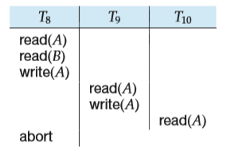

# Transaction Isolation and Atomicity

So far, we have studied schedules while assuming implicitly that there are no transaction failures. We now address the effect of transaction failures during concurrent execution.

**Figure 14.14** Schedule 9, a nonrecoverable schedule.

If a transaction _Ti_ fails, for whatever reason, we need to undo the effect of this transaction to ensure the atomicity property of the transaction. In a system that allows concurrent execution, the atomicity property requires that any trans- action _Tj_ that is dependent on _Ti_ (that is, _Tj_ has read data written by _Ti_ ) is also aborted. To achieve this, we need to place restrictions on the type of schedules permitted in the system.

In the following two subsections, we address the issue of what schedules are acceptable from the viewpoint of recovery from transaction failure. We describe in Chapter 15 how to ensure that only such acceptable schedules are generated.

## Recoverable Schedules

Consider the partial schedule 9 in Figure 14.14, in which T7 is a transaction that performs only one instruction: read(_A_). We call this a **partial schedule** because we have not included a **commit** or **abort** operation for T6\. Notice that T7 commits immediately after executing the read(_A_) instruction. Thus, T7 commits while T6 is still in the active state. Now suppose that T6 fails before it commits. T7 has read the value of data item _A_ written by T6\. Therefore, we say that T7 is **dependent** on T6\. Because of this, we must abort T7 to ensure atomicity. However, T7 has already committed and cannot be aborted. Thus, we have a situation where it is impossible to recover correctly from the failure of T6.

Schedule 9 is an example of a _nonrecoverable_ schedule. A **recoverable schedule** is one where, for each pair of transactions _Ti_ and _Tj_ such that _Tj_ reads a data item previously written by _Ti_ , the commit operation of _Ti_ appears before the commit operation of _Tj_ . For the example of schedule 9 to be recoverable, T7 would have to delay committing until after T6 commits.

##  Cascadeless Schedules

Even if a schedule is recoverable, to recover correctly from the failure of a trans- action _Ti_ , we may have to roll back several transactions. Such situations occur if transactions have read data written by _Ti_ . As an illustration, consider the partial schedule of Figure 14.15. Transaction T8 writes a value of _A_ that is read by transac- tion T9\. Transaction T9 writes a value of _A_ that is read by transaction T10\. Suppose that, at this point, T8 fails. T8 must be rolled back. Since T9 is dependent on T8, T9 must be rolled back. Since T10 is dependent on T9, T10 must be rolled back. This  

**Figure 14.15** Schedule 10.

phenomenon, in which a single transaction failure leads to a series of transaction rollbacks, is called **cascading rollback**.

Cascading rollback is undesirable, since it leads to the undoing of a significant amount of work. It is desirable to restrict the schedules to those where cascading rollbacks cannot occur. Such schedules are called _cascadeless_ schedules. Formally, a **cascadeless schedule** is one where, for each pair of transactions _Ti_ and _Tj_ such that _Tj_ reads a data item previously written by _Ti_ , the commit operation of _Ti_ appears before the read operation of _Tj_ . It is easy to verify that every cascadeless schedule is also recoverable.