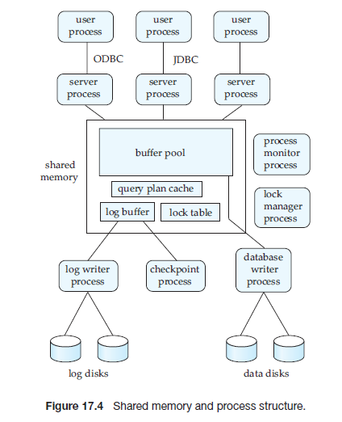
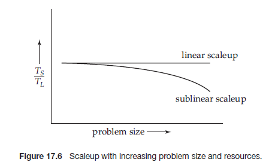
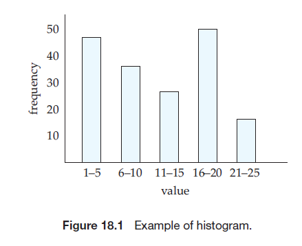
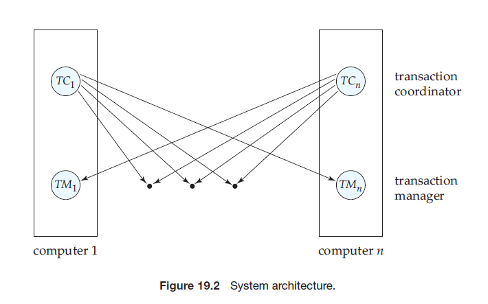
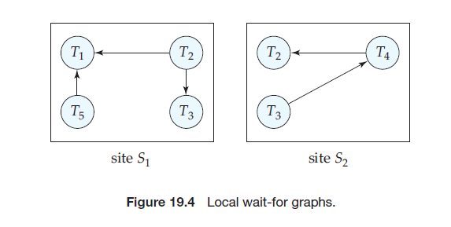
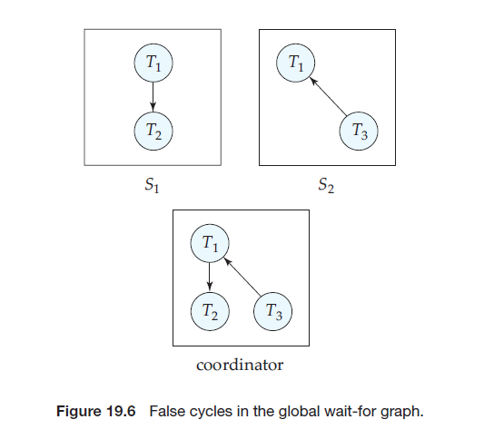
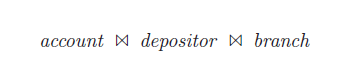
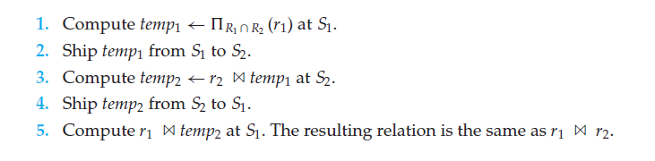

  

**PART 5**

# SYSTEM ARCHITECTURE
The architecture of a database system is greatly influenced by the underlying computer system on which the database system runs. Database systems can be centralized, where one server machine executes operations on the database. Database systems can also be designed to exploit parallel computer architectures. Distributed databases span multiple geographically separated machines.

Chapter 17 first outlines the architectures of database systems running on server systems, which are used in centralized and client–server architectures. The various processes that together implement the functionality of a database are outlined here. The chapter then outlines parallel computer architectures, and parallel database architectures designed for different types of parallel computers. Finally, the chapter outlines architectural issues in building a distributed database system.

Chapter 18 describes how various actions of a database, in particular query processing, can be implemented to exploit parallel processing.

Chapter 19 presents a number of issues that arise in a distributed database, and describes how to deal with each issue. The issues include how to store data, how to ensure atomicity of transactions that execute at multiple sites, how to perform concurrency control, and how to provide high availability in the presence of failures.a Cloud-based data storage systems, distributed query processing and directory systems are also described in this chapter.


**C H A P T E R 17**

# Database-System Architectures

The architecture of a database system is greatly influenced by the underlying computer system on which it runs, in particular by such aspects of computer architecture as networking, parallelism, and distribution:

- Networking of computers allows some tasks to be executed on a server system and some tasks to be executed on client systems. This division of work has led to _client–server database systems_.

- Parallel processing within a computer system allows database-system activi- ties to be speeded up, allowing faster response to transactions, as well as more transactions per second. Queries can be processed in a way that exploits the parallelism offered by the underlying computer system. The need for parallel query processing has led to _parallel database systems_.

- Distributing data across sites in an organization allows those data to reside where they are generated or most needed, but still to be accessible from other sites and from other departments. Keeping multiple copies of the database across different sites also allows large organizations to continue their database operations even when one site is affected by a natural disaster, such as flood, fire, or earthquake. _Distributed database systems_ handle geographically or ad- ministratively distributed data spread across multiple database systems.

We study the architecture of database systems in this chapter, starting with the traditional centralized systems, and covering client–server, parallel, and dis- tributed database systems.

## 17.1 Centralized and Client–Server Architectures

Centralized database systems are those that run on a single computer system and do not interact with other computer systems. Such database systems span a range from single-user database systems running on personal computers to high-performance database systems running on high-end server systems. Client server systems, on the other hand, have functionality split between a server system and multiple client systems.

### 17.1.1 Centralized Systems

A modern, general-purpose computer system consists of one to a few processors and a number of device controllers that are connected through a common bus that provides access to shared memory (Figure 17.1). The processors have local cache memories that store local copies of parts of the memory, to speed up access to data. Each processor may have several independent **cores**, each of which can execute a separate instruction stream. Each device controller is in charge of a specific type of device (for example, a disk drive, an audio device, or a video display). The processors and the device controllers can execute concurrently, competing for memory access. Cache memory reduces the contention for memory access, since it reduces the number of times that the processor needs to access the shared memory.

We distinguish two ways in which computers are used: as single-user systems and as multiuser systems. Personal computers and workstations fall into the first category. A typical **single-user system** is a desktop unit used by a single person, usually with only one processor and one or two hard disks, and usually only one person using the machine at a time. A typical **multiuser system**, on the other hand, has more disks and more memory and may have multiple processors. It serves a large number of users who are connected to the system remotely.

Database systems designed for use by single users usually do not provide many of the facilities that a multiuser database provides. In particular, they may not support concurrency control, which is not required when only a single user can generate updates. Provisions for crash recovery in such systems are either absent or primitive—for example, they may consist of simply making a backup of the database before any update. Some such systems do not support SQL, and they provide a simpler query language, such as a variant of QBE. In contrast,


database systems designed for multiuser systems support the full transactional features that we have studied earlier.

Although most general-purpose computer systems in use today have multiple processors, they have **coarse-granularity parallelism**, with only a few processors (about two to four, typically), all sharing the main memory. Databases running on such machines usually do not attempt to partition a single query among the processors; instead, they run each query on a single processor, allowing multiple queries to run concurrently. Thus, such systems support a higher throughput; that is, they allow a greater number of transactions to run per second, although individual transactions do not run any faster.

Databases designed for single-processor machines already provide multitask- ing, allowing multiple processes to run on the same processor in a time-shared manner, giving a view to the user of multiple processes running in parallel. Thus, coarse-granularity parallel machines logically appear to be identical to single- processor machines, and database systems designed for time-shared machines can be easily adapted to run on them.

In contrast, machines with **fine-granularity parallelism** have a large num- ber of processors, and database systems running on such machines attempt to parallelize single tasks (queries, for example) submitted by users. We study the architecture of parallel database systems in Section 17.3.

Parallelism is emerging as a critical issue in the future design of database systems. Whereas today those computer systems with multicore processors have only a few cores, future processors will have large numbers of cores.1 As a re- sult, parallel database systems, which once were specialized systems running on specially designed hardware, will become the norm.

### 17.1.2 Client–Server Systems

As personal computers became faster, more powerful, and cheaper, there was a shift away from the centralized system architecture. Personal computers sup- planted terminals connected to centralized systems. Correspondingly, personal computers assumed the user-interface functionality that used to be handled di- rectly by the centralized systems. As a result, centralized systems today act as **server systems** that satisfy requests generated by _client systems_. Figure 17.2 shows the general structure of a client–server system.

Functionality provided by database systems can be broadly divided into two parts—the front end and the back end. The back end manages access structures, query evaluation and optimization, concurrency control, and recovery. The front end of a database system consists of tools such as the SQL user interface, forms interfaces, report generation tools, and data mining and analysis tools (see Fig- ure 17.3). The interface between the front end and the back end is through SQL, or through an application program.

^1^The reasons for this pertain to issues in computer architecture related to heat generation and power consumption. Rather than make processors significantly faster, computer architects are using advances in chip design to put more cores on a single chip, a trend likely to continue for some time.  


- Standards such as _ODBC_ and _JDBC_, which we saw in Chapter 3, were developed to interface clients with servers. Any client that uses the ODBC or JDBC interface can connect to any server that provides the interface.

- Certain application programs, such as spreadsheets and statistical-analysis packages, use the client–server interface directly to access data from a back-end server. In effect, they provide front ends specialized for particular tasks.

- Systems that deal with large numbers of users adopt a three-tier architecture, which we saw earlier in Figure 1.6 (Chapter 1), where the front end is a Web browser that talks to an application server. The application server, in effect, acts  as a client to the database server.

- Some transaction-processing systems provide a **transactional remote proce- dure call** interface to connect clients with a server. These calls appear like ordi- nary procedure calls to the programmer, but all the remote procedure calls from a client are enclosed in a single transaction at the server end. Thus, if the transaction aborts, the server can undo the effects of the individual remote procedure calls.

## 17.2 Server System Architectures

Server systems can be broadly categorized as transaction servers and data servers.


- **Transaction-server** systems, also called **query-server** systems, provide an in- terface to which clients can send requests to perform an action, in response to which they execute the action and send back results to the client. Usually, client machines ship transactions to the server systems, where those transac- tions are executed, and results are shipped back to clients that are in charge of displaying the data. Requests may be specified by using SQL, or through a specialized application program interface.

- **Data-server systems** allow clients to interact with the servers by making requests to read or update data, in units such as files or pages. For example, file servers provide a file-system interface where clients can create, update, read, and delete files. Data servers for database systems offer much more functionality; they support units of data—such as pages, tuples, or objects —that are smaller than a file. They provide indexing facilities for data, and provide transaction facilities so that the data are never left in an inconsistent state if a client machine or process fails.

Of these, the transaction-server architecture is by far the more widely used archi- tecture. We shall elaborate on the transaction-server and data-server architectures in Sections 17.2.1 and 17.2.2.

### 17.2.1 Transaction Servers

A typical transaction-server system today consists of multiple processes accessing data in shared memory, as in Figure 17.4. The processes that form part of the database system include:

- **Server processes**: These are processes that receive user queries (transactions), execute them, and send the results back. The queries may be submitted to the server processes from a user interface, or from a user process running embed- ded SQL, or via JDBC, ODBC, or similar protocols. Some database systems use a separate process for each user session, and a few use a single database pro- cess for all user sessions, but with multiple threads so that multiple queries can execute concurrently. (A **thread** is like a process, but multiple threads execute as part of the same process, and all threads within a process run in the same virtual-memory space. Multiple threads within a process can exe- cute concurrently.) Many database systems use a hybrid architecture, with multiple processes, each one running multiple threads.

- **Lock manager process**: This process implements lock manager functionality, which includes lock grant, lock release, and deadlock detection.

- **Database writer process**: There are one or more processes that output modi- fied buffer blocks back to disk on a continuous basis.

- **Log writer process**: This process outputs log records from the log record buffer to stable storage. Server processes simply add log records to the log  




record buffer in shared memory, and if a log force is required, they request the log writer process to output log records.

- **Checkpoint process**: This process performs periodic checkpoints.

- **Process monitor process**: This process monitors other processes, and if any of them fails, it takes recovery actions for the process, such as aborting any transaction being executed by the failed process, and then restarting the process.

The shared memory contains all shared data, such as:

- Buffer pool.

- Lock table.

- Log buffer, containing log records waiting to be output to the log on stable storage.  


- Cached query plans, which can be reused if the same query is submitted again.

All database processes can access the data in shared memory. Since multiple processes may read or perform updates on data structures in shared memory, there must be a mechanism to ensure that a data structure is modified by at most one process at a time, and no process is reading a data structure while it is being written by others. Such **mutual exclusion** can be implemented by means of operating system functions called semaphores. Alternative implementations, with less overhead, use special **atomic instructions** supported by the computer hardware; one type of atomic instruction tests a memory location and sets it to 1 atomically. Further implementation details of mutual exclusion can be found in any standard operating system textbook. The mutual exclusion mechanisms are also used to implement latches.

To avoid the overhead of message passing, in many database systems, server processes implement locking by directly updating the lock table (which is in shared memory), instead of sending lock request messages to a lock manager process. The lock request procedure executes the actions that the lock manager process would take on getting a lock request. The actions on lock request and release are like those in Section 15.1.4, but with two significant differences:

- Since multiple server processes may access shared memory, mutual exclusion must be ensured on the lock table.

- If a lock cannot be obtained immediately because of a lock conflict, the lock request code may monitor the lock table to check when the lock has been granted. The lock release code updates the lock table to note which process has been granted the lock.

To avoid repeated checks on the lock table, operating system semaphores can be used by the lock request code to wait for a lock grant notification. The lock release code must then use the semaphore mechanism to notify waiting transactions that their locks have been granted.

Even if the system handles lock requests through shared memory, it still uses the lock manager process for deadlock detection.

### 17.2.2 Data Servers

Data-server systems are used in local-area networks, where there is a high-speed connection between the clients and the server, the client machines are comparable in processing power to the server machine, and the tasks to be executed are computation intensive. In such an environment, it makes sense to ship data to client machines, to perform all processing at the client machine (which may take a while), and then to ship the data back to the server machine. Note that this architecture requires full back-end functionality at the clients. Data-server architectures have been particularly popular in object-oriented database systems (Chapter 22).  


Interesting issues arise in such an architecture, since the time cost of com- munication between the client and the server is high compared to that of a local memory reference (milliseconds, versus less than 100 nanoseconds):

- **Page shipping** versus **item shipping**. The unit of communication for data can be of coarse granularity, such as a page, or fine granularity, such as a tuple (or an object, in the context of object-oriented database systems). We use the term **item** to refer to both tuples and objects.

If the unit of communication is a single item, the overhead of message passing is high compared to the amount of data transmitted. Instead, when an item is requested, it makes sense also to send back other items that are likely to be used in the near future. Fetching items even before they are requested is called **prefetching**. Page shipping can be considered a form of prefetching if multiple items reside on a page, since all the items in the page are shipped when a process desires to access a single item in the page.

- **Adaptive lock granularity**. Locks are usually granted by the server for the data items that it ships to the client machines. A disadvantage of page ship- ping is that client machines may be granted locks of too coarse a granularity —a lock on a page implicitly locks all items contained in the page. Even if the client is not accessing some items in the page, it has implicitly acquired locks on all prefetched items. Other client machines that require locks on those items may be blocked unnecessarily. Techniques for lock **de-escalation** have been proposed where the server can request its clients to transfer back locks on prefetched items. If the client machine does not need a prefetched item, it can transfer locks on the item back to the server, and the locks can then be allocated to other clients.

- **Data caching**. Data that are shipped to a client on behalf of a transaction can be **cached** at the client, even after the transaction completes, if sufficient storage space is available. Successive transactions at the same client may be able to make use of the cached data. However, **cache coherency** is an issue: Even if a transaction finds cached data, it must make sure that those data are up to date, since they may have been updated by a different client after they were cached. Thus, a message must still be exchanged with the server to check validity of the data, and to acquire a lock on the data.

- **Lock caching**. If the use of data is mostly partitioned among the clients, with clients rarely requesting data that are also requested by other clients, locks can also be cached at the client machine. Suppose that a client finds a data item in the cache, and that it also finds the lock required for an access to the data item in the cache. Then, the access can proceed without any communication with the server. However, the server must keep track of cached locks; if a client requests a lock from the server, the server must **call back** all conflicting locks on the data item from any other client machines that have cached the locks. The task becomes more complicated when machine failures are taken into account. This technique differs from lock de-escalation in that lock caching takes place across transactions; otherwise, the two techniques are similar.  

The bibliographical references provide more information about client–server database systems.

### 17.2.3 Cloud-Based Servers

Servers are usually owned by the enterprise providing the service, but there is an increasing trend for service providers to rely at least in part upon servers that are owned by a “third party” that is neither the client nor the service provider.

One model for using third-party servers is to outsource the entire service to another company that hosts the service on its own computers using its own software. This allows the service provider to ignore most details of technology and focus on the marketing of the service.

Another model for using third-party servers is **cloud computing**, in which the service provider runs its own software, but runs it on computers provided by another company. Under this model, the third party does not provide any of the application software; it provides only a collection of machines. These machines are not “real” machines, but rather simulated by software that allows a single real computer to simulate several independent computers. Such simulated machines are called **virtual machines**. The service provider runs its software (possibly including a database system) on these virtual machines. A major advantage of cloud computing is that the service provider can add machines as needed to meet demand and release them at times of light load. This can prove to be highly cost-effective in terms of both money and energy.

A third model uses a cloud computing service as a data server; such _cloud-based data storage_ systems are covered in detail in Section 19.9. Database applications using cloud-based storage may run on the same cloud (that is, the same set of machines), or on another cloud. The bibliographical references provide more information about cloud-computing systems.

## 17.3 Parallel Systems

Parallel systems improve processing and I/O speeds by using multiple processors and disks in parallel. Parallel machines are becoming increasingly common, mak- ing the study of parallel database systems correspondingly more important. The driving force behind parallel database systems is the demands of applications that have to query extremely large databases (of the order of terabytes—that is, 10^12^ bytes) or that have to process an extremely large number of transactions per sec- ond (of the order of thousands of transactions per second). Centralized and client –server database systems are not powerful enough to handle such applications.

In parallel processing, many operations are performed simultaneously, as opposed to serial processing, in which the computational steps are performed se- quentially. A **coarse-grain** parallel machine consists of a small number of powerful processors; a **massively parallel** or **fine-grain parallel** machine uses thousands of smaller processors. Virtually all high-end machines today offer some degree of coarse-grain parallelism: at least two or four processors. Massively parallel computers can be distinguished from the coarse-grain parallel machines by the much larger degree of parallelism that they support. Parallel computers with hundreds of processors and disks are available commercially.

There are two main measures of performance of a database system: (1) **throughput**, the number of tasks that can be completed in a given time inter- val, and (2) **response time**, the amount of time it takes to complete a single task from the time it is submitted. A system that processes a large number of small transactions can improve throughput by processing many transactions in paral- lel. A system that processes large transactions can improve response time as well as throughput by performing subtasks of each transaction in parallel.

### 17.3.1 Speedup and Scaleup

Two important issues in studying parallelism are speedup and scaleup. Running a given task in less time by increasing the degree of parallelism is called **speedup**. Handling larger tasks by increasing the degree of parallelism is called **scaleup**.

Consider a database application running on a parallel system with a certain number of processors and disks. Now suppose that we increase the size of the system by increasing the number of processors, disks, and other components of the system. The goal is to process the task in time inversely proportional to the number of processors and disks allocated. Suppose that the execution time of a task on the larger machine is _T_~L~ , and that the execution time of the same task on the smaller machine is _T_~S~. The speedup due to parallelism is defined as _T~S~/T~L~_ . The parallel system is said to demonstrate **linear speedup** if the speedup is _N_ when the larger system has _N_ times the resources (processors, disk, and so on) of the smaller system. If the speedup is less than _N_, the system is said to demonstrate **sublinear speedup**. Figure 17.5 illustrates linear and sublinear speedup.

Scaleup relates to the ability to process larger tasks in the same amount of time by providing more resources. Let _Q_ be a task, and let _QN_ be a task that is _N_ times bigger than _Q_. Suppose that the execution time of task _Q_ on a given machine




_MS_ is _TS_, and the execution time of task _QN_ on a parallel machine _ML_ , which is _N_ times larger than _MS_, is _TL_ . The scaleup is then defined as _TS/TL_ . The parallel system _ML_ is said to demonstrate **linear scaleup** on task _Q_ if _TL_ \= _TS_. If _TL > TS_, the system is said to demonstrate **sublinear scaleup**. Figure 17.6 illustrates linear and sublinear scaleups (where the resources increase in proportion to problem size). There are two kinds of scaleup that are relevant in parallel database systems, depending on how the size of the task is measured:

- In **batch scaleup**, the size of the database increases, and the tasks are large jobs whose runtime depends on the size of the database. An example of such a task is a scan of a relation whose size is proportional to the size of the database. Thus, the size of the database is the measure of the size of the problem. Batch scaleup also applies in scientific applications, such as executing a query at an _N_\-times finer resolution or performing an _N_\-times longer simulation.

- In **transaction scaleup**, the rate at which transactions are submitted to the database increases and the size of the database increases proportionally to the transaction rate. This kind of scaleup is what is relevant in transaction- processing systems where the transactions are small updates—for example, a deposit or withdrawal from an account—and transaction rates grow as more accounts are created. Such transaction processing is especially well adapted for parallel execution, since transactions can run concurrently and independently on separate processors, and each transaction takes roughly the same amount of time, even if the database grows.

Scaleup is usually the more important metric for measuring efficiency of par- allel database systems. The goal of parallelism in database systems is usually to make sure that the database system can continue to perform at an acceptable speed, even as the size of the database and the number of transactions increases. Increasing the capacity of the system by increasing the parallelism provides a smoother path for growth for an enterprise than does replacing a centralized system with a faster machine (even assuming that such a machine exists). How- ever, we must also look at absolute performance numbers when using scaleup measures; a machine that scales up linearly may perform worse than a machine that scales less than linearly, simply because the latter machine is much faster to start off with.

A number of factors work against efficient parallel operation and can diminish both speedup and scaleup.

- **Start-up costs**. There is a start-up cost associated with initiating a single process. In a parallel operation consisting of thousands of processes, the _start-up time_ may overshadow the actual processing time, affecting speedup adversely.

- **Interference**. Since processes executing in a parallel system often access shared resources, a slowdown may result from the _interference_ of each new process as it competes with existing processes for commonly held resources, such as a system bus, or shared disks, or even locks. Both speedup and scaleup are affected by this phenomenon.

- **Skew**. By breaking down a single task into a number of parallel steps, we reduce the size of the average step. Nonetheless, the service time for the single slowest step will determine the service time for the task as a whole. It is often difficult to divide a task into exactly equal-sized parts, and the way that the sizes are distributed is therefore _skewed_. For example, if a task of size 100 is divided into 10 parts, and the division is skewed, there may be some tasks of size less than 10 and some tasks of size more than 10; if even one task happens to be of size 20, the speedup obtained by running the tasks in parallel is only five, instead of ten as we would have hoped.

### 17.3.2 Interconnection Networks

Parallel systems consist of a set of components (processors, memory, and disks) that can communicate with each other via an **interconnection network**. Fig- ure 17.7 shows three commonly used types of interconnection networks:

- **Bus**. All the system components can send data on and receive data from a sin- gle communication bus. This type of interconnection is shown in Figure 17.7a. The bus could be an Ethernet or a parallel interconnect. Bus architectures work well for small numbers of processors. However, they do not scale well with increasing parallelism, since the bus can handle communication from only one component at a time.

- **Mesh**. The components are nodes in a grid, and each component connects to all its adjacent components in the grid. In a two-dimensional mesh each node connects to four adjacent nodes, while in a three-dimensional mesh each node connects to six adjacent nodes. Figure 17.7b shows a two-dimensional mesh. 


Nodes that are not directly connected can communicate with one another by routing messages via a sequence of intermediate nodes that are directly connected to one another. The number of communication links grows as the number of components grows, and the communication capacity of a mesh therefore scales better with increasing parallelism.

- **Hypercube**. The components are numbered in binary, and a component is connected to another if the binary representations of their numbers differ in exactly one bit. Thus, each of the _n_ components is connected to log(_n_) other components. Figure 17.7c shows a hypercube with eight nodes. In a hypercube interconnection, a message from a component can reach any other component by going through at most log(_n_) links. In contrast, in a mesh architecture a component may be 2(√ _n_ − 1) links away from some of the other components (or √ _n_ links away, if the mesh interconnection wraps around at the edges of the grid). Thus communication delays in a hypercube are significantly lower than in a mesh.

### 17.3.3 Parallel Database Architectures

There are several architectural models for parallel machines. Among the most prominent ones are those in Figure 17.8 (in the figure, M denotes memory, P denotes a processor, and disks are shown as cylinders):

- **Shared memory**. All the processors share a common memory (Figure 17.8a).

- **Shared disk**. All the processors share a common set of disks (Figure 17.8b). Shared-disk systems are sometimes called **clusters**.

- **Shared nothing**. The processors share neither a common memory nor com- mon disk (Figure 17.8c).

- **Hierarchical**. This model is a hybrid of the preceding three architectures (Figure 17.8d).

In Sections 17.3.3.1 through 17.3.3.4, we elaborate on each of these models.  


Techniques used to speed up transaction processing on data-server systems, such as data and lock caching and lock de-escalation, outlined in Section 17.2.2, can also be used in shared-disk parallel databases as well as in shared-nothing parallel databases. In fact, they are very important for efficient transaction pro- cessing in such systems.

#### 17.3.3.1 Shared Memory

In a **shared-memory** architecture, the processors and disks have access to a com- mon memory, typically via a bus or through an interconnection network. The benefit of shared memory is extremely efficient communication between proces- sors—data in shared memory can be accessed by any processor without being moved with software. A processor can send messages to other processors much faster by using memory writes (which usually take less than a microsecond) than by sending a message through a communication mechanism. The downside of shared-memory machines is that the architecture is not scalable beyond 32 or 64 processors because the bus or the interconnection network becomes a bottleneck (since it is shared by all processors). Adding more processors does not help after a point, since the processors will spend most of their time waiting for their turn on the bus to access memory.

Shared-memory architectures usually have large memory caches at each pro- cessor, so that referencing of the shared memory is avoided whenever possible.  

However, at least some of the data will not be in the cache, and accesses will have to go to the shared memory. Moreover, the caches need to be kept coherent; that is, if a processor performs a write to a memory location, the data in that memory location should be either updated at or removed from any processor where the data are cached. Maintaining cache coherency becomes an increasing overhead with increasing numbers of processors. Consequently, shared-memory machines are not capable of scaling up beyond a point; current shared-memory machines cannot support more than 64 processors.

#### 17.3.3.2 Shared Disk

In the **shared-disk** model, all processors can access all disks directly via an in- terconnection network, but the processors have private memories. There are two advantages of this architecture over a shared-memory architecture. First, since each processor has its own memory, the memory bus is not a bottleneck. Second, it offers a cheap way to provide a degree of **fault tolerance**: If a processor (or its memory) fails, the other processors can take over its tasks, since the database is resident on disks that are accessible from all processors. We can make the disk subsystem itself fault tolerant by using a RAID architecture, as described in Chap- ter 10. The shared-disk architecture has found acceptance in many applications.

The main problem with a shared-disk system is again scalability. Although the memory bus is no longer a bottleneck, the interconnection to the disk sub- system is now a bottleneck; it is particularly so in a situation where the database makes a large number of accesses to disks. Compared to shared-memory systems, shared-disk systems can scale to a somewhat larger number of processors, but communication across processors is slower (up to a few milliseconds in the ab- sence of special-purpose hardware for communication), since it has to go through a communication network.

#### 17.3.3.3 Shared Nothing

In a **shared-nothing** system, each node of the machine consists of a processor, memory, and one or more disks. The processors at one node may communicate with another processor at another node by a high-speed interconnection network. A node functions as the server for the data on the disk or disks that the node owns. Since local disk references are serviced by local disks at each processor, the shared-nothing model overcomes the disadvantage of requiring all I/O to go through a single interconnection network; only queries, accesses to nonlocal disks, and result relations pass through the network. Moreover, the interconnection networks for shared-nothing systems are usually designed to be scalable, so that their transmission capacity increases as more nodes are added. Consequently, shared-nothing architectures are more scalable and can easily support a large number of processors. The main drawbacks of shared-nothing systems are the costs of communication and of nonlocal disk access, which are higher than in a shared-memory or shared-disk architecture since sending data involves software interaction at both ends.

#### 17.3.3.4 Hierarchical

The **hierarchical architecture** combines the characteristics of shared-memory, shared-disk, and shared-nothing architectures. At the top level, the system con- sists of nodes that are connected by an interconnection network and do not share disks or memory with one another. Thus, the top level is a shared-nothing ar- chitecture. Each node of the system could actually be a shared-memory system with a few processors. Alternatively, each node could be a shared-disk system, and each of the systems sharing a set of disks could be a shared-memory system. Thus, a system could be built as a hierarchy, with shared-memory architecture with a few processors at the base, and a shared-nothing architecture at the top, with possibly a shared-disk architecture in the middle. Figure 17.8d illustrates a hierarchical architecture with shared-memory nodes connected together in a shared-nothing architecture. Commercial parallel database systems today run on several of these architectures.

Attempts to reduce the complexity of programming such systems have yielded **distributed virtual-memory** architectures, where logically there is a single shared memory, but physically there are multiple disjoint memory systems; the virtual- memory-mapping hardware, coupled with system software, allows each pro- cessor to view the disjoint memories as a single virtual memory. Since access speeds differ, depending on whether the page is available locally or not, such an architecture is also referred to as a **nonuniform memory architecture** (**NUMA**).

## 17.4 Distributed Systems

In a **distributed database system**, the database is stored on several computers. The computers in a distributed system communicate with one another through various communication media, such as high-speed private networks or the In- ternet. They do not share main memory or disks. The computers in a distributed system may vary in size and function, ranging from workstations up to mainframe systems.

The computers in a distributed system are referred to by a number of dif- ferent names, such as **sites** or **nodes**, depending on the context in which they are mentioned. We mainly use the term **site**, to emphasize the physical distribu- tion of these systems. The general structure of a distributed system appears in Figure 17.9.

The main differences between shared-nothing parallel databases and dis- tributed databases are that distributed databases are typically geographically separated, are separately administered, and have a slower interconnection. An- other major difference is that, in a distributed database system, we differentiate between local and global transactions. A **local transaction** is one that accesses data only from sites where the transaction was initiated. A **global transaction**, on the other hand, is one that either accesses data in a site different from the one at which the transaction was initiated, or accesses data in several different sites.  


There are several reasons for building distributed database systems, including sharing of data, autonomy, and availability.

- **Sharing data.** The major advantage in building a distributed database system is the provision of an environment where users at one site may be able to access the data residing at other sites. For instance, in a distributed university system, where each campus stores data related to that campus, it is possible for a user in one campus to access data in another campus. Without this capability, the transfer of student records from one campus to another campus would have to resort to some external mechanism that would couple existing systems.

- **Autonomy.** The primary advantage of sharing data by means of data distribution is that each site is able to retain a degree of control over data that are stored locally. In a centralized system, the database administrator of the central site controls the database. In a distributed system, there is a global database administrator responsible for the entire system. A part of these responsibilities is delegated to the local database administrator for each site. Depending on the design of the distributed database system, each administrator may have a different degree of **local autonomy**. The possibility of local autonomy is often a major advantage of distributed databases.

- **Availability.** If one site fails in a distributed system, the remaining sites may be able to continue operating. In particular, if data items are **replicated** in several sites, a transaction needing a particular data item may find that item in any of several sites. Thus, the failure of a site does not necessarily imply the shutdown of the system.  


The failure of one site must be detected by the system, and appropriate action may be needed to recover from the failure. The system must no longer use the services of the failed site. Finally, when the failed site recovers or is repaired, mechanisms must be available to integrate it smoothly back into the system.

Although recovery from failure is more complex in distributed systems than in centralized systems, the ability of most of the system to continue to operate despite the failure of one site results in increased availability. Availability is crucial for database systems used for real-time applications. Loss of access to data by, for example, an airline may result in the loss of potential ticket buyers to competitors.

### 17.4.1 An Example of a Distributed Database

Consider a banking system consisting of four branches in four different cities. Each branch has its own computer, with a database of all the accounts maintained at that branch. Each such installation is thus a site. There also exists one single site that maintains information about all the branches of the bank.

To illustrate the difference between the two types of transactions—local and global—at the sites, consider a transaction to add $50 to account number A-177 located at the Valleyview branch. If the transaction was initiated at the Valleyview branch, then it is considered local; otherwise, it is considered global. A transaction to transfer $50 from account A-177 to account A-305, which is located at the Hillside branch, is a global transaction, since accounts in two different sites are accessed as a result of its execution.

In an ideal distributed database system, the sites would share a common global schema (although some relations may be stored only at some sites), all sites would run the same distributed database-management software, and the sites would be aware of each other’s existence. If a distributed database is built from scratch, it would indeed be possible to achieve the above goals. However, in reality a distributed database has to be constructed by linking together multiple already-existing database systems, each with its own schema and possibly running different database-management software. Such systems are sometimes called **multidatabase systems** or **heterogeneous distributed database systems**. We discuss these systems in Section 19.8, where we show how to achieve a degree of global control despite the heterogeneity of the component systems.

### 17.4.2 Implementation Issues

Atomicity of transactions is an important issue in building a distributed database system. If a transaction runs across two sites, unless the system designers are careful, it may commit at one site and abort at another, leading to an inconsistent state. Transaction commit protocols ensure such a situation cannot arise. The _two-phase commit protocol (_2PC_)_ is the most widely used of these protocols.  

The basic idea behind 2PC is for each site to execute the transaction until it enters the partially committed state, and then leave the commit decision to a sin- gle coordinator site; the transaction is said to be in the _ready_ state at a site at this point. The coordinator decides to commit the transaction only if the transaction reaches the ready state at every site where it executed; otherwise (for example, if the transaction aborts at any site), the coordinator decides to abort the transaction. Every site where the transaction executed must follow the decision of the coordinator. If a site fails when a transaction is in ready state, when the site recovers from failure it should be in a position to either commit or abort the transaction, depending on the decision of the coordinator. The 2PC protocol is described in detail in Section 19.4.1.

Concurrency control is another issue in a distributed database. Since a transaction may access data items at several sites, transaction managers at several sites may need to coordinate to implement concurrency control. If locking is used, lock- ing can be performed locally at the sites containing accessed data items, but there is also a possibility of deadlock involving transactions originating at multiple sites. Therefore deadlock detection needs to be carried out across multiple sites. Failures are more common in distributed systems since not only may computers fail, but communication links may also fail. Replication of data items, which is the key to the continued functioning of distributed databases when failures occur, further complicates concurrency control. Section 19.5 provides detailed coverage of concurrency control in distributed databases.

The standard transaction models, based on multiple actions carried out by a single program unit, are often inappropriate for carrying out tasks that cross the boundaries of databases that cannot or will not cooperate to implement protocols such as 2PC. Alternative approaches, based on _persistent messaging_ for communication, are generally used for such tasks; persistent messaging is discussed in Section 19.4.3.

When the tasks to be carried out are complex, involving multiple databases and/or multiple interactions with humans, coordination of the tasks and en- suring transaction properties for the tasks become more complicated. _Workflow management systems_ are systems designed to help with carrying out such tasks, and are described in Section 26.2.

In case an organization has to choose between a distributed architecture and a centralized architecture for implementing an application, the system architect must balance the advantages against the disadvantages of distribution of data. We have already seen the advantages of using distributed databases. The primary disadvantage of distributed database systems is the added complexity required to ensure proper coordination among the sites. This increased complexity takes various forms:

- **Software-development cost**. It is more difficult to implement a distributed database system; thus, it is more costly.

- **Greater potential for bugs**. Since the sites that constitute the distributed system operate in parallel, it is harder to ensure the correctness of algorithms,especially operation during failures of part of the system, and recovery from failures. The potential exists for extremely subtle bugs.

- **Increased processing overhead**. The exchange of messages and the addi- tional computation required to achieve intersite coordination are a form of overhead that does not arise in centralized systems.

There are several approaches to distributed database design, ranging from fully distributed designs to ones that include a large degree of centralization. We study them in Chapter 19.

## 17.5 Network Types

Distributed databases and client–server systems are built around communica- tion networks. There are basically two types of networks: **local-area networks** and **wide-area networks**. The main difference between the two is the way in which they are distributed geographically. In local-area networks, processors are distributed over small geographical areas, such as a single building or a number of adjacent buildings. In wide-area networks, on the other hand, a number of autonomous processors are distributed over a large geographical area (such as the United States or the entire world). These differences imply major variations in the speed and reliability of the communication network, and are reflected in the distributed operating-system design.


### 17.5.1 Local-Area Networks

**Local-area networks** (**LANs**) (Figure 17.10) emerged in the early 1970s as a way for computers to communicate and to share data with one another. People recognized that, for many enterprises, numerous small computers, each with its own self- contained applications, are more economical than a single large system. Because each small computer is likely to need access to a full complement of peripheral devices (such as disks and printers), and because some form of data sharing is likely to occur in a single enterprise, it was a natural step to connect these small systems into a network.

LANs are generally used in an office environment. All the sites in such systems are close to one another, so the communication links tend to have a higher speed and lower error rate than do their counterparts in wide-area networks. The most common links in a local-area network are twisted pair, coaxial cable, fiber optics, and wireless connections. Communication speeds range from tens of megabits per second (for wireless local-area networks), to 1 gigabit per second for Gigabit Ethernet. The most recent Ethernet standard is 10-gigabit Ethernet.

A **storage-area network** (**SAN**) is a special type of high-speed local-area net- work designed to connect large banks of storage devices (disks) to computers that use the data (see Figure 17.11).

Thus storage-area networks help build large-scale _shared-disk systems_. The motivation for using storage-area networks to connect multiple computers to large banks of storage devices is essentially the same as that for shared-disk databases, namely:

- Scalability by adding more computers.

- High availability, since data are still accessible even if a computer fails.


RAID organizations are used in the storage devices to ensure high availability of the data, permitting processing to continue even if individual disks fail. Storage- area networks are usually built with redundancy, such as multiple paths between nodes, so if a component such as a link or a connection to the network fails, the network continues to function.

### 17.5.2 Wide-Area Networks

**Wide-area networks** (**WANs**) emerged in the late 1960s, mainly as an academic research project to provide efficient communication among sites, allowing hardware and software to be shared conveniently and economically by a wide community of users. Systems that allowed remote terminals to be connected to a central computer via telephone lines were developed in the early 1960s, but they were not true WANs. The first WAN to be designed and developed was the _Arpanet_. Work on the Arpanet began in 1968. The Arpanet has grown from a four-site experimental network to a worldwide network of networks, the **Internet**, comprising hundreds of millions of computer systems. Typical links on the Internet are fiber-optic lines and, sometimes, satellite channels. Data rates for wide-area links typically range from a few megabits per second to hundreds of gigabits per second. The last link, to end user sites, has traditionally been the slowest link, using such technologies as _digital subscriber line_ (DSL) technology (supporting a few megabits per second) or dial-up modem connections over land-based telephone lines (supporting up to 56 kilobits per second). Today, the last link is typically a cable modem or fiber optic connection (each supporting tens of megabits per second), or a wireless connection supporting several megabits per second.

In addition to limits on data rates, communication in a WAN must also contend with significant **latency**: a message may take up to a few hundred milliseconds to be delivered across the world, both due to speed of light delays, and due to queuing delays at a number of routers in the path of the message. Applications whose data and computing resources are distributed geographically have to be carefully designed to ensure latency does not affect system performance excessively.

WANs can be classified into **two types:**

- In **discontinuous connection** WANs, such as those based on mobile wireless connections, hosts are connected to the network only part of the time.

- In **continuous connection** WANs, such as the wired Internet, hosts are connected to the network at all times.

Networks that are not continuously connected typically do not allow transactions across sites, but may keep local copies of remote data, and refresh the copies periodically (every night, for instance). For applications where consistency is not critical, such as sharing of documents, groupware systems such as Lotus Notes allow updates of remote data to be made locally, and the updates are then propagated back to the remote site periodically. There is a potential for conflicting updates at different sites, conflicts that have to be detected and resolved. A mechanism for detecting conflicting updates is described later, in Section 25.5.4; the resolution mechanism for conflicting updates is, however, application dependent.

## 17.6 Summary

- Centralized database systems run entirely on a single computer. With the growth of personal computers and local-area networking, the database front-end functionality has moved increasingly to clients, with server systems providing the back-end functionality. Client–server interface protocols have helped the growth of client–server database systems.

- Servers can be either transaction servers or data servers, although the use of transaction servers greatly exceeds the use of data servers for providing database services.

>- Transaction servers have multiple processes, possibly running on multiple processors. So that these processes have access to common data, such as the database buffer, systems store such data in shared memory. In addition to processes that handle queries, there are system processes that carry out tasks such as lock and log management and checkpointing.

>- Data-server systems supply raw data to clients. Such systems strive to minimize communication between clients and servers by caching data and locks at the clients. Parallel database systems use similar optimizations.

- Parallel database systems consist of multiple processors and multiple disks connected by a fast interconnection network. Speedup measures how much we can increase processing speed by increasing parallelism for a single trans- action. Scaleup measures how well we can handle an increased number of transactions by increasing parallelism. Interference, skew, and start-up costs act as barriers to getting ideal speedup and scaleup.

- Parallel database architectures include the shared-memory, shared-disk, share- d-nothing, and hierarchical architectures. These architectures have different trade-offs of scalability versus communication speed.

- A distributed database system is a collection of partially independent database systems that (ideally) share a common schema, and coordinate processing of transactions that access nonlocal data. The systems communicate with one another through a communication network.

- Local-area networks connect nodes that are distributed over small geograph- ical areas, such as a single building or a few adjacent buildings. Wide-area networks connect nodes spread over a large geographical area. The Internet is the most extensively used wide-area network today.

- Storage-area networks are a special type of local-area network designed to provide fast interconnection between large banks of storage devices and multiple computers.  

**Review Terms**

- Centralized systems 
- Server systems 
- Coarse-granularity parallelism 
- Fine-granularity parallelism 
- Database process structure 
- Mutual exclusion 
- Thread 
- Server processes

>- Lock manager process

>- Database writer process

>- Log writer process

>- Checkpoint process

>- Process monitor process

- Client–server systems 
- Transaction server 
- Query server 
- Data server

>- Prefetching

>- De-escalation

>- Data caching

>- Cache coherency

>- Lock caching

>- Call back

- Parallel systems 
- Throughput 
- Response time 
- Speedup

>- Linear speedup

>- Sublinear speedup

- Scaleup

>- Linear scaleup

>- Sublinear scaleup

>- Batch scaleup

>- Transaction scaleup

- Start-up costs 
- Interference 
- Skew 
- Interconnection networks

>- Bus

>- Mesh

>- Hypercube

>- Parallel database architectures

>-Shared memory

>- Shared disk (clusters)

>- Shared nothing

>- Hierarchical

- Fault tolerance 
- Distributed virtual memory 
- Nonuniform memory architecture
(NUMA) 
- Distributed systems 
- Distributed database

>- Sites (nodes)

>- Local transaction

>- Global transaction

>- Local autonomy

- Multidatabase systems 
- Network types

>- Local-area networks (LAN)

>- Wide-area networks (WAN)

>- Storage-area network (SAN)  


**Practice Exercises**

**17.1** Instead of storing shared structures in shared memory, an alternative architecture would be to store them in the local memory of a special process, and access the shared data by interprocess communication with the process. What would be the drawback of such an architecture?

**17.2** In typical client–server systems the server machine is much more pow- erful than the clients; that is, its processor is faster, it may have multiple processors, and it has more memory and disk capacity. Consider instead a scenario where client and server machines have exactly the same power. Would it make sense to build a client–server system in such a scenario? Why? Which scenario would be better suited to a data-server architecture?

**17.3** Consider a database system based on a client–server architecture, with the server acting as a data server.

>1. What is the effect of the speed of the interconnection between the client and the server on the choice between tuple and page shipping?

>2. If page shipping is used, the cache of data at the client can be orga- nized either as a tuple cache or a page cache. The page cache stores data in units of a page, while the tuple cache stores data in units of tuples. Assume tuples are smaller than pages. Describe one benefit of a tuple cache over a page cache.

**17.4** Suppose a transaction is written in C with embedded SQL, and about 80 percent of the time is spent in the SQL code, with the remaining 20 percent spent in C code. How much speedup can one hope to attain if parallelism is used only for the SQL code? Explain.

**17.5** Some database operations such as joins can see a significant difference in speed when data (for example, one of the relations involved in a join) fits in memory as compared to the situation where the data does not fit in memory. Show how this fact can explain the phenomenon of **superlinear speedup**, where an application sees a speedup greater than the amount of resources allocated to it.

**17.6** Parallel systems often have a network structure where sets of _n_ processors connect to a single Ethernet switch, and the Ethernet switches themselves connect to another Ethernet switch. Does this architecture correspond to a bus, mesh or hypercube architecture? If not, how would you describe this interconnection architecture?

**Exercises**

**17.7** Why is it relatively easy to port a database from a single processor machine to a multiprocessor machine if individual queries need not be parallelized?  

**17.8** Transaction-server architectures are popular for client–server relational databases, where transactions are short. On the other hand, data-server architectures are popular for client–server object-oriented database sys- tems, where transactions are expected to be relatively long. Give two reasons why data servers may be popular for object-oriented databases but not for relational databases.

**17.9** What is lock de-escalation, and under what conditions is it required? Why is it not required if the unit of data shipping is an item?

**17.10** Suppose you were in charge of the database operations of a company whose main job is to process transactions. Suppose the company is grow- ing rapidly each year, and has outgrown its current computer system. When you are choosing a new parallel computer, what measure is most relevant—speedup, batch scaleup, or transaction scaleup? Why?

**17.11** Database systems are typically implemented as a set of processes (or threads) sharing a shared memory area.

a. How is access to the shared memory area controlled?

b. Is two-phase locking appropriate for serializing access to the data structures in shared memory? Explain your answer.

**17.12** Is it wise to allow a user process to access the shared memory area of a database system? Explain your answer.

**17.13** What are the factors that can work against linear scaleup in a transaction processing system? Which of the factors are likely to be the most important in each of the following architectures: shared memory, shared disk, and shared nothing?

**17.14** Memory systems can be divided into multiple modules, each of which can be serving a separate request at a given time. What impact would such a memory architecture have on the number of processors that can be supported in a shared-memory system?

**17.15** Consider a bank that has a collection of sites, each running a database sys- tem. Suppose the only way the databases interact is by electronic transfer of money between themselves, using persistent messaging. Would such a system qualify as a distributed database? Why?

## Bibliographical Notes

Hennessy et al.[2006\] provides an excellent introduction to the area of computer architecture. Abadi[2009\] provides an excellent introduction to cloud computing and the challenges of running database transactions in such an environment.

Gray and Reuter [1993\] provides a textbook description of transaction pro- cessing, including the architecture of client–server and distributed systems. The  bibliographical notes of Chapter 5 provide references to more information on ODBC, JDBC, and other database access APIs.

DeWitt and Gray [1992\] surveys parallel database systems, including their architecture and performance measures. A survey of parallel computer architec- tures is presented by Duncan [1990\]. Dubois and Thakkar [1992\] is a collection of papers on scalable shared-memory architectures. DEC clusters running Rdb were among the early commercial users of the shared-disk database architecture. Rdb is now owned by Oracle, and is called Oracle Rdb. The Teradata database machine was among the earliest commercial systems to use the shared-nothing database architecture. The Grace and the Gamma research prototypes also used shared-nothing architectures.

Ozsu and Valduriez [1999\] provides textbook coverage of distributed database systems. Further references pertaining to parallel and distributed database sys- tems appear in the bibliographical notes of Chapters 18 and 19, respectively.

Comer [2009\], Halsall [2006\], and Thomas [1996\] describe computer network- ing and the Internet. Tanenbaum [2002\], Kurose and Ross [2005\], and Peterson and Davie [2007\] provide general overviews of computer networks.   

# C H A P T E R 18 
# Parallel Databases

In this chapter, we discuss fundamental algorithms for parallel database systems that are based on the relational data model. In particular, we focus on the place- ment of data on multiple disks and the parallel evaluation of relational operations, both of which have been instrumental in the success of parallel databases.

## 18.1 Introduction

At one point over two decades ago, parallel database systems had been nearly written off, even by some of their staunchest advocates. Today, they are suc- cessfully marketed by practically every database-system vendor. Several trends fueled this transition:

- The transaction requirements of organizations have grown with increasing use of computers. Moreover, the growth of the World Wide Web has created many sites with millions of viewers, and the increasing amounts of data collected from these viewers has produced extremely large databases at many companies.

- Organizations are using these increasingly large volumes of data—such as data about what items people buy, what Web links users click on, and when people make telephone calls—to plan their activities and pricing. Queries used for such purposes are called **decision-support queries**, and the data requirements for such queries may run into terabytes. Single-processor sys- tems are not capable of handling such large volumes of data at the required rates.

- The set-oriented nature of database queries naturally lends itself to parallelization. A number of commercial and research systems have demonstrated the power and scalability of parallel query processing.

- As microprocessors have become cheap, parallel machines have become common and relatively inexpensive.

- Individual processors have themselves become parallel machines using multicore architectures.

As we discussed in Chapter 17, parallelism is used to provide speedup, where queries are executed faster because more resources, such as processors and disks, are provided. Parallelism is also used to provide scaleup, where increasing work- loads are handled without increased response time, via an increase in the degree of parallelism.

We outlined in Chapter 17 the different architectures for parallel database systems: shared-memory, shared-disk, shared-nothing, and hierarchical architectures. Briefly, in shared-memory architectures, all processors share a common memory and disks; in shared-disk architectures, processors have independent memories, but share disks; in shared-nothing architectures, processors share neither memory nor disks; and hierarchical architectures have nodes that share neither memory nor disks with each other, but internally each node has a shared- memory or a shared-disk architecture.

## 18.2 I/O Parallelism

In its simplest form, **I/O parallelism** refers to reducing the time required to retrieve relations from disk by partitioning the relations over multiple disks. The most common form of data partitioning in a parallel database environment is _horizontal partitioning_. In **horizontal partitioning**, the tuples of a relation are divided (or declustered) among many disks, so that each tuple resides on one disk. Several partitioning strategies have been proposed.

### 18.2.1 Partitioning Techniques

We present three basic data-partitioning strategies. Assume that there are _n_ disks, _D_~0~, D_~1~, . . . , _D_~n−1~, across which the data are to be partitioned.

- **Round-robin**. This strategy scans the relation in any order and sends the _i_th tuple to disk number _D~i~ mod n_. The round-robin scheme ensures an even distribution of tuples across disks; that is, each disk has approximately the same number of tuples as the others.

- **Hash partitioning**. This declustering strategy designates one or more attributes from the given relation’s schema as the partitioning attributes. A hash function is chosen whose range is {0_,_ 1_, . . . , n_ − 1}. Each tuple of the original relation is hashed on the partitioning attributes. If the hash function returns _i_ , then the tuple is placed on disk _D_~i~ .1

- **Range partitioning**. This strategy distributes tuples by assigning contiguous attribute-value ranges to each disk. It chooses a partitioning attribute, _A_, and a **partitioning vector** [_v_~0~, _v_~1~, . . . , _v_~n−2~\], such that, if _i < j_ , then _v~i~ < _v_~j~ . The relation is partitioned as follows: Consider a tuple _t_ such that _t_[_A_\] = _x_. If _x < v_~0~, then _t_ goes on disk _D_~0~\. If _x_ ≥ _v~n−2~, then _t_ goes on disk _D_~n−1~. If _v~i~_ ≤ _x < v~i~_+1, then _t_ goes on disk _D_~+1~.

For example, range partitioning with three disks numbered 0, 1, and 2 may assign tuples with values less than 5 to disk 0, values between 5 and 40 to disk 1, and values greater than 40 to disk 2.

## 18.2.2 Comparison of Partitioning Techniques

Once a relation has been partitioned among several disks, we can retrieve it in parallel, using all the disks. Similarly, when a relation is being partitioned, it can be written to multiple disks in parallel. Thus, the transfer rates for reading or writing an entire relation are much faster with I/O parallelism than without it. However, reading an entire relation, or _scanning a relation_, is only one kind of access to data. Access to data can be classified as follows:

**1\.** Scanning the entire relation.

**2\.** Locating a tuple associatively (for example, _employee name_ \= “Campbell”); these queries, called **point queries**, seek tuples that have a specified value for a specific attribute.

**3\.** Locating all tuples for which the value of a given attribute lies within a specified range (for example, 10000 _< salar y <_ 20000); these queries are called **range queries**.

The different partitioning techniques support these types of access at different levels of efficiency:

- **Round-robin.** The scheme is ideally suited for applications that wish to read the entire relation sequentially for each query. With this scheme, both point queries and range queries are complicated to process, since each of the _n_ disks must be used for the search.

- **Hash partitioning.** This scheme is best suited for point queries based on the partitioning attribute. For example, if a relation is partitioned on the _telephone number_ attribute, then we can answer the query “Find the record of the employee with _telephone number_ \= 555-3333” by applying the partitioning hash function to 555-3333 and then searching that disk. Directing a query to a single disk saves the start-up cost of initiating a query on multiple disks, and leaves the other disks free to process other queries.

Hash partitioning is also useful for sequential scans of the entire relation. If the hash function is a good randomizing function, and the partitioning attributes form a key of the relation, then the number of tuples in each of the disks is approximately the same, without much variance. Hence, the time taken to scan the relation is approximately 1_/n_ of the time required to scan the relation in a single disk system.

The scheme, however, is not well suited for point queries on nonpartitioning attributes. Hash-based partitioning is also not well suited for answering range queries, since, typically, hash functions do not preserve proximity within a range. Therefore, all the disks need to be scanned for range queries to be answered.

- **Range partitioning.** This scheme is well suited for point and range queries on the partitioning attribute. For point queries, we can consult the partitioning vector to locate the disk where the tuple resides. For range queries, we consult the partitioning vector to find the range of disks on which the tuples may reside. In both cases, the search narrows to exactly those disks that might have any tuples of interest.

An advantage of this feature is that, if there are only a few tuples in the queried range, then the query is typically sent to one disk, as opposed to all the disks. Since other disks can be used to answer other queries, range partitioning results in higher throughput while maintaining good response time. On the other hand, if there are many tuples in the queried range (as there are when the queried range is a larger fraction of the domain of the relation), many tuples have to be retrieved from a few disks, resulting in an I/O bottleneck (hot spot) at those disks. In this example of **execution skew**, all processing occurs in one—or only a few—partitions. In contrast, hash partitioning and round-robin partitioning would engage all the disks for such queries, giving a faster response time for approximately the same throughput.

The type of partitioning also affects other relational operations, such as joins, as we shall see in Section 18.5. Thus, the choice of partitioning technique also depends on the operations that need to be executed. In general, hash partitioning or range partitioning are preferred to round-robin partitioning.

In a system with many disks, the number of disks across which to partition a relation can be chosen in this way: If a relation contains only a few tuples that will fit into a single disk block, then it is better to assign the relation to a single disk. Large relations are preferably partitioned across all the available disks. If a relation consists of _m_ disk blocks and there are _n_ disks available in the system, then the relation should be allocated **min**(_m, n_) disks.

## 18.2.3 Handling of Skew

When a relation is partitioned (by a technique other than round-robin), there may be a **skew** in the distribution of tuples, with a high percentage of tuples placed in some partitions and fewer tuples in other partitions. The ways that skew may appear are classified as:

- Attribute-value skew.

- Partition skew.

**Attribute-value skew** refers to the fact that some values appear in the par- titioning attributes of many tuples. All the tuples with the same value for the partitioning attribute end up in the same partition, resulting in skew. **Partition skew** refers to the fact that there may be load imbalance in the partitioning, even when there is no attribute skew.

Attribute-value skew can result in skewed partitioning regardless of whether range partitioning or hash partitioning is used. If the partition vector is not chosen carefully, range partitioning may result in partition skew. Partition skew is less likely with hash partitioning, if a good hash function is chosen.

As Section 17.3.1 noted, even a small skew can result in a significant decrease in performance. Skew becomes an increasing problem with a higher degree of parallelism. For example, if a relation of 1000 tuples is divided into 10 parts, and the division is skewed, then there may be some partitions of size less than 100 and some partitions of size more than 100; if even one partition happens to be of size 200, the speedup that we would obtain by accessing the partitions in parallel is only 5, instead of the 10 for which we would have hoped. If the same relation has to be partitioned into 100 parts, a partition will have 10 tuples on an average. If even one partition has 40 tuples (which is possible, given the large number of partitions) the speedup that we would obtain by accessing them in parallel would be 25, rather than 100. Thus, we see that the loss of speedup due to skew increases with parallelism.

A **balanced range-partitioning vector** can be constructed by sorting: The relation is first sorted on the partitioning attributes. The relation is then scanned in sorted order. After every 1/n of the relation has been read, the value of the partitioning attribute of the next tuple is added to the partition vector. Here, n denotes the number of partitions to be constructed. In case there are many tuples with the same value for the partitioning attribute, the technique can still result in some skew. The main disadvantage of this method is the extra I/O overhead incurred in doing the initial sort.

The I/O overhead for constructing balanced range-partition vectors can be reduced by constructing and storing a frequency table, or **histogram**, of the at- tribute values for each attribute of each relation. Figure 18.1 shows an example of a histogram for an integer-valued attribute that takes values in the range 1 to 25. A histogram takes up only a little space, so histograms on several different attributes can be stored in the system catalog. It is straightforward to construct a balanced range-partitioning function given a histogram on the partitioning attributes. If the histogram is not stored, it can be computed approximately by sampling the relation, using only tuples from a randomly chosen subset of the disk blocks of the relation.

Another approach to minimizing the effect of skew, particularly with range partitioning, is to use _virtual processors_. In the **virtual processor** approach, we pretend there are several times as many _virtual processors_ as the number of real processors. Any of the partitioning techniques and query-evaluation techniques that we study later in this chapter can be used, but they map tuples and work to virtual processors instead of to real processors. Virtual processors, in turn, are mapped to real processors, usually by round-robin partitioning.

The idea is that even if one range had many more tuples than the others because of skew, these tuples would get split across multiple virtual processor  



ranges. Round-robin allocation of virtual processors to real processors would distribute the extra work among multiple real processors, so that one processor does not have to bear all the burden.

## 18.3 Interquery Parallelism

In **interquery parallelism**, different queries or transactions execute in parallel with one another. Transaction throughput can be increased by this form of parallelism. However, the response times of individual transactions are no faster than they would be if the transactions were run in isolation. Thus, the primary use of interquery parallelism is to scale up a transaction-processing system to support a larger number of transactions per second.

Interquery parallelism is the easiest form of parallelism to support in a database system—particularly in a shared-memory parallel system. Database systems designed for single-processor systems can be used with few or no changes on a shared-memory parallel architecture, since even sequential database systems support concurrent processing. Transactions that would have operated in a time- shared concurrent manner on a sequential machine operate in parallel in the shared-memory parallel architecture.

Supporting interquery parallelism is more complicated in a shared-disk or shared-nothing architecture. Processors have to perform some tasks, such as locking and logging, in a coordinated fashion, and that requires that they pass messages to each other. A parallel database system must also ensure that two processors do not update the same data independently at the same time. Further, when a processor accesses or updates data, the database system must ensure that the processor has the latest version of the data in its buffer pool. The problem of ensuring that the version is the latest is known as the **cache-coherency** problem.  

## 18.4 Intraquery Parallelism 803

Various protocols are available to guarantee cache coherency; often, cachecoherency protocols are integrated with concurrency-control protocols so that their overhead is reduced. One such protocol for a shared-disk system is this:

**1\.** Before any read or write access to a page, a transaction locks the page in shared or exclusive mode, as appropriate. Immediately after the transaction obtains either a shared or exclusive lock on a page, it also reads the most recent copy of the page from the shared disk.

**2\.** Before a transaction releases an exclusive lock on a page, it flushes the page to the shared disk; then, it releases the lock.

This protocol ensures that, when a transaction sets a shared or exclusive lock on a page, it gets the correct copy of the page.

More complex protocols avoid the repeated reading and writing to disk required by the preceding protocol. Such protocols do not write pages to disk when exclusive locks are released. When a shared or exclusive lock is obtained, if the most recent version of a page is in the buffer pool of some processor, the page is obtained from there. The protocols have to be designed to handle concurrent requests. The shared-disk protocols can be extended to shared-nothing architectures by this scheme: Each page has a **home processor** _P_~i~ , and is stored on disk _D_~i~ . When other processors want to read or write the page, they send requests to the home processor _P_~i~ of the page, since they cannot directly communicate with the disk. The other actions are the same as in the shared-disk protocols.

The Oracle and Oracle Rdb systems are examples of shared-disk parallel database systems that support interquery parallelism.

## 18.4 Intraquery Parallelism

**Intraquery parallelism** refers to the execution of a single query in parallel on multiple processors and disks. Using intraquery parallelism is important for speeding up long-running queries. Interquery parallelism does not help in this task, since each query is run sequentially.

To illustrate the parallel evaluation of a query, consider a query that requires a relation to be sorted. Suppose that the relation has been partitioned across multiple disks by range partitioning on some attribute, and the sort is requested on the partitioning attribute. The sort operation can be implemented by sorting each partition in parallel, then concatenating the sorted partitions to get the final sorted relation.

Thus, we can parallelize a query by parallelizing individual operations. There is another source of parallelism in evaluating a query: The _operator tree_ for a query can contain multiple operations. We can parallelize the evaluation of the operator tree by evaluating in parallel some of the operations that do not depend on one another. Further, as Chapter 12 mentions, we may be able to pipeline the output of one operation to another operation. The two operations can be executed in parallel on separate processors, one generating output that is consumed by the other, even as it is generated.

In summary, the execution of a single query can be parallelized in two different ways:

- **Intraoperation parallelism**. We can speed up processing of a query by par- allelizing the execution of each individual operation, such as sort, select, project, and join. We consider intraoperation parallelism in Section 18.5.

- **Interoperation parallelism**. We can speed up processing of a query by exe- cuting in parallel the different operations in a query expression. We consider this form of parallelism inection 18.6.

The two forms of parallelism are complementary, and can be used simultaneously on a query. Since the number of operations in a typical query is small, compared to the number of tuples processed by each operation, the first form of parallelism can scale better with increasing parallelism. However, with the relatively small number of processors in typical parallel systems today, both forms of parallelism are important.

In the following discussion of parallelization of queries, we assume that the queries are **read only**. The choice of algorithms for parallelizing query evaluation depends on the machine architecture. Rather than present algorithms for each architecture separately, we use a shared-nothing architecture model in our description. Thus, we explicitly describe when data have to be transferred from one processor to another. We can simulate this model easily by using the other architectures, since transfer of data can be done via shared memory in a shared- memory architecture, and via shared disks in a shared-disk architecture. Hence, algorithms for shared-nothing architectures can be used on the other architectures, too. We mention occasionally how the algorithms can be further optimized for shared-memory or shared-disk systems.

To simplify the presentation of the algorithms, assume that there are _n_ proces- sors, _P_~0~, _P_~1~, . . . ,_P~n−1~, and _n_ disks _D_~0~, _D_~1~, . . . , _D~n−1~, where disk _D~i~ is associated with processor _P_~i~ . A real system may have multiple disks per processor. It is not hard to extend the algorithms to allow multiple disks per processor: We simply allow _D_~i~ to be a set of disks. However, for simplicity, we assume here that _D_~i~ is a single disk.

## 18.5 Intraoperation Parallelism

Since relational operations work on relations containing large sets of tuples, we can parallelize the operations by executing them in parallel on different subsets of the relations. Since the number of tuples in a relation can be large, the degree of parallelism is potentially enormous. Thus, intraoperation parallelism is natural in a database system. We shall study parallel versions of some common relational operations in Sections 18.5.1 through 18.5.3.  


### 18.5.1 Parallel Sort

Suppose that we wish to sort a relation that resides on _n_ disks _D_~0~, _D_~1~, . . . , _D_~n−1~. If the relation has been range-partitioned on the attributes on which it is to be sorted, then, as noted in Section 18.2.2, we can sort each partition separately, and can concatenate the results to get the full sorted relation. Since the tuples are partitioned on **n** disks, the time required for reading the entire relation is reduced by the parallel access.

If the relation has been partitioned in any other way, we can sort it in one of two ways:

**1\.** We can range-partition it on the sort attributes, and then sort each partition separately.

**2\.** We can use a parallel version of the external sort–merge algorithm.

#### 18.5.1.1 Range-Partitioning Sort

**Range-partitioning sort** works in two steps: first range partitioning the relation, then sorting each partition separately. When we sort by range partitioning the relation, it is not necessary to range-partition the relation on the same set of processors or disks as those on which that relation is stored. Suppose that we choose processors _P_~0~, _P_~1~, . . . , _P~m~, where _m < n_, to sort the relation. There are two steps involved in this operation:

**1\.** Redistribute the tuples in the relation, using a range-partition strategy, so that all tuples that lie within the _i_th range are sent to processor _P_~i~ , which stores the relation temporarily on disk _D_~i~ .

To implement range partitioning, in parallel every processor reads the tuples from its disk and sends the tuples to their destination processors. Each processor P~0~, P~1~, . . . , P~m~ also receives tuples belonging to its partition, and stores them locally. This step requires disk I/O and communication overhead.

**2\.** Each of the processors sorts its partition of the relation locally, without interaction with the other processors. Each processor executes the same operation—namely, sorting—on a different data set. (Execution of the same operation in parallel on different sets of data is called **data parallelism**.)

The final merge operation is trivial, because the range partitioning in the first phase ensures that, for 1 ≤ i < j ≤ m, the key values in processor _P_~i~ are all less than the key values in _P_~j~ .

We must do range partitioning with a good range-partition vector, so that each partition will have approximately the same number of tuples. Virtual processor partitioning can also be used to reduce skew.  


#### 18.5.1.2 Parallel External Sort–Merge

**Parallel external sort–merge** is an alternative to range partitioning. Suppose that a relation has already been partitioned among disks D~0~, D~1~, . . . , D~n−1~ (it does not matter how the relation has been partitioned). Parallel external sort–merge then works this way:

**1\.** Each processor _P_~i~ locally sorts the data on disk _D_~i~ .

**2\.** The system then merges the sorted runs on each processor to get the final sorted output.

The merging of the sorted runs in step 2 can be parallelized by this sequence of actions:

**1\.** The system range-partitions the sorted partitions at each processor _P_~i~ (all by the same partition vector) across the processors P~0~, P~1~, . . . , P~m−1~. It sends the tuples in sorted order, so that each processor receives the tuples in sorted streams.

**2\.** Each processor **Pi** performs a merge on the streams as they are received, to get a single sorted run.

**3\.** The system concatenates the sorted runs on processors P~0~, P~1~, . . . , P~m−1~ to get the final result.

As described, this sequence of actions results in an interesting form of **execution skew**, since at first every processor sends all blocks of partition 0 to P~0~, then every processor sends all blocks of partition 1 to P~1~, and so on. Thus, while sending happens in parallel, receiving tuples becomes sequential: First only P~0~ receives tuples, then only P~1~ receives tuples, and so on. To avoid this problem, each processor repeatedly sends a block of data to each partition. In other words, each processor sends the first block of every partition, then sends the second block of every partition, and so on. As a result, all processors receive data in parallel.

Some machines, such as the Teradata Purpose-Built Platform Family machines, use specialized hardware to perform merging. The BYNET interconnection network in the Teradata machines can merge output from multiple processors to give a single sorted output.

### 18.5.2 Parallel Join

The join operation requires that the system test pairs of tuples to see whether they satisfy the join condition; if they do, the system adds the pair to the join output. Parallel join algorithms attempt to split the pairs to be tested over several processors. Each processor then computes part of the join locally. Then, the system collects the results from each processor to produce the final result.  

#### 18.5.2.1 Partitioned Join

For certain kinds of joins, such as equi-joins and natural joins, it is possible to _partition_ the two input relations across the processors and to compute the join locally at each processor. Suppose that we are using _n_ processors and that the relations to be joined are _r_ and _s_. **Partitioned join** then works this way: The system partitions the relations r and s each into n partitions, denoted r~0~, r~1~, . . . , r~n−1~ and s~0~, s~1~, . . . , s~n−1~. The system sends partitions _r_~i~ and _s_~i~ to processor _P_~i~ , where their join is computed locally.

The partitioned join technique works correctly only if the join is an equi-join (for example, _r ⨝r.~A_\=_s.B~ s_) and if we partition _r_ and _s_ by the same partitioning function on their join attributes. The idea of partitioning is exactly the same as that behind the partitioning step of hash join. In a partitioned join, however, there are two different ways of partitioning _r_ and _s_:

- Range partitioning on the join attributes.

- Hash partitioning on the join attributes.

In either case, the same partitioning function must be used for both relations. For range partitioning, the same partition vector must be used for both relations. For hash partitioning, the same hash function must be used on both relations. Figure 18.2 depicts the partitioning in a partitioned parallel join.

Once the relations are partitioned, we can use any join technique locally at each processor _P_~i~ to compute the join of _r_~i~ and _s_~i~ . For example, hash join, merge join, or nested-loop join could be used. Thus, we can use partitioning to parallelize any join technique.


If one or both of the relations _r_ and _s_ are already partitioned on the join attributes (by either hash partitioning or range partitioning), the work needed for partitioning is reduced greatly. If the relations are not partitioned, or are partitioned on attributes other than the join attributes, then the tuples need to be repartitioned. Each processor _P_~i~ reads in the tuples on disk _D_~i~ , computes for each tuple _t_ the partition _j_ to which _t_ belongs, and sends tuple _t_ to processor _P_~j~ . Processor _P_~j~ stores the tuples on disk _D_~j~ .

We can optimize the join algorithm used locally at each processor to reduce I/O by buffering some of the tuples to memory, instead of writing them to disk. We describe such optimizations in Section 18.5.2.3.

Skew presents a special problem when range partitioning is used, since a partition vector that splits one relation of the join into equal-sized partitions may split the other relations into partitions of widely varying size. The partition vector should be such that |_r_~i~ | + |_s~i~_ | (that is, the sum of the sizes of _r~i~_ and _s~i~_ ) is roughly equal over all the _i_ \= 0_,_ 1_, . . . , n − 1. With a good hash function, hash partitioning is likely to have a smaller skew, except when there are many tuples with the same values for the join attributes.

#### 18.5.2.2 Fragment-and-Replicate Join

Partitioning is not applicable to all types of joins. For instance, if the join condition is an inequality, such as _r ⨝~r.a<s.b ~s_, it is possible that all tuples in _r_ join with some tuple in _s_ (and vice versa). Thus, there may be no easy way of partitioning _r_ and _s_ so that tuples in partition _r_~i~ join with only tuples in partition _s_~i~ .

We can parallelize such joins by using a technique called _fragment and replicate_. We first consider a special case of fragment and replicate—**asymmetric fragment- and-replicate join**—which works as follows:

**1\.** The system partitions one of the relations—say, _r_ . Any partitioning tech- nique can be used on _r_ , including round-robin partitioning.

**2\.** The system replicates the other relation, _s_, across all the processors.

**3\.** Processor _P_~i~ then locally computes the join of _r_~i~ with all of _s_, using any join technique.

The asymmetric fragment-and-replicate scheme appears in Figure 18.3a. If _r_ is already stored by partitioning, there is no need to partition it further in step 1. All that is required is to replicate _s_ across all processors.

The general case of **fragment-and-replicate join** appears in Figure 18.3b; it works this way: The system partitions relation _r_ into _n_ partitions, r~0~, r~1~, . . . , r~n−1~, and partitions _s_ into _m_ partitions, s~0~, s~1~, . . . , s~m−1~. As before, any partitioning technique may be used on _r_ and on _s_. The values of _m_ and _n_ do not need to be equal, but they must be chosen so that there are at least _m_ ∗ _n_ processors. Asymmetric fragment and replicate is simply a special case of general fragment and replicate, where _m_ \= 1. Fragment and replicate reduces the sizes of the relations at each processor, compared to asymmetric fragment and replicate.  


Let the processors be P~0~,~0~, P~0~,~1~, . . . , P~0~,~m−1~, P~1~,~0~, . . . , P~n−1~,~m−1~. Processor _P_~i~, ~j~_ computes the join of _ri_ with _s j_ . Each processor must get those tuples in the partitions on which it works. To accomplish this, the system replicates _ri_ to processors ~P~i~,~0~, P~i~,~1~, . . . , P~i~,~m−1~ (which form a row in Figure 18.3b), and replicates _si_ to processors P~0~,~i~ , P~1~,~i~ , . . . , P~n−1~,~i~ (which form a column in Figure 18.3b). Any join technique can be used at each processor _P_~i~, ~j~_ .

Fragment and replicate works with any join condition, since every tuple in _r_ can be tested with every tuple in _s_. Thus, it can be used where partitioning cannot be.

Fragment and replicate usually has a higher cost than partitioning when both relations are of roughly the same size, since at least one of the relations has to be replicated. However, if one of the relations—say, _s_ —is small, it may be cheaper to replicate _s_ across all processors, rather than to repartition _r_ and _s_ on the join attributes. In such a case, asymmetric fragment and replicate is preferable, even though partitioning could be used.

#### 18.5.2.3 Partitioned Parallel Hash Join**

The partitioned hash join of Section 12.5.5 can be parallelized. Suppose that we have _n_ processors, P~0~, ~P~1, . . . , P~n−1~, and two relations _r_ and _s_, such that the relations _r_ and _s_ are partitioned across multiple disks. Recall from Section 12.5.5 that the smaller relation is chosen as the build relation. If the size of _s_ is less than that of _r_ , the parallel hash-join algorithm proceeds this way:

**1\.** Choose a hash function—say, h~1~ that takes the join attribute value of each tuple in _r_ and _s_ and maps the tuple to one of the _n_ processors. Let _r_~i~ denote the tuples of relation _r_ that are mapped to processor P~i~ ; similarly, let s~i~ denote the tuples of relation _s_ that are mapped to processor P~i~ . Each processor P~i~ reads the tuples of _s_ that are on its disk D~i~ and sends each tuple to the appropriate processor on the basis of hash function h~1~.

**2\.** As the destination processor P~i~ receives the tuples of s~i~ , it further partitions them by another hash function, h~2~, which the processor uses to compute the hash join locally. The partitioning at this stage is exactly the same as in the partitioning phase of the sequential hash-join algorithm. Each processor P~i~ executes this step independently from the other processors.

**3\.** Once the tuples of _s_ have been distributed, the system redistributes the larger relation _r_ across the _n_ processors by the hash function h~1~, in the same way as before. As it receives each tuple, the destination processor repartitions it by the function h~2~, just as the probe relation is partitioned in the sequential hash-join algorithm.

**4\.** Each processor P~i~ executes the build and probe phases of the hash-join algorithm on the local partitions r~i~ and s~i~ of _r_ and _s_ to produce a partition of the final result of the hash join.

The hash join at each processor is independent of that at other processors, and receiving the tuples of r~i~ and s~i~ is similar to reading them from disk. Therefore, any of the optimizations of the hash join described in Chapter 12 can be applied as well to the parallel case. In particular, we can use the hybrid hash-join algorithm to cache some of the incoming tuples in memory, and thus avoid the costs of writing them and of reading them back in.

#### 18.5.2.4 Parallel Nested-Loop Join

To illustrate the use of fragment-and-replicate–based parallelization, consider the case where the relation _s_ is much smaller than relation _r_ . Suppose that relation _r_ is stored by partitioning; the attribute on which it is partitioned does not matter. Suppose too that there is an index on a join attribute of relation _r_ at each of the partitions of relation _r_ .

We use asymmetric fragment and replicate, with relation _s_ being replicated and with the existing partitioning of relation _r_ . Each processor _P~j~_ where a partition of relation _s_ is stored reads the tuples of relation _s_ stored in _D~j~_ , and replicates the tuples to every other processor _P~i~_ . At the end of this phase, relation _s_ is replicated at all sites that store tuples of relation _r_ .

Now, each processor _P_~i~ performs an indexed nested-loop join of relation _s_ with the _i_th partition of relation _r_ . We can overlap the indexed nested-loop join with the distribution of tuples of relation _s_, to reduce the costs of writing the tuples of relation _s_ to disk, and of reading them back. However, the replication of relation _s_ must be synchronized with the join so that there is enough space in the in-memory buffers at each processor _P~i~_ to hold the tuples of relation _s_ that have been received but that have not yet been used in the join.

### 18.5.3 Other Relational Operations

The evaluation of other relational operations also can be parallelized:

- **Selection**. Let the selection be σ~θ~(_r_ ). Consider first the case where θ is of the form _a~i~_ \= _v_, where _ai_ is an attribute and _v_ is a value. If the relation _r_ is partitioned on _a~i~_ , the selection proceeds at a single processor. If θ is of the form _l_ ≤ _a~i~_ ≤ _u_—that is, θ is a range selection—and the relation has been range-partitioned on _a~i~_ , then the selection proceeds at each processor whose partition overlaps with the specified range of values. In all other cases, the selection proceeds in parallel at all the processors.

- **Duplicate elimination**. Duplicates can be eliminated by sorting; either of the parallel sort techniques can be used, optimized to eliminate duplicates as soon as they appear during sorting. We can also parallelize duplicate elimination by partitioning the tuples (by either range or hash partitioning) and eliminating duplicates locally at each processor.

- **Projection**. Projection without duplicate elimination can be performed as tuples are read in from disk in parallel. If duplicates are to be eliminated, either of the techniques just described can be used.

- **Aggregation**. Consider an aggregation operation. We can parallelize the operation by partitioning the relation on the grouping attributes, and then computing the aggregate values locally at each processor. Either hash partitioning or range partitioning can be used. If the relation is already partitioned on the grouping attributes, the first step can be skipped.

We can reduce the cost of transferring tuples during partitioning by partly computing aggregate values before partitioning, at least for the commonly used aggregate functions. Consider an aggregation operation on a relation _r_ , using the **sum** aggregate function on attribute _B_, with grouping on attribute _A_. The system can perform the operation at each processor _P~i~_ on those _r_ tuples stored on disk _D~i~_ . This computation results in tuples with partial sums at each processor; there is one tuple at _P~i~_ for each value for attribute _A_ present in _r_ tuples stored on _D~i~_ . The system partitions the result of the local aggregation on the grouping attribute _A_, and performs the aggregation again (on tuples with the partial sums) at each processor _P~i~_ to get the final result.

As a result of this optimization, fewer tuples need to be sent to other processors during partitioning. This idea can be extended easily to the **min** and **max** aggregate functions. Extensions to the **count** and **avg** aggregate functions are left for you to do in Exercise 18.12.  


The parallelization of other operations is covered in several of the exercises.

### 18.5.4 Cost of Parallel Evaluation of Operations

We achieve parallelism by partitioning the I/O among multiple disks, and partitioning the CPU work among multiple processors. If such a split is achieved without any overhead, and if there is no skew in the splitting of work, a parallel operation using _n_ processors will take 1/n times as long as the same operation on a single processor. We already know how to estimate the cost of an operation such as a join or a selection. The time cost of parallel processing would then be 1/n of the time cost of sequential processing of the operation.

We must also account for the following costs:

- **Start-up costs** for initiating the operation at multiple processors.

- **Skew** in the distribution of work among the processors, with some processors getting a larger number of tuples than others.

- **Contention for resources**—such as memory, disk, and the communication network—resulting in delays.

- **Cost of assembling** the final result by transmitting partial results from each processor.

The time taken by a parallel operation can be estimated as:

_T_~part~ + _T_~asm~ + max(_T_~0~_, T_~1~, . . . , _T~n−1~)


where _T_part is the time for partitioning the relations, _T_asm is the time for assembling the results, and _Ti_ is the time taken for the operation at processor _Pi_ . Assuming that the tuples are distributed without any skew, the number of tuples sent to each processor can be estimated as 1_/n_ of the total number of tuples. Ignoring contention, the cost _Ti_ of the operations at each processor _Pi_ can then be estimated by the techniques in Chapter 12.

The preceding estimate will be an optimistic estimate, since skew is common. Even though breaking down a single query into a number of parallel steps reduces the size of the average step, it is the time for processing the single slowest step that determines the time taken for processing the query as a whole. A partitioned parallel evaluation, for instance, is only as fast as the slowest of the parallel executions. Thus, any skew in the distribution of the work across processors greatly affects performance.

The problem of skew in partitioning is closely related to the problem of partition overflow in sequential hash joins (Chapter 12). We can use overflow resolution and avoidance techniques developed for hash joins to handle skew when hash partitioning is used. We can use balanced range partitioning and virtual processor partitioning to minimize skew due to range partitioning, as in Section 18.2.3.  


## 18.6 Interoperation Parallelism

There are two forms of interoperation parallelism: pipelined parallelism and independent parallelism.

### 18.6.1 Pipelined Parallelism

As discussed in Chapter 12, pipelining forms an important source of economy of computation for database query processing. Recall that, in pipelining, the output tuples of one operation, _A_, are consumed by a second operation, _B_, even before the first operation has produced the entire set of tuples in its output. The major advantage of pipelined execution in a sequential evaluation is that we can carry out a sequence of such operations without writing any of the intermediate results to disk.

Parallel systems use pipelining primarily for the same reason that sequential systems do. However, pipelines are a source of parallelism as well, in the same way that instruction pipelines are a source of parallelism in hardware design. It is possible to run operations _A_and _B_ simultaneously on different processors, so that _B_ consumes tuples in parallel with _A_ producing them. This form of parallelism is called **pipelined parallelism**.

Consider a join of four relations:

_r_~1~ ⨝ _r_~2~ ⨝ _r_~3~ ⨝ _r_~4~

We can set up a pipeline that allows the three joins to be computed in parallel. Suppose processor _P_~1~ is assigned the computation of _temp_~1~ ← _r_~1~ _⨝ r_~2~, and _P_~2~ is assigned the computation of _r_~3~  ⨝ temp~1~\. As _P_~1~ computes tuples in _r_~1~ _⨝ _r_~2~, it makes these tuples available to processor _P_~2~\. Thus, _P_~2~ has available to it some of the tuples in _r_~1~ _⨝ r_~2~ before _P_~1~ has finished its computation. _P_~2~ can use those tuples that are available to begin computation of _temp_~1~ _⨝ r_~3~, even before _r_~1~ _⨝ r_~2~ is fully computed by _P_~1~\. Likewise, as _P_~2~ computes tuples in (_r_~1~ _⨝ r_~2~) _⨝ r_~3~, it makes these tuples available to _P_~3~, which computes the join of these tuples with _r_~4~.

Pipelined parallelism is useful with a small number of processors, but does not scale up well. First, pipeline chains generally do not attain sufficient length to provide a high degree of parallelism. Second, it is not possible to pipeline rela- tional operators that do not produce output until all inputs have been accessed, such as the set-difference operation. Third, only marginal speedup is obtained for the frequent cases in which one operator’s execution cost is much higher than are those of the others.

All things considered, when the degree of parallelism is high, pipelining is a less important source of parallelism than partitioning. The real reason for using pipelining is that pipelined executions can avoid writing intermediate results to disk.  


### 18.6.2 Independent Parallelism

Operations in a query expression that do not depend on one another can be executed in parallel. This form of parallelism is called **independent parallelism**.

Consider the join _r_~1~ _⨝ r_~2~ _⨝ r_~3~ _⨝ r_~4~\. Clearly, we can compute _temp_~1~ ← _r_~1~ _⨝ r_~2~ in parallel with temp~2~ ← _r_~3~_⨝ r_~4~\. When these two computations complete, we compute:

temp1 ⨝ temp2

To obtain further parallelism, we can pipeline the tuples in _temp_~1~ and _temp_~2~ into the computation of _temp_~1~ ⨝ _temp_~2~, which is itself carried out by a pipelined join (Section 12.7.2.2).

Like pipelined parallelism, independent parallelism does not provide a high degree of parallelism and is less useful in a highly parallel system, although it is useful with a lower degree of parallelism.

## 18.7 Query Optimization

Query optimizers account in large measure for the success of relational technology. Recall that a query optimizer takes a query and finds the cheapest execution plan among the many possible execution plans that give the same answer.

Query optimizers for parallel query evaluation are more complicated than query optimizers for sequential query evaluation. First, the cost models are more complicated, since partitioning costs have to be accounted for, and issues such as skew and resource contention must be taken into account. More important is the issue of how to parallelize a query. Suppose that we have somehow chosen an expression (from among those equivalent to the query) to be used for evaluating the query. The expression can be represented by an operator tree, as in Section 12.1.

To evaluate an operator tree in a parallel system, we must make the following decisions:

- How to parallelize each operation, and how many processors to use for it.

- What operations to pipeline across different processors, what operations to execute independently in parallel, and what operations to execute sequen- tially, one after the other.

These decisions constitute the task of **scheduling** the execution tree. Determining the resources of each kind such as processors, disks, and memory that should be allocated to each operation in the tree is another aspect of the optimization problem. For instance, it may appear wise to use the maximum amount of parallelism available, but it is a good idea not to execute certain operations in parallel. Operations whose computational requirements are significantly smaller than the communication overhead should be clustered with one of their neighbors. Otherwise, the advantage of parallelism is negated by the overhead of communication.

One concern is that long pipelines do not lend themselves to good resource utilization. Unless the operations are coarse grained, the final operation of the pipeline may wait for a long time to get inputs, while holding precious resources, such as memory. Hence, long pipelines should be avoided.

The number of parallel evaluation plans from which to choose is much larger than the number of sequential evaluation plans. Optimizing parallel queries by considering all alternatives is therefore much more expensive than optimizing sequential queries. Hence, we usually adopt heuristic approaches to reduce the number of parallel execution plans that we have to consider. We describe two popular heuristics here.

The first heuristic is to consider only evaluation plans that parallelize every operation across all processors, and that do not use any pipelining. This approach is used in the Teradata systems. Finding the best such execution plan is like doing query optimization in a sequential system. The main differences lie in how the partitioning is performed and what cost-estimation formula is used.

The second heuristic is to choose the most efficient sequential evaluation plan, and then to parallelize the operations in that evaluation plan. The Volcano paral- lel database popularized a model of parallelization called the **exchange-operator** model. This model uses existing implementations of operations, operating on local copies of data, coupled with an exchange operation that moves data around between different processors. Exchange operators can be introduced into an eval- uation plan to transform it into a parallel evaluation plan.

Yet another dimension of optimization is the design of physical-storage or- ganization to speed up queries. The optimal physical organization differs for different queries. The database administrator must choose a physical organiza- tion that appears to be good for the expected mix of database queries. Thus, the area of parallel query optimization is complex, and it is still an area of active research.

## 18.8 Design of Parallel Systems

So far this chapter has concentrated on parallelization of data storage and of query processing. Since large-scale parallel database systems are used primarily for storing large volumes of data, and for processing decision-support queries on those data, these topics are the most important in a parallel database system. Parallel loading of data from external sources is an important requirement, if we are to handle large volumes of incoming data.

A large parallel database system must also address these availability issues:

- Resilience to failure of some processors or disks.

- Online reorganization of data and schema changes.

We consider these issues here.  


With a large number of processors and disks, the probability that at least one processor or disk will malfunction is significantly greater than in a single- processor system with one disk. A poorly designed parallel system will stop functioning if any component (processor or disk) fails. Assuming that the proba- bility of failure of a single processor or disk is small, the probability of failure of the system goes up linearly with the number of processors and disks. If a single processor or disk would fail once every 5 years, a system with 100 processors would have a failure every 18 days.

Therefore, large-scale parallel database systems, such as Teradata, and IBM Informix XPS, are designed to operate even if a processor or disk fails. Data are replicated across at least two processors. If a processor fails, the data that it stored can still be accessed from the other processors. The system keeps track of failed processors and distributes the work among functioning processors. Requests for data stored at the failed site are automatically routed to the backup sites that store a replica of the data. If all the data of a processor _A_ are replicated at a single processor _B_, _B_ will have to handle all the requests to _A_ as well as those to itself, and that will result in _B_ becoming a bottleneck. Therefore, the replicas of the data of a processor are partitioned across multiple other processors.

When we are dealing with large volumes of data (ranging in the terabytes), simple operations, such as creating indices, and changes to schema, such as adding a column to a relation, can take a long time—perhaps hours or even days. Therefore, it is unacceptable for the database system to be unavailable while such operations are in progress. Most database systems allow such operations to be performed **online**, that is, while the system is executing other transactions.

Consider, for instance, **online index construction**. A system that supports this feature allows insertions, deletions, and updates on a relation even as an index is being built on the relation. The index-building operation therefore cannot lock the entire relation in shared mode, as it would have done otherwise. Instead, the process keeps track of updates that occur while it is active and incorporates the changes into the index being constructed. (Most database systems today support online index construction, since this feature is very important even for non-parallel database systems.)

In recent years, a number of companies have developed new parallel database products, including Netezza, DATAllegro (which was acquired by Microsoft), Greenplum, and Aster Data. Each of these products runs on systems containing tens to thousands of nodes, with each node running an instance of an underlying database; Each product manages the partitioning of data, as well as parallel processing of queries, across the database instances.

Netezza, Greenplum and Aster Data use PostgreSQL as the underlying data- base; DATAllegro originally used Ingres as the underlying database system, but moved to SQL Server subsequent to its acquisition by Microsoft. By building on top of an existing database system, these systems are able to leverage the data stor- age, query processing, and transaction management features of the underlying database, leaving them free to focus on data partitioning (including replication for fault tolerance), fast interprocessor communication, parallel query process- ing, and parallel-query optimization. Another benefit of using a public domain database such as PostgreSQL is that the software cost per node is very low; in contrast commercial databases have a significant per-processor cost.

It is also worth mentioning that Netezza and DATAllegro actually sell data warehouse “appliances”, which include hardware and software, allowing cus- tomers to build parallel databases with minimal effort.

## 18.9 Parallelism on Multicore Processors

Parallelism has become commonplace on most computers today, even some of the smallest, due to current trends in computer architecture. As a result, virtually all database systems today run on a parallel platform. In this section, we shall explore briefly the reasons for this architectural trend and the effects this has on database system design and implementation.

### 18.9.1 Parallelism versus Raw Speed

Since the dawn of computers, processor speed has increased at an exponential rate, doubling every 18 to 24 months. This increase results from an exponential growth in the number of transistors that could be fit within a unit area of a silicon chip, and is known popularly as **Moore’s law**, named after Intel co-founder Gordon Moore. Technically, Moore’s law is not a _law_, but rather an observation and a prediction regarding technology trends. Until recently, the increase in the number of transistors and the decrease in their size led to ever-faster processors. Although technological progress continues to behave as predicted by Moore’s law, another factor has emerged to slow the growth in processor speed. Fast processors are power inefficient. This is problematic in terms of energy consumption and cost, battery life for mobile computers, and heat dissipation (all the power used eventually turns into heat). As a result, modern processors typically are not one single processor but rather consist of several processors on one chip. To maintain a distinction between on-chip multiprocessors and traditional processors, the term **core** is used for an on-chip processor. Thus we say that a machine has a multicore processor.2

### 18.9.2 Cache Memory and Multithreading

Each core is capable of processing an independent stream of machine instructions. However, because processors are able to process data faster than it can be accessed from main memory, main memory can become a bottleneck that limits overall performance. For this reason, computer designers include one or more levels of **cache** memory in a computer system. Cache memory is more costly than main memory on a per-byte basis, but offers a faster access time. In multilevel cache designs, the levels are called L1, L2, and so on, with L1 being the fastest cache (and thus the most costly per byte and therefore the smallest), L2 the next fastest,

2The use of the term _core_ here is different from the use of that term in the early days of computing to refer to a main-memory technology based on magnetic cores and so on. The result is an extension of the storage hierarchy that we discussed in Chapter 10 to include the various levels of cache below main memory.

Although the database system can control the transfer of data between disk and main memory, the computer hardware maintains control over the transfer of data among the various levels of cache and between cache and main memory. Despite this lack of direct control, the database system’s performance can be affected by how cache is utilized. If a core needs to access a data item that is not in cache, it must be fetched from main memory. Because main memory is so much slower than processors, a significant amount of potential processing speed may be lost while a core waits for data from main memory. These waits are referred to as **cache misses**.

One way in which computer designers attempt to limit the impact of cache misses is via _multithreading_. A **thread** is an execution stream that shares memory3 with other threads running on the same core. If the thread currently executing on a core suffers a cache miss (or other type of wait), the core proceeds to execute another thread, thereby not wasting computing speed while waiting.

Threads introduce yet another source of parallelism beyond the multiplicity of cores. Each new generation of processors supports more cores and more threads. The Sun UltraSPARC T2 processor has 8 cores, each of which supports 8 threads, for a total of 64 threads on one processor chip.

The architecture trend of slower increase in raw speed accompanied by the growth in the number of cores has significant implications for database system design, as we shall see shortly.

### 18.9.3 Adapting Database System Design for Modern Architectures

It would appear that database systems are an ideal application to take advantage of large numbers of cores and threads, since database systems support large numbers of concurrent transactions. However, there are a variety of factors that make optimal use of modern processors challenging.

As we allow a higher degree of concurrency to take advantage of the parallelism of modern processors, we increase the amount of data that needs to be in cache. This can result in more cache misses, perhaps so many that even a multithreaded core has to wait for data from memory.

Concurrent transactions need some sort of concurrency control to ensure the ACID properties that we discussed in Chapter 14. When concurrent transactions access data in common, some sort of restrictions must be imposed on that concurrent access. Those restrictions, whether based on locks, timestamps, or validation, result in waiting or the loss of work due to transaction aborts. To avoid excessive amounts of waiting or lost work, it is ideal that concurrent transactions conflict rarely, but attempting to ensure that can increase the amount of data needed in cache, resulting in more cache misses.

Finally, there are components of a database system shared by all transactions. In a system using locking, the lock table is shared by all transactions and access to 3Technically, in operating-system terminology, its address space it can become a bottleneck. Similar problems exist for other forms of concurrency control. Similarly, the buffer manager, the log manager, and the recovery manager serve all transactions and are potential bottlenecks.

Because having a large number of concurrent transactions may not take optimal advantage of modern processors, it is desirable to find ways to allow multiple cores to work on a single transaction. This requires the database query processor to find effective ways to parallelize queries without creating excessive demands on cache. This can be done by creating pipelines of database operations from queries and by finding ways to parallelize individual database operations.

The adaptation of database system design and database query processing to multicore and multithreaded systems remains an area of active research. See the bibliographical notes for further details.

## 18.10 Summary

- Parallel databases have gained significant commercial acceptance in the past 20 years.

- In I/O parallelism, relations are partitioned among available disks so that they can be retrieved faster. Three commonly used partitioning techniques are round-robin partitioning, hash partitioning, and range partitioning.

- Skew is a major problem, especially with increasing degrees of parallelism. Balanced partitioning vectors, using histograms, and virtual processor parti- tioning are among the techniques used to reduce skew.

- In interquery parallelism, we run different queries concurrently to increase throughput.

- Intraquery parallelism attempts to reduce the cost of running a query. There are two types of intraquery parallelism: intraoperation parallelism and inter- operation parallelism.

- We use intraoperation parallelism to execute relational operations, such as sorts and joins, in parallel. Intraoperation parallelism is natural for relational operations, since they are set oriented.

- There are two basic approaches to parallelizing a binary operation such as a join.

>- In partitioned parallelism, the relations are split into several parts, and tuples in _r_~i~ are joined only with tuples from _s_~i~ . Partitioned parallelism can be used only for natural and equi-joins.

>- In fragment and replicate, both relations are partitioned and each partition is replicated. In asymmetric fragment and replicate, one of the relations is replicated while the other is partitioned. Unlike partitioned parallelism, fragment and replicate and asymmetric fragment and replicate can be used with any join condition.  


Both parallelization techniques can work in conjunction with any join technique.

- In independent parallelism, different operations that do not depend on one another are executed in parallel.

- In pipelined parallelism, processors send the results of one operation to another operation as those results are computed, without waiting for the entire operation to finish.

- Query optimization in parallel databases is significantly more complex than query optimization in sequential databases.

- Modern multicore processors are introducing new research problems in par- allel databases.

**Review Terms**

- Decision-support queries 
- I/O parallelism 
- Horizontal partitioning 
- Partitioning techniques

>- Round-robin

>- Hash partitioning

>- Range partitioning

- Partitioning attribute 
- Partitioning vector 
- Point query 
- Range query 
- Skew

>- Execution skew

>- Attribute-value skew

>- Partition skew

- Handling of skew

>- Balanced range-partitioning vector

>- Histogram

>- Virtual processors

- Interquery parallelism
- Cache coherency 
- Intraquery parallelism

>- Intraoperation parallelism

>- Interoperation parallelism

- Parallel sort

>- Range-partitioning sort

>- Parallel external sort–merge

- Data parallelism 
- Parallel join

>- Partitioned join

>- Fragment-and-replicate join

>- Asymmetric fragment-and- replicate join

>- Partitioned parallel hash join

>- Parallel nested-loop join

- Parallel selection 
- Parallel duplicate elimination 
- Parallel projection 
- Parallel aggregation 
- Cost of parallel evaluation  
- Interoperation parallelism

>- Pipelined parallelism

>- Independent parallelism

- Query optimization
- Scheduling 
- Exchange-operator model 
- Design of parallel systems 
- Online index construction 
- Multicore processors

**Practice Exercises**

**18.1** In a range selection on a range-partitioned attribute, it is possible that only one disk may need to be accessed. Describe the benefits and drawbacks of this property.

**18.2** What form of parallelism (interquery, interoperation, or intraoperation) is likely to be the most important for each of the following tasks?

>1. Increasing the throughput of a system with many small queries

>2. Increasing the throughput of a system with a few large queries, when the number of disks and processors is large

**18.3** With pipelined parallelism, it is often a good idea to perform several operations in a pipeline on a single processor, even when many processors are available.

>1. Explain why.

>2. Would the arguments you advanced in part _a_ hold if the machine has a shared-memory architecture? Explain why or why not.

>3. Would the arguments in part _a_ hold with independent parallelism? (That is, are there cases where, even if the operations are not pipelined and there are many processors available, it is still a good idea to per- form several operations on the same processor?)

**18.4** Consider join processing using symmetric fragment and replicate with range partitioning. How can you optimize the evaluation if the join con- dition is of the form | _r.A_− _s.B_ | ≤ _k_, where _k_ is a small constant? Here, | _x_ | denotes the absolute value of _x_. A join with such a join condition is called a **band join**.

**18.5** Recall that histograms are used for constructing load-balanced range partitions.

>1. Suppose you have a histogram where values are between 1 and 100, and are partitioned into 10 ranges, 1–10, 11–20, _. . . ,_ 91–100, with frequencies 15, 5, 20, 10, 10, 5, 5, 20, 5, and 5, respectively. Give a load-balanced range partitioning function to divide the values into 5 partitions.  


>1. Write an algorithm for computing a balanced range partition with _p_ partitions, given a histogram of frequency distributions containing _n_ ranges.

**18.6** Large-scale parallel database systems store an extra copy of each data item on disks attached to a different processor, to avoid loss of data if one of the processors fails.

>1. Instead of keeping the extra copy of data items from a processor at a single backup processor, it is a good idea to partition the copies of the data items of a processor across multiple processors. Explain why.

>2. Explain how virtual-processor partitioning can be used to efficiently implement the partitioning of the copies as described above.

>3. What are the benefits and drawbacks of using RAID storage instead of storing an extra copy of each data item?

**18.7** Suppose we wish to index a large relation that is partitioned. Can the idea of partitioning (including virtual processor partitioning) be applied to indices? Explain your answer, considering the following two cases (assuming for simplicity that partitioning as well as indexing are on single attributes):

>1. Where the index is on the partitioning attribute of the relation.

>2. Where the index is on an attribute other than the partitioning attribute of the relation.

**18.8** Suppose a well-balanced range-partitioning vector had been chosen for a relation, but the relation is subsequently updated, making the partitioning unbalanced. Even if virtual-processor partitioning is used, a particular virtual processor may end up with a very large number of tuples after the update, and repartitioning would then be required.

>1. Suppose a virtual processor has a significant excess of tuples (say, twice the average). Explain how repartitioning can be done by splitting the partition, thereby increasing the number of virtual processors.

>2. If, instead of round-robin allocation of virtual processors, virtual partitions can be allocated to processors in an arbitrary fashion, with a mapping table tracking the allocation. If a particular node has excess load (compared to the others), explain how load can be balanced.

>3. Assuming there are no updates, does query processing have to be stopped while repartitioning, or reallocation of virtual processors, is carried out? Explain your answer.  


**Exercises**

**18.9** For each of the three partitioning techniques, namely round-robin, hash partitioning, and range partitioning, give an example of a query for which that partitioning technique would provide the fastest response.

**18.10** What factors could result in skew when a relation is partitioned on one of its attributes by:

>1. Hash partitioning?

>2. Range partitioning?

In each case, what can be done to reduce the skew?

**18.11** Give an example of a join that is not a simple equi-join for which partitioned parallelism can be used. What attributes should be used for partitioning?

**18.12** Describe a good way to parallelize each of the following:

a. The difference operation

b. Aggregation by the **count** operation

c. Aggregation by the **count distinct** operation

d. Aggregation by the **avg** operation

e. Left outer join, if the join condition involves only equality

f. Left outer join, if the join condition involves comparisons other than equality

g. Full outer join, if the join condition involves comparisons other than equality

**18.13** Describe the benefits and drawbacks of pipelined parallelism.

**18.14** Suppose you wish to handle a workload consisting of a large number of small transactions by using shared-nothing parallelism.

a. Is intraquery parallelism required in such a situation? If not, why, and what form of parallelism is appropriate?

b. What form of skew would be of significance with such a workload?

c. Suppose most transactions accessed one _account_ record, which in- cludes an _account type_ attribute, and an associated _account type master_ record, which provides information about the account type. How would you partition and/or replicate data to speed up transactions? You may assume that the _account type master_ relation is rarely up- dated.  

**18.15** The attribute on which a relation is partitioned can have a significant impact on the cost of a query.

a. Given a workload of SQL queries on a single relation, what attributes would be candidates for partitioning?

b. How would you choose between the alternative partitioning tech- niques, based on the workload?

c. Is it possible to partition a relation on more than one attribute? Explain your answer.

**Bibliographical Notes**

In the late 1970s and early 1980s, as the relational model gained reasonably sound footing, people recognized that relational operators are highly parallelizable and have good dataflow properties. Several research projects including GAMMA (De- Witt [1990\]), XPRS (Stonebraker et al. [1989\]) and Volcano (Graefe [1990\]) were launched to investigate the practicality of parallel execution of relational operators.

Teradata was one of the first commercial parallel database systems, and con- tinues to have a large market share. The Red Brick Warehouse was another early parallel database system; Red Brick was was acquired by Informix, which was itself acquired by IBM. More recent parallel database systems include Netezza, DATAllegro (now part of Microsoft), Greenplum, and Aster Data.

Locking in parallel databases is discussed in Joshi [1991\] and Mohan and Narang [1992\]. Cache-coherency protocols for parallel database systems are dis- cussed by Dias et al. [1989\], Mohan and Narang [1992\], and Rahm [1993\]. Carey et al. [1991\] discusses caching issues in a client–server system.

Graefe and McKenna [1993b\] presents an excellent survey of query process- ing, including parallel processing of queries. The exchange-operator model was advocated by Graefe [1990\] and Graefe and McKenna [1993b\].

Parallel sorting is discussed in DeWitt et al. [1992\]. Parallel sorting on multi- core and multithreaded processors is discussed in Garcia and Korth [2005\] and Chen et al. [2007\]. Parallel join algorithms are described by Nakayama et al. [1984\], Richardson et al. [1987\], Kitsuregawa and Ogawa [1990\], and Wilschut et al. [1995\], among other works.

Skew handling in parallel joins is described by Walton et al.[1991\], Wolf [1991\], and DeWitt et al.[1992\].

Parallel query-optimization techniques are described by Lu et al. [1991\] and Ganguly et al. [1992\].

The adaptation of database-system design and query-processing algorithms to multicore and multithreaded architectures is discussed in the proceedings of the International Workshop on Data Management on Modern Hardware (DaMoN), held annually since 2005.  

# C H A P T E R 19 

# Distributed Databases

Unlike parallel systems, in which the processors are tightly coupled and constitute a single database system, a distributed database system consists of loosely coupled sites that share no physical components. Furthermore, the database sys- tems that run on each site may have a substantial degree of mutual independence. We discussed the basic structure of distributed systems in Chapter 17.

Each site may participate in the execution of transactions that access data at one site, or several sites. The main difference between centralized and distributed database systems is that, in the former, the data reside in one single location, whereas in the latter, the data reside in several locations. This distribution of data is the cause of many difficulties in transaction processing and query processing. In this chapter, we address these difficulties.

We start by classifying distributed databases as homogeneous or heterogeneous, in Section 19.1. We then address the question of how to store data in a distributed database in Section 19.2. In Section 19.3, we outline a model for transaction processing in a distributed database. In Section 19.4, we describe how to implement atomic transactions in a distributed database by using special commit protocols. In Section 19.5, we describe concurrency control in distributed databases. In Section 19.6, we outline how to provide high availability in a dis- tributed database by exploiting replication, so the system can continue processing transactions even when there is a failure. We address query processing in distributed databases in Section 19.7. In Section 19.8, we outline issues in handling heterogeneous databases. In Section 19.10, we describe directory systems, which can be viewed as a specialized form of distributed databases.

In this chapter, we illustrate all our examples using the bank database of Figure 19.1.

## 19.1 Homogeneous and Heterogeneous Databases

In a **homogeneous distributed database** system, all sites have identical database- management system software, are aware of one another, and agree to cooperate in processing users’ requests. In such a system, local sites surrender a portion of their autonomy in terms of their right to change schemas or database-management

_branch_(_branch_name_, _branch_city, assets_) 
_account_ (_account_number_, _branch_name, balance_)
_depositor_ (_customer_name_, _account_number_)

**Figure 19.1** Banking database.

system software. That software must also cooperate with other sites in exchanging information about transactions, to make transaction processing possible across multiple sites.

In contrast, in a **heterogeneous distributed database**, different sites may use different schemas, and different database-management system software. The sites may not be aware of one another, and they may provide only limited facilities for cooperation in transaction processing. The differences in schemas are often a major problem for query processing, while the divergence in software becomes a hindrance for processing transactions that access multiple sites.

In this chapter, we concentrate on homogeneous distributed databases. However, in Section 19.8 we briefly discuss issues in heterogeneous distributed database systems.

## 19.2 Distributed Data Storage

Consider a relation _r_ that is to be stored in the database. There are two approaches to storing this relation in the distributed database:

- **Replication**. The system maintains several identical replicas (copies) of the relation, and stores each replica at a different site. The alternative to replica- tion is to store only one copy of relation _r_.

- **Fragmentation**. The system partitions the relation into several fragments, and stores each fragment at a different site.

Fragmentation and replication can be combined: A relation can be partitioned into several fragments and there may be several replicas of each fragment. In the following subsections, we elaborate on each of these techniques.

### 19.2.1 Data Replication

If relation _r_ is replicated, a copy of relation _r_ is stored in two or more sites. In the most extreme case, we have **full replication**, in which a copy is stored in every site in the system.

There are a number of advantages and disadvantages to replication.

- **Availability**. If one of the sites containing relation _r_ fails, then the relation _r_ can be found in another site. Thus, the system can continue to process queries involving _r_, despite the failure of one site.  

- **Increased parallelism**. In the case where the majority of accesses to the rela- tion _r_ result in only the reading of the relation, then several sites can process queries involving _r_ in parallel. The more replicas of _r_ there are, the greater the chance that the needed data will be found in the site where the transaction is executing. Hence, data replication minimizes movement of data between sites.

- **Increased overhead on update**. The system must ensure that all replicas of a relation _r_ are consistent; otherwise, erroneous computations may result. Thus, whenever _r_ is updated, the update must be propagated to all sites containing replicas. The result is increased overhead. For example, in a banking system, where account information is replicated in various sites, it is necessary to ensure that the balance in a particular account agrees in all sites.

In general, replication enhances the performance of read operations and increases the availability of data to read-only transactions. However, update transactions incur greater overhead. Controlling concurrent updates by several transactions to replicated data is more complex than in centralized systems, which we studied in Chapter 15. We can simplify the management of replicas of relation _r_ by choosing one of them as the **primary copy** of _r_. For example, in a banking system, an account can be associated with the site in which the account has been opened. Similarly, in an airline-reservation system, a flight can be associated with the site at which the flight originates. We shall examine the primary copy scheme and other options for distributed concurrency control in Section 19.5.

## 19.2.2 Data Fragmentation

If relation _r_ is fragmented, _r_ is divided into a number of _fragments r_~1~, _r_~2~, . . . , _r_~n~. These fragments contain sufficient information to allow reconstruction of the original relation _r_. There are two different schemes for fragmenting a relation: _horizontal_ fragmentation and _vertical_ fragmentation. Horizontal fragmentation splits the relation by assigning each tuple of _r_ to one or more fragments. Vertical fragmentation splits the relation by decomposing the scheme _R_ of relation _r_.

In **horizontal fragmentation**, a relation _r_ is partitioned into a number of subsets, _r_~1~, _r_~2~, . . . , _r_~n~. Each tuple of relation _r_ must belong to at least one of the fragments, so that the original relation can be reconstructed, if needed.

As an illustration, the _account_ relation can be divided into several different fragments, each of which consists of tuples of accounts belonging to a particular branch. If the banking system has only two branches—Hillside and Valleyview —then there are two different fragments:


Horizontal fragmentation is usually used to keep tuples at the sites where they are used the most, to minimize data transfer.  

In general, a horizontal fragment can be defined as a _selection_ on the global relation _r_. That is, we use a predicate _Pi_ to construct fragment _r_~i~:


We reconstruct the relation _r_ by taking the union of all fragments; that is:

_r_ \= _r_~1~ ∪ _r_~~ ∪ · · · ∪ _R_~n~

In our example, the fragments are disjoint. By changing the selection predi- cates used to construct the fragments, we can have a particular tuple of _r_ appear in more than one of the _r~i~_ .

In its simplest form, vertical fragmentation is the same as decomposition (see Chapter 8). **Vertical fragmentation** of _r_(_R_) involves the definition of several subsets of attributes _R_~1~, _R_~2~, . . . , _R_~n~ of the schema _R_ so that:

_R_ \= _R_~1~ ∪ _R_~2~ ∪ · · · ∪ _R_~n~

Each fragment _r_~i~ of _r_ is defined by:


The fragmentation should be done in such a way that we can reconstruct relation _r_ from the fragments by taking the natural join:


One way of ensuring that the relation _r_ can be reconstructed is to include the primary-key attributes of _R_ in each _Ri_ . More generally, any superkey can be used. It is often convenient to add a special attribute, called a _tuple-id_, to the schema _R_. The tuple-id value of a tuple is a unique value that distinguishes the tuple from all other tuples. The tuple-id attribute thus serves as a candidate key for the augmented schema, and is included in each _Ri_ . The physical or logical address for a tuple can be used as a tuple-id, since each tuple has a unique address.

To illustrate vertical fragmentation, consider a university database with a re- lation _employee info_ that stores, for each employee, _employee id_, _name_, _designation_, and _salary_. For privacy reasons, this relation may be fragmented into a relation _em- ployee private info_ containing _employee id_ and _salary_, and another relation _employee public info_ containing attributes _employee id_, _name_, and _designation_. These may be

stored at different sites, again, possibly for security reasons. The two types of fragmentation can be applied to a single schema; for instance,

the fragments obtained by horizontally fragmenting a relation can be further partitioned vertically. Fragments can also be replicated. In general, a fragment can be replicated, replicas of fragments can be fragmented further, and so on.  


### 19.2.3 Transparency

The user of a distributed database system should not be required to know where the data are physically located nor how the data can be accessed at the specific local site. This characteristic, called **data transparency**, can take several forms:

- **Fragmentation transparency**. Users are not required to know how a relation has been fragmented.

- **Replication transparency**. Users view each data object as logically unique. The distributed system may replicate an object to increase either system performance or data availability. Users do not have to be concerned with what data objects have been replicated, or where replicas have been placed.

- **Location transparency**. Users are not required to know the physical location of the data. The distributed database system should be able to find any data as long as the data identifier is supplied by the user transaction.

Data items—such as relations, fragments, and replicas—must have unique names. This property is easy to ensure in a centralized database. In a distributed database, however, we must take care to ensure that two sites do not use the same name for distinct data items.

One solution to this problem is to require all names to be registered in a central **name server**. The name server helps to ensure that the same name does not get used for different data items. We can also use the name server to locate a data item, given the name of the item. This approach, however, suffers from two major disadvantages. First, the name server may become a performance bottle neck when data items are located by their names, resulting in poor performance. Second, if the name server crashes, it may not be possible for any site in the distributed system to continue to run.

A more widely used alternative approach requires that each site prefix its own site identifier to any name that it generates. This approach ensures that no two sites generate the same name (since each site has a unique identifier). Furthermore, no central control is required. This solution, however, fails to achieve location transparency, since site identifiers are attached to names. Thus, the _account_ relation might be referred to as _site_17\. _account_, or _account@site_17, rather than as simply _account_. Many database systems use the Internet address (IP address) of a site to identify it.

To overcome this problem, the database system can create a set of alternative names, or **aliases**, for data items. A user may thus refer to data items by simple names that are translated by the system to complete names. The mapping of aliases to the real names can be stored at each site. With aliases, the user can be unaware of the physical location of a data item. Furthermore, the user will be unaffected if the database administrator decides to move a data item from one site to another.

Users should not have to refer to a specific replica of a data item. Instead, the system should determine which replica to reference on a read request, and should update all replicas on a write request. We can ensure that it does so by maintaining a catalog table, which the system uses to determine all replicas for the data item.

## 19.3 Distributed Transactions

Access to the various data items in a distributed system is usually accomplished through transactions, which must preserve the ACID properties (Section 14.1). There are two types of transaction that we need to consider. The **local transactions** are those that access and update data in only one local database; the **global transactions** are those that access and update data in several local databases. Ensuring the ACID properties of the local transactions can be done as described in Chapters 14, 15, and 16. However, for global transactions, this task is much more complicated, since several sites may be participating in execution. The failure of one of these sites, or the failure of a communication link connecting these sites, may result in erroneous computations.

In this section, we study the system structure of a distributed database and its possible failure modes. In Section 19.4, we study protocols for ensuring atomic commit of global transactions, and in Section 19.5 we study protocols for concur- rency control in distributed databases. In Section 19.6, we study how a distributed database can continue functioning even in the presence of various types of failure.

### 19.3.1 System Structure

Each site has its own _local_ transaction manager, whose function is to ensure the ACID properties of those transactions that execute at that site. The various transaction managers cooperate to execute global transactions. To understand how such a manager can be implemented, consider an abstract model of a transaction system, in which each site contains two subsystems:

- The **transaction manager** manages the execution of those transactions (or subtransactions) that access data stored in a local site. Note that each such transaction may be either a local transaction (that is, a transaction that executes at only that site) or part of a global transaction (that is, a transaction that executes at several sites).

- The **transaction coordinator** coordinates the execution of the various trans- actions (both local and global) initiated at that site.

The overall system architecture appears in Figure 19.2. The structure of a transaction manager is similar in many respects to the structure of a centralized system. Each transaction manager is responsible for:

- Maintaining a log for recovery purposes.  



- Participating in an appropriate concurrency-control scheme to coordinate the concurrent execution of the transactions executing at that site.

As we shall see, we need to modify both the recovery and concurrency schemes to accommodate the distribution of transactions.

The transaction coordinator subsystem is not needed in the centralized en- vironment, since a transaction accesses data at only a single site. A transaction coordinator, as its name implies, is responsible for coordinating the execution of all the transactions initiated at that site. For each such transaction, the coordinator is responsible for:

- Starting the execution of the transaction.

- Breaking the transaction into a number of subtransactions and distributing these subtransactions to the appropriate sites for execution.

- Coordinating the termination of the transaction, which may result in the transaction being committed at all sites or aborted at all sites.

## 19.3.2 System Failure Modes

A distributed system may suffer from the same types of failure that a centralized system does (for example, software errors, hardware errors, or disk crashes). There are, however, additional types of failure with which we need to deal in a distributed environment. The basic failure types are:

- Failure of a site.

- Loss of messages.  

- Failure of a communication link.

- Network partition.

The loss or corruption of messages is always a possibility in a distributed system. The system uses transmission-control protocols, such as TCP/IP, to handle such errors. Information about such protocols may be found in standard textbooks on networking (see the bibliographical notes).

However, if two sites _A_ and _B_ are not directly connected, messages from one to the other must be _routed_ through a sequence of communication links. If a communication link fails, messages that would have been transmitted across the link must be rerouted. In some cases, it is possible to find another route through the network, so that the messages are able to reach their destination. In other cases, a failure may result in there being no connection between some pairs of sites. A system is **partitioned** if it has been split into two (or more) subsystems, called **partitions**, that lack any connection between them. Note that, under this definition, a partition may consist of a single node.

## 19.4 Commit Protocols

If we are to ensure atomicity, all the sites in which a transaction _T_ executed must agree on the final outcome of the execution. _T_ must either commit at all sites, or it must abort at all sites. To ensure this property, the transaction coordinator of _T_ must execute a _commit protocol_.

Among the simplest and most widely used commit protocols is the **two-phase commit protocol** (**2PC**), which is described in Section 19.4.1. An alternative is the **three-phase commit protocol** (**3PC**), which avoids certain disadvantages of the 2PC protocol but adds to complexity and overhead. Section 19.4.2 briefly outlines the 3PC protocol.

### 19.4.1 Two-Phase Commit

We first describe how the two-phase commit protocol (2PC) operates during normal operation, then describe how it handles failures and finally how it carries out recovery and concurrency control.

Consider a transaction _T_ initiated at site _S_~i~ , where the transaction coordinator is _C_~i~ .

#### 19.4.1.1 The Commit Protocol

When _T_ completes its execution that is, when all the sites at which _T_ has executed inform _C_~i~ that _T_ has completed—_C_~i~ starts the 2PC protocol.

- **Phase 1**. _C_~i~ adds the record _<_prepare _T>_ to the log, and forces the log onto stable storage. It then sends a prepare _T_ message to all sites at which _T_ executed. On receiving such a message, the transaction manager at that site determines whether it is willing to commit its portion of _T_. If the answer is no, it adds a record _<_no _T>_ to the log, and then responds by sending an abort _T_ message to _C_~i~ . If the answer is yes, it adds a record _<_ready _T>_ to the log, and forces the log (with all the log records corresponding to _T_) onto stable storage. The transaction manager then replies with a ready _T_ message to _C_~i~ .

- **Phase 2**. When _C_~i~ receives responses to the prepare _T_ message from all the sites, or when a prespecified interval of time has elapsed since the prepare _T_ message was sent out, _C_~i~ can determine whether the transaction _T_ can be committed or aborted. Transaction _T_ can be committed if _C_~i~ received a ready _T_ message from all the participating sites. Otherwise, transaction _T_ must be aborted. Depending on the verdict, either a record _<_commit _T>_ or a record _<_abort _T>_ is added to the log and the log is forced onto stable storage. At this point, the fate of the transaction has been sealed. Following this point, the coordinator sends either a commit _T_ or an abort _T_ message to all participating sites. When a site receives that message, it records the message in the log.

A site at which _T_ executed can unconditionally abort _T_ at any time before it sends the message ready _T_ to the coordinator. Once the message is sent, the transaction is said to be in the **ready state** at the site. The ready _T_ message is, in effect, a promise by a site to follow the coordinator’s order to commit _T_ or to abort _T_. To make such a promise, the needed information must first be stored in stable storage. Otherwise, if the site crashes after sending ready _T_, it may be unable to make good on its promise. Further, locks acquired by the transaction must continue to be held until the transaction completes.

Since unanimity is required to commit a transaction, the fate of _T_ is sealed as soon as at least one site responds abort _T_. Since the coordinator site _S_~i~ is one of the sites at which _T_ executed, the coordinator can decide unilaterally to abort _T_. The final verdict regarding _T_ is determined at the time that the coordinator writes that verdict (commit or abort) to the log and forces that verdict to stable storage. In some implementations of the 2PC protocol, a site sends an acknowledge _T_ message to the coordinator at the end of the second phase of the protocol. When the coordinator receives the acknowledge _T_ message from all the sites, it adds the record _<_complete _T>_ to the log.

#### 19.4.1.2 Handling of Failures

The 2PC protocol responds in different ways to various types of failures:

- **Failure of a participating site**. If the coordinator _C_~i~ detects that a site has failed, it takes these actions: If the site fails before responding with a ready _T_ message to _C_~i~ , the coordinator assumes that it responded with an abort _T_ message. If the site fails after the coordinator has received the ready _T_ message from the site, the coordinator executes the rest of the commit protocol in the normal fashion, ignoring the failure of the site.

When a participating site _S_~k~ recovers from a failure, it must examine its log to determine the fate of those transactions that were in the midst of execution when the failure occurred. Let _T_ be one such transaction. We consider each of the possible cases:

>- The log contains a _<_commit _T>_ record. In this case, the site executes redo(_T_).

>- The log contains an _<_abort _T>_ record. In this case, the site executes undo(_T_).

>- The log contains a _<_ready _T>_ record. In this case, the site must consult _C_~i~ to determine the fate of _T_. If _C_~i~ is up, it notifies _S_~k~ regarding whether _T_ committed or aborted. In the former case, it executes redo(_T_); in the latter case, it executes undo(_T_). If _C_~i~ is down, _S_~k~ must try to find the fate of _T_ from other sites. It does so by sending a querystatus _T_ message to all the sites in the system. On receiving such a message, a site must consult its log to determine whether _T_ has executed there, and if _T_ has, whether _T_ committed or aborted. It then notifies _S_~k~ about this outcome. If no site has the appropriate information (that is, whether _T_ committed or aborted), then _S_~k~ can neither abort nor commit _T_. The decision concerning _T_ is postponed until _S_~k~ can obtain the needed information. Thus, _S_~k~ must periodically resend the querystatus message to the other sites. It continues to do so until a site that contains the needed information recovers. Note that the site at which _C_~i~ resides always has the needed information.

>- The log contains no control records (abort, commit, ready) concerning _T_. Thus, we know that _S_~k~ failed before responding to the prepare _T_ message from _C_~i~ . Since the failure of _S_~k~ precludes the sending of such a response, by our algorithm _C_~i~ must abort _T_. Hence, _S_~K~ must execute undo(_T_).

- **Failure of the coordinator**. If the coordinator fails in the midst of the execution of the commit protocol for transaction _T_, then the participating sites must decide the fate of _T_. We shall see that, in certain cases, the participating sites cannot decide whether to commit or abort _T_, and therefore these sites must wait for the recovery of the failed coordinator.

>- If an active site contains a _<_commit _T>_ record in its log, then _T_ must be committed.

>- If an active site contains an _<_abort _T>_ record in its log, then _T_ must be aborted.

>- If some active site does _not_ contain a _<_ready _T>_ record in its log, then the failed coordinator _C_~i~ cannot have decided to commit _T_, because a site that does not have a _<_ready _T>_ record in its log cannot have sent a ready _T_ message to _C_~i~ . However, the coordinator may have decided to abort _T_, but not to commit _T_. Rather than wait for _C_~i~ to recover, it is preferable to abort _T_.

>- If none of the preceding cases holds, then all active sites must have a _<_ready _T>_ record in their logs, but no additional control records (such as _<_abort _T>_ or _<_commit _T>_). Since the coordinator has failed, it is impossible to determine whether a decision has been made, and if one has, what that decision is, until the coordinator recovers. Thus, the active sites must wait for _C_~i~ to recover. Since the fate of _T_ remains in doubt, _T_ may continue to hold system resources. For example, if locking is used, _T_ may hold locks on data at active sites. Such a situation is undesirable, because it may be hours or days before _C_~i~ is again active. During this time, other transactions may be forced to wait for _T_. As a result, data items may be unavailable not only on the failed site (_C_~i~ ), but on active sites as well. This situation is called the **blocking** problem, because _T_ is blocked pending the recovery of site _C_~i~ .

- **Network partition**. When a network partitions, two possibilities exist:

**1\.** The coordinator and all its participants remain in one partition. In this case, the failure has no effect on the commit protocol.

**2\.** The coordinator and its participants belong to several partitions. From the viewpoint of the sites in one of the partitions, it appears that the sites in other partitions have failed. Sites that are not in the partition containing the coordinator simply execute the protocol to deal with failure of the coordinator. The coordinator and the sites that are in the same partition as the coordinator follow the usual commit protocol, assuming that the sites in the other partitions have failed.

Thus, the major disadvantage of the 2PC protocol is that coordinator failure may result in blocking, where a decision either to commit or to abort _T_ may have to be postponed until _C_~i~ recovers.

#### 19.4.1.3 Recovery and Concurrency Control

When a failed site restarts, we can perform recovery by using, for example, the recovery algorithm described in Section 16.4. To deal with distributed commit protocols, the recovery procedure must treat **in-doubt transactions** specially; in- doubt transactions are transactions for which a _<_ready _T>_ log record is found, but neither a _<_commit _T>_ log record nor an _<_abort _T>_ log record is found. The recovering site must determine the commit–abort status of such transactions by contacting other sites, as described in Section 19.4.1.2.

If recovery is done as just described, however, normal transaction processing at the site cannot begin until all in-doubt transactions have been committed or rolled back. Finding the status of in-doubt transactions can be slow, since multiple sites may have to be contacted. Further, if the coordinator has failed, and no other site has information about the commit–abort status of an incomplete transaction, recovery potentially could become blocked if 2PC is used. As a result, the site performing restart recovery may remain unusable for a long period.

To circumvent this problem, recovery algorithms typically provide support for noting lock information in the log. (We are assuming here that locking is used for concurrency control.) Instead of writing a _<_ready _T>_ log record, the algorithm writes a _<_ready _T_, _L>_ log record, where _L_ is a list of all write locks held by the transaction _T_ when the log record is written. At recovery time, after performing local recovery actions, for every in-doubt transaction _T_ , all the write locks noted in the _<_ready _T_, _L>_ log record (read from the log) are reacquired.

After lock reacquisition is complete for all in-doubt transactions, transaction processing can start at the site, even before the commit–abort status of the in- doubt transactions is determined. The commit or rollback of in-doubt transactions proceeds concurrently with the execution of new transactions. Thus, site recovery is faster, and never gets blocked. Note that new transactions that have a lock conflict with any write locks held by in-doubt transactions will be unable to make progress until the conflicting in-doubt transactions have been committed or rolled back.

### 19.4.2 Three-Phase Commit

The three-phase commit (3PC) protocol is an extension of the two-phase commit protocol that avoids the blocking problem under certain assumptions. In particular, it is assumed that no network partition occurs, and not more than _k_ sites fail, where _k_ is some predetermined number. Under these assumptions, the protocol avoids blocking by introducing an extra third phase where multiple sites are involved in the decision to commit. Instead of directly noting the commit decision in its persistent storage, the coordinator first ensures that at least _k_ other sites know that it intended to commit the transaction. If the coordinator fails, the remaining sites first select a new coordinator. This new coordinator checks the status of the protocol from the remaining sites; if the coordinator had decided to commit, at least one of the other _k_ sites that it informed will be up and will ensure that the commit decision is respected. The new coordinator restarts the third phase of the protocol if some site knew that the old coordinator intended to commit the transaction. Otherwise the new coordinator aborts the transaction.

While the 3PC protocol has the desirable property of not blocking unless _k_ sites fail, it has the drawback that a partitioning of the network may appear to be the same as more than _k_ sites failing, which would lead to blocking. The protocol also has to be implemented carefully to ensure that network partitioning (or more than _k_ sites failing) does not result in inconsistencies, where a transaction is committed in one partition and aborted in another. Because of its overhead, the 3PC protocol is not widely used. See the bibliographical notes for references giving more details of the 3PC protocol.

### 19.4.3 Alternative Models of Transaction Processing

For many applications, the blocking problem of two-phase commit is not acceptable. The problem here is the notion of a single transaction that works across multiple sites. In this section, we describe how to use _persistent messaging_ to avoid the problem of distributed commit, and then briefly outline the larger issue of _workflows;_ workflows are considered in more detail in Section 26.2.

To understand persistent messaging, consider how one might transfer funds between two different banks, each with its own computer. One approach is to have a transaction span the two sites and use two-phase commit to ensure atomicity. However, the transaction may have to update the total bank balance, and blocking could have a serious impact on all other transactions at each bank, since almost all transactions at the bank would update the total bank balance.

In contrast, consider how funds transfer by a bank check occurs. The bank first deducts the amount of the check from the available balance and prints out a check. The check is then physically transferred to the other bank where it is deposited. After verifying the check, the bank increases the local balance by the amount of the check. The check constitutes a message sent between the two banks. So that funds are not lost or incorrectly increased, the check must not be lost, and must not be duplicated and deposited more than once. When the bank computers are connected by a network, persistent messages provide the same service as the check (but much faster, of course).

**Persistent messages** are messages that are guaranteed to be delivered to the recipient exactly once (neither less nor more), regardless of failures, if the transaction sending the message commits, and are guaranteed to not be delivered if the transaction aborts. Database recovery techniques are used to implement persistent messaging on top of the normal network channels, as we shall see shortly. In contrast, regular messages may be lost or may even be delivered multiple times in some situations.

Error handling is more complicated with persistent messaging than with two- phase commit. For instance, if the account where the check is to be deposited has been closed, the check must be sent back to the originating account and credited back there. Both sites must therefore be provided with error-handling code, along with code to handle the persistent messages. In contrast, with two-phase commit, the error would be detected by the transaction, which would then never deduct the amount in the first place.

The types of exception conditions that may arise depend on the application, so it is not possible for the database system to handle exceptions automatically. The application programs that send and receive persistent messages must include code to handle exception conditions and bring the system back to a consistent state. For instance, it is not acceptable to just lose the money being transferred if the receiving account has been closed; the money must be credited back to the originating account, and if that is not possible for some reason, humans must be alerted to resolve the situation manually.

There are many applications where the benefit of eliminating blocking is well worth the extra effort to implement systems that use persistent messages. In fact, few organizations would agree to support two-phase commit for transactions originating outside the organization, since failures could result in blocking of access to local data. Persistent messaging therefore plays an important role in carrying out transactions that cross organizational boundaries.

_Workflows_ provide a general model of transaction processing involving multiple sites and possibly human processing of certain steps. For instance, when a bank receives a loan application, there are many steps it must take, including contacting external credit-checking agencies, before approving or rejecting a loan application. The steps, together, form a workflow. We study workflows in more detail in Section 26.2. We also note that persistent messaging forms the underlying basis for workflows in a distributed environment.

We now consider the **implementation** of persistent messaging. Persistent messaging can be implemented on top of an unreliable messaging infrastructure, which may lose messages or deliver them multiple times, by these protocols:

- **Sending site protocol**. When a transaction wishes to send a persistent mes- sage, it writes a record containing the message in a special relation _messages to send_, instead of directly sending out the message. The message is also given a unique message identifier. A _message delivery process_ monitors the relation, and when a new message is found, it sends the message to its destination. The usual database concurrency-control mechanisms ensure that the system process reads the message only after the transaction that wrote the message commits; if the transaction aborts, the usual recovery mechanism would delete the message from the relation.

The message delivery process deletes a message from the relation only after it receives an acknowledgment from the destination site. If it receives no acknowledgement from the destination site, after some time it sends the message again. It repeats this until an acknowledgment is received. In case of permanent failures, the system will decide, after some period of time, that the message is undeliverable. Exception handling code provided by the application is then invoked to deal with the failure.

Writing the message to a relation and processing it only after the transaction commits ensures that the message will be delivered if and only if the transaction commits. Repeatedly sending it guarantees it will be delivered even if there are (temporary) system or network failures.

- **Receiving site protocol**. When a site receives a persistent message, it runs a transaction that adds the message to a special _received messages_ relation, provided it is not already present in the relation (the unique message iden- tifier allows duplicates to be detected). After the transaction commits, or if the message was already present in the relation, the receiving site sends an acknowledgment back to the sending site.

Note that sending the acknowledgment before the transaction commits is not safe, since a system failure may then result in loss of the message. Checking whether the message has been received earlier is essential to avoid multiple deliveries of the message.

In many messaging systems, it is possible for messages to get delayed arbitrarily, although such delays are very unlikely. Therefore, to be safe, the message must never be deleted from the _received messages_ relation. Deleting it could result in a duplicate delivery not being detected. But as a result, the _received messages_ relation may grow indefinitely. To deal with this prob- lem, each message is given a timestamp, and if the timestamp of a received message is older than some cutoff, the message is discarded. All messages recorded in the _received messages_ relation that are older than the cutoff can be deleted.  

## 19.5 Concurrency Control in Distributed Databases

We show here how some of the concurrency-control schemes discussed in Chapter 15 can be modified so that they can be used in a distributed environment. We assume that each site participates in the execution of a commit protocol to ensure global transaction atomicity.

The protocols we describe in this section require updates to be done on all replicas of a data item. If any site containing a replica of a data item has failed, updates to the data item cannot be processed. In Section 19.6, we describe protocols that can continue transaction processing even if some sites or links have failed, thereby providing high availability.

### 19.5.1 Locking Protocols

The various locking protocols described in Chapter 15 can be used in a distributed environment. The only change that needs to be incorporated is in the way the lock manager deals with replicated data. We present several possible schemes that are applicable to an environment where data can be replicated in several sites. As in Chapter 15, we shall assume the existence of the _shared_ and _exclusive_ lock modes.

#### 19.5.1.1 Single Lock-Manager Approach

In the **single lock-manager** approach, the system maintains a _single_ lock manager that resides in a _single_ chosen site—say _S_~i~ . All lock and unlock requests are made at site _S_~i~ . When a transaction needs to lock a data item, it sends a lock request to _S_~i~ . The lock manager determines whether the lock can be granted immediately. If the lock can be granted, the lock manager sends a message to that effect to the site at which the lock request was initiated. Otherwise, the request is delayed until it can be granted, at which time a message is sent to the site at which the lock request was initiated. The transaction can read the data item from _any_ one of the sites at which a replica of the data item resides. In the case of a write, all the sites where a replica of the data item resides must be involved in the writing.

The scheme has these advantages:

- **Simple implementation**. This scheme requires two messages for handling lock requests and one message for handling unlock requests.

- **Simple deadlock handling**. Since all lock and unlock requests are made at one site, the deadlock-handling algorithms discussed in Chapter 15 can be applied directly.

The disadvantages of the scheme are:

• **Bottleneck**. The site _S_~i~ becomes a bottleneck, since all requests must be pro- cessed there.

• **Vulnerability**. If the site _S_~i~ fails, the concurrency controller is lost. Either processing must stop, or a recovery scheme must be used so that a backup site can take over lock management from _S_~i~ , as described in Section 19.6.5.  

#### 19.5.1.2 Distributed Lock Manager

A compromise between the advantages and disadvantages can be achieved through the **distributed-lock-manager** approach, in which the lock-manager function is distributed over several sites.

Each site maintains a local lock manager whose function is to administer the lock and unlock requests for those data items that are stored in that site. When a transaction wishes to lock a data item _Q_ that is not replicated and resides at site _S_~i~ , a message is sent to the lock manager at site _S_~i~ requesting a lock (in a particular lock mode). If data item _Q_ is locked in an incompatible mode, then the request is delayed until it can be granted. Once it has determined that the lock request can be granted, the lock manager sends a message back to the initiator indicating that it has granted the lock request.

We discuss several alternative ways of dealing with replication of data items in Sections 19.5.1.3 to 19.5.1.6.

The distributed-lock-manager scheme has the advantage of simple implementation, and reduces the degree to which the coordinator is a bottleneck. It has a reasonably low overhead, requiring two message transfers for handling lock requests, and one message transfer for handling unlock requests. However, deadlock handling is more complex, since the lock and unlock requests are no longer made at a single site: There may be intersite deadlocks even when there is no deadlock within a single site. The deadlock-handling algorithms discussed in Chapter 15 must be modified, as we shall discuss in Section 19.5.4, to detect global deadlocks.

#### 19.5.1.3 Primary Copy

When a system uses data replication, we can choose one of the replicas as the **primary copy**. For each data item _Q_, the primary copy of _Q_ must reside in precisely one site, which we call the **primary site** of _Q_.

When a transaction needs to lock a data item _Q_, it requests a lock at the primary site of _Q_. As before, the response to the request is delayed until it can be granted. The primary copy enables concurrency control for replicated data to be handled like that for unreplicated data. This similarity allows for a simple implementation. However, if the primary site of _Q_ fails, _Q_ is inaccessible, even though other sites containing a replica may be accessible.

#### 19.5.1.4 Majority Protocol

The **majority protocol** works this way: If data item _Q_ is replicated in _n_ different sites, then a lock-request message must be sent to more than one-half of the _n_ sites in which _Q_ is stored. Each lock manager determines whether the lock can be granted immediately (as far as it is concerned). As before, the response is delayed until the request can be granted. The transaction does not operate on _Q_ until it has successfully obtained a lock on a majority of the replicas of _Q_.

We assume for now that writes are performed on all replicas, requiring all sites containing replicas to be available. However, the major benefit of the majority protocol is that it can be extended to deal with site failures, as we shall see in Section 19.6.1. The protocol also deals with replicated data in a decentralized manner, thus avoiding the drawbacks of central control. However, it suffers from these disadvantages:

- **Implementation**. The majority protocol is more complicated to implement than are the previous schemes. It requires at least 2(n/2 + 1) messages for handling lock requests and at least (n/2 + 1) messages for handling unlock requests.

- **Deadlock handling**. In addition to the problem of global deadlocks due to the use of a distributed-lock-manager approach, it is possible for a deadlock to occur even if only one data item is being locked. As an illustration, consider a system with four sites and full replication. Suppose that transactions _T_~1~ and _T_~2~ wish to lock data item _Q_ in exclusive mode. Transaction _T_~1~ may succeed in locking _Q_ at sites _S_~1~ and _S_~3~, while transaction _T_~2~ may succeed in locking _Q_ at sites _S_~2~ and _S_~4~\. Each then must wait to acquire the third lock; hence, a deadlock has occurred. Luckily, we can avoid such deadlocks with relative ease, by requiring all sites to request locks on the replicas of a data item in the same predetermined order.

#### 19.5.1.5 Biased Protocol

The **biased protocol** is another approach to handling replication. The difference from the majority protocol is that requests for shared locks are given more favorable treatment than requests for exclusive locks.

- **Shared locks**. When a transaction needs to lock data item _Q_, it simply requests a lock on _Q_ from the lock manager at one site that contains a replica of _Q_.

- **Exclusive locks**. When a transaction needs to lock data item _Q_, it requests a lock on _Q_ from the lock manager at all sites that contain a replica of _Q_.

As before, the response to the request is delayed until it can be granted. The biased scheme has the advantage of imposing less overhead on read

operations than does the majority protocol. This savings is especially significant in common cases in which the frequency of read is much greater than the frequency of write. However, the additional overhead on writes is a disadvantage. Furthermore, the biased protocol shares the majority protocol’s disadvantage of complexity in handling deadlock.

#### 19.5.1.6 Quorum Consensus Protocol

The **quorum consensus** protocol is a generalization of the majority protocol. The quorum consensus protocol assigns each site a nonnegative weight. It assigns read and write operations on an item _x_ two integers, called **read quorum** _Q_~r~ and **write quorum** _Q_~w~, that must satisfy the following condition, where _S_ is the total weight of all sites at which _x_ resides:  

_Q_~r~ \+ _Q_~w~ > _S_ **and** 2 ∗ _Q~w~ > S_

To execute a read operation, enough replicas must be locked that their total weight is at least _r_ . To execute a write operation, enough replicas must be locked so that their total weight is at least _w_.

A benefit of the quorum consensus approach is that it can permit the cost of either read or write locking to be selectively reduced by appropriately defining the read and write quorums. For instance, with a small read quorum, reads need to obtain fewer locks, but the write quorum will be higher, hence writes need to obtain more locks. Also, if higher weights are given to some sites (for example, those less likely to fail), fewer sites need to be accessed for acquiring locks. In fact, by setting weights and quorums appropriately, the quorum consensus protocol can simulate the majority protocol and the biased protocols.

Like the majority protocol, quorum consensus can be extended to work even in the presence of site failures, as we shall see in Section 19.6.1.

### 19.5.2 Timestamping

The principal idea behind the timestamping scheme in Section 15.4 is that each transaction is given a _unique_ timestamp that the system uses in deciding the serialization order. Our first task, then, in generalizing the centralized scheme to a distributed scheme is to develop a scheme for generating unique timestamps. Then, the various protocols can operate directly to the nonreplicated environment.

There are two primary methods for generating unique timestamps, one cen- tralized and one distributed. In the centralized scheme, a single site distributes the timestamps. The site can use a logical counter or its own local clock for this purpose.

In the distributed scheme, each site generates a unique local timestamp by using either a logical counter or the local clock. We obtain the unique global timestamp by concatenating the unique local timestamp with the site identifier, which also must be unique (Figure 19.3). The order of concatenation is important! We use the site identifier in the least significant position to ensure that the global timestamps generated in one site are not always greater than those generated in another site. Compare this technique for generating unique timestamps with the one that we presented in Section 19.2.3 for generating unique names.


We may still have a problem if one site generates local timestamps at a rate faster than that of the other sites. In such a case, the fast site’s logical counter will be larger than that of other sites. Therefore, all timestamps generated by the fast site will be larger than those generated by other sites. What we need is a mechanism to ensure that local timestamps are generated fairly across the system. We define within each site _S_~i~ a **logical clock** (_LC_~i~ ), which generates the unique local timestamp. The logical clock can be implemented as a counter that is incremented after a new local timestamp is generated. To ensure that the various logical clocks are synchronized, we require that a site _Si_ advance its logical clock whenever a transaction _T_~i~ with timestamp _<x,y>_ visits that site and _x_ is greater than the current value of _LCi_ . In this case, site _S_~i~ advances its logical clock to the value _x_ \+ 1.

If the system clock is used to generate timestamps, then timestamps will be assigned fairly, provided that no site has a system clock that runs fast or slow. Since clocks may not be perfectly accurate, a technique similar to that for logical clocks must be used to ensure that no clock gets far ahead of or behind another clock.

### 19.5.3 Replication with Weak Degrees of Consistency

Many commercial databases today support replication, which can take one of several forms. With **master–slave replication**, the database allows updates at a primary site, and automatically propagates updates to replicas at other sites. Transactions may read the replicas at other sites, but are not permitted to update them.

An important feature of such replication is that transactions do not obtain locks at remote sites. To ensure that transactions running at the replica sites see a consistent (but perhaps outdated) view of the database, the replica should reflect a **transaction-consistent snapshot** of the data at the primary; that is, the replica should reflect all updates of transactions up to some transaction in the serialization order, and should not reflect any updates of later transactions in the serialization order.

The database may be configured to propagate updates immediately after they occur at the primary, or to propagate updates only periodically.

Master–slave replication is particularly useful for distributing information, for instance from a central office to branch offices of an organization. Another use for this form of replication is in creating a copy of the database to run large queries, so that queries do not interfere with transactions. Updates should be propagated periodically—every night, for example—so that update propagation does not interfere with query processing.

The Oracle database system supports a **create snapshot** statement, which can create a transaction-consistent snapshot copy of a relation, or set of relations, at a remote site. It also supports snapshot refresh, which can be done either by recomputing the snapshot or by incrementally updating it. Oracle supports automatic refresh, either continuously or at periodic intervals.  


With **multimaster replication** (also called **update-anywhere replication**) updates are permitted at any replica of a data item, and are automatically propagated to all replicas. This model is the basic model used to manage replicas in distributed databases. Transactions update the local copy and the system updates other replicas transparently.

One way of updating replicas is to apply immediate update with two-phase commit, using one of the distributed concurrency-control techniques we have seen. Many database systems use the biased protocol, where writes have to lock and update all replicas and reads lock and read any one replica, as their currency- control technique.

Many database systems provide an alternative form of updating: They update at one site, with **lazy propagation** of updates to other sites, instead of immediately applying updates to all replicas as part of the transaction performing the update. Schemes based on lazy propagation allow transaction processing (in- cluding updates) to proceed even if a site is disconnected from the network, thus improving availability, but, unfortunately, do so at the cost of consistency. One of two approaches is usually followed when lazy propagation is used:

- Updates at replicas are translated into updates at a primary site, which are then propagated lazily to all replicas. This approach ensures that updates to an item are ordered serially, although serializability problems can occur, since transactions may read an old value of some other data item and use it to perform an update.

- Updates are performed at any replica and propagated to all other replicas. This approach can cause even more problems, since the same data item may be updated concurrently at multiple sites.

Some conflicts due to the lack of distributed concurrency control can be detected when updates are propagated to other sites (we shall see how in Section 25.5.4), but resolving the conflict involves rolling back committed transactions, and durability of committed transactions is therefore not guaranteed. Further, human intervention may be required to deal with conflicts. The above schemes should therefore be avoided or used with care.

### 19.5.4 Deadlock Handling

The deadlock-prevention and deadlock-detection algorithms in Chapter 15 can be used in a distributed system, provided that modifications are made. For example, we can use the tree protocol by defining a _global_ tree among the system data items. Similarly, the timestamp-ordering approach could be directly applied to a distributed environment, as we saw in Section 19.5.2.

Deadlock prevention may result in unnecessary waiting and rollback. Furthermore, certain deadlock-prevention techniques may require more sites to be involved in the execution of a transaction than would otherwise be the case.

If we allow deadlocks to occur and rely on deadlock detection, the main problem in a distributed system is deciding how to maintain the wait-for graph.  


.
Common techniques for dealing with this issue require that each site keep a **local wait-for graph**. The nodes of the graph correspond to all the transactions (local as well as nonlocal) that are currently either holding or requesting any of the items local to that site. For example, Figure 19.4 depicts a system consisting of two sites, each maintaining its local wait-for graph. Note that transactions _T_~2~ and _T_~3~ appear in both graphs, indicating that the transactions have requested items at both sites.

These local wait-for graphs are constructed in the usual manner for local transactions and data items. When a transaction _Ti_ on site _S_~1~ needs a resource in site _S_~2~, it sends a request message to site _S_~2~\. If the resource is held by transaction _T_~j~ , the system inserts an edge _T_~i~ → _T_~j~ in the local wait-for graph of site _S_~2~.

Clearly, if any local wait-for graph has a cycle, deadlock has occurred. On the other hand, the fact that there are no cycles in any of the local wait-for graphs does not mean that there are no deadlocks. To illustrate this problem, we consider the local wait-for graphs of Figure 19.4. Each wait-for graph is acyclic; nevertheless, a deadlock exists in the system because the _union_ of the local wait-for graphs contains a cycle. This graph appears in Figure 19.5.

In the **centralized deadlock detection** approach, the system constructs and maintains a **global wait-for graph** (the union of all the local graphs) in a _single_ site: the deadlock-detection coordinator. Since there is communication delay in the system, we must distinguish between two types of wait-for graphs. The _real_ graph describes the real but unknown state of the system at any instance in time, as would be seen by an omniscient observer. The _constructed_ graph is an


 


approximation generated by the controller during the execution of the controller’s algorithm. Obviously, the controller must generate the constructed graph in such a way that, whenever the detection algorithm is invoked, the reported results are correct. _Correct_ means in this case that, if a deadlock exists, it is reported promptly, and if the system reports a deadlock, it is indeed in a deadlock state.

The global wait-for graph can be reconstructed or updated under these conditions:

- Whenever a new edge is inserted in or removed from one of the local wait-for graphs.

- Periodically, when a number of changes have occurred in a local wait-for graph.

- Whenever the coordinator needs to invoke the cycle-detection algorithm.

When the coordinator invokes the deadlock-detection algorithm, it searches its global graph. If it finds a cycle, it selects a victim to be rolled ack. The coordinator must notify all the sites that a particular transaction has been selected as victim. The sites, in turn, roll back the victim transaction.

This scheme may produce unnecessary rollbacks if:

- **False cycles** exist in the global wait-for graph. As an illustration, consider a snapshot of the system represented by the local wait-for graphs of Figure 19.6. Suppose that _T_~2~ releases the resource that it is holding in site _S_1, resulting in the deletion of the edge _T_~1~ → _T_~2~ in _S_~1~\. Transaction _T_~2~ then requests a  resource held by _T_~3~ at site _S_2, resulting in the addition of the edge _T_~2~ → _T_~3~ in _S_~2~\. If the insert _T_~2~ → _T_~3~ message from _S_~2~ arrives before the remove _T_~1~ → _T_~2~ message from _S_~1~, the coordinator may discover the false cycle _T_~1~ → _T_~2~ → _T_~3~ after the insert (but before the remove). Deadlock recovery may be initiated, although no deadlock has occurred.

Note that the false-cycle situation could not occur under two-phase locking. The likelihood of false cycles is usually sufficiently low that they do not cause a serious performance problem.

- A _deadlock_ has indeed occurred and a victim has been picked, while one of the transactions was aborted for reasons unrelated to the deadlock. For example, suppose that site _S_~1~ in Figure 19.4 decides to abort _T_~2~\. At the same time, the coordinator has discovered a cycle, and has picked _T_~3~ as a victim. Both _T_~2~ and _T_~3~ are now rolled back, although only _T_~2~ needed to be rolled back.

Deadlock detection can be done in a distributed manner, with several sites taking on parts of the task, instead of it being done at a single site. However, such algorithms are more complicated and more expensive. See the bibliographical notes for references to such algorithms.

## 19.6 Availability

One of the goals in using distributed databases is **high availability**; that is, the database must function almost all the time. In particular, since failures are more likely in large distributed systems, a distributed database must continue func- tioning even when there are various types of failures. The ability to continue functioning even during failures is referred to as **robustness**.

For a distributed system to be robust, it must _detect_ failures, _reconfigure_ the system so that computation may continue, and _recover_ when a processor or a link is repaired.

The different types of failures are handled in different ways. For example, message loss is handled by retransmission. Repeated retransmission of a message across a link, without receipt of an acknowledgment, is usually a symptom of a link failure. The network usually attempts to find an alternative route for the message. Failure to find such a route is usually a symptom of network partition.

It is generally not possible, however, to differentiate clearly between site failure and network partition. The system can usually detect that a failure has occurred, but it may not be able to identify the type of failure. For example, suppose that site _S_~1~ is not able to communicate with _S_~2~\. It could be that _S_~2~ has failed. However, another possibility is that the link between _S_~1~ and _S_~2~ has failed, resulting in network partition. The problem is partly addressed by using multiple links between sites, so that even if one link fails the sites will remain connected. However, multiple link failure can still occur, so there are situations where we cannot be sure whether a site failure or network partition has occurred.  


Suppose that site _S_~1~ has discovered that a failure has occurred. It must then initiate a procedure that will allow the system to reconfigure, and to continue with the normal mode of operation.

- If transactions were active at a failed/inaccessible site at the time of the failure, these transactions should be aborted. It is desirable to abort such transactions promptly, since they may hold locks on data at sites that are still active; waiting for the failed/inaccessible site to become accessible again may impede other transactions at sites that are operational. However, in some cases, when data objects are replicated it may be possible to proceed with reads and updates even though some replicas are inaccessible. In this case, when a failed site recovers, if it had replicas of any data object, it must obtain the current values of these data objects, and must ensure that it receives all future updates. We address this issue in Section 19.6.1.

- If replicated data are stored at a failed/inaccessible site, the catalog should be updated so that queries do not reference the copy at the failed site. When a site rejoins, care must be taken to ensure that data at the site are consistent, as we shall see in Section 19.6.3.

- If a failed site is a central server for some subsystem, an _election_ must be held to determine the new server (see Section 19.6.5). Examples of central servers include a name server, a concurrency coordinator, or a global deadlock detector.

Since it is, in general, not possible to distinguish between network link failures and site failures, any reconfiguration scheme must be designed to work correctly in case of a partitioning of the network. In particular, these situations must be avoided to ensure consistency:

- Two or more central servers are elected in distinct partitions.

- More than one partition updates a replicated data item.

Although traditional database systems place a premium on consistency, there are many applications today that value availability more than consistency. The design of replication protocols is different for such systems, and is discussed in Section 19.6.6.

### 19.6.1 Majority-Based Approach

The majority-based approach to distributed concurrency control in Section 19.5.1.4 can be modified to work in spite of failures. In this approach, each data object stores with it a version number to detect when it was last written. Whenever a transaction writes an object it also updates the version number in this way:

- If data object _a_ is replicated in _n_ different sites, then a lock-request message must be sent to more than one-half of the _n_ sites at which _a_ is stored. The transaction does not operate on _a_ until it has successfully obtained a lock on a majority of the replicas of _a_.

- Read operations look at all replicas on which a lock has been obtained, and read the value from the replica that has the highest version number. (Op- tionally, they may also write this value back to replicas with lower version numbers.) Writes read all the replicas just like reads to find the highest ver- sion number (this step would normally have been performed earlier in the transaction by a read, and the result can be reused). The new version number is one more than the highest version number. The write operation writes all the replicas on which it has obtained locks, and sets the version number at all the replicas to the new version number.

Failures during a transaction (whether network partitions or site failures) can be tolerated as long as (1) the sites available at commit contain a majority of replicas of all the objects written to and (2) during reads, a majority of replicas are read to find the version numbers. If these requirements are violated, the transaction must be aborted. As long as the requirements are satisfied, the two-phase commit protocol can be used, as usual, on the sites that are available.

In this scheme, reintegration is trivial; nothing needs to be done. This is because writes would have updated a majority of the replicas, while reads will read a majority of the replicas and find at least one replica that has the latest version.

The version numbering technique used with the majority protocol can also be used to make the quorum consensus protocol work in the presence of failures. We leave the (straightforward) details to the reader. However, the danger of failures preventing the system from processing transactions increases if some sites are given higher weights.

### 19.6.2 Read One, Write All Available Approach

As a special case of quorum consensus, we can employ the biased protocol by giving unit weights to all sites, setting the read quorum to 1, and setting the write quorum to _n_ (all sites). In this special case, there is no need to use version numbers; however, if even a single site containing a data item fails, no write to the item can proceed, since the write quorum will not be available. This protocol is called the **read one, write all** protocol since all replicas must be written.

To allow work to proceed in the event of failures, we would like to be able to use a **read one, write all available** protocol. In this approach, a read operation proceeds as in the **read one, write all** scheme; any available replica can be read, and a read lock is obtained at that replica. A write operation is shipped to all replicas; and write locks are acquired on all the replicas. If a site is down, the transaction manager proceeds without waiting for the site to recover.

While this approach appears very attractive, there are several complications. In particular, temporary communication failure may cause a site to appear to be unavailable, resulting in a write not being performed, but when the link is restored, the site is not aware that it has to perform some reintegration actions to catch up on writes it has lost. Further, if the network partitions, each partition may proceed to update the same data item, believing that sites in the other partitions are all dead.

The read one, write all available scheme can be used if there is never any network partitioning, but it can result in inconsistencies in the event of network partitions.

### 19.6.3 Site Reintegration

Reintegration of a repaired site or link into the system requires care. When a failed site recovers, it must initiate a procedure to update its system tables to reflect changes made while it was down. If the site had replicas of any data items, it must obtain the current values of these data items and ensure that it receives all future updates. Reintegration of a site is more complicated than it may seem to be at first glance, since there may be updates to the data items processed during the time that the site is recovering.

An easy solution is to halt the entire system temporarily while the failed site rejoins it. In most applications, however, such a temporary halt is unacceptably disruptive. Techniques have been developed to allow failed sites to reintegrate while concurrent updates to data items proceed concurrently. Before a read or write lock is granted on any data item, the site must ensure that it has caught up on all updates to the data item. If a failed link recovers, two or more partitions can be rejoined. Since a partitioning of the network limits the allowable operations by some or all sites, all sites should be informed promptly of the recovery of the link. See the bibliographical notes for more information on recovery in distributed systems.

### 19.6.4 Comparison with Remote Backup

Remote backup systems, which we studied in Section 16.9, and replication in distributed databases are two alternative approaches to providing high availability. The main difference between the two schemes is that with remote backup systems, actions such as concurrency control and recovery are performed at a single site, and only data and log records are replicated at the other site. In particular, remote backup systems help avoid two-phase commit, and its resultant overheads. Also, transactions need to contact only one site (the primary site), and thus avoid the overhead of running transaction code at multiple sites. Thus remote backup systems offer a lower-cost approach to high availability than replication.

On the other hand, replication can provide greater availability by having multiple replicas available and using the majority protocol.

### 19.6.5 Coordinator Selection

Several of the algorithms that we have presented require the use of a coordinator. If the coordinator fails because of a failure of the site at which it resides, the system can continue execution only by restarting a new coordinator on another site. One way to continue execution is by maintaining a backup to the coordinator, which is ready to assume responsibility if the coordinator fails.

A **backup coordinator** is a site that, in addition to other tasks, maintains enough information locally to allow it to assume the role of coordinator with minimal disruption to the distributed system. All messages directed to the coordinator are received by both the coordinator and its backup. The backup co- ordinator executes the same algorithms and maintains the same internal state information (such as, for a concurrency coordinator, the lock table) as does the actual coordinator. The only difference in function between the coordinator and its backup is that the backup does not take any action that affects other sites. Such actions are left to the actual coordinator.

In the event that the backup coordinator detects the failure of the actual coordinator, it assumes the role of coordinator. Since the backup has all the information available to it that the failed coordinator had, processing can continue without interruption.

The prime advantage to the backup approach is the ability to continue processing immediately. If a backup were not ready to assume the coordinator’s responsibility, a newly appointed coordinator would have to seek information from all sites in the system so that it could execute the coordination tasks. Frequently, the only source of some of the requisite information is the failed coordinator. In this case, it may be necessary to abort several (or all) active transactions, and to restart them under the control of the new coordinator.

Thus, the backup-coordinator approach avoids a substantial amount of delay while the distributed system recovers from a coordinator failure. The disadvantage is the overhead of duplicate execution of the coordinator’s tasks. Further- more, a coordinator and its backup need to communicate regularly to ensure that their activities are synchronized.

In short, the backup-coordinator approach incurs overhead during normal processing to allow fast recovery from a coordinator failure.

In the absence of a designated backup coordinator, or in order to handle multiple failures, a new coordinator may be chosen dynamically by sites that are live. **Election algorithms** enable the sites to choose the site for the new coordinator in a decentralized manner. Election algorithms require that a unique identification number be associated with each active site in the system.

The **bully algorithm** for election works as follows: To keep the notation and the discussion simple, assume that the identification number of site _S_~i~ is _i_ and that the chosen coordinator will always be the active site with the largest identification number. Hence, when a coordinator fails, the algorithm must elect the active site that has the largest identification number. The algorithm must send this number to each active site in the system. In addition, the algorithm must provide a mechanism by which a site recovering from a crash can identify the current coordinator. Suppose that site _S_~i~ sends a request that is not answered by the coordinator within a prespecified time interval _T_. In this situation, it is assumed that the coordinator has failed, and _S_~i~ tries to elect itself as the site for the new coordinator.  

Site _S_~i~ sends an election message to every site that has a higher identification number. Site _S_~i~ then waits, for a time interval _T_, for an answer from any one of these sites. If it receives no response within time _T_, it assumes that all sites with numbers greater than _i_ have failed, and it elects itself as the site for the new coordinator and sends a message to inform all active sites with identification numbers lower than _i_ that it is the site at which the new coordinator resides.

If _S_~i~ does receive an answer, it begins a time interval _T_ ′, to receive a message informing it that a site with a higher identification number has been elected. (Some other site is electing itself coordinator, and should report the results within time _T_ ′.) If _S_~i~ receives no message within _T_ ′, then it assumes the site with a higher number has failed, and site _S_~i~ restarts the algorithm.

After a failed site recovers, it immediately begins execution of the same algo- rithm. If there are no active sites with higher numbers, the recovered site forces all sites with lower numbers to let it become the coordinator site, even if there is a currently active coordinator with a lower number. It is for this reason that the algorithm is termed the _bully_ algorithm. If the network partitions, the bully algo- rithm elects a separate coordinator in each partition; to ensure that at most one coordinator is elected, winning sites should additionally verify that a majority of the sites are in their partition.

### 19.6.6 Trading Off Consistency for Availability

The protocols we have seen so far require a (weighted) majority of sites be in a partition for updates to proceed. Sites that are in a minority partition cannot process updates; if a network failure results in more than two partitions, no partition may have a majority of sites. Under such a situation, the system would be completely unavailable for updates, and depending on the read-quorum, may even become unavailable for reads. The write-all-available protocol which we saw earlier provides availability, but not consistency.

Ideally, we would like to have consistency and availability, even in the face of partitions. Unfortunately, this is not possible, a fact that is crystallized in the so-called **CAP theorem**, which states that any distributed database can have at most two of the following three properties:

- Consistency.

- Availability.

- Partition-tolerance.

The proof of the CAP theorem uses the following definition of consistency, with replicated data: an execution of a set of operations (reads and writes) on replicated data is said to be **consistent** if its result is the same as if the operations were executed on a single site, in some sequential order, and the sequential order is consistent with the ordering of operations issued by each process (transaction).  

The notion of consistency is similar to atomicity of transactions, but with each operation treated as a transaction, and is weaker than the atomicity property of transactions.

In any large-scale distributed system, partitions cannot be prevented, and as a result either of availability or consistency has to be sacrificed. The schemes we have seen earlier sacrifice availability for consistency in the face of partitions.

Consider a Web-based social-networking system that replicates its data on three servers, and a network partition occurs that prevents the servers from communicating with each other. Since none of the partitions has a majority, it would not be possible to execute updates on any of the partitions. If one of these servers is in the same partition as a user, the user actually has access to data, but would be unable to update the data, since another user may be concurrently updating the same object in another partition, which could potentially lead to inconsistency. Inconsistency is not as great a risk in a social-networking system as in a banking database. A designer of such a system may decide that a user who can access the system should be allowed to perform updates on whatever replicas are accessible, even at the risk of inconsistency.

In contrast to systems such as banking databases that require the ACID properties, systems such as the social-networking system mentioned above are said to require the **BASE** properties:

- Basically available.

- Soft state.

- Eventually consistent.

The primary requirement is availability, even at the cost of consistency. Updates should be allowed, even in the event of partitioning, following for example the write-all-available protocol (which is similar to multimaster replication described in Section 19.5.3). Soft state refers to the property that the state of the database may not be precisely defined, with each replica possibly having a somewhat different state due to partitioning of the network. Eventually consistent is the requirement that once a partitioning is resolved, eventually all replicas will become consistent with each other.

This last step requires that inconsistent copies of data items be identified; if one is an earlier version of the other, the earlier version can be replaced by the later version. It is possible, however, that the two copies were the result of independent updates to a common base copy. A scheme for detecting such inconsistent updates, called the version-vector scheme, is described in Section 25.5.4.

Restoring consistency in the face of inconsistent updates requires that the updates be merged in some way that is meaningful to the application. This step cannot be handled by the database; instead the database detects and informs the application about the inconsistency, and the application then decides how to resolve the inconsistency.  

## 19.7 Distributed Query Processing

In Chapter 13, we saw that there are a variety of methods for computing the answer to a query. We examined several techniques for choosing a strategy for processing a query that minimize the amount of time that it takes to compute the answer. For centralized systems, the primary criterion for measuring the cost of a particular strategy is the number of disk accesses. In a distributed system, we must take into account several other matters, including:

- The cost of data transmission over the network.

- The potential gain in performance from having several sites process parts of the query in parallel.

The relative cost of data transfer over the network and data transfer to and from disk varies widely depending on the type of network and on the speed of the disks. Thus, in general, we cannot focus solely on disk costs or on network costs. Rather, we must find a good trade-off between the two.

### 19.7.1 Query Transformation

Consider an extremely simple query: “Find all the tuples in the _account_ relation.” Although the query is simple—indeed, trivial—processing it is not trivial, since the _account_ relation may be fragmented, replicated, or both, as we saw in Sec- tion 19.2. If the _account_ relation is replicated, we have a choice of replica to make. If no replicas are fragmented, we choose the replica for which the transmission cost is lowest. However, if a replica is fragmented, the choice is not so easy to make, since we need to compute several joins or unions to reconstruct the _account_ relation. In this case, the number of strategies for our simple example may be large. Query optimization by exhaustive enumeration of all alternative strategies may not be practical in such situations.

Fragmentation transparency implies that a user may write a query such as:


Using the query-optimization techniques of Chapter 13, we can simplify the preceding expression automatically. The result is the expression:  


which includes two subexpressions. The first involves only _account_1, and thus can be evaluated at the Hillside site. The second involves only _account_2, and thus can be evaluated at the Valleyview site.

There is a further optimization that can be made in evaluating:


Since _account_1 has only tuples pertaining to the Hillside branch, we can eliminate the selection operation. In evaluating:


we can apply the definition of the _account_2 fragment to obtain:


This expression is the empty set, regardless of the contents of the _account_ relation. Thus, our final strategy is for the Hillside site to return _account_1 as the result of the query.

### 19.7.2 Simple Join Processing

As we saw in Chapter 13, a major decision in the selection of a query-processing strategy is choosing a join strategy. Consider the following relational-algebra expression:



Assume that the three relations are neither replicated nor fragmented, and that _account_ is stored at site _S_~1~, _depositor_ at _S_~2~, and _branch_ at _S_~3~\. Let _S_~I~ denote the site at which the query was issued. The system needs to produce the result at site _S_~I~ . Among the possible strategies for processing this query are these:

- Ship copies of all three relations to site _S_~I~ . Using the techniques of Chapter 13, choose a strategy for processing the entire query locally at site _S_~I~ .

- Ship a copy of the _account_ relation to site _S_~2~, and compute _temp_~1~ = _account ⨝_depositor_ at _S_~2~\. Ship _temp_~1~ from _S_~2~ to _S_~3~, and compute _temp_~2~ = _temp_~1~_branch_ at _S_~3~\. Ship the result _temp_~2~ to _S_~I~ .

- Devise strategies similar to the previous one, with the roles of _S_~1~, _S_~2~, _S_~3~exchanged.

No one strategy is always the best one. Among the factors that must be considered are the volume of data being shipped, the cost of transmitting a block of data between a pair of sites, and the relative speed of processing at each site. Consider the first two strategies listed. Suppose indices present at _S_~2~ and _S_~3~ are useful for computing the join. If we ship all three relations to _S_~I~  , we would need to either re-create these indices at _S_~I~  , or use a different, possibly more expensive, join strategy. Re-creation of indices entails extra processing overhead and extra disk accesses. With the second strategy a potentially large relation (_account ⨝ depositor_) must be shipped from _S_~2~ to _S_~3~\. This relation repeats the name of a customer once for each account that the customer has. Thus, the second strategy may result in extra network transmission compared to the first strategy.

### 19.7.3 Semijoin Strategy

Suppose that we wish to evaluate the expression _r_~1~ _⨝ r_~2~, where _r_~1~ and _r_~2~ are stored at sites _S_~1~ and _S_~2~, respectively. Let the schemas of _r_~1~ and _r_~2~ be _R_~1~ and _R_~2~\. Suppose that we wish to obtain the result at _S_~1~\. If there are many tuples of _r_~2~ that do not join with any tuple of _r_~1~, then shipping _r_~2~ to _S_~1~ entails shipping tuples that fail to contribute to the result. We want to remove such tuples before shipping data to _S_~1~, particularly if network costs are high.

A possible strategy to accomplish all this is:



Before considering the efficiency of this strategy, let us verify that the strategy computes the correct answer. In step 3, _temp_2 has the result of _r_2 _⨝ ΠR_1 ∩ _R_2 (_r_1). In step 5, we compute:

_r_~1~ _⨝ r_~2~ _⨝ ΠR_~1~ ∩ _R_~2~ (_r_~1~)

Since join is associative and commutative, we can rewrite this expression as:

(_r_~1~ _⨝ ΠR_~1~ ∩ _R_~2~ (_r_~1~)) _⨝ r_~2~

Since _r_~1~ (_R_~1~ ∩ _R_~2~) (_r_~1~) = _r_~1~, the expression is, indeed, equal to _r_~1~ _ r_~2~, the expression we are trying to evaluate.

This strategy is particularly advantageous when relatively few tuples of _r_~2~ contribute to the join. This situation is likely to occur if _r_~1~ is the result of a relational-algebra expression involving selection. In such a case, _temp_~2~ may have significantly fewer tuples than _r_~2~\. The cost savings of the strategy result from having to ship only _temp_~2~, rather than all of _r_~2~, to _S_~1~\. Additional cost is incurred in shipping _temp_~1~ to _S_~2~\. If a sufficiently small fraction of tuples in _r_~2~ contribute to the join, the overhead of shipping _temp_~1~ will be dominated by the savings of shipping only a fraction of the tuples in _r_~2~.

This strategy is called a **semijoin strategy**, after the semijoin operator of the relational algebra, denoted ⨝. The semijoin of _r_1 with _r_2, denoted _r_1 ⨝ _r_2, is:

_ΠR_~1~ (_r_~1~ _⨝ r_~2~)

Thus, _r_~1~ ⨝ _r_~2~ selects those tuples of relation _r_~1~ that contributed to _r_~1~ _⨝ r_~2~\. In step 3, _temp_~2~ = _r_~2~ ⨝ _r_~1~.

For joins of several relations, this strategy can be extended to a series of semijoin steps. A substantial body of theory has been developed regarding the use of semijoins for query optimization. Some of this theory is referenced in the bibliographical notes.

### 19.7.4 Join Strategies that Exploit Parallelism

Consider a join of four relations:

_r_~1~ _⨝ r_~2~ _⨝ r_~3~ _⨝ r_~4~

where relation _ri_ is stored at site _S_~i~ . Assume that the result must be presented at site _S_~1~\. There are many possible strategies for parallel evaluation. (We studied the issue of parallel processing of queries in detail in Chapter 18.) In one such strategy, _r_~1~ is shipped to _S_~2~, and _r_~1~ _⨝  r_~2~ computed at _S_~2~\. At the same time, _r_~3~ is shipped to _S_~4~, and _r_~3~_⨝ r_~4~ computed at _S_~4~\. Site _S_~2~ can ship tuples of (_r_~1~ _⨝ r_~2``) to _S_~1~ as they are produced, rather than wait for the entire join to be computed. Similarly, _S_~4~ can ship tuples of (_r_~3~ _⨝ r_~4~) to _S_~1~\. Once tuples of (_r_~1~ _⨝ r_~2~) and (_r_~3~ _⨝ r_~4~) arrive at _S_~1~, the computation of (_r_~1~ _⨝ r_~2~)  (_r_~3~ _⨝ r_~4~) can begin, with the pipelined join technique of Section 12.7.2.2. Thus, computation of the final join result at _S_~1~ can be done in parallel with the computation of (_r_~1~ _⨝ r_~2~) at _S_~2~, and with the computation of (_r_~~ _⨝ r_~4~) at _S_~4~.

## 19.8 Heterogeneous Distributed Databases

Many new database applications require data from a variety of preexisting databases located in a heterogeneous collection of hardware and software environments. Manipulation of information located in a heterogeneous distributed database requires an additional software layer on top of existing database sys- tems. This software layer is called a **multidatabase system**. The local database systems may employ different logical models and data-definition and data- manipulation languages, and may differ in their concurrency-control and transaction-management mechanisms. A multidatabase system creates the illusion of logical database integration without requiring physical database integration.

Full integration of heterogeneous systems into a homogeneous distributed database is often difficult or impossible:  


- **Technical difficulties.** The investment in application programs based on ex- isting database systems may be huge, and the cost of converting these applications may be prohibitive.

- **Organizational difficulties.** Even if integration is _technically_ possible, it may not be _politically_ possible, because the existing database systems belong to different corporations or organizations. In such cases, it is important for a multidatabase system to allow the local database systems to retain a high degree of **autonomy** over the local database and transactions running against that data.

For these reasons, multidatabase systems offer significant advantages that outweigh their overhead. In this section, we provide an overview of the challenges faced in constructing a multidatabase environment from the standpoint of data definition and query processing.

### 19.8.1 Unified View of Data

Each local database management system may use a different data model. For instance, some may employ the relational model, whereas others may employ older data models, such as the network model (see Appendix D) or the hierarchical model (see Appendix E).

Since the multidatabase system is supposed to provide the illusion of a single, integrated database system, a common data model must be used. A commonly used choice is the relational model, with SQL as the common query language. Indeed, there are several systems available today that allow SQL queries to a nonrelational database-management system.

Another difficulty is the provision of a common conceptual schema. Each local system provides its own conceptual schema. The multidatabase system must integrate these separate schemas into one common schema. Schema integration is a complicated task, mainly because of the semantic heterogeneity.

Schema integration is not simply straightforward translation between data- definition languages. The same attribute names may appear in different local databases but with different meanings. The data types used in one system may not be supported by other systems, and translation between types may not be simple. Even for identical data types, problems may arise from the physical representation of data: One system may use 8-bit ASCII, another 16-bit Unicode, and yet another EBCDIC; floating-point representations may differ; integers may be represented in _big-endian_ or _little-endian_ form. At the semantic level, an integer value for length may be inches in one system and millimeters in another, thus creating an awkward situation in which equality of integers is only an approximate notion (as is always the case for floating-point numbers). The same name may appear in different languages in different systems. For example, a system based in the United States may refer to the city “Cologne,” whereas one in Germany refers to it as “Köln.”

All these seemingly minor distinctions must be properly recorded in the common global conceptual schema. Translation functions must be provided. Indices must be annotated for system-dependent behavior (for example, the sort order of nonalphanumeric characters is not the same in ASCII as in EBCDIC). As we noted earlier, the alternative of converting each database to a common format may not be feasible without obsoleting existing application programs.

### 19.8.2 Query Processing

Query processing in a heterogeneous database can be complicated. Some of the issues are:

- Given a query on a global schema, the query may have to be translated into queries on local schemas at each of the sites where the query has to be executed. The query results have to be translated back into the global schema.

The task is simplified by writing **wrappers** for each data source, which provide a view of the local data in the global schema. Wrappers also translate queries on the global schema into queries on the local schema, and translate results back into the global schema. Wrappers may be provided by individual sites, or may be written separately as part of the multidatabase system.

Wrappers can even be used to provide a relational view of nonrelational data sources, such as Web pages (possibly with forms interfaces), flat files, hierarchical and network databases, and directory systems.

- Some data sources may provide only limited query capabilities; for instance, they may support selections, but not joins. They may even restrict the form of selections, allowing selections only on certain fields; Web data sources with form interfaces are an example of such data sources. Queries may therefore have to be broken up, to be partly performed at the data source and partly at the site issuing the query.

- In general, more than one site may need to be accessed to answer a given query. Answers retrieved from the sites may have to be processed to remove duplicates. Suppose one site contains _account_ tuples satisfying the selection _balance <_ 100, while another contains _account_ tuples satisfying _balance >_ 50\. A query on the entire account relation would require access to both sites and removal of duplicate answers resulting from tuples with balance between 50 and 100, which are replicated at both sites.

- Global query optimization in a heterogeneous database is difficult, since the query execution system may not know what the costs are of alternative query plans at different sites. The usual solution is to rely on only local-level optimization, and just use heuristics at the global level.

**Mediator** systems are systems that integrate multiple heterogeneous data sources, providing an integrated global view of the data and providing query facilities on the global view. Unlike full-fledged multidatabase systems, mediator systems do not bother about transaction processing. (The terms mediator and multidatabase are often used in an interchangeable fashion, and systems that are called mediators may support limited forms of transactions.) The term **virtual**  


**database** is used to refer to multidatabase/mediator systems, since they provide the appearance of a single database with a global schema, although data exist on multiple sites in local schemas.

### 19.8.3 Transaction Management in Multidatabases

A multidatabase system supports two types of transactions:

**1\. Local transactions**. These transactions are executed by each local database system outside of the multidatabase system’s control.

**2\. Global transactions**. These transactions are executed under the multidata- base system’s control.

The multidatabase system is aware of the fact that local transactions may run at the local sites, but it is not aware of what specific transactions are being executed, or of what data they may access.

Ensuring the local autonomy of each database system requires that no changes be made to its software. A database system at one site thus is not able to communicate directly with one at any other site to synchronize the execution of a global transaction active at several sites.

Since the multidatabase system has no control over the execution of local transactions, each local system must use a concurrency-control scheme (for example, two-phase locking or timestamping) to ensure that its schedule is serializable. In addition, in case of locking, the local system must be able to guard against the possibility of local deadlocks.

The guarantee of local serializability is not sufficient to ensure global serializability. As an illustration, consider two global transactions _T_~1~ and _T_~2~, each of which accesses and updates two data items, _A_ and _B_, located at sites _S_~1~ and _S_~2~, respectively. Suppose that the local schedules are serializable. It is still possible to have a situation where, at site _S_~1~, _T_~2~ follows _T_~1~, whereas, at _S_~2~, _T_~1~ follows _T_~2~, resulting in a nonserializable global schedule. Indeed, even if there is no concur- rency among global transactions (that is, a global transaction is submitted only after the previous one commits or aborts), local serializability is not sufficient to ensure global serializability (see Practice Exercise 19.14).

Depending on the implementation of the local database systems, a global transaction may not be able to control the precise locking behavior of its local subtransactions. Thus, even if all local database systems follow two-phase locking, it may be possible only to ensure that each local transaction follows the rules of the protocol. For example, one local database system may commit its subtransaction and release locks, while the subtransaction at another local system is still executing. If the local systems permit control of locking behavior and all systems follow two-phase locking, then the multidatabase system can ensure that global transactions lock in a two-phase manner and the lock points of conflicting transactions would then define their global serialization order. If different local systems follow different concurrency-control mechanisms, however, this straightforward sort of global control does not work.  


There are many protocols for ensuring consistency despite concurrent execution of global and local transactions in multidatabase systems. Some are based on imposing sufficient conditions to ensure global serializability. Others ensure only a form of consistency weaker than serializability, but achieve this consistency by less restrictive means. Section 26.6 describes approaches to consistency without serializability; other approaches are cited in the bibliographical notes.

Early multidatabase systems restricted global transactions to be read only. They thus avoided the possibility of global transactions introducing inconsistency to the data, but were not sufficiently restrictive to ensure global serializability. It is indeed possible to get such global schedules and to develop a scheme to ensure global serializability, and we ask you to do both in Practice Exercise 19.15.

There are a number of general schemes to ensure global serializability in an environment where update as well as read-only transactions can execute. Several of these schemes are based on the idea of a **ticket**. A special data item called a ticket is created in each local database system. Every global transaction that accesses data at a site must write the ticket at that site. This requirement ensures that global transactions conflict directly at every site they visit. Furthermore, the global transaction manager can control the order in which global transactions are serialized, by controlling the order in which the tickets are accessed. References to such schemes appear in the bibliographical notes.

If we want to ensure global serializability in an environment where no direct local conflicts are generated in each site, some assumptions must be made about the schedules allowed by the local database system. For example, if the local schedules are such that the commit order and serialization order are always identical, we can ensure serializability by controlling only the order in which transactions commit.

A related problem in multidatabase systems is that of global atomic commit. If all local systems follow the two-phase commit protocol, that protocol can be used to achieve global atomicity. However, local systems not designed to be part of a distributed system may not be able to participate in such a protocol. Even if a local system is capable of supporting two-phase commit, the organization owning the system may be unwilling to permit waiting in cases where blocking occurs. In such cases, compromises may be made that allow for lack of atomicity in certain failure modes. Further discussion of these matters appears in the literature (see the bibliographical notes).

## 19.9 Cloud-Based Databases

**Cloud computing** is a relatively new concept in computing that emerged in the late 1990s and the 2000s, first under the name _software as a service_. Initial vendors of software services provided specific customizable applications that they hosted on their own machines. The concept of cloud computing developed as vendors began to offer generic computers as a service on which clients could run software applications of their choosing. A client can make arrangements with a cloud-computing vendor to obtain a certain number of machines of a certain capacity as well as a certain amount of data storage. Both the number of machines and the amount of storage can grow and shrink as needed. In addition to providing computing services, many vendors also provide other services such as data storage services, map services, and other services that can be accessed using a Web-service application programming interface.

Many enterprises are finding the model of cloud computing and services beneficial. It saves client enterprises the need to maintain a large system-support staff and allows new enterprises to begin operation without having to make a large, up-front capital investment in computing systems. Further, as the needs of the enterprise grow, more resources (computing and storage) can be added as required; the cloud-computing vendor generally has very large clusters of computers, making it easy for the vendor to allocate resources on demand.

A variety of vendors offer cloud services. They include traditional computing vendors as well as companies, such as Amazon and Google, that are seeking to leverage the large infrastructure they have in place for their core businesses.

Web applications that need to store and retrieve data for very large numbers of users (ranging from millions to hundreds of millions) have been a major driver of cloud-based databases. The needs of these applications differ from those of traditional database applications, since they value availability and scalability over consistency. Several cloud-based data-storage systems have been developed in recent years to serve the needs of such applications. We discuss issues in building such data-storage systems on the cloud in Section 19.9.1.

In Section 19.9.2, we consider issues in running traditional database systems on a cloud. Cloud-based databases have features of both homogeneous and heterogeneous systems. Although the data are owned by one organization (the client) and are part of one unified distributed database, the underlying computers are owned and operated by another organization (the service vendor). The computers are remote from the client’s location(s) and are accessed over the Internet. As a result, some of the challenges of heterogeneous distributed systems remain, particularly as regards transaction processing. However, many of the organizational and political challenges of heterogeneous systems are avoided.

Finally, in Section 19.9.3, we discuss several technical as well as nontechnical challenges that cloud databases face today.

### 19.9.1 Data Storage Systems on the Cloud

Applications on the Web have extremely high scalability requirements. Popular applications have hundreds of millions of users, and many applications have seen their load increase manyfold within a single year, or even within a few months. To handle the data management needs of such applications, data must be partitioned across thousands of processors.

A number of systems for data storage on the cloud have been developed and deployed over the past few years to address data management requirements of such applications; these include _Bigtable_ from Google, _Simple Storage Service_ (_S_~3~) from Amazon, which provides a Web interface to _Dynamo_, which is a key- value storage system, _Cassandra_, from FaceBook, which is similar to Bigtable, and  _Sherpa_/_PNUTS_ from Yahoo!, the data storage component of the _Azure_ environment from Microsoft, and several other systems.

In this section, we provide an overview of the architecture of such data- storage systems. Although some people refer to these systems as distributed database systems, they do not provide many of the features which are viewed as standard on database systems today, such as support for SQL, or for transactions with the ACID properties.

#### 19.9.1.1 Data Representation

As an example of data management needs of Web applications, consider the pro- file of a user, which needs to be accessible to a number of different applications that are run by an organization. The profile contains a variety of attributes, and there are frequent additions to the attributes stored in the profile. Some attributes may contain complex data. A simple relational representation is often not sufficient for such complex data.

Some cloud-based data-storage systems support XML (described in Chapter 23) for representing such complex data. Others support the **JavaScript Object Notation** (**JSON**) representation, which has found increasing acceptance for representing complex data. The XML and JSON representations provide flexibility in the set of attributes that a record contains, as well as the types of these attributes. Yet others, such as Bigtable, define their own data model for complex data including support for records with a very large number of optional columns. We revisit the Bigtable data model later in this section.

Further, many such Web applications either do not need extensive query language support, or at least, can manage without such support. The primary mode of data access is to store data with an associated key, and to retrieve data with that key. In the above user profile example, the key for user-profile data would be the user’s identifier. There are applications that conceptually require joins, but implement the joins by a form of view materialization. For example, in a social-networking application, each user should be shown new posts from all her friends. Unfortunately, finding the set of friends and then querying each one to find their posts may lead to a significant amount of delay when the data are distributed across a large number of machines. An alternative is as follows: whenever a user makes a post, a message is sent to all friends of that user, and the data associated with each of the friends is updated with a summary of the new post. When that user checks for updates, all required data are available in one place and can be retrieved quickly.

Thus, cloud data-storage systems are, at their core, based on two primitive functions, put(key, value), used to store values with an associated key, and get(key), which retrieves the stored value associated with the specified key. Some systems such as Bigtable additionally provide range queries on key values.

In Bigtable, a record is not stored as a single value, but is instead split into component attributes that are stored separately. Thus, the key for an attribute value conceptually consists of (record-identifier, attribute-name). Each attribute value is just a string as far as Bigtable is concerned. To fetch all attributes of a  


**JSON**

JavaScript Object Notation, or JSON, is a textual representation of complex data types which is widely used for transmitting data between applications, as well as to store complex data. JSON supports the primitive data types integer, real and string, as well as arrays, and “objects”, which are a collection of (attribute-name, value) pairs. An example of a JSON object is:
```js
{ 
    "ID": "22222", 
    "name": 
    {
        "firstname: "Albert", 
        "lastname: "Einstein"
    }, 
    "deptname": "Physics", 
    "children": [
        { "firstname": "Hans", "lastname": "Einstein" }, 
        { "firstname": "Eduard", "lastname": "Einstein" }
        ] 
    }
```
The above example illustrates objects, which contain (attribute-name, value) pairs, as well as arrays, delimited by square brackets. JSON can be viewed as a simplified form of XML; XML is covered in Chapter 23.

Libraries have been developed to transform data between the JSON represen- tation and the object representation used in the JavaScript and PHP scripting languages, as well as other programming languages.

record, a range query, or more precisely a prefix-match query consisting of just the record identifier, is used. The get() function returns the attribute names along with the values. For efficient retrieval of all attributes of a record, the storage system stores entries sorted by the key, so all attribute values of a particular record are clustered together.

In fact, the record identifier can itself be structured hierarchically, although to Bigtable itself the record identifier is just a string. For example, an application that stores pages retrieved from a web crawl could map a URL of the form:
```
www.cs.yale.edu/people/silberschatz.html
```
to the record identifier:
```
edu.yale.cs.www/people/silberschatz.html
```
so that pages are clustered in a useful order. As another example, the record shown in the JSON example (see example box on JSON) can be represented by a record with identifier “22222”, with multiple attribute names such as “name.firstname”, “deptname”, “children[1\].firstname” or “children[2\].lastname”.

Further, a single instance of Bigtable can store data for multiple applications, with multiple tables per application, by simply prefixing the application name and table name to the record identifier.

Data-storage systems typically allow multiple versions of data items to be stored. Versions are often identified by timestamp, but may be alternatively iden- tified by an integer value that is incremented whenever a new version of a data item is created. Lookups can specify the required version of a data item, or can pick the version with the highest version number. In Bigtable, for example, a key actually consists of three parts: (record-identifier, attribute-name, timestamp).

#### 19.9.1.2 Partitioning and Retrieving Data

Partitioning of data is, of course, the key to handling extremely large scale in data-storage systems. Unlike regular parallel databases, it is usually not possible to decide on a partitioning function ahead of time. Further, if load increases, more servers need to be added and each server should be able to take on parts of the load incrementally.

To solve both these problems, data-storage systems typically partition data into relatively small units (small on such systems may mean of the order of hundreds of megabytes). These partitions are often called **tablets**, reflecting the fact that each tablet is a fragment of a table. The partitioning of data should be done on the search key, so that a request for a specific key value is directed to a single tablet; otherwise each request would require processing at multiple sites, increasing the load on the system greatly. Two approaches are used: either range partitioning is used directly on the key, or a hash function is applied on the key, and range partitioning is applied on the result of the hash function.

The site to which a tablet is assigned acts as the master site for that tablet. All updates are routed through this site, and updates are then propagated to replicas of the tablet. Lookups are also sent to the same site, so that reads are consistent with writes.

The partitioning of data into tablets is not fixed up front, but happens dynamically. As data are inserted, if a tablet grows too big, it is broken into smaller parts. Further, even if a tablet is not large enough to merit being broken up, if the load (get/put operations) on that tablet are excessive, the tablet may be broken into smaller tablets, which can be distributed across two or more sites to share the load. Usually the number of tablets is much larger than the number of sites, for the same reason that virtual partitioning is used in parallel databases.

It is important to know which site in the overall system is responsible for a particular tablet. This can be done by having a tablet controller site which tracks the partitioning function, to map a get() request to one or more tablets, and a mapping function from tablets to sites, to find which site were responsible for which tablet. Each request coming into the system must be routed to the correct site; if a single tablet controller site is responsible for this task, it would soon  


get overloaded. Instead, the mapping information can be replicated on a set of router sites, which route requests to the site with the appropriate tablet. Protocols to update mapping information when a tablet is split or moved are designed in such a way that no locking is used; a request may as a result end up at a wrong site. The problem is handled by detecting that the site is no longer responsible for the key specified by the request, and rerouting the request based on up-to-date mapping information.

Figure 19.7 depicts the architecture of a cloud data-storage system, based loosely on the PNUTS architecture. Other systems provide similar functionality, although their architecture may vary. For example, Bigtable does not have separate routers; the partitioning and tablet-server mapping information is stored in the Google file system, and clients read the information from the file system, and decide where to send their requests.

#### 19.9.1.3 Transactions and Replication

Data-storage systems on the cloud typically do not fully support ACID transactions. The cost of two-phase commit is too high, and two-phase commit can lead to blocking in the event of failures, which is not acceptable to typical Web applications. This means that such systems typically do not even support a trans- actionally consistent secondary index: the secondary index would be partitioned on a different attribute from the key used for storing the data, and an insert or update would then need to update two sites, which would require two-phase commit. At best, such systems support transactions on data within a single tablet, which is controlled by a a single master site. Sherpa/PNUTS also provides a test-and-set function, which allows an update to a data item to be conditional on the current version of the data item being the same as a specified version number. If the current version number of the data item is more recent than the specified ver- sion number, the update is not performed. The test-and-set function can be used by applications to implement a limited form of validation-based concurrency control, with validation restricted to data items in a single tablet.

In a system with thousands of sites, at any time it is almost guaranteed that several of the sites will be down. A data-storage system on the cloud must be able to continue normal processing even with many sites down. Such systems replicate data (such as tablets) to multiple machines in a cluster, so that a copy of the data is likely to be available even if some machines of a cluster are down. (A **cluster** is a collection of machines in a data center.) For example, the _Google File System_ (GFS), which is a distributed fault-tolerant file system, replicates all file system blocks at three or more nodes in a cluster. Normal operation can continue as long as at least one copy of the data is available (key system data, such as the mapping of files to nodes, is replicated at more nodes, a majority of which need to be available). In addition, replication is also used across geographically distributed clusters, for reasons that we shall see shortly.

Since each tablet is controlled by a single master site, if the site fails the tablet should be reassigned to a different site that has a copy of the tablet, which becomes the new master site for the tablet. Updates to a tablet are logged, and the log is itself replicated. When a site fails, the tablets at the site are assigned to other sites; the new master site of each tablet is responsible for performing recovery actions using the log to bring its copy of the tablet to an up-to-date consistent state, after which updates and lookups can be performed on the tablet.

In Bigtable, as an example, mapping information is stored in an index struc- ture, and the index as well as the actual tablet data are stored in the file system. Tablet data updates are not flushed immediately, but log data are. The file system ensures that the file system data are replicated and will be available even in the face of failure of a few nodes in the cluster. Thus, when a tablet is reassigned, the new master site for the tablet has access to up-to-date log data. Yahoo!’s Sherpa/PNUTS system, on the other hand, explicitly replicates tablets to multiple nodes in a cluster, instead of using a distributed file system, and uses a reliable distributed-messaging system to implement a highly available log.

Unfortunately, it is not uncommon for an entire data center to become unavailable-for example, due to natural disasters or fires. Replication at a remote site is therefore essential for high availability. For many Web applications, round-trip delays across a long-distance network can affect performance significantly, a problem that is increasing with the use of Ajax applications that require multiple rounds of communication between the browser and the application. To deal with this problem, users are connected with application servers that are closest to them geographically, and data are replicated at multiple data centers so that one of the replicas is likely to be close to the application server.

However, the danger of partitioning of the network is increased as a result. Given that most Web applications place a greater premium on availability than on consistency, data-storage systems on the cloud usually allow updates to proceed even in the event of a partitioning, and provide support for restoring consis- tency later, as discussed earlier in Section 19.6.6. Multimaster replication with lazy propagation of updates, which we saw in Section 19.5.3, is typically used for processing updates. Lazy propagation implies that updates are not propagated to replicas as part of the updating transaction, although they are typically propagated as soon as possible, typically using a messaging infrastructure.

In addition to propagating updates to replicas of a data item, updates to secondary indices, or to certain kinds of materialized views (such as the updates from friends, in a social-networking application we saw earlier in Section 19.9.1.1), can be sent using the messaging infrastructure. Secondary indices are basically tables, partitioned just like regular tables, based on the index search key; an update of a record in a table can be mapped to updates of one or more tablets in a secondary index on the table. There is no transactional guarantee on the updates of such secondary indices or materialized views, and only a best-effort guarantee in terms of when the updates reach their destination.

### 19.9.2 Traditional Databases on the Cloud

We now consider the issue of implementing a traditional distributed database system, supporting ACID properties and queries, on a cloud.

The concept of computing utilities is an old one, envisioned back in the 1960s. The first manifestation of the concept was in timesharing systems in which several users shared access to a single mainframe computer. Later, in the late 1960s, the concept of **virtual machines** was developed, in which a user was given the illusion of having a private computer, while in reality a single computer simulated several virtual machines.

Cloud computing makes extensive use of the virtual-machine concept to provide computing services. Virtual machines provide great flexibility since clients may choose their own software environment including not only the application software but also the operating system. Virtual machines of several clients can run on a single physical computer, if the computing needs of the clients are low. On the other hand, an entire computer can be allocated to each virtual machine of a client whose virtual machines have a high load. A client may request several virtual machines over which to run an application. This makes it easy to add or subtract computing power as workloads grow and shrink simply by adding or releasing virtual machines.

Having a set of virtual machines works well for applications that are easily parallelized. Database systems, as we have seen, fall into this category. Each virtual machine can run database system code locally and behave in a manner similar to a site in a homogeneous distributed database system.

### 19.9.3 Challenges with Cloud-Based Databases

Cloud-based databases certainly have several important advantages compared to building a computing infrastructure from scratch, and are in fact essential for certain applications.  

However, cloud-based database systems also have several disadvantages that we shall now explore. Unlike purely computational applications in which parallel computations run largely independently, distributed database systems require frequent communication and coordination among sites for:

- access to data on another physical machine, either because the data are owned by another virtual machine or because the data are stored on a storage server separate from the computer hosting the virtual machine.

- obtaining locks on remote data.

- ensuring atomic transaction commit via two-phase commit.

In our earlier study of distributed databases, we assumed (implicitly) that the database administrator had control over the physical location of data. In a cloud system, the physical location of data is under the control of the vendor, not the client. As a result, the physical placement of data may be suboptimal in terms of communication cost, and this may result in a large number of remote lock requests and large transfers of data across virtual machines. Effective query optimization requires that the optimizer have accurate cost measures for opera- tions. Lacking knowledge of the physical placement of data, the optimizer has to rely on estimates that may be highly inaccurate, resulting in poor execution strategies. Because remote accesses are relatively slow compared to local access, these issues can have a significant impact on performance.

The above issues are a particular challenge for implementing traditional database applications on the cloud, although less challenging for simple data- storage systems. The next few challenges we discuss apply equally to both appli- cation scenarios.

The matter of replication further complicates cloud-based data management. Cloud systems replicate client data for availability. Indeed many contracts have clauses imposing penalties on the vendor if a certain level of availability is not maintained. This replication is done by the vendor without specific knowledge of the application. Since replication is under control of the cloud and not under the control of the database system, care must be used when the database system accesses data so as to ensure that the latest versions of the data are read. Failure to take these issues properly into account can result in a loss of the atomicity or isolation properties. In many current cloud database applications, the application itself may need to take some responsibility for consistency.

Users of cloud computing must be willing to accept that their data are held by another organization. This may present a variety of risks in terms of security and legal liability. If the cloud vendor suffers a security breach, client data may be divulged, causing the client to face legal challenges from its customers. Yet the client has no direct control over cloud-vendor security. These issues become more complex if the cloud vendor chooses to store data (or replicas of data) in a foreign country. Various legal jurisdictions differ in their privacy laws. So, for example, if a German company’s data are replicated on a server in New York, then the privacy laws of the United States rather than those of Germany or the European Union apply. The cloud vendor might be required to release client data to the U.S. government even though the client never knew that its data would wind up under U.S. jurisdiction.

Specific cloud vendors offer their clients varying degrees of control over how their data are distributed and replicated. Some vendors offer database services directly to their clients rather than require clients to contract for raw storage and virtual machines over which to run their own database systems.

The market for cloud services continues to evolve rapidly, but it is clear that a database administrator who is contracting for cloud services has to consider a wide variety of technical, economic, and legal issues in order to ensure the privacy and security of data, guarantees of the ACID properties (or an acceptable approximation thereof), and adequate performance despite the likelihood of data being distributed over a wide geographic area. The bibliographical notes provide some of the current thinking on these topics. Much new literature is likely to appear in the next few years, and many of the current issues in cloud databases are being addressed by the research community.

## 19.10 Directory Systems

Consider an organization that wishes to make data about its employees available to a variety of people in the organization; examples of the kinds of data include name, designation, employee-id, address, email address, phone number, fax number, and so on. In the precomputerization days, organizations would cre- ate physical directories of employees and distribute them across the organization. Even today, telephone companies create physical directories of customers.

In general, a directory is a listing of information about some class of objects such as persons. Directories can be used to find information about a specific object, or in the reverse direction to find objects that meet a certain requirement. In the world of physical telephone directories, directories that satisfy lookups in the forward direction are called **white pages**, while directories that satisfy lookups in the reverse direction are called **yellow pages**.

In today’s networked world, the need for directories is still present and, if anything, even more important. However, directories today need to be available over a computer network, rather than in a physical (paper) form.

### 19.10.1 Directory Access Protocols

Directory information can be made available through Web interfaces, as many organizations, and phone companies in particular, do. Such interfaces are good for humans. However, programs too need to access directory information. Direc- tories can be used for storing other types of information, much like file system directories. For instance, Web browsers can store personal bookmarks and other browser settings in a directory system. A user can thus access the same settings from multiple locations, such as at home and at work, without having to share a file system.  

Several **directory access protocols** have been developed to provide a standardized way of accessing data in a directory. The most widely used among them today is the **Lightweight Directory Access Protocol** (**LDAP**).

Obviously all the types of data in our examples can be stored without much trouble in a database system, and accessed through protocols such as JDBC or ODBC. The question then is, why come up with a specialized protocol for accessing directory information? There are at least two answers to the question.

- First, directory access protocols are simplified protocols that cater to a limited type of access to data. They evolved in parallel with the database access protocols.

- Second, and more important, directory systems provide a simple mecha- nism to name objects in a hierarchical fashion, similar to file system directory names, which can be used in a distributed directory system to specify what information is stored in each of the directory servers. For example, a partic- ular directory server may store information for Bell Laboratories employees in Murray Hill, while another may store information for Bell Laboratories employees in Bangalore, giving both sites autonomy in controlling their lo- cal data. The directory access protocol can be used to obtain data from both directories across a network. More important, the directory system can be set up to automatically forward queries made at one site to the other site, without user intervention.

For these reasons, several organizations have directory systems to make or- ganizational information available online through a directory access protocol. Information in an organizational directory can be used for a variety of purposes, such as to find addresses, phone numbers, or email addresses of people, to find which departments people are in, and to track department hierarchies. Directories are also used to authenticate users: applications can collect authentication information such as passwords from users and authenticate them using the directory.

As may be expected, several directory implementations find it beneficial to use relational databases to store data, instead of creating special-purpose storage systems.

### 19.10.2 LDAP: Lightweight Directory Access Protocol

In general a directory system is implemented as one or more servers, which service multiple clients. Clients use the application programmer interface defined by the directory system to communicate with the directory servers. Directory access protocols also define a data model and access control.

The **X.500 directory access protocol**, defined by the International Organiza- tion for Standardization (ISO), is a standard for accessing directory information. However, the protocol is rather complex, and is not widely used. The **Lightweight Directory Access Protocol** (**LDAP**) provides many of the X.500 features, but with less complexity, and is widely used. In the rest of this section, we shall outline the data model and access protocol details of LDAP.  

#### 19.10.2.1 LDAP Data Model

In LDAP, directories store **entries**, which are similar to objects. Each entry must have a **distinguished name (DN)**, which uniquely identifies the entry. A DN is in turn made up of a sequence of **relative distinguished names (RDNs)**. For example, an entry may have the following distinguished name:
```
cn=Silberschatz, ou=Computer Science, o=Yale University, c=USA
```
As you can see, the distinguished name in this example is a combination of a name and (organizational) address, starting with a person’s name, then giving the organizational unit (ou), the organization (o), and country (c). The order of the components of a distinguished name reflects the normal postal address order, rather than the reverse order used in specifying path names for files. The set of RDNs for a DN is defined by the schema of the directory system.

Entries can also have attributes. LDAP provides binary, string, and time types, and additionally the types tel for telephone numbers, and PostalAddress for addresses (lines separated by a “$” character). Unlike those in the relational model, attributes are multivalued by default, so it is possible to store multiple telephone numbers or addresses for an entry.

LDAP allows the definition of **object classes** with attribute names and types. Inheritance can be used in defining object classes. Moreover, entries can be specified to be of one or more object classes. It is not necessary that there be a single most-specific object class to which an entry belongs.

Entries are organized into a **directory information tree (DIT)**, according to their distinguished names. Entries at the leaf level of the tree usually represent specific objects. Entries that are internal nodes represent objects such as organizational units, organizations, or countries. The children of a node have a DN containing all the RDNs of the parent, and one or more additional RDNs. For instance, an internal node may have a DN c=USA, and all entries below it have the value USA for the RDN c.

The entire distinguished name need not be stored in an entry. The system can generate the distinguished name of an entry by traversing up the DIT from the entry, collecting the RDN=value components to create the full distinguished name.

Entries may have more than one distinguished name—for example, an entry for a person in more than one organization. To deal with such cases, the leaf level of a DIT can be an **alias**, which points to an entry in another branch of the tree.

#### 19.10.2.2 Data Manipulation

Unlike SQL, LDAP does not define either a data-definition language or a data- manipulation language. However, LDAP defines a network protocol for carrying out data definition and manipulation. Users of LDAP can either use an application programming interface or use tools provided by various vendors to perform data definition and manipulation. LDAP also defines a file format called **LDAP Data Interchange Format (LDIF)** that can be used for storing and exchanging information.  


The querying mechanism in LDAP is very simple, consisting of just selections and projections, without any join. A query must specify the following:

- A base—that is, a node within a DIT—by giving its distinguished name (the path from the root to the node).

- A search condition, which can be a Boolean combination of conditions on individual attributes. Equality, matching by wild-card characters, and approximate equality (the exact definition of approximate equality is system dependent) are supported.

- A scope, which can be just the base, the base and its children, or the entire subtree beneath the base.

- Attributes to return.

- Limits on number of results and resource consumption.

The query can also specify whether to automatically dereference aliases; if alias dereferences are turned off, alias entries can be returned as answers.

One way of querying an LDAP data source is by using LDAP URLs. Examples of LDAP URLs are:

ldap://codex.cs.yale.edu/o=Yale University,c=USA 
ldap://codex.cs.yale.edu/o=Yale University,c=USA??sub?cn=Silberschatz

The first URL returns all attributes of all entries at the server with organization being Yale University, and country being USA. The second URL executes a search query (selection) cn=Silberschatz on the subtree of the node with distinguished name o=Yale University, c=USA. The question marks in the URL separate different fields. The first field is the distinguished name, here o=Yale University,c=USA. The second field, the list of attributes to return, is left empty, meaning return all attributes. The third attribute, sub, indicates that the entire subtree is to be searched. The last parameter is the search condition.

A second way of querying an LDAP directory is by using an application programming interface. Figure 19.8 shows a piece of C code used to connect to an LDAP server and run a query against the server. The code first opens a connection to an LDAP server by ldap open and ldap bind. It then executes a query by ldap search s. The arguments to ldap search s are the LDAP connection handle, the DN of the base from which the search should be done, the scope of the search, the search condition, the list of attributes to be returned, and an attribute called attrsonly, which, if set to 1, would result in only the schema of the result being returned, without any actual tuples. The last argument is an output argument that returns the result of the search as an LDAPMessage structure.

The first **for** loop iterates over and prints each entry in the result. Note that an entry may have multiple attributes, and the second **for** loop prints each attribute. Since attributes in LDAP may be multivalued, the third **for** loop prints each value of an attribute. The calls ldap msgfree and ldap value free free memory that is  

```js
#include <stdio.h>

#include <ldap.h>

main() 
{ 
    LDAP *ld; 
    LDAPMessage *res, *entry; 
    char *dn, *attr, *attrList[] = {“telephoneNumber”, NULL}; BerElement *ptr; int vals, i; 
    ld = ldap open(“codex.cs.yale.edu”, LDAP PORT); 
    ldap simple bind(ld, “avi”, “avi-passwd”) ; 
    ldap search s(ld, “o=Yale University, c=USA”, LDAP SCOPE SUBTREE,
    “cn=Silberschatz”, attrList, *attrsonly* 0, &res); 
    printf(“found %d entries”, ldap count entries(ld, res)); for (entry=ldap first entry(ld, res); entry != NULL;
    entry = ldap next entry(ld, entry)) 
    {
        dn = ldap get dn(ld, entry); 
        printf(“dn: %s”, dn); 
        ldap memfree(dn); 
        for (attr = ldap first attribute(ld, entry, &ptr);
        attr ! NULL; 
        attr = ldap next attribute(ld, entry, ptr))
        { 
            printf(“%s: ”, attr); 
            vals = ldap get values(ld, entry, attr); 
            for (i=0; vals[i] != NULL; i++)
            printf(“%s, ”, vals[i]); 
        ldap value free(vals);
        } 
    } 
    ldap msgfree(res); 
    ldap unbind(ld);
}
```
**Figure 19.8** Example of LDAP code in C.

allocated by the LDAP libraries. Figure 19.8 does not show code for handling error conditions.

The LDAP API also contains functions to create, update, and delete entries, as well as other operations on the DIT. Each function call behaves like a separate transaction; LDAP does not support atomicity of multiple updates.

#### 19.10.2.3 Distributed Directory Trees

Information about an organization may be split into multiple DITs, each of which stores information about some entries. The **suffix** of a DIT is a sequence of  


RDN=value pairs that identify what information the DIT stores; the pairs are con- catenated to the rest of the distinguished name generated by traversing from the entry to the root. For instance, the suffix of a DIT may be o=Lucent, c=USA, while another may have the suffix o=Lucent, c=India. The DITs may be organizationally and geographically separated.

A node in a DIT may contain a **referral** to another node in another DIT; for instance, the organizational unit Bell Labs under o=Lucent, c=USA may have its own DIT, in which case the DIT for o=Lucent, c=USA would have a node ou=Bell Labs representing a referral to the DIT for Bell Labs.

Referrals are the key component that help organize a distributed collection of directories into an integrated system. When a server gets a query on a DIT, it may return a referral to the client, which then issues a query on the referenced DIT. Access to the referenced DIT is transparent, proceeding without the user’s knowledge. Alternatively, the server itself may issue the query to the referred DIT and return the results along with locally computed results.

The hierarchical naming mechanism used by LDAP helps break up control of information across parts of an organization. The referral facility then helps integrate all the directories in an organization into a single virtual directory.

Although it is not an LDAP requirement, organizations often choose to break up information either by geography (for instance, an organization may maintain a directory for each site where the organization has a large presence) or by orga- nizational structure (for instance, each organizational unit, such as department, maintains its own directory).

Many LDAP implementations support master–slave and multimaster repli- cation of DITs, although replication is not part of the current LDAP version 3 standard. Work on standardizing replication in LDAP is in progress.

## 19.11 Summary

- A distributed database system consists of a collection of sites, each of which maintains a local database system. Each site is able to process local transactions: those transactions that access data in only that single site. In addition, a site may participate in the execution of global transactions: those transactions that access data in several sites. The execution of global transactions requires communication among the sites.

- Distributed databases may be homogeneous, where all sites have a common schema and database system code, or heterogeneous, where the schemas and system codes may differ.

- There are several issues involved in storing a relation in the distributed data- base, including replication and fragmentation. It is essential that the system minimize the degree to which a user needs to be aware of how a relation is stored.

- A distributed system may suffer from the same types of failure that can afflict a centralized system. There are, however, additional failures with which we need to deal in a distributed environment, including the failure of a site, the failure of a link, loss of a message, and network partition. Each of these problems needs to be considered in the design of a distributed recovery scheme.

- To ensure atomicity, all the sites in which a transaction _T_ executed must agree on the final outcome of the execution. _T_ either commits at all sites or aborts at all sites. To ensure this property, the transaction coordinator of _T_ must execute a commit protocol. The most widely used commit protocol is the two-phase commit protocol.

- The two-phase commit protocol may lead to blocking, the situation in which the fate of a transaction cannot be determined until a failed site (the coordi- nator) recovers. We can use the three-phase commit protocol to reduce the probability of blocking.

- Persistent messaging provides an alternative model for handling distributed transactions. The model breaks a single transaction into parts that are exe- cuted at different databases. Persistent messages (which are guaranteed to be delivered exactly once, regardless of failures), are sent to remote sites to request actions to be taken there. While persistent messaging avoids the blocking problem, application developers have to write code to handle vari- ous types of failures.

- The various concurrency-control schemes used in a centralized system can be modified for use in a distributed environment.

>- In the case of locking protocols, the only change that needs to be incorporated is in the way that the lock manager is implemented. There are a variety of different approaches here. One or more central coordinators may be used. If, instead, a distributed-lock-manager approach is taken, replicated data must be treated specially.

>- Protocols for handling replicated data include the primary copy, majority, biased, and quorum consensus protocols. These have different trade-offs in terms of cost and ability to work in the presence of failures.

>- In the case of timestamping and validation schemes, the only needed change is to develop a mechanism for generating unique global times- tamps.

>- Many database systems support lazy replication, where updates are prop- agated to replicas outside the scope of the transaction that performed the update. Such facilities must be used with great care, since they may result in nonserializable executions.

- Deadlock detection in a distributed-lock-manager environment requires co-operation between multiple sites, since there may be global deadlocks even when there are no local deadlocks.  

- To provide high availability, a distributed database must detect failures, reconfigure itself so that computation may continue, and recover when a pro- cessor or a link is repaired. The task is greatly complicated by the fact that it is hard to distinguish between network partitions and site failures.

The majority protocol can be extended by using version numbers to permit transaction processing to proceed even in the presence of failures. While the protocol has a significant overhead, it works regardless of the type of failure. Less-expensive protocols are available to deal with site failures, but they assume network partitioning does not occur.

- Some of the distributed algorithms require the use of a coordinator. To provide high availability, the system must maintain a backup copy that is ready to assume responsibility if the coordinator fails. Another approach is to choose the new coordinator after the coordinator has failed. The algorithms that determine which site should act as a coordinator are called **election algorithms**.

- Queries on a distributed database may need to access multiple sites. Several optimization techniques are available to identify the best set of sites to access. Queries can be rewritten automatically in terms of fragments of relations and then choices can be made among the replicas of each fragment. Semijoin techniques may be employed to reduce data transfer involved in joining relations (or fragments or relicas thereof) across distinct sites.

- Heterogeneous distributed databases allow sites to have their own schemas and database system code. A multidatabase system provides an environment in which new database applications can access data from a variety of pre-existing databases located in various heterogeneous hardware and software environments. The local database systems may employ different logical mod- els and data-definition and data-manipulation languages, and may differ in their concurrency-control and transaction-management mechanisms. A multidatabase system creates the illusion of logical database integration, without requiring physical database integration.

- A large number of data-storage systems on the cloud have been built in recent years, in response to data storage needs of extremely large-scale Web applications. These data-storage systems allow scalability to thousands of nodes, with geographic distribution, and high availability. However, they do not support the usual ACID properties, and they achieve availability during partitions at the cost of consistency of replicas. Current data-storage systems also do not support SQL, and provide only a simple put()/get() interface. While cloud computing is attractive even for traditional databases, there are several challenges due to lack of control on data placement and geographic replication.

- Directory systems can be viewed as a specialized form of database, where information is organized in a hierarchical fashion similar to the way files are organized in a file system. Directories are accessed by standardized directory access protocols such as LDAP. Directories can be distributed across multiple sites to provide autonomy to individual sites. Directories can contain referrals to other directories, which help build an integrated view whereby a query is sent to a single directory, and it is transparently executed at all relevant directories.

**Review Terms**

- Homogeneous distributed database
- Heterogeneous distributed database
- Data replication 
- Primary copy 
- Data fragmentation

>- Horizontal fragmentation

>- Vertical fragmentation

>- Data transparency

>- Fragmentation transparency

>- Replication transparency

>- Location transparency

- Name server 
- Aliases 
- Distributed transactions

>- Local transactions

>- Global transactions

- Transaction manager 
- Transaction coordinator 
- System failure modes 
- Network partition 
- Commit protocols 
- Two-phase commit protocol (2PC)

>- Ready state

>- In-doubt transactions

>- Blocking problem

>- Three-phase commit protocol (3PC)

- Persistent messaging 
- Concurrency control 
- Single lock manager 
- Distributed lock manager 
- Protocols for replicas

>- Primary copy

>- Majority protocol

>- Biased protocol

>- Quorum consensus protocol

- Timestamping 
- Master–slave replication 
- Multimaster (update-anywhere)replication 
- Transaction-consistent snapshot 
- Lazy propagation 
- Deadlock handling

>- Local wait-for graph

>- Global wait-for graph

>- False cycles

>- Availability • Robustness

>- Majority-based approach

>- Read one, write all

>- Read one, write all available

>- Site reintegration

- Coordinator selection  
- Backup coordinator 
- Election algorithms 
- Bully algorithm 
- Distributed query processing 
- Semijoin strategy 
- Multidatabase system

>- Autonomy

>- Mediators

>- Local transactions

>- Global transactions

>- Ensuring global serializability

>- Ticket

- Cloud computing
- Cloud data storage 
- Tablet 
- Directory systems 
- LDAP: Lightweight Directory
- Access Protocol

 >- Distinguished name (DN)

 >-Relative distinguished names (RDNs)

 >-Directory information tree (DIT)

- Distributed directory trees

 >-DIT suffix

 >-Referral

**Practice Exercises**

**19.1** How might a distributed database designed for a local-area network differ from one designed for a wide-area network?

**19.2** To build a highly available distributed system, you must know what kinds of failures can occur.

1. List possible types of failure in a distributed system.

2. Which items in your list from part a are also applicable to a central- ized system?

**19.3** Consider a failure that occurs during 2PC for a transaction. For each pos- sible failure that you listed in Practice Exercise 19.2a, explain how 2PC ensures transaction atomicity despite the failure.

**19.4** Consider a distributed system with two sites, _A_ and _B_. Can site _A_ distin- guish among the following?

- _B_ goes down.

- The link between _A_ and _B_ goes down.

- _B_ is extremely overloaded and response time is 100 times longer than normal.

What implications does your answer have for recovery in distributed systems?  

**19.5** The persistent messaging scheme described in this chapter depends on timestamps combined with discarding of received messages if they are too old. Suggest an alternative scheme based on sequence numbers instead of timestamps.

**19.6** Give an example where the read one, write all available approach leads to an erroneous state.

**19.7** Explain the difference between data replication in a distributed system and the maintenance of a remote backup site.

**19.8** Give an example where lazy replication can lead to an inconsistent database state even when updates get an exclusive lock on the primary (master) copy.

**19.9** Consider the following deadlock-detection algorithm. When transaction _T_~i~ , at site _S_~1~, requests a resource from _T_~j~ , at site _S_~3~, a request message with timestamp _n_ is sent. The edge (_T~i~ , T~j~ , n_) is inserted in the local wait-for graph of _S_~1~\. The edge (_T~i~ , T~j~ , n_) is inserted in the local wait-for graph of _S_~3~ only if _T~j~_ has received the request message and cannot immediately grant the requested resource. A request from _T~i~_ to _T~j~_ in the same site is handled in the usual manner; no timestamps are associated with the edge (_T~i~ , T~j~_ ). A central coordinator invokes the detection algorithm by sending an initiating message to each site in the system.

On receiving this message, a site sends its local wait-for graph to the coordinator. Note that such a graph contains all the local information that the site has about the state of the real graph. The wait-for graph reflects an instantaneous state of the site, but it is not synchronized with respect to any other site.

When the controller has received a reply from each site, it constructs a graph as follows:

- The graph contains a vertex for every transaction in the system.

- The graph has an edge (_T~i~ , T~j~_ ) if and only if:

>- There is an edge (_T~i~ , T~j~_ ) in one of the wait-for graphs.

>- An edge (_T~i~ , T~j~ , n_) (for some _n_) appears in more than one wait-for graph.

Show that, if there is a cycle in the constructed graph, then the system is in a deadlock state, and that, if there is no cycle in the constructed graph, then the system was not in a deadlock state when the execution of the algorithm began.

**19.10** Consider a relation that is fragmented horizontally by _plant number_:

_employee_ (_name, address, salary, plant number_)  

Assume that each fragment has two replicas: one stored at the New York site and one stored locally at the plant site. Describe a good processing strategy for the following queries entered at the San Jose site.

1. Find all employees at the Boca plant.

2. Find the average salary of all employees.

3. Find the highest-paid employee at each of the following sites: Toronto, Edmonton, Vancouver, Montreal.

4. Find the lowest-paid employee in the company.

**19.11** Compute _r_ ⨝ _s_ for the relations of Figure 19.9.

**19.12** Give an example of an application ideally suited for the cloud and another that would be hard to implement successfully in the cloud. Explain your answer.

**19.13** Given that the LDAP functionality can be implemented on top of a database system, what is the need for the LDAP standard?

**19.14** Consider a multidatabase system in which it is guaranteed that at most one global transaction is active at any time, and every local site ensures local serializability.

1. Suggest ways in which the multidatabase system can ensure that there is at most one active global transaction at any time.

2. Show by example that it is possible for a nonserializable global schedule to result despite the assumptions.

**19.15** Consider a multidatabase system in which every local site ensures local serializability, and all global transactions are read only.

1. Show by example that nonserializable executions may result in such a system.

2. Show how you could use a ticket scheme to ensure global serializ- ability.


**Exercises**

**19.16** Discuss the relative advantages of centralized and distributed databases.

**19.17** Explain how the following differ: fragmentation transparency, replication transparency, and location transparency.

**19.18** When is it useful to have replication or fragmentation of data? Explain your answer.

**19.19** Explain the notions of transparency and autonomy. Why are these notions desirable from a human-factors standpoint?

**19.20** If we apply a distributed version of the multiple-granularity protocol of Chapter 15 to a distributed database, the site responsible for the root of the DAG may become a bottleneck. Suppose we modify that protocol as follows:

- Only intention-mode locks are allowed on the root.

- All transactions are given all possible intention-mode locks on the root automatically.

Show that these modifications alleviate this problem without allowing any nonserializable schedules.

**19.21** Study and summarize the facilities that the database system you are using provides for dealing with inconsistent states that can be reached with lazy propagation of updates.

**19.22** Discuss the advantages and disadvantages of the two methods that we presented in Section 19.5.2 for generating globally unique timestamps.

**19.23** Consider the relations:

_employee_ (_name, address, salary, plant_number_)
 _machine_ (_machine_number, type, plant_number_)

Assume that the _employee_ relation is fragmented horizontally by _plant number_, and that each fragment is stored locally at its corresponding

plant site. Assume that the _machine_ relation is stored in its entirety at the Armonk site. Describe a good strategy for processing each of the following queries.

1. Find all employees at the plant that contains machine number 1130.

2. Find all employees at plants that contain machines whose type is “milling machine.”

3. Find all machines at the Almaden plant.

4. Find employee  machine.  

**19.24** For each of the strategies of Exercise 19.23, state how your choice of a strategy depends on:

1. The site at which the query was entered.

2. The site at which the result is desired.

**19.25** Is the expression _r~i~_ ⨝ _r ~j~_ necessarily equal to _r ~j~_ ⨝ _r~i~_ ? Under what conditions does _r~i~_ ⨝ _r ~j~_ \= _r ~j~_ ⨝ _r~i~_ hold?

**19.26** If a cloud data-storage service is used to store two relations _r_ and _s_ and we need to join _r_ and _s_, why might it be useful to maintain the join as a materialized view? In your answer, be sure to distinguish among various meanings of “useful”: overall throughput, efficient use of space, and response time to user queries.

**19.27** Why do cloud-computing services support traditional database systems best by using a virtual machine instead of running directly on the service provider’s actual machine?

**19.28** Describe how LDAP can be used to provide multiple hierarchical views of data, without replicating the base-level data.

**Bibliographical Notes**

Textbook discussions of distributed databases are offered by Ozsu and Valduriez [1999\]. Breitbart et al. [1999b\] presents an overview of distributed databases.

The implementation of the transaction concept in a distributed database is presented by Gray [1981\] and Traiger et al. [1982\]. The 2PC protocol was developed by Lampson and Sturgis [1976\]. The three-phase commit protocol is from Skeen [1981\]. Mohan and Lindsay [1983\] discusses two modified versions of 2PC, called _presume commit_ and _presume abort_, that reduce the overhead of 2PC by defining default assumptions regarding the fate of transactions.

The bully algorithm in Section 19.6.5 is from Garcia-Molina [1982\]. Distributed clock synchronization is discussed in Lamport [1978\]. Distributed concurrency control is covered by Bernstein and Goodman [1981\].

The transaction manager of R* is described in Mohan et al. [1986\]. Valida- tion techniques for distributed concurrency-control schemes are described by Schlageter [1981\] and Bassiouni [1988\].

The problem of concurrent updates to replicated data was revisited in the context of data warehouses by Gray et al. [1996\]. Anderson et al. [1998\] dis- cusses issues concerning lazy replication and consistency. Breitbart et al. [1999a\] describes lazy update protocols for handling replication.

The user manuals of various database systems provide details of how they handle replication and consistency. Huang and Garcia-Molina [2001\] addresses exactly-once semantics in a replicated messaging system.

Knapp [1987\] surveys the distributed deadlock-detection literature. Practice Exercise 19.9 is from Stuart et al. [1984\].  

Distributed query processing is discussed in Epstein et al. [1978\] and Hevner and Yao [1979\]. Daniels et al. [1982\] discusses the approach to distributed query processing taken by R*.

Dynamic query optimization in multidatabases is addressed by Ozcan et al. [1997\]. Adali et al. [1996\] and Papakonstantinou et al. [1996\] describe query- optimization issues in mediator systems.

Transaction processing in multidatabase systems is discussed in Mehrotra et al. [2001\]. The ticket scheme is presented in Georgakopoulos et al. [1994\]. 2LSR is introduced in Mehrotra et al. [1991\].

A collection of papers on data management on cloud systems is in Ooi and S. Parthasarathy [2009\]. The implementation of Google’s Bigtable is described in Chang et al. [2008\], while Cooper et al. [2008\] describe Yahoo!’s PNUTS system. Experience in building a database using Amazon’s S3 cloud-based storage is described in Brantner et al. [2008\]. An approach to making transactions work correctly in cloud systems is discussed in Lomet et al. [2009\]. The CAP theorem was conjectured by Brewer [2000\], and was formalized and proved by Gilbert and Lynch [2002\].

Howes et al. [1999\] provides textbook coverage of LDAP.