  

**PART 4**

# TRANSACTION MANAGEMENT

The term _transaction_ refers to a collection of operations that form a single logical unit of work. For instance, transfer of money from one account to another is a transaction consisting of two updates, one to each account.

It is important that either all actions of a transaction be executed completely, or, in case of some failure, partial effects of each incomplete transaction be un- done. This property is called _atomicity_. Further, once a transaction is successfully executed, its effects must persist in the database—a system failure should not result in the database forgetting about a transaction that successfully completed. This property is called _durability_.

In a database system where multiple transactions are executing concurrently, if updates to shared data are not controlled there is potential for transactions to see inconsistent intermediate states created by updates of other transactions. Such a situation can result in erroneous updates to data stored in the database. Thus, database systems must provide mechanisms to isolate transactions from the effects of other concurrently executing transactions. This property is called _isolation_.

Chapter 14 describes the concept of a transaction in detail, including the properties of atomicity, durability, isolation, and other properties provided by the transaction abstraction. In particular, the chapter makes precise the notion of isolation by means of a concept called serializability.

Chapter 15 describes several concurrency-control techniques that help im- plement the isolation property. Chapter 16 describes the recovery management component of a database, which implements the atomicity and durability prop- erties.

Taken as a whole, the transaction-management component of a database sys- tem allows application developers to focus on the implementation of individual transactions, ignoring the issues of concurrency and fault tolerance.

## Transcations
  

Often, a collection of several operations on the database appears to be a single unit from the point of view of the database user. For example, a transfer of funds from a checking account to a savings account is a single operation from the customer’s standpoint; within the database system, however, it consists of several operations. Clearly, it is essential that all these operations occur, or that, in case of a failure, none occur. It would be unacceptable if the checking account were debited but the savings account not credited.

Collections of operations that form a single logical unit of work are called **transactions**. A database system must ensure proper execution of transactions despite failures—either the entire transaction executes, or none of it does. Fur- thermore, it must manage concurrent execution of transactions in a way that avoids the introduction of inconsistency. In our funds-transfer example, a trans- action computing the customer’s total balance might see the checking-account balance before it is debited by the funds-transfer transaction, but see the savings balance after it is credited. As a result, it would obtain an incorrect result.

This chapter introduces the basic concepts of transaction processing. Details on concurrent transaction processing and recovery from failures are in Chapters 15 and 16, respectively. Further topics in transaction processing are discussed in Chapter 26.

###  Transaction Concept

A **transaction** is a **unit** of program execution that accesses and possibly updates various data items. Usually, a transaction is initiated by a user program written in a high-level data-manipulation language (typically SQL), or programming lan- guage (for example, C++, or Java), with embedded database accesses in JDBC or ODBC. A transaction is delimited by statements (or function calls) of the form **begin transaction** and **end transaction**. The transaction consists of all operations executed between the **begin transaction** and **end transaction**.

This collection of steps must appear to the user as a single, indivisible unit. Since a transaction is indivisible, it either executes in its entirety or not at all. Thus, if a transaction begins to execute but fails for whatever reason, any changes to the

database that the transaction may have made must be undone. This requirement holds regardless of whether the transaction itself failed (for example, if it divided by zero), the operating system crashed, or the computer itself stopped operating. As we shall see, ensuring that this requirement is met is difficult since some changes to the database may still be stored only in the main-memory variables of the transaction, while others may have been written to the database and stored on disk. This “all-or-none” property is referred to as **atomicity**.

Furthermore, since a transaction is a single unit, its actions cannot appear to be separated by other database operations not part of the transaction. While we wish to present this user-level impression of transactions, we know that reality is quite different. Even a single SQL statement involves many separate accesses to the database, and a transaction may consist of several SQL statements. Therefore, the database system must take special actions to ensure that transactions operate properly without interference from concurrently executing database statements. This property is referred to as **isolation**.

Even if the system ensures correct execution of a transaction, this serves little purpose if the system subsequently crashes and, as a result, the system “forgets” about the transaction. Thus, a transaction’s actions must persist across crashes. This property is referred to as **durability**.

Because of the above three properties, transactions are an ideal way of struc- turing interaction with a database. This leads us to impose a requirement on transactions themselves. A transaction must preserve database consistency—if a transaction is run atomically in isolation starting from a consistent database, the database must again be consistent at the end of the transaction. This consistency requirement goes beyond the data integrity constraints we have seen earlier (such as primary-key constraints, referential integrity, **check** constraints, and the like). Rather, transactions are expected to go beyond that to ensure preservation of those application-dependent consistency constraints that are too complex to state using the SQL constructs for data integrity. How this is done is the responsibility of the programmer who codes a transaction. This property is referred to as **consistency**.

To restate the above more concisely, we require that the database system maintain the following properties of the transactions:

• **Atomicity**. Either all operations of the transaction are reflected properly in the database, or none are.

• **Consistency**. Execution of a transaction in isolation (that is, with no other transaction executing concurrently) preserves the consistency of the data- base.

• **Isolation**. Even though multiple transactions may execute concurrently, the system guarantees that, for every pair of transactions _Ti_ and _Tj_ , it appears to _Ti_ that either _Tj_ finished execution before _Ti_ started or _Tj_ started execution after _Ti_ finished. Thus, each transaction is unaware of other transactions executing concurrently in the system.

• **Durability**. After a transaction completes successfully, the changes it has made to the database persist, even if there are system failures.  

These properties are often called the **ACID properties**; the acronym is derived from the first letter of each of the four properties.

As we shall see later, ensuring the isolation property may have a significant adverse effect on system performance. For this reason, some applications com- promise on the isolation property. We shall study these compromises after first studying the strict enforcement of the ACID properties.

###  A Simple Transaction Model

Because SQL is a powerful and complex language, we begin our study of transac- tions with a simple database language that focuses on when data are moved from disk to main memory and from main memory to disk. In doing this, we ignore SQL **insert** and **delete** operations, and defer considering them until Section 15.8. The only actual operations on the data are restricted in our simple language to arithmetic operations. Later we shall discuss transactions in a realistic, SQL-based context with a richer set of operations. The data items in our simplified model con- tain a single data value (a number in our examples). Each data item is identified by a name (typically a single letter in our examples, that is, _A_, _B_, _C_ , etc.).

We shall illustrate the transaction concept using a simple bank application consisting of several accounts and a set of transactions that access and update those accounts. Transactions access data using two operations:

• read(_X_), which transfers the data item _X_ from the database to a variable, also called _X_, in a buffer in main memory belonging to the transaction that executed the read operation.

• write(_X_), which transfers the value in the variable _X_ in the main-memory buffer of the transaction that executed the write to the data item _X_ in the database.

It is important to know if a change to a data item appears only in main memory or if it has been written to the database on disk. In a real database system, the write operation does not necessarily result in the immediate update of the data on the disk; the write operation may be temporarily stored elsewhere and executed on the disk later. For now, however, we shall assume that the write operation updates the database immediately. We shall return to this subject in Chapter 16.

Let _Ti_ be a transaction that transfers $50 from account _A_ to account _B_. This transaction can be defined as:

   Ti : read(_A_);
        A_ := _A_ − 50;
        write(_A_); 
        read(_B_);
        B_ := _B_ \+ 50;
        write(_B_). 

Let us now consider each of the ACID properties. (For ease of presentation, we consider them in an order different from the order A-C-I-D.)

• **Consistency**: The consistency requirement here is that the sum of _A_ and _B_ be unchanged by the execution of the transaction. Without the consistency requirement, money could be created or destroyed by the transaction! It can be verified easily that, if the database is consistent before an execution of the transaction, the database remains consistent after the execution of the transaction.

Ensuring consistency for an individual transaction is the responsibility of the application programmer who codes the transaction. This task may be facilitated by automatic testing of integrity constraints, as we discussed in Section 4.4.

• **Atomicity**: Suppose that, just before the execution of transaction _Ti_ , the val- ues of accounts _A_ and _B_ are $1000 and $2000, respectively. Now suppose that, during the execution of transaction _Ti_ , a failure occurs that prevents _Ti_ from completing its execution successfully. Further, suppose that the failure happened after the write(_A_) operation but before the write(_B_) operation. In this case, the values of accounts _A_ and _B_ reflected in the database are $950 and $2000. The system destroyed $50 as a result of this failure. In particular, we note that the sum _A_ \+ _B_ is no longer preserved.

Thus, because of the failure, the state of the system no longer reflects a real state of the world that the database is supposed to capture. We term such a state an **inconsistent state**. We must ensure that such inconsistencies are not visible in a database system. Note, however, that the system must at some point be in an inconsistent state. Even if transaction _Ti_ is executed to completion, there exists a point at which the value of account _A_ is $950 and the value of account _B_ is $2000, which is clearly an inconsistent state. This state, however, is eventually replaced by the consistent state where the value of account _A_ is $950, and the value of account _B_ is $2050. Thus, if the transaction never started or was guaranteed to complete, such an inconsistent state would not be visible except during the execution of the transaction. That is the reason for the atomicity requirement: If the atomicity property is present, all actions of the transaction are reflected in the database, or none are.

The basic idea behind ensuring atomicity is this: The database system keeps track (on disk) of the old values of any data on which a transaction performs a write. This information is written to a file called the _log_. If the transaction does not complete its execution, the database system restores the old values from the log to make it appear as though the transaction never executed. We discuss these ideas further in Section 14.4. Ensuring atomicity is the responsibility of the database system; specifically, it is handled by a component of the database called the **recovery system**, which we describe in detail in Chapter 16.

• **Durability:** Once the execution of the transaction completes successfully, and the user who initiated the transaction has been notified that the transfer of  

funds has taken place, it must be the case that no system failure can result in a loss of data corresponding to this transfer of funds. The durability property guarantees that, once a transaction completes successfully, all the updates that it carried out on the database persist, even if there is a system failure after the transaction completes execution.

We assume for now that a failure of the computer system may result in loss of data in main memory, but data written to disk are never lost. Protection against loss of data on disk is discussed in Chapter 16. We can guarantee durability by ensuring that either:

**1\.** The updates carried out by the transaction have been written to disk before the transaction completes.

**2\.** Information about the updates carried out by the transaction and writ- ten to disk is sufficient to enable the database to reconstruct the updates when the database system is restarted after the failure.

The **recovery system** of the database, described in Chapter 16, is responsible for ensuring durability, in addition to ensuring atomicity.

• **Isolation:** Even if the consistency and atomicity properties are ensured for each transaction, if several transactions are executed concurrently, their op- erations may interleave in some undesirable way, resulting in an inconsistent state.

For example, as we saw earlier, the database is temporarily inconsistent while the transaction to transfer funds from _A_ to _B_ is executing, with the deducted total written to _A_ and the increased total yet to be written to _B_. If a second concurrently running transaction reads _A_ and _B_ at this intermediate point and computes _A_\+ _B_, it will observe an inconsistent value. Furthermore, if this second transaction then performs updates on _A_ and _B_ based on the inconsistent values that it read, the database may be left in an inconsistent state even after both transactions have completed.

A way to avoid the problem of concurrently executing transactions is to execute transactions serially—that is, one after the other. However, concur- rent execution of transactions provides significant performance benefits, as we shall see in Section 14.5. Other solutions have therefore been developed; they allow multiple transactions to execute concurrently.

We discuss the problems caused by concurrently executing transactions in Section 14.5. The isolation property of a transaction ensures that the con- current execution of transactions results in a system state that is equivalent to a state that could have been obtained had these transactions executed one at a time in some order. We shall discuss the principles of isolation further in Section 14.6. Ensuring the isolation property is the responsibility of a com- ponent of the database system called the **concurrency-control system**, which we discuss later, in Chapter 15.  

###  Storage Structure

To understand how to ensure the atomicity and durability properties of a trans- action, we must gain a better understanding of how the various data items in the database may be stored and accessed.

In Chapter 10 we saw that storage media can be distinguished by their relative speed, capacity, and resilience to failure, and classified as volatile storage or nonvolatile storage. We review these terms, and introduce another class of storage, called **stable storage**.

• **Volatile storage**. Information residing in volatile storage does not usually survive system crashes. Examples of such storage are main memory and cache memory. Access to volatile storage is extremely fast, both because of the speed of the memory access itself, and because it is possible to access any data item in volatile storage directly.

• **Nonvolatile storage**. Information residing in nonvolatile storage survives system crashes. Examples of nonvolatile storage include secondary storage devices such as magnetic disk and flash storage, used for online storage, and tertiary storage devices such as optical media, and magnetic tapes, used for archival storage. At the current state of technology, nonvolatile storage is slower than volatile storage, particularly for random access. Both secondary and tertiary storage devices, however, are susceptible to failure which may result in loss of information.

• **Stable storage**. Information residing in stable storage is _never_ lost (_never_ should be taken with a grain of salt, since theoretically _never_ cannot be guaranteed—for example, it is possible, although extremely unlikely, that a black hole may envelop the earth and permanently destroy all data!). Al- though stable storage is theoretically impossible to obtain, it can be closely approximated by techniques that make data loss extremely unlikely. To im- plement stable storage, we replicate the information in several nonvolatile storage media (usually disk) with independent failure modes. Updates must be done with care to ensure that a failure during an update to stable storage does not cause a loss of information. Section 16.2.1 discusses stable-storage implementation.

The distinctions among the various storage types can be less clear in practice than in our presentation. For example, certain systems, for example some RAID controllers, provide battery backup, so that some main memory can survive system crashes and power failures.

For a transaction to be durable, its changes need to be written to stable storage. Similarly, for a transaction to be atomic, log records need to be written to stable storage before any changes are made to the database on disk. Clearly, the degree to which a system ensures durability and atomicity depends on how stable its implementation of stable storage really is. In some cases, a single copy on disk is considered sufficient, but applications whose data are highly valuable and whose  

transactions are highly important require multiple copies, or, in other words, a closer approximation of the idealized concept of stable storage.

### Transaction Atomicity and Durability

As we noted earlier, a transaction may not always complete its execution suc- cessfully. Such a transaction is termed **aborted**. If we are to ensure the atomicity property, an aborted transaction must have no effect on the state of the database. Thus, any changes that the aborted transaction made to the database must be undone. Once the changes caused by an aborted transaction have been undone, we say that the transaction has been **rolled back**. It is part of the responsibility of the recovery scheme to manage transaction aborts. This is done typically by main- taining a **log**. Each database modification made by a transaction is first recorded in the log. We record the identifier of the transaction performing the modification, the identifier of the data item being modified, and both the old value (prior to modification) and the new value (after modification) of the data item. Only then is the database itself modified. Maintaining a log provides the possibility of redo- ing a modification to ensure atomicity and durability as well as the possibility of undoing a modification to ensure atomicity in case of a failure during transaction execution. Details of log-based recovery are discussed in Chapter 16.

A transaction that completes its execution successfully is said to be **commit- ted**. A committed transaction that has performed updates transforms the database into a new consistent state, which must persist even if there is a system failure.

Once a transaction has committed, we cannot undo its effects by aborting it. The only way to undo the effects of a committed transaction is to execute a **compensating transaction**. For instance, if a transaction added $20 to an account, the compensating transaction would subtract $20 from the account. However, it is not always possible to create such a compensating transaction. Therefore, the responsibility of writing and executing a compensating transaction is left to the user, and is not handled by the database system. Chapter 26 includes a discussion of compensating transactions.

We need to be more precise about what we mean by _successful completion_ of a transaction. We therefore establish a simple abstract transaction model. A transaction must be in one of the following states:

• **Active**, the initial state; the transaction stays in this state while it is executing.

• **Partially committed**, after the final statement has been executed.

• **Failed**, after the discovery that normal execution can no longer proceed.

• **Aborted**, after the transaction has been rolled back and the database has been restored to its state prior to the start of the transaction.

• **Committed**, after successful completion.

The state diagram corresponding to a transaction appears in Figure 14.1. We say that a transaction has committed only if it has entered the committed state.  

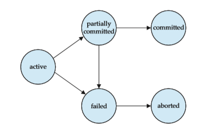
**Figure 14.1** State diagram of a transaction.

Similarly, we say that a transaction has aborted only if it has entered the aborted state. A transaction is said to have **terminated** if it has either committed or aborted.

A transaction starts in the active state. When it finishes its final statement, it enters the partially committed state. At this point, the transaction has completed its execution, but it is still possible that it may have to be aborted, since the actual output may still be temporarily residing in main memory, and thus a hardware failure may preclude its successful completion.

The database system then writes out enough information to disk that, even in the event of a failure, the updates performed by the transaction can be re-created when the system restarts after the failure. When the last of this information is written out, the transaction enters the committed state.

As mentioned earlier, we assume for now that failures do not result in loss of data on disk. Chapter 16 discusses techniques to deal with loss of data on disk.

A transaction enters the failed state after the system determines that the transaction can no longer proceed with its normal execution (for example, because of hardware or logical errors). Such a transaction must be rolled back. Then, it enters the aborted state. At this point, the system has two options:

• It can **restart** the transaction, but only if the transaction was aborted as a result of some hardware or software error that was not created through the internal logic of the transaction. A restarted transaction is considered to be a new transaction.

• It can **kill** the transaction. It usually does so because of some internal logical error that can be corrected only by rewriting the application program, or because the input was bad, or because the desired data were not found in the database.

We must be cautious when dealing with **observable external writes**, such as writes to a user’s screen, or sending email. Once such a write has occurred, it cannot be erased, since it may have been seen external to the database system.  

Most systems allow such writes to take place only after the transaction has entered the committed state. One way to implement such a scheme is for the database system to store any value associated with such external writes temporarily in a special relation in the database, and to perform the actual writes only after the transaction enters the committed state. If the system should fail after the transaction has entered the committed state, but before it could complete the external writes, the database system will carry out the external writes (using the data in nonvolatile storage) when the system is restarted.

Handling external writes can be more complicated in some situations. For example, suppose the external action is that of dispensing cash at an automated teller machine, and the system fails just before the cash is actually dispensed (we assume that cash can be dispensed atomically). It makes no sense to dispense cash when the system is restarted, since the user may have left the machine. In such a case a compensating transaction, such as depositing the cash back in the user’s account, needs to be executed when the system is restarted.

As another example, consider a user making a booking over the Web. It is possible that the database system or the application server crashes just after the booking transaction commits. It is also possible that the network connection to the user is lost just after the booking transaction commits. In either case, even though the transaction has committed, the external write has not taken place. To handle such situations, the application must be designed such that when the user connects to the Web application again, she will be able to see whether her transaction had succeeded or not.

For certain applications, it may be desirable to allow active transactions to display data to users, particularly for long-duration transactions that run for minutes or hours. Unfortunately, we cannot allow such output of observable data unless we are willing to compromise transaction atomicity. In Chapter 26, we discuss alternative transaction models that support long-duration, interactive transactions.

### Transaction Isolation

Transaction-processing systems usually allow multiple transactions to run con- currently. Allowing multiple transactions to update data concurrently causes several complications with consistency of the data, as we saw earlier. Ensuring consistency in spite of concurrent execution of transactions requires extra work; it is far easier to insist that transactions run **serially**—that is, one at a time, each starting only after the previous one has completed. However, there are two good reasons for allowing concurrency:

• **Improved throughput and resource utilization**. A transaction consists of many steps. Some involve I/O activity; others involve CPU activity. The CPU and the disks in a computer system can operate in parallel. Therefore, I/O activity can be done in parallel with processing at the CPU. The parallelism of the CPU and the I/O system can therefore be exploited to run multiple transactions in parallel. While a read or write on behalf of one transaction is in progress on one disk, another transaction can be running in the CPU, while another disk may be executing a read or write on behalf of a third transaction. All of this increases the **throughput** of the system—that is, the number of transactions executed in a given amount of time. Correspondingly, the processor and disk **utilization** also increase; in other words, the processor and disk spend less time idle, or not performing any useful work.

• **Reduced waiting time**. There may be a mix of transactions running on a system, some short and some long. If transactions run serially, a short trans- action may have to wait for a preceding long transaction to complete, which can lead to unpredictable delays in running a transaction. If the transactions are operating on different parts of the database, it is better to let them run concurrently, sharing the CPU cycles and disk accesses among them. Con- current execution reduces the unpredictable delays in running transactions. Moreover, it also reduces the **average response time**: the average time for a transaction to be completed after it has been submitted.

The motivation for using concurrent execution in a database is essentially the same as the motivation for using **multiprogramming** in an operating system.

When several transactions run concurrently, the isolation property may be vi- olated, resulting in database consistency being destroyed despite the correctness of each individual transaction. In this section, we present the concept of sched- ules to help identify those executions that are guaranteed to ensure the isolation property and thus database consistency.

The database system must control the interaction among the concurrent trans- actions to prevent them from destroying the consistency of the database. It does so through a variety of mechanisms called **concurrency-control schemes**. We study concurrency-control schemes in Chapter 15; for now, we focus on the concept of correct concurrent execution.

Consider again the simplified banking system of Section 14.1, which has several accounts, and a set of transactions that access and update those accounts. Let _T_1 and _T_2 be two transactions that transfer funds from one account to another. Transaction _T_1 transfers $50 from account _A_ to account _B_. It is defined as:

T1: read(A);
 A := A − 50;
 write(A);
 read(B);
 B := B\+ 50; write(B).

Transaction T2 transfers 10 percent of the balance from account A to account B. It is defined as:  

**TRENDS IN CONCURRENCY**

Several current trends in the field of computing are giving rise to an increase in the amount of concurrency possible. As database systems exploit this con- currency to increase overall system performance, there will necessarily be an increasing number of transactions run concurrently.

Early computers had only one processor. Therefore, there was never any real concurrency in the computer. The only concurrency was apparent concurrency created by the operating system as it shared the processor among several distinct tasks or processes. Modern computers are likely to have many processors. These may be truly distinct processors all part of the one computer. However even a single processor may be able to run more than one process at a time by having multiple _cores_. The Intel Core Duo processor is a well-known example of such a multicore processor.

For database systems to take advantage of multiple processors and multiple cores, two approaches are being taken. One is to find parallelism within a single transaction or query. Another is to support a very large number of concurrent transactions.

Many service providers now use large collections of computers rather than large mainframe computers to provide their services. They are making this choice based on the lower cost of this approach. A result of this is yet a further increase in the degree of concurrency that can be supported.

The bibliographic notes refer to texts that describe these advances in com- puter architecture and parallel computing. Chapter 18 describes algorithms for building parallel database systems, which exploit multiple processors and mul- tiple cores.

T2: read(A);
    temp := A \* 0.1;
     A := A − temp;
     write(A);
     read(B);
     B := B \+ temp;
     write(B).

Suppose the current values of accounts _A_ and _B_ are $1000 and $2000, respec- tively. Suppose also that the two transactions are executed one at a time in the order _T_1 followed by _T_2\. This execution sequence appears in Figure 14.2. In the figure, the sequence of instruction steps is in chronological order from top to bottom, with instructions of _T_1 appearing in the left column and instructions of _T_2 appearing in the right column. The final values of accounts _A_ and _B_, after the execution in Figure 14.2 takes place, are $855 and $2145, respectively. Thus, the total amount of money in accounts _A_ and _B_—that is, the sum _A_ \+ _B_—is preserved after the execution of both transactions.  

|T1       | T2           |
|---------|--------------|
|read(A)  |              |
|A:=A−50  |              |
|write(A) |              |
|read(B)  |              |
|B:=B\+ 50|              |
|write(B) |              |
| commit  |              |
|         |read(A)       |
|         |temp :=A ∗ 0.1|
|         | A:= A−temp   | 
|         |write(A)      | 
|         |read(B)       |
|         |B:= B + temp  |
|         |write(B)      |
|         |commit        |

**Figure 14.2** Schedule 1—a serial schedule in which _T_1 is followed by _T_2.

Similarly, if the transactions are executed one at a time in the order _T_2 followed by _T_1, then the corresponding execution sequence is that of Figure 14.3. Again, as expected, the sum _A_ \+ _B_ is preserved, and the final values of accounts _A_ and _B_ are $850 and $2150, respectively.

**Figure 14.3** Schedule 2—a serial schedule in which _T_2 is followed by _T_1.  

The execution sequences just described are called **schedules**. They represent the chronological order in which instructions are executed in the system. Clearly, a schedule for a set of transactions must consist of all instructions of those trans- actions, and must preserve the order in which the instructions appear in each individual transaction. For example, in transaction T1, the instruction write(_A_) must appear before the instruction read(_B_), in any valid schedule. Note that we include in our schedules the **commit** operation to indicate that the transaction has entered the committed state. In the following discussion, we shall refer to the first execution sequence (T1 followed by T2) as schedule 1, and to the second execution sequence (T2 followed by T1) as schedule 2.

These schedules are **serial**: Each serial schedule consists of a sequence of instructions from various transactions, where the instructions belonging to one single transaction appear together in that schedule. Recalling a well-known for- mula from combinatorics, we note that, for a set of _n_ transactions, there exist _n_ factorial (_n_!) different valid serial schedules.

When the database system executes several transactions concurrently, the corresponding schedule no longer needs to be serial. If two transactions are running concurrently, the operating system may execute one transaction for a little while, then perform a context switch, execute the second transaction for some time, and then switch back to the first transaction for some time, and so on. With multiple transactions, the CPU time is shared among all the transactions.

Several execution sequences are possible, since the various instructions from both transactions may now be interleaved. In general, it is not possible to predict exactly how many instructions of a transaction will be executed before the CPU switches to another transaction.1

Returning to our previous example, suppose that the two transactions are executed concurrently. One possible schedule appears in Figure 14.4. After this execution takes place, we arrive at the same state as the one in which the transac- tions are executed serially in the order T1 followed by T2\. The sum _A_ \+ _B_ is indeed preserved.

Not all concurrent executions result in a correct state. To illustrate, consider the schedule of Figure 14.5. After the execution of this schedule, we arrive at a state where the final values of accounts _A_ and _B_ are $950 and $2100, respectively. This final state is an _inconsistent state_, since we have gained $50 in the process of the concurrent execution. Indeed, the sum _A_ \+ _B_ is not preserved by the execution of the two transactions.

If control of concurrent execution is left entirely to the operating system, many possible schedules, including ones that leave the database in an inconsistent state, such as the one just described, are possible. It is the job of the database system to ensure that any schedule that is executed will leave the database in a consistent state. The **concurrency-control** component of the database system carries out this task.

1The number of possible schedules for a set of _n_ transactions is very large. There are _n_! different serial schedules. Considering all the possible ways that steps of transactions might be interleaved, the total number of possible schedules is much larger than _n_!.  

**Figure 14.4** Schedule 3—a concurrent schedule equivalent to schedule 1.

We can ensure consistency of the database under concurrent execution by making sure that any schedule that is executed has the same effect as a schedule that could have occurred without any concurrent execution. That is, the schedule should, in some sense, be equivalent to a serial schedule. Such schedules are called **serializable** schedules.

**Figure 14.5** Schedule 4—a concurrent schedule resulting in an inconsistent state.  

###  Serializability

Before we can consider how the concurrency-control component of the database system can ensure serializability, we consider how to determine when a schedule is serializable. Certainly, serial schedules are serializable, but if steps of multiple transactions are interleaved, it is harder to determine whether a schedule is seri- alizable. Since transactions are programs, it is difficult to determine exactly what operations a transaction performs and how operations of various transactions in- teract. For this reason, we shall not consider the various types of operations that a transaction can perform on a data item, but instead consider only two operations: read and write. We assume that, between a read(_Q_) instruction and a write(_Q_) instruction on a data item _Q_, a transaction may perform an arbitrary sequence of operations on the copy of _Q_ that is residing in the local buffer of the transaction. In this model, the only significant operations of a transaction, from a scheduling point of view, are its read and write instructions. Commit operations, though relevant, are not considered until Section 14.7. We therefore may show only read and write instructions in schedules, as we do for schedule 3 in Figure 14.6.

In this section, we discuss different forms of schedule equivalence, but focus on a particular form called **conflict serializability**.

Let us consider a schedule _S_ in which there are two consecutive instructions, _I_ and _J_ , of transactions _Ti_ and _Tj_ , respectively (_i_ = _j_). If _I_ and _J_ refer to different data items, then we can swap _I_ and _J_ without affecting the results of any instruc- tion in the schedule. However, if _I_ and _J_ refer to the same data item _Q_, then the order of the two steps may matter. Since we are dealing with only read and write instructions, there are four cases that we need to consider:

**1\.** _I_ \= read(_Q_), _J_ \= read(_Q_). The order of _I_ and _J_ does not matter, since the same value of _Q_ is read by _Ti_ and _Tj_ , regardless of the order.

**2\.** _I_ \= read(_Q_), _J_ \= write(_Q_). If _I_ comes before _J_ , then _Ti_ does not read the value of _Q_ that is written by _Tj_ in instruction _J_ . If _J_ comes before _I_ , then _Ti_ reads the value of _Q_ that is written by _Tj_ . Thus, the order of _I_ and _J_ matters.

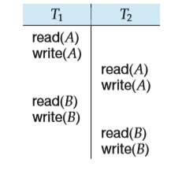

**Figure 14.6** Schedule 3—showing only the read and write instructions.  

**Figure 14.7** Schedule 5—schedule 3 after swapping of a pair of instructions.

**3\.** _I_ \= write(_Q_), _J_ \= read(_Q_). The order of _I_ and _J_ matters for reasons similar to those of the previous case.

**4\.** _I_ \= write(_Q_), _J_ \= write(_Q_). Since both instructions are write operations, the order of these instructions does not affect either _Ti_ or _Tj_ . However, the value obtained by the next read(_Q_) instruction of _S_ is affected, since the result of only the latter of the two write instructions is preserved in the database. If there is no other write(_Q_) instruction after _I_ and _J_ in _S_, then the order of _I_ and _J_ directly affects the final value of _Q_ in the database state that results from schedule _S_.

Thus, only in the case where both _I_ and _J_ are read instructions does the relative order of their execution not matter.

We say that _I_ and _J_ **conflict** if they are operations by different transactions on the same data item, and at least one of these instructions is a write operation.

To illustrate the concept of conflicting instructions, we consider schedule 3in Figure 14.6. The write(_A_) instruction of T1 conflicts with the read(_A_) instruction of T2\. However, the write(_A_) instruction of T2 does not conflict with the read(_B_) instruction of T1, because the two instructions access different data items.

**Figure 14.8** Schedule 6—a serial schedule that is equivalent to schedule 3.  

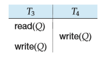

**Figure 14.9** Schedule 7.

Let _I_ and _J_ be consecutive instructions of a schedule _S_. If _I_ and _J_ are in- structions of different transactions and _I_ and _J_ do not conflict, then we can swap the order of _I_ and _J_ to produce a new schedule _S_′. _S_ is equivalent to _S_′, since all instructions appear in the same order in both schedules except for _I_ and _J_ , whose order does not matter.

Since the write(_A_) instruction of T2 in schedule 3 of Figure 14.6 does not conflict with the read(_B_) instruction of T1, we can swap these instructions to generate an equivalent schedule, schedule 5, in Figure 14.7. Regardless of the initial system state, schedules 3 and 5 both produce the same final system state.

We continue to swap nonconflicting instructions:

• Swap the read(_B_) instruction of T1 with the read(_A_) instruction of T2.

• Swap the write(_B_) instruction of T1 with the write(_A_) instruction of T2.

• Swap the write(_B_) instruction of T1 with the read(_A_) instruction of T2.

The final result of these swaps, schedule 6 of Figure 14.8, is a serial schedule. Note that schedule 6 is exactly the same as schedule 1, but it shows only the read and write instructions. Thus, we have shown that schedule 3 is equivalent to a serial schedule. This equivalence implies that, regardless of the initial system state, schedule 3 will produce the same final state as will some serial schedule.

If a schedule _S_ can be transformed into a schedule _S_′ by a series of swaps of nonconflicting instructions, we say that _S_ and _S_′ are **conflict equivalent**.2

Not all serial schedules are conflict equivalent to each other. For example, schedules 1 and 2 are not conflict equivalent.

The concept of conflict equivalence leads to the concept of conflict serializ- ability. We say that a schedule _S_ is **conflict serializable** if it is conflict equivalent to a serial schedule. Thus, schedule 3 is conflict serializable, since it is conflict equivalent to the serial schedule 1.

Finally, consider schedule 7 of Figure 14.9; it consists of only the significant operations (that is, the read and write) of transactions T3 and T4\. This schedule is not conflict serializable, since it is not equivalent to either the serial schedule _<T_3,T4_\>_ or the serial schedule _<T_4,T3_\>_.

2We use the term _conflict equivalent_ to distinguish the way we have just defined equivalence from other definitions that we shall discuss later on in this section.  

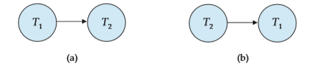

**Figure 14.10** Precedence graph for (a) schedule 1 and (b) schedule 2.

We now present a simple and efficient method for determining conflict seri- alizability of a schedule. Consider a schedule _S_. We construct a directed graph, called a **precedence graph**, from _S_. This graph consists of a pair _G_ \= (_V, E_), where _V_ is a set of vertices and _E_ is a set of edges. The set of vertices consists of all the transactions participating in the schedule. The set of edges consists of all edges _Ti_ → _Tj_ for which one of three conditions holds:

**1\.** _Ti_ executes write(_Q_) before _Tj_ executes read(_Q_).

**2\.** _Ti_ executes read(_Q_) before _Tj_ executes write(_Q_).

**3\.** _Ti_ executes write(_Q_) before _Tj_ executes write(_Q_).

If an edge _Ti_ → _Tj_ exists in the precedence graph, then, in any serial schedule _S_′ equivalent to _S_, _Ti_ must appear before _Tj_ .

For example, the precedence graph for schedule 1 in Figure 14.10a contains the single edge T1 → T2, since all the instructions of T1 are executed before the first instruction of T2 is executed. Similarly, Figure 14.10b shows the precedence graph for schedule 2 with the single edge T2 → T1, since all the instructions of T2 are executed before the first instruction of T1 is executed.

The precedence graph for schedule 4 appears in Figure 14.11. It contains the edge T1 → T2, because T1 executes read(_A_) before T2 executes write(_A_). It also contains the edge T2 → T1, because T2 executes read(_B_) before T1 executes write(_B_).

If the precedence graph for _S_ has a cycle, then schedule _S_ is not conflict serial- izable. If the graph contains no cycles, then the schedule _S_ is conflict serializable.

A **serializability order** of the transactions can be obtained by finding a linear order consistent with the partial order of the precedence graph. This process is called **topological sorting**. There are, in general, several possible linear orders that
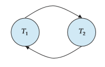

**Figure 14.11** Precedence graph for schedule   

**Figure 14.12** Illustration of topological sorting.

can be obtained through a topological sort. For example, the graph of Figure 14.12a has the two acceptable linear orderings shown in Figures 14.12b and 14.12c.

Thus, to test for conflict serializability, we need to construct the precedence graph and to invoke a cycle-detection algorithm. Cycle-detection algorithms can be found in standard textbooks on algorithms. Cycle-detection algorithms, such as those based on depth-first search, require on the order of _n_2 operations, where _n_ is the number of vertices in the graph (that is, the number of transactions).

Returning to our previous examples, note that the precedence graphs for schedules 1 and 2 (Figure 14.10) indeed do not contain cycles. The precedence graph for schedule 4 (Figure 14.11), on the other hand, contains a cycle, indicating that this schedule is not conflict serializable.

It is possible to have two schedules that produce the same outcome, but that are not conflict equivalent. For example, consider transaction T5, which transfers $10 from account _B_ to account _A_. Let schedule 8 be as defined in Figure 14.13. We claim that schedule 8 is not conflict equivalent to the serial schedule _<T_1,T5_\>_, since, in schedule 8, the write(_B_) instruction of T5 conflicts with the read(_B_) in- struction of T1\. This creates an edge T5 → T1 in the precedence graph. Similarly, we see that the write(_A_) instruction of T1 conflicts with the read instruction of T5  

**Figure 14.13** Schedule 8.

creating an edge T1 → T5\. This shows that the precedence graph has a cycle and that schedule 8 is not serializable. However, the final values of accounts _A_ and _B_ after the execution of either schedule 8 or the serial schedule _<T_1,T5_\>_ are the same—$960 and $2040, respectively.

We can see from this example that there are less-stringent definitions of sched- ule equivalence than conflict equivalence. For the system to determine that sched- ule 8 produces the same outcome as the serial schedule _<T_1,T5_\>_, it must analyze the computation performed by T1 and T5, rather than just the read and write op- erations. In general, such analysis is hard to implement and is computationally expensive. In our example, the final result is the same as that of a serial schedule because of the mathematical fact that addition and subtraction are commutative. While this may be easy to see in our simple example, the general case is not so easy since a transaction may be expressed as a complex SQL statement, a Java program with JDBC calls, etc.

However, there are other definitions of schedule equivalence based purely on the read and write operations. One such definition is _view equivalence_, a definition that leads to the concept of _view serializability_. View serializability is not used in practice due to its high degree of computational complexity.3 We therefore defer discussion of view serializability to Chapter 15, but, for completeness, note here that the example of schedule 8 is not view serializable.

###  Transaction Isolation and Atomicity

So far, we have studied schedules while assuming implicitly that there are no transaction failures. We now address the effect of transaction failures during concurrent execution.

3Testing for view serializability has been proven to be NP-complete, which means that it is virtually certain that no efficient test for view serializability exists.  

**Figure 14.14** Schedule 9, a nonrecoverable schedule.

If a transaction _Ti_ fails, for whatever reason, we need to undo the effect of this transaction to ensure the atomicity property of the transaction. In a system that allows concurrent execution, the atomicity property requires that any trans- action _Tj_ that is dependent on _Ti_ (that is, _Tj_ has read data written by _Ti_ ) is also aborted. To achieve this, we need to place restrictions on the type of schedules permitted in the system.

In the following two subsections, we address the issue of what schedules are acceptable from the viewpoint of recovery from transaction failure. We describe in Chapter 15 how to ensure that only such acceptable schedules are generated.

###  Recoverable Schedules

Consider the partial schedule 9 in Figure 14.14, in which T7 is a transaction that performs only one instruction: read(_A_). We call this a **partial schedule** because we have not included a **commit** or **abort** operation for T6\. Notice that T7 commits immediately after executing the read(_A_) instruction. Thus, T7 commits while T6 is still in the active state. Now suppose that T6 fails before it commits. T7 has read the value of data item _A_ written by T6\. Therefore, we say that T7 is **dependent** on T6\. Because of this, we must abort T7 to ensure atomicity. However, T7 has already committed and cannot be aborted. Thus, we have a situation where it is impossible to recover correctly from the failure of T6.

Schedule 9 is an example of a _nonrecoverable_ schedule. A **recoverable schedule** is one where, for each pair of transactions _Ti_ and _Tj_ such that _Tj_ reads a data item previously written by _Ti_ , the commit operation of _Ti_ appears before the commit operation of _Tj_ . For the example of schedule 9 to be recoverable, T7 would have to delay committing until after T6 commits.

###  Cascadeless Schedules

Even if a schedule is recoverable, to recover correctly from the failure of a trans- action _Ti_ , we may have to roll back several transactions. Such situations occur if transactions have read data written by _Ti_ . As an illustration, consider the partial schedule of Figure 14.15. Transaction T8 writes a value of _A_ that is read by transac- tion T9\. Transaction T9 writes a value of _A_ that is read by transaction T10\. Suppose that, at this point, T8 fails. T8 must be rolled back. Since T9 is dependent on T8, T9 must be rolled back. Since T10 is dependent on T9, T10 must be rolled back. This  

**Figure 14.15** Schedule 10.

phenomenon, in which a single transaction failure leads to a series of transaction rollbacks, is called **cascading rollback**.

Cascading rollback is undesirable, since it leads to the undoing of a significant amount of work. It is desirable to restrict the schedules to those where cascading rollbacks cannot occur. Such schedules are called _cascadeless_ schedules. Formally, a **cascadeless schedule** is one where, for each pair of transactions _Ti_ and _Tj_ such that _Tj_ reads a data item previously written by _Ti_ , the commit operation of _Ti_ appears before the read operation of _Tj_ . It is easy to verify that every cascadeless schedule is also recoverable.

###  Transaction Isolation Levels

Serializability is a useful concept because it allows programmers to ignore issues related to concurrency when they code transactions. If every transaction has the property that it maintains database consistency if executed alone, then serial- izability ensures that concurrent executions maintain consistency. However, the protocols required to ensure serializability may allow too little concurrency for certain applications. In these cases, weaker levels of consistency are used. The use of weaker levels of consistency places additional burdens on programmers for ensuring database correctness.

The SQL standard also allows a transaction to specify that it may be executed in such a way that it becomes nonserializable with respect to other transactions. For instance, a transaction may operate at the isolation level of **read uncommitted**, which permits the transaction to read a data item even if it was written by a transaction that has not been committed. SQL provides such features for the benefit of long transactions whose results do not need to be precise. If these transactions were to execute in a serializable fashion, they could interfere with other transactions, causing the others’ execution to be delayed.

The isolation levels specified by the SQL standard are as follows:

• **Serializable** usually ensures serializable execution. However, as we shall explain shortly, some database systems implement this isolation level in a manner that may, in certain cases, allow nonserializable executions.  

• **Repeatable read** allows only committed data to be read and further requires that, between two reads of a data item by a transaction, no other transaction is allowed to update it. However, the transaction may not be serializable with respect to other transactions. For instance, when it is searching for data satisfying some conditions, a transaction may find some of the data inserted by a committed transaction, but may not find other data inserted by the same transaction.

• **Read committed** allows only committed data to be read, but does not require repeatable reads. For instance, between two reads of a data item by the trans- action, another transaction may have updated the data item and committed.

• **Read uncommitted** allows uncommitted data to be read. It is the lowest isolation level allowed by SQL.

All the isolation levels above additionally disallow **dirty writes**, that is, they disallow writes to a data item that has already been written by another transaction that has not yet committed or aborted.

Many database systems run, by default, at the read-committed isolation level. In SQL, it is possible to set the isolation level explicitly, rather than accepting the system’s default setting. For example, the statement “**set transaction isolation level serializable;**” sets the isolation level to serializable; any of the other isola- tion levels may be specified instead. The above syntax is supported by Oracle, PostgreSQL and SQL Server; DB2 uses the syntax “**change isolation level**,” with its own abbreviations for isolation levels.

Changing of the isolation level must be done as the first statement of a transaction. Further, automatic commit of individual statements must be turned off, if it is on by default; API functions, such as the JDBC method Connec- tion.setAutoCommit(false) which we saw in Section 5.1.1.7, can be used to do so. Further, in JDBC the method Connection.setTransactionIsolation(int level) can be used to set the isolation level; see the JDBC manuals for details.

An application designer may decide to accept a weaker isolation level in order to improve system performance. As we shall see in Section 14.9 and Chapter 15, ensuring serializability may force a transaction to wait for other transactions or, in some cases, to abort because the transaction can no longer be executed as part of a serializable execution. While it may seem shortsighted to risk database consistency for performance, this trade-off makes sense if we can be sure that the inconsistency that may occur is not relevant to the application.

There are many means of implementing isolation levels. As long as the im- plementation ensures serializability, the designer of a database application or a user of an application does not need to know the details of such implementations, except perhaps for dealing with performance issues. Unfortunately, even if the isolation level is set to **serializable**, some database systems actually implement a weaker level of isolation, which does not rule out every possible nonserializable execution; we revisit this issue in Section 14.9. If weaker levels of isolation are used, either explicitly or implicitly, the application designer has to be aware of some details of the implementation, to avoid or minimize the chance of inconsis- tency due to lack of serializability.  

**SERIALIZABILITY IN THE REAL WORLD**

Serializable schedules are the ideal way to ensure consistency, but in our day- to-day lives, we don’t impose such stringent requirements. A Web site offering goods for sale may list an item as being in stock, yet by the time a user selects the item and goes through the checkout process, that item might no longer be available. Viewed from a database perspective, this would be a nonrepeatable read.

As another example, consider seat selection for air travel. Assume that a traveler has already booked an itinerary and now is selecting seats for each flight. Many airline Web sites allow the user to step through the various flights and choose a seat, after which the user is asked to confirm the selection. It could be that other travelers are selecting seats or changing their seat selections for the same flights at the same time. The seat availability that the traveler was shown is thus actually changing, but the traveler is shown a snapshot of the seat availability as of when the traveler started the seat selection process.

Even if two travelers are selecting seats at the same time, most likely they will select different seats, and if so there would be no real conflict. However, the transactions are not serializable, since each traveler has read data that was subsequently updated by the other traveler, leading to a cycle in the precedence graph. If two travelers performing seat selection concurrently actually selected the same seat, one of them would not be able to get the seat they selected; however, the situation could be easily resolved by asking the traveler to perform the selection again, with updated seat availability information.

It is possible to enforce serializability by allowing only one traveler to do seat selection for a particular flight at a time. However, doing so could cause significant delays as travelers would have to wait for their flight to become available for seat selection; in particular a traveler who takes a long time to make a choice could cause serious problems for other travelers. Instead, any such transaction is typically broken up into a part that requires user interaction, and a part that runs exclusively on the database. In the example above, the database transaction would check if the seats chosen by the user are still available, and if so update the seat selection in the database. Serializability is ensured only for the transactions that run on the database, without user interaction.

###  Implementation of Isolation Levels

So far, we have seen what properties a schedule must have if it is to leave the database in a consistent state and allow transaction failures to be handled in a safe manner.

There are various **concurrency-control** policies that we can use to ensure that, even when multiple transactions are executed concurrently, only acceptable schedules are generated, regardless of how the operating system time-shares resources (such as CPU time) among the transactions.  

As a trivial example of a concurrency-control policy, consider this: A trans- action acquires a **lock** on the entire database before it starts and releases the lock after it has committed. While a transaction holds a lock, no other transaction is allowed to acquire the lock, and all must therefore wait for the lock to be released. As a result of the locking policy, only one transaction can execute at a time. There- fore, only serial schedules are generated. These are trivially serializable, and it is easy to verify that they are recoverable and cascadeless as well.

A concurrency-control policy such as this one leads to poor performance, since it forces transactions to wait for preceding transactions to finish before they can start. In other words, it provides a poor degree of concurrency (indeed, no con- currency at all). As we saw in Section 14.5, concurrent execution has substantial performance benefits.

The goal of concurrency-control policies is to provide a high degree of con- currency, while ensuring that all schedules that can be generated are conflict or view serializable, recoverable, and cascadeless.

Here we provide an overview of how some of most important concurrency- control mechanisms work, and we defer the details to Chapter 15.

####  Locking

Instead of locking the entire database, a transaction could, instead, lock only those data items that it accesses. Under such a policy, the transaction must hold locks long enough to ensure serializability, but for a period short enough not to harm performance excessively. Complicating matters are SQL statements like those we saw in Section 14.10, where the data items accessed depend on a **where** clause. In Chapter 15, we present the two-phase locking protocol, a simple, widely used technique that ensures serializability. Stated simply, two-phase locking requires a transaction to have two phases, one where it acquires locks but does not release any, and a second phase where the transaction releases locks but does not acquire any. (In practice, locks are usually released only when the transaction completes its execution and has been either committed or aborted.)

Further improvements to locking result if we have two kinds of locks: shared and exclusive. Shared locks are used for data that the transaction reads and exclusive locks are used for those it writes. Many transactions can hold shared locks on the same data item at the same time, but a transaction is allowed an exclusive lock on a data item only if no other transaction holds any lock (regardless of whether shared or exclusive) on the data item. This use of two modes of locks along with two-phase locking allows concurrent reading of data while still ensuring serializability.

####  Timestamps

Another category of techniques for the implementation of isolation assigns each transaction a **timestamp**, typically when it begins. For each data item, the system keeps two timestamps. The read timestamp of a data item holds the largest (that is, the most recent) timestamp of those transactions that read the data item. The write timestamp of a data item holds the timestamp of the transaction that  

wrote the current value of the data item. Timestamps are used to ensure that transactions access each data item in order of the transactions’ timestamps if their accesses conflict. When this is not possible, offending transactions are aborted and restarted with a new timestamp.

####  Multiple Versions and Snapshot Isolation

By maintaining more than one version of a data item, it is possible to allow a transaction to read an old version of a data item rather than a newer version written by an uncommitted transaction or by a transaction that should come later in the serialization order. There are a variety of multiversion concurrency- control techniques. One in particular, called **snapshot isolation**, is widely used in practice.

In snapshot isolation, we can imagine that each transaction is given its own version, or snapshot, of the database when it begins.4 It reads data from this private version and is thus isolated from the updates made by other transactions. If the transaction updates the database, that update appears only in its own version, not in the actual database itself. Information about these updates is saved so that the updates can be applied to the “real” database if the transaction commits.

When a transaction T enters the partially committed state, it then proceeds to the committed state only if no other concurrent transaction has modified data that T intends to update. Transactions that, as a result, cannot commit abort instead.

Snapshot isolation ensures that attempts to read data never need to wait (unlike locking). Read-only transactions cannot be aborted; only those that modify data run a slight risk of aborting. Since each transaction reads its own version or snapshot of the database, reading data does not cause subsequent update attempts by other transactions to wait (unlike locking). Since most transactions are read-only (and most others read more data than they update), this is often a major source of performance improvement as compared to locking.

The problem with snapshot isolation is that, paradoxically, it provides _too much_ isolation. Consider two transactions T and T ′. In a serializable execution, either T sees all the updates made by T ′ or T ′ sees all the updates made by T , because one must follow the other in the serialization order. Under snapshot isolation, there are cases where neither transaction sees the updates of the other. This is a situation that cannot occur in a serializable execution. In many (indeed, most) cases, the data accesses by the two transactions do not conflict and there is no problem. However, if T reads some data item that T ′ updates and T ′ reads some data item that T updates, it is possible that both transactions fail to read the update made by the other. The result, as we shall see in Chapter 15, may be an inconsistent database state that, of course, could not be obtained in any serializable execution.

4Of course, in reality, the entire database is not copied. Multiple versions are kept only of those data items that are changed.  

Oracle, PostgreSQL, and SQL Server offer the option of snapshot isolation. Oracle and PostgreSQL implement the **serializable** isolation level using snapshot isolation. As a result, their implementation of serializability can, in exceptional circumstances, result in a nonserializable execution being allowed. SQL Server instead includes an additional isolation level beyond the standard ones, called **snapshot**, to offer the option of snapshot isolation.

###  Transactions as SQL Statements

In Section 4.3, we presented the SQL syntax for specifying the beginning and end of transactions. Now that we have seen some of the issues in ensuring the ACID properties for transactions, we are ready to consider how those properties are ensured when transactions are specified as a sequence of SQL statements rather than the restricted model of simple reads and writes that we considered up to this point.

In our simple model, we assumed a set of data items exists. While our simple model allowed data-item values to be changed, it did not allow data items to be created or deleted. In SQL, however, **insert** statements create new data and **delete** statements delete data. These two statements are, in effect, **write** opera- tions, since they change the database, but their interactions with the actions of other transactions are different from what we saw in our simple model. As an example, consider the following SQL query on our university database that finds all instructors who earn more than $90,000.

**select** _ID_, _name_ **from** _instructor_ **where** _salary >_ 90000;

Using our sample _instructor_ relation (Appendix A.3), we find that only Ein- stein and Brandt satisfy the condition. Now assume that around the same time we are running our query, another user inserts a new instructor named “James” whose salary is $100,000.

**insert into** _instructor_ **values** (’11111’, ’James’, ’Marketing’, 100000);

The result of our query will be different depending on whether this insert comes before or after our query is run. In a concurrent execution of these transactions, it is intuitively clear that they conflict, but this is a conflict not captured by our simple model. This situation is referred to as the **phantom phenomenon**, because a conflict may exist on “phantom” data.

Our simple model of transactions required that operations operate on a spe- cific data item given as an argument to the operation. In our simple model, we can look at the **read** and **write** steps to see which data items are referenced. But in an SQL statement, the specific data items (tuples) referenced may be determined by a **where** clause predicate. So the same transaction, if run more than once, might  

reference different data items each time it is run if the values in the database change between runs.

One way of dealing with the above problem is to recognize that it is not sufficient for concurrency control to consider only the tuples that are accessed by a transaction; the information used to find the tuples that are accessed by the transaction must also be considered for the purpose of concurrency control. The information used to find tuples could be updated by an insertion or deletion, or in the case of an index, even by an update to a search-key attribute. For example, if locking is used for concurrency control, the data structures that track the tuples in a relation, as well as index structures, must be appropriately locked. However, such locking can lead to poor concurrency in some situations; index-locking protocols which maximize concurrency, while ensuring serializability in spite of inserts, deletes, and predicates in queries, are discussed in Section 15.8.3.

Let us consider again the query:

**select** _ID_, _name_ **from** _instructor_ **where** _salary>_ 90000;

and the following SQL update:

**update** _instructor_ **set** _salary_ \= _salary_ \* 0.9 **where** _name_ \= ’Wu’;

We now face an interesting situation in determining whether our query conflicts with the update statement. If our query reads the entire _instructor_ relation, then it reads the tuple with Wu’s data and conflicts with the update. However, if an index were available that allowed our query direct access to those tuples with _salary >_ 90000, then our query would not have accessed Wu’s data at all because Wu’s salary is initially $90,000 in our example instructor relation, and reduces to $81,000 after the update.

However, using the above approach, it would appear that the existence of a conflict depends on a low-level query processing decision by the system that is unrelated to a user-level view of the meaning of the two SQL statements! An alternative approach to concurrency control treats an insert, delete or update as conflicting with a predicate on a relation, if it could affect the set of tuples selected by a predicate. In our example query above, the predicate is “_salary >_ 90000”, and an update of Wu’s salary from $90,000 to a value greater than $90,000, or an update of Einstein’s salary from a value greater that $90,000 to a value less than or equal to $90,000, would conflict with this predicate. Locking based on this idea is called **predicate locking**; however predicate locking is expensive, and not used in practice.  

###  Summary

• A _transaction_ is a _unit_ of program execution that accesses and possibly updates various data items. Understanding the concept of a transaction is critical for understanding and implementing updates of data in a database in such a way that concurrent executions and failures of various forms do not result in the database becoming inconsistent.

• Transactions are required to have the ACID properties: atomicity, consistency, isolation, and durability.

◦ Atomicity ensures that either all the effects of a transaction are reflected in the database, or none are; a failure cannot leave the database in a state where a transaction is partially executed.

◦ Consistency ensures that, if the database is initially consistent, the ex- ecution of the transaction (by itself) leaves the database in a consistent state.

◦ Isolation ensures that concurrently executing transactions are isolated from one another, so that each has the impression that no other trans- action is executing concurrently with it.

◦ Durability ensures that, once a transaction has been committed, that trans- action’s updates do not get lost, even if there is a system failure.

• Concurrent execution of transactions improves throughput of transactions and system utilization, and also reduces waiting time of transactions.

• The various types of storage in a computer are volatile storage, nonvolatile storage, and stable storage. Data in volatile storage, such as in RAM, are lost when the computer crashes. Data in nonvolatile storage, such as disk, are not lost when the computer crashes, but may occasionally be lost because of failures such as disk crashes. Data in stable storage are never lost.

• Stable storage that must be accessible online is approximated with mirrored disks, or other forms of RAID, which provide redundant data storage. Offline, or archival, stable storage may consist of multiple tape copies of data stored in physically secure locations.

• When several transactions execute concurrently on the database, the consis- tency of data may no longer be preserved. It is therefore necessary for the system to control the interaction among the concurrent transactions.

◦ Since a transaction is a unit that preserves consistency, a serial execution of transactions guarantees that consistency is preserved.

◦ A _schedule_ captures the key actions of transactions that affect concurrent execution, such as read and write operations, while abstracting away in- ternal details of the execution of the transaction.  

◦ We require that any schedule produced by concurrent processing of a set of transactions will have an effect equivalent to a schedule produced when these transactions are run serially in some order.

◦ A system that guarantees this property is said to ensure _serializability_.

◦ There are several different notions of equivalence leading to the concepts of _conflict serializability_ and _view serializability_.

• Serializability of schedules generated by concurrently executing transactions can be ensured through one of a variety of mechanisms called _concurrency- control_ policies.

• We can test a given schedule for conflict serializability by constructing a _precedence graph_ for the schedule, and by searching for absence of cycles in the graph. However, there are more efficient concurrency-control policies for ensuring serializability.

• Schedules must be recoverable, to make sure that if transaction _a_ sees the effects of transaction _b_, and _b_ then aborts, then _a_ also gets aborted.

• Schedules should preferably be cascadeless, so that the abort of a transaction does not result in cascading aborts of other transactions. Cascadelessness is ensured by allowing transactions to only read committed data.

• The concurrency-control–management component of the database is respon- sible for handling the concurrency-control policies. Chapter 15 describes concurrency-control policies.

### Review Terms

• Transaction • ACID properties

◦ Atomicity

◦ Consistency

◦ Isolation

◦ Durability

• Inconsistent state • Storage types

◦ Volatile storage

◦ Nonvolatile storage

◦ Stable storage

• Concurrency control system

• Recovery system • Transaction state

◦ Active

◦ Partially committed

◦ Failed

◦ Aborted

◦ Committed

◦ Terminated

• Transaction

◦ Restart

◦ Kill  

• Observable external writes • Concurrent executions • Serial execution • Schedules • Conflict of operations • Conflict equivalence • Conflict serializability • Serializability testing • Precedence graph

• Serializability order • Recoverable schedules • Cascading rollback • Cascadeless schedules • Concurrency-control • Locking • Multiple versions • Snapshot isolation

### Practice Exercises

**14.1** Suppose that there is a database system that never fails. Is a recovery manager required for this system?

**14.2** Consider a file system such as the one on your favorite operating system.

a. What are the steps involved in creation and deletion of files, and in writing data to a file?

b. Explain how the issues of atomicity and durability are relevant to the creation and deletion of files and to writing data to files.

**14.3** Database-system implementers have paid much more attention to the ACID properties than have file-system implementers. Why might this be the case?

**14.4** Justify the following statement: Concurrent execution of transactions is more important when data must be fetched from (slow) disk or when transactions are long, and is less important when data are in memory and transactions are very short.

**14.5** Since every conflict-serializable schedule is view serializable, why do we emphasize conflict serializability rather than view serializability?

**14.6** Consider the precedence graph of Figure 14.16. Is the corresponding schedule conflict serializable? Explain your answer.

**14.7** What is a cascadeless schedule? Why is cascadelessness of schedules de- sirable? Are there any circumstances under which it would be desirable to allow noncascadeless schedules? Explain your answer.

**14.8** The **lost update** anomaly is said to occur if a transaction _Tj_ reads a data item, then another transaction _Tk_ writes the data item (possibly based on a previous read), after which _Tj_ writes the data item. The update performed by _Tk_ has been lost, since the update done by _Tj_ ignored the value written by _Tk_ .  

  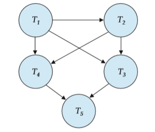

**Figure 14.16** Precedence graph for Practice Exercise 14.6.

a. Give an example of a schedule showing the lost update anomaly.

b. Give an example schedule to show that the lost update anomaly is possible with the **read committed** isolation level.

c. Explain why the lost update anomaly is not possible with the **re- peatable read** isolation level.

**14.9** Consider a database for a bank where the database system uses snap- shot isolation. Describe a particular scenario in which a nonserializable execution occurs that would present a problem for the bank.

**14.10** Consider a database for an airline where the database system uses snap- shot isolation. Describe a particular scenario in which a nonserializable execution occurs, but the airline may be willing to accept it in order to gain better overall performance.

**14.11** The definition of a schedule assumes that operations can be totally or- dered by time. Consider a database system that runs on a system with multiple processors, where it is not always possible to establish an ex- act ordering between operations that executed on different processors. However, operations on a data item can be totally ordered.

Does the above situation cause any problem for the definition of conflict serializability? Explain your answer.

### Exercises

**14.12** List the ACID properties. Explain the usefulness of each.

**14.13** During its execution, a transaction passes through several states, until it finally commits or aborts. List all possible sequences of states through  

which a transaction may pass. Explain why each state transition may occur.

**14.14** Explain the distinction between the terms _serial schedule_ and _serializable schedule_.

**14.15** Consider the following two transactions:

T13: read(_A_); read(_B_); **if** _A_ \= 0 **then** _B_ := _B_ \+ 1; write(_B_).

T14: read(_B_); read(_A_); **if** _B_ \= 0 **then** _A_ := _A_ \+ 1; write(_A_).

Let the consistency requirement be _A_ \= 0 ∨ _B_ \= 0, with _A_ \= _B_ \= 0 the initial values.

a. Show that every serial execution involving these two transactions preserves the consistency of the database.

b. Show a concurrent execution of T13 and T14 that produces a nonseri- alizable schedule.

c. Is there a concurrent execution of T13 and T14 that produces a serial- izable schedule?

**14.16** Give an example of a serializable schedule with two transactions such that the order in which the transactions commit is different from the serialization order.

**14.17** What is a recoverable schedule? Why is recoverability of schedules desir- able? Are there any circumstances under which it would be desirable to allow nonrecoverable schedules? Explain your answer.

**14.18** Why do database systems support concurrent execution of transactions, in spite of the extra programming effort needed to ensure that concurrent execution does not cause any problems?

**14.19** Explain why the read-committed isolation level ensures that schedules are cascade-free.

**14.20** For each of the following isolation levels, give an example of a schedule that respects the specified level of isolation, but is not serializable:

a. Read uncommitted

b. Read committed

c. Repeatable read  

**14.21** Suppose that in addition to the operations read and write, we allow an operation pred read(_r_, _P_), which reads all tuples in relation _r_ that satisfy predicate _P_ .

a. Give an example of a schedule using the pred read operation that exhibits the phantom phenomenon, and is nonserializable as a result.

b. Give an example of a schedule where one transaction uses the pred read operation on relation _r_ and another concurrent transac- tions deletes a tuple from _r_ , but the schedule does not exhibit a phantom conflict. (To do so, you have to give the schema of relation _r_ , and show the attribute values of the deleted tuple.)

### Bibliographical Notes

Gray and Reuter \[1993\] provides detailed textbook coverage of transaction- processing concepts, techniques and implementation details, including concur- rency control and recovery issues. Bernstein and Newcomer \[1997\] provides text- book coverage of various aspects of transaction processing.

The concept of serializability was formalized by Eswaran et al. \[1976\] in connection to work on concurrency control for System R.

References covering specific aspects of transaction processing, such as con- currency control and recovery, are cited in Chapters 15, 16, and 26.  

## CHAPTER 15 Concurrency Control

We saw in Chapter 14 that one of the fundamental properties of a transaction is isolation. When several transactions execute concurrently in the database, how- ever, the isolation property may no longer be preserved. To ensure that it is, the system must control the interaction among the concurrent transactions; this control is achieved through one of a variety of mechanisms called _concurrency- control_ schemes. In Chapter 26, we discuss concurrency-control schemes that admit nonserializable schedules. In this chapter, we consider the management of concurrently executing transactions, and we ignore failures. In Chapter 16, we shall see how the system can recover from failures.

As we shall see, there are a variety of concurrency-control schemes. No one scheme is clearly the best; each one has advantages. In practice, the most fre- quently used schemes are _two-phase locking_ and _snapshot isolation_.

### Lock-Based Protocols

One way to ensure isolation is to require that data items be accessed in a mutually exclusive manner; that is, while one transaction is accessing a data item, no other transaction can modify that data item. The most common method used to implement this requirement is to allow a transaction to access a data item only if it is currently holding a **lock** on that item. We introduced the concept of locking in Section 14.9.

#### Locks

There are various modes in which a data item may be locked. In this section, we restrict our attention to two modes:

**1\. Shared**. If a transaction _Ti_ has obtained a **shared-mode lock** (denoted by S) on item _Q_, then _Ti_ can read, but cannot write, _Q_.

**2\. Exclusive**. If a transaction _Ti_ has obtained an **exclusive-mode lock** (denoted by X) on item _Q_, then _Ti_ can both read and write _Q_.

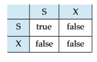

**Figure 15.1** Lock-compatibility matrix comp.

We require that every transaction **request** a lock in an appropriate mode on data item _Q_, depending on the types of operations that it will perform on _Q_. The transaction makes the request to the concurrency-control manager. The transaction can proceed with the operation only after the concurrency-control manager **grants** the lock to the transaction. The use of these two lock modes allows multiple transactions to read a data item but limits write access to just one transaction at a time.

To state this more generally, given a set of lock modes, we can define a **compatibility function** on them as follows: Let _A_ and _B_ represent arbitrary lock modes. Suppose that a transaction _Ti_ requests a lock of mode _A_ on item _Q_ on which transaction _Tj_ (_Ti_ = _Tj_ ) currently holds a lock of mode _B_. If transaction _Ti_ can be granted a lock on _Q_ immediately, in spite of the presence of the mode _B_ lock, then we say mode _A_ is **compatible** with mode _B_. Such a function can be represented conveniently by a matrix. The compatibility relation between the two modes of locking discussed in this section appears in the matrix comp of Figure 15.1. An element comp(_A, B_) of the matrix has the value _true_ if and only if mode _A_ is compatible with mode _B_.

Note that shared mode is compatible with shared mode, but not with exclusive mode. At any time, several shared-mode locks can be held simultaneously (by different transactions) on a particular data item. A subsequent exclusive-mode lock request has to wait until the currently held shared-mode locks are released.

A transaction requests a shared lock on data item _Q_ by executing the lock- S(_Q_) instruction. Similarly, a transaction requests an exclusive lock through the lock-X(_Q_) instruction. A transaction can unlock a data item _Q_ by the unlock(_Q_) instruction.

To access a data item, transaction _Ti_ must first lock that item. If the data item is already locked by another transaction in an incompatible mode, the concurrency- control manager will not grant the lock until all incompatible locks held by other transactions have been released. Thus, _Ti_ is made to **wait** until all incompatible locks held by other transactions have been released.

Transaction _Ti_ may unlock a data item that it had locked at some earlier point. Note that a transaction must hold a lock on a data item as long as it accesses that item. Moreover, it is not necessarily desirable for a transaction to unlock a data item immediately after its final access of that data item, since serializability may not be ensured.

As an illustration, consider again the banking example that we introduced in Chapter 14. Let _A_ and _B_ be two accounts that are accessed by transactions T1  

**Figure 15.2** Transaction T1.

and T2\. Transaction T1 transfers $50 from account _B_ to account _A_ (Figure 15.2). Transaction T2 displays the total amount of money in accounts _A_ and _B_—that is, the sum _A_ \+ _B_ (Figure 15.3).

Suppose that the values of accounts _A_ and _B_ are $100 and $200, respectively. If these two transactions are executed serially, either in the order T1, T2 or the order T2, T1, then transaction T2 will display the value $300. If, however, these transactions are executed concurrently, then schedule 1, in Figure 15.4, is possible. In this case, transaction T2 displays $250, which is incorrect. The reason for this mistake is that the transaction T1 unlocked data item _B_ too early, as a result of which T2 saw an inconsistent state.

The schedule shows the actions executed by the transactions, as well as the points at which the concurrency-control manager grants the locks. The transac- tion making a lock request cannot execute its next action until the concurrency- control manager grants the lock. Hence, the lock must be granted in the interval of time between the lock-request operation and the following action of the trans- action. Exactly when within this interval the lock is granted is not important; we can safely assume that the lock is granted just before the following action of the transaction. We shall therefore drop the column depicting the actions of the concurrency-control manager from all schedules depicted in the rest of the chapter. We let you infer when locks are granted.

**Figure 15.3** Transaction T2.  

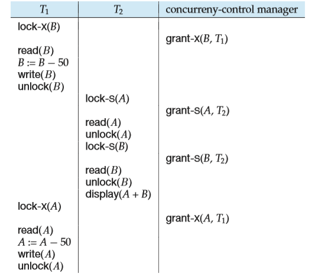

**Figure 15.4** Schedule 1.

Suppose now that unlocking is delayed to the end of the transaction. Trans- action T3 corresponds to T1 with unlocking delayed (Figure 15.5). Transaction T4 corresponds to T2 with unlocking delayed (Figure 15.6).

You should verify that the sequence of reads and writes in schedule 1, which lead to an incorrect total of $250 being displayed, is no longer possible with T3
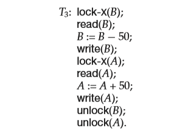
**Figure 15.5** Transaction T3 (transaction T1 with unlocking delayed).  

**Figure 15.6** Transaction T4 (transaction T2 with unlocking delayed).

and T4\. Other schedules are possible. T4 will not print out an inconsistent result in any of them; we shall see why later.

Unfortunately, locking can lead to an undesirable situation. Consider the partial schedule of Figure 15.7 for T3 and T4\. Since T3 is holding an exclusive- mode lock on _B_ and T4 is requesting a shared-mode lock on _B_, T4 is waiting for T3 to unlock _B_. Similarly, since T4 is holding a shared-mode lock on _A_ and T3 is requesting an exclusive-mode lock on _A_, T3 is waiting for T4 to unlock _A_. Thus, we have arrived at a state where neither of these transactions can ever proceed with its normal execution. This situation is called **deadlock**. When deadlock occurs, the system must roll back one of the two transactions. Once a transaction has been rolled back, the data items that were locked by that transaction are unlocked. These data items are then available to the other transaction, which can continue with its execution. We shall return to the issue of deadlock handling in Section 15.2.

If we do not use locking, or if we unlock data items too soon after reading or writing them, we may get inconsistent states. On the other hand, if we do not unlock a data item before requesting a lock on another data item, deadlocks may occur. There are ways to avoid deadlock in some situations, as we shall see in Section 15.1.5. However, in general, deadlocks are a necessary evil associated with locking, if we want to avoid inconsistent states. Deadlocks are definitely

**Figure 15.7** Schedule 2.  

preferable to inconsistent states, since they can be handled by rolling back trans- actions, whereas inconsistent states may lead to real-world problems that cannot be handled by the database system.

We shall require that each transaction in the system follow a set of rules, called a **locking protocol**, indicating when a transaction may lock and unlock each of the data items. Locking protocols restrict the number of possible schedules. The set of all such schedules is a proper subset of all possible serializable schedules. We shall present several locking protocols that allow only conflict-serializable schedules, and thereby ensure isolation. Before doing so, we introduce some terminology.

Let _{T_0, T1_, . . . , Tn}_ be a set of transactions participating in a schedule _S_. We say that _Ti_ **precedes** _Tj_ in _S_, written _Ti_ → _Tj_ , if there exists a data item _Q_ such that _Ti_ has held lock mode _A_ on _Q_, and _Tj_ has held lock mode _B_ on _Q_ later, and comp(_A,B_) = false. If _Ti_ → _Tj_ , then that precedence implies that in any equivalent serial schedule, _Ti_ must appear before _Tj_ . Observe that this graph is similar to the precedence graph that we used in Section 14.6 to test for conflict serializability. Conflicts between instructions correspond to noncompatibility of lock modes.

We say that a schedule _S_ is **legal** under a given locking protocol if _S_ is a possible schedule for a set of transactions that follows the rules of the locking protocol. We say that a locking protocol **ensures** conflict serializability if and only if all legal schedules are conflict serializable; in other words, for all legal schedules the associated → relation is acyclic.

#### Granting of Locks**

When a transaction requests a lock on a data item in a particular mode, and no other transaction has a lock on the same data item in a conflicting mode, the lock can be granted. However, care must be taken to avoid the following scenario. Suppose a transaction T2 has a shared-mode lock on a data item, and another transaction T1 requests an exclusive-mode lock on the data item. Clearly, T1 has to wait for T2 to release the shared-mode lock. Meanwhile, a transaction T3 may request a shared-mode lock on the same data item. The lock request is compatible with the lock granted to T2, so T3 may be granted the shared-mode lock. At this point T2 may release the lock, but still T1 has to wait for T3 to finish. But again, there may be a new transaction T4 that requests a shared-mode lock on the same data item, and is granted the lock before T3 releases it. In fact, it is possible that there is a sequence of transactions that each requests a shared-mode lock on the data item, and each transaction releases the lock a short while after it is granted, but T1 never gets the exclusive-mode lock on the data item. The transaction T1 may never make progress, and is said to be **starved**.

We can avoid starvation of transactions by granting locks in the following manner: When a transaction _Ti_ requests a lock on a data item _Q_ in a particular mode _M_, the concurrency-control manager grants the lock provided that:

**1\.** There is no other transaction holding a lock on _Q_ in a mode that conflicts with _M_.  

**2\.** There is no other transaction that is waiting for a lock on _Q_ and that made its lock request before _Ti_ .

Thus, a lock request will never get blocked by a lock request that is made later.

#### The Two-Phase Locking Protocol**

One protocol that ensures serializability is the **two-phase locking protocol**. This protocol requires that each transaction issue lock and unlock requests in two phases:

**1\. Growing phase**. A transaction may obtain locks, but may not release any lock.

**2\. Shrinking phase**. A transaction may release locks, but may not obtain any new locks.

Initially, a transaction is in the growing phase. The transaction acquires locks as needed. Once the transaction releases a lock, it enters the shrinking phase, and it can issue no more lock requests.

For example, transactions T3 and T4 are two phase. On the other hand, trans- actions T1 and T2 are not two phase. Note that the unlock instructions do not need to appear at the end of the transaction. For example, in the case of transaction T3, we could move the unlock(_B_) instruction to just after the lock-X(_A_) instruction, and still retain the two-phase locking property.

We can show that the two-phase locking protocol ensures conflict serializabil- ity. Consider any transaction. The point in the schedule where the transaction has obtained its final lock (the end of its growing phase) is called the **lock point** of the transaction. Now, transactions can be ordered according to their lock points— this ordering is, in fact, a serializability ordering for the transactions. We leave the proof as an exercise for you to do (see Practice Exercise 15.1).

Two-phase locking does _not_ ensure freedom from deadlock. Observe that transactions T3 and T4 are two phase, but, in schedule 2 (Figure 15.7), they are deadlocked.

Recall from Section 14.7.2 that, in addition to being serializable, schedules should be cascadeless. Cascading rollback may occur under two-phase locking. As an illustration, consider the partial schedule of Figure 15.8. Each transaction observes the two-phase locking protocol, but the failure of T5 after the read(A) step of T7 leads to cascading rollback of T6 and T7.

Cascading rollbacks can be avoided by a modification of two-phase locking called the **strict two-phase locking protocol**. This protocol requires not only that locking be two phase, but also that all exclusive-mode locks taken by a transaction be held until that transaction commits. This requirement ensures that any data written by an uncommitted transaction are locked in exclusive mode until the transaction commits, preventing any other transaction from reading the data.

Another variant of two-phase locking is the **rigorous two-phase locking protocol**, which requires that all locks be held until the transaction commits.  

**Figure 15.8** Partial schedule under two-phase locking.

We can easily verify that, with rigorous two-phase locking, transactions can be serialized in the order in which they commit.

Consider the following two transactions, for which we have shown only some of the significant read and write operations:

T8: read(_a_1); read(_a_2); . . . read(_an_); write(_a_1).

T9: read(_a_1); read(_a_2); display(_a_1 + _a_2).

If we employ the two-phase locking protocol, then T8 must lock _a_1 in exclusive mode. Therefore, any concurrent execution of both transactions amounts to a serial execution. Notice, however, that T8 needs an exclusive lock on _a_1 only at the end of its execution, when it writes _a_1\. Thus, if T8 could initially lock _a_1 in shared mode, and then could later change the lock to exclusive mode, we could get more concurrency, since T8 and T9 could access _a_1 and _a_2 simultaneously.

This observation leads us to a refinement of the basic two-phase locking protocol, in which **lock conversions** are allowed. We shall provide a mechanism for upgrading a shared lock to an exclusive lock, and downgrading an exclusive lock to a shared lock. We denote conversion from shared to exclusive modes by **upgrade**, and from exclusive to shared by **downgrade**. Lock conversion cannot be allowed arbitrarily. Rather, upgrading can take place in only the growing phase, whereas downgrading can take place in only the shrinking phase.  

**Figure 15.9** Incomplete schedule with a lock conversion.

Returning to our example, transactions T8 and T9 can run concurrently under the refined two-phase locking protocol, as shown in the incomplete schedule of Figure 15.9, where only some of the locking instructions are shown.

Note that a transaction attempting to upgrade a lock on an item _Q_ may be forced to wait. This enforced wait occurs if _Q_ is currently locked by _another_ transaction in shared mode.

Just like the basic two-phase locking protocol, two-phase locking with lock conversion generates only conflict-serializable schedules, and transactions can be serialized by their lock points. Further, if exclusive locks are held until the end of the transaction, the schedules are cascadeless.

For a set of transactions, there may be conflict-serializable schedules that cannot be obtained through the two-phase locking protocol. However, to obtain conflict-serializable schedules through non-two-phase locking protocols, we need either to have additional information about the transactions or to impose some structure or ordering on the set of data items in the database. We shall see examples when we consider other locking protocols later in this chapter.

Strict two-phase locking and rigorous two-phase locking (with lock conver- sions) are used extensively in commercial database systems.

A simple but widely used scheme automatically generates the appropriate lock and unlock instructions for a transaction, on the basis of read and write requests from the transaction:

• When a transaction _Ti_ issues a read(_Q_) operation, the system issues a lock- S(_Q_) instruction followed by the read(_Q_) instruction.

• When _Ti_ issues a write(_Q_) operation, the system checks to see whether _Ti_ already holds a shared lock on _Q_. If it does, then the system issues an up- grade(_Q_) instruction, followed by the write(_Q_) instruction. Otherwise, the system issues a lock-X(_Q_) instruction, followed by the write(_Q_) instruction.

• All locks obtained by a transaction are unlocked after that transaction com- mits or aborts.  

####  Implementation of Locking

A **lock manager** can be implemented as a process that receives messages from transactions and sends messages in reply. The lock-manager process replies to lock-request messages with lock-grant messages, or with messages requesting rollback of the transaction (in case of deadlocks). Unlock messages require only an acknowledgment in response, but may result in a grant message to another waiting transaction.

The lock manager uses this data structure: For each data item that is currently locked, it maintains a linked list of records, one for each request, in the order in which the requests arrived. It uses a hash table, indexed on the name of a data item, to find the linked list (if any) for a data item; this table is called the **lock table**. Each record of the linked list for a data item notes which transaction made the request, and what lock mode it requested. The record also notes if the request has currently been granted.

Figure 15.10 shows an example of a lock table. The table contains locks for five different data items, I4, I7, I23, I44, and I912. The lock table uses overflow chaining, so there is a linked list of data items for each entry in the lock table. There is also a list of transactions that have been granted locks, or are waiting for locks, for each of the data items. Granted locks are the rectangles filled in a darker shade, while waiting requests are the rectangles filled in a lighter shade. We have omitted the lock mode to keep the figure simple. It can be seen, for example, that T23 has been granted locks on I912 and I7, and is waiting for a lock on I4.

Although the figure does not show it, the lock table should also maintain an index on transaction identifiers, so that it is possible to determine efficiently the set of locks held by a given transaction.

The lock manager processes requests this way:

• When a lock request message arrives, it adds a record to the end of the linked list for the data item, if the linked list is present. Otherwise it creates a new linked list, containing only the record for the request.

It always grants a lock request on a data item that is not currently locked. But if the transaction requests a lock on an item on which a lock is currently held, the lock manager grants the request only if it is compatible with the locks that are currently held, and all earlier requests have been granted already. Otherwise the request has to wait.

• When the lock manager receives an unlock message from a transaction, it deletes the record for that data item in the linked list corresponding to that transaction. It tests the record that follows, if any, as described in the previous paragraph, to see if that request can now be granted. If it can, the lock manager grants that request, and processes the record following it, if any, similarly, and so on.

• If a transaction aborts, the lock manager deletes any waiting request made by the transaction. Once the database system has taken appropriate actions to undo the transaction (see Section 16.3), it releases all locks held by the aborted transaction.  

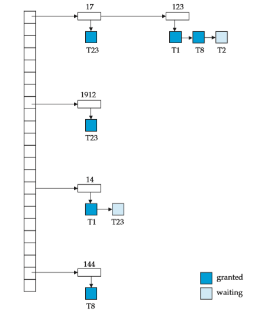

**Figure 15.10** Lock table.

This algorithm guarantees freedom from starvation for lock requests, since a request can never be granted while a request received earlier is waiting to be granted. We study how to detect and handle deadlocks later, in Section 15.2.2. Section 17.2.1 describes an alternative implementation—one that uses shared memory instead of message passing for lock request/grant.

#### Graph-Based Protocols

As noted in Section 15.1.3, if we wish to develop protocols that are not two phase, we need additional information on how each transaction will access the database. There are various models that can give us the additional information, each dif- fering in the amount of information provided. The simplest model requires that we have prior knowledge about the order in which the database items will be accessed. Given such information, it is possible to construct locking protocols that are not two phase, but that, nevertheless, ensure conflict serializability.

To acquire such prior knowledge, we impose a partial ordering → on the set **D** \= _{d_1, _d_2_, . . . , dh}_ of all data items. If _di_ → _d j_ , then any transaction accessing  

both _di_ and _d j_ must access _di_ before accessing _d j_ . This partial ordering may be the result of either the logical or the physical organization of the data, or it may be imposed solely for the purpose of concurrency control.

The partial ordering implies that the set **D** may now be viewed as a directed acyclic graph, called a **database graph**. In this section, for the sake of simplicity, we will restrict our attention to only those graphs that are rooted trees. We shall present a simple protocol, called the _tree protocol_, which is restricted to employ only _exclusive_ locks. References to other, more complex, graph-based locking protocols are in the bibliographical notes.

In the **tree protocol**, the only lock instruction allowed is lock-X. Each trans- action _Ti_ can lock a data item at most once, and must observe the following rules:

**1\.** The first lock by _Ti_ may be on any data item.

**2\.** Subsequently, a data item _Q_ can be locked by _Ti_ only if the parent of _Q_ is currently locked by _Ti_ .

**3\.** Data items may be unlocked at any time.

**4\.** A data item that has been locked and unlocked by _Ti_ cannot subsequently be relocked by _Ti_ .

All schedules that are legal under the tree protocol are conflict serializable. To illustrate this protocol, consider the database graph of Figure 15.11. The

following four transactions follow the tree protocol on this graph. We show only the lock and unlock instructions:

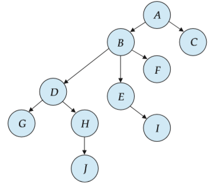

**Figure 15.11** Tree-structured database graph.  

T10: lock-X(_B_); lock-X(_E_); lock-X(_D_); unlock(_B_); unlock(_E_); lock-X(_G_); unlock(_D_); unlock(_G_).

T11: lock-X(_D_); lock-X(_H_); unlock(_D_); unlock(_H_). T12: lock-X(_B_); lock-X(_E_); unlock(_E_); unlock(_B_). T13: lock-X(_D_); lock-X(_H_); unlock(_D_); unlock(_H_).

One possible schedule in which these four transactions participated appears in Figure 15.12. Note that, during its execution, transaction T10 holds locks on two _disjoint_ subtrees.

Observe that the schedule of Figure 15.12 is conflict serializable. It can be shown not only that the tree protocol ensures conflict serializability, but also that this protocol ensures freedom from deadlock.

The tree protocol in Figure 15.12 does not ensure recoverability and cas- cadelessness. To ensure recoverability and cascadelessness, the protocol can be modified to not permit release of exclusive locks until the end of the transaction. Holding exclusive locks until the end of the transaction reduces concurrency. Here is an alternative that improves concurrency, but ensures only recoverabil- ity: For each data item with an uncommitted write, we record which transaction performed the last write to the data item. Whenever a transaction _Ti_ performs a read of an uncommitted data item, we record a **commit dependency** of _Ti_ on the

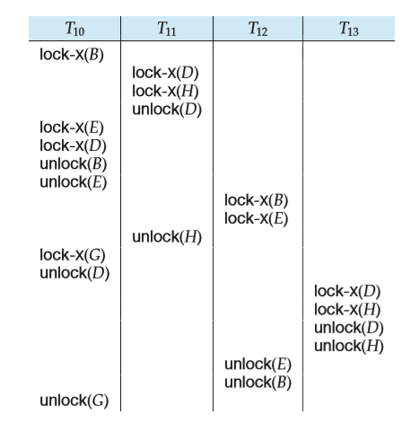

**Figure 15.12** Serializable schedule under the tree protocol.  

transaction that performed the last write to the data item. Transaction _Ti_ is then not permitted to commit until the commit of all transactions on which it has a commit dependency. If any of these transactions aborts, _Ti_ must also be aborted.

The tree-locking protocol has an advantage over the two-phase locking pro- tocol in that, unlike two-phase locking, it is deadlock-free, so no rollbacks are required. The tree-locking protocol has another advantage over the two-phase locking protocol in that unlocking may occur earlier. Earlier unlocking may lead to shorter waiting times, and to an increase in concurrency.

However, the protocol has the disadvantage that, in some cases, a transaction may have to lock data items that it does not access. For example, a transaction that needs to access data items _A_ and _J_ in the database graph of Figure 15.11 must lock not only _A_ and _J_, but also data items _B_, _D_, and _H_. This additional locking results in increased locking overhead, the possibility of additional waiting time, and a potential decrease in concurrency. Further, without prior knowledge of what data items will need to be locked, transactions will have to lock the root of the tree, and that can reduce concurrency greatly.

For a set of transactions, there may be conflict-serializable schedules that cannot be obtained through the tree protocol. Indeed, there are schedules possible under the two-phase locking protocol that are not possible under the tree protocol, and vice versa. Examples of such schedules are explored in the exercises.

### Deadlock Handling**

A system is in a deadlock state if there exists a set of transactions such that every transaction in the set is waiting for another transaction in the set. More precisely, there exists a set of waiting transactions _{T_0, T1_, . . . , Tn}_ such that T0 is waiting for a data item that T1 holds, and T1 is waiting for a data item that T2 holds, and _. . ._ , and _Tn_−1 is waiting for a data item that _Tn_ holds, and _Tn_ is waiting for a data item that T0 holds. None of the transactions can make progress in such a situation.

The only remedy to this undesirable situation is for the system to invoke some drastic action, such as rolling back some of the transactions involved in the deadlock. Rollback of a transaction may be partial: That is, a transaction may be rolled back to the point where it obtained a lock whose release resolves the deadlock.

There are two principal methods for dealing with the deadlock problem. We can use a **deadlock prevention** protocol to ensure that the system will _never_ enter a deadlock state. Alternatively, we can allow the system to enter a deadlock state, and then try to recover by using a **deadlock detection** and **deadlock recovery** scheme. As we shall see, both methods may result in transaction rollback. Preven- tion is commonly used if the probability that the system would enter a deadlock state is relatively high; otherwise, detection and recovery are more efficient.

Note that a detection and recovery scheme requires overhead that includes not only the run-time cost of maintaining the necessary information and of executing the detection algorithm, but also the potential losses inherent in recovery from a deadlock.  

#### Deadlock Prevention

There are two approaches to deadlock prevention. One approach ensures that no cyclic waits can occur by ordering the requests for locks, or requiring all locks to be acquired together. The other approach is closer to deadlock recovery, and performs transaction rollback instead of waiting for a lock, whenever the wait could potentially result in a deadlock.

The simplest scheme under the first approach requires that each transaction locks all its data items before it begins execution. Moreover, either all are locked in one step or none are locked. There are two main disadvantages to this protocol: (1) it is often hard to predict, before the transaction begins, what data items need to be locked; (2) data-item utilization may be very low, since many of the data items may be locked but unused for a long time.

Another approach for preventing deadlocks is to impose an ordering of all data items, and to require that a transaction lock data items only in a sequence consistent with the ordering. We have seen one such scheme in the tree protocol, which uses a partial ordering of data items.

A variation of this approach is to use a total order of data items, in conjunction with two-phase locking. Once a transaction has locked a particular item, it cannot request locks on items that precede that item in the ordering. This scheme is easy to implement, as long as the set of data items accessed by a transaction is known when the transaction starts execution. There is no need to change the underlying concurrency-control system if two-phase locking is used: All that is needed is to ensure that locks are requested in the right order.

The second approach for preventing deadlocks is to use preemption and transaction rollbacks. In preemption, when a transaction _Tj_ requests a lock that transaction _Ti_ holds, the lock granted to _Ti_ may be **preempted** by rolling back of _Ti_ , and granting of the lock to _Tj_ . To control the preemption, we assign a unique timestamp, based on a counter or on the system clock, to each transaction when it begins. The system uses these timestamps only to decide whether a transaction should wait or roll back. Locking is still used for concurrency control. If a transaction is rolled back, it retains its _old_ timestamp when restarted. Two different deadlock-prevention schemes using timestamps have been proposed:

**1\.** The **wait–die** scheme is a nonpreemptive technique. When transaction _Ti_ requests a data item currently held by _Tj_ , _Ti_ is allowed to wait only if it has a timestamp smaller than that of _Tj_ (that is, _Ti_ is older than _Tj_ ). Otherwise, _Ti_ is rolled back (dies).

For example, suppose that transactions T14, T15, and T16 have timestamps 5, 10, and 15, respectively. If T14 requests a data item held by T15, then T14 will wait. If T24 requests a data item held by T15, then T16 will be rolled back.

**2\.** The **wound–wait** scheme is a preemptive technique. It is a counterpart to the wait–die scheme. When transaction _Ti_ requests a data item currently held by _Tj_ , _Ti_ is allowed to wait only if it has a timestamp larger than that of _Tj_ (that is, _Ti_ is younger than _Tj_ ). Otherwise, _Tj_ is rolled back (_Tj_ is _wounded_ by _Ti_ ).  

Returning to our example, with transactions T14, T15, and T16, if T14 requests a data item held by T15, then the data item will be preempted from T15, and T15 will be rolled back. If T16 requests a data item held by T15, then T16 will wait.

The major problem with both of these schemes is that unnecessary rollbacks may occur.

Another simple approach to deadlock prevention is based on **lock timeouts**. In this approach, a transaction that has requested a lock waits for at most a specified amount of time. If the lock has not been granted within that time, the transaction is said to time out, and it rolls itself back and restarts. If there was in fact a deadlock, one or more transactions involved in the deadlock will time out and roll back, allowing the others to proceed. This scheme falls somewhere between deadlock prevention, where a deadlock will never occur, and deadlock detection and recovery, which Section 15.2.2 discusses.

The timeout scheme is particularly easy to implement, and works well if transactions are short and if long waits are likely to be due to deadlocks. However, in general it is hard to decide how long a transaction must wait before timing out. Too long a wait results in unnecessary delays once a deadlock has occurred. Too short a wait results in transaction rollback even when there is no deadlock, leading to wasted resources. Starvation is also a possibility with this scheme. Hence, the timeout-based scheme has limited applicability.

#### Deadlock Detection and Recovery

If a system does not employ some protocol that ensures deadlock freedom, then a detection and recovery scheme must be used. An algorithm that examines the state of the system is invoked periodically to determine whether a deadlock has occurred. If one has, then the system must attempt to recover from the deadlock. To do so, the system must:

• Maintain information about the current allocation of data items to transac- tions, as well as any outstanding data item requests.

• Provide an algorithm that uses this information to determine whether the system has entered a deadlock state.

• Recover from the deadlock when the detection algorithm determines that a deadlock exists.

In this section, we elaborate on these issues.

##### Deadlock Detection

Deadlocks can be described precisely in terms of a directed graph called a **wait- for graph**. This graph consists of a pair _G_ \= (_V_, _E_), where _V_ is a set of vertices and _E_ is a set of edges. The set of vertices consists of all the transactions in the system. Each element in the set _E_ of edges is an ordered pair _Ti_ → _Tj_ . If _Ti_ → _Tj_ is in _E_,  

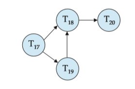

**Figure 15.13** Wait-for graph with no cycle.

then there is a directed edge from transaction _Ti_ to _Tj_ , implying that transaction _Ti_ is waiting for transaction _Tj_ to release a data item that it needs.

When transaction _Ti_ requests a data item currently being held by transaction _Tj_ , then the edge _Ti_ → _Tj_ is inserted in the wait-for graph. This edge is removed only when transaction _Tj_ is no longer holding a data item needed by transaction _Ti_ .

A deadlock exists in the system if and only if the wait-for graph contains a cycle. Each transaction involved in the cycle is said to be deadlocked. To detect deadlocks, the system needs to maintain the wait-for graph, and periodically to invoke an algorithm that searches for a cycle in the graph.

To illustrate these concepts, consider the wait-for graph in Figure 15.13, which depicts the following situation:

• Transaction T17 is waiting for transactions T18 and T19.

• Transaction T19 is waiting for transaction T18.

• Transaction T18 is waiting for transaction T20.

Since the graph has no cycle, the system is not in a deadlock state. Suppose now that transaction T20 is requesting an item held by T19\. The edge

T20 → T19 is added to the wait-for graph, resulting in the new system state in Figure 15.14. This time, the graph contains the cycle:

T18 → T20 → T19 → T18

implying that transactions T18, T19, and T20 are all deadlocked. Consequently, the question arises: When should we invoke the detection

algorithm? The answer depends on two factors:

**1\.** How often does a deadlock occur?

**2\.** How many transactions will be affected by the deadlock?

If deadlocks occur frequently, then the detection algorithm should be in- voked more frequently. Data items allocated to deadlocked transactions will be  

**Figure 15.14** Wait-for graph with a cycle.

unavailable to other transactions until the deadlock can be broken. In addition, the number of cycles in the graph may also grow. In the worst case, we would invoke the detection algorithm every time a request for allocation could not be granted immediately.

##### Recovery from Deadlock

When a detection algorithm determines that a deadlock exists, the system must **recover** from the deadlock. The most common solution is to roll back one or more transactions to break the deadlock. Three actions need to be taken:

**1\. Selection of a victim**. Given a set of deadlocked transactions, we must deter- mine which transaction (or transactions) to roll back to break the deadlock. We should roll back those transactions that will incur the minimum cost. Unfortunately, the term _minimum cost_ is not a precise one. Many factors may determine the cost of a rollback, including:

a. How long the transaction has computed, and how much longer the transaction will compute before it completes its designated task.

b. How many data items the transaction has used.

c. How many more data items the transaction needs for it to complete.

d. How many transactions will be involved in the rollback.

**2\. Rollback**. Once we have decided that a particular transaction must be rolled back, we must determine how far this transaction should be rolled back.

The simplest solution is a **total rollback**: Abort the transaction and then restart it. However, it is more effective to roll back the transaction only as far as necessary to break the deadlock. Such **partial rollback** requires the system to maintain additional information about the state of all the running transactions. Specifically, the sequence of lock requests/grants and updates performed by the transaction needs to be recorded. The deadlock detection mechanism should decide which locks the selected transaction needs to release in order to break the deadlock. The selected transaction must be rolled back to the point where it obtained the first of these locks, undoing all actions it took after that point. The recovery mechanism must be capable  

of performing such partial rollbacks. Furthermore, the transactions must be capable of resuming execution after a partial rollback. See the bibliographical notes for relevant references.

**3\. Starvation**. In a system where the selection of victims is based primarily on cost factors, it may happen that the same transaction is always picked as a victim. As a result, this transaction never completes its designated task, thus there is **starvation**. We must ensure that a transaction can be picked as a victim only a (small) finite number of times. The most common solution is to include the number of rollbacks in the cost factor.

### Multiple Granularity

In the concurrency-control schemes described thus far, we have used each indi- vidual data item as the unit on which synchronization is performed.

There are circumstances, however, where it would be advantageous to group several data items, and to treat them as one individual synchronization unit. For example, if a transaction _Ti_ needs to access the entire database, and a locking protocol is used, then _Ti_ must lock each item in the database. Clearly, executing these locks is time-consuming. It would be better if _Ti_ could issue a _single_ lock request to lock the entire database. On the other hand, if transaction _Tj_ needs to access only a few data items, it should not be required to lock the entire database, since otherwise concurrency is lost.

What is needed is a mechanism to allow the system to define multiple levels of **granularity**. This is done by allowing data items to be of various sizes and defining a hierarchy of data granularities, where the small granularities are nested within larger ones. Such a hierarchy can be represented graphically as a tree. Note that the tree that we describe here is significantly different from that used by the tree protocol (Section 15.1.5). A nonleaf node of the multiple-granularity tree represents the data associated with its descendants. In the tree protocol, each node is an independent data item.

As an illustration, consider the tree of Figure 15.15, which consists of four levels of nodes. The highest level represents the entire database. Below it are nodes of type _area_; the database consists of exactly these areas. Each area in turn has nodes of type _file_ as its children. Each area contains exactly those files that are its child nodes. No file is in more than one area. Finally, each file has nodes of type _record_. As before, the file consists of exactly those records that are its child nodes, and no record can be present in more than one file.

Each node in the tree can be locked individually. As we did in the two- phase locking protocol, we shall use **shared** and **exclusive** lock modes. When a transaction locks a node, in either shared or exclusive mode, the transaction also has implicitly locked all the descendants of that node in the same lock mode. For example, if transaction _Ti_ gets an **explicit lock** on file _Fc_ of Figure 15.15, in exclusive mode, then it has an **implicit lock** in exclusive mode on all the records belonging to that file. It does not need to lock the individual records of _Fc_ explicitly.  

**Figure 15.15** Granularity hierarchy.

Suppose that transaction _Tj_ wishes to lock record _rb_6 of file _Fb_ . Since _Ti_ has locked _Fb_ explicitly, it follows that _rb_6 is also locked (implicitly). But, when _Tj_ issues a lock request for _rb_6 , _rb_6 is not explicitly locked! How does the system determine whether _Tj_ can lock _rb_6 ? _Tj_ must traverse the tree from the root to record _rb_6 . If any node in that path is locked in an incompatible mode, then _Tj_ must be delayed.

Suppose now that transaction _Tk_ wishes to lock the entire database. To do so, it simply must lock the root of the hierarchy. Note, however, that _Tk_ should not succeed in locking the root node, since _Ti_ is currently holding a lock on part of the tree (specifically, on file _Fb_). But how does the system determine if the root node can be locked? One possibility is for it to search the entire tree. This solution, however, defeats the whole purpose of the multiple-granularity locking scheme. A more efficient way to gain this knowledge is to introduce a new class of lock modes, called **intention lock modes**. If a node is locked in an intention mode, explicit locking is done at a lower level of the tree (that is, at a finer granularity). Intention locks are put on all the ancestors of a node before that node is locked explicitly. Thus, a transaction does not need to search the entire tree to determine whether it can lock a node successfully. A transaction wishing to lock a node—say, _Q_—must traverse a path in the tree from the root to _Q_. While traversing the tree, the transaction locks the various nodes in an intention mode.

There is an intention mode associated with shared mode, and there is one with exclusive mode. If a node is locked in **intention-shared (IS) mode**, explicit locking is being done at a lower level of the tree, but with only shared-mode locks. Similarly, if a node is locked in **intention-exclusive (IX) mode**, then explicit locking is being done at a lower level, with exclusive-mode or shared-mode locks. Finally, if a node is locked in **shared and intention-exclusive (SIX) mode**, the subtree rooted by that node is locked explicitly in shared mode, and that explicit locking is being done at a lower level with exclusive-mode locks. The compatibility function for these lock modes is in Figure 15.16.  

**Figure 15.16** Compatibility matrix.

The **multiple-granularity locking protocol** uses these lock modes to ensure serializability. It requires that a transaction _Ti_ that attempts to lock a node _Q_ must follow these rules:

**1\.** Transaction _Ti_ must observe the lock-compatibility function of Figure 15.16.

**2\.** Transaction _Ti_ must lock the root of the tree first, and can lock it in any mode.

**3\.** Transaction _Ti_ can lock a node _Q_ in S or IS mode only if _Ti_ currently has the parent of _Q_ locked in either IX or IS mode.

**4\.** Transaction _Ti_ can lock a node _Q_ in X, SIX, or IX mode only if _Ti_ currently has the parent of _Q_ locked in either IX or SIX mode.

**5\.** Transaction _Ti_ can lock a node only if _Ti_ has not previously unlocked any node (that is, _Ti_ is two phase).

**6\.** Transaction _Ti_ can unlock a node _Q_ only if _Ti_ currently has none of the children of _Q_ locked.

Observe that the multiple-granularity protocol requires that locks be acquired in _top-down_ (root-to-leaf) order, whereas locks must be released in _bottom-up_ (leaf- to-root) order.

As an illustration of the protocol, consider the tree of Figure 15.15 and these transactions:

• Suppose that transaction T21 reads record _ra_2 in file _Fa_ . Then, T21 needs to lock the database, area _A_1, and _Fa_ in IS mode (and in that order), and finally to lock _ra_2 in S mode.

• Suppose that transaction T22 modifies record _ra_9 in file _Fa_ . Then, T22 needs to lock the database, area _A_1, and file _Fa_ (and in that order) in IX mode, and finally to lock _ra_9 in X mode.

• Suppose that transaction T23 reads all the records in file _Fa_ . Then, T23 needs to lock the database and area _A_1 (and in that order) in IS mode, and finally to lock _Fa_ in S mode.  

• Suppose that transaction T24 reads the entire database. It can do so after locking the database in S mode.

We note that transactions T21, T23, and T24 can access the database concurrently. Transaction T22 can execute concurrently with T21, but not with either T23 or T24.

This protocol enhances concurrency and reduces lock overhead. It is particu- larly useful in applications that include a mix of:

• Short transactions that access only a few data items.

• Long transactions that produce reports from an entire file or set of files.

There is a similar locking protocol that is applicable to database systems in which data granularities are organized in the form of a directed acyclic graph. See the bibliographical notes for additional references. Deadlock is possible in the multiple-granularity protocol, as it is in the two-phase locking protocol. There are techniques to reduce deadlock frequency in the multiple-granularity protocol, and also to eliminate deadlock entirely. These techniques are referenced in the bibliographical notes.

### 15.4 Timestamp-Based Protocols

The locking protocols that we have described thus far determine the order be- tween every pair of conflicting transactions at execution time by the first lock that both members of the pair request that involves incompatible modes. An- other method for determining the serializability order is to select an ordering among transactions in advance. The most common method for doing so is to use a _timestamp-ordering_ scheme.

#### Timestamps

With each transaction _Ti_ in the system, we associate a unique fixed timestamp, denoted by TS(_Ti_ ). This timestamp is assigned by the database system before the transaction _Ti_ starts execution. If a transaction _Ti_ has been assigned timestamp TS(_Ti_ ), and a new transaction _Tj_ enters the system, then TS(_Ti_ ) _<_ TS(_Tj_ ). There are two simple methods for implementing this scheme:

**1\.** Use the value of the **s ¯ ystem clock** as the timestamp; that is, a transaction’s

timestamp is equal to the value of the clock when the transaction enters the system.

**2\.** Use a **logical counter** that is incremented after a new timestamp has been assigned; that is, a transaction’s timestamp is equal to the value of the counter when the transaction enters the system.  

The timestamps of the transactions determine the serializability order. Thus, if TS(_Ti_ ) _<_ TS(_Tj_ ), then the system must ensure that the produced schedule is equivalent to a serial schedule in which transaction _Ti_ appears before transaction _Tj_ .

To implement this scheme, we associate with each data item _Q_ two timestamp values:

• **W-timestamp**(_Q_) denotes the largest timestamp of any transaction that exe- cuted write(_Q_) successfully.

• **R-timestamp**(_Q_) denotes the largest timestamp of any transaction that exe- cuted read(_Q_) successfully.

These timestamps are updated whenever a new read(_Q_) or write(_Q_) instruction is executed.

#### The Timestamp-Ordering Protocol

The **timestamp-ordering protocol** ensures that any conflicting read and write operations are executed in timestamp order. This protocol operates as follows:

**1\.** Suppose that transaction _Ti_ issues read(_Q_).

a. If TS(_Ti_ ) _<_ W-timestamp(_Q_), then _Ti_ needs to read a value of _Q_ that was already overwritten. Hence, the read operation is rejected, and _Ti_ is rolled back.

b. If TS(_Ti_ ) ≥ W-timestamp(_Q_), then the read operation is executed, and R-timestamp(_Q_) is set to the maximum of R-timestamp(_Q_) and TS(_Ti_ ).

**2\.** Suppose that transaction _Ti_ issues write(_Q_).

a. If TS(_Ti_ ) _<_ R-timestamp(_Q_), then the value of _Q_ that _Ti_ is producing was needed previously, and the system assumed that that value would never be produced. Hence, the system rejects the write operation and rolls _Ti_ back.

b. If TS(_Ti_ ) _<_ W-timestamp(_Q_), then _Ti_ is attempting to write an obsolete value of _Q_. Hence, the system rejects this write operation and rolls _Ti_ back.

c. Otherwise, the system executes the write operation and sets W-time- stamp(_Q_) to TS(_Ti_ ).

If a transaction _Ti_ is rolled back by the concurrency-control scheme as result of issuance of either a read or write operation, the system assigns it a new timestamp and restarts it.

To illustrate this protocol, we consider transactions T25 and T26\. Transaction T25 displays the contents of accounts _A_ and _B_:  

T25: read(_B_);
 read(_A_);
  display(_A_ \+ _B_).

Transaction T26 transfers $50 from account _B_ to account _A_, and then displays the contents of both:

T26: read(_B_);
 _B_ := _B_ − 50;
  write(_B_); 
  read(_A_); 
  _A_ := _A_ \+ 50; 
  write(_A_); 
  display(_A_ \+ _B_).

In presenting schedules under the timestamp protocol, we shall assume that a transaction is assigned a timestamp immediately before its first instruction. Thus, in schedule 3 of Figure 15.17, TS(_T_25) _<_ TS(_T_26), and the schedule is possible under the timestamp protocol.

We note that the preceding execution can also be produced by the two-phase locking protocol. There are, however, schedules that are possible under the two- phase locking protocol, but are not possible under the timestamp protocol, and vice versa (see Exercise 15.29).

The timestamp-ordering protocol ensures conflict serializability. This is be- cause conflicting operations are processed in timestamp order.

The protocol ensures freedom from deadlock, since no transaction ever waits. However, there is a possibility of starvation of long transactions if a sequence of conflicting short transactions causes repeated restarting of the long transaction. If a transaction is suffering from repeated restarts, conflicting transactions need to be temporarily blocked to enable the transaction to finish.

**Figure 15.17** Schedule 3.  

The protocol can generate schedules that are not recoverable. However, it can be extended to make the schedules recoverable, in one of several ways:

• Recoverability and cascadelessness can be ensured by performing all writes together at the end of the transaction. The writes must be atomic in the following sense: While the writes are in progress, no transaction is permitted to access any of the data items that have been written.

• Recoverability and cascadelessness can also be guaranteed by using a limited form of locking, whereby reads of uncommitted items are postponed until the transaction that updated the item commits (see Exercise 15.30).

• Recoverability alone can be ensured by tracking uncommitted writes, and al- lowing a transaction _Ti_ to commit only after the commit of any transaction that wrote a value that _Ti_ read. Commit dependencies, outlined in Section 15.1.5, can be used for this purpose.

#### Thomas’ Write Rule

We now present a modification to the timestamp-ordering protocol that allows greater potential concurrency than does the protocol of Section 15.4.2. Let us consider schedule 4 of Figure 15.18, and apply the timestamp-ordering protocol. Since _T_27 starts before _T_28, we shall assume that TS(_T_27) _<_ TS(_T_28). The read(_Q_) operation of _T_27 succeeds, as does the write(_Q_) operation of _T_28\. When _T_27 at- tempts its write(_Q_) operation, we find that TS(_T_27) _<_ W-timestamp(_Q_), since W- timestamp(_Q_) = TS(_T_28). Thus, the write(_Q_) by _T_27 is rejected and transaction _T_27 must be rolled back.

Although the rollback of _T_27 is required by the timestamp-ordering protocol, it is unnecessary. Since _T_28 has already written _Q_, the value that _T_27 is attempting to write is one that will never need to be read. Any transaction _Ti_ with TS(_Ti_ ) _<_

TS(_T_28) that attempts a read(_Q_) will be rolled back, since TS(_Ti_) _<_ W-timestamp(_Q_). Any transaction _Tj_ with TS(_Tj_ ) _\>_ TS(_T_28) must read the value of _Q_ written by _T_28, rather than the value that _T_27 is attempting to write.

This observation leads to a modified version of the timestamp-ordering proto- col in which obsolete write operations can be ignored under certain circumstances. The protocol rules for read operations remain unchanged. The protocol rules for write operations, however, are slightly different from the timestamp-ordering protocol of Section 15.4.2.

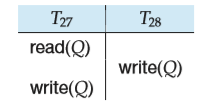

**Figure 15.18** Schedule 4.  

The modification to the timestamp-ordering protocol, called **Thomas’ write rule**, is this: Suppose that transaction _Ti_ issues write(_Q_).

**1\.** If TS(_Ti_ ) _<_ R-timestamp(_Q_), then the value of _Q_ that _Ti_ is producing was previously needed, and it had been assumed that the value would never be produced. Hence, the system rejects the write operation and rolls _Ti_ back.

**2\.** If TS(_Ti_ ) _<_ W-timestamp(_Q_), then _Ti_ is attempting to write an obsolete value of _Q_. Hence, this write operation can be ignored.

**3\.** Otherwise, the system executes the write operation and sets W-timestamp(_Q_) to TS(_Ti_ ).

The difference between these rules and those of Section 15.4.2 lies in the second rule. The timestamp-ordering protocol requires that _Ti_ be rolled back if _Ti_ issues write(_Q_) and TS(_Ti_ ) _<_ W-timestamp(_Q_). However, here, in those cases where TS(_Ti_ ) ≥ R-timestamp(_Q_), we ignore the obsolete write.

By ignoring the write, Thomas’ write rule allows schedules that are not conflict serializable but are nevertheless correct. Those non-conflict-serializable sched- ules allowed satisfy the definition of _view serializable_ schedules (see example box). Thomas’ write rule makes use of view serializability by, in effect, deleting ob- solete write operations from the transactions that issue them. This modification of transactions makes it possible to generate serializable schedules that would not be possible under the other protocols presented in this chapter. For example, schedule 4 of Figure 15.18 is not conflict serializable and, thus, is not possible un- der the two-phase locking protocol, the tree protocol, or the timestamp-ordering protocol. Under Thomas’ write rule, the write(_Q_) operation of _T_27 would be ig- nored. The result is a schedule that is _view equivalent_ to the serial schedule _<T_27, _T_28_\>_.

### Validation-Based Protocols

In cases where a majority of transactions are read-only transactions, the rate of conflicts among transactions may be low. Thus, many of these transactions, if executed without the supervision of a concurrency-control scheme, would nev- ertheless leave the system in a consistent state. A concurrency-control scheme imposes overhead of code execution and possible delay of transactions. It may be better to use an alternative scheme that imposes less overhead. A difficulty in reducing the overhead is that we do not know in advance which transactions will be involved in a conflict. To gain that knowledge, we need a scheme for _monitoring_ the system.

The **validation protocol** requires that each transaction _Ti_ executes in two or three different phases in its lifetime, depending on whether it is a read-only or an update transaction. The phases are, in order:  

**VIEW SERIALIZABILITY**

There is another form of equivalence that is less stringent than conflict equiv- alence, but that, like conflict equivalence, is based on only the read and write operations of transactions.

Consider two schedules _S_ and _S_′, where the same set of transactions partici- pates in both schedules. The schedules _S_ and _S_′ are said to be **view equivalent** if three conditions are met:

**1\.** For each data item _Q_, if transaction _Ti_ reads the initial value of _Q_ in schedule _S_, then transaction _Ti_ must, in schedule _S_′, also read the initial value of _Q_.

**2\.** For each data item _Q_, if transaction _Ti_ executes read(_Q_) in schedule _S_, and if that value was produced by a write(_Q_) operation executed by transaction _Tj_ , then the read(_Q_) operation of transaction _Ti_ must, in schedule _S_′, also read the value of _Q_ that was produced by the same write(_Q_) operation of transaction _Tj_ .

**3\.** For each data item _Q_, the transaction (if any) that performs the final write(_Q_) operation in schedule _S_ must perform the final write(_Q_) operation in schedule _S_′.

Conditions 1 and 2 ensure that each transaction reads the same values in both schedules and, therefore, performs the same computation. Condition 3, coupled with conditions 1 and 2, ensures that both schedules result in the same final system state.

The concept of view equivalence leads to the concept of view serializability. We say that a schedule _S_ is **view serializable** if it is view equivalent to a serial schedule.

As an illustration, suppose that we augment schedule 4 with transaction _T_29, and obtain the following view serializable (schedule 5):

Indeed, schedule 5 is view equivalent to the serial schedule _<T_27_, T_28_, T_29_\>_, since the one read(_Q_) instruction reads the initial value of _Q_ in both schedules and _T_29 performs the final write of _Q_ in both schedules.

Every conflict-serializable schedule is also view serializable, but there are view-serializable schedules that are not conflict serializable. Indeed, schedule 5 is not conflict serializable, since every pair of consecutive instructions conflicts, and, thus, no swapping of instructions is possible.

Observe that, in schedule 5, transactions _T_28 and _T_29 perform write(_Q_) oper- ations without having performed a read(_Q_) operation. Writes of this sort are called **blind writes**. Blind writes appear in any view-serializable schedule that is not conflict serializable.  

**1\. Read phase**. During this phase, the system executes transaction _Ti_ . It reads the values of the various data items and stores them in variables local to _Ti_ . It performs all write operations on temporary local variables, without updates of the actual database.

**2\. Validation phase**. The validation test (described below) is applied to trans- action _Ti_ . This determines whether _Ti_ is allowed to proceed to the write phase without causing a violation of serializability. If a transaction fails the validation test, the system aborts the transaction.

**3\. Write phase**. If the validation test succeeds for transaction _Ti_ , the temporary local variables that hold the results of any write operations performed by _Ti_ are copied to the database. Read-only transactions omit this phase.

Each transaction must go through the phases in the order shown. However, phases of concurrently executing transactions can be interleaved.

To perform the validation test, we need to know when the various phases of transactions took place. We shall, therefore, associate three different timestamps with each transaction _Ti_ :

**1\. Start**(_Ti_ ), the time when _Ti_ started its execution.

**2\. Validation**(_Ti_ ), the time when _Ti_ finished its read phase and started its validation phase.

**3\. Finish**(_Ti_ ), the time when _Ti_ finished its write phase.

We determine the serializability order by the timestamp-ordering technique, using the value of the timestamp Validation(_Ti_ ). Thus, the value TS(_Ti_ ) = Valida- tion(_Ti_ ) and, if TS(_Tj_ ) _<_ TS(_Tk_), then any produced schedule must be equivalent to a serial schedule in which transaction _Tj_ appears before transaction _Tk_ . The reason we have chosen Validation(_Ti_ ), rather than Start(_Ti_ ), as the timestamp of transaction _Ti_ is that we can expect faster response time provided that conflict rates among transactions are indeed low.

The **validation test** for transaction _Ti_ requires that, for all transactions _Tk_ with TS(_Tk_) _<_ TS(_Ti_ ), one of the following two conditions must hold:

**1\.** Finish(_Tk_) _<_ Start(_Ti_ ). Since _Tk_ completes its execution before _Ti_ started, the serializability order is indeed maintained.

**2\.** The set of data items written by _Tk_ does not intersect with the set of data items read by _Ti_ , and _Tk_ completes its write phase before _Ti_ starts its validation phase (Start(_Ti_ ) _<_ Finish(_Tk_) _<_ Validation(_Ti_ )). This condition ensures that the writes of _Tk_ and _Ti_ do not overlap. Since the writes of _Tk_ do not affect the read of _Ti_ , and since _Ti_ cannot affect the read of _Tk_ , the serializability order is indeed maintained.  

**Figure 15.19** Schedule 6, a schedule produced by using validation.

As an illustration, consider again transactions _T_25 and _T_26\. Suppose that TS(_T_25) _<_ TS(_T_26). Then, the validation phase succeeds in the schedule 6 in Figure 15.19. Note that the writes to the actual variables are performed only after the validation phase of _T_26\. Thus, _T_25 reads the old values of _B_ and _A_, and this schedule is serializable.

The validation scheme automatically guards against cascading rollbacks, since the actual writes take place only after the transaction issuing the write has committed. However, there is a possibility of starvation of long transactions, due to a sequence of conflicting short transactions that cause repeated restarts of the long transaction. To avoid starvation, conflicting transactions must be tem- porarily blocked, to enable the long transaction to finish.

This validation scheme is called the **optimistic concurrency-control** scheme since transactions execute optimistically, assuming they will be able to finish execution and validate at the end. In contrast, locking and timestamp ordering are pessimistic in that they force a wait or a rollback whenever a conflict is detected, even though there is a chance that the schedule may be conflict serializable.

### Multiversion Schemes

The concurrency-control schemes discussed thus far ensure serializability by ei- ther delaying an operation or aborting the transaction that issued the operation. For example, a read operation may be delayed because the appropriate value has not been written yet; or it may be rejected (that is, the issuing transaction must be aborted) because the value that it was supposed to read has already been overwritten. These difficulties could be avoided if old copies of each data item were kept in a system.

In **multiversion concurrency-control** schemes, each write(_Q_) operation cre- ates a new **version** of _Q_. When a transaction issues a read(_Q_) operation, the  

concurrency-control manager selects one of the versions of _Q_ to be read. The concurrency-control scheme must ensure that the version to be read is selected in a manner that ensures serializability. It is also crucial, for performance reasons, that a transaction be able to determine easily and quickly which version of the data item should be read.

#### Multiversion Timestamp Ordering

The timestamp-ordering protocol can be extended to a multiversion protocol. With each transaction _Ti_ in the system, we associate a unique static timestamp, denoted by TS(_Ti_ ). The database system assigns this timestamp before the trans- action starts execution, as described in Section 15.4.

With each data item _Q_, a sequence of versions _<Q_1, _Q_2_, . . . , Qm>_ is associated. Each version _Qk_ contains three data fields:

• **Content** is the value of version _Qk_ .

• **W-timestamp**(_Qk_) is the timestamp of the transaction that created version _Qk_ .

• **R-timestamp**(_Qk_) is the largest timestamp of any transaction that successfully read version _Qk_ .

A transaction—say, _Ti_ —creates a new version _Qk_ of data item _Q_ by issuing a write(_Q_) operation. The content field of the version holds the value written by _Ti_ . The system initializes the W-timestamp and R-timestamp to TS(_Ti_ ). It updates the R-timestamp value of _Qk_ whenever a transaction _Tj_ reads the content of _Qk_ , and R-timestamp(_Qk_) _<_ TS(_Tj_ ).

The **multiversion timestamp-ordering scheme** presented next ensures seri- alizability. The scheme operates as follows: Suppose that transaction _Ti_ issues a read(_Q_) or write(_Q_) operation. Let _Qk_ denote the version of _Q_ whose write timestamp is the largest write timestamp less than or equal to TS(_Ti_ ).

**1\.** If transaction _Ti_ issues a read(_Q_), then the value returned is the content of version _Qk_ .

**2\.** If transaction _Ti_ issues write(_Q_), and if TS(_Ti_ ) _<_ R-timestamp(_Qk_), then the system rolls back transaction _Ti_ . On the other hand, if TS(_Ti_ ) = W- timestamp(_Qk_), the system overwrites the contents of _Qk_ ; otherwise (if TS(_Ti_ ) _\>_ R-timestamp(_Qk_)), it creates a new version of _Q_.

The justification for rule 1 is clear. A transaction reads the most recent version that comes before it in time. The second rule forces a transaction to abort if it is “too late” in doing a write. More precisely, if _Ti_ attempts to write a version that some other transaction would have read, then we cannot allow that write to succeed.

Versions that are no longer needed are removed according to the following rule: Suppose that there are two versions, _Qk_ and _Q j_ , of a data item, and that both  

versions have a W-timestamp less than the timestamp of the oldest transaction in the system. Then, the older of the two versions _Qk_ and _Q j_ will not be used again, and can be deleted.

The multiversion timestamp-ordering scheme has the desirable property that a read request never fails and is never made to wait. In typical database systems, where reading is a more frequent operation than is writing, this advantage may be of major practical significance.

The scheme, however, suffers from two undesirable properties. First, the read- ing of a data item also requires the updating of the R-timestamp field, resulting in two potential disk accesses, rather than one. Second, the conflicts between trans- actions are resolved through rollbacks, rather than through waits. This alternative may be expensive. Section 15.6.2 describes an algorithm to alleviate this problem.

This multiversion timestamp-ordering scheme does not ensure recoverabil- ity and cascadelessness. It can be extended in the same manner as the basic timestamp-ordering scheme, to make it recoverable and cascadeless.

#### Multiversion Two-Phase Locking

The **multiversion two-phase locking protocol** attempts to combine the advan- tages of multiversion concurrency control with the advantages of two-phase locking. This protocol differentiates between **read-only transactions** and **update transactions**.

Update transactions perform rigorous two-phase locking; that is, they hold all locks up to the end of the transaction. Thus, they can be serialized according to their commit order. Each version of a data item has a single timestamp. The timestamp in this case is not a real clock-based timestamp, but rather is a counter, which we will call the ts-counter, that is incremented during commit processing.

The database system assigns read-only transactions a timestamp by read- ing the current value of ts-counter before they start execution; they follow the multiversion timestamp-ordering protocol for performing reads. Thus, when a read-only transaction _Ti_ issues a read(_Q_), the value returned is the contents of the version whose timestamp is the largest timestamp less than or equal to TS(_Ti_ ).

When an update transaction reads an item, it gets a shared lock on the item, and reads the latest version of that item. When an update transaction wants to write an item, it first gets an exclusive lock on the item, and then creates a new version of the data item. The write is performed on the new version, and the timestamp of the new version is initially set to a value ∞, a value greater than that of any possible timestamp.

When the update transaction _Ti_ completes its actions, it carries out commit processing: First, _Ti_ sets the timestamp on every version it has created to 1 more than the value of ts-counter; then, _Ti_ increments ts-counter by 1. Only one update transaction is allowed to perform commit processing at a time.

As a result, read-only transactions that start after _Ti_ increments ts-counter will see the values updated by _Ti_ , whereas those that start before _Ti_ increments ts-counter will see the value before the updates by _Ti_ . In either case, read-only  

transactions never need to wait for locks. Multiversion two-phase locking also ensures that schedules are recoverable and cascadeless.

Versions are deleted in a manner like that of multiversion timestamp ordering. Suppose there are two versions, _Qk_ and _Q j_ , of a data item, and that both versions have a timestamp less than or equal to the timestamp of the oldest read-only transaction in the system. Then, the older of the two versions _Qk_ and _Q j_ will not be used again and can be deleted.

### Snapshot Isolation

Snapshot isolation is a particular type of concurrency-control scheme that has gained wide acceptance in commercial and open-source systems, including Ora- cle, PostgreSQL, and SQL Server. We introduced snapshot isolation in Section 14.9.3. Here, we take a more detailed look into how it works.

Conceptually, snapshot isolation involves giving a transaction a “snapshot” of the database at the time when it begins its execution. It then operates on that snap- shot in complete isolation from concurrent transactions. The data values in the snapshot consist only of values written by committed transactions. This isolation is ideal for read-only transactions since they never wait and are never aborted by the concurrency manager. Transactions that update the database must, of course, interact with potentially conflicting concurrent update transactions before up- dates are actually placed in the database. Updates are kept in the transaction’s private workspace until the transaction successfully commits, at which point the updates are written to the database. When a transaction _T_ is allowed to commit, the transition of _T_ to the committed state and the writing of all of the updates made by _T_ to the database must be done as an atomic action so that any snapshot created for another transaction either includes all updates by transaction _T_ or none of them.

#### Validation Steps for Update Transactions

Deciding whether or not to allow an update transaction to commit requires some care. Potentially, two transactions running concurrently might both update the same data item. Since these two transactions operate in isolation using their own private snapshots, neither transaction sees the update made by the other. If both transactions are allowed to write to the database, the first update written will be overwritten by the second. The result is a **lost update**. Clearly, this must be prevented. There are two variants of snapshot isolation, both of which prevent lost updates. They are called _first committer wins_ and _first updater wins_. Both approaches are based on testing the transaction against concurrent transactions. A transaction is said to be **concurrent with** _T_ if it was active or partially committed at any point from the start of _T_ up to and including the time when this test is being performed.

Under **first committer wins**, when a transaction _T_ enters the partially com- mitted state, the following actions are taken in an atomic action:  

• A test is made to see if any transaction that was concurrent with _T_ has already written an update to the database for some data item that _T_ intends to write.

• If some such transaction is found, then _T_ aborts.

• If no such transaction is found, then _T_ commits and its updates are written to the database.

This approach is called “first committer wins” because if transactions conflict, the first one to be tested using the above rule succeeds in writing its updates, while the subsequent ones are forced to abort. Details of how to implement the above tests are addressed in Exercise 15.19.

Under **first updater wins** the system uses a locking mechanism that applies only to updates (reads are unaffected by this, since they do not obtain locks). When a transaction _Ti_ attempts to update a data item, it requests a _write lock_ on that data item. If the lock is not held by a concurrent transaction, the following steps are taken after the lock is acquired:

• If the item has been updated by any concurrent transaction, then _Ti_ aborts.

• Otherwise _Ti_ may proceed with its execution including possibly committing.

If, however, some other concurrent transaction _Tj_ already holds a write lock on that data item, then _Ti_ cannot proceed and the following rules are followed:

• _Ti_ waits until _Tj_ aborts or commits.

◦ If _Tj_ aborts, then the lock is released and _Ti_ can obtain the lock. After the lock is acquired, the check for an update by a concurrent transaction is performed as described earlier: _Ti_ aborts if a concurrent transaction had updated the data item, and proceeds with its execution otherwise.

◦ If _Tj_ commits, then _Ti_ must abort.

Locks are released when the transaction commits or aborts. This approach is called “first updater wins” because if transactions conflict,

the first one to obtain the lock is the one that is permitted to commit and perform its update. Those that attempt the update later abort unless the first updater subsequently aborts for some other reason. (As an alternative to waiting to see if the first updater _Tj_ aborts, a subsequent updater _Ti_ can be aborted as soon as it finds that the write lock it wishes to obtain is held by _Tj_ .)

#### Serializability Issues**

Snapshot isolation is attractive in practice because the overhead is low and no aborts occur unless two concurrent transactions update the same data item.

There is, however, one serious problem with the snapshot isolation scheme as we have presented it, and as it is implemented in practice: _snapshot isolation does_ **not** _ensure serializability_. This is true even in Oracle, which uses snapshot isolation  

as the implementation for the serializable isolation level! Next, we give examples of possible nonserializable executions under snapshot isolation and show how to deal with them.

**1\.** Suppose that we have two concurrent transactions _Ti_ and _Tj_ and two data items _A_ and _B_. Suppose that _Ti_ reads _A_ and _B_, then updates _B_, while _Tj_ reads _A_ and _B_, then updates _A_. For simplicity, we assume there are no other concurrent transactions. Since _Ti_ and _Tj_ are concurrent, neither transaction sees the update by the other in its snapshot. But, since they update different data items, both are allowed to commit regardless of whether the system uses the first-update-wins policy or the first-committer-wins policy.

However, the precedence graph has a cycle. There is an edge in the precedence graph from _Ti_ to _Tj_ because _Ti_ reads the value of _A_ that existed before _Tj_ writes _A_. There is also an edge in the precedence graph from _Tj_ to _Ti_ because _Tj_ reads the value of _B_ that existed before _Ti_ writes _B_. Since there is a cycle in the precedence graph, the result is a nonserializable schedule.

This situation, where each of a pair of transactions has read data that is written by the other, but there is no data written by both transactions, is referred to as **write skew**. As a concrete example of write skew, consider a banking scenario. Suppose that the bank enforces the integrity constraint that the sum of the balances in the checking and the savings account of a customer must not be negative. Suppose the checking and savings balances for a customer are $100 and $200, respectively. Suppose that transaction _T_36 withdraws $200 from the checking account, after verifying the integrity con- straint by reading both balances. Suppose that concurrently transaction _T_37 withdraws $200 from the savings account, again after verifying the integrity constraint. Since each of the transactions checks the integrity constraint on its own snapshot, if they run concurrently each will believe that the sum of the balances after the withdrawal is $100, and therefore its withdrawal does not violate the constraint. Since the two transactions update different data items, they do not have any update conflict, and under snapshot isolation both of them can commit.

Unfortunately, in the final state after both _T_36 and _T_37 have committed, the sum of the balances is $-100, violating the integrity constraint. Such a violation could never have occurred in any serial execution of _T_36 and _T_37.

It is worth noting that integrity constraints that are enforced by the database, such as primary-key and foreign-key constraints, cannot be check- ed on a snapshot; otherwise it would be possible for two concurrent trans- actions to insert two tuples with the same primary key value, or for a transaction to insert a foreign key value that is concurrently deleted from the referenced table. Instead, the database system must check these con- straints on the current state of the database, as part of validation at the time of commit.

**2\.** For the next example, we shall consider two concurrent update transactions that do not themselves present any problem as regards serializability unless  

a read-only transaction happens to show up at just the right time to cause a problem.

Suppose that we have two concurrent transactions _Ti_ and _Tj_ and two data items _A_and _B_. Suppose that _Ti_ reads _B_ and then updates _B_, while _Tj_ reads _A_ and _B_, then updates _A_. Running these two transactions concurrently causes no problem. Since _Ti_ accesses only data item _B_, there are no conflicts on data item _A_ and therefore there is no cycle in the precedence graph. The only edge in the precedence graph is the edge from _Tj_ to _Ti_ because _Tj_ reads the value of _B_ that existed before _Ti_ writes _B_.

However, let us suppose that _Ti_ commits while _Tj_ is still active. Suppose that, after _Ti_ commits but before _Tj_ commits, a new read-only transaction _Tk_ enters the system and _Tk_ reads both _A_ and _B_. Its snapshot includes the update by _Ti_ because _Ti_ has already committed. However, since _Tj_ has not committed, its update has not yet been written to the database and is not included in the snapshot seen by _Tk_ .

Consider the edges that are added to the precedence graph on account of _Tk_ . There is an edge in the precedence graph from _Ti_ to _Tk_ because _Ti_ writes the value of _B_ that existed before _Tk_ reads _B_. There is an edge in the precedence graph from _Tk_ to _Tj_ because _Tk_ reads the value of _A_ that existed before _Tj_ writes _A_. That leads to a cycle in the precedence graph, showing that the resulting schedule is nonserializable.

The above anomalies may not be as troublesome as they first appear. Recall that the reason for serializability is to ensure that, despite concurrent execution of transactions, database consistency is preserved. Since consistency is the goal, we can accept the potential for nonserializable executions if we are sure that those nonserializable executions that might occur will not lead to inconsistency. The second example above is a problem only if the application that submits the read-only transaction (_Tk_) cares about seeing updates to _A_ and _B_ out of order. In that example, we did not specify the database consistency constraints that each transaction expects to hold. If we are dealing with a financial database, it might be a very serious matter for _Tk_ to read updates out of proper serial order. On the other hand, if _A_ and _B_ are enrollments in two sections of the same course, then _Tk_ may not demand perfect serialization and we may know from our applications that update rates are low enough that any inaccuracy in what _Tk_ reads is not significant.

The fact that the database must check integrity constraints at the time of com- mit, and not on a snapshot, also helps avoid inconsistencies in some situations. Some financial applications create consecutive sequence numbers, for example to number bills, by taking the maximum current bill number and adding 1 to the value to get a new bill number. If two such transactions run concurrently, each would see the same set of bills in its snapshot, and each would create a new bill with the same number. Both transactions pass the validation tests for snapshot isolation, since they do not update any tuple in common. However, the execution is not serializable; the resultant database state cannot be obtained by any serial  

execution of the two transactions. Creating two bills with the same number could have serious legal implications.

The above problem is an example of the phantom phenomenon, since the insert performed by each transaction conflicts with the read performed by the other transaction to find the maximum bill number, but the conflict is not detected by snapshot isolation.1

Luckily, in most such applications the bill number would have been declared as a primary key, and the database system would detect the primary key violation outside the snapshot, and roll back one of the two transactions.2

An application developer can guard against certain snapshot anomalies by appending a **for update** clause to the SQL select query as illustrated below:

**select** \* **from** _instructor_ **where** ID = 22222 **for update**;

Adding the **for update** clause causes the system to treat data that are read as if they had been updated for purposes of concurrency control. In our first example of write skew, if the **for update** clause is appended to the select queries that read the account balances, only one of the two concurrent transactions would be allowed to commit since it appears that both transactions have updated both the checking and savings balances.

In our second example of nonserializable execution, if the author of transac- tion _Tk_ wished to avoid this anomaly, the **for update** clause could be appended to the **select** query, even though there is in fact no update. In our example, if _Tk_ used **select for update**, it would be treated as if it had updated _A_ and _B_ when it read them. The result would be that either _Tk_ or _Tj_ would be aborted, and retried later as a new transaction. This would lead to a serializable execution. In this example, the queries in the other two transactions do not need the **for update** clause to be added; unnecessary use of the **for update** clause can cause significant reduction in concurrency.

Formal methods exist (see the bibliographical notes) to determine whether a given mix of transactions runs the risk of nonserializable execution under snap- shot isolation, and to decide on what conflicts to introduce (using the **for update** clause, for example), to ensure serializability. Of course, such methods can work only if we know in advance what transactions are being executed. In some ap- plications, all transactions are from a predetermined set of transactions making this analysis possible. However, if the application allows unrestricted, ad-hoc transactions, then no such analysis is possible.

1The SQL standard uses the term phantom problem to refer to non-repeatable predicate reads, leading some to claim that snapshot isolation avoids the phantom problem; however, such a claim is not valid under our definition of phantom conflict. 2The problem of duplicate bill numbers actually occurred several times in a financial application in I.I.T. Bombay, where (for reasons too complex to discuss here) the bill number was not a primary key, and was detected by financial auditors.  

Of the three widely used systems that support snapshot isolation, SQL Server offers the option of a _serializable_ isolation level that truly ensures serializability along with a _snapshot_ isolation level that provides the performance advantages of snapshot isolation (along with the potential for the anomalies discussed above). In Oracle and PostgreSQL, the _serializable_ isolation level offers only snapshot iso- lation.

### Insert Operations, Delete Operations, and Predicate Reads

Until now, we have restricted our attention to read and write operations. This restriction limits transactions to data items already in the database. Some trans- actions require not only access to existing data items, but also the ability to create new data items. Others require the ability to delete data items. To examine how such transactions affect concurrency control, we introduce these additional oper- ations:

• **delete**(_Q_) deletes data item _Q_ from the database.

• **insert**(_Q_) inserts a new data item _Q_ into the database and assigns _Q_ an initial value.

An attempt by a transaction _Ti_ to perform a read(_Q_) operation after _Q_ has been deleted results in a logical error in _Ti_ . Likewise, an attempt by a transaction _Ti_ to perform a read(_Q_) operation before _Q_ has been inserted results in a logical error in _Ti_ . It is also a logical error to attempt to delete a nonexistent data item.

#### Deletion

To understand how the presence of **delete** instructions affects concurrency control, we must decide when a **delete** instruction conflicts with another instruction. Let _Ii_ and _I j_ be instructions of _Ti_ and _Tj_ , respectively, that appear in schedule _S_ in consecutive order. Let _Ii_ \= **delete**(_Q_). We consider several instructions _I j_ .

• _I j_ \= read(_Q_). _Ii_ and _I j_ conflict. If _Ii_ comes before _I j_ , _Tj_ will have a logical error. If _I j_ comes before _Ii_ , _Tj_ can execute the read operation successfully.

• _I j_ \= write(_Q_). _Ii_ and _I j_ conflict. If _Ii_ comes before _I j_ , _Tj_ will have a logical error. If _I j_ comes before _Ii_ , _Tj_ can execute the write operation successfully.

• _I j_ \= **delete**(_Q_). _Ii_ and _I j_ conflict. If _Ii_ comes before _I j_ , _Ti_ will have a logical error. If _I j_ comes before _Ii_ , _Ti_ will have a logical error.

• _I j_ \= **insert**(_Q_). _Ii_ and _I j_ conflict. Suppose that data item _Q_ did not exist prior to the execution of _Ii_ and _I j_ . Then, if _Ii_ comes before _I j_ , a logical error results for _Ti_ . If _I j_ comes before _Ii_ , then no logical error results. Likewise, if _Q_ existed prior to the execution of _Ii_ and _I j_ , then a logical error results if _I j_ comes before _Ii_ , but not otherwise.  

We can conclude the following:

• Under the two-phase locking protocol, an exclusive lock is required on a data item before that item can be deleted.

• Under the timestamp-ordering protocol, a test similar to that for a write must be performed. Suppose that transaction _Ti_ issues **delete**(_Q_).

◦ If TS(_Ti_ ) _<_ R-timestamp(_Q_), then the value of _Q_ that _Ti_ was to delete has already been read by a transaction _Tj_ with TS(_Tj_ ) _\>_ TS(_Ti_ ). Hence, the **delete** operation is rejected, and _Ti_ is rolled back.

◦ If TS(_Ti_ ) _<_ W-timestamp(_Q_), then a transaction _Tj_ with TS(_Tj_ ) _\>_ TS(_Ti_ ) has written _Q_. Hence, this **delete** operation is rejected, and _Ti_ is rolled back.

◦ Otherwise, the **delete** is executed.

#### Insertion

We have already seen that an **insert**(_Q_) operation conflicts with a **delete**(_Q_) opera- tion. Similarly, **insert**(_Q_) conflicts with a read(_Q_) operation or a write(_Q_) operation; no read or write can be performed on a data item before it exists.

Since an **insert**(_Q_) assigns a value to data item _Q_, an **insert** is treated similarly to a write for concurrency-control purposes:

• Under the two-phase locking protocol, if _Ti_ performs an **insert**(_Q_) operation, _Ti_ is given an exclusive lock on the newly created data item _Q_.

• Under the timestamp-ordering protocol, if _Ti_ performs an **insert**(_Q_) operation, the values R-timestamp(_Q_) and W-timestamp(_Q_) are set to TS(_Ti_ ).

#### Predicate Reads and The Phantom Phenomenon

Consider transaction _T_30 that executes the following SQL query on the university database:

**select count**(\*) **from** _instructor_ **where** _dept name_ \= ’Physics’ ;

Transaction _T_30 requires access to all tuples of the _instructor_ relation pertaining to the Physics department.

Let _T_31 be a transaction that executes the following SQL insertion:

**insert into** _instructor_ **values** (11111,’Feynman’, ’Physics’, 94000);

Let _S_ be a schedule involving _T_30 and _T_31\. We expect there to be potential for a conflict for the following reasons:  

• If _T_30 uses the tuple newly inserted by _T_31 in computing **count**(\*), then _T_30 reads a value written by _T_31\. Thus, in a serial schedule equivalent to _S_, _T_31 must come before _T_30.

• If _T_30 does not use the tuple newly inserted by _T_31 in computing **count**(\*), then in a serial schedule equivalent to _S_, _T_30 must come before _T_31.

The second of these two cases is curious. _T_30 and _T_31 do not access any tuple in common, yet they conflict with each other! In effect, _T_30 and _T_31 conflict on a phantom tuple. If concurrency control is performed at the tuple granularity, this conflict would go undetected. As a result, the system could fail to prevent a nonserializable schedule. This problem is called the **phantom phenomenon**.

In addition to the phantom problem, we also need to deal with the situation we saw in Section 14.10, where a transaction used an index to find only tuples with _dept name_ \= “Physics”, and as a result did not read any tuples with other department names. If another transaction updates one of these tuples, changing its department name to Physics, a problem equivalent to the phantom problem occurs. Both problems are rooted in predicate reads, and have a common solution.

To prevent the above problems, we allow transaction _T_30 to prevent other transactions from creating new tuples in the _instructor_ relation with _dept name_ \= “Physics”, and from updating the department name of an existing _instructor_ tuple to Physics.

To find all _instructor_ tuples with _dept name_ \= “Physics”, _T_30 must search either the whole _instructor_ relation, or at least an index on the relation. Up to now, we have assumed implicitly that the only data items accessed by a transaction are tuples. However, _T_30 is an example of a transaction that reads information about what tuples are in a relation, and _T_31 is an example of a transaction that updates that information.

Clearly, it is not sufficient merely to lock the tuples that are accessed; the information used to find the tuples that are accessed by the transaction must also be locked.

Locking of information used to find tuples can be implemented by associating a data item with the relation; the data item represents the information used to find the tuples in the relation. Transactions, such as _T_30, that read the information about what tuples are in a relation would then have to lock the data item corre- sponding to the relation in shared mode. Transactions, such as _T_31, that update the information about what tuples are in a relation would have to lock the data item in exclusive mode. Thus, _T_30 and _T_31 would conflict on a real data item, rather than on a phantom. Similarly, transactions that use an index to retrieve tuples must lock the index itself.

Do not confuse the locking of an entire relation, as in multiple-granularity locking, with the locking of the data item corresponding to the relation. By locking the data item, a transaction only prevents other transactions from updating infor- mation about what tuples are in the relation. Locking is still required on tuples. A transaction that directly accesses a tuple can be granted a lock on the tuples even  

when another transaction has an exclusive lock on the data item corresponding to the relation itself.

The major disadvantage of locking a data item corresponding to the relation, or locking an entire index, is the low degree of concurrency— two transactions that insert different tuples into a relation are prevented from executing concurrently.

A better solution is an **index-locking** technique that avoids locking the whole index. Any transaction that inserts a tuple into a relation must insert information into every index maintained on the relation. We eliminate the phantom phe- nomenon by imposing a locking protocol for indices. For simplicity we shall consider only B+-tree indices.

As we saw in Chapter 11, every search-key value is associated with an index leaf node. A query will usually use one or more indices to access a relation. An insert must insert the new tuple in all indices on the relation. In our example, we assume that there is an index on _instructor_ for _dept name_. Then, _T_31 must modify the leaf containing the key “Physics”. If _T_30 reads the same leaf node to locate all tuples pertaining to the Physics department, then _T_30 and _T_31 conflict on that leaf node.

The **index-locking protocol** takes advantage of the availability of indices on a relation, by turning instances of the phantom phenomenon into conflicts on locks on index leaf nodes. The protocol operates as follows:

• Every relation must have at least one index.

• A transaction _Ti_ can access tuples of a relation only after first finding them through one or more of the indices on the relation. For the purpose of the index-locking protocol, a relation scan is treated as a scan through all the leaves of one of the indices.

• A transaction _Ti_ that performs a lookup (whether a range lookup or a point lookup) must acquire a shared lock on all the index leaf nodes that it accesses.

• A transaction _Ti_ may not insert, delete, or update a tuple _ti_ in a relation _r_ without updating all indices on _r_. The transaction must obtain exclusive locks on all index leaf nodes that are affected by the insertion, deletion, or update. For insertion and deletion, the leaf nodes affected are those that contain (after insertion) or contained (before deletion) the search-key value of the tuple. For updates, the leaf nodes affected are those that (before the modification) contained the old value of the search key, and nodes that (after the modification) contain the new value of the search key.

• Locks are obtained on tuples as usual.

• The rules of the two-phase locking protocol must be observed.

Note that the index-locking protocol does not address concurrency control on internal nodes of an index; techniques for concurrency control on indices, which minimize lock conflicts, are presented in Section 15.10.

Locking an index leaf node prevents any update to the node, even if the update did not actually conflict with the predicate. A variant called key-value  

locking, which minimizes such false lock conflicts, is presented in Section 15.10 as part of index concurrency control.

As noted in Section 14.10, it would appear that the existence of a conflict between transactions depends on a low-level query-processing decision by the system that is unrelated to a user-level view of the meaning of the two transac- tions. An alternative approach to concurrency control acquires shared locks on predicates in a query, such as the predicate “_salary >_ 90000” on the _instructor_ relation. Inserts and deletes of the relation must then be checked to see if they satisfy the predicate; if they do, there is a lock conflict, forcing the insert or delete to wait till the predicate lock is released. For updates, both the initial value and the final value of the tuple must be checked against the predicate. Such conflict- ing inserts, deletes and updates affect the set of tuples selected by the predicate, and cannot be allowed to execute concurrently with the query that acquired the (shared) predicate lock. We call the above protocol **predicate locking**;3 predicate locking is not used in practice since it is more expensive to implement than the index-locking protocol, and does not give significant additional benefits.

Variants of the predicate-locking technique can be used for eliminating the phantom phenomenon under the other concurrency-control protocols presented in this chapter. However, many database systems, such as PostgreSQL (as of ver- sion 8.1) and (to the best of our knowledge) Oracle (as of version 10g) do not implement index locking or predicate locking, and are vulnerable to nonserializ- ability due to phantom problems even if the isolation level is set to **serializable**.

### Weak Levels of Consistency in Practice

In Section 14.5, we discussed the isolation levels specified by the SQL standard: serializable, repeatable read, read committed, and read uncommitted. In this section, we first briefly outline some older terminology relating to consistency levels weaker than serializability and relate it to the SQL standard levels. We then discuss the issue of concurrency control for transactions that involve user interaction, an issue that we briefly discussed earlier in Section 14.8.

#### Degree-Two Consistency

The purpose of **degree-two consistency** is to avoid cascading aborts without nec- essarily ensuring serializability. The locking protocol for degree-two consistency uses the same two lock modes that we used for the two-phase locking protocol: shared (S) and exclusive (X). A transaction must hold the appropriate lock mode when it accesses a data item, but two-phase behavior is not required.

In contrast to the situation in two-phase locking, S-locks may be released at any time, and locks may be acquired at any time. Exclusive locks, however,

3The term _predicate locking_ was used for a version of the protocol that used shared and exclusive locks on predicates, and was thus more complicated. The version we present here, with only shared locks on predicates, is also referred to as **precision locking**.  

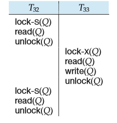

**Figure 15.20** Nonserializable schedule with degree-two consistency.

cannot be released until the transaction either commits or aborts. Serializability is not ensured by this protocol. Indeed, a transaction may read the same data item twice and obtain different results. In Figure 15.20, _T_32 reads the value of _Q_ before and after that value is written by _T_33.

Clearly, reads are not repeatable, but since exclusive locks are held until transaction commit, no transaction can read an uncommitted value. Thus, degree- two consistency is one particular implementation of the read-committed isolation level.

#### Cursor Stability

**Cursor stability** is a form of degree-two consistency designed for programs that iterate over tuples of a relation by using cursors. Instead of locking the entire relation, cursor stability ensures that:

• The tuple that is currently being processed by the iteration is locked in shared mode.

• Any modified tuples are locked in exclusive mode until the transaction com- mits.

These rules ensure that degree-two consistency is obtained. Two-phase lock- ing is not required. Serializability is not guaranteed. Cursor stability is used in practice on heavily accessed relations as a means of increasing concurrency and improving system performance. Applications that use cursor stability must be coded in a way that ensures database consistency despite the possibility of non- serializable schedules. Thus, the use of cursor stability is limited to specialized situations with simple consistency constraints.

#### Concurrency Control Across User Interactions

Concurrency-control protocols usually consider transactions that do not involve user interaction. Consider the airline seat selection example from Section 14.8,  

which involved user interaction. Suppose we treat all the steps from when the seat availability is initially shown to the user, till the seat selection is confirmed, as a single transaction.

If two-phase locking is used, the entire set of seats on a flight would be locked in shared mode till the user has completed the seat selection, and no other transaction would be able to update the seat allocation information in this period. Clearly such locking would be a very bad idea since a user may take a long time to make a selection, or even just abandon the transaction without explicitly cancelling it. Timestamp protocols or validation could be used instead, which avoid the problem of locking, but both these protocols would abort the transaction for a user _A_ if any other user _B_ has updated the seat allocation information, even if the seat selected by _B_ does not conflict with the seat selected by user _A_. Snapshot isolation is a good option in this situation, since it would not abort the transaction of user _A_ as long as _B_ did not select the same seat as _A_.

However, snapshot isolation requires the database to remember information about updates performed by a transaction even after it has committed, as long as any other concurrent transaction is still active, which can be problematic for long duration transactions.

Another option is to split a transaction that involves user interaction into two or more transactions, such that no transaction spans a user interaction. If our seat selection transaction is split thus, the first transaction would read the seat availability, while the second transaction would complete the allocation of the selected seat. If the second transaction is written carelessly, it could assign the selected seat to the user, without checking if the seat was meanwhile assigned to some other user, resulting in a lost-update problem. To avoid the problem, as we outlined in Section 14.8, the second transaction should perform the seat allocation only if the seat was not meanwhile assigned to some other user.

The above idea has been generalized in an alternative concurrency control scheme, which uses version numbers stored in tuples to avoid lost updates. The schema of each relation is altered by adding an extra _version number_ attribute, which is initialized to 0 when the tuple is created. When a transaction reads (for the first time) a tuple that it intends to update, it remembers the version number of that tuple. The read is performed as a stand-alone transaction on the database, and hence any locks that may be obtained are released immediately. Updates are done locally, and copied to the database as part of commit processing, using the following steps which are executed atomically (that is, as part of a single database transaction):

• For each updated tuple, the transaction checks if the current version number is the same as the version number of the tuple when it was first read by the transaction.

**1\.** If the version numbers match, the update is performed on the tuple in the database, and its version number is incremented by 1.

**2\.** If the version numbers do not match, the transaction is aborted, rolling back all the updates it performed.  

If the version number check succeeds for all updated tuples, the transaction commits. It is worth noting that a timestamp could be used instead of the version number, without impacting the scheme in any way.

Observe the close similarity between the above scheme and snapshot isola- tion. The version number check implements the first-committer-wins rule used in snapshot isolation, and can be used even if the transaction was active for a very long time. However, unlike snapshot isolation, the reads performed by transaction may not correspond to a snapshot of the database; and unlike the validation-based protocol, reads performed by the transaction are not validated.

We refer to the above scheme as **optimistic concurrency control without read validation**. Optimistic concurrency control without read validation provides a weak level of serializability, and does not ensure serializability. A variant of this scheme uses version numbers to validate reads at the time of commit, in addition to validating writes, to ensure that the tuples read by the transaction were not updated subsequent to the initial read; this scheme is equivalent to the optimistic concurrency-control scheme which we saw earlier.

The above scheme has been widely used by application developers to handle transactions that involve user interaction. An attractive feature of the scheme is that it can be implemented easily on top of a database system. The validation and update steps performed as part of commit processing are then executed as a single transaction in the database, using the concurrency-control scheme of the database to ensure atomicity for commit processing. The above scheme is also used by the Hibernate object-relational mapping system (Section 9.4.2), and other object- relational mapping systems, where it is referred to as optimistic concurrency control (even though reads are not validated by default). Transactions that involve user interaction are called **conversations** in Hibernate to differentiate them from regular transactions validation using version numbers is very useful for such transactions. Object-relational mapping systems also cache database tuples in the form of objects in memory, and execute transactions on the cached objects; updates on the objects are converted into updates on the database when the transaction commits. Data may remain in cache for a long time, and if transactions update such cached data, there is a risk of lost updates. Hibernate and other object-relational mapping systems therefore perform the version number checks transparently as part of commit processing. (Hibernate allows programmers to bypass the cache and execute transactions directly on the database, if serializability is desired.)

### Concurrency in Index Structures

It is possible to treat access to index structures like any other database struc- ture, and to apply the concurrency-control techniques discussed earlier. However, since indices are accessed frequently, they would become a point of great lock contention, leading to a low degree of concurrency. Luckily, indices do not have to be treated like other database structures. It is perfectly acceptable for a trans- action to perform a lookup on an index twice, and to find that the structure of the index has changed in between, as long as the index lookup returns the correct set  

of tuples. Thus, it is acceptable to have nonserializable concurrent access to an index, as long as the accuracy of the index is maintained.

We outline two techniques for managing concurrent access to B+-trees. The bibliographical notes reference other techniques for B+-trees, as well as techniques for other index structures.

The techniques that we present for concurrency control on B+-trees are based on locking, but neither two-phase locking nor the tree protocol is employed. The algorithms for lookup, insertion, and deletion are those used in Chapter 11, with only minor modifications.

The first technique is called the **crabbing protocol**:

• When searching for a key value, the crabbing protocol first locks the root node in shared mode. When traversing down the tree, it acquires a shared lock on the child node to be traversed further. After acquiring the lock on the child node, it releases the lock on the parent node. It repeats this process until it reaches a leaf node.

• When inserting or deleting a key value, the crabbing protocol takes these actions:

◦ It follows the same protocol as for searching until it reaches the desired leaf node. Up to this point, it obtains (and releases) only shared locks.

◦ It locks the leaf node in exclusive mode and inserts or deletes the key value.

◦ If it needs to split a node or coalesce it with its siblings, or redistribute key values between siblings, the crabbing protocol locks the parent of the node in exclusive mode. After performing these actions, it releases the locks on the node and siblings.

If the parent requires splitting, coalescing, or redistribution of key values, the protocol retains the lock on the parent, and splitting, coalescing, or redistribution propagates further in the same manner. Otherwise, it releases the lock on the parent.

The protocol gets its name from the way in which crabs advance by moving sideways, moving the legs on one side, then the legs on the other, and so on alternately. The progress of locking while the protocol both goes down the tree and goes back up (in case of splits, coalescing, or redistribution) proceeds in a similar crab-like manner.

Once a particular operation releases a lock on a node, other operations can access that node. There is a possibility of deadlocks between search operations coming down the tree, and splits, coalescing, or redistribution propagating up the tree. The system can easily handle such deadlocks by restarting the search operation from the root, after releasing the locks held by the operation.

The second technique achieves even more concurrency, avoiding even holding the lock on one node while acquiring the lock on another node, by using a modified version of B+-trees called **B-link trees**; B-link trees require that every  

node (including internal nodes, not just the leaves) maintain a pointer to its right sibling. This pointer is required because a lookup that occurs while a node is being split may have to search not only that node but also that node’s right sibling (if one exists). We shall illustrate this technique with an example later, but we first present the modified procedures of the **B-link-tree locking protocol**.

• **Lookup**. Each node of the B+-tree must be locked in shared mode before it is accessed. A lock on a nonleaf node is released before any lock on any other node in the B+-tree is requested. If a split occurs concurrently with a lookup, the desired search-key value may no longer appear within the range of values represented by a node accessed during lookup. In such a case, the search-key value is in the range represented by a sibling node, which the system locates by following the pointer to the right sibling. However, the system locks leaf nodes following the two-phase locking protocol, as Section 15.8.3 describes, to avoid the phantom phenomenon.

• **Insertion and deletion**. The system follows the rules for lookup to locate the leaf node into which it will make the insertion or deletion. It upgrades the shared-mode lock on this node to exclusive mode, and performs the insertion or deletion. It locks leaf nodes affected by insertion or deletion following the two-phase locking protocol, as Section 15.8.3 describes, to avoid the phantom phenomenon.

• **Split**. If the transaction splits a node, it creates a new node according to the algorithm of Section 11.3 and makes it the right sibling of the original node. The right-sibling pointers of both the original node and the new node are set. Following this, the transaction releases the exclusive lock on the original node (provided it is an internal node; leaf nodes are locked in two-phase manner), and then requests an exclusive lock on the parent, so that it can insert a pointer to the new node. (There is no need to lock or unlock the new node.)

• **Coalescence**. If a node has too few search-key values after a deletion, the node with which it will be coalesced must be locked in exclusive mode. Once the transaction has coalesced these two nodes, it requests an exclusive lock on the parent so that the deleted node can be removed. At this point, the transaction releases the locks on the coalesced nodes. Unless the parent node must be coalesced also, its lock is released.

Observe this important fact: An insertion or deletion may lock a node, unlock it, and subsequently relock it. Furthermore, a lookup that runs concurrently with a split or coalescence operation may find that the desired search key has been moved to the right-sibling node by the split or coalescence operation.

As an illustration, consider the B-link tree in Figure 15.21. Assume that there are two concurrent operations on this B-link tree:

**1\.** Insert “Chemistry”.

**2\.** Look up “Comp. Sci.”  

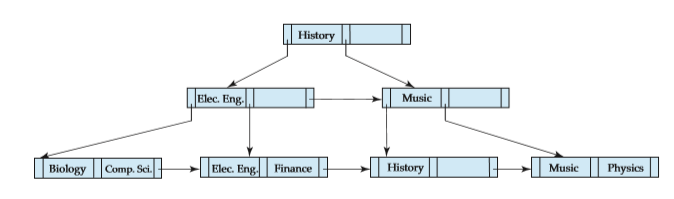

**Figure 15.21** B-link tree for _department_ file with _n_ \= 3.

Let us assume that the insertion operation begins first. It does a lookup on “Chemistry”, and finds that the node into which “Chemistry” should be inserted is full. It therefore converts its shared lock on the node to exclusive mode, and creates a new node. The original node now contains the search-key values “Biology” and “Chemistry”. The new node contains the search-key value “Comp. Sci.”

Now assume that a context switch occurs that results in control passing to the lookup operation. This lookup operation accesses the root, and follows the pointer to the left child of the root. It then accesses that node, and obtains a pointer to the left child. This left-child node originally contained the search-key values “Biology” and “Comp. Sci.”. Since this node is currently locked by the insertion operation in exclusive mode, the lookup operation must wait. Note that, at this point, the lookup operation holds no locks at all!

The insertion operation now unlocks the leaf node and relocks its parent, this time in exclusive mode. It completes the insertion, leaving the B-link tree as in Figure 15.22. The lookup operation proceeds. However, it is holding a pointer to an incorrect leaf node. It therefore follows the right-sibling pointer to locate the next node. If this node, too, turns out to be incorrect, the lookup follows that node’s right-sibling pointer. It can be shown that, if a lookup holds a pointer to an incorrect node, then, by following right-sibling pointers, the lookup must eventually reach the correct node.

Lookup and insertion operations cannot lead to deadlock. Coalescing of nodes during deletion can cause inconsistencies, since a lookup may have read a pointer to a deleted node from its parent, before the parent node was updated, and may

**Figure 15.22** Insertion of “Chemistry” into the B-link tree of Figure 15.21.  

then try to access the deleted node. The lookup would then have to restart from the root. Leaving nodes uncoalesced avoids such inconsistencies. This solution results in nodes that contain too few search-key values and that violate some properties of B+-trees. In most databases, however, insertions are more frequent than deletions, so it is likely that nodes that have too few search-key values will gain additional values relatively quickly.

Instead of locking index leaf nodes in a two-phase manner, some index concurrency-control schemes use **key-value locking** on individual key values, allowing other key values to be inserted or deleted from the same leaf. Key-value locking thus provides increased concurrency. Using key-value locking naı̈vely, however, would allow the phantom phenomenon to occur; to prevent the phan- tom phenomenon, the **next-key locking** technique is used. In this technique, every index lookup must lock not only the keys found within the range (or the single key, in case of a point lookup) but also the next-key value—that is, the key value just greater than the last key value that was within the range. Also, every insert must lock not only the value that is inserted, but also the next-key value. Thus, if a transaction attempts to insert a value that was within the range of the index lookup of another transaction, the two transactions would conflict on the key value next to the inserted key value. Similarly, deletes must also lock the next-key value to the value being deleted, to ensure that conflicts with subsequent range lookups of other queries are detected.

### Summary

• When several transactions execute concurrently in the database, the consis- tency of data may no longer be preserved. It is necessary for the system to control the interaction among the concurrent transactions, and this control is achieved through one of a variety of mechanisms called _concurrency-control_ schemes.

• To ensure serializability, we can use various concurrency-control schemes. All these schemes either delay an operation or abort the transaction that issued the operation. The most common ones are locking protocols, timestamp- ordering schemes, validation techniques, and multiversion schemes.

• A locking protocol is a set of rules that state when a transaction may lock and unlock each of the data items in the database.

• The two-phase locking protocol allows a transaction to lock a new data item only if that transaction has not yet unlocked any data item. The protocol ensures serializability, but not deadlock freedom. In the absence of informa- tion concerning the manner in which data items are accessed, the two-phase locking protocol is both necessary and sufficient for ensuring serializability.

• The strict two-phase locking protocol permits release of exclusive locks only at the end of transaction, in order to ensure recoverability and cascadelessness  

of the resulting schedules. The rigorous two-phase locking protocol releases all locks only at the end of the transaction.

• Graph-based locking protocols impose restrictions on the order in which items are accessed, and can thereby ensure serializability without requiring the use of two-phase locking, and can additionally ensure deadlock freedom.

• Various locking protocols do not guard against deadlocks. One way to pre- vent deadlock is to use an ordering of data items, and to request locks in a sequence consistent with the ordering.

• Another way to prevent deadlock is to use preemption and transaction roll- backs. To control the preemption, we assign a unique timestamp to each transaction. The system uses these timestamps to decide whether a transac- tion should wait or roll back. If a transaction is rolled back, it retains its old timestamp when restarted. The wound–wait scheme is a preemptive scheme.

• If deadlocks are not prevented, the system must deal with them by using a deadlock detection and recovery scheme. To do so, the system constructs a wait-for graph. A system is in a deadlock state if and only if the wait-for graph contains a cycle. When the deadlock detection algorithm determines that a deadlock exists, the system must recover from the deadlock. It does so by rolling back one or more transactions to break the deadlock.

• There are circumstances where it would be advantageous to group several data items, and to treat them as one aggregate data item for purposes of working, resulting in multiple levels of granularity. We allow data items of various sizes, and define a hierarchy of data items, where the small items are nested within larger ones. Such a hierarchy can be represented graphically as a tree. Locks are acquired in root-to-leaf order; they are released in leaf-to-root order. The protocol ensures serializability, but not freedom from deadlock.

• A timestamp-ordering scheme ensures serializability by selecting an ordering in advance between every pair of transactions. A unique fixed timestamp is associated with each transaction in the system. The timestamps of the transactions determine the serializability order. Thus, if the timestamp of transaction _Ti_ is smaller than the timestamp of transaction _Tj_ , then the scheme ensures that the produced schedule is equivalent to a serial schedule in which transaction _Ti_ appears before transaction _Tj_ . It does so by rolling back a transaction whenever such an order is violated.

• A validation scheme is an appropriate concurrency-control method in cases where a majority of transactions are read-only transactions, and thus the rate of conflicts among these transactions is low. A unique fixed timestamp is associated with each transaction in the system. The serializability order is determined by the timestamp of the transaction. A transaction in this scheme is never delayed. It must, however, pass a validation test to complete. If it does not pass the validation test, the system rolls it back to its initial state.  

• A multiversion concurrency-control scheme is based on the creation of a new version of a data item for each transaction that writes that item. When a read operation is issued, the system selects one of the versions to be read. The concurrency-control scheme ensures that the version to be read is selected in a manner that ensures serializability, by using timestamps. A read operation always succeeds.

◦ In multiversion timestamp ordering, a write operation may result in the rollback of the transaction.

◦ In multiversion two-phase locking, write operations may result in a lock wait or, possibly, in deadlock.

• Snapshot isolation is a multiversion concurrency-control protocol based on validation, which, unlike multiversion two-phase locking, does not require transactions to be declared as read-only or update. Snapshot isolation does not guarantee serializability, but is nevertheless supported by many database systems.

• A **delete** operation may be performed only if the transaction deleting the tuple has an exclusive lock on the tuple to be deleted. A transaction that inserts a new tuple into the database is given an exclusive lock on the tuple.

• Insertions can lead to the phantom phenomenon, in which an insertion log- ically conflicts with a query even though the two transactions may access no tuple in common. Such conflict cannot be detected if locking is done only on tuples accessed by the transactions. Locking is required on the data used to find the tuples in the relation. The index-locking technique solves this problem by requiring locks on certain index nodes. These locks ensure that all conflicting transactions conflict on a real data item, rather than on a phantom.

• Weak levels of consistency are used in some applications where consistency of query results is not critical, and using serializability would result in queries adversely affecting transaction processing. Degree-two consistency is one such weaker level of consistency; cursor stability is a special case of degree- two consistency, and is widely used.

• Concurrency control is a challenging task for transactions that span user interactions. Applications often implement a scheme based on validation of writes using version numbers stored in tuples; this scheme provides a weak level of serializability, and can be implemented at the application level without modifications to the database.

• Special concurrency-control techniques can be developed for special data structures. Often, special techniques are applied in B+-trees to allow greater concurrency. These techniques allow nonserializable access to the B+-tree, but they ensure that the B+-tree structure is correct, and ensure that accesses to the database itself are serializable.  

**Review Terms**

• Concurrency control • Lock types

◦ Shared-mode (S) lock

◦ Exclusive-mode (X) lock

• Lock

◦ Compatibility

◦ Request

◦ Wait

◦ Grant

• Deadlock • Starvation • Locking protocol • Legal schedule • Two-phase locking protocol

◦ Growing phase

◦ Shrinking phase

◦ Lock point

◦ Strict two-phase locking

◦ Rigorous two-phase locking

• Lock conversion

◦ Upgrade

◦ Downgrade

• Graph-based protocols

◦ Tree protocol

◦ Commit dependency

• Deadlock handling

◦ Prevention

◦ Detection

◦ Recovery

• Deadlock prevention

◦ Ordered locking

◦ Preemption of locks

◦ Wait–die scheme

◦ Wound–wait scheme

◦ Timeout-based schemes

• Deadlock detection

◦ Wait-for graph

• Deadlock recovery

◦ Total rollback

◦ Partial rollback

• Multiple granularity

◦ Explicit locks

◦ Implicit locks

◦ Intention locks

• Intention lock modes

◦ Intention-shared (IS)

◦ Intention-exclusive (IX)

◦ Shared and intention- exclusive (SIX)

• Multiple-granularity locking protocol

• Timestamp

◦ System clock

◦ Logical counter

◦ W-timestamp(_Q_)

◦ R-timestamp(_Q_)

• Timestamp-ordering protocol

◦ Thomas’ write rule

• Validation-based protocols

◦ Read phase  

◦ Validation phase

◦ Write phase

◦ Validation test

• Multiversion timestamp ordering • Multiversion two-phase locking

◦ Read-only transactions

◦ Update transactions

• Snapshot isolation

◦ Lost update

◦ First committer wins

◦ First updater wins

◦ Write skew

◦ Select for update

• Insert and delete operations • Phantom phenomenon • Index-locking protocol • Predicate locking • Weak levels of consistency

◦ Degree-two consistency

◦ Cursor stability

• Optimistic concurrency control without read validation

• Conversations • Concurrency in indices

◦ Crabbing

◦ B-link trees

◦ B-link-tree locking protocol

◦ Next-key locking

**Practice Exercises**

**15.1** Show that the two-phase locking protocol ensures conflict serializability, and that transactions can be serialized according to their lock points.

**15.2** Consider the following two transactions:

_T_34: read(_A_); read(_B_); **if** _A_ \= 0 **then** _B_ := _B_ \+ 1; write(_B_).

_T_35: read(_B_); read(_A_); **if** _B_ \= 0 **then** _A_ := _A_ \+ 1; write(_A_).

Add lock and unlock instructions to transactions _T_31 and _T_32, so that they observe the two-phase locking protocol. Can the execution of these transactions result in a deadlock?

**15.3** What benefit does rigorous two-phase locking provide? How does it com- pare with other forms of two-phase locking?  

**15.4** Consider a database organized in the form of a rooted tree. Suppose that we insert a dummy vertex between each pair of vertices. Show that, if we follow the tree protocol on the new tree, we get better concurrency than if we follow the tree protocol on the original tree.

**15.5** Show by example that there are schedules possible under the tree protocol that are not possible under the two-phase locking protocol, and vice versa.

**15.6** Consider the following extension to the tree-locking protocol, which al- lows both shared and exclusive locks:

• A transaction can be either a read-only transaction, in which case it can request only shared locks, or an update transaction, in which case it can request only exclusive locks.

• Each transaction must follow the rules of the tree protocol. Read-only transactions may lock any data item first, whereas update transactions must lock the root first.

Show that the protocol ensures serializability and deadlock freedom.

**15.7** Consider the following graph-based locking protocol, which allows only exclusive lock modes, and which operates on data graphs that are in the form of a rooted directed acyclic graph.

• A transaction can lock any vertex first.

• To lock any other vertex, the transaction must be holding a lock on the majority of the parents of that vertex.

Show that the protocol ensures serializability and deadlock freedom.

**15.8** Consider the following graph-based locking protocol, which allows only exclusive lock modes and which operates on data graphs that are in the form of a rooted directed acyclic graph.

• A transaction can lock any vertex first.

• To lock any other vertex, the transaction must have visited all the parents of that vertex and must be holding a lock on one of the parents of the vertex.

Show that the protocol ensures serializability and deadlock freedom.

**15.9** Locking is not done explicitly in persistent programming languages. Rather, objects (or the corresponding pages) must be locked when the objects are accessed. Most modern operating systems allow the user to set access protections (no access, read, write) on pages, and memory ac- cess that violate the access protections result in a protection violation (see the Unix mprotect command, for example). Describe how the access- protection mechanism can be used for page-level locking in a persistent programming language.  

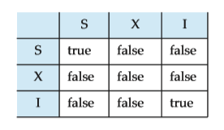

**Figure 15.23** Lock-compatibility matrix.

**15.10** Consider a database system that includes an atomic **increment** operation, in addition to the read and write operations. Let _V_ be the value of data item _X_. The operation

**increment**(_X_) by _C_

sets the value of _X_ to _V_ \+ _C_ in an atomic step. The value of _X_ is not available to the transaction unless the latter executes a read(_X_). Figure 15.23 shows a lock-compatibility matrix for three lock modes: share mode, exclusive mode, and incrementation mode.

a. Show that, if all transactions lock the data that they access in the corresponding mode, then two-phase locking ensures serializability.

b. Show that the inclusion of **increment** mode locks allows for in- creased concurrency. (Hint: Consider check-clearing transactions in our bank example.)

**15.11** In timestamp ordering, **W-timestamp**(_Q_) denotes the largest timestamp of any transaction that executed write(_Q_) successfully. Suppose that, instead, we defined it to be the timestamp of the most recent transaction to execute write(_Q_) successfully. Would this change in wording make any difference? Explain your answer.

**15.12** Use of multiple-granularity locking may require more or fewer locks than an equivalent system with a single lock granularity. Provide examples of both situations, and compare the relative amount of concurrency allowed.

**15.13** Consider the validation-based concurrency-control scheme of Section 15.5. Show that by choosing Validation(_Ti_ ), rather than Start(_Ti_ ), as the time- stamp of transaction _Ti_ , we can expect better response time, provided that conflict rates among transactions are indeed low.

**15.14** For each of the following protocols, describe aspects of practical applica- tions that would lead you to suggest using the protocol, and aspects that would suggest not using the protocol:

• Two-phase locking.

• Two-phase locking with multiple-granularity locking.  

• The tree protocol.

• Timestamp ordering.

• Validation.

• Multiversion timestamp ordering.

• Multiversion two-phase locking.

**15.15** Explain why the following technique for transaction execution may pro- vide better performance than just using strict two-phase locking: First execute the transaction without acquiring any locks and without per- forming any writes to the database as in the validation-based techniques, but unlike the validation techniques do not perform either validation or writes on the database. Instead, rerun the transaction using strict two- phase locking. (Hint: Consider waits for disk I/O.)

**15.16** Consider the timestamp-ordering protocol, and two transactions, one that writes two data items _p_ and _q_ , and another that reads the same two data items. Give a schedule whereby the timestamp test for a write operation fails and causes the first transaction to be restarted, in turn causing a cascading abort of the other transaction. Show how this could result in starvation of both transactions. (Such a situation, where two or more processes carry out actions, but are unable to complete their task because of interaction with the other processes, is called a **livelock**.)

**15.17** Devise a timestamp-based protocol that avoids the phantom phenomenon.

**15.18** Suppose that we use the tree protocol of Section 15.1.5 to manage concur- rent access to a B+-tree. Since a split may occur on an insert that affects the root, it appears that an insert operation cannot release any locks un- til it has completed the entire operation. Under what circumstances is it possible to release a lock earlier?

**15.19** The snapshot isolation protocol uses a validation step which, before per- forming a write of a data item by transaction _T_ , checks if a transaction concurrent with _T_ has already written the data item.

a. A straightforward implementation uses a start timestamp and a commit timestamp for each transaction, in addition to an _update set_, that is the set of data items updated by the transaction. Explain how to perform validation for the first-committer-wins scheme by using the transaction timestamps along with the update sets. You may assume that validation and other commit processing steps are executed serially, that is for one transaction at a time,

b. Explain how the validation step can be implemented as part of com- mit processing for the first-committer-wins scheme, using a mod- ification of the above scheme, where instead of using update sets, each data item has a write timestamp associated with it. Again, you  

may assume that validation and other commit processing steps are executed serially.

c. The first-updater-wins scheme can be implemented using times- tamps as described above, except that validation is done imme- diately after acquiring an exclusive lock, instead of being done at commit time. i. Explain how to assign write timestamps to data items to imple-

ment the first-updater-wins scheme. ii. Show that as a result of locking, if the validation is repeated at

commit time the result would not change. iii. Explain why there is no need to perform validation and other

commit processing steps serially in this case.

**Exercises**

**15.20** What benefit does strict two-phase locking provide? What disadvantages result?

**15.21** Most implementations of database systems use strict two-phase locking. Suggest three reasons for the popularity of this protocol.

**15.22** Consider a variant of the tree protocol called the _forest_ protocol. The database is organized as a forest of rooted trees. Each transaction _Ti_ must follow the following rules:

• The first lock in each tree may be on any data item.

• The second, and all subsequent, locks in a tree may be requested only if the parent of the requested node is currently locked.

• Data items may be unlocked at any time.

• A data item may not be relocked by _Ti_ after it has been unlocked by _Ti_ .

Show that the forest protocol does _not_ ensure serializability.

**15.23** Under what conditions is it less expensive to avoid deadlock than to allow deadlocks to occur and then to detect them?

**15.24** If deadlock is avoided by deadlock-avoidance schemes, is starvation still possible? Explain your answer.

**15.25** In multiple-granularity locking, what is the difference between implicit and explicit locking?

**15.26** Although SIX mode is useful in multiple-granularity locking, an exclusive and intention-shared (XIS) mode is of no use. Why is it useless?  

**15.27** The multiple-granularity protocol rules specify that a transaction _Ti_ can lock a node _Q_ in S or IS mode only if _Ti_ currently has the parent of _Q_ locked in either IX or IS mode. Given that SIX and S locks are stronger than IX or IS locks, why does the protocol not allow locking a node in S or IS mode if the parent is locked in either SIX or S mode?

**15.28** When a transaction is rolled back under timestamp ordering, it is assigned a new timestamp. Why can it not simply keep its old timestamp?

**15.29** Show that there are schedules that are possible under the two-phase lock- ing protocol, but are not possible under the timestamp protocol, and vice versa.

**15.30** Under a modified version of the timestamp protocol, we require that a commit bit be tested to see whether a read request must wait. Explain how the commit bit can prevent cascading abort. Why is this test not necessary for write requests?

**15.31** As discussed in Exercise 15.19, snapshot isolation can be implemented using a form of timestamp validation. However, unlike the multiversion timestamp-ordering scheme, which guarantees serializability, snapshot isolation does not guarantee serializability. Explain what is the key differ- ence between the protocols that results in this difference.

**15.32** Outline the key similarities and differences between the timestamp based implementation of the first-committer-wins version of snapshot isola- tion, described in Exercise 15.19, and the optimistic-concurrency-control- without-read-validation scheme, described in Section 15.9.3.

**15.33** Explain the phantom phenomenon. Why may this phenomenon lead to an incorrect concurrent execution despite the use of the two-phase locking protocol?

**15.34** Explain the reason for the use of degree-two consistency. What disadvan- tages does this approach have?

**15.35** Give example schedules to show that with key-value locking, if any of lookup, insert, or delete do not lock the next-key value, the phantom phenomenon could go undetected.

**15.36** Many transactions update a common item (e.g., the cash balance at a branch), and private items (e.g., individual account balances). Explain how you can increase concurrency (and throughput) by ordering the op- erations of the transaction.

**15.37** Consider the following locking protocol: All items are numbered, and once an item is unlocked, only higher-numbered items may be locked. Locks may be released at any time. Only X-locks are used. Show by an example that this protocol does not guarantee serializability.  

## Bibliographical Notes

Gray and Reuter \[1993\] provides detailed textbook coverage of transaction- processing concepts, including concurrency-control concepts and implementa- tion details. Bernstein and Newcomer \[1997\] provides textbook coverage of vari- ous aspects of transaction processing including concurrency control.

The two-phase locking protocol was introduced by Eswaran et al. \[1976\]. The tree-locking protocol is from Silberschatz and Kedem \[1980\]. Other non- two-phase locking protocols that operate on more general graphs are described in Yannakakis et al. \[1979\], Kedem and Silberschatz \[1983\], and Buckley and Silberschatz \[1985\]. Korth \[1983\] explores various lock modes that can be obtained from the basic shared and exclusive lock modes.

Practice Exercise 15.4 is from Buckley and Silberschatz \[1984\]. Practice Ex- ercise 15.6 is from Kedem and Silberschatz \[1983\]. Practice Exercise 15.7 is from Kedem and Silberschatz \[1979\]. Practice Exercise 15.8 is from Yannakakis et al. \[1979\]. Practice Exercise 15.10 is from Korth \[1983\].

The locking protocol for multiple-granularity data items is from Gray et al. \[1975\]. A detailed description is presented by Gray et al. \[1976\]. Kedem and Silber- schatz \[1983\] formalizes multiple-granularity locking for an arbitrary collection of lock modes (allowing for more semantics than simply read and write). This approach includes a class of lock modes called _update_ modes to deal with lock con- version. Carey \[1983\] extends the multiple-granularity idea to timestamp-based concurrency control. An extension of the protocol to ensure deadlock freedom is presented by Korth \[1982\].

The timestamp-based concurrency-control scheme is from Reed \[1983\]. A timestamp algorithm that does not require any rollback to ensure serializability is presented by Buckley and Silberschatz \[1983\]. The validation concurrency-control scheme is from Kung and Robinson \[1981\].

Multiversion timestamp order was introduced in Reed \[1983\]. A multiversion tree-locking algorithm appears in Silberschatz \[1982\].

Degree-two consistency was introduced in Gray et al. \[1975\]. The levels of con- sistency—or isolation—offered in SQL are explained and critiqued in Berenson et al. \[1995\]. Many commercial database systems use version-based approaches in combination with locking. PostgreSQL, Oracle, and SQL Server all support forms of the snapshot isolation protocol mentioned in Section 15.6.2. Details can be found in Chapters 27, 28, and 30, respectively.

It should be noted that on PostgreSQL (as of version 8.1.4) and Oracle (as of version 10g), setting the isolation level to serializable results in the use of snapshot isolation, which does not guarantee serializability. Fekete et al. \[2005\] describes how to ensure serializable executions under snapshot isolation, by rewriting certain transactions to introduce conflicts; these conflicts ensure that the transactions cannot run concurrently under snapshot isolation; Jorwekar et al. \[2007\] describes an approach, that given a set of (parametrized) transactions running under snapshot isolation, can check if the transactions are vulnerability to nonserializability,  

Concurrency in B+-trees was studied by Bayer and Schkolnick \[1977\] and Johnson and Shasha \[1993\]. The techniques presented in Section 15.10 are based on Kung and Lehman \[1980\] and Lehman and Yao \[1981\]. The technique of key- value locking used in ARIES provides for very high concurrency on B+-tree access and is described in Mohan \[1990a\] and Mohan and Narang \[1992\]. Ellis \[1987\] presents a concurrency-control technique for linear hashing.  

  

## CHAPTER 16 Recovery System

A computer system, like any other device, is subject to failure from a variety of causes: disk crash, power outage, software error, a fire in the machine room, even sabotage. In any failure, information may be lost. Therefore, the database system must take actions in advance to ensure that the atomicity and durability properties of transactions, introduced in Chapter 14, are preserved. An integral part of a database system is a **recovery scheme** that can restore the database to the consistent state that existed before the failure. The recovery scheme must also provide **high availability**; that is, it must minimize the time for which the database is not usable after a failure.

###  Failure Classification

There are various types of failure that may occur in a system, each of which needs to be dealt with in a different manner. In this chapter, we shall consider only the following types of failure:

• **Transaction failure**. There are two types of errors that may cause a transaction to fail:

◦ **Logical error**. The transaction can no longer continue with its normal execution because of some internal condition, such as bad input, data not found, overflow, or resource limit exceeded.

◦ **System error**. The system has entered an undesirable state (for example, deadlock), as a result of which a transaction cannot continue with its normal execution. The transaction, however, can be reexecuted at a later time.

• **System crash**. There is a hardware malfunction, or a bug in the database software or the operating system, that causes the loss of the content of volatile storage, and brings transaction processing to a halt. The content of nonvolatile storage remains intact, and is not corrupted.

The assumption that hardware errors and bugs in the software bring the system to a halt, but do not corrupt the nonvolatile storage contents, is known as the **fail-stop assumption**. Well-designed systems have numerous internal checks, at the hardware and the software level, that bring the system to a halt when there is an error. Hence, the fail-stop assumption is a reasonable one.

• **Disk failure**. A disk block loses its content as a result of either a head crash or failure during a data-transfer operation. Copies of the data on other disks, or archival backups on tertiary media, such as DVD or tapes, are used to recover from the failure.

To determine how the system should recover from failures, we need to iden- tify the failure modes of those devices used for storing data. Next, we must consider how these failure modes affect the contents of the database. We can then propose algorithms to ensure database consistency and transaction atomic- ity despite failures. These algorithms, known as recovery algorithms, have two parts:

**1\.** Actions taken during normal transaction processing to ensure that enough information exists to allow recovery from failures.

**2\.** Actions taken after a failure to recover the database contents to a state that ensures database consistency, transaction atomicity, and durability.

### Storage

As we saw in Chapter 10, the various data items in the database may be stored and accessed in a number of different storage media. In Section 14.3, we saw that storage media can be distinguished by their relative speed, capacity, and resilience to failure. We identified three categories of storage:

• **Volatile storage**

• **Nonvolatile storage**

• **Stable storage**

Stable storage or, more accurately, an approximation thereof, plays a critical role in recovery algorithms.

####  Stable-Storage Implementation

To implement stable storage, we need to replicate the needed information in several nonvolatile storage media (usually disk) with independent failure modes, and to update the information in a controlled manner to ensure that failure during data transfer does not damage the needed information.  

Recall (from Chapter 10) that RAID systems guarantee that the failure of a single disk (even during data transfer) will not result in loss of data. The simplest and fastest form of RAID is the mirrored disk, which keeps two copies of each block, on separate disks. Other forms of RAID offer lower costs, but at the expense of lower performance.

RAID systems, however, cannot guard against data loss due to disasters such as fires or flooding. Many systems store archival backups of tapes off site to guard against such disasters. However, since tapes cannot be carried off site continually, updates since the most recent time that tapes were carried off site could be lost in such a disaster. More secure systems keep a copy of each block of stable storage at a remote site, writing it out over a computer network, in addition to storing the block on a local disk system. Since the blocks are output to a remote system as and when they are output to local storage, once an output operation is complete, the output is not lost, even in the event of a disaster such as a fire or flood. We study such _remote backup_ systems in Section 16.9.

In the remainder of this section, we discuss how storage media can be pro- tected from failure during data transfer. Block transfer between memory and disk storage can result in:

• **Successful completion**. The transferred information arrived safely at its des- tination.

• **Partial failure**. A failure occurred in the midst of transfer, and the destination block has incorrect information.

• **Total failure**. The failure occurred sufficiently early during the transfer that the destination block remains intact.

We require that, if a **data-transfer failure** occurs, the system detects it and invokes a recovery procedure to restore the block to a consistent state. To do so, the system must maintain two physical blocks for each logical database block; in the case of mirrored disks, both blocks are at the same location; in the case of remote backup, one of the blocks is local, whereas the other is at a remote site. An output operation is executed as follows:

**1\.** Write the information onto the first physical block.

**2\.** When the first write completes successfully, write the same information onto the second physical block.

**3\.** The output is completed only after the second write completes successfully.

If the system fails while blocks are being written, it is possible that the two copies of a block are inconsistent with each other. During recovery, for each block, the system would need to examine two copies of the blocks. If both are the same and no detectable error exists, then no further actions are necessary. (Recall that errors in a disk block, such as a partial write to the block, are detected by storing a checksum with each block.) If the system detects an error in one block, then it  

replaces its content with the content of the other block. If both blocks contain no detectable error, but they differ in content, then the system replaces the content of the first block with the value of the second. This recovery procedure ensures that a write to stable storage either succeeds completely (that is, updates all copies) or results in no change.

The requirement of comparing every corresponding pair of blocks during recovery is expensive to meet. We can reduce the cost greatly by keeping track of block writes that are in progress, using a small amount of nonvolatile RAM. On recovery, only blocks for which writes were in progress need to be compared.

The protocols for writing out a block to a remote site are similar to the protocols for writing blocks to a mirrored disk system, which we examined in Chapter 10, and particularly in Practice Exercise 10.3.

We can extend this procedure easily to allow the use of an arbitrarily large number of copies of each block of stable storage. Although a large number of copies reduces the probability of a failure to even lower than two copies do, it is usually reasonable to simulate stable storage with only two copies.

#### Data Access

As we saw in Chapter 10, the database system resides permanently on nonvolatile storage (usually disks) and only parts of the database are in memory at any time.1 The database is partitioned into fixed-length storage units called **blocks**. Blocks are the units of data transfer to and from disk, and may contain several data items. We shall assume that no data item spans two or more blocks. This assumption is realistic for most data-processing applications, such as a bank or a university.

Transactions input information from the disk to main memory, and then output the information back onto the disk. The input and output operations are done in block units. The blocks residing on the disk are referred to as **physical blocks**; the blocks residing temporarily in main memory are referred to as **buffer blocks**. The area of memory where blocks reside temporarily is called the **disk buffer**.

Block movements between disk and main memory are initiated through the following two operations:

**1\.** input(_B_) transfers the physical block _B_ to main memory.

**2\.** output(_B_) transfers the buffer block _B_ to the disk, and replaces the appro- priate physical block there.

Figure 16.1 illustrates this scheme. Conceptually, each transaction _Ti_ has a private work area in which copies of

data items accessed and updated by _Ti_ are kept. The system creates this work area when the transaction is initiated; the system removes it when the transaction

1There is a special category of database system, called _main-memory database systems_, where the entire database can be loaded into memory at once. We consider such systems in Section 26.4.  

**Figure 16.1** Block storage operations.

either commits or aborts. Each data item _X_ kept in the work area of transaction _Ti_ is denoted by _xi_ . Transaction _Ti_ interacts with the database system by transferring data to and from its work area to the system buffer. We transfer data by these two operations:

**1\.** read(_X_) assigns the value of data item _X_ to the local variable _xi_ . It executes this operation as follows:

a. If block _BX_ on which _X_ resides is not in main memory, it issues input(_BX_).

b. It assigns to _xi_ the value of _X_ from the buffer block.

**2\.** write(_X_) assigns the value of local variable _xi_ to data item _X_ in the buffer block. It executes this operation as follows:

a. If block _BX_ on which _X_ resides is not in main memory, it issues input(_BX_).

b. It assigns the value of _xi_ to _X_ in buffer _BX_.

Note that both operations may require the transfer of a block from disk to main memory. They do not, however, specifically require the transfer of a block from main memory to disk.

A buffer block is eventually written out to the disk either because the buffer manager needs the memory space for other purposes or because the database system wishes to reflect the change to _B_ on the disk. We shall say that the database system performs a **force-output** of buffer _B_ if it issues an output(_B_).

When a transaction needs to access a data item _X_ for the first time, it must execute read(_X_). The system then performs all updates to _X_ on _xi_ . At any point during its execution a transaction may execute write(_X_) to reflect the change to _X_ in the database itself; write(_X_) must certainly be done after the final write to _X_.  

The output(_BX_) operation for the buffer block _BX_ on which _X_ resides does not need to take effect immediately after write(_X_) is executed, since the block _BX_ may contain other data items that are still being accessed. Thus, the actual output may take place later. Notice that, if the system crashes after the write(_X_) operation was executed but before output(_BX_) was executed, the new value of _X_ is never written to disk and, thus, is lost. As we shall see shortly, the database system executes extra actions to ensure that updates performed by committed transactions are not lost even if there is a system crash.

### Recovery and Atomicity

Consider again our simplified banking system and a transaction _Ti_ that transfers $50 from account _A_ to account _B_, with initial values of _A_ and _B_ being $1000 and $2000, respectively. Suppose that a system crash has occurred during the execution of _Ti_ , after output(_BA_) has taken place, but before output(_BB_) was executed, where _BA_ and _BB_ denote the buffer blocks on which _A_ and _B_ reside. Since the memory contents were lost, we do not know the fate of the transaction.

When the system restarts, the value of _A_ would be $950, while that of _B_ would be $2000, which is clearly inconsistent with the atomicity requirement for transaction _Ti_ . Unfortunately, there is no way to find out by examining the database state what blocks had been output, and what had not, before the crash. It is possible that the transaction completed, updating the database on stable storage from an initial state with the values of _A_ and _B_ being $1000 and $1950; it is also possible that the transaction did not affect the stable storage at all, and the values of _A_ and _B_ were $950 and $2000 initially; or that the updated _B_ was output but not the updated _A_; or that the updated _A_ was output but the updated _B_ was not.

Our goal is to perform either all or no database modifications made by _Ti_ . However, if _Ti_ performed multiple database modifications, several output opera- tions may be required, and a failure may occur after some of these modifications have been made, but before all of them are made.

To achieve our goal of atomicity, we must first output to stable storage infor- mation describing the modifications, without modifying the database itself. As we shall see, this information can help us ensure that all modifications performed by committed transactions are reflected in the database (perhaps during the course of recovery actions after a crash). This information can also help us ensure that no modifications made by an aborted transaction persist in the database.

#### Log Records

The most widely used structure for recording database modifications is the **log**. The log is a sequence of **log records**, recording all the update activities in the database.

There are several types of log records. An **update log record** describes a single database write. It has these fields:  

**SHADOW COPIES AND SHADOW PAGING**

In the **shadow-copy** scheme, a transaction that wants to update the database first creates a complete copy of the database. All updates are done on the new database copy, leaving the original copy, the **shadow copy**, untouched. If at any point the transaction has to be aborted, the system merely deletes the new copy. The old copy of the database has not been affected. The current copy of the database is identified by a pointer, called db-pointer, which is stored on disk.

If the transaction partially commits (that is, executes its final statement) it is committed as follows: First, the operating system is asked to make sure that all pages of the new copy of the database have been written out to disk. (Unix systems use the fsync command for this purpose.) After the operating system has written all the pages to disk, the database system updates the pointer db- pointer to point to the new copy of the database; the new copy then becomes the current copy of the database. The old copy of the database is then deleted. The transaction is said to have been _committed_ at the point where the updated db-pointer is written to disk.

The implementation actually depends on the write to db-pointer being atomic; that is, either all its bytes are written or none of its bytes are written. Disk sys- tems provide atomic updates to entire blocks, or at least to a disk sector. In other words, the disk system guarantees that it will update db-pointer atomically, as long as we make sure that db-pointer lies entirely in a single sector, which we can ensure by storing db-pointer at the beginning of a block.

Shadow copy schemes are commonly used by text editors (saving the file is equivalent to transaction commit, while quitting without saving the file is equiv- alent to transaction abort). Shadow copying can be used for small databases, but copying a large database would be extremely expensive. A variant of shadow- copying, called **shadow-paging**, reduces copying as follows: the scheme uses a page table containing pointers to all pages; the page table itself and all updated pages are copied to a new location. Any page which is not updated by a trans- action is not copied, but instead the new page table just stores a pointer to the original page. When a transaction commits, it atomically updates the pointer to the page table, which acts as db-pointer, to point to the new copy.

Shadow paging unfortunately does not work well with concurrent transac- tions and is not widely used in databases.

• **Transaction identifier,** which is the unique identifier of the transaction that performed the write operation.

• **Data-item identifier,** which is the unique identifier of the data item written. Typically, it is the location on disk of the data item, consisting of the block identifier of the block on which the data item resides, and an offset within the block.

• **Old value**, which is the value of the data item prior to the write.  

**728 Chapter 16 Recovery System**

• **New value**, which is the value that the data item will have after the write.

We represent an update log record as _<Ti, Xj , V_1_, V_2_\>_, indicating that transaction _Ti_ has performed a write on data item _Xj_ . _Xj_ had value _V_1 before the write, and has value _V_2 after the write. Other special log records exist to record significant events during transaction processing, such as the start of a transaction and the commit or abort of a transaction. Among the types of log records are:

• _<Ti_ start_\>_. Transaction _Ti_ has started.

• _<Ti_ commit_\>_. Transaction _Ti_ has committed.

• _<Ti_ abort_\>_. Transaction _Ti_ has aborted.

We shall introduce several other types of log records later. Whenever a transaction performs a write, it is essential that the log record

for that write be created and added to the log, before the database is modified. Once a log record exists, we can output the modification to the database if that is desirable. Also, we have the ability to _undo_ a modification that has already been output to the database. We undo it by using the old-value field in log records.

For log records to be useful for recovery from system and disk failures, the log must reside in stable storage. For now, we assume that every log record is written to the end of the log on stable storage as soon as it is created. In Section 16.5, we shall see when it is safe to relax this requirement so as to reduce the overhead imposed by logging. Observe that the log contains a complete record of all database activity. As a result, the volume of data stored in the log may become unreasonably large. In Section 16.3.6, we shall show when it is safe to erase log information.

#### Database Modification

As we noted earlier, a transaction creates a log record prior to modifying the database. The log records allow the system to undo changes made by a transaction in the event that the transaction must be aborted; they allow the system also to redo changes made by a transaction if the transaction has committed but the system crashed before those changes could be stored in the database on disk. In order for us to understand the role of these log records in recovery, we need to consider the steps a transaction takes in modifying a data item:

**1\.** The transaction performs some computations in its own private part of main memory.

**2\.** The transaction modifies the data block in the disk buffer in main memory holding the data item.

**3\.** The database system executes the output operation that writes the data block to disk.  

We say a transaction _modifies the database_ if it performs an update on a disk buffer, or on the disk itself; updates to the private part of main memory do not count as database modifications. If a transaction does not modify the database until it has committed, it is said to use the **deferred-modification** technique. If database modifications occur while the transaction is still active, the transaction is said to use the **immediate-modification** technique. Deferred modification has the overhead that transactions need to make local copies of all updated data items; further, if a transaction reads a data item that it has updated, it must read the value from its local copy.

The recovery algorithms we describe in this chapter support immediate mod- ification. As described, they work correctly even with deferred modification, but can be optimized to reduce overhead when used with deferred modification; we leave details as an exercise.

A recovery algorithm must take into account a variety of factors, including:

• The possibility that a transaction may have committed although some of its database modifications exist only in the disk buffer in main memory and not in the database on disk.

• The possibility that a transaction may have modified the database while in the active state and, as a result of a subsequent failure, may need to abort.

Because all database modifications must be preceded by the creation of a log record, the system has available both the old value prior to the modification of the data item and the new value that is to be written for the data item. This allows the system to perform _undo_ and _redo_ operations as appropriate.

• **Undo** using a log record sets the data item specified in the log record to the old value.

• **Redo** using a log record sets the data item specified in the log record to the new value.

#### Concurrency Control and Recovery

If the concurrency control scheme allows a data item _X_ that has been modified by a transaction _T_1 to be further modified by another transaction _T_2 before _T_1 commits, then undoing the effects of _T_1 by restoring the old value of _X_ (before _T_1 updated _X_) would also undo the effects of _T_2\. To avoid such situations, recovery algorithms usually require that if a data item has been modified by a transaction, no other transaction can modify the data item until the first transaction commits or aborts.

This requirement can be ensured by acquiring an exclusive lock on any up- dated data item and holding the lock until the transaction commits; in other words, by using strict two-phase locking. Snapshot-isolation and validation-      based concurrency-control techniques also acquire exclusive locks on data items at the time of validation, before modifying the data items, and hold the locks until the transaction is committed; as a result the above requirement is satisfied even by these concurrency control protocols.

We discuss later, in Section 16.7, how the above requirement can be relaxed in certain cases.

When either snapshot-isolation or validation is used for concurrency control, database updates of a transaction are (conceptually) deferred until the transac- tion is partially committed; the deferred-modification technique is a natural fit with these concurrency control schemes. However, it is worth noting that some implementations of snapshot isolation use immediate modification, but provide a logical snapshot on demand: when a transaction needs to read an item that a concurrent transaction has updated, a copy of the (already updated) item is made, and updates made by concurrent transactions are rolled back on the copy of the item. Similarly, immediate modification of the database is a natural fit with two-phase locking, but deferred modification can also be used with two-phase locking.

#### Transaction Commit

We say that a transaction has **committed** when its commit log record, which is the last log record of the transaction, has been output to stable storage; at that point all earlier log records have already been output to stable storage. Thus, there is enough information in the log to ensure that even if there is a system crash, the updates of the transaction can be redone. If a system crash occurs before a log record _< Ti_ commit_\>_ is output to stable storage, transaction _Ti_ will be rolled back. Thus, the output of the block containing the commit log record is the single atomic action that results in a transaction getting committed.2

With most log-based recovery techniques, including the ones we describe in this chapter, blocks containing the data items modified by a transaction do not have to be output to stable storage when the transaction commits, but can be output some time later. We discuss this issue further in Section 16.5.2.

#### Using the Log to Redo and Undo Transactions

We now provide an overview of how the log can be used to recover from a system crash, and to roll back transactions during normal operation. However, we postpone details of the procedures for failure recovery and rollback to Section 16.4.

Consider our simplified banking system. Let _T_0 be a transaction that transfers $50 from account _A_ to account _B_:

2The output of a block can be made atomic by techniques for dealing with data-transfer failure, as described earlier in Section 16.2.1.  

**Figure 16.2** Portion of the system log corresponding to _T_0 and _T_1.

Let _T_1 be a transaction that withdraws $100 from account _C_:

The portion of the log containing the relevant information concerning these two transactions appears in Figure 16.2.

Figure 16.3 shows one possible order in which the actual outputs took place in both the database system and the log as a result of the execution of _T_0 and _T_1.3

Using the log, the system can handle any failure that does not result in the loss of information in nonvolatile storage. The recovery scheme uses two recovery procedures. Both these procedures make use of the log to find the set of data items updated by each transaction _Ti_ , and their respective old and new values.

• redo(_Ti_ ) sets the value of all data items updated by transaction _Ti_ to the new values.

The order in which updates are carried out by redo is important; when recovering from a system crash, if updates to a particular data item are applied in an order different from the order in which they were applied originally, the final state of that data item will have a wrong value. Most recovery algorithms, including the one we describe in Section 16.4, do not perform redo of each transaction separately; instead they perform a single scan of the log, during which redo actions are performed for each log record as it is encountered. This approach ensures the order of updates is preserved,

3Notice that this order could not be obtained using the deferred-modification technique, because the database is modified by _T_0 before it commits, and likewise for _T_1.  

**Log Database**

**Figure 16.3** State of system log and database corresponding to _T_0 and _T_1.

and is more efficient since the log needs to be read only once overall, instead of once per transaction.

• undo(_Ti_ ) restores the value of all data items updated by transaction _Ti_ to the old values.

In the recovery scheme that we describe in Section 16.4:

◦ The undo operation not only restores the data items to their old value, but also writes log records to record the updates performed as part of the undo process. These log records are special **redo-only** log records, since they do not need to contain the old-value of the updated data item.

As with the redo procedure, the order in which undo operations are performed is important; again we postpone details to Section 16.4.

◦ When the undo operation for transaction _Ti_ completes, it writes a _<Ti_ abort_\>_ log record, indicating that the undo has completed.

As we shall see in Section 16.4, the undo(_Ti_ ) procedure is executed only once for a transaction, if the transaction is rolled back during normal processing or if on recovering from a system crash, neither a commit nor an abort record is found for transaction _Ti_ . As a result, every transaction will eventually have either a commit or an abort record in the log.

After a system crash has occurred, the system consults the log to determine which transactions need to be redone, and which need to be undone so as to ensure atomicity.

• Transaction _Ti_ needs to be undone if the log contains the record _<Ti_ start_\>_, but does not contain either the record _<Ti_ commit_\>_ or the record _<Ti_ abort_\>_.

• Transaction _Ti_ needs to be redone if the log contains the record _<Ti_ start_\>_ and either the record _<Ti_ commit_\>_ or the record _<Ti_ abort_\>_. It may seem strange to redo _Ti_ if the record _<Ti_ abort_\>_ is in the log. To see why this works, note  

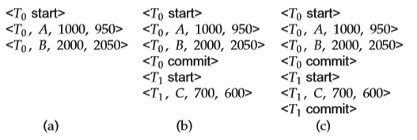
**Figure 16.4** The same log, shown at three different times.

that if _<Ti_ abort_\>_ is in the log, so are the redo-only records written by the undo operation. Thus, the end result will be to undo _Ti_ ’s modifications in this case. This slight redundancy simplifies the recovery algorithm and enables faster overall recovery time.

As an illustration, return to our banking example, with transaction _T_0 and _T_1 executed one after the other in the order _T_0 followed by _T_1\. Suppose that the system crashes before the completion of the transactions. We shall consider three cases. The state of the logs for each of these cases appears in Figure 16.4.

First, let us assume that the crash occurs just after the log record for the step:

write(_B_)

of transaction _T_0 has been written to stable storage (Figure 16.4a). When the system comes back up, it finds the record _<T_0 start_\>_ in the log, but no corresponding _<T_0 commit_\>_ or _<T_0 abort_\>_ record. Thus, transaction _T_0 must be undone, so an undo(_T_0) is performed. As a result, the values in accounts _A_ and _B_ (on the disk) are restored to $1000 and $2000, respectively.

Next, let us assume that the crash comes just after the log record for the step:

write(_C_)

of transaction _T_1 has been written to stable storage (Figure 16.4b). When the system comes back up, two recovery actions need to be taken. The operation undo(_T_1) must be performed, since the record _<T_1 start_\>_ appears in the log, but there is no record _<T_1 commit_\>_ or _<T_1 abort_\>_. The operation redo(_T_0) must be performed, since the log contains both the record _<T_0 start_\>_ and the record _<T_0 commit_\>_. At the end of the entire recovery procedure, the values of accounts _A_, _B_, and _C_ are $950, $2050, and $700, respectively.

Finally, let us assume that the crash occurs just after the log record:

_<T_1 commit_\>_  

has been written to stable storage (Figure 16.4c). When the system comes back up, both _T_0 and _T_1 need to be redone, since the records _<T_0 start_\>_ and _<T_0 commit_\>_ appear in the log, as do the records _<T_1 start_\>_ and _<T_1 commit_\>_. After the system performs the recovery procedures redo(_T_0) and redo(_T_1), the values in accounts _A_, _B_, and _C_ are $950, $2050, and $600, respectively.

#### Checkpoints

When a system crash occurs, we must consult the log to determine those trans- actions that need to be redone and those that need to be undone. In principle, we need to search the entire log to determine this information. There are two major difficulties with this approach:

**1\.** The search process is time-consuming.

**2\.** Most of the transactions that, according to our algorithm, need to be redone have already written their updates into the database. Although redoing them will cause no harm, it will nevertheless cause recovery to take longer.

To reduce these types of overhead, we introduce checkpoints. We describe below a simple checkpoint scheme that (a) does not permit any

updates to be performed while the checkpoint operation is in progress, and (b) outputs all modified buffer blocks to disk when the checkpoint is performed. We discuss later how to modify the checkpointing and recovery procedures to provide more flexibility by relaxing both these requirements.

A checkpoint is performed as follows:

**1\.** Output onto stable storage all log records currently residing in main mem- ory.

**2\.** Output to the disk all modified buffer blocks.

**3\.** Output onto stable storage a log record of the form _<_checkpoint _L>_, where _L_ is a list of transactions active at the time of the checkpoint.

Transactions are not allowed to perform any update actions, such as writing to a buffer block or writing a log record, while a checkpoint is in progress. We discuss how this requirement can be enforced, later, in Section 16.5.2.

The presence of a _<_checkpoint _L>_ record in the log allows the system to streamline its recovery procedure. Consider a transaction _Ti_ that completed prior to the checkpoint. For such a transaction, the _<Ti_ commit_\>_ record (or _< Ti_ abort_\>_ record) appears in the log before the _<_checkpoint_\>_ record. Any database mod- ifications made by _Ti_ must have been written to the database either prior to the checkpoint or as part of the checkpoint itself. Thus, at recovery time, there is no need to perform a redo operation on _Ti_ .

After a system crash has occurred, the system examines the log to find the last _<_checkpoint _L>_ record (this can be done by searching the log backward, from the end of the log, until the first _<_checkpoint _L>_ record is found).  

The redo or undo operations need to be applied only to transactions in _L_, and to all transactions that started execution after the _<_checkpoint _L>_ record was written to the log. Let us denote this set of transactions as _T_ .

• For all transactions _Tk_ in _T_ that have no _<Tk_ commit_\>_ record or _<Tk_ abort_\>_ record in the log, execute undo(_Tk_).

• For all transactions _Tk_ in _T_ such that either the record _<Tk_ commit_\>_ or the record _<Tk_ abort_\>_ appears in the log, execute redo(_Tk_).

Note that we need only examine the part of the log starting with the last check- point log record to find the set of transactions _T_ , and to find out whether a commit or abort record occurs in the log for each transaction in _T_ .

As an illustration, consider the set of transactions {_T_0, _T_1_, . . . , T_100}. Suppose that the most recent checkpoint took place during the execution of transaction _T_67 and _T_69, while _T_68 and all transactions with subscripts lower than 67 completed before the checkpoint. Thus, only transactions _T_67, _T_69_, . . . , T_100 need to be con- sidered during the recovery scheme. Each of them needs to be redone if it has completed (that is, either committed or aborted); otherwise, it was incomplete, and needs to be undone.

Consider the set of transactions _L_ in a checkpoint log record. For each trans- action _Ti_ in _L_, log records of the transaction that occur prior to the checkpoint log record may be needed to undo the transaction, in case it does not commit. However, all log records prior to the earliest of the _< Ti_ start_\>_ log records, among transactions _Ti_ in _L_, are not needed once the checkpoint has completed. These log records can be erased whenever the database system needs to reclaim the space occupied by these records.

The requirement that transactions must not perform any updates to buffer blocks or to the log during checkpointing can be bothersome, since transaction processing has to halt while a checkpoint is in progress. A **fuzzy checkpoint** is a checkpoint where transactions are allowed to perform updates even while buffer blocks are being written out. Section 16.5.4 describes fuzzy-checkpointing schemes. Later in Section 16.8 we describe a checkpoint scheme that is not only fuzzy, but does not even require all modified buffer blocks to be output to disk at the time of the checkpoint.

### Recovery Algorithm

Until now, in discussing recovery, we have identified transactions that need to be redone and those that need to be undone, but we have not given a precise algorithm for performing these actions. We are now ready to present the full recovery algorithm using log records for recovery from transaction failure and a combination of the most recent checkpoint and log records to recover from a system crash.  

The recovery algorithm described in this section requires that a data item that has been updated by an uncommitted transaction cannot be modified by any other transaction, until the first transaction has either committed or aborted. Recall that this restriction was discussed earlier, in Section 16.3.3.

#### Transaction Rollback

First consider transaction rollback during normal operation (that is, not during recovery from a system crash). Rollback of a transaction _Ti_ is performed as follows:

**1\.** The log is scanned backward, and for each log record of _Ti_ of the form _<Ti , Xj , V_1_, V_2_\>_ that is found:

a. The value _V_1 is written to data item _Xj_ , and

b. A special redo-only log record _<Ti, Xj , V_1_\>_ is written to the log, where _V_1 is the value being restored to data item _Xj_ during the rollback. These log records are sometimes called **compensation log records**. Such records do not need undo information, since we never need to undo such an undo operation. We shall explain later how they are used.

**2\.** Once the log record _<Ti_ start_\>_ is found the backward scan is stopped, and a log record _<Ti_ abort_\>_ is written to the log.

Observe that every update action performed by the transaction or on behalf of the transaction, including actions taken to restore data items to their old value, have now been recorded in the log. In Section 16.4.2 we shall see why this is a good idea.

#### Recovery After a System Crash

Recovery actions, when the database system is restarted after a crash, take place in two phases:

**1\.** In the **redo phase**, the system replays updates of _all_ transactions by scanning the log forward from the last checkpoint. The log records that are replayed include log records for transactions that were rolled back before system crash, and those that had not committed when the system crash occurred. This phase also determines all transactions that were incomplete at the time of the crash, and must therefore be rolled back. Such incomplete transactions would either have been active at the time of the checkpoint, and thus would appear in the transaction list in the checkpoint record, or would have started later; further, such incomplete transactions would have neither a _<Ti_ abort_\>_ nor a _<Ti_ commit_\>_ record in the log.

The specific steps taken while scanning the log are as follows:

a. The list of transactions to be rolled back, undo-list, is initially set to the list _L_ in the _<_checkpoint _L>_ log record.  

b. Whenever a normal log record of the form _<Ti , Xj , V_1_, V_2_\>_, or a redo-only log record of the form _<Ti , Xj , V_2_\>_ is encountered, the operation is redone; that is, the value _V_2 is written to data item _Xj_ .

c. Whenever a log record of the form _<Ti_ start_\>_ is found, _Ti_ is added to undo-list.

d. Whenever a log record of the form _<Ti_ abort_\>_ or _<Ti_ commit_\>_ is found, _Ti_ is removed from undo-list.

At the end of the redo phase, undo-list contains the list of all transactions that are incomplete, that is, they neither committed nor completed rollback before the crash.

**2\.** In the **undo phase**, the system rolls back all transactions in the undo-list. It performs rollback by scanning the log backward from the end.

a. Whenever it finds a log record belonging to a transaction in the undo- list, it performs undo actions just as if the log record had been found during the rollback of a failed transaction.

b. When the system finds a _<Ti_ start_\>_ log record for a transaction _Ti_ in undo-list, it writes a _<Ti_ abort_\>_ log record to the log, and removes _Ti_ from undo-list.

c. The undo phase terminates once undo-list becomes empty, that is, the system has found _<Ti_ start_\>_ log records for all transactions that were initially in undo-list.

After the undo phase of recovery terminates, normal transaction processing can resume.

Observe that the redo phase replays every log record since the most recent checkpoint record. In other words, this phase of restart recovery repeats all the update actions that were executed after the checkpoint, and whose log records reached the stable log. The actions include actions of incomplete transactions and the actions carried out to rollback failed transactions. The actions are repeated in the same order in which they were originally carried out; hence, this process is called **repeating history**. Although it may appear wasteful, repeating history even for failed transactions simplifies recovery schemes.

Figure 16.5 shows an example of actions logged during normal operation, and actions performed during failure recovery. In the log shown in the figure, transaction _T_1 had committed, and transaction _T_0 had been completely rolled back, before the system crashed. Observe how the value of data item _B_ is restored during the rollback of _T_0\. Observe also the checkpoint record, with the list of active transactions containing _T_0 and _T_1.

When recovering from a crash, in the redo phase, the system performs a redo of all operations after the last checkpoint record. In this phase, the list undo-list initially contains _T_0 and _T_1; _T_1 is removed first when its commit log record is found, while _T_2 is added when its start log record is found. Transaction _T_0 is  

**Figure 16.5** Example of logged actions, and actions during recovery.

removed from undo-list when its abort log record is found, leaving only _T_2 in undo-list. The undo phase scans the log backwards from the end, and when it finds a log record of _T_2 updating _A_, the old value of _A_ is restored, and a redo-only log record written to the log. When the start record for _T_2 is found, an abort record is added for _T_2\. Since undo-list contains no more transactions, the undo phase terminates, completing recovery.

### Buffer Management

In this section, we consider several subtle details that are essential to the imple- mentation of a crash-recovery scheme that ensures data consistency and imposes a minimal amount of overhead on interactions with the database.

#### Log-Record Buffering

So far, we have assumed that every log record is output to stable storage at the time it is created. This assumption imposes a high overhead on system execution for several reasons: Typically, output to stable storage is in units of blocks. In most cases, a log record is much smaller than a block. Thus, the output of each log record translates to a much larger output at the physical level. Furthermore, as we saw in Section 16.2.1, the output of a block to stable storage may involve several output operations at the physical level.

The cost of outputting a block to stable storage is sufficiently high that it is desirable to output multiple log records at once. To do so, we write log records to a log buffer in main memory, where they stay temporarily until they are output to stable storage. Multiple log records can be gathered in the log buffer and output  

to stable storage in a single output operation. The order of log records in the stable storage must be exactly the same as the order in which they were written to the log buffer.

As a result of log buffering, a log record may reside in only main memory (volatile storage) for a considerable time before it is output to stable storage. Since such log records are lost if the system crashes, we must impose additional requirements on the recovery techniques to ensure transaction atomicity:

• Transaction _Ti_ enters the commit state after the _<Ti_ commit_\>_ log record has been output to stable storage.

• Before the _<Ti_ commit_\>_ log record can be output to stable storage, all log records pertaining to transaction _Ti_ must have been output to stable storage.

• Before a block of data in main memory can be output to the database (in nonvolatile storage), all log records pertaining to data in that block must have been output to stable storage.

This rule is called the **write-ahead logging (WAL)** rule. (Strictly speaking, the WAL rule requires only that the undo information in the log has been output to stable storage, and it permits the redo information to be written later. The difference is relevant in systems where undo information and redo information are stored in separate log records.)

The three rules state situations in which certain log records _must_ have been output to stable storage. There is no problem resulting from the output of log records _earlier_ than necessary. Thus, when the system finds it necessary to output a log record to stable storage, it outputs an entire block of log records, if there are enough log records in main memory to fill a block. If there are insufficient log records to fill the block, all log records in main memory are combined into a partially full block and are output to stable storage.

Writing the buffered log to disk is sometimes referred to as a **log force**.

####  Database Buffering

In Section 16.2.2, we described the use of a two-level storage hierarchy. The system stores the database in nonvolatile storage (disk), and brings blocks of data into main memory as needed. Since main memory is typically much smaller than the entire database, it may be necessary to overwrite a block _B_1 in main memory when another block _B_2 needs to be brought into memory. If _B_1 has been modified, _B_1 must be output prior to the input of _B_2\. As discussed in Section 10.8.1 in Chapter 10, this storage hierarchy is similar to the standard operating-system concept of _virtual memory_.

One might expect that transactions would force-output all modified blocks to disk when they commit. Such a policy is called the **force** policy. The alternative, the **no-force** policy, allows a transaction to commit even if it has modified some blocks that have not yet been written back to disk. All the recovery algorithms described in this chapter work correctly even with the no-force policy. The no-  

force policy allows faster commit of transactions; moreover it allows multiple updates to accumulate on a block before it is output to stable storage, which can reduce the number of output operations greatly for frequently updated blocks. As a result, the standard approach taken by most systems is the no-force policy.

Similarly, one might expect that blocks modified by a transaction that is still active should not be written to disk. This policy is called the **no-steal** policy. The alternative, the **steal** policy, allows the system to write modified blocks to disk even if the transactions that made those modifications have not all committed. As long as the write-ahead logging rule is followed, all the recovery algorithms we study in the chapter work correctly even with the steal policy. Further, the no-steal policy does not work with transactions that perform a large number of updates, since the buffer may get filled with updated pages that cannot be evicted to disk, and the transaction cannot then proceed. As a result, the standard approach taken by most systems is the steal policy.

To illustrate the need for the write-ahead logging requirement, consider our banking example with transactions _T_0 and _T_1\. Suppose that the state of the log is:

_<T_0 start_\> <T_0_, A,_ 1000_,_ 950_\>_

and that transaction _T_0 issues a read(_B_). Assume that the block on which _B_ resides is not in main memory, and that main memory is full. Suppose that the block on which _A_ resides is chosen to be output to disk. If the system outputs this block to disk and then a crash occurs, the values in the database for accounts _A_, _B_, and _C_ are $950, $2000, and $700, respectively. This database state is inconsistent. However, because of the WAL requirements, the log record:

_<T_0_, A,_ 1000_,_ 950_\>_

must be output to stable storage prior to output of the block on which _A_ resides. The system can use the log record during recovery to bring the database back to a consistent state.

When a block _B_1 is to be output to disk, all log records pertaining to data in _B_1 must be output to stable storage before _B_1 is output. It is important that no writes to the block _B_1 be in progress while the block is being output, since such a write could violate the write-ahead logging rule. We can ensure that there are no writes in progress by using a special means of locking:

• Before a transaction performs a write on a data item, it acquires an exclu- sive lock on the block in which the data item resides. The lock is released immediately after the update has been performed.

• The following sequence of actions is taken when a block is to be output:

◦ Obtain an exclusive lock on the block, to ensure that no transaction is performing a write on the block.  

◦ Output log records to stable storage until all log records pertaining to block _B_1 have been output.

◦ Output block _B_1 to disk.

◦ Release the lock once the block output has completed.

Locks on buffer blocks are unrelated to locks used for concurrency-control of transactions, and releasing them in a non-two-phase manner does not have any implications on transaction serializability. These locks, and other similar locks that are held for a short duration, are often referred to as **latches**.

Locks on buffer blocks can also be used to ensure that buffer blocks are not updated, and log records are not generated, while a checkpoint is in progress. This restriction may be enforced by acquiring exclusive locks on all buffer blocks, as well as an exclusive lock on the log, before the checkpoint operation is performed. These locks can be released as soon as the checkpoint operation has completed.

Database systems usually have a process that continually cycles through the buffer blocks, outputting modified buffer blocks back to disk. The above locking protocol must of course be followed when the blocks are output. As a result of continuous output of modified blocks, the number of **dirty blocks** in the buffer, that is, blocks that have been modified in the buffer but have not been subsequently output, is minimized. Thus, the number of blocks that have to be output during a checkpoint is minimized; further, when a block needs to be evicted from the buffer it is likely that there will be a non-dirty block available for eviction, allowing the input to proceed immediately instead of waiting for an output to complete.

#### Operating System Role in Buffer Management

We can manage the database buffer by using one of two approaches:

**1\.** The database system reserves part of main memory to serve as a buffer that it, rather than the operating system, manages. The database system manages data-block transfer in accordance with the requirements in Section 16.5.2.

This approach has the drawback of limiting flexibility in the use of main memory. The buffer must be kept small enough that other applications have sufficient main memory available for their needs. However, even when the other applications are not running, the database will not be able to make use of all the available memory. Likewise, non-database applications may not use that part of main memory reserved for the database buffer, even if some of the pages in the database buffer are not being used.

**2\.** The database system implements its buffer within the virtual memory pro- vided by the operating system. Since the operating system knows about the memory requirements of all processes in the system, ideally it should be in charge of deciding what buffer blocks must be force-output to disk, and when. But, to ensure the write-ahead logging requirements in Section 16.5.1, the operating system should not write out the database buffer pages itself,  

but instead should request the database system to force-output the buffer blocks. The database system in turn would force-output the buffer blocks to the database, after writing relevant log records to stable storage.

Unfortunately, almost all current-generation operating systems retain complete control of virtual memory. The operating system reserves space on disk for storing virtual-memory pages that are not currently in main memory; this space is called **swap space**. If the operating system decides to output a block _Bx_, that block is output to the swap space on disk, and there is no way for the database system to get control of the output of buffer blocks.

Therefore, if the database buffer is in virtual memory, transfers between database files and the buffer in virtual memory must be managed by the database system, which enforces the write-ahead logging requirements that we discussed.

This approach may result in extra output of data to disk. If a block _Bx_ is output by the operating system, that block is not output to the database. Instead, it is output to the swap space for the operating system’s virtual memory. When the database system needs to output _Bx_, the operating sys- tem may need first to input _Bx_ from its swap space. Thus, instead of a single output of _Bx_, there may be two outputs of _Bx_ (one by the operating system, and one by the database system) and one extra input of _Bx_.

Although both approaches suffer from some drawbacks, one or the other must be chosen unless the operating system is designed to support the requirements of database logging.

#### Fuzzy Checkpointing

The checkpointing technique described in Section 16.3.6 requires that all updates to the database be temporarily suspended while the checkpoint is in progress. If the number of pages in the buffer is large, a checkpoint may take a long time to finish, which can result in an unacceptable interruption in processing of transactions.

To avoid such interruptions, the checkpointing technique can be modified to permit updates to start once the checkpoint record has been written, but before the modified buffer blocks are written to disk. The checkpoint thus generated is a **fuzzy checkpoint**.

Since pages are output to disk only after the checkpoint record has been written, it is possible that the system could crash before all pages are written. Thus, a checkpoint on disk may be incomplete. One way to deal with incomplete checkpoints is this: The location in the log of the checkpoint record of the last completed checkpoint is stored in a fixed position, last-checkpoint, on disk. The system does not update this information when it writes the checkpoint record. Instead, before it writes the checkpoint record, it creates a list of all modified buffer blocks. The last-checkpoint information is updated only after all buffer blocks in the list of modified buffer blocks have been output to disk.  

Even with fuzzy checkpointing, a buffer block must not be updated while it is being output to disk, although other buffer blocks may be updated concur- rently. The write-ahead log protocol must be followed so that (undo) log records pertaining to a block are on stable storage before the block is output.

### Failure with Loss of Nonvolatile Storage

Until now, we have considered only the case where a failure results in the loss of information residing in volatile storage while the content of the nonvolatile storage remains intact. Although failures in which the content of nonvolatile storage is lost are rare, we nevertheless need to be prepared to deal with this type of failure. In this section, we discuss only disk storage. Our discussions apply as well to other nonvolatile storage types.

The basic scheme is to **dump** the entire contents of the database to stable storage periodically—say, once per day. For example, we may dump the database to one or more magnetic tapes. If a failure occurs that results in the loss of physical database blocks, the system uses the most recent dump in restoring the database to a previous consistent state. Once this restoration has been accomplished, the system uses the log to bring the database system to the most recent consistent state.

One approach to database dumping requires that no transaction may be active during the dump procedure, and uses a procedure similar to checkpointing:

**1\.** Output all log records currently residing in main memory onto stable stor- age.

**2\.** Output all buffer blocks onto the disk.

**3\.** Copy the contents of the database to stable storage.

**4\.** Output a log record _<_dump_\>_ onto the stable storage.

Steps 1, 2, and 4 correspond to the three steps used for checkpoints in Section 16.3.6.

To recover from the loss of nonvolatile storage, the system restores the database to disk by using the most recent dump. Then, it consults the log and redoes all the actions since the most recent dump occurred. Notice that no undo operations need to be executed.

In case of a partial failure of nonvolatile storage, such as the failure of a single block or a few blocks, only those blocks need to be restored, and redo actions performed only for those blocks.

A dump of the database contents is also referred to as an **archival dump**, since we can archive the dumps and use them later to examine old states of the database. Dumps of a database and checkpointing of buffers are similar.

Most database systems also support an **SQL dump**, which writes out SQL DDL statements and SQL insert statements to a file, which can then be reexecuted to re-create the database. Such dumps are useful when migrating data to a different instance of the database, or to a different version of the database software, since the physical locations and layout may be different in the other database instance or database software version.

The simple dump procedure described here is costly for the following two reasons. First, the entire database must be copied to stable storage, resulting in considerable data transfer. Second, since transaction processing is halted during the dump procedure, CPU cycles are wasted. **Fuzzy dump** schemes have been developed that allow transactions to be active while the dump is in progress. They are similar to fuzzy-checkpointing schemes; see the bibliographical notes for more details.

### Early Lock Release and Logical Undo Operations

Any index used in processing a transaction, such as a B+-tree, can be treated as normal data, but to increase concurrency, we can use the B+-tree concurrency- control algorithm described in Section 15.10 to allow locks to be released early, in a non-two-phase manner. As a result of early lock release, it is possible that a value in a B+-tree node is updated by one transaction _T_1, which inserts an entry (_V_1_, R_1), and subsequently by another transaction _T_2, which inserts an entry (_V_2_, R_2) in the same node, moving the entry (_V_1_, R_1) even before _T_1 completes execution.4 At this point, we cannot undo transaction _T_1 by replacing the contents of the node with the old value prior to _T_1 performing its insert, since that would also undo the insert performed by _T_2; transaction _T_2 may still commit (or may have already committed). In this example, the only way to undo the effect of insertion of (_V_1_, R_1) is to execute a corresponding delete operation.

In the rest of this section, we see how to extend the recovery algorithm of Section 16.4 to support early lock release.

#### Logical Operations

The insertion and deletion operations are examples of a class of operations that require logical undo operations since they release locks early; we call such opera- tions **logical operations**. Such early lock release is important not only for indices, but also for operations on other system data structures that are accessed and updated very frequently; examples include data structures that track the blocks containing records of a relation, the free space in a block, and the free blocks in a database. If locks were not released early after performing operations on such data structures, transactions would tend to run serially, affecting system performance.

The theory of conflict serializability has been extended to operations, based on what operations conflict with what other operations. For example, two insert

4Recall that an entry consists of a key value and a record identifier, or a key value and a record in the case of the leaf level of a B+-tree file organization.  

operations on a B+-tree do not conflict if they insert different key values, even if they both update overlapping areas of the same index page. However, insert and delete operations conflict with other insert and delete operations, as well as with read operations, if they use the same key value. See the bibliographical notes for references to more information on this topic.

Operations acquire _lower-level locks_ while they execute, but release them when they complete; the corresponding transaction must however retain a _higher-level lock_ in a two-phase manner to prevent concurrent transactions from executing conflicting actions. For example, while an insert operation is being performed on a B+-tree page, a short-term lock is obtained on the page, allowing entries in the page to be shifted during the insert; the short-term lock is released as soon as the page has been updated. Such early lock release allows a second insert to execute on the same page. However, each transaction must obtain a lock on the key values being inserted or deleted, and retain it in a two-phase manner, to prevent a concurrent transaction from executing a conflicting read, insert or delete operation on the same key value.

Once the lower-level lock is released, the operation cannot be undone by using the old values of updated data items, and must instead be undone by executing a compensating operation; such an operation is called a **logical undo operation**. It is important that the lower-level locks acquired during an operation are sufficient to perform a subsequent logical undo of the operation, for reasons explained later in Section 16.7.4.

#### Logical Undo Log Records

To allow logical undo of operations, before an operation is performed to modify an index, the transaction creates a log record _<Ti , Oj ,_ operation-begin_\>_, where _Oj_ is a unique identifier for the operation instance.5 While the system is executing the operation, it creates update log records in the normal fashion for all updates performed by the operation. Thus, the usual old-value and new-value information is written out as usual for each update performed by the operation; the old-value information is required in case the transaction needs to be rolled back before the operation completes. When the operation finishes, it writes an operation-end log record of the form _<Ti , Oj ,_ operation-end, _U>_, where the _U_ denotes undo information.

For example, if the operation inserted an entry in a B+-tree, the undo infor- mation _U_ would indicate that a deletion operation is to be performed, and would identify the B+-tree and what entry to delete from the tree. Such logging of infor- mation about operations is called **logical logging**. In contrast, logging of old-value and new-value information is called **physical logging**, and the corresponding log records are called **physical log records**.

Note that in the above scheme, logical logging is used only for undo, not for redo; redo operations are performed exclusively using physical log record. This is because the state of the database after a system failure may reflect some updates

5The position in the log of the operation-begin log record can be used as the unique identifier.  

of an operation and not other operations, depending on what buffer blocks had been written to disk before the failure. Data structures such as B+-trees would not be in a consistent state, and neither logical redo nor logical undo operations can be performed on an inconsistent data structure. To perform logical redo or undo, the database state on disk must be **operation consistent**, that is, it should not have partial effects of any operation. However, as we shall see, the physical redo processing in the redo phase of the recovery scheme, along with undo processing using physical log records ensures that the parts of the database accessed by a logical undo operation are in an operation consistent state, before the logical undo operation is performed.

An operation is said to be **idempotent** if executing it several times in a row gives the same result as executing it once. Operations such as inserting an entry into a B+-tree may not be idempotent, and the recovery algorithm must therefore make sure that an operation that has already been performed is not performed again. On the other hand, a physical log record is idempotent, since the corre- sponding data item would have the same value regardless of whether the logged update is executed one or multiple times.

#### Transaction Rollback With Logical Undo

When rolling back a transaction _Ti_ , the log is scanned backwards, and log records corresponding to _Ti_ are processed as follows:

**1\.** Physical log records encountered during the scan are handled as described earlier, except those that are skipped as described shortly. Incomplete logical operations are undone using the physical log records generated by the operation.

**2\.** Completed logical operations, identified by operation-end records, are rolled back differently. Whenever the system finds a log record _<Ti , Oj ,_ operation- end, _U>_, it takes special actions:

a. It rolls back the operation by using the undo information _U_ in the log record. It logs the updates performed during the rollback of the operation just like updates performed when the operation was first executed.

At the end of the operation rollback, instead of generating a log record _<Ti , Oj_ , operation-end, _U>_, the database system generates a log record _<Ti , Oj ,_ operation-abort_\>_.

b. As the backward scan of the log continues, the system skips all log records of transaction _Ti_ until it finds the log record _<Ti , Oj ,_ operation- begin_\>_. After it finds the operation-begin log record, it processes log records of transaction _Ti_ in the normal manner again.

Observe that the system logs physical undo information for the updates performed during rollback, instead of using a redo-only compensation log records. This is because a crash may occur while a logical undo is in progress,  

and on recovery the system has to complete the logical undo; to do so, restart recovery will undo the partial effects of the earlier undo, using the physical undo information, and then perform the logical undo again.

Observe also that skipping over physical log records when the operation- end log record is found during rollback ensures that the old values in the physical log record are not used for rollback, once the operation completes.

**3\.** If the system finds a record _<Ti , Oj_ , operation-abort_\>_, it skips all preceding records (including the operation-end record for _Oj_ ) until it finds the record _<Ti , Oj_ , operation-begin_\>_.

An operation-abort log record would be found only if a transaction that is being rolled back had been partially rolled back earlier. Recall that logical operations may not be idempotent, and hence a logical undo operation must not be performed multiple times. These preceding log records must be skipped to prevent multiple rollback of the same operation, in case there had been a crash during an earlier rollback, and the transaction had already been partly rolled back.

**4\.** As before, when the _<Ti_ start_\>_ log record has been found, the transaction rollback is complete, and the system adds a record _<Ti_ abort_\>_ to the log.

If a failure occurs while a logical operation is in progress, the operation-end log record for the operation will not be found when the transaction is rolled back. However, for every update performed by the operation, undo information—in the form of the old value in the physical log records—is available in the log. The physical log records will be used to roll back the incomplete operation.

Now suppose an operation undo was in progress when the system crash occurred, which could happen if a transaction was being rolled back when the crash occurred. Then the physical log records written during operation undo would be found, and the partial operation undo would itself be undone using these physical log records. Continuing in the backward scan of the log, the original operation’s operation-end record would then be found, and the operation undo would be executed again. Rolling back the partial effects of the earlier undo operation using the physical log records brings the database to a consistent state, allowing the logical undo operation to be executed again.

Figure 16.6 shows an example of a log generated by two transactions, which add or subtract a value from a data item. Early lock release on the data item _C_ by transaction _T_0 after operation _O_1 completes allows transaction _T_1 to update the data item using _O_2, even before _T_0 completes, but necessitates logical undo. The logical undo operation needs to add or subtract a value from the data item, instead of restoring an old value to the data item.

The annotations on the figure indicate that before an operation completes, rollback can perform physical undo; after the operation completes and releases lower-level locks, the undo must be performed by subtracting or adding a value, instead of restoring the old value. In the example in the figure, _T_0 rolls back operation _O_1 by adding 100 to _C_ ; on the other hand, for data item _B_, which was not subject to early lock release, undo is performed physically. Observe that _T_1,  

**Figure 16.6** Transaction rollback with logical undo operations.

which had performed an update on _C_ commits, and its update _O_2, which added 200 to _C_ and was performed before the undo of _O_1, has persisted even though _O_1 has been undone.

Figure 16.7 shows an example of recovery from a crash, with logical undo logging. In this example, operation _T_1 was active and executing operation _O_4 at the time of checkpoint. In the redo pass, the actions of _O_4 that are after the checkpoint log record are redone. At the time of crash, operation _O_5 was being executed by _T_2, but the operation was not complete. The undo-list contains _T_1 and _T_2 at the end of the redo pass. During the undo pass, the undo of operation _O_5 is carried out using the old value in the physical log record, setting _C_ to 400; this operation is logged using a redo-only log record. The start record of _T_2 is encountered next, resulting in the addition of _< T_2 abort_\>_ to the log, and removal of _T_2 from undo-list.

The next log record encountered is the operation-end record of _O_4; logical undo is performed for this operation by adding 300 to _C_ , which is logged physi- cally, and an operation-abort log record is added for _O_4\. The physical log records that were part of _O_4 are skipped until the operation-begin log record for _O_4 is encountered. In this example, there are no other intervening log records, but in general log records from other transactions may be found before we reach the operation-begin log record; such log records should of course not be skipped (unless they are part of a completed operation for the corresponding transaction and the algorithm skips those records). After the operation-begin log record is  

**Figure 16.7** Failure recovery actions with logical undo operations

found for _O_4, a physical log record is found for _T_1, which is rolled back physically. Finally the start log record for _T_1 is found; this results in _< T_1 abort_\>_ being added to the log, and _T_1 being deleted from undo-list. At this point undo-list is empty, and the undo phase is complete.

#### Concurrency Issues in Logical Undo

As mentioned earlier, it is important that the lower-level locks acquired during an operation are sufficient to perform a subsequent logical undo of the oper- ation; otherwise concurrent operations that execute during normal processing may cause problems in the undo-phase. For example, suppose the logical undo of operation _O_1 of transaction _T_1 can conflict at the data item level with a concurrent operation _O_2 of transaction _T_2, and _O_1 completes while _O_2 does not. Assume also that neither transaction had committed when the system crashed. The physical update log records of _O_2 may appear before and after the operation-end record for _O_1, and during recovery updates done during the logical undo of _O_1 may get fully or partially overwritten by old values during the physical undo of _O_2\. This problem cannot occur if _O_1 had obtained all the lower-level locks required for the logical undo of _O_1, since then there cannot be such a concurrent _O_2.  

If both the original operation and its logical undo operation access a single page (such operations are called physiological operations, and are discussed in Section 16.8), the locking requirement above is met easily. Otherwise the details of the specific operation need to be considered when deciding on what lower-level locks need to be obtained. For example, update operations on a B+-tree could obtain a short-term lock on the root, to ensure that operations execute serially. See the bibliographical notes for references on B+-tree concurrency control and recovery exploiting logical undo logging. See the bibliographical notes also for references to an alternative approach, called multi-level recovery, which relaxes this locking requirement.

### ARIES

The state of the art in recovery methods is best illustrated by the ARIES recovery method. The recovery technique that we described in Section 16.4, along with the logical undo logging techniques described in Section 16.7, is modeled after ARIES, but has been simplified significantly to bring out key concepts and make it easier to understand. In contrast, ARIES uses a number of techniques to reduce the time taken for recovery, and to reduce the overhead of checkpointing. In particular, ARIES is able to avoid redoing many logged operations that have already been applied and to reduce the amount of information logged. The price paid is greater complexity; the benefits are worth the price.

The major differences between ARIES and the recovery algorithm presented earlier are that ARIES:

**1\.** Uses a **log sequence number** (LSN) to identify log records, and stores LSNs in database pages to identify which operations have been applied to a database page.

**2\.** Supports **physiological redo** operations, which are physical in that the af- fected page is physically identified, but can be logical within the page.

For instance, the deletion of a record from a page may result in many other records in the page being shifted, if a slotted page structure (Section 10.5.2) is used. With physical redo logging, all bytes of the page affected by the shifting of records must be logged. With physiological logging, the deletion operation can be logged, resulting in a much smaller log record. Redo of the deletion operation would delete the record and shift other records as required.

**3\.** Uses a **dirty page table** to minimize unnecessary redos during recovery. As mentioned earlier, dirty pages are those that have been updated in memory, and the disk version is not up-to-date.

**4\.** Uses a fuzzy-checkpointing scheme that records only information about dirty pages and associated information and does not even require writing  

of dirty pages to disk. It flushes dirty pages in the background, continuously, instead of writing them during checkpoints.

In the rest of this section, we provide an overview of ARIES. The bibliographical notes list references that provide a complete description of ARIES.

#### Data Structures

Each log record in ARIES has a log sequence number (LSN) that uniquely identifies the record. The number is conceptually just a logical identifier whose value is greater for log records that occur later in the log. In practice, the LSN is generated in such a way that it can also be used to locate the log record on disk. Typically, ARIES splits a log into multiple log files, each of which has a file number. When a log file grows to some limit, ARIES appends further log records to a new log file; the new log file has a file number that is higher by 1 than the previous log file. The LSN then consists of a file number and an offset within the file.

Each page also maintains an identifier called the **PageLSN**. Whenever an up- date operation (whether physical or physiological) occurs on a page, the operation stores the LSN of its log record in the PageLSN field of the page. During the redo phase of recovery, any log records with LSN less than or equal to the PageLSN of a page should not be executed on the page, since their actions are already reflected on the page. In combination with a scheme for recording PageLSNs as part of checkpointing, which we present later, ARIES can avoid even reading many pages for which logged operations are already reflected on disk. Thereby, recovery time is reduced significantly.

The PageLSN is essential for ensuring idempotence in the presence of physi- ological redo operations, since reapplying a physiological redo that has already been applied to a page could cause incorrect changes to a page.

Pages should not be flushed to disk while an update is in progress, since physiological operations cannot be redone on the partially updated state of the page on disk. Therefore, ARIES uses latches on buffer pages to prevent them from being written to disk while they are being updated. It releases the buffer page latch only after the update is completed, and the log record for the update has been written to the log.

Each log record also contains the LSN of the previous log record of the same transaction. This value, stored in the PrevLSN field, permits log records of a trans- action to be fetched backward, without reading the whole log. There are special redo-only log records generated during transaction rollback, called **compensa- tion log records** (**CLR**s) in ARIES. These serve the same purpose as the redo-only log records in our earlier recovery scheme. In addition CLRs serve the role of the operation-abort log records in our scheme. The CLRs have an extra field, called the UndoNextLSN, that records the LSN of the log that needs to be undone next, when the transaction is being rolled back. This field serves the same purpose as the operation identifier in the operation-abort log record in our earlier recovery scheme, which helps to skip over log records that have already been rolled back.  

**Figure 16.8** Data structures used in ARIES.

The **DirtyPageTable** contains a list of pages that have been updated in the database buffer. For each page, it stores the PageLSN and a field called the RecLSN, which helps identify log records that have been applied already to the version of the page on disk. When a page is inserted into the DirtyPageTable (when it is first modified in the buffer pool), the value of RecLSN is set to the current end of log. Whenever the page is flushed to disk, the page is removed from the DirtyPageTable.

A **checkpoint log record** contains the DirtyPageTable and a list of active transactions. For each transaction, the checkpoint log record also notes LastLSN, the LSN of the last log record written by the transaction. A fixed position on disk also notes the LSN of the last (complete) checkpoint log record.

Figure 16.8 illustrates some of the data structures used in ARIES. The log records shown in the figure are prefixed by their LSN; these may not be explicitly stored, but inferred from the position in the log, in an actual implementation. The data item identifier in a log record is shown in two parts, for example 4894.1; the first identifies the page, and the second part identifies a record within the page (we assume a slotted page record organization within a page). Note that the log is shown with newest records on top, since older log records, which are on disk, are shown lower in the figure.  

Each page (whether in the buffer or on disk) has an associated PageLSN field. You can verify that the LSN for the last log record that updated page 4894 is 7567. By comparing PageLSNs for the pages in the buffer with the PageLSNs for the corresponding pages in stable storage, you can observe that the DirtyPageTable contains entries for all pages in the buffer that have been modified since they were fetched from stable storage. The RecLSN entry in the DirtyPageTable reflects the LSN at the end of the log when the page was added to DirtyPageTable, and would be greater than or equal to the PageLSN for that page on stable storage.

#### Recovery Algorithm

ARIES recovers from a system crash in three passes.

• **Analysis pass**: This pass determines which transactions to undo, which pages were dirty at the time of the crash, and the LSN from which the redo pass should start.

• **Redo pass**: This pass starts from a position determined during analysis, and performs a redo, repeating history, to bring the database to a state it was in before the crash.

• **Undo pass**: This pass rolls back all transactions that were incomplete at the time of crash.

##### Analysis Pass

The analysis pass finds the last complete checkpoint log record, and reads in the DirtyPageTable from this record. It then sets RedoLSN to the minimum of the RecLSNs of the pages in the DirtyPageTable. If there are no dirty pages, it sets RedoLSN to the LSN of the checkpoint log record. The redo pass starts its scan of the log from RedoLSN. All the log records earlier than this point have already been applied to the database pages on disk. The analysis pass initially sets the list of transactions to be undone, undo-list, to the list of transactions in the checkpoint log record. The analysis pass also reads from the checkpoint log record the LSNs of the last log record for each transaction in undo-list.

The analysis pass continues scanning forward from the checkpoint. Whenever it finds a log record for a transaction not in the undo-list, it adds the transaction to undo-list. Whenever it finds a transaction end log record, it deletes the transaction from undo-list. All transactions left in undo-list at the end of analysis have to be rolled back later, in the undo pass. The analysis pass also keeps track of the last record of each transaction in undo-list, which is used in the undo pass.

The analysis pass also updates DirtyPageTable whenever it finds a log record for an update on a page. If the page is not in DirtyPageTable, the analysis pass adds it to DirtyPageTable, and sets the RecLSN of the page to the LSN of the log record.  

##### Redo Pass

The redo pass repeats history by replaying every action that is not already reflected in the page on disk. The redo pass scans the log forward from RedoLSN. Whenever it finds an update log record, it takes this action:

**1\.** If the page is not in DirtyPageTable or the LSN of the update log record is less than the RecLSN of the page in DirtyPageTable, then the redo pass skips the log record.

**2\.** Otherwise the redo pass fetches the page from disk, and if the PageLSN is less than the LSN of the log record, it redoes the log record.

Note that if either of the tests is negative, then the effects of the log record have already appeared on the page; otherwise the effects of the log record are not reflected on the page. Since ARIES allows non-idempotent physiological log records, a log record should not be redone if its effect is already reflected on the page. If the first test is negative, it is not even necessary to fetch the page from disk to check its PageLSN.

##### Undo Pass and Transaction Rollback

The undo pass is relatively straightforward. It performs a single backward scan of the log, undoing all transactions in undo-list. The undo pass examines only log records of transactions in undo-list; the last LSN recorded during the analysis pass is used to find the last log record for each transaction in undo-list.

Whenever an update log record is found, it is used to perform an undo (whether for transaction rollback during normal processing, or during the restart undo pass). The undo pass generates a CLR containing the undo action performed (which must be physiological). It sets the UndoNextLSN of the CLR to the PrevLSN value of the update log record.

If a CLR is found, its UndoNextLSN value indicates the LSN of the next log record to be undone for that transaction; later log records for that transaction have already been rolled back. For log records other than CLRs, the PrevLSN field of the log record indicates the LSN of the next log record to be undone for that transaction. The next log record to be processed at each stop in the undo pass is the maximum, across all transactions in undo-list, of next log record LSN.

Figure 16.9 illustrates the recovery actions performed by ARIES, on an example log. We assume that the last completed checkpoint pointer on disk points to the checkpoint log record with LSN 7568. The PrevLSN values in the log records are shown using arrows in the figure, while the UndoNextLSN value is shown using a dashed arrow for the one compensation log record, with LSN 7565, in the figure. The analysis pass would start from LSN 7568, and when it is complete, RedoLSN would be 7564. Thus, the redo pass must start at the log record with LSN 7564. Note that this LSN is less than the LSN of the checkpoint log record, since the ARIES checkpointing algorithm does not flush modified pages to stable storage. The DirtyPageTable at the end of analysis would include pages 4894, 7200 from  

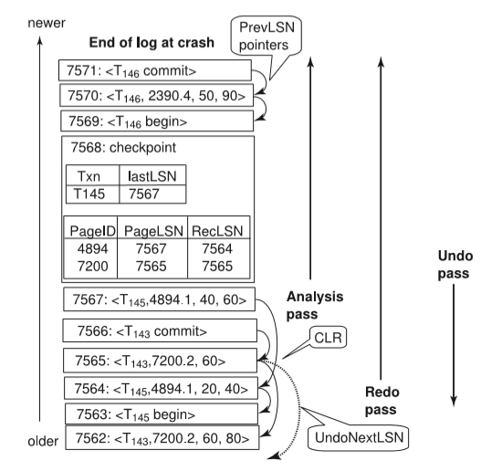
**Figure 16.9** Recovery actions in ARIES.

the checkpoint log record, and 2390 which is updated by the log record with LSN 7570. At the end of the analysis pass, the list of transactions to be undone consists of only _T_145 in this example.

The redo pass for the above example starts from LSN 7564 and performs redo of log records whose pages appear in DirtyPageTable. The undo pass needs to undo only transaction _T_145, and hence starts from its LastLSN value 7567, and continues backwards until the record _< T_145 start_\>_ is found at LSN 7563.

#### Other Features

Among other key features that ARIES provides are:

• **Nested top actions**: ARIES allows the logging of operations that should not be undone even if a transaction gets rolled back; for example, if a transaction allocates a page to a relation, even if the transaction is rolled back the page allocation should not be undone since other transactions may have stored records in the page. Such operations that should not be undone are called nested top actions. Such operations can be modeled as operations whose undo action does nothing. In ARIES, such operations are implemented by creating a  
dummy CLR whose UndoNextLSN is set such that transaction rollback skips the log records generated by the operation.

• **Recovery independence**: Some pages can be recovered independently from others, so that they can be used even while other pages are being recovered. If some pages of a disk fail, they can be recovered without stopping transaction processing on other pages.

• **Savepoints**: Transactions can record savepoints, and can be rolled back par- tially, up to a savepoint. This can be quite useful for deadlock handling, since transactions can be rolled back up to a point that permits release of required locks, and then restarted from that point.

Programmers can also use savepoints to undo a transaction partially, and then continue execution; this approach can be useful to handle certain kinds of errors detected during the transaction execution.

• **Fine-grained locking**: The ARIES recovery algorithm can be used with index concurrency-control algorithms that permit tuple-level locking on indices, instead of page-level locking, which improves concurrency significantly.

• **Recovery optimizations**: The DirtyPageTable can be used to prefetch pages during redo, instead of fetching a page only when the system finds a log record to be applied to the page. Out-of-order redo is also possible: Redo can be postponed on a page being fetched from disk, and performed when the page is fetched. Meanwhile, other log records can continue to be processed.

In summary, the ARIES algorithm is a state-of-the-art recovery algorithm, incorporating a variety of optimizations designed to improve concurrency, reduce logging overhead, and reduce recovery time.

### Remote Backup Systems

Traditional transaction-processing systems are centralized or client–server sys- tems. Such systems are vulnerable to environmental disasters such as fire, flood- ing, or earthquakes. Increasingly, there is a need for transaction-processing sys- tems that can function in spite of system failures or environmental disasters. Such systems must provide **high availability**; that is, the time for which the system is unusable must be extremely small.

We can achieve high availability by performing transaction processing at one site, called the **primary site**, and having a **remote backup** site where all the data from the primary site are replicated. The remote backup site is sometimes also called the **secondary site**. The remote site must be kept synchronized with the primary site, as updates are performed at the primary. We achieve synchronization by sending all log records from primary site to the remote backup site. The remote backup site must be physically separated from the primary—for example, we can locate it in a different state—so that a disaster at the primary does not damage  

**Figure 16.10** Architecture of remote backup system.

the remote backup site. Figure 16.10 shows the architecture of a remote backup system.

When the primary site fails, the remote backup site takes over processing. First, however, it performs recovery, using its (perhaps outdated) copy of the data from the primary, and the log records received from the primary. In effect, the remote backup site is performing recovery actions that would have been performed at the primary site when the latter recovered. Standard recovery algo- rithms, with minor modifications, can be used for recovery at the remote backup site. Once recovery has been performed, the remote backup site starts processing transactions.

Availability is greatly increased over a single-site system, since the system can recover even if all data at the primary site are lost.

Several issues must be addressed in designing a remote backup system:

• **Detection of failure**. It is important for the remote backup system to detect when the primary has failed. Failure of communication lines can fool the remote backup into believing that the primary has failed. To avoid this prob- lem, we maintain several communication links with independent modes of failure between the primary and the remote backup. For example, several independent network connections, including perhaps a modem connection over a telephone line, may be used. These connections may be backed up via manual intervention by operators, who can communicate over the telephone system.

• **Transfer of control**. When the primary fails, the backup site takes over pro- cessing and becomes the new primary. When the original primary site re- covers, it can either play the role of remote backup, or take over the role of primary site again. In either case, the old primary must receive a log of updates carried out by the backup site while the old primary was down.

The simplest way of transferring control is for the old primary to receive redo logs from the old backup site, and to catch up with the updates by applying them locally. The old primary can then act as a remote backup site. If control must be transferred back, the old backup site can pretend to have failed, resulting in the old primary taking over.  

• **Time to recover**. If the log at the remote backup grows large, recovery will take a long time. The remote backup site can periodically process the redo log records that it has received and can perform a checkpoint, so that earlier parts of the log can be deleted. The delay before the remote backup takes over can be significantly reduced as a result.

A **hot-spare** configuration can make takeover by the backup site almost instantaneous. In this configuration, the remote backup site continually pro- cesses redo log records as they arrive, applying the updates locally. As soon as the failure of the primary is detected, the backup site completes recov- ery by rolling back incomplete transactions; it is then ready to process new transactions.

• **Time to commit**. To ensure that the updates of a committed transaction are durable, a transaction must not be declared committed until its log records have reached the backup site. This delay can result in a longer wait to commit a transaction, and some systems therefore permit lower degrees of durability. The degrees of durability can be classified as follows:

◦ **One-safe**. A transaction commits as soon as its commit log record is writ- ten to stable storage at the primary site.

The problem with this scheme is that the updates of a committed transaction may not have made it to the backup site, when the backup site takes over processing. Thus, the updates may appear to be lost. When the primary site recovers, the lost updates cannot be merged in directly, since the updates may conflict with later updates performed at the backup site. Thus, human intervention may be required to bring the database to a consistent state.

◦ **Two-very-safe**. A transaction commits as soon as its commit log record is written to stable storage at the primary and the backup site.

The problem with this scheme is that transaction processing cannot proceed if either the primary or the backup site is down. Thus, availability is actually less than in the single-site case, although the probability of data loss is much less.

◦ **Two-safe**. This scheme is the same as two-very-safe if both primary and backup sites are active. If only the primary is active, the transaction is allowed to commit as soon as its commit log record is written to stable storage at the primary site.

This scheme provides better availability than does two-very-safe, while avoiding the problem of lost transactions faced by the one-safe scheme. It results in a slower commit than the one-safe scheme, but the benefits generally outweigh the cost.

Several commercial shared-disk systems provide a level of fault tolerance that is intermediate between centralized and remote backup systems. In these commer- cial systems, the failure of a CPU does not result in system failure. Instead, other CPUs take over, and they carry out recovery. Recovery actions include rollback  

of transactions running on the failed CPU, and recovery of locks held by those transactions. Since data are on a shared disk, there is no need for transfer of log records. However, we should safeguard the data from disk failure by using, for example, a RAID disk organization.

An alternative way of achieving high availability is to use a distributed database, with data replicated at more than one site. Transactions are then re- quired to update all replicas of any data item that they update. We study dis- tributed databases, including replication, in Chapter 19.

### Summary

• A computer system, like any other mechanical or electrical device, is sub- ject to failure. There are a variety of causes of such failure, including disk crash, power failure, and software errors. In each of these cases, information concerning the database system is lost.

• In addition to system failures, transactions may also fail for various reasons, such as violation of integrity constraints or deadlocks.

• An integral part of a database system is a recovery scheme that is responsible for the detection of failures and for the restoration of the database to a state that existed before the occurrence of the failure.

• The various types of storage in a computer are volatile storage, nonvolatile storage, and stable storage. Data in volatile storage, such as in RAM, are lost when the computer crashes. Data in nonvolatile storage, such as disk, are not lost when the computer crashes, but may occasionally be lost because of failures such as disk crashes. Data in stable storage are never lost.

• Stable storage that must be accessible online is approximated with mirrored disks, or other forms of RAID, which provide redundant data storage. Offline, or archival, stable storage may consist of multiple tape copies of data stored in a physically secure location.

• In case of failure, the state of the database system may no longer be consistent; that is, it may not reflect a state of the world that the database is supposed to capture. To preserve consistency, we require that each transaction be atomic. It is the responsibility of the recovery scheme to ensure the atomicity and durability property.

• In log-based schemes, all updates are recorded on a log, which must be kept in stable storage. A transaction is considered to have committed when its last log record, which is the commit log record for the transaction, has been output to stable storage.

• Log records contain old values and new values for all updated data items. The new values are used in case the updates need to be redone after a system crash. The old values are used to roll back the updates of the transaction if  

the transaction aborts during normal operation, as well as to roll back the updates of the transaction in case the system crashed before the transaction committed.

• In the deferred-modifications scheme, during the execution of a transaction, all the write operations are deferred until the transaction has been committed, at which time the system uses the information on the log associated with the transaction in executing the deferred writes. With deferred modification, log records do not need to contain old values of updated data items.

• To reduce the overhead of searching the log and redoing transactions, we can use checkpointing techniques.

• Modern recovery algorithms are based on the concept of repeating history, whereby all actions taken during normal operation (since the last completed checkpoint) are replayed during the redo pass of recovery. Repeating history restores the system state to what it was at the time the last log record was output to stable storage before the system crashed. Undo is then performed from this state, by executing an undo pass that processes log records of incomplete transactions in reverse order.

• Undo of an incomplete transaction writes out special redo-only log records, and an abort log record. After that, the transaction can be considered to have completed, and it will not be undone again.

• Transaction processing is based on a storage model in which main memory holds a log buffer, a database buffer, and a system buffer. The system buffer holds pages of system object code and local work areas of transactions.

• Efficient implementation of a recovery scheme requires that the number of writes to the database and to stable storage be minimized. Log records may be kept in volatile log buffer initially, but must be written to stable storage when one of the following conditions occurs:

◦ Before the _<Ti_ commit_\>_ log record may be output to stable storage, all log records pertaining to transaction _Ti_ must have been output to stable storage.

◦ Before a block of data in main memory is output to the database (in nonvolatile storage), all log records pertaining to data in that block must have been output to stable storage.

• Modern recovery techniques support high-concurrency locking techniques, such as those used for B+-tree concurrency control. These techniques allow early release of lower-level locks obtained by operations such as inserts or deletes, which allows other such operations to be performed by other trans- actions. After lower-level locks are released, physical undo is not possible, and instead logical undo, such as a deletion to undo an insertion, is required. Transactions retain higher-level locks that ensure that concurrent transactions cannot perform actions that could make logical undo of an operation impossible.

• To recover from failures that result in the loss of nonvolatile storage, we must dump the entire contents of the database onto stable storage periodically— say, once per day. If a failure occurs that results in the loss of physical database blocks, we use the most recent dump in restoring the database to a previous consistent state. Once this restoration has been accomplished, we use the log to bring the database system to the most recent consistent state.

• The ARIES recovery scheme is a state-of-the-art scheme that supports a num- ber of features to provide greater concurrency, reduce logging overheads, and minimize recovery time. It is also based on repeating history, and allows logical undo operations. The scheme flushes pages on a continuous basis and does not need to flush all pages at the time of a checkpoint. It uses log se- quence numbers (LSNs) to implement a variety of optimizations that reduce the time taken for recovery.

• Remote backup systems provide a high degree of availability, allowing trans- action processing to continue even if the primary site is destroyed by a fire, flood, or earthquake. Data and log records from a primary site are continu- ally backed up to a remote backup site. If the primary site fails, the remote backup site takes over transaction processing, after executing certain recovery actions.

### Review Terms

• Recovery scheme • Failure classification

◦ Transaction failure

◦ Logical error

◦ System error

◦ System crash

◦ Data-transfer failure

• Fail-stop assumption • Disk failure • Storage types

◦ Volatile storage

◦ Nonvolatile storage

◦ Stable storage

• Blocks

◦ Physical blocks

◦ Buffer blocks

• Disk buffer • Force-output • Log-based recovery • Log • Log records • Update log record • Deferred modification • Immediate modification • Uncommitted modifications • Checkpoints • Recovery algorithm  

• Restart recovery • Transaction rollback • Physical undo • Physical logging • Transaction rollback • Checkpoints • Restart recovery • Redo phase • Undo phase • Repeating history • Buffer management • Log-record buffering • Write-ahead logging (WAL) • Log force • Database buffering • Latches • Operating system and buffer

management • Fuzzy checkpointing • Early lock release • Logical operations • Logical logging • Logical undo • Loss of nonvolatile storage • Archival dump • Fuzzy dump • ARIES

◦ Log sequence number (LSN)

◦ PageLSN

◦ Physiological redo

◦ Compensation log record (CLR)

◦ DirtyPageTable

◦ Checkpoint log record

◦ Analysis phase

◦ Redo phase

◦ Undo phase

• High availability • Remote backup systems

◦ Primary site

◦ Remote backup site

◦ Secondary site

• Detection of failure • Transfer of control • Time to recover • Hot-spare configuration • Time to commit

◦ One-safe

◦ Two-very-safe

◦ Two-safe

### Practice Exercises

**16.1** Explain why log records for transactions on the undo-list must be pro- cessed in reverse order, whereas redo is performed in a forward direction.

**16.2** Explain the purpose of the checkpoint mechanism. How often should checkpoints be performed? How does the frequency of checkpoints affect:

• System performance when no failure occurs?

• The time it takes to recover from a system crash?

• The time it takes to recover from a media (disk) failure?  

**16.3** Some database systems allow the administrator to choose between two forms of logging: _normal logging_, used to recover from system crashes, and _archival logging_, used to recover from media (disk) failure. When can a log record be deleted, in each of these cases, using the recovery algorithm of Section 16.4?

**16.4** Describe how to modify the recovery algorithm of Section 16.4 to imple- ment savepoints, and to perform rollback to a savepoint. (Savepoints are described in Section 16.8.3.)

**16.5** Suppose the deferred modification technique is used in a database.

a. Is the old-value part of an update log record required any more? Why or why not?

b. If old values are not stored in update log records, transaction undo is clearly not feasible. How would the redo-phase of recovery have to be modified as a result?

c. Deferred modification can be implemented by keeping updated data items in local memory of transactions, and reading data items that have not been updated directly from the database buffer. Suggest how to efficiently implement a data item read, ensuring that a trans- action sees its own updates.

d. What problem would arise with the above technique, if transactions perform a large number of updates?

**16.6** The shadow-paging scheme requires the page table to be copied. Suppose the page table is represented as a B+-tree.

a. Suggest how to share as many nodes as possible between the new copy and the shadow-copy of the B+-tree, assuming that updates are made only to leaf entries, with no insertions and deletions.

b. Even with the above optimization, logging is much cheaper than a shadow-copy scheme, for transactions that perform small updates. Explain why.

**16.7** Suppose we (incorrectly) modify the recovery algorithm of Section 16.4 to not log actions taken during transaction rollback. When recovering from a system crash, transactions that were rolled back earlier would then be included in undo-list, and rolled back again. Give an example to show how actions taken during the undo phase of recovery could result in an incorrect database state. (Hint: Consider a data item updated by an aborted transaction, and then updated by a transaction that commits.)

**16.8** Disk space allocated to a file as a result of a transaction should not be released even if the transaction is rolled back. Explain why, and explain how ARIES ensures that such actions are not rolled back.  

**16.9** Suppose a transaction deletes a record, and the free space generated thus is allocated to a record inserted by another transaction, even before the first transaction commits.

a. What problem can occur if the first transaction needs to be rolled back?

b. Would this problem be an issue if page-level locking is used instead of tuple-level locking?

c. Suggest how to solve this problem while supporting tuple-level locking, by logging post-commit actions in special log records, and executing them after commit. Make sure your scheme ensures that such actions are performed exactly once.

**16.10** Explain the reasons why recovery of interactive transactions is more dif- ficult to deal with than is recovery of batch transactions. Is there a simple way to deal with this difficulty? (Hint: Consider an automatic teller ma- chine transaction in which cash is withdrawn.)

**16.11** Sometimes a transaction has to be undone after it has committed because it was erroneously executed, for example because of erroneous input by a bank teller.

a. Give an example to show that using the normal transaction undo mechanism to undo such a transaction could lead to an inconsistent state.

b. One way to handle this situation is to bring the whole database to a state prior to the commit of the erroneous transaction (called _point-in-time_ recovery). Transactions that committed later have their effects rolled back with this scheme.

Suggest a modification to the recovery algorithm of Section 16.4 to implement point-in-time recovery using database dumps.

c. Later nonerroneous transactions can be re-executed logically, if the updates are available in the form of SQL but cannot be re-executed using their log records. Why?

### Exercises

**16.12** Explain the difference between the three storage types—volatile, non- volatile, and stable—in terms of I/O cost.

**16.13** Stable storage cannot be implemented.

a. Explain why it cannot be.

b. Explain how database systems deal with this problem.  

**16.14** Explain how the database may become inconsistent if some log records pertaining to a block are not output to stable storage before the block is output to disk.

**16.15** Outline the drawbacks of the no-steal and force buffer management poli- cies.

**16.16** Physiological redo logging can reduce logging overheads significantly, especially with a slotted page record organization. Explain why.

**16.17** Explain why logical undo logging is used widely, whereas logical redo logging (other than physiological redo logging) is rarely used.

**16.18** Consider the log in Figure 16.5. Suppose there is a crash just before the _< T_0 abort_\>_ log record is written out. Explain what would happen during recovery.

**16.19** Suppose there is a transaction that has been running for a very long time, but has performed very few updates.

a. What effect would the transaction have on recovery time with the recovery algorithm of Section 16.4, and with the ARIES recovery algorithm.

b. What effect would the transaction have on deletion of old log records?

**16.20** Consider the log in Figure 16.6. Suppose there is a crash during recovery, just after before the operation abort log record is written for operation _O_1\. Explain what would happen when the system recovers again.

**16.21** Compare log-based recovery with the shadow-copy scheme in terms of their overheads, for the case when data is being added to newly allocated disk pages (in other words, there is no old value to be restored in case the transaction aborts).

**16.22** In the ARIES recovery algorithm: a. If at the beginning of the analysis pass, a page is not in the checkpoint

dirty page table, will we need to apply any redo records to it? Why?

b. What is RecLSN, and how is it used to minimize unnecessary redos?

**16.23** Explain the difference between a system crash and a “disaster.”

**16.24** For each of the following requirements, identify the best choice of degree of durability in a remote backup system:

a. Data loss must be avoided but some loss of availability may be tolerated.

b. Transaction commit must be accomplished quickly, even at the cost of loss of some committed transactions in a disaster.

c. A high degree of availability and durability is required, but a longer running time for the transaction commit protocol is acceptable.  

**16.25** The Oracle database system uses undo log records to provide a snapshot view of the database, under snapshot-isolation. The snapshot view seen by transaction _Ti_ reflects updates of all transactions that had committed when _Ti_ started, and the updates of _Ti_ ; updates of all other transactions are not visible to _Ti_ .

Describe a scheme for buffer handling whereby transactions are given a snapshot view of pages in the buffer. Include details of how to use the log to generate the snapshot view. You can assume that operations as well as their undo actions affect only one page.

### Bibliographical Notes

Gray and Reuter \[1993\] is an excellent textbook source of information about recovery, including interesting implementation and historical details. Bernstein and Goodman \[1981\] is an early textbook source of information on concurrency control and recovery.

An overview of the recovery scheme of System R is presented by Gray et al. \[1981\]. Tutorial and survey papers on various recovery techniques for database systems include Gray \[1978\], Lindsay et al. \[1980\], and Verhofstad \[1978\]. The concepts of fuzzy checkpointing and fuzzy dumps are described in Lindsay et al. \[1980\]. A comprehensive presentation of the principles of recovery is offered by Haerder and Reuter \[1983\].

The state-of-the-art in recovery methods is best illustrated by the ARIES re- covery method, described in Mohan et al. \[1992\] and Mohan \[1990b\]. Mohan and Levine \[1992\] presents ARIES IM, an extension of ARIES to optimize B+-tree concur- rency control and recovery using logical undo logging. ARIES and its variants are used in several database products, including IBM DB2 and Microsoft SQL Server. Recovery in Oracle is described in Lahiri et al. \[2001\].

Specialized recovery techniques for index structures are described in Mohan and Levine \[1992\] and Mohan \[1993\]; Mohan and Narang \[1994\] describes recov- ery techniques for client–server architectures, while Mohan and Narang \[1992\] describes recovery techniques for parallel-database architectures.

A generalized version of the theory of serializability, with short duration lower-level locks during operations, combined with longer duration higher-level locks, is described by Weikum \[1991\]. In Section 16.7.3, we saw the requirement that an operation should acquire all lower-level locks that may be needed for the logical undo of the operation. This requirement can be relaxed by performing all physical undo operations first, before perfoming any logical undo operations. A generalized version of this idea, called multi-level recovery, presented in Weikum et al. \[1990\], allows multiple levels of logical operations, with level-by-level undo passes during recovery.

Remote backup algorithms for disaster recovery are presented in King et al. \[1991\] and Polyzois and Garcia-Molina \[1994\].