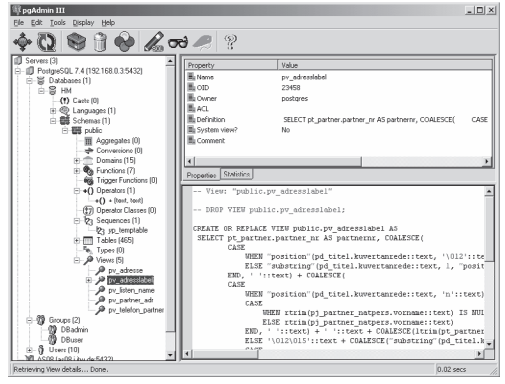
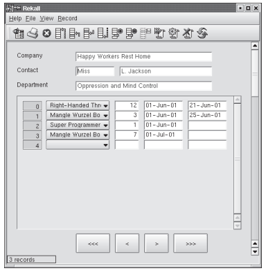
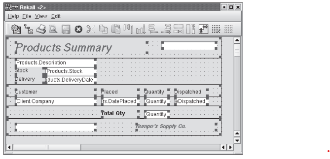
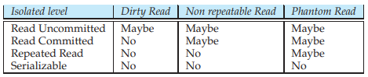
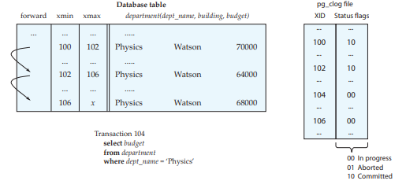
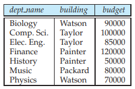
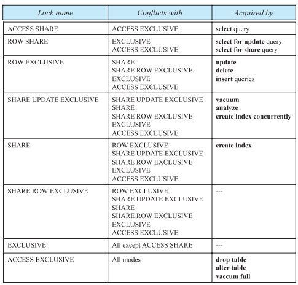
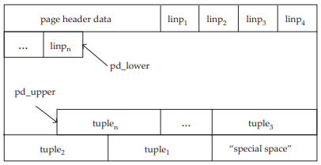
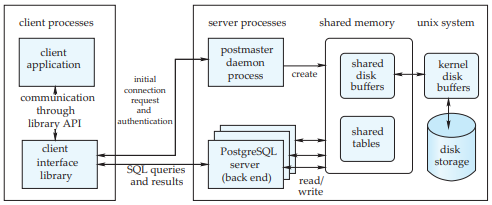

  

**PART 9**

#CASE STUDIES 
This part describes how different database systems integrate the various con- cepts described earlier in the book. We begin by covering a widely used open- source database system, PostgreSQL, in Chapter 27. Three widely used commercial database systems—IBM DB2, Oracle, and Microsoft SQL Server—are covered in Chapters 28, 29, and 30. These three represent three of the most widely used commercial database systems.

Each of these chapters highlights unique features of each database system: tools, SQL variations and extensions, and system architecture, including storage organization, query processing, concurrency control and recovery, and replica- tion.

The chapters cover only key aspects of the database products they describe, and therefore should not be regarded as a comprehensive coverage of the product. Furthermore, since products are enhanced regularly, details of the product may change. When using a particular product version, be sure to consult the user manuals for specific details.

Keep in mind that the chapters in this part often use industrial rather than academic terminology. For instance, they use table instead of relation, row instead of tuple, and column instead of attribute.

**1121**  

_This page intentionally left blank_  

**_C H A P T E R_27** 
# PostgreSQL

Anastasia Ailamaki, Sailesh Krishnamurthy, Spiros Papadimitriou, Bianca Schroeder, Karl Schnaitter, and Gavin Sherry

PostgreSQL is an open-source object-relational database management system. It is a descendant of one of the earliest such systems, the POSTGRES system developed under Professor Michael Stonebraker at the University of California, Berkeley. The name “postgres” is derived from the name of a pioneering relational database sys- tem, Ingres, also developed under Stonebraker at Berkeley. Currently, PostgreSQL supports many aspects of SQL:2003 and offers features such as complex queries, foreign keys, triggers, views, transactional integrity, full-text searching, and lim- ited data replication. In addition, users can extend PostgreSQL with new data types, functions, operators, or index methods. PostgreSQL supports a variety of programming languages (including C, C++, Java, Perl, Tcl, and Python) as well as the database interfaces JDBC and ODBC. Another notable point of PostgreSQL is that it, along with MySQL, is one of the two most widely used open-source relational database systems. PostgreSQL is released under the BSD license, which grants permission to anyone for the use, modification, and distribution of the PostgreSQL code and documentation for any purpose without fee.

# 27.1 Introduction

In the course of two decades, PostgreSQL has undergone several major releases. The first prototype system, under the name POSTGRES, was demonstrated at the 1988 ACM SIGMOD conference. The first version, distributed to users in 1989, pro- vided features such as extensible data types, a preliminary rule system, and a query language named POSTQUEL. After the subsequent versions added a new rule system, support for multiple storage managers, and an improved query ex- ecutor, the system developers focused on portability and performance until 1994, when an SQL language interpreter was added. Under a new name, Postgres95, the system was released to the Web and later commercialized by Illustra Informa-

**1123**  

**1124 Chapter 27 PostgreSQL**

tion Technologies (later merged into Informix, which is now owned by IBM). By 1996, the name Postgres95 was replaced by PostgreSQL, to reflect the relationship between the original POSTGRES and the more recent versions with SQL capability.

PostgreSQL runs under virtually all Unix-like operating systems, including Linux and Apple Macintosh OS X. Early versions of the PostgreSQL server can be run under Microsoft Windows in the Cygwin environment, which provides Linux emulation under Windows. Version 8.0, released in January 2005, introduced native support for Microsoft Windows.

Today, PostgreSQL is used to implement several different research and produc- tion applications (such as the PostGIS system for geographic information) and an educational tool at several universities. The system continues to evolve through the contributions of a community of about 1000 developers. In this chapter, we explain how PostgreSQL works, starting from user interfaces and languages and continuing into the heart of the system (the data structures and the concurrency- control mechanism).

# 27.2 User Interfaces

The standard distribution of PostgreSQL comes with command-line tools for administering the database. However, there is a wide range of commercial and open-source graphical administration and design tools that support PostgreSQL. Software developers may also access PostgreSQL through a comprehensive set of programming interfaces.

## 27.2.1 Interactive Terminal Interfaces

Like most database systems, PostgreSQL offers command-line tools for database administration. The main interactive terminal client is psql, which is modeled after the Unix shell and allows execution of SQL commands on the server, as well as several other operations (such as client-side copying). Some of its features are:

• **Variables.** psql provides variable substitution features, similar to common Unix command shells.

• **SQL interpolation.** The user can substitute (“interpolate”) psql variables into regular SQL statements by placing a colon in front of the variable name.

• **Command-line editing.** psql uses the GNU readline library for convenient line editing, with tab-completion support.

PostgreSQL may also be accessed from a Tcl/Tk shell, which provides a flexible scripting language commonly used for rapid prototyping. This functionality is enabled in Tcl/Tk by loading the pgtcl library, which is distributed as an optional extension to PostgreSQL.

## 27.2.2 Graphical Interfaces

The standard distribution of PostgreSQL does not contain any graphical tools. However, several graphical user interface tools exist, and users can choose among  

**27.2 User Interfaces 1125**

**Figure 27.1**    pgAdmin III: An open-source database administration GUI.

commercial and open-source alternatives. Many of these go through rapid release cycles; the following list reflects the state of affairs at the time of this writing.

There are graphical tools for administration, including pgAccess and pgAd- min, the latter of which is shown in Figure 27.1. Tools for database design include TORA and Data Architect, the latter of which is shown in Figure 27.2. PostgreSQL works with several commercial forms-design and report-generation tools. Open- source alternatives include Rekall (shown in Figures 27.3 and 27.4), GNU Report Generator, and a more comprehensive tool suite, GNU Enterprise.

### 27.2.3 Programming Language Interfaces

PostgreSQL provides native interfaces for ODBC and JDBC, as well as bindings for most programming languages, including C, C++, PHP, Perl, Tcl/Tk, ECPG, Python, and Ruby.

The libpq library provides the C API for PostgreSQL; libpq is also the un- derlying engine for most programming-language bindings. The libpq library supports both synchronous and asynchronous execution of SQL commands and prepared statements, through a reentrant and thread-safe interface. The connec- tion parameters of libpq may be configured in several flexible ways, such as  

**1126 Chapter 27 PostgreSQL**

**Figure 27.2** Data Architect: A multiplatform database design GUI.

setting environment variables, placing settings in a local file, or creating entries on an LDAP server.

# 27.3 SQL Variations and Extensions

The current version of PostgreSQL supports almost all entry-level SQL-92 features, as well as many of the intermediate- and full-level features. It also supports many SQL:1999 and SQL:2003 features, including most object-relational features described in Chapter 22 and the SQL/XML features for parsed XML data described in Chapter 23. In fact, some features of the current SQL standard (such as arrays, functions, and inheritance) were pioneered by PostgreSQL or its ancestors. It lacks OLAP features (most notably, **cube** and **rollup**), but data from PostgreSQL can be easily loaded into open-source external OLAP servers (such as Mondrian) as well as commercial products.

## 27.3.1 PostgreSQL Types

PostgreSQL has support for several nonstandard types, useful for specific appli- cation domains. Furthermore, users can define new types with the **create type**  

**27.3 SQL Variations and Extensions 1127**

**Figure 27.3 Rekall: Form-design GUI.

command. This includes new low-level base types, typically written in C (see Section 27.3.3.1).

**27.3.1.1 The PostgreSQL Type System**

PostgreSQL types fall into the following categories:

• **Base types.** Base types are also known as **abstract data types**; that is, modules that encapsulate both state and a set of operations. These are implemented below the SQL level, typically in a language such as C (see Section 27.3.3.1). Examples are **int4** (already included in PostgreSQL) or **complex** (included as an optional extension type). A base type may represent either an individual scalar value or a variable-length array of values. For each scalar type that exists in a database, PostgreSQL automatically creates an array type that holds values of the same scalar type.

• **Composite types.** These correspond to table rows; that is, they are a list of field names and their respective types. A composite type is created implicitly whenever a table is created, but users may also construct them explicitly.  

**1128 Chapter 27 PostgreSQL**

**Figure 27.4** Rekall: Report-design GUI.

• **Domains.** A domain type is defined by coupling a base type with a constraint that values of the type must satisfy. Values of the domain type and the asso- ciated base type may be used interchangeably, provided that the constraint is satisfied. A domain may also have an optional default value, whose meaning is similar to the default value of a table column.

• **Enumerated types.** These are similar to enum types used in programming languages such as C and Java. An enumerated type is essentially a fixed list of named values. In PostgreSQL, enumerated types may be converted to the textual representation of their name, but this conversion must be specified explicitly in some cases to ensure type safety. For instance, values of differ- ent enumerated types may not be compared without explicit conversion to compatible types.

• **Pseudotypes.** Currently, PostgreSQL supports the following pseudotypes: _any_, _anyarray_, _anyelement_, _anyenum_, _anynonarray cstring_, _internal_, _opaque_, _lan- guage handler_, _record_, _trigger_, and _void_. These cannot be used in composite types (and thus cannot be used for table columns), but can be used as argu- ment and return types of user-defined functions.

• **Polymorphic types.** Four of the pseudotypes _anyelement_, _anyarray_, _anynonar- ray_, and _anyenum_ are collectively known as **polymorphic**. Functions with ar- guments of these types (correspondingly called **polymorphic functions**) may operate on any actual type. PostgreSQL has a simple type-resolution scheme  

**27.3 SQL Variations and Extensions 1129**

that requires that: (1) in any particular invocation of a polymorphic function, all occurrences of a polymorphic type must be bound to the same actual type (that is, a function defined as _f_ (_anyelement_, _anyelement_) may operate only on pairs of the same actual type), and (2) if the return type is polymorphic, then at least one of the arguments must be of the same polymorphic type.

### 27.3.1.2 Nonstandard Types**

The types described in this section are included in the standard distribution. Fur- thermore, thanks to the open nature of PostgreSQL, there are several contributed extension types, such as complex numbers, and ISBN/ISSNs (see Section 27.3.3).

Geometric data types (_point_, _line_, _lseg_, _box_, _polygon_, _path_, _circle_) are used in ge- ographic information systems to represent two-dimensional spatial objects such as points, line segments, polygons, paths, and circles. Numerous functions and operators are available in PostgreSQL to perform various geometric operations such as scaling, translation, rotation, and determining intersections. Further- more, PostgreSQL supports indexing of these types using R-trees (Sections 25.3.5.3 and 27.5.2.1).

Full-text searching is performed in PostgreSQL using the _tsvector_ type that represents a document and the _tsquery_ type that represents a full-text query. A _tsvector_ stores the distinct words in a document, after converting variants of each word to a common normal form (for example, removing word stems). PostgreSQL provides functions to convert raw text to a _tsvector_ and concatenate documents. A _tsquery_ specifies words to search for in candidate documents, with multiple words connected by Boolean operators. For example, the query ’index & !(tree | hash)’ finds documents that contain “index” without using the words “tree” or “hash.” PostgreSQL natively supports operations on full-text types, including language features and indexed search.

PostgreSQL offers data types to store network addresses. These data types allow network-management applications to use a PostgreSQL database as their data store. For those familiar with computer networking, we provide a brief summary of this feature here. Separate types exist for IPv4, IPv6, and Media Access Control (MAC) addresses (_cidr_, _inet_ and _macaddr_, respectively). Both _inet_ and _cidr_ types can store IPv4 and IPv6 addresses, with optional subnet masks. Their main difference is in input/output formatting, as well as the restriction that classless Internet domain routing (CIDR) addresses do not accept values with nonzero bits to the right of the netmask. The _macaddr_ type is used to store MAC addresses (typically, Ethernet card hardware addresses). PostgreSQL supports indexing and sorting on these types, as well as a set of operations (including subnet testing, and mapping MAC addresses to hardware manufacturer names). Furthermore, these types offer input-error checking. Thus, they are preferable over plain text fields.

The PostgreSQL _bit_ type can store both fixed- and variable-length strings of 1s and 0s. PostgreSQL supports bit-logical operators and string-manipulation functions for these values.  

**1130 Chapter 27 PostgreSQL**

## 27.3.2 Rules and Other Active-Database Features

PostgreSQL supports SQL constraints and triggers (and stored procedures; see Section 27.3.3). Furthermore, it features query-rewriting rules that can be declared on the server.

PostgreSQL allows **check** constraints, **not null** constraints, and primary-key and foreign-key constraints (with restricting and cascading deletes).

Like many other relational database systems, PostgreSQL supports triggers, which are useful for nontrivial constraints and consistency checking or enforce- ment. Trigger functions can be written in a procedural language such as PL/pgSQL (see Section 27.3.3.4) or in C, but not in plain SQL. Triggers can execute before or after **insert**, **update**, or **delete** operations and either once per modified row, or once per SQL statement.

The PostgreSQL rules system allows users to define query-rewrite rules on the database server. Unlike stored procedures and triggers, the rule system intervenes between the query parser and the planner and modifies queries on the basis of the set of rules. After the original query tree has been transformed into one or more trees, they are passed to the query planner. Thus, the planner has all the necessary information (tables to be scanned, relationships between them, qualifications, join information, and so forth) and can come up with an efficient execution plan, even when complex rules are involved.

The general syntax for declaring rules is:

**create rule** _rule name_ **as 
on** { **select** | **insert** | **update** | **delete** }
 **to** table [ **where** _rule qualification_ ] **do** [ **instead** \] { **nothing** | command_ | (_command ; command ... ) }

The rest of this section provides examples that illustrate the rule system’s capa- bilities. More details on how rules are matched to query trees and how the latter are subsequently transformed can be found in the PostgreSQL documentation (see the bibliographical notes). The rule system is implemented in the rewrite phase of query processing and explained in Section 27.6.1.

First, PostgreSQL uses rules to implement views. A view definition such as:

**create view** _myview_ **as select** \* **from** _mytab_;

is converted into the following rule definition:

**create table** _myview_ (_same column list as mytab_); **create rule** _return_ **as on select to** _myview_ **do instead**

**select** \* **from** _mytab_;

Queries on _myview_ are transformed before execution to queries on the underlying table _mytab_. The **create view** syntax is considered better programming form in this case, since it is more concise and it also prevents creation of views that  

**27.3 SQL Variations and Extensions 1131**

reference each other (which is possible if rules are carelessly declared, resulting in potentially confusing runtime errors). However, rules can be used to define update actions on views explicitly (**create view** statements do not allow this).

As another example, consider the case where the user wants to log all increases of instructor salaries. This could be achieved by a rule such as:

**create rule** _salary audit_ **as on update to** _instructor_ **where new**._salary <>_ **old**._salary_ **do insert into** _salary audit_ **values** (current timestamp, current user,

**new**._name_, **old**._salary_, **new**._salary)_;

Finally, we give a slightly more complicated insert/update rule. Assume that pending salary increases are stored in a table _salary increases_(_name, increase_). We can declare a “dummy” table _approved increases_ with the same fields and then define the following rule:

**create rule** _approved increases insert_ **as on insert to** _approved increases_ **do instead update** _instructor_

**set** _salary_ \= _salary_ \+ **new**._increase_ **where** _name_ \= **new**._name_;

Then the following query:

**insert into** _approved increases_ **select** * **from** _salary increases_;

will update all salaries in the _instructor_ table at once. Since the **instead** keyword was specified in the rule, the _approved increases_ table is unchanged.

There is some overlap between the functionality provided by rules and per- row triggers. The PostgreSQL rule system can be used to implement most triggers, but some kinds of constraints (in particular, foreign keys) cannot be implemented by rules. Also, triggers have the added ability to generate error messages to signal constraint violations, whereas a rule may only enforce data integrity by silently suppressing invalid values. On the other hand, triggers cannot be used for the **update** or **delete** actions that rules enable on views. Since there is no real data in a view relation, the trigger would never be called.

An important difference between triggers and views is that a trigger is exe- cuted iteratively for every affected row. A rule, on the other hand, manipulates the query tree before query planning. So if a statement affects many rows, a rule is far more efficient than a trigger.

The implementation of triggers and constraints in PostgreSQL is outlined briefly in Section 27.6.4.  

**1132 Chapter 27 PostgreSQL**

## 27.3.3 Extensibility

Like most relational database systems, PostgreSQL stores information about data- bases, tables, columns, and so forth, in what are commonly known as **system catalogs**, which appear to the user as normal tables. Other relational database systems are typically extended by changing hard-coded procedures in the source code or by loading special extension modules written by the vendor.

Unlike most relational database systems, PostgreSQL goes one step further and stores much more information in its catalogs: not only information about tables and columns, but also information about data types, functions, access methods, and so on. Therefore, PostgreSQL is easy for users to extend and facilitates rapid prototyping of new applications and storage structures. PostgreSQL can also in- corporate user-written code into the server, through dynamic loading of shared objects. This provides an alternative approach to writing extensions that can be used when catalog-based extensions are not sufficient.

Furthermore, the contribmodule of the PostgreSQL distribution includes nu- merous user functions (for example, array iterators, fuzzy string matching, cryp- tographic functions), base types (for example, encrypted passwords, ISBN/ISSNs, _n_\-dimensional cubes) and index extensions (for example, RD-trees, indexing for hierarchical labels). Thanks to the open nature of PostgreSQL, there is a large community of PostgreSQL professionals and enthusiasts who also actively extend PostgreSQL on an almost daily basis. Extension types are identical in functionality to the built-in types (see also Section 27.3.1.2); the latter are simply already linked into the server and preregistered in the system catalog. Similarly, this is the only difference between built-in and extension functions.

### 27.3.3.1 Types

PostgreSQL allows users to define composite types, enumeration types, and even new base types.

A composite-type definition is similar to a table definition (in fact, the latter implicitly does the former). Stand-alone composite types are typically useful for function arguments. For example, the definition:

**create type** city_t **as** (name **varchar**(80), state **char**(2));

allows functions to accept and return _city t_ tuples, even if there is no table that explicitly contains rows of this type.

Enumeration types are easy to define, by simply listing the names of the values. The following example creates an enumerated type to represent the status of a software product.

**create type** status_t **as enum** (’alpha’, ’beta’, ’release’);

The order of listed names is significant in comparing values of an enumerated type. This can be useful for a statement such as:  

**27.3 SQL Variations and Extensions 1133**

**select** name **from** products **where** status > ’alpha’;

which retrieves the names of products that have moved past the alpha stage. Adding base types to PostgreSQL is straightforward; an example can be found

in complex.sql and complex.c in the tutorials of the PostgreSQL distribution. The base type can be declared in C, for example:

typedef struct Complex {
     double x; double y;
    } Complex;

The next step is to define functions to read and write values of the new type in text format (see Section 27.3.3.2). Subsequently, the new type can be registered using the statement:

**create type** complex { 
    internallength = 16,
     input = complexin,
      output = complex out, alignment = **double**
      };

assuming the text I/O functions have been registered as _complex in_ and _complex out_.

The user has the option of defining binary I/O functions as well (for more efficient data dumping). Extension types can be used like the existing base types of PostgreSQL. In fact, their only difference is that the extension types are dynam- ically loaded and linked into the server. Furthermore, indices may be extended easily to handle new base types; see Section 27.3.3.3.

### 27.3.3.2 Functions

PostgreSQL allows users to define functions that are stored and executed on the server. PostgreSQL also supports function overloading (that is, functions may be declared by using the same name but with arguments of different types). Func- tions can be written as plain SQL statements, or in several procedural languages (covered in Section 27.3.3.4). Finally, PostgreSQL has an application programmer interface for adding functions written in C (explained in this section).

User-defined functions can be written in C (or a language with compatible calling conventions, such as C++). The actual coding conventions are essentially the same for dynamically loaded, user-defined functions, as well as for internal functions (which are statically linked into the server). Hence, the standard internal function library is a rich source of coding examples for user-defined C functions.  

**1134 Chapter 27 PostgreSQL**

Once the shared library containing the function has been created, a declaration such as the following registers it on the server:

**create function** complex out(complex) **returns cstring** 
**as** ’shared object_filename’ **language C immutable strict**;

The entry point to the shared object file is assumed to be the same as the SQL function name (here, _complex out_), unless otherwise specified.

The example here continues the one from Section 27.3.3.1. The application program interface hides most of PostgreSQL’s internal details. Hence, the actual C code for the above text output function of _complex_ values is quite simple:

PG_FUNCTION_INFO_V1(complex out);
 Datum complex_out(pg_function_args) {
     Complex *complex = (Complex *) pg getarg pointer(0); 
     char *result;
     result = (char *) palloc(100);
      snprintf(result, 100,"(%g,%g)",     complex−>x, complex−>y);
       pg return_cstring(result);
       }

The first line declares the function complex out, and the following lines imple- ment the output function. The code uses several PostgreSQL-specific constructs, such as the palloc function, which dynamically allocates memory controlled by PostgreSQL’s memory manager. More details may be found in the PostgreSQL documentation (see the bibliographical notes).

Aggregate functions in PostgreSQL operate by updating a **state value** via a **state transition** function that is called for each tuple value in the aggregation group. For example, the state for the **avg** operator consists of the running sum and the count of values. As each tuple arrives, the transition function should simply add its value to the running sum and increment the count by one. Optionally, a _final_ function may be called to compute the return value based on the state information. For example, the final function for **avg** would simply divide the running sum by the count and return it.

Thus, defining a new aggregate is as simple as defining these two functions. For the _complex_ type example, if _complex add_ is a user-defined function that takes two complex arguments and returns their sum, then the **sum** aggregate operator can be extended to complex numbers using the simple declaration:  

**27.3 SQL Variations and Extensions 1135**

**create aggregate** sum (
     sfunc = complex_add,
      basetype = complex,
       stype = complex,
        initcond= ’(0,0)’
        );

Note the use of function overloading: PostgreSQL will call the appropriate _sum_ aggregate function, on the basis of the actual type of its argument during invo- cation. The _basetype_ is the argument type and _stype_ is the state value type. In this case, a final function is unnecessary, since the return value is the state value itself (that is, the running sum in both cases).

User-defined functions can also be invoked by using operator syntax. Beyond simple “syntactic sugar” for function invocation, operator declarations can also provide hints to the query optimizer in order to improve performance. These hints may include information about commutativity, restriction and join selectivity estimation, and various other properties related to join algorithms.

### 27.3.3.3 Index Extensions

PostgreSQL currently supports the usual B-tree and hash indices, as well as two index methods that are unique to PostgreSQL: the Generalized Search Tree (GiST) and the Generalized Inverted Index (GIN), which is useful for full-text indexing (these index structures are explained in Section 27.5.2.1). Finally, PostgreSQL pro- vides indexing of two-dimensional spatial objects with an R-tree index, which is implemented using a GiST index behind the scenes. All of these can be easily extended to accommodate new base types.

Adding index extensions for a type requires definition of an **operator class**, which encapsulates the following:

• **Index-method strategies.** These are a set of operators that can be used as qualifiers in **where** clauses. The particular set depends on the index type. For example, B-tree indices can retrieve ranges of objects, so the set consists of five operators (_<_, _<_\=, =, _\>_\=, and _\>_), all of which can appear in a **where** clause involving a B-tree index. A hash index allows only equality testing and an R-tree index allows a number of spatial relationships (for example contained, to-the-left, and so forth).

• **Index-method support routines.** The above set of operators is typically not sufficient for the operation of the index. For example, a hash index requires a function to compute the hash value for each object. An R-tree index needs to be able to compute intersections and unions and to estimate the size of indexed objects.  

**1136 Chapter 27 PostgreSQL**

For example, if the following functions and operators are defined to compare the magnitude of _complex_ numbers (see Section 27.3.3.1), then we can make such objects indexable by the following declaration:

**create operator class** complex_abs_ops **default for type** complex **using btree as**

**operator** 1 < (complex, complex), **operator** 2 <= (_complex, complex), **operator** 3 = (complex, complex), **operator** 4 >= (complex, complex), **operator** 5 > (complex, complex), **function** 1 complex_abs_cmp(complex, complex);

The **operator** statements define the strategy methods and the **function** statements define the support methods.

### 27.3.3.4 Procedural Languages

Stored functions and procedures can be written in a number of procedural lan- guages. Furthermore, PostgreSQL defines an application programmer interface for hooking up any programming language for this purpose. Programming lan- guages can be registered on demand and are either **trusted** or **untrusted**. The latter allow unlimited access to the DBMS and the file system, and writing stored functions in them requires superuser privileges.

• **PL/pgSQL**. This is a trusted language that adds procedural programming capabilities (for example, variables and control flow) to SQL. It is very similar to Oracle’s PL/SQL. Although code cannot be transferred verbatim from one to the other, porting is usually simple.

• **PL/Tcl**, **PL/Perl**, and **PL/Python**. These leverage the power of Tcl, Perl, and Python to write stored functions and procedures on the server. The first two come in both trusted and untrusted versions (PL/Tcl, PL/Perl and PL/TclU, PL/PerlU, respectively), while PL/Python is untrusted at the time of this writing. Each of these has bindings that allow access to the database system via a language-specific interface.

### 27.3.3.5 Server Programming Interface

The server programming interface (SPI) is an application programmer interface that allows user-defined C functions (see Section 27.3.3.2) to run arbitrary SQL commands inside their functions. This gives writers of user-defined functions the ability to implement only essential parts in C and easily leverage the full power of the relational database system engine to do most of the work.  

**27.4 Transaction Management in PostgreSQL 1137**

# 27.4 Transaction Management in PostgreSQL

Transaction management in PostgreSQL uses both both snapshot isolation and two-phase locking. Which one of the two protocols is used depends on the type of statement being executed. For DML statements1 the snapshot isolation technique presented in Section 15.7 is used; the snapshot isolation scheme is referred to as the multiversion concurrency control (MVCC) scheme in PostgreSQL. Concurrency control for DDL statements, on the other hand, is based on standard two-phase locking.

## 27.4.1 PostgreSQL Concurrency Control

Since the concurrency control protocol used by PostgreSQL depends on the _isola- tion level_ requested by the application, we begin with an overview of the isolation levels offered by PostgreSQL. We then describe the key ideas behind the MVCC scheme, followed by a discussion of their implementation in PostgreSQL and some of the implications of MVCC. We conclude this section with an overview of locking for DDL statements and a discussion of concurrency control for indices.

### 27.4.1.1 PostgreSQL Isolation Levels

The SQL standard defines three weak levels of consistency, in addition to the serializable level of consistency, on which most of the discussion in this book is based. The purpose of providing the weak consistency levels is to allow a higher degree of concurrency for applications that don’t require the strong guarantees that serializability provides. Examples of such applications include long-running transactions that collect statistics over the database and whose results do not need to be precise.

The SQL standard defines the different isolation levels in terms of three phe- nomena that violate serializability. The three phenomena are called _dirty read_, _nonrepeatable read_, and _phantom read_, and are defined as follows:

• **Dirty read.** The transaction reads values written by another transaction that hasn’t committed yet.

• **Nonrepeatable read.** A transaction reads the same object twice during exe- cution and finds a different value the second time, although the transaction has not changed the value in the meantime.

• **Phantom read.** A transaction re-executes a query returning a set of rows that satisfy a search condition and finds that the set of rows satisfying the condition has changed as a result of another recently committed transaction. (A more detailed explanation of the phantom phenomenon, including the

^1^A DML statement is any statement that updates or reads data within a table, that is, **select**, **insert**, **update**, **fetch**, and **copy**. DDL statements affect entire tables; they can remove a table or change the schema of a table, for example. DDL statements and some other PostgreSQL-specific statements will be discussed later in this section.  

**1138 Chapter 27 PostgreSQL**

**Figure 27.5** Definition of the four standard SQL isolation levels.

concept of a phantom conflict, can be found in Section 15.8.3; eliminating phantom reads does not eliminate all phantom conflicts.)

It should be obvious that each of the above phenomena violates transaction isolation, and hence violates serializability. Figure 27.5 shows the definition of the four SQL isolation levels specified in the SQL standard—read uncommitted, read committed, repeatable read, and serializable—in terms of these phenomena. PostgreSQL supports two of the four different isolation levels, read committed (which is the default isolation level in PostgreSQL) and serializable. However, the PostgreSQL implementation of the serializable isolation level uses snapshot isolation, which does not truly ensure serializability as we have seen earlier in Section 15.7.

### 27.4.1.2 Concurrency Control for DML Commands

The MVCC scheme used in PostgreSQL is an implementation of the snapshot isolation protocol which we saw in Section 15.7. The key idea behind MVCC is to maintain different versions of each row that correspond to instances of the row at different points in time. This allows a transaction to see a consistent **snapshot** of the data, by selecting the most recent version of each row that was committed before taking the snapshot. The MVCC protocol uses snapshots to ensure that every transaction sees a consistent view of the database: before executing a command, the transaction chooses a snapshot of the data and processes the row versions that are either in the snapshot or created by earlier commands of the same transaction. This view of the data is “consistent” since it only takes full transactions into account, but the snapshot is not necessarily equal to the current state of the data.

The motivation for using MVCC is that readers never block writers and vice versa. Readers access the most recent version of a row that is part of the transac- tion’s snapshot. Writers create their own separate copy of the row to be updated. Section 27.4.1.3 shows that the only conflict that causes a transaction to be blocked arises if two writers try to update the same row. In contrast, under the standard two-phase locking approach, both readers and writers might be blocked, since there is only one version of each data object and both read and write operations are required to obtain a lock before accessing any data.

The MVCC scheme in PostgreSQL implements the first-updater-wins version of the snapshot isolation protocol, by acquiring exclusive locks on rows that are written, but using a snapshot (without any locking) when reading rows;  

**27.4 Transaction Management in PostgreSQL 1139**

additional validation is done when exclusive locks are obtained, as outlined earlier in Section 15.7.

### 27.4.1.3 PostgreSQL Implementation of MVCC

At the core of PostgreSQL MVCC is the notion of _tuple visibility_. A PostgreSQL tuple refers to a version of a row. Tuple visibility defines which of the potentially many versions of a row in a table is valid within the context of a given statement or transaction. A transaction determines tuple visibility based on a database snapshot that is chosen before executing a command.

A tuple is visible for a transaction _T_ if the following two conditions hold:

**1.** The tuple was created by a transaction that committed before transaction _T_ took its snapshot.

**2.** Updates to the tuple (if any) were executed by a transaction that is either

• aborted, or

• started running after T took its snapshot, or

• was active when T took its snapshot.

To be precise, a tuple is also visible to T if it was created by T and not subsequently updated by T . We omit the details of this special case for simplicity.

The goal of the above conditions is to ensure that each transaction sees a consistent view of the data. PostgreSQL maintains the following state information to check these conditions efficiently:

• A transaction ID, which at the same time serves as a timestamp, is assigned to every transaction at transaction start time. PostgreSQL uses a logical counter (as described in Section 15.4.1) for assigning transaction IDs.

• A log file called _pg clog_ contains the current status of each transaction. The status can be either in progress, committed, or aborted.

• Each tuple in a table has a header with three fields: xmin, which contains the transaction ID of the transaction that created the tuple and which is therefore also called the creation-transaction ID; xmax, which contains the transaction ID of the replacing/deleting transaction (or null if not deleted/replaced) and which is also referred to as the expire-transaction ID; and a forward link to new versions of the same logical row, if there are any.

• A SnapshotData data structure is created either at transaction start time or at query start time, depending on the isolation level (described in more detail below). Its main purpose is to decide whether a tuple is visible to the current command. The SnapshotData stores information about the state of transactions at the time it is created, which includes a list of active transactions and xmax, a value equal to 1 + the highest ID of any transaction that has started so far.  

**1140 Chapter 27 PostgreSQL**

**Figure 27.6** The PostgreSQL data structures used for MVCC.

The value _xmax_ serves as a “cutoff” for transactions that may be considered visible.

Figure 27.6 illustrates some of this state information through a simple example involving a database with only one table, the department table from Figure 27.7. The department table has three columns, the name of the department, the building where the department is located, and the budget of the department. Figure 27.6 shows a fragment of the department table containing only the (versions of) the row corresponding to the Physics department. The tuple headers indicate that the row was originally created by transaction 100, and later updated by transaction 102 and transaction 106. Figure 27.6 also shows a fragment of the corresponding _pg clog file. On the basis of the pg clog file, transactions 100 and 102 are committed,

while transactions 104 and 106 are in progress. Given the above state information, the two conditions that need to be satisfied

for a tuple to be visible can be rewritten as follows:

**Figure 27.7** The department relation.  

**27.4 Transaction Management in PostgreSQL 1141**

**1.** The creation-transaction ID in the tuple header

a. is a committed transaction according to the pg clog file, and

b. is less than the cutoff transaction ID xmax recorded by SnapshotData,and

c. is not one of the active transactions stored in SnapshotData.

**2.** The expire-transaction ID, if it exists,

a. is an aborted transaction according to the pg clog file, or

b. is greater than or equal to the cutoff transaction ID xmax recorded by SnapshotData, or

c. is one of the active transactions stored in SnapshotData.

Consider the example database in Figure 27.6 and assume that the Snapshot- Data used by transaction 104 simply uses 103 as the cutoff transaction ID xmax and does not show any earlier transactions to be active. In this case, the only version of the row corresponding to the Physics department that is visible to transaction 104 is the second version in the table, created by transaction 102. The first version, created by transaction 100, is not visible, since it violates condition 2: The expire- transaction ID of this tuple is 102, which corresponds to a transaction that is not aborted and that has a transaction ID less than or equal to 103. The third version of the Physics tuple is not visible, since it was created by transaction 106, which has a transaction ID larger than transaction 103, implying that this version had not been committed at the time SnapshotData was created. Moreover, transaction 106 is still in progress, which violates another one of the conditions. The second version of the row meets all the conditions for tuple visibility.

The details of how PostgreSQL MVCC interacts with the execution of SQL statements depends on whether the statement is an **insert**, **select**, **update**, or **delete** statement. The simplest case is an **insert** statement, which may simply create a new tuple based on the data in the statement, initialize the tuple header (the creation ID), and insert the new tuple into the table. Unlike two-phase locking, this does not require any interaction with the concurrency-control protocol unless the insertion needs to be checked for integrity conditions, such as uniqueness or foreign key constraints.

When the system executes a **select**, **update**, or **delete** statement the interaction with the MVCC protocol depends on the isolation level specified by the application. If the isolation level is read committed, the processing of a new statement begins with creating a new _SnapshotData_ data structure (independent of whether the statement starts a new transaction or is part of an existing transaction). Next, the system identifies target tuples, that is, the tuples that are visible with respect to the SnapshotData and that match the search criteria of the statement. In the case of a **select** statement, the set of target tuples make up the result of the query.

In the case of an **update** or **delete** statement in read committed mode, an extra step is necessary after identifying the target tuples, before the actual update or  

**1142 Chapter 27 PostgreSQL**

delete operation can take place. The reason is that visibility of a tuple ensures only that the tuple has been created by a transaction that committed before the **update**/**delete** statement in question started. However, it is possible that, since query start, this tuple has been updated or deleted by another concurrently executing transaction. This can be detected by looking at the expire-transaction ID of the tuple. If the expire-transaction ID corresponds to a transaction that is still in progress, it is necessary to wait for the completion of this transaction first. If the transaction aborts, the **update** or **delete** statement can proceed and perform the actual modification. If the transaction commits, the search criteria of the statement need to be evaluated again, and only if the tuple still meets these criteria can the row be modified. If the row is to be deleted, the main step is to update the expire-transaction ID of the old tuple. A row update also performs this step, and additionally creates a new version of the row, sets its creation-transaction ID, and sets the forward link of the old tuple to reference the new tuple.

Going back to the example from Figure 27.6, transaction 104, which consists of a **select** statement only, identifies the second version of the Physics row as a target tuple and returns it immediately. If transaction 104 were an update statement instead, for example, trying to increment the budget of the Physics department by some amount, it would have to wait for transaction 106 to complete. It would then re-evaluate the search condition and, only if it is still met, proceed with its update.

Using the protocol described above for **update** and **delete** statements pro- vides only the read-committed isolation level. Serializability can be violated in several ways. First, nonrepeatable reads are possible. Since each query within a transaction may see a different snapshot of the database, a query in a transaction might see the effects of an **update** command completed in the meantime that weren’t visible to earlier queries within the same transaction. Following the same line of thought, phantom reads are possible when a relation is modified between queries.

In order to provide the PostgreSQL serializable isolation level, PostgreSQL MVCC eliminates violations of serializability in two ways: First, when it is deter- mining tuple visibility, all queries within a transaction use a snapshot as of the start of the transaction, rather than the start of the individual query. This way successive queries within a transaction always see the same data.

Second, the way updates and deletes are processed is different in serializable mode compared to read-committed mode. As in read-committed mode, transac- tions wait after identifying a visible target row that meets the search condition and is currently updated or deleted by another concurrent transaction. If the concur- rent transaction that executes the update or delete aborts, the waiting transaction can proceed with its own update. However, if the concurrent transaction commits, there is no way for PostgreSQL to ensure serializability for the waiting transac- tion. Therefore, the waiting transaction is rolled back and returns with the error message “could not serialize access due to concurrent update.”

It is up to the application to handle an error message like the above appro- priately, by aborting the current transaction and restarting the entire transaction from the beginning. Observe that rollbacks due to serializability issues are possi-  

**27.4 Transaction Management in PostgreSQL 1143**

ble only for **update** and **delete** statements. It is still the case that **select** statements never conflict with any other transactions.

### 27.4.1.4 Implications of Using MVCC

Using the PostgreSQL MVCC scheme has implications in three different areas: (1) extra burden is placed on the storage system, since it needs to maintain different versions of tuples; (2) developing concurrent applications takes some extra care, since PostgreSQL MVCC can lead to subtle, but important, differences in how concurrent transactions behave, compared to systems where standard two-phase locking is used; (3) PostgreSQL performance depends on the characteristics of the workload running on it. The implications of PostgreSQL MVCC are described in more detail below.

Creating and storing multiple versions of every row can lead to excessive storage consumption. To alleviate this problem, PostgreSQL frees up space when possible by identifying and deleting versions of tuples that cannot be visible to any active or future transactions, and are therefore no longer needed. The task of freeing space is nontrivial, because indices may refer to the location of an unneeded tuple, so these references need to be deleted before reusing the space. To lessen this issue, PostgreSQL avoids indexing multiple versions of a tuple that have identical index attributes. This allows the space taken by nonindexed tuples to be freed efficiently by any transaction that finds such a tuple.

For more aggressive space reuse, PostgreSQL provides the **vacuum** command, which correctly updates indices for each freed tuple. PostgreSQL employs a back- ground process to **vacuum** tables automatically, but the command can also be executed by the user directly. The **vacuum** command offers two modes of op- eration: Plain **vacuum** simply identifies tuples that are not needed, and makes their space available for reuse. This form of the command can operate in parallel with normal reading and writing of the table. **Vacuum full** does more extensive processing, including moving of tuples across blocks to try to compact the table to the minimum number of disk blocks. This form is much slower and requires an exclusive lock on each table while it is being processed.

Because of the use of multiversion concurrency control in PostgreSQL, porting applications from other environments to PostgreSQL might require some extra care to ensure data consistency. As an example, consider a transaction _TA_ executing a **select** statement. Since readers in PostgreSQL don’t lock data, data read and selected by _TA_ can be overwritten by another concurrent transaction _TB_ , while _TA_ is still running. As a result some of the data that _TA_ returns might not be current anymore at the time of completion of _TA_. _TA_ might return rows that in the meantime have been changed or deleted by other transactions. To ensure the current validity of a row and protect it against concurrent updates, an application must either use **select for share** or explicitly acquire a lock with the appropriate **lock table** command.

PostgreSQL’s approach to concurrency control performs best for workloads containing many more reads than updates, since in this case there is a very low chance that two updates will conflict and force a transaction to roll back. Two-  

**1144 Chapter 27 PostgreSQL**

phase locking may be more efficient for some update-intensive workloads, but this depends on many factors, such as the length of transactions and the frequency of deadlocks.

### 27.4.1.5 DDL Concurrency Control

The MVCC mechanisms described in the previous section do not protect trans- actions against operations that affect entire tables, for example, transactions that drop a table or change the schema of a table. Toward this end, PostgreSQL pro- vides explicit locks that DDL commands are forced to acquire before starting their execution. These locks are always table based (rather than row based) and are acquired and released in accordance with the strict two-phase locking protocol.

Figure 27.8 lists all types of locks offered by PostgreSQL, which locks they conflict with, and some commands that use them (the **create index concurrently**

**Figure 27.8** Table-level lock modes.  

**27.4 Transaction Management in PostgreSQL 1145**

command is covered in Section 27.5.2.3). The names of the lock types are often historical and don’t necessarily reflect the use of the lock. For example, all the locks are table-level locks, although some contain the word “row” in the name. DML commands acquire only locks of the first three types. These three lock types are compatible with each other, since MVCC takes care of protecting these operations against each other. DML commands acquire these locks only for protection against DDL commands.

While their main purpose is providing PostgreSQL internal concurrency con- trol for DDL commands, all locks in Figure 27.8 can also be acquired explicitly by PostgreSQL applications through the **lock table** command.

Locks are recorded in a lock table that is implemented as a shared-memory hash table keyed by a signature that identifies the object being locked. If a trans- action wants to acquire a lock on an object that is held by another transaction in a conflicting mode, it needs to wait until the lock is released. Lock waits are im- plemented through semaphores, each of which is associated with a unique trans- action. When waiting for a lock, a transaction actually waits on the semaphore associated with the transaction holding the lock. Once the lock holder releases the lock, it will signal the waiting transaction(s) through the semaphore. By imple- menting lock waits on a per-lock-holder basis, rather than on a per-object basis, PostgreSQL requires at most one semaphore per concurrent transaction, rather than one semaphore per lockable object.

Deadlock detection in PostgreSQL is based on time-outs. By default, deadlock detection is triggered if a transaction has been waiting for a lock for more than 1 second. The deadlock-detection algorithm constructs a wait-for graph based on the information in the lock table and searches this graph for circular dependencies. If it finds any, meaning a deadlock was detected, the transaction that triggered the deadlock detection aborts and returns an error to the user. If no cycle is detected, the transaction continues waiting on the lock. Unlike some commercial systems, PostgreSQL does not tune the lock time-out parameter dynamically, but it allows the administrator to tune it manually. Ideally, this parameter should be chosen on the order of a transaction lifetime, in order to optimize the trade-off between the time it takes to detect a deadlock and the work wasted for running the deadlock detection algorithm when there is no deadlock.

### 27.4.1.6 Locking and Indices

All current types of indices in PostgreSQL allow for concurrent access by multi- ple transactions. This is typically enabled by page-level locks, so that different transactions may access the index in parallel if they do not request conflicting locks on a page. These locks are usually held for a short time to avoid deadlock, with the exception of hash indices, which lock pages for longer periods and may participate in deadlock.

## 27.4.2 Recovery

Historically, PostgreSQL did not use write-ahead logging (WAL) for recovery, and therefore was not able to guarantee consistency in the case of crash. A crash could  

**1146 Chapter 27 PostgreSQL**

potentially result in inconsistent index structures or, worse, totally corrupted table contents, because of partially written data pages. As a result, starting with version 7.1, PostgreSQL employs WAL-based recovery. The approach is similar to standard recovery techniques such as ARIES (Section 16.8), but recovery in PostgreSQL is simplified in some ways because of the MVCC protocol.

First, under PostgreSQL, recovery doesn’t have to undo the effects of aborted transactions: an aborting transaction makes an entry in the pg clog file, recording the fact that it is aborting. Consequently, all versions of rows it leaves behind will never be visible to any other transactions. The only case where this approach could potentially lead to problems is when a transaction aborts because of a crash of the corresponding PostgreSQL process and the PostgreSQL process doesn’t have a chance to create the pg clog entry before the crash. PostgreSQL handles this as follows: Before checking the status of another transaction in the pg clog file, it checks whether the transaction is running on any of the PostgreSQL processes. If no PostgreSQL process is currently running the transaction and the pg clog file shows the transaction as still running, it is safe to assume that the transaction crashed and the transaction’s pg clog entry is updated to “aborted”.

Second, recovery is simplified by the fact that PostgreSQL MVCC already keeps track of some of the information required by WAL logging. More precisely, there is no need for logging the start, commit, and abort of transactions, since MVCC logs the status of every transaction in the pg clog.

# 27.5 Storage and Indexing

PostgreSQL’s approach to data layout and storage is aimed at the goals of (1) a simple and clean implementation and (2) ease of administration. As a step toward these goals, PostgreSQL relies on “cooked” file systems, instead of handling the physical layout of data on raw disk partitions by itself. PostgreSQL maintains a list of directories in the file hierarchy to use for storage, which are conventionally referred to as **tablespaces**. Each PostgreSQL installation is initialized with a default tablespace, and additional tablespaces may be added at any time. When creating a table, index, or entire database, the user may specify any existing tablespace in which to store the related files. It is particularly useful to create multiple tablespaces if they reside on different physical devices, so that the faster devices may be dedicated to data that are in higher demand. Moreover, data that are stored on separate disks may be accessed in parallel more efficiently.

The design of the PostgreSQL storage system potentially leads to some per- formance limitations, due to clashes between PostgreSQL and the file system. The use of cooked file systems results in double buffering, where blocks are first fetched from disk into the file system’s cache (in kernel space) before being copied to PostgreSQL’s buffer pool. Performance can also be limited by the fact that PostgreSQL stores data in 8-KB blocks, which may not match the block size used by the kernel. It is possible to change the PostgreSQL block size when the server is installed, but this may have undesired consequences: small blocks limit  

**27.5 Storage and Indexing 1147**

**Figure 27.9** Slotted-page format for PostgreSQL tables.

the ability of PostgreSQL to store large tuples efficiently, while large blocks are wasteful when a small region of a file is accessed.

On the other hand, modern enterprises increasingly use external storage sys- tems, such as network-attached storage and storage-area networks, instead of disks attached to servers. The philosophy here is that storage is a service that is easily administered and tuned for performance separately. One approach used by these systems is RAID, which offers both parallelism and redundant storage as explained in Section 10.3. PostgreSQL may directly leverage these technologies be- cause of its reliance on cooked file systems. Thus, the feeling of many PostgreSQL developers is that, for a vast majority of applications, and indeed PostgreSQL’s audience, the performance limitations are minimal and justified by the ease of administration and management, as well as simplicity of implementation.

## 27.5.1 Tables

The primary unit of storage in PostgreSQL is a table. In PostgreSQL, tables are stored in _heap files._ These files use a form of the standard _slotted-page_ format described in Section 10.5. The PostgreSQL format is shown in Figure 27.9. In each page, a header is followed by an array of “line pointers.” A line pointer holds the offset (relative to the start of the page) and length of a specific tuple in the page. The actual tuples are stored in reverse order of line pointers from the end of the page.

A record in a heap file is identified by its **tuple ID** (TID). The TID consists of a 4-byte block ID that specifies the page in the file containing the tuple and a 2-byte slot ID. The slot ID is an index into the line pointer array that in turn is used to access the tuple.

Although this infrastructure permits tuples in a page to be deleted or updated, under PostgreSQL’s MVCC approach, neither operation actually deletes or replaces old versions of rows immediately. As explained in Section 27.4.1.4, expired tuples may be physically deleted by later commands, causing holes to be formed in a  

**1148 Chapter 27 PostgreSQL**

page. The indirection of accessing tuples through the line pointer array permits the reuse of such holes.

The length of a tuple is normally limited by the length of a data page. This makes it difficult to store very long tuples. When PostgreSQL encounters such a large tuple, it tries to “_toast_” individual large attributes. In some cases, toasting an attribute may be accomplished by compressing the value. If this does not shrink the tuple enough to fit in the page (often the case), the data in the toasted attribute is replaced with a reference to a copy that is stored outside the page.

## 27.5.2 Indices

A PostgreSQL index is a data structure that provides a dynamic mapping from search predicates to sequences of tuple IDs from a particular table. The returned tuples are intended to match the search predicate, although in some cases the predicate must be rechecked in the heap file. PostgreSQL supports several different index types, including those that are based on user-extensible access methods. Although an access method may use a different page format, all the indices available in PostgreSQL use the same slotted-page format described above in Section 27.5.1.

### 27.5.2.1 Index Types

PostgreSQL supports the following types of indices:

• **B-tree.** The default index type is a B+-tree index based on Lehman and Yao’s B- link trees (B-link trees, described in Section 15.10, support high concurrency of operations). These indices are useful for equality and range queries on sortable data and also for certain pattern-matching operations such as the **like** expression.

• **Hash.** PostgreSQL’s hash indices are an implementation of linear hashing (for more information on hash indices, see Section 11.6.3). Such indices are useful only for simple equality operations. The hash indices used by PostgreSQL have been shown to have lookup performance no better than that of B-trees, but have considerably larger size and maintenance costs. Moreover, hash indices are the only indices in PostgreSQL that do not support crash recovery. Thus it is almost always preferable to use B-tree indices instead of hash indices.

• **GiST.** PostgreSQL supports a highly extensible index called GiST, or Gen- eralized Search Tree. GiST is a balanced, tree-structured access method that makes it easy for a domain expert who is well versed in a particular data type (such as image data) to develop performance-enhancing indices with- out having to deal with the internal details of the database system. Examples of some indices built using GiST include B-trees and R-trees, as well as less conventional indices for multidimensional cubes and full-text search. New GiST access methods can be implemented by creating an operator class as explained in Section 27.3.3.3. Operator classes for GiST are different from B- trees, as each GiST operator class may have a different set of strategies that  

**27.5 Storage and Indexing 1149**

indicate the search predicates implemented by the index. GiST also relies on seven support functions for operations such as testing set membership and splitting sets of entries for page overflows.

It is interesting to note that the original PostgreSQL implementation of R-trees (Section 25.3.5.3) was replaced by GiST operator classes in version 8.2. This allowed R-trees to take advantage of the WAL logging and concurrency capabilities that were added to GiST in version 8.1. Since the original R- tree implementation did not have these features, this change illustrates the benefits of an extensible indexing method. See the bibliographical notes for references to more information on the GiST index.

• **GIN.** The newest type of index in PostgreSQL is the Generalized Inverted Index (GIN). A GIN index interprets both index keys and search keys as sets, making the index type appropriate for set-oriented operators. One of the intended uses of GIN is to index documents for full-text search, which is implemented by reducing documents and queries to sets of search terms. Like GiST, a GIN index may be extended to handle any comparison operator by creating an operator class with appropriate support functions.

To evaluate a search, GIN efficiently identifies index keys that overlap the search key, and computes a bitmap indicating which searched-for elements are members of the index key. This is accomplished using support functions that extract members from a set and compare individual members. Another support function decides if the search predicate is satisfied based on the bitmap and the original predicate. If the search predicate cannot be resolved without the full indexed attribute, the decision function must report a match and recheck the predicate in the heap file.

### 27.5.2.2 Other Index Variations

For some of the index types described above, PostgreSQL supports more complex variations such as:

• **Multicolumn indices.** These are useful for conjuncts of predicates over mul- tiple columns of a table. Multicolumn indices are only supported for B-tree and GiST indices.

• **Unique indices.** Unique and primary-key constraints can be enforced by using unique indices in PostgreSQL. Only B-tree indices may be defined as being unique.

• **Indices on expressions.** In PostgreSQL, it is possible to create indices on arbi- trary scalar expressions of columns, and not just specific columns, of a table. This is especially useful when the expressions in question are “expensive” —say, involving complicated user-defined computation. An example is to support case-insensitive comparisons by defining an index on the expression lower(column) and using the predicate lower(column) = ’value’ in queries. One disadvantage is that the maintenance costs of indices on expressions is high.  

**1150 Chapter 27 PostgreSQL**

• **Operator classes.** The specific comparison functions used to build, maintain, and use an index on a column are tied to the data type of that column. Each data type has associated with it a default “operator class” (described in Section 27.3.3.3) that identifies the actual operators that would normally be used for it. While this default operator class is normally sufficient for most uses, some data types might possess multiple “meaningful” classes. For instance, in dealing with complex numbers, it might be desirable to index either the real or imaginary component. PostgreSQL provides some built-in operator classes for pattern-matching operations (such as **like**) on text data that do not use the standard locale-specific collation rules (in other words, language specific sort orders).

• **Partial indices.** These are indices built over a subset of a table defined by a predicate. The index contains only entries for tuples that satisfy the predicate. Partial indices are suited for cases where a column might contain a large number of occurrences of a very small number of values. In such cases, the common values are not worth indexing, since index scans are not beneficial for queries that require a large subset of the base table. A partial index that excludes the common values is small and incurs less I/O. The partial indices are less expensive to maintain, as a large fraction of inserts do not participate in the index.

### 27.5.2.3 Index Construction

An index may be added to the database using the **create index** command. For example, the following DDL statement creates a B-tree index on instructor salaries.

**create index** inst_sal_idx **on** instructor (salary);

This statement is executed by scanning the instructor relation to find row versions that might be visible to a future transaction, then sorting their index attributes and building the index structure. During this process, the building transaction holds a lock on the _instructor_ relation that prevents concurrent **insert**, **delete**, and **update** statements. Once the process is finished, the index is ready to use and the table lock is released.

The lock acquired by the **create index** command may present a major in- convenience for some applications where it is difficult to suspend updates while the index is built. For these cases, PostgreSQL provides the **create index concur- rently** variant, which allows concurrent updates during index construction. This is achieved by a more complex construction algorithm that scans the base table twice. The first table scan builds an initial version of the index, in a way similar to normal index construction described above. This index may be missing tuples if the table was concurrently updated; however, the index is well formed, so it is flagged as being ready for insertions. Finally, the algorithm scans the table a second time and inserts all tuples it finds that still need to be indexed. This scan may also miss concurrently updated tuples, but the algorithm synchronizes with other transactions to guarantee that tuples that are updated during the second  

**27.6 Query Processing and Optimization 1151**

scan will be added to the index by the updating transaction. Hence, the index is ready to use after the second table scan. Since this two-pass approach can be expensive, the plain **create index** command is preferred if it is easy to suspend table updates temporarily.

# 27.6 Query Processing and Optimization

When PostgreSQL receives a query, it is first parsed into an internal representation, which goes through a series of transformations, resulting in a query plan that is used by the **executor** to process the query.

## 27.6.1 Query Rewrite

The first stage of a query’s transformation is **rewrite** and it is this stage that is responsible for the PostgreSQL **rules** system. As explained in Section 27.3, in PostgreSQL, users can create **rules** that are fired on different events such as **update**, **delete**, **insert**, and **select** statements. A view is implemented by the system by converting a view definition into a **select** rule. When a query involving a **select** statement on the view is received, the **select** rule for the view is fired, and the query is rewritten using the definition of the view.

A rule is registered in the system using the **create rule** command, at which point information on the rule is stored in the catalog. This catalog is then used during query rewrite to uncover all candidate rules for a given query.

The rewrite phase first deals with all **update**, **delete**, and **insert** statements by firing all appropriate rules. Such statements might be complicated and contain **select** clauses. Subsequently, all the remaining rules involving only **select** state- ments are fired. Since the firing of a rule may cause the query to be rewritten to a form that may require another rule to be fired, the rules are repeatedly checked on each form of the rewritten query until a fixed point is reached and no more rules need to be fired.

There exist no default rules in PostgreSQL—only those defined explicitly by users and implicitly by the definition of views.

## 27.6.2 Query Planning and Optimization

Once the query has been rewritten, it is subject to the planning and optimization phase. Here, each query block is treated in isolation and a plan is generated for it. This planning begins bottom-up from the rewritten query’s innermost subquery, proceeding to its outermost query block.

The optimizer in PostgreSQL is, for the most part, cost based. The idea is to generate an access plan whose estimated cost is minimal. The cost model includes as parameters the I/O cost of sequential and random page fetches, as well as the CPU costs of processing heap tuples, index tuples, and simple predicates.

The actual process of optimization is based on one of the following two forms:  

**1152 Chapter 27 PostgreSQL**

• **Standard planner.** The standard planner uses the the bottom-up dynamic programming algorithm for join order optimization, originally used in Sys- tem R, the pioneering relational system developed by IBM research in the 1970s. The System R dynamic programming algorithm is described in detail in Section 13.4.1. The algorithm is used on a single query block at a time.

• **Genetic query optimizer.** When the number of tables in a query block is very large, System R’s dynamic programming algorithm becomes very expensive. Unlike other commercial systems that default to greedy or rule-based tech- niques, PostgreSQL uses a more radical approach: a genetic algorithm that was developed initially to solve traveling-salesman problems. There exists anecdotal evidence of the successful use of genetic query optimization in production systems for queries with around 45 tables.

Since the planner operates in a bottom-up fashion on query blocks, it is able to perform certain transformations on the query plan as it is being built. One example is the common subquery-to-join transformation that is present in many commercial systems (usually implemented in the rewrite phase). When PostgreSQL encounters a noncorrelated subquery (such as one caused by a query on a view), it is generally possible to “pull up” the planned subquery and merge it into the upper-level query block. However, transformations that push duplicate elimination into lower-level query blocks are generally not possible in PostgreSQL.

The query-optimization phase results in a query plan that is a tree of relational operators. Each operator represents a specific operation on one or more sets of tuples. The operators can be unary (for example, sort, aggregation), binary (for example, nested-loop join), or n-ary (for example, set union).

Crucial to the cost model is an accurate estimate of the total number of tuples that will be processed at each operator in the plan. This is inferred by the optimizer on the basis of statistics that are maintained on each relation in the system. These indicate the total number of tuples for each relation and specific information on each column of a relation, such as the column cardinality, a list of most common values in the table and the number of occurrences, and a histogram that divides the column’s values into groups of equal population (that is, an equi-depth histogram, described in Section 13.3.1). In addition, PostgreSQL also maintains a statistical correlation between the physical and logical row orderings of a column’s values —this indicates the cost of an index scan to retrieve tuples that pass predicates on the column. The DBA must ensure that these statistics are current by running the **analyze** command periodically.

## 27.6.3 Query Executor

The executor module is responsible for processing a query plan produced by the optimizer. The executor follows the **iterator** model with a set of four functions implemented for each operator (open, next, rescan, and close). Iterators are also discussed as part of demand-driven pipelining in Section 12.7.2.1. PostgreSQL iterators have an extra function, rescan, which is used to reset a subplan (say for an inner loop of a join) with parameters such as index key ranges.  

**27.6 Query Processing and Optimization 1153**

Some of the important operators of the executor can be categorized as follows:

**1. Access methods.** The actual access methods that are used to retrieve data from on-disk objects in PostgreSQL are sequential scans of heap files, index scans, and bitmap index scans.

• **Sequential scans.** The tuples of a relation are scanned sequentially from the first to last blocks of the file. Each tuple is returned to the caller only if it is “visible” according to the transaction isolation rules in Section 27.4.1.3.

• **Index scans.** Given a search condition such as a range or equality pred- icate, this access method returns a set of matching tuples from the associated heap file. The operator processes one tuple at a time, starting by reading an entry from the index and then fetching the corresponding tuple from the heap file. This can result in a random page fetch for each tuple in the worst case.

• **Bitmap index scans.** A bitmap index scan reduces the danger of exces- sive random page fetches in index scans. This is achieved by processing tuples in two phases. The first phase reads all index entries and stores the heap tuple IDs in a bitmap, and the second phase fetches the match- ing heap tuples in sequential order. This guarantees that each heap page is accessed only once, and increases the chance of sequential page fetches. Moreover, bitmaps from multiple indexes can be merged and intersected to evaluate complex Boolean predicates before accessing the heap.

**2. Join methods.** PostgreSQL supports three join methods: sorted merge joins, nested-loop joins (including index-nested loop variants for the inner), and a hybrid hash join (Section 12.5).

**3. Sort.** External sorting is implemented in PostgreSQL by algorithms explained in Section 12.4. The input is divided into sorted runs that are then merged in a polyphase merge. The initial runs are formed using replacement selection, using a priority tree instead of a data structure that fixes the number of in- memory records. This is because PostgreSQL may deal with tuples that vary considerably in size and tries to ensure full utilization of the configured sort memory space.

**4. Aggregation.** Grouped aggregation in PostgreSQL can be either sort-based or hash-based. When the estimated number of distinct groups is very large the former is used and otherwise the hash-based approach is preferred.

## 27.6.4 Triggers and Constraints

In PostgreSQL (unlike some commercial systems) active-database features such as triggers and constraints are not implemented in the rewrite phase. Instead they are implemented as part of the query executor. When the triggers and constraints  

**1154 Chapter 27 PostgreSQL**

are registered by the user, the details are associated with the catalog informa- tion for each appropriate relation and index. The executor processes an **update**, **delete**, and **insert** statement by repeatedly generating tuple changes for a relation. For each row modification, the executor explicitly identifies, fires, and enforces candidate triggers and constraints, before or after the change as required.

# 27.7 System Architecture

The PostgreSQL system architecture follows the process-per-transaction model. A running PostgreSQL site is managed by a central coordinating process, called the **postmaster.** The postmaster process is responsible for initializing and shutting down the server and also for handling connection requests from new clients. The postmaster assigns each new connecting client to a back-end server process that is responsible for executing the queries on behalf of the client and for returning the results to the client. This architecture is depicted in Figure 27.10.

Client applications can connect to the PostgreSQL server and submit queries through one of the many database application programmer interfaces supported by PostgreSQL (libpq, JDBC, ODBC, Perl DBD) that are provided as client-side libraries. An example client application is the command-line psql program, in- cluded in the standard PostgreSQL distribution. The postmaster is responsible for handling the initial client connections. For this, it constantly listens for new connections on a known port. After performing initialization steps such as user authentication, the postmaster will spawn a new back-end server process to han- dle the new client. After this initial connection, the client interacts only with the back-end server process, submitting queries and receiving query results. This is the essence of the process-per-connection model adopted by PostgreSQL.

The back-end server process is responsible for executing the queries submit- ted by the client by performing the necessary query-execution steps, including parsing, optimization, and execution. Each back-end server process can handle

**Figure 27.10** The PostgreSQL system architecture.  

**Bibliographical Notes 1155**

only a single query at a time. In order to execute more than one query in parallel, an application must maintain multiple connections to the server.

At any given time, there may be multiple clients connected to the system and thus multiple back-end server processes may be executing concurrently. The back-end server processes access database data through the main-memory buffer pool, which is placed in shared memory, so that all the processes have the same view of the data. Shared memory is also used to implement other forms of synchronization between the server processes, for example, the locking of data items.

The use of shared memory as a communication medium suggests that a PostgreSQL server should run on a single machine; a single-server site cannot be spread across multiple machines without the assistance of third-party packages, such as the Slony replication tool. However, it is possible to build a shared-nothing parallel database system with an instance of PostgreSQL running on each node; in fact, several commercial parallel database systems have been built with exactly this architecture, as described in Section 18.8.

**Bibliographical Notes**

There is extensive online documentation of PostgreSQL at www.postgresql.org. This Web site is the authoritative source for information on new releases of PostgreSQL, which occur on a frequent basis. Until PostgreSQL version 8, the only way to run PostgreSQL under Microsoft Windows was by using Cygwin. Cygwin is a Linux- like environment that allows rebuilding of Linux applications from source to run under Windows. Details are at www.cygwin.com. Books on PostgreSQL include Douglas and Douglas [2003] and Stinson [2002]. Rules as used in PostgreSQL are presented in Stonebraker et al. [1990]. The GiST structure is described in Hellerstein et al. [1995].

Many tools and extensions for PostgreSQL are documented by the pgFoundry at www.pgfoundry.org. These include the pgtcl library and the pgAccess adminis- tration tool mentioned in this chapter. The pgAdmin tool is described on the Web at www.pgadmin.org. The database-design tools, TORA and Data Architect, are de- scribed at tora.sourceforge.net and www.thekompany.com/products/dataarchitect, respec- tively. The report-generation tools, GNU Report Generator and GNU Enterprise, are described at www.gnu.org/software/grg and www.gnuenterprise.org, respectively. The open-source Mondrian OLAP server is described at mondrian.pentaho.org.

An open-source alternative to PostgreSQL is MySQL, which is available for noncommercial use under the GNU General Public License. MySQL may be em- bedded in commercial software that does not have freely distributed source code, but this requires a special license to be purchased. Comparisons between the most recent versions of the two systems are readily available on the Web.  

This page intentionally left blank  

**_C H A P T E R_28 Oracle**

Hakan Jakobsson

When Oracle was founded in 1977 as Software Development Laboratories by Larry Ellison, Bob Miner, and Ed Oates, there were no commercial relational database products. The company, which was later renamed Oracle, set out to build a relational database management system as a commercial product, and became a pioneer of the RDBMS market and has held a leading position in this market ever since. Over the years, its product and service offerings have grown beyond the relational database server to include middleware and applications.

In addition to products developed inside the company, Oracle’s offerings in- clude software that was originally developed in companies that Oracle acquired. Oracle’s acquisitions have ranged from small companies to large, publicly traded ones, including Peoplesoft, Siebel, Hyperion, and BEA. As a result of these acqui- sitions, Oracle has a very broad portfolio of enterprise software products.

This chapter is focused on Oracle’s main relational database server and closely related products. New versions of the products are being developed continually, so all product descriptions are subject to change. The feature set described here is based on the first release of Oracle11_g_, which is Oracle’s flagship database product.

**28.1 Database Design and Querying Tools**

Oracle provides a variety of tools for database design, querying, report gener- ation and data analysis, including OLAP. These tools, along with various other application development tools, are part of a portfolio of software products called Oracle Fusion Middleware. Products include both traditional tools using Oracle’s PL/SQL programming language and newer ones based on Java/J2EE technologies. The software supports open standards such as SOAP, XML, BPEL, and UML.

**28.1.1 Database and Application Design Tools**

The Oracle Application Development Framework (ADF) is an end-to-end J2EE- based development framework for a Model-View-Control design pattern. In this

**1157**  

**1158 Chapter 28 Oracle**

framework, an application consists of multiple layers. The Model and Business Services layers handle the interaction with the data sources and contains the business logic. The View layer handles the user interface, and the Controller layer handles the flow of the application and the interaction between the other layers.

The primary development tool for Oracle ADF is Oracle JDeveloper, which provides an integrated development environment with support for Java, XML, PHP, HTML, Javascript, BPEL, SQL, and PL/SQL development. It has built-in support for UML modeling.

Oracle Designer is a database design tool, which translates business logic and data flows into schema definitions and procedural scripts for application logic. It supports such modeling techniques as E-R diagrams, information engineering, and object analysis and design.

Oracle also has an application development tool for data warehousing, Ora- cle Warehouse Builder. Warehouse Builder is a tool for design and deployment of all aspects of a data warehouse, including schema design, data mapping and transformations, data load processing, and metadata management. Oracle Ware- house Builder supports both 3NF and star schemas and can also import designs from Oracle Designer. This tool, in conjunction with database features, such as external tables and table functions, typically eliminates the need for third-party extraction, transformation, and loading (ETL) tools.

**28.1.2 Querying Tools**

Oracle provides tools for ad hoc querying, report generation, and data analysis, including OLAP.

Oracle Business Intelligence Suite (OBI) is a comprehensive suite of tools sharing a common service-oriented architecture. Components include a Busi- ness Intelligence server and tools for ad hoc querying, dashboard generation, reporting, and alerting. The components share infrastructure and services for data access and metadata management and have a common security model and administration tool.

The component for ad hoc querying, Oracle BI Answers, is an interactive tool that presents the user with a logical view of the data hiding the details of the physical implementation. Objects available to the user are displayed graphically and the user can build a query with a point-and-click interface. This logical query is sent to the Oracle BI Server component, which then generates the physical query or queries. Multiple physical data sources are supported, and a query could com- bine data stored in relational databases, OLAP sources, and Excel spreadsheets. Results can be presented as charts, reports, pivot tables, or dashboards that are drillable and can be saved and later modified.

**28.2 SQL Variations and Extensions**

Oracle supports all core SQL:2003 features fully or partially, with the exception of features-and-conformance views. In addition, Oracle supports a large number of  

**28.2 SQL Variations and Extensions 1159**

other language constructs, some of which conform with Optional Features of SQL Foundation:2003, while others are Oracle-specific in syntax or functionality.

**28.2.1 Object-Relational Features**

Oracle has extensive support for object-relational constructs, including:

• **Object types**. A single-inheritance model is supported for type hierarchies.

• **Collection types**. Oracle supports **varrays**, which are variable length arrays, and nested tables.

• **Object tables**. These are used to store objects while providing a relational view of the attributes of the objects.

• **Table functions**. These are functions that produce sets of rows as output, and can be used in the **from** clause of a query. Table functions in Oracle can be nested. If a table function is used to express some form of data transformation, nesting multiple functions allows multiple transformations to be expressed in a single statement.

• **Object views**. These provide a virtual object table view of data stored in a regular relational table. They allow data to be accessed or viewed in an object- oriented style even if the data are really stored in a traditional relational format.

• **Methods**. These can be written in PL/SQL, Java, or C.

• **User-defined aggregate functions**. These can be used in SQL statements in the same way as built-in functions such as **sum** and **count**.

**28.2.2 Oracle XML DB**

Oracle XML DB provides in-database storage for XML data and support for a broad set of XML functionality including XML Schema and XQuery. It is built on the **XMLType** abstract data type, which is treated as a native Oracle data type. XML DB provides several options for how data of this data type are stored in the database, including:

• Structured in object-relational format. This format is usually space efficient and allows the use of a variety of standard relational features, such as B-tree indices, but incurs some overhead when mapping XML documents to the storage format and back. It is mainly suitable for XML data that are highly structured and the mapping includes a manageable number of relational tables and joins.

• Unstructured as a text string. This representation does not require any map- ping and provides high throughput when inserting or retrieving an entire XML document. However, it is usually not very space efficient and provides for less intelligent processing when operating on parts of an XML document.  

**1160 Chapter 28 Oracle**

• Binary XML storage. This representation is a post-parse, XML Schema-aware, binary format. It is more space efficient than unstructured storage and can handle operations against parts of an XML document. It is also better than the structured format at handling data that are highly unstructured, but may not always be as space efficient. This format may make the processing of XQuery statements less efficient than when the structured format is used.

Both the binary and unstructured representation can be indexed with a special type of index called **XMLIndex**. This type of index allows document fragments to be indexed based on their corresponding XPath expression.

Storing XML data inside the database means that they get the benefit of Or- acle’s functionality in areas such as backup, recovery, security, and query pro- cessing. It allows for accessing relational data as part of doing XML processing as well as accessing XML data as part of doing SQL processing. Some very high-level features of XML DB include:

• Support for the XQuery language (W3C XQuery 1.0 Recommendation).

• An XSLT process that lets XSL transformations be performed inside the data- base.

• An XPath rewrite optimization that can speed up queries against data stored in object-relational representation. By translating an expression used in an XQuery into conditions directly on the object-relational columns, regular in- dices on these columns can be used to speed up query processing.

**28.2.3 Procedural Languages**

Oracle has two main procedural languages, PL/SQL and Java. PL/SQL was Ora- cle’s original language for stored procedures and it has syntax similar to that used in the Ada language. Java is supported through a Java virtual machine inside the database engine. Oracle provides a package to encapsulate related procedures, functions, and variables into single units. Oracle supports SQLJ (SQL embedded in Java) and JDBC, and provides a tool to generate Java class definitions correspond- ing to user-defined database types.

**28.2.4 Dimensions**

Dimensional modeling is a commonly used design technique for relational star schemas as well as multidimensional databases. Oracle supports the creation of **dimensions** as metadata objects in order to support query processing against databases designed based on this technique. The metadata objects can be used to store information about various kinds of attributes of a dimension, but per- haps more importantly, about hierarchical relationships. See Section 28.3.10 for examples.  

**28.2 SQL Variations and Extensions 1161**

**28.2.5 OLAP**

Oracle provides support for analytical database processing in several different ways. In addition to support for a rich set of analytical SQL constructs (cube, rollup, grouping sets, window functions, etc.), Oracle provides native multidi- mensional storage inside the relational database server. The multidimensional data structures allow for array-based access to the data, and, in the right circum- stances, this type of access can be vastly more efficient than traditional relational access methods. Using these data structures as an integrated part of a relational database provides a choice of storing data in a relational or multidimensional format while still taking advantage of Oracle features in areas such as backup and recovery, security, and administration tools.

Oracle provides storage containers for multidimensional data known as **ana- lytic workspaces**. An analytic workspace contains both the dimensional data and measures (or facts) of an OLAP cube and is stored inside an Oracle table. From a traditional relational perspective, a cube stored inside a table would be an opaque object where the data could not normally be interpreted directly in terms of the table’s rows and columns. However, Oracle’s OLAP server inside the database has the knowledge to interpret and access the data and makes it possible to give SQL access to it as if it had been stored in a regular table format. Hence, it is possible to store data in either a multidimensional format or a traditional relational for- mat, depending on what is optimal, and still be able to join data stored in both types of representations in a single SQLquery. A materialized view can use either representation.

In addition to Oracle’s OLAP support inside its relational database, Ora- cle’s product suite includes Essbase. Essbase is a widely used multidimensional database that came to be part of Oracle with the acquisition of Hyperion.

**28.2.6 Triggers**

Oracle provides several types of triggers and several options for when and how they are invoked. (See Section 5.3 for an introduction to triggers in SQL.) Triggers can be written in PL/SQL or Java or as C callouts.

For triggers that execute on DML statements such as insert, update, and delete, Oracle supports **row triggers** and **statement triggers**. Row triggers execute once for every row that is affected (updated or deleted, for example) by the DML operation. A statement trigger is executed just once per statement. In each case, the trigger can be defined as either a _before_ or _after_ trigger, depending on whether it is to be invoked before or after the DML operation is carried out.

Oracle allows the creation of **instead of** triggers for views that cannot be subject to DML operations. Depending on the view definition, it may not be possible for Oracle to translate a DML statement on a view to modifications of the underlying base tables unambiguously. Hence, DML operations on views are subject to numerous restrictions. A user can create an **instead of** trigger on a view to specify manually what operations on the base tables are to be carried out in response to a DML operation on the view. Oracle executes the trigger instead of the  

**1162 Chapter 28 Oracle**

DML operation and therefore provides a mechanism to circumvent the restrictions on DML operations against views.

Oracle also has triggers that execute on a variety of other events, such as database start-up or shutdown, server error messages, user logon or logoff, and DDL statements such as **create**, **alter** and **drop** statements.

**28.3 Storage and Indexing**

In Oracle parlance, a **database** consists of information stored in files and is ac- cessed through an **instance**, which is a shared memory area and a set of processes that interact with the data in the files. The **control file** is a small file that con- tains some very high-level metadata required to start or operate an instance. The storage structure of the regular data and metadata is described in the next section.

**28.3.1 Table Spaces**

A database consists of one or more logical storage units called **table spaces**. Each table space, in turn, consists of one or more physical structures called _data files._ These may be either part of a file system or raw devices.

Usually, an Oracle database has the following table spaces:

• The **system** and the auxiliary **sysaux** table spaces, which are always created. They contain the data dictionary tables and storage for triggers and stored procedures.

• Table spaces created to store user data. While user data can be stored in the **system** table space, it is often desirable to separate the user data from the system data. Usually, the decision about what other table spaces should be created is based on performance, availability, maintainability, and ease of administration. For example, having multiple table spaces can be useful for partial backup and recovery operations.

• The **undo** table space, which is used solely for storing undo information for transaction management and recovery.

• **Temporary** table spaces. Many database operations require sorting the data, and the sort routine may have to store data temporarily on disk if the sort cannot be done in memory. Temporary table spaces are allocated for sorting and hashing to make the space management operations involved in spilling to disk more efficient.

Table spaces can also be used as a means of moving data between databases. For example, it is common to move data from a transactional system to a data warehouse at regular intervals. Oracle allows moving all the data in a table space from one system to the other by simply copying the data files and exporting and importing a small amount of data-dictionary metadata. These operations can be much faster than unloading the data from one database and then using a loader  

**28.3 Storage and Indexing 1163**

to insert it into the other. This Oracle feature is known as **transportable table spaces**.

**28.3.2 Segments**

The space in a table space is divided into units, called **segments**, each of which contains data for a specific data structure. There are four types of segments:

• **Data segments**. Each table in a table space has its own data segment where the table data are stored unless the table is partitioned; if so, there is one data segment per partition. (Partitioning in Oracle is described in Section 28.3.9.)

• **Index segments**. Each index in a table space has its own index segment, except for partitioned indices, which have one index segment per partition.

• **Temporary segments**. These are segments used when a sort operation needs to write data to disk or when data are inserted into a temporary table.

• **Undo segments**. These segments contain undo information so that an un- committed transaction can be rolled back. These segments are automatically allocated in a special undo table space. They also play an important role in Oracle’s concurrency control model and for database recovery, described in Sections 28.5.1 and 28.5.2. In older implementations of Oracle’s undo man- agement, the term “rollback segment” was used.

Below the level of segment, space is allocated at a level of granularity called an **extent**. Each extent consists of a set of contiguous database _blocks_. A database block is the lowest level of granularity at which Oracle performs disk I/O. A database block does not have to be the same as an operating system block in size, but should be a multiple thereof.

Oracle provides storage parameters that allow for detailed control of how space is allocated and managed, parameters such as:

• The size of a new extent that is to be allocated to provide room for rows that are inserted into a table.

• The percentage of space utilization at which a database block is considered full and at which no more rows will be inserted into that block. (Leaving some free space in a block can allow the existing rows to grow in size through updates, without running out of space in the block.)

**28.3.3 Tables**

A standard table in Oracle is heap organized; that is, the storage location of a row in a table is not based on the values contained in the row, and is fixed when the row is inserted. However, if the table is partitioned, the content of the row affects the partition in which it is stored. There are several features and variations. Heap tables can optionally be compressed, as described in Section 28.3.3.2.  

**1164 Chapter 28 Oracle**

Oracle supports nested tables; that is, a table can have a column whose data type is another table. The nested table is not stored in line in the parent table, but is stored in a separate table.

Oracle supports temporary tables where the duration of the data is either the transaction in which the data are inserted, or the user session. The data are private to the session and are automatically removed at the end of its duration.

A **cluster** is another form of file organization for table data, described earlier in Section 10.6.2 where it is called _multitable clustering_. The use of the term “cluster” in this context, should not be confused with other meanings of the word cluster, such as those relating to hardware architecture. In a cluster file organization, rows from different tables are stored together in the same block on the basis of some common columns. For example, a department table and an employee table could be clustered so that each row in the department table is stored together with all the employee rows for those employees who work in that department. The primary key/foreign key values are used to determine the storage location.

The cluster organization implies that a row belongs in a specific place; for example, a new employee row must be inserted with the other rows for the same department. Therefore, an index on the clustering column is mandatory. An alternative organization is a **hash cluster**. Here, Oracle computes the location of a row by applying a hash function to the value for the cluster column. The hash function maps the row to a specific block in the hash cluster. Since no index traversal is needed to access a row according to its cluster column value, this organization can save significant amounts of disk I/O.

**28.3.3.1 Index-Organized Tables**

In an **index-organized table** (IOT), records are stored in an Oracle B-tree index instead of in a heap; this file organization is described earlier in Section 11.4.1, where it is called _B_+_\-tree file organization_. An IOT requires that a unique key be identified for use as the index key. While an entry in a regular index contains the key value and row-id of the indexed row, an IOT replaces the row-id with the column values for the remaining columns of the row. Compared to storing the data in a regular heap table and creating an index on the key columns, using an IOT can improve both performance and space utilization. Consider looking up all the column values of a row, given its primary key value. For a heap table, that would require an index probe followed by a table access by row-id. For an IOT, only the index probe is necessary.

Secondary indices on nonkey columns of an index-organized table are differ- ent from indices on a regular heap table. In a heap table, each row has a fixed row-id that does not change. However, a B-tree is reorganized as it grows or shrinks when entries are inserted or deleted, and there is no guarantee that a row will stay in a fixed place inside an IOT. Hence, a secondary index on an IOT con- tains not normal row-ids, but **logical row-ids** instead. A logical row-id consists of two parts: a physical row-id corresponding to where the row was when the index was created or last rebuilt and a value for the unique key. The physical row-id is referred to as a “guess” since it could be incorrect if the row has been  

**28.3 Storage and Indexing 1165**

moved. If so, the other part of a logical row-id, the key value for the row, is used to access the row; however, this access is slower than if the guess had been correct, since it involves a traversal of the B-tree for the IOT from the root all the way to the leaf nodes, potentially incurring several disk I/Os. However, if a table is highly volatile and a large percentage of the guesses are likely to be wrong, it can be better to create the secondary index with only key values (as described in Section 11.4.1), since using an incorrect guess may result in a wasted disk I/O.

**28.3.3.2 Compression**

Oracle’s compression feature allows data to be stored in a compressed format, something that can drastically reduce the amount of space needed to store the data and the number of I/O operations needed to retrieve it. Oracle’s compression method is a lossless dictionary-based algorithm that compresses each block indi- vidually. All the information needed to uncompress a block is contained in that block itself. The algorithm works by replacing repeated occurrences of a value in that block with pointers to an entry for that value in a symbol table (or dictionary) in the block. Entries can be based on repeated values for individual columns or a combination of columns.

Oracle’s original table compression generated the compressed block format as the data were bulk-loaded into a table and was mainly intended for data warehousing environments. A newer OLTP compression feature supports com- pression in conjunction with regular DML operations as well. In the latter case, Oracle compresses blocks only after certain thresholds have been reached for how much data have been written into the block. As a result, only transactions that cause a threshold to be passed will occur any overhead for compressing a block.

**28.3.3.3 Data Security**

In addition to regular access control features such as passwords, user privileges, and user roles, Oracle supports several features to protect the data from unau- thorized access, including:

• **Encryption.** Oracle can automatically store table data in an encrypted format and transparently encrypt and decrypt data using the AES or 3DES algorithms. Encryption can be enabled for an entire database or just for individual table columns. The main motivation for this feature is to protect sensitive data outside the normally protected environment, such as when backup media is sent to a remote location.

• **Database Vault.** This feature is aimed at providing a separation of duties for users with access to the database. A database administrator is a highly privi- leged user that typically can do almost anything with the database. However, it may be inappropriate or illegal to let that person access sensitive corpo- rate financial data or personal information about other employees. Database vault includes a variety of mechanisms that can be used to restrict or monitor access to sensitive data by highly privileged database users.  

**1166 Chapter 28 Oracle**

• **Virtual Private Database.** This feature, described earlier in Section 9.7.5, allows additional predicates to be automatically added to the **where** clause of a query that accesses a given table or view. Typically, the feature would be used so that the additional predicate filters out all the rows that the user does not have the right to see. For example, two users could submit identical queries to find all the employee information in the entire employee table. However, if a policy exists that limits each user to seeing only the information for the employee number that matches the user ID, the automatically added predicates will ensure that each query only returns the employee information for the user who submitted the query. Hence, each user will be left with the impression of accessing a virtual database that contains only a subset of the data of the physical database.

**28.3.4 Indices**

Oracle supports several different types of indices. The most commonly used type is a B-tree index, created on one or multiple columns. Note that in the terminology of Oracle (as also in several other database systems) a B-tree index is what is referred to as a B+-tree index in Chapter 11. Index entries have the following format: for an index on columns _col_1, _col_2, and _col_3, each row in the table where at least one of the columns has a nonnull value would result in the index entry:

_<col_1_\><col_2_\><col_3_\><row-id>_

where _<coli>_ denotes the value for column _i_ and _<row-id>_ is the row-id for the row. Oracle can optionally compress the prefix of the entry to save space. For example, if there are many repeated combinations of _<col_1_\><col_2_\>_ values, the representation of each distinct _<col_1_\><col_2_\>_ prefix can be shared between the entries that have that combination of values, rather than stored explicitly for each such entry. Prefix compression can lead to substantial space savings.

**28.3.5 Bitmap Indices**

Bitmap indices (described in Section 11.9) use a bitmap representation for in- dex entries, which can lead to substantial space saving (and therefore disk I/O savings), when the indexed column has a moderate number of distinct values. Bitmap indices in Oracle use the same kind of B-tree structure to store the entries as a regular index. However, where a regular index on a column would have entries of the form _<col_1_\><row-id>_, a bitmap index entry has the form:

_<col_1_\><start row-id><end row-id><compressed bitmap>_

The bitmap conceptually represents the space of all possible rows in the table between the start and end row-id. The number of such possible rows in a block depends on how many rows can fit into a block, which is a function of the number  

**28.3 Storage and Indexing 1167**

of columns in the table and their data types. Each bit in the bitmap represents one such possible row in a block. If the column value of that row is that of the index entry, the bit is set to 1. If the row has some other value, or the row does not actually exist in the table, the bit is set to 0. (It is possible that the row does not actually exist because a table block may well have a smaller number of rows than the number that was calculated as the maximum possible.) If the difference is large, the result may be long strings of consecutive zeros in the bitmap, but the compression algorithm deals with such strings of zeros, so the negative effect is limited.

The compression algorithm is a variation of a compression technique called Byte-Aligned Bitmap Compression (BBC). Essentially, a section of the bitmap where the distance between two consecutive 1s is small enough is stored as verbatim bitmaps. If the distance between two 1s is sufficiently large—that is, there is a sufficient number of adjacent 0s between them—a runlength of 0s, that is, the number of 0s, is stored.

Bitmap indices allow multiple indices on the same table to be combined in the same access path if there are multiple conditions on indexed columns in the **where** clause of a query. Bitmaps from the different indices are retrieved and combined using Boolean operations corresponding to the conditions in the **where** clause. All Boolean operations are performed directly on the compressed representation of the bitmaps—no decompression is necessary—and the resulting (compressed) bitmap represents those rows that match all the logical conditions.

The ability to use the Boolean operations to combine multiple indices is not limited to bitmap indices. Oracle can convert row-ids to the compressed bitmap representation, so it can use a regular B-tree index anywhere in a Boolean tree of bitmap operation simply by putting a row-id-to-bitmap operator on top of the index access in the execution plan.

As a rule of thumb, bitmap indices tend to be more space efficient than regular B-tree indices if the number of distinct key values is less than half the number of rows in the table. For example, in a table with 1 million rows, an index on a column with less than 500,000 distinct values would probably be smaller if it were created as a bitmap index. For columns with a very small number of distinct values—for example, columns referring to properties such as country, state, gender, marital status, and various status flags—a bitmap index might require only a small fraction of the space of a regular B-tree index. Any such space advantage can also give rise to corresponding performance advantages in the form of fewer disk I/Os when the index is scanned.

**28.3.6 Function-Based Indices**

In addition to creating indices on one or multiple columns of a table, Oracle allows indices to be created on expressions that involve one or more columns, such as _col_1 + _col_2 ∗ 5. For example, by creating an index on the expression _upper_(_name_), where _upper_ is a function that returns the uppercase version of a string, and _name_ is a column, it is possible to do case-insensitive searches on the _name_ column. In order to find all rows with name “van Gogh” efficiently, the condition:  

**1168 Chapter 28 Oracle**

_upper_(_name_) = ’VAN GOGH’

would be used in the **where** clause of the query. Oracle then matches the condition with the index definition and concludes that the index can be used to retrieve all the rows matching “van Gogh” regardless of how the name was capitalized when it was stored in the database. A function-based index can be created as either a bitmap or a B-tree index.

**28.3.7 Join Indices**

A join index is an index where the key columns are not in the table that is refer- enced by the row-ids in the index. Oracle supports bitmap join indices primarily for use with star schemas (see Section 20.2.2). For example, if there is a column for product names in a product dimension table, a bitmap join index on the fact table with this key column could be used to retrieve the fact table rows that correspond to a product with a specific name, although the name is not stored in the fact table. How the rows in the fact and dimension tables correspond is based on a join condition that is specified when the index is created, and becomes part of the index metadata. When a query is processed, the optimizer will look for the same join condition in the **where** clause of the query in order to determine if the join index is applicable.

Oracle can combine a bitmap join index on a fact table with other indices on the same table—whether join indices or not—by using the operators for Boolean bitmap operations.

**28.3.8 Domain Indices**

Oracle allows tables to be indexed by index structures that are not native to Or- acle. This extensibility feature of the Oracle server allows software vendors to develop so-called **cartridges** with functionality for specific application domains, such as text, spatial data, and images, with indexing functionality beyond that provided by the standard Oracle index types. In implementing the logic for cre- ating, maintaining, and searching the index, the index designer must ensure that it adheres to a specific protocol in its interaction with the Oracle server.

A domain index must be registered in the data dictionary, together with the operators it supports. Oracle’s optimizer considers domain indices as one of the possible access paths for a table. Oracle allows cost functions to be registered with the operators so that the optimizer can compare the cost of using the domain index to those of other access paths.

For example, a domain index for advanced text searches may support an operator _contains_. Once this operator has been registered, the domain index will be considered as an access path for a query like:

**select** \* **from** _employees_ **where** _contains_(_resume_, ’LINUX’);  

**28.3 Storage and Indexing 1169**

where _resume_ is a text column in the _employee_ table. The domain index can be stored in either an external data file or inside an Oracle index-organized table.

A domain index can be combined with other (bitmap or B-tree) indices in the same access path by converting between the row-id and bitmap representation and using Boolean bitmap operations.

**28.3.9 Partitioning**

Oracle supports various kinds of horizontal partitioning of tables and indices, and this feature plays a major role in Oracle’s ability to support very large databases. The ability to partition a table or index has advantages in many areas.

• Backup and recovery are easier and faster, since they can be done on individ- ual partitions rather than on the table as a whole.

• Loading operations in a data warehousing environment are less intrusive: data can be added to a newly created partition, and then the partition added to a table, which is an instantaneous operation. Likewise, dropping a partition with obsolete data from a table is very easy in a data warehouse that maintains a rolling window of historical data.

• Query performance benefits substantially, since the optimizer can recognize that only a subset of the partitions of a table need to be accessed in order to resolve a query (partition pruning). Also, the optimizer can recognize that in a join, it is not necessary to try to match all rows in one table with all rows in the other, but that the joins need to be done only between matching pairs of partitions (partitionwise join).

An index on a partitioned table can be either a **global index** or a **local index**. Entries in a global index can refer to rows in any partition. A locally indexed table has one physical index for each partition that only contains entries for that partition. Unless partition pruning restricts a query to a single partition, a table accessed through a local index will require multiple individual physical index probes. However, a local index has advantages in data warehousing environments where new data can be loaded into a new partition and indexed without the need to maintain any existing index. (Loading followed by index creation is much more efficient than maintaining an existing index while the data are being loaded.) Similarly, dropping an old partition and the physical part of its local index can be done without causing any index maintenance.

Each row in a partitioned table is associated with a specific partition. This association is based on the partitioning column or columns that are part of the definition of a partitioned table. There are several ways to map column values to partitions, giving rise to several types of partitioning, each with different characteristics: range, hash, list, and composite partitioning.  

**1170 Chapter 28 Oracle**

**28.3.9.1 Range Partitioning**

In range partitioning, the partitioning criteria are ranges of values. This type of partitioning is especially well suited to date columns, in which case all rows in the same date range, say a day or a month, belong in the same partition. In a data warehouse where data are loaded from the transactional systems at regular intervals, range partitioning can be used to implement a rolling window of historical data efficiently. Each data load gets its own new partition, making the loading process faster and more efficient. The system actually loads the data into a separate table with the same column definition as the partitioned table. It can then check the data for consistency, cleanse them, and index them. After that, the system can make the separate table a new partition of the partitioned table, by a simple change to the metadata in the data dictionary—a nearly instantaneous operation.

Up until the metadata change, the loading process does not affect the existing data in the partitioned table in any way. There is no need to do any maintenance of existing indices as part of the loading. Old data can be removed from a table by simply dropping its partition; this operation does not affect the other partitions.

In addition, queries in a data warehousing environment often contain con- ditions that restrict them to a certain time period, such as a quarter or month. If date-range partitioning is used, the query optimizer can restrict the data access to those partitions that are relevant to the query, and avoid a scan of the entire table.

Partitions can either be created with explicitly set end points or be defined based on a fixed range, such as a day or a month. In the latter case, called **interval partitioning**, the creation of the partition happens automatically under the covers when trying to insert a row with a value in a previously nonexistent interval.

**28.3.9.2 Hash Partitioning**

In hash partitioning, a hash function maps rows to partitions according to the values in the partitioning columns. This type of partitioning is primarily useful when it is important to distribute the rows evenly among partitions or when partitionwise joins are important for query performance.

**28.3.9.3 List Partitioning**

In list partitioning, the values associated with a particular partition are stated in a list. This type of partitioning is useful if the data in the partitioning column have a relatively small set of discrete values. For instance, a table with a state column can be implicitly partitioned by geographical region if each partition list has the states that belong in the same region.

**28.3.9.4 Composite Partitioning**

In composite partitioning, tables that are range, interval, or list partitioned can be subpartitioned by range, list, or hash. For example, a table may be range parti- tioned on a date column and hash subpartitioned on a column that is frequently  

**28.3 Storage and Indexing 1171**

used as a join column. The subpartitioning allows partition-wise joins to be used when the table is joined.

**28.3.9.5 Reference Partitioning**

In reference partitioning, the partitioning key is resolved based on a foreign- key constraint with another table. The dependency between the tables allows maintenance operations to be automatically cascaded.

**28.3.10 Materialized Views**

The materialized-view feature (see Section 4.2.3) allows the result of an SQL query to be stored in a table and used for later query processing. In addition, Oracle maintains the materialized result, updating it when the tables that were referenced in the query are updated. Materialized views are used in data warehousing to speed up query processing, but the technology is also used for replication in distributed and mobile environments.

In data warehousing, a common usage for materialized views is to summarize data. For example, a common type of query asks for “the sum of sales for each quarter during the last 2 years.” Precomputing the result, or some partial result, of such a query can speed up query processing dramatically compared to computing it from scratch by aggregating all detail-level sales records.

Oracle supports automatic query rewrites that take advantage of any useful materialized view when resolving a query. The rewrite consists of changing the query to use the materialized view instead of the original tables in the query. In addition, the rewrite may add additional joins or aggregate processing as may be required to get the correct result. For example, if a query needs sales by quarter, the rewrite can take advantage of a view that materializes sales by month, by adding additional aggregation to roll up the months to quarters. Oracle has a type of metadata object called dimension that allows hierarchical relationships in tables to be defined. For example, for a time-dimension table in a star schema, Oracle can define a dimension metadata object to specify how days roll up to months, months to quarters, quarters to years, and so forth. Likewise, hierarchical properties relating to geography can be specified—for example, how sales districts roll up to regions. The query rewrite logic looks at these relationships since they allow a materialized view to be used for wider classes of queries.

The container object for a materialized view is a table, which means that a materialized view can be indexed, partitioned, or subjected to other controls, to improve query performance.

When there are changes to the data in the tables referenced in the query that defines a materialized view, the materialized view must be refreshed to reflect those changes. Oracle supports both complete refresh of a materialized view and fast, incremental refresh. In a complete refresh, Oracle recomputes the materialized view from scratch, which may be the best option if the underlying tables have had significant changes, for example, changes due to a bulk load. In a fast refresh, Oracle updates the view using the records that were changed in the underlying tables. The refresh to the view can be executed _on commit_ as part of  

**1172 Chapter 28 Oracle**

the transaction that changed the underlying tables or at some later point in time _on demand_. Fast refresh may be better if the number of rows that were changed is low. There are some restrictions on the classes of queries for which a materialized view can be incrementally refreshed (and others for when a materialized view can be created at all).

A materialized view is similar to an index in the sense that, while it can improve query performance, it uses up space, and creating and maintaining it consumes resources. To help resolve this trade-off, Oracle provides an advisor that can help a user create the most cost-effective materialized views, given a particular query workload as input.

**28.4 Query Processing and Optimization**

Oracle supports a large variety of processing techniques in its query processing engine. Some of the more important ones are described here briefly.

**28.4.1 Execution Methods**

Data can be accessed through a variety of access methods:

• **Full table scan**. The query processor scans the entire table by getting infor- mation about the blocks that make up the table from the extent map, and scanning those blocks.

• **Index scan**. The processor creates a start and/or stop key from conditions in the query and uses it to scan to a relevant part of the index. If there are columns that need to be retrieved, that are not part of the index, the index scan would be followed by a table access by index row-id. If no start or stop key is available, the scan would be a full index scan.

• **Index fast full scan**. The processor scans the extents the same way as the table extent in a full table scan. If the index contains all the table columns that are needed for that table, and there are no good start/stop keys that would significantly reduce that portion of the index that would be scanned in a regular index scan, this method may be the fastest way to access the data. This is because the fast full scan can take full advantage of multiblock disk I/O. However, unlike a regular full scan, which traverses the index leaf blocks in order, a fast full scan does not guarantee that the output preserves the sort order of the index.

• **Index join**. If a query needs only a small subset of the columns of a wide table, but no single index contains all those columns, the processor can use an index join to generate the relevant information without accessing the table, by joining several indices that together contain the needed columns. It performs the joins as hash joins on the row-ids from the different indices.  

**28.4 Query Processing and Optimization 1173**

• **Cluster** and **hash cluster access**. The processor accesses the data by using the cluster key.

Oracle has several ways to combine information from multiple indices in a single access path. This ability allows multiple **where**\-clause conditions to be used together to compute the result set as efficiently as possible. The functionality includes the ability to perform Boolean operations **and**, **or**, and **minus** on bitmaps representing row-ids. There are also operators that map a list of row-ids into bitmaps and vice versa, which allows regular B-tree indices and bitmap indices to be used together in the same access path. In addition, for many queries involving **count**(\*) on selections on a table, the result can be computed by just counting the bits that are set in the bitmap generated by applying the **where** clause conditions, without accessing the table.

Oracle supports several types of joins in the execution engine: inner joins, outer joins, semijoins, and antijoins. (An antijoin in Oracle returns rows from the left-hand side input that do not match any row in the right-hand side input; this operation is called anti-semijoin in other literature.) It evaluates each type of join by one of three methods: hash join, sort–merge join, or nested-loop join.

**28.4.2 Optimization**

Chapter 13 discusses the general topic of query optimization. Here, we discuss optimization in the context of Oracle.

**28.4.2.1 Query Transformations**

Oracle does query optimization in several steps. One such step is to perform var- ious query transformations and rewrites that fundamentally change the structure of the query. Another step is to perform access path selection to determine access paths, join methods, and join order. Since some transformations are not always beneficial, Oracle uses cost-based query transformations where the transforma- tions and access path selection are interleaved. For each transformation that is tried, access path selection is performed in order to generate a cost estimate, and the transformation is accepted or rejected based on the cost for the resulting execution plan.

Some of the major types of transformations and rewrites supported by Oracle are as follows:

• **View merging**. A view reference in a query is replaced by the view definition. This transformation is not applicable to all views.

• **Complex view merging**. Oracle offers this feature for certain classes of views that are not subject to regular view merging because they have a **group by** or **select distinct** in the view definition. If such a view is joined to other tables, Oracle can commute the joins and the sort or hash operation used for the **group by** or **distinct**.  

**1174 Chapter 28 Oracle**

• **Subquery flattening.** Oracle has a variety of transformations that convert var- ious classes of subqueries into joins, semijoins, or antijoins. Such conversion is also called _decorrelation_, and is described briefly in Section 13.4.4.

• **Materialized view rewrite**. Oracle has the ability to rewrite a query automati- cally to take advantage of materialized views. If some part of the query can be matched up with an existing materialized view, Oracle can replace that part of the query with a reference to the table in which the view is materialized. If need be, Oracle adds join conditions or **group by** operations to preserve the semantics of the query. If multiple materialized views are applicable, Oracle picks the one that gives the greatest advantage in reducing the amount of data that have to be processed. In addition, Oracle subjects both the rewritten query and the original version to the full optimization process producing an execution plan and an associated cost estimate for each. Oracle then decides whether to execute the rewritten or the original version of the query on the basis of the cost estimates.

• **Star transformation**. Oracle supports a technique for evaluating queries against star schemas, known as the star transformation. When a query con- tains a join of a fact table with dimension tables, and selections on attributes from the dimension tables, the query is transformed by deleting the join con- dition between the fact table and the dimension tables, and replacing the selection condition on each dimension table by a subquery of the form:

_fact table.fki_ **in** (**select** _pk_ **from** _dimension tablei_ **where** _<_conditions on _dimension tablei >_)

One such subquery is generated for each dimension that has some constrain- ing predicate. If the dimension has a snowflake schema (see Section 20.2), the subquery will contain a join of the applicable tables that make up the dimension.

Oracle uses the values that are returned from each subquery to probe an index on the corresponding fact table column, getting a bitmap as a result. The bitmaps generated from different subqueries are combined by a bitmap **and** operation. The resultant bitmap can be used to access matching fact table rows. Hence, only those rows in the fact table that simultaneously match the conditions on the constrained dimensions will be accessed. Both the decision on whether the use of a subquery for a particular dimension is cost-effective, and the decision on whether the rewritten query is better than the original, are based on the optimizer’s cost estimates.

**28.4.2.2 Access Path Selection**

Oracle has a cost-based optimizer that determines join order, join methods, and access paths. Each operation that the optimizer considers has an associated cost  

**28.4 Query Processing and Optimization 1175**

function, and the optimizer tries to generate the combination of operations that has the lowest overall cost.

In estimating the cost of an operation, the optimizer relies on statistics that have been computed for schema objects such as tables and indices. The statis- tics contain information about the size of the object, the cardinality, the data distribution of table columns, and so forth. Oracle supports height-balanced and frequency histograms for data distributions. Height-balanced histograms are also referred to as _equi-depth histograms_, and are described in Section 13.3.1.

To facilitate the collection of optimizer statistics, Oracle can monitor modifi- cation activity on tables and keep track of those tables that have been subject to enough changes that recalculating the statistics may be appropriate. Oracle also tracks what columns are used in **where** clauses of queries, which makes them potential candidates for histogram creation. With a single command, a user can tell Oracle to refresh the statistics for those tables that were marked as sufficiently changed. Oracle uses sampling to speed up the process of gathering the new statistics and automatically chooses the smallest adequate sample percentage. It also determines whether the distribution of the marked columns merits the cre- ation of histograms; if the distribution is close to uniform, Oracle uses a simpler representation of the column statistics.

In some cases, it may be impossible for the optimizer to accurately estimate the selectivity of a condition in the **where** clause of a query just based on simple column statistics. For example, the condition may be an expression involving a column, such as _f_ (_col_ \+ 3) _\>_ 5\. Another class of problematic queries is those that have multiple predicates on columns that have some form of correlation. Assess- ing the combined selectivity of those predicates may be hard. Oracle therefore allows statistics to be created for expressions as well as for groups of columns. In addition, Oracle can address these issues through _dynamic sampling_. The opti- mizer can randomly sample a small portion of a table and apply all the relevant predicates to the sample to see the percentage of the rows that match. This feature can also handle temporary tables where the lifespan and visibility of the data may prevent regular statistics collection.

Oracle uses both CPU cost and disk I/Os in the optimizer cost model. To balance the two components, it stores measures about CPU speed and disk I/O performance as part of the optimizer statistics. Oracle’s package for gathering optimizer statistics computes these measures.

For queries involving a nontrivial number of joins, the search space is an issue for a query optimizer. Oracle addresses this issue in several ways. The optimizer generates an initial join order and then decides on the best join methods and access paths for that join order. It then changes the order of the tables and determines the best join methods and access paths for the new join order and so forth, while keeping the best plan that has been found so far. Oracle cuts the optimization short if the number of different join orders that have been considered becomes so large that the time spent in the optimizer may be noticeable compared to the time it would take to execute the best plan found so far. Since this cutoff depends on the cost estimate for the best plan found so far, finding a good plan early is important so that the optimization can be stopped after a smaller number of  

**1176 Chapter 28 Oracle**

join orders, resulting in better response time. Oracle uses several initial ordering heuristics to increase the likelihood that the first join order considered is a good one.

For each join order that is considered, the optimizer may make additional passes over the tables to decide join methods and access paths. Such additional passes would target specific global side effects of the access path selection. For instance, a specific combination of join methods and access paths may eliminate the need to perform an **order by** sort. Since such a global side effect may not be obvious when the costs of the different join methods and access paths are considered locally, a separate pass targeting a specific side effect is used to find a possible execution plan with a better overall cost.

**28.4.2.3 Partition Pruning**

For partitioned tables, the optimizer tries to match conditions in the **where** clause of a query with the partitioning criteria for the table, in order to avoid accessing partitions that are not needed for the result. For example, if a table is partitioned by date range and the query is constrained to data between two specific dates, the optimizer determines which partitions contain data between the specified dates and ensures that only those partitions are accessed. This scenario is very common, and the speedup can be dramatic if only a small subset of the partitions are needed.

**28.4.2.4 SQL Tuning Advisor**

In addition to the regular optimization process, Oracle’s optimizer can be used in tuning mode as part of the SQL Tuning Advisor in order to generate more efficient execution plans than it normally would. This feature is especially useful for packaged applications that generate the same set of SQL statements repeatedly so that effort to tune these statements for performance can have future benefits.

Oracle monitors the database activity and automatically stores information about high-load SQL statements in a workload repository; see Section 28.8.2. High- load SQL statements are those that use up the most resources because they are executed a very large number of times or because each execution is very expen- sive. Such statements are logical candidates for tuning since their impact on the system is the greatest. The SQL Tuning Advisor can be used to improve the perfor- mance of these statements by making making various kinds of recommendations that fall into the following different categories:

• **Statistics Analysis**. Oracle checks whether statistics needed by the optimizer are missing or stale and makes recommendations for collecting them.

• **SQL Profiling.** A profile for an SQL statement is a set of information that is intended to help the optimizer make better decisions the next time the state- ment is optimized. An optimizer can sometimes generate inefficient execution plans if it is unable to accurately estimate cardinalities and selectivities, some- thing that can happen because of data correlation or the use of certain types  

**28.4 Query Processing and Optimization 1177**

of constructs. When running the optimizer in tuning mode to create a profile, the optimizer tries to verify that its assumptions are correct using dynamic sampling and partial evaluation of the SQL statement. If it finds that there are steps in the optimization process where the optimizer’s assumptions are wrong, it will generate a correction factor for that step that will become part of the profile. Optimizing in tuning mode can be very time-consuming, but it can be worthwhile if the use of the profile significantly improves the perfor- mance of the statement. If a profile is created, it will be stored persistently and used whenever the statement is optimized in the future. Profiles can be used to tune SQL statements without changing the text of the statement, something that is important since it is often impossible for the database administrator to modify statements generated by an application.

• **Access Path Analysis.** Based on analysis by the optimizer, Oracle suggests the creation of additional indices that could speed up the statement.

• **SQL Structure Analysis.** Oracle suggests changes in the structure of the SQLstatement that would allow for more efficient execution.

**28.4.2.5 SQL Plan Management**

Packaged applications often generate a large number of SQL statements that are executed repeatedly. If the application is performing adequately, it is common that database administrators are averse to changes in database behavior. If the change results in better performance, there is limited perceived upside since the performance was already good enough. On the other hand, if the change leads to a performance degradation, it may break an application if a critical query deteriorates to a response time that is unacceptable.

An example of a change of behavior is a change of an execution plan for a query. Such a change may be a perfectly legitimate reflection of changes to properties of the data, such as a table having grown much larger. But the change could also be an unintended consequence of a number of other actions, such as a change in the routines for collecting optimizer statistics or an upgrade to a new version of the RDBMS with new optimizer behavior.

Oracle’s SQL Plan Management feature addresses the risk associated with execution plan changes by maintaining a set of trusted execution plans for a workload and phasing in plans changed by the query optimizer only after they have been verified not to cause any performance degradations. The feature has three major components:

**1\. SQL plan baseline capture.** Oracle can capture execution plans for a work- load and store a plan history for each SQL statement. The plan baseline is a set of plans for a workload with trusted performance characteristics and against which future plan changes can be compared. A statement could have more than one baseline plan.

**2\. SQL plan baseline selection.** After the optimizer generates a plan for an SQL statement, it checks whether there exists a baseline plan for the statement.  

**1178 Chapter 28 Oracle**

If the statement exists in the baseline but the new plan is different from any existing one, the baseline plan that the optimizer considers to be the best will be used. The newly generated plan will be added to the plan history for the statement and could become part of a future baseline.

**3\. SQL plan baseline evolution.** Periodically, it may make sense to try to make newly generated execution plans part of the trusted plans in the baseline. Oracle supports adding new plans to the baseline with or without _verification._ If verification is the chosen option, Oracle will execute a newly generated plan and compare its performance to the baseline in order to make sure it does not cause performance regressions.

**28.4.3 Parallel Execution**

Oracle allows the execution of a single SQL statement to be parallelized by dividing the work between multiple processes on a multiprocessor computer. This feature is especially useful for computationally intensive operations that would otherwise take an unacceptably long time to perform. Representative examples are decision support queries that need to process large amounts of data, data loads in a data warehouse, and index creation or rebuild.

In order to achieve good speedup through parallelism, it is important that the work involved in executing the statement be divided into granules that can be processed independently by the different parallel processors. Depending on the type of operation, Oracle has several ways to split up the work.

For operations that access base objects (tables and indices), Oracle can divide the work by horizontal slices of the data. For some operations, such as a full table scan, each such slice can be a range of blocks—each parallel query process scans the table from the block at the start of the range to the block at the end. For some operations on a partitioned table, such as an index range scan, the slice would be a partition. Parallelism based on block ranges is more flexible since these can be determined dynamically based on a variety of criteria and are not tied to the table definition.

Joins can be parallelized in several different ways. One way is to divide one of the inputs to the join between parallel processes and let each process join its slice with the other input to the join; this is the asymmetric fragment-and-replicate method of Section 18.5.2.2. For example, if a large table is joined to a small one by a hash join, Oracle divides the large table among the processes and broadcasts a copy of the small table to each process, which then joins its slice with the smaller table. If both tables are large, it would be prohibitively expensive to broadcast one of them to all processes. In that case, Oracle achieves parallelism by partitioning the data among processes by hashing on the values of the join columns (the partitioned hash-join method of Section 18.5.2.1). Each table is scanned in parallel by a set of processes and each row in the output is passed on to one of a set of processes that are to perform the join. Which one of these processes gets the row is determined by a hash function on the values of the join column. Hence, each join process gets only rows that could potentially match, and no rows that could match could end up in different processes.  

**28.4 Query Processing and Optimization 1179**

Oracle parallelizes sort operations by value ranges of the column on which the sort is performed (that is, using the range-partitioning sort of Section 18.5.1). Each process participating in the sort is sent rows with values in its range, and it sorts the rows in its range. To maximize the benefits of parallelism, the rows need to be divided as evenly as possible among the parallel processes, and the problem of determining range boundaries that generates a good distribution then arises. Oracle solves the problem by dynamically sampling a subset of the rows in the input to the sort before deciding on the range boundaries.

**28.4.3.1 Process Structure**

The processes involved in the parallel execution of an SQL statement consist of a coordinator process and a number of parallel server processes. The coordinator is responsible for assigning work to the parallel servers and for collecting and returning data to the user process that issued the statement. The degree of par- allelism is the number of parallel server processes that are assigned to execute a primitive operation as part of the statement. The degree of parallelism is deter- mined by the optimizer, but can be throttled back dynamically if the load on the system increases.

The parallel servers operate on a producer/consumer model. When a se- quence of operations is needed to process a statement, the producer set of servers performs the first operation and passes the resulting data to the consumer set. For example, if a full table scan is followed by a sort and the degree of paral- lelism is 32, there would be 32 producer servers performing the table scan and passing the result to 32 consumer servers that perform the sort. If a subsequent operation is needed, such as another sort, the roles of the two sets of servers switch. The servers that originally performed the table scan take on the role of consumers of the output produced by the first sort and use it to perform the second sort. Hence, a sequence of operations proceeds by passing data back and forth between two sets of servers that alternate in their roles as producers and consumers. The servers communicate with each other through memory buffers on shared-memory hardware and through high-speed network connections on MPP (shared nothing) configurations and clustered (shared disk) systems.

For shared-nothing systems, the cost of accessing data on disk is not uniform among processes. A process running on a node that has direct access to a device is able to process data on that device faster than a process that has to retrieve the data over a network. Oracle uses knowledge about device-to-node and device-to- process affinity—that is, the ability to access devices directly—when distributing work among parallel execution servers.

**28.4.4 Result Caching**

Oracle’s result caching feature allows the result of a query or query block (e.g., a view referenced in a query) to be cached in memory and reused if the same query is executed again. Updates of the data in the underlying tables invalidate the cached results, so this feature works best for queries against tables that are relatively static and where the result sets are relatively small. Consider, as a  

**1180 Chapter 28 Oracle**

usage example, some part of a Web page that is stored in the database and does not change very frequently compared to how often it accessed. For such an application, result caching would be a much more lightweight alternative to using materialized views, which would require explicitly creating and administering new persistent database objects.

**28.5 Concurrency Control and Recovery**

Oracle supports concurrency control and recovery techniques that provide a number of useful features.

**28.5.1 Concurrency Control**

Oracle’s multiversion concurrency control mechanism is based on the snapshot isolation protocol described in Section 15.7. Read-only queries are given a read- consistent snapshot, which is a view of the database as it existed at a specific point in time, containing all updates that were committed by that point in time, and not containing any updates that were not committed at that point in time. Thus, read locks are not used and read-only queries do not interfere with other database activity in terms of locking.

Oracle supports both statement- and transaction-level read consistency: at the beginning of the execution of either a statement or a transaction (depend- ing on what level of consistency is used), Oracle determines the current system change number (SCN). The SCN essentially acts as a timestamp, where the time is measured in terms of transaction commits instead of wall-clock time.

If in the course of a query a data block is found that has a higher SCN than the one being associated with the query, it is evident that the data block has been modified after the time of the original query’s SCN by some other transaction that may or may not have committed. Hence, the data in the block cannot be included in a consistent view of the database as it existed at the time of the query’s SCN. Instead, an older version of the data in the block must be used; specifically, the one that has the highest SCN that does not exceed the SCN of the query. Oracle retrieves that version of the data from the undo segment (undo segments are described in Section 28.5.2). Hence, provided that the undo space is sufficiently large, Oracle can return a consistent result of the query even if the data items have been modified several times since the query started execution. Should the block with the desired SCN no longer exist in the undo, the query will return an error. It would be an indication that the undo table space has not been properly sized, given the activity on the system.

In the Oracle concurrency model, read operations do not block write opera- tions and write operations do not block read operations, a property that allows a high degree of concurrency. In particular, the scheme allows for long-running queries (for example, reporting queries) to run on a system with a large amount of transactional activity. This kind of scenario is often problematic for database systems where queries use read locks, since the query may either fail to acquire  

**28.5 Concurrency Control and Recovery 1181**

them or lock large amounts of data for a long time, thereby preventing transac- tional activity against that data and reducing concurrency. (An alternative that is used in some systems is to use a lower degree of consistency, such as degree-two consistency, but that could result in inconsistent query results.)

Oracle’s concurrency model is used as a basis for the **flashback** feature. This feature allows a user to set a certain SCN number or wall-clock time in his session and perform operations on the data that existed at that point in time (provided that the data still exist in the undo). Normally in a database system, once a change has been committed, there is no way to get back to the previous state of the data other than performing point-in-time recovery from backups. However, recovery of a very large database can be very costly, especially if the goal is just to retrieve some data item that had been inadvertently deleted by a user. The flashback feature provides a much simpler mechanism to deal with user errors. The flashback feature includes the ability to restore a table or an entire database to an earlier point in time without recovering from backups, the ability to perform queries on the data as they existed at an earlier point in time, the ability to track how one or more rows have changed over time, and the ability to examine changes to the database at the transaction level.

It may be desirable to be able to track changes to a table beyond what would be possible through normal undo retention. (For instance, corporate governance regulations may require that such changes be trackable for a certain number of years.) For this purpose, a table can be tracked by the **flashback archive** feature, which creates an internal, history version of the table. A background process converts the undo information into entries in the history table, which can be used to provide flashback functionality for arbitrarily long periods of time.

Oracle supports two ANSI/ISO isolation levels, **read committed** and **serializ- able**. There is no support for dirty reads since it is not needed. Statement-level read consistency corresponds to the read committed isolation level, while transaction- level read consistency corresponds to the serializable isolation level. The isolation level can be set for a session or an individual transaction. Statement-level read consistency (that is, read committed) is the default.

Oracle uses row-level locking. Updates to different rows do not conflict. If two writers attempt to modify the same row, one waits until the other either commits or is rolled back, and then it can either return a write-conflict error or go ahead and modify the row; write-conflict errors are detected based on the first-updater- wins version of snapshot isolation, described in Section 15.7. (Section 15.7 also describes certain cases of non-serializable execution that can occur with snapshot isolation, and outlines techniques for preventing such problems.) Locks are held for the duration of a transaction.

In addition to row-level locks that prevent inconsistencies due to DML ac- tivity, Oracle uses table locks that prevent inconsistencies due to DDL activity. These locks prevent one user from, say, dropping a table while another user has an uncommitted transaction that is accessing that table. Oracle does not use lock escalation to convert row locks to table locks for the purpose of its regular concurrency control.  

**1182 Chapter 28 Oracle**

Oracle detects deadlocks automatically and resolves them by rolling back one of the transactions involved in the deadlock.

Oracle supports autonomous transactions, which are independent transac- tions generated within other transactions. When Oracle invokes an autonomous transaction, it generates a new transaction in a separate context. The new trans- action can be either committed or rolled back before control returns to the calling transaction. Oracle supports multiple levels of nesting of autonomous transac- tions.

**28.5.2 Basic Structures for Recovery**

Oracle’s Flashback technology, described in Section 28.5.1, can be used as a recov- ery mechanism, but Oracle also supports media recovery where files are backed up physically. We describe this more traditional form of backup and recovery here.

In order to understand how Oracle recovers from a failure, such as a disk crash, it is important to understand the basic structures that are involved. In addition to the data files that contain tables and indices, there are control files, redo logs, archived redo logs, and undo segments.

The control file contains various metadata that are needed to operate the database, including information about backups.

Oracle records any transactional modification of a database buffer in the redo log, which consists of two or more files. It logs the modification as part of the operation that causes it and regardless of whether the transaction eventually commits. It logs changes to indices and undo segments as well as changes to table data. As the redo logs fill up, they are archived by one or several background processes (if the database is running in **archivelog** mode).

The undo segment contains information about older versions of the data (that is, undo information). In addition to its role in Oracle’s consistency model, the information is used to restore the old version of data items when a transaction that has modified the data items is rolled back.

To be able to recover from a storage failure, the data files and control files should be backed up regularly. The frequency of the backup determines the worst-case recovery time, since it takes longer to recover if the backup is old. Oracle supports hot backups—backups performed on an online database that is subject to transactional activity.

During recovery from a backup, Oracle performs two steps to reach a consis- tent state of the database as it existed just prior to the failure. First, Oracle rolls forward by applying the (archived) redo logs to the backup. This action takes the database to a state that existed at the time of the failure, but not necessarily a con- sistent state since the redo logs include uncommitted data. Second, Oracle rolls back uncommitted transactions by using the undo segment data. The database is now in a consistent state.

Recovery on a database that has been subject to heavy transactional activity since the last backup can be time-consuming. Oracle supports parallel recovery in which several processes are used to apply redo information simultaneously.  

**28.6 System Architecture 1183**

Oracle provides a GUI tool, Recovery Manager, which automates most tasks as- sociated with backup and recovery.

**28.5.3 Oracle Data Guard**

To ensure high availability, Oracle provides a standby database feature, **data guard**. (This feature is the same as remote backups, described in Section 16.9.) A standby database is a copy of the regular database that is installed on a separate system. If a catastrophic failure occurs on the primary system, the standby sys- tem is activated and takes over, thereby minimizing the effect of the failure on availability. Oracle keeps the standby database up-to-date by constantly apply- ing archived redo logs that are shipped from the primary database. The backup database can be brought online in read-only mode and used for reporting and decision support queries.

**28.6 System Architecture**

Whenever a database application executes an SQL statement, there is an operating system process that executes code in the database server. Oracle can be configured so that the operating system process is _dedicated_ exclusively to the statement it is processing or so that the process can be _shared_ among multiple statements. The latter configuration, known as the **shared server**, has somewhat different properties with regard to the process and memory architecture. We shall discuss the **dedicated server** architecture first and the multithreaded server architecture later.

**28.6.1 Dedicated Server: Memory Structures**

The memory used by Oracle falls mainly into three categories: software code areas, which are the parts of the memory where the Oracle server code resides, the system global area (SGA), and the program global area (PGA).

A PGA is allocated for each process to hold its local data and control infor- mation. This area contains stack space for various session data and the private memory for the SQL statement that it is executing. It also contains memory for sorting and hashing operations that may occur during the evaluation of the state- ment. The performance of such operations is sensitive to the amount of memory that is available. For example, a hash join that can be performed in memory will be faster than if it is necessary to spill to disk. Since there can be a large num- ber of sorting and hashing operations active simultaneously (because of multiple queries as well as multiple operations within each query), deciding how much memory should be allocated to each operation is nontrivial, especially as the load on the system may fluctuate. Underallocation of memory can lead to extra disk I/Os if an operation needlessly spills to disk and overallocation of memory can lead to thrashing. Oracle lets the database administrator specify a _target_ parame- ter for the total amount of memory that should be considered available for these operations. The size of this target would typically be based on the total amount of  

**1184 Chapter 28 Oracle**

memory available on the system and some calculation as to how it should be di- vided between various Oracle and non-Oracle activities. Oracle will dynamically decide the best way to divide the memory available within the target between the active operations in order to maximize throughput. The memory allocation algo- rithm knows the relationship between memory and performance for the different operations and seeks to ensure that the available memory is used as efficiently as possible.

The SGA is a memory area for structures that are shared among users. It is made up of several major structures, including the following.

• **Buffer cache**. This cache keeps frequently accessed data blocks (from tables as well as indices) in memory to reduce the need to perform physical disk I/O. A least recently used replacement policy is used except for blocks accessed during a full table scan. However, Oracle allows multiple buffer pools to be created that have different criteria for aging out data. Some Oracle operations bypass the buffer cache and read data directly from disk.

• **Redo log buffer**. This buffer contains the part of the redo log that has not yet been written to disk.

• **Shared pool**. Oracle seeks to maximize the number of users that can use the database concurrently by minimizing the amount of memory that is needed for each user. One important concept in this context is the ability to share the internal representation of SQL statements and procedural code written in PL/SQL. When multiple users execute the same SQL statement, they can share most data structures that represent the execution plan for the statement. Only data that are local to each specific invocation of the statement need to be kept in private memory.

The sharable parts of the data structures representing the SQL statement are stored in the shared pool, including the text of the statement. The caching of SQL statements in the shared pool also saves compilation time, since a new invocation of a statement that is already cached does not have to go through the complete compilation process. The determination of whether an SQL statement is the same as one existing in the shared pool is based on exact text matching and the setting of certain session parameters. Oracle can automatically replace constants in an SQL statement with bind variables; future queries that are the same except for the values of constants will then match the earlier query in the shared pool.

The shared pool also contains caches for dictionary information and various control structures. Caching dictionary metadata is important for speeding up the compilation time for SQL statements. In addition, the shared pool is used for Oracle’s result cache feature.

**28.6.2 Dedicated Server: Process Structures**

There are two types of processes that execute Oracle server code: server pro- cesses that process SQL statements and background processes that perform var-  

**28.6 System Architecture 1185**

ious administrative and performance-related tasks. Some of these processes are optional, and in some cases, multiple processes of the same type can be used for performance reasons. Oracle can generate about two dozen different types of background processes. Some of the most important ones are:

• **Database writer**. When a buffer is removed from the buffer cache, it must be written back to disk if it has been modified since it entered the cache. This task is performed by the database writer processes, which help the performance of the system by freeing up space in the buffer cache.

• **Log writer**. The log-writer process writes entries in the redo log buffer to the redo log file on disk. It also writes a commit record to disk whenever a transaction commits.

• **Checkpoint**. The checkpoint process updates the headers of the data file when a checkpoint occurs.

• **System monitor**. This process performs crash recovery if needed. It also performs some space management to reclaim unused space in temporary segments.

• **Process monitor**. This process performs process recovery for server processes that fail, releasing resources and performing various cleanup operations.

• **Recoverer**. The recoverer process resolves failures and conducts cleanup for distributed transactions.

• **Archiver**. The archiver copies the online redo log file to an archived redo log every time the online log file fills up.

**28.6.3 Shared Server**

The shared-server configuration increases the number of users that a given num- ber of server processes can support by sharing server processes among statements. It differs from the dedicated server architecture in these major aspects:

• A background dispatch process routes user requests to the next available server process. In doing so, it uses a request queue and a response queue in the SGA. The dispatcher puts a new request in the request queue where it will be picked up by a server process. As a server process completes a request, it puts the result in the response queue to be picked up by the dispatcher and returned to the user.

• Since a server process is shared among multiple SQL statements, Oracle does not keep private data in the PGA. Instead, it stores the session-specific data in the SGA.  

**1186 Chapter 28 Oracle**

**28.6.4 Oracle Real Application Clusters**

Oracle Real Application Clusters (RAC) is a feature that allows multiple instances of Oracle to run against the same database. (Recall that, in Oracle terminology, an instance is the combination of background processes and memory areas.) This feature enables Oracle to run on clustered and MPP (shared disk and shared noth- ing) hardware architectures. The ability to cluster multiple nodes has important benefits for scalability and availability that are useful in both OLTP and data warehousing environments.

The scalability benefits of the feature are obvious, since more nodes mean more processing power. On shared-nothing architectures, adding nodes to a clus- ter typically requires redistributing the data between the nodes. Oracle uses a shared-disk architecture where all the nodes have access to all the data and as a result, more nodes can be added to a RAC cluster without worrying how the data should be divided between the nodes. Oracle further optimizes the use of the hardware through features such as affinity and partitionwise joins.

RAC can also be used to achieve high availability. If one node fails, the re- maining ones are still available to the application accessing the database. The remaining instances will automatically roll back uncommitted transactions that were being processed on the failed node in order to prevent them from blocking activity on the remaining nodes. RAC also allows rolling patching so that software patches can be applied to one node at a time without database downtime.

Oracle’s shared-disk architecture avoids many of the issues that shared- nothing architectures have with data on disk either being local to a node or not. Still, having multiple instances run against the same database gives rise to some technical issues that do not exist on a single instance. While it is sometimes possible to partition an application among nodes so that nodes rarely access the same data, there is always the possibility of overlaps, which affects cache man- agement. In order to achieve efficient cache management over multiple nodes, Oracle’s **cache fusion** feature allows data blocks to flow directly among caches on different instances using the interconnect, without being written to disk.

**28.6.5 Automatic Storage Manager**

The Automatic Storage Manager (ASM) is a volume manager and file system developed by Oracle. While Oracle can be used with other volume managers and file systems as well as raw devices, ASM is specifically designed to simplify storage management for the Oracle database while optimizing performance.

ASM manages collections of disks, known as **disk groups**, and exposes a file system interface to the database. (Recall that an Oracle table space is defined in terms of data files.) Examples of what could constitute ASM disks include disks or partitions of disk arrays, logical volumes, and network attached files. ASM automatically stripes the data over the disks in a disk group and provides several options for different levels of mirroring.

If the disk configuration changes, e.g., when more disks are added to in- crease storage capacity, a disk group may need to be rebalanced so that the data are spread evenly over all the disks. The rebalancing operation can be done in  

**28.6 System Architecture 1187**

the background while the database remains fully operational and with minimal impact on database performance.

**28.6.6 Oracle Exadata**

Exadata is a set of Oracle libraries that can run on the storage array CPUs on certain types of storage hardware. While Oracle is fundamentally based on a shared-disk architecture, Exadata contains a shared-nothing flavor in that some operations that would normally be executed on the database server are moved to storage cells that can only access data that are local to each cell. (Each storage cell consists of a number of disks and several multicore CPUs.)

The are major advantages to offloading certain types of processing to storage CPUs:

• It allows a large, but relatively inexpensive, expansion of the amount of processing power that is available.

• The amount of data that needs to be transferred from a storage cell to the database server can be dramatically reduced, which can be very important since the bandwidth between the storage cell and database server is usually expensive and often a bottleneck.

When executing a query against Exadata storage, the reduction of the amount of data that needs to be retrieved comes from several techniques that can be pushed to the storage cells and executed there locally:

• **Projection.** A table may have hundreds of columns, but a given query may only need to access a very small subset of them. The storage cells can project out the unneeded columns and only send the relevant ones back to the database server.

• **Table filtering.** The database server can send a list of predicates that are local to a table to the storage cells and only rows matching these predicates get sent back to the server.

• **Join filtering.** The filtering mechanism allows for predicates that are _Bloom filters_ allowing rows to be filtered out based on join conditions as well.

In combination, offloading these techniques to the storage cells can speed up query processing by orders of magnitude. It requires that the storage cells, in addition to sending back regular, unaltered database blocks to the server, can send back a compacted version where certain columns and rows have been removed. This ability in turn requires the storage software to understand Oracle’s block format and data types, and to include Oracle’s expression and predicate evaluation routines.

In addition to providing benefits for query processing, Exadata can also speed up incremental backups by performing block-level change tracking and only  

**1188 Chapter 28 Oracle**

returning blocks that have changed. Also, the work of formatting extents when creating a new table space is offloaded to Exadata storage.

Exadata storage supports all regular Oracle features, and it is possible to have a database that includes both Exadata and non-Exadata storage.

**28.7 Replication, Distribution, and External Data**

Oracle provides support for replication and distributed transactions with two- phase commit.

**28.7.1 Replication**

Oracle supports several types of replication. (See Section 19.2.1 for an introduction to replication.) In one form, data in a master site are replicated to other sites in the form of _materialized views_. A materialized view does not have to contain all the master data—it can, for example, exclude certain columns from a table for security reasons. Oracle supports two types of materialized views for replication: _read-only_ and _updatable_. An updatable materialized view can be modified and the modifications propagated to the master table. However, read-only materialized views allow for a wider range of view definitions. For instance, a read-only materialized view can be defined in terms of set operations on tables at the master site. Changes to the master data are propagated to the replicas through the materialized view refresh mechanism.

Oracle also supports multiple master sites for the same data, where all master sites act as peers. A replicated table can be updated at any of the master sites and the update is propagated to the other sites. The updates can be propagated either asynchronously or synchronously.

For asynchronous replication, the update information is sent in batches to the other master sites and applied. Since the same data could be subject to conflicting modifications at different sites, conflict resolution based on some business rules might be needed. Oracle provides a number of built-in conflict resolution methods and allows users to write their own if need be.

With synchronous replication, an update to one master site is propagated immediately to all other sites.

**28.7.2 Distributed Databases**

Oracle supports queries and transactions spanning multiple databases on differ- ent systems. With the use of gateways, the remote systems can include non-Oracle databases. Oracle has built-in capability to optimize a query that includes tables at different sites, retrieve the relevant data, and return the result as if it had been a normal, local query. Oracle also transparently supports transactions spanning multiple sites by a built-in two-phase-commit protocol.  

**28.8 Database Administration Tools 1189**

**28.7.3 External Data Sources**

Oracle has several mechanisms for supporting external data sources. The most common usage is in data warehousing when large amounts of data are regularly loaded from a transactional system.

**28.7.3.1 SQL\*Loader**

Oracle has a direct-load utility, SQL\*Loader, that supports fast parallel loads of large amounts of data from external files. It supports a variety of data formats and it can perform various filtering operations on the data being loaded.

**28.7.3.2 External Tables**

Oracle allows external data sources, such as flat files, to be referenced in the **from** clause of a query as if they were regular tables. An external table is defined by metadata that describe the Oracle column types and the mapping of the external data into those columns. An access driver is also needed to access the external data. Oracle provides a default driver for flat files.

The external table feature is primarily intended for extraction, transformation, and loading (ETL) operations in a data warehousing environment. Data can be loaded into the data warehouse from a flat file using

**create table** _table_ **as select** ... **from** _<_ external table _\>_

**where** ...

By adding operations on the data in either the **select** list or **where** clause, trans- formations and filtering can be done as part of the same SQL statement. Since these operations can be expressed either in native SQL or in functions written in PL/SQL or Java, the external table feature provides a very powerful mechanism for ex- pressing all kinds of data transformation and filtering operations. For scalability, the access to the external table can be parallelized by Oracle’s parallel execution feature.

**28.7.3.3 Data Pump Export and Import**

Oracle provides an export utility for unloading data and metadata into dump files. These files are regular files using a proprietary format that can be moved to another system and loaded into another Oracle database using the corresponding import utility.

**28.8 Database Administration Tools**

Oracle provides users a number of tools and features for system management and application development. In recent releases of Oracle, a lot of emphasis was put on the concept of _manageability_, that is, reducing the complexity of all  

**1190 Chapter 28 Oracle**

aspects of creating and administering an Oracle database. This effort covered a wide variety of areas, including database creation, tuning, space management, storage management, backup and recovery, memory management, performance diagnostics, and workload management.

**28.8.1 Oracle Enterprise Manager**

Oracle Enterprise Manager (OEM) is Oracle’s main tool for database systems management. It provides an easy-to-use graphical user interface for most tasks associated with administering an Oracle database including configuration, per- formance monitoring, resource management, security management, and access to the various advisors. In addition to database management, OEM provides in- tegrated management of Oracle’s applications and middleware software stack.

**28.8.2 Automatic Workload Repository**

The Automatic Workload Repository (AWR) is one of the central pieces of infras- tructure for Oracle’s manageability effort. Oracle monitors the activity on the database system and records a variety of information relating to workloads and resource consumption and records them in AWR at regular intervals. By tracking the characteristics of a workload over time, Oracle can detect and help diagnose deviations from normal behavior such as a significant performance degradation of a query, lock contention, and CPU bottlenecks.

The information recorded in AWR provides a basis for a variety of **advisors** that provide analysis of various aspects of the performance of the system and advice for how it can be improved. Oracle has advisors for SQL tuning, creating access structures, such as indices and materialized views, and memory sizing. Oracle also provides advisors for segment defragmentation and undo sizing.

**28.8.3 Database Resource Management**

A database administrator needs to be able to control how the processing power of the hardware is divided among users or groups of users. Some groups may execute interactive queries where response time is critical; others may execute long-running reports that can be run as batch jobs in the background when the system load is low. It is also important to be able to prevent a user from inadvertently submitting an extremely expensive ad hoc query that will unduly delay other users.

Oracle’s Database Resource Management feature allows the database admin- istrator to divide users into resource consumer groups with different priorities and properties. For example, a group of high-priority, interactive users may be guaranteed at least 60 percent of the CPU. The remainder, plus any part of the 60 percent not used up by the high-priority group, would be allocated among resource consumer groups with lower priority. A really low-priority group could get assigned 0 percent, which would mean that queries issued by this group would run only when there are spare CPU cycles available. Limits for the degree of parallelism for parallel execution can be set for each group. The database ad-  

**Bibliographical Notes 1191**

ministrator can also set time limits for how long an SQL statement is allowed to run for each group. When a user submits a statement, the resource manager estimates how long it would take to execute it and returns an error if the state- ment violates the limit. The resource manager can also limit the number of user sessions that can be active concurrently for each resource consumer group. Other resources that can be controlled by the resource manager include undo space.

**28.9 Data Mining**

Oracle Data Mining provides a variety of algorithms that embed the data mining process inside the database both for building a model on a training set of data and for applying the model for scoring the actual production data. The fact the data never needs to leave the database is a significant advantage compared to using other data mining engines. Having to extract and insert potentially very large data sets into a separate engine is cumbersome, costly, and may prevent new data from being scored instantaneously as they are entered into the database. Oracle provides algorithms for both supervised and unsupervised learning including:

• Classification—Naive Bayes, generalized linear models, Support Vector Ma- chines, and Decision Trees.

• Regression—Support vector machines and generalized linear models.

• Attribute importance—Minimum description length.

• Anomaly detection—One class support vector machines.

• Clustering—Enhanced k-means clustering and orthogonal Partitioning Clus- tering.

• Association rules—Apriori.

• Feature extraction—Nonnegative matrix factorization.

In addition, Oracle provides a wide range of statistical functions inside the database covering areas including linear regression, correlation, cross tabs, hy- pothesis testing, distribution fitting, and Pareto analysis.

Oracle provides two interfaces to the data mining functionality, one based on Java and one that is based on Oracle’s procedural language PL/SQL. Once a model has been built on an Oracle database, it can be shipped to be deployed on other Oracle databases.

**Bibliographical Notes**

Up-to-date product information, including documentation, on Oracle products can be found at the Web sites http://www.oracle.com and http://technet.oracle.com.  

**1192 Chapter 28 Oracle**

Oracle’s intelligent algorithms for allocating available memory for opera- tions such as hashing and sorting are discussed in Dageville and Zaı̈t \[2002\]. Murthy and Banerjee \[2003\] discussed XML schemas. Table compression in Ora- cle is described in Pöss and Potapov \[2003\]. Automatic SQL tuning is described in Dageville et al. \[2004\]. The optimizer’s cost-based query transformation frame- work is described in Ahmed et al. \[2006\]. The SQL Plan-Management feature is discussed in Ziauddin et al. \[2008\]. Antoshenkov \[1995\] describes the byte-aligned bitmap compression technique used in Oracle; see also Johnson \[1999\].  

**_C H A P T E R_29 IBM DB2 Universal Database**

Sriram Padmanabhan

IBM’s DB2 Universal Database family of products consists of flagship database servers and suites of related products for business intelligence, information inte- gration, and content management. The DB2 Universal Database Server is avail- able on a variety of hardware and operating-system platforms. The list of server platforms supported includes high-end systems such as mainframes, massively parallel processors (MPP), and large symmetric multiprocessors (SMP) servers; medium-scale systems such as four-way and eight-way SMPs; workstations; and even small handheld devices. Operating systems that are supported include Unix variants such as Linux, IBM AIX, Solaris, and HP-UX, as well as Microsoft Windows, IBM MVS, IBM VM, IBM OS/400, and a number of others. The DB2 Everyplace edition supports operating systems such as PalmOS and Windows CE. There is even a no-charge (free) version of DB2 called DB2 Express-C. Applications can migrate seamlessly from the low-end platforms to high-end servers because of the porta- bility of the DB2 interfaces and services. Besides the core database engine, the DB2 family consists of several other products that provide tooling, administration, replication, distributed data access, pervasive data access, OLAP, and many other features. Figure 29.1 describes the different products in the family.

**29.1 Overview**

The origin of DB2 can be traced back to the System R project at IBM’s Almaden Research Center (then called the IBM San Jose Research Laboratory). The first DB2 product was released in 1984 on the IBM mainframe platform, and this was fol- lowed over time with versions for the other platforms. IBM research contributions have continually enhanced the DB2 product in areas such as transaction processing (write-ahead logging and ARIES recovery algorithms), query processing and op- timization (Starburst), parallel processing (DB2 Parallel Edition), active-database support (constraints, triggers), advanced query and warehousing techniques such as materialized views, multidimensional clustering, “autonomic” features, and object-relational support (ADTs, UDFs).

**1193**  

**1194 Chapter 29 IBM DB2 Universal Database**

•Database Servers –DB2 UDB for Linux, Unix, Windows –DB2 UDB for z/OS –DB2 UDB for OS/400 –DB2 UDB for VM/VSE

•Business Intelligence –DB2 Data Warehouse Edition –DB2 OLAP Server –DB2 Alphablox –DB2 CubeViews –DB2 Intelligent Miner –DB2 Query Patroller

•Data Integration –DB2 Information Integrator –DB2 Replication –DB2 Connect –Omnifind (For Enterprise Search)

•Content Management –DB2 Content –IBM Enterprise Content Manager

•Application Development –IBM Rational Application

Developer Studio –DB2 Forms for z/OS –QMF

•Database-Management Tools –DB2 Control Center –DB2 Admin Tool for z/OS –DB2 Performance Expert –DB2 Query Patroller –DB2 Visual Explain

•Embedded and Mobile Databases –DB2e (Everyplace)

Manager

**Figure 29.1** The DB2 family of products.

Since IBM supports a number of server and operating-system platforms, the DB2 database engine consists of four code base types: (1) Linux, Unix, and Win- dows, (2) z/OS (3) VM, and (4) OS/400. All of these support a common subset of data-definition language, SQL, and administration interfaces. However, the engines have somewhat different features due to their platform origins. In this chapter, the focus is on the DB2 Universal Database (UDB) engine that supports Linux, Unix, and Windows. Specific features of interest in other DB2 systems are highlighted in appropriate sections.

The latest version of DB2 UDB for Linux, Unix, and Windows as of 2009 is version 9.7. DB2 version 9.7 includes several new feature such as extension of native support for XML to shared-nothing environments, native compression for tables and indexes, automatic storage management, and improved support for procedural languages such as SQL PL and Oracle’s PL/SQL.

**29.2 Database-Design Tools**

Most industry database-design and CASE tools can be used to design a DB2 database. In particular, data modeling tools such as ERWin and Rational Rose allow the designer to generate DB2-specific DDL syntax. For instance, Rational Rose’s UML Data Modeler tool can generate DB2-specific **create distinct type** DDL statements for user-defined types and use them subsequently in column defini-  

**29.3 SQL Variations and Extensions 1195**

tions. Most design tools also support a reverse-engineering feature that reads the DB2 catalog tables and builds a logical design for additional manipulation. The tools support the generation of constraints and indices.

DB2 provides support for many logical and physical database features using SQL. The features include constraints, triggers, and recursion using SQL constructs. Likewise, certain physical database features such as tablespaces, bufferpools, and partitioning are also supported by using SQL statements. The Control Center GUI tool for DB2 allows a designer or an administrator to issue the appropriate DDL for these features. Another tool, _db2look_, allows the administrator to obtain a full set of DDL statements for a database including tablespaces, tables, indices, constraints, triggers, and functions that can be used to create an exact replica of the database schema for testing or replication.

The DB2 Control Center includes a variety of design- and administration- related tools. For design, the Control Center provides a tree view of a server, its databases, tables, views, and all other objects. It also allows users to define new objects, create ad hoc SQL queries, and view query results. Design tools for ETL, OLAP, replication, and federation also integrate into the Control Center. The entire DB2 family supports the Control Center for database definition as well as related tools. DB2 also provides plug-in modules for application development in the IBM Rational Application Developer product as well as in the Microsoft Visual Studio product.

**29.3 SQL Variations and Extensions**

DB2 provides support for a rich set of SQL features for various aspects of database processing. Many of the DB2 features and syntax have provided the basis for standards in SQL-92, or SQL:1999. In this section, we highlight the XML object- relational and application-integration features in DB2 UDB version 8, along with some new features from version 9.

**29.3.1 XML Features**

A rich set of XML functions have been included in DB2. The following is a list of several important XML functions that can be used in SQL, as part of the SQL/XML extension to SQL (described earlier in Section 23.6.3):

• **xmlelement.** Constructs an element tag with given name. For example the function call, **xmlelement**(_book_) creates the book element.

• **xmlattributes.** Constructs the set of attributes for an element.

• **xmlforest.** Constructs a sequence of XML elements from arguments.

• **xmlconcat.** Returns the concatenation of a variable number of XML argu- ments.

• **xmlserialize.** Provides a character-oriented serialized version of the argu- ment.  

**1196 Chapter 29 IBM DB2 Universal Database**

**select xmlemement**(**name** ’PO’, **xmlattributes**(_poid_, _orderdate_), (**select xmlagg**(**xmlelement**(**name** ’item’,

**xmlattributes**(_itemid_, _qty_, _shipdate_), (**select xmlelement**(**name** ’itemdesc’,

**xmlattributes**(_name_, _price_)) **from** _product_ **where** _product.itemid_ \= _lineitem.itemid_)))

**from** _lineitem_ **where** _lineitem.poid_ \= _orders.poid_))

**from** _orders_ **where** _orders.poid_\= 349;

**Figure 29.2** DB2 SQL XML query.

• **xmlagg.** Returns a concatenation of a set of XML values.

• **xml2clob.** Constructs a character large object (**clob**) representation of the XML. This **clob** can then be retrieved by SQL applications.

The XML functions can be incorporated into SQL effectively to provide ex- tensive XML manipulation capabilities. For instance, suppose that one needs to construct a purchase-order XML document from relational tables _orders_, _lineitem_, and _product_ for order number 349. In Figure 29.2, we show an SQL query with XML extensions that can be used to create such a purchase order. The resultant output is as shown in Figure 29.3.

Version 9 of DB2 supports native storage of XML data as an **xml** type. and native support for the XQuery language. Specialized storage, indexing, query processing and optimization techniques have been introduced for efficient processing of XML data and queries in the XQuery language, and APIs have been extended to deal with XML data and XQuery.

**29.3.2 Support for Data Types**

DB2 provides support for user-defined data types (UDTs). Users can define _distinct_ or _structured_ data types. Distinct data types are based on DB2 built-in data types.

_<_PO poid = "349" orderdate = "2004-10-01"_\> <_item itemid="1", qty="10", shipdate="2004-10-03"_\> <_itemdesc name = "IBM ThinkPad T41", Price = "1000.00 USD"/_\> <_/item_\>_

_<_/PO_\>_

**Figure 29.3** Purchase order in XML for id=349.  

**29.3 SQL Variations and Extensions 1197**

However, the user can define additional or alternative semantics for these new types. For example, the user can define a distinct data type called _us dollar_, using:

**create distinct type** _us dollar_ **as decimal**(9,2);

Subsequently, the user can create a field (e.g., _price_) in a table with type _us dollar_. Queries may now use the typed field in predicates such as the following:

**select** _product_ **from** _us sales_ **where** _price > us dollar_(1000);

Structured data types are complex objects that usually consist of two or more attributes. For example, one can use the following DDL to create a structured type called _department t_:

**create type** _department t_ **as** (_deptname_ **varchar**(32),

_depthead_ **varchar**(32), _faculty count_ **integer**)

**mode db2/sql**;

**create type** _point t_ **as** (_x coord_ **float,**

_y coord_ **float) mode db2/sql**;

Structured types can be used to define _typed tables_:

**create table** _dept_ **of** _department t_;

One can create a type hierarchy and tables in the hierarchy that can inherit specific methods and privileges. Structured types can also be used to define nested attributes inside a column of a table. Although such a definition would violate normalization rules, it may be suitable for object-oriented applications that rely on encapsulation and well-defined methods on objects.

**29.3.3 User-Defined Functions and Methods**

Another important feature is the ability for users to define their own functions and methods. These functions can subsequently be included in SQL statements and queries. Functions can generate scalars (single attribute) or tables (multiat- tribute row) as their result. Users can register functions (scalar or table) using the **create function** statement. The functions can be written in common program- ming languages such as C or Java or scripts such as REXX or PERL. User-defined functions (UDFs) can operate in fenced or unfenced modes. In fenced mode, the functions are executed by a separate thread in its own address space. In unfenced  

**1198 Chapter 29 IBM DB2 Universal Database**

**create function** db2gse.GsegeFilterDist ( _operation_ **integer**, _g1XMin_ **double**, _g1XMax_ **double**, _g1YMin_ **double**, _g1YMax_ **double**, _dist_ **double**, _g2XMin_ **double**, _g2XMax_ **double**, _g2YMin_ **double**, _g2YMax_ **double** )

**returns integer specific** db2gse.GsegeFilterDist **external name** ’db2gsefn!gsegeFilterDist’ **language C parameter style db2 sql deterministic not fenced threadsafe called on null input no sql no external action no scratchpad no final call allow parallel no dbinfo**;

**Figure 29.4** Definition of a UDF.

mode, the database-processing agent is allowed to execute the function in the server’s address space. UDFs can define a scratch pad (work) area where they can maintain local and static variables across different invocations. Thus, UDFs can perform powerful manipulations of intermediate rows that are its inputs. In Figure 29.4, we show a definition of a UDF, _db2gse.GsegeFilterDist_, in DB2 pointing to a particular external method that performs the actual function.

Methods are another feature that define the behavior of objects. Unlike UDFs, they are tightly encapsulated with a particular structured data type. Methods are registered by using the **create method** statement.

DB2 also supports procedural extensions to SQL, using the DB2’s SQL PL exten- sion, including procedures, functions, and control flow. Procedural features of the SQL standard are described in Section 5.2). In addition, as of version 9.7, DB2 also supports much of Oracle’s PL/SQL language, for compatibility with applications developed on Oracle.

**29.3.4 Large Objects**

New database applications require the ability to manipulate text, images, video, and other types of data that are typically quite large in size. DB2 supports these requirements by providing three different large object (LOB) types. Each LOB can be as large as two gigabytes in size. The large objects in DB2 are (1) binary large objects (**blob**s), (2) single byte character large objects (**clob**s), and (3) double byte character large objects (**dbclob**s). DB2 organizes these LOBs as separate objects with  

**29.3 SQL Variations and Extensions 1199**

**create index extension** _db2gse.spatial index_( _gS1_ **double**, _gS2_ **double**, _gS3_ **double**)

**from source key**(_geometry db2gse.ST Geometry_) **generate key using**

_db2gse.GseGridIdxKeyGen_(_geometry..srid_, _geometry..xMin_, _geometry..xMax_, _geometry..yMin_, _geometry..yMax_, _gS1_, _gS2_, _gS3_)

**with target key**(_srsId_ **integer**, _lvl_ **integer**, _gX_ **integer**, _gY_ **integer**, _xMin_ **double**, _xMax_ **double**, _yMin_ **double**, _yMax_ **double**)

**search methods** _<_conditions_\> <_actions_\>_

**Figure 29.5** Spatial index extension in DB2.

each row in the table maintaining pointers to its corresponding LOBs. Users can register UDFs that manipulate these LOBs according to application requirements.

**29.3.5 Indexing Extensions and Constraints**

A recent feature of DB2 enables users to create index extensions to generate keys from structured data types by using the **create index extension** statement. For ex- ample, one can create an index on an attribute based on the _department t_ data type defined earlier by generating keys, using the department name. DB2’s spatial ex- tender uses the index extension method to create indices as shown in Figure 29.5.

Finally, users can take advantage of the rich set of constraint checking features available in DB2 for enforcing object semantics such as uniqueness, validity, and inheritance.

**29.3.6 Web Services**

DB2 can integrate Web services as producer or consumer. A Web service can be defined to invoke DB2, using SQL statements. The resultant Web-service call is processed by an embedded Web-service engine in DB2 and the appropriate SOAP response generated. For example, if there is a Web service called _GetRecentActiv- ity_(_cust id_) that invokes the following SQL, the result should be the last transaction for this customer.

**select** _trn id_, _amount_, _date_ **from** _transactions_ **where** _cust id_ \= _<_input_\>_ **order by** _date_ **fetch first** 1 **row only**;  

**1200 Chapter 29 IBM DB2 Universal Database**

The following SQL shows DB2 acting as a consumer of a Web service. In this example, the _GetQuote()_ user-defined function is a Web service. DB2 makes the Web-service call using an embedded Web-service engine. In this case, _GetQuote_ returns a numeric quote value for each _ticker id_ in the portfolio table.

**select** _ticker id_, _GetQuote_(_ticker id_) **from** _portfolio_;

**29.3.7 Other Features**

DB2 also supports IBM’s Websphere MQ product by defining appropriate UDFs. UDFs are defined for both read and write interfaces. These UDFs can be incorpo- rated in SQL for reading from or writing to message queues.

From version 9, DB2 supports fine-grained authorization through the label- based access control feature, which plays a role similar to Oracle’s Virtual Private Database (described earlier in Section 9.7.5).

**29.4 Storage and Indexing**

The storage and indexing architecture in DB2 consists of the file-system or disk- management layer, the services to manage the buffer pools, data objects such as tables, LOBs, index objects, and concurrency and recovery managers. We overview the general storage architecture in this section. In addition, we describe a new feature in DB2 version 8 called multidimensional clustering in the following sec- tion.

**29.4.1 Storage Architecture**

DB2 provides storage abstractions for managing logical database tables usefully in a multinode and multidisk environment. _Nodegroups_ can be defined to support table partitioning across a specific set of nodes in a multinode system. This allows complete flexibility in allocating table partitions to different nodes in a system. For example, large tables may be partitioned across all nodes in a system while small tables may reside on a single node.

Within a node, DB2 uses _tablespaces_ to organize tables. A tablespace consists of one or more _containers_, which are references to directories, devices, or files. A tablespace may contain zero or more database objects such as tables, indices, or LOBs. Figure 29.6 illustrates these concepts. In this figure, two tablespaces have been defined for a nodegroup. The _humanres_ tablespace is assigned four containers, while the _sched_ tablespace has only one container. The _employee_ and _department_ tables are assigned to the _humanres_ tablespace, while the _project_ table is in the _sched_ tablespace. Striping is used to allocate fragments (extents) of the _employee_ and _department_ table to the containers of the _humanres_ tablespace. DB2 permits the administrator to create either _system_\-managed or _DBMS_\-managed tablespaces. System-managed spaces (SMS) are directories or file systems that are maintained by the underlying operating system. In SMS, DB2 creates file objects  

**29.4 Storage and Indexing 1201**

Nodegroup MyDepts

Tablespace _humanres_ Tablespace _sched_

Containers

_department employee project_

**Figure 29.6** Tablespaces and containers in DB2.

in the directories and allocates data to each of the files. Data-managed spaces (DMS) are raw devices or preallocated files that are then controlled by DB2. The size of these containers can never grow or shrink. DB2 creates allocation maps and manages the DMS tablespace itself. In both cases, an extent of pages is the unit of space management. The administrator can choose the extent size for a tablespace.

DB2 supports striping across the different containers as a default behavior. For example, when data are inserted into a newly created table, the first extent is assigned to a container. Once the extent is full, the next data items are allocated to the next container in round-robin fashion. Striping provides two significant benefits: parallel I/O and load balancing.

**29.4.2 Buffer Pools**

One or more buffer pools may be associated with each tablespace for managing different objects such as data and indices. The buffer pool is a common shared data area that maintains memory copies of objects. These objects are typically organized as pages for management in the buffer pool. DB2 allows buffer pools to be defined by SQL statements. DB2 version 8 has the ability to grow or shrink buffer pools online and also automatically by choosing the **automatic** setting for the buffer pool configuration parameter. An administrator can add more pages to a buffer pool or decrease its size without quiescing the database activity.

**create bufferpool** _<_buffer-pool_\>_ .... **alter bufferpool** _<_buffer-pool_\>_ **size** _<_n_\>_  

**1202 Chapter 29 IBM DB2 Universal Database**

0

2

500

page 0 contains a set of internal records (e.g., FSCR)

user Records

every 500th page contains another FSCR

1

3

more user records RID (Record ID) = Page 3, Slot 2

K

C 3, 2

K

A K RIDRID S RID Leaf Pages

Logical Table View Logical Index View

RID

RID

C RID

**Figure 29.7** Logical view of tables and indices in DB2.

DB2 also supports prefetching and asynchronous writes using separate threads. The data manager component triggers prefetch of data and index pages based on the query access patterns. For instance, a table scan always triggers prefetch of data pages. Index scans can trigger prefetch of index pages as well as data pages if they are being accessed in a clustered fashion. The number of prefetchers and the prefetch size are configurable parameters that need to be initialized according to the number of disks or containers in the tablespace.

**29.4.3 Tables, Records, and Indices**

DB2 organizes the relational data as records in pages. Figure 29.7 shows the logical view of a table and an associated index. The table consists of a set of pages. Each page consists of a set of records that are either user data records or special system records. Page zero of the table contains special system records about the table and its status. DB2 uses a space-map record called free space control record (FSCR) to find free space in the table. The FSCR record usually contains a space map for 500 pages. The FSCR entry is a bit mask that provides a rough indication of the possibility of free space in a page. The insert or update algorithm must validate the FSCR entries by performing a physical check of the available space in a page.

Indices are also organized as pages containing index records and pointers to child and sibling pages. DB2 provides support for the B+-tree index mechanisms internally. The B+-tree index contains internal pages and leaf pages. The indices have bidirectional pointers at the leaf level to support forward and reverse scans. Leaf pages contain index entries that point to records in the table. Each record in the table can be uniquely identified by using its page and slot information, which are called the _record ID_ or RID.  

**29.5 Multidimensional Clustering 1203**

Embedded free space (usable aer on-line page reorganization\*)

\*Exception: Any space reserved by an uncommited delete is not usable

Free space (usable without page reorganization\*)

\-1

Record 0 Record 0

Record 2

Page Header Page Header

**3800 3400 3800 3700**

Page 473 Page 1056

473,2

set on tablespace creation

1056 1

3 bytes 1 byte

**page# slot#**

**Figure 29.8** Data page and record layout in DB2.

DB2 supports “include columns” in the index definition, as:

**create unique index** I1 **on** T1 (C1) **include** (C2);

The included index columns enable DB2 to extend the use of “index-only” query-processing techniques whenever possible. Additional directives such as **minpctused** and **pctfree** can be used to control the merge and initial space allo- cation of index pages.

Figure 29.8 shows the typical data page format in DB2. Each data page contains a header and a slot directory. The slot directory is an array of 255 entries that points to record offsets in the page. The figure shows that page number 473 contains record zero at offset 3800 and record 2 at offset 3400. Page 1056 contains record 1 at offset 3700, which is a forward pointer to the record _<_473,2_\>_. Hence, record _<_473,2_\>_ is an overflow record that was created as a result of an update operation of the original record _<_1056,1_\>_. DB2 supports different page sizes such as 4, 8, 16, and 32 kilobytes. However, each page may contain only 255 user records in it. Larger page sizes are useful in applications such as data warehousing, where the table contains many columns. Smaller page sizes are useful for operational data with frequent updates.

**29.5 Multidimensional Clustering**

This section provides a brief overview of the main features of MDC. With this feature, a DB2 table may be created by specifying one or more keys as dimensions  

**1204 Chapter 29 IBM DB2 Universal Database**

along which to cluster the table’s data. DB2 includes a clause called **organize by dimensions** for this purpose. For example, the following DDL describes a sales table organized by _storeId_, _year_(_orderDate_), and _itemId_ attributes as dimensions.

**create table** _sales_(_storeId_ **int**, _orderDate_ **date**, _shipDate_ **date**, _receiptDate_ **date**, _region_ **int**, _itemId_ **int**, _price_ **float** _yearOd_ **int generated always as** _year_(_orderDate_))

**organized by dimensions** (_region_, _yearOd_, _itemId_);

Each of these dimensions may consist of one or more columns, similar to index keys. In fact, a “dimension block index” (described below) is automatically created for each of the dimensions specified and is used to access data quickly and efficiently. A composite block index, containing all dimension key columns, is created automatically if necessary, and is used to maintain the clustering of data over insert and update activity.

Every unique combination of dimension values forms a logical “cell,” that is physically organized as blocks of pages, where a block is a set of consecutive pages on disk. The set of blocks that contain pages with data having a certain key value of one of the dimension block indices is called a “slice.” Every page of the table is part of exactly one block, and all blocks of the table consist of the same number of pages, namely, the block size. DB2 has associated the block size with the extent size of the tablespace so that block boundaries line up with extent boundaries.

Figure 29.9 illustrates these concepts. This MDC table is clustered along the dimensions _year_(_orderDate_),1 _region_, and _itemId_. The figure shows a simple logical cube with only two values for each dimension attribute. In reality, dimension attributes can easily extend to large numbers of values without requiring any ad- ministration. Logical cells are represented by the subcubes in the figure. Records in the table are stored in blocks, which contain an extent’s worth of consecutive pages on disk. In the diagram, a block is represented by a shaded oval, and is numbered according to the logical order of allocated extents in the table. We show only a few blocks of data for the cell identified by the dimension values _<_1997,Canada,2_\>_. A column or row in the grid represents a slice for a particular dimension. For example, all records containing the value “Canada” in the _region_ dimension are found in the blocks contained in the slice defined by the “Canada” column in the cube. In fact, each block in this slice only contains records having “Canada” in the _region_ field.

1Dimensions can be created by using a generated function.  

**29.5 Multidimensional Clustering 1205**

1997, Mexico,

1

1997, Canada,

2

1997, Canada,

1

1997, Mexico,

2

1998, Canada,

2

1998, Mexico,

21997, Mexico,

2

_year(orderD ate)itemId_

_re gi_

_on_

31 45

127

1997

19981

2

Mexico

Canada

**Figure 29.9** Logical view of physical layout of an MDC table.

**29.5.1 Block Indices**

In our example, a dimension block index is created on each of the _year_(_orderDate_), _region_, and _itemId_ attributes. Each dimension block index is structured in the same manner as a traditional B-tree index except that, at the leaf level, the keys point to a _block identifier_ (BID) instead of a record identifier (RID). Since each block contains potentially many pages of records, these block indices are much smaller than RID indices and need be updated only when a new block is added to a cell or existing blocks are emptied and removed from a cell. A slice, or the set of blocks containing pages with all records having a particular key value in a dimension, are represented in the associated dimension block index by a BID list for that key value. Figure 29.10 illustrates slices of blocks for specific values of _region_ and _itemId_ dimensions, respectively.

In the example above, to find the slice containing all records with “Canada” for the _region_ dimension, we would look up this key value in the _region_ dimension block index and find a key as shown in Figure 29.10a. This key points to the exact set of BIDs for the particular value.

**29.5.2 Block Map**

A block map is also associated with the table. This map records the state of each block belonging to the table. A block may be in a number of states such as **in use**, **free**, **loaded**, **requiring constraint enforcement**. The states of the block are used  

**1206 Chapter 29 IBM DB2 Universal Database**

Canada 21 31 45 77 127 376 501 719

Key

Key

BID List

BID List

(a) Dimension block index entry for _region_ 'Canada'

(b) Dimension block index entry for _itemId_ = 1

1 2 7 20 65 101 273 274 476

**Figure 29.10** Block index key entries.

by the data-management layer in order to determine various processing options. Figure 29.11 shows an example block map for a table.

Element 0 in the block map represents block 0 in the MDC table diagram. Its availability status is “U,” indicating that it is in use. However, it is a special block and does not contain any user records. Blocks 2, 3, 9, 10, 13, 14, and 17 are not being used in the table and are considered “F,” or free, in the block map. Blocks 7 and 18 have recently been loaded into the table. Block 12 was previously loaded and requires that a constraint check be performed on it.

**29.5.3 Design Considerations**

A crucial aspect of MDC is to choose the right set of dimensions for clustering a table and the right block size parameter to minimize the space utilization. If the dimensions and block sizes are chosen appropriately, then the clustering benefits translate into significant performance and maintenance advantages. On the other hand, if chosen incorrectly, the performance may degrade and the space utilization could be significantly worse. There are a number of tuning knobs that can be exploited to organize the table. These include varying the number of dimensions, and varying the granularity of one or more dimensions, varying the

0 1 2 3 4 5 6 7 8 9 19 11 12 13 14 15 16 17 18 19

U U F F U U U L U F F U C F F U U F L ...

**Figure 29.11** Block map entries.  

**29.6 Query Processing and Optimization 1207**

block size (extent size) and page size of the tablespace containing the table. One or more of these techniques can be used jointly to identify the best organization of the table.

**29.5.4 Impact on Existing Techniques**

It is natural to ask whether the new MDC feature has an adverse impact or disables some existing features of DB2 for normal tables. All existing features such as secondary RID indices, constraints, triggers, defining materialized views, and query processing options, are available for MDC tables. Hence, MDC tables behave just like normal tables except for their enhanced clustering and processing aspects.

**29.6 Query Processing and Optimization**

DB2 queries are transformed into a tree of operations by the query compiler. The query operator tree is used at execution time for processing. DB2 supports a rich set of query operators that enables it to consider the best processing strategies and provides the flexibility to execute complex query tasks.

Figures 29.12 and 29.13 show a query and its associated query plan in DB2. The query is a representative complex query (query 5) from the TPC-H benchmark and contains several joins and aggregations. The query plan chosen for this particular example is rather simple since many indices and other auxiliary structures such as materialized views were not defined for these tables. DB2 provides various “explain” facilities including a powerful visual explain feature in the Control Center that can help users understand the details of a query-execution plan. The query plan shown in the figure is based on the visual explain for the query. Visual

– – ’TPCD Local Supplier Volume Query (Q5)’; **select** _n name_, **sum**(_l extendedprice_\*(1-_l discount_)) **as** _revenue_ **from** _tpcd.customer_, _tpcd.orders_, _tpcd.lineitem_,

_tpcd.supplier_, _tpcd.nation_, _tpcd.region_ **where** _c custkey_ \= _o custkey_ **and**

_o orderkey_ \= _l orderkey_ **and** _l suppkey_ \= _s suppkey_ **and** _c nationkey_ \= _s nationkey_ **and** _s nationkey_ \= _n nationkey_ **and** _n regionkey_ \= _r regionkey_ **and** _r name_ \= ’MIDDLE EAST’ **and** _o orderdate >_\= **date**(’1995-01-01’) **and** _o orderdate <_ **date**(’1995-01-01’) + 1 **year**

**group by** _n name_ **order by** _revenue_ **desc**;

**Figure 29.12** SQL query.  

**1208 Chapter 29 IBM DB2 Universal Database**

Scan

Scan Scan

NLJOIN Scan

NLJOIN

SortSort

Merge join

Sort

Index Scan

Sort

Merge join Scan

Hash Join

Sort

Scan

Group By

Sort

Scan

Results

_customer_

_supplier nation region_

_orders_

_lineitem_

**Figure 29.13** DB2 query plan (graphical explain).

explain allows the user to understand cost and other relevant properties of the different operations of the query plan.

All SQL queries and statements, however complex they may be, are trans- formed into a query tree. The base or leaf operators of the query tree manipulate records in database tables. These operations are also called as _access methods_. In- termediate operations of the tree include relational-algebra operations such as join, set operations, and aggregation. The root of the tree produces the results of the query or SQL statement.

**29.6.1 Access Methods**

DB2 supports a comprehensive set of access methods on relational tables. The list of access methods includes:  

**29.6 Query Processing and Optimization 1209**

• **Table scan**. This is the most basic method and performs a page-by-page access of all records in the table.

• **Index scan**. An index is used to select the specific records that satisfy the query. The qualifying records are accessed using the RIDs in the index. DB2 detects opportunities to prefetch data pages when it observes a sequential- access pattern.

• **Block index scan**. This is a new access method for MDC tables. One of the block indices is used to scan a specific set of MDC data blocks. The qualifying blocks are accessed and processed in block table scan operations.

• **Index only**. In this case, the index contains all the attributes that are required by the query. Hence, a scan of the index entries is sufficient. The index-only technique is usually a good performance solution.

• **List prefetch**. This access method is chosen for an unclustered index scan with a significant number of RIDs. DB2 has a sort operation on the RIDs and performs a fetch of the records in sorted order from the data pages. Sorted access changes the I/O pattern from random to sequential and also enables prefetching opportunities. List prefetch has been extended to deal with block indices as well.

• **Block and record index ANDing**. This method is used when DB2 determines that more than one index can be used to constrain the number of satisfying records in a base table. The most selective index is processed to generate a list of BIDs or RIDs. The next selective index is then processed to return the BIDs or RIDs that it qualifies. A BID or RID qualifies for further processing only if it is present in the intersection (AND operation) of the index scan results. The result of an index AND operation is a small list of qualifying BIDs or RIDs which are used to fetch the corresponding records from the base table.

• **Block and record index ordering**. This strategy is used if two or more block or record indices can be used to satisfy query predicates that are combined by using the OR operator. DB2 eliminates duplicate BIDs or RIDs by performing a sort and then fetching the resulting set of records. Index ORing has been extended to consider block and RID index combinations.

All the selection and projection predicates of a query are usually pushed down to the access methods. In addition, DB2 performs certain operations such as sorting and aggregation in “pushed down” mode in order to reduce instruction paths.

This MDC feature takes advantage of the new set of access-method improve- ments for block index scans, block index prefetch, block index ANDing, and block index ORing to process blocks of data.

**29.6.2 Join, Aggregation, and Set Operations**

DB2 supports a number of techniques for these operations. For join, DB2 can choose between nested-loop, sort-merge, and hash-join techniques. In describing  

**1210 Chapter 29 IBM DB2 Universal Database**

the join and set binary operations, we use the notation of “outer” and “inner” tables to distinguish the two input streams. The nested-loop technique is useful if the inner table is very small or can be accessed by using an index on a join predicate. Sort-merge-join and hash-join techniques are used for joins involving large outer and inner tables. Set operations are implemented by using sorting and merging techniques. The merging technique eliminates duplicates in the case of union while duplicates are forwarded in the case of intersection. DB2 also supports outer-join operations of all kinds.

DB2 processes aggregation operations in early or “push-down” mode when- ever possible. For instance, a group by aggregation can be performed by incorpo- rating the aggregation into the sort phase. The join and aggregation algorithms can take advantage of superscalar processing in modern CPUs using block-oriented and cache-conscious techniques.

**29.6.3 Support for Complex SQL Processing**

One of the most important aspects of DB2 is that it uses the query-processing infrastructure in an extensible fashion to support complex SQL operations. The complex SQL operations include support for deeply nested and correlated queries as well as constraints, referential integrity, and triggers. Because most of these actions are built into the query plan, DB2 is able to scale and provide support for a larger number of these constraints and actions. Constraints and integrity checks are built as query tree operations on insert, delete, or update SQL statements. DB2 also supports maintenance of materialized view by using built-in triggers.

**29.6.4 Multiprocessor Query-Processing Features**

DB2 extends the base set of query operations with control and data exchange primitives to support SMP (that is, shared memory), MPP (that is, shared nothing), and SMP cluster (that is, shared disk) modes of query processing. DB2 uses a “tablequeue” abstraction for data exchange between threads on different nodes or on the same node. The tablequeue is used as a buffer that redirects data to appropriate receivers using broadcast, one-to-one, or directed multicast methods. Control operations are used to create threads and coordinate the operation of different processes and threads.

In all these modes, DB2 employs a coordinator process to control the query operations and final result gathering. Coordinator processes can also perform some global database-processing actions if required. An example is the global aggregation operation to combine the local aggregation results. Subagents or slave threads perform the base database operations in one or more nodes. In SMP mode, the subagents use shared memory to synchronize between themselves when sharing data. In an MPP, the tablequeue mechanisms provide buffering and flow control to synchronize across different nodes during execution. DB2 employs extensive techniques to optimize and process queries efficiently in an MPP or SMP environment. Figure 29.14 shows a simple query executing in a four- node MPP system. In this example, the _sales_ table is partitioned across the four nodes _P_1_, . . . , P_4\. The query is executed by spawning agents that execute at each  

**29.6 Query Processing and Optimization 1211**

• Distribute subsection • Tablequeue (TQ) receive • Bind out

Subsection • Table access (_sales_) • Predicate (_quantity_ > 10) • TQ send to coordinator

…

P1 P2 P3 P4Nodes

SQL query: **select** \* **from** _sales_ **where** _quantity_ > 10

Coordinator Receive Bind out

Scan _sales_ Filter _quantity_ > 10 Send to coordinator

Scan _sales_ Filter _quantity_ > 10 Send to coordinator

**Figure 29.14** DB2 MPP query processing using function shipping.

of these nodes to scan and filter the rows of the sales table at that node (called function shipping), and the resulting rows are sent to the coordinator node.

**29.6.5 Query Optimization**

DB2’s query compiler uses an internal representation of the query, called the query-graph model (QGM), in order to perform transformations and optimiza- tions. After parsing the SQL statement, DB2 performs semantic transformations on the QGM to enforce constraints, referential integrity, and triggers. The result of these transformations is an enhanced QGM. Next, DB2 attempts to perform _query rewrite_ transformations that are considered mostly beneficial. Rewrite rules are fired if applicable to perform the required transformations. Examples of rewrite transformations include (1) decorrelation of correlated subqueries, (2) transform- ing certain subqueries into joins using early-out processing, (3) pushing the **group by** operation below joins if applicable, and (4) using materialized views for por- tions of the original query.

The query optimizer component uses this enhanced and transformed QGM as its input for optimization. The optimizer is cost based and uses an extensible, rule-driven framework. The optimizer can be configured to operate at different levels of complexity. At the highest level, it uses a dynamic-programming al- gorithm to consider all query-plan options and chooses the optimal cost plan. At an intermediate level, the optimizer does not consider certain plans, access methods (e.g., index ORing), or rewrite rules. At the lowest level of complexity, the optimizer uses a simple greedy heuristic to choose a good but not necessarily optimal query plan. The optimizer uses detailed models of the query-processing operations, including memory sizes and prefetching, to obtain accurate estimates of the I/O and CPU costs. It relies on the statistics of the data to estimate the car- dinality and selectivities of the operations. DB2 allows the user to obtain detailed histograms of column-level distributions and combinations of columns using the **runstats** utility. The detailed histograms contain information about the most fre- quent value occurrences as well as quantile-based frequency distributions of the attributes. The optimizer generates an internal query plan that is considered the  

**1212 Chapter 29 IBM DB2 Universal Database**

**create table** _emp dept_(_dept id_ **integer**, _emp id_ **integer**, _emp name_ **varchar**(100), _mgr id_ **integer**) **as**

**select** _dept id_, _emp id_, _emp name_, _mgr id_ **from** _employee_, _department_

**data initially deferred refresh immediate** – – (or **deferred**) **maintained by user** – – (or **system**)

**Figure 29.15** DB2 materialized query tables.

best query plan for the particular optimization level. This query plan is converted into threads of query operators and associated data structures for execution by the query-processing engine.

**29.7 Materialized Query Tables**

Materialized views are supported in DB2 in Linux, Unix, and Windows as well as on the z/OS platforms. A materialized view can be any general view definition on one or more tables or views. A materialized view is useful since it maintains a persistent copy of the view data to enable faster query processing. In DB2 a materialized view is called a **materialized query table** (**MQT**). MQTs are specified by using the **create table** statement as shown by the example in Figure 29.15.

In DB2, MQTs can reference other MQTs to create a tree or forest of dependent views. These MQTs are highly scalable as they can be partitioned in an MPP environment and can have MDC clustering keys. MQTs are most valuable if the database engine can route queries to them seamlessly and also if the database engine can maintain them efficiently whenever possible. DB2 provides both of these features.

**29.7.1 Query Routing to MQTs**

The query-compiler infrastructure in DB2 is ideally suited to leverage the full power of MQTs. The internal QGM model allows the compiler to match the input query against the available MQT definitions and choose appropriate MQTs for consideration. After matching, the compiler considers several options for opti- mization. They include the base query as well as suitable MQT reroute versions. The optimizer loops through these options before choosing the optimal version for execution. The entire flow of the reroute and optimization is shown in Fig- ure 29.16.

**29.7.2 Maintenance of MQTs**

MQTs are useful only if the database engine provides efficient techniques for maintenance. There are two dimensions to maintenance: time and cost. In the time dimension, the two choices are _immediate_ or _deferred_. DB2 supports both these choices. If one selects immediate, then internal triggers are created and compiled  

**29.7 Materialized Query Tables 1213**

SQL query

Query semantics (validate reroute possibility)

MQT candidate match phase MQT definitions

Query candidates

Optimization phase

Select best plan

**Figure 29.16** MQT matching and optimization in DB2.

into the **insert**, **update**, or **delete** statements of the source objects to process the updates to the dependent MQTs. In the case of deferred maintenance, the updated tables are moved into an integrity mode and an explicit **refresh** statement must be issued to perform the maintenance. In the size dimension, the choices are _incremental_ or _full_. Incremental maintenance implies that only the recently updated rows should be used for maintenance. Full maintenance implies that the entire MQT be refreshed from its sources. The matrix in Figure 29.17 shows the two dimensions and the options that are most useful along these dimensions. For instance, immediate and full maintenance are not compatible unless the sources are extremely small. DB2 also allows for the MQTs to be maintained by **user**. In this case, the refresh of the MQTs is determined by users performing explicit processing using SQL or utilities.

The following commands provide one simple example of performing deferred maintenance for the _emp dept_ materialized view after a load operation to one of its sources.

Yes

Usually noYes, Aer insert/update/delete

Yes, Aer load

Immediate

Deferred

_FullIncrementalChoices_

**Figure 29.17** Options for MQT maintenance in DB2.  

**1214 Chapter 29 IBM DB2 Universal Database**

**load from** newdata.txt **of type del insert into** _employee_;

**refresh table** _emp dept_

**29.8 Autonomic Features in DB2**

DB2 UDB provides features for simplifying the design and manageability of databases. Autonomic computing encompasses a set of techniques that allow the computing environment to manage itself and reduce the external dependen- cies in the face of external and internal changes in security, system load, or other factors. Configuration, optimization, protection, and monitoring are examples of subject areas that benefit from autonomic-computing enhancements. The follow- ing sections briefly describe the configuration and optimization areas.

**29.8.1 Configuration**

DB2 is providing support for automatic tuning of various memory and system configuration parameters. For instance, parameters such as buffer pool sizes and sort heap sizes can be specified as automatic. In this case, DB2 monitors the system and slowly grows or shrinks these heap memory sizes, depending on the workload characteristics.

**29.8.2 Optimization**

Auxiliary data structures (indices, MQTs) and data organization features (par- titioning, clustering) are important aspects of improving the performance of database processing in DB2. In the past, the database administrator (DBA) had to use experience and known guidelines to choose meaningful indices, MQTs, partition keys, and clustering keys. Given the potential number of choices, even the best experts are not capable of finding the right mix of these features for a given workload in a short time. DB2 includes a _Design Advisor_ that provides workload-based advice for all of these features. The Design Advisor tool auto- matically analyzes a workload, using optimization techniques to present a set of recommendations. The Design Advisor command syntax is:

db2advis -d _<_DB name_\>_ \-i _<workloadfile>_ \-m MICP

The “-m ” parameter allows the user to specify the following options:

• **M**—Materialized query tables.

• **I**—Indices.

• **C**—Clustering, namely, MDC.

• **P**—Partitioning key selection.  

**29.9 Tools and Utilities 1215**

The advisor uses the full power of the DB2 query-optimization framework in these recommendations. It uses an input workload and constraints on size and time of advise as its parameters. Given that it leverages the DB2 optimization framework, it has full knowledge of the schema and statistics of the underlying data. The advisor uses several combinatorial techniques to identify indices, MQTs, MDCs, and partitioning keys to improve the performance of the given workload.

Another aspect of optimization is balancing the processing load on the system. In particular, utilities tend to increase the load on a system and cause significant reduction in user workload performance. Given the trend toward online utilities, there is a need to balance the load consumption of utilities. DB2 includes a utility load-throttling mechanism. The throttling technique is based on feedback control theory. It continually adjusts and throttles the performance of the backup utility, using specific control parameters.

**29.9 Tools and Utilities**

DB2 provides a number of tools for ease of use and administration. This core set of tools is augmented and enhanced by a large number of tools from vendors.

The DB2 Control Center is the primary tool for use and administration of DB2 databases. The Control Center runs on many workstation platforms. It is orga- nized from data objects such as servers, databases, tables, and indices. It contains task-oriented interfaces to perform commands and allows users to generate SQL scripts. Figure 29.18 shows a screen shot of the main panel of the Control Center. This screen shot shows a list of tables in the _Sample_ database in the _DB2_ instance on node _Crankarm_. The administrator can use the menu to invoke a suite of compo- nent tools. The main components of the Control Center include command center, script center, journal, license management, alert center, performance monitor, vi- sual explain, remote database management, storage management, and support for replication. The command center allows users and administrators to issue database commands and SQL. The script center allows users to run SQL scripts constructed interactively or from a file. The performance monitor allows users to monitor various events in the database system and obtain snapshots of perfor- mance. “SmartGuides” provide help on configuring parameters and setting up the DB2 system. A stored-procedure builder helps the user to develop and install stored procedures. Visual explain allows the user to obtain graphical views of the query-execution plan. An index wizard helps the administrator by suggesting indices for performance.

While the Control Center is an integrated interface for many of the tasks, DB2 also provides direct access to most tools. For users, tools such as the explain facility, explain tables, and graphical explain provide a detailed breakdown of the query plans. Users are also allowed to modify statistics (if permitted) in order to generate the best query plans.

Administrators are supported by a number of tools. DB2 provides comprehen- sive support for load, import, export, reorg, redistribute, and other data-related utilities. Most of these support incremental and online processing capability. For  

**1216 Chapter 29 IBM DB2 Universal Database**

**Figure 29.18** DB2 Control Center.

instance, one can issue a load command in online mode to allow applications to access the original contents of a table concurrently. DB2’s utilities are all fully enabled to run in parallel mode.

Additionally, DB2 supports a number of tools such as:

• Audit facility for maintaining the audit trace of database actions.

• Governor facility for controlling the priority and execution times of different applications.

• Query patroller facility for managing the query jobs in the system.

• Trace and diagnostic facilities for debugging.

• Event monitoring facilities for tracking the resources and events during sys- tem execution.

DB2 for OS/390 has a very rich set of tools. QMF is a widely used tool for generating ad hoc queries and integrating it into applications.  

**29.10 Concurrency Control and Recovery 1217**

**29.10 Concurrency Control and Recovery**

DB2 supports a comprehensive set of concurrency-control, isolation, and recovery techniques.

**29.10.1 Concurrency and Isolation**

For isolation, DB2 supports the _repeatable read_ (RR), _read stability_ (RS), _cursor stability_ (CS), and _uncommitted read_ (UR) modes. RR, CS, and UR modes need no further ex- planation. The RS isolation mode locks only the rows that an application retrieves in a unit of work. On a subsequent scan, the application is guaranteed to see all these rows (like RR) but might also see new rows that qualify. However, this might be an acceptable trade-off for some applications with respect to strict RR isolation. Typically, the default isolation level is CS. Applications can choose their level of isolation at the binding stage. Most commercially available applications are bound using most isolation levels, enabling users to choose the right version of the application for their requirement.

The various isolation modes are implemented by using locks. DB2 supports record-level and table-level locks. A separate lock-table data structure is main- tained with the lock information. DB2 escalates from record-level to table-level locks if the space in the lock table becomes tight. DB2 implements strict two-phase locking for all update transactions. Write locks or update locks are held until commit or rollback time. Figure 29.19 shows the different lock modes and their descriptions. The set of lock modes supported includes intent locks at the table

_Lock Mode_ IN (intent none) IS (intent share) NS (next key share)

S (share) IX (intent exclusive) SIX (share with intent exclusive) U (update)

NX (next-key exclusive)

X (exclusive)

Z (superexclusive)

_Objects Interpretation_ Tablespaces, tables Tablespaces, tables Rows

Rows, tables Tablespaces, tables Tables

Rows, tables

Rows

Rows, tables

Tablespaces, tables

Read with no row locks Read with row locks Read locks for RS or CS isolation levels Read lock Intend to update rows No read locks on rows but X locks on updated rows Update lock but allows others to read Next key lock for inserts/deletes to prevent phantom reads during RR index scans Only uncommied readers allowed Complete exclusive access

**Figure 29.19** DB2 lock modes.  

**1218 Chapter 29 IBM DB2 Universal Database**

level in order to maximize concurrency. Also, DB2 implements next-key locking and variant schemes for updates affecting index scans to eliminate the Halloween and phantom-read problems.

The transaction can set the lock granularity to table level by using the **lock table** statement. This is useful for applications that know their desired level of isolation is at the table level. Also, DB2 chooses the appropriate locking granu- larities for utilities such as reorg and load. The offline versions of these utilities usually lock the table in exclusive mode. The online versions of the utilities allow other transactions to proceed concurrently by acquiring row locks.

A deadlock detection agent is activated for each database and periodically checks for deadlocks between transactions. The interval for deadlock detection is a configurable parameter. In case of a deadlock, the agent chooses a victim and aborts it with a deadlock SQL error code.

**29.10.2 Commit and Rollback**

Applications can commit or roll back by using explicit **commit** or **rollback** state- ments. Applications can also issue **begin transaction** and **end transaction** state- ments to control the scope of transactions. Nested transactions are not supported. Normally, DB2 releases all locks that it holds on behalf of a transaction at **commit** or **rollback**. However, if a cursor statement has been declared by using the **with hold** clause, then some locks are maintained across commits.

**29.10.3 Logging and Recovery**

DB2 implements strict ARIES logging and recovery schemes. Write-ahead logging is employed to flush log records to the persistent log file before data pages are written or at **commit** time. DB2 supports two types of log modes: circular log- ging and archive logging. In circular logging, a predefined set of primary and secondary log files is used. Circular logging is useful for crash recovery or appli- cation failure recovery. In archival logging, DB2 creates new log files and the old log files must be archived in order to free up space in the file system. Archival logging is required to perform roll-forward recovery. In both cases, DB2 allows the user to configure the number of log files and the sizes of the log files.

In update-intensive environments, DB2 can be configured to look for group commits in order to bunch log writes.

DB2 supports transaction rollback and crash recovery as well as point-in-time or roll-forward recovery. In the case of crash recovery, DB2 performs the standard phases of _undo_ processing and _redo_ processing up to and from the last checkpoint in order to recover the proper committed state of the database. For point-in-time recovery, the database can be restored from a backup and can be rolled forward to a specific point in time, using the archived logs. The roll-forward recovery command supports both database and tablespace levels. It can also be issued on specific nodes on a multinode system. A parallel recovery scheme improves the performance in SMP systems by utilizing many CPUs. DB2 performs coordinated recovery across MPP nodes by implementing a global checkpointing scheme.  

**29.11 System Architecture 1219**

**29.11 System Architecture**

Figure 29.20 shows some of the different processes or threads in a DB2 server. Re- mote client applications connect to the database server by using communication agents such as _db2tcpcm_. Each application is assigned an agent (coordinator agent in MPP or SMP environments) called the _db2agent_ thread. This agent and its sub- ordinate agents perform the application-related tasks. Each database has a set of processes or threads that performs tasks such as prefetching, page cleaning from buffer pool, logging, and deadlock detection. Finally, there is a set of agents at the level of the server to perform tasks such as crash detection, license server, process creation, and control of system resources. DB2 provides configuration parameters to control the number of threads and processes in a server. Almost all the different types of agents can be controlled by using the configuration parameters.

Figure 29.21 shows the different types of memory segments in DB2. Private memory in agents or threads is mainly used for local variables and data structures that are relevant only for the current activity. For example, a private sort could allocate memory from the agent’s private heap. Shared memory is partitioned into _server shared memory_, _database shared memory_, and _application shared memory_.

Processing Model: Single Partition

Remote Client Machine

Server Machine

db2agntpdb2agent

db2agntp db2pclnr db2wdog db2gds

db2resyn db2dart

db2sysc db2cart db2pfchr

db2loggi db2dlock

db2daridb2udfp

db2agntpdb2agent

db2agntp

db2agntp

db2agent

db2agent

db2agntp

**App B** "SQL Connect to Test"

**App C** "SQL Connect to Prod"

_UserDB2 Processes_

_Per-instance EDUs_

_Fenced UDFs Processes_

_Fenced Stored Procedure Processes_

_Active subagent_

_Coordinator agent_

_TCPIP Idle subagentsg_

_Unassociated Idle agents_

_Per-request EDUs_

_Per-connection EDUs_

_Per-active database_

**_App A_**

**_App B Database "TEST"_**

db2pclnr

db2pfchr

db2loggi db2bm, db2med, ...db2dlock

**_Database "PROD"App C_**

db2ipccm

db2tcpcm

**App A** "SQL Connect to Test"

_Shared memory and sema- phores_

_Processes (threads)_

**Figure 29.20** Process model in DB2.  

**1220 Chapter 29 IBM DB2 Universal Database**

**Database Shared Memory Database Shared Memory**

**Instance Shared Memory**

**Application Shared Memory**

**Agent Private Memory** internal structures (appl\_ctl\_heap\_sz)

private sorts (sortheap, sheapthresh) application heap (applheapsz) agent stack (agent\_stack\_sz) query heap (query\_heap\_sz) statement heap (stmtheap) statistics heap(stat\_heap\_sz)

buffer pools (buffpage or ALTERBUF..) lock list (locklist) package cache(pckcachesz) shared sorts(sortheap, sheapthresh) database heap(dbheap) log buffer(logbufsz) catalog cache(catalogcache\_sz) utility heap(util\_heap\_sz)

includes FCM (fast

_1...maxappls_

_1...maxagents_

_1...numdb_

communication manager)

**Figure 29.21** DB2 memory model.

The database-level shared memory contains useful data structures such as the buffer pool, lock lists, application package caches, and shared sort areas. The server and application shared memory areas are primarily used for common data structures and communication buffers.

DB2 supports multiple buffer pools for a database. Buffer pools can be created by using the **create bufferpool** statement and can be associated with tablespaces. Multiple buffer pools are useful for a variety of reasons but they should be de- fined after a careful analysis of the workload requirements. DB2 supports a com- prehensive list of memory configuration and tuning parameters. This includes parameters for all the large data structure heap areas such as the default buffer pool, the sort heap, package cache, application-control heaps, and the lock-list area.

**29.12 Replication, Distribution, and External Data**

_DB2 Replication_ is a product in the DB2 family that provides replication capabilities among other DB2 relational data sources such as Oracle, Microsoft SQL Server, Sybase Adaptive Server Enterprise, and Informix, as well as nonrelational data sources such as IBM’s IMS. It consists of _capture_ and _apply_ components, which are controlled by administration interfaces. The change-capture mechanisms are either “log-based” for DB2 tables or “trigger-based” in the case of other data sources. The captured changes are stored in temporary staging table areas under the control of DB2 Replication. These staged intermediate tables with changes are  

**29.13 Business Intelligence Features 1221**

then applied to destination tables using regular SQL statements: inserts, updates, and deletes. SQL-based transformations can be performed on the intermediate staging tables by using filtering conditions as well as aggregations. The resulting rows can be applied to one or more target tables. All of these actions are controlled by the administration facility.

DB2 supports a feature called _queue replication_. Queue (Q) replication creates a queue transport mechanism using IBM’s message-queue product to ship captured log records as messages. These messages are extracted from the queues at the receiving end and applied against targets. The apply process can be parallelized and allows for user-specified conflict resolution rules.

Another member of the DB2 family is the DB2 information-integrator product, which provides federation, replication (using the replication engine described above), and search capabilities. The federated edition integrates tables in remote DB2 or other relational databases into a single distributed database. Users and developers can access various nonrelational data sources in tabular format, using wrapper technology. The federation engine provides a cost-based method for query optimization across the different data sites.

DB2 supports user-defined table functions that enable access to nonrelational and external data sources. User-defined table functions are created by using the **create function** statement with the clause **returns table**. Using these features, DB2 is able to participate in the OLE DB protocols.

Finally, DB2 provides full support for distributed transaction processing us- ing the two-phase commit protocol. DB2 can act as the coordinator or agent for distributed XA support. As a coordinator, DB2 can perform all stages of the two- phase commit protocol. As a participant, DB2 can interact with any commercial distributed transaction manager.

**29.13 Business Intelligence Features**

DB2 Data Warehouse Edition is an offering in the DB2 family that incorporates busi- ness intelligence features. Data Warehouse Edition has at its foundation the DB2 engine, and enhances it with features for ETL, OLAP, mining, and online reporting. The DB2 engine provides scalability using its MPP features. In the MPP mode, DB2 can support configurations that can scale to several hundreds of nodes for large database sizes (terabytes). Additionally, features such as MDC and MQT provide support for the complex query-processing requirements of business intelligence.

Another aspect of business intelligence is online analytical processing or OLAP. The DB2 family includes a feature called _cube views_ that provides a mech- anism to construct appropriate data structures and MQTs inside DB2 that can be used for relational OLAP processing. Cube views provide modeling support for multidimensional cubes and provides a mapping mechanism to a relational star schema. This model is then used to recommend appropriate MQTs, indices, and MDC definitions to improve the performance of OLAP queries against the database. In addition, cube views can take advantage of DB2’s native support for the **cube by** and **rollup** operations for generating aggregated cubes. Cube views is a tool  

**1222 Chapter 29 IBM DB2 Universal Database**

that can be used to integrate DB2 tightly with OLAP vendors such as Business Objects, Microstrategy, and Cognos.

In addition, DB2 also provides multidimensional OLAP support using the DB2 OLAP server. The DB2 OLAP server can create a multidimensional data mart from an underlying DB2 database for analysis by OLAP techniques. The OLAP engine from the Essbase product is used in the DB2 OLAP server.

DB2 Alphablox is a new feature that provides online, interactive, reporting, and analysis capabilities. A very attractive feature of the Alphablox feature is the ability to construct new Web-based analysis forms rapidly, using a building block approach called _blox_.

For deep analytics, DB2 Intelligent Miner provides various components for modeling, scoring, and visualizing data. Mining enables users to perform classi- fication, prediction, clustering, segmentation, and association against large data sets.

**Bibliographical Notes**

The origin of DB2 can be traced back to the System R project (Chamberlin et al. \[1981\]). IBM Research contributions include areas such as transaction processing (write-ahead logging and ARIES recovery algorithms) (Mohan et al. \[1992\]), query processing and optimization (Starburst) (Haas et al. \[1990\]), parallel processing (DB2 Parallel Edition) (Baru et al. \[1995\]), active database support (constraints, triggers) (Cochrane et al. \[1996\]), advanced query and warehousing techniques such as materialized views (Zaharioudakis et al. \[2000\], Lehner et al. \[2000\]), mul- tidimensional clustering (Padmanabhan et al. \[2003\], Bhattacharjee et al. \[2003\]), autonomic features (Zilio et al. \[2004\]), and object-relational support (ADTs, UDFs) (Carey et al. \[1999\]). Multiprocessor query-processing details can be found in Baru et al. \[1995\]. Don Chamberlin’s books provide a good review of the SQL and pro- gramming features of earlier versions of DB2 (Chamberlin \[1996\], Chamberlin \[1998\]). Earlier books by C. J. Date and others provide a good review of the features of DB2 Universal Database for OS/390 (Date \[1989\], Martin et al. \[1989\]).

The DB2 manuals provide the definitive view of each version of DB2. Most of these manuals are available online (http://www.software.ibm.com/db2). Books on DB2 for developers and administrators include Gunning \[2008\], Zikopoulos et al. \[2004\], Zikopoulos et al. \[2007\] and Zikopoulos et al. \[2009\].  

**_C H A P T E R_30 Microsoft SQL Server**

Sameet Agarwal, José A. Blakeley, Thierry D’Hers, Ketan Duvedi, César A. Galindo-Legaria, Gerald Hinson, Dirk Myers, Vaqar Pirzada, Bill Ramos, Balaji Rathakrishnan, Jack Richins, Michael Rys, Florian Waas, Michael Zwilling

Microsoft SQL Server is a relational database-management system that scales from laptops and desktops to enterprise servers, with a compatible version, based on the Windows Mobile operating system, available for handheld devices such as Pocket PCs, SmartPhones, and Portable Media Centers. SQL Server was originally developed in the 1980s at Sybase for UNIX systems and later ported to Windows NT systems by Microsoft. Since 1994, Microsoft has shipped SQL Server releases developed independently of Sybase, which stopped using the SQL Server name in the late 1990s. The latest release, SQL Server 2008, is available in express, standard, and enterprise editions and localized for many languages around the world. In this chapter, the term SQL Server refers to all of these editions of SQL Server 2008.

SQL Server provides replication services among multiple copies of SQL Server and with other database systems. Its Analysis Services, an integral part of the system, includes online analytical processing (OLAP) and data-mining facilities. SQL Server provides a large collection of graphical tools and “wizards” that guide database administrators through tasks such as setting up regular backups, repli- cating data among servers, and tuning a database for performance. Many devel- opment environments support SQL Server, including Microsoft’s Visual Studio and related products, in particular the .NET products and services.

**30.1 Management, Design, and Querying Tools**

SQL Server provides a suite of tools for managing all aspects of SQL Server de- velopment, querying, tuning, testing, and administration. Most of these tools center around the SQL Server Management Studio. SQL ServerManagement Stu-

**1223**  

**1224 Chapter 30 Microsoft SQL Server**

dio provides a common shell for administering all services associated with SQL Server, which includes Database Engine, Analysis Services, Reporting Services, SQL ServerMobile, and Integration Services.

**30.1.1 Database Development and Visual Database Tools**

While designing a database, the database administrator creates database objects such as tables, columns, keys, indices, relationships, constraints, and views. To help create these objects, the SQL Server Management Studio provides access to visual database tools. These tools provide three mechanisms to aid in database design: the Database Designer, the Table Designer, and the View Designer.

The Database Designer is a visual tool that allows the database owner or the owner’s delegates to create tables, columns, keys, indices, relationships, and constraints. Within this tool, a user can interact with database objects through database diagrams, which graphically show the structure of the database. The View Designer provides a visual query tool that allows the user to create or modify SQL views through the use of Windows drag-and-drop capabilities. Figure 30.1 shows a view opened from the Management Studio.

**30.1.2 Database Query and Tuning Tools**

SQL Server Management Studio provides several tools to aid the application de- velopment process. Queries and stored procedures can be developed and tested using the integrated Query Editor. The Query Editor supports creating and editing scripts for a variety of environments, including Transact-SQL, the SQL Server scripting language SQLCMD, the multidimensional expression language MDX which is used for data analysis, the SQL Server data-mining language DMX, the XML-analysis language XMLA, and SQL Server Mobile. Further analysis can be done using the SQL ServerProfiler. Database tuning recommendations are pro- vided by the Database Tuning Advisor.

**30.1.2.1 Query Editor**

The integrated Query Editor provides a simple graphical user interface for run- ning SQL queries and viewing the results. The Query Editor also provides a graphical representation of **showplan**, the steps chosen by the optimizer for query execution. The Query Editor is integrated with Management Studio’s Ob- ject Explorer, which lets a user drag and drop object or table names into a query window and helps build **select, insert, update,** or **delete** statements for any table.

A database administrator or developer can use Query Editor to:

• **Analyze queries:** Query Editor can show a graphical or textual execution plan for any query, as well as displaying statistics regarding the time and resources required to execute any query.

• **Format SQL queries:** Including indenting and color syntax coding.  

**30.1 Management, Design, and Querying Tools 1225**

**Figure 30.1** The View Designer opened for the HumanResources.vEmployee view.

• **Use templates for stored procedures, functions, and basic SQL statements:** The Management Studio comes with dozens of predefined templates for building DDL commands, or users can define their own.

Figure 30.2 shows the Management Studio with the Query Editor display- ing the graphical execution plan for a query involving a four-table join and an aggregation.

**30.1.2.2 SQL Profiler**

SQL Profiler is a graphical utility that allows database administrators to monitor and record database activity of the SQL Server Database Engine and Analysis Ser- vices. SQL Profiler can display all server activity in real time, or it can create filters  

**1226 Chapter 30 Microsoft SQL Server**

**Figure 30.2** A showplan for a four-table join with **group by** aggregation.

that focus on the actions of particular users, applications, or types of commands. SQL Profiler can display any SQL statement or stored procedure sent to any in- stance of SQL Server (if the security privileges allow it) in addition to performance data indicating how long the query took to run, how much CPU and I/O was needed, and the execution plan that the query used.

SQL Profiler allows drilling down even deeper into SQL Server to monitor every statement executed as part of a stored procedure, every data modification operation, every lock acquired or released, or every occurrence of a database file growing automatically. Dozens of different events can be captured, and dozens of data items can be captured for each event. SQL Server actually divides the tracing functionality into two separate but connected components. The SQL Profiler is the client-side trace facility. Using SQL Profiler, a user can choose to save the captured data to a file or a table, in addition to displaying it in the Profiler User Interface (UI). The Profiler tool displays every event that meets the filter criteria as it occurs. Once trace data are saved, SQL Profiler can read the saved data for display or analysis purposes.  

**30.1 Management, Design, and Querying Tools 1227**

On the server side is the SQL trace facility, which manages queues of events generated by event producers. A consumer thread reads events from the queues and filters them before sending them to the process that requested them. Events are the main unit of activity as far as tracing is concerned, and an event can be anything that happens inside SQL Server, or between SQL Server and a client. For example, creating or dropping an object is an event, executing a stored procedure is an event, acquiring or releasing a lock is an event, and sending a Transact-SQL batch from a client to the SQL Server is an event. There is a set of stored system procedures to define which events should be traced, what data for each event are interesting, and where to save the information collected from the events. Filters applied to the events can reduce the amount of information collected and stored.

SQL Server guarantees that certain critical information will always be gath- ered, and it can be used as a useful auditing mechanism. SQL Server is certified for U.S. government C2-level security, and many of the traceable events are available solely to support C2-certification requirements.

**30.1.2.3 The Database Tuning Advisor**

Queries and updates can often execute much faster if an appropriate set of indices is available. Designing the best possible indices for the tables in a large database is a complex task; it not only requires a thorough knowledge of how SQL Server uses indices and how the query optimizer makes its decisions, but how the data will actually be used by applications and interactive queries. The SQL Server Database Tuning Advisor (DTA) is a powerful tool for designing the best possible indices and indexed (materialized) views based on observed query and update workloads.

DTA can tune across multiple databases and it bases its recommendations on a workload that can be a file of captured trace events, a file of SQL statements, or an XML input file. SQL Profiler can be used to capture all SQL statements submitted by all users over a period of time. DTA can then look at the data access patterns for all users, for all applications, for all tables, and make balanced recommendations.

**30.1.3 SQL Server Management Studio**

In addition to providing access to the database design and visual database tools, the easy-to-use SQL Server Management Studio supports centralized manage- ment of all aspects of multiple installations of the SQL Server Database Engine, Analysis Services, Reporting Services, Integration Services, and SQL Server Mo- bile, including security, events, alerts, scheduling, backup, server configuration, tuning, full-text search, and replication. SQL Server Management Studio allows a database administrator to create, modify, and copy SQL Server database schemas and objects such as tables, views, and triggers. Because multiple installations of SQL Server can be organized into groups and treated as a unit, SQL Server Management Studio can manage hundreds of servers simultaneously.

Although it can run on the same computer as the SQL Server engine, SQL Server Management Studio offers the same management capabilities while running on  

**1228 Chapter 30 Microsoft SQL Server**

**Figure 30.3** The SQL Server Management Studio interface.

any Windows 2000 (or later) machine. In addition, the efficient client–server architecture of SQL Server makes it practical to use the remote-access (dial-up networking) capabilities of Windows for administration and management.

SQL Server Management Studio relieves the database administrator from hav- ing to know the specific steps and syntax to complete a job. It provides wizards to guide the database administrator through the process of setting up and main- taining an installation of SQL Server. Management Studio’s interface is shown in Figure 30.3 and illustrates how a script for database backup can be created directly from its dialogs.

**30.2 SQL Variations and Extensions**

SQL Server allows application developers to write server-side business logic using Transact-SQL or a .NET programming language such as C#, Visual Basic, COBOL, or J++. Transact-SQL is a complete database programming language that includes data-definition and data-manipulation statements, iterative and conditional state- ments, variables, procedures, and functions. Transact-SQL supports most of the **mandatory** DDL query and data modification statements and constructs in the  

**30.2 SQL Variations and Extensions 1229**

SQL:2003 standard. See Section 30.2.1 for the list of SQL:2003 data types supported. In addition to the mandatory features, Transact-SQL also supports many **optional** features in the SQL:2003 standard such as recursive queries, common table ex- pressions, user-defined functions, and relational operators such as **intersect** and **except** among others.

**30.2.1 Data Types**

SQL Server 2008 supports all the mandatory scalar data types in the SQL:2003 standard. SQL Server also supports the ability to alias system types using user- supplied names; the aliasing is similar in functionality to the SQL:2003 distinct types, but not fully compliant with them.

Some primitive types unique to SQL Server include:

• Large character and binary string types of variable size up to 231 − 1 bytes, using the **varchar/nvarchar/varbinary(max)** data type, which has a program- ming model that is similar to the small-character and byte-string types. Ad- ditionally, they support a storage attribute called FILESTREAM to specify that data for each individual column value is stored as a separate file in the filesystem. FILESTREAM storage allows higher performance streaming access to applications using the native filesystem API.

• An XML type, described in Section 30.11, which is used to store XML data inside a table column. The XML type can optionally have an associated XML _schema collection_ specifying a constraint that the instances of the type should adhere to one of the XML types defined in the schema collection.

• **sql variant** is a scalar data type that can contain values of any SQL scalar type (except large character and binary types and **sql variant**). This type is used by applications that need to store data whose type cannot be anticipated at data-definition time. **sql variant** is also the type of a column formed from the execution of an **unpivot** relational operator (see Section 30.2.2). Internally, the system keeps track of the original type of the data. It is possible to filter, join, and sort on **sql variant** columns. The system function **sql variant property** returns details on the actual data stored in a column of type **sql variant**, including the base type and size information.

• The **hierarchyId** data type makes it easier to store and query hierarchical data. Hierarchical data are defined as a set of data items related to one another by hierarchical relationships where one item of data is the parent of another item. Common examples include: an organizational structure, a hierarchical file system, a set of tasks in a project, a taxonomy of language terms, a single- inheritance type hierarchy, part-subpart relationships, and a graph of links among Web pages.

• SQL Server supports storing and querying of geospatial data, that is, location data referenced to the earth. Common models of these data are the planar and geodetic coordinate systems. The main distinction between these two systems is that the latter takes into account the curvature of the earth. SQL  

**1230 Chapter 30 Microsoft SQL Server**

Server supports geometry and geography, which correspond to the planar and geodetic models.

In addition, SQL Server supports a table type and a cursor type that cannot be used as columns in a table, but can be used in the Transact-SQL language as variables:

• A **table** type enables a variable to hold a set of rows. An instance of this type is used primarily to hold temporary results in a stored procedure or as the return value of a table-valued function. A table variable behaves like a local variable. It has a well-defined scope, which is the function, stored procedure, or batch in which it is declared. Within its scope, a table variable may be used like a regular table. It may be applied anywhere a table or table expression is used in **select, insert, update,** and **delete** statements.

• A **cursor** type that enables references to a cursor object. The cursor type can be used to declare variables, or routine input/output arguments to reference cursors across routine calls.

**30.2.2 Query Language Enhancements**

In addition to the SQL relational operators such as **inner join** and **outer join**, SQL Server supports the relational operators **pivot**, **unpivot**, and **apply**.

• **pivot** is an operator that transforms the shape of its input result set from two columns that represent name-value pairs into multiple columns, one for each name from the input. The name column from the input is called the pivot col- umn. The user needs to indicate which names to transpose from the input into individual columns in the output. Consider the table _MonthlySales_(_ProductID_, _Month_, _SalesQty_). The following query, using the **pivot** operator, returns the _SalesQty_ for each of the months Jan, Feb, and Mar as separate columns. Note that the **pivot** operator also performs an implicit aggregation on all the other columns in the table and an explicit aggregation on the pivot column.

**select** \* **from** _MonthlySales_ **pivot**(**sum**(_SalesQty_) **for** _Month_ **in** (’Jan’, ’Feb’, ’Mar’)) _T_;

The inverse operation of **pivot** is **unpivot**.

• The **apply** operator is similar to join, except its right input is an expression that may contain references to columns in the left input, for example a table- valued function invocation that takes as arguments one or more columns from the left input. The set of columns produced by the operator is the union of the columns from its two inputs. The **apply** operator can be used to evaluate its right input for each row of its left input and perform a **union all** of the rows across all these evaluations. There are two flavors of the **apply** operator similar to **join**, namely, **cross** and **outer**. The two flavors differ in terms of  

**30.2 SQL Variations and Extensions 1231**

how they handle the case of the right input producing an empty result-set. In the case of **cross apply**, this causes the corresponding row from the left input to not appear in the result. In the case of **outer apply**, the row appears from the left input with NULL values for the columns in the right input. Consider a table-valued function called _FindReports_ that takes as input the ID of a given employee and returns the set of employees reporting directly or indirectly to that employee in an organization. The following query calls this function for the manager of each department from the _Departments_ table:

**select** \* **from** _Departments D_ **cross apply** _FindReports_(_D.ManagerID_)

**30.2.3 Routines**

Users can write routines that run inside the server process as scalar or table functions, stored procedures, and triggers using Transact-SQL or a .NET language. All these routines are defined to the database by using the corresponding **create \[function, procedure, trigger\]** DDL statement. Scalar functions can be used in any scalar expression inside an SQL DML or DDL statement. Table-valued functions can be used anywhere a table is allowed in a **select** statement. Transact-SQL table- valued functions whose body contains a single SQL **select** statement are treated as a view (expanded inline) in the query that references the function. Since table- valued functions allow input arguments, inline table-valued functions can be considered parameterized views.

**30.2.3.1 Indexed Views**

In addition to traditional views as defined in ANSI SQL, SQL Server supports indexed (materialized) views. Indexed views can substantially enhance the per- formance of complex decision support queries that retrieve large numbers of base table rows and aggregate large amounts of information into concise sums, counts, and averages. SQL Server supports creating a clustered index on a view and subsequently any number of nonclustered indices. Once a view is indexed, the optimizer can use its indices in queries that reference the view or its base tables. There is no need for queries to refer to the view explicitly for the indexed view to be used in the query plan, as the matching is done automatically from the view definition. This way, existing queries can benefit from the improved efficiency of retrieving data directly from the indexed view without having to be rewritten. The indexed view is maintained consistent with the base tables by automatically propagating all updates.

**30.2.4 Filtered Indexes**

A filtered index is an optimized nonclustered index, especially suited to cover queries that select from a well-defined subset of data. It uses a filter predicate to index a portion of rows in the table. A well-designed filtered index can improve  

**1232 Chapter 30 Microsoft SQL Server**

query performance, reduce index-maintenance costs, and reduce index-storage costs compared with full-table indices. Filtered indices can provide the following advantages over full-table indices:

• **Improved query performance and plan quality**. A well-designed filtered index improves query performance and execution plan quality because it is smaller than a full-table nonclustered index and has filtered statistics. The filtered statistics are more accurate than full-table statistics because they cover only the rows in the filtered index.

• **Reduced index maintenance costs**. An index is maintained only when data manipulation language (DML) statements affect the data in the index. A fil- tered index reduces index maintenance costs compared to a full-table non- clustered index because it is smaller and is only maintained when the data in the index are affected. It is possible to have a large number of filtered indices, especially when they contain data that are affected infrequently. Similarly, if a filtered index contains only the frequently affected data, the smaller size of the index reduces the cost of updating the statistics.

• **Reduced index storage costs**. Creating a filtered index can reduce disk storage for nonclustered indices when a full-table index is not necessary. You can replace a full-table nonclustered index with multiple filtered indices without significantly increasing the storage requirements.

Filtered statistics can also be created explicitly, independently from filtered indices.

**30.2.4.1 Updatable Views and Triggers**

Generally, views can be the target of **update, delete**, or **insert** statements if the data modification applies to only one of the view’s base tables. Updates to partitioned views can be propagated to multiple base tables. For example, the following **update** will increase the prices for publisher “0736” by 10 percent:

**update** _titleview_ **set** _price_ \= _price_ \* 1.10 **where** _pub id_ \= ’0736’;

For data modifications that affect more than one base table, the view can be updated if there is an **instead** trigger defined for the operation; **instead** triggers for **insert**, **update**, or **delete** operations can be defined on a view, to specify the updates that must be performed on the base tables to reflect the corresponding modifications on the view.

Triggers are Transact-SQL or .NET procedures that are automatically executed when either a DML (**update**, **insert**, or **delete**) or DDL statement is issued against a base table or view. Triggers are mechanisms that enable enforcement of business logic automatically when data are modified or when DDL statements are exe- cuted. Triggers can extend the integrity checking logic of declarative constraints,  

**30.3 Storage and Indexing 1233**

defaults, and rules, although declarative constraints should be used preferably whenever they suffice, as they can be used by the query optimizer to reason about the data contents.

Triggers can be classified into DML and DDL triggers depending on the kind of event that fires the trigger. DML triggers are defined against a table or view that is being modified. DDL triggers are defined against an entire database for one or more DDL statements such as **create table**, **drop procedure**, etc.

Triggers can be classified into **after** and **instead** triggers according to when the trigger gets invoked relative to the action that fires the trigger. **After** triggers execute after the triggering statement and subsequent declarative constraints are enforced. **Instead** triggers execute instead of the triggering action. **Instead** triggers can be thought of as similar to **before** triggers, but they actually replace the triggering action. In SQL Server, DML **after** triggers can be defined only on base tables, while DML **instead** triggers can be defined on base tables or views. **Instead** triggers allow practically any view to be made updatable via user-provided logic. DDL **instead** triggers can be defined on any DDL statement.

**30.3 Storage and Indexing**

In SQL Server, a database refers to a collection of files that contain data and are supported by a single transaction log. The database is the primary unit of administration in SQL Server and also provides a container for physical structures such as tables and indices and for logical structures such as constraints and views.

**30.3.1 Filegroups**

In order to manage space effectively in a database, the set of data files in a database is divided into groups called filegroups. Each filegroup contains one or more operating-system files.

Every database has at least one filegroup known as the primary filegroup. This filegroup contains all the metadata for the database in system tables. The primary filegroup may also store user data.

If additional, user-defined filegroups have been created, a user can explicitly control the placement of individual tables, indices, or the large-object columns of a table by placing them in a particular filegroup. For example, the user may choose to store performance critical indices on a filegroup located on solid state disks. Likewise they may choose to place varbinary(max) columns containing video data on an I/O subsystem optimized for streaming.

**30.3.2 Space Management within Filegroups**

One of the main purposes for filegroups is to allow for effective space manage- ment. All data files are divided into fixed-size 8-kilobyte units called **pages**. The allocation system is responsible for allocating these pages to tables and indices.  

**1234 Chapter 30 Microsoft SQL Server**

The goal of the allocation system is to minimize the amount of space wasted while, at the same time, keeping the amount of fragmentation in the database to a minimum to ensure good scan performance. In order to achieve this goal, the allocation manager usually allocates and deallocates all the pages in units of eight contiguous pages called **extents**.

The allocation system manages these extents through various bitmaps. These bitmaps allow the allocation system to find a page or an extent for allocation quickly. These bitmaps are also used when a full table or index scan is executed. The advantage of using allocation-based bitmaps for scanning is that it allows disk-order traversals of all the extents belonging to a table or index-leaf level, which significantly improves the scan performance.

If there is more than one file in a filegroup, the allocation system allocates extents for any object on that filegroup by using a “proportional fill” algorithm. Each file is filled up in the proportion of the amount of free space in that file compared to other files. This fills all the files in a filegroup at roughly the same rate and allows the system to utilize all the files in the filegroup evenly. Files can also be configured to grow automatically if the filegroup is running out of space. SQL Server allows files to shrink. In order to shrink a data file, SQL Server moves all the data from the physical end of the file to a point closer to the beginning of the file and then actually shrinks the file, releasing space back to the operating system.

**30.3.3 Tables**

SQL Server supports heap and clustered organizations for tables. In a heap- organized table, the location of every row of the table is determined entirely by the system and is not specified in any way by the user. The rows of a heap have a fixed identifier known as the row (RID), and this value never changes un- less the file is shrunk and the row is moved. If the row becomes large enough that it cannot fit in the page in which it was originally inserted, the record is moved to a different place but a forwarding stub is left in the original place so that the record can still be found by using its original RID.

In a clustered-index organization for a table, the rows of the table are stored in a B+-tree sorted by the clustering key of the index. The clustered-index key also serves as the unique identifier for each row. The key for a clustered index can be defined to be nonunique, in which case SQL Server adds an additional hidden column to make the key unique. The clustered index also serves as a search structure to identify a row of the table with a particular key or scan a set of rows of the table with keys within a certain range. A clustered index is the most common type of table organization.

**30.3.4 Indices**

SQL Server also supports secondary (nonclustered) B+-tree indices. Queries that refer only to columns that are available through secondary indices are processed by retrieving pages from the leaf level of the indices without having to retrieve data from the clustered index or heap. Nonclustered indices over a table with a  

**30.3 Storage and Indexing 1235**

clustered index contain the key columns of the clustered index. Thus, the clustered index rows can move to a different page (via splits, defragmentation, or even index rebuilds) without requiring changes to the nonclustered indices.

SQL Server supports the addition of computed columns to a table. A computed column is a column whose value is an expression, usually based on the value of other columns in that row. SQL Server allows the user to build secondary indices on computed columns.

**30.3.5 Partitions**

SQL Server supports range partitioning on tables and nonclustered indices. A partitioned index is made up of multiple B+-trees, one per partition. A partitioned table without an index (a heap) is made up of multiple heaps, one per partition. For brevity, we refer only to partitioned indices (clustered or nonclustered) and ignore heaps for the rest of this discussion.

Partitioning a large index allows an administrator more flexibility in manag- ing the storage for the index and can improve some query performance because the partitions act as a coarse-grained index.

The partitioning for an index is specified by providing both a partitioning function and a partitioning scheme. A partitioning function maps the domain of a partitioning column (any column in the index) to partitions numbered 1 to _N_. A partitioning scheme maps partition numbers produced by a partitioning function to specific filegroups where the partitions are stored.

**30.3.6 Online Index Build**

Building new indices and rebuilding existing indices on a table can be performed online, i.e., while **select**, **insert**, **delete**, and **update** operations are being per- formed on the table. The creation of a new index happens in three phases. The first phase is simply creating an empty B+-tree for the new index with the catalog showing the new index is available for maintenance operations. That is, the new index must be maintained by all subsequent **insert**, **delete**, and **update** opera- tions, but it is not available for queries. The second phase consists of scanning the table to retrieve the index columns for each row, sorting the rows and inserting them into the new B+-tree. These inserts must be careful to interact with the other rows in the new B+-tree placed there by index maintenance operations from up- dates on the base table. The scan is a snapshot scan that, without locking, ensures the scan sees the entire table with only the results of committed transactions as of the start of the scan. This is achieved by using the snapshot isolation technique described in Section 30.5.1. The final phase of the index build involves updating the catalog to indicate the index build is complete and the index is available for queries.

**30.3.7 Scans and Read-ahead**

Execution of queries in SQL Server can involve a variety of different scan modes on the underlying tables and indices. These include ordered versus unordered scans,  

**1236 Chapter 30 Microsoft SQL Server**

serial versus parallel scans, unidirectional versus bidirectional scans, forward versus backward scans, and entire table or index scans versus range or filtered scans.

Each of the scan modes has a read-ahead mechanism that tries to keep the scan ahead of the needs of the query execution, in order to reduce seek and latency overheads and utilize disk idle time. The SQL Server read-ahead algorithm uses the knowledge from the query-execution plan in order to drive the read-ahead and make sure that only data that are actually needed by the query are read. Also, the amount of read-ahead is automatically scaled according to the size of the buffer pool, the amount of I/O the disk subsystem can sustain, and the rate at which the data are being consumed by query execution.

**30.3.8 Compression**

SQL Server supports both _row_ and _page_ compression for tables and indices. Row compression uses a variable-length format for data types such as integers that are traditionally considered fixed-length. Page compression removes common prefixes on columns and builds a per-page dictionary for common values.

**30.4 Query Processing and Optimization**

The query processor of SQL Server is based on an extensible framework that allows rapid incorporation of new execution and optimization techniques. Any SQL query can be expressed as a tree of operators in an extended relational algebra. Abstracting operators of this algebra into **iterators**, query execution encapsulates data-processing algorithms as logical units that communicate with each other by using a GetNextRow() interface. Starting out with an initial query tree, the query optimizer generates alternatives by using tree transformations and estimates their execution cost by taking into account iterator behavior and statistical models to estimate the number of rows to process.

**30.4.1 Overview of Compilation Process**

Complex queries present significant optimization opportunities that require re- ordering operators across query block boundaries and selecting plans solely on the basis of estimated costs. To go after these opportunities, the query optimizer deviates from traditional query-optimization approaches used in other commer- cial systems in favor of a more general, purely algebraic framework that is based on the Cascades optimizer prototype. Query optimization is part of the query- compilation process, which consists of four steps:

• **Parsing/binding**. After parsing, the binder resolves table and column names by using the catalogs. SQL Server utilizes a plan cache to avoid repeated optimization of identical or structurally similar queries. If no cached plan is available, an initial operator tree is generated. The operator tree is simply a  

**30.4 Query Processing and Optimization 1237**

combination of relational operators and is not constrained by concepts such as query blocks or derived tables, which typically obstruct optimization.

• **Simplification/normalization.** The optimizer applies simplification rules on the operator tree to obtain a normal, simplified form. During simplification, the optimizer determines and loads statistics required for cardinality estima- tion.

• **Cost-based optimization**. The optimizer applies exploration and implemen- tation rules to generate alternatives, estimates execution cost, and chooses the plan with the cheapest anticipated cost. Exploration rules implement re- ordering for an extensive set of operators, including join and aggregation reordering. Implementation rules introduce execution alternatives such as merge join and hash join.

• **Plan preparation**. The optimizer creates query-execution structures for the selected plan.

To achieve best results, cost-based optimization is not divided into phases that optimize different aspects of the query independently; also, it is not restricted to a single dimension such as join enumeration. Instead, a collection of transformation rules defines the space of interest, and cost estimation is used uniformly to select an efficient plan.

**30.4.2 Query Simplification**

During simplification, only transformations that are guaranteed to generate less costly substitutes are applied. The optimizer pushes selects down the operator tree as far as possible; it checks predicates for contradictions, taking into account declared constraints. It uses contradictions to identify subexpressions that can be removed from the tree. A common scenario is the elimination of **union** branches that retrieve data from tables with different constraints.

A number of simplification rules are _context dependent_; that is, the substitution is valid only in the context of utilization of the subexpression. For example, an outer join can be simplified into an inner join if a later filter operation will discard nonmatching rows that were padded with **null**. Another example is the elimination of joins on foreign keys, when there are no later uses of columns from the referenced table. A third example is the context of duplicate insensitivity, which specifies that delivering one or multiple copies of a row does not affect the query result. Subexpressions under semijoins and under **distinct** are duplicate insensitive, which allows turning **union** into **union all**, for example.

For grouping and aggregation, the _GbAgg_ operator is used, which creates groups and optionally applies an aggregate function on each group. Duplicate removal, expressed in SQL by the **distinct** keyword, is simply a _GbAgg_ with no aggregate functions to compute. During simplification, information about keys and functional dependencies is used to reduce grouping columns.

Subqueries are normalized by removing correlated query specifications and using some join variant instead. Removing correlations is not a “subquery execu-  

**1238 Chapter 30 Microsoft SQL Server**

tion strategy,” but simply a normalization step. A variety of execution strategies is then considered during cost-based optimization.

**30.4.3 Reordering and Cost-Based Optimization**

In SQL Server, transformations are fully integrated into the cost-based generation and selection of execution plans. The query optimizer includes about 350 logi- cal and physical transformation rules. In addition to inner-join reordering, the query optimizer employs reordering transformations for the operators outer join, semijoin, and antisemijoin, from the standard relational algebra (with duplicates, for SQL). _GbAgg_ is reordered as well, by moving it below or above joins when possible. Partial aggregation, that is, introducing a new _GbAgg_ with grouping on a superset of the columns of a subsequent _GbAgg_, is considered below joins and **union all**, and also in parallel plans. See the references given in the bibliographical notes for details.

Correlated execution is considered during plan exploration, the simplest case being index-lookup join. SQL Server models correlated execution as a single al- gebraic operator, called **apply**, which operates on a table _T_ and a parameterized relational expression _E_(_t_). **Apply** executes _E_ for each row of _T_ , which provides parameter values. Correlated execution is considered as an execution alternative, regardless of the use of subqueries in the original SQL formulation. It is a very efficient strategy when table _T_ is small and indices support efficient parameter- ized execution of _E_(_t_). Furthermore, we consider reduction on the number of executions of _E_(_t_) when there are duplicate parameter values, by means of two techniques: Sort _T_ on parameter values so that a single result of _E_(_t_) is reused while the parameter value remains the same, or else use a hash table that keeps track of the result of _E_(_t_) for (some subset of) earlier parameter values.

Some applications select rows on the basis of some aggregate result for their group. For example, “Find customers whose balance is more than twice the aver- age for their market segment.” The SQL formulation requires a self-join. During exploration, this pattern is detected and per-segment execution over a single scan is considered as an alternative to self-join.

Materialized-view utilization is also considered during cost-based optimiza- tion. View matching interacts with operator reordering in that utilization may not be apparent until some other reordering has taken place. When a view is found to match some subexpression, the table that contains the view result is added as an alternative for the corresponding expression. Depending on data distribution and indices available, it may or may not be better than the original expression—selection will be based on cost estimation.

To estimate the execution cost of a plan, the model takes into account the number of times a subexpression is executed, as well as the **row goal**, which is the number of rows expected to be consumed by the parent operator. The row goal can be less than the cardinality estimate in the case of top-_n_ queries, and for _Apply/semijoin_. For example, _Apply/semijoin_ outputs row _t_ from _T_ as soon as a single row is produced by _E_(_t_) (that is, it tests **exists** _E_(_t_)). Thus, the row goal of  

**30.4 Query Processing and Optimization 1239**

the output of _E_(_t_) is 1, and the row goals of subtrees of _E_(_t_) are computed for this row goal for _E_(_t_) and used for cost estimation.

**30.4.4 Update Plans**

Update plans optimize maintenance of indices, verify constraints, apply cascad- ing actions, and maintain materialized views. For index maintenance, instead of taking each row and maintaining all indices for it, update plans may apply modi- fications per index, sorting rows and applying the update operation in key order. This minimizes random I/O, especially when the number of rows to update is large. Constraints are handled by an **assert** operator, which executes a predicate and raises an error if the result is **false**. Referential constraints are defined by **ex- ists** predicates, which in turn become semijoins and are optimized by considering all execution algorithms.

The Halloween problem (described earlier in Section 13.6) refers to the fol- lowing anomaly: Suppose a salary index is read in ascending order, and salaries are being raised by 10 percent. As a result of the update, rows will move forward in the index and will be found and updated again, leading to an infinite loop. One way to address this problem is to separate processing into two phases: First read all rows that will be updated and make a copy of them in some temporary place, then read from this place and apply all updates. Another alternative is to read from a different index where rows will not move as a result of the update. Some execution plans provide phase separation automatically, if they sort or build a hash table on the rows to be updated. Halloween protection is modeled as a prop- erty of plans. Multiple plans that provide the required property are considered, and one is selected on the basis of estimated execution cost.

**30.4.5 Data Analysis at Optimization Time**

SQL pioneered techniques to perform gathering of statistics as part of an ongoing optimization. The computation of result size estimates is based on statistics for columns used in a given expression. These statistics consist of max-diff histograms on the column values and a number of counters that capture densities and row sizes, among others. Database administrators may create statistics explicitly by using extended SQL syntax.

If no statistics are available for a given column, however, SQL Server’s opti- mizer puts the ongoing optimization on hold and gathers statistics as needed. As soon as the statistics are computed, the original optimization is resumed, lever- aging the newly created statistics. Optimization of subsequent queries reuses previously generated statistics. Typically, after a short period of time, statistics for frequently used columns have been created and interruptions to gather new statistics become infrequent. By keeping track of the number of rows modified in a table, a measure of staleness is maintained for all affected statistics. Once the staleness exceeds a certain threshold the statistics are recomputed and cached plans are recompiled to take changed data distributions into account.

Statistics can be recomputed asynchronously, which avoids potentially long compile times caused by synchronous computation. The optimization that trig-  

**1240 Chapter 30 Microsoft SQL Server**

gers the computation of statistics uses potentially stale statistics. However, subse- quent queries are able to leverage the recomputed statistics. This allows striking an acceptable balance between time spent in optimization and the quality of the resulting query plan.

**30.4.6 Partial Search and Heuristics**

Cost-based query optimizers face the issue of search-space explosion because ap- plications do issue queries involving dozens of tables. To address this, SQL Server uses multiple optimization stages, each of which uses query transformations to explore successively larger regions of the search space.

There are simple and complete transformations geared toward exhaustive optimization, as well as smart transformations that implement various heuristics. Smart transformations generate plans that are very far apart in the search space, while simple transformations explore neighborhoods. Optimization stages apply a mix of both kinds of transformations, first emphasizing smart transformations, and later transitioning to simple transformations. Optimum results on subtrees are preserved, so that later stages can take advantage of results generated earlier. Each stage needs to balance opposing plan generation techniques:

• **Exhaustive generation of alternatives**: To generate the complete space, the optimizer uses complete, local, nonredundant transformations—a transfor- mation rule that is equivalent to a sequence of more primitive transformations would only introduce additional overhead.

• **Heuristic generation of candidates**: A handful of interesting candidates (se- lected on the basis of estimated cost) are likely to be far apart in terms of primitive transformation rules. Here, desirable transformations are incom- plete, global, and redundant.

Optimization can be terminated at any point after a first plan has been gen- erated. Such termination is based on the estimated cost of the best plan found and the time spent already in optimization. For example, if a query requires only looking up a few rows in some indices, a very cheap plan will likely be produced quickly in the early stages, terminating optimization. This approach enabled adding new heuristics easily over time, without compromising either cost-based selection of plans, or exhaustive exploration of the search space, when appropriate.

**30.4.7 Query Execution**

Execution algorithms support both sort-based and hash-based processing, and their data structures are designed to optimize use of processor cache. Hash op- erations support basic aggregation and join, with a number of optimizations, extensions, and dynamic tuning for data skew. The **flow-distinct** operation is a variant of hash-distinct, where rows are output early, as soon as a new distinct value is found, instead of waiting to process the complete input. This operator is  

**30.5 Concurrency and Recovery 1241**

effective for queries that use **distinct** and request only a few rows, say using the **top n** construct. Correlated plans specify executing _E_(_t_), often including some index lookup based on the parameter, for each row _t_ of a table _T_ . **Asynchronous prefetching** allows issuing multiple index-lookup requests to the storage engine. It is implemented this way: A nonblocking index-lookup request is made for a row _t_ of _T_ , then _t_ is placed in a prefetch queue. Rows are taken out of the queue and used by **apply** to execute _E_(_t_). Execution of _E_(_t_) does not require that data be already in the buffer pool, but having outstanding prefetch operations maxi- mizes hardware utilization and increases performance. The size of the queue is determined dynamically as a function of cache hits. If no ordering is required on the output rows of **apply**, rows from the queue may be taken out of order, to minimize waiting on I/O.

Parallel execution is implemented by the **exchange** operator, which manages multiple threads, partitions or broadcasts data, and feeds the data to multiple processes. The query optimizer decides **exchange** placement on the basis of es- timated cost. The degree of parallelism is determined dynamically at runtime, according to the current system utilization.

Index plans are made up of the pieces described earlier. For example, we consider the use of an index join to resolve predicate conjunctions (or index union, for disjunctions), in a cost-based way. Such a join can be done in parallel, using any of SQL Server’s join algorithms. We also consider joining indices for the sole purpose of assembling a row with the set of columns needed on a query, which is sometimes faster than scanning a base table. Taking record IDs from a secondary index and locating the corresponding row in a base table is effectively equivalent to performing index-lookup join. For this, we use our generic correlated execution techniques such as asynchronous prefetch.

Communication with the storage engine is done through OLE-DB, which al- lows accessing other data providers that implement this interface. OLE-DB is the mechanism used for distributed and remote queries, which are driven directly by the query processor. Data providers are categorized according to the range of functionality they provide, ranging from simple rowset providers with no indexing capabilities to providers with full SQL support.

**30.5 Concurrency and Recovery**

SQL Server’s transaction, logging, locking, and recovery subsystems realize the ACID properties expected of a database system.

**30.5.1 Transactions**

In SQL Server all statements are atomic and applications can specify various levels of isolation for each statement. A single transaction can include statements that not only select, insert, delete, or update records, but also create or drop tables, build indices, and bulk-import data. Transactions can span databases on remote servers. When transactions are spread across servers, SQL Server uses a  

**1242 Chapter 30 Microsoft SQL Server**

Windows operating-system service called the Microsoft Distributed Transaction Coordinator (MS DTC) to perform two-phase commit processing. MS DTC supports the XA transaction protocol and, along with OLE-DB, provides the foundation for ACID transactions among heterogeneous systems.

Concurrency control based on locking is the default for SQL Server. SQL Server also offers optimistic concurrency control for cursors. Optimistic concurrency control is based on the assumption that resource conflicts between multiple users are unlikely (but not impossible), and allows transactions to execute without locking any resources. Only when attempting to change data does SQL Server check resources to determine if any conflicts have occurred. If a conflict occurs, the application must read the data and attempt the change again. Applications can choose to detect changes either by comparing values or by checking a special row version column on a row.

SQL Server supports the SQL isolation levels of read uncommitted, read com- mitted, repeatable read, and serializable. Read committed is the default level. In addition, SQL Server supports two snapshot-based isolation levels (snapshot isolation is described earlier in Section 15.7).

• **Snapshot**: Specifies that data read by any statement in a transaction will be the transactionally consistent version of the data that existed at the start of the transaction. The effect is as if the statements in a transaction see a snapshot of the committed data as it existed at the start of the transaction. Writes are validated using the validation steps described in Section 15.7, and permitted to complete only if the validation is successful.

• **Read committed snapshot**: Specifies that each statement executed within a transaction sees a transactionally consistent snapshot of the data as it existed at the start of the statement. This contrasts with read committed isolation where the statement may see committed updates of transactions that commit while the statement is executing.

**30.5.2 Locking**

Locking is the primary mechanism used to enforce the semantics of the isolation levels. All updates acquire sufficient exclusive locks held for the duration of the transaction to prevent conflicting updates from occurring. Shared locks are held for various durations to provide the different SQL isolation levels for queries.

SQL Server provides multigranularity locking that allows different types of resources to be locked by a transaction (see Figure 30.4, where the resources are listed in order of increasing granularity). To minimize the cost of locking, SQL Server locks resources automatically at a granularity appropriate to the task. Locking at a smaller granularity, such as rows, increases concurrency, but has a higher overhead because more locks must be held if many rows are locked.

The fundamental SQL Server lock modes are shared (S), update (U), and exclusive (X); intent locks are also supported for multigranularity locking. Update locks are used to prevent a common form of deadlock that occurs when multiple sessions are reading, locking, and potentially updating resources later. Additional  

**30.5 Concurrency and Recovery 1243**

RID Key Page Extent Table DB

Row identifier; used to lock a single row within a table Row lock within an index; protects key ranges in serializable transactions 8-kilobyte table or index page Contiguous group of eight data pages or index pages Entire table, including all data and indices Database

_Resource Description_

**Figure 30.4** Lockable resources.

lock modes—called key-range locks—are taken only in serializable isolation level for locking the range between two rows in an index.

**30.5.2.1 Dynamic Locking**

Fine-granularity locking can improve concurrency at the cost of extra CPU cycles and memory to acquire and hold many locks. For many queries, a coarser locking granularity provides better performance with no (or minimal) loss of concurrency. Database systems have traditionally required query hints and table options for applications to specify locking granularity. In addition, there are configuration parameters (often static) for how much memory to dedicate to the lock manager.

In SQL Server, locking granularity is optimized automatically for optimal performance and concurrency for each index used in a query. In addition, the memory dedicated to the lock manager is adjusted dynamically on the basis of feedback from other parts of the system, including other applications on the machine.

Lock granularity is optimized before query execution for each table and index used in the query. The lock optimization process takes into account isolation level (that is, how long locks are held), scan type (range, probe, or entire table), estimated number of rows to be scanned, selectivity (percentage of visited rows that qualify for the query), row density (number of rows per page), operation type (scan, update), user limits on the granularity, and available system memory.

Once a query is executing, the lock granularity is **escalated** automatically to table level if the system acquires significantly more locks than the optimizer expected or if the amount of available memory drops and cannot support the number of locks required.

**30.5.2.2 Deadlock Detection**

SQL Server automatically detects deadlocks involving both locks and other re- sources. For example, if transaction _A_ is holding a lock on Table1 and is waiting for memory to become available and transaction _B_ has some memory it can’t release until it acquires a lock on Table1, the transactions will deadlock. Threads and communication buffers can also be involved in deadlocks. When SQL Server detects a deadlock, it chooses as the deadlock victim the transaction that would be  

**1244 Chapter 30 Microsoft SQL Server**

the least expensive to roll back, considering the amount of work the transaction has already done.

Frequent deadlock detection can hurt system performance. SQL Server au- tomatically adjusts the frequency of deadlock detection to how often deadlocks are occurring. If deadlocks are infrequent, the detection algorithm runs every 5 seconds. If they are frequent it will begin checking every time a transaction waits for a lock.

**30.5.2.3 Row Versioning for Snapshot Isolation**

The two snapshot-based isolation levels use row versioning to achieve isolation for queries while not blocking the queries behind updates and vice versa. Under snapshot isolation, update and delete operations generate versions of the affected rows and store them in a temporary database. The versions are garbage-collected when there are no active transactions that could require them. Therefore, a query run under snapshot isolation does not need to acquire locks and instead can read the older versions of any record that gets updated/deleted by another transaction. Row versioning is also used to provide a snapshot of a table for online index build operations.

**30.5.3 Recovery and Availability**

SQL Server is designed to recover from system and media failures, and the recovery system can scale to machines with very large buffer pools (100 gigabytes) and thousands of disk drives.

**30.5.3.1 Crash Recovery**

Logically, the log is a potentially infinite stream of log records identified by log sequence numbers (LSNs). Physically, a portion of the stream is stored in log files. Log records are saved in the log files until they have been backed up and are no longer needed by the system for rollback or replication. Log files grow and shrink in size to accommodate the records that need to be stored. Additional log files can be added to a database (on new disks, for example) while the system is running and without blocking any current operations, and all logs are treated as if they were one continuous file.

SQL Server’s recovery system has many aspects in common with the ARIES recovery algorithm (see Section 16.8), and some of the key differences are high- lighted in this section.

SQL Server has a configuration option called **recovery interval**, which allows an administrator to limit the length of time SQL Server should take to recover after a crash. The server dynamically adjusts the checkpoint frequency to reduce recovery time to within the recovery interval. Checkpoints flush all dirty pages from the buffer pool and adjust to the capabilities of the I/O system and its current workload to effectively eliminate any impact on running transactions.

Upon start-up after a crash, the system starts multiple threads (automatically scaled to the number of CPUs) to start recovering multiple databases in parallel.  

**30.5 Concurrency and Recovery 1245**

The first phase of recovery is an analysis pass on the log, which builds a dirty page table and active transaction list. The next phase is a redo pass starting from the last checkpoint and redoing all operations. During the redo phase, the dirty page table is used to drive read-ahead of data pages. The final phase is an undo phase where incomplete transactions are rolled back. The undo phase is actually divided into two parts as SQL Server uses a two-level recovery scheme. Transactions at the first level (those involving internal operations such as space allocation and page splits) are rolled back first, followed by user transactions. Once the transactions at the first level are rolled back, the database is brought online and is available for new user transactions to start while the final rollback operations are performed. This is achieved by having the redo pass reacquire locks for all incomplete user transactions that will be rolled back in the undo phase.

**30.5.3.2 Media Recovery**

SQL Server’s backup and restore capabilities allow recovery from many failures, including loss or corruption of disk media, user errors, and permanent loss of a server. Additionally, backing up and restoring databases is useful for other purposes, such as copying a database from one server to another and maintaining standby systems.

SQL Server has three different recovery models that users can choose from for each database. By specifying a recovery model, an administrator declares the type of recovery capabilities required (such as point-in-time restore and log shipping) and the required backups to achieve them. Backups can be taken on databases, files, file-groups, and the transaction log. All backups are fuzzy and completely online; that is, they do not block any DML or DDL operations while they execute. Restores can also be done online such that only the portion of the database being restored (e.g., a corrupt disk block) is taken offline. Backup and restore operations are highly optimized and limited only by the speed of the media onto which the backup is targeted. SQL Server can back up to both disk and tape devices (up to 64 in parallel) and has high-performance backup APIs for use by third-party backup products.

**30.5.3.3 Database Mirroring**

Database mirroring involves immediately reproducing every update to a database (the principal database) onto a separate, complete copy of the database (the mirror database) generally located on another machine. In the event of a disaster on the primary server or even just maintenance, the system can automatically failover to the mirror in a matter of seconds. The communication library used by applications is aware of the mirroring and will automatically reconnect to the mirror machine in the event of a failover. A tight coupling between the primary database and the mirror is achieved by sending blocks of transaction log to the mirror as it is generated on the primary and redoing the log records on the mirror. In full-safety mode, a transaction cannot commit until the log records for the transaction have made it to disk on the mirror. Besides supporting failover, a mirror can also be  

**1246 Chapter 30 Microsoft SQL Server**

used to automatically restore a page by copying it from the mirror in the event that the page is found to be corrupt during an attempt to read it.

**30.6 System Architecture**

An SQL Server instance is a single operating-system process that is also a named endpoint for requests for SQL execution. Applications interact with SQL Server via various client-side libraries (like ODBC, OLE-DB, and ADO.NET) in order to execute SQL.

**30.6.1 Thread Pooling on the Server**

In order to minimize the context switching on the server and to control the degree of multiprogramming, the SQL Server process maintains a pool of threads that execute client requests. As requests arrive from the client, they are assigned a thread on which to execute. The thread executes the SQL statements issued by the client and sends the results back to it. Once the user request completes, the thread is returned back to the thread pool. In addition to user requests, the thread pool is used to assign threads for internal background tasks such as:

• **Lazywriter:** This thread is dedicated to making sure a certain amount of the buffer pool is free and available at all times for allocation by the system. The thread also interacts with the operating system to determine the optimal amount of memory that should be consumed by the SQL Server process.

• **Checkpoint:** This thread periodically checkpoints all databases in order to maintain a fast recovery interval for the databases on server restart.

• **Deadlock monitor:** This thread monitors the other threads, looking for a deadlock in the system. It is responsible for the detection of deadlocks and also picking a victim in order to allow the system to make progress.

When the query processor chooses a parallel plan to execute a particular query, it can allocate multiple threads that work on behalf of the main thread to execute the query. Since the Windows NT family of operating systems provides native thread support, SQL Server uses NT threads for its execution. However, SQL Server can be configured to run with user-mode threads in addition to kernel threads in very high-end systems to avoid the cost of a kernel context switch on a thread switch.

**30.6.2 Memory Management**

There are many different uses of memory within the SQL Server process:

• **Buffer pool.** The biggest consumer of memory in the system is the buffer pool. The buffer pool maintains a cache of the most recently used database pages. It uses a clock replacement algorithm with a steal, no-force policy; that is, buffer pages with uncommitted updates may be replaced (“stolen”),  

**30.6 System Architecture 1247**

and buffer pages are not forced to disk on transaction commit. The buffers also obey the write-ahead logging protocol to ensure correctness of crash and media recovery.

• **Dynamic memory allocation.** This is the memory that is allocated dynami- cally to execute requests submitted by the user.

• **Plan and execution cache.** This cache stores the compiled plans for various queries that have been previously executed by users in the system. This allows various users to share the same plan (saving memory) and also saves on query compilation time for similar queries.

• **Large memory grants.** These are for query operators that consume large amounts of memory, such as hash join and sort.

SQL Server uses an elaborate scheme of memory management to divide its memory among the various uses described above. A single memory manager centrally manages all the memory used by SQL Server. The memory manager is responsible for dynamically partitioning and redistributing the memory between the various consumers of memory in the system. It distributes this memory in ac- cordance with an analysis of the relative cost benefit of memory for any particular use. A generalized LRU infrastructure mechanism is available to all components. This caching infrastructure tracks not only the lifetime of cached data but also the relative CPU and I/O costs incurred to create and cache it. This information is used to determine the relative costs of various cached data. The memory manager focuses on throwing out the cached data that have not been touched recently and were cheap to cache. As an example, complex query plans that require seconds of CPU time to compile are more likely to stay in memory than trivial plans, given equivalent access frequencies.

The memory manager interacts with the operating system to decide dynam- ically how much memory it should consume out of the total amount of memory in the system. This allows SQL Server to be quite aggressive in using the memory on the system but still return memory back to the system when other programs need it without causing excessive page faults.

In addition the memory manager is aware of the CPU and memory topology of the system. Specifically, it leverages the NUMA (nonuniform memory access) that many machines employ and attempts to maintain locality between the processor that a thread is executing on and the memory it accesses.

**30.6.3 Security**

SQL Server provides comprehensive security mechanisms and policies for au- thentication, authorization, audit, and encryption. Authentication can be either through a username–password pair managed by SQL Server, or through a Win- dows OS account. Authorization is managed by permission grants to schema ob- jects or covering permissions on container objects such as the database or server instance. At authorization-check time, permissions are rolled up and calculated, accounting for covering permissions and role memberships of the principal. Au-  

**1248 Chapter 30 Microsoft SQL Server**

dits are defined in the same way as permissions — they are defined on schema objects for a given principal or containing objects and at the time of the operation they are dynamically calculated based on audit definitions on the object and ac- counting for any covering audits or role memberships of the principal. Multiple audits may be defined so that audits for different purposes, such as for Sarbanes- Oxley and HIPAA,1 may be managed independently without risk of breaking each other. Audits records are written either in a file or to the Windows Security Log.

SQL Server provides both manual encryption of data and Transparent Data Encryption. Transparent Data Encryption encrypts all data pages and log pages when written to disk and decrypts when read from the disk so that the data are encrypted at rest on the disk but is plaintext to SQL Server users without application modification. Transparent Data Encryption can be more CPU efficient than manual encryption as data is only encrypted when written to disk and it is done in larger units, pages, rather than individual cells of data.

Two things are even more critical to users’ security: (1) the quality of the entire code base itself and (2) the ability for users to determine if they have secured the system properly. The quality of the code base is enhanced by using the Security Development Lifecycle. All developers and testers of the product go through security training. All features are threat modeled to assure assets are appropriately protected. Wherever possible, SQL Server utilizes the underlying security features of the operating system rather than implementing its own, such as Windows OS Authorization and the Windows Security Log for an audit record. Furthermore, numerous internal tools are utilized to analyze the code base looking for potential security flaws. Security is verified using fuzz testing2 and testing of the threat model. Before release, there is a final security review of the product and a response plan is in place for dealing with security issues found after release — which is then executed as issues are discovered.

A number of features are provided to help users secure the system prop- erly. One such feature is a fundamental policy called off-by-default, where many less commonly used components or those requiring extra care for security, are completely disabled by default. Another feature is a best-practices analyzer that warns users about configurations of system settings that could lead to a security vulnerability. Policy-based management further allows users to define what the settings should be and either warns of or prevents changes that would conflict with the approved settings.

**30.7 Data Access**

SQL Server supports the following application programming interfaces (APIs) for building data-intensive applications:

1The Sarbanes-Oxley Act is a U.S. government financial regulation law. HIPAA is a U.S. government health-care law that includes regulation of health-care-related information. 2Fuzz testing A randomization-based technique for testing for unexpected, possibly invalid, input.  

**30.7 Data Access 1249**

• **ODBC.** This is Microsoft’s implementation of the standard SQL:1999 call- level interface (CLI). It includes object models—Remote Data Objects (RDOs) and Data Access Objects (DAOs)—that make it easier to program multitier database applications from programming languages like Visual Basic.

• **OLE-DB.** This is a low-level, systems-oriented API designed for programmers building database components. The interface is architected according to the Microsoft Component Object Model (COM), and it enables the encapsulation of low-level database services such as rowset providers, ISAM providers, and query engines. OLE-DB is used inside SQL Server to integrate the relational query processor and the storage engine and to enable replication and dis- tributed access to SQL and other external data sources. Like ODBC, OLE-DB includes a higher-level object model called ActiveX Data Objects (ADO) to make it easier to program database applications from Visual Basic.

• **ADO.NET.** This is an API designed for applications written in .NET languages such as C# and Visual Basic.NET. This interface simplifies some common data access patterns supported by ODBC and OLE-DB. In addition, it provides a new _data set_ model to enable stateless, disconnected data access applications. ADO.NET includes the ADO.NET **Entity Framework**, which is a platform for programming against data that raises the level of abstraction from the logical (relational) level to the conceptual (entity) level, and thereby significantly reduces the impedance mismatch for applications and data services such as reporting, analysis, and replication. The conceptual data model is imple- mented using an extended relational model, the **Entity Data Model** (**EDM**) that embraces entities and relationships as first-class concepts. It includes a query language for the EDM called **Entity SQL**, a comprehensive mapping engine that translates from the conceptual to the logical (relational) level, and a set of model-driven tools that help developers define mappings between objects and entities to tables.

• **LINQ. Language-integrated query**, or **LINQ** for short, allows declarative, set- oriented constructs to be used directly in programming languages such as C# and Visual Basic. The query expressions are not processed by an external tool or language preprocessor but instead are first-class expressions of the languages themselves. LINQ allows query expressions to benefit from the rich metadata, compile-time syntax checking, static typing and auto-completion that was previously available only to imperative code. LINQ defines a set of general-purpose standard query operators that allow traversal, filter, join, projection, sorting, and grouping operations to be expressed in a direct yet declarative way in any .NET-based programming language. C# and Visual Basic also support query comprehensions, i.e., language syntax extensions that leverage the standard query operators.

• **DB-Lib**. The DB-Library for C API that was developed specifically to be used with earlier versions of SQL Server that predate the SQL-92 standard.

• **HTTP/SOAP**. Applications can use HTTP/SOAP requests to invoke SQL Server queries and procedures. Applications can use URLs that specify Internet In-  

**1250 Chapter 30 Microsoft SQL Server**

formation Server (IIS) virtual roots that reference an instance of SQL Server. The URL can contain an XPath query, a Transact-SQL statement, or an XML template.

**30.8 Distributed Heterogeneous Query Processing**

SQL Server distributed heterogeneous query capability allows transactional queries and updates against a variety of relational and nonrelational sources via OLE- DB data providers running in one or more computers. SQL Server supports two methods for referencing heterogeneous OLE-DB data sources in Transact-SQL state- ments. The linked-server-names method uses system-stored procedures to asso- ciate a server name with an OLE-DB data source. Objects in these linked servers can be referenced in Transact-SQL statements using the four-part name convention described below. For example, if a linked server name of _DeptSQLSrvr_ is defined against another copy of SQL Server, the following statement references a table on that server:

**select** \* **from** _DeptSQLSrvr.Northwind.dbo.Employees_;

An OLE-DB data source is registered in SQL Server as a linked server. Once a linked server is defined, its data can be accessed using the four-part name:

_<_linked- server_\>_._<_catalog_\>_._<_schema_\>_._<_object_\>_

The following example establishes a linked server to an Oracle server via an OLE-DB provider for Oracle:

**exec** sp addlinkedserver OraSvr, ’Oracle 7.3’, ’MSDAORA’, ’OracleServer’

A query against this linked server is expressed as:

**select** \* **from** _OraSvr.CORP.ADMIN.SALES_;

In addition, SQL Server supports built-in, parameterized table-valued func- tions called **openrowset** and **openquery**, which allow sending uninterpreted queries to a provider or linked server, respectively, in the dialect supported by the provider. The following query combines information stored in an Oracle server and a Microsoft Index Server. It lists all documents and their author containing the words Data and Access ordered by the author’s department and name.  

**30.9 Replication 1251**

**select** _e.dept, f.DocAuthor, f.FileName_ **from** _OraSvr.Corp.Admin.Employee e_, **openquery**(EmpFiles,

’select DocAuthor, FileName from scope(“c:\\EmpDocs”) where contains(’ ’ “Data” near() “Access” ’ ’)_\>_0’) **as** _f_

**where** _e.name_ \= _f.DocAuthor_ **order by** _e.dept_, _f.DocAuthor_;

The relational engine uses the OLE-DB interfaces to open the rowsets on linked servers, to fetch the rows, and to manage transactions. For each OLE-DB data source accessed as a linked server, an OLE-DB provider must be present on the server running SQL Server. The set of Transact-SQL operations that can be used against a specific OLE-DB data source depends on the capabilities of the OLE-DB provider. Whenever it is cost-effective, SQL Server pushes relational operations such as joins, restrictions, projections, sorts, and group by operations to the OLE-DB data source. SQL Server uses Microsoft Distributed Transaction Coordinator and the OLE-DB transaction interfaces of the provider to ensure atomicity of transactions spanning multiple data sources.

**30.9 Replication**

SQL Server replication is a set of technologies for copying and distributing data and database objects from one database to another, tracking changes, and syn- chronizing between databases to maintain consistency. SQL Server replication also provides inline replication of most database schema changes without requiring any interruptions or reconfiguration.

Data are typically replicated to increase availability of data. Replication can roll up corporate data from geographically dispersed sites for reporting purposes and disseminate data to remote users on a local-area network or mobile users on dial-up connections or the Internet. Microsoft SQL Server replication also enhances application performance by scaling out for improved total read performance among replicas, as is common in providing midtier data-caching services for Web sites.

**30.9.1 Replication Model**

SQL Server introduced the **Publish–Subscribe** metaphor to database replication and extends this publishing-industry metaphor throughout its replication admin- istration and monitoring tools.

The **publisher** is a server that makes data available for replication to other servers. The publisher can have one or more publications, each representing a logically related set of data and database objects. The discrete objects within a publication, including tables, stored procedures, user-defined functions, views,  

**1252 Chapter 30 Microsoft SQL Server**

materialized views, and more, are called **articles**. The addition of an article to a publication allows for extensive customizing of the way the object is replicated, e.g., restrictions on which users can subscribe to receive its data and how the data set should be filtered on the basis of a projection or selection of a table, by a “horizontal” or a “vertical” filter, respectively.

**Subscriber**s are servers that receive replicated data from a publisher. Sub- scribers can conveniently subscribe to only the publications they require from one or more publishers regardless of the number or type of replication options each implements. Depending on the type of replication options selected, the sub- scriber either can be used as a read-only replica or can make data changes that are automatically propagated back to the publisher and subsequently to all other replicas. Subscribers can also republish the data they subscribe to, supporting as flexible a replication topology as the enterprise requires.

The **distributor** is a server that plays different roles, depending on the repli- cation options chosen. At a minimum it is used as a repository for history and error state information. In other cases, it is used additionally as an intermediate store-and-forward queue to scale up the delivery of the replicated payload to all the subscribers.

**30.9.2 Replication Options**

Microsoft SQL Server replication offers a wide spectrum of replication options. To decide on the appropriate replication options to use, a database designer must determine the application’s needs with respect to autonomous operation of the sites involved and the degree of transactional consistency required.

**Snapshot replication** copies and distributes data and database objects ex- actly as they appear at a moment in time. Snapshot replication does not require continuous change tracking because changes are not propagated incrementally to subscribers. Subscribers are updated with a complete refresh of the data set defined by the publication on a periodic basis. Options available with snap- shot replication can filter published data and can enable subscribers to modify replicated data and propagate those changes back to the publisher. This type of replication is best suited for smaller sizes of data and when updates typically affect enough of the data that replicating a complete refresh of the data is efficient.

With **transactional replication**, the publisher propagates an initial snapshot of data to subscribers, then forwards incremental data modifications to subscribers as discrete transactions and commands. Incremental change tracking occurs in- side the core engine of SQL Server, which marks transactions affecting replicated objects in the publishing database’s transaction log. A replication process called the **log reader agent** reads these transactions from the database transaction log, applies an optional filter, and stores them in the distribution database, which acts as the reliable queue supporting the store-and-forward mechanism of transac- tional replication. (Reliable queues are the same as durable queues, described in Section 26.1.1.) Another replication process, called the **distribution agent**, then forwards the changes to each subscriber. Like snapshot replication, transactional replication offers subscribers the option to make updates that either use two-phase  

**30.10 Server Programming in .NET 1253**

commit to reflect those changes consistently at the publisher and subscriber or queue the changes at the subscriber for asynchronous retrieval by a replication process that later propagates the change to the publisher. This type of replica- tion is suitable when intermediate states between multiple updates need to be preserved.

**Merge replication** allows each replica in the enterprise to work with total autonomy whether online or offline. The system tracks metadata on the changes to published objects at publishers and subscribers in each replicated database, and the replication agent merges those data modifications together during syn- chronization between replicated pairs and ensures data convergence through automatic conflict detection and resolution. Numerous conflict resolution policy options are built into the replication agent used in the synchronization process, and custom conflict resolution can be written by using stored procedures or by using an extensible **component object model** (**COM**) interface. This type of repli- cation does not replicate all intermediate states but only the current state of the data at the time of synchronization. It is suitable when replicas require the ability to make autonomous updates while not connected to any network.

**30.10 Server Programming in .NET**

SQL Server supports the hosting of the .NET Common Language Runtime (CLR) inside the SQL Server process to enable database programmers to write business logic as functions, stored procedures, triggers, data types, and aggregates. The ability to run application code inside the database adds flexibility to the design of application architectures that require business logic to execute close to the data and cannot afford the cost of shipping data to a middle-tier process to perform computation outside the database.

The .NET Common Language Runtime (CLR) is a runtime environment with a strongly typed intermediate language that executes multiple modern program- ming languages such as C#, Visual Basic, C++, COBOL, and J++, among others, and has garbage-collected memory, preemptive threading, metadata services (type re- flection), code verifiability, and code access security. The runtime uses metadata to locate and load classes, lay out instances in memory, resolve method invocations, generate native code, enforce security, and set runtime context boundaries.

Application code is deployed inside the database by using **assemblies**, which are the units of packaging, deployment, and versioning of application code in .NET. Deployment of application code inside the database provides a uniform way to administer, back up, and restore complete database applications (code and data). Once an assembly is registered inside the database, users can expose entry points within the assembly via SQL DDL statements, which can act as scalar or table functions, procedures, triggers, types, and aggregates, by using well-defined extensibility contracts enforced during the execution of these DDL statements. Stored procedures, triggers, and functions usually need to execute SQL queries and updates. This is achieved through a component that implements the ADO.NET data-access API for use inside the database process.  

**1254 Chapter 30 Microsoft SQL Server**

**30.10.1 Basic .NET Concepts**

In the .NET framework, a programmer writes program code in a high-level pro- gramming language that implements a class defining its structure (e.g., the fields or properties of the class) and methods. Some of these methods can be static functions. The compilation of the program produces a file, called an _assembly_, containing the compiled code in the **Microsoft Intermediate Language** (**MSIL**), and a _manifest_ containing all references to dependent assemblies. The manifest is an integral part of every assembly that renders the assembly self-describing. The assembly manifest contains the assembly’s metadata, which describes all struc- tures, fields, properties, classes, inheritance relationships, functions, and methods defined in the program. The manifest establishes the assembly identity, specifies the files that make up the assembly implementation, specifies the types and re- sources that make up the assembly, itemizes the compile-time dependencies on other assemblies, and specifies the set of permissions required for the assembly to run properly. This information is used at runtime to resolve references, enforce version-binding policy, and validate the integrity of loaded assemblies. The .NET framework supports an out-of-band mechanism called _custom attributes_ for anno- tating classes, properties, functions and methods with additional information or facets the application may want to capture in metadata. All .NET compilers con- sume these annotations without interpretation and store them in the assembly’s metadata. All these annotations can be examined in the same way as any other metadata by using a common set of reflection APIs. **Managed code** refers to MSIL executed in the CLR rather than directly by the operating system. Managed-code applications gain common-language runtime services such as automatic garbage collection, runtime type checking, and security support. These services help pro- vide uniform platform- and language-independent behavior of managed-code applications. At execution time, a **just-in-time** (**JIT**) compiler translates the MSIL into native code (e.g., Intel X86 code). During this translation, code must pass a verification process that examines the MSIL and metadata to find out whether the code can be determined to be type safe.

**30.10.2 SQL CLR Hosting**

SQL Server and the CLR are two different runtimes with different internal models for threading, scheduling and memory management. SQL Server supports a coop- erative non-preemptive threading model in which the DBMS threads voluntarily yield execution periodically or when they are waiting on locks or I/O, whereas the CLR supports a preemptive threading model. If user code running inside the DBMS can directly call the operating-system (OS) threading primitives, then it does not integrate well with the SQL Server task scheduler and can degrade the scalability of the system. CLR does not distinguish between virtual and physical memory, while SQL Server directly manages physical memory and is required to use physical memory within a configurable limit.

The different models for threading, scheduling, and memory management present an integration challenge for a DBMS that scales to support thousands of concurrent user sessions. SQL Server solves this challenge by becoming the  

**30.10 Server Programming in .NET 1255**

**SQL Server Process**

**SQL Server Engine**

**CLR**

**Windows**

**SQLCLR Hosting**

**SQL OS Layer (memory, threads, synchronization)**

**Figure 30.5** Integration of CLR with SQL Server operating-system services.

operating system for the CLR when it is hosted inside the SQL Server process. The CLR calls low-level primitives implemented by SQL Server for threading, scheduling, synchronization, and memory management (see Figure 30.5). This approach provides the following scalability and reliability benefits:

**Common threading, scheduling, and synchronization.** CLR calls SQL Server APIs for creating threads both for running user code and for its own internal use such as the garbage collector and the class finalizer thread. In order to synchronize between multiple threads, the CLR calls SQL Server synchronization objects. This allows SQL Server scheduler to schedule other tasks when a thread is waiting on a synchronization object. For instance, when the CLR initiates garbage collection, all of its threads wait for garbage collection to finish. Since the CLR threads and the synchronization objects they are waiting on are known to the SQL Server scheduler, it can schedule threads that are running other database tasks not involving the CLR. Further, this enables SQL Server to detect deadlocks that involve locks taken by CLR synchronization objects and employ traditional techniques for deadlock removal. The SQL Server scheduler has the ability to detect and stop threads that have not yielded for a significant amount of time. The ability to hook CLR threads to SQL Server threads implies that the SQL Server scheduler can identify runaway threads running in the CLR and manage their priority, so that they do not consume significant CPU resources, thereby affecting the throughput of the system. Such runaway threads are suspended and put back in the queue. Repeat offenders are not allowed timeslices that are unfair to other executing workers. If an offender took 50 times the allowed quantum, it is punished for 50 “rounds” before being allowed to run again because the scheduler cannot tell when a computation is long and runaway versus long and legitimate.

**Common memory management.** The CLR calls SQL Server primitives for al- locating and deallocating its memory. Since the memory used by the CLR is accounted for in the total memory usage of the system, SQL Server can stay within its configured memory limits and ensure the CLR and SQL Server are not compet- ing with each other for memory. Also, SQL Server can reject CLR memory requests  

**1256 Chapter 30 Microsoft SQL Server**

when the system is constrained and ask CLR to reduce its memory use when other tasks need memory.

**30.10.3 Extensibility Contracts**

All user-managed code running within the SQL Server process interacts with DBMS components as an extension. Current extensions include scalar functions, table functions, procedures, triggers, scalar types, and scalar aggregates. For each ex- tension there is a mutual contract defining the properties or services user code must implement to act as one of these extensions as well as the services the ex- tension can expect from the DBMS when the managed code is called. SQL CLR leverages the class and custom attributes information stored in assembly meta- data to enforce that user code implements these extensibility contracts. All user assemblies are stored inside the database. All relational and assembly metadata are processed inside the SQL engine through a uniform set of interfaces and data structures. When data-definition language (DDL) statements registering a partic- ular extension function, type, or aggregate are processed, the system ensures the user code implements the appropriate contract by analyzing its assembly meta- data. If the contract is implemented, then the DDL statement succeeds, otherwise it fails. The next subsections describe key aspects of the specific contracts currently enforced by SQL Server.

**30.10.3.1 Routines**

We classify scalar functions, procedures, and triggers generically as routines. Routines, implemented as static class methods, can specify the following proper- ties through custom attributes.

• **IsPrecise.** If this Boolean property is **false**, then it indicates the routine body involves imprecise computations such as floating-point operations. Expres- sions involving imprecise functions cannot be indexed.

• **UserDataAccess.** If the value of this property is **read**, then the routine reads user-data tables. Otherwise, the value of the property is _None_ indicating the routine does not access data. Queries that do not access any user tables (directly or indirectly through views and functions) are not considered to have user-data access.

• **SystemDataAccess.** If the value of this property is **read**, then the routine reads system catalogs or virtual system tables.

• **IsDeterministic.** If this property is **true**, then the routine is assumed to pro- duce the same output value given the same input values, state of the local database, and execution context.

• **IsSystemVerified.** This indicates whether the determinism and precision properties can be ascertained or enforced by SQL Server (e.g., built-ins, Transact- SQL functions) or it is as specified by the user (e.g., CLR functions).  

**30.10 Server Programming in .NET 1257**

• **HasExternalAccess.** If the value of this property is true, then the routine accesses resources outside SQL Server such as files, network, Web access, and registry.

**30.10.3.2 Table Functions**

A class implementing a table-valued function must implement an interface IEnu- merable to enable iteration over the rows returned by the function, a method to describe the schema of the table returned (i.e., columns, types), a method to describe what columns can be unique keys, and a method to insert rows into the table.

**30.10.3.3 Types**

Classes implementing user-defined types are annotated with an SqlUserDefined- Type() attribute that specifies the following properties:

• **Format.** SQL Server supports three storage formats: native, user-defined, and .NET serialization.

• **MaxByteSize.** This is the maximum size of the serialized binary representa- tion of type instances in bytes. UDTs can be up to 2 GB in length.

• **IsFixedLength.** This is a Boolean property specifying whether the instances of the type have fixed or variable length.

• **IsByteOrdered.** This is a Boolean property indicating whether the serialized binary representation of the type instances is binary ordered. When this property is true, the system can perform comparisons directly against this representation without the need to instantiate type instances as objects.

• **Nullability.** All UDTs in our system must be capable of holding the _null_ value by supporting the INullable interface containing the Boolean IsNull method.

• **Type conversions.** All UDTs must implement conversions to and from char- acter strings via the ToString and Parse methods.

**30.10.3.4 Aggregates**

In addition to supporting the contract for types, user-defined aggregates must implement four methods required by the query-execution engine to initialize the computation of an aggregate instance, to accumulate input values into the func- tion provided by the aggregate, to merge partial computations of the aggregate, and to retrieve the final aggregate result. Aggregates can declare additional prop- erties, via custom attributes, in their class definition; these properties are used by the query optimizer to derive alternative plans for the aggregate computation.

• **IsInvariantToDuplicates.** If this property is true, then the computation de- livering the data to the aggregate can be modified by either discarding or introducing new duplication-removal operations.  

**1258 Chapter 30 Microsoft SQL Server**

• **IsInvariantToNulls.** If this property is true, then null rows can be discarded from the input. However, care must be taken in the context of **group by** operations not to discard entire groups.

• **IsInvariantToOrder.** If this property is true, then the query processor can ignore **order by** clauses and explore plans that avoid having to sort the data.

**30.11 XML Support**

Relational database systems have embraced XML in many different ways in recent years. First-generation XML support in relational database systems was mainly concerned with exporting relational data as XML (“publish XML”), and to im- port relational data in XML markup form back into a relational representation (“shred XML”). The main usage scenario supported by these systems is informa- tion exchange in contexts where XML is used as the “wire format” and where the relational and XML schemas are often predefined independently of each other. In order to cover this scenario, Microsoft SQL Server provides extensive functionality such as the **for xml** publishing rowset aggregator, the OpenXML rowset provider, and the XML view technology based on annotated schemas.

Shredding of XML data into a relational schema can be quite difficult or inefficient for storing semistructured data whose structure may vary over time, and for storing documents. To support such applications SQL Server implements native XML based on the SQL:2003 **xml** data type. Figure 30.6 provides a high-

XML parserXML

Validation and typing

XML datatype (binary XML)

XML schema

collection

OpenXML/nodes()

FOR XML with TYPE directive

Relational rowsets

modify()

query()

XML schemas

XQuery and update execution

SQL value

value() PRIMARY XML INDEX

Node table

PATH index PROP index

VALUE index

_SQL Server metadata_

_SQL Server indices_

**Figure 30.6** Architectural overview of the native XML support in SQL Server.  

**30.11 XML Support 1259**

level architectural diagram of SQL Server’s native XML support in the database. It consists of the ability to store XML natively, to constrain and type the stored XML data with collections of XML schemas, and to query and update the XML data. In order to provide efficient query executions, several types of XML-specific indices are provided. Finally, the native XML support also integrates with the “shredding” and “publishing” to and from relational data.

**30.11.1 Natively Storing and Organizing XML**

The **xml** data type can store XML documents and content fragments (multiple text or element nodes at the top) and is defined on the basis of the XQuery 1.0/XPath 2.0 data model. The data type can be used for parameters of stored procedures, for variables, and as a column type.

SQL Server stores data of type **xml** in an internal binary format as a **blob** and provides indexing mechanisms for executing queries. The internal binary format provides efficient retrieval and reconstruction of the original XML document, in addition to some space savings (on average, 20 percent). The indices support an efficient query mechanism that can utilize the relational query engine and optimizer; more details are provided later, in Section 30.11.3.

SQL Server provides a database-metadata concept called an **XML schema col- lection** that associates an SQL identifier with a collection of schema components of one or multiple target namespaces.

**30.11.2 Querying and Updating the XML Data Type**

SQL Server provides several XQuery-based query and modification capabilities on the XML data type. These query and modification capabilities are supported by using methods defined on the **xml** data type. Some of these methods are described in the rest of this section.

Each method takes a string literal as the query string and potentially other arguments. The XML data type (on which the method is applied) provides the context item for the path expressions and populates the in-scope schema def- initions with all the type information provided by the associated XML schema collection (if no collection is provided, the XML data is assumed to be untyped). The SQL Server XQuery implementation is statically typed, thereby supporting early detection of path expression typing mistakes, type errors, and cardinality mismatch, as well as some additional optimizations.

The _query_ method takes an XQuery expression and returns an untyped XML data type instance (that can then be cast to a target schema collection if the data need to be typed). In XQuery specification terminology, we have set the construc- tion mode to “strip.” The following example shows a simple XQuery expression that summarizes a complex Customer element in a trip report document that con- tains among other information a name, anIDattribute, and sales-lead information that are contained in the marked-up actual trip report notes. The summary shows the name and sales leads for Customer elements that have sales leads.  

**1260 Chapter 30 Microsoft SQL Server**

**select** _Report.query_(’ declare namespace c = "urn:example/customer";

for $cust in /c:doc/c:customer where $cust/c:notes//c:saleslead return

_<_customer id="$cust/@id"_\> {_ $cust/c:name, $cust/c:notes//c:saleslead

_}<_/customer_\>_’) **from** _TripReports_;

The above XQuery query gets executed on the XML value stored in the _doc_ attribute of each row of the table _TripReports_. Each row in the result of the SQL query contains the result of executing the XQuery query on the data in one input row.

The _value_ method takes an XQuery expression and an SQL type name, extracts a single atomic value from the result of the XQuery expression, and casts its lexical form into the specified SQL type. If the XQuery expression results in a node, the typed value of the node will implicitly be extracted as the atomic value to be cast into the SQL type (in XQuery terminology the node will be “atomized”; the result is cast to SQL). Note that the _value_ method performs a static type check that at most one value is being returned.

The _exist_ method takes an XQuery expression and returns 1 if the expression produces a nonempty result and 0 otherwise.

Finally, the _modify_ method provides a mechanism to change an XML value at the subtree level, inserting new subtrees at specific locations inside a tree, changing the value of an element or attribute, and deleting subtrees. The following example deletes all customer saleslead elements of years previous to the year given by an SQL variable or parameter with the name @year:

**update** _TripReports_ **set** _Report.modify_(

’declare namespace c = "urn:example/customer"; delete /c:doc/c:customer//c:saleslead\[@year _<_ sql:variable("@year")\]’);

**30.11.3 Execution of XQuery Expressions**

As mentioned earlier, the XML data are stored in an internal binary representation. However, in order to execute the XQuery expressions, the XML data type is inter- nally transformed into a so-called node table. The internal node table basically uses a row to represent a node. Each node receives an OrdPath identifier as its nodeID (an OrdPath identifier is a modified Dewey decimal numbering scheme; see the bibliographical notes for references to more information on OrdPath). Each node also contains key information to point back to the original SQL row to which the node belongs, information about the name and type (in a tokenized form), values, and more. Since the OrdPath encodes both the document order and the hierarchy information, the node table then is clustered on the basis of the key  

**30.12 SQL Server Service Broker 1261**

information and OrdPath, so that a path expression or recomposition of a subtree can be achieved with a simple table scan.

All XQuery and update expressions are then translated into an algebraic op- erator tree against this internal node table; the tree uses the common relational operators and some operators specifically designed for the XQuery algebraization. The resulting tree is then grafted into the algebra tree of the relational expression so that in the end, the query-execution engine receives a single execution tree that it can optimize and execute. In order to avoid costly runtime transformations, a user can prematerialize the node table by using the primary XML index. SQL Server in addition provides three secondary XML indices so that the query execution can take further advantage of index structures:

• The _path_ index provides support for simple types of path expressions.

• The _properties_ index provides support for the common scenario of property- value comparisons.

• The _value_ index is well suited if the query uses wild-cards in comparisons.

See the bibliographical notes for references to more information on XML indexing and query processing in SQL Server.

**30.12 SQL Server Service Broker**

Service Broker helps developers create loosely coupled distributed applications by providing support for queued, reliable messaging in SQL Server. Many database applications use asynchronous processing to improve scalability and response times for interactive sessions. One common approach to asynchronous processing is to use work tables. Instead of performing all of the work for a business process in a single database transaction, an application makes a change indicating that outstanding work is present and then inserts a record of the work to be performed into a work table. As resources permit, the application processes the work table and completes the business process. Service Broker is a part of the database server that directly supports this approach for application development. The Transact- SQL language includes DDL and DML statements for Service Broker. In addition, SQL Server Management Objects (SMO) for Service Broker are provided in SQL Server. These allow programmatic access to Service Broker objects from managed code.

Previous message-queuing technologies concentrated on individual mes- sages. With Service Broker, the basic unit of communication is the **conversation** — a persistent, reliable, full-duplex stream of messages. SQL Server guarantees that the messages within a conversation are delivered to an application exactly once, in order. It is also possible to assign a priority from 1 to 10 to a conversation. Mes- sages from conversations with higher priority are sent and received faster than messages from conversations with a lower priority. Conversations occur between two services. A _service_ is a named endpoint for a conversation. Each conversation  

**1262 Chapter 30 Microsoft SQL Server**

is part of a _conversation group_. Related conversations can be associated with the same conversation group.

Messages are strongly typed, i.e., each message has a specific type. SQL Server can optionally validate that messages are well-formed XML, that messages are empty, or that messages conform to an XML schema. A _contract_ defines the mes- sage types that are allowable for a conversation, and which participant in the conversation may send messages of that type. SQL Server provides a default con- tract and message type for applications that only need a reliable stream.

SQL Server stores messages in internal tables. These tables are not directly accessible; instead, SQL Server exposes _queues_ as views of those internal tables. Applications receive messages from a queue. A receive operation returns one or more messages from the same conversation group. By controlling access to the un- derlying table, SQL Server can efficiently enforce message ordering, correlation of related messages, and locking. Because queues are internal tables, queues require no special treatment for backup, restore, failover, or database mirroring. Both application tables and the associated, queued messages are backed up, restored, and failed-over with the database. Broker conversations that exist in mirrored databases continue where they left off when the mirrored failover is complete — even if the conversation was between two services that live in separate databases.

The locking granularity for Service Broker operations is the conversation group rather than a specific conversation or individual messages. By enforcing locking on the conversation group, Service Broker automatically helps applica- tions avoid concurrency issues while processing messages. When a queue con- tains multiple conversations, SQL Server guarantees that only one queue reader at a time can process messages that belong to a given conversation group. This eliminates the need for the application itself to include deadlock-avoidance logic — a common source of errors in many messaging applications. Another nice side effect of this locking semantic is that applications may choose to use the conversation group as a key for storing and retrieving application state. These programming-model benefits are just two examples of the advantages that derive from the decision to formalize the conversation as the communication primitive versus the atomic message primitive found in traditional message-queuing sys- tems.

SQL Server can automatically activate stored procedures when a queue con- tains messages to be processed. To scale the number of running stored procedures to the incoming traffic, the activation logic monitors the queue to see if there is useful work for another queue reader. SQL Server considers both the rate at which existing readers receive messages and the number of conversation groups avail- able to decide when to start another queue reader. The stored procedure to be activated, the security context of the stored procedure, and the maximum number of instances to be started are configured for an individual queue. SQL Server also provides an External Activator. This feature allows an application outside of SQL Server to be activated when new messages are inserted into a queue. The applica- tion can then receive and process the messages. By doing this, CPU-intensive work can be offloaded out of SQL Server to an application, possibly in a different com- puter. Also, long-duration tasks, e.g., invoking a Web service, can be executed  

**30.13 Business Intelligence 1263**

without tying up database resources. The External Activator follows the same logic as internal activation, and can be configured to activate multiple instances of an application when messages accumulate in a queue.

As a logical extension to asynchronous messaging within the instance, Service Broker also provides reliable messaging between SQL Server instances to allow de- velopers to easily build distributed applications. Conversations can occur within a single instance of SQL Server or between two instances of SQL Server. Local and remote conversations use the same programming model.

Security and routing are configured declaratively, without requiring changes to the queue readers. SQL Server uses _routes_ to map a service name to the network address of the other participant in the conversation. SQL Server can also perform message forwarding and simple load balancing for conversations. SQL Server provides reliable, exactly once in-order delivery regardless of the number of instances that a message travels through. A conversation that spans instances of SQL Server can be secured both at the networking level (point to point) and at the conversation level (end to end). When end-to-end security is used, the contents of the message remain encrypted until the message reaches the final destination, while the headers are available to each SQL Server instance that the message travels through. Standard SQL Server permissions apply within an instance. Encryption occurs when messages leave an instance.

SQL Server uses a binary protocol for sending messages between instances. The protocol fragments large messages and permits interleaved fragments from multiple messages. Fragmentation allows SQL Server to quickly transmit smaller messages even in cases where a large message is in the process of being trans- mitted. The binary protocol does not use distributed transactions or two-phase commit. Instead, the protocol requires that a recipient acknowledge message fragments. SQL Server simply retries message fragments periodically until the fragment is acknowledged by the recipient. Acknowledgments are most often included as part of the headers of a return message, although dedicated return messages are used if no return message is available.

SQL Server includes a command line diagnostics tool (_ssbdiagnose_) to help analyze a Service Broker deployment and investigate problems. The tool can run in either _configuration_ or _runtime_ mode. In configuration mode, the tool checks whether a pair of services can exchange messages and returns any configuration errors. Examples of these errors are disabled queues and missing return routes. In the second mode, the tool connects to two or more SQL Server instances and monitors SQL Profiler events to discover Service Broker problems at runtime. The tool output can be sent into a file for automated processing.

**30.13 Business Intelligence**

The business intelligence component of SQL Server contains three subcomponents:

• SQL Server Integration Services (SSIS), which provides the means to integrate data from multiple sources, performs transformations related to cleaning the data and bringing it to a common form, and loading the data into a database system.  

**1264 Chapter 30 Microsoft SQL Server**

• SQL Server Analysis Services (SSAS), which provides OLAP and data-mining capabilities.

• SQL Server Reporting Services (SSRS).

Integration Services, Analysis Services, and Reporting Services are each im- plemented in separate servers and can be installed independently from one an- other on the same or different machines. They can connect to a variety of data sources, such as flat files, spreadsheets, or a variety of relational database systems, through native connectors, OLE-DB, or ODBC drivers.

Together they provide an end-to-end solution for extracting, transforming, and loading data, then modeling and adding analytical capability to the data, and finally building and distributing reports on the data. The different Business Intelligence components of SQL Server can integrate and leverage each others’ capability. Here are a few common scenarios that will leverage a combination of components:

• Build an SSIS package that cleanses data, using patterns generated by SSAS data mining.

• Use SSIS to load data to an SSAS cube, process it, and execute reports against the SSAS cube.

• Build an SSRS report to publish the findings of a mining model or the data contained in an SSAS OLAP component.

The following sections give an overview of the capabilities and architecture of each of these server components.

**30.13.1 SQL Server Integration Services**

Microsoft SQL Server Integration Services (SSIS) is an enterprise data transfor- mation and data integration solution that you can use to extract, transform, ag- gregate, and consolidate data from disparate sources and move it to single or multiple destinations. You can use SSIS to perform the following tasks:

• Merge data from heterogeneous data stores.

• Refresh data in data warehouses and data marts.

• Cleanse data before loading it into destinations.

• Bulk-load data into online transaction processing (OLTP) and online analytical processing (OLAP) databases.

• Send notifications.

• Build business intelligence into a data transformation process.

• Automate administrative functions.  

**30.13 Business Intelligence 1265**

SSIS provides a complete set of services, graphical tools, programmable objects, and APIs for the above tasks. These provide the ability to build large, robust, and complex data transformation solutions without any custom programming. However, an API and programmable objects are available when they are needed to create custom elements or integrate data transformation capabilities into custom applications.

The SSIS data-flow engine provides the in-memory buffers that move data from source to destination and calls the source adapters that extract data from files and relational databases. The engine also provides the transformations that modify data and the destination adapters that load data into data stores. Duplicate elimination based on fuzzy (approximate) match is an example of a transforma- tion provided by SSIS. Users can program their own transformations if required. Figure 30.7 shows an example of how various transformations can be combined to cleanse and load book sales information; the book titles from the sales data

**Figure 30.7** Loading of data by using fuzzy lookup.  

**1266 Chapter 30 Microsoft SQL Server**

are matched against a publications database, and in case there is no match, fuzzy lookup is performed to handle titles with minor errors (such as spelling errors). Information about confidence and data lineage is stored with the cleansed data.

**30.13.2 SQL Server Analysis Services**

The Analysis Services component delivers online analytical processing (OLAP) and data-mining functionality for business intelligence applications. Analysis Services supports a thin client architecture. The calculation engine is on the server, so queries are resolved on the server, avoiding the need to transfer large amounts of data between the client and the server.

**30.13.2.1 SQL Server Analysis Services: OLAP**

Analysis Services utilizes a Unified Dimensional Model (UDM), which bridges the gap between traditional relational reporting and OLAP ad hoc analysis. The role of a Unified Dimensional Model (UDM) is to provide a bridge between the user and the data sources. A UDM is constructed over one or more physical data sources, and then the end user issues queries against the UDM, using one of a variety of client tools, such as Microsoft Excel.

More than simply a dimension modeling layer of the DataSource schemas, the UDM provides a rich environment for defining powerful yet exhaustive business logic, rules, and semantic definition. Users can browse and generate reports on the UDM data in their native language (for example, French or Hindi) by defining local language translation of the metadata catalog as well as the dimensional data. Analysis Server defines complex time dimensions (fiscal, reporting, manu- facturing, etc.), and enables the definition of powerful multidimensional business logic (year-to-year growth, year-to-date) using the multidimensional expression (MDX) language. The UDM allows users to define business-oriented perspectives, each one presenting only a specific subset of the model (measures, dimensions, attributes, business rules, and so forth) that is relevant to a particular group of users. Businesses often define key performance indicators (KPIs) that are impor- tant metrics used to measure the health of the business. Examples of such KPIs include sales, revenue per employee, and customer retention rate. The UDM al- lows such KPIs to be defined, enabling a much more understandable grouping and presentation of data.

**30.13.2.2 SQL Server Analysis Services: Data Mining**

SQL Server provides a variety of mining techniques, with a rich graphical interface to view mining results. Mining algorithms supported include:

• Association rules (useful for cross-sales applications).

• Classification and prediction techniques such as decision trees, regression trees, neural networks, and naive Bayes.

• Time series forecasting techniques including ARIMA and ARTXP.  

**Bibliographical Notes 1267**

• Clustering techniques such as expectation maximization and K-means (cou- pled with techniques for sequence clustering).

In addition, SQL Server provides an extensible architecture for plugging in third-party data mining algorithms and visualizers.

SQL Server also supports the _Data-Mining Extensions_ (DMX) extensions for SQL. DMX is the language used to interact with data-mining models just as SQL is used to interact with tables and views. With DMX, models can be created and trained and then stored in an Analysis Services database. The model can then be browsed to look at patterns or, by using a special **prediction join** syntax, applied against new data to perform predictions. The DMX language supports functions and constructs to easily determine a predicted class along with its confidence, predict a list of associated items as in a recommendation engine, or even return information and supporting facts about a prediction. Data mining in SQL Server can be used against data stored in relational or multidimensional data sources. Other data sources are supported as well through specialized tasks and transforms, allowing data mining directly in the operational data pipeline of Integration Services. Data-mining results can be exposed in graphical controls, special data-mining dimensions for OLAP cubes, or simply in Reporting Services reports.

**30.13.3 SQL Server Reporting Services**

Reporting Services is a server-based reporting platform that can be used to create and manage tabular, matrix, graphical, and free-form reports that contain data from relational and multidimensional data sources. The reports that you create can be viewed and managed over a Web-based connection. Matrix reports can summarize data for high-level reviews, while providing supporting detail in drilldown reports. Parameterized reports can be used to filter data on the basis of values that are provided at runtime. Users can choose from a variety of viewing formats to render reports on the fly in preferred formats for data manipulation or printing. An API is also available to extend or integrate report capabilities into custom solutions. Server-based reporting provides a way to centralize report storage and management, set policies and secure access to reports and folders, control how reports are processed and distributed, and standardize how reports are used in your business.

**Bibliographical Notes**

Detailed information about using a C2 certified system with SQL Server is available at www.microsoft.com/Downloads/Release.asp?ReleaseID=25503.

SQL Server’s optimization framework is based on the Cascades optimizer prototype, which Graefe \[1995\] proposed. Simmen et al. \[1996\] discusses the scheme for reducing grouping columns. Galindo-Legaria and Joshi \[2001\] and Elhemali et al. \[2007\] present the variety of execution strategies that SQL Server  

**1268 Chapter 30 Microsoft SQL Server**

considers for cost-based optimization of subqueries. Additional information on the self-tuning aspects of SQL Server are discussed by Chaudhuri et al. \[1999\]. Chaudhuri and Shim \[1994\] and Yan and Larson \[1995\] discuss reordering of aggregation operations.

Chatziantoniou and Ross \[1997\] and Galindo-Legaria and Joshi \[2001\] pro- posed the alternative used by SQL Server for SQL queries requiring a self-join. Under this scheme, the optimizer detects the pattern and considers per-segment execution. Pellenkoft et al. \[1997\] discusses the optimization scheme for generat- ing the complete search space using a set of transformations that are complete, local and nonredundant. Graefe et al. \[1998\] offers discussion concerning hash operations that support basic aggregation and join, with a number of optimiza- tions, extensions, and dynamic tuning for data skew. Graefe et al. \[1998\] presents the idea of joining indices for the sole purpose of assembling a row with the set of columns needed on a query. It argues that this sometimes is faster than scanning a base table.

Blakeley \[1996\] and Blakeley and Pizzo \[2001\] offer discussions concerning communication with the storage engine through OLE-DB. Blakeley et al. \[2005\] de- tails the implementation of the distributed and heterogeneous query capabilities of SQL Server. Acheson et al. \[2004\] provides details on the integration of the .NET CLR inside the SQL Server process.

Blakeley et al. \[2008\] describes the contracts for UDTs, UDAggs, and UDFs in more detail. Blakeley et al. \[2006\] describes the ADO.NET Entity Framework. Melnik et al. \[2007\] describes the mapping technology behind the ADO.NET En- tity Framework. Adya et al. \[2007\] provides an overview of the ADO.NET Entity Framework architecture. The SQL:2003 standard is defined in SQL/XML \[2004\]. Rys \[2001\] provides more details on the SQL Server 2000 XML functionality. Rys \[2004\] provides an overview of the extensions to the **for xml** aggregation. For information on XML capabilities that can be used on the client side or inside CLR, refer to the collection of white papers at http://msdn.microsoft.com/XML/Building- XML/XMLandDatabase/default.aspx. The XQuery 1.0/XPath 2.0 data model is defined in Walsh et al. \[2007\]. Rys \[2003\] provides an overview of implementation tech- niques for XQuery in the context of relational databases. The OrdPath numbering scheme is described in O’Neil et al. \[2004\]; Pal et al. \[2004\] and Baras et al. \[2005\] provide more information on XML indexing and XQuery algebraization and opti- mization in SQL Server 2005.