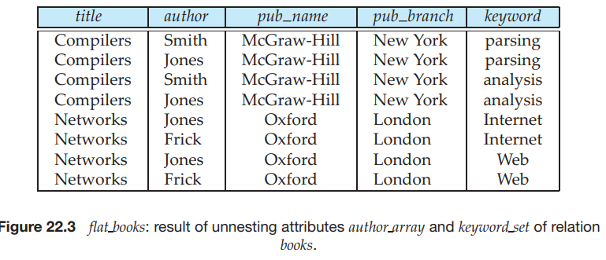
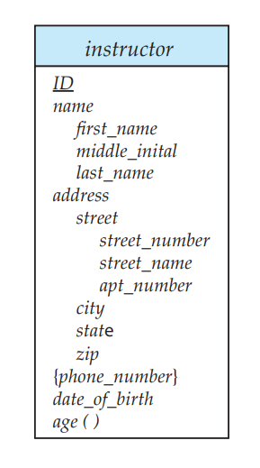

**PART 7**

# SPECIALTY DATABASES

Several application areas for database systems are limited by the restrictions of the relational data model. As a result, researchers have developed several data models based on an object-oriented approach, to deal with these application domains.

The object-relational model, described in Chapter 22, combines features of the relational and object-oriented models. This model provides the rich type system of object-oriented languages, combined with relations as the basis for storage of data. It applies inheritance to relations, not just to types. The object-relational data model provides a smooth migration path from relational databases, which is attractive to relational database vendors. As a result, starting with SQL:1999, the SQL standard includes a number of object-oriented features in its type system, while continuing to use the relational model as the underlying model.

The term object-oriented database is used to describe a database system that supports direct access to data from object-oriented programming languages, with- out requiring a relational query language as the database interface. Chapter 22 also provides a brief overview of object-oriented databases.

The XML language was initially designed as a way of adding markup infor- mation to text documents, but has become important because of its applications in data exchange. XML provides a way to represent data that have nested structure, and furthermore allows a great deal of flexibility in structuring of data, which is important for certain kinds of nontraditional data. Chapter 23 describes the XML language, and then presents different ways of expressing queries on data represented in XML, including the XQuery XML query language, and SQL/XML, an extension of SQL which allows the creation of nested XML output.

 

 

A 
# Object-Based Databases

Traditional database applications consist of data-processing tasks, such as bank- ing and payroll management, with relatively simple data types that are well suited to the relational data model. As database systems were applied to a wider range of applications, such as computer-aided design and geographical informa- tion systems, limitations imposed by the relational model emerged as an obstacle. The solution was the introduction of object-based databases, which allow one to deal with complex data types.

## 22.1 Overview

The first obstacle faced by programmers using the relational data model was the limited type system supported by the relational model. Complex applica- tion domains require correspondingly complex data types, such as nested record structures, multivalued attributes, and inheritance, which are supported by tradi- tional programming languages. Such features are in fact supported in the E-R and extended E-R notations, but had to be translated to simpler SQL data types. The **object-relational data model** extends the relational data model by providing a richer type system including complex data types and object orientation. Relational query languages, in particular SQL, need to be correspondingly extended to deal with the richer type system. Such extensions attempt to preserve the relational foundations—in particular, the declarative access to data—while extending the modeling power. **Object-relational database systems**, that is, database systems based on the object-relation model, provide a convenient migration path for users of relational databases who wish to use object-oriented features.

The second obstacle was the difficulty in accessing database data from pro- grams written in programming languages such as C++ or Java. Merely extending the type system supported by the database was not enough to solve this problem completely. Differences between the type system of the database and the type system of the programming language make data storage and retrieval more com- plicated, and need to be minimized. Having to express database access using a language (SQL) that is different from the programming language again makes the job of the programmer harder. It is desirable, for many applications, to have


programming language constructs or extensions that permit direct access to data in the database, without having to go through an intermediate language such as SQL.

In this chapter, we first explain the motivation for the development of complex data types. We then study object-relational database systems, specifically using features that were introduced in SQL:1999 and SQL:2003. Note that most database products support only a subset of the SQL features described here and for sup- ported features, the syntax often differs slightly from the standard. This is the result of commercial systems introducing object-relational features to the market before the standards were finalized. Refer to the user manual of the database system you use to find out what features it supports.

We then address the issue of supporting persistence for data that is in the native type system of an object-oriented programming language. Two approaches are used in practice:

**1\.** Build an **object-oriented database system**, that is, a database system that natively supports an object-oriented type system, and allows direct access to data from an object-oriented programming language using the native type system of the language.

**2\.** Automatically convert data from the native type system of the programming language to a relational representation, and vice versa. Data conversion is specified using an **object-relational mapping**.

We provide a brief introduction to both these approaches. Finally, we outline situations in which the object-relational approach is bet-

ter than the object-oriented approach, and vice versa, and mention criteria for choosing between them.

## 22.2 Complex Data Types

Traditional database applications have conceptually simple data types. The basic data items are records that are fairly small and whose fields are atomic—that is, they are not further structured, and first normal form holds (see Chapter 8). Further, there are only a few record types.

In recent years, demand has grown for ways to deal with more complex data types. Consider, for example, addresses. While an entire address could be viewed as an atomic data item of type string, this view would hide details such as the street address, city, state, and postal code, which could be of interest to queries. On the other hand, if an address were represented by breaking it into the components (street address, city, state, and postal code), writing queries would be more complicated since they would have to mention each field. A better alternative is to allow structured data types that allow a type address with subparts street address, city, state, and postal code.

As another example, consider multivalued attributes from the E-R model. Such attributes are natural, for example, for representing phone numbers, since people  


|title | author\array| publisher| keyword\set |
| ------ | -------- | -------- | -------- |
| || |(name, branch)|| |
|Compilers| [Smith, Jones]| (McGraw-Hill, NewYork) |{parsing, analysis}| Networks \|[Jones, Frick] (Oxford, London) {Internet, Web}
| Netork | [Jones, Frick]|(Oxford, London) |{Internet, Web}|


**Figure 22.1** Non-1NF books relation, books.

may have more than one phone. The alternative of normalization by creating a new relation is expensive and artificial for this example.

With complex type systems we can represent E-R model concepts, such as composite attributes, multivalued attributes, generalization, and specialization directly, without a complex translation to the relational model.

In Chapter 8, we defined first normal form (1NF), which requires that all at- tributes have atomic domains. Recall that a domain is atomic if elements of the domain are considered to be indivisible units.

The assumption of 1NF is a natural one in the database application examples we have considered. However, not all applications are best modeled by 1NF relations. For example, rather than view a database as a set of records, users of certain applications view it as a set of objects (or entities). These objects may require several records for their representation. A simple, easy-to-use interface requires a one-to-one correspondence between the user’s intuitive notion of an object and the database system’s notion of a data item.

Consider, for example, a library application, and suppose we wish to store the following information for each book:

- Book title.

- List of authors.

- Publisher.

- Set of keywords.

We can see that, if we define a relation for the preceding information, several domains will be nonatomic.

- **Authors**. A book may have a list of authors, which we can represent as an array. Nevertheless, we may want to find all books of which Jones was one of the authors. Thus, we are interested in a subpart of the domain element “authors.”

- **Keywords**. If we store a set of keywords for a book, we expect to be able to retrieve all books whose keywords include one or more specified keywords. Thus, we view the domain of the set of keywords as nonatomic.

- **Publisher**. Unlike keywords and authors, publisher does not have a set-valued domain. However, we may view publisher as consisting of the subfields name and branch. This view makes the domain of publisher nonatomic.

Figure 22.1 shows an example relation, books.  

| title | author | position |
| ----------- | ----------- | -------|
| Compilers | Smith |    1  |
| Compilers | jones |  2 |
| Networks | jones |1|
| Networks | Frick |2|
                          author  

| title| keyword |
| ----------- | ----------- |
|  Compilers| parsing |
| Compilers | analysis |   
| Networks |Internet |
| Networks | Web |
              keywords

| title | pubname |pubbranch|
| ----------- | ----------- |-------|
| Header | Title | New Yock |
| Paragraph | Text | Londan|
                         books4

**Figure 22.2** 4NF version of the relation books.

For simplicity, we assume that the title of a book uniquely identifies the book.1 We can then represent the same information using the following schema, where the primary key attributes are underlined:

- authors(title, author, position)

- keywords(title, keyword)

- books4(title, pub name, pub branch)

The above schema satisfies 4NF. Figure 22.2 shows the normalized representation of the data from Figure 22.1.

Although our example book database can be adequately expressed without using nested relations, the use of nested relations leads to an easier-to-understand model. The typical user or programmer of an information-retrieval system thinks of the database in terms of books having sets of authors, as the non-1NF design models. The 4NF design requires queries to join multiple relations, whereas the non-1NF design makes many types of queries easier.

On the other hand, it may be better to use a first normal form representation in other situations. For instance, consider the takes relationship in our university example. The relationship is many-to-many between student and section. We could

1This assumption does not hold in the real world. Books are usually identified by a 10-digit ISBN number that uniquely identifies each published book.  


conceivably store a set of sections with each student, or a set of students with each section, or both. If we store both, we would have data redundancy (the relationship of a particular student to a particular section would be stored twice).

The ability to use complex data types such as sets and arrays can be useful in many applications but should be used with care.

## 22.3 Structured Types and Inheritance in SQL

Before SQL:1999, the SQL type system consisted of a fairly simple set of predefined types. SQL:1999 added an extensive type system to SQL, allowing structured types and type inheritance.

### 22.3.1 Structured Types

Structured types allow composite attributes of E-R designs to be represented directly. For instance, we can define the following structured type to represent a composite attribute name with component attribute firstname and lastname:
```sql

create type Name as
 (firstname varchar(20),
 lastname varchar(20))
 final;

```

Similarly, the following structured type can be used to represent a composite attribute address:
```sql
create type Address as
 (street varchar(20),
city varchar(20),
zipcode varchar(9)) 
not final;
```
Such types are called **user-defined** types in SQL2. The above definition corre- sponds to the E-R diagram in Figure 7.4. The **final** and **not final** specifications are related to subtyping, which we describe later, in Section 22.3.2.3

We can now use these types to create composite attributes in a relation, by simply declaring an attribute to be of one of these types. For example, we could create a table person as follows:

2To illustrate our earlier note about commercial implementations defining their syntax before the standards were developed, we point out that Oracle requires the keyword **object** following **as**. 3The **final** specification for Name indicates that we cannot create subtypes for name, whereas the **not final** specification for Address indicates that we can create subtypes of address.  

```sql
create table person (
     name Name,
     address Address, 
     dateOfBirth date);
```

The components of a composite attribute can be accessed using a “dot” no- tation; for instance name.firstname returns the firstname component of the name attribute. An access to attribute name would return a value of the structured type Name.

We can also create a table whose rows are of a user-defined type. For example, we could define a type PersonType and create the table person as follows:4

```sql
create type PersonType as ( 
    name Name,
    address Address,
    dateOfBirth date) 
    not final
create table person of PersonType;
```

An alternative way of defining composite attributes in SQL is to use unnamed **row types**. For instance, the relation representing person information could have been created using row types as follows:
```sql
create table person r ( 
    name row (firstname varchar(20),
    lastname varchar(20)), 
    address row (street varchar(20),
    city varchar(20),
    zipcode varchar(9)),
dateOfBirth date);
```
This definition is equivalent to the preceding table definition, except that the attributes name and address have unnamed types, and the rows of the table also have an unnamed type.

The following query illustrates how to access component attributes of a com- posite attribute. The query finds the last name and city of each person.
```sql
select name.lastname, address.city
 from person;
```

A structured type can have **methods** defined on it. We declare methods as part of the type definition of a structured type:

4Most actual systems, being case insensitive, would not permit name to be used both as an attribute name and a data type.  

```sql
create type PersonType as (
     name Name, 
     address Address,
     dateOfBirth date) 
     not final
method ageOnDate(onDate date) returns interval year;
```

We create the method body separately:
```sql
create instance method ageOnDate(onDate date)
returns interval year 
for PersonType
begin
 return onDate − self.dateOfBirth;
end
```
Note that the **for** clause indicates which type this method is for, while the keyword **instance** indicates that this method executes on an instance of the Person type. The variable **self** refers to the Person instance on which the method is invoked. The body of the method can contain procedural statements, which we saw earlier in Section 5.2. Methods can update the attributes of the instance on which they are executed.

Methods can be invoked on instances of a type. If we had created a table person of type PersonType, we could invoke the method ageOnDate() as illustrated below, to find the age of each person.
```sql
select name.lastname, ageOnDate(**current date**) **from** person;
```
In SQL:1999, **constructor functions** are used to create values of structured types. A function with the same name as a structured type is a constructor function for the structured type. For instance, we could declare a constructor for the type Name like this:
```sql
create function Name (firstname varchar(20), lastname varchar(20)) returns Name 
begin
set self.firstname = firstname;
set self.lastname = lastname;
end
```
We can then use **new** Name(’John’, ’Smith’) to create a value of the type Name. We can construct a row value by listing its attributes within parentheses. For instance, if we declare an attribute name as a row type with components firstname  

and lastname we can construct this value for it: (’Ted’, ’Codd’) without using a constructor.

By default every structured type has a constructor with no arguments, which sets the attributes to their default values. Any other constructors have to be created explicitly. There can be more than one constructor for the same structured type; although they have the same name, they must be distinguishable by the number of arguments and types of their arguments.

The following statement illustrates how we can create a new tuple in the Person relation. We assume that a constructor has been defined for Address, just like the constructor we defined for Name.

```sql
insert into Person values

(new Name(’John’, ’Smith’),
 new Address(’20 Main St’, ’New York’, ’11001’), **date** ’1960-8-22’);
```
###  Type Inheritance

Suppose that we have the following type definition for people:

**create type** Person (name **varchar**(20), address **varchar**(20));

We may want to store extra information in the database about people who are students, and about people who are teachers. Since students and teachers are also people, we can use inheritance to define the student and teacher types in SQL:

**create type** Student **under** Person (degree **varchar**(20), department **varchar**(20));

**create type** Teacher **under** Person (salary **integer**, department **varchar**(20));

Both Student and Teacher inherit the attributes of Person—namely, name and address. Student and Teacher are said to be subtypes of Person, and Person is a supertype of Student, as well as of Teacher.

Methods of a structured type are inherited by its subtypes, just as attributes are. However, a subtype can redefine the effect of a method by declaring the method again, using **overriding method** in place of **method** in the method dec- laration.  

### 22.3.3 Structured Types and Inheritance in SQL 953

The SQL standard requires an extra field at the end of the type definition, whose value is either **final** or **not final.** The keyword **final** says that subtypes may not be created from the given type, while **not final** says that subtypes may be created.

Now suppose that we want to store information about teaching assistants, who are simultaneously students and teachers, perhaps even in different depart- ments. We can do this if the type system supports **multiple inheritance**, where a type is declared as a subtype of multiple types. Note that the SQL standard does not support multiple inheritance, although future versions of the SQL standard may support it, so we discuss the concept here.

For instance, if our type system supports multiple inheritance, we can define a type for teaching assistant as follows:

**create type** TeachingAssistant **under** Student, Teacher;

TeachingAssistant inherits all the attributes of Student and Teacher. There is a problem, however, since the attributes name, address, and department are present in Student, as well as in Teacher.

The attributes name and address are actually inherited from a common source, Person. So there is no conflict caused by inheriting them from Student as well as Teacher. However, the attribute department is defined separately in Student and Teacher. In fact, a teaching assistant may be a student of one department and a teacher in another department. To avoid a conflict between the two occurrences of department, we can rename them by using an **as** clause, as in this definition of the type TeachingAssistant:

**create type** TeachingAssistant **under** Student **with** (department **as** student dept),

Teacher **with** (department **as** teacher dept);

In SQL, as in most other languages, a value of a structured type must have ex- actly one most-specific type._ That is, each value must be associated with one specific type, called its **most-specific type**, when it is created. By means of inheritance, it is also associated with each of the supertypes of its most-specific type. For example, suppose that an entity has the type Person, as well as the type Student. Then, the most-specific type of the entity is Student, since Student is a subtype of Person. However, an entity cannot have the type Student as well as the type Teacher unless it has a type, such as TeachingAssistant, that is a subtype of Teacher, as well as of Student (which is not possible in SQL since multiple inheritance is not supported by SQL). 

## 22.4 Table Inheritance

Subtables in SQL correspond to the E-R notion of specialization/generalization. For instance, suppose we define the people table as follows:

**create table** people **of** Person;

We can then define tables students and teachers as **subtables** of people, as follows:

**create table** students **of** Student **under** people;

**create table** teachers **of** Teacher **under** people;

The types of the subtables (Student and Teacher in the above example) are subtypes of the type of the parent table (Person in the above example). As a result, every attribute present in the table people is also present in the subtables students and teachers.

Further, when we declare students and teachers as subtables of people, every tuple present in students or teachers becomes implicitly present in people. Thus, if a query uses the table people, it will find not only tuples directly inserted into that table, but also tuples inserted into its subtables, namely students and teachers. However, only those attributes that are present in people can be accessed by that query.

SQL permits us to find tuples that are in people but not in its subtables by using “**only** people” in place of people in a query. The **only** keyword can also be used in delete and update statements. Without the **only** keyword, a delete statement on a supertable, such as people, also deletes tuples that were originally inserted in subtables (such as students); for example, a statement:

**delete from** people **where** P;

would delete all tuples from the table people, as well as its subtables students and teachers, that satisfy P. If the **only** keyword is added to the above statement, tuples that were inserted in subtables are not affected, even if they satisfy the **where** clause conditions. Subsequent queries on the supertable would continue to find these tuples.

Conceptually, multiple inheritance is possible with tables, just as it is possible with types. For example, we can create a table of type TeachingAssistant:

**create table** teaching assistants **of** TeachingAssistant

**under** students, teachers;  

**22.4 Table Inheritance 955**

As a result of the declaration, every tuple present in the teaching assistants table is also implicitly present in the teachers and in the students table, and in turn in the people table. We note, however, that multiple inheritance of tables is not supported by SQL.

There are some consistency requirements for subtables. Before we state the constraints, we need a definition: we say that tuples in a subtable and parent table **correspond** if they have the same values for all inherited attributes. Thus, corresponding tuples represent the same entity.

The consistency requirements for subtables are:

**1\.** Each tuple of the supertable can correspond to at most one tuple in each of its immediate subtables.

**2\.** SQL has an additional constraint that all the tuples corresponding to each other must be derived from one tuple (inserted into one table).

For example, without the first condition, we could have two tuples in students (or teachers) that correspond to the same person.

The second condition rules out a tuple in people corresponding to both a tuple in students and a tuple in teachers, unless all these tuples are implicitly present because a tuple was inserted in a table teaching assistants, which is a subtable of both teachers and students.

Since SQL does not support multiple inheritance, the second condition actu- ally prevents a person from being both a teacher and a student. Even if multiple inheritance were supported, the same problem would arise if the subtable teaching assistants were absent. Obviously it would be useful to model a situation where

a person can be a teacher and a student, even if a common subtable teaching assistants is not present. Thus, it can be useful to remove the second consis-

tency constraint. Doing so would allow an object to have multiple types, without requiring it to have a most-specific type.

For example, suppose we again have the type Person, with subtypes Student and Teacher, and the corresponding table people, with subtables teachers and stu- dents. We can then have a tuple in teachers and a tuple in students corresponding to the same tuple in people. There is no need to have a type TeachingAssistant that is a subtype of both Student and Teacher. We need not create a type TeachingAssistant unless we wish to store extra attributes or redefine methods in a manner specific to people who are both students and teachers.

We note, however, that SQL unfortunately prohibits such a situation, because of consistency requirement 2. Since SQL also does not support multiple inheri- tance, we cannot use inheritance to model a situation where a person can be both a student and a teacher. As a result, SQL subtables cannot be used to represent overlapping specializations from the E-R model.

We can of course create separate tables to represent the overlapping special- izations/generalizations without using inheritance. The process was described earlier, in Section 7.8.6.1. In the above example, we would create tables people, stu- dents, and teachers, with the students and teachers tables containing the primary-key  

**956 Chapter 22 Object-Based Databases**

attribute of Person and other attributes specific to Student and Teacher, respectively. The people table would contain information about all persons, including students and teachers. We would then have to add appropriate referential-integrity constraints to ensure that students and teachers are also represented in the people table.

In other words, we can create our own improved implementation of the subtable mechanism using existing features of SQL, with some extra effort in defining the table, as well as some extra effort at query time to specify joins to access required attributes.

We note that SQL defines a privilege called **under**, which is required in order to create a subtype or subtable under another type or table. The motivation for this privilege is similar to that for the **references** privilege.

## 22.5 Array and Multiset Types in SQL

SQL supports two collection types: arrays and multisets; array types were added in SQL:1999, while multiset types were added in SQL:2003. Recall that a multiset is an unordered collection, where an element may occur multiple times. Multisets are like sets, except that a set allows each element to occur at most once.

Suppose we wish to record information about books, including a set of key- words for each book. Suppose also that we wished to store the names of authors of a book as an array; unlike elements in a multiset, the elements of an array are ordered, so we can distinguish the first author from the second author, and so on. The following example illustrates how these array and multiset-valued attributes can be defined in SQL:
```sql
create type Publisher as 
(name varchar(20),
 branch varchar(20));

create type Book as 
(title varchar(20),
 author array varchar(20) array [10],
pub date date, 
publisher Publisher, keyword set varchar(20) multiset);

create table books of Book;
```
The first statement defines a type called Publisher with two components: a name and a branch. The second statement defines a structured type Book that contains a title, an author array, which is an array of up to 10 author names, a publication date, a publisher (of type Publisher), and a multiset of keywords. Finally, a table books containing tuples of type Book is created.  

Note that we used an array, instead of a multiset, to store the names of authors, since the ordering of authors generally has some significance, whereas we believe that the ordering of keywords associated with a book is not significant.

In general, multivalued attributes from an E-R schema can be mapped to multiset-valued attributes in SQL; if ordering is important, SQL arrays can be used instead of multisets.

### 22.5.1 Creating and Accessing Collection Values

An array of values can be created in SQL:1999 in this way:

```SQL
array[’Silberschatz’, ’Korth’, ’Sudarshan’]

Similarly, a multiset of keywords can be constructed as follows:

multiset[’computer’, ’database’, ’SQL’]

Thus, we can create a tuple of the type defined by the books relation as:

(’Compilers’, **array**[’Smith’, ’Jones’], new Publisher(’McGraw-Hill’, ’New York’), multiset[’parsing’, ’analysis’])
```
Here we have created a value for the attribute Publisher by invoking a constructor function for Publisher with appropriate arguments. Note that this constructor for Publisher must be created explicitly, and is not present by default; it can be declared just like the constructor for Name, which we saw earlier in Section 22.3.

If we want to insert the preceding tuple into the relation books, we could execute the statement:

```SQL
insert into books 
values (’Compilers’, array[’Smith’, ’Jones’],

new Publisher(’McGraw-Hill’, ’New York’), multiset[’parsing’, ’analysis’]);
```
We can access or update elements of an array by specifying the array index, for example author array[1].

### 22.5.2 Querying Collection-Valued Attributes

We now consider how to handle collection-valued attributes in queries. An ex- pression evaluating to a collection can appear anywhere that a relation name may appear, such as in a **from** clause, as the following paragraphs illustrate. We use the table books that we defined earlier.

If we want to find all books that have the word “database” as one of their keywords, we can use this query:  

```SQL
select title 
from books 
where ’database’ in (unnest(keyword set));
```
Note that we have used **unnest**(keyword set) in a position where SQL without nested relations would have required a 


**select**\-**from**\-**where** subexpression.

If we know that a particular book has three authors, we could write:

```SQL
select author array[1], author array[2], author array[3] 
from books 
where title = ’Database System Concepts’;
```

Now, suppose that we want a relation containing pairs of the form “title, author name” for each book and each author of the book. We can use this query:
```SQL
select B.title, A.author from books as B, 
unnest(B.author array) as A(author);
```
Since the author array attribute of books is a collection-valued field, **unnest**(B.author array) can be used in a **from** clause, where a relation is expected. Note that the

tuple variable B is visible to this expression since it is defined earlier in the **from** clause.

When unnesting an array, the previous query loses information about the ordering of elements in the array. The **unnest with ordinality** clause can be used to get this information, as illustrated by the following query. This query can be used to generate the authors relation, which we saw earlier, from the books relation.
```SQL
select title, A.author, A.position from books as B,

unnest(B.author array) with ordinality as A(author, position);
```
The **with ordinality** clause generates an extra attribute which records the po- sition of the element in the array. A similar query, but without the **with ordinality** clause, can be used to generate the keyword relation.

### 22.5.3 Nesting and Unnesting

The transformation of a nested relation into a form with fewer (or no) relationvalued attributes is called **unnesting**. The books relation has two attributes, author array and keyword set, that are collections, and two attributes, title and publisher,

that are not. Suppose that we want to convert the relation into a single flat relation, with no nested relations or structured types as attributes. We can use the following query to carry out the task:  

**22.5 Array and Multiset Types in SQL 959**

title author pub\name pub\branch keyword Compilers Smith McGraw-Hill New York parsing Compilers Jones McGraw-Hill New York parsing Compilers Smith McGraw-Hill New York analysis Compilers Jones McGraw-Hill New York analysis Networks Jones Oxford London Internet Networks Frick Oxford London Internet Networks Jones Oxford London Web Networks Frick Oxford London Web

```SQL
select title, A.author, publisher.name as pubname, publisher.branch
 as pub branch, K.keyword
from books as B, unnest(B.author array) aS(author), unnest (B.keyword set) as K(keyword);
```
The variable B in the **from** clause is declared to range over books. The variable A is declared to range over the authors in author array for the book B, and K is declared to range over the keywords in the keyword set of the book B. Figure 22.1 shows an instance books relation, and Figure 22.3 shows the relation, which we call flat books, that is the result of the preceding query. Note that the relation flat books is in 1NF, since all its attributes are atomic valued.

The reverse process of transforming a 1NF relation into a nested relation is called **nesting**. Nesting can be carried out by an extension of grouping in SQL. In the normal use of grouping in SQL, a temporary multiset relation is (logically) created for each group, and an aggregate function is applied on the temporary relation to get a single (atomic) value. The **collect** function returns the multiset of values, so instead of creating a single value, we can create a nested relation. Suppose that we are given the 1NF relation flat books, as in Figure 22.3. The following query nests the relation on the attribute keyword:
```SQL
select title, author, Publisher(pub name, pub branch) as publisher, collect(keyword) as keyword set

from flat-books group by title, author, publisher;
```
The result of the query on the flat books relation from Figure 22.3 appears in Figure 22.4.

If we want to nest the author attribute also into a multiset, we can use the query:  


**select** title, **collect**(author) **as** author set, Publisher(pub name, pub branch) **as** publisher,

**collect**(keyword) **as** keyword set **from** flat books **group by** title, publisher;

Another approach to creating nested relations is to use subqueries in the **select** clause. An advantage of the subquery approach is that an **order by** clause can be used in the subquery to generate results in the order desired for the creation of an array. The following query illustrates this approach; the keywords **array** and **multiset** specify that an array and multiset (respectively) are to be created from the results of the subqueries.
~~~sql
**select** title, **array**( **select** author

**from** authors **as** A **where** A.title \= B.title **order by** A.position) **as** author array,

Publisher(pub name, pub branch) **as** publisher, **multiset**( **select** keyword

**from** keywords **as** K **where** K.title \= B.title) **as** keyword set,

**from** books4 **as** B;
~~~
The system executes the nested subqueries in the **select** clause for each tuple generated by the **from** and **where** clauses of the outer query. Observe that the attribute B.title from the outer query is used in the nested queries, to ensure that only the correct sets of authors and keywords are generated for each title.

SQL:2003 provides a variety of operators on multisets, including a function **set**(M) that returns a duplicate-free version of a multiset M, an **intersection** aggregate operation, which returns the intersection of all the multisets in a group, a **fusion** aggregate operation, which returns the union of all multisets in a group, and a **submultiset** predicate, which checks if a multiset is contained in another multiset.  

## 22.6 Object-Identity and Reference Types in SQL

The SQL standard does not provide any way to update multiset attributes except by assigning a new value. For example, to delete a value v from a multiset attribute A, we would have to set it to (A **except all multiset**[v]).

Object-oriented languages provide the ability to refer to objects. An attribute of a type can be a reference to an object of a specified type. For example, in SQL we can define a type Department with a field name and a field head that is a reference to the type Person, and a table departments of type Department, as follows:

**create type** Department ( name **varchar(20)**, head **ref**(Person) **scope** people);

**create table** departments **of** Department;

Here, the reference is restricted to tuples of the table people. The restriction of the **scope** of a reference to tuples of a table is mandatory in SQL, and it makes references behave like foreign keys.

We can omit the declaration **scope** people from the type declaration and instead make an addition to the **create table** statement:

**create table** departments **of** Department (head **with options scope** people);

The referenced table must have an attribute that stores the identifier of the tuple. We declare this attribute, called the **self-referential attribute**, by adding a **ref is** clause to the **create table** statement:

**create table** people **of** Person **ref is** person id **system generated**;

Here, person id is an attribute name, not a keyword, and the **create table** statement specifies that the identifier is generated automatically by the database.

In order to initialize a reference attribute, we need to get the identifier of the tuple that is to be referenced. We can get the identifier value of a tuple by means of a query. Thus, to create a tuple with the reference value, we may first create the tuple with a null reference and then set the reference separately:  

**962 Chapter 22 Object-Based Databases**

**insert into** departments **values** (’CS’, null);

**update** departments **set** head \= (**select** p.person id

**from** people **as** p **where** name \= ’John’)

**where** name \= ’CS’;

An alternative to system-generated identifiers is to allow users to generate identifiers. The type of the self-referential attribute must be specified as part of the type definition of the referenced table, and the table definition must specify that the reference is **user generated**:

**create type** Person (name **varchar**(20), address **varchar**(20))

**ref using varchar**(20);

**create table** people **of** Person **ref is** person id **user generated**;

When inserting a tuple in people, we must then provide a value for the identifier:

**insert into** people (person id, name, address) **values** (’01284567’, ’John’, ’23 Coyote Run’);

No other tuple for people or its supertables or subtables can have the same identifier. We can then use the identifier value when inserting a tuple into depart- ments, without the need for a separate query to retrieve the identifier:

**insert into** departments **values** (’CS’, ’01284567’);

It is even possible to use an existing primary-key value as the identifier, by including the **ref from** clause in the type definition:

**create type** Person (name **varchar**(20) **primary key**, address **varchar**(20))

**ref from**(name);

**create table** people **of** Person **ref is** person id **derived**;  

Note that the table definition must specify that the reference is derived, and must still specify a self-referential attribute name. When inserting a tuple for departments, we can then use:

**insert into** departments **values** (’CS’, ’John’);

References are dereferenced in SQL:1999 by the −> symbol. Consider the departments table defined earlier. We can use this query to find the names and addresses of the heads of all departments:

**select** head−>name, head−>address **from** departments;

An expression such as “head−>name” is called a **path expression**. Since head is a reference to a tuple in the people table, the attribute name

in the preceding query is the name attribute of the tuple from the people table. References can be used to hide join operations; in the preceding example, without the references, the head field of department would be declared a foreign key of the table people. To find the name and address of the head of a department, we would require an explicit join of the relations departments and people. The use of references simplifies the query considerably.

We can use the operation **deref** to return the tuple pointed to by a reference, and then access its attributes, as shown below:

**select deref**(head).name **from** departments;

## 22.7 Implementing O-R Features

Object-relational database systems are basically extensions of existing relational database systems. Changes are clearly required at many levels of the database system. However, to minimize changes to the storage-system code (relation stor- age, indices, etc.), the complex data types supported by object-relational systems can be translated to the simpler type system of relational databases.

To understand how to do this translation, we need look only at how some features of the E-R model are translated into relations. For instance, multivalued attributes in the E-R model correspond to multiset-valued attributes in the object- relational model. Composite attributes roughly correspond to structured types. ISA hierarchies in the E-R model correspond to table inheritance in the object- relational model.

The techniques for converting E-R model features to tables, which we saw in Section 7.6, can be used, with some extensions, to translate object-relational data to relational data at the storage level.  


Subtables can be stored in an efficient manner, without replication of all inherited fields, in one of two ways:

- Each table stores the primary key (which may be inherited from a parent table) and the attributes that are defined locally. Inherited attributes (other than the primary key) do not need to be stored, and can be derived by means of a join with the supertable, based on the primary key.

- Each table stores all inherited and locally defined attributes. When a tuple is inserted, it is stored only in the table in which it is inserted, and its presence is inferred in each of the supertables. Access to all attributes of a tuple is faster, since a join is not required.

However, in case the type system allows an entity to be represented in two subtables without being present in a common subtable of both, this representation can result in replication of information. Further, it is hard to translate foreign keys referring to a supertable into constraints on the subtables; to implement such foreign keys efficiently, the supertable has to be defined as a view, and the database system would have to support foreign keys on views.

Implementations may choose to represent array and multiset types directly, or may choose to use a normalized representation internally. Normalized repre- sentations tend to take up more space and require an extra join/grouping cost to collect data in an array or multiset. However, normalized representations may be easier to implement.

The ODBC and JDBC application program interfaces have been extended to retrieve and store structured types. JDBC provides a method getObject() that is similar to getString() but returns a Java Struct object, from which the components of the structured type can be extracted. It is also possible to associate a Java class with an SQL structured type, and JDBC will then convert between the types. See the ODBC or JDBC reference manuals for details.

## 22.8 Persistent Programming Languages

Database languages differ from traditional programming languages in that they directly manipulate data that are persistent—that is, data that continue to exist even after the program that created it has terminated. A relation in a database and tuples in a relation are examples of persistent data. In contrast, the only persistent data that traditional programming languages directly manipulate are files.

Access to a database is only one component of any real-world application. While a data-manipulation language like SQL is quite effective for accessing data, a programming language is required for implementing other components of the application such as user interfaces or communication with other computers. The traditional way of interfacing database languages to programming languages is by embedding SQL within the programming language.  

A **persistent programming language** is a programming language extended with constructs to handle persistent data. Persistent programming languages can be distinguished from languages with embedded SQL in at least two ways:

**1\.** With an embedded language, the type system of the host language usually differs from the type system of the data-manipulation language. The pro- grammer is responsible for any type conversions between the host language and SQL. Having the programmer carry out this task has several drawbacks:

- The code to convert between objects and tuples operates outside the object-oriented type system, and hence has a higher chance of having undetected errors.

- Conversion between the object-oriented format and the relational for- mat of tuples in the database takes a substantial amount of code. The format translation code, along with the code for loading and unloading data from a database, can form a significant percentage of the total code required for an application.

In contrast, in a persistent programming language, the query language is fully integrated with the host language, and both share the same type sys- tem. Objects can be created and stored in the database without any explicit type or format changes; any format changes required are carried out trans- parently.

**2\.** The programmer using an embedded query language is responsible for writing explicit code to fetch data from the database into memory. If any updates are performed, the programmer must write code explicitly to store the updated data back in the database.

In contrast, in a persistent programming language, the programmer can manipulate persistent data without writing code explicitly to fetch it into memory or store it back to disk.

In this section, we describe how object-oriented programming languages, such as C++ and Java, can be extended to make them persistent programming languages. These language features allow programmers to manipulate data di- rectly from the programming language, without having to go through a data- manipulation language such as SQL. They thereby provide tighter integration of the programming languages with the database than, for example, embedded SQL.

There are certain drawbacks to persistent programming languages, how- ever, that we must keep in mind when deciding whether to use them. Since the programming language is usually a powerful one, it is relatively easy to make programming errors that damage the database. The complexity of the language makes automatic high-level optimization, such as to reduce disk I/O, harder. Sup- port for declarative querying is important for many applications, but persistent programming languages currently do not support declarative querying well.

In this section, we describe a number of conceptual issues that must be ad- dressed when adding persistence to an existing programming language. We first  

**9Object-Based Databases**

address language-independent issues, and in subsequent sections we discuss is- sues that are specific to the C++ language and to the Java language. However, we do not cover details of language extensions; although several standards have been proposed, none has met universal acceptance. See the references in the bib- liographical notes to learn more about specific language extensions and further details of implementations.

### 22.8.1 Persistence of Objects

Object-oriented programming languages already have a concept of objects, a type system to define object types, and constructs to create objects. However, these objects are transient—they vanish when the program terminates, just as variables in a Java or C program vanish when the program terminates. If we wish to turn such a language into a database programming language, the first step is to provide a way to make objects persistent. Several approaches have been proposed.

- **Persistence by class**. The simplest, but least convenient, way is to declare that a class is persistent. All objects of the class are then persistent objects by default. Objects of nonpersistent classes are all transient.

This approach is not flexible, since it is often useful to have both transient and persistent objects in a single class. Many object-oriented database systems interpret declaring a class to be persistent as saying that objects in the class potentially can be made persistent, rather than that all objects in the class are persistent. Such classes might more appropriately be called “persistable” classes.

- **Persistence by creation**. In this approach, new syntax is introduced to create persistent objects, by extending the syntax for creating transient objects. Thus, an object is either persistent or transient, depending on how it was created. Several object-oriented database systems follow this approach.

- **Persistence by marking**. A variant of the preceding approach is to mark objects as persistent after they are created. All objects are created as transient objects, but, if an object is to persist beyond the execution of the program, it must be marked explicitly as persistent before the program terminates. This approach, unlike the previous one, postpones the decision on persistence or transience until after the object is created.

- **Persistence by reachability**. One or more objects are explicitly declared as (root) persistent objects. All other objects are persistent if (and only if) they are reachable from the root object through a sequence of one or more references.

Thus, all objects referenced by (that is, whose object identifiers are stored in) the root persistent objects are persistent. But also, all objects referenced from these objects are persistent, and objects to which they refer are in turn persistent, and so on.

A benefit of this scheme is that it is easy to make entire data structures persistent by merely declaring the root of such structures as persistent. How-  

ever, the database system has the burden of following chains of references to detect which objects are persistent, and that can be expensive.

### 22.8.2 Object Identity and Pointers

In an object-oriented programming language that has not been extended to handle persistence, when an object is created, the system returns a transient object identifier. Transient object identifiers are valid only when the program that cre- ated them is executing; after that program terminates, the objects are deleted, and the identifier is meaningless. When a persistent object is created, it is assigned a persistent object identifier.

The notion of object identity has an interesting relationship to pointers in programming languages. A simple way to achieve built-in identity is through pointers to physical locations in storage. In particular, in many object-oriented languages such as C++, a transient object identifier is actually an in-memory pointer.

However, the association of an object with a physical location in storage may change over time. There are several degrees of permanence of identity:

- **Intraprocedure**. Identity persists only during the execution of a single pro- cedure. Examples of intraprogram identity are local variables within proce- dures.

- **Intraprogram**. Identity persists only during the execution of a single pro- gram or query. Examples of intraprogram identity are global variables in programming languages. Main-memory or virtual-memory pointers offer only intraprogram identity.

- **Interprogram**. Identity persists from one program execution to another. Pointers to file-system data on disk offer interprogram identity, but they may change if the way data is stored in the file system is changed.

- **Persistent**. Identity persists not only among program executions, but also among structural reorganizations of the data. It is the persistent form of identity that is required for object-oriented systems.

In persistent extensions of languages such as C++, object identifiers for per- sistent objects are implemented as “persistent pointers.” A persistent pointer is a type of pointer that, unlike in-memory pointers, remains valid even after the end of a program execution, and across some forms of data reorganization. A programmer may use a persistent pointer in the same ways that she may use an in-memory pointer in a programming language. Conceptually, we may think of a persistent pointer as a pointer to an object in the database.

### 22.8.3 Storage and Access of Persistent Objects

What does it mean to store an object in a database? Clearly, the data part of an object has to be stored individually for each object. Logically, the code that  

implements methods of a class should be stored in the database as part of the database schema, along with the type definitions of the classes. However, many implementations simply store the code in files outside the database, to avoid having to integrate system software such as compilers with the database system.

There are several ways to find objects in the database. One way is to give names to objects, just as we give names to files. This approach works for a rela- tively small number of objects, but does not scale to millions of objects. A second way is to expose object identifiers or persistent pointers to the objects, which can be stored externally. Unlike names, these pointers do not have to be mnemonic, and they can even be physical pointers into a database.

A third way is to store collections of objects, and to allow programs to iterate over the collections to find required objects. Collections of objects can themselves be modeled as objects of a collection type. Collection types include sets, multisets (that is, sets with possibly many occurrences of a value), lists, and so on. A special case of a collection is a **class extent**, which is the collection of all objects belonging to the class. If a class extent is present for a class, then, whenever an object of the class is created, that object is inserted in the class extent automatically, and, whenever an object is deleted, that object is removed from the class extent. Class extents allow classes to be treated like relations in that we can examine all objects in the class, just as we can examine all tuples in a relation.

Most object-oriented database systems support all three ways of accessing persistent objects. They give identifiers to all objects. They usually give names only to class extents and other collection objects, and perhaps to other selected objects, but not to most objects. They usually maintain class extents for all classes that can have persistent objects, but, in many of the implementations, the class extents contain only persistent objects of the class.

### 22.8.4 Persistent C++ Systems

There are several object-oriented databases based on persistent extensions to C++ (see the bibliographical notes). There are differences among them in terms of the system architecture, yet they have many common features in terms of the programming language.

Several of the object-oriented features of the C++ language provide support for persistence without changing the language itself. For example, we can de- clare a class called Persistent Object with attributes and methods to support persistence; any other class that should be persistent can be made a subclass of this class, and thereby inherit the support for persistence. The C++ language (like some other modern programming languages) also lets us redefine standard func- tion names and operators—such as +, −, the pointer dereference operator −>, and so on—according to the types of the operands on which they are applied. This ability is called overloading; it is used to redefine operators to behave in the required manner when they are operating on persistent objects.

Providing persistence support via class libraries has the benefit of making only minimal changes to C++ necessary; moreover, it is relatively easy to implement. However, it has the drawback that the programmer has to spend much more  

**22.8 Persistent Programming Languages 969**

time to write a program that handles persistent objects, and it is not easy for the programmer to specify integrity constraints on the schema or to provide support for declarative querying. Some persistent C++ implementations support extensions to the C++ syntax to make these tasks easier.

The following aspects need to be addressed when adding persistence support to C++ (and other languages):

- **Persistent pointers**: A new data type has to be defined to represent persistent pointers. For example, the ODMG C++ standard defines a template class d Ref< T >_ to represent persistent pointers to a class T . The dereference operator on this class is redefined to fetch the object from disk (if not already present in memory), and it returns an in-memory pointer to the buffer where the object has been fetched. Thus if p is a persistent pointer to a class T , one can use standard syntax such as p−>A or p−>f(v) to access attribute A of class T or invoke method f of class T .

The ObjectStore database system uses a different approach to persistent pointers. It uses normal pointer types to store persistent pointers. This poses two problems: (1) in-memory pointer sizes may be only 4 bytes, which is too small to use with databases larger than 4 gigabytes, and (2) when an object is moved on disk, in-memory pointers to its old physical location are meaningless. ObjectStore uses a technique called “hardware swizzling” to address both problems; it prefetches objects from the database into memory, and replaces persistent pointers with in-memory pointers, and when data are stored back on disk, in-memory pointers are replaced by persistent pointers. When on disk, the value stored in the in-memory pointer field is not the actual persistent pointer; instead, the value is looked up in a table that contains the full persistent pointer value.

- **Creation of persistent objects**: The C++ new operator is used to create per- sistent objects by defining an “overloaded” version of the operator that takes extra arguments specifying that it should be created in the database. Thus instead of new T(), one would call new (db) T() to create a persistent object, where db identifies the database.

- **Class extents**: Class extents are created and maintained automatically for each class. The ODMG C++ standard requires the name of the class to be passed as an additional parameter to the new operation. This also allows multiple extents to be maintained for a class, by passing different names.

- **Relationships**: Relationships between classes are often represented by stor- ing pointers from each object to the objects to which it is related. Objects related to multiple objects of a given class store a set of pointers. Thus if a pair of objects is in a relationship, each should store a pointer to the other. Persistent C++ systems provide a way to specify such integrity constraints and to enforce them by automatically creating and deleting pointers: For ex- ample, if a pointer is created from an object a to an object b, a pointer to a is added automatically to object b.  


- **Iterator interface**: Since programs need to iterate over class members, an interface is required to iterate over members of a class extent. The iterator interface also allows selections to be specified, so that only objects satisfying the selection predicate need to be fetched.

- **Transactions**: Persistent C++ systems provide support for starting a transac- tion, and for committing it or rolling it back.

- **Updates**: One of the goals of providing persistence support in a programming language is to allow transparent persistence. That is, a function that operates on an object should not need to know that the object is persistent; the same functions can thus be used on objects regardless of whether they are persistent or not.

However, one resultant problem is that it is difficult to detect when an object has been updated. Some persistent extensions to C++ require the programmer to specify explicitly that an object has been modified by calling a function mark modified(). In addition to increasing programmer effort, this approach increases the chance that programming errors can result in a corrupt database. If a programmer omits a call to mark modified(), it is possible that one update made by a transaction may never be propagated to the database, while another update made by the same transaction is propagated, violating atomicity of transactions.

Other systems, such as ObjectStore, use memory-protection support provided by the operating system/hardware to detect writes to a block of memory and mark the block as a dirty block that should be written later to disk.

- **Query language**: Iterators provide support for simple selection queries. To support more complex queries, persistent C++ systems define a query language.

A large number of object-oriented database systems based on C++ were de- veloped in the late 1980s and early 1990s. However, the market for such databases turned out to be much smaller than anticipated, since most application require- ments are more than met by using SQL through interfaces such as ODBC or JDBC. As a result, most of the object-oriented database systems developed in that pe- riod do not exist any longer. In the 1990s, the Object Data Management Group (ODMG) defined standards for adding persistence to C++ and Java. However, the group wound up its activities around 2002. ObjectStore and Versant are among the original object-oriented database systems that are still in existence.

Although object-oriented database systems did not find the commercial suc- cess that they had hoped for, the motivation for adding persistence to program- ming language remains. There are several applications with high performance requirements that run on object-oriented database systems; using SQL would impose too high a performance overhead for many such systems. With object- relational database systems now providing support for complex data types, including references, it is easier to store programming language objects in an SQL  


database. A new generation of object-oriented database systems using object- relational databases as a backend may yet emerge.

### 22.8.5 Persistent Java Systems

The Java language has seen an enormous growth in usage in recent years. Demand for support for persistence of data in Java programs has grown correspondingly. Initial attempts at creating a standard for persistence in Java were led by the ODMG consortium; the consortium wound up its efforts later, but transferred its design to the **Java Database Objects** (**JDO**) effort, which is coordinated by Sun Microsystems.

The JDO model for object persistence in Java programs differs from the model for persistence support in C++ programs. Among its features are:

- **Persistence by reachability**: Objects are not explicitly created in a database. Explicitly registering an object as persistent (using the makePersistent() method of the PersistenceManager class) makes the object persistent. In addition, any object reachable from a persistent object becomes persistent.

- **Byte code enhancement**: Instead of declaring a class to be persistent in the Java code, classes whose objects may be made persistent are specified in a configuration file (with suffix .jdo). An implementation-specific enhancer program is executed that reads the configuration file and carries out two tasks. First, it may create structures in a database to store objects of the class. Second, it modifies the byte code (generated by compiling the Java program) to handle tasks related to persistence. Below are some examples of such modifications:

◦ Any code that accesses an object could be changed to check first if the object is in memory, and if not, take steps to bring it into memory.

◦ Any code that modifies an object is modified to record additionally that the object has been modified, and perhaps to save a pre-updated value used in case the update needs to be undone (that is, if the transaction is rolled back).

Other modifications to the byte code may also be carried out. Such byte code modification is possible since the byte code is standard across all platforms, and includes much more information than compiled object code.

- **Database mapping**: JDO does not define how data are stored in the back-end database. For example, a common scenario is to store objects in a relational database. The enhancer program may create an appropriate schema in the database to store class objects. How exactly it does this is implementation dependent and not defined by JDO. Some attributes could be mapped to relational attributes, while others may be stored in a serialized form, treated as a binary object by the database. JDO implementations may allow existing relational data to be viewed as objects by defining an appropriate mapping.  


- **Class extents**: Class extents are created and maintained automatically for each class declared to be persistent. All objects made persistent are added automatically to the class extent corresponding to their class. JDO programs may access a class extent, and iterate over selected members. The Iterator interface provided by Java can be used to create iterators on class extents, and to step through the members of the class extent. JDO also allows selections to be specified when an iterator is created on a class extent, and only objects satisfying the selection are fetched.

- **Single reference type**: There is no difference in type between a reference to a transient object and a reference to a persistent object.

One approach to achieving such a unification of pointer types would be to load the entire database into memory, replacing all persistent pointers with in-memory pointers. After updates were done, the process would be reversed, storing updated objects back on disk. Such an approach would be very inefficient for large databases.

We now describe an alternative approach that allows persistent objects to be fetched automatically into memory when required, while allowing all references contained in in-memory objects to be in-memory references. When an object A is fetched, a **hollow object** is created for each object Bi that it references, and the in-memory copy of A has references to the corresponding hollow object for each Bi . Of course the system has to ensure that if an object Bi was fetched already, the reference points to the already fetched object instead of creating a new hollow object. Similarly, if an object Bi has not been fetched, but is referenced by another object fetched earlier, it would already have a hollow object created for it; the reference to the existing hollow object is reused, instead of creating a new hollow object.

Thus, for every object Oi that has been fetched, every reference from Oi is either to an already fetched object or to a hollow object. The hollow objects form a fringe surrounding fetched objects.

Whenever the program actually accesses a hollow object O, the enhanced byte code detects this and fetches the object from the database. When this object is fetched, the same process of creating hollow objects is carried out for all objects referenced by O. After this the access to the object is allowed to proceed.5

An in-memory index structure mapping persistent pointers to in-memory references is required to implement this scheme. In writing objects back to disk, this index would be used to replace in-memory references with persis- tent pointers in the copy written to disk.

5The technique using hollow objects described above is closely related to the hardware swizzling technique (mentioned earlier in Section 22.8.4). Hardware swizzling is used by some persistent C++ implementations to provide a single pointer type for persistent and in-memory pointers. Hardware swizzling uses virtual-memory protection techniques provided by the operating system to detect accesses to pages, and fetches the pages from the database when required. In contrast, the Java version modifies byte code to check for hollow objects, instead of using memory protection, and fetches objects when required, instead of fetching whole pages from the database.  

## 22.9 Object-Relational Mapping

So far we have seen two approaches to integrating object-oriented data models and programming languages with database systems. **Object-relational mapping** systems provide a third approach to integration of object-oriented programming languages and databases.

Object-relational mapping systems are built on top of a traditional rela- tional database, and allow a programmer to define a mapping between tuples in database relations and objects in the programming language. Unlike in per- sistent programming languages, objects are transient, and there is no permanent object identity.

An object, or a set of objects, can be retrieved based on a selection condition on its attributes; relevant data are retrieved from the underlying database based on the selection conditions, and one or more objects are created from the retrieved data, based on the prespecified mapping between objects and relations. The pro- gram can optionally update such objects, create new objects, or specify that an object is to be deleted, and then issue a save command; the mapping from objects to relations is then used to correspondingly update, insert or delete tuples in the database.

Object-relational mapping systems in general, and in particular the widely used Hibernate system which provides an object-relational mapping to Java, are described in more detail in Section 9.4.2.

The primary goal of object-relational mapping systems is to ease the job of programmers who build applications, by providing them an object-model, while retaining the benefits of using a robust relational database underneath. As an added benefit, when operating on objects cached in memory, object-relational systems can provide significant performance gains over direct access to the underlying database.

Object-relational mapping systems also provide query languages that allow programmers to write queries directly on the object model; such queries are translated into SQL queries on the underlying relational database, and result objects created from the SQL query results.

On the negative side, object-relational mapping systems can suffer from sig- nificant overheads for bulk database updates, and may provide only limited querying capabilities. However, it is possible to directly update the database, bypassing the object-relational mapping system, and to write complex queries directly in SQL. The benefits or object-relational models exceed the drawbacks for many applications, and object-relational mapping systems have seen widespread adoption in recent years.

## 22.10 Object-Oriented versus Object-Relational

We have now studied object-relational databases, which are object-oriented data- bases built on top of the relation model, as well as object-oriented databases, which are built around persistent programming languages, and object-relational  

**974 Chapter 22 Object-Based Databases**

mapping systems, which build an object layer on top of a traditional relational database.

Each of these approaches targets a different market. The declarative nature and limited power (compared to a programming language) of the SQL language provides good protection of data from programming errors, and makes high-level optimizations, such as reducing I/O, relatively easy. (We covered optimization of relational expressions in Chapter 13.) Object-relational systems aim at making data modeling and querying easier by using complex data types. Typical ap- plications include storage and querying of complex data, including multimedia data.

A declarative language such as SQL, however, imposes a significant perfor- mance penalty for certain kinds of applications that run primarily in main mem- ory, and that perform a large number of accesses to the database. Persistent programming languages target such applications that have high performance re- quirements. They provide low-overhead access to persistent data and eliminate the need for data translation if the data are to be manipulated by a programming language. However, they are more susceptible to data corruption by program- ming errors, and they usually do not have a powerful querying capability. Typical applications include CAD databases.

Object-relational mapping systems allow programmers to build applications using an object model, while using a traditional database system to store the data. Thus, they combine the robustness of widely used relational database systems, with the power of object models for writing applications. However, they suffer from overheads of data conversion between the object model and the relational model used to store data.

We can summarize the strengths of the various kinds of database systems in this way:

- **Relational systems**: Simple data types, powerful query languages, high pro- tection.

- **Persistent programming language–based OODBs**: Complex data types, integration with programming language, high performance.

- **Object-relational systems**: Complex data types, powerful query languages, high protection.

- **Object-relational mapping systems**: Complex data types integrated with programming languages, designed as a layer on top of a relational database system.

These descriptions hold in general, but keep in mind that some database systems blur the boundaries. For example, object-oriented database systems built around a persistent programming language can be implemented on top of a relational or object-relational database system. Such systems may provide lower performance than object-oriented database systems built directly on a storage system, but provide some of the stronger protection guarantees of relational systems.  


## 22.11 Summary

- The object-relational data model extends the relational data model by pro- viding a richer type system including collection types and object orientation.

- Collection types include nested relations, sets, multisets, and arrays, and the object-relational model permits attributes of a table to be collections.

- Object orientation provides inheritance with subtypes and subtables, as well as object (tuple) references.

- The SQL standard includes extensions of the SQL data-definition and query language to deal with new data types and with object orientation. These include support for collection-valued attributes, inheritance, and tuple ref- erences. Such extensions attempt to preserve the relational foundations— in particular, the declarative access to data—while extending the modeling power.

- Object-relational database systems (that is, database systems based on the object-relation model) provide a convenient migration path for users of rela- tional databases who wish to use object-oriented features.

- Persistent extensions to C++ and Java integrate persistence seamlessly and orthogonally with existing programming language constructs and so are easy to use.

- The ODMG standard defines classes and other constructs for creating and ac- cessing persistent objects from C++, while the JDO standard provides equiv- alent functionality for Java.

- Object-relational mapping systems provide an object view of data that is stored in a relational database. Objects are transient, and there is no notion of persistent object identity. Objects are created on-demand from relational data, and updates to objects are implemented by updating the relational data. Object-relational mapping systems have been widely adopted, unlike the more limited adoption of persistent programming languages.

- We discussed differences between persistent programming languages and object-relational systems, and we mention criteria for choosing between them.

**Review Terms**

- Nested relations - Nested relational model - Complex types - Collection types - Large object types

- Sets - Arrays - Multisets - Structured types - Methods  

**976 Chapter 22 Object-Based Databases**

- Row types - Constructors - Inheritance

◦ Single inheritance

◦ Multiple inheritance

- Type inheritance - Most-specific type - Table inheritance - Subtable - Overlapping subtables - Reference types - Scope of a reference - Self-referential attribute - Path expressions - Nesting and unnesting - SQL functions and procedures

- Persistent programming languages

- Persistence by

    ◦ Class

    ◦ Creation

    ◦ Marking

    ◦ Reachability

- ODMG C++ binding - ObjectStore - JDO

    ◦ Persistence by reachability

    ◦ Roots

    ◦ Hollow objects

- Object-relational mapping

# Practice Exercises

**22.1** A car-rental company maintains a database for all vehicles in its current fleet. For all vehicles, it includes the vehicle identification number, license number, manufacturer, model, date of purchase, and color. Special data are included for certain types of vehicles:

- Trucks: cargo capacity.

- Sports cars: horsepower, renter age requirement.

- Vans: number of passengers.

- Off-road vehicles: ground clearance, drivetrain (four- or two-wheel drive).

Construct an SQL schema definition for this database. Use inheritance where appropriate.

**22.2** Consider a database schema with a relation Emp whose attributes are as shown below, with types specified for multivalued attributes.

Emp = (ename, ChildrenSet **multiset**(Children), SkillSet **multiset**(Skills)) Children = (name, birthday) Skills = (type, ExamSet **setof**(Exams)) Exams = (year, city)  

a. Define the above schema in SQL, with appropriate types for each attribute.

b. Using the above schema, write the following queries in SQL. i. Find the names of all employees who have a child born on or

after January 1, 2000. ii. Find those employees who took an examination for the skill type

“typing” in the city “Dayton”. iii. List all skill types in the relation Emp.

**22.3** Consider the E-R diagram in Figure 22.5, which contains composite, mul- tivalued, and derived attributes.

a. Give an SQL schema definition corresponding to the E-R diagram.

b. Give constructors for each of the structured types defined above.

**22.4** Consider the relational schema shown in Figure 22.6.

a. Give a schema definition in SQLcorresponding to the relational schema, but using references to express foreign-key relationships.

b. Write each of the queries given in Exercise 6.13 on the above schema, using SQL.


 
```sql
employee (person name, street, city) 
works (person name, company name, salary) 
company (company name, city) 
manages (person name, manager name)
```

**Figure 22.6** Relational database for Practice Exercise 22.4.

**22.5** Suppose that you have been hired as a consultant to choose a database system for your client’s application. For each of the following applications, state what type of database system (relational, persistent programming language–based OODB, object relational; do not specify a commercial product) you would recommend. Justify your recommendation.

a. A computer-aided design system for a manufacturer of airplanes.

b. A system to track contributions made to candidates for public office.

c. An information system to support the making of movies.

**22.6** How does the concept of an object in the object-oriented model differ from the concept of an entity in the entity-relationship model?

**Exercises**

**22.7** Redesign the database of Practice Exercise 22.2 into first normal form and fourth normal form. List any functional or multivalued dependencies that you assume. Also list all referential-integrity constraints that should be present in the first and fourth normal form schemas.

**22.8** Consider the schema from Practice Exercise 22.2.

a. Give SQL DDL statements to create a relation EmpA which has the same information as Emp, but where multiset-valued attributes Chil- drenSet, SkillsSet and ExamsSet are replaced by array-valued at- tributes ChildrenArray, SkillsArray and ExamsArray.

b. Write a query to convert data from the schema of Emp to that of E€, with the array of children sorted by birthday, the array of skills by the skill type and the array of exams by the year.

c. Write an SQL statement to update the Emp relation by adding a child Jeb, with a birthdate of February 5, 2001, to the employee named George.

d. Write an SQL statement to perform the same update as above but on the EmpA relation. Make sure that the array of children remains sorted by year.  

**Exercises**


**22.9** Consider the schemas for the table people, and the tables students and teachers, which were created under people, in Section 22.4. Give a relational schema in third normal form that represents the same information. Re- call the constraints on subtables, and give all constraints that must be imposed on the relational schema so that every database instance of the relational schema can also be represented by an instance of the schema with inheritance.

**22.10** Explain the distinction between a type x and a reference type **ref**(x). Under what circumstances would you choose to use a reference type?

**22.11** Consider the E-R diagram in Figure 22.7, which contains specializations, using subtypes and subtables.

a. Give an SQL schema definition of the E-R diagram.

b. Give an SQL query to find the names of all people who are not secretaries.

c. Give an SQL query to print the names of people who are neither employees nor students.

d. Can you create a person who is an employee and a student with the schema you created? Explain how, or explain why it is not possible.

**22.12** Suppose a JDO database had an object A, which references object B, which in turn references object C . Assume all objects are on disk initially. Suppose a program first dereferences A, then dereferences B by following the reference from A, and then finally dereferences C . Show the objects that are represented in memory after each dereference, along with their state (hollow or filled, and values in their reference fields).

## Tools

There are considerable differences between database products in their support for object-relational features. Oracle probably has the most extensive support among the major database vendors. The Informix database system provides support for many object-relational features. Both Oracle and Informix provided object- relational features before the SQL:1999 standard was finalized, and have some features that are not part of SQL:1999.

Information about ObjectStore and Versant, including download of trial ver- sions, may be obtained from their respective Web sites (objectstore.com and ver- sant.com). The Apache DB project (db.apache.org) provides an object-relational mapping tool for Java that supports both an ODMG Java and JDO APIs. A reference implementation of JDO may be obtained from sun.com; use a search engine to get the full URL.

**Bibliographical Notes**

Several object-oriented extensions to SQL have been proposed. POSTGRES (Stone- braker and Rowe [1986] and Stonebraker [1986]) was an early implementation of an object-relational system. Other early object-relational systems include the SQL extensions of O2 (Bancilhon et al. [1989]) and UniSQL (UniSQL [1991]). SQL:1999 was the product of an extensive (and long-delayed) standardization effort, which originally started off as adding object-oriented features to SQL and ended up adding many more features, such as procedural constructs, which we saw earlier. Support for multiset types was added as part of SQL:2003.

Melton [2002] concentrates on the object-relational features of SQL:1999. Eisenberg et al. [2004] provides an overview of SQL:2003, including its support for multisets.

A number of object-oriented database systems were developed in the late 1980s and early 1990s. Among the notable commercial ones were ObjectStore (Lamb et al. [1991]), O2 (Lecluse et al. [1988]), and Versant. The object database standard ODMG is described in detail in Cattell [2000]. JDO is described by Roos [2002], Tyagi et al. [2003], and Jordan and Russell [2003].  
*************************************************************

The **Extensible Markup Language** (**XML**) was not designed for database appli- cations. In fact, like the Hyper-Text Markup Language (HTML) on which the World Wide Web is based, XML has its roots in document management, and is derived from a language for structuring large documents known as the Standard General- ized Markup Language (SGML). However, unlike SGML and HTML, XML is designed to represent data. It is particularly useful as a data format when an applica- tion must communicate with another application, or integrate information from several other applications. When XML is used in these contexts, many database issues arise, including how to organize, manipulate, and query the XML data. In this chapter, we introduce XML and discuss both the management of XML data with database techniques and the exchange of data formatted as XML documents.

## 23.1 Motivation

To understand XML, it is important to understand its roots as a document markup language. The term **markup** refers to anything in a document that is not intended to be part of the printed output. For example, a writer creating text that will eventually be typeset in a magazine may want to make notes about how the typesetting should be done. It would be important to type these notes in a way so that they could be distinguished from the actual content, so that a note like “set this word in large size, bold font” or “insert a line break here” does not end up printed in the magazine. Such notes convey extra information about the text. In electronic document processing, a **markup language** is a formal description of what part of the document is content, what part is markup, and what the markup means.

Just as database systems evolved from physical file processing to provide a separate logical view, markup languages evolved from specifying instructions for how to print parts of the document to specifying the function of the content. For instance, with functional markup, text representing section headings (for this section, the word “Motivation”) would be marked up as being a section heading, instead of being marked up as text to be printed in large size, bold font. From the viewpoint of typesetting, such functional markup allows the document to be
 


formatted differently in different situations. It also helps different parts of a large document, or different pages in a large Web site, to be formatted in a uniform manner. More importantly, functional markup also helps record what each part of the text represents semantically, and correspondingly helps automate extraction of key parts of documents.

For the family of markup languages that includes HTML, SGML, and XML, the markup takes the form of **tags** enclosed in angle brackets, <>_. Tags are used in pairs, with <tag> and </tag> delimiting the beginning and the end of the portion of the document to which the tag refers. For example, the title of a document might be marked up as follows:
```sql
<title>Database System Concepts</title>
```
Unlike HTML, XML does not prescribe the set of tags allowed, and the set may be chosen as needed by each application. This feature is the key to XML’s major role in data representation and exchange, whereas HTML is used primarily for document formatting.
```sql
<university>

<department> <dept name> Comp. Sci. </dept name>

    <building> Taylor </building>

    <budget> 100000 </budget>
</department> <department>

<dept name> Biology </dept name>

<building> Watson </building>

<budget> 90000 </budget> </department> 
<course>

<course id> CS-101 </course id>

<title> Intro. to Computer Science </title>

<dept name> Comp. Sci </dept name>

<credits> 4 </credits>

</course>

<course>

<course id> BIO-301 </course id>

<title> Genetics </title>

<dept name> Biology </dept name>

<credits> 4 </credits>

</course>
```
continued in Figure 23.2

**Figure 23.1** XML representation of (part of) university information.  

```sql
<instructor> <IID> 10101 </IID>

<name> Srinivasan </name>

<dept name> Comp. Sci. </dept name>

<salary> 65000 </salary>

</instructor> <instructor>

<IID> 83821 </IID>

<name> Brandt </name>

<dept name> Comp. Sci. </dept name>

<salary> 92000 </salary>

</instructor> <instructor>

<IID> 76766 </IID>

<name> Crick </name>

<dept name> Biology </dept name>

<salary> 72000 </salary>

</instructor> <teaches>

<IID> 10101 </IID>

<course id> CS-101 </course id>

</teaches>

<teaches>

<IID> 83821 </IID>

<course id> CS-101 </course id>

</teaches>

<teaches>

<IID> 76766 </IID>

<course id> BIO-301 </course id>

</teaches>

</university>
```


For example, in our running university application, department, course and instructor information can be represented as part of an XML document as in Fig- ures 23.1 and 23.2. Observe the use of tags such as department, course, instructor, and teaches. To keep the example short, we use a simplified version of the uni- versity schema that ignores section information for courses. We have also used the tag IID to denote the identifier of the instructor, for reasons we shall see later.

These tags provide context for each value and allow the semantics of the value to be identified. For this example, the XML data representation does not provide any significant benefit over the traditional relational data representation; however, we use this example as our running example because of its simplicity.

```sql

<purchase order> <identifier>_ P-101 </identifier> <purchaser>

<name> Cray Z. Coyote </name>

<address> Mesa Flats, Route 66, Arizona 12345, USA </address>

</purchaser> <supplier>

<name> Acme Supplies </name>

<address> 1 Broadway, New York, NY, USA </address>

</supplier> <itemlist>

<item>

<identifier>_ RS1 </identifier> <description> Atom powered rocket sled </description>

<quantity> 2 </quantity>

<price> 199.95 </price>

</item>

<item>

<identifier>_ SG2 </identifier> <description> Superb glue </description>

<quantity> 1 </quantity>

<unit-of-measure> liter </unit-of-measure>

<price> 29.95 </price>

</item>

</itemlist> <total cost> 429.85 </total cost> <payment terms> Cash-on-delivery </payment terms>

<shipping mode> 1-second-delivery </shipping mode>

</purchaseorder>
```

Figure 23.3, which shows how information about a purchase order can be represented in XML, illustrates a more realistic use of XML. Purchase orders are typically generated by one organization and sent to another. Traditionally they were printed on paper by the purchaser and sent to the supplier; the data would be manually re-entered into a computer system by the supplier. This slow process can be greatly sped up by sending the information electronically between the purchaser and supplier. The nested representation allows all information in a purchase order to be represented naturally in a single document. (Real purchase orders have considerably more information than that depicted in this simplified example.) XML provides a standard way of tagging the data; the two organizations must of course agree on what tags appear in the purchase order, and what they mean.  


Compared to storage of data in a relational database, the XML representa- tion may be inefficient, since tag names are repeated throughout the document. However, in spite of this disadvantage, an XML representation has significant ad- vantages when it is used to exchange data between organizations, and for storing complex structured information in files:

- First, the presence of the tags makes the message **self-documenting**; that is, a schema need not be consulted to understand the meaning of the text. We can readily read the fragment above, for example.

- Second, the format of the document is not rigid. For example, if some sender adds additional information, such as a tag last accessed noting the last date on which an account was accessed, the recipient of the XML data may simply ignore the tag. As another example, in Figure 23.3, the item with identifier SG2 has a tag called unit-of-measure specified, which the first item does not. The tag is required for items that are ordered by weight or volume, and may be omitted for items that are simply ordered by number.

The ability to recognize and ignore unexpected tags allows the format of the data to evolve over time, without invalidating existing applications. Similarly, the ability to have multiple occurrences of the same tag makes it easy to represent multivalued attributes.

- Third, XML allows nested structures. The purchase order shown in Figure 23.3 illustrates the benefits of having a nested structure. Each purchase order has a purchaser and a list of items as two of its nested structures. Each item in turn has an item identifier, description and a price nested within it, while the purchaser has a name and address nested within it.

Such information would have been split into multiple relations in a relational schema. Item information would have been stored in one relation, purchaser information in a second relation, purchase orders in a third, and the relationship between purchase orders, purchasers, and items would have been stored in a fourth relation.

The relational representation helps to avoid redundancy; for example, item descriptions would be stored only once for each item identifier in a normalized relational schema. In the XML purchase order, however, the de- scriptions may be repeated in multiple purchase orders that order the same item. However, gathering all information related to a purchase order into a single nested structure, even at the cost of redundancy, is attractive when information has to be exchanged with external parties.

- Finally, since the XML format is widely accepted, a wide variety of tools are available to assist in its processing, including programming language APIs to create and to read XML data, browser software, and database tools.

We describe several applications for XML data later, in Section 23.7. Just as SQL is the dominant language for querying relational data, XML has become the dominant format for data exchange.  


## 23.2 Structure of XML Data

The fundamental construct in an XML document is the **element**. An element is simply a pair of matching start- and end-tags and all the text that appears between them.

XML documents must have a single **root** element that encompasses all other elements in the document. In the example in Figure 23.1, the <university> element forms the root element. Further, elements in an XML document must **nest** properly. For instance:
```sql
<course> . . . <title> . . . </title> . . . </course>

is properly nested, whereas:

<course> . . . <title> . . . </course> . . . </title>
```
is not properly nested. While proper nesting is an intuitive property, we may define it more formally.

Text is said to appear **in the context of** an element if it appears between the start- tag and end-tag of that element. Tags are properly nested if every start-tag has a unique matching end-tag that is in the context of the same parent element.

Note that text may be mixed with the subelements of an element, as in Fig- ure 23.4. As with several other features of XML, this freedom makes more sense in a document-processing context than in a data-processing context, and is not par- ticularly useful for representing more-structured data such as database content in XML.

The ability to nest elements within other elements provides an alternative way to represent information. Figure 23.5 shows a representation of part of the university information from Figure 23.1, but with course elements nested within department elements. The nested representation makes it easy to find all courses offered by a department. Similarly, identifiers of courses taught by an instruc- tor are nested within the instructor elements. If an instructor teaches more than one course, there would be multiple course id elements within the correspond-
```json
_. . ._

<course>

This course is being offered for the first time in 2009. <course id> BIO-399 </course id>

<title> Computational Biology </title>

<dept name> Biology </dept name>

<credits> 3 </credits>

</course>

_. . ._

**Figure 23.4** Mixture of text with subelements.  

**23.2 Structure of XML Data 987**

<university-1>

<department> <dept name> Comp. Sci. </dept name>

<building> Taylor </building>

<budget> 100000 </budget> <course>

<course id> CS-101 </course id>

<title> Intro. to Computer Science </title>

<credits> 4 </credits>

</course>

<course>

<course id> CS-347 </course id>

<title> Database System Concepts </title>

<credits> 3 </credits>

</course>

</department> <department>

<dept name> Biology </dept name>

<building> Watson </building>

<budget> 90000 </budget> <course>

<course id> BIO-301 </course id>

<title> Genetics </title>

<credits> 4 </credits>

</course>

</department> <instructor>

<IID> 10101 </IID>

<name> Srinivasan </name>

<dept name> Comp. Sci. </dept name>

<salary> 65000\. </salary>

<course id> CS-101 </coursr id>

</instructor> </university-1>
```


ing instructor element. Details of instructors Brandt and Crick are omitted from Figure 23.5 for lack of space, but are similar in structure to that for Srinivasan.

Although nested representations are natural in XML, they may lead to re- dundant storage of data. For example, suppose details of courses taught by an instructor are stored nested within the instructor element as shown in Figure 23.6. If a course is taught by more than one instructor, course information such as ti- tle, department, and credits would be stored redundantly with every instructor associated with the course.  
```json
<university-2>

<instructor> <ID> 10101 </ID>

<name> Srinivasan </name>

<dept name> Comp. Sci.</dept name>

<salary> 65000 </salary>

<teaches>

<course>

<course id> CS-101 </course id>

<title> Intro. to Computer Science </title>

<dept name> Comp. Sci. </dept name>

<credits> 4 </credits>

</course>

</teaches>

</instructor>

<instructor> <ID> 83821 </ID>

<name> Brandt </name>

<dept name> Comp. Sci.</dept name>

<salary> 92000 </salary>

<teaches>

<course>

<course id> CS-101 </course id>

<title> Intro. to Computer Science </title>

<dept name> Comp. Sci. </dept name>

<credits> 4 </credits>

</course>

</teaches>

</instructor> </university-2>
```

Nested representations are widely used in XML data interchange applications to avoid joins. For instance, a purchase order would store the full address of sender and receiver redundantly on multiple purchase orders, whereas a normalized representation may require a join of purchase order records with a company address relation to get address information.

In addition to elements, XML specifies the notion of an **attribute**. For instance, the course identifier of a course can be represented as an attribute, as shown in Figure 23.7. The attributes of an element appear as name=value pairs before the closing “>” of a tag. Attributes are strings and do not contain markup. Further- more, attributes can appear only once in a given tag, unlike subelements, which may be repeated. 

_. . ._

<course course id= “CS-101”> <title> Intro. to Computer Science</title>

<dept name> Comp. Sci. </dept name>

<credits> 4 </credits>

</course>

_. . ._


Note that in a document construction context, the distinction between subele- ment and attribute is important—an attribute is implicitly text that does not appear in the printed or displayed document. However, in database and data exchange applications of XML, this distinction is less relevant, and the choice of representing data as an attribute or a subelement is frequently arbitrary. In general, it is advisable to use attributes only to represent identifiers, and to store all other data as subelements.

One final syntactic note is that an element of the form <element></element> that contains no subelements or text can be abbreviated as <element/>; abbrevi- ated elements may, however, contain attributes.

Since XML documents are designed to be exchanged between applications, a **namespace** mechanism has been introduced to allow organizations to specify globally unique names to be used as element tags in documents. The idea of a namespace is to prepend each tag or attribute with a universal resource identifier (for example, a Web address). Thus, for example, if Yale University wanted to ensure that XML documents it created would not duplicate tags used by any business partner’s XML documents, it could prepend a unique identifier with a colon to each tag name. The university may use a Web URL such as:

**http://www.yale.edu**

as a unique identifier. Using long unique identifiers in every tag would be rather inconvenient, so the namespace standard provides a way to define an abbreviation for identifiers.

In Figure 23.8, the root element (university) has an attribute xmlns:yale, which declares that yale is defined as an abbreviation for the URL given above. The abbreviation can then be used in various element tags, as illustrated in the figure.

A document can have more than one namespace, declared as part of the root element. Different elements can then be associated with different namespaces. A default namespace can be defined by using the attribute xmlns instead of xmlns:yale in the root element. Elements without an explicit namespace prefix would then belong to the default namespace.

Sometimes we need to store values containing tags without having the tags interpreted as XML tags. So that we can do so, XML allows this construct:

<_![CDATA[<course> · · ·</course>]]>  

**990 Chapter 23 XML**

<university xmlns:yale=“http://www.yale.edu”> . . ._

<yale:course>

<yale:course id> CS-101 </yale:course id>

<yale:title> Intro. to Computer Science</yale:title>

<yale:dept name> Comp. Sci. </yale:dept name>

<yale:credits> 4 </yale:credits>

</yale:course>

_. . ._

</university>


Because it is enclosed within CDATA, the text <course> is treated as normal text data, not as a tag. The term CDATA stands for character data.

## 23.3 XML Document Schema

Databases have schemas, which are used to constrain what information can be stored in the database and to constrain the data types of the stored information. In contrast, by default, XML documents can be created without any associated schema: an element may then have any subelement or attribute. While such freedom may occasionally be acceptable given the self-describing nature of the data format, it is not generally useful when XML documents must be processed automatically as part of an application, or even when large amounts of related data are to be formatted in XML.

Here, we describe the first schema-definition language included as part of the XML standard, the Document Type Definition,_ as well as its more recently defined replacement, XML Schema. Another XML schema-definition language called Relax NG is also in use, but we do not cover it here; for more information on Relax NG see the references in the bibliographical notes section.

### 23.3.1 Document Type Definition

The **document type definition** (**DTD**) is an optional part of an XML document. The main purpose of a DTD is much like that of a schema: to constrain and type the information present in the document. However, the DTD does not in fact constrain types in the sense of basic types like integer or string. Instead, it constrains only the appearance of subelements and attributes within an element. The DTD is primarily a list of rules for what pattern of subelements may appear within an element. Figure 23.9 shows a part of an example DTD for a university information document; the XML document in Figure 23.1 conforms to this DTD.

Each declaration is in the form of a regular expression for the subelements of an element. Thus, in the DTD in Figure 23.9, a university element consists of one or more course, department, or instructor elements; the | operator specifies “or”  


```sql
<_!DOCTYPE university [ <_!ELEMENT university ( (department|course|instructor|teaches)+)> <_!ELEMENT department ( dept name, building, budget)> <_!ELEMENT course ( course id, title, dept name, credits)> <_!ELEMENT instructor (IID, name, dept name, salary)> <_!ELEMENT teaches (IID, course id)> <_!ELEMENT dept name( #PCDATA )> <_!ELEMENT building( #PCDATA )> <_!ELEMENT budget( #PCDATA )> <_!ELEMENT course id ( #PCDATA )> <_!ELEMENT title ( #PCDATA )> <_!ELEMENT credits( #PCDATA )> <_!ELEMENT IID( #PCDATA )> <_!ELEMENT name( #PCDATA )> <_!ELEMENT salary( #PCDATA )>

] >
```
while the + operator specifies “one or more.” Although not shown here, the ∗ operator is used to specify “zero or more,” while the ? operator is used to specify an optional element (that is, “zero or one”).

The course element contains subelements course id, title, dept name, and credits (in that order). Similarly, department and instructor have the attributes of their relational schema defined as subelements in the DTD.

Finally, the elements course id, title, dept name, credits, building, budget, IID, name, and salary are all declared to be of type #PCDATA. The keyword #PCDATA indicates text data; it derives its name, historically, from “parsed character data.” Two other special type declarations are empty, which says that the element has no contents, and any, which says that there is no constraint on the subelements of the element; that is, any elements, even those not mentioned in the DTD, can occur as subelements of the element. The absence of a declaration for an element is equivalent to explicitly declaring the type as any.

The allowable attributes for each element are also declared in the DTD. Unlike subelements, no order is imposed on attributes. Attributes may be specified to be of type CDATA, ID, IDREF, or IDREFS; the type CDATA simply says that the attribute contains character data, while the other three are not so simple; they are explained in more detail shortly. For instance, the following line from a DTD specifies that element course has an attribute of type course id, and a value must be present for this attribute:

<_!ATTLIST course course id CDATA #REQUIRED>

Attributes must have a type declaration and a default declaration. The default declaration can consist of a default value for the attribute or #REQUIRED, meaning  


<_!DOCTYPE university-3 [ <_!ELEMENT university ( (department|course|instructor)+)> <_!ELEMENT department ( building, budget )> <_!ATTLIST department

dept name ID #REQUIRED >

<_!ELEMENT course (title, credits )> <_!ATTLIST course

course id ID #REQUIRED dept name IDREF #REQUIRED instructors IDREFS #IMPLIED >

<_!ELEMENT instructor ( name, salary )> <_!ATTLIST instructor

IID ID #REQUIRED >

dept name IDREF #REQUIRED >

· · · declarations for title, credits, building, budget, name and salary · · ·

] >


that a value must be specified for the attribute in each element, or #IMPLIED, meaning that no default value has been provided, and the document may omit this attribute. If an attribute has a default value, for every element that does not specify a value for the attribute, the default value is filled in automatically when the XML document is read.

An attribute of type ID provides a unique identifier for the element; a value that occurs in an ID attribute of an element must not occur in any other element in the same document. At most one attribute of an element is permitted to be of type ID. (We renamed the attribute ID of the instructor relation to IID in the XML representation, in order to avoid confusion with the type ID.)

An attribute of type IDREF is a reference to an element; the attribute must contain a value that appears in the ID attribute of some element in the document. The type IDREFS allows a list of references, separated by spaces.

Figure 23.10 shows an example DTD in which identifiers of course, department and instructor are represented by ID attributes, and relationships between them are represented by IDREF and IDREFS attributes. The course elements use course id as their identifier attribute; to do so, course id has been made an attribute of course instead of a subelement. Additionally, each course element also contains an IDREF of the department corresponding to the course, and an IDREFS attribute instructors identifying the instructors who teach the course. The department elements have an identifier attribute called dept name. The instructor elements have an identifier attribute called IID, and an IDREF attribute dept name identifying the department to which the instructor belongs.  


<university-3>

<department dept name=“Comp. Sci.”> <building> Taylor </building>

<budget> 100000 </budget> </department> <department dept name=“Biology”>

<building> Watson </building>

<budget> 90000 </budget> </department> <course course id=“CS-101” dept name=“Comp. Sci”

instructors=“10101 83821”> <title> Intro. to Computer Science </title>

<credits> 4 </credits>

</course>

<course course id=“BIO-301” dept name=“Biology” instructors=“76766”>

<title> Genetics </title>

<credits> 4 </credits>

</course>

<instructor IID=“10101” dept name=“Comp. Sci.”> <name> Srinivasan </name>

<salary> 65000 </salary>

</instructor> <instructor IID=“83821” dept name=“Comp. Sci.”>

<name> Brandt </name>

<salary> 72000 </salary>

</instructor> <instructor IID=“76766” dept name=“Biology”>

<name> Crick </name>

<salary> 72000 </salary>

</instructor> </university-3>


The ID and IDREF attributes serve the same role as reference mechanisms in object-oriented and object-relational databases, permitting the construction of complex data relationships.

Document type definitions are strongly connected to the document formatting heritage of XML. Because of this, they are unsuitable in many ways for serving as the type structure of XML for data-processing applications. Nevertheless, a number of data exchange formats have been defined in terms of DTDs, since they were part of the original standard. Here are some of the limitations of DTDs as a schema mechanism:  


- Individual text elements and attributes cannot be typed further. For instance, the element balance cannot be constrained to be a positive number. The lack of such constraints is problematic for data processing and exchange applications, which must then contain code to verify the types of elements and attributes.

- It is difficult to use the DTD mechanism to specify unordered sets of subele- ments. Order is seldom important for data exchange (unlike document lay- out, where it is crucial). While the combination of alternation (the | operation) and the ∗ or the + operation as in Figure 23.9 permits the specification of unordered collections of tags, it is much more difficult to specify that each tag may only appear once.

- There is a lack of typing in IDs and IDREFSs. Thus, there is no way to specify the type of element to which an IDREF or IDREFS attribute should refer. As a result, the DTD in Figure 23.10 does not prevent the “dept name” attribute of a course element from referring to other courses, even though this makes no sense.

### 23.3.2 XML Schema

An effort to redress the deficiencies of the DTD mechanism resulted in the devel- opment of a more sophisticated schema language, **XML Schema**. We provide a brief overview of XML Schema, and then we list some areas in which it improves DTDs.

XML Schema defines a number of built-in types such as string, integer, decimal date, and boolean. In addition, it allows user-defined types; these may be simple types with added restrictions, or complex types constructed using constructors such as complexType and sequence.

Figures 23.12 and 23.13 show how the DTD in Figure 23.9 can be represented by XML Schema; we describe below XML Schema features illustrated by the figures.

The first thing to note is that schema definitions in XML Schema are themselves specified in XML syntax, using a variety of tags defined by XML Schema. To avoid conflicts with user-defined tags, we prefix the XML Schema tag with the namespace prefix “xs:”; this prefix is associated with the XML Schema namespace by the xmlns:xs specification in the root element:

**<xs:schema xmlns:xs=“http://www.w3.org/2001/XMLSchema”>**

Note that any namespace prefix could be used in place of xs; thus we could replace all occurrences of “xs:” in the schema definition with “xsd:” without changing the meaning of the schema definition. All types defined by XML Schema must be prefixed by this namespace prefix.

The first element is the root element university, whose type is specified to be UniversityType, which is declared later. The example then defines the types of elements department, course, instructor, and teaches. Note that each of these  


<xs:schema xmlns:xs=“http://www.w3.org/2001/XMLSchema”> <xs:element name=“university” type=“universityType” /> <xs:element name=“department”>

<xs:complexType>

<xs:sequence>

<xs:element name=“dept name” type=“xs:string”/> <xs:element name=“building” type=“xs:string”/> <xs:element name=“budget” type=“xs:decimal”/>

</xs:sequence>

</xs:complexType>

</xs:element> <xs:element name=“course”>

<xs:element name=“course id” type=“xs:string”/> <xs:element name=“title” type=“xs:string”/> <xs:element name=“dept name” type=“xs:string”/> <xs:element name=“credits” type=“xs:decimal”/>

</xs:element> <xs:element name=“instructor”>

<xs:complexType>

<xs:sequence>

<xs:element name=“IID” type=“xs:string”/> <xs:element name=“name” type=“xs:string”/> <xs:element name=“dept name” type=“xs:string”/> <xs:element name=“salary” type=“xs:decimal”/>

</xs:sequence>

</xs:complexType>

</xs:element>

continued in Figure 23.13.


is specified by an element with tag xs:element, whose body contains the type definition.

The type of department is defined to be a complex type, which is further specified to consist of a sequence of elements dept name, building, and budget. Any type that has either attributes or nested subelements must be specified to be a complex type.

Alternatively, the type of an element can be specified to be a predefined type by the attribute type; observe how the XML Schema types xs:string and xs:decimal are used to constrain the types of data elements such as dept name and credits.

Finally the example defines the type UniversityType as containing zero or more occurrences of each of department, course, instructor, and teaches. Note the use of ref to specify the occurrence of an element defined earlier. XML Schema can define the minimum and maximum number of occurrences of subelements by  


<xs:element name=“teaches”> <xs:complexType>

<xs:sequence>

<xs:element name=“IID” type=“xs:string”/> <xs:element name=“course id” type=“xs:string”/>

</xs:sequence>

</xs:complexType>

</xs:element> <xs:complexType name=“UniversityType”>

<xs:sequence>

<xs:element ref=“department” minOccurs=“0” maxOccurs=“unbounded”/>

<xs:element ref=“course” minOccurs=“0” maxOccurs=“unbounded”/>

<xs:element ref=“instructor” minOccurs=“0” maxOccurs=“unbounded”/>

<xs:element ref=“teaches” minOccurs=“0” maxOccurs=“unbounded”/>

</xs:sequence>

</xs:complexType>

</xs:schema>

**Figure 23.13** Continuation of Figure 23.12.

using minOccurs and maxOccurs. The default for both minimum and maximum occurrences is 1, so these have to be specified explicitly to allow zero or more department, course, instructor, and teaches elements.

Attributes are specified using the xs:attribute tag. For example, we could have defined dept name as an attribute by adding:

<xs:attribute name = “dept name”/>

within the declaration of the department element. Adding the attribute use = “required” to the above attribute specification declares that the attribute must be specified, whereas the default value of use is optional. Attribute specifications would appear directly under the enclosing complexType specification, even if elements are nested within a sequence specification.

We can use the xs:complexType element to create named complex types; the syntax is the same as that used for the xs:complexType element in Figure 23.12, except that we add an attribute name = typeName to the xs:complexType element, where typeName is the name we wish to give to the type. We can then use the named type to specify the type of an element using the type attribute, just as we used xs:decimal and xs:string in our example.

In addition to defining types, a relational schema also allows the specification of constraints. XML Schema allows the specification of keys and key references,  

### 23.3 XML Document Schema 

corresponding to the primary-key and foreign-key definition in SQL. In SQL, a primary-key constraint or unique constraint ensures that the attribute values do not recur within the relation. In the context of XML, we need to specify a scope within which values are unique and form a key. The selector is a path expression that defines the scope for the constraint, and field declarations specify the elements or attributes that form the key.1 To specify that dept name forms a key for department elements under the root university element, we add the following constraint specification to the schema definition:
```xml
<xs:key name = “deptKey”> <xs:selector xpath = “/university/department”/> <xs:field xpath = “dept name”/>

</xs:key>

Correspondingly a foreign-key constraint from course to department may be defined as follows:

<xs: name = “courseDeptFKey” refer=“deptKey”> <xs:selector xpath = “/university/course”/> <xs:field xpath = “dept name”/>

</xs:keyref>
```
Note that the refer attribute specifies the name of the key declaration that is being referenced, while the field specification identifies the referring attributes.

XML Schema offers several benefits over DTDs, and is widely used today. Among the benefits that we have seen in the examples above are these:

- It allows the text that appears in elements to be constrained to specific types, such as numeric types in specific formats or complex types such as sequences of elements of other types.

- It allows user-defined types to be created.

- It allows uniqueness and foreign-key constraints.

- It is integrated with namespaces to allow different parts of a document to conform to different schemas.

In addition to the features we have seen, XML Schema supports several other features that DTDs do not, such as these:

- It allows types to be restricted to create specialized types, for instance by specifying minimum and maximum values.

- It allows complex types to be extended by using a form of inheritance.

1We use simple path expressions here that are in a familiar syntax. XML has a rich syntax for path expressions, called XPath, which we explore in Section 23.4.2.  


Our description of XML Schema is just an overview; to learn more about XML Schema, see the references in the bibliographical notes.

## 23.4 Querying and Transformation

Given the increasing number of applications that use XML to exchange, mediate, and store data, tools for effective management of XML data are becoming increas- ingly important. In particular, tools for querying and transformation of XML data are essential to extract information from large bodies of XML data, and to convert data between different representations (schemas) in XML. Just as the output of a relational query is a relation, the output of an XML query can be an XML document. As a result, querying and transformation can be combined into a single tool.

In this section, we describe the XPath and XQuery languages:

- XPath is a language for path expressions and is actually a building block for XQuery.

- XQuery is the standard language for querying XML data. It is modeled after SQL but is significantly different, since it has to deal with nested XML data. XQuery also incorporates XPath expressions.

The XSLT language is another language designed for transforming XML. How- ever, it is used primarily in document-formatting applications, rather in data- management applications, so we do not discuss it in this book.

The tools section at the end of this chapter provides references to software that can be used to execute queries written in XPath and XQuery.

### 23.4.1 Tree Model of XML

A **tree model** of XML data is used in all these languages. An XML document is modeled as a **tree**, with **nodes** corresponding to elements and attributes. Element nodes can have child nodes, which can be subelements or attributes of the element. Correspondingly, each node (whether attribute or element), other than the root element, has a parent node, which is an element. The order of elements and attributes in the XML document is modeled by the ordering of children of nodes of the tree. The terms parent, child, ancestor, descendant, and siblings are used in the tree model of XML data.

The text content of an element can be modeled as a text-node child of the element. Elements containing text broken up by intervening subelements can have multiple text-node children. For instance, an element containing “this is a <bold> wonderful </bold> book” would have a subelement child corresponding to the element bold and two text node children corresponding to “this is a” and “book.” Since such structures are not commonly used in data representation, we shall assume that elements do not contain both text and subelements.  


### 23.4.2 XPath

XPath addresses parts of an XML document by means of path expressions. The language can be viewed as an extension of the simple path expressions in object- oriented and object-relational databases (see Section 22.6). The current version of the XPath standard is XPath 2.0, and our description is based on this version.

A **path expression** in XPath is a sequence of location steps separated by “/” (instead of the “.” operator that separates location steps in SQL). The result of a path expression is a set of nodes. For instance, on the document in Figure 23.11, the XPath expression:
```xml
/university-3/instructor/name

returns these elements:

<name>Srinivasan</name>

<name>Brandt</name>

The expression:

/university-3/instructor/name/text()
```
returns the same names, but without the enclosing tags. Path expressions are evaluated from left to right. Like a directory hierarchy,

the initial ’/’ indicates the root of the document. Note that this is an abstract root “above” <university-3> that is the document tag.

As a path expression is evaluated, the result of the path at any point consists of an ordered set of nodes from the document. Initially, the “current” set of elements contains only one node, the abstract root. When the next step in a path expression is an element name, such as instructor, the result of the step consists of the nodes corresponding to elements of the specified name that are children of elements in the current element set. These nodes then become the current element set for the next step of the path expression evaluation. Thus, the expression:
```xml
/university-3

returns a single node corresponding to the:

<university-3>

tag, while:

/university-3/instructor

returns the two nodes corresponding to the:  

**1000 Chapter 23 XML**

instructor

elements that are children of the:

university-3

node.
``` 
The result of a path expression is then the set of nodes after the last step of

path expression evaluation. The nodes returned by each step appear in the same order as their appearance in the document.

Since multiple children can have the same name, the number of nodes in the node set can increase or decrease with each step. Attribute values may also be accessed, using the “@” symbol. For instance, /university-3/course/@course id returns a set of all values of course id attributes of course elements. By default, IDREF links are not followed; we shall see how to deal with IDREFs later.

XPath supports a number of other features:

- Selection predicates may follow any step in a path, and are contained in square brackets. For example,

/university-3/course[credits >\= 4]

returns course elements with a credits value greater than or equal to 4, while:

/university-3/course[credits >\= 4]/@course id

returns the course identifiers of those courses. We can test the existence of a subelement by listing it without any compar-

ison operation; for instance, if we removed just “>\= 4” from the above, the expression would return course identifiers of all courses that have a credits subelement, regardless of its value.

- XPath provides several functions that can be used as part of predicates, including testing the position of the current node in the sibling order and the aggregate function count(), which counts the number of nodes matched by the expression to which it is applied. For example, on the XML representation in Figure 23.6, the path expression:

/university-2/instructor[count(/teaches/course)> 2]

returns instructors who teach more than two courses. Boolean connectives and and or can be used in predicates, while the function not(. . .) can be used for negation.

- The function id(“foo”) returns the node (if any) with an attribute of type ID and value “foo”. The function id can even be applied on sets of references,  


or even strings containing multiple references separated by blanks, such as IDREFS. For instance, the path:

/university-3/course/id(@dept name)

returns all department elements referred to from the dept name attribute of course elements, while:

/university-3/course/id(@instructors)

returns the instructor elements referred to in the instuctors attribute of course elements.

- The | operator allows expression results to be unioned. For example, given data using the schema from Figure 23.11, we could find the union of Computer Science and Biology courses using the expression:

/university-3/course[@dept name=“Comp. Sci”] | /university-3/course[@dept name=“Biology”]

However, the | operator cannot be nested inside other operators. It is also worth noting that the nodes in the union are returned in the order in which they appear in the document.

- An XPath expression can skip multiple levels of nodes by using “//”. For instance, the expression /university-3//name finds all name elements anywhere under the /university-3 element, regardless of the elements in which they are contained, and regardless of how many levels of enclosing elements are present between the university-3 and name elements. This example illustrates the ability to find required data without full knowledge of the schema.

- A step in the path need not just select from the children of the nodes in the current node set. In fact, this is just one of several directions along which a step in the path may proceed, such as parents, siblings, ancestors, and descendants. We omit details, but note that “//”, described above, is a short form for specifying “all descendants,” while “..” specifies the parent.

- The built-in function doc(name) returns the root of a named document; the name could be a file name or a URL. The root returned by the function can then be used in a path expression to access the contents of the document. Thus, a path expression can be applied on a specified document, instead of being applied on the current default document.

For example, if the university data in our university example is contained in a file “university.xml”, the following path expression would return all departments at the university:

doc(“university.xml”)/university/department  


The function collection(name) is similar to doc, but returns a collection of doc- uments identified by name. The function collection can be used, for example, to open an XML database, which can be viewed as a collection of documents; the following element in the XPath expression would select the appropriate document(s) from the collection.

In most of our examples, we assume that the expressions are evaluated in the context of a database, which implicitly provides a collection of “documents” on which XPath expressions are evaluated. In such cases, we do not need to use the functions doc and collection.

### 23.4.3 XQuery

The World Wide Web Consortium (W3C) has developed XQuery as the standard query language for XML. Our discussion is based on XQuery 1.0, which was released as a W3C recommendation on 23 January 2007.

#### 23.4.3.1 FLWOR Expressions

XQuery queries are modeled after SQL queries, but differ significantly from SQL. They are organized into five sections: **for**, **let**, **where**, **order by**, and **return**. They are referred to as “FLWOR” (pronounced “flower”) expressions, with the letters in FLWOR denoting the five sections.

A simple FLWOR expression that returns course identifiers of courses with greater than 3 credits, shown below, is based on the XML document of Figure 23.11, which uses ID and IDREFS:
```xml
**for** $x **in** /university-3/course **let** $courseId := $x/@course id **where** $x/credits > 3 **return** <course id> { $courseId } </course id>
```

The **for** clause is like the **from** clause of SQL, and specifies variables that range over the results of XPath expressions. When more than one variable is specified, the results include the Cartesian product of the possible values the variables can take, just as the SQL **from** clause does.

The **let** clause simply allows the results of XPath expressions to be assigned to variable names for simplicity of representation. The **where** clause, like the SQL **where** clause, performs additional tests on the joined tuples from the **for** clause. The **order by** clause, like the SQL **order by** clause, allows sorting of the output. Finally, the **return** clause allows the construction of results in XML.

A FLWOR query need not contain all the clauses; for example a query may contain just the **for** and **return** clauses, and omit the **let**, **where**, and **order by** clauses. The preceding XQuery query did not contain an **order by** clause. In fact, since this query is simple, we can easily do away with the **let** clause, and the variable $courseId in the **return** clause could be replaced with $x/@course id. Note further that, since the **for** clause uses XPath expressions, selections may  


occur within the XPath expression. Thus, an equivalent query may have only **for** and **return** clauses:
```xml
**for** $x **in** /university-3/course[credits > 3] **return** <course id> { $x/@course id } </course id>
```
However, the **let** clause helps simplify complex queries. Note also that variables assigned by **let** clauses may contain sequences with multiple elements or values, if the path expression on the right-hand side returns a sequence of multiple elements or values.

Observe the use of curly brackets (“_{}_”) in the **return** clause. When XQuery finds an element such as <course id> starting an expression, it treats its contents as regular XML text, except for portions enclosed within curly brackets, which are evaluated as expressions. Thus, if we omitted the curly brackets in the above **re- turn** clause, the result would contain several copies of the string “$x/@course id” each enclosed in a course id tag. The contents within the curly brackets are, however, treated as expressions to be evaluated. Note that this convention ap- plies even if the curly brackets appear within quotes. Thus, we could modify the above query to return an element with tag course, with the course identifier as an attribute, by replacing the **return** clause with the following:
```xml
**return** <course course id=“{$x/@course id}” />
```
XQuery provides another way of constructing elements using the **element** and **attribute** constructors. For example, if the **return** clause in the previous query is replaced by the following **return** clause, the query would return course elements with course id and dept name as attributes and title and credits as subelements.
```xml
**return element** course { **attribute** course id {$x/@course id}, **attribute** dept name {$x/dept name}, **element** title {$x/title}, **element** credits {$x/credits}

}
```
Note that, as before, the curly brackets are required to treat a string as an expres- sion to be evaluated.

#### 23.4.3.2 Joins

Joins are specified in XQuery much as they are in SQL. The join of course, instructor, and teaches elements in Figure 23.1 can be written in XQuery this way:  

```xml

**for** $c **in** /university/course, $i **in** /university/instructor, $t **in** /university/teaches

**where** $c/course id= $t/course id **and** $t/IID = $i/IID

**return** <course instructor> { $c $i } </course instructor>

The same query can be expressed with the selections specified as XPath selec- tions:

**for** $c **in** /university/course, $i **in** /university/instructor, $t **in** /university/teaches[ $c/course id= $t/course id

**and** $t/IID = $i/IID] **return** <course instructor> { $c $i } </course instructor>
```
Path expressions in XQuery are the same as path expressions in XPath2.0. Path expressions may return a single value or element, or a sequence of values or elements. In the absence of schema information, it may not be possible to infer whether a path expression returns a single value or a sequence of values. Such path expressions may participate in comparison operations such as =, <, and >\=.

XQuery has an interesting definition of comparison operations on sequences. For example, the expression $x/credits > 3 would have the usual interpretation if the result of $x/credits is a single value, but if the result is a sequence containing multiple values, the expression evaluates to true if at least one of the values is greater than 3. Similarly, the expression $x/credits = $y/credits evaluates to true if any one of the values returned by the first expression is equal to any one of the values returned by the second expression. If this behavior is not appropriate, the operators eq, ne, lt, gt, le, ge can be used instead. These raise an error if either of their inputs is a sequence with multiple values.

#### 23.4.3.3 Nested Queries

XQuery FLWOR expressions can be nested in the **return** clause, in order to generate element nestings that do not appear in the source document. For instance, the XML structure shown in Figure 23.5, with course elements nested within department elements, can be generated from the structure in Figure 23.1 by the query shown in Figure 23.14.

The query also introduces the syntax $d/*, which refers to all the children of the node (or sequence of nodes) bound to the variable $d. Similarly, $d/text() gives the text content of an element, without the tags.

XQuery provides a variety of aggregate functions such as sum() and count() that can be applied on sequences of elements or values. The function distinct- values() applied on a sequence returns a sequence without duplication. The se- quence (collection) of values returned by a path expression may have some values repeated because they are repeated in the document, although an XPath expres-  


<university-1>

{ **for** $d **in** /university/department **return**

<department> { $d/* } { **for** $c **in** /university/course[dept name = $d/dept name]

**return** $c } </department>

} {

**for** $i **in** /university/instructor **return**

<instructor> { $i/* } { **for** $c **in** /university/teaches[IID = $i/IID]

**return** $c/course id } </instructor>

} </university-1>

**Figure 23.14** Creating nested structures in XQuery

sion result can contain at most one occurrence of each node in the document. XQuery supports many other functions; see the references in the bibliographical notes for more information. These functions are actually common to XPath 2.0 and XQuery, and can be used in any XPath path expression.

To avoid namespace conflicts, functions are associated with a namespace:

http://www.w3.org/2005/xpath-functions

which has a default namespace prefix of fn. Thus, these functions can be referred to unambiguously as fn:sum or fn:count.

While XQuery does not provide a **group by** construct, aggregate queries can be written by using the aggregate functions on path or FLWOR expressions nested within the **return** clause. For example, the following query on the university XML schema finds the total salary of all instructors in each department:

**for** $d **in** /university/department **return**

<department-total-salary>

<dept name> { $d/dept name } </dept name>

<total salary> { fn:sum( **for** $i **in** /university/instructor[dept name = $d/dept name] **return** $i/salary

) } </total salary>

</department-total-salary>  

**1006 Chapter 23 XML**

#### 23.4.3.4 Sorting of Results

Results can be sorted in XQuery by using the **order by** clause. For instance, this query outputs all instructor elements sorted by the name subelement:

**for** $i **in** /university/instructor **order by** $i/name **return** <instructor> { $i/* } </instructor>

To sort in descending order, we can use **order by** $i/name **descending**. Sorting can be done at multiple levels of nesting. For instance, we can get

a nested representation of university information with departments sorted in department name order, with courses sorted by course identifiers, as follows:

<university-1> { **for** $d **in** /university/department **order by** $d/dept name **return**

<department> { $d/* } { **for** $c **in** /university/course[dept name = $d/dept name] **order by** $c/course id **return** <course> { $c/* } </course> }_

</department> } </university-1>

#### 23.4.3.5 Functions and Types

XQuery provides a variety of built-in functions, such as numeric functions and string matching and manipulation functions. In addition, XQuery supports user- defined functions. The following user-defined function takes as input an instruc- tor identifier, and returns a list of all courses offered by the department to which the instructor belongs:

**declare function** local:dept courses($iid as xs:string) **as** element(course)\* { **for** $i **in** /university/instructor[IID = $iid],

$c **in** /university/courses[dept name = $i/dept name] **return** $c

}

The namespace prefix xs: used in the above example is predefined by XQuery to be associated with the XML Schema namespace, while the namespace local: is predefined to be associated with XQuery local functions.

The type specifications for function arguments and return values are optional, and may be omitted. XQuery uses the type system of XML Schema. The type element allows elements with any tag, while element(course) allows elements


with the tag course. Types can be suffixed with a \* to indicate a sequence of values of that type; for example, the definition of function dept courses specifies the return value as a sequence of course elements.

The following query, which illustrates function invocation, prints out the department courses for the instructor(s) named Srinivasan:

**for** $i **in** /university/instructor[name = “Srinivasan”], **return**local:inst dept courses($i/IID)

XQuery performs type conversion automatically whenever required. For ex- ample, if a numeric value represented by a string is compared to a numeric type, type conversion from string to the numeric type is done automatically. When an element is passed to a function that expects a string value, type conversion to a string is done by concatenating all the text values contained (nested) within the element. Thus, the function contains(a,b), which checks if string a contains string b, can be used with its first argument set to an element, in which case it checks if the element a contains the string b nested anywhere inside it. XQuery also provides functions to convert between types. For instance, number(x) converts a string to a number.

#### 23.4.3.6 Other Features

XQuery offers a variety of other features, such as if-then-else constructs that can be used within **return** clauses, and existential and universal quantification that can be used in predicates in **where** clauses. For example, existential quantification can be expressed in the **where** clause by using:

**some** $e **in** path **satisfies** P

where path is a path expression and P is a predicate that can use $e. Universal quantification can be expressed by using **every** in place of **some**.

For example, to find departments where every instructor has a salary greater than $50,000, we can use the following query:

**for** $d **in** /university/department **where every** $i **in** /university/instructor[dept name=$d/dept name]

**satisfies** $i/salary > 50000 **return** $d

Note, however, that if a department has no instructor, it will trivially satisfy the above condition. An extra clause:

**and** fn:exists(/university/instructor[dept name=$d/dept name]) 

can be used to ensure that there is at least one instructor in the department. The built-in function exists() used in the clause returns true if its input argument is nonempty.

The **XQJ** standard provides an API to submit XQuery queries to an XML database system and to retrieve the XML results. Its functionality is similar to the JDBC API.

## 23.5 Application Program Interfaces to XML

With the wide acceptance of XML as a data representation and exchange format, software tools are widely available for manipulation of XML data. There are two standard models for programmatic manipulation of XML, each available for use with a number of popular programming languages. Both these APIs can be used to parse an XML document and create an in-memory representation of the document. They are used for applications that deal with individual XML documents. Note, however, that they are not suitable for querying large collections of XML data; declarative querying mechanisms such as XPath and XQuery are better suited to this task.

One of the standard APIs for manipulating XML is based on the document object model (DOM), which treats XML content as a tree, with each element represented by a node, called a DOMNode. Programs may access parts of the document in a navigational fashion, beginning with the root.

DOM libraries are available for most common programming languages and are even present in Web browsers, where they may be used to manipulate the document displayed to the user. We outline here some of the interfaces and methods in the Java API for DOM, to give a flavor of DOM.

- The Java DOM API provides an interface called Node, and interfaces Element and Attribute, which inherit from the Node interface.

- The Node interface provides methods such as getParentNode(), getFirstChild(), and getNextSibling(), to navigate the DOM tree, starting with the root node.

- Subelements of an element can be accessed by name, using getElementsBy- TagName(name), which returns a list of all child elements with a specified tag name; individual members of the list can be accessed by the method item(i), which returns the ith element in the list.

- Attribute values of an element can be accessed by name, using the method getAttribute(name).

- The text value of an element is modeled as a Text node, which is a child of the element node; an element node with no subelements has only one such child node. The method getData() on the Text node returns the text contents.

DOM also provides a variety of functions for updating the document by adding and deleting attribute and element children of a node, setting node values, and so on.  

## 23.6 Storage of XML Data 

Many more details are required for writing an actual DOM program; see the bibliographical notes for references to further information.

DOM can be used to access XML data stored in databases, and an XML database can be built with DOM as its primary interface for accessing and modifying data. However, the DOM interface does not support any form of declarative querying.

The second commonly used programming interface, the Simple API for XML (SAX) is an event model, designed to provide a common interface between parsers and applications. This API is built on the notion of event handlers, which consist of user-specified functions associated with parsing events. Parsing events corre- spond to the recognition of parts of a document; for example, an event is generated when the start-tag is found for an element, and another event is generated when the end-tag is found. The pieces of a document are always encountered in order from start to finish.

The SAX application developer creates handler functions for each event, and registers them. When a document is read in by the SAX parser, as each event occurs, the handler function is called with parameters describing the event (such as element tag or text contents). The handler functions then carry out their task. For example, to construct a tree representing the XML data, the handler functions for an attribute or element start event could add a node (or nodes) to a partially constructed tree. The start- and end-tag event handlers would also have to keep track of the current node in the tree to which new nodes must be attached; the element start event would set the new element as the node that is the point where further child nodes must be attached. The corresponding element end event would set the parent of the node as the current node where further child nodes must be attached.

SAX generally requires more programming effort than DOM, but it helps avoid the overhead of creating a DOM tree in situations where the application needs to create its own data representation. If DOM were used for such applications, there would be unnecessary space and time overhead for constructing the DOM tree.


Many applications require storage of XML data. One way to store XML data is to store it as documents in a file system, while a second is to build a special-purpose database to store XML data. Another approach is to convert the XML data to a relational representation and store it in a relational database. Several alternatives for storing XML data are briefly outlined in this section.

### 23.6.1 Nonrelational Data Stores

There are several alternatives for storing XML data in nonrelational data-storage systems:

- **Store in flat files.** Since XML is primarily a file format, a natural storage mech- anism is simply a flat file. This approach has many of the drawbacks, outlined  

**1010 Chapter 23 XML**

in Chapter 1, of using file systems as the basis for database applications. In particular, it lacks data isolation, atomicity, concurrent access, and security. However, the wide availability of XML tools that work on file data makes it relatively easy to access and query XML data stored in files. Thus, this storage format may be sufficient for some applications.

- **Create an XML database.** XML databases are databases that use XML as their basic data model. Early XML databases implemented the Document Object Model on a C++-based object-oriented database. This allows much of the object-oriented database infrastructure to be reused, while providing a standard XML interface. The addition of XQuery or other XML query languages provides declarative querying. Other implementations have built the entire XML storage and querying infrastructure on top of a storage manager that provides transactional support.

Although several databases designed specifically to store XML data have been built, building a full-featured database system from ground up is a very complex task. Such a database must support not only XML data storage and querying but also other database features such as transactions, security, support for data access from clients, and a variety of administration facilities. It makes sense to instead use an existing database system to provide these facilities and implement XML data storage and querying either on top of the relational abstraction, or as a layer parallel to the relational abstraction. We study these approaches in Section 23.6.2.

### 23.6.2 Relational Databases

Since relational databases are widely used in existing applications, there is a great benefit to be had in storing XML data in relational databases, so that the data can be accessed from existing applications.

Converting XML data to relational form is usually straightforward if the data were generated from a relational schema in the first place and XML is used merely as a data exchange format for relational data. However, there are many appli- cations where the XML data are not generated from a relational schema, and translating the data to relational form for storage may not be straightforward. In particular, nested elements and elements that recur (corresponding to set-valued attributes) complicate storage of XML data in relational format. Several alternative approaches are available, which we describe below.

#### 23.6.2.1 Store as String

Small XML documents can be stored as string (**clob**) values in tuples in a relational database. Large XML documents with the top-level element having many children can be handled by storing each child element as a string in a separate tuple. For instance, the XML data in Figure 23.1 could be stored as a set of tuples in a relation elements(data), with the attribute data of each tuple storing one XML element (department, course, instructor, or teaches) in string form.  


While the above representation is easy to use, the database system does not know the schema of the stored elements. As a result, it is not possible to query the data directly. In fact, it is not even possible to implement simple selections such as finding all department elements, or finding the department element with department name “Comp. Sci.”, without scanning all tuples of the relation and examining the string contents.

A partial solution to this problem is to store different types of elements in different relations, and also store the values of some critical elements as attributes of the relation to enable indexing. For instance, in our example, the relations would be department elements, course elements, instructor elements, and teaches elements, each with an attribute data. Each relation may have extra attributes to store the values of some subelements, such as dept name, course id, or name. Thus, a query that requires department elements with a specified department name can be answered efficiently with this representation. Such an approach depends on type information about XML data, such as the DTD of the data.

Some database systems, such as Oracle, support **function indices**, which can help avoid replication of attributes between the XML string and relation attributes. Unlike normal indices, which are on attribute values, function indices can be built on the result of applying user-defined functions on tuples. For instance, a function index can be built on a user-defined function that returns the value of the dept name subelement of the XML string in a tuple. The index can then be used in the same way as an index on a dept name attribute.

The above approaches have the drawback that a large part of the XML information is stored within strings. It is possible to store all the information in relations in one of several ways that we examine next.

#### 23.6.2.2 Tree Representation

Arbitrary XML data can be modeled as a tree and stored using a relation:

nodes(id, parent id, type, label, value)

Each element and attribute in the XML data is given a unique identifier. A tuple inserted in the nodes relation for each element and attribute with its identifier (id), the identifier of its parent node (parent id), the type of the node (attribute or element), the name of the element or attribute (label), and the text value of the element or attribute (value).

If order information of elements and attributes must be preserved, an extra attribute position can be added to the nodes relation to indicate the relative position of the child among the children of the parent. As an exercise, you can represent the XML data of Figure 23.1 by using this technique.

This representation has the advantage that all XML information can be repre- sented directly in relational form, and many XML queries can be translated into relational queries and executed inside the database system. However, it has the drawback that each element gets broken up into many pieces, and a large number of joins are required to reassemble subelements into an element.  

#### 23.6.2.3 Map to Relations

In this approach, XML elements whose schema is known are mapped to relations and attributes. Elements whose schema is unknown are stored as strings or as a tree.

A relation is created for each element type (including subelements) whose schema is known and whose type is a complex type (that is, contains attributes or subelements). The root element of the document can be ignored in this step if it does not have any attributes. The attributes of the relation are defined as follows:

- All attributes of these elements are stored as string-valued attributes of the relation.

- If a subelement of the element is a simple type (that is, cannot have attributes or subelements), an attribute is added to the relation to represent the subele- ment. The type of the relation attribute defaults to a string value, but if the subelement had an XML Schema type, a corresponding SQL type may be used.

For example, when applied to the element department in the schema (DTD or XML Schema) of the data in Figure 23.1, the subelements dept name, building and budget of the element department all become attributes of a relation department. Applying this procedure to the remaining elements, we get back the original relational schema that we have used in earlier chapters.

- Otherwise, a relation is created corresponding to the subelement (using the same rules recursively on its subelements). Further:

◦ An identifier attribute is added to the relations representing the element. (The identifier attribute is added only once even if an element has several subelements.)

◦ An attribute parent id is added to the relation representing the subelement, storing the identifier of its parent element.

◦ If ordering is to be preserved, an attribute position is added to the relation representing the subelement.

For example, if we apply the above procedure to the schema corresponding to the data in Figure 23.5, we get the following relations:

department(id, dept name, building, budget) course(parent id, course id, dept name, title, credits)

Variants of this approach are possible. For example, the relations correspond- ing to subelements that can occur at most once can be “flattened” into the parent relation by moving all their attributes into the parent relation. The bibliograph- ical notes provide references to different approaches to represent XML data as relations.  


#### 23.6.2.4 Publishing and Shredding XML Data

When XML is used to exchange data between business applications, the data most often originates in relational databases. Data in relational databases must be published, that is, converted to XML form, for export to other applications. Incoming data must be shredded, that is, converted back from XML to normalized relation form and stored in a relational database. While application code can perform the publishing and shredding operations, the operations are so common that the conversions should be done automatically, without writing application code, where possible. Database vendors have spent a lot of effort to XML-enable their database products.

An XML-enabled database supports an automatic mechanism for publishing relational data as XML. The mapping used for publishing data may be simple or complex. A simple relation to XML mapping might create an XML element for every row of a table, and make each column in that row a subelement of the XML element. The XML schema in Figure 23.1 can be created from a relational representation of university information, using such a mapping. Such a mapping is straightforward to generate automatically. Such an XML view of relational data can be treated as a virtual XML document, and XML queries can be executed against the virtual XML document.

A more complicated mapping would allow nested structures to be created. Extensions of SQL with nested queries in the **select** clause have been developed to allow easy creation of nested XML output. We outline these extensions in Section 23.6.3.

Mappings also have to be defined to shred XML data into a relational rep- resentation. For XML data created from a relational representation, the mapping required to shred the data is a straightforward inverse of the mapping used to publish the data. For the general case, a mapping can be generated as outlined in Section 23.6.2.3.

#### 23.6.2.5 Native Storage within a Relational Database

Some relational databases support **native storage** of XML. Such systems store XML data as strings or in more efficient binary representations, without converting the data to relational form. A new data type **xml** is introduced to represent XML data, although the CLOB and BLOB data types may provide the underlying storage mechanism. XML query languages such as XPath and XQuery are supported to query XML data.

A relation with an attribute of type **xml** can be used to store a collection of XML documents; each document is stored as a value of type **xml** in a separate tuple. Special-purpose indices are created to index the XML data.

Several database systems provide native support for XML data. They provide an **xml** data type and allow XQuery queries to be embedded within SQL queries. An XQuery query can be executed on a single XML document and can be embedded within an SQL query to allow it to execute on each of a collection of documents, with each document stored in a separate tuple. For example, see Section 30.11 for more details on native XML support in Microsoft SQL Server 2005.  


<university>

<department> <row>

<dept name> Comp. Sci. </dept name>

<building> Taylor </building>

<budget> 100000 </budget> </row>

<row>

<dept name> Biology </dept name>

<building> Watson </building>

<budget> 90000 </budget> </row>

</department> <course>

<row>

<course id> CS-101 </course id>

<title> Intro. to Computer Science </title>

<dept name> Comp. Sci </dept name>

<credits> 4 </credits>

</row>

<row>

<course id> BIO-301 </course id>

<title> Genetics </title>

<dept name> Biology </dept name>

<credits> 4 </credits>

</row>

<course>

</university>

**Figure 23.15** SQL/XML representation of (part of) university information.

### 23.6.3 SQL/XML

While XML is used widely for data interchange, structured data is still widely stored in relational databases. There is often a need to convert relational data to XML representation. The SQL/XML standard, developed to meet this need, defines a standard extension of SQL, allowing the creation of nested XML output. The standard has several parts, including a standard way of mapping SQL types to XML Schema types, and a standard way to map relational schemas to XML schemas, as well as SQL query language extensions.

For example, the SQL/XML representation of the department relation would have an XML schema with outermost element department, with each tuple mapped to an XML element row, and each relation attribute mapped to an XML element of the same name (with some conventions to resolve incompatibilities with special characters in names). An entire SQL schema, with multiple relations, can also be mapped to XML in a similar fashion. Figure 23.15 shows the SQL/XML representation of (part of) the university data from 23.1, containing the relations department and course.

SQL/XML adds several operators and aggregate operations to SQL to allow the construction of XML output directly from the extended SQL. The **xmlelement** function can be used to create XML elements, while **xmlattributes** can be used to create attributes, as illustrated by the following query.

**select xmlelement** (**name** “course”, **xmlattributes** (course id **as** course id, dept name **as** dept name), **xmlelement** (**name** “title”, title), **xmlelement** (**name** “credits”, credits))

**from** course

The above query creates an XML element for each course, with the course identifier and department name represented as attributes, and title and credits as subelements. The result would look like the course elements shown in Fig- ure 23.11, but without the instructor attribute. The **xmlattributes** operator creates the XML attribute name using the SQL attribute name, which can be changed using an **as** clause as shown.

The **xmlforest** operator simplifies the construction of XML structures. Its syntax and behavior are similar to those of **xmlattributes**, except that it creates a forest (collection) of subelements, instead of a list of attributes. It takes multi- ple arguments, creating an element for each argument, with the attribute’s SQL name used as the XML element name. The **xmlconcat** operator can be used to concatenate elements created by subexpressions into a forest.

When the SQL value used to construct an attribute is null, the attribute is omitted. Null values are omitted when the body of an element is constructed.

SQL/XML also provides an aggregate function **xmlagg** that creates a forest (collection) of XML elements from the collection of values on which it is applied. The following query creates an element for each department with a course, containing as subelements all the courses in that department. Since the query has a clause **group by** dept name, the aggregate function is applied on all courses in each department, creating a sequence of course id elements.

**select xmlelement** (**name** “department”, dept name, **xmlagg** (**xmlforest**(course id)

**order by** course id)) **from** course **group by** dept name

SQL/XML allows the sequence created by **xmlagg** to be ordered, as illustrated in the preceding query. See the bibliographical notes for references to more infor- mation on SQL/XML.  


## 23.7 XML Applications

We now outline several applications of XML for storing and communicating (ex- changing) data and for accessing Web services (information resources).

### 23.7.1 Storing Data with Complex Structure

Many applications need to store data that are structured, but are not easily mod- eled as relations. Consider, for example, user preferences that must be stored by an application such as a browser. There are usually a large number of fields, such as home page, security settings, language settings, and display settings, that must be recorded. Some of the fields are multivalued, for example, a list of trusted sites, or maybe ordered lists, for example, a list of bookmarks. Applications traditionally used some type of textual representation to store such data. Today, a majority of such applications prefer to store such configuration information in XML format. The ad hoc textual representations used earlier require effort to design and effort to create parsers that can read the file and convert the data into a form that a program can use. The XML representation avoids both these steps.

XML-based representations are now widely used for storing documents, spre- adsheet data and other data that are part of office application packages. The Open Document Format (ODF), supported by the Open Office software suite as well as other office suites, and the Office Open XML (OOXML) format, supported by the Microsoft Office suite, are document representation standards based on XML. They are the two most widely used formats for editable document representation.

XML is also used to represent data with complex structure that must be ex- changed between different parts of an application. For example, a database system may represent a query execution plan (a relational-algebra expression with extra information on how to execute operations) by using XML. This allows one part of the system to generate the query execution plan and another part to display it, without using a shared data structure. For example, the data may be generated at a server system and sent to a client system where the data are displayed.

### 23.7.2 Standardized Data Exchange Formats

XML-based standards for representation of data have been developed for a variety of specialized applications, ranging from business applications such as banking and shipping to scientific applications such as chemistry and molecular biology. Some examples:

- The chemical industry needs information about chemicals, such as their molecular structure, and a variety of important properties, such as boiling and melting points, calorific values, and solubility in various solvents. ChemML is a standard for representing such information.

- In shipping, carriers of goods and customs and tax officials need shipment records containing detailed information about the goods being shipped, from  


whom and to where they were sent, to whom and to where they are being shipped, the monetary value of the goods, and so on.

- An online marketplace in which business can buy and sell goods [a so-called business-to-business (B2B) market] requires information such as product cata- logs, including detailed product descriptions and price information, product inventories, quotes for a proposed sale, and purchase orders. For example, the RosettaNet standards for e-business applications define XML schemas and semantics for representing data as well as standards for message exchange.

Using normalized relational schemas to model such complex data require- ments would result in a large number of relations that do not correspond directly to the objects that are being modeled. The relations would often have large num- bers of attributes; explicit representation of attribute/element names along with values in XML helps avoid confusion between attributes. Nested element repre- sentations help reduce the number of relations that must be represented, as well as the number of joins required to get required information, at the possible cost of redundancy. For instance, in our university example, listing departments with course elements nested within department elements, as in Figure 23.5, results in a format that is more natural for some applications—in particular, for humans to read—than is the normalized representation in Figure 23.1.

### 23.7.3 Web Services

Applications often require data from outside of the organization, or from another department in the same organization that uses a different database. In many such situations, the outside organization or department is not willing to allow direct access to its database using SQL, but is willing to provide limited forms of information through predefined interfaces.

When the information is to be used directly by a human, organizations pro- vide Web-based forms, where users can input values and get back desired information in HTML form. However, there are many applications where such information needs to be accessed by software programs, rather than by end users. Providing the results of a query in XML form is a clear requirement. In addition, it makes sense to specify the input values to the query also in XML format.

In effect, the provider of the information defines procedures whose input and output are both in XML format. The HTTP protocol is used to communicate the input and output information, since it is widely used and can go through firewalls that institutions use to keep out unwanted traffic from the Internet.

The **Simple Object Access Protocol** (**SOAP**) defines a standard for invoking procedures, using XML for representing the procedure input and output. SOAP defines a standard XML schema for representing the name of the procedure, and result status indicators such as failure/error indicators. The procedure parameters and results are application-dependent XML data embedded within the SOAP XML headers.

Typically, HTTP is used as the transport protocol for SOAP, but a message- based protocol (such as email over the SMTP protocol) may also be used. The  


SOAP standard is widely used today. For example, Amazon and Google provide SOAP-based procedures to carry out search and other activities. These procedures can be invoked by other applications that provide higher-level services to users. The SOAP standard is independent of the underlying programming language, and it is possible for a site running one language, such as C#, to invoke a service that runs on a different language, such as Java.

A site providing such a collection of SOAP procedures is called a **Web ser- vice**. Several standards have been defined to support Web services. The **Web Services Description Language** (**WSDL**) is a language used to describe a Web service’s capabilities. WSDL provides facilities that interface definitions (or func- tion definitions) provide in a traditional programming language, specifying what functions are available and their input and output types. In addition WSDL allows specification of the URL and network port number to be used to invoke the Web service. There is also a standard called **Universal Description, Discovery, and Integration** (**UDDI**) that defines how a directory of available Web services may be created and how a program may search in the directory to find a Web service satisfying its requirements.

The following example illustrates the value of Web services. An airline may define a Web service providing a set of procedures that can be invoked by a travel Web site; these may include procedures to find flight schedules and pricing infor- mation, as well as to make flight bookings. The travel Web site may interact with multiple Web services, provided by different airlines, hotels, and other compa- nies, to provide travel information to a customer and to make travel bookings. By supporting Web services, the individual companies allow a useful service to be constructed on top, integrating the individual services. Users can interact with a single Web site to make their travel bookings, without having to contact multiple separate Web sites.

To invoke a Web service, a client must prepare an appropriate SOAP XML message and send it to the service; when it gets the result encoded in XML, the client must then extract information from the XML result. There are standard APIs in languages such as Java and C# to create and extract information from SOAP messages.

See the bibliographical notes for references to more information on Web ser- vices.

### 23.7.4 Data Mediation

Comparison shopping is an example of a mediation application, in which data about items, inventory, pricing, and shipping costs are extracted from a variety of Web sites offering a particular item for sale. The resulting aggregated information is significantly more valuable than the individual information offered by a single site.

A personal financial manager is a similar application in the context of bank- ing. Consider a consumer with a variety of accounts to manage, such as bank accounts, credit-card accounts, and retirement accounts. Suppose that these ac- counts may be held at different institutions. Providing centralized management  

## 23.8 Summary 

for all accounts of a customer is a major challenge. XML-based mediation ad- dresses the problem by extracting an XML representation of account information from the respective Web sites of the financial institutions where the individual holds accounts. This information may be extracted easily if the institution exports it in a standard XML format, for example, as a Web service. For those that do not, wrapper software is used to generate XML data from HTML Web pages returned by the Web site. Wrapper applications need constant maintenance, since they depend on formatting details of Web pages, which change often. Nevertheless, the value provided by mediation often justifies the effort required to develop and maintain wrappers.

Once the basic tools are available to extract information from each source, a mediator application is used to combine the extracted information under a single schema. This may require further transformation of the XML data from each site, since different sites may structure the same information differently. They may also use different names for the same information (for instance, acct number and account id), or may even use the same name for different information. The mediator must decide on a single schema that represents all required information, and must provide code to transform data between different representations. Such issues are discussed in more detail in Section 19.8, in the context of distributed databases. XML query languages such as XSLT and XQuery play an important role in the task of transformation between different XML representations.


- Like the Hyper-Text Markup Language (HTML) on which the Web is based, the Extensible Markup Language (XML) is derived from the Standard Gener- alized Markup Language (SGML). XML was originally intended for providing functional markup for Web documents, but has now become the de facto standard data format for data exchange between applications.

- XML documents contain elements with matching starting and ending tags indicating the beginning and end of an element. Elements may have subele- ments nested within them, to any level of nesting. Elements may also have attributes. The choice between representing information as attributes and subelements is often arbitrary in the context of data representation.

- Elements may have an attribute of type ID that stores a unique identifier for the element. Elements may also store references to other elements by using attributes of type IDREF. Attributes of type IDREFS can store a list of references.

- Documents optionally may have their schema specified by a Document Type Declaration (DTD). The DTD of a document specifies what elements may occur, how they may be nested, and what attributes each element may have. Although DTDs are widely used, they have several limitations. For instance, they do not provide a type system.

- XML Schema is now the standard mechanism for specifying the schema of an XML document. It provides a large set of basic types, as well as constructs for  


creating complex types and specifying integrity constraints, including key constraints and foreign-key (keyref) constraints.

- XML data can be represented as tree structures, with nodes corresponding to elements and attributes. Nesting of elements is reflected by the parent-child structure of the tree representation.

- Path expressions can be used to traverse the XML tree structure and locate data. XPath is a standard language for path expressions, and allows required elements to be specified by a file-system-like path, and additionally allows selections and other features. XPath also forms part of other XML query languages.

- The XQuery language is the standard language for querying XML data. It has a structure not unlike SQL, with **for**, **let**, **where**, **order by**, and **return** clauses. However, it supports many extensions to deal with the tree nature of XML and to allow for the transformation of XML documents into other documents with a significantly different structure. XPath path expressions form a part of XQuery. XQuery supports nested queries and user-defined functions.

- The DOM and SAX APIs are widely used for programmatic access to XML data. These APIs are available from a variety of programming languages.

- XML data can be stored in any of several different ways. XML data may also be stored in file systems, or in XML databases, which use XML as their internal representation.

- XML data can be stored as strings in a relational database. Alternatively, relations can represent XML data as trees. As another alternative, XML data can be mapped to relations in the same way that E-R schemas are mapped to relational schemas. Native storage of XML in relational databases is facilitated by adding an **xml** data type to SQL.

- XML is used in a variety of applications, such as storing complex data, ex- change of data between organizations in a standardized form, data mediation, and Web services. Web services provide a remote-procedure call interface, with XML as the mechanism for encoding parameters as well as results.

# Review Terms

- Extensible Markup Language (XML)

- Hyper-Text Markup Language (HTML)

- Standard Generalized Markup Language

- Markup language

- Tags - Self-documenting - Element - Root element - Nested elements - Attribute  

# Practice Exercises 

- Namespace - Default namespace - Schema definition - Document Type Definition

(DTD)

◦ ID

◦ IDREF and IDREFS

- XML Schema

◦ Simple and complex types

◦ Sequence type

◦ Key and keyref

◦ Occurrence constraints

- Tree model of XML data - Nodes - Querying and transformation - Path expressions - XPath - XQuery

◦ FLWOR expressions  **for**  **let**  **where**  **order by**

 **return**

◦ Joins

◦ Nested FLWOR expression

◦ Sorting

- XML API

- Document Object Model (DOM) - Simple API for XML (SAX) - Storage of XML data

◦ In nonrelational data stores

◦ In relational databases  Store as string  Tree representation  Map to relations  Publish and shred  XML-enabled database  Native storage  SQL/XML

- XML applications

◦ Storing complex data

◦ Exchange of data

◦ Data mediation

◦ SOAP

◦ Web services

**Practice Exercises**

**23.1** Give an alternative representation of university information containing the same data as in Figure 23.1, but using attributes instead of subelements. Also give the DTD or XML Schema for this representation.

**23.2** Give the DTD or XML Schema for an XML representation of the following nested-relational schema:

Emp = (ename, ChildrenSet **setof**(Children), SkillsSet **setof**(Skills)) Children = (name, Birthday) Birthday = (day, month, year) Skills = (type, ExamsSet **setof**(Exams)) Exams = (year, city)  

**1022 Chapter 23 XML**

<_!DOCTYPE bibliography [ <_!ELEMENT book (title, author+, year, publisher, place?)> <_!ELEMENT article (title, author+, journal, year, number, volume, pages?)> <_!ELEMENT author ( last name, first name) >

<_!ELEMENT title ( #PCDATA )> · · · similar PCDATA declarations for year, publisher, place, journal, year,

number, volume, pages, last name and first name ] >

**Figure 23.16** DTD for bibliographical data.

**23.3** Write a query in XPath on the schema of Practice Exercise 23.2 to list all skill types in Emp.

**23.4** Write a query in XQuery on the XML representation in Figure 23.11 to find the total salary of all instructors in each department.

**23.5** Write a query in XQuery on the XML representation in Figure 23.1 to compute the left outer join of department elements with course elements. (Hint: Use universal quantification.)

**23.6** Write queries in XQuery to output department elements with associated course elements nested within the department elements, given the uni- versity information representation using ID and IDREFS in Figure 23.11.

**23.7** Give a relational schema to represent bibliographical information speci- fied according to the DTD fragment in Figure 23.16. The relational schema must keep track of the order of author elements. You can assume that only books and articles appear as top-level elements in XML documents.

**23.8** Show the tree representation of the XML data in Figure 23.1, and the representation of the tree using nodes and child relations described in Section 23.6.2.

**23.9** Consider the following recursive DTD:

<_!DOCTYPE parts [ 
    <_!ELEMENT part (name, subpartinfo\*)> 
    <_!ELEMENT subpartinfo (part, quantity)> 
    <_!ELEMENT name ( #PCDATA )> 
    <_!ELEMENT quantity ( #PCDATA )>

] >

a. Give a small example of data corresponding to this DTD.

b. Show how to map this DTD to a relational schema. You can assume that part names are unique; that is, wherever a part appears, its subpart structure will be the same.

c. Create a schema in XML Schema corresponding to this DTD.  


## Exercises

**23.10** Show, by giving a DTD, how to represent the non-1NF books relation from Section 22.2, using XML.

**23.11** Write the following queries in XQuery, assuming the schema from Practice Exercise 23.2.

a. Find the names of all employees who have a child who has a birthday in March.

b. Find those employees who took an examination for the skill type “typing” in the city “Dayton”.

c. List all skill types in Emp.

**23.12** Consider the XML data shown in Figure 23.3. Suppose we wish to find purchase orders that ordered two or more copies of the part with identifier 123. Consider the following attempt to solve this problem:
```sql
**for** $p **in** purchaseorder **where** $p/part/id = 123 and $p/part/quantity >\= 2 **return** $p
```
Explain why the query may return some purchase orders that order less than two copies of part 123. Give a correct version of the above query.

**23.13** Give a query in XQuery to flip the nesting of data from Exercise 23.10. That is, at the outermost level of nesting the output must have elements corresponding to authors, and each such element must have nested within it items corresponding to all the books written by the author.

**23.14** Give the DTD for an XML representation of the information in Figure 7.29. Create a separate element type to represent each relationship, but use ID and IDREF to implement primary and foreign keys.

**23.15** Give an XML Schema representation of the DTD from Exercise 23.14.

**23.16** Write queries in XQuery on the bibliography DTD fragment in Figure 23.16, to do the following:

a. Find all authors who have authored a book and an article in the same year.

b. Display books and articles sorted by year.

c. Display books with more than one author.

d. Find all books that contain the word “database” in their title and the word “Hank” in an author’s name (whether first or last).  


**23.17** Give a relational mapping of the XML purchase order schema illustrated in Figure 23.3, using the approach described in Section 23.6.2.3. Suggest how to remove redundancy in the relational schema, if item identifiers functionally determine the description and purchase and supplier names functionally determine the purchase and supplier address, respectively.

**23.18** Write queries in SQL/XML to convert university data from the relational schema we have used in earlier chapters to the university-1 and university-2 XML schemas.

**23.19** As in Exercise 23.18, write queries to convert university data to the university-1 and university-2 XML schemas, but this time by writing XQuery queries on the default SQL/XML database to XML mapping.

**23.20** One way to shred an XML document is to use XQuery to convert the schema to an SQL/XML mapping of the corresponding relational schema, and then use the SQL/XML mapping in the backward direction to populate the relation.

As an illustration, give an XQuery query to convert data from the university-1 XML schema to the SQL/XML schema shown in Figure 23.15.

**23.21** Consider the example XML schema from Section 23.3.2, and write XQuery queries to carry out the following tasks:

a. Check if the key constraint shown in Section 23.3.2 holds.

b. Check if the keyref constraint shown in Section 23.3.2 holds.

**23.22** Consider Practice Exercise 23.7, and suppose that authors could also ap- pear as top-level elements. What change would have to be done to the relational schema?

# Tools

A number of tools to deal with XML are available in the public domain. The W3C Web site www.w3.org has pages describing the various XML-related standards, as well as pointers to software tools such as language implementations. An extensive list of XQuery implementations is available at www.w3.org/XML/Query. Saxon D (saxon.sourceforge.net) and Galax (http://www.galaxquery.org/) are useful as learning tools, although not designed to handle large databases. Exist (exist-db.org) is an open source XML database, supporting a variety of features. Several commercial databases, including IBM DB2, Oracle, and Microsoft SQL Server support XML storage, publishing using various SQL extensions, and querying using XPath and XQuery.

# Bibliographical Notes

The World Wide Web Consortium (W3C) acts as the standards body for Web- related standards, including basic XML and all the XML-related languages such as  


XPath, XSLT, and XQuery. A large number of technical reports defining the XML- related standards are available at www.w3.org. This site also contains tutorials and pointers to software implementing the various standards.

The XQuery language derives from an XML query language called Quilt; Quilt itself included features from earlier languages such as XPath, discussed in Section 23.4.2, and two other XML query languages, XQL and XML-QL. Quilt is described in Chamberlin et al. [2000]. Deutsch et al. [1999] describes the XML-QL language. The W3C issued a candidate recommendation for an extension of XQuery in mid-2009 that includes updates.

Katz et al. [2004] provides detailed textbook coverage of XQuery. The XQuery specification may be found at www.w3.org/TR/xquery. Specifications of XQuery ex- tensions, including the XQuery Update facility and the XQuery Scripting Extension are also available at this site. Integration of keyword querying into XML is outlined by Florescu et al. [2000] and Amer-Yahia et al. [2004].

Funderburk et al. [2002a], Florescu and Kossmann [1999], Kanne and Mo- erkotte [2000], and Shanmugasundaram et al. [1999] describe storage of XML data. Eisenberg and Melton [2004a] provides an overview of SQL/XML, while Funderburk et al. [2002b] provides overviews of SQL/XML and XQuery. See Chap- ters 28 through 30 for more information on XML support in commercial databases. Eisenberg and Melton [2004b] provides an overview of the XQJ API for XQuery, while the standard definition may be found online at http://www.w3.org/TR/xquery.

XML Indexing, Query Processing and Optimization:_ Indexing of XML data, and query processing and optimization of XML queries, has been an area of great interest in the past few years. A large number of papers have been published in this area. One of the challenges in indexing is that queries may specify a selection on a path, such as _/a/b//c[d\=“CSE”]; the index must support efficient retrieval of nodes that satisfy the path specification and the value selection. Work on indexing of XML data includes Pal et al. [2004] and Kaushik et al. [2004]. If data is shredded and stored in relations, evaluating a path expression maps to computation of a join. Several techniques have been proposed for efficiently computing such joins, in particular when the path expression specifies any descendant (//). Several techniques for numbering of nodes in XML data have been proposed that can be used to efficiently check if a node is a descendant of another; see, for example, O’Neil et al. [2004]. Work on optimization of XML queries includes McHugh and Widom [1999], Wu et al. [2003] and Krishnaprasad et al. [2004].  
