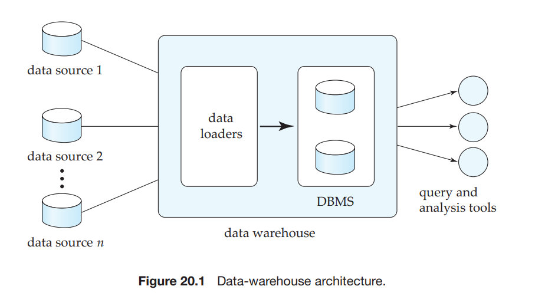
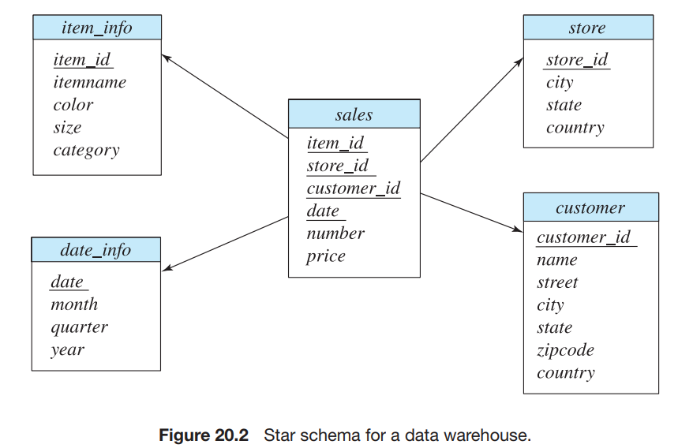
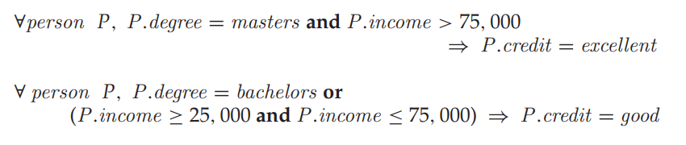
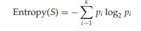
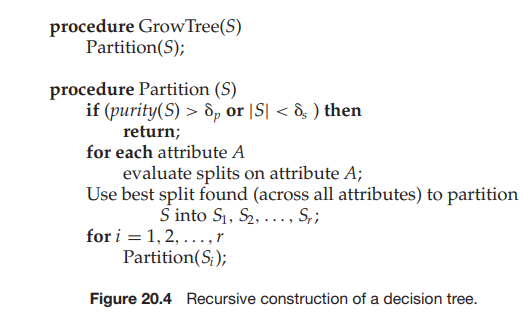
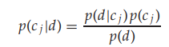
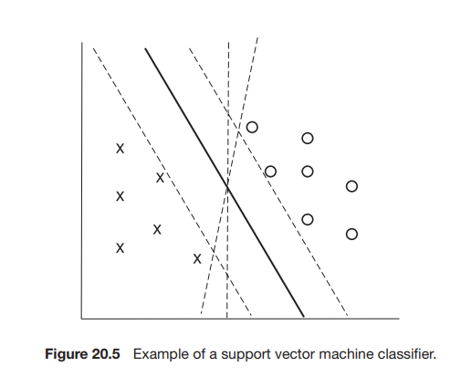

# DATA WAREHOUSING, DATA MINING, AND INFORMATION RETRIEVAL

Database queries are often designed to extract specific information, such as the balance of an account or the sum of a customer’s account balances. However, queries designed to help formulate a corporate strategy usually requires access to large amounts of data originating at multiple sources.

A data warehouse is a repository of data gathered from multiple sources and stored under a common, unified database schema. Data stored in warehouse are analyzed by a variety of complex aggregations and statistical analyses, often ex- ploiting SQL constructs for data analysis which we saw in Chapter 5. Furthermore, knowledge-discovery techniques may be used to attempt to discover rules and patterns from the data. For example, a retailer may discover that certain products tend to be purchased together, and may use that information to develop mar- keting strategies. This process of knowledge discovery from data is called _data mining_. Chapter 20 addresses the issues of data warehousing and data mining.

In our discussions so far, we have focused on relatively simple, well-structured data. However, there is an enormous amount of unstructured textual data on the Internet, on intranets within organizations, and on the computers of individual users. Users wish to find relevant information from this vast body of mostly tex- tual information, using simple query mechanisms such as keyword queries. The field of information retrieval deals with querying of such unstructured data, and pays particular attention to the ranking of query results. Although this area of research is several decades old, it has undergone tremendous growth with the development of the World Wide Web. Chapter 21 provides an introduction to the field of information retrieval.

  

_This page intentionally left blank_  

# C H A P T E R 20
# Data Warehousing and Mining

Businesses have begun to exploit the burgeoning data online to make better decisions about their activities, such as what items to stock and how best to target customers to increase sales. There are two aspects to exploiting such data. The first aspect is to gather data from multiple sources into a central repository, called a data warehouse. Issues involved in warehousing include techniques for dealing with dirty data, that is, data with some errors, and with techniques for efficient storage and indexing of large volumes of data.

The second aspect is to analyze the gathered data to find information or knowledge that can be the basis for business decisions. Some kinds of data anal- ysis can be done by using SQL constructs for online analytical processing (OLAP), which we saw in Section 5.6 (Chapter 5), and by using tools and graphical in- terfaces for OLAP. Another approach to getting knowledge from data is to use _data mining_, which aims at detecting various types of patterns in large volumes of data. Data mining supplements various types of statistical techniques with similar goals.

## 20.1 Decision-Support Systems

Database applications can be broadly classified into transaction-processing and decision-support systems. Transaction-processing systems are systems that record information about transactions, such as product sales information for compa- nies, or course registration and grade information for universities. Transaction- processing systems are widely used today, and organizations have accumulated a vast amount of information generated by these systems. Decision-support sys- tems aim to get high-level information out of the detailed information stored in transaction-processing systems, and to use the high-level information to make a variety of decisions. Decision-support systems help managers to decide what products to stock in a shop, what products to manufacture in a factory, or which of the applicants should be admitted to a university.

For example, company databases often contain enormous quantities of in- formation about customers and transactions. The size of the information storage required may range up to hundreds of gigabytes, or even terabytes, for large retail chains. Transaction information for a retailer may include the name or iden- tifier (such as credit-card number) of the customer, the items purchased, the price paid, and the dates on which the purchases were made. Information about the items purchased may include the name of the item, the manufacturer, the model number, the color, and the size. Customer information may include credit history, annual income, residence, age, and even educational background.

Such large databases can be treasure troves of information for making busi- ness decisions, such as what items to stock and what discounts to offer. For instance, a retail company may notice a sudden spurt in purchases of flannel shirts in the Pacific Northwest, may realize that there is a trend, and may start stocking a larger number of such shirts in shops in that area. As another example, a car company may find, on querying its database, that most of its small sports cars are bought by young women whose annual incomes are above $50,000. The company may then target its marketing to attract more such women to buy its small sports cars, and may avoid wasting money trying to attract other categories of people to buy those cars. In both cases, the company has identified patterns in customer behavior and has used the patterns to make business decisions.

The storage and retrieval of data for decision support raises several issues:

- Although many decision-support queries can be written in SQL, others either cannot be expressed in SQL or cannot be expressed easily in SQL. Several SQL extensions have therefore been proposed to make data analysis easier. In Section 5.6, we covered SQL extensions for data analysis and techniques for online analytical processing (OLAP).

- Database query languages are not suited to the performance of detailed **sta- tistical analyses** of data. There are several packages, such as SAS and S++, that help in statistical analysis. Such packages have been interfaced with databases, to allow large volumes of data to be stored in the database and retrieved efficiently for analysis. The field of statistical analysis is a large dis- cipline on its own; see the references in the bibliographical notes for more information.

- Large companies have diverse sources of data that they need to use for making business decisions. The sources may store the data under different schemas. For performance reasons (as well as for reasons of organization control), the data sources usually will not permit other parts of the company to retrieve data on demand.

To execute queries efficiently on such diverse data, companies have built _data warehouses_. Data warehouses gather data from multiple sources under a unified schema, at a single site. Thus, they provide the user a single uniform interface to data. We study issues in building and maintaining a data warehouse in Section 20.2.

- Knowledge-discovery techniques attempt to discover automatically statisti- cal rules and patterns from data. The field of _data mining_ combines knowledge- discovery techniques invented by artificial intelligence researchers and sta-  

##20.2 Data Warehousing 

tistical analysts, with efficient implementation techniques that enable them to be used on extremely large databases. Section 20.3 discusses data mining.

The area of **decision support** can be broadly viewed as covering all the above areas, although some people use the term in a narrower sense that excludes statistical analysis and data mining.

Large companies have presences in many places, each of which may generate a large volume of data. For instance, large retail chains have hundreds or thou- sands of stores, whereas insurance companies may have data from thousands of local branches. Further, large organizations have a complex internal organiza- tion structure, and therefore different data may be present in different locations, or on different operational systems, or under different schemas. For instance, manufacturing-problem data and customer-complaint data may be stored on dif- ferent database systems. Organizations often purchase data from external sources, such as mailing lists that are used for product promotions, or credit scores of cus- tomers that are provided by credit bureaus, to decide on credit-worthiness of customers.1

Corporate decision makers require access to information from multiple such sources. Setting up queries on individual sources is both cumbersome and ineffi- cient. Moreover, the sources of data may store only current data, whereas decision makers may need access to past data as well; for instance, information about how purchase patterns have changed in the past year could be of great importance. Data warehouses provide a solution to these problems.

A **data warehouse** is a repository (or archive) of information gathered from multiple sources, stored under a unified schema, at a single site. Once gathered, the data are stored for a long time, permitting access to historical data. Thus, data warehouses provide the user a single consolidated interface to data, mak- ing decision-support queries easier to write. Moreover, by accessing information for decision support from a data warehouse, the decision maker ensures that online transaction-processing systems are not affected by the decision-support workload.

Figure 20.1 shows the architecture of a typical data warehouse, and illustrates the gathering of data, the storage of data, and the querying and data analysis support. Among the issues to be addressed in building a warehouse are the following:

1Credit bureaus are companies that gather information about consumers from multiple sources and compute a credit- worthiness score for each consumer.  

**Figure 20.1** Data-warehouse architecture.

- **When and how to gather data.** In a **source-driven architecture** for gather- ing data, the data sources transmit new information, either continually (as transaction processing takes place), or periodically (nightly, for example). In a **destination-driven architecture**, the data warehouse periodically sends requests for new data to the sources.

Unless updates at the sources are replicated at the warehouse via two- phase commit, the warehouse will never be quite up-to-date with the sources. Two-phase commit is usually far too expensive to be an option, so data warehouses typically have slightly out-of-date data. That, however, is usually not a problem for decision-support systems.

- **What schema to use.** Data sources that have been constructed independently are likely to have different schemas. In fact, they may even use different data models. Part of the task of a warehouse is to perform schema integration, and to convert data to the integrated schema before they are stored. As a result, the data stored in the warehouse are not just a copy of the data at the sources. Instead, they can be thought of as a materialized view of the data at the sources.

- **Data transformation and cleansing.** The task of correcting and preprocessing data is called **data cleansing**. Data sources often deliver data with numerous minor inconsistencies, which can be corrected. For example, names are often misspelled, and addresses may have street, area, or city names misspelled, or postal codes entered incorrectly. These can be corrected to a reasonable extent by consulting a database of street names and postal codes in each city. The approximate matching of data required for this task is referred to as **fuzzy lookup**.

Address lists collected from multiple sources may have duplicates that need to be eliminated in a **merge–purge operation** (this operation is also referred to as **deduplication**). Records for multiple individuals in a house  

may be grouped together so only one mailing is sent to each house; this operation is called **householding**.

Data may be **transformed** in ways other than cleansing, such as changing the units of measure, or converting the data to a different schema by joining data from multiple source relations. Data warehouses typically have graphi- cal tools to support data transformation. Such tools allow transformation to be specified as boxes, and edges can be created between boxes to indicate the flow of data. Conditional boxes can route data to an appropriate next step in transformation. See Figure 30.7 for an example of a transformation specified using the graphical tool provided by Microsoft SQL Server.

- **How to propagate updates**. Updates on relations at the data sources must be propagated to the data warehouse. If the relations at the data warehouse are exactly the same as those at the data source, the propagation is straight- forward. If they are not, the problem of propagating updates is basically the _view-maintenance_ problem, which was discussed in Section 13.5.

- **What data to summarize.** The raw data generated by a transaction-processing system may be too large to store online. However, we can answer many queries by maintaining just summary data obtained by aggregation on a relation, rather than maintaining the entire relation. For example, instead of storing data about every sale of clothing, we can store total sales of clothing by item name and category.

Suppose that a relation _r_ has been replaced by a summary relation _s_. Users may still be permitted to pose queries as though the relation _r_ were available online. If the query requires only summary data, it may be possible to transform it into an equivalent one using _s_ instead; see Section 13.5.

The different steps involved in getting data into a data warehouse are called **extract, transform, and load** or **ETL** tasks; extraction refers to getting data from the sources, while load refers to loading the data into the data warehouse.

### 20.2.2 Warehouse Schemas

Data warehouses typically have schemas that are designed for data analysis, using tools such as OLAP tools. Thus, the data are usually multidimensional data, with dimension attributes and measure attributes. Tables containing multidimensional data are called **fact tables** and are usually very large. A table recording sales information for a retail store, with one tuple for each item that is sold, is a typical example of a fact table. The dimensions of the _sales_ table would include what the item is (usually an item identifier such as that used in bar codes), the date when the item is sold, which location (store) the item was sold from, which customer bought the item, and so on. The measure attributes may include the number of items sold and the price of the items.

To minimize storage requirements, dimension attributes are usually short identifiers that are foreign keys into other tables called **dimension tables**. For instance, a fact table _sales_ would have attributes _item id_, _store id_, _customer id_, and  

_date_, and measure attributes _number_ and _price_. The attribute _store id_ is a foreign key into a dimension table _store_, which has other attributes such as store location (city, state, country). The _item id_ attribute of the _sales_ table would be a foreign key into a dimension table _item info_, which would contain information such as the name of the item, the category to which the item belongs, and other item details such as color and size. The _customer id_ attribute would be a foreign key into a _customer_ table containing attributes such as name and address of the customer. We can also view the _date_ attribute as a foreign key into a _date info_ table giving the month, quarter, and year of each date.

The resultant schema appears in Figure 20.2. Such a schema, with a fact table, multiple dimension tables, and foreign keys from the fact table to the dimension tables, is called a **star schema**. More complex data-warehouse designs may have multiple levels of dimension tables; for instance, the _item info_ table may have an attribute _manufacturer id_ that is a foreign key into another table giving details of the manufacturer. Such schemas are called **snowflake schemas**. Complex data- warehouse designs may also have more than one fact table.

###20.2.3 Column-Oriented Storage

Databases traditionally store all attributes of a tuple together, and tuples are stored sequentially in a file. Such a storage layout is referred to as _row-oriented storage_. In contrast, in **column-oriented storage**, each attribute of a relation is stored in a separate file, with values from successive tuples stored at successive positions in the file. Assuming fixed-size data types, the value of attribute _A_ of the _i_th tuple of a relation can be found by accessing the file corresponding to attribute _A_, and reading the value at offset (_i_ − 1) times the size (in bytes) of values in attribute _A_.  

##20.3 Data Mining 

Column-oriented storage has at least two major benefits over row-oriented storage:

**1\.** When a query needs to access only a few attributes of a relation with a large number of attributes, the remaining attributes need not be fetched from disk into memory. In contrast, in row-oriented storage, not only are irrelevant attributes fetched into memory, but they may also get prefetched into processor cache, wasting cache space and memory bandwidth, if they are stored adjacent to attributes used in the query.

**2\.** Storing values of the same type together increases the effectiveness of com- pression; compression can greatly reduce both the disk storage cost and the time to retrieve data from disk.

On the other hand, column-oriented storage has the drawback that storing or fetching a single tuple requires multiple I/O operations.

As a result of the above trade-offs, column-oriented storage is not widely used for transaction-processing applications. However, column-oriented storage is gaining increasing acceptance for data-warehousing applications, where ac- cesses are rarely to individual tuples, but rather require scanning and aggregating multiple tuples.

Sybase IQ was one of the early products to use column-oriented storage, but there are now several research projects and companies that have developed databases based on column-oriented storage systems. These systems have been able to demonstrate significant performance gains for many data-warehousing applications. See the bibliographical notes for references on how column-oriented stores are implemented, and queries optimized and processed on such stores.

##20.3 Data Mining

The term **data mining** refers loosely to the process of semiautomatically analyzing large databases to find useful patterns. Like knowledge discovery in artificial intelligence (also called machine learning) or statistical analysis, data mining attempts to discover rules and patterns from data. However, data mining differs from machine learning and statistics in that it deals with large volumes of data, stored primarily on disk. That is, data mining deals with “knowledge discovery in databases.”

Some types of knowledge discovered from a database can be represented by a set of **rules**. The following is an example of a rule, stated informally: “Young women with annual incomes greater than $50,000 are the most likely people to buy small sports cars.” Of course such rules are not universally true, and have degrees of “support” and “confidence,” as we shall see. Other types of knowledge are represented by equations relating different variables to each other, or by other mechanisms for predicting outcomes when the values of some variables are known.  

There are a variety of possible types of patterns that may be useful, and different techniques are used to find different types of patterns. We shall study a few examples of patterns and see how they may be automatically derived from a database.

Usually there is a manual component to data mining, consisting of preprocess- ing data to a form acceptable to the algorithms and postprocessing of discovered patterns to find novel ones that could be useful. There may also be more than one type of pattern that can be discovered from a given database, and manual interaction may be needed to pick useful types of patterns. For this reason, data mining is really a semiautomatic process in real life. However, in our description we concentrate on the automatic aspect of mining.

The discovered knowledge has numerous applications. The most widely used applications are those that require some sort of **prediction**. For instance, when a person applies for a credit card, the credit-card company wants to predict if the person is a good credit risk. The prediction is to be based on known attributes of the person, such as age, income, debts, and past debt-repayment history. Rules for making the prediction are derived from the same attributes of past and current credit-card holders, along with their observed behavior, such as whether they defaulted on their credit-card dues. Other types of prediction include predicting which customers may switch over to a competitor (these customers may be offered special discounts to tempt them not to switch), predicting which people are likely to respond to promotional mail (“junk mail”), or predicting what types of phone calling card usage are likely to be fraudulent.

Another class of applications looks for **associations**, for instance, books that tend to be bought together. If a customer buys a book, an online bookstore may suggest other associated books. If a person buys a camera, the system may suggest accessories that tend to be bought along with cameras. A good salesperson is aware of such patterns and exploits them to make additional sales. The challenge is to automate the process. Other types of associations may lead to discovery of causation. For instance, discovery of unexpected associations between a newly introduced medicine and cardiac problems led to the finding that the medicine may cause cardiac problems in some people. The medicine was then withdrawn from the market.

Associations are an example of **descriptive patterns**. **Clusters** are another example of such patterns. For example, over a century ago a cluster of typhoid cases was found around a well, which led to the discovery that the water in the well was contaminated and was spreading typhoid. Detection of clusters of disease remains important even today.

##20.4 Classification

As mentioned in Section 20.3, prediction is one of the most important types of data mining. We describe classification, study techniques for building one type of classifiers, called decision-tree classifiers, and then study other prediction techniques.  

Abstractly, the **classification** problem is this: Given that items belong to one of several classes, and given past instances (called **training instances**) of items along with the classes to which they belong, the problem is to predict the class to which a new item belongs. The class of the new instance is not known, so other attributes of the instance must be used to predict the class.

Classification can be done by finding rules that partition the given data into disjoint groups. For instance, suppose that a credit-card company wants to decide whether or not to give a credit card to an applicant. The company has a variety of information about the person, such as her age, educational background, annual income, and current debts, that it can use for making a decision.

Some of this information could be relevant to the credit-worthiness of the applicant, whereas some may not be. To make the decision, the company assigns a credit-worthiness level of excellent, good, average, or bad to each of a sample set of _current_ customers according to each customer’s payment history. Then, the company attempts to find rules that classify its current customers into excellent, good, average, or bad, on the basis of the information about the person, other than the actual payment history (which is unavailable for new customers). Let us consider just two attributes: education level (highest degree earned) and income. The rules may be of the following form:

Similar rules would also be present for the other credit-worthiness levels (average and bad).

The process of building a classifier starts from a sample of data, called a **train- ing set**. For each tuple in the training set, the class to which the tuple belongs is already known. For instance, the training set for a credit-card application may be the existing customers, with their credit-worthiness determined from their payment history. The actual data, or population, may consist of all people, in- cluding those who are not existing customers. There are several ways of building a classifier, as we shall see.

###20.4.1 Decision-Tree Classifiers

The decision-tree classifier is a widely used technique for classification. As the name suggests, **decision-tree classifiers** use a tree; each leaf node has an associ- ated class, and each internal node has a predicate (or more generally, a function) associated with it. Figure 20.3 shows an example of a decision tree.

To classify a new instance, we start at the root and traverse the tree to reach a leaf; at an internal node we evaluate the predicate (or function) on the data instance, to find which child to go to. The process continues until we reach a leaf node. For example, if the degree level of a person is masters, and the person’s  

income is 40K, starting from the root we follow the edge labeled “masters,” and from there the edge labeled “25K to 75K,” to reach a leaf. The class at the leaf is “good,” so we predict that the credit risk of that person is good.

####20.4.1.1 Building Decision-Tree Classifiers

The question then is how to build a decision-tree classifier, given a set of training instances. The most common way of doing so is to use a **greedy** algorithm, which works recursively, starting at the root and building the tree downward. Initially there is only one node, the root, and all training instances are associated with that node.

At each node, if all, or “almost all” training instances associated with the node belong to the same class, then the node becomes a leaf node associated with that class. Otherwise, a **partitioning attribute** and **partitioning conditions** must be selected to create child nodes. The data associated with each child node is the set of training instances that satisfy the partitioning condition for that child node. In our example, the attribute _degree_ is chosen, and four children, one for each value of degree, are created. The conditions for the four children nodes are _degree_ \= none, _degree_ \= bachelors, _degree_ \= masters, and _degree_ \= doctorate, respectively. The data associated with each child consist of training instances satisfying the condition associated with that child. At the node corresponding to masters, the attribute _income_ is chosen, with the range of values partitioned into intervals 0 to 25K, 25K to 50K, 50K to 75K, and over 75K. The data associated with each node consist of training instances with the _degree_ attribute being masters and the _income_ attribute being in each of these ranges, respectively. As an optimization, since the thesclass for the range 25K to 50K and the range 50K to 75K is the same under the node _degree_ \= masters, the two ranges have been merged into a single range 25K to 75K.

####20.4.1.2 Best Splits

Intuitively, by choosing a sequence of partitioning attributes, we start with the set of all training instances, which is “impure” in the sense that it contains instances from many classes, and ends up with leaves which are “pure” in the sense that at each leaf all training instances belong to only one class. We shall see shortly how to measure purity quantitatively. To judge the benefit of picking a particular attribute and condition for partitioning of the data at a node, we measure the purity of the data at the children resulting from partitioning by that attribute. The attribute and condition that result in the maximum purity are chosen.

The purity of a set _S_ of training instances can be measured quantitatively in several ways. Suppose there are _k_ classes, and of the instances in _S_ the fraction of instances in class _i_ is _pi_ . One measure of purity, the **Gini measure**, is defined as:

When all instances are in a single class, the Gini value is 0, while it reaches its maximum (of 1 − 1_/k_) if each class has the same number of instances. Another measure of purity is the **entropy measure**, which is defined as:

The entropy value is 0 if all instances are in a single class, and reaches its maximum when each class has the same number of instances. The entropy measure derives from information theory.

When a set _S_ is split into multiple sets _Si , i_ \= 1_,_ 2_, . . . , r_ , we can measure the purity of the resultant set of sets as:

That is, the purity is the weighted average of the purity of the sets _Si_ . The above formula can be used with both the Gini measure and the entropy measure of purity.

The **information gain** due to a particular split of _S_ into _Si , i_ \= 1_,_ 2_, . . . , r_ is then:

Information gain(_S,_ {_S_1_, S_2_, . . . , Sr_ }) = purity(_S_) − purity(_S_1_, S_2_, . . . , Sr_ )  

Splits into fewer sets are preferable to splits into many sets, since they lead to simpler and more meaningful decision trees. The number of elements in each of the sets _Si_ may also be taken into account; otherwise, whether a set _Si_ has 0 elements or 1 element would make a big difference in the number of sets, although the split is the same for almost all the elements. The **information content** of a particular split can be defined in terms of entropy as:

All of this leads to a definition: The **best split** for an attribute is the one that gives the maximum **information gain ratio**, defined as:

Information gain(_S,_ {_S_1_, S_2_, . . . , Sr_ }) Information content(_S,_ {_S_1_, S_2_, . . . , Sr_ })

####20.4.1.3 Finding Best Splits

How do we find the best split for an attribute? How to split an attribute depends on the type of the attribute. Attributes can be either **continuous valued**, that is, the values can be ordered in a fashion meaningful to classification, such as age or income, or they can be **categorical**; that is, they have no meaningful order, such as department names or country names. We do not expect the sort order of department names or country names to have any significance to classification.

Usually attributes that are numbers (integers/reals) are treated as continuous valued while character string attributes are treated as categorical, but this may be controlled by the user of the system. In our example, we have treated the attribute _degree_ as categorical, and the attribute _income_ as continuous valued.

We first consider how to find best splits for continuous-valued attributes. For simplicity, we shall consider only **binary splits** of continuous-valued attributes, that is, splits that result in two children. The case of **multiway splits** is more complicated; see the bibliographical notes for references on the subject.

To find the best binary split of a continuous-valued attribute, we first sort the attribute values in the training instances. We then compute the information gain obtained by splitting at each value. For example, if the training instances have values 1_,_ 10_,_ 15, and 25 for an attribute, the split points considered are 1, 10, and 15; in each case values less than or equal to the split point form one partition and the rest of the values form the other partition. The best binary split for the attribute is the split that gives the maximum information gain.
For a categorical attribute, we can have a multiway split, with a child for each value of the attribute. This works fine for categorical attributes with only a few distinct values, such as degree or gender. However, if the attribute has many distinct values, such as department names in a large company, creating a child for each value is not a good idea. In such cases, we would try to combine multiple values into each child, to create a smaller number of children. See the bibliographical notes for references on how to do so.  

##20.4 Classification 

####20.4.1.4 Decision-Tree Construction Algorithm

The main idea of decision-tree construction is to evaluate different attributes and different partitioning conditions, and pick the attribute and partitioning condi- tion that results in the maximum information-gain ratio. The same procedure works recursively on each of the sets resulting from the split, thereby recursively constructing a decision tree. If the data can be perfectly classified, the recursion stops when the purity of a set is 0. However, often data are noisy, or a set may be so small that partitioning it further may not be justified statistically. In this case, the recursion stops when the purity of a set is “sufficiently high,” and the class of the resulting leaf is defined as the class of the majority of the elements of the set. In general, different branches of the tree could grow to different levels.

Figure 20.4 shows pseudocode for a recursive tree-construction procedure, which takes a set of training instances _S_ as parameter. The recursion stops when the set is sufficiently pure or the set _S_ is too small for further partitioning to be statistically significant. The parameters _p_ and _s_ define cutoffs for purity and size; the system may give them default values, which may be overridden by users.

There are a wide variety of decision-tree construction algorithms, and we outline the distinguishing features of a few of them. See the bibliographical notes for details. With very large data sets, partitioning may be expensive, since it involves repeated copying. Several algorithms have therefore been developed to minimize the I/O and computation cost when the training data are larger than available memory.

Several of the algorithms also prune subtrees of the generated decision tree to reduce **overfitting:** A subtree is overfitted if it has been so highly tuned to the specifics of the training data that it makes many classification errors on other data. A subtree is pruned by replacing it with a leaf node. There are different pruning heuristics; one heuristic uses part of the training data to build the tree and another part of the training data to test it. The heuristic prunes a subtree if it finds that misclassification on the test instances would be reduced if the subtree were replaced by a leaf node.  

We can generate classification rules from a decision tree, if we so desire. For each leaf we generate a rule as follows: The left-hand side is the conjunction of all the split conditions on the path to the leaf, and the class is the class of the majority of the training instances at the leaf. An example of such a classification rule is:

degree = ma ster s and income > 75000 ⇒ excellent

###20.4.2 Other Types of Classifiers

There are several types of classifiers other than decision-tree classifiers. Two types that have been quite useful are _neural-net classifiers, Bayesian classifiers,_ and _Support Vector Machine_ classifiers. Neural-net classifiers use the training data to train artificial neural nets. There is a large body of literature on neural nets, and we do not consider them further here.

**Bayesian classifiers** find the distribution of attribute values for each class in the training data; when given a new instance _d_, they use the distribution information to estimate, for each class _c j_ , the probability that instance _d_ belongs to class _c j_ , denoted by _p_(_c j_ |_d_), in a manner outlined here. The class with maximum probability becomes the predicted class for instance _d_.

To find the probability _p_(_c j_ |_d_) of instance _d_ being in class _c j_ , Bayesian classi- fiers use **Bayes’ theorem**, which says:

where _p_(_d_|_c j_ ) is the probability of generating instance _d_ given class _c j_ , _p_(_c j_ ) is the probability of occurrence of class _c j_ , and _p_(_d_) is the probability of instance _d_ occurring. Of these, _p_(_d_) can be ignored since it is the same for all classes. _p_(_c j_ ) is simply the fraction of training instances that belong to class _c j_ .

For example, let us consider a special case where only one attribute, _income_, is used for classification, and suppose we need to classify a person whose income is 76000. We assume that income values are broken up into buckets, and assume that the bucket containing 76000 contains values in the range (75000, 80000). Suppose among instances of class _excellent_, the probability of income being in (75000, 80000) is 0_._1, while among instances of class _good_, the probability of income being in (75000, 80000) is 0_._05\. Suppose also that overall 0_._1 fraction of people are classified as _excellent_, and 0_._3 are classified as _good_. Then, _p_(_d_|_c j_ )_p_(_c j_ ) for class _excellent_ is _._01, while for class _good_, it is 0_._015\. The person would therefore be classified in class _good_.

In general, multiple attributes need to be considered for classification. Then, finding _p_(_d_|_c j_ ) exactly is difficult, since it requires the distribution of instances of _c j_ , across all combinations of values for the attributes used for classification. The number of such combinations (for example of income buckets, with degree values and other attributes) can be very large. With a limited training set used to find the distribution, most combinations would not have even a single training set matching them, leading to incorrect classification decisions. To avoid this  

##20.4 Classification 901

problem, as well as to simplify the task of classification, **naive Bayesian classifiers** assume attributes have independent distributions, and thereby estimate:

That is, the probability of the instance _d_ occurring is the product of the probability of occurrence of each of the attribute values _di_ of _d_, given the class is _c j_ .

The probabilities _p_(_di_ |_c j_ ) derive from the distribution of values for each at- tribute _i_ , for each class _c j_ . This distribution is computed from the training in- stances that belong to each class _c j_ ; the distribution is usually approximated by a histogram. For instance, we may divide the range of values of attribute _i_ into equal intervals, and store the fraction of instances of class _c j_ that fall in each interval. Given a value _di_ for attribute _i_ , the value of _p_(_di_ |_c j_ ) is simply the fraction of instances belonging to class _c j_ that fall in the interval to which _di_ belongs.

A significant benefit of Bayesian classifiers is that they can classify instances with unknown and null attribute values—unknown or null attributes are just omitted from the probability computation. In contrast, decision-tree classifiers cannot meaningfully handle situations where an instance to be classified has a null value for a partitioning attribute used to traverse further down the decision tree.

The **Support Vector Machine** (SVM) is a type of classifier that has been found to give very accurate classification across a range of applications. We provide some basic intuition about Support Vector Machine classifiers here; see the references in the bibliographical notes for further information.

Support Vector Machine classifiers can best be understood geometrically. In the simplest case, consider a set of points in a two-dimensional plane, some belonging to class _A_, and some belonging to class _B_. We are given a training set of points whose class (_A_ or _B_) is known, and we need to build a classifier of points, using these training points. This situation is illustrated in Figure 20.5, where the points in class _A_ are denoted by X marks, while those in class _B_ are denoted by O marks.

Suppose we can draw a line on the plane, such that all points in class _A_ lie to one side and all points in line _B_ lie to the other. Then, the line can be used to classify new points, whose class we don’t already know. But there may be many possible such lines that can separate points in class _A_ from points in class _B_. A few such lines are shown in Figure 20.5. The Support Vector Machine classifier chooses the line whose distance from the nearest point in either class (from the points in the training data set) is maximum. This line (called the _maximum margin line_) is then used to classify other points into class _A_ or _B_, depending on which side of the line they lie on. In Figure 20.5, the maximum margin line is shown in bold, while the other lines are shown as dashed lines.

The above intuition can be generalized to more than two dimensions, allowing multiple attributes to be used for classification; in this case, the classifier finds a dividing plane, not a line. Further, by first transforming the input points using certain functions, called _kernel functions_, Support Vector Machine classifiers can find nonlinear curves separating the sets of points. This is important for cases  

where the points are not separable by a line or plane. In the presence of noise, some points of one class may lie in the midst of points of the other class. In such cases, there may not be any line or meaningful curve that separates the points in the two classes; then, the line or curve that most accurately divides the points into the two classes is chosen.

Although the basic formulation of Support Vector Machines is for binary classifiers, i.e., those with only two classes, they can be used for classification into multiple classes as follows: If there are _N_ classes, we build _N_ classifiers, with classifier _i_ performing a binary classification, classifying a point either as in class _i_ or not in class _i_ . Given a point, each classifier _i_ also outputs a value indicating how related a given point is to class _i_ . We then apply all _N_ classifiers on a given point, and choose the class for which the relatedness value is the highest.

###20.4.3 Regression

**Regression** deals with the prediction of a value, rather than a class. Given values for a set of variables, _X_1_, X_2_, . . . , Xn_, we wish to predict the value of a variable _Y_. For instance, we could treat the level of education as a number and income as another number, and, on the basis of these two variables, we wish to predict the likelihood of default, which could be a percentage chance of defaulting, or the amount involved in the default.

One way is to infer coefficients _a_0_, a_1_, a_2_, . . . , an_ such that:

Finding such a linear polynomial is called **linear regression**. In general, we wish to find a curve (defined by a polynomial or other formula) that fits the data; the process is also called **curve fitting.**  

##20.4 Classification 

The fit may be only approximate, because of noise in the data or because the relationship is not exactly a polynomial, so regression aims to find coefficients that give the best possible fit. There are standard techniques in statistics for finding regression coefficients. We do not discuss these techniques here, but the bibliographical notes provide references.

###20.4.4 Validating a Classifier

It is important to validate a classifier, that is, to measure its classification error rate, before deciding to use it for an application. Consider an example of a classi- fication problem where a classifier has to predict, based on some inputs (the exact inputs are not relevant here), whether a person is suffering from a particular dis- ease _X_ or not. A positive prediction says that the person has the disease, and a negative prediction says the person does not have the disease. (The terminology of positive/negative prediction can be used for any binary classification problem, not just disease classification.)

A set of test cases where the outcome is already known (in our example, cases where it is already known whether or not the person actually has the disease) is used to measure the quality (that is, the error rate) of the classifier. A **true positive** is a case where the prediction was positive, and the person actually had the disease, while a **false positive** is a case where the prediction was positive, but the person did not have the disease. **True negative** and **false negative** are defined similarly for the case where the prediction was negative.

Given a set of test cases, let _t pos_, _f pos_, _t neg_ and _f neg_ denote the number of true positives, false positives, true negatives and false negatives generated. Let _pos_ and _neg_ denote the actual number of positives and negatives (it is easy to see that _pos_ \= _t pos_ \+ _f neg_, and _neg_ \= _f pos_ \+ _t neg_).

The quality of classification can be measured in several different ways:

**1\. Accuracy**, defined as (_t pos_ \+ _t neg_)_/_(_pos_+_neg_), that is, the fraction of the time when the classifier gives the correct classification.

**2\. Recall** (also known as **sensitivity**) defined as _t pos/pos_, that is, how many of the actual positive cases are classified as positive.

**3\. Precision**, defined as _t pos_/(_t pos_+_f pos_), that is, how often the positive pre- diction is correct.

**4\. Specificity,** defined as _t neg_/_neg_.

Which of these measures should be used for a specific application depends on the needs of that application. For example, a high recall is important for a screening test, which is to be followed up by a more precise test, so that patients with the disease are not missed out. In contrast a researcher who wants to find a few actual patients of the disease for further follow up, but is not interested in finding all patients, may value high precision over recall. Different classifiers may be appropriate for each of these applications. This issue is explored further in Exercise 20.5.  

A set of test cases where the outcome is already known can be used either to train or to measure the quality the classifier. It is a bad idea to use exactly the same set of test cases to train as well as to measure the quality of the classifier, since the classifier has already seen the correct classification of the test cases during training; this can lead to artificially high measures of quality. The quality of a classifier must therefore be measured on test cases that have not been seen during training.

Therefore, a subset of the available test cases is used for training and a disjoint subset is used for validation. In **cross validation**, the available test cases are divided into _k_ parts numbered 1 to _k_, from which _k_ different test sets are created as follows: test set _i_ uses the _i_th part for validation, after training the classifier using the other _k_−1 parts. The results (_t pos_, _f pos_, etc.) from all _k_ test sets are added up before computing the quality measures. Cross validation provides much more accurate measures than merely partitioning the data into a single training and a single test set.

##20.5 Association Rules

Retail shops are often interested in **associations** between different items that people buy. Examples of such associations are:

- Someone who buys bread is quite likely also to buy milk.

- A person who bought the book _Database System Concepts_ is quite likely also to buy the book _Operating System Concepts_.

Association information can be used in several ways. When a customer buys a particular book, an online shop may suggest associated books. A grocery shop may decide to place bread close to milk, since they are often bought together, to help shoppers finish their task faster. Or, the shop may place them at opposite ends of a row, and place other associated items in between to tempt people to buy those items as well, as the shoppers walk from one end of the row to the other. A shop that offers discounts on one associated item may not offer a discount on the other, since the customer will probably buy the other anyway.

An example of an association rule is:

_bread_ ⇒ _milk_

In the context of grocery-store purchases, the rule says that customers who buy bread also tend to buy milk with a high probability. An association rule must have an associated **population**: The population consists of a set of **instances**. In the grocery-store example, the population may consist of all grocery-store purchases; each purchase is an instance. In the case of a bookstore, the population may consist of all people who made purchases, regardless of when they made a purchase. Each customer is an instance. In the bookstore example, the analyst has decided that when a purchase is made is not significant, whereas for the grocery- store example, the analyst may have decided to concentrate on single purchases, ignoring multiple visits by the same customer.

Rules have an associated _support_, as well as an associated _confidence._ These are defined in the context of the population:

• **Support** is a measure of what fraction of the population satisfies both the antecedent and the consequent of the rule.

For instance, suppose only 0_._001 percent of all purchases include milk and screwdrivers. The support for the rule:

_milk_ ⇒ _screwdrivers_

is low. The rule may not even be statistically significant—perhaps there was only a single purchase that included both milk and screwdrivers. Businesses are usually not interested in rules that have low support, since they involve few customers, and are not worth bothering about.

On the other hand, if 50 percent of all purchases involve milk and bread, then support for rules involving bread and milk (and no other item) is rela- tively high, and such rules may be worth attention. Exactly what minimum degree of support is considered desirable depends on the application.

• **Confidence** is a measure of how often the consequent is true when the an- tecedent is true. For instance, the rule:

_bread_ ⇒ _milk_

has a confidence of 80 percent if 80 percent of the purchases that include bread also include milk. A rule with a low confidence is not meaningful. In business applications, rules usually have confidences significantly less than 100 percent, whereas in other domains, such as in physics, rules may have high confidences.

Note that the confidence of _bread_ ⇒ _milk_ may be very different from the confidence of _milk_ ⇒ _bread_ , although both have the same support.

To discover association rules of the form:

_i_1_, i_2_, . . . , in_ ⇒ _i_0

we first find sets of items with sufficient support, called **large itemsets**. In our example, we find sets of items that are included in a sufficiently large number of instances. We shall see shortly how to compute large itemsets.

For each large itemset, we then output all rules with sufficient confidence that involve all and only the elements of the set. For each large itemset _S_, we output a rule _S_ − _s_ ⇒ _s_ for every subset _s_ ⊂ _S_, provided _S_ − _s_ ⇒ _s_ has sufficient confidence; the confidence of the rule is given by support of _s_ divided by support of _S_.  

We now consider how to generate all large itemsets. If the number of possible sets of items is small, a single pass over the data suffices to detect the level of support for all the sets. A count, initialized to 0, is maintained for each set of items. When a purchase record is fetched, the count is incremented for each set of items such that all items in the set are contained in the purchase. For instance, if a purchase included items _a_ , _b_, and _c_, counts would be incremented for {_a_}, {_b_}, {_c_}, {_a , b_}, {_b, c_}, {_a , c_}, and {_a , b, c_}. Those sets with a sufficiently high count at the end of the pass correspond to items that have a high degree of association.

The number of sets grows exponentially, making the procedure just described infeasible if the number of items is large. Luckily, almost all the sets would normally have very low support; optimizations have been developed to eliminate most such sets from consideration. These techniques use multiple passes on the database, considering only some sets in each pass.

In the **a priori** technique for generating large itemsets, only sets with single items are considered in the first pass. In the second pass, sets with two items are considered, and so on.

At the end of a pass, all sets with sufficient support are output as large itemsets. Sets found to have too little support at the end of a pass are eliminated. Once a set is eliminated, none of its supersets needs to be considered. In other words, in pass _i_ we need to count only supports for sets of size _i_ such that all subsets of the set have been found to have sufficiently high support; it suffices to test all subsets of size _i_ − 1 to ensure this property. At the end of some pass _i_ , we would find that no set of size _i_ has sufficient support, so we do not need to consider any set of size _i_ \+ 1. Computation then terminates.

##20.6 Other Types of Associations

Using plain association rules has several shortcomings. One of the major short- comings is that many associations are not very interesting, since they can be predicted. For instance, if many people buy cereal and many people buy bread, we can predict that a fairly large number of people would buy both, even if there is no connection between the two purchases. In fact, even if buying cereal has a mild negative influence on buying bread (that is, customers who buy cereal tend to purchase bread less often than the average customer), the association between cereal and bread may still have a high support.

What would be more interesting is if there is a **deviation** from the expected co-occurrence of the two. In statistical terms, we look for **correlations** between items; correlations can be positive, in that the co-occurrence is higher than would have been expected, or negative, in that the items co-occur less frequently than predicted. Thus, if purchase of bread is not correlated with cereal, it would not be reported, even if there was a strong association between the two. There are standard measures of correlation, widely used in the area of statistics. See a standard textbook on statistics for more information about correlations.

Another important class of data-mining applications is sequence associations (or sequence correlations). Time-series data, such as stock prices on a sequence
of days, form an example of sequence data. Stock-market analysts want to find associations among stock-market price sequences. An example of such an associ- ation is the following rule: “Whenever bond rates go up, the stock prices go down within 2 days.” Discovering such associations between sequences can help us to make intelligent investment decisions. See the bibliographical notes for references to research on this topic.

Deviations from temporal patterns are often interesting. For instance, if a company has been growing at a steady rate each year, a deviation from the usual growth rate is surprising. If sales of winter clothes go down in summer, it is not surprising, since we can predict it from past years; a deviation that we could not have predicted from past experience would be considered interesting. Mining techniques can find deviations from what one would have expected on the basis of past temporal or sequential patterns. See the bibliographical notes for references to research on this topic.

##20.7 Clustering

Intuitively, clustering refers to the problem of finding clusters of points in the given data. The problem of **clustering** can be formalized from distance metrics in several ways. One way is to phrase it as the problem of grouping points into _k_ sets (for a given _k_) so that the average distance of points from the _centroid_ of their assigned cluster is minimized.2 Another way is to group points so that the average distance between every pair of points in each cluster is minimized. There are other definitions too; see the bibliographical notes for details. But the intuition behind all these definitions is to group similar points together in a single set.

Another type of clustering appears in classification systems in biology. (Such classification systems do not attempt to _predict_ classes; rather they attempt to cluster related items together.) For instance, leopards and humans are clustered under the class mammalia, while crocodiles and snakes are clustered under rep- tilia. Both mammalia and reptilia come under the common class chordata. The clustering of mammalia has further subclusters, such as carnivora and primates. We thus have **hierarchical clustering**. Given characteristics of different species, biologists have created a complex hierarchical clustering scheme grouping related species together at different levels of the hierarchy.

Hierarchical clustering is also useful in other domains—for clustering doc- uments, for example. Internet directory systems (such as the Yahoo! directory) cluster related documents in a hierarchical fashion (see Section 21.9). Hierarchical clustering algorithms can be classified as **agglomerative clustering** algorithms, which start by building small clusters and then create higher levels, or **divisive**

2The centroid of a set of points is defined as a point whose coordinate on each dimension is the average of the coordinates of all the points of that set on that dimension. For example in two dimensions, the centroid of a set of points

**clustering** algorithms, which first create higher levels of the hierarchical cluster- ing, then refine each resulting cluster into lower-level clusters.

The statistics community has studied clustering extensively. Database re- search has provided scalable clustering algorithms that can cluster very large data sets (that may not fit in memory). The Birch clustering algorithm is one such algorithm. Intuitively, data points are inserted into a multidimensional tree struc- ture (based on R-trees, described in Section 25.3.5.3), and guided to appropriate leaf nodes on the basis of nearness to representative points in the internal nodes of the tree. Nearby points are thus clustered together in leaf nodes, and summa- rized if there are more points than fit in memory. The result of this first phase of clustering is to create a partially clustered data set that fits in memory. Standard clustering techniques can then be executed on the in-memory data to get the final clustering. See the bibliographical notes for references to the Birch algorithm, and other techniques for clustering, including algorithms for hierarchical clustering.

An interesting application of clustering is to predict what new movies (or books or music) a person is likely to be interested in, on the basis of:

**1\.** The person’s past preferences in movies.

**2\.** Other people with similar past preferences.

**3\.** The preferences of such people for new movies.

One approach to this problem is as follows: To find people with similar past preferences we create clusters of people based on their preferences for movies. The accuracy of clustering can be improved by previously clustering movies by their similarity, so even if people have not seen the same movies, if they have seen similar movies they would be clustered together. We can repeat the clustering, alternately clustering people, then movies, then people, and so on until we reach an equilibrium. Given a new user, we find a cluster of users most similar to that user, on the basis of the user’s preferences for movies already seen. We then predict movies in movie clusters that are popular with that user’s cluster as likely to be interesting to the new user. In fact, this problem is an instance of _collaborative filtering,_ where users collaborate in the task of filtering information to find information of interest.

##20.8 Other Forms of Data Mining

**Text mining** applies data-mining techniques to textual documents. For instance, there are tools that form clusters on pages that a user has visited; this helps users when they browse the history of their browsing to find pages they have visited earlier. The distance between pages can be based, for instance, on common words in the pages (see Section 21.2.2). Another application is to classify pages into a Web directory automatically, according to their similarity with other pages (see Section 21.9).  

##20.9 Summary 

**Data-visualization** systems help users to examine large volumes of data, and to detect patterns visually. Visual displays of data—such as maps, charts, and other graphical representations—allow data to be presented compactly to users. A single graphical screen can encode as much information as a far larger number of text screens. For example, if the user wants to find out whether production problems at plants are correlated to the locations of the plants, the problem locations can be encoded in a special color—say, red—on a map. The user can then quickly discover locations where problems are occurring. The user may then form hypotheses about why problems are occurring in those locations, and may verify the hypotheses quantitatively against the database.

As another example, information about values can be encoded as a color, and can be displayed with as little as one pixel of screen area. To detect associations between pairs of items, we can use a two-dimensional pixel matrix, with each row and each column representing an item. The percentage of transactions that buy both items can be encoded by the color intensity of the pixel. Items with high association will show up as bright pixels in the screen—easy to detect against the darker background.

Data-visualization systems do not automatically detect patterns, but they provide system support for users to detect patterns. Since humans are very good at detecting visual patterns, data visualization is an important component of data mining.

• Decision-support systems analyze online data collected by transaction-pro- cessing systems, to help people make business decisions. Since most organi- zations are extensively computerized today, a very large body of information is available for decision support. Decision-support systems come in various forms, including OLAP systems and data-mining systems.

• Data warehouses help gather and archive important operational data. Ware- houses are used for decision support and analysis on historical data, for instance, to predict trends. Data cleansing from input data sources is often a major task in data warehousing. Warehouse schemas tend to be multidimen- sional, involving one or a few very large fact tables and several much smaller dimension tables.

• Column-oriented storage systems provide good performance for many data warehousing applications.

• Data mining is the process of semiautomatically analyzing large databases to find useful patterns. There are a number of applications of data mining, such as prediction of values based on past examples, finding of associations between purchases, and automatic clustering of people and movies.

• Classification deals with predicting the class of test instances by using at- tributes of the test instances, based on attributes of training instances, andthe actual class of training instances. There are several types of classifiers, such as:

 ◦ Decision-tree classifiers, which perform classification by constructing a tree based on training instances with leaves having class labels. The tree is traversed for each test instance to find a leaf, and the class of the leaf is the predicted class. Several techniques are available to construct decision trees, most of them based on greedy heuristics.

 ◦ Bayesian classifiers are simpler to construct than decision-tree classifiers, and they work better in the case of missing/null attribute values.

 ◦ The Support Vector Machine is another widely used classification tech- nique.

• Association rules identify items that co-occur frequently, for instance, items that tend to be bought by the same customer. Correlations look for deviations from expected levels of association.

• Other types of data mining include clustering, text mining, and data visual- ization.

**Review Terms**

• Decision-support systems • Statistical analysis • Data warehousing

◦ Gathering data

◦ Source-driven architecture

◦ Destination-driven architec- ture

◦ Data cleansing Merge–purge Householding

◦ Extract, transform, load (ETL)

• Warehouse schemas

◦ Fact table

◦ Dimension tables

◦ Star schema

• Column-oriented storage

• Data mining • Prediction • Associations • Classification

◦ Training data

◦ Test data

• Decision-tree classifiers

◦ Partitioning attribute

◦ Partitioning condition

◦ Purity

Gini measure

Entropy measure

◦ Information gain

◦ Information content

◦ Information gain ratio

◦ Continuous-valued attribute  

**Practice Exercises **

◦ Categorical attribute

◦ Binary split

◦ Multiway split

◦ Overfitting

• Bayesian classifiers

◦ Bayes’ theorem

◦ Naive Bayesian classifiers

• Support Vector Machine (SVM) • Regression

◦ Linear regression

◦ Curve fitting

• Validation

◦ Accuracy

◦ Recall

◦ Precision

◦ Specificity

◦ Cross validation

• Association rules

◦ Population

◦ Support

◦ Confidence

◦ Large itemsets

• Other types of associations • Clustering

◦ Hierarchical clustering

◦ Agglomerative clustering

◦ Divisive clustering

• Text mining • Data visualization

**Practice Exercises**

**20.1** Describe benefits and drawbacks of a source-driven architecture for gath- ering of data at a data warehouse, as compared to a destination-driven architecture.

**20.2** Why is column-oriented storage potentially advantageous in a database system that supports a data warehouse?

**20.3** Suppose that there are two classification rules, one that says that people with salaries between $10,000 and $20,000 have a credit rating of _good_, and another that says that people with salaries between $20,000 and $30,000 have a credit rating of _good_. Under what conditions can the rules be re- placed, without any loss of information, by a single rule that says people with salaries between $10,000 and $30,000 have a credit rating of _good_?

**20.4** Consider the schema depicted in Figure 20.2. Give an SQL query to summa- rize sales numbers and price by store and date, along with the hierarchies on store and date.

**20.5** Consider a classification problem where the classifier predicts whether a person has a particular disease. Suppose that 95% of the people tested do not suffer from the disease. (That is, _pos_ corresponds to 5% and _neg_ to 95% of the test cases.) Consider the following classifiers:

• Classifier _C_1 which always predicts negative (a rather useless classifier of course).

• Classifier _C_2 which predicts positive in 80% of the cases where the person actually has the disease, but also predicts positive in 5% of the cases where the person does not have the disease.

• Classifier _C_3 which predicts positive in 95% of the cases where the person actually has the disease, but also predicts positive in 20% of the cases where the person does not have the disease.

Given the above classifiers, answer the following questions.

a. For each of the above classifiers, compute the accuracy, precision, recall and specificity.

b. If you intend to use the results of classification to perform further screening for the disease, how would you choose between the clas- sifiers.

c. On the other hand, if you intend to use the result of classification to start medication, where the medication could have harmful effects if given to someone who does not have the disease, how would you choose between the classifiers?

**Exercises**

**20.6** Draw a diagram that shows how the _classroom_ relation of our university example as shown in Appendix A would be stored under a column- oriented storage structure.

**20.7** Explain why the nested-loops join algorithm (see Section 12.5.1) would work poorly on database stored in a column-oriented manner. Describe an alternative algorithm that would work better and explain why your solution is better.

**20.8** Construct a decision-tree classifier with binary splits at each node, using tuples in relation _r_ (_A, B, C_) shown below as training data; attribute _C_ denotes the class. Show the final tree, and with each node show the best split for each attribute along with its information gain value.

(1, 2, a), (2, 1, a), (2, 5, b), (3, 3, b), (3, 6, b), (4, 5, b), (5, 5, c), (6, 3, b), (6, 7, c)

**20.9** Suppose half of all the transactions in a clothes shop purchase jeans, and one third of all transactions in the shop purchase T-shirts. Suppose also 
that half of the transactions that purchase jeans also purchase T-shirts. Write down all the (nontrivial) association rules you can deduce from the above information, giving support and confidence of each rule.

**20.10** Consider the problem of finding large itemsets.

a. Describe how to find the support for a given collection of itemsets by using a single scan of the data. Assume that the itemsets and associated information, such as counts, will fit in memory.

b. Suppose an itemset has support less than _j_ . Show that no superset of this itemset can have support greater than or equal to _j_ .

**20.11** Create a small example of a set of transactions showing that although many transactions contain two items, that is, the itemset containing the two items has a high support, purchase of one of the items may have a negative correlation with purchase of the other.

**20.12** The organization of parts, chapters, sections, and subsections in a book is related to clustering. Explain why, and to what form of clustering.

**20.13** Suggest how predictive mining techniques can be used by a sports team, using your favorite sport as an example.

**Tools**

A variety of tools are available for each of the applications we have studied in this chapter. Most database vendors provide OLAP tools as part of their database systems, or as add-on applications. These include OLAP tools from Microsoft Corp., SAP, IBM and Oracle. The Mondrian OLAP server is a public-domain OLAP server. Many companies also provide analysis tools for specific applications, such as customer relationship management.

Major database vendors also offer data warehousing products coupled with their database systems. These provide support functionality for data modeling, cleansing, loading, and querying. The Web site www.dwinfocenter.org provides in- formation on data-warehousing products.

There is also a wide variety of general-purpose data-mining tools, including data-mining suites from the SAS Institute, IBM Intelligent Miner, and Oracle. There are also several open-source data-mining tools, such as the widely used Weka, and RapidMiner. The open-source business intelligence suite Pentaho has several components including an ETL tool, the Mondrian OLAP server, and data-mining tools based on Weka.

A good deal of expertise is required to apply general-purpose mining tools for specific applications. As a result, a large number of mining tools have been developed to address specialized applications. The Web site www.kdnuggets.com provides an extensive directory of mining software, solutions, publications, and so on.  

**Bibliographical Notes**

Definitions of statistical functions can be found in standard statistics textbooks such as Bulmer \[1979\] and Ross \[1999\].

Poe \[1995\] and Mattison \[1996\] provide textbook coverage of data ware- housing. Zhuge et al. \[1995\] describes view maintenance in a data-warehousing environment. Chaudhuri et al. \[2003\] describes techniques for fuzzy matching for data cleaning, while Sarawagi et al. \[2002\] describes a system for deduplication using active learning techniques.

Abadi et al. \[2008\] presents a comparison of column-oriented and row- oriented storage, including issues related to query processing and optimization.

Witten and Frank \[1999\] and Han and Kamber \[2000\] provide textbook cov- erage of data mining. Mitchell \[1997\] is a classic textbook on machine learning, and covers classification techniques in detail. Fayyad et al. \[1995\] presents an extensive collection of articles on knowledge discovery and data mining. Kohavi and Provost \[2001\] presents a collection of articles on applications of data mining to electronic commerce.

Agrawal et al. \[1993b\] provides an early overview of data mining in databases. Algorithms for computing classifiers with large training sets are described by Agrawal et al. \[1992\] and Shafer et al. \[1996\]; the decision-tree construction algo- rithm described in this chapter is based on the SPRINT algorithm of Shafer et al. \[1996\]. Cortes and Vapnik \[1995\] introduced several key results on Support Vector Machines, while Cristianini and Shawe-Taylor \[2000\] provides textbook coverage of Support Vector Machines.

Agrawal et al. \[1993a\] introduced the notion of association rules, and an efficient algorithm for association rule mining was presented by Agrawal and Srikant \[1994\]. Algorithms for mining of different forms of association rules are described by Srikant and Agrawal \[1996a\] and Srikant and Agrawal \[1996b\]. Chakrabarti et al. \[1998\] describes techniques for mining surprising temporal patterns. Techniques for integrating data cubes with data mining are described by Sarawagi \[2000\].

Clustering has long been studied in the area of statistics, and Jain and Dubes \[1988\] provides textbook coverage of clustering. Ng and Han \[1994\] describes spa- tial clustering techniques. Clustering techniques for large datasets are described by Zhang et al. \[1996\]. Breese et al. \[1998\] provides an empirical analysis of dif- ferent algorithms for collaborative filtering. Techniques for collaborative filtering of news articles are described by Konstan et al. \[1997\].

Chakrabarti \[2002\] and Manning et al. \[2008\] provide textbook description of information retrieval, including extensive coverage of data-mining tasks related to textual and hypertext data, such as classification and clustering. Chakrabarti \[2000\] provides a survey of hypertext mining techniques such as hypertext clas- sification and clustering.  

##C H A P T E R 21 Information Retrieval

Textual data is unstructured, unlike the rigidly structured data in relational databases. The term **information retrieval** generally refers to the querying of unstructured textual data. Information-retrieval systems have much in common with database systems, in particular, the storage and retrieval of data on sec- ondary storage. However, the emphasis in the field of information systems is different from that in database systems, concentrating on issues such as querying based on keywords; the relevance of documents to the query; and the analysis, classification, and indexing of documents. Web search engines today go beyond the paradigm of retrieving documents, and address broader issues such as what information to display in response to a keyword query, to satisfy the information needs of a user.

##21.1 Overview

The field of **information retrieval** has developed in parallel with the field of databases. In the traditional model used in the field of information retrieval, information is organized into documents, and it is assumed that there is a large number of documents. Data contained in documents are unstructured, without any associated schema. The process of information retrieval consists of locating relevant documents, on the basis of user input, such as keywords or example documents.

The Web provides a convenient way to get to, and to interact with, information sources across the Internet. However, a persistent problem facing the Web is the explosion of stored information, with little guidance to help the user to locate what is interesting. Information retrieval has played a critical role in making the Web a productive and useful tool, especially for researchers.

Traditional examples of information-retrieval systems are online library cata- logs and online document-management systems such as those that store newspa- per articles. The data in such systems are organized as a collection of _documents_; a newspaper article and a catalog entry (in a library catalog) are examples of documents. In the context of the Web, usually each HTML page is considered to be a document.  

A user of such a system may want to retrieve a particular document or a particular class of documents. The intended documents are typically described by a set of **keywords**—for example, the keywords “database system” may be used to locate books on database systems, and the keywords “stock” and “scandal” may be used to locate articles about stock-market scandals. Documents have associated with them a set of keywords, and documents whose keywords contain those supplied by the user are retrieved.

Keyword-based information retrieval can be used not only for retrieving textual data, but also for retrieving other types of data, such as video and audio data, that have descriptive keywords associated with them. For instance, a video movie may have associated with it keywords such as its title, director, actors, and genre, while an image or video clip may have tags, which are keywords describing the image or video clip, associated with it.

There are several differences between this model and the models used in traditional database systems.

• Database systems deal with several operations that are not addressed in infor- mation-retrieval systems. For instance, database systems deal with updates and with the associated transactional requirements of concurrency control and durability. These matters are viewed as less important in information systems. Similarly, database systems deal with structured information or- ganized with relatively complex data models (such as the relational model or object-oriented data models), whereas information-retrieval systems tra- ditionally have used a much simpler model, where the information in the database is organized simply as a collection of unstructured documents.

• Information-retrieval systems deal with several issues that have not been addressed adequately in database systems. For instance, the field of informa- tion retrieval has dealt with the issue of querying collections of unstructured documents, focusing on issues such as keyword queries, and of ranking of documents on estimated degree of relevance of the documents to the query.

In addition to simple keyword queries that are just sets of words, information- retrieval systems typically allow query expressions formed using keywords and the logical connectives _and, or_, and _not_. For example, a user could ask for all doc- uments that contain the keywords “motorcycle _and_ maintenance,” or documents that contain the keywords “computer _or_ microprocessor,” or even documents that contain the keyword “computer _but not_ database.” A query containing key- words without any of the above connectives is assumed to have _and_s implicitly connecting the keywords.

In **full text** retrieval, all the words in each document are considered to be keywords. For unstructured documents, full text retrieval is essential since there may be no information about what words in the document are keywords. We shall use the word **term** to refer to the words in a document, since all words are keywords.  

##21.2 Relevance Ranking Using Terms 

In its simplest form, an information-retrieval system locates and returns all documents that contain all the keywords in the query, if the query has no connec- tives; connectives are handled as you would expect. More-sophisticated systems estimate relevance of documents to a query so that the documents can be shown in order of estimated relevance. They use information about term occurrences, as well as hyperlink information, to estimate relevance.

Information-retrieval systems, as exemplified by Web search engines, have today evolved beyond just retrieving documents based on a ranking scheme. Today, search engines aim to satisfy a user’s information needs, by judging what topic a query is about, and displaying not only Web pages judged as relevant, but also displaying other kinds of information about the topic. For example, given a query term “cricket”, a search engine may display scores from ongoing or recent cricket matches, rather than just display top-ranked documents related to cricket. As another example, in response to a query “New York”, a search engine may show a map of New York, and images of New York, in addition to Web pages related to New York.

##21.2 Relevance Ranking Using Terms

The set of all documents that satisfy a query expression may be very large; in particular, there are billions of documents on the Web, and most keyword queries on a Web search engine find hundreds of thousands of documents containing the keywords. Full text retrieval makes this problem worse: each document may contain many terms, and even terms that are mentioned only in passing are treated equivalently with documents where the term is indeed relevant. Irrelevant documents may be retrieved as a result.

Information-retrieval systems therefore estimate relevance of documents to a query, and return only highly ranked documents as answers. Relevance ranking is not an exact science, but there are some well-accepted approaches.

###21.2.1 Ranking Using TF-IDF

The first question to address is, given a particular term _t_, how relevant is a particu- lar document _d_ to the term. One approach is to use the the number of occurrences of the term in the document as a measure of its relevance, on the assumption that relevant terms are likely to be mentioned many times in a document. Just counting the number of occurrences of a term is usually not a good indicator: first, the number of occurrences depends on the length of the document, and second, a document containing 10 occurrences of a term may not be 10 times as relevant as a document containing one occurrence.

One way of measuring _TF_ (_d, t_), the relevance of a document _d_ to a term _t_, is:

 

where _n_(_d_) denotes the number of terms in the document and _n_(_d, t_) denotes the number of occurrences of term _t_ in the document _d_. Observe that this metric takes the length of the document into account. The relevance grows with more occurrences of a term in the document, although it is not directly proportional to the number of occurrences.

Many systems refine the above metric by using other information. For in- stance, if the term occurs in the title, or the author list, or the abstract, the document would be considered more relevant to the term. Similarly, if the first occurrence of a term is late in the document, the document may be considered less relevant than if the first occurrence is early in the document. The above notions can be formalized by extensions of the formula we have shown for _TF_ (_d, t_). In the in- formation retrieval community, the relevance of a document to a term is referred to as **term frequency** (**TF**), regardless of the exact formula used.

A query _Q_ may contain multiple keywords. The relevance of a document to a query with two or more keywords is estimated by combining the relevance mea- sures of the document to each keyword. A simple way of combining the measures is to add them up. However, not all terms used as keywords are equal. Suppose a query uses two terms, one of which occurs frequently, such as “database”, and another that is less frequent, such as “Silberschatz”. A document contain- ing “Silberschatz” but not “database” should be ranked higher than a document containing the term “database” but not “Silberschatz”.

To fix the above problem, weights are assigned to terms using the **inverse document frequency** (**IDF**), defined as:

where _n_(_t_) denotes the number of documents (among those indexed by the sys- tem) that contain the term _t_. The **relevance** of a document _d_ to a set of terms _Q_ is then defined as:

This measure can be further refined if the user is permitted to specify weights _w_(_t_) for terms in the query, in which case the user-specified weights are also taken into account by multiplying _T F_ (_t_) by _w_(_t_) in the above formula.

The above approach of using term frequency and inverse document frequency as a measure of the relevance of a document is called the **TF–IDF** approach.

Almost all text documents (in English) contain words such as “and,” “or,” “a,” and so on, and hence these words are useless for querying purposes since their inverse document frequency is extremely low. Information-retrieval systems define a set of words, called **stop words**, containing 100 or so of the most common words, and ignore these words when indexing a document. Such words are not used as keywords, and are discarded if present in the keywords supplied by the user.  

##21.2 Relevance Ranking Using Terms 

Another factor taken into account when a query contains multiple terms is the **proximity** of the terms in the document. If the terms occur close to each other in the document, the document would be ranked higher than if they occur far apart. The formula for _r_ (_d, Q_) can be modified to take proximity of the terms into account.

Given a query _Q_, the job of an information-retrieval system is to return doc- uments in descending order of their relevance to _Q_. Since there may be a very large number of documents that are relevant, information-retrieval systems typ- ically return only the first few documents with the highest degree of estimated relevance, and permit users to interactively request further documents.

###21.2.2 Similarity-Based Retrieval

Certain information-retrieval systems permit **similarity-based retrieval**. Here, the user can give the system document _A_, and ask the system to retrieve docu- ments that are “similar” to _A_. The similarity of a document to another may be defined, for example, on the basis of common terms. One approach is to find _k_ terms in _A_ with highest values of _TF_ (_A, t_) ∗ _IDF_ (_t_), and to use these _k_ terms as a query to find relevance of other documents. The terms in the query are themselves weighted by _TF_ (_A, t_) ∗ _IDF_ (_t_).

More generally, the similarity of documents is defined by the **cosine similarity** metric. Let the terms occurring in either of the two documents be _t_1_, t_2_, . . . , tn_. Let _r_ (_d, t_) = _TF_ (_d , t_) ∗ _IDF_ (_t_). Then the cosine similarity metric between documents _d_ and _e_ is defined as:

You can easily verify that the cosine similarity metric of a document with itself is 1, while that between two documents that do not share any terms is 0.

The name “cosine similarity” comes from the fact that the above formula computes the cosine of the angle between two vectors, one representing each document, defined as follows: Let there be _n_ words overall across all the docu- ments being considered. An _n_\-dimensional space is defined, with each word as one of the dimensions. A document _d_ is represented by a point in this space, with the value of the _i_th coordinate of the point being _r_ (_d, ti_ ). The vector for document _d_ connects the origin (all coordinates = 0) to the point representing the document. The model of documents as points and vectors in an _n_\-dimensional space is called the **vector space model**.

If the set of documents similar to a query document _A_ is large, the system may present the user a few of the similar documents, allow the user to choose the most relevant few, and start a new search based on similarity to _A and_ to the chosen documents. The resultant set of documents is likely to be what the user intended to find. This idea is called **relevance feedback**.

Relevance feedback can also be used to help users find relevant documents from a large set of documents matching the given query keywords. In such a situation, users may be allowed to identify one or a few of the returned documents as relevant; the system then uses the identified documents to find other similar ones. The resultant set of documents is likely to be what the user intended to find. An alternative to the relevance feedback approach is to require users to modify the query by adding more keywords; relevance feedback can be easier to use, in addition to giving a better final set of documents as the answer.

In order to show the user a representative set of documents when the number of documents is very large, a search system may cluster the documents, based on their cosine similarity. Then, a few documents from each cluster may be shown, so that more than one cluster is represented in the set of answers. Clustering was described earlier in Section 20.7, and several techniques have been developed to cluster sets of documents. See the bibliographical notes for references to more information on clustering.

As a special case of similarity, there are often multiple copies of a document on the Web; this could happen, for example, if a Web site mirrors the contents of another Web site. In this case, it makes no sense to return multiple copies of a highly ranked document as separate answers; duplicates should be detected, and only one copy should be returned as an answer.

##21.3 Relevance Using Hyperlinks

Early Web-search engines ranked documents by using only TF–IDF based rele- vance measures like those described in Section 21.2. However, these techniques had some limitations when used on very large collections of documents, such as the set of all Web pages. In particular, many Web pages have all the keywords specified in a typical search engine query; further, some of the pages that users want as answers often have just a few occurrences of the query terms, and would not get a very high TF–IDF score.

However, researchers soon realized that Web pages have very important information that plain text documents do not have, namely hyperlinks. These can be exploited to get better relevance ranking; in particular, the relevance ranking of a page is influenced greatly by hyperlinks that point _to_ the page. In this section, we study how hyperlinks are used for ranking of Web pages.

###21.3.1 Popularity Ranking

The basic idea of **popularity ranking** (also called **prestige ranking**) is to find pages that are popular, and to rank them higher than other pages that contain the specified keywords. Since most searches are intended to find information from popular pages, ranking such pages higher is generally a good idea. For instance, the term “google” may occur in vast numbers of pages, but the page google.com is the most popular among the pages that contain the term “google.” The page google.com should therefore be ranked as the most relevant answer to a query consisting of the term “google”.  

Traditional measures of relevance of a page such as the TF–IDF based measures that we saw in Section 21.2, can be combined with the popularity of the page to get an overall measure of the relevance of the page to the query. Pages with the highest overall relevance value are returned as the top answers to a query.

This raises the question of how to define and how to find the popularity of a page. One way would be to find how many times a page is accessed and use the number as a measure of the site’s popularity. However, getting such information is impossible without the cooperation of the site, and while a few sites may be persuaded to reveal this information, it is difficult to get it for all sites. Further, sites may lie about their access frequency, in order to get ranked higher.

A very effective alternative is to use hyperlinks to a page as a measure of its popularity. Many people have bookmark files that contain links to sites that they use frequently. Sites that appear in a large number of bookmark files can be inferred to be very popular sites. Bookmark files are usually stored privately and not accessible on the Web. However, many users do maintain Web pages with links to their favorite Web pages. Many Web sites also have links to other related sites, which can also be used to infer the popularity of the linked sites. A Web search engine can fetch Web pages (by a process called crawling, which we describe in Section 21.7), and analyze them to find links between the pages.

A first solution to estimating the popularity of a page is to use the number of pages that link to the page as a measure of its popularity. However, this by itself has the drawback that many sites have a number of useful pages, yet external links often point only to the root page of the site. The root page in turn has links to other pages in the site. These other pages would then be wrongly inferred to be not very popular, and would have a low ranking in answering queries.

One alternative is to associate popularity with sites, rather than with pages. All pages at a site then get the popularity of the site, and pages other than the root page of a popular site would also benefit from the site’s popularity. However, the question of what constitutes a site then arises. In general the Internet address prefix of a page URL would constitute the site corresponding to the page. However, there are many sites that host a large number of mostly unrelated pages, such as home page servers in universities and Web portals such as groups.yahoo.com or groups.google.com. For such sites, the popularity of one part of the site does not imply popularity of another part of the site.

A simpler alternative is to allow **transfer of prestige** from popular pages to pages to which they link. Under this scheme, in contrast to the one-person one- vote principles of democracy, a link from a popular page _x_ to a page _y_ is treated as conferring more prestige to page _y_ than a link from a not-so-popular page _z_.1

This notion of popularity is in fact circular, since the popularity of a page is defined by the popularity of other pages, and there may be cycles of links between pages. However, the popularity of pages can be defined by a system of simultaneous linear equations, which can be solved by matrix manipulation

1This is similar in some sense to giving extra weight to endorsements of products by celebrities (such as film stars), so its significance is open to question, although it is effective and widely used in practice.  
techniques. The linear equations can be defined in such a way that they have a unique and well-defined solution.

It is interesting to note that the basic idea underlying popularity ranking is actually quite old, and first appeared in a theory of social networking developed by sociologists in the 1950s. In the social-networking context, the goal was to define the prestige of people. For example, the president of the United States has high prestige since a large number of people know him. If someone is known by multiple prestigious people, then she also has high prestige, even if she is not known by as large a number of people. The use of a set of linear equations to define the popularity measure also dates back to this work.

###21.3.2 PageRank

The Web search engine Google introduced **PageRank**, which is a measure of popularity of a page based on the popularity of pages that link to the page. Using the PageRank popularity measure to rank answers to a query gave results so much better than previously used ranking techniques that Google became the most widely used search engine, in a rather short period of time.

PageRank can be understood intuitively using a **random walk model**. Sup- pose a person browsing the Web performs a random walk (traversal) on Web pages as follows: the first step starts at a random Web page, and in each step, the random walker does one of the following. With a probability  the walker jumps to a randomly chosen Web page, and with a probability of 1 −  the walker randomly chooses one of the outlinks from the current Web page and follows the link. The PageRank of a page is then the probability that the random walker is visiting the page at any given point in time.

Note that pages that are pointed to from many Web pages are more likely to be visited, and thus will have a higher PageRank. Similarly, pages pointed to by Web pages with a high PageRank will also have a higher probability of being visited, and thus will have a higher PageRank.

PageRank can be defined by a set of linear equations, as follows: First, Web pages are given integer identifiers. The jump probability matrix _T_ is defined with _T_\[_i, j_\] set to the probability that a random walker who is following a link out of page _i_ follows the link to page _j_ . Assuming that each link from _i_ has an equal probability of being followed _T_ \[_i, j_\] = 1_/Ni_ , where _Ni_ is the number of links out of page _i_ . Most entries of _T_ are 0 and it is best represented as an adjacency list. Then the PageRank _P_\[ _j_\] for each page _j_ can be defined as:

where  is a constant between 0 and 1, and _N_ the number of pages;  represents the probability of a step in the random walk being a jump.

The set of equations generated as above are usually solved by an an iterative technique, starting with each _P_\[_i_\] set to 1_/N_. Each step of the iteration computes new values for each _P_\[_i_\] using the _P_ values from the previous iteration. Iteration  

stops when the maximum change in any _P_\[_i_\] value in an iteration goes below some cutoff value.

###1.3.3 Other Measures of Popularity

Basic measures of popularity such as PageRank play an important role in ranking of query answers, but are by no means the only factor. The TF–IDF scores of a page are used to judge its relevance to the query keywords, and must be combined with the popularity ranking. Other factors must also be taken into account, to handle limitations of PageRank and related popularity measures.

Information about how often a site is visited would be a useful measure of popularity, but as mentioned earlier it is hard to obtain in general. However, search engines do track what fraction of times users click on a page, when it is returned as an answer. This fraction can be used as a measure of the site’s popularity. To measure the click fraction, instead of providing a direct link to the page, the search engine provides an indirect link through the search engine’s site, which records the page click, and transparently redirects the browser to the original link.2

One drawback of the PageRank algorithm is that it assigns a measure of popularity that does not take query keywords into account. For example, the page google.com is likely to have a very high PageRank because many sites contain a link to it. Suppose it contains a word mentioned in passing, such as “Stanford” (the advanced search page at Google did in fact contain this word at one point several years ago). A search on the keyword Stanford would then return google.com as the highest-ranked answer, ahead of a more relevant answer such as the Stanford University Web page.

One widely used solution to this problem is to use keywords in the anchor text of links to a page to judge what topics the page is highly relevant to. The anchor text of a link consists of the text that appears within the HTML a href tag. For example, the anchor text of the link:

_<_a href="http://stanford.edu"_\>_ Stanford University_<_/a_\>_

is “Stanford University”. If many links to the page stanford.edu have the word Stanford in their anchor text, the page can be judged to be very relevant to the keyword Stanford. Text near the anchor text may also be taken into account; for example, a Web site may contain the text “Stanford’s home page is here”, but may have used only the word “here” as anchor text in the link to the Stanford Web site.

Popularity based on anchor text is combined with other measures of popu- larity, and with TF–IDF measures, to get an overall ranking for query answers, as discussed in Section 21.3.5. As an implementation trick, the words in the anchor 2Sometimes this indirection is hidden from the user. For example when you point the mouse at a link (such as db- book.com) in a Google query result, the link appears to point directly to the site. However, at least as of mid 2009, when you actually click on the link, Javascript code associated with the page actually rewrites the link to go indirectly through Google’s site. If you use the back button of the browser to go back to the query result page, and point to the link again, the change in the linked URL becomes visible.  
text are often treated as part of the page, with a term frequency based on the the popularity of the pages where the anchor text appears. Then, TF–IDF ranking automatically takes anchor text into account.

An alternative approach to taking keywords into account when defining popularity is to compute a measure of popularity using _only_ pages that contain the query keywords, instead of computing popularity using all available Web pages. This approach is more expensive, since the computation of popularity ranking has to be done dynamically when a query is received, whereas PageRank is computed statically once, and reused for all queries. Web search engines handling billions of queries per day cannot afford to spend so much time answering a query. As a result, although this approach can give better answers, it is not very widely used.

The HITS algorithm was based on the above idea of first finding pages that contain the query keywords, and then computing a popularity measure using just this set of related pages. In addition it introduced a notion of _hubs_ and _authorities_. A **hub** is a page that stores links to many related pages; it may not in itself contain actual information on a topic, but points to pages that contain actual information. In contrast, an **authority** is a page that contains actual information on a topic, although it may not store links to many related pages. Each page then gets a prestige value as a hub (_hub-prestige_), and another prestige value as an authority (_authority-prestige_). The definitions of prestige, as before, are cyclic and are defined by a set of simultaneous linear equations. A page gets higher hub-prestige if it points to many pages with high authority-prestige, while a page gets higher authority-prestige if it is pointed to by many pages with high hub-prestige. Given a query, pages with highest authority-prestige are ranked higher than other pages. See the bibliographical notes for references giving further details.

###21.3.4 Search Engine Spamming

**Search engine spamming** refers to the practice of creating Web pages, or sets of Web pages, designed to get a high relevance rank for some queries, even though the sites are not actually popular sites. For example, a travel site may want to be ranked high for queries with the keyword “travel”. It can get high TF–IDF scores by repeating the word “travel” many times in its page.3 Even a site unrelated to travel, such as a pornographic site, could do the same thing, and would get highly ranked for a query on the word travel. In fact, this sort of spamming of TF–IDF was common in the early days of Web search, and there was a constant battle between such sites and search engines that tried to detect spamming and deny them a high ranking.

Popularity ranking schemes such as PageRank make the job of search engine spamming more difficult, since just repeating words to get a high TF–IDF score was no longer sufficient. However, even these techniques can be spammed, by creating a collection of Web pages that point to each other, increasing their popularity
3Repeated words in a Web page may confuse users; spammers can tackle this problem by delivering different pages to search engines than to other users, for the same URL, or by making the repeated words invisible, for example, by formatting the words in small white font on a white background.  

##21.4 Synonyms, Homonyms, and Ontologies 

rank. Techniques such as using sites instead of pages as the unit of ranking (with appropriately normalized jump probabilities) have been proposed to avoid some spamming techniques, but are not fully effective against other spamming techniques. The war between search engine spammers and the search engines continues even today.

The hubs and authorities approach of the HITS algorithm is more susceptible to spamming. A spammer can create a Web page containing links to good authorities on a topic, and gains a high hub score as a result. In addition the spammer’s Web page includes links to pages that they wish to popularize, which may not have any relevance to the topic. Because these linked pages are pointed to by a page with high hub score, they get a high but undeserved authority score.

###21.3.5 Combining TF-IDF and Popularity Ranking Measures

We have seen two broad kinds of features used in ranking, namely TF–IDF and popularity scores such as PageRank. TF–IDF itself reflects a combination of several factors including raw term frequency and inverse document frequency, occur- rence of a term in anchor text linking to the page, and a variety of other factors such as occurrence of the term in the title, occurrence of the term early in the document, and larger font size for the term, among other factors.

How to combine the scores of a page on each these factors, to generate an overall page score, is a major problem that must be addressed by any information retrieval system. In the early days of search engines, humans created functions to combine scores into an overall score. But today, search engines use machine- learning techniques to decide how to combine scores. Typically, a score combining formula is fixed, but the formula takes as parameters weights for different scoring factors. By using a training set of query results ranked by humans, a machine- learning algorithm can come up with an assignment of weights for each scoring factor that results in the best ranking performance across multiple queries.

We note that most search engines do not reveal how they compute relevance rankings; they believe that revealing their ranking techniques would allow com- petitors to catch up, and would make the job of search engine spamming easier, resulting in poorer quality of results.

##21.4 Synonyms, Homonyms, and Ontologies

Consider the problem of locating documents about motorcycle maintenance, us- ing the query “motorcycle maintenance”. Suppose that the keywords for each document are the words in the title and the names of the authors. The document titled _Motorcycle Repair_ would not be retrieved, since the word “maintenance” does not occur in its title.

We can solve that problem by making use of **synonyms**. Each word can have a set of synonyms defined, and the occurrence of a word can be replaced by the _or_ of all its synonyms (including the word itself). Thus, the query “motorcycle _and_ repair” can be replaced by “motorcycle _and_ (repair _or_ maintenance).” This query would find the desired document.  

Keyword-based queries also suffer from the opposite problem, of **homonyms**, that is single words with multiple meanings. For instance, the word “object” has different meanings as a noun and as a verb. The word “table” may refer to a dinner table, or to a table in a relational database.

In fact, a danger even with using synonyms to extend queries is that the synonyms may themselves have different meanings. For example, “allowance” is a synonym for one meaning of the word “maintenance”, but has a different meaning than what the user intended in the query “motorcycle maintenance”. Documents that use the synonyms with an alternative intended meaning would be retrieved. The user is then left wondering why the system thought that a par- ticular retrieved document (for example, using the word “allowance”) is relevant, if it contains neither the keywords the user specified, nor words whose intended meaning in the document is synonymous with specified keywords! It is there- fore a bad idea to use synonyms to extend a query without first verifying the synonyms with the user.

A better approach to the above problem is for the system to understand what **concept** each word in a document represents, and similarly to understand what concepts a user is looking for, and to return documents that address the concepts that the user is interested in. A system that supports **concept-based querying** has to analyze each document to disambiguate each word in the document, and replace it with the concept that it represents; disambiguation is usually done by looking at other surrounding words in the document. For example, if a document contains words such as database or query, the word table probably should be replaced by the concept “table: data” whereas if the document contains words such as furniture, chair, or wood near the word table, the word table should be replaced by the concept “table: furniture.” Disambiguation based on nearby words is usually harder for user queries, since queries contain very few words, so concept-based query systems would offer several alternative concepts to the user, who picks one or more before the search continues.

Concept-based querying has several advantages; for example, a query in one language can retrieve documents in other languages, so long as they relate to the same concept. Automated translation mechanisms can be used subsequently if the user does not understand the language in which the document is writ- ten. However, the overhead of processing documents to disambiguate words is very high when billions of documents are being handled. Internet search engines therefore generally did not support concept-based querying initially, but interest in concept-based approaches is growing rapidly. However, concept-based query- ing systems have been built and used for other large collections of documents.

Querying based on concepts can be extended further by exploiting concept hierarchies. For example, suppose a person issues a query “flying animals”; a document containing information about “flying mammals” is certainly relevant, since a mammal is an animal. However, the two concepts are not the same, and just matching concepts would not allow the document to be returned as an answer. Concept-based querying systems can support retrieval of documents based on concept hierarchies.  

##21.5 Indexing of Documents 

**Ontologies** are hierarchical structures that reflect relationships between con- cepts. The most common relationship is the **is-a** relationship; for example, a leopard _is-a_ mammal, and a mammal _is-a_ animal. Other relationships, such as _part-of_ are also possible; for example, an airplane wing is _part-of_ an airplane.

The WordNet system defines a large variety of concepts with associated words (called a _synset_ in WordNet terminology). The words associated with a synset are synonyms for the concept; a word may of course be a synonym for several different concepts. In addition to synonyms, WordNet defines homonyms and other relationships. In particular, the _is-a_ and _part-of_ relationships that it defines connect concepts, and in effect define an ontology. The Cyc project is another effort to create an ontology.

In addition to language-wide ontologies, ontologies have been defined for specific areas to deal with terminology relevant to those areas. For example, on- tologies have been created to standardize terms used in businesses; this is an important step in building a standard infrastructure for handling order process- ing and other interorganization flow of data. As another example, consider a medical insurance company that needs to get reports from hospitals containing diagnosis and treatment information. An ontology that standardizes the terms helps hospital staff to understand the reports unambiguously. This can greatly help in analysis of the reports, for example to track how many cases of a particular disease occurred in a particular time frame.

It is also possible to build ontologies that link multiple languages. For ex- ample, WordNets have been built for different languages, and common concepts between languages can be linked to each other. Such a system can be used for translation of text. In the context of information retrieval, a multilingual ontology can be used to implement a concept-based search across documents in multiple languages.

The largest effort in using ontologies for concept-based queries is the **Se- mantic Web**. The Semantic Web is led by the World Wide Web Consortium and consists of a collection of tools, standards, and languages that permit data on the Web to be connected based on their semantics, or meaning. Instead of being a centralized repository, the Semantic Web is designed to permit the same kind of decentralized, distributed growth that has made the World Wide Web so success- ful. Key to this is the capability to integrate multiple, distributed ontologies. As a result, anyone with access to the Internet can add to the Semantic Web.

An effective index structure is important for efficient processing of queries in an information-retrieval system. Documents that contain a specified keyword can be located efficiently by using an **inverted index** that maps each keyword _Ki_ to a list _Si_ of (identifiers of) the documents that contain _Ki_ . For example, if documents _d_1, _d_9 and _d_21 contain the term “Silberschatz”, the inverted list for the keyword Silberschatz would be “_d_1; _d_9; _d_21”. To support relevance ranking based on proximity of keywords, such an index may provide not just identifiers of  

documents, but also a list of locations within the document where the keyword appears. For example, if “Silberschatz” appeared at position 21 in _d_1, positions 1 and 19 in _d_2, and positions 4_,_ 29 and 46 in _d_3, the inverted list with positions would be “_d_1_/_21; _d_9_/_1_,_ 19; _d_21_/_4_,_ 29_,_ 46”. The inverted lists may also include with each document the term frequency of the term.

Such indices must be stored on disk, and each list _Si_ can span multiple disk pages. To minimize the number of I/O operations to retrieve each list _Si_ , the system would attempt to keep each list _Si_ in a set of consecutive disk pages, so the entire list can be retrieved with just one disk seek. A B+-tree index can be used to map each keyword _Ki_ to its associated inverted list _Si_ .

The _and_ operation finds documents that contain all of a specified set of key- words _K_1_, K_2_, . . . , Kn_. We implement the _and_ operation by first retrieving the sets of document identifiers _S_1_, S_2_, . . . , Sn_ of all documents that contain the respective keywords. The intersection, _S_1 ∩ _S_2 ∩ · · · ∩ _Sn_, of the sets gives the document identifiers of the desired set of documents. The _or_ operation gives the set of all documents that contain at least one of the keywords _K_1_, K_2_, . . . , Kn_. We imple- ment the _or_ operation by computing the union, _S_1 ∪ _S_2 ∪ · · · ∪ _Sn_, of the sets. The _not_ operation finds documents that do not contain a specified keyword _Ki_ . Given a set of document identifiers _S_, we can eliminate documents that contain the specified keyword _Ki_ by taking the difference _S_ − _Si_ , where _Si_ is the set of identifiers of documents that contain the keyword _Ki_ .

Given a set of keywords in a query, many information-retrieval systems do not insist that the retrieved documents contain all the keywords (unless an _and_ operation is used explicitly). In this case, all documents containing at least one of the words are retrieved (as in the _or_ operation), but are ranked by their relevance measure.

To use term frequency for ranking, the index structure should additionally maintain the number of times terms occur in each document. To reduce this effort, they may use a compressed representation with only a few bits that approximates the term frequency. The index should also store the document frequency of each term (that is, the number of documents in which the term appears).

If the popularity ranking is independent of the index term (as is the case for Page Rank), the list _Si_ can be sorted on the popularity ranking (and secondarily, for documents with the same popularity ranking, on document-id). Then, a simple merge can be used to compute _and_ and _or_ operations. For the case of the _and_ operation, if we ignore the TF–IDF contribution to the relevance score, and merely require that the document should contain the given keywords, merging can stop once _K_ answers have been obtained, if the user requires only the top _K_ answers. In general, the results with highest final score (after including TF–IDF scores) are likely to have high popularity scores, and would appear near the front of the lists. Techniques have been developed to estimate the best possible scores of remaining results, and these can be used to recognize that answers not yet seen cannot be part of the top _K_ answers. Processing of the lists can then terminate early.

However, sorting on popularity score is not fully effective in avoiding long inverted list scans, since it ignores the contribution of the TF–IDF scores. An alternative in such cases is to break up the inverted list for each term into two  

##21.6 Measuring Retrieval Effectiveness 

parts. The first part contains documents that have a high TF–IDF score for that term (for example, documents where the term occurs in the document title, or in anchor text referencing the document). The second part contains all documents. Each part of the list can be sorted in order of (popularity, document-id). Given a query, merging the first parts of the list for each term is likely to give several answers with an overall high score. If sufficient high-scoring answers are not found using the first parts of the lists, the second parts of the lists are used to find all remaining answers. If a document scores high on TF–IDF, it is likely to be found when merging the first parts of the lists. See the bibliographical notes for related references.

Each keyword may be contained in a large number of documents; hence, a com- pact representation is critical to keep space usage of the index low. Thus, the sets of documents for a keyword are maintained in a compressed form. So that storage space is saved, the index is sometimes stored such that the retrieval is approximate; a few relevant documents may not be retrieved (called a **false drop** or **false negative**), or a few irrelevant documents may be retrieved (called a **false positive**). A good index structure will not have _any_ false drops, but may permit a few false positives; the system can filter them away later by looking at the key- words that they actually contain. In Web indexing, false positives are not desirable either, since the actual document may not be quickly accessible for filtering.

Two metrics are used to measure how well an information-retrieval system is able to answer queries. The first, **precision**, measures what percentage of the retrieved documents are actually relevant to the query. The second, **recall**, mea- sures what percentage of the documents relevant to the query were retrieved. Ideally both should be 100 percent.

Precision and recall are also important measures for understanding how well a particular document-ranking strategy performs. Ranking strategies can result in false negatives and false positives, but in a more subtle sense.

• False negatives may occur when documents are ranked, as a result of rele- vant documents receiving a low ranking. If the system fetched all documents down to those with very low ranking there would be very few false neg- atives. However, humans would rarely look beyond the first few tens of returned documents, and may thus miss relevant documents because they are not ranked high. Exactly what is a false negative depends on how many documents are examined. Therefore instead of having a single number as the measure of recall, we can measure the recall as a function of the number of documents fetched.

• False positives may occur because irrelevant documents get higher rankings than relevant documents. This too depends on how many documents are examined. One option is to measure precision as a function of number of documents fetched.  

A better and more intuitive alternative for measuring precision is to measure it as a function of recall. With this combined measure, both precision and recall can be computed as a function of number of documents, if required.

For instance, we can say that with a recall of 50 percent the precision was 75 percent, whereas at a recall of 75 percent the precision dropped to 60 percent. In general, we can draw a graph relating precision to recall. These measures can be computed for individual queries, then averaged out across a suite of queries in a query benchmark.

Yet another problem with measuring precision and recall lies in how to de- fine which documents are really relevant and which are not. In fact, it requires understanding of natural language, and understanding of the intent of the query, to decide if a document is relevant or not. Researchers therefore have created collections of documents and queries, and have manually tagged documents as relevant or irrelevant to the queries. Different ranking systems can be run on these collections to measure their average precision and recall across multiple queries.

##21.7 Crawling and Indexing the Web

**Web crawlers** are programs that locate and gather information on the Web. They recursively follow hyperlinks present in known documents to find other docu- ments. Crawlers start from an initial set of URLs, which may be created manually. Each of the pages identified by these URLs are fetched from the Web. The Web crawler then locates all URL links in these pages, and adds them to the set of URLs to be crawled, if they have not already been fetched, or added to the to-be-crawled set. This process is again repeated by fetching all pages in the to-be-crawled set, and processing the links in these pages in the same fashion. By repeating the process, all pages that are reachable by any sequence of links from the initial set of URLs would be eventually fetched.

Since the number of documents on the Web is very large, it is not possible to crawl the whole Web in a short period of time; and in fact, all search engines cover only some portions of the Web, not all of it, and their crawlers may take weeks or months to perform a single crawl of all the pages they cover. There are usually many processes, running on multiple machines, involved in crawling. A database stores a set of links (or sites) to be crawled; it assigns links from this set to each crawler process. New links found during a crawl are added to the database, and may be crawled later if they are not crawled immediately. Pages have to be refetched (that is, links recrawled) periodically to obtain updated information, and to discard sites that no longer exist, so that the information in the search index is kept reasonably up-to-date.

See the references in the bibliography for a number of practical details in performing a Web crawl, such as infinite sequences of links created by dynam- ically generated pages (called a **spider trap**), prioritization of page fetches, and ensuring that Web sites are not flooded by a burst of requests from a crawler.

Pages fetched during a crawl are handed over to a prestige computation and indexing system, which may be running on a different machine. The prestige computation and indexing systems themselves run on multiple machines in par- allel. Pages can be discarded after they are used for prestige computation and added to the index; however, they are usually cached by the search engine, to give search engine users fast access to a cached copy of a page, even if the original Web site containing the page is not accessible.

It is not a good idea to add pages to the same index that is being used for queries, since doing so would require concurrency control on the index, and would affect query and update performance. Instead, one copy of the index is used to answer queries while another copy is updated with newly crawled pages. At periodic intervals the copies switch over, with the old one being updated while the new copy is being used for queries.

To support very high query rates, the indices may be kept in main memory, and there are multiple machines; the system selectively routes queries to the machines to balance the load among them. Popular search engines often have tens of thousands of machines carrying out the various tasks of crawling, indexing, and answering user queries.

Web crawlers depend on all relevant pages being reachable through hyper- links. However, many sites containing large collections of data may not make all the data available as hyperlinked pages. Instead, they provide search interfaces, where users can enter terms, or select menu options, and get results. As an exam- ple, a database of flight information is usually made available using such a search interface, without any hyperlinks to the pages containing flight information. As a result, the information inside such sites is not accessible to a normal Web crawler. The information in such sites is often referred to as **deep Web** information.

**Deep Web crawlers** extract some such information by guessing what terms would make sense to enter, or what menu options to choose, in such search inter- faces. By entering each possible term/option and executing the search interface, they are able to extract pages with data that they would not have been able to find otherwise. The pages extracted by a deep Web crawl may be indexed just like regular Web pages. The Google search engine, for example, includes results from deep Web crawls.

Information-retrieval systems were originally designed to find textual documents related to a query, and later extended to finding pages on the Web that are related to a query. People use search engines for many different tasks, from simple tasks such as locating a Web site that they want to use, to a broader goal of finding information on a topic of interest. Web search engines have become extremely good at the task of locating Web sites that a user wants to visit. The task of providing information on a topic of interest is much harder, and we study some approaches in this section.

There is also an increasing need for systems that try to understand documents (to a limited extent), and answer questions based on the (limited) understanding. One approach is to create structured information from unstructured documents and to answer questions based on the structured information. Another approach applies natural language techniques to find documents related to a question (phrased in natural language) and return relevant segments of the documents as an answer to the question.

###21.8.1 Diversity of Query Results

Today, search engines do not just return a ranked list of Web pages relevant to a query. They also return image and video results relevant to a query. Further, there are a variety of sites providing dynamically changing content such as sports scores, or stock market tickers. To get current information from such sites, users would have to first click on the query result. Instead, search engines have created “gadgets,” which take data from a particular domain, such as sports updates, stock prices, or weather conditions, and format them in a nice graphical manner, to be displayed as results for a query. Search engines have to rank the set of gadgets available in terms of relevance to a query, and display the most relevant gadgets, along with Web pages, images, videos, and other types of results. Thus a query result has a diverse set of result types.

Search terms are often ambiguous. For example, a query “eclipse” may be referring to a solar or lunar eclipse, or to the integrated development environment (IDE) called Eclipse. If all the highly ranked pages for the term “eclipse” are about the IDE, a user looking for information about solar or lunar eclipses may be very dissatisfied. Search engines therefore attempt to provide a set of results that are _diverse_ in terms of their topics, to minimize the chance that a user would be dissatisfied. To do so, at indexing time the search engine must disambiguate the sense in which a word is used in a page; for example, it must decide whether the use of the word “eclipse” in a page refers to the IDE or the astronomical phenomenon. Then, given a query, the search engine attempts to provide results that are relevant to the most common senses in which the query words are used.

The results obtained from a Web page need to be summarized as a **snippet** in a query result. Traditionally, search engines provided a few words surrounding the query keywords as a snippet that helps indicate what the page contains. However, there are many domains where the snippet can be generated in a much more meaningful manner. For example, if a user queries about a restaurant, a search engine can generate a snippet containing the restaurant’s rating, a phone number, and a link to a map, in addition to providing a link to the restaurant’s home page. Such specialized snippets are often generated for results retrieved from a database, for example, a database of restaurants.

###21.8.2 Information Extraction

**Information-extraction** systems convert information from textual form to a more structured form. For example, a real-estate advertisement may describe attributes of a home in textual form, such as “two-bedroom three-bath house in Queens, $1 million”, from which an information extraction system may extract attributes such as number of bedrooms, number of bathrooms, cost and neighborhood. The original advertisement could have used various terms such as 2BR, or two BR,or two bed, to denote two bedrooms. The extracted information can be used to structure the data in a standard way. Thus, a user could specify that he is interested in two-bedroom houses, and a search system would be able to return all relevant houses based on the structured data, regardless of the terms used in the advertisement.

An organization that maintains a database of company information may use an information-extraction system to extract information automatically from newspaper articles; the information extracted would relate to changes in attributes of interest, such as resignations, dismissals, or appointments of company officers.

As another example, search engines designed for finding scholarly research articles, such as Citeseer and Google Scholar, crawl the Web to retrieve documents that are likely to be research articles. They examine some features of each retrieved document, such as the presence of words such as “bibliography”, “references”, and “abstract”, to judge if a document is in fact a scholarly research article. They then extract the title, list of authors, and the citations at the end of the article, by using information extraction techniques. The extracted citation information can be used to link each article to articles that it cites, or to articles that cite it; such citation links between articles can be very useful for a researcher.

Several systems have been built for information extraction for specialized ap- plications. They use linguistic techniques, page structure, and user-defined rules for specific domains such as real estate advertisements or scholarly publications. For limited domains, such as a specific Web site, it is possible for a human to spec- ify patterns that can be used to extract information. For example, on a particular Web site, a pattern such as “Price: _<_number_\>_ $”, where _<_number_\>_ indicates any number, may match locations where the price is specified. Such patterns can be created manually for a limited number of Web sites.

However, on the Web scale with millions of Web sites, manual creation of such patterns is not feasible. Machine-learning techniques, which can learn such patterns given a set of training examples, are widely used to automate the process of information extraction.

Information extraction usually has errors in some fraction of the extracted information; typically this is because some page had information in a format that syntactically matched a pattern, but did not actually specify a value (such as the price). Information extraction using simple patterns, which separately match parts of a page, is relatively error prone. Machine-learning techniques can perform much more sophisticated analysis, based on interactions between patterns, to minimize errors in the information extracted, while maximizing the amount of information extracted. See the references in the bibliographical notes for more information.

###21.8.3 Question Answering

Information retrieval systems focus on finding documents relevant to a given query. However, the answer to a query may lie in just one part of a document, or in small parts of several documents. **Question answering** systems attempt to provide direct answers to questions posed by users. For example, a question of the form “Who killed Lincoln?” may best be answered by a line that says “Abraham Lincoln was shot by John Wilkes Booth in 1865.” Note that the answer does not actually contain the words “killed” or “who”, but the system infers that “who” can be answered by a name, and “killed” is related to “shot”.

Question answering systems targeted at information on the Web typically generate one or more keyword queries from a submitted question, execute the keyword queries against Web search engines, and parse returned documents to find segments of the documents that answer the question. A number of linguistic techniques and heuristics are used to generate keyword queries, and to find relevant segments from the document.

An issue in answering questions is that different documents may indicate different answers to a question. For example, if the question is “How tall is a giraffe?” different documents may give different numbers as an answer. These answers form a distribution of values, and a question answering system may choose the average, or median value of the distribution as the answer to be returned; to reflect the fact that the answer is not expected to be precise, the system may return the average along with the standard deviation (for example, average of 16 feet, with a standard deviation of 2 feet), or a range based on the average and the standard deviation (for example, between 14 and 18 feet).

Current-generation question answering systems are limited in power, since they do not really understand either the question or the documents used to answer the question. However, they are useful for a number of simple question answering tasks.

###21.8.4 Querying Structured Data

Structured data are primarily represented in either relational or XML form. Several systems have been built to support keyword querying on relational and XML data (see Chapter 23). A common theme between these systems lies in finding nodes (tuples or XML elements) containing the specified keywords, and finding connecting paths (or common ancestors, in the case of XML data) between them.

For example, a query “Zhang Katz” on a university database may find the _name_ “Zhang” occurring in a _student_ tuple, and the _name_ “Katz” in an _instructor_ tuple, and a path through the _advisor_ relation connecting the two tuples. Other paths, such as student “Zhang” taking a course taught by “Katz” may also be found in response to this query. Such queries may be used for ad hoc browsing and querying of data, when the user does not know the exact schema and does not wish to take the effort to write an SQL query defining what she is searching for. Indeed it is unreasonable to expect lay users to write queries in a structured query language, whereas keyword querying is quite natural.

Since queries are not fully defined, they may have many different types of answers, which must be ranked. A number of techniques have been proposed to rank answers in such a setting, based on the lengths of connecting paths, and on techniques for assigning directions and weights to edges. Techniques have also been proposed for assigning popularity ranks to tuples and XML elements, based on links such as foreign key and IDREF links. See the bibliographical notes for more information on keyword searching of relational and XML data.

A typical library user may use a catalog to locate a book for which she is looking. When she retrieves the book from the shelf, however, she is likely to _browse_ through other books that are located nearby. Libraries organize books in such a way that related books are kept close together. Hence, a book that is physically near the desired book may be of interest as well, making it worthwhile for users to browse through such books.

To keep related books close together, libraries use a **classification hierar- chy**. Books on science are classified together. Within this set of books, there is a finer classification, with computer-science books organized together, mathematics books organized together, and so on. Since there is a relation between mathemat- ics and computer science, relevant sets of books are stored close to each other physically. At yet another level in the classification hierarchy, computer-science books are broken down into subareas, such as operating systems, languages, and algorithms. Figure 21.1 illustrates a classification hierarchy that may be used by a library. Because books can be kept at only one place, each book in a library is classified into exactly one spot in the classification hierarchy.

In an information-retrieval system, there is no need to store related documents close together. However, such systems need to _organize documents logically_ so as to permit browsing. Thus, such a system could use a classification hierarchy similar

to one that libraries use, and, when it displays a particular document, it can also display a brief description of documents that are close in the hierarchy.

In an information-retrieval system, there is no need to keep a document in a single spot in the hierarchy. A document that talks of mathematics for computer scientists could be classified under mathematics as well as under computer sci- ence. All that is stored at each spot is an identifier of the document (that is, a pointer to the document), and it is easy to fetch the contents of the document by using the identifier.

As a result of this flexibility, not only can a document be classified under two locations, but also a subarea in the classification hierarchy can itself occur under two areas. The class of “graph algorithm” documents can appear both under mathematics and under computer science. Thus, the classification hierarchy is now a directed acyclic graph (DAG), as shown in Figure 21.2. A graph-algorithm document may appear in a single location in the DAG, but can be reached via multiple paths.

A **directory** is simply a classification DAG structure. Each leaf of the directory stores links to documents on the topic represented by the leaf. Internal nodes may also contain links, for example, to documents that cannot be classified under any of the child nodes.

To find information on a topic, a user would start at the root of the directory and follow paths down the DAG until reaching a node representing the desired topic. While browsing down the directory, the user can find not only documents on the topic he is interested in, but also find related documents and related classes in the classification hierarchy. The user may learn new information by browsing through documents (or subclasses) within the related classes.  

**21.10 Summary 937**

Organizing the enormous amount of information available on the Web into a directory structure is a daunting task.

• The first problem is determining what exactly the directory hierarchy should be.

• The second problem is, given a document, deciding which nodes of the directory are categories relevant to the document.

To tackle the first problem, portals such as Yahoo! have teams of “Internet librarians” who come up with the classification hierarchy and continually refine it.

The second problem can also be tackled manually by librarians, or Web site maintainers may be responsible for deciding where their sites should lie in the hierarchy. There are also techniques for deciding automatically the location of documents based on computing their similarity to documents that have already been classified.

Wikipedia, the online encyclopedia, addresses the classification problem in the reverse direction. Each page in Wikipedia has a list of **categories** to which it belongs. For example, as of 2009, the Wikipedia page on giraffes had several categories including “Mammals of Africa”. In turn, the “Mammals of Africa” category itself belongs to the category “Mammals by geography”, which in turn belongs to the category “Mammals”, which in turn has a category “Vertebrates”, and so on. The category structure is useful to browse other instances of the same category, for example, to find other mammals of Africa, or other mammals. Conversely, a query that looks for mammals can use the category information to infer that a giraffe is a mammal. The Wikipedia category structure is not a tree, but is almost a DAG; it is not actually a DAG since it has a few instances of loops, which probably reflect categorization errors.

##21.10 Summary

• Information-retrieval systems are used to store and query textual data such as documents. They use a simpler data model than do database systems, but provide more powerful querying capabilities within the restricted model.

• Queries attempt to locate documents that are of interest by specifying, for example, sets of keywords. The query that a user has in mind usually cannot be stated precisely; hence, information-retrieval systems order answers on the basis of potential relevance.

• Relevance ranking makes use of several types of information, such as:

◦ Term frequency: how important each term is to each document.

◦ Inverse document frequency.

◦ Popularity ranking.  

• Similarity of documents is used to retrieve documents similar to an example document. The cosine metric is used to define similarity, and is based on the vector space model.

• PageRank and hub/authority rank are two ways to assign prestige to pages on the basis of links to the page. The PageRank measure can be understood in- tuitively using a random-walk model. Anchor text information is also used to compute a per-keyword notion of popularity. Information-retrieval systems need to combine scores on multiple factors such as TF–IDF and PageRank, to get an overall score for a page.

• Search engine spamming attempts to get (an undeserved) high ranking for a page.

• Synonyms and homonyms complicate the task of information retrieval. Con- cept-based querying aims at finding documents containing specified con- cepts, regardless of the exact words (or language) in which the concept is specified. Ontologies are used to relate concepts using relationships such as is-a or part-of.

• Inverted indices are used to answer keyword queries.

• Precision and recall are two measures of the effectiveness of an information retrieval system.

• Web search engines crawl the Web to find pages, analyze them to compute prestige measures, and index them.

• Techniques have been developed to extract structured information from tex- tual data, to perform keyword querying on structured data, and to give direct answers to simple questions posed in natural language.

• Directory structures and categories are used to classify documents with other similar documents.

**Review Terms**

• Information-retrieval systems • Keyword search • Full text retrieval • Term • Relevance ranking

◦ Term frequency

◦ Inverse document frequency

◦ Relevance

◦ Proximity

• Similarity-based retrieval

◦ Vector space model

◦ Cosine similarity metric

◦ Relevance feedback

• Stop words • Relevance using hyperlinks

◦ Popularity/prestige  

**Practice Exercises 

◦ Transfer of prestige

• PageRank

◦ Random walk model

• Anchor-text–based relevance • Hub/authority ranking • Search engine spamming • Synonyms • Homonyms • Concepts • Concept-based querying • Ontologies • Semantic Web • Inverted index

• False drop • False negative • False positive • Precision • Recall • Web crawlers • Deep Web • Query result diversity • Information extraction • Question answering • Querying structured data • Directories • Classification hierarchy • Categories

**Practice Exercises**

**21.1** Compute the relevance (using appropriate definitions of term frequency and inverse document frequency) of each of the Practice Exercises in this chapter to the query “SQL relation”.

**21.2** Suppose you want to find documents that contain at least _k_ of a given set of _n_ keywords. Suppose also you have a keyword index that gives you a (sorted) list of identifiers of documents that contain a specified keyword. Give an efficient algorithm to find the desired set of documents.

**21.3** Suggest how to implement the iterative technique for computing Page- Rank given that the _T_ matrix (even in adjacency list representation) does not fit in memory.

**21.4** Suggest how a document containing a word (such as “leopard”) can be indexed such that it is efficiently retrieved by queries using a more gen- eral concept (such as “carnivore” or “mammal”). You can assume that the concept hierarchy is not very deep, so each concept has only a few generalizations (a concept can, however, have a large number of special- izations). You can also assume that you are provided with a function that returns the concept for each word in a document. Also suggest how a query using a specialized concept can retrieve documents using a more general concept.

**21.5** Suppose inverted lists are maintained in blocks, with each block noting the largest popularity rank and TF–IDF scores of documents in the remaining 
blocks in the list. Suggest how merging of inverted lists can stop early if the user wants only the top _K_ answers.

**Exercises**

**21.6** Using a simple definition of term frequency as the number of occurrences of the term in a document, give the TF–IDF scores of each term in the set of documents consisting of this and the next exercise.

**21.7** Create a small example of four small documents, each with a PageRank, and create inverted lists for the documents sorted by the PageRank. You do not need to compute PageRank, just assume some values for each page.

**21.8** Suppose you wish to perform keyword querying on a set of tuples in a database, where each tuple has only a few attributes, each containing only a few words. Does the concept of term frequency make sense in this context? And that of inverse document frequency? Explain your answer. Also suggest how you can define the similarity of two tuples using TF– IDF concepts.

**21.9** Web sites that want to get some publicity can join a Web ring, where they create links to other sites in the ring, in exchange for other sites in the ring creating links to their site. What is the effect of such rings on popularity ranking techniques such as PageRank?

**21.10** The Google search engine provides a feature whereby Web sites can dis- play advertisements supplied by Google. The advertisements supplied are based on the contents of the page. Suggest how Google might choose which advertisements to supply for a page, given the page contents.

**21.11** One way to create a keyword-specific version of PageRank is to modify the random jump such that a jump is only possible to pages containing the keyword. Thus pages that do not contain the keyword but are close (in terms of links) to pages that contain the keyword also get a nonzero rank for that keyword.

a. Give equations defining such a keyword-specific version of Page- Rank.

b. Give a formula for computing the relevance of a page to a query containing multiple keywords.

**21.12** The idea of popularity ranking using hyperlinks can be extended to re- lational and XML data, using foreign key and IDREF edges in place of hyperlinks. Suggest how such a ranking scheme may be of value in the following applications:

a. A bibliographic database that has links from articles to authors of the articles and links from each article to every article that it references.  

##Bibliographical Notes 

b. A sales database that has links from each sales record to the items that were sold.

Also suggest why prestige ranking can give less than meaningful results in a movie database that records which actor has acted in which movies.

**21.13** What is the difference between a false positive and a false drop? If it is essential that no relevant information be missed by an information retrieval query, is it acceptable to have either false positives or false drops? Why?

**Tools**

Google (www.google.com) is currently the most popular search engine, but there are a number of other search engines, such as Microsoft Bing (www.bing.com) and Yahoo! search (search.yahoo.com). The site searchenginewatch.com provides a variety of information about search engines. Yahoo! (dir.yahoo.com) and the Open Directory Project (dmoz.org) provide classification hierarchies for Web sites.

**Bibliographical Notes**

Manning et al. \[2008\], Chakrabarti \[2002\], Grossman and Frieder \[2004\], Witten et al. \[1999\], and Baeza-Yates and Ribeiro-Neto \[1999\] provide textbook descrip- tions of information retrieval. In particular, Chakrabarti \[2002\] and Manning et al. \[2008\] provide detailed coverage of Web crawling, ranking techniques, and mining techniques related to information retrieval such as text classification and clustering.

Brin and Page \[1998\] describes the anatomy of the Google search engine, including the PageRank technique, while a hubs- and authorities-based rank- ing technique called HITS is described by Kleinberg \[1999\]. Bharat and Hen- zinger \[1998\] presents a refinement of the HITS ranking technique. These tech- niques, as well as other popularity-based ranking techniques (and techniques to avoid search engine spamming) are described in detail in Chakrabarti \[2002\]. Chakrabarti et al. \[1999\] addresses focused crawling of the Web to find pages related to a specific topic. Chakrabarti \[1999\] provides a survey of Web resource discovery.

Indexing of documents is covered in detail by Witten et al. \[1999\]. Jones and Willet \[1997\] is a collection of articles on information retrieval. Salton \[1989\] is an early textbook on information-retrieval systems. A number of practical issues in ranking and indexing of Web pages, as done in an early version of the Google search engine, are discussed in Brin and Page \[1998\]. Unfortunately, there are no publicly available details of how exactly ranking is done currently by any of the leading search engines.

The Citeseer system (citeseer.ist.psu.edu) maintains a very large database of re- search articles, with citation links between the publications, and uses citations to rank publications. It includes a technique for adjusting the citation ranking based on the age of a publication, to compensate for the fact that citations to a publi- cation increase as time passes; without the adjustment, older documents tend to get a higher ranking than they truly deserve. Google Scholar (scholar.google.com) provides a similar searchable database of research articles incorporating citations between articles. It is worth noting that these systems use information extraction techniques to infer the title and list of authors of an article, as well as the citations at the end of the article. They then create citation links between articles based on (approximate) matching of the article title and author list with the citation text.

Information extraction and question answering have had a fairly long history in the artificial intelligence community. Jackson and Moulinier \[2002\] provides textbook coverage of natural language processing techniques with an empha- sis on information extraction. Soderland \[1999\] describes information extraction using the WHISK system, while Appelt and Israel \[1999\] provides a tutorial on information extraction.

The annual Text Retrieval Conference (TREC) has a number of tracks, each of which defines a problem and infrastructure to test the quality of solutions to the problem. Details on TREC may be found at trec.nist.gov. More information about WordNet can be found at wordnet.princeton.edu and globalwordnet.org. The goal of the Cyc system is to provide a formal representation of large amounts of human knowledge. Its knowledge base contains a large number of terms, and assertions about each term. Cyc also includes a support for natural language understanding and disambiguation. Information about the Cyc system may be found at cyc.com and opencyc.org.

The evolution of Web search toward concepts and semantics rather than keywords is discussed in Dalvi et al. \[2009\]. The annual International Semantic Web Conference (ISWC) is one of the major conferences where new developments in the Semantic Web are presented. Details may be found at semanticweb.org.

Agrawal et al. \[2002\], Bhalotia et al. \[2002\] and Hristidis and Papakonstanti- nou \[2002\] cover keyword querying of relational data. Keyword querying of XML data is addressed by Florescu et al. \[2000\] and Guo et al. \[2003\], among others.
