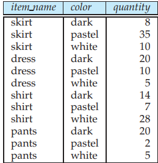

5.6.2 Cross-Tab and Relational Tables## 5.6.2 Cross-Tab and Relational Tables

A cross-tab is different from relational tables usually stored in databases, since the number of columns in the cross-tab depends on the actual data. A change in the data values may result in adding more columns, which is not desirable for data storage. However, a cross-tab view is desirable for display to users. It is straightforward to represent a cross-tab without summary values in a relational form with a fixed number of columns. A cross-tab with summary rows/columns can be represented by introducing a special value **all** to represent subtotals, as in Figure 5.21. The SQL standard actually uses the **null** value in place of **all**, but to avoid confusion with regular null values, we shall continue to use **all**.

**Figure 5.20** Cross tabulation of _sales_ with hierarchy on _item name_.  

**Figure 5.21** Relational representation of the data in Figure 5.17.

Consider the tuples (skirt, **all**, **all**, 53) and (dress, **all**, **all**, 35). We have obtained these tuples by eliminating individual tuples with different values for _color_ and _clothes size_, and by replacing the value of _quantity_ by an aggregate—namely, the sum of the quantities. The value **all** can be thought of as representing the set of all values for an attribute. Tuples with the value **all** for the _color_ and _clothes size_ dimensions can be obtained by an aggregation on the _sales_ relation with a **group by** on the column _item name_. Similarly, a **group by** on _color_, _clothes size_ can be used to get the tuples with the value **all** for _item name_, and a **group by** with no attributes (which can simply be omitted in SQL) can be used to get the tuple with value **all** for _item name_, _color_, and _clothes size_.

Hierarchies can also be represented by relations. For example, the fact that skirts and dresses fall under the womenswear category, and the pants and shirts under the menswear category can be represented by a relation _itemcategory_(_item name_, _c_ategory). This relation can be joined with the _sales_ relation, to get a relation

that includes the category for each item. Aggregation on this joined relation allows us to get a cross-tab with hierarchy. As another example, a hierarchy on city can be represented by a single relation _city hierarchy_ (ID, _city_, _state_, _country_, _region_), or by multiple relations, each mapping values in one level of the hierarchy to values at the next level. We assume here that cities have unique identifiers, stored in the attribute ID, to avoid confusing between two cities with the same name, e.g., the Springfield in Missouri and the Springfield in Illinois.  

**OLAP IMPLEMENTATION**

The earliest OLAP systems used multidimensional arrays in memory to store data cubes, and are referred to as **multidimensional OLAP (MOLAP)** systems. Later, OLAP facilities were integrated into relational systems, with data stored in a relational database. Such systems are referred to as **relational OLAP (ROLAP)** systems. Hybrid systems, which store some summaries in memory and store the base data and other summaries in a relational database, are called **hybrid OLAP (HOLAP)** systems.

Many OLAP systems are implemented as client-server systems. The server contains the relational database as well as any MOLAP data cubes. Client systems obtain views of the data by communicating with the server.

A naı̈ve way of computing the entire data cube (all groupings) on a relation is to use any standard algorithm for computing aggregate operations, one grouping at a time. The naı̈ve algorithm would require a large number of scans of the relation. A simple optimization is to compute an aggregation on, say, (_item name_, _color_) from an aggregation (_item name_, _color_, _clothes size_), instead of from

the original relation. For the standard SQL aggregate functions, we can compute an aggregate with

grouping on a set of attributes _A_ from an aggregate with grouping on a set of attributes _B_ if _A_ ⊆ _B_; you can do so as an exercise (see Exercise 5.24), but note that to compute **avg**, we additionally need the **count** value. (For some nonstandard aggregate functions, such as median, aggregates cannot be computed as above; the optimization described here does not apply to such _non-decomposable_ aggregate functions.) The amount of data read drops significantly by computing an aggregate from another aggregate, instead of from the original relation. Further improvements are possible; for instance, multiple groupings can be computed on a single scan of the data.

Early OLAP implementations precomputed and stored entire data cubes, that is, groupings on all subsets of the dimension attributes. Precomputation allows OLAP queries to be answered within a few seconds, even on datasets that may contain millions of tuples adding up to gigabytes of data. However, there are 2_n_ groupings with _n_ dimension attributes; hierarchies on attributes increase the number further. As a result, the entire data cube is often larger than the original relation that formed the data cube and in many cases it is not feasible to store the entire data cube.

Instead of precomputing and storing all possible groupings, it makes sense to precompute and store some of the groupings, and to compute others on demand. Instead of computing queries from the original relation, which may take a very long time, we can compute them from other precomputed queries. For instance, suppose that a query requires grouping by (_item name_, _color_), and this has not been precomputed. The query result can be computed from summaries by (_item name_, _color_, _clothes size_), if that has been precomputed. See the bibliographical

notes for references on how to select a good set of groupings for precomputation, given limits on the storage available for precomputed results.  

### 5.6.3 OLAP in SQL

Several SQL implementations, such as Microsoft SQL Server, and Oracle, support a **pivot** clause in SQL, which allows creation of cross-tabs. Given the _sales_ relation from Figure 5.16, the query:

**select** \* 
**from** _sales_ 
**pivot** (
**sum**(_quantity_) 
**for** _color_ **in** (’dark’,’pastel’,’white’
)
) 
**order by** _item name_;

returns the cross-tab shown in Figure 5.22. Note that the **for** clause within the **pivot** clause specifies what values from the attribute _color_ should appears as attribute names in the pivot result. The attribute _color_ itself is eliminated from the result, although all other attributes are retained, except that the values for the newly created attributes are specified to come from the attribute _quantity_. In case more than one tuple contributes values to a given cell, the aggregate operation within the **pivot** clause specifies how the values should be combined. In the above example, the _quantity_ values are summed up.

Note that the pivot clause by itself does not compute the subtotals we saw in the pivot table from Figure 5.17. However, we can first generate the relational representation shown in Figure 5.21, as outlined shortly, and then apply the pivot clause on that representation to get an equivalent result. In this case, the value **all** must also be listed in the **for** clause, and the **order by** clause needs to be modified to order **all** at the end.

**Figure 5.22** Result of SQL pivot operation on the _sales_ relation of Figure 5.16.  

**Figure 5.23** Query result.

The data in a data cube cannot be generated by a single SQL query, using the basic **group by** constructs, since aggregates are computed for several different groupings of the dimension attributes. For this reason, SQL includes functions to form the grouping needed for OLAP. We discuss these below.

SQL supports generalizations of the **group by** construct to perform the **cube** and **rollup** operations. The **cube** and **rollup** constructs in the **group by** clause allow multiple **group by** queries to be run in a single query with the result returned as a single relation in a style similar to that of the relation of Figure 5.21.

Consider again our retail shop example and the relation:

_sales_ (_item name_, _color_, _clothes size_, _quantity_)

We can find the number of items sold in each item name by writing a simple **group by** query:

**select** _item name_, **sum**(_quantity_) 
**from** _sales_ 
**group by** _item name_;

The result of this query is shown in Figure 5.23. Note that this represents the same data as the last column of Figure 5.17 (or equivalently, the first row in the cube of Figure 5.18).

Similarly, we can find the number of items sold in each color, etc. By using multiple attributes in the **group by** clause, we can find how many items were sold with a certain set of properties. For example, we can find a breakdown of sales by item-name and color by writing:

**select** _item name_, _color_, **sum**(_quantity_) 
**from** _sales_ 
**group by** _item name_, _color_;

The result of this query is shown in Figure 5.24. Note that this represents the same data as is shown in the the first 4 rows and first 4 columns of Figure 5.17 (or equivalently, the first 4 rows and columns in the cube of Figure 5.18).

If, however, we want to generate the entire data cube using this approach, we would have to write a separate query for each of the following sets of attributes:  

**Figure 5.24** Query result.

_{_ (_item name_, _color_, _clothes size_), (_item name_, _color_), (_item name_, _clothes size_), (_color_, _clothes size_), (_item name_), (_color_), (_clothes size_), () _}_

where () denotes an empty **group by** list. The **cube** construct allows us to accomplish this in one query:

**select** _item name_, color, _clothes size_, **sum**(_quantity_) **from** _sales_ **group by cube**(_item name_, _color_, _clothes size_);

The above query produces a relation whose schema is:

(_item name_, _color_, _clothes size_, **sum**(_quantity_))

So that the result of this query is indeed a relation, tuples in the result contain _null_ as the value of those attributes not present in a particular grouping. For example, tuples produced by grouping on _clothes size_ have a schema (_clothes size_, **sum**(_quantity_)). They are converted to tuples on (_item name_, _color_, _clothes size_,

**sum**(_quantity_)) by inserting _null_ for _item name_ and _color_. Data cube relations are often very large. The cube query above, with 3 possible

colors, 4 possible item names, and 3 sizes, has 80 tuples. The relation of Figure 5.21 is generated using grouping by _item name_ and _color_. It also uses **all** in place of _null_ so as to be more readable to the average user. To generate that relation in SQL, we arrange to substitute **all** for _null_. The query:

**select** _item name_, _color_, **sum**(_quantity_) **from** _sales_ **group by cube**(_item name_, _color_);  

**THE DECODE FUNCTION**

The **decode** function allows substitution of values in an attribute of a tuple. The general form of **decode** is:

**decode** (_value, match-1, replacement-1, match-2, replacement-2, . . ., match-N, replacement-N, default-replacement_);

It compares _value_ against the _match_ values and if a match is found, it replaces the attribute value with the corresponding replacement value. If no match succeeds, then the attribute value is replaced with the default replacement value.

The **decode** function does not work as we might like for null values because, as we saw in Section 3.6, predicates on nulls evaluate to **unknown**, which ultimately becomes **false**. To deal with this, we apply the **grouping** function, which returns 1 if its argument is a null value generated by a **cube** or **rollup** and 0 otherwise. Then the relation in Figure 5.21, with occurrences of **all** replaced by _null_, can be computed by the query:

**select decode**(**grouping**(_item name_), 1, ’all’, _item name_) **as** _item name_ **decode**(**grouping**(_color_), 1, ’all’, _color_) **as** _color_ **sum**(_quantity_) **as** _quantity_
**from** _sales_ 
**group by cube**(_item name_, _color_);

generates the relation of Figure 5.21 with nulls. The substitution of **all** is achieved using the SQL **decode** and **grouping** functions. The **decode** function is conceptually simple but its syntax is somewhat hard to read. See blue box for details.

The **rollup** construct is the same as the **cube** construct except that **rollup** generates fewer **group by** queries. We saw that **group by cube** (_item name_, _color_, _clothes size_) generated all 8 ways of forming a **group by** query using some (or all or none) of the attributes. In:

**select** _item name_, _color_, _clothes size_, **sum**(_quantity_) 
**from** _sales_ 
**group by rollup**(_item name_, _color_, _clothes size_);

**group by rollup**(_item name_, _color_, _clothes size_) generates only 4 groupings:

_{_ (_item name_, _color_, _clothes size_), (_item name_, _color_), (_item name_), () _}_

Notice that the order of the attributes in the **rollup** makes a difference; the final attribute (_clothes size_, in our example) appears in only one grouping, the penultimate (second last) attribute in 2 groupings, and so on, with the first attribute appearing in all groups but one (the empty grouping).  

Why might we want the specific groupings that are used in **rollup**? These groups are of frequent practical interest for hierarchies (as in Figure 5.19, for example). For the location hierarchy (_Region, Country, State, City_), we may want to group by _Region_ to get sales by region. Then we may want to “drill down” to the level of countries within each region, which means we would group by _Region, Country_. Drilling down further, we may wish to group by _Region, Country, State_ and then by _Region, Country, State, City_. The **rollup** construct allows us to specify this sequence of drilling down for further detail.

Multiple **rollup**s and **cube**s can be used in a single **group by** clause. For instance, the following query:

**select** _item name_, _color_, _clothes size_, **sum**(_quantity_) 
**from** _sales_ 
**group by rollup**(_item name_), **rollup**(_color_, _clothes size_);

generates the groupings:

_{_ (_item name_, _color_, _clothes size_), (_item name_, _color_), (_item name_), (_color_, _clothes size_), (_color_), () _}_

To understand why, observe that **rollup**(_item name_) generates two groupings, _{_(_item name_), ()_}_, and **rollup**(_color_, _clothes size_) generates three groupings, _{_(_color_, _clothes size_), (_color_), () _}_. The Cartesian product of the two gives us the six groupings shown.

Neither the **rollup** nor the **cube** clause gives complete control on the groupings that are generated. For instance, we cannot use them to specify that we want only groupings _{_(_color_, _clothes size_), (_clothes size_, _item name_)_}_. Such restricted groupings can be generated by using the **grouping** construct in the **having** clause; we leave the details as an exercise for you.

