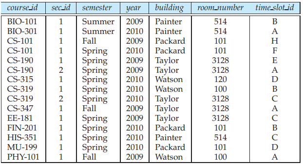
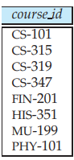
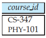
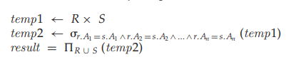
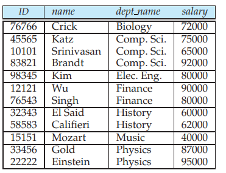

6.1 The Relational Algebra## 6.1 The Relational Algebra

The relational algebra is a _procedural_ query language. It consists of a set of operations that take one or two relations as input and produce a new relation as their result. The fundamental operations in the relational algebra are _select, project_, _union_, _set difference_, _Cartesian product,_ and _rename_. In addition to the fundamental operations, there are several other operations—namely, _set intersection_, _natural join_, and _assignment_. We shall define these operations in terms of the fundamental operations.

### 6.1.1 Fundamental Operations

The select, project, and rename operations are called _unary_ operations, because they operate on one relation. The other three operations operate on pairs of relations and are, therefore, called _binary_ operations.

#### 6.1.1.1 The Select Operation

The **select** operation selects tuples that satisfy a given predicate. We use the lowercase Greek letter sigma (σ) to denote selection. The predicate appears as a subscript to σ. The argument relation is in parentheses after the σ. Thus, to select

**Figure 6.1** The _instructor_ relation.

those tuples of the _instructor_ relation where the instructor is in the “Physics” department, we write:

σ_dept name_ \= “Physics” (_instructor_ )

If the _instructor_ relation is as shown in Figure 6.1, then the relation that results from the preceding query is as shown in Figure 6.2.

We can find all instructors with salary greater than $90,000 by writing:

σ_salary>_90000 (_instructor_ )

In general, we allow comparisons using =, σ=, _<_, ≤, _\>_, and ≥ in the selection predicate. Furthermore, we can combine several predicates into a larger predicate by using the connectives _and_ (∧), _or_ (∨), and _not_ (¬). Thus, to find the instructors in Physics with a salary greater than $90,000, we write:

σ_dept name_ \= “Physics” ∧ _salary>_90000 (_instructor_ )

The selection predicate may include comparisons between two attributes. To illustrate, consider the relation _department_. To find all departments whose name is the same as their building name, we can write:

σ_dept name_ \= _building_ (_department_)

**Figure 6.2** Result of σ_dept name_ \= “Physics” (_instructor_ ). 

**SQL VERSUS RELATIONAL ALGEBRA**

The term _select_ in relational algebra has a different meaning than the one used in SQL, which is an unfortunate historical fact. In relational algebra, the term _select_ corresponds to what we refer to in SQL as _where_. We emphasize the different interpretations here to minimize potential confusion.

#### 6.1.1.2 The Project Operation

Suppose we want to list all instructors’ _ID_, _name_, and _salary_, but do not care about the _dept name_. The **project** operation allows us to produce this relation. The project operation is a unary operation that returns its argument relation, with certain attributes left out. Since a relation is a set, any duplicate rows are eliminated. Projection is denoted by the uppercase Greek letter pi (). We list those attributes that we wish to appear in the result as a subscript to . The argument relation follows in parentheses. We write the query to produce such a list as:

π_ID, name, salary_ (_instructor_ )

Figure 6.3 shows the relation that results from this query.

#### 6.1.1.3 Composition of Relational Operations

The fact that the result of a relational operation is itself a relation is important. Consider the more complicated query “Find the name of all instructors in the Physics department.” We write:

**Figure 6.3** Result of _ID, name, salary_ (_instructor_ ).  

π_name_ (σ_dept name_ \= “Physics” (_instructor_ ))

Notice that, instead of giving the name of a relation as the argument of the projection operation, we give an expression that evaluates to a relation.

In general, since the result of a relational-algebra operation is of the same type (relation) as its inputs, relational-algebra operations can be composed together into a **relational-algebra expression**. Composing relational-algebra operations into relational-algebra expressions is just like composing arithmetic operations (such as +, −, ∗, and ÷) into arithmetic expressions. We study the formal definition of relational-algebra expressions in Section 6.1.2.

#### 6.1.1.4 The Union Operation

Consider a query to find the set of all courses taught in the Fall 2009 semester, the Spring 2010 semester, or both. The information is contained in the _section_ relation (Figure 6.4). To find the set of all courses taught in the Fall 2009 semester, we write:

π_course id_ (σ_semester_ \= “Fall” ∧ _year_\=2009 (_section_))

To find the set of all courses taught in the Spring 2010 semester, we write:

π_course id_ (σ_semester_ \= “Spring” ∧ _year_\=2010 (_section_))

To answer the query, we need the **union** of these two sets; that is, we need all section IDs that appear in either or both of the two relations. We find these data

**Figure 6.4** The _section_ relation.  

**Figure 6.5** Courses offered in either Fall 2009, Spring 2010 or both semesters.

by the binary operation union, denoted, as in set theory, by ∪. So the expression needed is:

π_course id_ (σ_semester_ \= “Fall” ∧ _year_\=2009 (_section_)) ∪ _course πid_ (_σ_semester_ \= “Spring” ∧ _year_\=2010 (_section_))

The result relation for this query appears in Figure 6.5. Notice that there are 8 tuples in the result, even though there are 3 distinct courses offered in the Fall 2009 semester and 6 distinct courses offered in the Spring 2010 semester. Since relations are sets, duplicate values such as CS-101, which is offered in both semesters, are replaced by a single occurrence.

Observe that, in our example, we took the union of two sets, both of which consisted of _course id_ values. In general, we must ensure that unions are taken between _compatible_ relations. For example, it would not make sense to take the union of the _instructor_ relation and the _student_ relation. Although both relations have four attributes, they differ on the _salary_ and _tot cred_ domains. The union of these two attributes would not make sense in most situations. Therefore, for a union operation _r_ ∪ _s_ to be valid, we require that two conditions hold:

**1\.** The relations _r_ and _s_ must be of the same arity. That is, they must have the same number of attributes.

**2\.** The domains of the _i_th attribute of _r_ and the _i_th attribute of _s_ must be the same, for all _i_ .

Note that _r_ and _s_ can be either database relations or temporary relations that are the result of relational-algebra expressions.

#### 6.1.1.5 The Set-Difference Operation

The **set-difference** operation, denoted by −, allows us to find tuples that are in one relation but are not in another. The expression _r_ − _s_ produces a relation containing those tuples in _r_ but not in _s_.  

**Figure 6.6** Courses offered in the Fall 2009 semester but not in Spring 2010 semester.

We can find all the courses taught in the Fall 2009 semester but not in Spring 2010 semester by writing:

<<<<<<< HEAD
_course id_ (_semester_ \= “Fall” ∧ _year_\=2009 (_section_)) _course id_ (_semester_ \= “Spring” ∧ _year_\=2010 (_section_))
=======
π_course id_ (σ_semester_ \= “Fall” ∧ _year_\=2009 (_section_)) - π_course id_ (σ_semester_ \= “Spring” ∧ _year_\=2010 (_section_))
>>>>>>> 0ecfe74e39ab7cceb756dfe2c8441bdba5f2f6d8

The result relation for this query appears in Figure 6.6. As with the union operation, we must ensure that set differences are taken

between _compatible_ relations. Therefore, for a set-difference operation _r_ − _s_ to be valid, we require that the relations _r_ and _s_ be of the same arity, and that the domains of the _i_th attribute of _r_ and the _i_th attribute of _s_ be the same, for all _i_ .

#### 6.1.1.6 The Cartesian-Product Operation

The **Cartesian-product** operation, denoted by a cross (×), allows us to combine information from any two relations. We write the Cartesian product of relations _r_~1~ and _r_~2~ as _r_~1~ × _r_~2~.

Recall that a relation is by definition a subset of a Cartesian product of a set of domains. From that definition, we should already have an intuition about the definition of the Cartesian-product operation. However, since the same attribute name may appear in both _r_~1~ and _r_~2~, we need to devise a naming schema to distinguish between these attributes. We do so here by attaching to an attribute the name of the relation from which the attribute originally came. For example, the relation schema for _r_ \= _instructor_ × _teaches_ is:

(_instructor_._ID_, _instructor_._name_, _instructor_._dept name_, _instructor_._salary teaches_._ID_, _teaches_._course id_, _teaches_._sec id_, _teaches_._semester_, _teaches_._year_)

With this schema, we can distinguish _instructor_._ID_ from _teaches_._ID_. For those attributes that appear in only one of the two schemas, we shall usually drop the relation-name prefix. This simplification does not lead to any ambiguity. We can then write the relation schema for _r_ as:

(_instructor_._ID_, _name_, _dept name_, _salary teaches_._ID_, _course id_, _sec id_, _semester_, _year_)

This naming convention _requires_ that the relations that are the arguments of the Cartesian-product operation have distinct names. This requirement causes problems in some cases, such as when the Cartesian product of a relation with itself is desired. A similar problem arises if we use the result of a relational-algebra expression in a Cartesian product, since we shall need a name for the relation so  

**Figure 6.7** The _teaches_ relation.

that we can refer to the relation’s attributes. In Section 6.1.1.7, we see how to avoid these problems by using the rename operation.

Now that we know the relation schema for _r_ \= _instructor_ × _teaches_, what tuples appear in _r_? As you may suspect, we construct a tuple of _r_ out of each possible pair of tuples: one from the _instructor_ relation (Figure 6.1) and one from the _teaches_ relation (Figure 6.7). Thus, _r_ is a large relation, as you can see from Figure 6.8, which includes only a portion of the tuples that make up _r_.1

Assume that we have _n_1 tuples in _instructor and n2 tuples in teaches. Then, there are n1 ∗ n2 ways of choosing a pair of tuples—one tuple from each relation; so there are n1 ∗ n2 tuples in r. In particular, note that for some tuples t in r, it may be that t[instructor.ID] α= t[teaches.ID].

<<<<<<< HEAD
In general, if we have relations _r_~1~(_r_~1~) and _r_~2~(_r_~2~), then _r_~1~ × _r_~2~ is a relation whose schema is the concatenation of _r_~1~ and _r_~2~\. Relation _R_ contains all tuples _t_ for which there is a tuple _t_~1~ in _r_~1~ and a tuple _t_~2~  in _r_~2~ for which _t_\[_r_~1~\] = _t_~1~\[_r_~1~\] and _t_\[_r_~2~\] = _t_~2~ \[_r_~2~\].
=======
In general, if we have relations r1(R1) and r2(R2), then r1 × r2 is a relation whose schema is the concatenation of R1 and R2. Relation R contains all tuples t for which there is a tuple t1 in r1 and a tuple t2 in r2 for which t[R1] = t1[R1] and t[R2] = t2[R2].
>>>>>>> 0ecfe74e39ab7cceb756dfe2c8441bdba5f2f6d8

Suppose that we want to find the names of all instructors in the Physics department together with the _course id_ of all courses they taught. We need the information in both the _instructor_ relation and the _teaches_ relation to do so. If we write:

α_dept name_ \= “Physics”(_instructor_ × _teaches_)

then the result is the relation in Figure 6.9.

**Figure 6.8** Result of _instructor_ × _teaches_.

We have a relation that pertains only to instructors in the Physics department. However, the _course id_ column may contain information about courses that were not taught by the corresponding instructor. (If you do not see why that is true, recall that the Cartesian product takes all possible pairings of one tuple from _instructor_ with one tuple of _teaches_.)

Since the Cartesian-product operation associates _every_ tuple of _instructor_ with every tuple of _teaches_, we know that if a an instructor is in the Physics department, and has taught a course (as recorded in the _teaches_ relation), then there is some 

**Figure 6.9** Result of α_dept name_ \= “Physics”(_instructor_ × _teaches_ ).

tuple in σ_dept name_ \= “Physics”(_instructor_ × _teaches_) that contains his name, and which satisfies _instructor_._ID_ \= _teaches_._ID_. So, if we write:

σ_instructor .ID_ \= _teaches .ID_ (σ_dept name_ \= “Physics”(_instructor_ × _teaches_))

we get only those tuples of _instructor_ × _teaches_ that pertain to instructors in Physics and the courses that they taught.

Finally, since we only want the names of all instructors in the Physics department together with the _course id_ of all courses they taught, we do a projection:

_name, course id_ (σ_instructor .ID_ \= _teaches .ID_ (σ_dept name_ \= “Physics”(_instructor_ × _teaches_)))

The result of this expression, shown in Figure 6.10, is the correct answer to our query. Observe that although instructor Gold is in the Physics department, he does not teach any course (as recorded in the _teaches_ relation), and therefore does not appear in the result.

**Figure 6.10** Result of _name, course id_ (α_instructor .ID_ \= _teaches.ID_ (α_dept name_ \= “Physics”(_instructor_ × _teaches_ ))).  

Note that there is often more than one way to write a query in relational algebra. Consider the following query:

_name, course id_ (σ_instructor .ID_ \= _teaches .ID_ ((σ_dept name_ \= “Physics”(_instructor_ )) × _teaches_))

Note the subtle difference between the two queries: in the query above, the selection that restricts _dept name_ to Physics is applied to _instructor_, and the Cartesian product is applied subsequently; in contrast, the Cartesian product was applied before the selection in the earlier query. However, the two queries are **equivalent**; that is, they give the same result on any database.

#### 6.1.1.7 The Rename Operation

Unlike relations in the database, the results of relational-algebra expressions do not have a name that we can use to refer to them. It is useful to be able to give them names; the **rename** operator, denoted by the lowercase Greek letter rho (ρ ), lets us do this. Given a relational-algebra expression _E_ , the expression

ρ~x~ (_E_)

returns the result of expression _E_ under the name _x_. A relation _r_ by itself is considered a (trivial) relational-algebra expression.

Thus, we can also apply the rename operation to a relation _r_ to get the same relation under a new name.

A second form of the rename operation is as follows: Assume that a relationalalgebra expression _E_ has arity _n_. Then, the expression

ρ_x_(_A_1_,A_2_,...,An_) (_E_)

returns the result of expression _E_ under the name _x_, and with the attributes renamed to _A_1_, A_2_, . . . , An_.

To illustrate renaming a relation, we consider the query “Find the highest salary in the university.” Our strategy is to (1) compute first a temporary relation consisting of those salaries that are _not_ the largest and (2) take the set difference between the relation _salary_ (_instructor_ ) and the temporary relation just computed, to obtain the result.

**1\.** Step 1: To compute the temporary relation, we need to compare the values of all salaries. We do this comparison by computing the Cartesian product _instructor_ × _instructor_ and forming a selection to compare the value of any two salaries appearing in one tuple. First, we need to devise a mechanism to distinguish between the two _salary_ attributes. We shall use the rename operation to rename one reference to the instructor relation; thus we can reference the relation twice without ambiguity.  

**Figure 6.11** Result of the subexpression _instructor .salary_ (α_instructor .salary < d .salary_ (_instructor_ × ρ_d_ (_instructor_ ))).

We can now write the temporary relation that consists of the salaries that are not the largest:

_instructor .salary_ (α_instructor .salary < d .salary_ (_instructor_ × ρ_d_ (_instructor_ )))

This expression gives those salaries in the _instructor_ relation for which a larger salary appears somewhere in the _instructor_ relation (renamed as _d_). The result contains all salaries _except_ the largest one. Figure 6.11 shows this relation.

**2\.** Step 2: The query to find the largest salary in the university can be written as:

_salary_ (_instructor_ ) − _instructor .salary_ (α_instructor .salary < d .salary_ (_instructor_ × ρ_d_ (_instructor_ )))

Figure 6.12 shows the result of this query.

The rename operation is not strictly required, since it is possible to use a positional notation for attributes. We can name attributes of a relation implicitly by using a positional notation, where $1, $2, _. . ._ refer to the first attribute, the second attribute, and so on. The positional notation also applies to results of relationalalgebra operations. The following relational-algebra expression illustrates the

**Figure 6.12** Highest salary in the university.  

use of positional notation to write the expression we saw earlier, which computes salaries that are not the largest:

π$4 (σ$4 < $8 (instructor × instructor ))

<<<<<<< HEAD
Note that the Cartesian product concatenates the attributes of the two relations. Thus, for the result of the Cartesian product (_instructor_ × _instructor_), $4 refers to the _salary_ attribute from the first occurrence of _instructor_, while $8 refers to the _salary_ attribute from the second occurrence of _instructor_. A positional notation can also be used to refer to relation names, if a binary operation needs to distinguish between its two operand relations. For example, $_r_~1~ could refer to the first operand relation, and $_r_~2~ could refer to the second operand relation of a Cartesian product. However, the positional notation is inconvenient for humans, since the position of the attribute is a number, rather than an easy-to-remember attribute name. Hence, we do not use the positional notation in this textbook.
=======
Note that the Cartesian product concatenates the attributes of the two relations. Thus, for the result of the Cartesian product (_instructor_ × _instructor_), 4 refers to the _salary_ attribute from the first occurrence of _instructor_, while 8 refers to the _salary_ attribute from the second occurrence of _instructor_. A positional notation can also be used to refer to relation names, if a binary operation needs to distinguish between its two operand relations. For example, _R_1 could refer to the first operand relation, and _R_2 could refer to the second operand relation of a Cartesian product. However, the positional notation is inconvenient for humans, since the position of the attribute is a number, rather than an easy-to-remember attribute name. Hence, we do not use the positional notation in this textbook.
>>>>>>> 0ecfe74e39ab7cceb756dfe2c8441bdba5f2f6d8

### 6.1.2 Formal Definition of the Relational Algebra

The operations in Section 6.1.1 allow us to give a complete definition of an expression in the relational algebra. A basic expression in the relational algebra consists of either one of the following:

• A relation in the database

• A constant relation

A constant relation is written by listing its tuples within { }, for example { (22222, Einstein, Physics, 95000), (76543, Singh, Finance, 80000) }.

A general expression in the relational algebra is constructed out of smaller subexpressions. Let _E_1 and _E_2 be relational-algebra expressions. Then, the following are all relational-algebra expressions:

• _E_1 ∪ _E_2

• _E_1 − _E_2

• _E_1 × _E_2

• α_P_ (_E_1), where _P_ is a predicate on attributes in _E_1

• _αS_(_E_1), where _S_ is a list consisting of some of the attributes in _E_1

• ρ_x_ (_E_1), where _x_ is the new name for the result of _E_1

### 6.1.3 Additional Relational-Algebra Operations

The fundamental operations of the relational algebra are sufficient to express any relational-algebra query. However, if we restrict ourselves to just the fundamental operations, certain common queries are lengthy to express. Therefore, we define additional operations that do not add any power to the algebra, but simplify  

**Figure 6.13** Courses offered in both the Fall 2009 and Spring 2010 semesters.

common queries. For each new operation, we give an equivalent expression that uses only the fundamental operations.

#### 6.1.3.1 The Set-Intersection Operation

The first additional relational-algebra operation that we shall define is **set intersection** (∩). Suppose that we wish to find the set of all courses taught in both the Fall 2009 and the Spring 2010 semesters. Using set intersection, we can write

π_course id_ (α_semester_ \= “Fall” ∧ _year_\=2009 (_section_)) ∩ π_course id_ (α_semester_ \= “Spring” ∧ _year_\=2010 (_section_))

The result relation for this query appears in Figure 6.13. Note that we can rewrite any relational-algebra expression that uses set in-

tersection by replacing the intersection operation with a pair of set-difference operations as:

_r_ ∩ _s_ \= _r_ − (_r_ − _s_)

Thus, set intersection is not a fundamental operation and does not add any power to the relational algebra. It is simply more convenient to write _r_ ∩ _s_ than to write _r_ − (_r_ − _s_).

#### 6.1.3.2 The Natural-Join Operation

It is often desirable to simplify certain queries that require a Cartesian product. Usually, a query that involves a Cartesian product includes a selection operation on the result of the Cartesian product. The selection operation most often requires that all attributes that are common to the relations that are involved in the Cartesian product be equated.

In our example query from Section 6.1.1.6 that combined information from the _instructor_ and _teaches_ tables, the matching condition required _instructor_._ID_ to be equal to _teaches_._ID_. These are the only attributes in the two relations that have the same name.

<<<<<<< HEAD
The _natural join_ is a binary operation that allows us to combine certain selections and a Cartesian product into one operation. It is denoted by the **join** symbol . The natural-join operation forms a Cartesian product of its two arguments, performs a selection forcing equality on those attributes that appear in both relation schemas, and finally removes duplicate attributes. Returning to the example of the relations _instructor_ and _teaches_, computing _instructor_ **natural join** _teaches_ considers only those pairs of tuples where both the tuple from _instructor_ and the  

**230 Chapter 6 Formal Relational Query Languages**

_ID name dept name salary course id sec id semester year_ 10101 Srinivasan Comp. Sci. 65000 CS-101 1 Fall 2009 10101 Srinivasan Comp. Sci. 65000 CS-315 1 Spring 2010 10101 Srinivasan Comp. Sci. 65000 CS-347 1 Fall 2009 12121 Wu Finance 90000 FIN-201 1 Spring 2010 15151 Mozart Music 40000 MU-199 1 Spring 2010 22222 Einstein Physics 95000 PHY-101 1 Fall 2009 32343 El Said History 60000 HIS-351 1 Spring 2010 45565 Katz Comp. Sci. 75000 CS-101 1 Spring 2010 45565 Katz Comp. Sci. 75000 CS-319 1 Spring 2010 76766 Crick Biology 72000 BIO-101 1 Summer 2009 76766 Crick Biology 72000 BIO-301 1 Summer 2010 83821 Brandt Comp. Sci. 92000 CS-190 1 Spring 2009 83821 Brandt Comp. Sci. 92000 CS-190 2 Spring 2009 83821 Brandt Comp. Sci. 92000 CS-319 2 Spring 2010 98345 Kim Elec. Eng. 80000 EE-181 1 Spring 2009
=======
The _natural join_ is a binary operation that allows us to combine certain selec- tions and a Cartesian product into one operation. It is denoted by the **join** symbol . The natural-join operation forms a Cartesian product of its two arguments, performs a selection forcing equality on those attributes that appear in both rela- tion schemas, and finally removes duplicate attributes. Returning to the example of the relations _instructor_ and _teaches_, computing _instructor_ **natural join** _teaches_ considers only those pairs of tuples where both the tuple from _instructor_ and the  

>>>>>>> 0ecfe74e39ab7cceb756dfe2c8441bdba5f2f6d8

**Figure 6.14** The natural join of the _instructor_ relation with the _teaches_ relation.

tuple from _teaches_ have the same value on the common attribute _ID_. The result relation, shown in Figure 6.14, has only 13 tuples, the ones that give information about an instructor and a course that that instructor actually teaches. Notice that we do not repeat those attributes that appear in the schemas of both relations; rather they appear only once. Notice also the order in which the attributes are listed: first the attributes common to the schemas of both relations, second those attributes unique to the schema of the first relation, and finally, those attributes unique to the schema of the second relation.

Although the definition of natural join is complicated, the operation is easy to apply. As an illustration, consider again the example “Find the names of all instructors together with the _course id_ of all courses they taught.” We express this query by using the natural join as follows:

π_name, course id_ (_instructor α teaches_)

Since the schemas for _instructor_ and _teaches_ have the attribute _ID_ in common, the natural-join operation considers only pairs of tuples that have the same value on _ID_. It combines each such pair of tuples into a single tuple on the union of the two schemas; that is, (_ID_, _name_, _dept name_, _salary_, _course id_). After performing the projection, we obtain the relation in Figure 6.15.

Consider two relation schemas _R_ and _S_—which are, of course, lists of attribute names. If we consider the schemas to be _sets_, rather than lists, we can denote those attribute names that appear in both _R_ and _S_ by _R_ ∩ _S_, and denote those attribute names that appear in _R_, in _S_, or in both by _R_ ∪ _S_. Similarly, those attribute names that appear in _R_ but not _S_ are denoted by _R_ − _S_, whereas _S_ − _R_ denotes those 

attribute names that appear in _S_ but not in _R_. Note that the union, intersection, and difference operations here are on sets of attributes, rather than on relations.

We are now ready for a formal definition of the natural join. Consider two relations _r_ (_R_) and _s_(_S_). The **natural join** of _r_ and _s_, denoted by _r α s_, is a relation on schema _R_ ∪ _S_ formally defined as follows:

where _R_ ∩ _S_ \= _{A_1_, A_2_, . . . , An}_. Please note that if _r_ (_R_) and _s_(_S_) are relations without any attributes in common, that is, _R_ ∩ _S_ \= ∅, then _r α s_ \= _r_ × _s_. Let us consider one more example of the use of natural join, to write the query

“Find the names of all instructors in the Comp. Sci. department together with the course titles of all the courses that the instructors teach.”

The result relation for this query appears in Figure 6.16. Notice that we wrote _instructor  teaches  course_ without inserting parenthe-

ses to specify the order in which the natural-join operations on the three relations should be executed. In the preceding case, there are two possibilities:

We did not specify which expression we intended, because the two are equivalent. That is, the natural join is **associative**. 

The _theta join_ operation is a variant of the natural-join operation that allows us to combine a selection and a Cartesian product into a single operation. Consider relations _r_ (_R_) and _s_(_S_), and let  be a predicate on attributes in the schema _R_ ∪ _S_. The **theta join** operation _r _ _s_ is defined as follows:

#### 6.1.3.3 The Assignment Operation

It is convenient at times to write a relational-algebra expression by assigning parts of it to temporary relation variables. The **assignment** operation, denoted by ←, works like assignment in a programming language. To illustrate this operation, consider the definition of the natural-join operation. We could write _r  s_ as:

The evaluation of an assignment does not result in any relation being displayed to the user. Rather, the result of the expression to the right of the ← is assigned to the relation variable on the left of the ←. This relation variable may be used in subsequent expressions.

With the assignment operation, a query can be written as a sequential program consisting of a series of assignments followed by an expression whose value is displayed as the result of the query. For relational-algebra queries, assignment must always be made to a temporary relation variable. Assignments to permanent relations constitute a database modification. Note that the assignment operation does not provide any additional power to the algebra. It is, however, a convenient way to express complex queries.

#### 6.1.3.4 Outer join Operations

The **outer-join** operation is an extension of the join operation to deal with missing information. Suppose that there is some instructor who teaches no courses. Then  

**Figure 6.17** Result of _instructor  teaches_ .

the tuple in the _instructor_ relation (Figure 6.1) for that particular instructor would not satisfy the condition of a natural join with the _teaches_ relation (Figure 6.7) and that instructor’s data would not appear in the result of the natural join, shown in Figure 6.14. For example, instructors Califieri, Gold, and Singh do not appear in the result of the natural join, since they do not teach any course.

More generally, some tuples in either or both of the relations being joined may be “lost” in this way. The **outer join** operation works in a manner similar to the natural join operation we have already studied, but preserves those tuples that would be lost in an join by creating tuples in the result containing null values.

We can use the _outer-join_ operation to avoid this loss of information. There are actually three forms of the operation: _left outer join_, denoted ; _right outer join_, denoted  ; and _full outer join_, denoted  . All three forms of outer join compute the join, and add extra tuples to the result of the join. For example, the results of the expression _instructor  teaches_ and _teaches  instructor_ appear in Figures 6.17 and 6.18, respectively.

The **left outer join** ( ) takes all tuples in the left relation that did not match with any tuple in the right relation, pads the tuples with null values for all other attributes from the right relation, and adds them to the result of the natural join. In Figure 6.17, tuple (58583, Califieri, History, 62000, _null_, _null_, _null_, _null_), is such a tuple. All information from the left relation is present in the result of the left outer join.  

The **right outer join** ( ) is symmetric with the left outer join: It pads tuples from the right relation that did not match any from the left relation with nulls and adds them to the result of the natural join. In Figure 6.18, tuple (58583, _null_, _null_, _null_, _null_, Califieri, History, 62000), is such a tuple. Thus, all information from the right relation is present in the result of the right outer join.

The **full outer join**(  ) does both the left and right outer join operations, padding tuples from the left relation that did not match any from the right relation, as well as tuples from the right relation that did not match any from the left relation, and adding them to the result of the join.

Note that in going from our left-outer-join example to our right-outer-join example, we chose to swap the order of the operands. Thus both examples preserve tuples from the _instructor_ relation, and thus contain the same information. In our example relations, _teaches_ tuples always have matching _instructor_ tuples, and thus _teaches  instructor_ would give the same result as _teaches  instructor_ . If there were tuples in _teaches_ without matching tuples in _instructor_, such tuples would appear padded with nulls in _teaches  instructor_ as well as in _teaches  instructor_ . Further examples of outer joins (expressed in SQL syntax) may be found in Section 4.1.2.

Since outer-join operations may generate results containing null values, we need to specify how the different relational-algebra operations deal with null values. Section 3.6 dealt with this issue in the context of SQL. The same concepts apply for the case of relational algebra, and we omit details.  

It is interesting to note that the outer-join operations can be expressed by the basic relational-algebra operations. For instance, the left outer join operation, _r  s_, can be written as:

where the constant relation {(_null, . . . , null_)} is on the schema _S_ − _R_.

### 6.1.4 Extended Relational-Algebra Operations

We now describe relational-algebra operations that provide the ability to write queries that cannot be expressed using the basic relational-algebra operations. These operations are called **extended relational-algebra** operations.

#### 6.1.4.1 Generalized Projection

The first operation is the **generalized-projection** operation, which extends the projection operation by allowing operations such as arithmetic and string functions to be used in the projection list. The generalized-projection operation has the form:

πF _1_,F _2_,...,Fn (_E_)

where _E_ is any relational-algebra expression, and each of _F_1_, F_2_, . . . , Fn_ is an arithmetic expression involving constants and attributes in the schema of _E_ . As a base case, the expression may be simply an attribute or a constant. In general, an expression can use arithmetic operations such as +_,_ −_,_ ∗, and ÷ on numeric valued attributes, numeric constants, and on expressions that generate a numeric result. Generalized projection also permits operations on other data types, such as concatenation of strings.

For example, the expression:

_πID,name,dept name,salary_÷12(_instructor_ )

gives the _ID_, _name_, _dept name_, and the monthly salary of each instructor.

#### 6.1.4.2 Aggregation

The second extended relational-algebra operation is the aggregate operation _G_, which permits the use of aggregate functions such as min or average, on sets of values.

**Aggregate functions** take a collection of values and return a single value as a result. For example, the aggregate function **sum** takes a collection of values and returns the sum of the values. Thus, the function **sum** applied on the collection:

{_1_,_1_,_3_,_4_,_4_,_1_}  

returns the value 24. The aggregate function **avg** returns the average of the values. When applied to the preceding collection, it returns the value 4. The aggregate function **count** returns the number of the elements in the collection, and returns 6 on the preceding collection. Other common aggregate functions include **min** and **max**, which return the minimum and maximum values in a collection; they return 1 and 11, respectively, on the preceding collection.

The collections on which aggregate functions operate can have multiple occurrences of a value; the order in which the values appear is not relevant. Such collections are called **multisets**. Sets are a special case of multisets where there is only one copy of each element.

To illustrate the concept of aggregation, we shall use the _instructor_ relation. Suppose that we want to find out the sum of salaries of all instructors; the relational-algebra expression for this query is:

The symbol _G_ is the letter G in calligraphic font; read it as “calligraphic G.” The relational-algebra operation _G_ signifies that aggregation is to be applied, and its subscript specifies the aggregate operation to be applied. The result of the expression above is a relation with a single attribute, containing a single row with a numerical value corresponding to the sum of the salaries of all instructors.

There are cases where we must eliminate multiple occurrences of a value before computing an aggregate function. If we do want to eliminate duplicates, we use the same function names as before, with the addition of the hyphenated string “**distinct**” appended to the end of the function name (for example, **countdistinct**). An example arises in the query “Find the total number of instructors who teach a course in the Spring 2010 semester.” In this case, an instructor counts only once, regardless of the number of course sections that the instructor teaches. The required information is contained in the relation _teaches_, and we write this query as follows:

The aggregate function **count-distinct** ensures that even if an instructor teaches more than one course, she is counted only once in the result.

There are circumstances where we would like to apply the aggregate function not to a single set of tuples, but instead to a group of sets of tuples. As an illustration, consider the query “Find the average salary in each department.” We write this query as follows:

Figure 6.19 shows the tuples in the _instructor_ relation grouped by the _dept name_ attribute. This is the first step in computing the query result. The specified

aggregate is computed for each group, and the result of the query is shown in Figure 6.20. 

**Figure 6.19** Tuples of the _instructor_ relation, grouped by the _dept name_ attribute

In contrast, consider the query “Find the average salary of all instructors.” We write this query as follows:

In this case the attribute _dept name_ has been omitted from the left side of the _G_ operator, so the entire relation is treated as a single group.

The general form of the **aggregation operation** _G_ is as follows:

where _E_ is any relational-algebra expression; _G_1_, G_2_, . . . , Gn_ constitute a list of attributes on which to group; each _Fi_ is an aggregate function; and each _Ai_ is an attribute name. The meaning of the operation is as follows: The tuples in the result of expression _E_ are partitioned into groups in such a way that:

**Figure 6.20** The result relation for the query “Find the average salary in each department”.  

**MULTISET RELATIONAL ALGEBRA**

Unlike the relational algebra, SQL allows multiple copies of a tuple in an input relation as well as in a query result. The SQL standard defines how many copies of each tuple are there in the output of a query, which depends in turn on how many copies of tuples are present in the input relations.

To model this behavior of SQL, a version of relational algebra, called the **multiset relational algebra**, is defined to work on multisets, that is, sets that may contain duplicates. The basic operations in the multiset relational algebra are defined as follows:

**1\.** If there are _c_1 copies of tuple _t_~1~ in _r_~1~, and _t_~1~ satisfies selection  , then there are _c_1 copies of _t_~1~ in (_r_~1~).

**2\.** For each copy of tuple _t_~1~ in _r_~1~, there is a copy of tuple _A_(_t_~1~) in _A_(_r_~1~), where _A_(_t_~1~) denotes the projection of the single tuple _t_~1~.

**3\.** If there are _c_1 copies of tuple _t_~1~ in _r_~1~ and _c_2 copies of tuple _t_~2~  in _r_~2~, there are _c_1 ∗ _c_2 copies of the tuple _t_~1~_.t_2 in _r_~1~ × _r_~2~.

For example, suppose that relations _r_~1~ with schema (_A, B_) and _r_~2~ with schema (_C_) are the following multisets:

_r_~1~ = {(1_, a_)_,_ (2_, a_)} _r_~2~ = {(2)_,_ (3)_,_ (3)}

<<<<<<< HEAD
Then _B_(_r_~1~) would be {(_a_)_,_ (_a_)}, whereas _B_(_r_~1~) × _r_~2~ would be:
=======
Then _πB_(_r_1) would be {(_a_)_,_ (_a_)}, whereas _πB_(_r_1) × _r_2 would be:
>>>>>>> 0ecfe74e39ab7cceb756dfe2c8441bdba5f2f6d8

{(_a,_ 2)_,_ (_a,_ 2)_,_ (_a,_ 3)_,_ (_a,_ 3)_,_ (_a,_ 3)_,_ (_a,_ 3)}

Multiset union, intersection and set difference can also be defined in a similar way, following the corresponding definitions in SQL, which we saw in Section 3.5. There is no change in the definition of the aggregation operation.

**1\.** All tuples in a group have the same values for _G_1_, G_2_, . . . , Gn_.

**2\.** Tuples in different groups have different values for _G_1_, G_2_, . . . , Gn_.

Thus, the groups can be identified by the values of attributes _G_1_, G_2_, . . . , Gn_. For each group (_g_1_, g_2_, . . . , gn_), the result has a tuple (_g_1_, g_2_, . . . , gn, a_1_, a_2_, . . . , am_) where, for each _i_ , _ai_ is the result of applying the aggregate function _Fi_ on the multiset of values for attribute _Ai_ in the group.

As a special case of the aggregate operation, the list of attributes _G_1_, G_2_, . . . , Gn_ can be empty, in which case there is a single group containing all tuples in the relation. This corresponds to aggregation without grouping.  

**SQL AND RELATIONAL ALGEBRA**

From a comparison of the relational algebra operations and the SQL operations, it should be clear that there is a close connection between the two. A typical SQL query has the form:

**select** _A_1_, A_2_, . . . , An_

**from** _r_~1~_, r_2_, . . . , rm_

**where** _P_

Each _Ai_ represents an attribute, and each _ri_ a relation. _P_ is a predicate. The query is equivalent to the multiset relational-algebra expression:

<<<<<<< HEAD
_A_1_, A_2_,...,An_ (_P_ (_r_~1~ × _r_~2~ × · · · × _rm_))
=======
_πA_1_, A_2_,...,An_ (π_P_ (_r_1 × _r_2 × · · · × _rm_))
>>>>>>> 0ecfe74e39ab7cceb756dfe2c8441bdba5f2f6d8

If the **where** clause is omitted, the predicate _P_ is **true**. More complex SQL queries can also be rewritten in relational algebra. For
example, the query:

<<<<<<< HEAD
**select** _A_1_, A_2, **sum**(_A_3) **from** _r_~1~_, r_2_, . . . , rm_

**where** _P_ **group by** _A_1_, A_2

is equivalent to:

_A_1_, A_2_G_sum(_A_3)(_A_1_, A_2_,..., An_(_P_ (_r_~1~ × _r_~2~ × · · · × _rm_)))
=======
**select** _A_1_, A_2, **sum**(_A_3) 
**from** _r_1_, r_2_, . . . , rm_
**where** _P_ 
**group by** _A_1_, A_2

is equivalent to:

_A_1_, A_2_G_sum(_A_3)(_πA_1_, A_2_,..., Aσn_(_P_ (_r_1 × _r_2 × · · · × _rm_)))
>>>>>>> 0ecfe74e39ab7cceb756dfe2c8441bdba5f2f6d8

Join expressions in the **from** clause can be written using equivalent join expressions in relational algebra; we leave the details as an exercise for the reader. However, subqueries in the **where** or **select** clause cannot be rewritten into relational algebra in such a straightforward manner, since there is no relationalalgebra operation equivalent to the subquery construct. Extensions of relational algebra have been proposed for this task, but are beyond the scope of this book.

