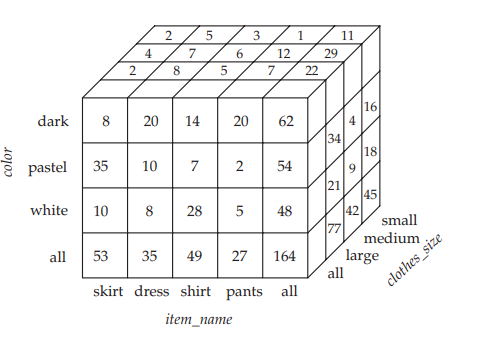

5.6 OLAP\*\*## 5.6 OLAP\*\*

An online analytical processing (OLAP) system is an interactive system that permits an analyst to view different summaries of multidimensional data. The word _online_ indicates that an analyst must be able to request new summaries and get responses online, within a few seconds, and should not be forced to wait for a long time to see the result of a query.

There are many OLAP products available, including some that ship with database products such as Microsoft SQL Server, and Oracle, and other standalone tools. The initial versions of many OLAP tools assumed that data is memory resident. Data analysis on small amounts of data can in fact be performed using spreadsheet applications, such as Excel. However, OLAP on very large amounts of data requires that data be resident in a database, and requires support from the database for efficient preprocessing of data as well as for online query processing. In this section, we study extensions of SQL to support such tasks.

### 5.6.1 Online Analytical Processing

Consider an application where a shop wants to find out what kinds of clothes are popular. Let us suppose that clothes are characterized by their item name, color, and size, and that we have a relation _sales_ with the schema.

**Figure 5.16** An example of _sales_ relation.

Suppose that _item name_ can take on the values (skirt, dress, shirt, pants), _color_ can take on the values (dark, pastel, white), _clothes size_ can take on values (small, medium, large), and _quantity_ is an integer value representing the total number of items of a given _{item name_, _color_, _clothes size }_. An instance of the _sales_ relation is shown in Figure 5.16.  

Statistical analysis often requires grouping on multiple attributes. Given a relation used for data analysis, we can identify some of its attributes as **measure** attributes, since they measure some value, and can be aggregated upon. For instance, the attribute _quantity_ of the _sales_ relation is a measure attribute, since it measures the number of units sold. Some (or all) of the other attributes of the relation are identified as **dimension attributes**, since they define the dimensions on which measure attributes, and summaries of measure attributes, are viewed. In the _sales_ relation, _item name_, _color_, and _clothes size_ are dimension attributes. (A more realistic version of the _sales_ relation would have additional dimensions, such as time and sales location, and additional measures such as monetary value of the sale.)

Data that can be modeled as dimension attributes and measure attributes are called **multidimensional data**.

To analyze the multidimensional data, a manager may want to see data laid out as shown in the table in Figure 5.17. The table shows total quantities for different combinations of _item name_ and _color_. The value of _clothes size_ is specified to be **all**, indicating that the displayed values are a summary across all values of _clothes size_ (that is, we want to group the “small”, “medium”, and “large” items into one single group.

The table in Figure 5.17 is an example of a **cross-tabulation** (or **cross-tab**, for short), also referred to as a **pivot-table**. In general, a cross-tab is a table derived from a relation (say _R_), where values for one attribute of relation _R_ (say _A_) form the row headers and values for another attribute of relation _R_ (say _B_) form the column header. For example, in Figure 5.17, the attribute _item name_ corresponds to _A_ (with values “dark”, “pastel”, and “white”), and the attribute _color_ corresponds to to _B_ (with attributes “skirt”, “dress”, “shirt”, and “pants”).

Each cell in the pivot-table can be identified by (_ai , b j_ ), where _ai_ is a value for _A_ and _b j_ a value for _B_. The values of the various cells in the pivot-table are derived from the relation _R_ as follows: If there is at most one tuple in _R_ with any (_ai , b j_ ) value, the value in the cell is derived from that single tuple (if any); for instance, it could be the value of one or more other attributes of the tuple. If there can be multiple tuples with an (_ai , b j_ ) value, the value in the cell must be derived

**Figure 5.17** Cross tabulation of _sales_ by _item name_ and _color_.

**Figure 5.18** Three-dimensional data cube.

by aggregation on the tuples with that value. In our example, the aggregation used is the sum of the values for attribute _quantity_, across all values for _clothes size_, as indicated by “_clothes size_: **all**” above the cross-tab in Figure 5.17. Thus, the

value for cell (skirt, pastel) is 35, since there are 3 tuples in the _sales_ table that meet that criteria, with values 11, 9, and 15.

In our example, the cross-tab also has an extra column and an extra row storing the totals of the cells in the row/column. Most cross-tabs have such summary rows and columns.

The generalization of a cross-tab, which is two-dimensional, to _n_ dimensions can be visualized as an _n_\-dimensional cube, called the **data cube**. Figure 5.18 shows a data cube on the _sales_ relation. The data cube has three dimensions, _item name_, _color_, and _clothes size_, and the measure attribute is _quantity_. Each cell is identified by values for these three dimensions. Each cell in the data cube contains a value, just as in a cross-tab. In Figure 5.18, the value contained in a cell is shown on one of the faces of the cell; other faces of the cell are shown blank if they are visible. All cells contain values, even if they are not visible. The value for a dimension may be **all**, in which case the cell contains a summary over all values of that dimension, as in the case of cross-tabs.

The number of different ways in which the tuples can be grouped for aggregation can be large. In the example of Figure 5.18, there are 3 colors, 4 items, and 3 sizes resulting in a cube size of 3 × 4 × 3 = 36. Including the summary values, we obtain a 4 × 5 × 4 cube, whose size is 80. In fact, for a table with _n_ dimensions, aggregation can be performed with grouping on each of the 2_n_ subsets of the _n_ dimensions.12

With an OLAP system, a data analyst can look at different cross-tabs on the same data by interactively selecting the attributes in the cross-tab. Each cross-tab is a two-dimensional view on a multidimensional data cube. For instance, the analyst may select a cross-tab on _item name_ and _clothes size_ or a cross-tab on _color_ and _clothes size_. The operation of changing the dimensions used in a cross-tab is called **pivoting**.

OLAP systems allow an analyst to see a cross-tab on _item name_ and _color_ for a fixed value of _clothes size_, for example, large, instead of the sum across all sizes. Such an operation is referred to as **slicing**, since it can be thought of as viewing a slice of the data cube. The operation is sometimes called **dicing**, particularly when values for multiple dimensions are fixed.

When a cross-tab is used to view a multidimensional cube, the values of dimension attributes that are not part of the cross-tab are shown above the crosstab. The value of such an attribute can be **all**, as shown in Figure 5.17, indicating that data in the cross-tab are a summary over all values for the attribute. Slicing/dicing simply consists of selecting specific values for these attributes, which are then displayed on top of the cross-tab.

OLAP systems permit users to view data at any desired level of granularity. The operation of moving from finer-granularity data to a coarser granularity (by means of aggregation) is called a **rollup**. In our example, starting from the data cube on the _sales_ table, we got our example cross-tab by rolling up on the attribute _clothes size_. The opposite operation—that of moving from coarser-granularity data to finer-granularity data—is called a **drill down**. Clearly, finer-granularity data cannot be generated from coarse-granularity data; they must be generated either from the original data, or from even finer-granularity summary data.

Analysts may wish to view a dimension at different levels of detail. For instance, an attribute of type **datetime** contains a date and a time of day. Using time precise to a second (or less) may not be meaningful: An analyst who is interested in rough time of day may look at only the hour value. An analyst who is interested in sales by day of the week may map the date to a day of the week and look only at that. Another analyst may be interested in aggregates over a month, or a quarter, or for an entire year.

The different levels of detail for an attribute can be organized into a **hierarchy**. Figure 5.19a shows a hierarchy on the **datetime** attribute. As another example, Figure 5.19b shows a hierarchy on location, with the city being at the bottom of the hierarchy, state above it, country at the next level, and region being the top level. In our earlier example, clothes can be grouped by category (for instance, menswear or womenswear); _category_ would then lie above _item name_ in our hierarchy on clothes. At the level of actual values, skirts and dresses would fall under the womenswear category and pants and shirts under the menswear category.

An analyst may be interested in viewing sales of clothes divided as menswear and womenswear, and not interested in individual values. After viewing the aggregates at the level of womenswear and menswear, an analyst may _drill down the hierarchy_ to look at individual values. An analyst looking at the detailed level may _drill up the hierarchy_ and look at coarser-level aggregates. Both levels can be displayed on the same cross-tab, as in Figure 5.20. 

**Figure 5.19** Hierarchies on dimensions.

