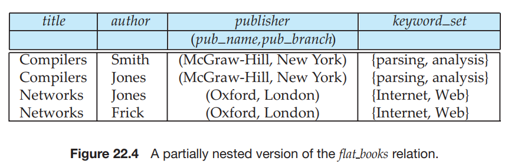

Array and Multiset Types in SQL## Array and Multiset Types in SQL

SQL supports two collection types: arrays and multisets; array types were added in SQL:1999, while multiset types were added in SQL:2003. Recall that a multiset is an unordered collection, where an element may occur multiple times. Multisets are like sets, except that a set allows each element to occur at most once.

Suppose we wish to record information about books, including a set of key- words for each book. Suppose also that we wished to store the names of authors of a book as an array; unlike elements in a multiset, the elements of an array are ordered, so we can distinguish the first author from the second author, and so on. The following example illustrates how these array and multiset-valued attributes can be defined in SQL:
```sql
create type Publisher as 
(name varchar(20),
 branch varchar(20));

create type Book as 
(title varchar(20),
 author array varchar(20) array [10],
pub date date, 
publisher Publisher, keyword set varchar(20) multiset);

create table books of Book;
```
The first statement defines a type called Publisher with two components: a name and a branch. The second statement defines a structured type Book that contains a title, an author array, which is an array of up to 10 author names, a publication date, a publisher (of type Publisher), and a multiset of keywords. Finally, a table books containing tuples of type Book is created.  

Note that we used an array, instead of a multiset, to store the names of authors, since the ordering of authors generally has some significance, whereas we believe that the ordering of keywords associated with a book is not significant.

In general, multivalued attributes from an E-R schema can be mapped to multiset-valued attributes in SQL; if ordering is important, SQL arrays can be used instead of multisets.

### Creating and Accessing Collection Values

An array of values can be created in SQL:1999 in this way:

```SQL
array[’Silberschatz’, ’Korth’, ’Sudarshan’]

Similarly, a multiset of keywords can be constructed as follows:

multiset[’computer’, ’database’, ’SQL’]

Thus, we can create a tuple of the type defined by the books relation as:

(’Compilers’, **array**[’Smith’, ’Jones’], new Publisher(’McGraw-Hill’, ’New York’), multiset[’parsing’, ’analysis’])
```
Here we have created a value for the attribute Publisher by invoking a constructor function for Publisher with appropriate arguments. Note that this constructor for Publisher must be created explicitly, and is not present by default; it can be declared just like the constructor for Name, which we saw earlier in Section 22.3.

If we want to insert the preceding tuple into the relation books, we could execute the statement:

```SQL
insert into books 
values (’Compilers’, array[’Smith’, ’Jones’],

new Publisher(’McGraw-Hill’, ’New York’), multiset[’parsing’, ’analysis’]);
```
We can access or update elements of an array by specifying the array index, for example author array[1].

### Querying Collection-Valued Attributes

We now consider how to handle collection-valued attributes in queries. An ex- pression evaluating to a collection can appear anywhere that a relation name may appear, such as in a **from** clause, as the following paragraphs illustrate. We use the table books that we defined earlier.

If we want to find all books that have the word “database” as one of their keywords, we can use this query:  

```SQL
select title 
from books 
where ’database’ in (unnest(keyword set));
```
Note that we have used **unnest**(keyword set) in a position where SQL without nested relations would have required a 


**select**\-**from**\-**where** subexpression.

If we know that a particular book has three authors, we could write:

```SQL
select author array[1], author array[2], author array[3] 
from books 
where title = ’Database System Concepts’;
```

Now, suppose that we want a relation containing pairs of the form “title, author name” for each book and each author of the book. We can use this query:
```SQL
select B.title, A.author from books as B, 
unnest(B.author array) as A(author);
```
Since the author array attribute of books is a collection-valued field, **unnest**(B.author array) can be used in a **from** clause, where a relation is expected. Note that the

tuple variable B is visible to this expression since it is defined earlier in the **from** clause.

When unnesting an array, the previous query loses information about the ordering of elements in the array. The **unnest with ordinality** clause can be used to get this information, as illustrated by the following query. This query can be used to generate the authors relation, which we saw earlier, from the books relation.
```SQL
select title, A.author, A.position from books as B,

unnest(B.author array) with ordinality as A(author, position);
```
The **with ordinality** clause generates an extra attribute which records the po- sition of the element in the array. A similar query, but without the **with ordinality** clause, can be used to generate the keyword relation.

### Nesting and Unnesting

The transformation of a nested relation into a form with fewer (or no) relationvalued attributes is called **unnesting**. The books relation has two attributes, author array and keyword set, that are collections, and two attributes, title and publisher,

that are not. Suppose that we want to convert the relation into a single flat relation, with no nested relations or structured types as attributes. We can use the following query to carry out the task:  title author pub\name pub\branch keyword Compilers Smith McGraw-Hill New York parsing Compilers Jones McGraw-Hill New York parsing Compilers Smith McGraw-Hill New York analysis Compilers Jones McGraw-Hill New York analysis Networks Jones Oxford London Internet Networks Frick Oxford London Internet Networks Jones Oxford London Web Networks Frick Oxford London Web

```SQL
select title, A.author, publisher.name as pubname, publisher.branch
 as pub branch, K.keyword
from books as B, unnest(B.author array) aS(author), unnest (B.keyword set) as K(keyword);
```
The variable B in the **from** clause is declared to range over books. The variable A is declared to range over the authors in author array for the book B, and K is declared to range over the keywords in the keyword set of the book B. Figure 22.1 shows an instance books relation, and Figure 22.3 shows the relation, which we call flat books, that is the result of the preceding query. Note that the relation flat books is in 1NF, since all its attributes are atomic valued.

The reverse process of transforming a 1NF relation into a nested relation is called **nesting**. Nesting can be carried out by an extension of grouping in SQL. In the normal use of grouping in SQL, a temporary multiset relation is (logically) created for each group, and an aggregate function is applied on the temporary relation to get a single (atomic) value. The **collect** function returns the multiset of values, so instead of creating a single value, we can create a nested relation. Suppose that we are given the 1NF relation flat books, as in Figure 22.3. The following query nests the relation on the attribute keyword:
```SQL
select title, author, Publisher(pub name, pub branch) as publisher, collect(keyword) as keyword set

from flat-books group by title, author, publisher;
```
The result of the query on the flat books relation from Figure 22.3 appears in Figure 22.4.

If we want to nest the author attribute also into a multiset, we can use the query:  



**select** title, **collect**(author) **as** author set, Publisher(pub name, pub branch) **as** publisher,

**collect**(keyword) **as** keyword set **from** flat books **group by** title, publisher;

Another approach to creating nested relations is to use subqueries in the **select** clause. An advantage of the subquery approach is that an **order by** clause can be used in the subquery to generate results in the order desired for the creation of an array. The following query illustrates this approach; the keywords **array** and **multiset** specify that an array and multiset (respectively) are to be created from the results of the subqueries.
~~~sql
**select** title, **array**( **select** author

**from** authors **as** A **where** A.title \= B.title **order by** A.position) **as** author array,

Publisher(pub name, pub branch) **as** publisher, **multiset**( **select** keyword

**from** keywords **as** K **where** K.title \= B.title) **as** keyword set,

**from** books4 **as** B;
~~~
The system executes the nested subqueries in the **select** clause for each tuple generated by the **from** and **where** clauses of the outer query. Observe that the attribute B.title from the outer query is used in the nested queries, to ensure that only the correct sets of authors and keywords are generated for each title.

SQL:2003 provides a variety of operators on multisets, including a function **set**(M) that returns a duplicate-free version of a multiset M, an **intersection** aggregate operation, which returns the intersection of all the multisets in a group, a **fusion** aggregate operation, which returns the union of all multisets in a group, and a **submultiset** predicate, which checks if a multiset is contained in another multiset.  

