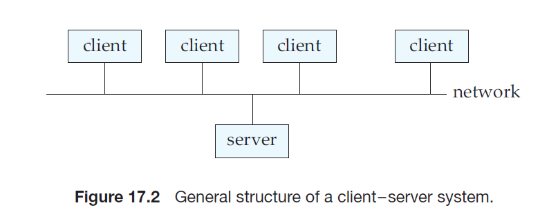

Centralized and Client–Server Architectures## Centralized and Client–Server Architectures

Centralized database systems are those that run on a single computer system and do not interact with other computer systems. Such database systems span a range from single-user database systems running on personal computers to high-performance database systems running on high-end server systems. Client server systems, on the other hand, have functionality split between a server system and multiple client systems.

### Centralized Systems

A modern, general-purpose computer system consists of one to a few processors and a number of device controllers that are connected through a common bus that provides access to shared memory (Figure 17.1). The processors have local cache memories that store local copies of parts of the memory, to speed up access to data. Each processor may have several independent **cores**, each of which can execute a separate instruction stream. Each device controller is in charge of a specific type of device (for example, a disk drive, an audio device, or a video display). The processors and the device controllers can execute concurrently, competing for memory access. Cache memory reduces the contention for memory access, since it reduces the number of times that the processor needs to access the shared memory.

We distinguish two ways in which computers are used: as single-user systems and as multiuser systems. Personal computers and workstations fall into the first category. A typical **single-user system** is a desktop unit used by a single person, usually with only one processor and one or two hard disks, and usually only one person using the machine at a time. A typical **multiuser system**, on the other hand, has more disks and more memory and may have multiple processors. It serves a large number of users who are connected to the system remotely.

Database systems designed for use by single users usually do not provide many of the facilities that a multiuser database provides. In particular, they may not support concurrency control, which is not required when only a single user can generate updates. Provisions for crash recovery in such systems are either absent or primitive—for example, they may consist of simply making a backup of the database before any update. Some such systems do not support SQL, and they provide a simpler query language, such as a variant of QBE. In contrast,

database systems designed for multiuser systems support the full transactional features that we have studied earlier.

Although most general-purpose computer systems in use today have multiple processors, they have **coarse-granularity parallelism**, with only a few processors (about two to four, typically), all sharing the main memory. Databases running on such machines usually do not attempt to partition a single query among the processors; instead, they run each query on a single processor, allowing multiple queries to run concurrently. Thus, such systems support a higher throughput; that is, they allow a greater number of transactions to run per second, although individual transactions do not run any faster.

Databases designed for single-processor machines already provide multitask- ing, allowing multiple processes to run on the same processor in a time-shared manner, giving a view to the user of multiple processes running in parallel. Thus, coarse-granularity parallel machines logically appear to be identical to single- processor machines, and database systems designed for time-shared machines can be easily adapted to run on them.

In contrast, machines with **fine-granularity parallelism** have a large num- ber of processors, and database systems running on such machines attempt to parallelize single tasks (queries, for example) submitted by users. We study the architecture of parallel database systems in Section 17.3.

Parallelism is emerging as a critical issue in the future design of database systems. Whereas today those computer systems with multicore processors have only a few cores, future processors will have large numbers of cores.1 As a re- sult, parallel database systems, which once were specialized systems running on specially designed hardware, will become the norm.

### Client–Server Systems

As personal computers became faster, more powerful, and cheaper, there was a shift away from the centralized system architecture. Personal computers sup- planted terminals connected to centralized systems. Correspondingly, personal computers assumed the user-interface functionality that used to be handled di- rectly by the centralized systems. As a result, centralized systems today act as **server systems** that satisfy requests generated by _client systems_. Figure 17.2 shows the general structure of a client–server system.

Functionality provided by database systems can be broadly divided into two parts—the front end and the back end. The back end manages access structures, query evaluation and optimization, concurrency control, and recovery. The front end of a database system consists of tools such as the SQL user interface, forms interfaces, report generation tools, and data mining and analysis tools (see Fig- ure 17.3). The interface between the front end and the back end is through SQL, or through an application program.

^1^The reasons for this pertain to issues in computer architecture related to heat generation and power consumption. Rather than make processors significantly faster, computer architects are using advances in chip design to put more cores on a single chip, a trend likely to continue for some time.  

- Standards such as _ODBC_ and _JDBC_, which we saw in Chapter 3, were developed to interface clients with servers. Any client that uses the ODBC or JDBC interface can connect to any server that provides the interface.

- Certain application programs, such as spreadsheets and statistical-analysis packages, use the client–server interface directly to access data from a back-end server. In effect, they provide front ends specialized for particular tasks.

- Systems that deal with large numbers of users adopt a three-tier architecture, which we saw earlier in Figure 1.6 (Chapter 1), where the front end is a Web browser that talks to an application server. The application server, in effect, acts  as a client to the database server.

- Some transaction-processing systems provide a **transactional remote proce- dure call** interface to connect clients with a server. These calls appear like ordi- nary procedure calls to the programmer, but all the remote procedure calls from a client are enclosed in a single transaction at the server end. Thus, if the transaction aborts, the server can undo the effects of the individual remote procedure calls.

