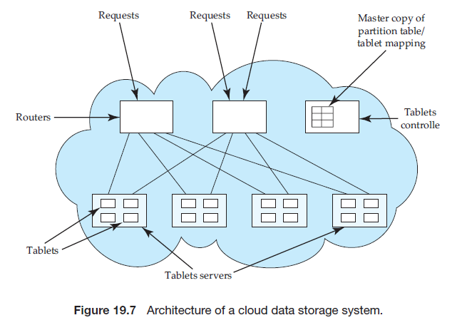

Cloud-Based Databases## Cloud-Based Databases

**Cloud computing** is a relatively new concept in computing that emerged in the late 1990s and the 2000s, first under the name _software as a service_. Initial vendors of software services provided specific customizable applications that they hosted on their own machines. The concept of cloud computing developed as vendors began to offer generic computers as a service on which clients could run software applications of their choosing. A client can make arrangements with a cloud-computing vendor to obtain a certain number of machines of a certain capacity as well as a certain amount of data storage. Both the number of machines and the amount of storage can grow and shrink as needed. In addition to providing computing services, many vendors also provide other services such as data storage services, map services, and other services that can be accessed using a Web-service application programming interface.

Many enterprises are finding the model of cloud computing and services beneficial. It saves client enterprises the need to maintain a large system-support staff and allows new enterprises to begin operation without having to make a large, up-front capital investment in computing systems. Further, as the needs of the enterprise grow, more resources (computing and storage) can be added as required; the cloud-computing vendor generally has very large clusters of computers, making it easy for the vendor to allocate resources on demand.

A variety of vendors offer cloud services. They include traditional computing vendors as well as companies, such as Amazon and Google, that are seeking to leverage the large infrastructure they have in place for their core businesses.

Web applications that need to store and retrieve data for very large numbers of users (ranging from millions to hundreds of millions) have been a major driver of cloud-based databases. The needs of these applications differ from those of traditional database applications, since they value availability and scalability over consistency. Several cloud-based data-storage systems have been developed in recent years to serve the needs of such applications. We discuss issues in building such data-storage systems on the cloud in Section 19.9.1.

In Section 19.9.2, we consider issues in running traditional database systems on a cloud. Cloud-based databases have features of both homogeneous and heterogeneous systems. Although the data are owned by one organization (the client) and are part of one unified distributed database, the underlying computers are owned and operated by another organization (the service vendor). The computers are remote from the client’s location(s) and are accessed over the Internet. As a result, some of the challenges of heterogeneous distributed systems remain, particularly as regards transaction processing. However, many of the organizational and political challenges of heterogeneous systems are avoided.

Finally, in Section 19.9.3, we discuss several technical as well as nontechnical challenges that cloud databases face today.

### Data Storage Systems on the Cloud

Applications on the Web have extremely high scalability requirements. Popular applications have hundreds of millions of users, and many applications have seen their load increase manyfold within a single year, or even within a few months. To handle the data management needs of such applications, data must be partitioned across thousands of processors.

A number of systems for data storage on the cloud have been developed and deployed over the past few years to address data management requirements of such applications; these include _Bigtable_ from Google, _Simple Storage Service_ (_S_~3~) from Amazon, which provides a Web interface to _Dynamo_, which is a key- value storage system, _Cassandra_, from FaceBook, which is similar to Bigtable, and  _Sherpa_/_PNUTS_ from Yahoo!, the data storage component of the _Azure_ environment from Microsoft, and several other systems.

In this section, we provide an overview of the architecture of such data- storage systems. Although some people refer to these systems as distributed database systems, they do not provide many of the features which are viewed as standard on database systems today, such as support for SQL, or for transactions with the ACID properties.

#### 19.9.1.1 Data Representation

As an example of data management needs of Web applications, consider the pro- file of a user, which needs to be accessible to a number of different applications that are run by an organization. The profile contains a variety of attributes, and there are frequent additions to the attributes stored in the profile. Some attributes may contain complex data. A simple relational representation is often not sufficient for such complex data.

Some cloud-based data-storage systems support XML (described in Chapter 23) for representing such complex data. Others support the **JavaScript Object Notation** (**JSON**) representation, which has found increasing acceptance for representing complex data. The XML and JSON representations provide flexibility in the set of attributes that a record contains, as well as the types of these attributes. Yet others, such as Bigtable, define their own data model for complex data including support for records with a very large number of optional columns. We revisit the Bigtable data model later in this section.

Further, many such Web applications either do not need extensive query language support, or at least, can manage without such support. The primary mode of data access is to store data with an associated key, and to retrieve data with that key. In the above user profile example, the key for user-profile data would be the user’s identifier. There are applications that conceptually require joins, but implement the joins by a form of view materialization. For example, in a social-networking application, each user should be shown new posts from all her friends. Unfortunately, finding the set of friends and then querying each one to find their posts may lead to a significant amount of delay when the data are distributed across a large number of machines. An alternative is as follows: whenever a user makes a post, a message is sent to all friends of that user, and the data associated with each of the friends is updated with a summary of the new post. When that user checks for updates, all required data are available in one place and can be retrieved quickly.

Thus, cloud data-storage systems are, at their core, based on two primitive functions, put(key, value), used to store values with an associated key, and get(key), which retrieves the stored value associated with the specified key. Some systems such as Bigtable additionally provide range queries on key values.

In Bigtable, a record is not stored as a single value, but is instead split into component attributes that are stored separately. Thus, the key for an attribute value conceptually consists of (record-identifier, attribute-name). Each attribute value is just a string as far as Bigtable is concerned. To fetch all attributes of a  


**JSON**

JavaScript Object Notation, or JSON, is a textual representation of complex data types which is widely used for transmitting data between applications, as well as to store complex data. JSON supports the primitive data types integer, real and string, as well as arrays, and “objects”, which are a collection of (attribute-name, value) pairs. An example of a JSON object is:
```js
{ 
    "ID": "22222", 
    "name": 
    {
        "firstname: "Albert", 
        "lastname: "Einstein"
    }, 
    "deptname": "Physics", 
    "children": [
        { "firstname": "Hans", "lastname": "Einstein" }, 
        { "firstname": "Eduard", "lastname": "Einstein" }
        ] 
    }
```
The above example illustrates objects, which contain (attribute-name, value) pairs, as well as arrays, delimited by square brackets. JSON can be viewed as a simplified form of XML; XML is covered in Chapter 23.

Libraries have been developed to transform data between the JSON represen- tation and the object representation used in the JavaScript and PHP scripting languages, as well as other programming languages.

record, a range query, or more precisely a prefix-match query consisting of just the record identifier, is used. The get() function returns the attribute names along with the values. For efficient retrieval of all attributes of a record, the storage system stores entries sorted by the key, so all attribute values of a particular record are clustered together.

In fact, the record identifier can itself be structured hierarchically, although to Bigtable itself the record identifier is just a string. For example, an application that stores pages retrieved from a web crawl could map a URL of the form:
```
www.cs.yale.edu/people/silberschatz.html
```
to the record identifier:
```
edu.yale.cs.www/people/silberschatz.html
```
so that pages are clustered in a useful order. As another example, the record shown in the JSON example (see example box on JSON) can be represented by a record with identifier “22222”, with multiple attribute names such as “name.firstname”, “deptname”, “children[1\].firstname” or “children[2\].lastname”.

Further, a single instance of Bigtable can store data for multiple applications, with multiple tables per application, by simply prefixing the application name and table name to the record identifier.

Data-storage systems typically allow multiple versions of data items to be stored. Versions are often identified by timestamp, but may be alternatively iden- tified by an integer value that is incremented whenever a new version of a data item is created. Lookups can specify the required version of a data item, or can pick the version with the highest version number. In Bigtable, for example, a key actually consists of three parts: (record-identifier, attribute-name, timestamp).

#### 19.9.1.2 Partitioning and Retrieving Data

Partitioning of data is, of course, the key to handling extremely large scale in data-storage systems. Unlike regular parallel databases, it is usually not possible to decide on a partitioning function ahead of time. Further, if load increases, more servers need to be added and each server should be able to take on parts of the load incrementally.

To solve both these problems, data-storage systems typically partition data into relatively small units (small on such systems may mean of the order of hundreds of megabytes). These partitions are often called **tablets**, reflecting the fact that each tablet is a fragment of a table. The partitioning of data should be done on the search key, so that a request for a specific key value is directed to a single tablet; otherwise each request would require processing at multiple sites, increasing the load on the system greatly. Two approaches are used: either range partitioning is used directly on the key, or a hash function is applied on the key, and range partitioning is applied on the result of the hash function.

The site to which a tablet is assigned acts as the master site for that tablet. All updates are routed through this site, and updates are then propagated to replicas of the tablet. Lookups are also sent to the same site, so that reads are consistent with writes.

The partitioning of data into tablets is not fixed up front, but happens dynamically. As data are inserted, if a tablet grows too big, it is broken into smaller parts. Further, even if a tablet is not large enough to merit being broken up, if the load (get/put operations) on that tablet are excessive, the tablet may be broken into smaller tablets, which can be distributed across two or more sites to share the load. Usually the number of tablets is much larger than the number of sites, for the same reason that virtual partitioning is used in parallel databases.

It is important to know which site in the overall system is responsible for a particular tablet. This can be done by having a tablet controller site which tracks the partitioning function, to map a get() request to one or more tablets, and a mapping function from tablets to sites, to find which site were responsible for which tablet. Each request coming into the system must be routed to the correct site; if a single tablet controller site is responsible for this task, it would soon  




get overloaded. Instead, the mapping information can be replicated on a set of router sites, which route requests to the site with the appropriate tablet. Protocols to update mapping information when a tablet is split or moved are designed in such a way that no locking is used; a request may as a result end up at a wrong site. The problem is handled by detecting that the site is no longer responsible for the key specified by the request, and rerouting the request based on up-to-date mapping information.

Figure 19.7 depicts the architecture of a cloud data-storage system, based loosely on the PNUTS architecture. Other systems provide similar functionality, although their architecture may vary. For example, Bigtable does not have separate routers; the partitioning and tablet-server mapping information is stored in the Google file system, and clients read the information from the file system, and decide where to send their requests.

#### 19.9.1.3 Transactions and Replication

Data-storage systems on the cloud typically do not fully support ACID transactions. The cost of two-phase commit is too high, and two-phase commit can lead to blocking in the event of failures, which is not acceptable to typical Web applications. This means that such systems typically do not even support a trans- actionally consistent secondary index: the secondary index would be partitioned on a different attribute from the key used for storing the data, and an insert or update would then need to update two sites, which would require two-phase commit. At best, such systems support transactions on data within a single tablet, which is controlled by a a single master site. Sherpa/PNUTS also provides a test-and-set function, which allows an update to a data item to be conditional on the current version of the data item being the same as a specified version number. If the current version number of the data item is more recent than the specified ver- sion number, the update is not performed. The test-and-set function can be used by applications to implement a limited form of validation-based concurrency control, with validation restricted to data items in a single tablet.

In a system with thousands of sites, at any time it is almost guaranteed that several of the sites will be down. A data-storage system on the cloud must be able to continue normal processing even with many sites down. Such systems replicate data (such as tablets) to multiple machines in a cluster, so that a copy of the data is likely to be available even if some machines of a cluster are down. (A **cluster** is a collection of machines in a data center.) For example, the _Google File System_ (GFS), which is a distributed fault-tolerant file system, replicates all file system blocks at three or more nodes in a cluster. Normal operation can continue as long as at least one copy of the data is available (key system data, such as the mapping of files to nodes, is replicated at more nodes, a majority of which need to be available). In addition, replication is also used across geographically distributed clusters, for reasons that we shall see shortly.

Since each tablet is controlled by a single master site, if the site fails the tablet should be reassigned to a different site that has a copy of the tablet, which becomes the new master site for the tablet. Updates to a tablet are logged, and the log is itself replicated. When a site fails, the tablets at the site are assigned to other sites; the new master site of each tablet is responsible for performing recovery actions using the log to bring its copy of the tablet to an up-to-date consistent state, after which updates and lookups can be performed on the tablet.

In Bigtable, as an example, mapping information is stored in an index struc- ture, and the index as well as the actual tablet data are stored in the file system. Tablet data updates are not flushed immediately, but log data are. The file system ensures that the file system data are replicated and will be available even in the face of failure of a few nodes in the cluster. Thus, when a tablet is reassigned, the new master site for the tablet has access to up-to-date log data. Yahoo!’s Sherpa/PNUTS system, on the other hand, explicitly replicates tablets to multiple nodes in a cluster, instead of using a distributed file system, and uses a reliable distributed-messaging system to implement a highly available log.

Unfortunately, it is not uncommon for an entire data center to become unavailable-for example, due to natural disasters or fires. Replication at a remote site is therefore essential for high availability. For many Web applications, round-trip delays across a long-distance network can affect performance significantly, a problem that is increasing with the use of Ajax applications that require multiple rounds of communication between the browser and the application. To deal with this problem, users are connected with application servers that are closest to them geographically, and data are replicated at multiple data centers so that one of the replicas is likely to be close to the application server.

However, the danger of partitioning of the network is increased as a result. Given that most Web applications place a greater premium on availability than on consistency, data-storage systems on the cloud usually allow updates to proceed even in the event of a partitioning, and provide support for restoring consis- tency later, as discussed earlier in Section 19.6.6. Multimaster replication with lazy propagation of updates, which we saw in Section 19.5.3, is typically used for processing updates. Lazy propagation implies that updates are not propagated to replicas as part of the updating transaction, although they are typically propagated as soon as possible, typically using a messaging infrastructure.

In addition to propagating updates to replicas of a data item, updates to secondary indices, or to certain kinds of materialized views (such as the updates from friends, in a social-networking application we saw earlier in Section 19.9.1.1), can be sent using the messaging infrastructure. Secondary indices are basically tables, partitioned just like regular tables, based on the index search key; an update of a record in a table can be mapped to updates of one or more tablets in a secondary index on the table. There is no transactional guarantee on the updates of such secondary indices or materialized views, and only a best-effort guarantee in terms of when the updates reach their destination.

### Traditional Databases on the Cloud

We now consider the issue of implementing a traditional distributed database system, supporting ACID properties and queries, on a cloud.

The concept of computing utilities is an old one, envisioned back in the 1960s. The first manifestation of the concept was in timesharing systems in which several users shared access to a single mainframe computer. Later, in the late 1960s, the concept of **virtual machines** was developed, in which a user was given the illusion of having a private computer, while in reality a single computer simulated several virtual machines.

Cloud computing makes extensive use of the virtual-machine concept to provide computing services. Virtual machines provide great flexibility since clients may choose their own software environment including not only the application software but also the operating system. Virtual machines of several clients can run on a single physical computer, if the computing needs of the clients are low. On the other hand, an entire computer can be allocated to each virtual machine of a client whose virtual machines have a high load. A client may request several virtual machines over which to run an application. This makes it easy to add or subtract computing power as workloads grow and shrink simply by adding or releasing virtual machines.

Having a set of virtual machines works well for applications that are easily parallelized. Database systems, as we have seen, fall into this category. Each virtual machine can run database system code locally and behave in a manner similar to a site in a homogeneous distributed database system.

### Challenges with Cloud-Based Databases

Cloud-based databases certainly have several important advantages compared to building a computing infrastructure from scratch, and are in fact essential for certain applications.  

However, cloud-based database systems also have several disadvantages that we shall now explore. Unlike purely computational applications in which parallel computations run largely independently, distributed database systems require frequent communication and coordination among sites for:

- access to data on another physical machine, either because the data are owned by another virtual machine or because the data are stored on a storage server separate from the computer hosting the virtual machine.

- obtaining locks on remote data.

- ensuring atomic transaction commit via two-phase commit.

In our earlier study of distributed databases, we assumed (implicitly) that the database administrator had control over the physical location of data. In a cloud system, the physical location of data is under the control of the vendor, not the client. As a result, the physical placement of data may be suboptimal in terms of communication cost, and this may result in a large number of remote lock requests and large transfers of data across virtual machines. Effective query optimization requires that the optimizer have accurate cost measures for opera- tions. Lacking knowledge of the physical placement of data, the optimizer has to rely on estimates that may be highly inaccurate, resulting in poor execution strategies. Because remote accesses are relatively slow compared to local access, these issues can have a significant impact on performance.

The above issues are a particular challenge for implementing traditional database applications on the cloud, although less challenging for simple data- storage systems. The next few challenges we discuss apply equally to both appli- cation scenarios.

The matter of replication further complicates cloud-based data management. Cloud systems replicate client data for availability. Indeed many contracts have clauses imposing penalties on the vendor if a certain level of availability is not maintained. This replication is done by the vendor without specific knowledge of the application. Since replication is under control of the cloud and not under the control of the database system, care must be used when the database system accesses data so as to ensure that the latest versions of the data are read. Failure to take these issues properly into account can result in a loss of the atomicity or isolation properties. In many current cloud database applications, the application itself may need to take some responsibility for consistency.

Users of cloud computing must be willing to accept that their data are held by another organization. This may present a variety of risks in terms of security and legal liability. If the cloud vendor suffers a security breach, client data may be divulged, causing the client to face legal challenges from its customers. Yet the client has no direct control over cloud-vendor security. These issues become more complex if the cloud vendor chooses to store data (or replicas of data) in a foreign country. Various legal jurisdictions differ in their privacy laws. So, for example, if a German company’s data are replicated on a server in New York, then the privacy laws of the United States rather than those of Germany or the European Union apply. The cloud vendor might be required to release client data to the U.S. government even though the client never knew that its data would wind up under U.S. jurisdiction.

Specific cloud vendors offer their clients varying degrees of control over how their data are distributed and replicated. Some vendors offer database services directly to their clients rather than require clients to contract for raw storage and virtual machines over which to run their own database systems.

The market for cloud services continues to evolve rapidly, but it is clear that a database administrator who is contracting for cloud services has to consider a wide variety of technical, economic, and legal issues in order to ensure the privacy and security of data, guarantees of the ACID properties (or an acceptable approximation thereof), and adequate performance despite the likelihood of data being distributed over a wide geographic area. The bibliographical notes provide some of the current thinking on these topics. Much new literature is likely to appear in the next few years, and many of the current issues in cloud databases are being addressed by the research community.

