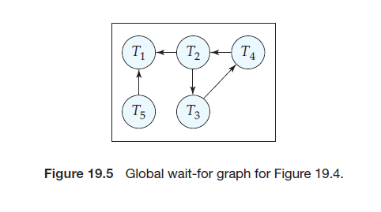

Concurrency Control in Distributed Databases## Concurrency Control in Distributed Databases

We show here how some of the concurrency-control schemes discussed in Chapter 15 can be modified so that they can be used in a distributed environment. We assume that each site participates in the execution of a commit protocol to ensure global transaction atomicity.

The protocols we describe in this section require updates to be done on all replicas of a data item. If any site containing a replica of a data item has failed, updates to the data item cannot be processed. In Section 19.6, we describe protocols that can continue transaction processing even if some sites or links have failed, thereby providing high availability.

### Locking Protocols

The various locking protocols described in Chapter 15 can be used in a distributed environment. The only change that needs to be incorporated is in the way the lock manager deals with replicated data. We present several possible schemes that are applicable to an environment where data can be replicated in several sites. As in Chapter 15, we shall assume the existence of the _shared_ and _exclusive_ lock modes.

#### 19.5.1.1 Single Lock-Manager Approach

In the **single lock-manager** approach, the system maintains a _single_ lock manager that resides in a _single_ chosen site—say _S_~i~ . All lock and unlock requests are made at site _S_~i~ . When a transaction needs to lock a data item, it sends a lock request to _S_~i~ . The lock manager determines whether the lock can be granted immediately. If the lock can be granted, the lock manager sends a message to that effect to the site at which the lock request was initiated. Otherwise, the request is delayed until it can be granted, at which time a message is sent to the site at which the lock request was initiated. The transaction can read the data item from _any_ one of the sites at which a replica of the data item resides. In the case of a write, all the sites where a replica of the data item resides must be involved in the writing.

The scheme has these advantages:

- **Simple implementation**. This scheme requires two messages for handling lock requests and one message for handling unlock requests.

- **Simple deadlock handling**. Since all lock and unlock requests are made at one site, the deadlock-handling algorithms discussed in Chapter 15 can be applied directly.

The disadvantages of the scheme are:

• **Bottleneck**. The site _S_~i~ becomes a bottleneck, since all requests must be pro- cessed there.

• **Vulnerability**. If the site _S_~i~ fails, the concurrency controller is lost. Either processing must stop, or a recovery scheme must be used so that a backup site can take over lock management from _S_~i~ , as described in Section 19.6.5.  

#### 19.5.1.2 Distributed Lock Manager

A compromise between the advantages and disadvantages can be achieved through the **distributed-lock-manager** approach, in which the lock-manager function is distributed over several sites.

Each site maintains a local lock manager whose function is to administer the lock and unlock requests for those data items that are stored in that site. When a transaction wishes to lock a data item _Q_ that is not replicated and resides at site _S_~i~ , a message is sent to the lock manager at site _S_~i~ requesting a lock (in a particular lock mode). If data item _Q_ is locked in an incompatible mode, then the request is delayed until it can be granted. Once it has determined that the lock request can be granted, the lock manager sends a message back to the initiator indicating that it has granted the lock request.

We discuss several alternative ways of dealing with replication of data items in Sections 19.5.1.3 to 19.5.1.6.

The distributed-lock-manager scheme has the advantage of simple implementation, and reduces the degree to which the coordinator is a bottleneck. It has a reasonably low overhead, requiring two message transfers for handling lock requests, and one message transfer for handling unlock requests. However, deadlock handling is more complex, since the lock and unlock requests are no longer made at a single site: There may be intersite deadlocks even when there is no deadlock within a single site. The deadlock-handling algorithms discussed in Chapter 15 must be modified, as we shall discuss in Section 19.5.4, to detect global deadlocks.

#### 19.5.1.3 Primary Copy

When a system uses data replication, we can choose one of the replicas as the **primary copy**. For each data item _Q_, the primary copy of _Q_ must reside in precisely one site, which we call the **primary site** of _Q_.

When a transaction needs to lock a data item _Q_, it requests a lock at the primary site of _Q_. As before, the response to the request is delayed until it can be granted. The primary copy enables concurrency control for replicated data to be handled like that for unreplicated data. This similarity allows for a simple implementation. However, if the primary site of _Q_ fails, _Q_ is inaccessible, even though other sites containing a replica may be accessible.

#### 19.5.1.4 Majority Protocol

The **majority protocol** works this way: If data item _Q_ is replicated in _n_ different sites, then a lock-request message must be sent to more than one-half of the _n_ sites in which _Q_ is stored. Each lock manager determines whether the lock can be granted immediately (as far as it is concerned). As before, the response is delayed until the request can be granted. The transaction does not operate on _Q_ until it has successfully obtained a lock on a majority of the replicas of _Q_.

We assume for now that writes are performed on all replicas, requiring all sites containing replicas to be available. However, the major benefit of the majority protocol is that it can be extended to deal with site failures, as we shall see in Section 19.6.1. The protocol also deals with replicated data in a decentralized manner, thus avoiding the drawbacks of central control. However, it suffers from these disadvantages:

- **Implementation**. The majority protocol is more complicated to implement than are the previous schemes. It requires at least 2(n/2 + 1) messages for handling lock requests and at least (n/2 + 1) messages for handling unlock requests.

- **Deadlock handling**. In addition to the problem of global deadlocks due to the use of a distributed-lock-manager approach, it is possible for a deadlock to occur even if only one data item is being locked. As an illustration, consider a system with four sites and full replication. Suppose that transactions _T_~1~ and _T_~2~ wish to lock data item _Q_ in exclusive mode. Transaction _T_~1~ may succeed in locking _Q_ at sites _S_~1~ and _S_~3~, while transaction _T_~2~ may succeed in locking _Q_ at sites _S_~2~ and _S_~4~\. Each then must wait to acquire the third lock; hence, a deadlock has occurred. Luckily, we can avoid such deadlocks with relative ease, by requiring all sites to request locks on the replicas of a data item in the same predetermined order.

#### 19.5.1.5 Biased Protocol

The **biased protocol** is another approach to handling replication. The difference from the majority protocol is that requests for shared locks are given more favorable treatment than requests for exclusive locks.

- **Shared locks**. When a transaction needs to lock data item _Q_, it simply requests a lock on _Q_ from the lock manager at one site that contains a replica of _Q_.

- **Exclusive locks**. When a transaction needs to lock data item _Q_, it requests a lock on _Q_ from the lock manager at all sites that contain a replica of _Q_.

As before, the response to the request is delayed until it can be granted. The biased scheme has the advantage of imposing less overhead on read

operations than does the majority protocol. This savings is especially significant in common cases in which the frequency of read is much greater than the frequency of write. However, the additional overhead on writes is a disadvantage. Furthermore, the biased protocol shares the majority protocol’s disadvantage of complexity in handling deadlock.

#### 19.5.1.6 Quorum Consensus Protocol

The **quorum consensus** protocol is a generalization of the majority protocol. The quorum consensus protocol assigns each site a nonnegative weight. It assigns read and write operations on an item _x_ two integers, called **read quorum** _Q_~r~ and **write quorum** _Q_~w~, that must satisfy the following condition, where _S_ is the total weight of all sites at which _x_ resides:  

_Q_~r~ \+ _Q_~w~ > _S_ **and** 2 ∗ _Q~w~ > S_

To execute a read operation, enough replicas must be locked that their total weight is at least _r_ . To execute a write operation, enough replicas must be locked so that their total weight is at least _w_.

A benefit of the quorum consensus approach is that it can permit the cost of either read or write locking to be selectively reduced by appropriately defining the read and write quorums. For instance, with a small read quorum, reads need to obtain fewer locks, but the write quorum will be higher, hence writes need to obtain more locks. Also, if higher weights are given to some sites (for example, those less likely to fail), fewer sites need to be accessed for acquiring locks. In fact, by setting weights and quorums appropriately, the quorum consensus protocol can simulate the majority protocol and the biased protocols.

Like the majority protocol, quorum consensus can be extended to work even in the presence of site failures, as we shall see in Section 19.6.1.

### Timestamping

The principal idea behind the timestamping scheme in Section 15.4 is that each transaction is given a _unique_ timestamp that the system uses in deciding the serialization order. Our first task, then, in generalizing the centralized scheme to a distributed scheme is to develop a scheme for generating unique timestamps. Then, the various protocols can operate directly to the nonreplicated environment.

There are two primary methods for generating unique timestamps, one cen- tralized and one distributed. In the centralized scheme, a single site distributes the timestamps. The site can use a logical counter or its own local clock for this purpose.

In the distributed scheme, each site generates a unique local timestamp by using either a logical counter or the local clock. We obtain the unique global timestamp by concatenating the unique local timestamp with the site identifier, which also must be unique (Figure 19.3). The order of concatenation is important! We use the site identifier in the least significant position to ensure that the global timestamps generated in one site are not always greater than those generated in another site. Compare this technique for generating unique timestamps with the one that we presented in Section 19.2.3 for generating unique names.

We may still have a problem if one site generates local timestamps at a rate faster than that of the other sites. In such a case, the fast site’s logical counter will be larger than that of other sites. Therefore, all timestamps generated by the fast site will be larger than those generated by other sites. What we need is a mechanism to ensure that local timestamps are generated fairly across the system. We define within each site _S_~i~ a **logical clock** (_LC_~i~ ), which generates the unique local timestamp. The logical clock can be implemented as a counter that is incremented after a new local timestamp is generated. To ensure that the various logical clocks are synchronized, we require that a site _Si_ advance its logical clock whenever a transaction _T_~i~ with timestamp _<x,y>_ visits that site and _x_ is greater than the current value of _LCi_ . In this case, site _S_~i~ advances its logical clock to the value _x_ \+ 1.

If the system clock is used to generate timestamps, then timestamps will be assigned fairly, provided that no site has a system clock that runs fast or slow. Since clocks may not be perfectly accurate, a technique similar to that for logical clocks must be used to ensure that no clock gets far ahead of or behind another clock.

### Replication with Weak Degrees of Consistency

Many commercial databases today support replication, which can take one of several forms. With **master–slave replication**, the database allows updates at a primary site, and automatically propagates updates to replicas at other sites. Transactions may read the replicas at other sites, but are not permitted to update them.

An important feature of such replication is that transactions do not obtain locks at remote sites. To ensure that transactions running at the replica sites see a consistent (but perhaps outdated) view of the database, the replica should reflect a **transaction-consistent snapshot** of the data at the primary; that is, the replica should reflect all updates of transactions up to some transaction in the serialization order, and should not reflect any updates of later transactions in the serialization order.

The database may be configured to propagate updates immediately after they occur at the primary, or to propagate updates only periodically.

Master–slave replication is particularly useful for distributing information, for instance from a central office to branch offices of an organization. Another use for this form of replication is in creating a copy of the database to run large queries, so that queries do not interfere with transactions. Updates should be propagated periodically—every night, for example—so that update propagation does not interfere with query processing.

The Oracle database system supports a **create snapshot** statement, which can create a transaction-consistent snapshot copy of a relation, or set of relations, at a remote site. It also supports snapshot refresh, which can be done either by recomputing the snapshot or by incrementally updating it. Oracle supports automatic refresh, either continuously or at periodic intervals.  

With **multimaster replication** (also called **update-anywhere replication**) updates are permitted at any replica of a data item, and are automatically propagated to all replicas. This model is the basic model used to manage replicas in distributed databases. Transactions update the local copy and the system updates other replicas transparently.

One way of updating replicas is to apply immediate update with two-phase commit, using one of the distributed concurrency-control techniques we have seen. Many database systems use the biased protocol, where writes have to lock and update all replicas and reads lock and read any one replica, as their currency- control technique.

Many database systems provide an alternative form of updating: They update at one site, with **lazy propagation** of updates to other sites, instead of immediately applying updates to all replicas as part of the transaction performing the update. Schemes based on lazy propagation allow transaction processing (in- cluding updates) to proceed even if a site is disconnected from the network, thus improving availability, but, unfortunately, do so at the cost of consistency. One of two approaches is usually followed when lazy propagation is used:

- Updates at replicas are translated into updates at a primary site, which are then propagated lazily to all replicas. This approach ensures that updates to an item are ordered serially, although serializability problems can occur, since transactions may read an old value of some other data item and use it to perform an update.

- Updates are performed at any replica and propagated to all other replicas. This approach can cause even more problems, since the same data item may be updated concurrently at multiple sites.

Some conflicts due to the lack of distributed concurrency control can be detected when updates are propagated to other sites (we shall see how in Section 25.5.4), but resolving the conflict involves rolling back committed transactions, and durability of committed transactions is therefore not guaranteed. Further, human intervention may be required to deal with conflicts. The above schemes should therefore be avoided or used with care.

### Deadlock Handling

The deadlock-prevention and deadlock-detection algorithms in Chapter 15 can be used in a distributed system, provided that modifications are made. For example, we can use the tree protocol by defining a _global_ tree among the system data items. Similarly, the timestamp-ordering approach could be directly applied to a distributed environment, as we saw in Section 19.5.2.

Deadlock prevention may result in unnecessary waiting and rollback. Furthermore, certain deadlock-prevention techniques may require more sites to be involved in the execution of a transaction than would otherwise be the case.

If we allow deadlocks to occur and rely on deadlock detection, the main problem in a distributed system is deciding how to maintain the wait-for graph.  

.
Common techniques for dealing with this issue require that each site keep a **local wait-for graph**. The nodes of the graph correspond to all the transactions (local as well as nonlocal) that are currently either holding or requesting any of the items local to that site. For example, Figure 19.4 depicts a system consisting of two sites, each maintaining its local wait-for graph. Note that transactions _T_~2~ and _T_~3~ appear in both graphs, indicating that the transactions have requested items at both sites.

These local wait-for graphs are constructed in the usual manner for local transactions and data items. When a transaction _Ti_ on site _S_~1~ needs a resource in site _S_~2~, it sends a request message to site _S_~2~\. If the resource is held by transaction _T_~j~ , the system inserts an edge _T_~i~ → _T_~j~ in the local wait-for graph of site _S_~2~.

Clearly, if any local wait-for graph has a cycle, deadlock has occurred. On the other hand, the fact that there are no cycles in any of the local wait-for graphs does not mean that there are no deadlocks. To illustrate this problem, we consider the local wait-for graphs of Figure 19.4. Each wait-for graph is acyclic; nevertheless, a deadlock exists in the system because the _union_ of the local wait-for graphs contains a cycle. This graph appears in Figure 19.5.

In the **centralized deadlock detection** approach, the system constructs and maintains a **global wait-for graph** (the union of all the local graphs) in a _single_ site: the deadlock-detection coordinator. Since there is communication delay in the system, we must distinguish between two types of wait-for graphs. The _real_ graph describes the real but unknown state of the system at any instance in time, as would be seen by an omniscient observer. The _constructed_ graph is an

 

approximation generated by the controller during the execution of the controller’s algorithm. Obviously, the controller must generate the constructed graph in such a way that, whenever the detection algorithm is invoked, the reported results are correct. _Correct_ means in this case that, if a deadlock exists, it is reported promptly, and if the system reports a deadlock, it is indeed in a deadlock state.

The global wait-for graph can be reconstructed or updated under these conditions:

- Whenever a new edge is inserted in or removed from one of the local wait-for graphs.

- Periodically, when a number of changes have occurred in a local wait-for graph.

- Whenever the coordinator needs to invoke the cycle-detection algorithm.

When the coordinator invokes the deadlock-detection algorithm, it searches its global graph. If it finds a cycle, it selects a victim to be rolled ack. The coordinator must notify all the sites that a particular transaction has been selected as victim. The sites, in turn, roll back the victim transaction.

This scheme may produce unnecessary rollbacks if:

- **False cycles** exist in the global wait-for graph. As an illustration, consider a snapshot of the system represented by the local wait-for graphs of Figure 19.6. Suppose that _T_~2~ releases the resource that it is holding in site _S_1, resulting in the deletion of the edge _T_~1~ → _T_~2~ in _S_~1~\. Transaction _T_~2~ then requests a  resource held by _T_~3~ at site _S_2, resulting in the addition of the edge _T_~2~ → _T_~3~ in _S_~2~\. If the insert _T_~2~ → _T_~3~ message from _S_~2~ arrives before the remove _T_~1~ → _T_~2~ message from _S_~1~, the coordinator may discover the false cycle _T_~1~ → _T_~2~ → _T_~3~ after the insert (but before the remove). Deadlock recovery may be initiated, although no deadlock has occurred.

Note that the false-cycle situation could not occur under two-phase locking. The likelihood of false cycles is usually sufficiently low that they do not cause a serious performance problem.

- A _deadlock_ has indeed occurred and a victim has been picked, while one of the transactions was aborted for reasons unrelated to the deadlock. For example, suppose that site _S_~1~ in Figure 19.4 decides to abort _T_~2~\. At the same time, the coordinator has discovered a cycle, and has picked _T_~3~ as a victim. Both _T_~2~ and _T_~3~ are now rolled back, although only _T_~2~ needed to be rolled back.

Deadlock detection can be done in a distributed manner, with several sites taking on parts of the task, instead of it being done at a single site. However, such algorithms are more complicated and more expensive. See the bibliographical notes for references to such algorithms.

