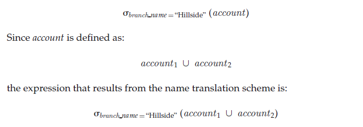

Distributed Query Processing## Distributed Query Processing

In Chapter 13, we saw that there are a variety of methods for computing the answer to a query. We examined several techniques for choosing a strategy for processing a query that minimize the amount of time that it takes to compute the answer. For centralized systems, the primary criterion for measuring the cost of a particular strategy is the number of disk accesses. In a distributed system, we must take into account several other matters, including:

- The cost of data transmission over the network.

- The potential gain in performance from having several sites process parts of the query in parallel.

The relative cost of data transfer over the network and data transfer to and from disk varies widely depending on the type of network and on the speed of the disks. Thus, in general, we cannot focus solely on disk costs or on network costs. Rather, we must find a good trade-off between the two.

### Query Transformation

Consider an extremely simple query: “Find all the tuples in the _account_ relation.” Although the query is simple—indeed, trivial—processing it is not trivial, since the _account_ relation may be fragmented, replicated, or both, as we saw in Sec- tion 19.2. If the _account_ relation is replicated, we have a choice of replica to make. If no replicas are fragmented, we choose the replica for which the transmission cost is lowest. However, if a replica is fragmented, the choice is not so easy to make, since we need to compute several joins or unions to reconstruct the _account_ relation. In this case, the number of strategies for our simple example may be large. Query optimization by exhaustive enumeration of all alternative strategies may not be practical in such situations.

Fragmentation transparency implies that a user may write a query such as:

Using the query-optimization techniques of Chapter 13, we can simplify the preceding expression automatically. The result is the expression:  

which includes two subexpressions. The first involves only _account_1, and thus can be evaluated at the Hillside site. The second involves only _account_2, and thus can be evaluated at the Valleyview site.

There is a further optimization that can be made in evaluating:

Since _account_1 has only tuples pertaining to the Hillside branch, we can eliminate the selection operation. In evaluating:

we can apply the definition of the _account_2 fragment to obtain:

This expression is the empty set, regardless of the contents of the _account_ relation. Thus, our final strategy is for the Hillside site to return _account_1 as the result of the query.

### Simple Join Processing

As we saw in Chapter 13, a major decision in the selection of a query-processing strategy is choosing a join strategy. Consider the following relational-algebra expression:

Assume that the three relations are neither replicated nor fragmented, and that _account_ is stored at site _S_~1~, _depositor_ at _S_~2~, and _branch_ at _S_~3~\. Let _S_~I~ denote the site at which the query was issued. The system needs to produce the result at site _S_~I~ . Among the possible strategies for processing this query are these:

- Ship copies of all three relations to site _S_~I~ . Using the techniques of Chapter 13, choose a strategy for processing the entire query locally at site _S_~I~ .

- Ship a copy of the _account_ relation to site _S_~2~, and compute _temp_~1~ = _account ⨝_depositor_ at _S_~2~\. Ship _temp_~1~ from _S_~2~ to _S_~3~, and compute _temp_~2~ = _temp_~1~_branch_ at _S_~3~\. Ship the result _temp_~2~ to _S_~I~ .

- Devise strategies similar to the previous one, with the roles of _S_~1~, _S_~2~, _S_~3~exchanged.

No one strategy is always the best one. Among the factors that must be considered are the volume of data being shipped, the cost of transmitting a block of data between a pair of sites, and the relative speed of processing at each site. Consider the first two strategies listed. Suppose indices present at _S_~2~ and _S_~3~ are useful for computing the join. If we ship all three relations to _S_~I~  , we would need to either re-create these indices at _S_~I~  , or use a different, possibly more expensive, join strategy. Re-creation of indices entails extra processing overhead and extra disk accesses. With the second strategy a potentially large relation (_account ⨝ depositor_) must be shipped from _S_~2~ to _S_~3~\. This relation repeats the name of a customer once for each account that the customer has. Thus, the second strategy may result in extra network transmission compared to the first strategy.

### Semijoin Strategy

Suppose that we wish to evaluate the expression _r_~1~ _⨝ r_~2~, where _r_~1~ and _r_~2~ are stored at sites _S_~1~ and _S_~2~, respectively. Let the schemas of _r_~1~ and _r_~2~ be _R_~1~ and _R_~2~\. Suppose that we wish to obtain the result at _S_~1~\. If there are many tuples of _r_~2~ that do not join with any tuple of _r_~1~, then shipping _r_~2~ to _S_~1~ entails shipping tuples that fail to contribute to the result. We want to remove such tuples before shipping data to _S_~1~, particularly if network costs are high.

A possible strategy to accomplish all this is:

Before considering the efficiency of this strategy, let us verify that the strategy computes the correct answer. In step 3, _temp_2 has the result of _r_2 _⨝ ΠR_1 ∩ _R_2 (_r_1). In step 5, we compute:

_r_~1~ _⨝ r_~2~ _⨝ ΠR_~1~ ∩ _R_~2~ (_r_~1~)

Since join is associative and commutative, we can rewrite this expression as:

(_r_~1~ _⨝ ΠR_~1~ ∩ _R_~2~ (_r_~1~)) _⨝ r_~2~

Since _r_~1~ (_R_~1~ ∩ _R_~2~) (_r_~1~) = _r_~1~, the expression is, indeed, equal to _r_~1~ _ r_~2~, the expression we are trying to evaluate.

This strategy is particularly advantageous when relatively few tuples of _r_~2~ contribute to the join. This situation is likely to occur if _r_~1~ is the result of a relational-algebra expression involving selection. In such a case, _temp_~2~ may have significantly fewer tuples than _r_~2~\. The cost savings of the strategy result from having to ship only _temp_~2~, rather than all of _r_~2~, to _S_~1~\. Additional cost is incurred in shipping _temp_~1~ to _S_~2~\. If a sufficiently small fraction of tuples in _r_~2~ contribute to the join, the overhead of shipping _temp_~1~ will be dominated by the savings of shipping only a fraction of the tuples in _r_~2~.

This strategy is called a **semijoin strategy**, after the semijoin operator of the relational algebra, denoted ⨝. The semijoin of _r_1 with _r_2, denoted _r_1 ⨝ _r_2, is:

_ΠR_~1~ (_r_~1~ _⨝ r_~2~)

Thus, _r_~1~ ⨝ _r_~2~ selects those tuples of relation _r_~1~ that contributed to _r_~1~ _⨝ r_~2~\. In step 3, _temp_~2~ = _r_~2~ ⨝ _r_~1~.

For joins of several relations, this strategy can be extended to a series of semijoin steps. A substantial body of theory has been developed regarding the use of semijoins for query optimization. Some of this theory is referenced in the bibliographical notes.

### Join Strategies that Exploit Parallelism

Consider a join of four relations:

_r_~1~ _⨝ r_~2~ _⨝ r_~3~ _⨝ r_~4~

where relation _ri_ is stored at site _S_~i~ . Assume that the result must be presented at site _S_~1~\. There are many possible strategies for parallel evaluation. (We studied the issue of parallel processing of queries in detail in Chapter 18.) In one such strategy, _r_~1~ is shipped to _S_~2~, and _r_~1~ _⨝  r_~2~ computed at _S_~2~\. At the same time, _r_~3~ is shipped to _S_~4~, and _r_~3~_⨝ r_~4~ computed at _S_~4~\. Site _S_~2~ can ship tuples of (_r_~1~ _⨝ r_~2``) to _S_~1~ as they are produced, rather than wait for the entire join to be computed. Similarly, _S_~4~ can ship tuples of (_r_~3~ _⨝ r_~4~) to _S_~1~\. Once tuples of (_r_~1~ _⨝ r_~2~) and (_r_~3~ _⨝ r_~4~) arrive at _S_~1~, the computation of (_r_~1~ _⨝ r_~2~)  (_r_~3~ _⨝ r_~4~) can begin, with the pipelined join technique of Section 12.7.2.2. Thus, computation of the final join result at _S_~1~ can be done in parallel with the computation of (_r_~1~ _⨝ r_~2~) at _S_~2~, and with the computation of (_r_~~ _⨝ r_~4~) at _S_~4~.

