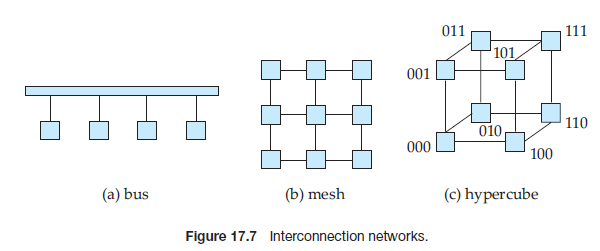
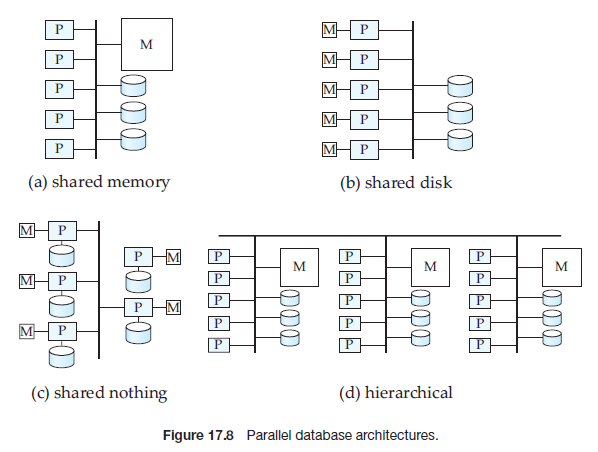

Parallel Systems## Parallel Systems

Parallel systems improve processing and I/O speeds by using multiple processors and disks in parallel. Parallel machines are becoming increasingly common, mak- ing the study of parallel database systems correspondingly more important. The driving force behind parallel database systems is the demands of applications that have to query extremely large databases (of the order of terabytes—that is, 10^12^ bytes) or that have to process an extremely large number of transactions per sec- ond (of the order of thousands of transactions per second). Centralized and client –server database systems are not powerful enough to handle such applications.

In parallel processing, many operations are performed simultaneously, as opposed to serial processing, in which the computational steps are performed se- quentially. A **coarse-grain** parallel machine consists of a small number of powerful processors; a **massively parallel** or **fine-grain parallel** machine uses thousands of smaller processors. Virtually all high-end machines today offer some degree of coarse-grain parallelism: at least two or four processors. Massively parallel computers can be distinguished from the coarse-grain parallel machines by the much larger degree of parallelism that they support. Parallel computers with hundreds of processors and disks are available commercially.

There are two main measures of performance of a database system: (1) **throughput**, the number of tasks that can be completed in a given time inter- val, and (2) **response time**, the amount of time it takes to complete a single task from the time it is submitted. A system that processes a large number of small transactions can improve throughput by processing many transactions in paral- lel. A system that processes large transactions can improve response time as well as throughput by performing subtasks of each transaction in parallel.

### Speedup and Scaleup

Two important issues in studying parallelism are speedup and scaleup. Running a given task in less time by increasing the degree of parallelism is called **speedup**. Handling larger tasks by increasing the degree of parallelism is called **scaleup**.

Consider a database application running on a parallel system with a certain number of processors and disks. Now suppose that we increase the size of the system by increasing the number of processors, disks, and other components of the system. The goal is to process the task in time inversely proportional to the number of processors and disks allocated. Suppose that the execution time of a task on the larger machine is _T_~L~ , and that the execution time of the same task on the smaller machine is _T_~S~. The speedup due to parallelism is defined as _T~S~/T~L~_ . The parallel system is said to demonstrate **linear speedup** if the speedup is _N_ when the larger system has _N_ times the resources (processors, disk, and so on) of the smaller system. If the speedup is less than _N_, the system is said to demonstrate **sublinear speedup**. Figure 17.5 illustrates linear and sublinear speedup.

Scaleup relates to the ability to process larger tasks in the same amount of time by providing more resources. Let _Q_ be a task, and let _QN_ be a task that is _N_ times bigger than _Q_. Suppose that the execution time of task _Q_ on a given machine

_MS_ is _TS_, and the execution time of task _QN_ on a parallel machine _ML_ , which is _N_ times larger than _MS_, is _TL_ . The scaleup is then defined as _TS/TL_ . The parallel system _ML_ is said to demonstrate **linear scaleup** on task _Q_ if _TL_ \= _TS_. If _TL > TS_, the system is said to demonstrate **sublinear scaleup**. Figure 17.6 illustrates linear and sublinear scaleups (where the resources increase in proportion to problem size). There are two kinds of scaleup that are relevant in parallel database systems, depending on how the size of the task is measured:

- In **batch scaleup**, the size of the database increases, and the tasks are large jobs whose runtime depends on the size of the database. An example of such a task is a scan of a relation whose size is proportional to the size of the database. Thus, the size of the database is the measure of the size of the problem. Batch scaleup also applies in scientific applications, such as executing a query at an _N_\-times finer resolution or performing an _N_\-times longer simulation.

- In **transaction scaleup**, the rate at which transactions are submitted to the database increases and the size of the database increases proportionally to the transaction rate. This kind of scaleup is what is relevant in transaction- processing systems where the transactions are small updates—for example, a deposit or withdrawal from an account—and transaction rates grow as more accounts are created. Such transaction processing is especially well adapted for parallel execution, since transactions can run concurrently and independently on separate processors, and each transaction takes roughly the same amount of time, even if the database grows.

Scaleup is usually the more important metric for measuring efficiency of par- allel database systems. The goal of parallelism in database systems is usually to make sure that the database system can continue to perform at an acceptable speed, even as the size of the database and the number of transactions increases. Increasing the capacity of the system by increasing the parallelism provides a smoother path for growth for an enterprise than does replacing a centralized system with a faster machine (even assuming that such a machine exists). How- ever, we must also look at absolute performance numbers when using scaleup measures; a machine that scales up linearly may perform worse than a machine that scales less than linearly, simply because the latter machine is much faster to start off with.

A number of factors work against efficient parallel operation and can diminish both speedup and scaleup.

- **Start-up costs**. There is a start-up cost associated with initiating a single process. In a parallel operation consisting of thousands of processes, the _start-up time_ may overshadow the actual processing time, affecting speedup adversely.

- **Interference**. Since processes executing in a parallel system often access shared resources, a slowdown may result from the _interference_ of each new process as it competes with existing processes for commonly held resources, such as a system bus, or shared disks, or even locks. Both speedup and scaleup are affected by this phenomenon.

- **Skew**. By breaking down a single task into a number of parallel steps, we reduce the size of the average step. Nonetheless, the service time for the single slowest step will determine the service time for the task as a whole. It is often difficult to divide a task into exactly equal-sized parts, and the way that the sizes are distributed is therefore _skewed_. For example, if a task of size 100 is divided into 10 parts, and the division is skewed, there may be some tasks of size less than 10 and some tasks of size more than 10; if even one task happens to be of size 20, the speedup obtained by running the tasks in parallel is only five, instead of ten as we would have hoped.

### Interconnection Networks

Parallel systems consist of a set of components (processors, memory, and disks) that can communicate with each other via an **interconnection network**. Fig- ure 17.7 shows three commonly used types of interconnection networks:

- **Bus**. All the system components can send data on and receive data from a sin- gle communication bus. This type of interconnection is shown in Figure 17.7a. The bus could be an Ethernet or a parallel interconnect. Bus architectures work well for small numbers of processors. However, they do not scale well with increasing parallelism, since the bus can handle communication from only one component at a time.

- **Mesh**. The components are nodes in a grid, and each component connects to all its adjacent components in the grid. In a two-dimensional mesh each node connects to four adjacent nodes, while in a three-dimensional mesh each node connects to six adjacent nodes. Figure 17.7b shows a two-dimensional mesh. 

Nodes that are not directly connected can communicate with one another by routing messages via a sequence of intermediate nodes that are directly connected to one another. The number of communication links grows as the number of components grows, and the communication capacity of a mesh therefore scales better with increasing parallelism.

- **Hypercube**. The components are numbered in binary, and a component is connected to another if the binary representations of their numbers differ in exactly one bit. Thus, each of the _n_ components is connected to log(_n_) other components. Figure 17.7c shows a hypercube with eight nodes. In a hypercube interconnection, a message from a component can reach any other component by going through at most log(_n_) links. In contrast, in a mesh architecture a component may be 2(√ _n_ − 1) links away from some of the other components (or √ _n_ links away, if the mesh interconnection wraps around at the edges of the grid). Thus communication delays in a hypercube are significantly lower than in a mesh.

### Parallel Database Architectures

There are several architectural models for parallel machines. Among the most prominent ones are those in Figure 17.8 (in the figure, M denotes memory, P denotes a processor, and disks are shown as cylinders):

- **Shared memory**. All the processors share a common memory (Figure 17.8a).

- **Shared disk**. All the processors share a common set of disks (Figure 17.8b). Shared-disk systems are sometimes called **clusters**.

- **Shared nothing**. The processors share neither a common memory nor com- mon disk (Figure 17.8c).

- **Hierarchical**. This model is a hybrid of the preceding three architectures (Figure 17.8d).

In Sections 17.3.3.1 through 17.3.3.4, we elaborate on each of these models.  

Techniques used to speed up transaction processing on data-server systems, such as data and lock caching and lock de-escalation, outlined in Section 17.2.2, can also be used in shared-disk parallel databases as well as in shared-nothing parallel databases. In fact, they are very important for efficient transaction pro- cessing in such systems.

#### 17.3.3.1 Shared Memory

In a **shared-memory** architecture, the processors and disks have access to a com- mon memory, typically via a bus or through an interconnection network. The benefit of shared memory is extremely efficient communication between proces- sors—data in shared memory can be accessed by any processor without being moved with software. A processor can send messages to other processors much faster by using memory writes (which usually take less than a microsecond) than by sending a message through a communication mechanism. The downside of shared-memory machines is that the architecture is not scalable beyond 32 or 64 processors because the bus or the interconnection network becomes a bottleneck (since it is shared by all processors). Adding more processors does not help after a point, since the processors will spend most of their time waiting for their turn on the bus to access memory.

Shared-memory architectures usually have large memory caches at each pro- cessor, so that referencing of the shared memory is avoided whenever possible.  

However, at least some of the data will not be in the cache, and accesses will have to go to the shared memory. Moreover, the caches need to be kept coherent; that is, if a processor performs a write to a memory location, the data in that memory location should be either updated at or removed from any processor where the data are cached. Maintaining cache coherency becomes an increasing overhead with increasing numbers of processors. Consequently, shared-memory machines are not capable of scaling up beyond a point; current shared-memory machines cannot support more than 64 processors.

#### 17.3.3.2 Shared Disk

In the **shared-disk** model, all processors can access all disks directly via an in- terconnection network, but the processors have private memories. There are two advantages of this architecture over a shared-memory architecture. First, since each processor has its own memory, the memory bus is not a bottleneck. Second, it offers a cheap way to provide a degree of **fault tolerance**: If a processor (or its memory) fails, the other processors can take over its tasks, since the database is resident on disks that are accessible from all processors. We can make the disk subsystem itself fault tolerant by using a RAID architecture, as described in Chap- ter 10. The shared-disk architecture has found acceptance in many applications.

The main problem with a shared-disk system is again scalability. Although the memory bus is no longer a bottleneck, the interconnection to the disk sub- system is now a bottleneck; it is particularly so in a situation where the database makes a large number of accesses to disks. Compared to shared-memory systems, shared-disk systems can scale to a somewhat larger number of processors, but communication across processors is slower (up to a few milliseconds in the ab- sence of special-purpose hardware for communication), since it has to go through a communication network.

#### 17.3.3.3 Shared Nothing

In a **shared-nothing** system, each node of the machine consists of a processor, memory, and one or more disks. The processors at one node may communicate with another processor at another node by a high-speed interconnection network. A node functions as the server for the data on the disk or disks that the node owns. Since local disk references are serviced by local disks at each processor, the shared-nothing model overcomes the disadvantage of requiring all I/O to go through a single interconnection network; only queries, accesses to nonlocal disks, and result relations pass through the network. Moreover, the interconnection networks for shared-nothing systems are usually designed to be scalable, so that their transmission capacity increases as more nodes are added. Consequently, shared-nothing architectures are more scalable and can easily support a large number of processors. The main drawbacks of shared-nothing systems are the costs of communication and of nonlocal disk access, which are higher than in a shared-memory or shared-disk architecture since sending data involves software interaction at both ends.

#### 17.3.3.4 Hierarchical

The **hierarchical architecture** combines the characteristics of shared-memory, shared-disk, and shared-nothing architectures. At the top level, the system con- sists of nodes that are connected by an interconnection network and do not share disks or memory with one another. Thus, the top level is a shared-nothing ar- chitecture. Each node of the system could actually be a shared-memory system with a few processors. Alternatively, each node could be a shared-disk system, and each of the systems sharing a set of disks could be a shared-memory system. Thus, a system could be built as a hierarchy, with shared-memory architecture with a few processors at the base, and a shared-nothing architecture at the top, with possibly a shared-disk architecture in the middle. Figure 17.8d illustrates a hierarchical architecture with shared-memory nodes connected together in a shared-nothing architecture. Commercial parallel database systems today run on several of these architectures.

Attempts to reduce the complexity of programming such systems have yielded **distributed virtual-memory** architectures, where logically there is a single shared memory, but physically there are multiple disjoint memory systems; the virtual- memory-mapping hardware, coupled with system software, allows each pro- cessor to view the disjoint memories as a single virtual memory. Since access speeds differ, depending on whether the page is available locally or not, such an architecture is also referred to as a **nonuniform memory architecture** (**NUMA**).

