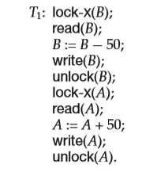
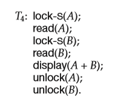
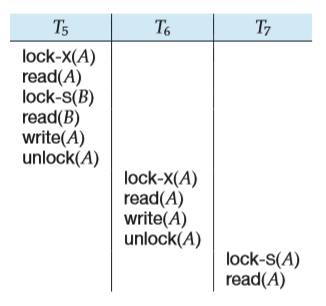
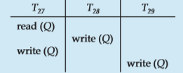
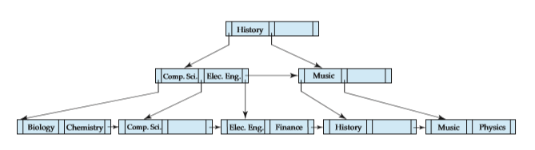

CHAPTER 15 Concurrency Control## CHAPTER 15 Concurrency Control

We saw in Chapter 14 that one of the fundamental properties of a transaction is isolation. When several transactions execute concurrently in the database, how- ever, the isolation property may no longer be preserved. To ensure that it is, the system must control the interaction among the concurrent transactions; this control is achieved through one of a variety of mechanisms called _concurrency- control_ schemes. In Chapter 26, we discuss concurrency-control schemes that admit nonserializable schedules. In this chapter, we consider the management of concurrently executing transactions, and we ignore failures. In Chapter 16, we shall see how the system can recover from failures.

As we shall see, there are a variety of concurrency-control schemes. No one scheme is clearly the best; each one has advantages. In practice, the most fre- quently used schemes are _two-phase locking_ and _snapshot isolation_.

### Lock-Based Protocols

One way to ensure isolation is to require that data items be accessed in a mutually exclusive manner; that is, while one transaction is accessing a data item, no other transaction can modify that data item. The most common method used to implement this requirement is to allow a transaction to access a data item only if it is currently holding a **lock** on that item. We introduced the concept of locking in Section 14.9.

#### Locks

There are various modes in which a data item may be locked. In this section, we restrict our attention to two modes:

**1\. Shared**. If a transaction _Ti_ has obtained a **shared-mode lock** (denoted by S) on item _Q_, then _Ti_ can read, but cannot write, _Q_.

**2\. Exclusive**. If a transaction _Ti_ has obtained an **exclusive-mode lock** (denoted by X) on item _Q_, then _Ti_ can both read and write _Q_.

**Figure 15.1** Lock-compatibility matrix comp.

We require that every transaction **request** a lock in an appropriate mode on data item _Q_, depending on the types of operations that it will perform on _Q_. The transaction makes the request to the concurrency-control manager. The transaction can proceed with the operation only after the concurrency-control manager **grants** the lock to the transaction. The use of these two lock modes allows multiple transactions to read a data item but limits write access to just one transaction at a time.

To state this more generally, given a set of lock modes, we can define a **compatibility function** on them as follows: Let _A_ and _B_ represent arbitrary lock modes. Suppose that a transaction _Ti_ requests a lock of mode _A_ on item _Q_ on which transaction _Tj_ (_Ti_ = _Tj_ ) currently holds a lock of mode _B_. If transaction _Ti_ can be granted a lock on _Q_ immediately, in spite of the presence of the mode _B_ lock, then we say mode _A_ is **compatible** with mode _B_. Such a function can be represented conveniently by a matrix. The compatibility relation between the two modes of locking discussed in this section appears in the matrix comp of Figure 15.1. An element comp(_A, B_) of the matrix has the value _true_ if and only if mode _A_ is compatible with mode _B_.

Note that shared mode is compatible with shared mode, but not with exclusive mode. At any time, several shared-mode locks can be held simultaneously (by different transactions) on a particular data item. A subsequent exclusive-mode lock request has to wait until the currently held shared-mode locks are released.

A transaction requests a shared lock on data item _Q_ by executing the lock- S(_Q_) instruction. Similarly, a transaction requests an exclusive lock through the lock-X(_Q_) instruction. A transaction can unlock a data item _Q_ by the unlock(_Q_) instruction.

To access a data item, transaction _Ti_ must first lock that item. If the data item is already locked by another transaction in an incompatible mode, the concurrency- control manager will not grant the lock until all incompatible locks held by other transactions have been released. Thus, _Ti_ is made to **wait** until all incompatible locks held by other transactions have been released.

Transaction _Ti_ may unlock a data item that it had locked at some earlier point. Note that a transaction must hold a lock on a data item as long as it accesses that item. Moreover, it is not necessarily desirable for a transaction to unlock a data item immediately after its final access of that data item, since serializability may not be ensured.

As an illustration, consider again the banking example that we introduced in Chapter 14. Let _A_ and _B_ be two accounts that are accessed by transactions T1  

**Figure 15.2** Transaction T1.

and T2\. Transaction T1 transfers $50 from account _B_ to account _A_ (Figure 15.2). Transaction T2 displays the total amount of money in accounts _A_ and _B_—that is, the sum _A_ \+ _B_ (Figure 15.3).

Suppose that the values of accounts _A_ and _B_ are $100 and $200, respectively. If these two transactions are executed serially, either in the order T1, T2 or the order T2, T1, then transaction T2 will display the value $300. If, however, these transactions are executed concurrently, then schedule 1, in Figure 15.4, is possible. In this case, transaction T2 displays $250, which is incorrect. The reason for this mistake is that the transaction T1 unlocked data item _B_ too early, as a result of which T2 saw an inconsistent state.

The schedule shows the actions executed by the transactions, as well as the points at which the concurrency-control manager grants the locks. The transac- tion making a lock request cannot execute its next action until the concurrency- control manager grants the lock. Hence, the lock must be granted in the interval of time between the lock-request operation and the following action of the trans- action. Exactly when within this interval the lock is granted is not important; we can safely assume that the lock is granted just before the following action of the transaction. We shall therefore drop the column depicting the actions of the concurrency-control manager from all schedules depicted in the rest of the chapter. We let you infer when locks are granted.

**Figure 15.3** Transaction T2.  

**Figure 15.4** Schedule 1.

Suppose now that unlocking is delayed to the end of the transaction. Trans- action T3 corresponds to T1 with unlocking delayed (Figure 15.5). Transaction T4 corresponds to T2 with unlocking delayed (Figure 15.6).

You should verify that the sequence of reads and writes in schedule 1, which lead to an incorrect total of $250 being displayed, is no longer possible with T3

**Figure 15.5** Transaction T3 (transaction T1 with unlocking delayed).  

**Figure 15.6** Transaction T4 (transaction T2 with unlocking delayed).

and T4\. Other schedules are possible. T4 will not print out an inconsistent result in any of them; we shall see why later.

Unfortunately, locking can lead to an undesirable situation. Consider the partial schedule of Figure 15.7 for T3 and T4\. Since T3 is holding an exclusive- mode lock on _B_ and T4 is requesting a shared-mode lock on _B_, T4 is waiting for T3 to unlock _B_. Similarly, since T4 is holding a shared-mode lock on _A_ and T3 is requesting an exclusive-mode lock on _A_, T3 is waiting for T4 to unlock _A_. Thus, we have arrived at a state where neither of these transactions can ever proceed with its normal execution. This situation is called **deadlock**. When deadlock occurs, the system must roll back one of the two transactions. Once a transaction has been rolled back, the data items that were locked by that transaction are unlocked. These data items are then available to the other transaction, which can continue with its execution. We shall return to the issue of deadlock handling in Section 15.2.

If we do not use locking, or if we unlock data items too soon after reading or writing them, we may get inconsistent states. On the other hand, if we do not unlock a data item before requesting a lock on another data item, deadlocks may occur. There are ways to avoid deadlock in some situations, as we shall see in Section 15.1.5. However, in general, deadlocks are a necessary evil associated with locking, if we want to avoid inconsistent states. Deadlocks are definitely

**Figure 15.7** Schedule 2.  

preferable to inconsistent states, since they can be handled by rolling back trans- actions, whereas inconsistent states may lead to real-world problems that cannot be handled by the database system.

We shall require that each transaction in the system follow a set of rules, called a **locking protocol**, indicating when a transaction may lock and unlock each of the data items. Locking protocols restrict the number of possible schedules. The set of all such schedules is a proper subset of all possible serializable schedules. We shall present several locking protocols that allow only conflict-serializable schedules, and thereby ensure isolation. Before doing so, we introduce some terminology.

Let _{T_0, T1_, . . . , Tn}_ be a set of transactions participating in a schedule _S_. We say that _Ti_ **precedes** _Tj_ in _S_, written _Ti_ → _Tj_ , if there exists a data item _Q_ such that _Ti_ has held lock mode _A_ on _Q_, and _Tj_ has held lock mode _B_ on _Q_ later, and comp(_A,B_) = false. If _Ti_ → _Tj_ , then that precedence implies that in any equivalent serial schedule, _Ti_ must appear before _Tj_ . Observe that this graph is similar to the precedence graph that we used in Section 14.6 to test for conflict serializability. Conflicts between instructions correspond to noncompatibility of lock modes.

We say that a schedule _S_ is **legal** under a given locking protocol if _S_ is a possible schedule for a set of transactions that follows the rules of the locking protocol. We say that a locking protocol **ensures** conflict serializability if and only if all legal schedules are conflict serializable; in other words, for all legal schedules the associated → relation is acyclic.

#### Granting of Locks**

When a transaction requests a lock on a data item in a particular mode, and no other transaction has a lock on the same data item in a conflicting mode, the lock can be granted. However, care must be taken to avoid the following scenario. Suppose a transaction T2 has a shared-mode lock on a data item, and another transaction T1 requests an exclusive-mode lock on the data item. Clearly, T1 has to wait for T2 to release the shared-mode lock. Meanwhile, a transaction T3 may request a shared-mode lock on the same data item. The lock request is compatible with the lock granted to T2, so T3 may be granted the shared-mode lock. At this point T2 may release the lock, but still T1 has to wait for T3 to finish. But again, there may be a new transaction T4 that requests a shared-mode lock on the same data item, and is granted the lock before T3 releases it. In fact, it is possible that there is a sequence of transactions that each requests a shared-mode lock on the data item, and each transaction releases the lock a short while after it is granted, but T1 never gets the exclusive-mode lock on the data item. The transaction T1 may never make progress, and is said to be **starved**.

We can avoid starvation of transactions by granting locks in the following manner: When a transaction _Ti_ requests a lock on a data item _Q_ in a particular mode _M_, the concurrency-control manager grants the lock provided that:

**1\.** There is no other transaction holding a lock on _Q_ in a mode that conflicts with _M_.  

**2\.** There is no other transaction that is waiting for a lock on _Q_ and that made its lock request before _Ti_ .

Thus, a lock request will never get blocked by a lock request that is made later.

#### The Two-Phase Locking Protocol**

One protocol that ensures serializability is the **two-phase locking protocol**. This protocol requires that each transaction issue lock and unlock requests in two phases:

**1\. Growing phase**. A transaction may obtain locks, but may not release any lock.

**2\. Shrinking phase**. A transaction may release locks, but may not obtain any new locks.

Initially, a transaction is in the growing phase. The transaction acquires locks as needed. Once the transaction releases a lock, it enters the shrinking phase, and it can issue no more lock requests.

For example, transactions T3 and T4 are two phase. On the other hand, trans- actions T1 and T2 are not two phase. Note that the unlock instructions do not need to appear at the end of the transaction. For example, in the case of transaction T3, we could move the unlock(_B_) instruction to just after the lock-X(_A_) instruction, and still retain the two-phase locking property.

We can show that the two-phase locking protocol ensures conflict serializabil- ity. Consider any transaction. The point in the schedule where the transaction has obtained its final lock (the end of its growing phase) is called the **lock point** of the transaction. Now, transactions can be ordered according to their lock points— this ordering is, in fact, a serializability ordering for the transactions. We leave the proof as an exercise for you to do (see Practice Exercise 15.1).

Two-phase locking does _not_ ensure freedom from deadlock. Observe that transactions T3 and T4 are two phase, but, in schedule 2 (Figure 15.7), they are deadlocked.

Recall from Section 14.7.2 that, in addition to being serializable, schedules should be cascadeless. Cascading rollback may occur under two-phase locking. As an illustration, consider the partial schedule of Figure 15.8. Each transaction observes the two-phase locking protocol, but the failure of T5 after the read(A) step of T7 leads to cascading rollback of T6 and T7.

Cascading rollbacks can be avoided by a modification of two-phase locking called the **strict two-phase locking protocol**. This protocol requires not only that locking be two phase, but also that all exclusive-mode locks taken by a transaction be held until that transaction commits. This requirement ensures that any data written by an uncommitted transaction are locked in exclusive mode until the transaction commits, preventing any other transaction from reading the data.

Another variant of two-phase locking is the **rigorous two-phase locking protocol**, which requires that all locks be held until the transaction commits.  

**Figure 15.8** Partial schedule under two-phase locking.

We can easily verify that, with rigorous two-phase locking, transactions can be serialized in the order in which they commit.

Consider the following two transactions, for which we have shown only some of the significant read and write operations:

T8: read(_a_1); read(_a_2); . . . read(_an_); write(_a_1).

T9: read(_a_1); read(_a_2); display(_a_1 + _a_2).

If we employ the two-phase locking protocol, then T8 must lock _a_1 in exclusive mode. Therefore, any concurrent execution of both transactions amounts to a serial execution. Notice, however, that T8 needs an exclusive lock on _a_1 only at the end of its execution, when it writes _a_1\. Thus, if T8 could initially lock _a_1 in shared mode, and then could later change the lock to exclusive mode, we could get more concurrency, since T8 and T9 could access _a_1 and _a_2 simultaneously.

This observation leads us to a refinement of the basic two-phase locking protocol, in which **lock conversions** are allowed. We shall provide a mechanism for upgrading a shared lock to an exclusive lock, and downgrading an exclusive lock to a shared lock. We denote conversion from shared to exclusive modes by **upgrade**, and from exclusive to shared by **downgrade**. Lock conversion cannot be allowed arbitrarily. Rather, upgrading can take place in only the growing phase, whereas downgrading can take place in only the shrinking phase.  

**Figure 15.9** Incomplete schedule with a lock conversion.

Returning to our example, transactions T8 and T9 can run concurrently under the refined two-phase locking protocol, as shown in the incomplete schedule of Figure 15.9, where only some of the locking instructions are shown.

Note that a transaction attempting to upgrade a lock on an item _Q_ may be forced to wait. This enforced wait occurs if _Q_ is currently locked by _another_ transaction in shared mode.

Just like the basic two-phase locking protocol, two-phase locking with lock conversion generates only conflict-serializable schedules, and transactions can be serialized by their lock points. Further, if exclusive locks are held until the end of the transaction, the schedules are cascadeless.

For a set of transactions, there may be conflict-serializable schedules that cannot be obtained through the two-phase locking protocol. However, to obtain conflict-serializable schedules through non-two-phase locking protocols, we need either to have additional information about the transactions or to impose some structure or ordering on the set of data items in the database. We shall see examples when we consider other locking protocols later in this chapter.

Strict two-phase locking and rigorous two-phase locking (with lock conver- sions) are used extensively in commercial database systems.

A simple but widely used scheme automatically generates the appropriate lock and unlock instructions for a transaction, on the basis of read and write requests from the transaction:

• When a transaction _Ti_ issues a read(_Q_) operation, the system issues a lock- S(_Q_) instruction followed by the read(_Q_) instruction.

• When _Ti_ issues a write(_Q_) operation, the system checks to see whether _Ti_ already holds a shared lock on _Q_. If it does, then the system issues an up- grade(_Q_) instruction, followed by the write(_Q_) instruction. Otherwise, the system issues a lock-X(_Q_) instruction, followed by the write(_Q_) instruction.

• All locks obtained by a transaction are unlocked after that transaction com- mits or aborts.  

####  Implementation of Locking

A **lock manager** can be implemented as a process that receives messages from transactions and sends messages in reply. The lock-manager process replies to lock-request messages with lock-grant messages, or with messages requesting rollback of the transaction (in case of deadlocks). Unlock messages require only an acknowledgment in response, but may result in a grant message to another waiting transaction.

The lock manager uses this data structure: For each data item that is currently locked, it maintains a linked list of records, one for each request, in the order in which the requests arrived. It uses a hash table, indexed on the name of a data item, to find the linked list (if any) for a data item; this table is called the **lock table**. Each record of the linked list for a data item notes which transaction made the request, and what lock mode it requested. The record also notes if the request has currently been granted.

Figure 15.10 shows an example of a lock table. The table contains locks for five different data items, I4, I7, I23, I44, and I912. The lock table uses overflow chaining, so there is a linked list of data items for each entry in the lock table. There is also a list of transactions that have been granted locks, or are waiting for locks, for each of the data items. Granted locks are the rectangles filled in a darker shade, while waiting requests are the rectangles filled in a lighter shade. We have omitted the lock mode to keep the figure simple. It can be seen, for example, that T23 has been granted locks on I912 and I7, and is waiting for a lock on I4.

Although the figure does not show it, the lock table should also maintain an index on transaction identifiers, so that it is possible to determine efficiently the set of locks held by a given transaction.

The lock manager processes requests this way:

• When a lock request message arrives, it adds a record to the end of the linked list for the data item, if the linked list is present. Otherwise it creates a new linked list, containing only the record for the request.

It always grants a lock request on a data item that is not currently locked. But if the transaction requests a lock on an item on which a lock is currently held, the lock manager grants the request only if it is compatible with the locks that are currently held, and all earlier requests have been granted already. Otherwise the request has to wait.

• When the lock manager receives an unlock message from a transaction, it deletes the record for that data item in the linked list corresponding to that transaction. It tests the record that follows, if any, as described in the previous paragraph, to see if that request can now be granted. If it can, the lock manager grants that request, and processes the record following it, if any, similarly, and so on.

• If a transaction aborts, the lock manager deletes any waiting request made by the transaction. Once the database system has taken appropriate actions to undo the transaction (see Section 16.3), it releases all locks held by the aborted transaction.  

**Figure 15.10** Lock table.

This algorithm guarantees freedom from starvation for lock requests, since a request can never be granted while a request received earlier is waiting to be granted. We study how to detect and handle deadlocks later, in Section 15.2.2. Section 17.2.1 describes an alternative implementation—one that uses shared memory instead of message passing for lock request/grant.

#### Graph-Based Protocols

As noted in Section 15.1.3, if we wish to develop protocols that are not two phase, we need additional information on how each transaction will access the database. There are various models that can give us the additional information, each dif- fering in the amount of information provided. The simplest model requires that we have prior knowledge about the order in which the database items will be accessed. Given such information, it is possible to construct locking protocols that are not two phase, but that, nevertheless, ensure conflict serializability.

To acquire such prior knowledge, we impose a partial ordering → on the set **D** \= _{d_1, _d_2_, . . . , dh}_ of all data items. If _di_ → _d j_ , then any transaction accessing  

both _di_ and _d j_ must access _di_ before accessing _d j_ . This partial ordering may be the result of either the logical or the physical organization of the data, or it may be imposed solely for the purpose of concurrency control.

The partial ordering implies that the set **D** may now be viewed as a directed acyclic graph, called a **database graph**. In this section, for the sake of simplicity, we will restrict our attention to only those graphs that are rooted trees. We shall present a simple protocol, called the _tree protocol_, which is restricted to employ only _exclusive_ locks. References to other, more complex, graph-based locking protocols are in the bibliographical notes.

In the **tree protocol**, the only lock instruction allowed is lock-X. Each trans- action _Ti_ can lock a data item at most once, and must observe the following rules:

**1\.** The first lock by _Ti_ may be on any data item.

**2\.** Subsequently, a data item _Q_ can be locked by _Ti_ only if the parent of _Q_ is currently locked by _Ti_ .

**3\.** Data items may be unlocked at any time.

**4\.** A data item that has been locked and unlocked by _Ti_ cannot subsequently be relocked by _Ti_ .

All schedules that are legal under the tree protocol are conflict serializable. To illustrate this protocol, consider the database graph of Figure 15.11. The

following four transactions follow the tree protocol on this graph. We show only the lock and unlock instructions:

**Figure 15.11** Tree-structured database graph.  

T10: lock-X(_B_); lock-X(_E_); lock-X(_D_); unlock(_B_); unlock(_E_); lock-X(_G_); unlock(_D_); unlock(_G_).

T11: lock-X(_D_); lock-X(_H_); unlock(_D_); unlock(_H_). T12: lock-X(_B_); lock-X(_E_); unlock(_E_); unlock(_B_). T13: lock-X(_D_); lock-X(_H_); unlock(_D_); unlock(_H_).

One possible schedule in which these four transactions participated appears in Figure 15.12. Note that, during its execution, transaction T10 holds locks on two _disjoint_ subtrees.

Observe that the schedule of Figure 15.12 is conflict serializable. It can be shown not only that the tree protocol ensures conflict serializability, but also that this protocol ensures freedom from deadlock.

The tree protocol in Figure 15.12 does not ensure recoverability and cas- cadelessness. To ensure recoverability and cascadelessness, the protocol can be modified to not permit release of exclusive locks until the end of the transaction. Holding exclusive locks until the end of the transaction reduces concurrency. Here is an alternative that improves concurrency, but ensures only recoverabil- ity: For each data item with an uncommitted write, we record which transaction performed the last write to the data item. Whenever a transaction _Ti_ performs a read of an uncommitted data item, we record a **commit dependency** of _Ti_ on the

**Figure 15.12** Serializable schedule under the tree protocol.  

transaction that performed the last write to the data item. Transaction _Ti_ is then not permitted to commit until the commit of all transactions on which it has a commit dependency. If any of these transactions aborts, _Ti_ must also be aborted.

The tree-locking protocol has an advantage over the two-phase locking pro- tocol in that, unlike two-phase locking, it is deadlock-free, so no rollbacks are required. The tree-locking protocol has another advantage over the two-phase locking protocol in that unlocking may occur earlier. Earlier unlocking may lead to shorter waiting times, and to an increase in concurrency.

However, the protocol has the disadvantage that, in some cases, a transaction may have to lock data items that it does not access. For example, a transaction that needs to access data items _A_ and _J_ in the database graph of Figure 15.11 must lock not only _A_ and _J_, but also data items _B_, _D_, and _H_. This additional locking results in increased locking overhead, the possibility of additional waiting time, and a potential decrease in concurrency. Further, without prior knowledge of what data items will need to be locked, transactions will have to lock the root of the tree, and that can reduce concurrency greatly.

For a set of transactions, there may be conflict-serializable schedules that cannot be obtained through the tree protocol. Indeed, there are schedules possible under the two-phase locking protocol that are not possible under the tree protocol, and vice versa. Examples of such schedules are explored in the exercises.

### Deadlock Handling**

A system is in a deadlock state if there exists a set of transactions such that every transaction in the set is waiting for another transaction in the set. More precisely, there exists a set of waiting transactions _{T_0, T1_, . . . , Tn}_ such that T0 is waiting for a data item that T1 holds, and T1 is waiting for a data item that T2 holds, and _. . ._ , and _Tn_−1 is waiting for a data item that _Tn_ holds, and _Tn_ is waiting for a data item that T0 holds. None of the transactions can make progress in such a situation.

The only remedy to this undesirable situation is for the system to invoke some drastic action, such as rolling back some of the transactions involved in the deadlock. Rollback of a transaction may be partial: That is, a transaction may be rolled back to the point where it obtained a lock whose release resolves the deadlock.

There are two principal methods for dealing with the deadlock problem. We can use a **deadlock prevention** protocol to ensure that the system will _never_ enter a deadlock state. Alternatively, we can allow the system to enter a deadlock state, and then try to recover by using a **deadlock detection** and **deadlock recovery** scheme. As we shall see, both methods may result in transaction rollback. Preven- tion is commonly used if the probability that the system would enter a deadlock state is relatively high; otherwise, detection and recovery are more efficient.

Note that a detection and recovery scheme requires overhead that includes not only the run-time cost of maintaining the necessary information and of executing the detection algorithm, but also the potential losses inherent in recovery from a deadlock.  

#### Deadlock Prevention

There are two approaches to deadlock prevention. One approach ensures that no cyclic waits can occur by ordering the requests for locks, or requiring all locks to be acquired together. The other approach is closer to deadlock recovery, and performs transaction rollback instead of waiting for a lock, whenever the wait could potentially result in a deadlock.

The simplest scheme under the first approach requires that each transaction locks all its data items before it begins execution. Moreover, either all are locked in one step or none are locked. There are two main disadvantages to this protocol: (1) it is often hard to predict, before the transaction begins, what data items need to be locked; (2) data-item utilization may be very low, since many of the data items may be locked but unused for a long time.

Another approach for preventing deadlocks is to impose an ordering of all data items, and to require that a transaction lock data items only in a sequence consistent with the ordering. We have seen one such scheme in the tree protocol, which uses a partial ordering of data items.

A variation of this approach is to use a total order of data items, in conjunction with two-phase locking. Once a transaction has locked a particular item, it cannot request locks on items that precede that item in the ordering. This scheme is easy to implement, as long as the set of data items accessed by a transaction is known when the transaction starts execution. There is no need to change the underlying concurrency-control system if two-phase locking is used: All that is needed is to ensure that locks are requested in the right order.

The second approach for preventing deadlocks is to use preemption and transaction rollbacks. In preemption, when a transaction _Tj_ requests a lock that transaction _Ti_ holds, the lock granted to _Ti_ may be **preempted** by rolling back of _Ti_ , and granting of the lock to _Tj_ . To control the preemption, we assign a unique timestamp, based on a counter or on the system clock, to each transaction when it begins. The system uses these timestamps only to decide whether a transaction should wait or roll back. Locking is still used for concurrency control. If a transaction is rolled back, it retains its _old_ timestamp when restarted. Two different deadlock-prevention schemes using timestamps have been proposed:

**1\.** The **wait–die** scheme is a nonpreemptive technique. When transaction _Ti_ requests a data item currently held by _Tj_ , _Ti_ is allowed to wait only if it has a timestamp smaller than that of _Tj_ (that is, _Ti_ is older than _Tj_ ). Otherwise, _Ti_ is rolled back (dies).

For example, suppose that transactions T14, T15, and T16 have timestamps 5, 10, and 15, respectively. If T14 requests a data item held by T15, then T14 will wait. If T24 requests a data item held by T15, then T16 will be rolled back.

**2\.** The **wound–wait** scheme is a preemptive technique. It is a counterpart to the wait–die scheme. When transaction _Ti_ requests a data item currently held by _Tj_ , _Ti_ is allowed to wait only if it has a timestamp larger than that of _Tj_ (that is, _Ti_ is younger than _Tj_ ). Otherwise, _Tj_ is rolled back (_Tj_ is _wounded_ by _Ti_ ).  

Returning to our example, with transactions T14, T15, and T16, if T14 requests a data item held by T15, then the data item will be preempted from T15, and T15 will be rolled back. If T16 requests a data item held by T15, then T16 will wait.

The major problem with both of these schemes is that unnecessary rollbacks may occur.

Another simple approach to deadlock prevention is based on **lock timeouts**. In this approach, a transaction that has requested a lock waits for at most a specified amount of time. If the lock has not been granted within that time, the transaction is said to time out, and it rolls itself back and restarts. If there was in fact a deadlock, one or more transactions involved in the deadlock will time out and roll back, allowing the others to proceed. This scheme falls somewhere between deadlock prevention, where a deadlock will never occur, and deadlock detection and recovery, which Section 15.2.2 discusses.

The timeout scheme is particularly easy to implement, and works well if transactions are short and if long waits are likely to be due to deadlocks. However, in general it is hard to decide how long a transaction must wait before timing out. Too long a wait results in unnecessary delays once a deadlock has occurred. Too short a wait results in transaction rollback even when there is no deadlock, leading to wasted resources. Starvation is also a possibility with this scheme. Hence, the timeout-based scheme has limited applicability.

#### Deadlock Detection and Recovery

If a system does not employ some protocol that ensures deadlock freedom, then a detection and recovery scheme must be used. An algorithm that examines the state of the system is invoked periodically to determine whether a deadlock has occurred. If one has, then the system must attempt to recover from the deadlock. To do so, the system must:

• Maintain information about the current allocation of data items to transac- tions, as well as any outstanding data item requests.

• Provide an algorithm that uses this information to determine whether the system has entered a deadlock state.

• Recover from the deadlock when the detection algorithm determines that a deadlock exists.

In this section, we elaborate on these issues.

##### Deadlock Detection

Deadlocks can be described precisely in terms of a directed graph called a **wait- for graph**. This graph consists of a pair _G_ \= (_V_, _E_), where _V_ is a set of vertices and _E_ is a set of edges. The set of vertices consists of all the transactions in the system. Each element in the set _E_ of edges is an ordered pair _Ti_ → _Tj_ . If _Ti_ → _Tj_ is in _E_,  

**Figure 15.13** Wait-for graph with no cycle.

then there is a directed edge from transaction _Ti_ to _Tj_ , implying that transaction _Ti_ is waiting for transaction _Tj_ to release a data item that it needs.

When transaction _Ti_ requests a data item currently being held by transaction _Tj_ , then the edge _Ti_ → _Tj_ is inserted in the wait-for graph. This edge is removed only when transaction _Tj_ is no longer holding a data item needed by transaction _Ti_ .

A deadlock exists in the system if and only if the wait-for graph contains a cycle. Each transaction involved in the cycle is said to be deadlocked. To detect deadlocks, the system needs to maintain the wait-for graph, and periodically to invoke an algorithm that searches for a cycle in the graph.

To illustrate these concepts, consider the wait-for graph in Figure 15.13, which depicts the following situation:

• Transaction T17 is waiting for transactions T18 and T19.

• Transaction T19 is waiting for transaction T18.

• Transaction T18 is waiting for transaction T20.

Since the graph has no cycle, the system is not in a deadlock state. Suppose now that transaction T20 is requesting an item held by T19\. The edge

T20 → T19 is added to the wait-for graph, resulting in the new system state in Figure 15.14. This time, the graph contains the cycle:

T18 → T20 → T19 → T18

implying that transactions T18, T19, and T20 are all deadlocked. Consequently, the question arises: When should we invoke the detection

algorithm? The answer depends on two factors:

**1\.** How often does a deadlock occur?

**2\.** How many transactions will be affected by the deadlock?

If deadlocks occur frequently, then the detection algorithm should be in- voked more frequently. Data items allocated to deadlocked transactions will be  

**Figure 15.14** Wait-for graph with a cycle.

unavailable to other transactions until the deadlock can be broken. In addition, the number of cycles in the graph may also grow. In the worst case, we would invoke the detection algorithm every time a request for allocation could not be granted immediately.

##### Recovery from Deadlock

When a detection algorithm determines that a deadlock exists, the system must **recover** from the deadlock. The most common solution is to roll back one or more transactions to break the deadlock. Three actions need to be taken:

**1\. Selection of a victim**. Given a set of deadlocked transactions, we must deter- mine which transaction (or transactions) to roll back to break the deadlock. We should roll back those transactions that will incur the minimum cost. Unfortunately, the term _minimum cost_ is not a precise one. Many factors may determine the cost of a rollback, including:

a. How long the transaction has computed, and how much longer the transaction will compute before it completes its designated task.

b. How many data items the transaction has used.

c. How many more data items the transaction needs for it to complete.

d. How many transactions will be involved in the rollback.

**2\. Rollback**. Once we have decided that a particular transaction must be rolled back, we must determine how far this transaction should be rolled back.

The simplest solution is a **total rollback**: Abort the transaction and then restart it. However, it is more effective to roll back the transaction only as far as necessary to break the deadlock. Such **partial rollback** requires the system to maintain additional information about the state of all the running transactions. Specifically, the sequence of lock requests/grants and updates performed by the transaction needs to be recorded. The deadlock detection mechanism should decide which locks the selected transaction needs to release in order to break the deadlock. The selected transaction must be rolled back to the point where it obtained the first of these locks, undoing all actions it took after that point. The recovery mechanism must be capable  

of performing such partial rollbacks. Furthermore, the transactions must be capable of resuming execution after a partial rollback. See the bibliographical notes for relevant references.

**3\. Starvation**. In a system where the selection of victims is based primarily on cost factors, it may happen that the same transaction is always picked as a victim. As a result, this transaction never completes its designated task, thus there is **starvation**. We must ensure that a transaction can be picked as a victim only a (small) finite number of times. The most common solution is to include the number of rollbacks in the cost factor.

### Multiple Granularity

In the concurrency-control schemes described thus far, we have used each indi- vidual data item as the unit on which synchronization is performed.

There are circumstances, however, where it would be advantageous to group several data items, and to treat them as one individual synchronization unit. For example, if a transaction _Ti_ needs to access the entire database, and a locking protocol is used, then _Ti_ must lock each item in the database. Clearly, executing these locks is time-consuming. It would be better if _Ti_ could issue a _single_ lock request to lock the entire database. On the other hand, if transaction _Tj_ needs to access only a few data items, it should not be required to lock the entire database, since otherwise concurrency is lost.

What is needed is a mechanism to allow the system to define multiple levels of **granularity**. This is done by allowing data items to be of various sizes and defining a hierarchy of data granularities, where the small granularities are nested within larger ones. Such a hierarchy can be represented graphically as a tree. Note that the tree that we describe here is significantly different from that used by the tree protocol (Section 15.1.5). A nonleaf node of the multiple-granularity tree represents the data associated with its descendants. In the tree protocol, each node is an independent data item.

As an illustration, consider the tree of Figure 15.15, which consists of four levels of nodes. The highest level represents the entire database. Below it are nodes of type _area_; the database consists of exactly these areas. Each area in turn has nodes of type _file_ as its children. Each area contains exactly those files that are its child nodes. No file is in more than one area. Finally, each file has nodes of type _record_. As before, the file consists of exactly those records that are its child nodes, and no record can be present in more than one file.

Each node in the tree can be locked individually. As we did in the two- phase locking protocol, we shall use **shared** and **exclusive** lock modes. When a transaction locks a node, in either shared or exclusive mode, the transaction also has implicitly locked all the descendants of that node in the same lock mode. For example, if transaction _Ti_ gets an **explicit lock** on file _Fc_ of Figure 15.15, in exclusive mode, then it has an **implicit lock** in exclusive mode on all the records belonging to that file. It does not need to lock the individual records of _Fc_ explicitly.  

**Figure 15.15** Granularity hierarchy.

Suppose that transaction _Tj_ wishes to lock record _rb_6 of file _Fb_ . Since _Ti_ has locked _Fb_ explicitly, it follows that _rb_6 is also locked (implicitly). But, when _Tj_ issues a lock request for _rb_6 , _rb_6 is not explicitly locked! How does the system determine whether _Tj_ can lock _rb_6 ? _Tj_ must traverse the tree from the root to record _rb_6 . If any node in that path is locked in an incompatible mode, then _Tj_ must be delayed.

Suppose now that transaction _Tk_ wishes to lock the entire database. To do so, it simply must lock the root of the hierarchy. Note, however, that _Tk_ should not succeed in locking the root node, since _Ti_ is currently holding a lock on part of the tree (specifically, on file _Fb_). But how does the system determine if the root node can be locked? One possibility is for it to search the entire tree. This solution, however, defeats the whole purpose of the multiple-granularity locking scheme. A more efficient way to gain this knowledge is to introduce a new class of lock modes, called **intention lock modes**. If a node is locked in an intention mode, explicit locking is done at a lower level of the tree (that is, at a finer granularity). Intention locks are put on all the ancestors of a node before that node is locked explicitly. Thus, a transaction does not need to search the entire tree to determine whether it can lock a node successfully. A transaction wishing to lock a node—say, _Q_—must traverse a path in the tree from the root to _Q_. While traversing the tree, the transaction locks the various nodes in an intention mode.

There is an intention mode associated with shared mode, and there is one with exclusive mode. If a node is locked in **intention-shared (IS) mode**, explicit locking is being done at a lower level of the tree, but with only shared-mode locks. Similarly, if a node is locked in **intention-exclusive (IX) mode**, then explicit locking is being done at a lower level, with exclusive-mode or shared-mode locks. Finally, if a node is locked in **shared and intention-exclusive (SIX) mode**, the subtree rooted by that node is locked explicitly in shared mode, and that explicit locking is being done at a lower level with exclusive-mode locks. The compatibility function for these lock modes is in Figure 15.16.  

**Figure 15.16** Compatibility matrix.

The **multiple-granularity locking protocol** uses these lock modes to ensure serializability. It requires that a transaction _Ti_ that attempts to lock a node _Q_ must follow these rules:

**1\.** Transaction _Ti_ must observe the lock-compatibility function of Figure 15.16.

**2\.** Transaction _Ti_ must lock the root of the tree first, and can lock it in any mode.

**3\.** Transaction _Ti_ can lock a node _Q_ in S or IS mode only if _Ti_ currently has the parent of _Q_ locked in either IX or IS mode.

**4\.** Transaction _Ti_ can lock a node _Q_ in X, SIX, or IX mode only if _Ti_ currently has the parent of _Q_ locked in either IX or SIX mode.

**5\.** Transaction _Ti_ can lock a node only if _Ti_ has not previously unlocked any node (that is, _Ti_ is two phase).

**6\.** Transaction _Ti_ can unlock a node _Q_ only if _Ti_ currently has none of the children of _Q_ locked.

Observe that the multiple-granularity protocol requires that locks be acquired in _top-down_ (root-to-leaf) order, whereas locks must be released in _bottom-up_ (leaf- to-root) order.

As an illustration of the protocol, consider the tree of Figure 15.15 and these transactions:

• Suppose that transaction T21 reads record _ra_2 in file _Fa_ . Then, T21 needs to lock the database, area _A_1, and _Fa_ in IS mode (and in that order), and finally to lock _ra_2 in S mode.

• Suppose that transaction T22 modifies record _ra_9 in file _Fa_ . Then, T22 needs to lock the database, area _A_1, and file _Fa_ (and in that order) in IX mode, and finally to lock _ra_9 in X mode.

• Suppose that transaction T23 reads all the records in file _Fa_ . Then, T23 needs to lock the database and area _A_1 (and in that order) in IS mode, and finally to lock _Fa_ in S mode.  

• Suppose that transaction T24 reads the entire database. It can do so after locking the database in S mode.

We note that transactions T21, T23, and T24 can access the database concurrently. Transaction T22 can execute concurrently with T21, but not with either T23 or T24.

This protocol enhances concurrency and reduces lock overhead. It is particu- larly useful in applications that include a mix of:

• Short transactions that access only a few data items.

• Long transactions that produce reports from an entire file or set of files.

There is a similar locking protocol that is applicable to database systems in which data granularities are organized in the form of a directed acyclic graph. See the bibliographical notes for additional references. Deadlock is possible in the multiple-granularity protocol, as it is in the two-phase locking protocol. There are techniques to reduce deadlock frequency in the multiple-granularity protocol, and also to eliminate deadlock entirely. These techniques are referenced in the bibliographical notes.

### 15.4 Timestamp-Based Protocols

The locking protocols that we have described thus far determine the order be- tween every pair of conflicting transactions at execution time by the first lock that both members of the pair request that involves incompatible modes. An- other method for determining the serializability order is to select an ordering among transactions in advance. The most common method for doing so is to use a _timestamp-ordering_ scheme.

#### Timestamps

With each transaction _Ti_ in the system, we associate a unique fixed timestamp, denoted by TS(_Ti_ ). This timestamp is assigned by the database system before the transaction _Ti_ starts execution. If a transaction _Ti_ has been assigned timestamp TS(_Ti_ ), and a new transaction _Tj_ enters the system, then TS(_Ti_ ) _<_ TS(_Tj_ ). There are two simple methods for implementing this scheme:

**1\.** Use the value of the **s ¯ ystem clock** as the timestamp; that is, a transaction’s

timestamp is equal to the value of the clock when the transaction enters the system.

**2\.** Use a **logical counter** that is incremented after a new timestamp has been assigned; that is, a transaction’s timestamp is equal to the value of the counter when the transaction enters the system.  

The timestamps of the transactions determine the serializability order. Thus, if TS(_Ti_ ) _<_ TS(_Tj_ ), then the system must ensure that the produced schedule is equivalent to a serial schedule in which transaction _Ti_ appears before transaction _Tj_ .

To implement this scheme, we associate with each data item _Q_ two timestamp values:

• **W-timestamp**(_Q_) denotes the largest timestamp of any transaction that exe- cuted write(_Q_) successfully.

• **R-timestamp**(_Q_) denotes the largest timestamp of any transaction that exe- cuted read(_Q_) successfully.

These timestamps are updated whenever a new read(_Q_) or write(_Q_) instruction is executed.

#### The Timestamp-Ordering Protocol

The **timestamp-ordering protocol** ensures that any conflicting read and write operations are executed in timestamp order. This protocol operates as follows:

**1\.** Suppose that transaction _Ti_ issues read(_Q_).

a. If TS(_Ti_ ) _<_ W-timestamp(_Q_), then _Ti_ needs to read a value of _Q_ that was already overwritten. Hence, the read operation is rejected, and _Ti_ is rolled back.

b. If TS(_Ti_ ) ≥ W-timestamp(_Q_), then the read operation is executed, and R-timestamp(_Q_) is set to the maximum of R-timestamp(_Q_) and TS(_Ti_ ).

**2\.** Suppose that transaction _Ti_ issues write(_Q_).

a. If TS(_Ti_ ) _<_ R-timestamp(_Q_), then the value of _Q_ that _Ti_ is producing was needed previously, and the system assumed that that value would never be produced. Hence, the system rejects the write operation and rolls _Ti_ back.

b. If TS(_Ti_ ) _<_ W-timestamp(_Q_), then _Ti_ is attempting to write an obsolete value of _Q_. Hence, the system rejects this write operation and rolls _Ti_ back.

c. Otherwise, the system executes the write operation and sets W-time- stamp(_Q_) to TS(_Ti_ ).

If a transaction _Ti_ is rolled back by the concurrency-control scheme as result of issuance of either a read or write operation, the system assigns it a new timestamp and restarts it.

To illustrate this protocol, we consider transactions T25 and T26\. Transaction T25 displays the contents of accounts _A_ and _B_:  

T25: read(_B_);
 read(_A_);
  display(_A_ \+ _B_).

Transaction T26 transfers $50 from account _B_ to account _A_, and then displays the contents of both:

T26: read(_B_);
 _B_ := _B_ − 50;
  write(_B_); 
  read(_A_); 
  _A_ := _A_ \+ 50; 
  write(_A_); 
  display(_A_ \+ _B_).

In presenting schedules under the timestamp protocol, we shall assume that a transaction is assigned a timestamp immediately before its first instruction. Thus, in schedule 3 of Figure 15.17, TS(_T_25) _<_ TS(_T_26), and the schedule is possible under the timestamp protocol.

We note that the preceding execution can also be produced by the two-phase locking protocol. There are, however, schedules that are possible under the two- phase locking protocol, but are not possible under the timestamp protocol, and vice versa (see Exercise 15.29).

The timestamp-ordering protocol ensures conflict serializability. This is be- cause conflicting operations are processed in timestamp order.

The protocol ensures freedom from deadlock, since no transaction ever waits. However, there is a possibility of starvation of long transactions if a sequence of conflicting short transactions causes repeated restarting of the long transaction. If a transaction is suffering from repeated restarts, conflicting transactions need to be temporarily blocked to enable the transaction to finish.

**Figure 15.17** Schedule 3.  

The protocol can generate schedules that are not recoverable. However, it can be extended to make the schedules recoverable, in one of several ways:

• Recoverability and cascadelessness can be ensured by performing all writes together at the end of the transaction. The writes must be atomic in the following sense: While the writes are in progress, no transaction is permitted to access any of the data items that have been written.

• Recoverability and cascadelessness can also be guaranteed by using a limited form of locking, whereby reads of uncommitted items are postponed until the transaction that updated the item commits (see Exercise 15.30).

• Recoverability alone can be ensured by tracking uncommitted writes, and al- lowing a transaction _Ti_ to commit only after the commit of any transaction that wrote a value that _Ti_ read. Commit dependencies, outlined in Section 15.1.5, can be used for this purpose.

#### Thomas’ Write Rule

We now present a modification to the timestamp-ordering protocol that allows greater potential concurrency than does the protocol of Section 15.4.2. Let us consider schedule 4 of Figure 15.18, and apply the timestamp-ordering protocol. Since _T_27 starts before _T_28, we shall assume that TS(_T_27) _<_ TS(_T_28). The read(_Q_) operation of _T_27 succeeds, as does the write(_Q_) operation of _T_28\. When _T_27 at- tempts its write(_Q_) operation, we find that TS(_T_27) _<_ W-timestamp(_Q_), since W- timestamp(_Q_) = TS(_T_28). Thus, the write(_Q_) by _T_27 is rejected and transaction _T_27 must be rolled back.

Although the rollback of _T_27 is required by the timestamp-ordering protocol, it is unnecessary. Since _T_28 has already written _Q_, the value that _T_27 is attempting to write is one that will never need to be read. Any transaction _Ti_ with TS(_Ti_ ) _<_

TS(_T_28) that attempts a read(_Q_) will be rolled back, since TS(_Ti_) _<_ W-timestamp(_Q_). Any transaction _Tj_ with TS(_Tj_ ) _\>_ TS(_T_28) must read the value of _Q_ written by _T_28, rather than the value that _T_27 is attempting to write.

This observation leads to a modified version of the timestamp-ordering proto- col in which obsolete write operations can be ignored under certain circumstances. The protocol rules for read operations remain unchanged. The protocol rules for write operations, however, are slightly different from the timestamp-ordering protocol of Section 15.4.2.

**Figure 15.18** Schedule 4.  

The modification to the timestamp-ordering protocol, called **Thomas’ write rule**, is this: Suppose that transaction _Ti_ issues write(_Q_).

**1\.** If TS(_Ti_ ) _<_ R-timestamp(_Q_), then the value of _Q_ that _Ti_ is producing was previously needed, and it had been assumed that the value would never be produced. Hence, the system rejects the write operation and rolls _Ti_ back.

**2\.** If TS(_Ti_ ) _<_ W-timestamp(_Q_), then _Ti_ is attempting to write an obsolete value of _Q_. Hence, this write operation can be ignored.

**3\.** Otherwise, the system executes the write operation and sets W-timestamp(_Q_) to TS(_Ti_ ).

The difference between these rules and those of Section 15.4.2 lies in the second rule. The timestamp-ordering protocol requires that _Ti_ be rolled back if _Ti_ issues write(_Q_) and TS(_Ti_ ) _<_ W-timestamp(_Q_). However, here, in those cases where TS(_Ti_ ) ≥ R-timestamp(_Q_), we ignore the obsolete write.

By ignoring the write, Thomas’ write rule allows schedules that are not conflict serializable but are nevertheless correct. Those non-conflict-serializable sched- ules allowed satisfy the definition of _view serializable_ schedules (see example box). Thomas’ write rule makes use of view serializability by, in effect, deleting ob- solete write operations from the transactions that issue them. This modification of transactions makes it possible to generate serializable schedules that would not be possible under the other protocols presented in this chapter. For example, schedule 4 of Figure 15.18 is not conflict serializable and, thus, is not possible un- der the two-phase locking protocol, the tree protocol, or the timestamp-ordering protocol. Under Thomas’ write rule, the write(_Q_) operation of _T_27 would be ig- nored. The result is a schedule that is _view equivalent_ to the serial schedule _<T_27, _T_28_\>_.

### Validation-Based Protocols

In cases where a majority of transactions are read-only transactions, the rate of conflicts among transactions may be low. Thus, many of these transactions, if executed without the supervision of a concurrency-control scheme, would nev- ertheless leave the system in a consistent state. A concurrency-control scheme imposes overhead of code execution and possible delay of transactions. It may be better to use an alternative scheme that imposes less overhead. A difficulty in reducing the overhead is that we do not know in advance which transactions will be involved in a conflict. To gain that knowledge, we need a scheme for _monitoring_ the system.

The **validation protocol** requires that each transaction _Ti_ executes in two or three different phases in its lifetime, depending on whether it is a read-only or an update transaction. The phases are, in order:  

**VIEW SERIALIZABILITY**

There is another form of equivalence that is less stringent than conflict equiv- alence, but that, like conflict equivalence, is based on only the read and write operations of transactions.

Consider two schedules _S_ and _S_′, where the same set of transactions partici- pates in both schedules. The schedules _S_ and _S_′ are said to be **view equivalent** if three conditions are met:

**1\.** For each data item _Q_, if transaction _Ti_ reads the initial value of _Q_ in schedule _S_, then transaction _Ti_ must, in schedule _S_′, also read the initial value of _Q_.

**2\.** For each data item _Q_, if transaction _Ti_ executes read(_Q_) in schedule _S_, and if that value was produced by a write(_Q_) operation executed by transaction _Tj_ , then the read(_Q_) operation of transaction _Ti_ must, in schedule _S_′, also read the value of _Q_ that was produced by the same write(_Q_) operation of transaction _Tj_ .

**3\.** For each data item _Q_, the transaction (if any) that performs the final write(_Q_) operation in schedule _S_ must perform the final write(_Q_) operation in schedule _S_′.

Conditions 1 and 2 ensure that each transaction reads the same values in both schedules and, therefore, performs the same computation. Condition 3, coupled with conditions 1 and 2, ensures that both schedules result in the same final system state.

The concept of view equivalence leads to the concept of view serializability. We say that a schedule _S_ is **view serializable** if it is view equivalent to a serial schedule.

As an illustration, suppose that we augment schedule 4 with transaction _T_29, and obtain the following view serializable (schedule 5):

Indeed, schedule 5 is view equivalent to the serial schedule _<T_27_, T_28_, T_29_\>_, since the one read(_Q_) instruction reads the initial value of _Q_ in both schedules and _T_29 performs the final write of _Q_ in both schedules.

Every conflict-serializable schedule is also view serializable, but there are view-serializable schedules that are not conflict serializable. Indeed, schedule 5 is not conflict serializable, since every pair of consecutive instructions conflicts, and, thus, no swapping of instructions is possible.

Observe that, in schedule 5, transactions _T_28 and _T_29 perform write(_Q_) oper- ations without having performed a read(_Q_) operation. Writes of this sort are called **blind writes**. Blind writes appear in any view-serializable schedule that is not conflict serializable.  

**1\. Read phase**. During this phase, the system executes transaction _Ti_ . It reads the values of the various data items and stores them in variables local to _Ti_ . It performs all write operations on temporary local variables, without updates of the actual database.

**2\. Validation phase**. The validation test (described below) is applied to trans- action _Ti_ . This determines whether _Ti_ is allowed to proceed to the write phase without causing a violation of serializability. If a transaction fails the validation test, the system aborts the transaction.

**3\. Write phase**. If the validation test succeeds for transaction _Ti_ , the temporary local variables that hold the results of any write operations performed by _Ti_ are copied to the database. Read-only transactions omit this phase.

Each transaction must go through the phases in the order shown. However, phases of concurrently executing transactions can be interleaved.

To perform the validation test, we need to know when the various phases of transactions took place. We shall, therefore, associate three different timestamps with each transaction _Ti_ :

**1\. Start**(_Ti_ ), the time when _Ti_ started its execution.

**2\. Validation**(_Ti_ ), the time when _Ti_ finished its read phase and started its validation phase.

**3\. Finish**(_Ti_ ), the time when _Ti_ finished its write phase.

We determine the serializability order by the timestamp-ordering technique, using the value of the timestamp Validation(_Ti_ ). Thus, the value TS(_Ti_ ) = Valida- tion(_Ti_ ) and, if TS(_Tj_ ) _<_ TS(_Tk_), then any produced schedule must be equivalent to a serial schedule in which transaction _Tj_ appears before transaction _Tk_ . The reason we have chosen Validation(_Ti_ ), rather than Start(_Ti_ ), as the timestamp of transaction _Ti_ is that we can expect faster response time provided that conflict rates among transactions are indeed low.

The **validation test** for transaction _Ti_ requires that, for all transactions _Tk_ with TS(_Tk_) _<_ TS(_Ti_ ), one of the following two conditions must hold:

**1\.** Finish(_Tk_) _<_ Start(_Ti_ ). Since _Tk_ completes its execution before _Ti_ started, the serializability order is indeed maintained.

**2\.** The set of data items written by _Tk_ does not intersect with the set of data items read by _Ti_ , and _Tk_ completes its write phase before _Ti_ starts its validation phase (Start(_Ti_ ) _<_ Finish(_Tk_) _<_ Validation(_Ti_ )). This condition ensures that the writes of _Tk_ and _Ti_ do not overlap. Since the writes of _Tk_ do not affect the read of _Ti_ , and since _Ti_ cannot affect the read of _Tk_ , the serializability order is indeed maintained.  

**Figure 15.19** Schedule 6, a schedule produced by using validation.

As an illustration, consider again transactions _T_25 and _T_26\. Suppose that TS(_T_25) _<_ TS(_T_26). Then, the validation phase succeeds in the schedule 6 in Figure 15.19. Note that the writes to the actual variables are performed only after the validation phase of _T_26\. Thus, _T_25 reads the old values of _B_ and _A_, and this schedule is serializable.

The validation scheme automatically guards against cascading rollbacks, since the actual writes take place only after the transaction issuing the write has committed. However, there is a possibility of starvation of long transactions, due to a sequence of conflicting short transactions that cause repeated restarts of the long transaction. To avoid starvation, conflicting transactions must be tem- porarily blocked, to enable the long transaction to finish.

This validation scheme is called the **optimistic concurrency-control** scheme since transactions execute optimistically, assuming they will be able to finish execution and validate at the end. In contrast, locking and timestamp ordering are pessimistic in that they force a wait or a rollback whenever a conflict is detected, even though there is a chance that the schedule may be conflict serializable.

### Multiversion Schemes

The concurrency-control schemes discussed thus far ensure serializability by ei- ther delaying an operation or aborting the transaction that issued the operation. For example, a read operation may be delayed because the appropriate value has not been written yet; or it may be rejected (that is, the issuing transaction must be aborted) because the value that it was supposed to read has already been overwritten. These difficulties could be avoided if old copies of each data item were kept in a system.

In **multiversion concurrency-control** schemes, each write(_Q_) operation cre- ates a new **version** of _Q_. When a transaction issues a read(_Q_) operation, the  

concurrency-control manager selects one of the versions of _Q_ to be read. The concurrency-control scheme must ensure that the version to be read is selected in a manner that ensures serializability. It is also crucial, for performance reasons, that a transaction be able to determine easily and quickly which version of the data item should be read.

#### Multiversion Timestamp Ordering

The timestamp-ordering protocol can be extended to a multiversion protocol. With each transaction _Ti_ in the system, we associate a unique static timestamp, denoted by TS(_Ti_ ). The database system assigns this timestamp before the trans- action starts execution, as described in Section 15.4.

With each data item _Q_, a sequence of versions _<Q_1, _Q_2_, . . . , Qm>_ is associated. Each version _Qk_ contains three data fields:

• **Content** is the value of version _Qk_ .

• **W-timestamp**(_Qk_) is the timestamp of the transaction that created version _Qk_ .

• **R-timestamp**(_Qk_) is the largest timestamp of any transaction that successfully read version _Qk_ .

A transaction—say, _Ti_ —creates a new version _Qk_ of data item _Q_ by issuing a write(_Q_) operation. The content field of the version holds the value written by _Ti_ . The system initializes the W-timestamp and R-timestamp to TS(_Ti_ ). It updates the R-timestamp value of _Qk_ whenever a transaction _Tj_ reads the content of _Qk_ , and R-timestamp(_Qk_) _<_ TS(_Tj_ ).

The **multiversion timestamp-ordering scheme** presented next ensures seri- alizability. The scheme operates as follows: Suppose that transaction _Ti_ issues a read(_Q_) or write(_Q_) operation. Let _Qk_ denote the version of _Q_ whose write timestamp is the largest write timestamp less than or equal to TS(_Ti_ ).

**1\.** If transaction _Ti_ issues a read(_Q_), then the value returned is the content of version _Qk_ .

**2\.** If transaction _Ti_ issues write(_Q_), and if TS(_Ti_ ) _<_ R-timestamp(_Qk_), then the system rolls back transaction _Ti_ . On the other hand, if TS(_Ti_ ) = W- timestamp(_Qk_), the system overwrites the contents of _Qk_ ; otherwise (if TS(_Ti_ ) _\>_ R-timestamp(_Qk_)), it creates a new version of _Q_.

The justification for rule 1 is clear. A transaction reads the most recent version that comes before it in time. The second rule forces a transaction to abort if it is “too late” in doing a write. More precisely, if _Ti_ attempts to write a version that some other transaction would have read, then we cannot allow that write to succeed.

Versions that are no longer needed are removed according to the following rule: Suppose that there are two versions, _Qk_ and _Q j_ , of a data item, and that both  

versions have a W-timestamp less than the timestamp of the oldest transaction in the system. Then, the older of the two versions _Qk_ and _Q j_ will not be used again, and can be deleted.

The multiversion timestamp-ordering scheme has the desirable property that a read request never fails and is never made to wait. In typical database systems, where reading is a more frequent operation than is writing, this advantage may be of major practical significance.

The scheme, however, suffers from two undesirable properties. First, the read- ing of a data item also requires the updating of the R-timestamp field, resulting in two potential disk accesses, rather than one. Second, the conflicts between trans- actions are resolved through rollbacks, rather than through waits. This alternative may be expensive. Section 15.6.2 describes an algorithm to alleviate this problem.

This multiversion timestamp-ordering scheme does not ensure recoverabil- ity and cascadelessness. It can be extended in the same manner as the basic timestamp-ordering scheme, to make it recoverable and cascadeless.

#### Multiversion Two-Phase Locking

The **multiversion two-phase locking protocol** attempts to combine the advan- tages of multiversion concurrency control with the advantages of two-phase locking. This protocol differentiates between **read-only transactions** and **update transactions**.

Update transactions perform rigorous two-phase locking; that is, they hold all locks up to the end of the transaction. Thus, they can be serialized according to their commit order. Each version of a data item has a single timestamp. The timestamp in this case is not a real clock-based timestamp, but rather is a counter, which we will call the ts-counter, that is incremented during commit processing.

The database system assigns read-only transactions a timestamp by read- ing the current value of ts-counter before they start execution; they follow the multiversion timestamp-ordering protocol for performing reads. Thus, when a read-only transaction _Ti_ issues a read(_Q_), the value returned is the contents of the version whose timestamp is the largest timestamp less than or equal to TS(_Ti_ ).

When an update transaction reads an item, it gets a shared lock on the item, and reads the latest version of that item. When an update transaction wants to write an item, it first gets an exclusive lock on the item, and then creates a new version of the data item. The write is performed on the new version, and the timestamp of the new version is initially set to a value ∞, a value greater than that of any possible timestamp.

When the update transaction _Ti_ completes its actions, it carries out commit processing: First, _Ti_ sets the timestamp on every version it has created to 1 more than the value of ts-counter; then, _Ti_ increments ts-counter by 1. Only one update transaction is allowed to perform commit processing at a time.

As a result, read-only transactions that start after _Ti_ increments ts-counter will see the values updated by _Ti_ , whereas those that start before _Ti_ increments ts-counter will see the value before the updates by _Ti_ . In either case, read-only  

transactions never need to wait for locks. Multiversion two-phase locking also ensures that schedules are recoverable and cascadeless.

Versions are deleted in a manner like that of multiversion timestamp ordering. Suppose there are two versions, _Qk_ and _Q j_ , of a data item, and that both versions have a timestamp less than or equal to the timestamp of the oldest read-only transaction in the system. Then, the older of the two versions _Qk_ and _Q j_ will not be used again and can be deleted.

### Snapshot Isolation

Snapshot isolation is a particular type of concurrency-control scheme that has gained wide acceptance in commercial and open-source systems, including Ora- cle, PostgreSQL, and SQL Server. We introduced snapshot isolation in Section 14.9.3. Here, we take a more detailed look into how it works.

Conceptually, snapshot isolation involves giving a transaction a “snapshot” of the database at the time when it begins its execution. It then operates on that snap- shot in complete isolation from concurrent transactions. The data values in the snapshot consist only of values written by committed transactions. This isolation is ideal for read-only transactions since they never wait and are never aborted by the concurrency manager. Transactions that update the database must, of course, interact with potentially conflicting concurrent update transactions before up- dates are actually placed in the database. Updates are kept in the transaction’s private workspace until the transaction successfully commits, at which point the updates are written to the database. When a transaction _T_ is allowed to commit, the transition of _T_ to the committed state and the writing of all of the updates made by _T_ to the database must be done as an atomic action so that any snapshot created for another transaction either includes all updates by transaction _T_ or none of them.

#### Validation Steps for Update Transactions

Deciding whether or not to allow an update transaction to commit requires some care. Potentially, two transactions running concurrently might both update the same data item. Since these two transactions operate in isolation using their own private snapshots, neither transaction sees the update made by the other. If both transactions are allowed to write to the database, the first update written will be overwritten by the second. The result is a **lost update**. Clearly, this must be prevented. There are two variants of snapshot isolation, both of which prevent lost updates. They are called _first committer wins_ and _first updater wins_. Both approaches are based on testing the transaction against concurrent transactions. A transaction is said to be **concurrent with** _T_ if it was active or partially committed at any point from the start of _T_ up to and including the time when this test is being performed.

Under **first committer wins**, when a transaction _T_ enters the partially com- mitted state, the following actions are taken in an atomic action:  

• A test is made to see if any transaction that was concurrent with _T_ has already written an update to the database for some data item that _T_ intends to write.

• If some such transaction is found, then _T_ aborts.

• If no such transaction is found, then _T_ commits and its updates are written to the database.

This approach is called “first committer wins” because if transactions conflict, the first one to be tested using the above rule succeeds in writing its updates, while the subsequent ones are forced to abort. Details of how to implement the above tests are addressed in Exercise 15.19.

Under **first updater wins** the system uses a locking mechanism that applies only to updates (reads are unaffected by this, since they do not obtain locks). When a transaction _Ti_ attempts to update a data item, it requests a _write lock_ on that data item. If the lock is not held by a concurrent transaction, the following steps are taken after the lock is acquired:

• If the item has been updated by any concurrent transaction, then _Ti_ aborts.

• Otherwise _Ti_ may proceed with its execution including possibly committing.

If, however, some other concurrent transaction _Tj_ already holds a write lock on that data item, then _Ti_ cannot proceed and the following rules are followed:

• _Ti_ waits until _Tj_ aborts or commits.

◦ If _Tj_ aborts, then the lock is released and _Ti_ can obtain the lock. After the lock is acquired, the check for an update by a concurrent transaction is performed as described earlier: _Ti_ aborts if a concurrent transaction had updated the data item, and proceeds with its execution otherwise.

◦ If _Tj_ commits, then _Ti_ must abort.

Locks are released when the transaction commits or aborts. This approach is called “first updater wins” because if transactions conflict,

the first one to obtain the lock is the one that is permitted to commit and perform its update. Those that attempt the update later abort unless the first updater subsequently aborts for some other reason. (As an alternative to waiting to see if the first updater _Tj_ aborts, a subsequent updater _Ti_ can be aborted as soon as it finds that the write lock it wishes to obtain is held by _Tj_ .)

#### Serializability Issues**

Snapshot isolation is attractive in practice because the overhead is low and no aborts occur unless two concurrent transactions update the same data item.

There is, however, one serious problem with the snapshot isolation scheme as we have presented it, and as it is implemented in practice: _snapshot isolation does_ **not** _ensure serializability_. This is true even in Oracle, which uses snapshot isolation  

as the implementation for the serializable isolation level! Next, we give examples of possible nonserializable executions under snapshot isolation and show how to deal with them.

**1\.** Suppose that we have two concurrent transactions _Ti_ and _Tj_ and two data items _A_ and _B_. Suppose that _Ti_ reads _A_ and _B_, then updates _B_, while _Tj_ reads _A_ and _B_, then updates _A_. For simplicity, we assume there are no other concurrent transactions. Since _Ti_ and _Tj_ are concurrent, neither transaction sees the update by the other in its snapshot. But, since they update different data items, both are allowed to commit regardless of whether the system uses the first-update-wins policy or the first-committer-wins policy.

However, the precedence graph has a cycle. There is an edge in the precedence graph from _Ti_ to _Tj_ because _Ti_ reads the value of _A_ that existed before _Tj_ writes _A_. There is also an edge in the precedence graph from _Tj_ to _Ti_ because _Tj_ reads the value of _B_ that existed before _Ti_ writes _B_. Since there is a cycle in the precedence graph, the result is a nonserializable schedule.

This situation, where each of a pair of transactions has read data that is written by the other, but there is no data written by both transactions, is referred to as **write skew**. As a concrete example of write skew, consider a banking scenario. Suppose that the bank enforces the integrity constraint that the sum of the balances in the checking and the savings account of a customer must not be negative. Suppose the checking and savings balances for a customer are $100 and $200, respectively. Suppose that transaction _T_36 withdraws $200 from the checking account, after verifying the integrity con- straint by reading both balances. Suppose that concurrently transaction _T_37 withdraws $200 from the savings account, again after verifying the integrity constraint. Since each of the transactions checks the integrity constraint on its own snapshot, if they run concurrently each will believe that the sum of the balances after the withdrawal is $100, and therefore its withdrawal does not violate the constraint. Since the two transactions update different data items, they do not have any update conflict, and under snapshot isolation both of them can commit.

Unfortunately, in the final state after both _T_36 and _T_37 have committed, the sum of the balances is $-100, violating the integrity constraint. Such a violation could never have occurred in any serial execution of _T_36 and _T_37.

It is worth noting that integrity constraints that are enforced by the database, such as primary-key and foreign-key constraints, cannot be check- ed on a snapshot; otherwise it would be possible for two concurrent trans- actions to insert two tuples with the same primary key value, or for a transaction to insert a foreign key value that is concurrently deleted from the referenced table. Instead, the database system must check these con- straints on the current state of the database, as part of validation at the time of commit.

**2\.** For the next example, we shall consider two concurrent update transactions that do not themselves present any problem as regards serializability unless  

a read-only transaction happens to show up at just the right time to cause a problem.

Suppose that we have two concurrent transactions _Ti_ and _Tj_ and two data items _A_and _B_. Suppose that _Ti_ reads _B_ and then updates _B_, while _Tj_ reads _A_ and _B_, then updates _A_. Running these two transactions concurrently causes no problem. Since _Ti_ accesses only data item _B_, there are no conflicts on data item _A_ and therefore there is no cycle in the precedence graph. The only edge in the precedence graph is the edge from _Tj_ to _Ti_ because _Tj_ reads the value of _B_ that existed before _Ti_ writes _B_.

However, let us suppose that _Ti_ commits while _Tj_ is still active. Suppose that, after _Ti_ commits but before _Tj_ commits, a new read-only transaction _Tk_ enters the system and _Tk_ reads both _A_ and _B_. Its snapshot includes the update by _Ti_ because _Ti_ has already committed. However, since _Tj_ has not committed, its update has not yet been written to the database and is not included in the snapshot seen by _Tk_ .

Consider the edges that are added to the precedence graph on account of _Tk_ . There is an edge in the precedence graph from _Ti_ to _Tk_ because _Ti_ writes the value of _B_ that existed before _Tk_ reads _B_. There is an edge in the precedence graph from _Tk_ to _Tj_ because _Tk_ reads the value of _A_ that existed before _Tj_ writes _A_. That leads to a cycle in the precedence graph, showing that the resulting schedule is nonserializable.

The above anomalies may not be as troublesome as they first appear. Recall that the reason for serializability is to ensure that, despite concurrent execution of transactions, database consistency is preserved. Since consistency is the goal, we can accept the potential for nonserializable executions if we are sure that those nonserializable executions that might occur will not lead to inconsistency. The second example above is a problem only if the application that submits the read-only transaction (_Tk_) cares about seeing updates to _A_ and _B_ out of order. In that example, we did not specify the database consistency constraints that each transaction expects to hold. If we are dealing with a financial database, it might be a very serious matter for _Tk_ to read updates out of proper serial order. On the other hand, if _A_ and _B_ are enrollments in two sections of the same course, then _Tk_ may not demand perfect serialization and we may know from our applications that update rates are low enough that any inaccuracy in what _Tk_ reads is not significant.

The fact that the database must check integrity constraints at the time of com- mit, and not on a snapshot, also helps avoid inconsistencies in some situations. Some financial applications create consecutive sequence numbers, for example to number bills, by taking the maximum current bill number and adding 1 to the value to get a new bill number. If two such transactions run concurrently, each would see the same set of bills in its snapshot, and each would create a new bill with the same number. Both transactions pass the validation tests for snapshot isolation, since they do not update any tuple in common. However, the execution is not serializable; the resultant database state cannot be obtained by any serial  

execution of the two transactions. Creating two bills with the same number could have serious legal implications.

The above problem is an example of the phantom phenomenon, since the insert performed by each transaction conflicts with the read performed by the other transaction to find the maximum bill number, but the conflict is not detected by snapshot isolation.1

Luckily, in most such applications the bill number would have been declared as a primary key, and the database system would detect the primary key violation outside the snapshot, and roll back one of the two transactions.2

An application developer can guard against certain snapshot anomalies by appending a **for update** clause to the SQL select query as illustrated below:

**select** \* **from** _instructor_ **where** ID = 22222 **for update**;

Adding the **for update** clause causes the system to treat data that are read as if they had been updated for purposes of concurrency control. In our first example of write skew, if the **for update** clause is appended to the select queries that read the account balances, only one of the two concurrent transactions would be allowed to commit since it appears that both transactions have updated both the checking and savings balances.

In our second example of nonserializable execution, if the author of transac- tion _Tk_ wished to avoid this anomaly, the **for update** clause could be appended to the **select** query, even though there is in fact no update. In our example, if _Tk_ used **select for update**, it would be treated as if it had updated _A_ and _B_ when it read them. The result would be that either _Tk_ or _Tj_ would be aborted, and retried later as a new transaction. This would lead to a serializable execution. In this example, the queries in the other two transactions do not need the **for update** clause to be added; unnecessary use of the **for update** clause can cause significant reduction in concurrency.

Formal methods exist (see the bibliographical notes) to determine whether a given mix of transactions runs the risk of nonserializable execution under snap- shot isolation, and to decide on what conflicts to introduce (using the **for update** clause, for example), to ensure serializability. Of course, such methods can work only if we know in advance what transactions are being executed. In some ap- plications, all transactions are from a predetermined set of transactions making this analysis possible. However, if the application allows unrestricted, ad-hoc transactions, then no such analysis is possible.

1The SQL standard uses the term phantom problem to refer to non-repeatable predicate reads, leading some to claim that snapshot isolation avoids the phantom problem; however, such a claim is not valid under our definition of phantom conflict. 2The problem of duplicate bill numbers actually occurred several times in a financial application in I.I.T. Bombay, where (for reasons too complex to discuss here) the bill number was not a primary key, and was detected by financial auditors.  

Of the three widely used systems that support snapshot isolation, SQL Server offers the option of a _serializable_ isolation level that truly ensures serializability along with a _snapshot_ isolation level that provides the performance advantages of snapshot isolation (along with the potential for the anomalies discussed above). In Oracle and PostgreSQL, the _serializable_ isolation level offers only snapshot iso- lation.

### Insert Operations, Delete Operations, and Predicate Reads

Until now, we have restricted our attention to read and write operations. This restriction limits transactions to data items already in the database. Some trans- actions require not only access to existing data items, but also the ability to create new data items. Others require the ability to delete data items. To examine how such transactions affect concurrency control, we introduce these additional oper- ations:

• **delete**(_Q_) deletes data item _Q_ from the database.

• **insert**(_Q_) inserts a new data item _Q_ into the database and assigns _Q_ an initial value.

An attempt by a transaction _Ti_ to perform a read(_Q_) operation after _Q_ has been deleted results in a logical error in _Ti_ . Likewise, an attempt by a transaction _Ti_ to perform a read(_Q_) operation before _Q_ has been inserted results in a logical error in _Ti_ . It is also a logical error to attempt to delete a nonexistent data item.

#### Deletion

To understand how the presence of **delete** instructions affects concurrency control, we must decide when a **delete** instruction conflicts with another instruction. Let _Ii_ and _I j_ be instructions of _Ti_ and _Tj_ , respectively, that appear in schedule _S_ in consecutive order. Let _Ii_ \= **delete**(_Q_). We consider several instructions _I j_ .

• _I j_ \= read(_Q_). _Ii_ and _I j_ conflict. If _Ii_ comes before _I j_ , _Tj_ will have a logical error. If _I j_ comes before _Ii_ , _Tj_ can execute the read operation successfully.

• _I j_ \= write(_Q_). _Ii_ and _I j_ conflict. If _Ii_ comes before _I j_ , _Tj_ will have a logical error. If _I j_ comes before _Ii_ , _Tj_ can execute the write operation successfully.

• _I j_ \= **delete**(_Q_). _Ii_ and _I j_ conflict. If _Ii_ comes before _I j_ , _Ti_ will have a logical error. If _I j_ comes before _Ii_ , _Ti_ will have a logical error.

• _I j_ \= **insert**(_Q_). _Ii_ and _I j_ conflict. Suppose that data item _Q_ did not exist prior to the execution of _Ii_ and _I j_ . Then, if _Ii_ comes before _I j_ , a logical error results for _Ti_ . If _I j_ comes before _Ii_ , then no logical error results. Likewise, if _Q_ existed prior to the execution of _Ii_ and _I j_ , then a logical error results if _I j_ comes before _Ii_ , but not otherwise.  

We can conclude the following:

• Under the two-phase locking protocol, an exclusive lock is required on a data item before that item can be deleted.

• Under the timestamp-ordering protocol, a test similar to that for a write must be performed. Suppose that transaction _Ti_ issues **delete**(_Q_).

◦ If TS(_Ti_ ) _<_ R-timestamp(_Q_), then the value of _Q_ that _Ti_ was to delete has already been read by a transaction _Tj_ with TS(_Tj_ ) _\>_ TS(_Ti_ ). Hence, the **delete** operation is rejected, and _Ti_ is rolled back.

◦ If TS(_Ti_ ) _<_ W-timestamp(_Q_), then a transaction _Tj_ with TS(_Tj_ ) _\>_ TS(_Ti_ ) has written _Q_. Hence, this **delete** operation is rejected, and _Ti_ is rolled back.

◦ Otherwise, the **delete** is executed.

#### Insertion

We have already seen that an **insert**(_Q_) operation conflicts with a **delete**(_Q_) opera- tion. Similarly, **insert**(_Q_) conflicts with a read(_Q_) operation or a write(_Q_) operation; no read or write can be performed on a data item before it exists.

Since an **insert**(_Q_) assigns a value to data item _Q_, an **insert** is treated similarly to a write for concurrency-control purposes:

• Under the two-phase locking protocol, if _Ti_ performs an **insert**(_Q_) operation, _Ti_ is given an exclusive lock on the newly created data item _Q_.

• Under the timestamp-ordering protocol, if _Ti_ performs an **insert**(_Q_) operation, the values R-timestamp(_Q_) and W-timestamp(_Q_) are set to TS(_Ti_ ).

#### Predicate Reads and The Phantom Phenomenon

Consider transaction _T_30 that executes the following SQL query on the university database:

**select count**(\*) **from** _instructor_ **where** _dept name_ \= ’Physics’ ;

Transaction _T_30 requires access to all tuples of the _instructor_ relation pertaining to the Physics department.

Let _T_31 be a transaction that executes the following SQL insertion:

**insert into** _instructor_ **values** (11111,’Feynman’, ’Physics’, 94000);

Let _S_ be a schedule involving _T_30 and _T_31\. We expect there to be potential for a conflict for the following reasons:  

• If _T_30 uses the tuple newly inserted by _T_31 in computing **count**(\*), then _T_30 reads a value written by _T_31\. Thus, in a serial schedule equivalent to _S_, _T_31 must come before _T_30.

• If _T_30 does not use the tuple newly inserted by _T_31 in computing **count**(\*), then in a serial schedule equivalent to _S_, _T_30 must come before _T_31.

The second of these two cases is curious. _T_30 and _T_31 do not access any tuple in common, yet they conflict with each other! In effect, _T_30 and _T_31 conflict on a phantom tuple. If concurrency control is performed at the tuple granularity, this conflict would go undetected. As a result, the system could fail to prevent a nonserializable schedule. This problem is called the **phantom phenomenon**.

In addition to the phantom problem, we also need to deal with the situation we saw in Section 14.10, where a transaction used an index to find only tuples with _dept name_ \= “Physics”, and as a result did not read any tuples with other department names. If another transaction updates one of these tuples, changing its department name to Physics, a problem equivalent to the phantom problem occurs. Both problems are rooted in predicate reads, and have a common solution.

To prevent the above problems, we allow transaction _T_30 to prevent other transactions from creating new tuples in the _instructor_ relation with _dept name_ \= “Physics”, and from updating the department name of an existing _instructor_ tuple to Physics.

To find all _instructor_ tuples with _dept name_ \= “Physics”, _T_30 must search either the whole _instructor_ relation, or at least an index on the relation. Up to now, we have assumed implicitly that the only data items accessed by a transaction are tuples. However, _T_30 is an example of a transaction that reads information about what tuples are in a relation, and _T_31 is an example of a transaction that updates that information.

Clearly, it is not sufficient merely to lock the tuples that are accessed; the information used to find the tuples that are accessed by the transaction must also be locked.

Locking of information used to find tuples can be implemented by associating a data item with the relation; the data item represents the information used to find the tuples in the relation. Transactions, such as _T_30, that read the information about what tuples are in a relation would then have to lock the data item corre- sponding to the relation in shared mode. Transactions, such as _T_31, that update the information about what tuples are in a relation would have to lock the data item in exclusive mode. Thus, _T_30 and _T_31 would conflict on a real data item, rather than on a phantom. Similarly, transactions that use an index to retrieve tuples must lock the index itself.

Do not confuse the locking of an entire relation, as in multiple-granularity locking, with the locking of the data item corresponding to the relation. By locking the data item, a transaction only prevents other transactions from updating infor- mation about what tuples are in the relation. Locking is still required on tuples. A transaction that directly accesses a tuple can be granted a lock on the tuples even  

when another transaction has an exclusive lock on the data item corresponding to the relation itself.

The major disadvantage of locking a data item corresponding to the relation, or locking an entire index, is the low degree of concurrency— two transactions that insert different tuples into a relation are prevented from executing concurrently.

A better solution is an **index-locking** technique that avoids locking the whole index. Any transaction that inserts a tuple into a relation must insert information into every index maintained on the relation. We eliminate the phantom phe- nomenon by imposing a locking protocol for indices. For simplicity we shall consider only B+-tree indices.

As we saw in Chapter 11, every search-key value is associated with an index leaf node. A query will usually use one or more indices to access a relation. An insert must insert the new tuple in all indices on the relation. In our example, we assume that there is an index on _instructor_ for _dept name_. Then, _T_31 must modify the leaf containing the key “Physics”. If _T_30 reads the same leaf node to locate all tuples pertaining to the Physics department, then _T_30 and _T_31 conflict on that leaf node.

The **index-locking protocol** takes advantage of the availability of indices on a relation, by turning instances of the phantom phenomenon into conflicts on locks on index leaf nodes. The protocol operates as follows:

• Every relation must have at least one index.

• A transaction _Ti_ can access tuples of a relation only after first finding them through one or more of the indices on the relation. For the purpose of the index-locking protocol, a relation scan is treated as a scan through all the leaves of one of the indices.

• A transaction _Ti_ that performs a lookup (whether a range lookup or a point lookup) must acquire a shared lock on all the index leaf nodes that it accesses.

• A transaction _Ti_ may not insert, delete, or update a tuple _ti_ in a relation _r_ without updating all indices on _r_. The transaction must obtain exclusive locks on all index leaf nodes that are affected by the insertion, deletion, or update. For insertion and deletion, the leaf nodes affected are those that contain (after insertion) or contained (before deletion) the search-key value of the tuple. For updates, the leaf nodes affected are those that (before the modification) contained the old value of the search key, and nodes that (after the modification) contain the new value of the search key.

• Locks are obtained on tuples as usual.

• The rules of the two-phase locking protocol must be observed.

Note that the index-locking protocol does not address concurrency control on internal nodes of an index; techniques for concurrency control on indices, which minimize lock conflicts, are presented in Section 15.10.

Locking an index leaf node prevents any update to the node, even if the update did not actually conflict with the predicate. A variant called key-value  

locking, which minimizes such false lock conflicts, is presented in Section 15.10 as part of index concurrency control.

As noted in Section 14.10, it would appear that the existence of a conflict between transactions depends on a low-level query-processing decision by the system that is unrelated to a user-level view of the meaning of the two transac- tions. An alternative approach to concurrency control acquires shared locks on predicates in a query, such as the predicate “_salary >_ 90000” on the _instructor_ relation. Inserts and deletes of the relation must then be checked to see if they satisfy the predicate; if they do, there is a lock conflict, forcing the insert or delete to wait till the predicate lock is released. For updates, both the initial value and the final value of the tuple must be checked against the predicate. Such conflict- ing inserts, deletes and updates affect the set of tuples selected by the predicate, and cannot be allowed to execute concurrently with the query that acquired the (shared) predicate lock. We call the above protocol **predicate locking**;3 predicate locking is not used in practice since it is more expensive to implement than the index-locking protocol, and does not give significant additional benefits.

Variants of the predicate-locking technique can be used for eliminating the phantom phenomenon under the other concurrency-control protocols presented in this chapter. However, many database systems, such as PostgreSQL (as of ver- sion 8.1) and (to the best of our knowledge) Oracle (as of version 10g) do not implement index locking or predicate locking, and are vulnerable to nonserializ- ability due to phantom problems even if the isolation level is set to **serializable**.

### Weak Levels of Consistency in Practice

In Section 14.5, we discussed the isolation levels specified by the SQL standard: serializable, repeatable read, read committed, and read uncommitted. In this section, we first briefly outline some older terminology relating to consistency levels weaker than serializability and relate it to the SQL standard levels. We then discuss the issue of concurrency control for transactions that involve user interaction, an issue that we briefly discussed earlier in Section 14.8.

#### Degree-Two Consistency

The purpose of **degree-two consistency** is to avoid cascading aborts without nec- essarily ensuring serializability. The locking protocol for degree-two consistency uses the same two lock modes that we used for the two-phase locking protocol: shared (S) and exclusive (X). A transaction must hold the appropriate lock mode when it accesses a data item, but two-phase behavior is not required.

In contrast to the situation in two-phase locking, S-locks may be released at any time, and locks may be acquired at any time. Exclusive locks, however,

3The term _predicate locking_ was used for a version of the protocol that used shared and exclusive locks on predicates, and was thus more complicated. The version we present here, with only shared locks on predicates, is also referred to as **precision locking**.  

**Figure 15.20** Nonserializable schedule with degree-two consistency.

cannot be released until the transaction either commits or aborts. Serializability is not ensured by this protocol. Indeed, a transaction may read the same data item twice and obtain different results. In Figure 15.20, _T_32 reads the value of _Q_ before and after that value is written by _T_33.

Clearly, reads are not repeatable, but since exclusive locks are held until transaction commit, no transaction can read an uncommitted value. Thus, degree- two consistency is one particular implementation of the read-committed isolation level.

#### Cursor Stability

**Cursor stability** is a form of degree-two consistency designed for programs that iterate over tuples of a relation by using cursors. Instead of locking the entire relation, cursor stability ensures that:

• The tuple that is currently being processed by the iteration is locked in shared mode.

• Any modified tuples are locked in exclusive mode until the transaction com- mits.

These rules ensure that degree-two consistency is obtained. Two-phase lock- ing is not required. Serializability is not guaranteed. Cursor stability is used in practice on heavily accessed relations as a means of increasing concurrency and improving system performance. Applications that use cursor stability must be coded in a way that ensures database consistency despite the possibility of non- serializable schedules. Thus, the use of cursor stability is limited to specialized situations with simple consistency constraints.

#### Concurrency Control Across User Interactions

Concurrency-control protocols usually consider transactions that do not involve user interaction. Consider the airline seat selection example from Section 14.8,  

which involved user interaction. Suppose we treat all the steps from when the seat availability is initially shown to the user, till the seat selection is confirmed, as a single transaction.

If two-phase locking is used, the entire set of seats on a flight would be locked in shared mode till the user has completed the seat selection, and no other transaction would be able to update the seat allocation information in this period. Clearly such locking would be a very bad idea since a user may take a long time to make a selection, or even just abandon the transaction without explicitly cancelling it. Timestamp protocols or validation could be used instead, which avoid the problem of locking, but both these protocols would abort the transaction for a user _A_ if any other user _B_ has updated the seat allocation information, even if the seat selected by _B_ does not conflict with the seat selected by user _A_. Snapshot isolation is a good option in this situation, since it would not abort the transaction of user _A_ as long as _B_ did not select the same seat as _A_.

However, snapshot isolation requires the database to remember information about updates performed by a transaction even after it has committed, as long as any other concurrent transaction is still active, which can be problematic for long duration transactions.

Another option is to split a transaction that involves user interaction into two or more transactions, such that no transaction spans a user interaction. If our seat selection transaction is split thus, the first transaction would read the seat availability, while the second transaction would complete the allocation of the selected seat. If the second transaction is written carelessly, it could assign the selected seat to the user, without checking if the seat was meanwhile assigned to some other user, resulting in a lost-update problem. To avoid the problem, as we outlined in Section 14.8, the second transaction should perform the seat allocation only if the seat was not meanwhile assigned to some other user.

The above idea has been generalized in an alternative concurrency control scheme, which uses version numbers stored in tuples to avoid lost updates. The schema of each relation is altered by adding an extra _version number_ attribute, which is initialized to 0 when the tuple is created. When a transaction reads (for the first time) a tuple that it intends to update, it remembers the version number of that tuple. The read is performed as a stand-alone transaction on the database, and hence any locks that may be obtained are released immediately. Updates are done locally, and copied to the database as part of commit processing, using the following steps which are executed atomically (that is, as part of a single database transaction):

• For each updated tuple, the transaction checks if the current version number is the same as the version number of the tuple when it was first read by the transaction.

**1\.** If the version numbers match, the update is performed on the tuple in the database, and its version number is incremented by 1.

**2\.** If the version numbers do not match, the transaction is aborted, rolling back all the updates it performed.  

If the version number check succeeds for all updated tuples, the transaction commits. It is worth noting that a timestamp could be used instead of the version number, without impacting the scheme in any way.

Observe the close similarity between the above scheme and snapshot isola- tion. The version number check implements the first-committer-wins rule used in snapshot isolation, and can be used even if the transaction was active for a very long time. However, unlike snapshot isolation, the reads performed by transaction may not correspond to a snapshot of the database; and unlike the validation-based protocol, reads performed by the transaction are not validated.

We refer to the above scheme as **optimistic concurrency control without read validation**. Optimistic concurrency control without read validation provides a weak level of serializability, and does not ensure serializability. A variant of this scheme uses version numbers to validate reads at the time of commit, in addition to validating writes, to ensure that the tuples read by the transaction were not updated subsequent to the initial read; this scheme is equivalent to the optimistic concurrency-control scheme which we saw earlier.

The above scheme has been widely used by application developers to handle transactions that involve user interaction. An attractive feature of the scheme is that it can be implemented easily on top of a database system. The validation and update steps performed as part of commit processing are then executed as a single transaction in the database, using the concurrency-control scheme of the database to ensure atomicity for commit processing. The above scheme is also used by the Hibernate object-relational mapping system (Section 9.4.2), and other object- relational mapping systems, where it is referred to as optimistic concurrency control (even though reads are not validated by default). Transactions that involve user interaction are called **conversations** in Hibernate to differentiate them from regular transactions validation using version numbers is very useful for such transactions. Object-relational mapping systems also cache database tuples in the form of objects in memory, and execute transactions on the cached objects; updates on the objects are converted into updates on the database when the transaction commits. Data may remain in cache for a long time, and if transactions update such cached data, there is a risk of lost updates. Hibernate and other object-relational mapping systems therefore perform the version number checks transparently as part of commit processing. (Hibernate allows programmers to bypass the cache and execute transactions directly on the database, if serializability is desired.)

### Concurrency in Index Structures

It is possible to treat access to index structures like any other database struc- ture, and to apply the concurrency-control techniques discussed earlier. However, since indices are accessed frequently, they would become a point of great lock contention, leading to a low degree of concurrency. Luckily, indices do not have to be treated like other database structures. It is perfectly acceptable for a trans- action to perform a lookup on an index twice, and to find that the structure of the index has changed in between, as long as the index lookup returns the correct set  

of tuples. Thus, it is acceptable to have nonserializable concurrent access to an index, as long as the accuracy of the index is maintained.

We outline two techniques for managing concurrent access to B+-trees. The bibliographical notes reference other techniques for B+-trees, as well as techniques for other index structures.

The techniques that we present for concurrency control on B+-trees are based on locking, but neither two-phase locking nor the tree protocol is employed. The algorithms for lookup, insertion, and deletion are those used in Chapter 11, with only minor modifications.

The first technique is called the **crabbing protocol**:

• When searching for a key value, the crabbing protocol first locks the root node in shared mode. When traversing down the tree, it acquires a shared lock on the child node to be traversed further. After acquiring the lock on the child node, it releases the lock on the parent node. It repeats this process until it reaches a leaf node.

• When inserting or deleting a key value, the crabbing protocol takes these actions:

◦ It follows the same protocol as for searching until it reaches the desired leaf node. Up to this point, it obtains (and releases) only shared locks.

◦ It locks the leaf node in exclusive mode and inserts or deletes the key value.

◦ If it needs to split a node or coalesce it with its siblings, or redistribute key values between siblings, the crabbing protocol locks the parent of the node in exclusive mode. After performing these actions, it releases the locks on the node and siblings.

If the parent requires splitting, coalescing, or redistribution of key values, the protocol retains the lock on the parent, and splitting, coalescing, or redistribution propagates further in the same manner. Otherwise, it releases the lock on the parent.

The protocol gets its name from the way in which crabs advance by moving sideways, moving the legs on one side, then the legs on the other, and so on alternately. The progress of locking while the protocol both goes down the tree and goes back up (in case of splits, coalescing, or redistribution) proceeds in a similar crab-like manner.

Once a particular operation releases a lock on a node, other operations can access that node. There is a possibility of deadlocks between search operations coming down the tree, and splits, coalescing, or redistribution propagating up the tree. The system can easily handle such deadlocks by restarting the search operation from the root, after releasing the locks held by the operation.

The second technique achieves even more concurrency, avoiding even holding the lock on one node while acquiring the lock on another node, by using a modified version of B+-trees called **B-link trees**; B-link trees require that every  

node (including internal nodes, not just the leaves) maintain a pointer to its right sibling. This pointer is required because a lookup that occurs while a node is being split may have to search not only that node but also that node’s right sibling (if one exists). We shall illustrate this technique with an example later, but we first present the modified procedures of the **B-link-tree locking protocol**.

• **Lookup**. Each node of the B+-tree must be locked in shared mode before it is accessed. A lock on a nonleaf node is released before any lock on any other node in the B+-tree is requested. If a split occurs concurrently with a lookup, the desired search-key value may no longer appear within the range of values represented by a node accessed during lookup. In such a case, the search-key value is in the range represented by a sibling node, which the system locates by following the pointer to the right sibling. However, the system locks leaf nodes following the two-phase locking protocol, as Section 15.8.3 describes, to avoid the phantom phenomenon.

• **Insertion and deletion**. The system follows the rules for lookup to locate the leaf node into which it will make the insertion or deletion. It upgrades the shared-mode lock on this node to exclusive mode, and performs the insertion or deletion. It locks leaf nodes affected by insertion or deletion following the two-phase locking protocol, as Section 15.8.3 describes, to avoid the phantom phenomenon.

• **Split**. If the transaction splits a node, it creates a new node according to the algorithm of Section 11.3 and makes it the right sibling of the original node. The right-sibling pointers of both the original node and the new node are set. Following this, the transaction releases the exclusive lock on the original node (provided it is an internal node; leaf nodes are locked in two-phase manner), and then requests an exclusive lock on the parent, so that it can insert a pointer to the new node. (There is no need to lock or unlock the new node.)

• **Coalescence**. If a node has too few search-key values after a deletion, the node with which it will be coalesced must be locked in exclusive mode. Once the transaction has coalesced these two nodes, it requests an exclusive lock on the parent so that the deleted node can be removed. At this point, the transaction releases the locks on the coalesced nodes. Unless the parent node must be coalesced also, its lock is released.

Observe this important fact: An insertion or deletion may lock a node, unlock it, and subsequently relock it. Furthermore, a lookup that runs concurrently with a split or coalescence operation may find that the desired search key has been moved to the right-sibling node by the split or coalescence operation.

As an illustration, consider the B-link tree in Figure 15.21. Assume that there are two concurrent operations on this B-link tree:

**1\.** Insert “Chemistry”.

**2\.** Look up “Comp. Sci.”  

**Figure 15.21** B-link tree for _department_ file with _n_ \= 3.

Let us assume that the insertion operation begins first. It does a lookup on “Chemistry”, and finds that the node into which “Chemistry” should be inserted is full. It therefore converts its shared lock on the node to exclusive mode, and creates a new node. The original node now contains the search-key values “Biology” and “Chemistry”. The new node contains the search-key value “Comp. Sci.”

Now assume that a context switch occurs that results in control passing to the lookup operation. This lookup operation accesses the root, and follows the pointer to the left child of the root. It then accesses that node, and obtains a pointer to the left child. This left-child node originally contained the search-key values “Biology” and “Comp. Sci.”. Since this node is currently locked by the insertion operation in exclusive mode, the lookup operation must wait. Note that, at this point, the lookup operation holds no locks at all!

The insertion operation now unlocks the leaf node and relocks its parent, this time in exclusive mode. It completes the insertion, leaving the B-link tree as in Figure 15.22. The lookup operation proceeds. However, it is holding a pointer to an incorrect leaf node. It therefore follows the right-sibling pointer to locate the next node. If this node, too, turns out to be incorrect, the lookup follows that node’s right-sibling pointer. It can be shown that, if a lookup holds a pointer to an incorrect node, then, by following right-sibling pointers, the lookup must eventually reach the correct node.

Lookup and insertion operations cannot lead to deadlock. Coalescing of nodes during deletion can cause inconsistencies, since a lookup may have read a pointer to a deleted node from its parent, before the parent node was updated, and may

**Figure 15.22** Insertion of “Chemistry” into the B-link tree of Figure 15.21.  

then try to access the deleted node. The lookup would then have to restart from the root. Leaving nodes uncoalesced avoids such inconsistencies. This solution results in nodes that contain too few search-key values and that violate some properties of B+-trees. In most databases, however, insertions are more frequent than deletions, so it is likely that nodes that have too few search-key values will gain additional values relatively quickly.

Instead of locking index leaf nodes in a two-phase manner, some index concurrency-control schemes use **key-value locking** on individual key values, allowing other key values to be inserted or deleted from the same leaf. Key-value locking thus provides increased concurrency. Using key-value locking naı̈vely, however, would allow the phantom phenomenon to occur; to prevent the phan- tom phenomenon, the **next-key locking** technique is used. In this technique, every index lookup must lock not only the keys found within the range (or the single key, in case of a point lookup) but also the next-key value—that is, the key value just greater than the last key value that was within the range. Also, every insert must lock not only the value that is inserted, but also the next-key value. Thus, if a transaction attempts to insert a value that was within the range of the index lookup of another transaction, the two transactions would conflict on the key value next to the inserted key value. Similarly, deletes must also lock the next-key value to the value being deleted, to ensure that conflicts with subsequent range lookups of other queries are detected.

### Summary

• When several transactions execute concurrently in the database, the consis- tency of data may no longer be preserved. It is necessary for the system to control the interaction among the concurrent transactions, and this control is achieved through one of a variety of mechanisms called _concurrency-control_ schemes.

• To ensure serializability, we can use various concurrency-control schemes. All these schemes either delay an operation or abort the transaction that issued the operation. The most common ones are locking protocols, timestamp- ordering schemes, validation techniques, and multiversion schemes.

• A locking protocol is a set of rules that state when a transaction may lock and unlock each of the data items in the database.

• The two-phase locking protocol allows a transaction to lock a new data item only if that transaction has not yet unlocked any data item. The protocol ensures serializability, but not deadlock freedom. In the absence of informa- tion concerning the manner in which data items are accessed, the two-phase locking protocol is both necessary and sufficient for ensuring serializability.

• The strict two-phase locking protocol permits release of exclusive locks only at the end of transaction, in order to ensure recoverability and cascadelessness  

of the resulting schedules. The rigorous two-phase locking protocol releases all locks only at the end of the transaction.

• Graph-based locking protocols impose restrictions on the order in which items are accessed, and can thereby ensure serializability without requiring the use of two-phase locking, and can additionally ensure deadlock freedom.

• Various locking protocols do not guard against deadlocks. One way to pre- vent deadlock is to use an ordering of data items, and to request locks in a sequence consistent with the ordering.

• Another way to prevent deadlock is to use preemption and transaction roll- backs. To control the preemption, we assign a unique timestamp to each transaction. The system uses these timestamps to decide whether a transac- tion should wait or roll back. If a transaction is rolled back, it retains its old timestamp when restarted. The wound–wait scheme is a preemptive scheme.

• If deadlocks are not prevented, the system must deal with them by using a deadlock detection and recovery scheme. To do so, the system constructs a wait-for graph. A system is in a deadlock state if and only if the wait-for graph contains a cycle. When the deadlock detection algorithm determines that a deadlock exists, the system must recover from the deadlock. It does so by rolling back one or more transactions to break the deadlock.

• There are circumstances where it would be advantageous to group several data items, and to treat them as one aggregate data item for purposes of working, resulting in multiple levels of granularity. We allow data items of various sizes, and define a hierarchy of data items, where the small items are nested within larger ones. Such a hierarchy can be represented graphically as a tree. Locks are acquired in root-to-leaf order; they are released in leaf-to-root order. The protocol ensures serializability, but not freedom from deadlock.

• A timestamp-ordering scheme ensures serializability by selecting an ordering in advance between every pair of transactions. A unique fixed timestamp is associated with each transaction in the system. The timestamps of the transactions determine the serializability order. Thus, if the timestamp of transaction _Ti_ is smaller than the timestamp of transaction _Tj_ , then the scheme ensures that the produced schedule is equivalent to a serial schedule in which transaction _Ti_ appears before transaction _Tj_ . It does so by rolling back a transaction whenever such an order is violated.

• A validation scheme is an appropriate concurrency-control method in cases where a majority of transactions are read-only transactions, and thus the rate of conflicts among these transactions is low. A unique fixed timestamp is associated with each transaction in the system. The serializability order is determined by the timestamp of the transaction. A transaction in this scheme is never delayed. It must, however, pass a validation test to complete. If it does not pass the validation test, the system rolls it back to its initial state.  

• A multiversion concurrency-control scheme is based on the creation of a new version of a data item for each transaction that writes that item. When a read operation is issued, the system selects one of the versions to be read. The concurrency-control scheme ensures that the version to be read is selected in a manner that ensures serializability, by using timestamps. A read operation always succeeds.

◦ In multiversion timestamp ordering, a write operation may result in the rollback of the transaction.

◦ In multiversion two-phase locking, write operations may result in a lock wait or, possibly, in deadlock.

• Snapshot isolation is a multiversion concurrency-control protocol based on validation, which, unlike multiversion two-phase locking, does not require transactions to be declared as read-only or update. Snapshot isolation does not guarantee serializability, but is nevertheless supported by many database systems.

• A **delete** operation may be performed only if the transaction deleting the tuple has an exclusive lock on the tuple to be deleted. A transaction that inserts a new tuple into the database is given an exclusive lock on the tuple.

• Insertions can lead to the phantom phenomenon, in which an insertion log- ically conflicts with a query even though the two transactions may access no tuple in common. Such conflict cannot be detected if locking is done only on tuples accessed by the transactions. Locking is required on the data used to find the tuples in the relation. The index-locking technique solves this problem by requiring locks on certain index nodes. These locks ensure that all conflicting transactions conflict on a real data item, rather than on a phantom.

• Weak levels of consistency are used in some applications where consistency of query results is not critical, and using serializability would result in queries adversely affecting transaction processing. Degree-two consistency is one such weaker level of consistency; cursor stability is a special case of degree- two consistency, and is widely used.

• Concurrency control is a challenging task for transactions that span user interactions. Applications often implement a scheme based on validation of writes using version numbers stored in tuples; this scheme provides a weak level of serializability, and can be implemented at the application level without modifications to the database.

• Special concurrency-control techniques can be developed for special data structures. Often, special techniques are applied in B+-trees to allow greater concurrency. These techniques allow nonserializable access to the B+-tree, but they ensure that the B+-tree structure is correct, and ensure that accesses to the database itself are serializable.  

**Review Terms**

• Concurrency control • Lock types

◦ Shared-mode (S) lock

◦ Exclusive-mode (X) lock

• Lock

◦ Compatibility

◦ Request

◦ Wait

◦ Grant

• Deadlock • Starvation • Locking protocol • Legal schedule • Two-phase locking protocol

◦ Growing phase

◦ Shrinking phase

◦ Lock point

◦ Strict two-phase locking

◦ Rigorous two-phase locking

• Lock conversion

◦ Upgrade

◦ Downgrade

• Graph-based protocols

◦ Tree protocol

◦ Commit dependency

• Deadlock handling

◦ Prevention

◦ Detection

◦ Recovery

• Deadlock prevention

◦ Ordered locking

◦ Preemption of locks

◦ Wait–die scheme

◦ Wound–wait scheme

◦ Timeout-based schemes

• Deadlock detection

◦ Wait-for graph

• Deadlock recovery

◦ Total rollback

◦ Partial rollback

• Multiple granularity

◦ Explicit locks

◦ Implicit locks

◦ Intention locks

• Intention lock modes

◦ Intention-shared (IS)

◦ Intention-exclusive (IX)

◦ Shared and intention- exclusive (SIX)

• Multiple-granularity locking protocol

• Timestamp

◦ System clock

◦ Logical counter

◦ W-timestamp(_Q_)

◦ R-timestamp(_Q_)

• Timestamp-ordering protocol

◦ Thomas’ write rule

• Validation-based protocols

◦ Read phase  

◦ Validation phase

◦ Write phase

◦ Validation test

• Multiversion timestamp ordering • Multiversion two-phase locking

◦ Read-only transactions

◦ Update transactions

• Snapshot isolation

◦ Lost update

◦ First committer wins

◦ First updater wins

◦ Write skew

◦ Select for update

• Insert and delete operations • Phantom phenomenon • Index-locking protocol • Predicate locking • Weak levels of consistency

◦ Degree-two consistency

◦ Cursor stability

• Optimistic concurrency control without read validation

• Conversations • Concurrency in indices

◦ Crabbing

◦ B-link trees

◦ B-link-tree locking protocol

◦ Next-key locking

**Practice Exercises**

**15.1** Show that the two-phase locking protocol ensures conflict serializability, and that transactions can be serialized according to their lock points.

**15.2** Consider the following two transactions:

_T_34: read(_A_); read(_B_); **if** _A_ \= 0 **then** _B_ := _B_ \+ 1; write(_B_).

_T_35: read(_B_); read(_A_); **if** _B_ \= 0 **then** _A_ := _A_ \+ 1; write(_A_).

Add lock and unlock instructions to transactions _T_31 and _T_32, so that they observe the two-phase locking protocol. Can the execution of these transactions result in a deadlock?

**15.3** What benefit does rigorous two-phase locking provide? How does it com- pare with other forms of two-phase locking?  

**15.4** Consider a database organized in the form of a rooted tree. Suppose that we insert a dummy vertex between each pair of vertices. Show that, if we follow the tree protocol on the new tree, we get better concurrency than if we follow the tree protocol on the original tree.

**15.5** Show by example that there are schedules possible under the tree protocol that are not possible under the two-phase locking protocol, and vice versa.

**15.6** Consider the following extension to the tree-locking protocol, which al- lows both shared and exclusive locks:

• A transaction can be either a read-only transaction, in which case it can request only shared locks, or an update transaction, in which case it can request only exclusive locks.

• Each transaction must follow the rules of the tree protocol. Read-only transactions may lock any data item first, whereas update transactions must lock the root first.

Show that the protocol ensures serializability and deadlock freedom.

**15.7** Consider the following graph-based locking protocol, which allows only exclusive lock modes, and which operates on data graphs that are in the form of a rooted directed acyclic graph.

• A transaction can lock any vertex first.

• To lock any other vertex, the transaction must be holding a lock on the majority of the parents of that vertex.

Show that the protocol ensures serializability and deadlock freedom.

**15.8** Consider the following graph-based locking protocol, which allows only exclusive lock modes and which operates on data graphs that are in the form of a rooted directed acyclic graph.

• A transaction can lock any vertex first.

• To lock any other vertex, the transaction must have visited all the parents of that vertex and must be holding a lock on one of the parents of the vertex.

Show that the protocol ensures serializability and deadlock freedom.

**15.9** Locking is not done explicitly in persistent programming languages. Rather, objects (or the corresponding pages) must be locked when the objects are accessed. Most modern operating systems allow the user to set access protections (no access, read, write) on pages, and memory ac- cess that violate the access protections result in a protection violation (see the Unix mprotect command, for example). Describe how the access- protection mechanism can be used for page-level locking in a persistent programming language.  

**Figure 15.23** Lock-compatibility matrix.

**15.10** Consider a database system that includes an atomic **increment** operation, in addition to the read and write operations. Let _V_ be the value of data item _X_. The operation

**increment**(_X_) by _C_

sets the value of _X_ to _V_ \+ _C_ in an atomic step. The value of _X_ is not available to the transaction unless the latter executes a read(_X_). Figure 15.23 shows a lock-compatibility matrix for three lock modes: share mode, exclusive mode, and incrementation mode.

a. Show that, if all transactions lock the data that they access in the corresponding mode, then two-phase locking ensures serializability.

b. Show that the inclusion of **increment** mode locks allows for in- creased concurrency. (Hint: Consider check-clearing transactions in our bank example.)

**15.11** In timestamp ordering, **W-timestamp**(_Q_) denotes the largest timestamp of any transaction that executed write(_Q_) successfully. Suppose that, instead, we defined it to be the timestamp of the most recent transaction to execute write(_Q_) successfully. Would this change in wording make any difference? Explain your answer.

**15.12** Use of multiple-granularity locking may require more or fewer locks than an equivalent system with a single lock granularity. Provide examples of both situations, and compare the relative amount of concurrency allowed.

**15.13** Consider the validation-based concurrency-control scheme of Section 15.5. Show that by choosing Validation(_Ti_ ), rather than Start(_Ti_ ), as the time- stamp of transaction _Ti_ , we can expect better response time, provided that conflict rates among transactions are indeed low.

**15.14** For each of the following protocols, describe aspects of practical applica- tions that would lead you to suggest using the protocol, and aspects that would suggest not using the protocol:

• Two-phase locking.

• Two-phase locking with multiple-granularity locking.  

• The tree protocol.

• Timestamp ordering.

• Validation.

• Multiversion timestamp ordering.

• Multiversion two-phase locking.

**15.15** Explain why the following technique for transaction execution may pro- vide better performance than just using strict two-phase locking: First execute the transaction without acquiring any locks and without per- forming any writes to the database as in the validation-based techniques, but unlike the validation techniques do not perform either validation or writes on the database. Instead, rerun the transaction using strict two- phase locking. (Hint: Consider waits for disk I/O.)

**15.16** Consider the timestamp-ordering protocol, and two transactions, one that writes two data items _p_ and _q_ , and another that reads the same two data items. Give a schedule whereby the timestamp test for a write operation fails and causes the first transaction to be restarted, in turn causing a cascading abort of the other transaction. Show how this could result in starvation of both transactions. (Such a situation, where two or more processes carry out actions, but are unable to complete their task because of interaction with the other processes, is called a **livelock**.)

**15.17** Devise a timestamp-based protocol that avoids the phantom phenomenon.

**15.18** Suppose that we use the tree protocol of Section 15.1.5 to manage concur- rent access to a B+-tree. Since a split may occur on an insert that affects the root, it appears that an insert operation cannot release any locks un- til it has completed the entire operation. Under what circumstances is it possible to release a lock earlier?

**15.19** The snapshot isolation protocol uses a validation step which, before per- forming a write of a data item by transaction _T_ , checks if a transaction concurrent with _T_ has already written the data item.

a. A straightforward implementation uses a start timestamp and a commit timestamp for each transaction, in addition to an _update set_, that is the set of data items updated by the transaction. Explain how to perform validation for the first-committer-wins scheme by using the transaction timestamps along with the update sets. You may assume that validation and other commit processing steps are executed serially, that is for one transaction at a time,

b. Explain how the validation step can be implemented as part of com- mit processing for the first-committer-wins scheme, using a mod- ification of the above scheme, where instead of using update sets, each data item has a write timestamp associated with it. Again, you  

may assume that validation and other commit processing steps are executed serially.

c. The first-updater-wins scheme can be implemented using times- tamps as described above, except that validation is done imme- diately after acquiring an exclusive lock, instead of being done at commit time. i. Explain how to assign write timestamps to data items to imple-

ment the first-updater-wins scheme. ii. Show that as a result of locking, if the validation is repeated at

commit time the result would not change. iii. Explain why there is no need to perform validation and other

commit processing steps serially in this case.

**Exercises**

**15.20** What benefit does strict two-phase locking provide? What disadvantages result?

**15.21** Most implementations of database systems use strict two-phase locking. Suggest three reasons for the popularity of this protocol.

**15.22** Consider a variant of the tree protocol called the _forest_ protocol. The database is organized as a forest of rooted trees. Each transaction _Ti_ must follow the following rules:

• The first lock in each tree may be on any data item.

• The second, and all subsequent, locks in a tree may be requested only if the parent of the requested node is currently locked.

• Data items may be unlocked at any time.

• A data item may not be relocked by _Ti_ after it has been unlocked by _Ti_ .

Show that the forest protocol does _not_ ensure serializability.

**15.23** Under what conditions is it less expensive to avoid deadlock than to allow deadlocks to occur and then to detect them?

**15.24** If deadlock is avoided by deadlock-avoidance schemes, is starvation still possible? Explain your answer.

**15.25** In multiple-granularity locking, what is the difference between implicit and explicit locking?

**15.26** Although SIX mode is useful in multiple-granularity locking, an exclusive and intention-shared (XIS) mode is of no use. Why is it useless?  

**15.27** The multiple-granularity protocol rules specify that a transaction _Ti_ can lock a node _Q_ in S or IS mode only if _Ti_ currently has the parent of _Q_ locked in either IX or IS mode. Given that SIX and S locks are stronger than IX or IS locks, why does the protocol not allow locking a node in S or IS mode if the parent is locked in either SIX or S mode?

**15.28** When a transaction is rolled back under timestamp ordering, it is assigned a new timestamp. Why can it not simply keep its old timestamp?

**15.29** Show that there are schedules that are possible under the two-phase lock- ing protocol, but are not possible under the timestamp protocol, and vice versa.

**15.30** Under a modified version of the timestamp protocol, we require that a commit bit be tested to see whether a read request must wait. Explain how the commit bit can prevent cascading abort. Why is this test not necessary for write requests?

**15.31** As discussed in Exercise 15.19, snapshot isolation can be implemented using a form of timestamp validation. However, unlike the multiversion timestamp-ordering scheme, which guarantees serializability, snapshot isolation does not guarantee serializability. Explain what is the key differ- ence between the protocols that results in this difference.

**15.32** Outline the key similarities and differences between the timestamp based implementation of the first-committer-wins version of snapshot isola- tion, described in Exercise 15.19, and the optimistic-concurrency-control- without-read-validation scheme, described in Section 15.9.3.

**15.33** Explain the phantom phenomenon. Why may this phenomenon lead to an incorrect concurrent execution despite the use of the two-phase locking protocol?

**15.34** Explain the reason for the use of degree-two consistency. What disadvan- tages does this approach have?

**15.35** Give example schedules to show that with key-value locking, if any of lookup, insert, or delete do not lock the next-key value, the phantom phenomenon could go undetected.

**15.36** Many transactions update a common item (e.g., the cash balance at a branch), and private items (e.g., individual account balances). Explain how you can increase concurrency (and throughput) by ordering the op- erations of the transaction.

**15.37** Consider the following locking protocol: All items are numbered, and once an item is unlocked, only higher-numbered items may be locked. Locks may be released at any time. Only X-locks are used. Show by an example that this protocol does not guarantee serializability.  

