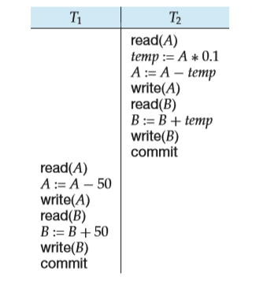
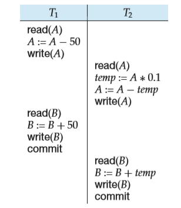
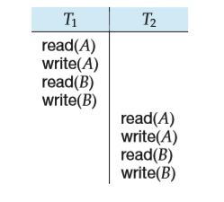
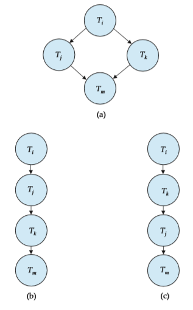

Transcations## Transcations
  

Often, a collection of several operations on the database appears to be a single unit from the point of view of the database user. For example, a transfer of funds from a checking account to a savings account is a single operation from the customer’s standpoint; within the database system, however, it consists of several operations. Clearly, it is essential that all these operations occur, or that, in case of a failure, none occur. It would be unacceptable if the checking account were debited but the savings account not credited.

Collections of operations that form a single logical unit of work are called **transactions**. A database system must ensure proper execution of transactions despite failures—either the entire transaction executes, or none of it does. Fur- thermore, it must manage concurrent execution of transactions in a way that avoids the introduction of inconsistency. In our funds-transfer example, a trans- action computing the customer’s total balance might see the checking-account balance before it is debited by the funds-transfer transaction, but see the savings balance after it is credited. As a result, it would obtain an incorrect result.

This chapter introduces the basic concepts of transaction processing. Details on concurrent transaction processing and recovery from failures are in Chapters 15 and 16, respectively. Further topics in transaction processing are discussed in Chapter 26.

###  Transaction Concept

A **transaction** is a **unit** of program execution that accesses and possibly updates various data items. Usually, a transaction is initiated by a user program written in a high-level data-manipulation language (typically SQL), or programming lan- guage (for example, C++, or Java), with embedded database accesses in JDBC or ODBC. A transaction is delimited by statements (or function calls) of the form **begin transaction** and **end transaction**. The transaction consists of all operations executed between the **begin transaction** and **end transaction**.

This collection of steps must appear to the user as a single, indivisible unit. Since a transaction is indivisible, it either executes in its entirety or not at all. Thus, if a transaction begins to execute but fails for whatever reason, any changes to the

database that the transaction may have made must be undone. This requirement holds regardless of whether the transaction itself failed (for example, if it divided by zero), the operating system crashed, or the computer itself stopped operating. As we shall see, ensuring that this requirement is met is difficult since some changes to the database may still be stored only in the main-memory variables of the transaction, while others may have been written to the database and stored on disk. This “all-or-none” property is referred to as **atomicity**.

Furthermore, since a transaction is a single unit, its actions cannot appear to be separated by other database operations not part of the transaction. While we wish to present this user-level impression of transactions, we know that reality is quite different. Even a single SQL statement involves many separate accesses to the database, and a transaction may consist of several SQL statements. Therefore, the database system must take special actions to ensure that transactions operate properly without interference from concurrently executing database statements. This property is referred to as **isolation**.

Even if the system ensures correct execution of a transaction, this serves little purpose if the system subsequently crashes and, as a result, the system “forgets” about the transaction. Thus, a transaction’s actions must persist across crashes. This property is referred to as **durability**.

Because of the above three properties, transactions are an ideal way of struc- turing interaction with a database. This leads us to impose a requirement on transactions themselves. A transaction must preserve database consistency—if a transaction is run atomically in isolation starting from a consistent database, the database must again be consistent at the end of the transaction. This consistency requirement goes beyond the data integrity constraints we have seen earlier (such as primary-key constraints, referential integrity, **check** constraints, and the like). Rather, transactions are expected to go beyond that to ensure preservation of those application-dependent consistency constraints that are too complex to state using the SQL constructs for data integrity. How this is done is the responsibility of the programmer who codes a transaction. This property is referred to as **consistency**.

To restate the above more concisely, we require that the database system maintain the following properties of the transactions:

• **Atomicity**. Either all operations of the transaction are reflected properly in the database, or none are.

• **Consistency**. Execution of a transaction in isolation (that is, with no other transaction executing concurrently) preserves the consistency of the data- base.

• **Isolation**. Even though multiple transactions may execute concurrently, the system guarantees that, for every pair of transactions _Ti_ and _Tj_ , it appears to _Ti_ that either _Tj_ finished execution before _Ti_ started or _Tj_ started execution after _Ti_ finished. Thus, each transaction is unaware of other transactions executing concurrently in the system.

• **Durability**. After a transaction completes successfully, the changes it has made to the database persist, even if there are system failures.  

These properties are often called the **ACID properties**; the acronym is derived from the first letter of each of the four properties.

As we shall see later, ensuring the isolation property may have a significant adverse effect on system performance. For this reason, some applications com- promise on the isolation property. We shall study these compromises after first studying the strict enforcement of the ACID properties.

###  A Simple Transaction Model

Because SQL is a powerful and complex language, we begin our study of transac- tions with a simple database language that focuses on when data are moved from disk to main memory and from main memory to disk. In doing this, we ignore SQL **insert** and **delete** operations, and defer considering them until Section 15.8. The only actual operations on the data are restricted in our simple language to arithmetic operations. Later we shall discuss transactions in a realistic, SQL-based context with a richer set of operations. The data items in our simplified model con- tain a single data value (a number in our examples). Each data item is identified by a name (typically a single letter in our examples, that is, _A_, _B_, _C_ , etc.).

We shall illustrate the transaction concept using a simple bank application consisting of several accounts and a set of transactions that access and update those accounts. Transactions access data using two operations:

• read(_X_), which transfers the data item _X_ from the database to a variable, also called _X_, in a buffer in main memory belonging to the transaction that executed the read operation.

• write(_X_), which transfers the value in the variable _X_ in the main-memory buffer of the transaction that executed the write to the data item _X_ in the database.

It is important to know if a change to a data item appears only in main memory or if it has been written to the database on disk. In a real database system, the write operation does not necessarily result in the immediate update of the data on the disk; the write operation may be temporarily stored elsewhere and executed on the disk later. For now, however, we shall assume that the write operation updates the database immediately. We shall return to this subject in Chapter 16.

Let _Ti_ be a transaction that transfers $50 from account _A_ to account _B_. This transaction can be defined as:

   Ti : read(_A_);
        A_ := _A_ − 50;
        write(_A_); 
        read(_B_);
        B_ := _B_ \+ 50;
        write(_B_). 

Let us now consider each of the ACID properties. (For ease of presentation, we consider them in an order different from the order A-C-I-D.)

• **Consistency**: The consistency requirement here is that the sum of _A_ and _B_ be unchanged by the execution of the transaction. Without the consistency requirement, money could be created or destroyed by the transaction! It can be verified easily that, if the database is consistent before an execution of the transaction, the database remains consistent after the execution of the transaction.

Ensuring consistency for an individual transaction is the responsibility of the application programmer who codes the transaction. This task may be facilitated by automatic testing of integrity constraints, as we discussed in Section 4.4.

• **Atomicity**: Suppose that, just before the execution of transaction _Ti_ , the val- ues of accounts _A_ and _B_ are $1000 and $2000, respectively. Now suppose that, during the execution of transaction _Ti_ , a failure occurs that prevents _Ti_ from completing its execution successfully. Further, suppose that the failure happened after the write(_A_) operation but before the write(_B_) operation. In this case, the values of accounts _A_ and _B_ reflected in the database are $950 and $2000. The system destroyed $50 as a result of this failure. In particular, we note that the sum _A_ \+ _B_ is no longer preserved.

Thus, because of the failure, the state of the system no longer reflects a real state of the world that the database is supposed to capture. We term such a state an **inconsistent state**. We must ensure that such inconsistencies are not visible in a database system. Note, however, that the system must at some point be in an inconsistent state. Even if transaction _Ti_ is executed to completion, there exists a point at which the value of account _A_ is $950 and the value of account _B_ is $2000, which is clearly an inconsistent state. This state, however, is eventually replaced by the consistent state where the value of account _A_ is $950, and the value of account _B_ is $2050. Thus, if the transaction never started or was guaranteed to complete, such an inconsistent state would not be visible except during the execution of the transaction. That is the reason for the atomicity requirement: If the atomicity property is present, all actions of the transaction are reflected in the database, or none are.

The basic idea behind ensuring atomicity is this: The database system keeps track (on disk) of the old values of any data on which a transaction performs a write. This information is written to a file called the _log_. If the transaction does not complete its execution, the database system restores the old values from the log to make it appear as though the transaction never executed. We discuss these ideas further in Section 14.4. Ensuring atomicity is the responsibility of the database system; specifically, it is handled by a component of the database called the **recovery system**, which we describe in detail in Chapter 16.

• **Durability:** Once the execution of the transaction completes successfully, and the user who initiated the transaction has been notified that the transfer of  

funds has taken place, it must be the case that no system failure can result in a loss of data corresponding to this transfer of funds. The durability property guarantees that, once a transaction completes successfully, all the updates that it carried out on the database persist, even if there is a system failure after the transaction completes execution.

We assume for now that a failure of the computer system may result in loss of data in main memory, but data written to disk are never lost. Protection against loss of data on disk is discussed in Chapter 16. We can guarantee durability by ensuring that either:

**1\.** The updates carried out by the transaction have been written to disk before the transaction completes.

**2\.** Information about the updates carried out by the transaction and writ- ten to disk is sufficient to enable the database to reconstruct the updates when the database system is restarted after the failure.

The **recovery system** of the database, described in Chapter 16, is responsible for ensuring durability, in addition to ensuring atomicity.

• **Isolation:** Even if the consistency and atomicity properties are ensured for each transaction, if several transactions are executed concurrently, their op- erations may interleave in some undesirable way, resulting in an inconsistent state.

For example, as we saw earlier, the database is temporarily inconsistent while the transaction to transfer funds from _A_ to _B_ is executing, with the deducted total written to _A_ and the increased total yet to be written to _B_. If a second concurrently running transaction reads _A_ and _B_ at this intermediate point and computes _A_\+ _B_, it will observe an inconsistent value. Furthermore, if this second transaction then performs updates on _A_ and _B_ based on the inconsistent values that it read, the database may be left in an inconsistent state even after both transactions have completed.

A way to avoid the problem of concurrently executing transactions is to execute transactions serially—that is, one after the other. However, concur- rent execution of transactions provides significant performance benefits, as we shall see in Section 14.5. Other solutions have therefore been developed; they allow multiple transactions to execute concurrently.

We discuss the problems caused by concurrently executing transactions in Section 14.5. The isolation property of a transaction ensures that the con- current execution of transactions results in a system state that is equivalent to a state that could have been obtained had these transactions executed one at a time in some order. We shall discuss the principles of isolation further in Section 14.6. Ensuring the isolation property is the responsibility of a com- ponent of the database system called the **concurrency-control system**, which we discuss later, in Chapter 15.  

###  Storage Structure

To understand how to ensure the atomicity and durability properties of a trans- action, we must gain a better understanding of how the various data items in the database may be stored and accessed.

In Chapter 10 we saw that storage media can be distinguished by their relative speed, capacity, and resilience to failure, and classified as volatile storage or nonvolatile storage. We review these terms, and introduce another class of storage, called **stable storage**.

• **Volatile storage**. Information residing in volatile storage does not usually survive system crashes. Examples of such storage are main memory and cache memory. Access to volatile storage is extremely fast, both because of the speed of the memory access itself, and because it is possible to access any data item in volatile storage directly.

• **Nonvolatile storage**. Information residing in nonvolatile storage survives system crashes. Examples of nonvolatile storage include secondary storage devices such as magnetic disk and flash storage, used for online storage, and tertiary storage devices such as optical media, and magnetic tapes, used for archival storage. At the current state of technology, nonvolatile storage is slower than volatile storage, particularly for random access. Both secondary and tertiary storage devices, however, are susceptible to failure which may result in loss of information.

• **Stable storage**. Information residing in stable storage is _never_ lost (_never_ should be taken with a grain of salt, since theoretically _never_ cannot be guaranteed—for example, it is possible, although extremely unlikely, that a black hole may envelop the earth and permanently destroy all data!). Al- though stable storage is theoretically impossible to obtain, it can be closely approximated by techniques that make data loss extremely unlikely. To im- plement stable storage, we replicate the information in several nonvolatile storage media (usually disk) with independent failure modes. Updates must be done with care to ensure that a failure during an update to stable storage does not cause a loss of information. Section 16.2.1 discusses stable-storage implementation.

The distinctions among the various storage types can be less clear in practice than in our presentation. For example, certain systems, for example some RAID controllers, provide battery backup, so that some main memory can survive system crashes and power failures.

For a transaction to be durable, its changes need to be written to stable storage. Similarly, for a transaction to be atomic, log records need to be written to stable storage before any changes are made to the database on disk. Clearly, the degree to which a system ensures durability and atomicity depends on how stable its implementation of stable storage really is. In some cases, a single copy on disk is considered sufficient, but applications whose data are highly valuable and whose  

transactions are highly important require multiple copies, or, in other words, a closer approximation of the idealized concept of stable storage.

### Transaction Atomicity and Durability

As we noted earlier, a transaction may not always complete its execution suc- cessfully. Such a transaction is termed **aborted**. If we are to ensure the atomicity property, an aborted transaction must have no effect on the state of the database. Thus, any changes that the aborted transaction made to the database must be undone. Once the changes caused by an aborted transaction have been undone, we say that the transaction has been **rolled back**. It is part of the responsibility of the recovery scheme to manage transaction aborts. This is done typically by main- taining a **log**. Each database modification made by a transaction is first recorded in the log. We record the identifier of the transaction performing the modification, the identifier of the data item being modified, and both the old value (prior to modification) and the new value (after modification) of the data item. Only then is the database itself modified. Maintaining a log provides the possibility of redo- ing a modification to ensure atomicity and durability as well as the possibility of undoing a modification to ensure atomicity in case of a failure during transaction execution. Details of log-based recovery are discussed in Chapter 16.

A transaction that completes its execution successfully is said to be **commit- ted**. A committed transaction that has performed updates transforms the database into a new consistent state, which must persist even if there is a system failure.

Once a transaction has committed, we cannot undo its effects by aborting it. The only way to undo the effects of a committed transaction is to execute a **compensating transaction**. For instance, if a transaction added $20 to an account, the compensating transaction would subtract $20 from the account. However, it is not always possible to create such a compensating transaction. Therefore, the responsibility of writing and executing a compensating transaction is left to the user, and is not handled by the database system. Chapter 26 includes a discussion of compensating transactions.

We need to be more precise about what we mean by _successful completion_ of a transaction. We therefore establish a simple abstract transaction model. A transaction must be in one of the following states:

• **Active**, the initial state; the transaction stays in this state while it is executing.

• **Partially committed**, after the final statement has been executed.

• **Failed**, after the discovery that normal execution can no longer proceed.

• **Aborted**, after the transaction has been rolled back and the database has been restored to its state prior to the start of the transaction.

• **Committed**, after successful completion.

The state diagram corresponding to a transaction appears in Figure 14.1. We say that a transaction has committed only if it has entered the committed state.  

**Figure 14.1** State diagram of a transaction.

Similarly, we say that a transaction has aborted only if it has entered the aborted state. A transaction is said to have **terminated** if it has either committed or aborted.

A transaction starts in the active state. When it finishes its final statement, it enters the partially committed state. At this point, the transaction has completed its execution, but it is still possible that it may have to be aborted, since the actual output may still be temporarily residing in main memory, and thus a hardware failure may preclude its successful completion.

The database system then writes out enough information to disk that, even in the event of a failure, the updates performed by the transaction can be re-created when the system restarts after the failure. When the last of this information is written out, the transaction enters the committed state.

As mentioned earlier, we assume for now that failures do not result in loss of data on disk. Chapter 16 discusses techniques to deal with loss of data on disk.

A transaction enters the failed state after the system determines that the transaction can no longer proceed with its normal execution (for example, because of hardware or logical errors). Such a transaction must be rolled back. Then, it enters the aborted state. At this point, the system has two options:

• It can **restart** the transaction, but only if the transaction was aborted as a result of some hardware or software error that was not created through the internal logic of the transaction. A restarted transaction is considered to be a new transaction.

• It can **kill** the transaction. It usually does so because of some internal logical error that can be corrected only by rewriting the application program, or because the input was bad, or because the desired data were not found in the database.

We must be cautious when dealing with **observable external writes**, such as writes to a user’s screen, or sending email. Once such a write has occurred, it cannot be erased, since it may have been seen external to the database system.  

Most systems allow such writes to take place only after the transaction has entered the committed state. One way to implement such a scheme is for the database system to store any value associated with such external writes temporarily in a special relation in the database, and to perform the actual writes only after the transaction enters the committed state. If the system should fail after the transaction has entered the committed state, but before it could complete the external writes, the database system will carry out the external writes (using the data in nonvolatile storage) when the system is restarted.

Handling external writes can be more complicated in some situations. For example, suppose the external action is that of dispensing cash at an automated teller machine, and the system fails just before the cash is actually dispensed (we assume that cash can be dispensed atomically). It makes no sense to dispense cash when the system is restarted, since the user may have left the machine. In such a case a compensating transaction, such as depositing the cash back in the user’s account, needs to be executed when the system is restarted.

As another example, consider a user making a booking over the Web. It is possible that the database system or the application server crashes just after the booking transaction commits. It is also possible that the network connection to the user is lost just after the booking transaction commits. In either case, even though the transaction has committed, the external write has not taken place. To handle such situations, the application must be designed such that when the user connects to the Web application again, she will be able to see whether her transaction had succeeded or not.

For certain applications, it may be desirable to allow active transactions to display data to users, particularly for long-duration transactions that run for minutes or hours. Unfortunately, we cannot allow such output of observable data unless we are willing to compromise transaction atomicity. In Chapter 26, we discuss alternative transaction models that support long-duration, interactive transactions.

### Transaction Isolation

Transaction-processing systems usually allow multiple transactions to run con- currently. Allowing multiple transactions to update data concurrently causes several complications with consistency of the data, as we saw earlier. Ensuring consistency in spite of concurrent execution of transactions requires extra work; it is far easier to insist that transactions run **serially**—that is, one at a time, each starting only after the previous one has completed. However, there are two good reasons for allowing concurrency:

• **Improved throughput and resource utilization**. A transaction consists of many steps. Some involve I/O activity; others involve CPU activity. The CPU and the disks in a computer system can operate in parallel. Therefore, I/O activity can be done in parallel with processing at the CPU. The parallelism of the CPU and the I/O system can therefore be exploited to run multiple transactions in parallel. While a read or write on behalf of one transaction is in progress on one disk, another transaction can be running in the CPU, while another disk may be executing a read or write on behalf of a third transaction. All of this increases the **throughput** of the system—that is, the number of transactions executed in a given amount of time. Correspondingly, the processor and disk **utilization** also increase; in other words, the processor and disk spend less time idle, or not performing any useful work.

• **Reduced waiting time**. There may be a mix of transactions running on a system, some short and some long. If transactions run serially, a short trans- action may have to wait for a preceding long transaction to complete, which can lead to unpredictable delays in running a transaction. If the transactions are operating on different parts of the database, it is better to let them run concurrently, sharing the CPU cycles and disk accesses among them. Con- current execution reduces the unpredictable delays in running transactions. Moreover, it also reduces the **average response time**: the average time for a transaction to be completed after it has been submitted.

The motivation for using concurrent execution in a database is essentially the same as the motivation for using **multiprogramming** in an operating system.

When several transactions run concurrently, the isolation property may be vi- olated, resulting in database consistency being destroyed despite the correctness of each individual transaction. In this section, we present the concept of sched- ules to help identify those executions that are guaranteed to ensure the isolation property and thus database consistency.

The database system must control the interaction among the concurrent trans- actions to prevent them from destroying the consistency of the database. It does so through a variety of mechanisms called **concurrency-control schemes**. We study concurrency-control schemes in Chapter 15; for now, we focus on the concept of correct concurrent execution.

Consider again the simplified banking system of Section 14.1, which has several accounts, and a set of transactions that access and update those accounts. Let _T_1 and _T_2 be two transactions that transfer funds from one account to another. Transaction _T_1 transfers $50 from account _A_ to account _B_. It is defined as:

T1: read(A);
 A := A − 50;
 write(A);
 read(B);
 B := B\+ 50; write(B).

Transaction T2 transfers 10 percent of the balance from account A to account B. It is defined as:  

**TRENDS IN CONCURRENCY**

Several current trends in the field of computing are giving rise to an increase in the amount of concurrency possible. As database systems exploit this con- currency to increase overall system performance, there will necessarily be an increasing number of transactions run concurrently.

Early computers had only one processor. Therefore, there was never any real concurrency in the computer. The only concurrency was apparent concurrency created by the operating system as it shared the processor among several distinct tasks or processes. Modern computers are likely to have many processors. These may be truly distinct processors all part of the one computer. However even a single processor may be able to run more than one process at a time by having multiple _cores_. The Intel Core Duo processor is a well-known example of such a multicore processor.

For database systems to take advantage of multiple processors and multiple cores, two approaches are being taken. One is to find parallelism within a single transaction or query. Another is to support a very large number of concurrent transactions.

Many service providers now use large collections of computers rather than large mainframe computers to provide their services. They are making this choice based on the lower cost of this approach. A result of this is yet a further increase in the degree of concurrency that can be supported.

The bibliographic notes refer to texts that describe these advances in com- puter architecture and parallel computing. Chapter 18 describes algorithms for building parallel database systems, which exploit multiple processors and mul- tiple cores.

T2: read(A);
    temp := A \* 0.1;
     A := A − temp;
     write(A);
     read(B);
     B := B \+ temp;
     write(B).

Suppose the current values of accounts _A_ and _B_ are $1000 and $2000, respec- tively. Suppose also that the two transactions are executed one at a time in the order _T_1 followed by _T_2\. This execution sequence appears in Figure 14.2. In the figure, the sequence of instruction steps is in chronological order from top to bottom, with instructions of _T_1 appearing in the left column and instructions of _T_2 appearing in the right column. The final values of accounts _A_ and _B_, after the execution in Figure 14.2 takes place, are $855 and $2145, respectively. Thus, the total amount of money in accounts _A_ and _B_—that is, the sum _A_ \+ _B_—is preserved after the execution of both transactions.  

|T1       | T2           |
|---------|--------------|
|read(A)  |              |
|A:=A−50  |              |
|write(A) |              |
|read(B)  |              |
|B:=B\+ 50|              |
|write(B) |              |
| commit  |              |
|         |read(A)       |
|         |temp :=A ∗ 0.1|
|         | A:= A−temp   | 
|         |write(A)      | 
|         |read(B)       |
|         |B:= B + temp  |
|         |write(B)      |
|         |commit        |

**Figure 14.2** Schedule 1—a serial schedule in which _T_1 is followed by _T_2.

Similarly, if the transactions are executed one at a time in the order _T_2 followed by _T_1, then the corresponding execution sequence is that of Figure 14.3. Again, as expected, the sum _A_ \+ _B_ is preserved, and the final values of accounts _A_ and _B_ are $850 and $2150, respectively.

**Figure 14.3** Schedule 2—a serial schedule in which _T_2 is followed by _T_1.  

The execution sequences just described are called **schedules**. They represent the chronological order in which instructions are executed in the system. Clearly, a schedule for a set of transactions must consist of all instructions of those trans- actions, and must preserve the order in which the instructions appear in each individual transaction. For example, in transaction T1, the instruction write(_A_) must appear before the instruction read(_B_), in any valid schedule. Note that we include in our schedules the **commit** operation to indicate that the transaction has entered the committed state. In the following discussion, we shall refer to the first execution sequence (T1 followed by T2) as schedule 1, and to the second execution sequence (T2 followed by T1) as schedule 2.

These schedules are **serial**: Each serial schedule consists of a sequence of instructions from various transactions, where the instructions belonging to one single transaction appear together in that schedule. Recalling a well-known for- mula from combinatorics, we note that, for a set of _n_ transactions, there exist _n_ factorial (_n_!) different valid serial schedules.

When the database system executes several transactions concurrently, the corresponding schedule no longer needs to be serial. If two transactions are running concurrently, the operating system may execute one transaction for a little while, then perform a context switch, execute the second transaction for some time, and then switch back to the first transaction for some time, and so on. With multiple transactions, the CPU time is shared among all the transactions.

Several execution sequences are possible, since the various instructions from both transactions may now be interleaved. In general, it is not possible to predict exactly how many instructions of a transaction will be executed before the CPU switches to another transaction.1

Returning to our previous example, suppose that the two transactions are executed concurrently. One possible schedule appears in Figure 14.4. After this execution takes place, we arrive at the same state as the one in which the transac- tions are executed serially in the order T1 followed by T2\. The sum _A_ \+ _B_ is indeed preserved.

Not all concurrent executions result in a correct state. To illustrate, consider the schedule of Figure 14.5. After the execution of this schedule, we arrive at a state where the final values of accounts _A_ and _B_ are $950 and $2100, respectively. This final state is an _inconsistent state_, since we have gained $50 in the process of the concurrent execution. Indeed, the sum _A_ \+ _B_ is not preserved by the execution of the two transactions.

If control of concurrent execution is left entirely to the operating system, many possible schedules, including ones that leave the database in an inconsistent state, such as the one just described, are possible. It is the job of the database system to ensure that any schedule that is executed will leave the database in a consistent state. The **concurrency-control** component of the database system carries out this task.

1The number of possible schedules for a set of _n_ transactions is very large. There are _n_! different serial schedules. Considering all the possible ways that steps of transactions might be interleaved, the total number of possible schedules is much larger than _n_!.  

**Figure 14.4** Schedule 3—a concurrent schedule equivalent to schedule 1.

We can ensure consistency of the database under concurrent execution by making sure that any schedule that is executed has the same effect as a schedule that could have occurred without any concurrent execution. That is, the schedule should, in some sense, be equivalent to a serial schedule. Such schedules are called **serializable** schedules.

**Figure 14.5** Schedule 4—a concurrent schedule resulting in an inconsistent state.  

###  Serializability

Before we can consider how the concurrency-control component of the database system can ensure serializability, we consider how to determine when a schedule is serializable. Certainly, serial schedules are serializable, but if steps of multiple transactions are interleaved, it is harder to determine whether a schedule is seri- alizable. Since transactions are programs, it is difficult to determine exactly what operations a transaction performs and how operations of various transactions in- teract. For this reason, we shall not consider the various types of operations that a transaction can perform on a data item, but instead consider only two operations: read and write. We assume that, between a read(_Q_) instruction and a write(_Q_) instruction on a data item _Q_, a transaction may perform an arbitrary sequence of operations on the copy of _Q_ that is residing in the local buffer of the transaction. In this model, the only significant operations of a transaction, from a scheduling point of view, are its read and write instructions. Commit operations, though relevant, are not considered until Section 14.7. We therefore may show only read and write instructions in schedules, as we do for schedule 3 in Figure 14.6.

In this section, we discuss different forms of schedule equivalence, but focus on a particular form called **conflict serializability**.

Let us consider a schedule _S_ in which there are two consecutive instructions, _I_ and _J_ , of transactions _Ti_ and _Tj_ , respectively (_i_ = _j_). If _I_ and _J_ refer to different data items, then we can swap _I_ and _J_ without affecting the results of any instruc- tion in the schedule. However, if _I_ and _J_ refer to the same data item _Q_, then the order of the two steps may matter. Since we are dealing with only read and write instructions, there are four cases that we need to consider:

**1\.** _I_ \= read(_Q_), _J_ \= read(_Q_). The order of _I_ and _J_ does not matter, since the same value of _Q_ is read by _Ti_ and _Tj_ , regardless of the order.

**2\.** _I_ \= read(_Q_), _J_ \= write(_Q_). If _I_ comes before _J_ , then _Ti_ does not read the value of _Q_ that is written by _Tj_ in instruction _J_ . If _J_ comes before _I_ , then _Ti_ reads the value of _Q_ that is written by _Tj_ . Thus, the order of _I_ and _J_ matters.

**Figure 14.6** Schedule 3—showing only the read and write instructions.  

**Figure 14.7** Schedule 5—schedule 3 after swapping of a pair of instructions.

**3\.** _I_ \= write(_Q_), _J_ \= read(_Q_). The order of _I_ and _J_ matters for reasons similar to those of the previous case.

**4\.** _I_ \= write(_Q_), _J_ \= write(_Q_). Since both instructions are write operations, the order of these instructions does not affect either _Ti_ or _Tj_ . However, the value obtained by the next read(_Q_) instruction of _S_ is affected, since the result of only the latter of the two write instructions is preserved in the database. If there is no other write(_Q_) instruction after _I_ and _J_ in _S_, then the order of _I_ and _J_ directly affects the final value of _Q_ in the database state that results from schedule _S_.

Thus, only in the case where both _I_ and _J_ are read instructions does the relative order of their execution not matter.

We say that _I_ and _J_ **conflict** if they are operations by different transactions on the same data item, and at least one of these instructions is a write operation.

To illustrate the concept of conflicting instructions, we consider schedule 3in Figure 14.6. The write(_A_) instruction of T1 conflicts with the read(_A_) instruction of T2\. However, the write(_A_) instruction of T2 does not conflict with the read(_B_) instruction of T1, because the two instructions access different data items.

**Figure 14.8** Schedule 6—a serial schedule that is equivalent to schedule 3.  

**Figure 14.9** Schedule 7.

Let _I_ and _J_ be consecutive instructions of a schedule _S_. If _I_ and _J_ are in- structions of different transactions and _I_ and _J_ do not conflict, then we can swap the order of _I_ and _J_ to produce a new schedule _S_′. _S_ is equivalent to _S_′, since all instructions appear in the same order in both schedules except for _I_ and _J_ , whose order does not matter.

Since the write(_A_) instruction of T2 in schedule 3 of Figure 14.6 does not conflict with the read(_B_) instruction of T1, we can swap these instructions to generate an equivalent schedule, schedule 5, in Figure 14.7. Regardless of the initial system state, schedules 3 and 5 both produce the same final system state.

We continue to swap nonconflicting instructions:

• Swap the read(_B_) instruction of T1 with the read(_A_) instruction of T2.

• Swap the write(_B_) instruction of T1 with the write(_A_) instruction of T2.

• Swap the write(_B_) instruction of T1 with the read(_A_) instruction of T2.

The final result of these swaps, schedule 6 of Figure 14.8, is a serial schedule. Note that schedule 6 is exactly the same as schedule 1, but it shows only the read and write instructions. Thus, we have shown that schedule 3 is equivalent to a serial schedule. This equivalence implies that, regardless of the initial system state, schedule 3 will produce the same final state as will some serial schedule.

If a schedule _S_ can be transformed into a schedule _S_′ by a series of swaps of nonconflicting instructions, we say that _S_ and _S_′ are **conflict equivalent**.2

Not all serial schedules are conflict equivalent to each other. For example, schedules 1 and 2 are not conflict equivalent.

The concept of conflict equivalence leads to the concept of conflict serializ- ability. We say that a schedule _S_ is **conflict serializable** if it is conflict equivalent to a serial schedule. Thus, schedule 3 is conflict serializable, since it is conflict equivalent to the serial schedule 1.

Finally, consider schedule 7 of Figure 14.9; it consists of only the significant operations (that is, the read and write) of transactions T3 and T4\. This schedule is not conflict serializable, since it is not equivalent to either the serial schedule _<T_3,T4_\>_ or the serial schedule _<T_4,T3_\>_.

2We use the term _conflict equivalent_ to distinguish the way we have just defined equivalence from other definitions that we shall discuss later on in this section.  

**Figure 14.10** Precedence graph for (a) schedule 1 and (b) schedule 2.

We now present a simple and efficient method for determining conflict seri- alizability of a schedule. Consider a schedule _S_. We construct a directed graph, called a **precedence graph**, from _S_. This graph consists of a pair _G_ \= (_V, E_), where _V_ is a set of vertices and _E_ is a set of edges. The set of vertices consists of all the transactions participating in the schedule. The set of edges consists of all edges _Ti_ → _Tj_ for which one of three conditions holds:

**1\.** _Ti_ executes write(_Q_) before _Tj_ executes read(_Q_).

**2\.** _Ti_ executes read(_Q_) before _Tj_ executes write(_Q_).

**3\.** _Ti_ executes write(_Q_) before _Tj_ executes write(_Q_).

If an edge _Ti_ → _Tj_ exists in the precedence graph, then, in any serial schedule _S_′ equivalent to _S_, _Ti_ must appear before _Tj_ .

For example, the precedence graph for schedule 1 in Figure 14.10a contains the single edge T1 → T2, since all the instructions of T1 are executed before the first instruction of T2 is executed. Similarly, Figure 14.10b shows the precedence graph for schedule 2 with the single edge T2 → T1, since all the instructions of T2 are executed before the first instruction of T1 is executed.

The precedence graph for schedule 4 appears in Figure 14.11. It contains the edge T1 → T2, because T1 executes read(_A_) before T2 executes write(_A_). It also contains the edge T2 → T1, because T2 executes read(_B_) before T1 executes write(_B_).

If the precedence graph for _S_ has a cycle, then schedule _S_ is not conflict serial- izable. If the graph contains no cycles, then the schedule _S_ is conflict serializable.

A **serializability order** of the transactions can be obtained by finding a linear order consistent with the partial order of the precedence graph. This process is called **topological sorting**. There are, in general, several possible linear orders that

**Figure 14.11** Precedence graph for schedule   

**Figure 14.12** Illustration of topological sorting.

can be obtained through a topological sort. For example, the graph of Figure 14.12a has the two acceptable linear orderings shown in Figures 14.12b and 14.12c.

Thus, to test for conflict serializability, we need to construct the precedence graph and to invoke a cycle-detection algorithm. Cycle-detection algorithms can be found in standard textbooks on algorithms. Cycle-detection algorithms, such as those based on depth-first search, require on the order of _n_2 operations, where _n_ is the number of vertices in the graph (that is, the number of transactions).

Returning to our previous examples, note that the precedence graphs for schedules 1 and 2 (Figure 14.10) indeed do not contain cycles. The precedence graph for schedule 4 (Figure 14.11), on the other hand, contains a cycle, indicating that this schedule is not conflict serializable.

It is possible to have two schedules that produce the same outcome, but that are not conflict equivalent. For example, consider transaction T5, which transfers $10 from account _B_ to account _A_. Let schedule 8 be as defined in Figure 14.13. We claim that schedule 8 is not conflict equivalent to the serial schedule _<T_1,T5_\>_, since, in schedule 8, the write(_B_) instruction of T5 conflicts with the read(_B_) in- struction of T1\. This creates an edge T5 → T1 in the precedence graph. Similarly, we see that the write(_A_) instruction of T1 conflicts with the read instruction of T5  

**Figure 14.13** Schedule 8.

creating an edge T1 → T5\. This shows that the precedence graph has a cycle and that schedule 8 is not serializable. However, the final values of accounts _A_ and _B_ after the execution of either schedule 8 or the serial schedule _<T_1,T5_\>_ are the same—$960 and $2040, respectively.

We can see from this example that there are less-stringent definitions of sched- ule equivalence than conflict equivalence. For the system to determine that sched- ule 8 produces the same outcome as the serial schedule _<T_1,T5_\>_, it must analyze the computation performed by T1 and T5, rather than just the read and write op- erations. In general, such analysis is hard to implement and is computationally expensive. In our example, the final result is the same as that of a serial schedule because of the mathematical fact that addition and subtraction are commutative. While this may be easy to see in our simple example, the general case is not so easy since a transaction may be expressed as a complex SQL statement, a Java program with JDBC calls, etc.

However, there are other definitions of schedule equivalence based purely on the read and write operations. One such definition is _view equivalence_, a definition that leads to the concept of _view serializability_. View serializability is not used in practice due to its high degree of computational complexity.3 We therefore defer discussion of view serializability to Chapter 15, but, for completeness, note here that the example of schedule 8 is not view serializable.

###  Transaction Isolation and Atomicity

So far, we have studied schedules while assuming implicitly that there are no transaction failures. We now address the effect of transaction failures during concurrent execution.

3Testing for view serializability has been proven to be NP-complete, which means that it is virtually certain that no efficient test for view serializability exists.  

**Figure 14.14** Schedule 9, a nonrecoverable schedule.

If a transaction _Ti_ fails, for whatever reason, we need to undo the effect of this transaction to ensure the atomicity property of the transaction. In a system that allows concurrent execution, the atomicity property requires that any trans- action _Tj_ that is dependent on _Ti_ (that is, _Tj_ has read data written by _Ti_ ) is also aborted. To achieve this, we need to place restrictions on the type of schedules permitted in the system.

In the following two subsections, we address the issue of what schedules are acceptable from the viewpoint of recovery from transaction failure. We describe in Chapter 15 how to ensure that only such acceptable schedules are generated.

###  Recoverable Schedules

Consider the partial schedule 9 in Figure 14.14, in which T7 is a transaction that performs only one instruction: read(_A_). We call this a **partial schedule** because we have not included a **commit** or **abort** operation for T6\. Notice that T7 commits immediately after executing the read(_A_) instruction. Thus, T7 commits while T6 is still in the active state. Now suppose that T6 fails before it commits. T7 has read the value of data item _A_ written by T6\. Therefore, we say that T7 is **dependent** on T6\. Because of this, we must abort T7 to ensure atomicity. However, T7 has already committed and cannot be aborted. Thus, we have a situation where it is impossible to recover correctly from the failure of T6.

Schedule 9 is an example of a _nonrecoverable_ schedule. A **recoverable schedule** is one where, for each pair of transactions _Ti_ and _Tj_ such that _Tj_ reads a data item previously written by _Ti_ , the commit operation of _Ti_ appears before the commit operation of _Tj_ . For the example of schedule 9 to be recoverable, T7 would have to delay committing until after T6 commits.

###  Cascadeless Schedules

Even if a schedule is recoverable, to recover correctly from the failure of a trans- action _Ti_ , we may have to roll back several transactions. Such situations occur if transactions have read data written by _Ti_ . As an illustration, consider the partial schedule of Figure 14.15. Transaction T8 writes a value of _A_ that is read by transac- tion T9\. Transaction T9 writes a value of _A_ that is read by transaction T10\. Suppose that, at this point, T8 fails. T8 must be rolled back. Since T9 is dependent on T8, T9 must be rolled back. Since T10 is dependent on T9, T10 must be rolled back. This  

**Figure 14.15** Schedule 10.

phenomenon, in which a single transaction failure leads to a series of transaction rollbacks, is called **cascading rollback**.

Cascading rollback is undesirable, since it leads to the undoing of a significant amount of work. It is desirable to restrict the schedules to those where cascading rollbacks cannot occur. Such schedules are called _cascadeless_ schedules. Formally, a **cascadeless schedule** is one where, for each pair of transactions _Ti_ and _Tj_ such that _Tj_ reads a data item previously written by _Ti_ , the commit operation of _Ti_ appears before the read operation of _Tj_ . It is easy to verify that every cascadeless schedule is also recoverable.

###  Transaction Isolation Levels

Serializability is a useful concept because it allows programmers to ignore issues related to concurrency when they code transactions. If every transaction has the property that it maintains database consistency if executed alone, then serial- izability ensures that concurrent executions maintain consistency. However, the protocols required to ensure serializability may allow too little concurrency for certain applications. In these cases, weaker levels of consistency are used. The use of weaker levels of consistency places additional burdens on programmers for ensuring database correctness.

The SQL standard also allows a transaction to specify that it may be executed in such a way that it becomes nonserializable with respect to other transactions. For instance, a transaction may operate at the isolation level of **read uncommitted**, which permits the transaction to read a data item even if it was written by a transaction that has not been committed. SQL provides such features for the benefit of long transactions whose results do not need to be precise. If these transactions were to execute in a serializable fashion, they could interfere with other transactions, causing the others’ execution to be delayed.

The isolation levels specified by the SQL standard are as follows:

• **Serializable** usually ensures serializable execution. However, as we shall explain shortly, some database systems implement this isolation level in a manner that may, in certain cases, allow nonserializable executions.  

• **Repeatable read** allows only committed data to be read and further requires that, between two reads of a data item by a transaction, no other transaction is allowed to update it. However, the transaction may not be serializable with respect to other transactions. For instance, when it is searching for data satisfying some conditions, a transaction may find some of the data inserted by a committed transaction, but may not find other data inserted by the same transaction.

• **Read committed** allows only committed data to be read, but does not require repeatable reads. For instance, between two reads of a data item by the trans- action, another transaction may have updated the data item and committed.

• **Read uncommitted** allows uncommitted data to be read. It is the lowest isolation level allowed by SQL.

All the isolation levels above additionally disallow **dirty writes**, that is, they disallow writes to a data item that has already been written by another transaction that has not yet committed or aborted.

Many database systems run, by default, at the read-committed isolation level. In SQL, it is possible to set the isolation level explicitly, rather than accepting the system’s default setting. For example, the statement “**set transaction isolation level serializable;**” sets the isolation level to serializable; any of the other isola- tion levels may be specified instead. The above syntax is supported by Oracle, PostgreSQL and SQL Server; DB2 uses the syntax “**change isolation level**,” with its own abbreviations for isolation levels.

Changing of the isolation level must be done as the first statement of a transaction. Further, automatic commit of individual statements must be turned off, if it is on by default; API functions, such as the JDBC method Connec- tion.setAutoCommit(false) which we saw in Section 5.1.1.7, can be used to do so. Further, in JDBC the method Connection.setTransactionIsolation(int level) can be used to set the isolation level; see the JDBC manuals for details.

An application designer may decide to accept a weaker isolation level in order to improve system performance. As we shall see in Section 14.9 and Chapter 15, ensuring serializability may force a transaction to wait for other transactions or, in some cases, to abort because the transaction can no longer be executed as part of a serializable execution. While it may seem shortsighted to risk database consistency for performance, this trade-off makes sense if we can be sure that the inconsistency that may occur is not relevant to the application.

There are many means of implementing isolation levels. As long as the im- plementation ensures serializability, the designer of a database application or a user of an application does not need to know the details of such implementations, except perhaps for dealing with performance issues. Unfortunately, even if the isolation level is set to **serializable**, some database systems actually implement a weaker level of isolation, which does not rule out every possible nonserializable execution; we revisit this issue in Section 14.9. If weaker levels of isolation are used, either explicitly or implicitly, the application designer has to be aware of some details of the implementation, to avoid or minimize the chance of inconsis- tency due to lack of serializability.  

**SERIALIZABILITY IN THE REAL WORLD**

Serializable schedules are the ideal way to ensure consistency, but in our day- to-day lives, we don’t impose such stringent requirements. A Web site offering goods for sale may list an item as being in stock, yet by the time a user selects the item and goes through the checkout process, that item might no longer be available. Viewed from a database perspective, this would be a nonrepeatable read.

As another example, consider seat selection for air travel. Assume that a traveler has already booked an itinerary and now is selecting seats for each flight. Many airline Web sites allow the user to step through the various flights and choose a seat, after which the user is asked to confirm the selection. It could be that other travelers are selecting seats or changing their seat selections for the same flights at the same time. The seat availability that the traveler was shown is thus actually changing, but the traveler is shown a snapshot of the seat availability as of when the traveler started the seat selection process.

Even if two travelers are selecting seats at the same time, most likely they will select different seats, and if so there would be no real conflict. However, the transactions are not serializable, since each traveler has read data that was subsequently updated by the other traveler, leading to a cycle in the precedence graph. If two travelers performing seat selection concurrently actually selected the same seat, one of them would not be able to get the seat they selected; however, the situation could be easily resolved by asking the traveler to perform the selection again, with updated seat availability information.

It is possible to enforce serializability by allowing only one traveler to do seat selection for a particular flight at a time. However, doing so could cause significant delays as travelers would have to wait for their flight to become available for seat selection; in particular a traveler who takes a long time to make a choice could cause serious problems for other travelers. Instead, any such transaction is typically broken up into a part that requires user interaction, and a part that runs exclusively on the database. In the example above, the database transaction would check if the seats chosen by the user are still available, and if so update the seat selection in the database. Serializability is ensured only for the transactions that run on the database, without user interaction.

###  Implementation of Isolation Levels

So far, we have seen what properties a schedule must have if it is to leave the database in a consistent state and allow transaction failures to be handled in a safe manner.

There are various **concurrency-control** policies that we can use to ensure that, even when multiple transactions are executed concurrently, only acceptable schedules are generated, regardless of how the operating system time-shares resources (such as CPU time) among the transactions.  

As a trivial example of a concurrency-control policy, consider this: A trans- action acquires a **lock** on the entire database before it starts and releases the lock after it has committed. While a transaction holds a lock, no other transaction is allowed to acquire the lock, and all must therefore wait for the lock to be released. As a result of the locking policy, only one transaction can execute at a time. There- fore, only serial schedules are generated. These are trivially serializable, and it is easy to verify that they are recoverable and cascadeless as well.

A concurrency-control policy such as this one leads to poor performance, since it forces transactions to wait for preceding transactions to finish before they can start. In other words, it provides a poor degree of concurrency (indeed, no con- currency at all). As we saw in Section 14.5, concurrent execution has substantial performance benefits.

The goal of concurrency-control policies is to provide a high degree of con- currency, while ensuring that all schedules that can be generated are conflict or view serializable, recoverable, and cascadeless.

Here we provide an overview of how some of most important concurrency- control mechanisms work, and we defer the details to Chapter 15.

####  Locking

Instead of locking the entire database, a transaction could, instead, lock only those data items that it accesses. Under such a policy, the transaction must hold locks long enough to ensure serializability, but for a period short enough not to harm performance excessively. Complicating matters are SQL statements like those we saw in Section 14.10, where the data items accessed depend on a **where** clause. In Chapter 15, we present the two-phase locking protocol, a simple, widely used technique that ensures serializability. Stated simply, two-phase locking requires a transaction to have two phases, one where it acquires locks but does not release any, and a second phase where the transaction releases locks but does not acquire any. (In practice, locks are usually released only when the transaction completes its execution and has been either committed or aborted.)

Further improvements to locking result if we have two kinds of locks: shared and exclusive. Shared locks are used for data that the transaction reads and exclusive locks are used for those it writes. Many transactions can hold shared locks on the same data item at the same time, but a transaction is allowed an exclusive lock on a data item only if no other transaction holds any lock (regardless of whether shared or exclusive) on the data item. This use of two modes of locks along with two-phase locking allows concurrent reading of data while still ensuring serializability.

####  Timestamps

Another category of techniques for the implementation of isolation assigns each transaction a **timestamp**, typically when it begins. For each data item, the system keeps two timestamps. The read timestamp of a data item holds the largest (that is, the most recent) timestamp of those transactions that read the data item. The write timestamp of a data item holds the timestamp of the transaction that  

wrote the current value of the data item. Timestamps are used to ensure that transactions access each data item in order of the transactions’ timestamps if their accesses conflict. When this is not possible, offending transactions are aborted and restarted with a new timestamp.

####  Multiple Versions and Snapshot Isolation

By maintaining more than one version of a data item, it is possible to allow a transaction to read an old version of a data item rather than a newer version written by an uncommitted transaction or by a transaction that should come later in the serialization order. There are a variety of multiversion concurrency- control techniques. One in particular, called **snapshot isolation**, is widely used in practice.

In snapshot isolation, we can imagine that each transaction is given its own version, or snapshot, of the database when it begins.4 It reads data from this private version and is thus isolated from the updates made by other transactions. If the transaction updates the database, that update appears only in its own version, not in the actual database itself. Information about these updates is saved so that the updates can be applied to the “real” database if the transaction commits.

When a transaction T enters the partially committed state, it then proceeds to the committed state only if no other concurrent transaction has modified data that T intends to update. Transactions that, as a result, cannot commit abort instead.

Snapshot isolation ensures that attempts to read data never need to wait (unlike locking). Read-only transactions cannot be aborted; only those that modify data run a slight risk of aborting. Since each transaction reads its own version or snapshot of the database, reading data does not cause subsequent update attempts by other transactions to wait (unlike locking). Since most transactions are read-only (and most others read more data than they update), this is often a major source of performance improvement as compared to locking.

The problem with snapshot isolation is that, paradoxically, it provides _too much_ isolation. Consider two transactions T and T ′. In a serializable execution, either T sees all the updates made by T ′ or T ′ sees all the updates made by T , because one must follow the other in the serialization order. Under snapshot isolation, there are cases where neither transaction sees the updates of the other. This is a situation that cannot occur in a serializable execution. In many (indeed, most) cases, the data accesses by the two transactions do not conflict and there is no problem. However, if T reads some data item that T ′ updates and T ′ reads some data item that T updates, it is possible that both transactions fail to read the update made by the other. The result, as we shall see in Chapter 15, may be an inconsistent database state that, of course, could not be obtained in any serializable execution.

4Of course, in reality, the entire database is not copied. Multiple versions are kept only of those data items that are changed.  

Oracle, PostgreSQL, and SQL Server offer the option of snapshot isolation. Oracle and PostgreSQL implement the **serializable** isolation level using snapshot isolation. As a result, their implementation of serializability can, in exceptional circumstances, result in a nonserializable execution being allowed. SQL Server instead includes an additional isolation level beyond the standard ones, called **snapshot**, to offer the option of snapshot isolation.

###  Transactions as SQL Statements

In Section 4.3, we presented the SQL syntax for specifying the beginning and end of transactions. Now that we have seen some of the issues in ensuring the ACID properties for transactions, we are ready to consider how those properties are ensured when transactions are specified as a sequence of SQL statements rather than the restricted model of simple reads and writes that we considered up to this point.

In our simple model, we assumed a set of data items exists. While our simple model allowed data-item values to be changed, it did not allow data items to be created or deleted. In SQL, however, **insert** statements create new data and **delete** statements delete data. These two statements are, in effect, **write** opera- tions, since they change the database, but their interactions with the actions of other transactions are different from what we saw in our simple model. As an example, consider the following SQL query on our university database that finds all instructors who earn more than $90,000.

**select** _ID_, _name_ **from** _instructor_ **where** _salary >_ 90000;

Using our sample _instructor_ relation (Appendix A.3), we find that only Ein- stein and Brandt satisfy the condition. Now assume that around the same time we are running our query, another user inserts a new instructor named “James” whose salary is $100,000.

**insert into** _instructor_ **values** (’11111’, ’James’, ’Marketing’, 100000);

The result of our query will be different depending on whether this insert comes before or after our query is run. In a concurrent execution of these transactions, it is intuitively clear that they conflict, but this is a conflict not captured by our simple model. This situation is referred to as the **phantom phenomenon**, because a conflict may exist on “phantom” data.

Our simple model of transactions required that operations operate on a spe- cific data item given as an argument to the operation. In our simple model, we can look at the **read** and **write** steps to see which data items are referenced. But in an SQL statement, the specific data items (tuples) referenced may be determined by a **where** clause predicate. So the same transaction, if run more than once, might  

reference different data items each time it is run if the values in the database change between runs.

One way of dealing with the above problem is to recognize that it is not sufficient for concurrency control to consider only the tuples that are accessed by a transaction; the information used to find the tuples that are accessed by the transaction must also be considered for the purpose of concurrency control. The information used to find tuples could be updated by an insertion or deletion, or in the case of an index, even by an update to a search-key attribute. For example, if locking is used for concurrency control, the data structures that track the tuples in a relation, as well as index structures, must be appropriately locked. However, such locking can lead to poor concurrency in some situations; index-locking protocols which maximize concurrency, while ensuring serializability in spite of inserts, deletes, and predicates in queries, are discussed in Section 15.8.3.

Let us consider again the query:

**select** _ID_, _name_ **from** _instructor_ **where** _salary>_ 90000;

and the following SQL update:

**update** _instructor_ **set** _salary_ \= _salary_ \* 0.9 **where** _name_ \= ’Wu’;

We now face an interesting situation in determining whether our query conflicts with the update statement. If our query reads the entire _instructor_ relation, then it reads the tuple with Wu’s data and conflicts with the update. However, if an index were available that allowed our query direct access to those tuples with _salary >_ 90000, then our query would not have accessed Wu’s data at all because Wu’s salary is initially $90,000 in our example instructor relation, and reduces to $81,000 after the update.

However, using the above approach, it would appear that the existence of a conflict depends on a low-level query processing decision by the system that is unrelated to a user-level view of the meaning of the two SQL statements! An alternative approach to concurrency control treats an insert, delete or update as conflicting with a predicate on a relation, if it could affect the set of tuples selected by a predicate. In our example query above, the predicate is “_salary >_ 90000”, and an update of Wu’s salary from $90,000 to a value greater than $90,000, or an update of Einstein’s salary from a value greater that $90,000 to a value less than or equal to $90,000, would conflict with this predicate. Locking based on this idea is called **predicate locking**; however predicate locking is expensive, and not used in practice.  

###  Summary

• A _transaction_ is a _unit_ of program execution that accesses and possibly updates various data items. Understanding the concept of a transaction is critical for understanding and implementing updates of data in a database in such a way that concurrent executions and failures of various forms do not result in the database becoming inconsistent.

• Transactions are required to have the ACID properties: atomicity, consistency, isolation, and durability.

◦ Atomicity ensures that either all the effects of a transaction are reflected in the database, or none are; a failure cannot leave the database in a state where a transaction is partially executed.

◦ Consistency ensures that, if the database is initially consistent, the ex- ecution of the transaction (by itself) leaves the database in a consistent state.

◦ Isolation ensures that concurrently executing transactions are isolated from one another, so that each has the impression that no other trans- action is executing concurrently with it.

◦ Durability ensures that, once a transaction has been committed, that trans- action’s updates do not get lost, even if there is a system failure.

• Concurrent execution of transactions improves throughput of transactions and system utilization, and also reduces waiting time of transactions.

• The various types of storage in a computer are volatile storage, nonvolatile storage, and stable storage. Data in volatile storage, such as in RAM, are lost when the computer crashes. Data in nonvolatile storage, such as disk, are not lost when the computer crashes, but may occasionally be lost because of failures such as disk crashes. Data in stable storage are never lost.

• Stable storage that must be accessible online is approximated with mirrored disks, or other forms of RAID, which provide redundant data storage. Offline, or archival, stable storage may consist of multiple tape copies of data stored in physically secure locations.

• When several transactions execute concurrently on the database, the consis- tency of data may no longer be preserved. It is therefore necessary for the system to control the interaction among the concurrent transactions.

◦ Since a transaction is a unit that preserves consistency, a serial execution of transactions guarantees that consistency is preserved.

◦ A _schedule_ captures the key actions of transactions that affect concurrent execution, such as read and write operations, while abstracting away in- ternal details of the execution of the transaction.  

◦ We require that any schedule produced by concurrent processing of a set of transactions will have an effect equivalent to a schedule produced when these transactions are run serially in some order.

◦ A system that guarantees this property is said to ensure _serializability_.

◦ There are several different notions of equivalence leading to the concepts of _conflict serializability_ and _view serializability_.

• Serializability of schedules generated by concurrently executing transactions can be ensured through one of a variety of mechanisms called _concurrency- control_ policies.

• We can test a given schedule for conflict serializability by constructing a _precedence graph_ for the schedule, and by searching for absence of cycles in the graph. However, there are more efficient concurrency-control policies for ensuring serializability.

• Schedules must be recoverable, to make sure that if transaction _a_ sees the effects of transaction _b_, and _b_ then aborts, then _a_ also gets aborted.

• Schedules should preferably be cascadeless, so that the abort of a transaction does not result in cascading aborts of other transactions. Cascadelessness is ensured by allowing transactions to only read committed data.

• The concurrency-control–management component of the database is respon- sible for handling the concurrency-control policies. Chapter 15 describes concurrency-control policies.

### Review Terms

• Transaction • ACID properties

◦ Atomicity

◦ Consistency

◦ Isolation

◦ Durability

• Inconsistent state • Storage types

◦ Volatile storage

◦ Nonvolatile storage

◦ Stable storage

• Concurrency control system

• Recovery system • Transaction state

◦ Active

◦ Partially committed

◦ Failed

◦ Aborted

◦ Committed

◦ Terminated

• Transaction

◦ Restart

◦ Kill  

• Observable external writes • Concurrent executions • Serial execution • Schedules • Conflict of operations • Conflict equivalence • Conflict serializability • Serializability testing • Precedence graph

• Serializability order • Recoverable schedules • Cascading rollback • Cascadeless schedules • Concurrency-control • Locking • Multiple versions • Snapshot isolation

### Practice Exercises

**14.1** Suppose that there is a database system that never fails. Is a recovery manager required for this system?

**14.2** Consider a file system such as the one on your favorite operating system.

a. What are the steps involved in creation and deletion of files, and in writing data to a file?

b. Explain how the issues of atomicity and durability are relevant to the creation and deletion of files and to writing data to files.

**14.3** Database-system implementers have paid much more attention to the ACID properties than have file-system implementers. Why might this be the case?

**14.4** Justify the following statement: Concurrent execution of transactions is more important when data must be fetched from (slow) disk or when transactions are long, and is less important when data are in memory and transactions are very short.

**14.5** Since every conflict-serializable schedule is view serializable, why do we emphasize conflict serializability rather than view serializability?

**14.6** Consider the precedence graph of Figure 14.16. Is the corresponding schedule conflict serializable? Explain your answer.

**14.7** What is a cascadeless schedule? Why is cascadelessness of schedules de- sirable? Are there any circumstances under which it would be desirable to allow noncascadeless schedules? Explain your answer.

**14.8** The **lost update** anomaly is said to occur if a transaction _Tj_ reads a data item, then another transaction _Tk_ writes the data item (possibly based on a previous read), after which _Tj_ writes the data item. The update performed by _Tk_ has been lost, since the update done by _Tj_ ignored the value written by _Tk_ .  

**Figure 14.16** Precedence graph for Practice Exercise 14.6.

a. Give an example of a schedule showing the lost update anomaly.

b. Give an example schedule to show that the lost update anomaly is possible with the **read committed** isolation level.

c. Explain why the lost update anomaly is not possible with the **re- peatable read** isolation level.

**14.9** Consider a database for a bank where the database system uses snap- shot isolation. Describe a particular scenario in which a nonserializable execution occurs that would present a problem for the bank.

**14.10** Consider a database for an airline where the database system uses snap- shot isolation. Describe a particular scenario in which a nonserializable execution occurs, but the airline may be willing to accept it in order to gain better overall performance.

**14.11** The definition of a schedule assumes that operations can be totally or- dered by time. Consider a database system that runs on a system with multiple processors, where it is not always possible to establish an ex- act ordering between operations that executed on different processors. However, operations on a data item can be totally ordered.

Does the above situation cause any problem for the definition of conflict serializability? Explain your answer.

### Exercises

**14.12** List the ACID properties. Explain the usefulness of each.

**14.13** During its execution, a transaction passes through several states, until it finally commits or aborts. List all possible sequences of states through  

which a transaction may pass. Explain why each state transition may occur.

**14.14** Explain the distinction between the terms _serial schedule_ and _serializable schedule_.

**14.15** Consider the following two transactions:

T13: read(_A_); read(_B_); **if** _A_ \= 0 **then** _B_ := _B_ \+ 1; write(_B_).

T14: read(_B_); read(_A_); **if** _B_ \= 0 **then** _A_ := _A_ \+ 1; write(_A_).

Let the consistency requirement be _A_ \= 0 ∨ _B_ \= 0, with _A_ \= _B_ \= 0 the initial values.

a. Show that every serial execution involving these two transactions preserves the consistency of the database.

b. Show a concurrent execution of T13 and T14 that produces a nonseri- alizable schedule.

c. Is there a concurrent execution of T13 and T14 that produces a serial- izable schedule?

**14.16** Give an example of a serializable schedule with two transactions such that the order in which the transactions commit is different from the serialization order.

**14.17** What is a recoverable schedule? Why is recoverability of schedules desir- able? Are there any circumstances under which it would be desirable to allow nonrecoverable schedules? Explain your answer.

**14.18** Why do database systems support concurrent execution of transactions, in spite of the extra programming effort needed to ensure that concurrent execution does not cause any problems?

**14.19** Explain why the read-committed isolation level ensures that schedules are cascade-free.

**14.20** For each of the following isolation levels, give an example of a schedule that respects the specified level of isolation, but is not serializable:

a. Read uncommitted

b. Read committed

c. Repeatable read  

**14.21** Suppose that in addition to the operations read and write, we allow an operation pred read(_r_, _P_), which reads all tuples in relation _r_ that satisfy predicate _P_ .

a. Give an example of a schedule using the pred read operation that exhibits the phantom phenomenon, and is nonserializable as a result.

b. Give an example of a schedule where one transaction uses the pred read operation on relation _r_ and another concurrent transac- tions deletes a tuple from _r_ , but the schedule does not exhibit a phantom conflict. (To do so, you have to give the schema of relation _r_ , and show the attribute values of the deleted tuple.)

### Bibliographical Notes

Gray and Reuter \[1993\] provides detailed textbook coverage of transaction- processing concepts, techniques and implementation details, including concur- rency control and recovery issues. Bernstein and Newcomer \[1997\] provides text- book coverage of various aspects of transaction processing.

The concept of serializability was formalized by Eswaran et al. \[1976\] in connection to work on concurrency control for System R.

References covering specific aspects of transaction processing, such as con- currency control and recovery, are cited in Chapters 15, 16, and 26.  

